# GPT as Visual Explainer

## Abstract

In this paper, we present Language Model as Visual Explainer (`LVX`), a systematic approach for interpreting the internal workings of vision models using a tree-structured linguistic explanation, without the need for model training. Central to our strategy is the collaboration between vision models and LLM to craft explanations. On one hand, the LLM is harnessed to delineate hierarchical visual attributes, while concurrently, a text-to-image API retrieves images that are most aligned with these textual concepts. By mapping the collected texts and images to the vision model’s embedding space, we construct a hierarchy-structured visual embedding tree. This tree is dynamically pruned and grown by querying the LLM using language templates, tailoring the explanation to the model. Such a scheme allows us to seamlessly incorporate new attributes while eliminating undesired concepts based on the model’s representations. When applied to testing samples, our method provides human-understandable explanations in the form of attribute-laden trees. Beyond explanation, we retrained the vision model by calibrating it on the generated concept hierarchy, allowing the model to incorporate the refined knowledge of visual attributes. To access the effectiveness of our approach, we introduce new benchmarks and conduct rigorous evaluations, demonstrating its plausibility, faithfulness, and stability.

# Introduction

Unlocking the secrets of deep neural networks is akin to navigating through an intricate, ever-shifting maze, as the intricate decision flow within the networks is, in many cases, extremely difficult for humans to fully interpret. In this quest, extracting clear, understandable explanations from these perplexing mazes has become an imperative task.

While efforts have been made to explain computer vision models, these approaches often fall short of providing direct and human-understandable explanations. Standard techniques, such as attribution methods `\cite{lundberg2017unified,lime,zeiler2014visualizing,smilkov2017smoothgrad,abnar-zuidema-2020-quantifying,selvaraju2017grad,simonyan2013deep,shrikumar2017learning}`{=latex}, mechanical interpretability `\cite{gandelsman2024interpreting}`{=latex} and prototype analysis `\cite{chen2019looks,nauta2021neural}`{=latex}, only highlight certain pixels or features that are deemed important by the model. As such, these methods often require the involvement of experts to verify or interpret the outputs for non-technical users. Natural language explanations `\cite{hendricks2016generating,camburu2018snli,li2018vqa,kim2018textual}`{=latex}, on the other hand, present an attractive alternative, since the produced texts are better aligned with human understanding. Nevertheless, these approaches typically rely on labor-intensive and biased manual annotation of textual rationales for model training.

<figure id="fig:pipeline">
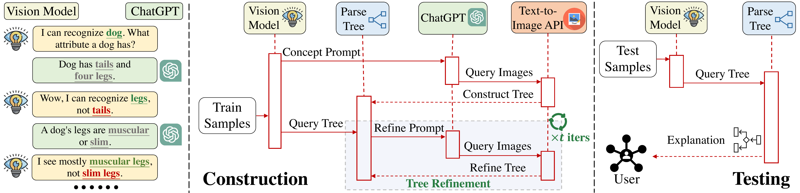
<figcaption><strong>General workflow of <code>LVX</code>.</strong> <strong>(Left)</strong> A toy example that LLM interacts with vision model to examine its capability. (Mid) It combines vision, language, and visual-language APIs to create a parse tree for each visual model. <strong>(Right)</strong> In testing, embeddings navigate this tree, and the traversed path provides a personalized explanation for the model’s prediction.</figcaption>
</figure>

In this study, we attempt to explain AI decision in a human-understandable manner, for example, tree-structured language. We call this task *visual explanatory tree parsing*. To implement this, we present a systematic approach, Language Model as Visual Explainer (`LVX`), for interpreting vision models structured natural language, without model training.

A key challenge is that vision models, trained solely on pixel data, inherently lack comprehension of textual concepts within an image. For example, if a model labels an image as a “*dog*”, it is unclear whether it truly recognizes the features like the *wet nose* or *floppy ear*, or if it is merely making ungrounded guesses. To address this challenge, we link the vision model with a powerful external knowledge provider, to establish connections between textual attributes and image patterns. Specifically, we leverage large language models (LLM) such as ChatGPT and GPT4 as our knowledge providers, combining them with the visual recognition system. Figure <a href="#fig:pipeline" data-reference-type="ref" data-reference="fig:pipeline">1</a> (Left) describes a toy case, where the LLM is interacts with the vision model to explore its capability boundaries. By doing so, we gain insights into the what visual attributes can be recognized by the model.

The pipeline of our approach is illustrated in Figure <a href="#fig:pipeline" data-reference-type="ref" data-reference="fig:pipeline">1</a>, which comprises two main stages, the *construction phase* and the *test phase*.

In the *construction phase*, our goal is to create an attribute tree for each category, partitioning the feature space of a visual model via LLM-defined hierarchy. We begin by extracting commonsense knowledge about each category and its visual attributes from LLMs using in-context prompting `\cite{liu2021makes}`{=latex}. This information is naturally organized as a tree for better organization and clarity. Utilizing a text-to-image API, we gather corresponding images for each tree node. These images are subsequently inputted into the vision model to extract prototype embeddings, which are then mapped to the tree.

Once created, the tree is dynamically adjusted, based on the properties of the training set. Specifically, each embedding of the training sample is extracted by the vision model.Such embedding then navigates the parse tree based on their proximity to prototype embeddings. Infrequently visited nodes, representing attributes less recognizable, are pruned. Conversely, nodes often visited by the model indicate successful concept recognition. Those nodes are growned, as the LLM introduces more detailed concepts. Consequently, `LVX` yields human-understandable attribute trees that mirror the model’s understanding of each concept.

In the *test phase*, we input a test sample into the model to extract its feature. The feature is then routed in the parse tree, by finding its nearest neighbors. The root-to-leaf path serves as a sample-specific rationale for the model, offering an explanation of how the model arrived at its decision.

To assess our method, we compiled new annotations and developed novel metrics. Subsequently, we test `LVX` on these self-collected real-world datasets to access its effectiveness.

Beyond interpretation, our study proposes to calibrate the vision model by utilizing the generated explanation results. The utilization of tree-structured explanations plays a key role in enhancing the model’s performance, thereby facilitating more reliable and informed decision-making processes. Experimental results confirm the effectiveness of our method over existing interpretability techniques, highlighting its potential for advancing explainable AI.

To summarize, our main contributions are:

- The paper introduces a novel task, *visual explanatory tree parsing*, that interprets vision models using tree-structured language explanations.

- We introduce the Language Model as Visual Explainer (`LVX`) to carry out this task, without model training. The proposed `LVX` is the first dedicated approach to leverage LLM to explain the visual recognition system.

- Our study proposes utilizing the generated explanations to calibrate the vision model, leading to enhanced performance and improved reliability for decision-making.

- We introduce new benchmarks and metrics for a concise evaluation of the `LVX` method. These tools assess its plausibility, faithfulness, and stability in real-world datasets.

# Problem Definition

We first define our specialized task, called **visual explanatory tree parsing**, which seeks to unravel the decision-making process of a vision model through a tree.

<figure id="fig:task">

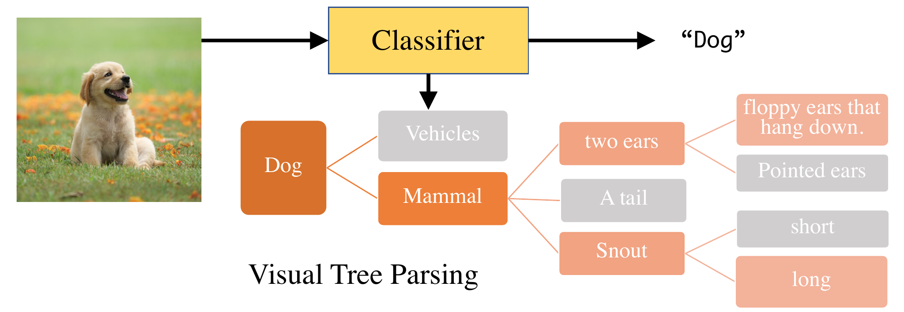

<figcaption>The illustration of visual explanatory tree parsing. Each input sample is interpreted as a parse tree to represent the model’s logical process.</figcaption>
</figure>

Let us consider the trained vision model \\(f\\), defined as a function \\(f\colon \mathcal{X} \to \mathcal{Y}\\), where \\(\mathcal{X}\\) represents the input image space and \\(\mathcal{Y}\\) denotes the output label space. In this study, our focus lies on the classification task, where \\(f=g\circ h\\) is decomposed into a feature extractor \\(g\\) and a linear classification head \\(h\\). The output space is \\(\mathcal{Y}\in \mathbb{R}^{n}\\), where \\(n\\) signifies the number of classes. The model is trained on a labeled training set \\(D_{tr} = \{\mathbf{x}_j, y_j\}_{j=1}^M\\), and would be evaluated a test set \\(D_{ts} = \{\mathbf{x}_j\}_{j=1}^L\\).

The ultimate objective of our problem is to generate an explanation \\(T\\) for each model-input pair \\((f, \mathbf{x})\\) on the test set, illuminating the reasoning behind the model’s prediction \\(\hat{y} = f(\mathbf{x})\\). This unique explanation manifests as a tree of attributes, denoted as \\(T = (V, E)\\), comprising a set of \\(N_v\\) nodes \\(V=\{v_i\}_{i=1}^{N_v}\\) and \\(N_e\\) edges \\(E=\{e_i\}_{i=1}^{N_e}\\). The root of the tree is the predicted category, \\(\hat{y}\\), while each node \\(v_i\\) encapsulates a specific attribute description of the object. These attributes are meticulously organized, progressing from the holistic to the granular, and from the general to the specific. Figure <a href="#fig:task" data-reference-type="ref" data-reference="fig:task">2</a> provides an example of the parse tree.

Unlike existing approaches `\cite{radford2021learning,NEURIPS2022_960a172b}`{=latex} that explaining visual-language models `\cite{menon2022visual,mao2022doubly,pellegrini2023xplainer,yang2023language,zhang2023diagnosing}`{=latex}, we address the more challenging scenario, on explaining vision models trained solely on pixel data. While some models can dissect and explain hierarchical clustering of feature embeddings `\cite{singh2018hierarchical,wan2020nbdt}`{=latex}, they lack the ability to associate each node with a textual attribute. It is important to note that our explanations primarily focus on examining the properties of the established network, going beyond training vision model or visual-language model `\cite{alayrac2022flamingo,liu2024visual}`{=latex} for reasoning hierarchy `\cite{wordnet}`{=latex} and attributes `\cite{isola2015discovering}`{=latex} from the image. In other words, visual-language model, that tells the content in the image, can not explain the inner working inside another model. Notably, our approach achieves this objective *without supervision* and in *open-vocabulary* manner, without predefined explanations for model training.

# Language Model as Visual Explainer

This section dives deeper into the details of `LVX`. At the heart of our approach is the interaction between the LLM and the vision model to construct the parsing tree. Subsequently, we establish a rule to route through these trees, enabling the creation of coherent text explanations.

## Tree Construction via LLM [sec:tree_construct]

Before constructing our trees, let’s take a moment to reflect how humans do this task. Typically, we already hold a hierarchy of concepts in our minds. When presented with visual stimuli, we instinctively compare the data to our existing knowledge tree, confirming the presence of distinct traits. We recognize familiar traits and, for unfamiliar ones, we expand our knowledge base. For example, when we think of a dog, we typically know that it has a *furry tail*. Upon observing a dog, we naturally check for the visibility of its tail. If we encounter a *hairless tail*, previously unknown to us, we incorporate it into our knowledge base, ready to apply it to other dogs. This process is typically termed Predictive Coding Theory `\cite{clark2013whatever}`{=latex} in cognitive science.

<figure id="fig:prompt_llm">
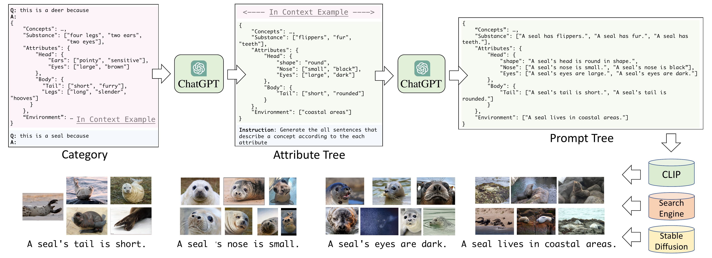
<figcaption>Crafting text-image pairs for visual concepts. Through in-context prompting, we extract knowledge from the LLM, yielding visual attributes for each category. These attributes guide the collection of text-image pairs that encapsulate the essence of each visual concept.</figcaption>
</figure>

Our `LVX` mirrors this methodology. We employ LLM as a “knowledge provider” to construct the initial conceptual tree. Subsequently, we navigate through the visual model’s feature space to assess the prevalence of each node. If a specific attribute is rarely observed, we remove the corresponding nodes from the tree. Conversely, if the model consistently recognizes an attribute, we enrich the tree by integrating more nuanced, next-level concepts. This iterative process ensures the refinement and adaptation of the conceptual tree within our pipeline, which gives rise to our `LVX`.

**Generating Textual Descriptions for Visual Concepts.** We leverage a large language model (LLM) as our “commonsense knowledge provider” `\cite{li2022systematic,zhou2020evaluating}`{=latex} to generate textual descriptions of visual attributes corresponding to each category. The LLM acts as an external database, providing a rich source of diverse visual concept descriptions. The process is illustrated in Figure <a href="#fig:prompt_llm" data-reference-type="ref" data-reference="fig:prompt_llm">3</a>.

Formally, assume we have a set of category names, denoted as \\(C = \{c_i\}_{i=1}^n\\), where \\(i\\) represents the class index. For each of these classes, we prompt an LLM \\(L\\) to produce visual attribute tree. We represent these attributes as \\(d_i = L(c_i, \mathcal{P})\\), where \\(d_i\\) is a nested json text containing textual descriptions associated with class \\(c_i\\). To help generate \\(d_i\\), we use example input-output pairs, \\(\mathcal{P}\\), as in-context prompts. The process unfolds in two stages:

- **Initial Attribute Generation**: We initially generate keywords that embody the attributes of each class. This prompt follows a predefined template that instructs the LLM to elaborate on the attributes of a visual object. The template is phrased as

  . The output json contains four primary nodes: `Concepts`, `Substances`, `Attributes`, and `Environments`. As such, the LLM is prompted to return the attributes of that concept. Note that the initial attributes tree may not accurately represent the model; refinements will be made in the refinement stage.

- **Description Composition**: Next, we guide the LLM to create descriptions based on these attributes. Again we showcase an in-context example and instruct the model to output

  .

Once the LLM generates the structured attributes \\(d_i\\), we parse them into an initial tree, represented as \\(T^{(0)}_i=(V^{(0)}_i,E^{(0)}_i)\\), using the key-value pairs of the json text. Those generated json tree is then utilized to query images corresponding to each factor.

**Visual Embeddings Tree from Retrieved Images.** In order to enable the vision model to understand attributes generated by the LLM, we employ a two-step approach. The primary step involves the conversion of textual descriptions, outputted by the LLM, into images. Then, these images are deployed to investigate the feature region that symbolizes specific attributes within the model.

The transition from linguistic elements to images is facilitated by the use of arbitrary text-to-image API. This instrumental API enables the generation of novel images or retrieval of existing images that bear strong relevance to the corresponding textual descriptions. An initial parse tree node, denoted by \\(v\\), containing a textual attribute, is inputted into the API to yield a corresponding set of \\(K\\) support images, represented as \\(\{\widetilde{\mathbf{x}}_i\}_{i=1}^K = \texttt{T2I}(v)\\). The value of \\(K\\) is confined to a moderately small range, typically between 5 to 30. The full information of the collected dataset will be introduced in Section <a href="#sec:exp" data-reference-type="ref" data-reference="sec:exp">4</a>.

Our research incorporates the use of search engines such as Bing, or text-to-image diffusion models like Stable-Diffusion `\cite{rombach2021highresolution}`{=latex}, to derive images that correspond accurately to the provided attributes.

<figure id="fig:refine">
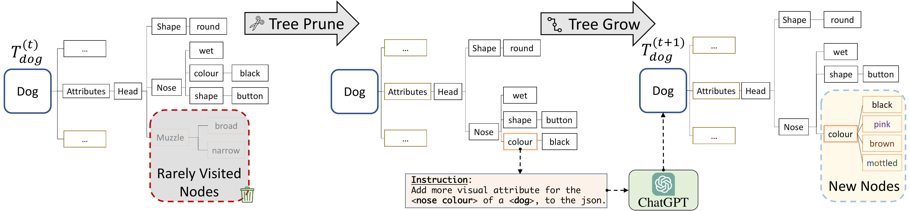
<figcaption>Tree refinement by traversing the embedding tree and querying the LLM model.</figcaption>
</figure>

Following this, the images are presented to the visual model to extract their respective embeddings, represented as \\(\mathbf{p}_i = g(\widetilde{\mathbf{x}}_i)\\). As such, each tree node contains a set of support visual features \\(P = \{\mathbf{p}_k\}_{k=1}^K\\). This procedure allows for the construction of an embedding tree, consisting of paired text and visual features. These pairs are arranged in a tree structure prescribed by the LLM. It is important to note that the collected images are not employed in training the model. Instead, they serve as a support set to assist the model in understanding and representing the disentangled attributes effectively. As such, the visual model uses these embeddings as a map to navigate through the vast feature space, carving out territories of attributes, and laying down the groundwork for further exploration and explanation of a particular input.

**Tree Refinement Via Refine Prompt.** Upon construction, the parse tree structure is refined to better align with the model’s feature spaces. This stage, termed *Tree Refinement*, is achieved through passing training data as a query to traverse the tree. Nodes that are seldom visited indicate that the model infrequently recognizes their associated attributes. Therefore, we propose a pruning mechanism that selectively eliminates these attributes, streamlining the tree structure. For nodes that frequently appear during the traversal, we further grow the tree by introducing additional or more detailed attributes, enriching the overall context and depth of the tree. The procedure is demonstrated in Figure <a href="#fig:refine" data-reference-type="ref" data-reference="fig:refine">4</a>.

Initially, we treat the original training samples, denoted as \\((\mathbf{x}_j,y_j) \in D_{tr}\\), as our query set. Each sample is passed to the visual model to extract a feature, represented as \\(\mathbf{q}_j = g(\mathbf{x}_j)\\).

Next, the extracted feature traverses the \\(y_j\\)-corresponding tree. Its aim is to locate the closest semantic neighbors among the tree nodes. We define a distance metric between \\(\mathbf{q}_j\\) to support set \\(P\\) as the point-to-set distance \\(D(\mathbf{q}_j, P)\\). This metric represents the greatest lower bound of the set of distances from \\(\mathbf{q}_j\\) to prototypes in \\(P\\). It is resilient to outliers and effectively suppresses non-maximum nodes. \\[\begin{aligned}
D(\mathbf{q}_j, P) = \inf\{d(\mathbf{q}_j,\mathbf{p})|\mathbf{p} \in P\}
\end{aligned}\\] In our paper, similar to `\cite{chen2019looks,rymarczyk2021protopshare}`{=latex}, we set \\(d(\mathbf{q},\mathbf{p}) = -\log(1+\frac{1}{||\mathbf{q}-\mathbf{p}||^2})\\)[^2]. It emphasizes close points while moderating the impact of larger distances. Following this, we employ a Depth-First Search (DFS) algorithm to locate the tree node closest to the query point \\(\mathbf{q}_j\\). After finding this node, each training point \\((\mathbf{x}_j,y_j)\\) is assigned to a specific node of the tree. Subsequently, we count the number of samples assigned to a particular node \\(v^*\\), using the following formula: \\[\begin{aligned}
C_{v^*} = \sum_{j=1}^{M}\mathbbm{1}\{v^* = \operatorname*{argmin}_{v \in V_{y_j}^{(0)}} D(\mathbf{q}_j, P_v)\}
\end{aligned}\\] In this formula, \\(\mathbbm{1}\\) is the indicator function and \\(P_v\\) denotes the support feature for node \\(v\\). Following this, we rank each node based on the sample counter, which results in two operations to update the tree architecture \\(T_i^{(t+1)} = \texttt{Grow}(\texttt{Prune}(T_i^{(t)}))\\), where \\(t\\) stands as the iteration number

- **Tree Pruning**. Nodes with the least visits are pruned from the tree, along with their child nodes.

- **Tree Growing**. For the top-ranked node, we construct a new inquiry to prompt the LLM to generate attributes with finer granularity. The inquiry is constructed with an instruction template

  .

- **Common Node Discrimination**. In cases where different categories share common nodes (e.g. “`human`” and “`dog`” both have “`ear`”), we execute a targeted growth step aimed at distinguishing between these shared elements. To achieve this differentiation, we utilize a contrasting question posed to the LLM

  .

The revised concept tree generated by the LLM provides a comprehensive and detailed representation of the visual attribute. To refine the attribute further, we employ an iterative procedure that involves image retrieval and the extraction of visual embeddings, as illustrated in Figure <a href="#fig:pipeline" data-reference-type="ref" data-reference="fig:pipeline">1</a>. This iterative process enhances the parse tree by incorporating new elements. As each new element is introduced, the attribute areas within the feature space become increasingly refined, leading to improved interpretability. In our experiment, we performed five rounds of tree refinement.

## Routing in the Tree

Once the tree is established, the model predicts the class of a new test sample \\(\mathbf{x}'\\) and provides an explanation for this decision by finding the top-k nearest neighbor nodes.

Specifically, the model predicts the category \\(\hat{y}\\) for the test instance \\(\mathbf{x}'\\) as \\(\hat{y} = f(\mathbf{x}')\\). The extracted image feature \\(\mathbf{q}'\\) corresponding to \\(\mathbf{x}'\\) is routed through the tree. Starting from the root, the tree is traversed to select the top-k nearest neighbor nodes \\(\{v_i\}_{i=1}^k\\) based on the smallest \\(D(\mathbf{q}', P_{v_i})\\) values, representing the highest semantic similarity between \\(\mathbf{q}'\\) and the visual features in the tree’s nodes. The paths from the root to the selected nodes are merged to construct the explanatory tree \\(T\\) for the model’s prediction.

This parse tree structure reveals the sequence of visual attributes that influenced the model’s classification of \\(\mathbf{x}'\\) as \\(\hat{y}\\). It facilitates the creation of precise, tree-structured justifications for these predictions. Importantly, the routing process involves only a few feature similarity computations per node and does not require queries to the large language model, resulting in exceptionally fast computation.

## Calibrating through Explaining [sec:calibrate]

The created parse tree offers a two-fold advantage. Not only does it illustrates the logic of a specific prediction, but it also serves as a by-product to refine the model’s predictions by introducing hierarchical regularization for learned representation. Our goal is to use the parse tree as pseudo-labels, embedding this hierarchical knowledge into the model.

To operationalize this, we employ a hierarchical multi-label contrastive loss (HiMulCon) `\cite{zhang2022use}`{=latex}, denoted as \\(\mathcal{L}_{HMC}\\), to fine-tune the pre-trained neural network. This approach enhances the model by infusing structured explanations into the learning process, thus enriching the representation.

Specifically, we apply the `LVX` on all training samples. The explanatory path \\(\hat{T}_j\\) provides a hierarchical annotation for each training sample \\(\mathbf{x}_j\\). The model is trained with both the cross-entropy loss \\(\mathcal{L}_{CE}\\) and \\(\mathcal{L}_{HMC}\\) as follows: \\[\begin{aligned}
\min_{} \sum_{j=1}^{M} \mathcal{L}_{CE}\Big(f(\mathbf{x}_j),y_j\Big) + \lambda\mathcal{L}_{HMC}\Big(g(\mathbf{x}_j),\hat{T}_j\Big) \label{eq:contrast}
\end{aligned}\\] Here, \\(\lambda\\) is a weighting coefficient. The explanation \\(\hat{T}_j\\) is updated every 10 training epochs to ensure its alignment with the network’s evolving parameters and learning progress. Notably, the support set isn’t used in model training, maintaining a fair comparison with the baselines.

# Experiment [sec:exp]

This section offers an in-depth exploration of our evaluation process for the proposed `LVX` framework and explains how it can be utilized to gain insights into the behavior of a trained visual recognition model, potentially leading to performance and transparency improvements.

| **Dataset Name** | **No. Class** | **No. Attr** | **No. Images** | **Avg. Tree Depth** | **Rationales** | **Hierarchy** | **Validation Only** |
|:---|---:|---:|---:|---:|:--:|:--:|:--:|
| AWA2 `\cite{xian2018zero}`{=latex} | 50 | 85 | 37,322 | N/A |  |  |  |
| CUB `\cite{WahCUB_200_2011}`{=latex} | 200 | N/A | 11,788 | N/A |  |  |  |
| BDD-X `\cite{kim2018textual}`{=latex} | 906 | 1,668 | 26,000\* | N/A |  |  |  |
| VAW `\cite{Pham_2021_CVPR}`{=latex} | N/A | 650 | 72,274 | N/A |  |  |  |
| COCO Attr `\cite{patterson2016coco}`{=latex} | 29 | 196 | 180,000 | N/A |  |  |  |
| DR-CIFAR-10 `\cite{mao2022doubly}`{=latex} | 10 | 63 | 2,201 | N/A |  |  |  |
| DR-CIFAR-100 `\cite{mao2022doubly}`{=latex} | 100 | 540 | 18,318 | N/A |  |  |  |
| DR-ImageNet `\cite{mao2022doubly}`{=latex} | 1,000 | 5,810 | 271,016 | N/A |  |  |  |
| <u>H-CIFAR-10</u> | 10 | 289 | 10,000 | 4.3 |  |  |  |
| <u>H-CIFAR-100</u> | 100 | 2,359 | 10,000 | 4.5 |  |  |  |
| <u>H-ImageNet</u> | 1,000 | 26,928 | 50,000 | 4.8 |  |  |  |

Data annotation statistics. The \\(*\\) indicates the number of video frames. We compare the statistics of category, attributes, image and tree depth across different explanatory datasets. Our dataset stands out as the first hierarchical dataset, offering a wide range of attributes.

## Experimental Setup

**Data Annotation and Collection.** To assess explanation plausibility, data must include human annotations. Currently, no large-scale vision dataset with hierarchical annotations is available to facilitate reasoning for visual predictions. To address this, we developed annotations for three recognized benchmarks: CIFAR10, CIFAR100 `\cite{Krizhevsky09learningmultiple}`{=latex}, and ImageNet `\cite{russakovsky2015imagenet}`{=latex}, termed as `H-CIFAR10`, `H-CIFAR100`, and `H-ImageNet`. These annotations, detailed in Table <a href="#tab:dataset-stats" data-reference-type="ref" data-reference="tab:dataset-stats">4</a>, serve as ground truth for model evaluation, highlighting our dataset’s unique support for hierarchical attributes and diverse visual concepts. Note that, we evaluate on hierarchical datasets only, as our method is specifically designed for structured explanations.

As an additional outcome of our framework, we have gathered three support sets to facilitate model explanation. In these datasets, each attribute generated by the LLM corresponds to a collection of images that showcase the specified visual concepts. These images are either retrieved from Bing search engine [^3] using attributes as queries or are generated using Stable-diffusion. We subsequently filter the mismatched pairs with the CLIP model, with the threshold of 0.5. Due to the page limit, extensive details on data collection, false positive removal, limitations, and additional evaluation of user study and on medical data, such as X-ray diagnoses, are available in the supplementary material.

<figure id="fig:explain_performance">
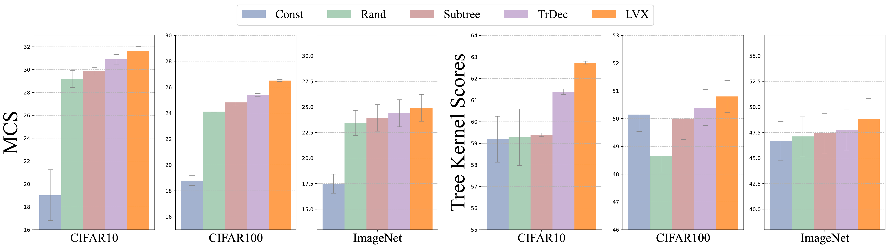
<figcaption><em>Plausibility</em> comparison on three visual tree parsing benchmarks. We plot the mean±std across all networks architectures. For both scores, higher values indicate better performance.</figcaption>
</figure>

**Evaluation Metrics.** In this paper, we evaluate the quality of our explanation from three perspectives: *Plausibility*, *Faithfulness* and *Stability*.

- **Plausibility** measures how reasonable the machine explanation is compared to the human explanation. We measure this by the graph distance between the predicted and ground-truth trees, using two metrics: Maximum Common Subgraph (MCS) `\cite{raymond2002maximum, kann1992approximability}`{=latex}, and Tree Kernels (TK) `\cite{sun2011tree}`{=latex}. We calculate their normalized scores respectively. Specifically, given a predicted tree \\(T_{pred}\\) and the ground-truth \\(T_{gt}\\), the MCS score is computed as \\(\frac{|MCS| \times 100}{\sqrt{|T_{pred}||T_{gt}|}}\\), and the TK score is computed as \\(\frac{TK(T_{pred}, T_{gt}) \times 100}{\sqrt{TK(T_{pred}, T_{pred})TK(T_{gt}, T_{gt})}}\\). Here, \\(|\cdot|\\) represents the number of nodes in a tree, and \\(TK(\cdot, \cdot)\\) denotes the unnormalized TK score. We report the average score across all validation samples.

- **Faithfulness** states that the explanations should reflect the inner working of the model. We introduce Model-induced Sample-Concept Distance (MSCD) to evaluate this, calculated as the average of point-to-set distances \\(\frac{1}{N_v}\sum_{v\in V} D(\mathbf{q}_j, P_v)\\) between all test samples and tree nodes, reflecting the alignment between generated explanation and model’s internal logic. The concept is simple: if the explanation tree aligns with the model’s internal representation, the MSCD is minimized, indicating high faithfulness.

- **Stability** evaluates the resilience of the explanation graph to minor input variation, expecting minimal variations in explanations. The MCS/TK metrics are used to assess stability by comparing explanations derived from clean and slightly modified inputs. We include 3 perturbations, including Gaussian additive noise with \\(\sigma\in\{0.05,0.1\}\\) and Cutout `\cite{devries2017improved}`{=latex} augmentation.

**Baselines.** We construct three baselines for comparisons: `Constant`, using the full category template tree; `Random`, which selects a subtree randomly from the template; and `Subtree`, choosing the most common subtree in the test set for explanations. Additionally, we consider `TrDec` Baseline `\cite{wang2018tree}`{=latex}, a strategy utilizing a tree-topology RNN decoder on top of image encoder. Given the absence of hierarchical annotations, the CLIP model verifies nodes in the template trees, serving as pseudo-labels for training. We only update the decoder parameters for interpretation purposes. These models provide a basic comparison for the performance of `LVX`. More details are in the appendix.

For classification performance, we compare `LVX`-calibrated model with neural-tree based solutions, including a Decision Tree (DT) trained on the neural network’s final layer, DNDF `\cite{kontschieder2015deep}`{=latex}, and NBDT `\cite{wan2020nbdt}`{=latex}.

lccccccccc & & & & &  
(lr)3-4 (lr)5-6 (lr)7-8 (lr)9-10 & & MCS & TK & MCS & TK & MCS & TK & MCS & TK  
`TrDec` & RN-18 & 100 & 100 & 65.3 & 86.4 & 56.2 & 82.5 & 65.4 & 86.0  
`LVX` & RN-18 & 100 & 100 & **69.7** & **90.8** & **62.1** & **86.5** & **68.1** & **88.3**  
`TrDec` & RN-50 & 100 & 100 & 68.3 & 88.5 & 59.3 & 84.2 & 66.2 & 86.9  
`LVX` & RN-50 & 100 & 100 & **71.9** & **92.1** & **65.6** & **88.3** & **69.3** & **90.1**  

lccaccacca & & &  
(lr)2-4 (lr)5-7 (lr)8-10 & TrDec & SubTree & LVX & TrDec & SubTree & LVX & TrDec & SubTree & LVX  
RN-18 & -0.224 & -0.393 & **-0.971** & -0.246 & -0.446 & **-0.574** & -0.298 & -0.548 & **-0.730**  
RN-50 & -0.236 & -0.430 & **-1.329** & -0.256 & -0.500 & **-1.170** & -0.317 & -0.588 & **-1.186**  
ViT-S 16 & -0.244 & -0.467 & **-1.677** & -0.266 & -0.527 & **-1.073** & -0.330 & -0.626 & **-1.792**  

**Models to be Explained.** Our experiments cover a wide range of neural networks, including various convolutional neural networks (CNN) and transformers. These models consist of VGG `\cite{simonyan2014very}`{=latex}, ResNet `\cite{he2016deep}`{=latex}, DenseNet `\cite{huang2017densely}`{=latex}, GoogLeNet `\cite{szegedy2015going}`{=latex}, Inceptionv3 `\cite{szegedy2016rethinking}`{=latex}, MobileNet-v2 `\cite{sandler2018mobilenetv2}`{=latex}, and Vision Transformer (ViT) `\cite{dosovitskiy2020image}`{=latex}. In total, we utilize 12 networks for CIFAR-10, 11 networks for CIFAR-100, and 8 networks for ImageNet. For each model, we perform the tree refinement for 5 iterations.

**Calibration Model Training.** As described in Section <a href="#sec:calibrate" data-reference-type="ref" data-reference="sec:calibrate">3.3</a>, we finetune the pre-trained neural networks with the hierarchical contrastive loss based on the explanatory results. The model is optimized with SGD for 50 epochs on the training sample, with an initial learning rate in \\(\{0.001, 0.01, 0.03\}\\) and a momentum term of 0.9. The weighting factor is set to 0.1. We compare the calibrated models with the original ones in terms of accuracy and explanation faithfulness.

## LLM helps Visual Interprebility

**Plausibility Results.** We evaluated `LVX` against human annotations across three datasets, using different architectures, and calculating MCS and TK scores. The results, shown in Figure <a href="#fig:explain_performance" data-reference-type="ref" data-reference="fig:explain_performance">5</a>, reveal `LVX` outperforms baselines, providing superior explanations. Notably, `TrDec`, even when trained on CLIP induced labels, fails to generate valid attributes in deeper tree layers—a prevalent issue in long sequence and structure generation tasks. Meanwhile, `SubTree` lacks adaptability in its explanations, leading to lower scores. More insights are mentioned in the appendix.

**Faithfulness Results.** We present the MSCD scores for ResNet-18(RN-18), ResNet-50(RN-50), and ViT-S, contrasting them with `SubTree` and `TrDec` in Table <a href="#tab:faithfulness" data-reference-type="ref" data-reference="tab:faithfulness">[tab:faithfulness]</a>. Thanks to the incorporation of tree refinement that explicitly minimizes MSCD, our `LVX` method consistently surpasses benchmarks, demonstrating lowest MSCD values, indicating its enhanced alignment with model reasoning.

**Stability Results.** The stability of our model against minor input perturbations on the CIFAR-10 dataset is showcased in Table <a href="#tab:stability" data-reference-type="ref" data-reference="tab:stability">[tab:stability]</a>, where MCS/TK are computed. The “Clean” serves as the oracle baseline. Our method, demonstrating robustness to input variations, retains consistent explanation results (MCS\\(>\\)`<!-- -->`{=html}60, TK\\(>\\)`<!-- -->`{=html}85). In contrast, `TrDec`, dependent on an RNN-parameterized decoder, exhibits higher sensitivity to feature variations.

<figure id="fig:exp_sample">
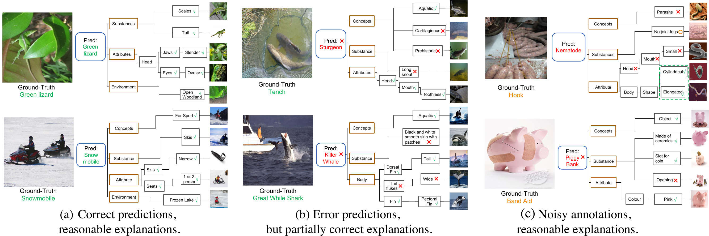
<figcaption>Explanation visualization for ViT-B on ImageNet-1K. and means that the node is aligned or misaligned with the image. Zoom in for better view.</figcaption>
</figure>

**Model and Data Diagnosis with Explanation.** We visualize the sample explanatory parse tree on ImageNet validation set induced by ViT-B in Figure <a href="#fig:exp_sample" data-reference-type="ref" data-reference="fig:exp_sample">6</a>. The explanations fall into three categories: (1) correct predictions with explanations, (2) incorrect predictions with explanations, and (3) noisy label predictions with explanations. We’ve also displayed the 5 nearest neighbor node for each case.

What’s remarkable about `LVX` is that, even when the model’s prediction is wrong, it can identify correct attributes. For instance, in a case where a “`white shark`” was misidentified as a “`killer whale`” (b-Row 2), `LVX` correctly identified “`fins`”, a shared attribute of both species. Moreover, the misrecognition of the attribute “`wide tail flukes`” indicates a potential error in the model, that could be later addressed to enhance its performance.

Surprisingly, `LVX` is able to identify certain noisy labels in the data, as shown in c-Row 2. In such cases, even experienced human observers might struggle to decide whether a “`pig bank with band`” should be classified “`piggy bank`” or “`band aid`”. It again underscores the superior capabilities of our `LVX` system in diagnosing the errors beyond model, but also within the data itself.

| Method | Network | Expl. | CIFAR10 | CIFAR100 | ImageNet |
|:---|:---|:--:|:--:|:--:|:--:|
| NN | ResNet18 |  | 94.97% | 75.92% | 69.76% |
| DT | ResNet18 |  | 93.97% | 64.45% | 63.45% |
| DNDF | ResNet18 |  | 94.32% | 67.18% | N/A |
| NBDT | ResNet18 |  | 94.82% | 77.09% | 65.27% |
| `LVX` (Ours) | ResNet18 |  | **95.14%** | **77.33%** | **70.28%** |

Performance and interpretability comparison with/without model calibration on CIFAR-100. Higher MCS means better.

Performance comparison of neural decision tree-based methods. *Expl.* stands for whether the prediction is explainable. 

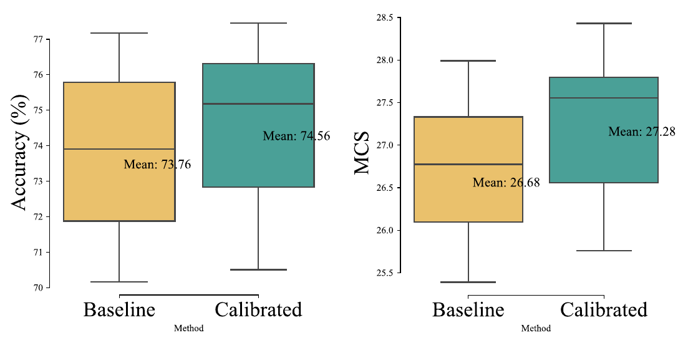

**Calibration Enhances Interpretability and Performance.** Our approach involves fine-tuning a pre-trained model with the loss function outlined in Section <a href="#sec:calibrate" data-reference-type="ref" data-reference="sec:calibrate">3.3</a>, using parsed explanatory trees to improve model performance. Table <a href="#tab:calibrate_performance" data-reference-type="ref" data-reference="tab:calibrate_performance">[tab:calibrate_performance]</a> compares the classification performance of our model with that of other neural tree methods. Our model clearly outperforms the rest.

Neural tree models often face challenges in balancing interpretability with performance. In contrast, `LVX` achieves strong performance without relying on a strict decision tree. Instead, decisions are handled by the neural network, with concepts guided by the LLM through Equation <a href="#eq:contrast" data-reference-type="ref" data-reference="eq:contrast">[eq:contrast]</a>. This approach enhances the model’s ability to disentangle visual concepts while preserving high performance.

In addition, we compared the quality of the generated parsed tree with or without calibration, in Figure <a href="#fig:calibrate" data-reference-type="ref" data-reference="fig:calibrate">2</a>. The calibration process not only improved model performance, but also led to more precise tree predictions, indicating enhanced interpretability. We also test the calibrated model on OOD evaluations in Appendix, where we observe notable improvements.

# Ablation Study and Analysis

In this section, we present an ablation study on the refinement stage of `LVX`. We also apply the method to different neural networks to observe variations in model’s behavior.

**Ablation 1: No Refinement.** To study the impact of refinement stage, we present a baseline called *w/o Refine*. In this setup, the initial tree generated by LLMs is kept fixed. We evaluate the method using the MSCD for faithfulness and MCS for plausibility on the CIFAR-10 and CIFAR-100 datasets.

<table>
<caption>Performance comparison on CIFAR-10 and CIFAR-100 with and without refinement. Higher MCS and lower MSCD indicate better performance.</caption>
<thead>
<tr>
<th style="text-align: left;">Network</th>
<th style="text-align: left;">Method</th>
<th colspan="2" style="text-align: center;">CIFAR-10</th>
<th colspan="2" style="text-align: center;">CIFAR-100</th>
</tr>
</thead>
<tbody>
<tr>
<td style="text-align: left;">3-6</td>
<td style="text-align: left;"></td>
<td style="text-align: center;">MCS</td>
<td style="text-align: center;">MSCD</td>
<td style="text-align: center;">MCS</td>
<td style="text-align: center;">MSCD</td>
</tr>
<tr>
<td rowspan="2" style="text-align: left;">ResNet-18</td>
<td style="text-align: left;">w/o Refine</td>
<td style="text-align: center;">27.73</td>
<td style="text-align: center;">-0.645</td>
<td style="text-align: center;">23.18</td>
<td style="text-align: center;">-0.432</td>
</tr>
<tr>
<td style="text-align: left;"><code>LVX</code></td>
<td style="text-align: center;"><strong>30.24</strong></td>
<td style="text-align: center;"><strong>-0.971</strong></td>
<td style="text-align: center;"><strong>25.10</strong></td>
<td style="text-align: center;"><strong>-0.574</strong></td>
</tr>
<tr>
<td rowspan="2" style="text-align: left;">ResNet-50</td>
<td style="text-align: left;">w/o Refine</td>
<td style="text-align: center;">28.09</td>
<td style="text-align: center;">-0.822</td>
<td style="text-align: center;">23.44</td>
<td style="text-align: center;">-0.698</td>
</tr>
<tr>
<td style="text-align: left;"><code>LVX</code></td>
<td style="text-align: center;"><strong>31.09</strong></td>
<td style="text-align: center;"><strong>-1.329</strong></td>
<td style="text-align: center;"><strong>26.90</strong></td>
<td style="text-align: center;"><strong>-1.170</strong></td>
</tr>
</tbody>
</table>

The results show in Table <a href="#tab:norefine" data-reference-type="ref" data-reference="tab:norefine">3</a> that incorporating image model feedback indeed improves tree alignment with the classifier’s internal representation, as reflected in higher MCS scores. The refined trees also better match human-annotations.

**Ablation 2: Refinement Criteria.** In our original method, tree refinement is based on feature similarity to the training set. To explore an alternative, we use *average activation magnitude* on generated data as the criterion for concept familiarity. Concepts with activation magnitudes \\(\leq \eta\\) are pruned. This method, referred to as *ActMag*, is evaluated on CIFAR-10. We report the MCS, MSCD for performance, and average tree depth as an indicator of tree complexity.

Table <a href="#tab:criteria" data-reference-type="ref" data-reference="tab:criteria">[tab:criteria]</a> shows that feature similarity achieves better results than *ActMag*. Specifically, setting a threshold is challenging for *ActMag*, leading shallow trees (\\(\eta=0.3\\)) or too deep ones (\\(\eta=0.01\\)).

laacccccccccc & & & &  
(lr)2-4 (lr)5-7 (lr)8-10(lr)11-13 & MCS & MSCD & Depth & MCS & MSCD & Depth& MCS & MSCD & Depth & MCS & MSCD & Depth  
ResNet-50 & **31.1** & **-1.3** & 4.2 & 23.4 & -0.3 & 6.0 & 26.9 & -0.8 & 3.7 & 25.3 & -0.5 & 1.4  
ViT-S & **31.9** & **-1.7** & 4.3 & 24.2 & -0.4 & 6.2 & 27.4 & -0.9 & 3.3 & 26.1 & -0.6 & 1.8  

**Analysis: CNN vs. Transformer.** We use our `LVX` to compare CNN and Transformer models and identify which concepts they miss. We compared ConvNeXt-T (CNN) and DeiT-B (Transformer) on 26,928 concepts we collected on ImageNet, from sub-categories of *Concepts*, *Substances*, *Attributes*, and *Environments*. We measured accuracy across 4 sub-categories and tree depths.

Results show that ConvNeXt-T is better at local patterns (Attributes, Substances), while DeiT-B perform better on Environments which needs global semantics. Additionally, DeiT-B is more accurate at shallow depths, whereas ConvNeXt-T performs better at deeper levels. These findings aligns with earlier research showing that CNN are biased towards textures over shape `\cite{geirhos2018imagenettrained,yang2022deep}`{=latex}.

# Related Work

**Neural Tree.** Neural Trees (NTs) intend to harmonize the performance of Neural Networks (NNs) and interpretability of Decision Trees (DTs) `\cite{craven1995extracting,frosst2017distilling,sato2001rule,zilke2016deepred,chen2021self}`{=latex} within a unified model. They evolved from mimicking NNs with DTs `\cite{craven1995extracting,frosst2017distilling,sato2001rule,zilke2016deepred,chen2021self}`{=latex} to becoming inherently interpretable tree-structured networks, adapting their structure via gradient descent `\cite{stromberg1991neural,zhao2001evolutionary,jordan1994hierarchical,yang2018deep,tanno2019adaptive,kontschieder2015deep}`{=latex}. Neural-Backed Decision Trees (NBDTs) `\cite{wan2020nbdt}`{=latex} use a trained NN as a feature extractor, replacing its final layer with a decision tree. Our model builds on these advances to create a hierarchical tree from a pre-trained NN and provides *post-hoc* explanations without additional training, which increases interpretability and potentially enhances performance.

**Prototype-based Explainable Model.** Prototype models use representative training data points to symbolize classes or outcomes `\cite{cover1967nearest,huang2002prototype,kohonen1995learning}`{=latex}. Revived in deep learning and few-shot learning `\cite{snell2017prototypical,xu2020attribute}`{=latex}, they justify decisions by comparing new instances to key examples `\cite{chen2019looks,yeh2018representer,li2018deep}`{=latex}. Recent work has developed this approach through hierarchical and local prototypes `\cite{nauta2021neural,keswani2022proto2proto,taesiri2022visual}`{=latex}. However, the prototypes serve as an indirect explanation for model’s prediction, necessitating further human justification. Our `LVX` addresses this by assigning semantic roles to prototypes through LLM, turning them from simple similarity points to data points with clear definitions, thereby enhancing explainability.

**Composing Foundation Models.** Model composition involves merging machine learning models to address tasks, often using modular models for sub-tasks `\cite{andreas2016neural,hu2017learning,andreas2016learning,yang2022factorizing}`{=latex}, restructured by a symbolic executor `\cite{yi2018neural}`{=latex}. Recently, Language Learning Models (LLMs) have been used as central controllers, guiding the logic of existing models `\cite{shen2023hugginggpt,gupta2022visual,yang2023mm,liang2023taskmatrix}`{=latex} or APIs `\cite{schick2023toolformer}`{=latex}, with language as a universal interface `\cite{zeng2022socratic}`{=latex}. However, composing language model with non-language ones lacks a unified interface for bilateral communication. In this study, we propose the use of a text-to-image API as a medium to enable the language model to share its knowledge with the visual task. This allows the vision model to benefit from the linguistic context and knowledge hierarchy, thereby enhancing its transparency.

# Conclusion

In this study, we introduced `LVX`, an approach for interpreting vision models using tree-structured language explanations without hierarchical annotations. `LVX` leverages large language models to connect visual attributes with image features, generating comprehensive explanations. We refined attribute parse trees based on the model’s recognition capabilities, creating human-understandable descriptions. Test samples were routed through the parse tree to generate sample-specific rationales. `LVX` demonstrated effectiveness in interpreting vision models, offering potential for model calibration. Our contributions include proposing `LVX` as the first approach to leverage language models for explaining the visual recognition system. We hope this study potentially advances interpretable AI and deepens our understanding of neural networks.

# References [references]

Samira Abnar and Willem Zuidema Quantifying attention flow in transformers In Dan Jurafsky, Joyce Chai, Natalie Schluter, and Joel Tetreault, editors, *Proceedings of the 58th Annual Meeting of the Association for Computational Linguistics*, pages 4190–4197, Online, July 2020. Association for Computational Linguistics. **Abstract:** In the Transformer model, “self-attention” combines information from attended embeddings into the representation of the focal embedding in the next layer. Thus, across layers of the Transformer, information originating from different tokens gets increasingly mixed. This makes attention weights unreliable as explanations probes. In this paper, we consider the problem of quantifying this flow of information through self-attention. We propose two methods for approximating the attention to input tokens given attention weights, attention rollout and attention flow, as post hoc methods when we use attention weights as the relative relevance of the input tokens. We show that these methods give complementary views on the flow of information, and compared to raw attention, both yield higher correlations with importance scores of input tokens obtained using an ablation method and input gradients. (@abnar-zuidema-2020-quantifying)

Jean-Baptiste Alayrac, Jeff Donahue, Pauline Luc, Antoine Miech, Iain Barr, Yana Hasson, Karel Lenc, Arthur Mensch, Katherine Millican, Malcolm Reynolds, et al Flamingo: a visual language model for few-shot learning , 35:23716–23736, 2022. **Abstract:** Building models that can be rapidly adapted to novel tasks using only a handful of annotated examples is an open challenge for multimodal machine learning research. We introduce Flamingo, a family of Visual Language Models (VLM) with this ability. We propose key architectural innovations to: (i) bridge powerful pretrained vision-only and language-only models, (ii) handle sequences of arbitrarily interleaved visual and textual data, and (iii) seamlessly ingest images or videos as inputs. Thanks to their flexibility, Flamingo models can be trained on large-scale multimodal web corpora containing arbitrarily interleaved text and images, which is key to endow them with in-context few-shot learning capabilities. We perform a thorough evaluation of our models, exploring and measuring their ability to rapidly adapt to a variety of image and video tasks. These include open-ended tasks such as visual question-answering, where the model is prompted with a question which it has to answer; captioning tasks, which evaluate the ability to describe a scene or an event; and close-ended tasks such as multiple-choice visual question-answering. For tasks lying anywhere on this spectrum, a single Flamingo model can achieve a new state of the art with few-shot learning, simply by prompting the model with task-specific examples. On numerous benchmarks, Flamingo outperforms models fine-tuned on thousands of times more task-specific data. (@alayrac2022flamingo)

Jean-Baptiste Alayrac, Jeff Donahue, Pauline Luc, Antoine Miech, Iain Barr, Yana Hasson, Karel Lenc, Arthur Mensch, Katherine Millican, Malcolm Reynolds, Roman Ring, Eliza Rutherford, Serkan Cabi, Tengda Han, Zhitao Gong, Sina Samangooei, Marianne Monteiro, Jacob L Menick, Sebastian Borgeaud, Andy Brock, Aida Nematzadeh, Sahand Sharifzadeh, Mikoł aj Bińkowski, Ricardo Barreira, Oriol Vinyals, Andrew Zisserman, and Karén Simonyan Flamingo: a visual language model for few-shot learning In S. Koyejo, S. Mohamed, A. Agarwal, D. Belgrave, K. Cho, and A. Oh, editors, *Advances in Neural Information Processing Systems*, volume 35, pages 23716–23736. Curran Associates, Inc., 2022. **Abstract:** Building models that can be rapidly adapted to novel tasks using only a handful of annotated examples is an open challenge for multimodal machine learning research. We introduce Flamingo, a family of Visual Language Models (VLM) with this ability. We propose key architectural innovations to: (i) bridge powerful pretrained vision-only and language-only models, (ii) handle sequences of arbitrarily interleaved visual and textual data, and (iii) seamlessly ingest images or videos as inputs. Thanks to their flexibility, Flamingo models can be trained on large-scale multimodal web corpora containing arbitrarily interleaved text and images, which is key to endow them with in-context few-shot learning capabilities. We perform a thorough evaluation of our models, exploring and measuring their ability to rapidly adapt to a variety of image and video tasks. These include open-ended tasks such as visual question-answering, where the model is prompted with a question which it has to answer; captioning tasks, which evaluate the ability to describe a scene or an event; and close-ended tasks such as multiple-choice visual question-answering. For tasks lying anywhere on this spectrum, a single Flamingo model can achieve a new state of the art with few-shot learning, simply by prompting the model with task-specific examples. On numerous benchmarks, Flamingo outperforms models fine-tuned on thousands of times more task-specific data. (@NEURIPS2022_960a172b)

Jacob Andreas, Marcus Rohrbach, Trevor Darrell, and Dan Klein Learning to compose neural networks for question answering , 2016. **Abstract:** We describe a question answering model that applies to both images and structured knowledge bases. The model uses natural language strings to automatically assemble neural networks from a collection of composable modules. Parameters for these modules are learned jointly with network-assembly parameters via reinforcement learning, with only (world, question, answer) triples as supervision. Our approach, which we term a dynamic neural model network, achieves state-of-the-art results on benchmark datasets in both visual and structured domains. (@andreas2016learning)

Jacob Andreas, Marcus Rohrbach, Trevor Darrell, and Dan Klein Neural module networks In *Proceedings of the IEEE conference on computer vision and pattern recognition*, pages 39–48, 2016. **Abstract:** Visual question answering is fundamentally compositional in nature-a question like where is the dog? shares substructure with questions like what color is the dog? and where is the cat? This paper seeks to simultaneously exploit the representational capacity of deep networks and the compositional linguistic structure of questions. We describe a procedure for constructing and learning neural module networks, which compose collections of jointly-trained neural "modules" into deep networks for question answering. Our approach decomposes questions into their linguistic substructures, and uses these structures to dynamically instantiate modular networks (with reusable components for recognizing dogs, classifying colors, etc.). The resulting compound networks are jointly trained. We evaluate our approach on two challenging datasets for visual question answering, achieving state-of-the-art results on both the VQA natural image dataset and a new dataset of complex questions about abstract shapes. (@andreas2016neural)

Philip Bille A survey on tree edit distance and related problems , 337(1-3):217–239, 2005. **Abstract:** We survey the problem of comparing labeled trees based on sim ple local operations of deleting, inserting, and relabeling no des. These op- erations lead to the tree edit distance, alignment distance , and inclusion problem. For each problem we review the results available an d present, in detail, one or more of the central algorithms for solving t he problem. (@bille2005survey)

Oana-Maria Camburu, Tim Rocktäschel, Thomas Lukasiewicz, and Phil Blunsom e-snli: Natural language inference with natural language explanations , 31, 2018. **Abstract:** In order for machine learning to garner widespread public adoption, models must be able to provide interpretable and robust explanations for their decisions, as well as learn from human-provided explanations at train time. In this work, we extend the Stanford Natural Language Inference dataset with an additional layer of human-annotated natural language explanations of the entailment relations. We further implement models that incorporate these explanations into their training process and output them at test time. We show how our corpus of explanations, which we call e-SNLI, can be used for various goals, such as obtaining full sentence justifications of a model’s decisions, improving universal sentence representations and transferring to out-of-domain NLI datasets. Our dataset thus opens up a range of research directions for using natural language explanations, both for improving models and for asserting their trust. (@camburu2018snli)

Mathilde Caron, Ishan Misra, Julien Mairal, Priya Goyal, Piotr Bojanowski, and Armand Joulin Unsupervised learning of visual features by contrasting cluster assignments . **Abstract:** Unsupervised image representations have significantly reduced the gap with supervised pretraining, notably with the recent achievements of contrastive learning methods. These contrastive methods typically work online and rely on a large number of explicit pairwise feature comparisons, which is computationally challenging. In this paper, we propose an online algorithm, SwAV, that takes advantage of contrastive methods without requiring to compute pairwise comparisons. Specifically, our method simultaneously clusters the data while enforcing consistency between cluster assignments produced for different augmentations (or views) of the same image, instead of comparing features directly as in contrastive learning. Simply put, we use a swapped prediction mechanism where we predict the cluster assignment of a view from the representation of another view. Our method can be trained with large and small batches and can scale to unlimited amounts of data. Compared to previous contrastive methods, our method is more memory efficient since it does not require a large memory bank or a special momentum network. In addition, we also propose a new data augmentation strategy, multi-crop, that uses a mix of views with different resolutions in place of two full-resolution views, without increasing the memory or compute requirements much. We validate our findings by achieving 75.3% top-1 accuracy on ImageNet with ResNet-50, as well as surpassing supervised pretraining on all the considered transfer tasks. (@caron2020unsupervised)

Mathilde Caron, Hugo Touvron, Ishan Misra, Hervé Jégou, Julien Mairal, Piotr Bojanowski, and Armand Joulin Emerging properties in self-supervised vision transformers In *Proceedings of the International Conference on Computer Vision (ICCV)*, 2021. **Abstract:** In this paper, we question if self-supervised learning provides new properties to Vision Transformer (ViT) \[16\] that stand out compared to convolutional networks (convnets). Beyond the fact that adapting self-supervised methods to this architecture works particularly well, we make the following observations: first, self-supervised ViT features contain explicit information about the semantic segmentation of an image, which does not emerge as clearly with supervised ViTs, nor with convnets. Second, these features are also excellent k-NN classifiers, reaching 78.3% top-1 on ImageNet with a small ViT. Our study also underlines the importance of momentum encoder \[26\], multi-crop training \[9\], and the use of small patches with ViTs. We implement our findings into a simple self-supervised method, called DINO, which we interpret as a form of self-distillation with no labels. We show the synergy between DINO and ViTs by achieving 80.1% top-1 on ImageNet in linear evaluation with ViT-Base. (@caron2021emerging)

Chaofan Chen, Oscar Li, Daniel Tao, Alina Barnett, Cynthia Rudin, and Jonathan K Su This looks like that: deep learning for interpretable image recognition , 32, 2019. **Abstract:** When we are faced with challenging image classification tasks, we often explain our reasoning by dissecting the image, and pointing out prototypical aspects of one class or another. The mounting evidence for each of the classes helps us make our final decision. In this work, we introduce a deep network architecture – prototypical part network (ProtoPNet), that reasons in a similar way: the network dissects the image by finding prototypical parts, and combines evidence from the prototypes to make a final classification. The model thus reasons in a way that is qualitatively similar to the way ornithologists, physicians, and others would explain to people on how to solve challenging image classification tasks. The network uses only image-level labels for training without any annotations for parts of images. We demonstrate our method on the CUB-200-2011 dataset and the Stanford Cars dataset. Our experiments show that ProtoPNet can achieve comparable accuracy with its analogous non-interpretable counterpart, and when several ProtoPNets are combined into a larger network, it can achieve an accuracy that is on par with some of the best-performing deep models. Moreover, ProtoPNet provides a level of interpretability that is absent in other interpretable deep models. (@chen2019looks)

Ting Chen, Simon Kornblith, Mohammad Norouzi, and Geoffrey Hinton A simple framework for contrastive learning of visual representations In Hal Daumé III and Aarti Singh, editors, *Proceedings of the 37th International Conference on Machine Learning*, volume 119 of *Proceedings of Machine Learning Research*, pages 1597–1607. PMLR, 13–18 Jul 2020. **Abstract:** This paper presents SimCLR: a simple framework for contrastive learning of visual representations. We simplify recently proposed contrastive self-supervised learning algorithms without requiring specialized architectures or a memory bank. In order to understand what enables the contrastive prediction tasks to learn useful representations, we systematically study the major components of our framework. We show that (1) composition of data augmentations plays a critical role in defining effective predictive tasks, (2) introducing a learnable nonlinear transformation between the representation and the contrastive loss substantially improves the quality of the learned representations, and (3) contrastive learning benefits from larger batch sizes and more training steps compared to supervised learning. By combining these findings, we are able to considerably outperform previous methods for self-supervised and semi-supervised learning on ImageNet. A linear classifier trained on self-supervised representations learned by SimCLR achieves 76.5% top-1 accuracy, which is a 7% relative improvement over previous state-of-the-art, matching the performance of a supervised ResNet-50. When fine-tuned on only 1% of the labels, we achieve 85.8% top-5 accuracy, outperforming AlexNet with 100X fewer labels. (@pmlr-v119-chen20j)

Xinlei Chen, Haoqi Fan, Ross Girshick, and Kaiming He Improved baselines with momentum contrastive learning , 2020. **Abstract:** Contrastive unsupervised learning has recently shown encouraging progress, e.g., in Momentum Contrast (MoCo) and SimCLR. In this note, we verify the effectiveness of two of SimCLR’s design improvements by implementing them in the MoCo framework. With simple modifications to MoCo—namely, using an MLP projection head and more data augmentation—we establish stronger baselines that outperform SimCLR and do not require large training batches. We hope this will make state-of-the-art unsupervised learning research more accessible. Code will be made public. (@chen2020mocov2)

Xinlei Chen\*, Saining Xie\*, and Kaiming He An empirical study of training self-supervised vision transformers , 2021. **Abstract:** This paper does not describe a novel method. Instead, it studies a straightforward, incremental, yet must-know baseline given the recent progress in computer vision: self-supervised learning for Vision Transformers (ViT). While the training recipes for standard convolutional networks have been highly mature and robust, the recipes for ViT are yet to be built, especially in the self-supervised scenarios where training becomes more challenging. In this work, we go back to basics and investigate the effects of several fundamental components for training self-supervised ViT. We observe that instability is a major issue that degrades accuracy, and it can be hidden by apparently good results. We reveal that these results are indeed partial failure, and they can be improved when training is made more stable. We benchmark ViT results in MoCo v3 and several other self-supervised frameworks, with ablations in various aspects. We discuss the currently positive evidence as well as challenges and open questions. We hope that this work will provide useful data points and experience for future research. (@chen2021mocov3)

Ying Chen, Feng Mao, Jie Song, Xinchao Wang, Huiqiong Wang, and Mingli Song Self-born wiring for neural trees In *Proceedings of the IEEE/CVF International Conference on Computer Vision*, pages 5047–5056, 2021. **Abstract:** Neural trees aim at integrating deep neural networks and decision trees so as to bring the best of the two worlds, including representation learning from the former and faster inference from the latter. In this paper, we introduce a novel approach, termed as Self-born Wiring (SeBoW), to learn neural trees from a mother deep neural network. In contrast to prior neural-tree approaches that either adopt a pre-defined structure or grow hierarchical layers in a progressive manner, task-adaptive neural trees in SeBoW evolve from a deep neural network through a construction-by-destruction process, enabling a global-level parameter optimization that further yields favorable results. Specifically, given a designated network configuration like VGG, SeBoW disconnects all the layers and derives isolated filter groups, based on which a global-level wiring process is conducted to attach a subset of filter groups, eventually bearing a lightweight neural tree. Extensive experiments demonstrate that, with a lower computational cost, SeBoW outperforms all prior neural trees by a significant margin and even achieves results on par with predominant non-tree networks like ResNets. Moreover, SeBoW proves its scalability to large-scale datasets like ImageNet, which has been barely explored by prior tree networks. (@chen2021self)

Andy Clark Whatever next? predictive brains, situated agents, and the future of cognitive science , 36(3):181–204, 2013. **Abstract:** Brains, it has recently been argued, are essentially prediction machines. They are bundles of cells that support perception and action by constantly attempting to match incoming sensory inputs with top-down expectations or predictions. This is achieved using a hierarchical generative model that aims to minimize prediction error within a bidirectional cascade of cortical processing. Such accounts offer a unifying model of perception and action, illuminate the functional role of attention, and may neatly capture the special contribution of cortical processing to adaptive success. This target article critically examines this "hierarchical prediction machine" approach, concluding that it offers the best clue yet to the shape of a unified science of mind and action. Sections 1 and 2 lay out the key elements and implications of the approach. Section 3 explores a variety of pitfalls and challenges, spanning the evidential, the methodological, and the more properly conceptual. The paper ends (sections 4 and 5) by asking how such approaches might impact our more general vision of mind, experience, and agency. (@clark2013whatever)

Thomas Cover and Peter Hart Nearest neighbor pattern classification , 13(1):21–27, 1967. **Abstract:** The nearest neighbor decision rule assigns to an unclassified sample point the classification of the nearest of a set of previously classified points. This rule is independent of the underlying joint distribution on the sample points and their classifications, and hence the probability of error \<tex xmlns:mml="http://www.w3.org/1998/Math/MathML" xmlns:xlink="http://www.w3.org/1999/xlink"\>R\</tex\> of such a rule must be at least as great as the Bayes probability of error \<tex xmlns:mml="http://www.w3.org/1998/Math/MathML" xmlns:xlink="http://www.w3.org/1999/xlink"\>R\^{\\}ast}\</tex\> –the minimum probability of error over all decision rules taking underlying probability structure into account. However, in a large sample analysis, we will show in the \<tex xmlns:mml="http://www.w3.org/1998/Math/MathML" xmlns:xlink="http://www.w3.org/1999/xlink"\>M\</tex\> -category case that \<tex xmlns:mml="http://www.w3.org/1998/Math/MathML" xmlns:xlink="http://www.w3.org/1999/xlink"\>R\^{\\}ast} \\}leq R \\}leq R\^{\\}ast}(2 –MR\^{\\}ast}/(M-1))\</tex\> , where these bounds are the tightest possible, for all suitably smooth underlying distributions. Thus for any number of categories, the probability of error of the nearest neighbor rule is bounded above by twice the Bayes probability of error. In this sense, it may be said that half the classification information in an infinite sample set is contained in the nearest neighbor. (@cover1967nearest)

Mark Craven and Jude Shavlik Extracting tree-structured representations of trained networks , 8, 1995. **Abstract:** A significant limitation of neural networks is that the representations they learn are usually incomprehensible to humans. We present a novel algorithm, TREPAN, for extracting comprehensible, symbolic representations from trained neural networks. Our algorithm uses queries to induce a decision tree that approximates the concept represented by a given network. Our experiments demonstrate that TREPAN is able to produce decision trees that maintain a high level of fidelity to their respective networks while being comprehensible and accurate. Unlike previous work in this area, our algorithm is general in its applicability and scales well to large networks and problems with high-dimensional input spaces. (@craven1995extracting)

Terrance DeVries and Graham W Taylor Improved regularization of convolutional neural networks with cutout , 2017. **Abstract:** Convolutional neural networks are capable of learning powerful representational spaces, which are necessary for tackling complex learning tasks. However, due to the model capacity required to capture such representations, they are often susceptible to overfitting and therefore require proper regularization in order to generalize well. In this paper, we show that the simple regularization technique of randomly masking out square regions of input during training, which we call cutout, can be used to improve the robustness and overall performance of convolutional neural networks. Not only is this method extremely easy to implement, but we also demonstrate that it can be used in conjunction with existing forms of data augmentation and other regularizers to further improve model performance. We evaluate this method by applying it to current state-of-the-art architectures on the CIFAR-10, CIFAR-100, and SVHN datasets, yielding new state-of-the-art results of 2.56%, 15.20%, and 1.30% test error respectively. Code is available at https://github.com/uoguelph-mlrg/Cutout (@devries2017improved)

Alexey Dosovitskiy, Lucas Beyer, Alexander Kolesnikov, Dirk Weissenborn, Xiaohua Zhai, Thomas Unterthiner, Mostafa Dehghani, Matthias Minderer, Georg Heigold, Sylvain Gelly, et al An image is worth 16x16 words: Transformers for image recognition at scale , 2020. **Abstract:** While the Transformer architecture has become the de-facto standard for natural language processing tasks, its applications to computer vision remain limited. In vision, attention is either applied in conjunction with convolutional networks, or used to replace certain components of convolutional networks while keeping their overall structure in place. We show that this reliance on CNNs is not necessary and a pure transformer applied directly to sequences of image patches can perform very well on image classification tasks. When pre-trained on large amounts of data and transferred to multiple mid-sized or small image recognition benchmarks (ImageNet, CIFAR-100, VTAB, etc.), Vision Transformer (ViT) attains excellent results compared to state-of-the-art convolutional networks while requiring substantially fewer computational resources to train. (@dosovitskiy2020image)

Ingo Feinerer and Kurt Hornik 2023. R package version 0.1-16. (@wordnet)

Nicholas Frosst and Geoffrey Hinton Distilling a neural network into a soft decision tree , 2017. **Abstract:** Deep neural networks have proved to be a very effective way to perform classification tasks. They excel when the input data is high dimensional, the relationship between the input and the output is complicated, and the number of labeled training examples is large. But it is hard to explain why a learned network makes a particular classification decision on a particular test case. This is due to their reliance on distributed hierarchical representations. If we could take the knowledge acquired by the neural net and express the same knowledge in a model that relies on hierarchical decisions instead, explaining a particular decision would be much easier. We describe a way of using a trained neural net to create a type of soft decision tree that generalizes better than one learned directly from the training data. (@frosst2017distilling)

Yossi Gandelsman, Alexei A Efros, and Jacob Steinhardt Interpreting CLIP’s image representation via text-based decomposition In *The Twelfth International Conference on Learning Representations*, 2024. **Abstract:** We investigate the CLIP image encoder by analyzing how individual model components affect the final representation. We decompose the image representation as a sum across individual image patches, model layers, and attention heads, and use CLIP’s text representation to interpret the summands. Interpreting the attention heads, we characterize each head’s role by automatically finding text representations that span its output space, which reveals property-specific roles for many heads (e.g. location or shape). Next, interpreting the image patches, we uncover an emergent spatial localization within CLIP. Finally, we use this understanding to remove spurious features from CLIP and to create a strong zero-shot image segmenter. Our results indicate that a scalable understanding of transformer models is attainable and can be used to repair and improve models. (@gandelsman2024interpreting)

Robert Geirhos, Patricia Rubisch, Claudio Michaelis, Matthias Bethge, Felix A. Wichmann, and Wieland Brendel Imagenet-trained CNNs are biased towards texture; increasing shape bias improves accuracy and robustness In *International Conference on Learning Representations*, 2019. **Abstract:** Convolutional Neural Networks (CNNs) are commonly thought to recognise objects by learning increasingly complex representations of object shapes. Some recent studies suggest a more important role of image textures. We here put these conflicting hypotheses to a quantitative test by evaluating CNNs and human observers on images with a texture-shape cue conflict. We show that ImageNet-trained CNNs are strongly biased towards recognising textures rather than shapes, which is in stark contrast to human behavioural evidence and reveals fundamentally different classification strategies. We then demonstrate that the same standard architecture (ResNet-50) that learns a texture-based representation on ImageNet is able to learn a shape-based representation instead when trained on "Stylized-ImageNet", a stylized version of ImageNet. This provides a much better fit for human behavioural performance in our well-controlled psychophysical lab setting (nine experiments totalling 48,560 psychophysical trials across 97 observers) and comes with a number of unexpected emergent benefits such as improved object detection performance and previously unseen robustness towards a wide range of image distortions, highlighting advantages of a shape-based representation. (@geirhos2018imagenettrained)

Jean-Bastien Grill, Florian Strub, Florent Altché, Corentin Tallec, Pierre Richemond, Elena Buchatskaya, Carl Doersch, Bernardo Avila Pires, Zhaohan Guo, Mohammad Gheshlaghi Azar, et al Bootstrap your own latent-a new approach to self-supervised learning , 33:21271–21284, 2020. **Abstract:** We introduce Bootstrap Your Own Latent (BYOL), a new approach to self-supervised image representation learning. BYOL relies on two neural networks, referred to as online and target networks, that interact and learn from each other. From an augmented view of an image, we train the online network to predict the target network representation of the same image under a different augmented view. At the same time, we update the target network with a slow-moving average of the online network. While state-of-the art methods rely on negative pairs, BYOL achieves a new state of the art without them. BYOL reaches $74.3\\}%$ top-1 classification accuracy on ImageNet using a linear evaluation with a ResNet-50 architecture and $79.6\\}%$ with a larger ResNet. We show that BYOL performs on par or better than the current state of the art on both transfer and semi-supervised benchmarks. Our implementation and pretrained models are given on GitHub. (@grill2020bootstrap)

Tanmay Gupta and Aniruddha Kembhavi Visual programming: Compositional visual reasoning without training , 2022. **Abstract:** We present VISPROG, a neuro-symbolic approach to solving complex and compositional visual tasks given natural language instructions. VISPROG avoids the need for any task-specific training. Instead, it uses the in-context learning ability of large language models to generate python-like modular programs, which are then executed to get both the solution and a comprehensive and interpretable rationale. Each line of the generated program may invoke one of several off-the-shelf computer vision models, image processing routines, or python functions to produce intermediate outputs that may be consumed by subsequent parts of the program. We demonstrate the flexibility of VISPROG on 4 diverse tasks - compositional visual question answering, zero-shot reasoning on image pairs, factual knowledge object tagging, and language-guided image editing. We believe neuro-symbolic approaches like VISPROG are an exciting avenue to easily and effectively expand the scope of AI systems to serve the long tail of complex tasks that people may wish to perform. (@gupta2022visual)

Kaiming He, Xiangyu Zhang, Shaoqing Ren, and Jian Sun Deep residual learning for image recognition In *Proceedings of the IEEE conference on computer vision and pattern recognition*, pages 770–778, 2016. **Abstract:** Deeper neural networks are more difficult to train. We present a residual learning framework to ease the training of networks that are substantially deeper than those used previously. We explicitly reformulate the layers as learning residual functions with reference to the layer inputs, instead of learning unreferenced functions. We provide comprehensive empirical evidence showing that these residual networks are easier to optimize, and can gain accuracy from considerably increased depth. On the ImageNet dataset we evaluate residual nets with a depth of up to 152 layers - 8× deeper than VGG nets \[40\] but still having lower complexity. An ensemble of these residual nets achieves 3.57% error on the ImageNet test set. This result won the 1st place on the ILSVRC 2015 classification task. We also present analysis on CIFAR-10 with 100 and 1000 layers. The depth of representations is of central importance for many visual recognition tasks. Solely due to our extremely deep representations, we obtain a 28% relative improvement on the COCO object detection dataset. Deep residual nets are foundations of our submissions to ILSVRC & COCO 2015 competitions1, where we also won the 1st places on the tasks of ImageNet detection, ImageNet localization, COCO detection, and COCO segmentation. (@he2016deep)

Lisa Anne Hendricks, Zeynep Akata, Marcus Rohrbach, Jeff Donahue, Bernt Schiele, and Trevor Darrell Generating visual explanations In *Computer Vision–ECCV 2016: 14th European Conference, Amsterdam, The Netherlands, October 11–14, 2016, Proceedings, Part IV 14*, pages 3–19. Springer, 2016. **Abstract:** Clearly explaining a rationale for a classi cation decision to an end-user can be as important as the decision itself. Existing ap- proaches for deep visual recognition are generally opaque and do not output any justi cation text; contemporary vision-language models can describe image content but fail to take into account class-discriminative image aspects which justify visual predictions. We propose a new model that focuses on the discriminating properties of the visible object, jointly predicts a class label, and explains why the predicted label is appropri- ate for the image. We propose a novel loss function based on sampling and reinforcement learning that learns to generate sentences that real- ize a global sentence property, such as class speci city. Our results on a ne-grained bird species classi cation dataset show that our model is able to generate explanations which are not only consistent with an im- age but also more discriminative than descriptions produced by existing captioning methods. 1 Introduction Explaining why the output of a visual system is compatible with visual evidence is a key component for understanding and interacting with AI systems \[1\]. Deep classi cation methods have had tremendous success in visual recognition \[2,3,4\], but their predictions can be unsatisfactory if the model cannot provide a consis- tent justi cation of why it made a certain prediction. In contrast, systems which can justify why a prediction is consistent with visual elements to a user are more likely to be trusted \[5\]. We consider explanations as determining whya certain decision is consistent with visual evidence, and di erentiate between introspection explanation systems which explain how a model determines its nal output (e.g., \\}This is a Western Grebe because lter 2 has a high activation...") and justi cation explanation systems which produce sentences detailing how visual evidence is compatible with a system output (e.g., \\}This is a Western Grebe because it has red eyes..."). We concentrate on justi cation explanation systems because such systems may be more useful to non-experts who do not have detailed knowledge of modern computer vision systems \[1\]. We argue that visual explanations must satisfy two criteria: they must both beclass discriminative and accurately describe a speci c image instance. AsarXiv:1603.08507v1 \[cs.CV\] 28 Mar 20162 L. A. Hendricks, Z. Akata, M. Rohrbach, J. Donahue, B. Schiele, T. Darrell Description: This is a large bir (@hendricks2016generating)

Ronghang Hu, Jacob Andreas, Marcus Rohrbach, Trevor Darrell, and Kate Saenko Learning to reason: End-to-end module networks for visual question answering In *Proceedings of the IEEE international conference on computer vision*, pages 804–813, 2017. **Abstract:** Natural language questions are inherently compositional, and many are most easily answered by reasoning about their decomposition into modular sub-problems. For example, to answer “is there an equal number of balls and boxes?” we can look for balls, look for boxes, count them, and compare the results. The recently proposed Neural Module Network (NMN) architecture \[3, 2\] implements this approach to question answering by parsing questions into linguistic substructures and assembling question-specific deep networks from smaller modules that each solve one subtask. However, existing NMN implementations rely on brittle off-the-shelf parsers, and are restricted to the module configurations proposed by these parsers rather than learning them from data. In this paper, we propose End-to-End Module Networks (N2NMNs), which learn to reason by directly predicting instance-specific network layouts without the aid of a parser. Our model learns to generate network structures (by imitating expert demonstrations) while simultaneously learning network parameters (using the downstream task loss). Experimental results on the new CLEVR dataset targeted at compositional question answering show that N2NMNs achieve an error reduction of nearly 50% relative to state-of-the-art attentional approaches, while discovering interpretable network architectures specialized for each question. (@hu2017learning)

Gao Huang, Zhuang Liu, Laurens Van Der Maaten, and Kilian Q Weinberger Densely connected convolutional networks In *Proceedings of the IEEE conference on computer vision and pattern recognition*, pages 4700–4708, 2017. **Abstract:** Recent work has shown that convolutional networks can be substantially deeper, more accurate, and efficient to train if they contain shorter connections between layers close to the input and those close to the output. In this paper, we embrace this observation and introduce the Dense Convolutional Network (DenseNet), which connects each layer to every other layer in a feed-forward fashion. Whereas traditional convolutional networks with L layers have L connections-one between each layer and its subsequent layer-our network has L(L+1)/2 direct connections. For each layer, the feature-maps of all preceding layers are used as inputs, and its own feature-maps are used as inputs into all subsequent layers. DenseNets have several compelling advantages: they alleviate the vanishing-gradient problem, strengthen feature propagation, encourage feature reuse, and substantially reduce the number of parameters. We evaluate our proposed architecture on four highly competitive object recognition benchmark tasks (CIFAR-10, CIFAR-100, SVHN, and ImageNet). DenseNets obtain significant improvements over the state-of-the-art on most of them, whilst requiring less memory and computation to achieve high performance. Code and pre-trained models are available at https://github.com/liuzhuang13/DenseNet. (@huang2017densely)

Yea-Shuan Huang, Cheng-Chin Chiang, Jun-Wei Shieh, and Eric Grimson Prototype optimization for nearest-neighbor classification , 35(6):1237–1245, 2002. (@huang2002prototype)

Phillip Isola, Joseph J Lim, and Edward H Adelson Discovering states and transformations in image collections In *Proceedings of the IEEE conference on computer vision and pattern recognition*, pages 1383–1391, 2015. **Abstract:** Objects in visual scenes come in a rich variety of transformed states. A few classes of transformation have been heavily studied in computer vision: mostly simple, parametric changes in color and geometry. However, transformations in the physical world occur in many more flavors, and they come with semantic meaning: e.g., bending, folding, aging, etc. The transformations an object can undergo tell us about its physical and functional properties. In this paper, we introduce a dataset of objects, scenes, and materials, each of which is found in a variety of transformed states. Given a novel collection of images, we show how to explain the collection in terms of the states and transformations it depicts. Our system works by generalizing across object classes: states and transformations learned on one set of objects are used to interpret the image collection for an entirely new object class. (@isola2015discovering)

Michael I Jordan and Robert A Jacobs Hierarchical mixtures of experts and the em algorithm , 6(2):181–214, 1994. **Abstract:** We present a tree-structured architecture for supervised learning. The statistical model underlying the architecture is a hierarchical mixture model in which both the mixture coefficients and the mixture components are generalized linear models (GLIM’s). Learning is treated as a maximum likelihood problem; in particular, we present an Expectation-Maximization (EM) algorithm for adjusting the parameters of the architecture. We also develop an on-line learning algorithm in which the parameters are updated incrementally. Comparative simulation results are presented in the robot dynamics domain. (@jordan1994hierarchical)

Viggo Kann On the approximability of the maximum common subgraph problem In *STACS*, volume 92, pages 377–388. Citeseer, 1992. **Abstract:** Introduction and hypothesis Among women worldwide, pelvic organ prolapse (POP) is a common problem. There are three different treatment options for POP: pelvic floor muscle therapy, pessary treatment and prolapse surgery. As none of the three treatment options is clearly superior, shared decision making (SDM) is very important. A decision aid (DA) is known to facilitate patient participation and SDM. We hypothesise that the use of a web-based DA for POP increases patients’ satisfaction with information and care and reduces decisional conflict. Methods This two-arm, multicentre, cluster randomised controlled trial was performed in women with POP in five different Dutch hospitals. The control group received usual care (UC) and the intervention group received the DA in addition to UC. Primary outcome measures were satisfaction with treatment decision making and satisfaction with information. Analyses were performed using independent sample t tests, Chi-squared tests, and multilevel linear regression analyses. Results Between the DA group ( n =40) and the UC group ( n =56) no differences were found concerning patients’ satisfaction with information, with scores of 45.63 and 46.14 out of 50 respectively ( p =0.67). Also, no differences were found concerning the perceived role in decision making, as patients scored 46.83 in the DA group and 46.41 in the UC group, out of a maximum of 54 ( n =0.81). Conclusions No differences were found concerning patients’ satisfaction with information and treatment decision making between the DA and UC. However, both groups scored high on the questionnaires, which suggests that the decision process is already of high quality. (@kann1992approximability)

Monish Keswani, Sriranjani Ramakrishnan, Nishant Reddy, and Vineeth N Balasubramanian Proto2proto: Can you recognize the car, the way i do? In *Proceedings of the IEEE/CVF Conference on Computer Vision and Pattern Recognition*, pages 10233–10243, 2022. **Abstract:** Prototypical methods have recently gained a lot of attention due to their intrinsic interpretable nature, which is obtained through the prototypes. With growing use cases of model reuse and distillation, there is a need to also study transfer of interpretability from one model to another. We present Proto2Proto, a novel method to transfer interpretability of one prototypical part network to another via knowledge distillation. Our approach aims to add interpretability to the "dark" knowledge transferred from the teacher to the shallower student model. We propose two novel losses: "Global Explanation" loss and "Patch-Prototype Correspondence" loss to facilitate such a transfer. Global Explanation loss forces the student prototypes to be close to teacher prototypes, and Patch-Prototype Cor-respondence loss enforces the local representations of the student to be similar to that of the teacher. Further, we propose three novel metrics to evaluate the student’s proximity to the teacher as measures of interpretability transfer in our settings. We qualitatively and quantitatively demon-strate the effectiveness of our method on CUB-200-2011 and Stanford Cars datasets. Our experiments show that the proposed method indeed achieves interpretability transfer from teacher to student while simultaneously exhibiting competitive performance. The code is available at h t tps: //github.com/archmaester/proto2proto (@keswani2022proto2proto)

Jinkyu Kim, Anna Rohrbach, Trevor Darrell, John Canny, and Zeynep Akata Textual explanations for self-driving vehicles In *Proceedings of the European conference on computer vision (ECCV)*, pages 563–578, 2018. **Abstract:** Deep neural perception and control networks have become key com- ponents of self-driving vehicles. User acceptance is likely to benefit from easy- to-interpret textual explanations which allow end-users to understand what trig- gered a particular behavior. Explanations may be triggered by the neural con- troller, namely introspective explanations , or informed by the neural controller’s output, namely rationalizations . We propose a new approach to introspective ex- planations which consists of two parts. First, we use a visual (spatial) attention model to train a convolutional network end-to-end from images to the vehicle control commands, i.e., acceleration and change of course. The controller’s at- tention identifies image regions that potentially influence the network’s output. Second, we use an attention-based video-to-text model to produce textual ex- planations of model actions. The attention maps of controller and explanation model are aligned so that explanations are grounded in the parts of the scene that mattered to the controller. We explore two approaches to attention alignment, strong- and weak-alignment. Finally, we explore a version of our model that generates rationalizations, and compare with introspective explanations on the same video segments. We evaluate these models on a novel driving dataset with ground-truth human explanations, the Berkeley DeepDrive eXplanation (BDD- X) dataset. Code is available at https://github.com/JinkyuKimUCB/ explainable-deep-driving (@kim2018textual)

Diederik P Kingma and Jimmy Ba Adam: A method for stochastic optimization , 2014. **Abstract:** We introduce Adam, an algorithm for first-order gradient-based optimization of stochastic objective functions, based on adaptive estimates of lower-order moments. The method is straightforward to implement, is computationally efficient, has little memory requirements, is invariant to diagonal rescaling of the gradients, and is well suited for problems that are large in terms of data and/or parameters. The method is also appropriate for non-stationary objectives and problems with very noisy and/or sparse gradients. The hyper-parameters have intuitive interpretations and typically require little tuning. Some connections to related algorithms, on which Adam was inspired, are discussed. We also analyze the theoretical convergence properties of the algorithm and provide a regret bound on the convergence rate that is comparable to the best known results under the online convex optimization framework. Empirical results demonstrate that Adam works well in practice and compares favorably to other stochastic optimization methods. Finally, we discuss AdaMax, a variant of Adam based on the infinity norm. (@kingma2014adam)

Teuvo Kohonen and Teuvo Kohonen Learning vector quantization , pages 175–189, 1995. **Abstract:** We propose a new learning method, Generalized Learning Vector Quantization (GLVQ), in which reference vectors are updated based on the steepest descent method in order to minimize the cost function. The cost function is determined so that the obtained learning rule satisfies the convergence condition. We prove that Kohonen’s rule as used in LVQ does not satisfy the convergence condition and thus degrades recognition ability. Experimental results for printed Chinese character recognition reveal that GLVQ is superior to LVQ in recognition ability. (@kohonen1995learning)

Peter Kontschieder, Madalina Fiterau, Antonio Criminisi, and Samuel Rota Bulo Deep neural decision forests In *Proceedings of the IEEE international conference on computer vision*, pages 1467–1475, 2015. **Abstract:** We present Deep Neural Decision Forests - a novel approach that unifies classification trees with the representation learning functionality known from deep convolutional networks, by training them in an end-to-end manner. To combine these two worlds, we introduce a stochastic and differentiable decision tree model, which steers the representation learning usually conducted in the initial layers of a (deep) convolutional network. Our model differs from conventional deep networks because a decision forest provides the final predictions and it differs from conventional decision forests since we propose a principled, joint and global optimization of split and leaf node parameters. We show experimental results on benchmark machine learning datasets like MNIST and ImageNet and find on-par or superior results when compared to state-of-the-art deep models. Most remarkably, we obtain Top5-Errors of only 7.84%/6.38% on ImageNet validation data when integrating our forests in a single-crop, single/seven model GoogLeNet architecture, respectively. Thus, even without any form of training data set augmentation we are improving on the 6.67% error obtained by the best GoogLeNet architecture (7 models, 144 crops). (@kontschieder2015deep)

Alex Krizhevsky Learning multiple layers of features from tiny images Technical report, 2009. **Abstract:** In this work we describe how to train a multi-layer generative model of natural images. We use a dataset of millions of tiny colour images, described in the next section. This has been attempted by several groups but without success. The models on which we focus are RBMs (Restricted Boltzmann Machines) and DBNs (Deep Belief Networks). These models learn interesting-looking filters, which we show are more useful to a classifier than the raw pixels. We train the classifier on a labeled subset that we have collected and call the CIFAR-10 dataset. (@Krizhevsky09learningmultiple)

Oscar Li, Hao Liu, Chaofan Chen, and Cynthia Rudin Deep learning for case-based reasoning through prototypes: A neural network that explains its predictions In *Proceedings of the AAAI Conference on Artificial Intelligence*, volume 32, 2018. **Abstract:** Deep neural networks are widely used for classification. These deep models often suffer from a lack of interpretability—they are particularly difficult to understand because of their non-linear nature. As a result, neural networks are often treated as "black box" models, and in the past, have been trained purely to optimize the accuracy of predictions. In this work, we create a novel network architecture for deep learning that naturally explains its own reasoning for each prediction. This architecture contains an autoencoder and a special prototype layer, where each unit of that layer stores a weight vector that resembles an encoded training input. The encoder of the autoencoder allows us to do comparisons within the latent space, while the decoder allows us to visualize the learned prototypes. The training objective has four terms: an accuracy term, a term that encourages every prototype to be similar to at least one encoded input, a term that encourages every encoded input to be close to at least one prototype, and a term that encourages faithful reconstruction by the autoencoder. The distances computed in the prototype layer are used as part of the classification process. Since the prototypes are learned during training, the learned network naturally comes with explanations for each prediction, and the explanations are loyal to what the network actually computes. (@li2018deep)

Qing Li, Qingyi Tao, Shafiq Joty, Jianfei Cai, and Jiebo Luo Vqa-e: Explaining, elaborating, and enhancing your answers for visual questions In *Proceedings of the European Conference on Computer Vision (ECCV)*, pages 552–567, 2018. **Abstract:** Most existing works in visual question answering (VQA) are dedicated to improving the accuracy of predicted answers, while disre- garding the explanations. We argue that the explanation for an answer is of the same or even more importance compared with the answer itself, since it makes the question answering process more understandable and traceable. To this end, we propose a new task of VQA-E (VQA with Explanation), where the models are required to generate an explanation with the predicted answer. We rst construct a new dataset, and then frame the VQA-E problem in a multi-task learning architecture. Our VQA-E dataset is automatically derived from the VQA v2 dataset by intelligently exploiting the available captions. We also conduct a user study to validate the quality of the synthesized explanations . We quan- titatively show that the additional supervision from explanations can not only produce insightful textual sentences to justify the answers, but also improve the performance of answer prediction. Our model outperforms the state-of-the-art methods by a clear margin on the VQA v2 dataset. (@li2018vqa)

Xiang Lorraine Li, Adhiguna Kuncoro, Jordan Hoffmann, Cyprien de Masson d’Autume, Phil Blunsom, and Aida Nematzadeh A systematic investigation of commonsense knowledge in large language models In *Proceedings of the 2022 Conference on Empirical Methods in Natural Language Processing*, pages 11838–11855, 2022. **Abstract:** Xiang Lorraine Li, Adhiguna Kuncoro, Jordan Hoffmann, Cyprien de Masson d’Autume, Phil Blunsom, Aida Nematzadeh. Proceedings of the 2022 Conference on Empirical Methods in Natural Language Processing. 2022. (@li2022systematic)

Yaobo Liang, Chenfei Wu, Ting Song, Wenshan Wu, Yan Xia, Yu Liu, Yang Ou, Shuai Lu, Lei Ji, Shaoguang Mao, et al Taskmatrix. ai: Completing tasks by connecting foundation models with millions of apis , 2023. **Abstract:** Artificial Intelligence (AI) has made incredible progress recently. On the one hand, advanced foundation models like ChatGPT can offer powerful conversation, in-context learning and code generation abilities on a broad range of open-domain tasks. They can also generate high-level solution outlines for domain-specific tasks based on the common sense knowledge they have acquired. However, they still face difficulties with some specialized tasks because they lack enough domain-specific data during pre-training or they often have errors in their neural network computations on those tasks that need accurate executions. On the other hand, there are also many existing models and systems (symbolic-based or neural-based) that can do some domain-specific tasks very well. However, due to the different implementation or working mechanisms, they are not easily accessible or compatible with foundation models. Therefore, there is a clear and pressing need for a mechanism that can leverage foundation models to propose task solution outlines and then automatically match some of the sub-tasks in the outlines to the off-the-shelf models and systems with special functionalities to complete them. Inspired by this, we introduce TaskMatrix.AI as a new AI ecosystem that connects foundation models with millions of APIs for task completion. Unlike most previous work that aimed to improve a single AI model, TaskMatrix.AI focuses more on using existing foundation models (as a brain-like central system) and APIs of other AI models and systems (as sub-task solvers) to achieve diversified tasks in both digital and physical domains. As a position paper, we will present our vision of how to build such an ecosystem, explain each key component, and use study cases to illustrate both the feasibility of this vision and the main challenges we need to address next. (@liang2023taskmatrix)

Haotian Liu, Chunyuan Li, Qingyang Wu, and Yong Jae Lee Visual instruction tuning , 36, 2024. **Abstract:** Instruction tuning large language models (LLMs) using machine-generated instruction-following data has improved zero-shot capabilities on new tasks, but the idea is less explored in the multimodal field. In this paper, we present the first attempt to use language-only GPT-4 to generate multimodal language-image instruction-following data. By instruction tuning on such generated data, we introduce LLaVA: Large Language and Vision Assistant, an end-to-end trained large multimodal model that connects a vision encoder and LLM for general-purpose visual and language understanding.Our early experiments show that LLaVA demonstrates impressive multimodel chat abilities, sometimes exhibiting the behaviors of multimodal GPT-4 on unseen images/instructions, and yields a 85.1% relative score compared with GPT-4 on a synthetic multimodal instruction-following dataset. When fine-tuned on Science QA, the synergy of LLaVA and GPT-4 achieves a new state-of-the-art accuracy of 92.53%. We make GPT-4 generated visual instruction tuning data, our model and code base publicly available. (@liu2024visual)

Jiachang Liu, Dinghan Shen, Yizhe Zhang, Bill Dolan, Lawrence Carin, and Weizhu Chen What makes good in-context examples for gpt-\\(3\\)? , 2021. **Abstract:** GPT-$3$ has attracted lots of attention due to its superior performance across a wide range of NLP tasks, especially with its powerful and versatile in-context few-shot learning ability. Despite its success, we found that the empirical results of GPT-$3$ depend heavily on the choice of in-context examples. In this work, we investigate whether there are more effective strategies for judiciously selecting in-context examples (relative to random sampling) that better leverage GPT-$3$’s few-shot capabilities. Inspired by the recent success of leveraging a retrieval module to augment large-scale neural network models, we propose to retrieve examples that are semantically-similar to a test sample to formulate its corresponding prompt. Intuitively, the in-context examples selected with such a strategy may serve as more informative inputs to unleash GPT-$3$’s extensive knowledge. We evaluate the proposed approach on several natural language understanding and generation benchmarks, where the retrieval-based prompt selection approach consistently outperforms the random baseline. Moreover, it is observed that the sentence encoders fine-tuned on task-related datasets yield even more helpful retrieval results. Notably, significant gains are observed on tasks such as table-to-text generation (41.9% on the ToTTo dataset) and open-domain question answering (45.5% on the NQ dataset). We hope our investigation could help understand the behaviors of GPT-$3$ and large-scale pre-trained LMs in general and enhance their few-shot capabilities. (@liu2021makes)

Scott M Lundberg and Su-In Lee A unified approach to interpreting model predictions , 30, 2017. **Abstract:** Understanding why a model makes a certain prediction can be as crucial as the prediction’s accuracy in many applications. However, the highest accuracy for large modern datasets is often achieved by complex models that even experts struggle to interpret, such as ensemble or deep learning models, creating a tension between accuracy and interpretability. In response, various methods have recently been proposed to help users interpret the predictions of complex models, but it is often unclear how these methods are related and when one method is preferable over another. To address this problem, we present a unified framework for interpreting predictions, SHAP (SHapley Additive exPlanations). SHAP assigns each feature an importance value for a particular prediction. Its novel components include: (1) the identification of a new class of additive feature importance measures, and (2) theoretical results showing there is a unique solution in this class with a set of desirable properties. The new class unifies six existing methods, notable because several recent methods in the class lack the proposed desirable properties. Based on insights from this unification, we present new methods that show improved computational performance and/or better consistency with human intuition than previous approaches. (@lundberg2017unified)

Chengzhi Mao, Revant Teotia, Amrutha Sundar, Sachit Menon, Junfeng Yang, Xin Wang, and Carl Vondrick Doubly right object recognition: A why prompt for visual rationales , 2022. **Abstract:** Many visual recognition models are evaluated only on their classification accuracy, a metric for which they obtain strong performance. In this paper, we investigate whether computer vision models can also provide correct rationales for their predictions. We propose a “doubly right” object recognition benchmark, where the metric requires the model to simultaneously produce both the right labels as well as the right rationales. We find that state-of-the-art visual models, such as CLIP, often provide incorrect rationales for their categorical predictions. However, by transferring the rationales from language models into visual representations through a tailored dataset, we show that we can learn a “why prompt,” which adapts large visual representations to produce correct rationales. Visualizations and empirical experiments show that our prompts significantly improve performance on doubly right object recognition, in addition to zero-shot transfer to unseen tasks and datasets. (@mao2022doubly)

Sachit Menon and Carl Vondrick Visual classification via description from large language models , 2022. **Abstract:** Vision-language models (VLMs) such as CLIP have shown promising performance on a variety of recognition tasks using the standard zero-shot classification procedure – computing similarity between the query image and the embedded words for each category. By only using the category name, they neglect to make use of the rich context of additional information that language affords. The procedure gives no intermediate understanding of why a category is chosen, and furthermore provides no mechanism for adjusting the criteria used towards this decision. We present an alternative framework for classification with VLMs, which we call classification by description. We ask VLMs to check for descriptive features rather than broad categories: to find a tiger, look for its stripes; its claws; and more. By basing decisions on these descriptors, we can provide additional cues that encourage using the features we want to be used. In the process, we can get a clear idea of what features the model uses to construct its decision; it gains some level of inherent explainability. We query large language models (e.g., GPT-3) for these descriptors to obtain them in a scalable way. Extensive experiments show our framework has numerous advantages past interpretability. We show improvements in accuracy on ImageNet across distribution shifts; demonstrate the ability to adapt VLMs to recognize concepts unseen during training; and illustrate how descriptors can be edited to effectively mitigate bias compared to the baseline. (@menon2022visual)

Meike Nauta, Ron Van Bree, and Christin Seifert Neural prototype trees for interpretable fine-grained image recognition In *Proceedings of the IEEE/CVF Conference on Computer Vision and Pattern Recognition*, pages 14933–14943, 2021. **Abstract:** Prototype-based methods use interpretable representations to address the black-box nature of deep learning models, in contrast to post-hoc explanation methods that only approximate such models. We propose the Neural Prototype Tree (ProtoTree), an intrinsically interpretable deep learning method for fine-grained image recognition. ProtoTree combines prototype learning with decision trees, and thus results in a globally interpretable model by design. Additionally, ProtoTree can locally explain a single prediction by outlining a decision path through the tree. Each node in our binary tree contains a trainable prototypical part. The presence or absence of this learned prototype in an image determines the routing through a node. Decision making is therefore similar to human reasoning: Does the bird have a red throat? And an elongated beak? Then it’s a hummingbird! We tune the accuracy-interpretability trade-off using ensemble methods, pruning and binarizing. We apply pruning without sacrificing accuracy, resulting in a small tree with only 8 learned prototypes along a path to classify a bird from 200 species. An ensemble of 5 ProtoTrees achieves competitive accuracy on the CUB-200-2011 and Stanford Cars data sets. Code is available at github.com/M-Nauta/ProtoTree. (@nauta2021neural)

Genevieve Patterson and James Hays Coco attributes: Attributes for people, animals, and objects In *Computer Vision–ECCV 2016: 14th European Conference, Amsterdam, The Netherlands, October 11-14, 2016, Proceedings, Part VI 14*, pages 85–100. Springer, 2016. (@patterson2016coco)

Chantal Pellegrini, Matthias Keicher, Ege Özsoy, Petra Jiraskova, Rickmer Braren, and Nassir Navab Xplainer: From x-ray observations to explainable zero-shot diagnosis , 2023. **Abstract:** Automated diagnosis prediction from medical images is a valuable resource to support clinical decision-making. However, such systems usually need to be trained on large amounts of annotated data, which often is scarce in the medical domain. Zero-shot methods address this challenge by allowing a flexible adaption to new settings with different clinical findings without relying on labeled data. Further, to integrate automated diagnosis in the clinical workflow, methods should be transparent and explainable, increasing medical professionals’ trust and facilitating correctness verification. In this work, we introduce Xplainer, a novel framework for explainable zero-shot diagnosis in the clinical setting. Xplainer adapts the classification-by-description approach of contrastive vision-language models to the multi-label medical diagnosis task. Specifically, instead of directly predicting a diagnosis, we prompt the model to classify the existence of descriptive observations, which a radiologist would look for on an X-Ray scan, and use the descriptor probabilities to estimate the likelihood of a diagnosis. Our model is explainable by design, as the final diagnosis prediction is directly based on the prediction of the underlying descriptors. We evaluate Xplainer on two chest X-ray datasets, CheXpert and ChestX-ray14, and demonstrate its effectiveness in improving the performance and explainability of zero-shot diagnosis. Our results suggest that Xplainer provides a more detailed understanding of the decision-making process and can be a valuable tool for clinical diagnosis. (@pellegrini2023xplainer)

Khoi Pham, Kushal Kafle, Zhe Lin, Zhihong Ding, Scott Cohen, Quan Tran, and Abhinav Shrivastava Learning to predict visual attributes in the wild In *Proceedings of the IEEE/CVF Conference on Computer Vision and Pattern Recognition (CVPR)*, pages 13018–13028, June 2021. **Abstract:** Visual attributes constitute a large portion of information contained in a scene. Objects can be described using a wide variety of attributes which portray their visual appearance (color, texture), geometry (shape, size, posture), and other intrinsic properties (state, action). Existing work is mostly limited to study of attribute prediction in specific domains. In this paper, we introduce a large-scale in-the-wild visual attribute prediction dataset consisting of over 927K attribute annotations for over 260K object instances. Formally, object attribute prediction is a multi-label classification problem where all attributes that apply to an object must be predicted. Our dataset poses significant challenges to existing methods due to large number of attributes, label sparsity, data imbalance, and object occlusion. To this end, we propose several techniques that systematically tackle these challenges, including a base model that utilizes both low- and high-level CNN features with multi-hop attention, reweighting and resampling techniques, a novel negative label expansion scheme, and a novel supervised attribute-aware contrastive learning algorithm. Using these techniques, we achieve near 3.7 mAP and 5.7 overall F1 points improvement over the current state of the art. Further details about the VAW dataset can be found at https://vawdataset.com/ (@Pham_2021_CVPR)

Alec Radford, Jong Wook Kim, Chris Hallacy, Aditya Ramesh, Gabriel Goh, Sandhini Agarwal, Girish Sastry, Amanda Askell, Pamela Mishkin, Jack Clark, et al Learning transferable visual models from natural language supervision In *International conference on machine learning*, pages 8748–8763. PMLR, 2021. **Abstract:** State-of-the-art computer vision systems are trained to predict a fixed set of predetermined object categories. This restricted form of supervision limits their generality and usability since additional labeled data is needed to specify any other visual concept. Learning directly from raw text about images is a promising alternative which leverages a much broader source of supervision. We demonstrate that the simple pre-training task of predicting which caption goes with which image is an efficient and scalable way to learn SOTA image representations from scratch on a dataset of 400 million (image, text) pairs collected from the internet. After pre-training, natural language is used to reference learned visual concepts (or describe new ones) enabling zero-shot transfer of the model to downstream tasks. We study the performance of this approach by benchmarking on over 30 different existing computer vision datasets, spanning tasks such as OCR, action recognition in videos, geo-localization, and many types of fine-grained object classification. The model transfers non-trivially to most tasks and is often competitive with a fully supervised baseline without the need for any dataset specific training. For instance, we match the accuracy of the original ResNet-50 on ImageNet zero-shot without needing to use any of the 1.28 million training examples it was trained on. We release our code and pre-trained model weights at https://github.com/OpenAI/CLIP. (@radford2021learning)

John W Raymond and Peter Willett Maximum common subgraph isomorphism algorithms for the matching of chemical structures , 16:521–533, 2002. **Abstract:** : The maximum common subgraph (M CS) problem has become increasingly important in those aspects of chemoinformatics that involve the matching of 2D or 3D chemical structures. This paper provide s a classification and a review of the many MCS algorithms, both exact and approximate, that have been described in the litera ture, and makes recommendations regarding their applicability to typical chemoinformatics tasks. (@raymond2002maximum)

Marco Tulio Ribeiro, Sameer Singh, and Carlos Guestrin "why should I trust you?": Explaining the predictions of any classifier In *Proceedings of the 22nd ACM SIGKDD International Conference on Knowledge Discovery and Data Mining, San Francisco, CA, USA, August 13-17, 2016*, pages 1135–1144, 2016. **Abstract:** Despite widespread adoption in NLP, machine learning models remain mostly black boxes.Understanding the reasons behind predictions is, however, quite important in assessing trust in a model.Trust is fundamental if one plans to take action based on a prediction, or when choosing whether or not to deploy a new model.In this work, we describe LIME, a novel explanation technique that explains the predictions of any classifier in an interpretable and faithful manner.We further present a method to explain models by presenting representative individual predictions and their explanations in a non-redundant manner.We propose a demonstration of these ideas on different NLP tasks such as document classification, politeness detection, and sentiment analysis, with classifiers like neural networks and SVMs.The user interactions include explanations of free-form text, challenging users to identify the better classifier from a pair, and perform basic feature engineering to improve the classifiers. (@lime)

Robin Rombach, Andreas Blattmann, Dominik Lorenz, Patrick Esser, and Björn Ommer High-resolution image synthesis with latent diffusion models 2021. **Abstract:** By decomposing the image formation process into a sequential application of denoising autoencoders, diffusion models (DMs) achieve state-of-the-art synthesis results on image data and beyond. Additionally, their formulation allows for a guiding mechanism to control the image generation process without retraining. However, since these models typically operate directly in pixel space, optimization of powerful DMs often consumes hundreds of GPU days and inference is expensive due to sequential evaluations. To enable DM training on limited computational resources while retaining their quality and flexibility, we apply them in the latent space of powerful pretrained autoencoders. In contrast to previous work, training diffusion models on such a representation allows for the first time to reach a near-optimal point between complexity reduction and detail preservation, greatly boosting visual fidelity. By introducing cross-attention layers into the model architecture, we turn diffusion models into powerful and flexible generators for general conditioning inputs such as text or bounding boxes and high-resolution synthesis becomes possible in a convolutional manner. Our latent diffusion models (LDMs) achieve new state of the art scores for image inpainting and class-conditional image synthesis and highly competitive performance on various tasks, including unconditional image generation, text-to-image synthesis, and super-resolution, while significantly reducing computational requirements compared to pixel-based DMs. (@rombach2021highresolution)

Olga Russakovsky, Jia Deng, Hao Su, Jonathan Krause, Sanjeev Satheesh, Sean Ma, Zhiheng Huang, Andrej Karpathy, Aditya Khosla, Michael Bernstein, et al Imagenet large scale visual recognition challenge , 115:211–252, 2015. **Abstract:** The ImageNet Large Scale Visual Recognition Challenge is a benchmark in object category classification and detection on hundreds of object categories and millions of images. The challenge has been run annually from 2010 to present, attracting participation from more than fifty insti- tutions. This paper describes the creation of this benchmark dataset and the advances in object recognition that have been possible as a result. We discuss the challenges of collecting large-scale ground truth annotation, highlight key break- throughs in categorical object recognition, provide a detailed analysis of the current state of the field of large-scale image classification and object detection, and compare the state-of- the-art computer vision accuracy with human accuracy. We conclude with lessons learned in the 5 years of the challenge, and propose future directions and improvements. (@russakovsky2015imagenet)

Dawid Rymarczyk, Łukasz Struski, Jacek Tabor, and Bartosz Zieliński Protopshare: Prototypical parts sharing for similarity discovery in interpretable image classification In *Proceedings of the 27th ACM SIGKDD Conference on Knowledge Discovery & Data Mining*, pages 1420–1430, 2021. **Abstract:** In this work, we introduce an extension to ProtoPNet called ProtoPShare which shares prototypical parts between classes. To obtain prototype sharing we prune prototypical parts using a novel data-dependent similarity. Our approach substantially reduces the number of prototypes needed to preserve baseline accuracy and finds prototypical similarities between classes. We show the effectiveness of ProtoPShare on the CUB-200-2011 and the Stanford Cars datasets and confirm the semantic consistency of its prototypical parts in user-study. (@rymarczyk2021protopshare)

Mark Sandler, Andrew Howard, Menglong Zhu, Andrey Zhmoginov, and Liang-Chieh Chen Mobilenetv2: Inverted residuals and linear bottlenecks In *Proceedings of the IEEE conference on computer vision and pattern recognition*, pages 4510–4520, 2018. **Abstract:** In this paper we describe a new mobile architecture, MobileNetV2, that improves the state of the art performance of mobile models on multiple tasks and benchmarks as well as across a spectrum of different model sizes. We also describe efficient ways of applying these mobile models to object detection in a novel framework we call SSDLite. Additionally, we demonstrate how to build mobile semantic segmentation models through a reduced form of DeepLabv3 which we call Mobile DeepLabv3. is based on an inverted residual structure where the shortcut connections are between the thin bottleneck layers. The intermediate expansion layer uses lightweight depthwise convolutions to filter features as a source of non-linearity. Additionally, we find that it is important to remove non-linearities in the narrow layers in order to maintain representational power. We demonstrate that this improves performance and provide an intuition that led to this design. Finally, our approach allows decoupling of the input/output domains from the expressiveness of the transformation, which provides a convenient framework for further analysis. We measure our performance on ImageNet \[1\] classification, COCO object detection \[2\], VOC image segmentation \[3\]. We evaluate the trade-offs between accuracy, and number of operations measured by multiply-adds (MAdd), as well as actual latency, and the number of parameters. (@sandler2018mobilenetv2)

Makoto Sato and Hiroshi Tsukimoto Rule extraction from neural networks via decision tree induction In *IJCNN’01. International Joint Conference on Neural Networks. Proceedings (Cat. No. 01CH37222)*, volume 3, pages 1870–1875. IEEE, 2001. **Abstract:** Rule extraction from neural networks is the task for obtaining comprehensible descriptions that approximate the predictive behavior of neural networks. Rule-extraction algorithms are used for both interpreting neural networks and mining the relationship between input and output variables in data. This paper describes a new rule extraction algorithm that extracts rules that contain both continuous (real-valued) and discrete literals. This algorithm decomposes a neural network using decision trees and obtains production rules by merging the rules extracted from each tree. Results tested on the databases in UCI repository are presented. (@sato2001rule)

Timo Schick, Jane Dwivedi-Yu, Roberto Dessı̀, Roberta Raileanu, Maria Lomeli, Luke Zettlemoyer, Nicola Cancedda, and Thomas Scialom Toolformer: Language models can teach themselves to use tools , 2023. **Abstract:** Language models (LMs) exhibit remarkable abilities to solve new tasks from just a few examples or textual instructions, especially at scale. They also, paradoxically, struggle with basic functionality, such as arithmetic or factual lookup, where much simpler and smaller models excel. In this paper, we show that LMs can teach themselves to use external tools via simple APIs and achieve the best of both worlds. We introduce Toolformer, a model trained to decide which APIs to call, when to call them, what arguments to pass, and how to best incorporate the results into future token prediction. This is done in a self-supervised way, requiring nothing more than a handful of demonstrations for each API. We incorporate a range of tools, including a calculator, a Q\\}&A system, two different search engines, a translation system, and a calendar. Toolformer achieves substantially improved zero-shot performance across a variety of downstream tasks, often competitive with much larger models, without sacrificing its core language modeling abilities. (@schick2023toolformer)

Ramprasaath R Selvaraju, Michael Cogswell, Abhishek Das, Ramakrishna Vedantam, Devi Parikh, and Dhruv Batra Grad-cam: Visual explanations from deep networks via gradient-based localization In *Proceedings of the IEEE international conference on computer vision*, pages 618–626, 2017. **Abstract:** We propose a technique for producing ‘visual explanations’ for decisions from a large class of Convolutional Neural Network (CNN)-based models, making them more transparent. Our approach - Gradient-weighted Class Activation Mapping (Grad-CAM), uses the gradients of any target concept (say logits for ‘dog’ or even a caption), flowing into the final convolutional layer to produce a coarse localization map highlighting the important regions in the image for predicting the concept. Unlike previous approaches, Grad- CAM is applicable to a wide variety of CNN model-families: (1) CNNs with fully-connected layers (e.g. VGG), (2) CNNs used for structured outputs (e.g. captioning), (3) CNNs used in tasks with multi-modal inputs (e.g. visual question answering) or reinforcement learning, without architectural changes or re-training. We combine Grad-CAM with existing fine-grained visualizations to create a high-resolution class-discriminative visualization, Guided Grad-CAM, and apply it to image classification, image captioning, and visual question answering (VQA) models, including ResNet-based architectures. In the context of image classification models, our visualizations (a) lend insights into failure modes of these models (showing that seemingly unreasonable predictions have reasonable explanations), (b) outperform previous methods on the ILSVRC-15 weakly-supervised localization task, (c) are more faithful to the underlying model, and (d) help achieve model generalization by identifying dataset bias. For image captioning and VQA, our visualizations show even non-attention based models can localize inputs. Finally, we design and conduct human studies to measure if Grad-CAM explanations help users establish appropriate trust in predictions from deep networks and show that Grad-CAM helps untrained users successfully discern a ‘stronger’ deep network from a ‘weaker’ one even when both make identical predictions. Our code is available at https: //github.com/ramprs/grad-cam/ along with a demo on CloudCV \[2\] and video at youtu.be/COjUB9Izk6E. (@selvaraju2017grad)

Yongliang Shen, Kaitao Song, Xu Tan, Dongsheng Li, Weiming Lu, and Yueting Zhuang Hugginggpt: Solving ai tasks with chatgpt and its friends in huggingface , 2023. **Abstract:** Solving complicated AI tasks with different domains and modalities is a key step toward artificial general intelligence. While there are numerous AI models available for various domains and modalities, they cannot handle complicated AI tasks autonomously. Considering large language models (LLMs) have exhibited exceptional abilities in language understanding, generation, interaction, and reasoning, we advocate that LLMs could act as a controller to manage existing AI models to solve complicated AI tasks, with language serving as a generic interface to empower this. Based on this philosophy, we present HuggingGPT, an LLM-powered agent that leverages LLMs (e.g., ChatGPT) to connect various AI models in machine learning communities (e.g., Hugging Face) to solve AI tasks. Specifically, we use ChatGPT to conduct task planning when receiving a user request, select models according to their function descriptions available in Hugging Face, execute each subtask with the selected AI model, and summarize the response according to the execution results. By leveraging the strong language capability of ChatGPT and abundant AI models in Hugging Face, HuggingGPT can tackle a wide range of sophisticated AI tasks spanning different modalities and domains and achieve impressive results in language, vision, speech, and other challenging tasks, which paves a new way towards the realization of artificial general intelligence. (@shen2023hugginggpt)

Avanti Shrikumar, Peyton Greenside, and Anshul Kundaje Learning important features through propagating activation differences In *International conference on machine learning*, pages 3145–3153. PMLR, 2017. **Abstract:** The purported "black box" nature of neural networks is a barrier to adoption in applications where interpretability is essential. Here we present DeepLIFT (Deep Learning Important FeaTures), a method for decomposing the output prediction of a neural network on a specific input by backpropagating the contributions of all neurons in the network to every feature of the input. DeepLIFT compares the activation of each neuron to its ’reference activation’ and assigns contribution scores according to the difference. By optionally giving separate consideration to positive and negative contributions, DeepLIFT can also reveal dependencies which are missed by other approaches. Scores can be computed efficiently in a single backward pass. We apply DeepLIFT to models trained on MNIST and simulated genomic data, and show significant advantages over gradient-based methods. Video tutorial: http://goo.gl/qKb7pL, ICML slides: bit.ly/deeplifticmlslides, ICML talk: https://vimeo.com/238275076, code: http://goo.gl/RM8jvH. (@shrikumar2017learning)

Karen Simonyan, Andrea Vedaldi, and Andrew Zisserman Deep inside convolutional networks: Visualising image classification models and saliency maps , 2013. **Abstract:** This paper addresses the visualisation of image classification models, learnt using deep Convolutional Networks (ConvNets). We consider two visualisation techniques, based on computing the gradient of the class score with respect to the input image. The first one generates an image, which maximises the class score \[Erhan et al., 2009\], thus visualising the notion of the class, captured by a ConvNet. The second technique computes a class saliency map, specific to a given image and class. We show that such maps can be employed for weakly supervised object segmentation using classification ConvNets. Finally, we establish the connection between the gradient-based ConvNet visualisation methods and deconvolutional networks \[Zeiler et al., 2013\]. (@simonyan2013deep)

Karen Simonyan and Andrew Zisserman Very deep convolutional networks for large-scale image recognition , 2014. **Abstract:** In this work we investigate the effect of the convolutional network depth on its accuracy in the large-scale image recognition setting. Our main contribution is a thorough evaluation of networks of increasing depth using an architecture with very small (3x3) convolution filters, which shows that a significant improvement on the prior-art configurations can be achieved by pushing the depth to 16-19 weight layers. These findings were the basis of our ImageNet Challenge 2014 submission, where our team secured the first and the second places in the localisation and classification tracks respectively. We also show that our representations generalise well to other datasets, where they achieve state-of-the-art results. We have made our two best-performing ConvNet models publicly available to facilitate further research on the use of deep visual representations in computer vision. (@simonyan2014very)

Chandan Singh, W. James Murdoch, and Bin Yu Hierarchical interpretations for neural network predictions In *International Conference on Learning Representations*, 2019. **Abstract:** Deep neural networks (DNNs) have achieved impressive predictive performance due to their ability to learn complex, non-linear relationships between variables. However, the inability to effectively visualize these relationships has led to DNNs being characterized as black boxes and consequently limited their applications. To ameliorate this problem, we introduce the use of hierarchical interpretations to explain DNN predictions through our proposed method, agglomerative contextual decomposition (ACD). Given a prediction from a trained DNN, ACD produces a hierarchical clustering of the input features, along with the contribution of each cluster to the final prediction. This hierarchy is optimized to identify clusters of features that the DNN learned are predictive. Using examples from Stanford Sentiment Treebank and ImageNet, we show that ACD is effective at diagnosing incorrect predictions and identifying dataset bias. Through human experiments, we demonstrate that ACD enables users both to identify the more accurate of two DNNs and to better trust a DNN’s outputs. We also find that ACD’s hierarchy is largely robust to adversarial perturbations, implying that it captures fundamental aspects of the input and ignores spurious noise. (@singh2018hierarchical)

Daniel Smilkov, Nikhil Thorat, Been Kim, Fernanda Viégas, and Martin Wattenberg Smoothgrad: removing noise by adding noise , 2017. **Abstract:** Explaining the output of a deep network remains a challenge. In the case of an image classifier, one type of explanation is to identify pixels that strongly influence the final decision. A starting point for this strategy is the gradient of the class score function with respect to the input image. This gradient can be interpreted as a sensitivity map, and there are several techniques that elaborate on this basic idea. This paper makes two contributions: it introduces SmoothGrad, a simple method that can help visually sharpen gradient-based sensitivity maps, and it discusses lessons in the visualization of these maps. We publish the code for our experiments and a website with our results. (@smilkov2017smoothgrad)

Jake Snell, Kevin Swersky, and Richard Zemel Prototypical networks for few-shot learning , 30, 2017. **Abstract:** We propose prototypical networks for the problem of few-shot classification, where a classifier must generalize to new classes not seen in the training set, given only a small number of examples of each new class. Prototypical networks learn a metric space in which classification can be performed by computing distances to prototype representations of each class. Compared to recent approaches for few-shot learning, they reflect a simpler inductive bias that is beneficial in this limited-data regime, and achieve excellent results. We provide an analysis showing that some simple design decisions can yield substantial improvements over recent approaches involving complicated architectural choices and meta-learning. We further extend prototypical networks to zero-shot learning and achieve state-of-the-art results on the CU-Birds dataset. (@snell2017prototypical)

J-E Stromberg, Jalel Zrida, and Alf Isaksson Neural trees-using neural nets in a tree classifier structure In *Acoustics, Speech, and Signal Processing, IEEE International Conference on*, pages 137–140. IEEE Computer Society, 1991. **Abstract:** The concept of tree classifiers is combined with the popular neural net structure. Instead of having one large neural net to capture all the regions in the feature space, the authors suggest the compromise of using small single-output nets at each tree node. This hybrid classifier is referred to as a neural tree. The performance of this classifier is evaluated on real data from a problem in speech recognition. When verified on this particular problem, it turns out that the classifier concept drastically reduces the computational complexity compared with conventional multilevel neural nets. It is also noted that these data make it possible to grow trees online from a continuous data stream.\< \<ETX xmlns:mml="http://www.w3.org/1998/Math/MathML" xmlns:xlink="http://www.w3.org/1999/xlink"\>&gt;\</ETX\> (@stromberg1991neural)

Jun Sun, Min Zhang, and Chew Lim Tan Tree sequence kernel for natural language In *Proceedings of the AAAI Conference on Artificial Intelligence*, volume 25, pages 921–926, 2011. **Abstract:** We propose Tree Sequence Kernel (TSK), which implicitly exhausts the structure features of a sequence of subtrees embedded in the phrasal parse tree. By incorporating the capability of sequence kernel, TSK enriches tree kernel with tree sequence features so that it may provide additional useful patterns for machine learning applications. Two approaches of penalizing the substructures are proposed and both can be accomplished by efficient algorithms via dynamic programming. Evaluations are performed on two natural language tasks, i.e. Question Classification and Relation Extraction. Experimental results suggest that TSK outperforms tree kernel for both tasks, which also reveals that the structure features made up of multiple subtrees are effective and play a complementary role to the single tree structure. (@sun2011tree)

Christian Szegedy, Wei Liu, Yangqing Jia, Pierre Sermanet, Scott Reed, Dragomir Anguelov, Dumitru Erhan, Vincent Vanhoucke, and Andrew Rabinovich Going deeper with convolutions In *Proceedings of the IEEE conference on computer vision and pattern recognition*, pages 1–9, 2015. **Abstract:** We propose a deep convolutional neural network architecture codenamed Inception that achieves the new state of the art for classification and detection in the ImageNet Large-Scale Visual Recognition Challenge 2014 (ILSVRC14). The main hallmark of this architecture is the improved utilization of the computing resources inside the network. By a carefully crafted design, we increased the depth and width of the network while keeping the computational budget constant. To optimize quality, the architectural decisions were based on the Hebbian principle and the intuition of multi-scale processing. One particular incarnation used in our submission for ILSVRC14 is called GoogLeNet, a 22 layers deep network, the quality of which is assessed in the context of classification and detection. (@szegedy2015going)

Christian Szegedy, Vincent Vanhoucke, Sergey Ioffe, Jon Shlens, and Zbigniew Wojna Rethinking the inception architecture for computer vision In *Proceedings of the IEEE conference on computer vision and pattern recognition*, pages 2818–2826, 2016. **Abstract:** Convolutional networks are at the core of most state of-the-art computer vision solutions for a wide variety of tasks. Since 2014 very deep convolutional networks started to become mainstream, yielding substantial gains in various benchmarks. Although increased model size and computational cost tend to translate to immediate quality gains for most tasks (as long as enough labeled data is provided for training), computational efficiency and low parameter count are still enabling factors for various use cases such as mobile vision and big-data scenarios. Here we are exploring ways to scale up networks in ways that aim at utilizing the added computation as efficiently as possible by suitably factorized convolutions and aggressive regularization. We benchmark our methods on the ILSVRC 2012 classification challenge validation set demonstrate substantial gains over the state of the art: 21:2% top-1 and 5:6% top-5 error for single frame evaluation using a network with a computational cost of 5 billion multiply-adds per inference and with using less than 25 million parameters. With an ensemble of 4 models and multi-crop evaluation, we report 3:5% top-5 error and 17:3% top-1 error on the validation set and 3:6% top-5 error on the official test set. (@szegedy2016rethinking)

Mohammad Reza Taesiri, Giang Nguyen, and Anh Nguyen Visual correspondence-based explanations improve ai robustness and human-ai team accuracy , 35:34287–34301, 2022. **Abstract:** Explaining artificial intelligence (AI) predictions is increasingly important and even imperative in many high-stakes applications where humans are the ultimate decision-makers. In this work, we propose two novel architectures of self-interpretable image classifiers that first explain, and then predict (as opposed to post-hoc explanations) by harnessing the visual correspondences between a query image and exemplars. Our models consistently improve (by 1 to 4 points) on out-of-distribution (OOD) datasets while performing marginally worse (by 1 to 2 points) on in-distribution tests than ResNet-50 and a $k$-nearest neighbor classifier (kNN). Via a large-scale, human study on ImageNet and CUB, our correspondence-based explanations are found to be more useful to users than kNN explanations. Our explanations help users more accurately reject AI’s wrong decisions than all other tested methods. Interestingly, for the first time, we show that it is possible to achieve complementary human-AI team accuracy (i.e., that is higher than either AI-alone or human-alone), in ImageNet and CUB image classification tasks. (@taesiri2022visual)

Ryutaro Tanno, Kai Arulkumaran, Daniel Alexander, Antonio Criminisi, and Aditya Nori Adaptive neural trees In *International Conference on Machine Learning*, pages 6166–6175. PMLR, 2019. **Abstract:** Deep neural networks and decision trees operate on largely separate paradigms; typically, the former performs representation learning with pre-specified architectures, while the latter is characterised by learning hierarchies over pre-specified features with data-driven architectures. We unite the two via adaptive neural trees (ANTs) that incorporates representation learning into edges, routing functions and leaf nodes of a decision tree, along with a backpropagation-based training algorithm that adaptively grows the architecture from primitive modules (e.g., convolutional layers). We demonstrate that, whilst achieving competitive performance on classification and regression datasets, ANTs benefit from (i) lightweight inference via conditional computation, (ii) hierarchical separation of features useful to the task e.g. learning meaningful class associations, such as separating natural vs. man-made objects, and (iii) a mechanism to adapt the architecture to the size and complexity of the training dataset. (@tanno2019adaptive)

C. Wah, S. Branson, P. Welinder, P. Perona, and S. Belongie Technical Report CNS-TR-2011-001, California Institute of Technology, 2011. **Abstract:** CUB-200-2011 is an extended version of CUB-200 \[7\], a challenging dataset of 200 bird species. The extended version roughly doubles the number of images per category and adds new part localization annotations. All images are annotated with bounding boxes, part locations, and at- tribute labels. Images and annotations were filtered by mul- tiple users of Mechanical Turk. We introduce benchmarks and baseline experiments for multi-class categorization and part localization. (@WahCUB_200_2011)

Alvin Wan, Lisa Dunlap, Daniel Ho, Jihan Yin, Scott Lee, Henry Jin, Suzanne Petryk, Sarah Adel Bargal, and Joseph E Gonzalez Nbdt: neural-backed decision trees , 2020. **Abstract:** Machine learning applications such as finance and medicine demand accurate and justifiable predictions, barring most deep learning methods from use. In response, previous work combines decision trees with deep learning, yielding models that (1) sacrifice interpretability for accuracy or (2) sacrifice accuracy for interpretability. We forgo this dilemma by jointly improving accuracy and interpretability using Neural-Backed Decision Trees (NBDTs). NBDTs replace a neural network’s final linear layer with a differentiable sequence of decisions and a surrogate loss. This forces the model to learn high-level concepts and lessens reliance on highly-uncertain decisions, yielding (1) accuracy: NBDTs match or outperform modern neural networks on CIFAR, ImageNet and better generalize to unseen classes by up to 16%. Furthermore, our surrogate loss improves the original model’s accuracy by up to 2%. NBDTs also afford (2) interpretability: improving human trustby clearly identifying model mistakes and assisting in dataset debugging. Code and pretrained NBDTs are at https://github.com/alvinwan/neural-backed-decision-trees. (@wan2020nbdt)

Xiaosong Wang, Yifan Peng, Le Lu, Zhiyong Lu, Mohammadhadi Bagheri, and Ronald M Summers Chestx-ray8: Hospital-scale chest x-ray database and benchmarks on weakly-supervised classification and localization of common thorax diseases In *Proceedings of the IEEE conference on computer vision and pattern recognition*, pages 2097–2106, 2017. **Abstract:** The chest X-ray is one of the most commonly accessible radiological examinations for screening and diagnosis of many lung diseases. A tremendous number of X-ray imaging studies accompanied by radiological reports are accumulated and stored in many modern hospitals’ Picture Archiving and Communication Systems (PACS). On the other side, it is still an open question how this type of hospital-size knowledge database containing invaluable imaging informatics (i.e., loosely labeled) can be used to facilitate the data-hungry deep learning paradigms in building truly large-scale high precision computer-aided diagnosis (CAD) systems. In this paper, we present a new chest X-ray database, namely "ChestX-ray8", which comprises 108,948 frontal-view X-ray images of 32,717 unique patients with the text-mined eight disease image labels (where each image can have multi-labels), from the associated radiological reports using natural language processing. Importantly, we demonstrate that these commonly occurring thoracic diseases can be detected and even spatially-located via a unified weakly-supervised multi-label image classification and disease localization framework, which is validated using our proposed dataset. Although the initial quantitative results are promising as reported, deep convolutional neural network based "reading chest X-rays" (i.e., recognizing and locating the common disease patterns trained with only image-level labels) remains a strenuous task for fully-automated high precision CAD systems. Data download link: https://nihcc.app.box.com/v/ChestXray-NIHCC (@wang2017chestx)

Xinyi Wang, Hieu Pham, Pengcheng Yin, and Graham Neubig A tree-based decoder for neural machine translation In *Proceedings of the 2018 Conference on Empirical Methods in Natural Language Processing*, pages 4772–4777, 2018. **Abstract:** Recent advances in Neural Machine Translation (NMT) show that adding syntactic information to NMT systems can improve the quality of their translations. Most existing work utilizes some specific types of linguistically-inspired tree structures, like constituency and dependency parse trees. This is often done via a standard RNN decoder that operates on a linearized target tree structure. However, it is an open question of what specific linguistic formalism, if any, is the best structural representation for NMT. In this paper, we (1) propose an NMT model that can naturally generate the topology of an arbitrary tree structure on the target side, and (2) experiment with various target tree structures. Our experiments show the surprising result that our model delivers the best improvements with balanced binary trees constructed without any linguistic knowledge; this model outperforms standard seq2seq models by up to 2.1 BLEU points, and other methods for incorporating target-side syntax by up to 0.7 BLEU. (@wang2018tree)

Zifeng Wang, Zhenbang Wu, Dinesh Agarwal, and Jimeng Sun Medclip: Contrastive learning from unpaired medical images and text , 2022. **Abstract:** Existing vision-text contrastive learning like CLIP aims to match the paired image and caption embeddings while pushing others apart, which improves representation transferability and supports zero-shot prediction. However, medical image-text datasets are orders of magnitude below the general images and captions from the internet. Moreover, previous methods encounter many false negatives, i.e., images and reports from separate patients probably carry the same semantics but are wrongly treated as negatives. In this paper, we decouple images and texts for multimodal contrastive learning thus scaling the usable training data in a combinatorial magnitude with low cost. We also propose to replace the InfoNCE loss with semantic matching loss based on medical knowledge to eliminate false negatives in contrastive learning. We prove that MedCLIP is a simple yet effective framework: it outperforms state-of-the-art methods on zero-shot prediction, supervised classification, and image-text retrieval. Surprisingly, we observe that with only 20K pre-training data, MedCLIP wins over the state-of-the-art method (using around 200K data). Our code is available at https://github.com/RyanWangZf/MedCLIP. (@wang2022medclip)

Yongqin Xian, Christoph H Lampert, Bernt Schiele, and Zeynep Akata Zero-shot learning—a comprehensive evaluation of the good, the bad and the ugly , 41(9):2251–2265, 2018. **Abstract:** Due to the importance of zero-shot learning, i.e., classifying images where there is a lack of labeled training data, the number of proposed approaches has recently increased steadily. We argue that it is time to take a step back and to analyze the status quo of the area. The purpose of this paper is three-fold. First, given the fact that there is no agreed upon zero-shot learning benchmark, we first define a new benchmark by unifying both the evaluation protocols and data splits of publicly available datasets used for this task. This is an important contribution as published results are often not comparable and sometimes even flawed due to, e.g., pre-training on zero-shot test classes. Moreover, we propose a new zero-shot learning dataset, the Animals with Attributes 2 (AWA2) dataset which we make publicly available both in terms of image features and the images themselves. Second, we compare and analyze a significant number of the state-of-the-art methods in depth, both in the classic zero-shot setting but also in the more realistic generalized zero-shot setting. Finally, we discuss in detail the limitations of the current status of the area which can be taken as a basis for advancing it. (@xian2018zero)

Wenjia Xu, Yongqin Xian, Jiuniu Wang, Bernt Schiele, and Zeynep Akata Attribute prototype network for zero-shot learning , 33:21969–21980, 2020. **Abstract:** From the beginning of zero-shot learning research, visual attributes have been shown to play an important role. In order to better transfer attribute-based knowledge from known to unknown classes, we argue that an image representation with integrated attribute localization ability would be beneficial for zero-shot learning. To this end, we propose a novel zero-shot representation learning framework that jointly learns discriminative global and local features using only class-level attributes. While a visual-semantic embedding layer learns global features, local features are learned through an attribute prototype network that simultaneously regresses and decorrelates attributes from intermediate features. We show that our locality augmented image representations achieve a new state-of-the-art on three zero-shot learning benchmarks. As an additional benefit, our model points to the visual evidence of the attributes in an image, e.g. for the CUB dataset, confirming the improved attribute localization ability of our image representation. (@xu2020attribute)

Xingyi Yang, Jingwen Ye, and Xinchao Wang Factorizing knowledge in neural networks In *Computer Vision–ECCV 2022: 17th European Conference, Tel Aviv, Israel, October 23–27, 2022, Proceedings, Part XXXIV*, pages 73–91. Springer, 2022. **Abstract:** In this paper, we explore a novel and ambitious knowledge- transfer task, termed Knowledge Factorization (KF). The core idea of KF lies in the modularization and assemblability of knowledge: given a pretrained network model as input, KF aims to decompose it into several factor networks, each of which handles only a dedicated task and main- tains task-speci c knowledge factorized from the source network. Such factor networks are task-wise disentangled and can be directly assembled, without any ne-tuning, to produce the more competent combined-task networks. In other words, the factor networks serve as Lego-brick-like building blocks, allowing us to construct customized networks in a plug- and-play manner. Speci cally, each factor network comprises two mod- ules, a common-knowledge module that is task-agnostic and shared by all factor networks, alongside with a task-speci c module dedicated to the factor network itself. We introduce an information-theoretic objective, InfoMax-Bottleneck (IMB), to carry out KF by optimizing the mutual information between the learned representations and input. Experiments across various benchmarks demonstrate that, the derived factor networks yield gratifying performances on not only the dedicated tasks but also disentanglement, while enjoying much better interpretability and mod- ularity. Moreover, the learned common-knowledge representations give rise to impressive results on transfer learning. Our code is available at https://github.com/Adamdad/KnowledgeFactor . (@yang2022factorizing)

Xingyi Yang, Daquan Zhou, Songhua Liu, Jingwen Ye, and Xinchao Wang Deep model reassembly , 35:25739–25753, 2022. **Abstract:** In this paper, we explore a novel knowledge-transfer task, termed as Deep Model Reassembly (DeRy), for general-purpose model reuse. Given a collection of heterogeneous models pre-trained from distinct sources and with diverse architectures, the goal of DeRy, as its name implies, is to first dissect each model into distinctive building blocks, and then selectively reassemble the derived blocks to produce customized networks under both the hardware resource and performance constraints. Such ambitious nature of DeRy inevitably imposes significant challenges, including, in the first place, the feasibility of its solution. We strive to showcase that, through a dedicated paradigm proposed in this paper, DeRy can be made not only possibly but practically efficiently. Specifically, we conduct the partitions of all pre-trained networks jointly via a cover set optimization, and derive a number of equivalence set, within each of which the network blocks are treated as functionally equivalent and hence interchangeable. The equivalence sets learned in this way, in turn, enable picking and assembling blocks to customize networks subject to certain constraints, which is achieved via solving an integer program backed up with a training-free proxy to estimate the task performance. The reassembled models, give rise to gratifying performances with the user-specified constraints satisfied. We demonstrate that on ImageNet, the best reassemble model achieves 78.6% top-1 accuracy without fine-tuning, which could be further elevated to 83.2% with end-to-end training. Our code is available at https://github.com/Adamdad/DeRy (@yang2022deep)

Yongxin Yang, Irene Garcia Morillo, and Timothy M Hospedales Deep neural decision trees , 2018. **Abstract:** Deep neural networks have been proven powerful at processing perceptual data, such as images and audio. However for tabular data, tree-based models are more popular. A nice property of tree-based models is their natural interpretability. In this work, we present Deep Neural Decision Trees (DNDT) – tree models realised by neural networks. A DNDT is intrinsically interpretable, as it is a tree. Yet as it is also a neural network (NN), it can be easily implemented in NN toolkits, and trained with gradient descent rather than greedy splitting. We evaluate DNDT on several tabular datasets, verify its efficacy, and investigate similarities and differences between DNDT and vanilla decision trees. Interestingly, DNDT self-prunes at both split and feature-level. (@yang2018deep)

Yue Yang, Artemis Panagopoulou, Shenghao Zhou, Daniel Jin, Chris Callison-Burch, and Mark Yatskar Language in a bottle: Language model guided concept bottlenecks for interpretable image classification In *Proceedings of the IEEE/CVF Conference on Computer Vision and Pattern Recognition*, pages 19187–19197, 2023. **Abstract:** Concept Bottleneck Models (CBM) are inherently interpretable models that factor model decisions into humanreadable concepts. They allow people to easily understand why a model is failing, a critical feature for high-stakes applications. CBMs require manually specified concepts and often under-perform their black box counterparts, preventing their broad adoption. We address these shortcomings and are first to show how to construct high-performance CBMs without manual specification of similar accuracy to black box models. Our approach, Language Guided Bottlenecks (LaBo), leverages a language model, GPT-3, to define a large space of possible bottlenecks. Given a problem domain, LaBo uses GPT-3 to produce factual sentences about categories to form candidate concepts. LaBo efficiently searches possible bottlenecks through a novel submodular utility that promotes the selection of discriminative and diverse information. Ultimately, GPT-3’s sentential concepts can be aligned to images using CLIP, to form a bottleneck layer. Experiments demonstrate that LaBo is a highly effective prior for concepts important to visual recognition. In the evaluation with 11 diverse datasets, LaBo bottlenecks excel at few-shot classification: they are 11.7% more accurate than black box linear probes at 1 shot and comparable with more data. Overall, LaBo demonstrates that inherently interpretable models can be widely applied at similar, or better, performance than black box approaches. \1\</sup\> \1\</sup\> Code and data are available at https://github.com/YueYANG1996/LaBo (@yang2023language)

Zhengyuan Yang, Linjie Li, Jianfeng Wang, Kevin Lin, Ehsan Azarnasab, Faisal Ahmed, Zicheng Liu, Ce Liu, Michael Zeng, and Lijuan Wang Mm-react: Prompting chatgpt for multimodal reasoning and action , 2023. **Abstract:** We propose MM-REACT, a system paradigm that integrates ChatGPT with a pool of vision experts to achieve multimodal reasoning and action. In this paper, we define and explore a comprehensive list of advanced vision tasks that are intriguing to solve, but may exceed the capabilities of existing vision and vision-language models. To achieve such advanced visual intelligence, MM-REACT introduces a textual prompt design that can represent text descriptions, textualized spatial coordinates, and aligned file names for dense visual signals such as images and videos. MM-REACT’s prompt design allows language models to accept, associate, and process multimodal information, thereby facilitating the synergetic combination of ChatGPT and various vision experts. Zero-shot experiments demonstrate MM-REACT’s effectiveness in addressing the specified capabilities of interests and its wide application in different scenarios that require advanced visual understanding. Furthermore, we discuss and compare MM-REACT’s system paradigm with an alternative approach that extends language models for multimodal scenarios through joint finetuning. Code, demo, video, and visualization are available at https://multimodal-react.github.io/ (@yang2023mm)

Chih-Kuan Yeh, Joon Kim, Ian En-Hsu Yen, and Pradeep K Ravikumar Representer point selection for explaining deep neural networks , 31, 2018. **Abstract:** We propose to explain the predictions of a deep neural network, by pointing to the set of what we call representer points in the training set, for a given test point prediction. Specifically, we show that we can decompose the pre-activation prediction of a neural network into a linear combination of activations of training points, with the weights corresponding to what we call representer values, which thus capture the importance of that training point on the learned parameters of the network. But it provides a deeper understanding of the network than simply training point influence: with positive representer values corresponding to excitatory training points, and negative values corresponding to inhibitory points, which as we show provides considerably more insight. Our method is also much more scalable, allowing for real-time feedback in a manner not feasible with influence functions. (@yeh2018representer)

Kexin Yi, Jiajun Wu, Chuang Gan, Antonio Torralba, Pushmeet Kohli, and Josh Tenenbaum Neural-symbolic vqa: Disentangling reasoning from vision and language understanding , 31, 2018. **Abstract:** We marry two powerful ideas: deep representation learning for visual recognition and language understanding, and symbolic program execution for reasoning. Our neural-symbolic visual question answering (NS-VQA) system first recovers a structural scene representation from the image and a program trace from the question. It then executes the program on the scene representation to obtain an answer. Incorporating symbolic structure as prior knowledge offers three unique advantages. First, executing programs on a symbolic space is more robust to long program traces; our model can solve complex reasoning tasks better, achieving an accuracy of 99.8% on the CLEVR dataset. Second, the model is more data- and memory-efficient: it performs well after learning on a small number of training data; it can also encode an image into a compact representation, requiring less storage than existing methods for offline question answering. Third, symbolic program execution offers full transparency to the reasoning process; we are thus able to interpret and diagnose each execution step. (@yi2018neural)

Matthew D Zeiler and Rob Fergus Visualizing and understanding convolutional networks In *Computer Vision–ECCV 2014: 13th European Conference, Zurich, Switzerland, September 6-12, 2014, Proceedings, Part I 13*, pages 818–833. Springer, 2014. **Abstract:** Large Convolutional Network models have recently demonstrated impressive classification performance on the ImageNet benchmark. However there is no clear understanding of why they perform so well, or how they might be improved. In this paper we address both issues. We introduce a novel visualization technique that gives insight into the function of intermediate feature layers and the operation of the classifier. We also perform an ablation study to discover the performance contribution from different model layers. This enables us to find model architectures that outperform Krizhevsky \\}etal on the ImageNet classification benchmark. We show our ImageNet model generalizes well to other datasets: when the softmax classifier is retrained, it convincingly beats the current state-of-the-art results on Caltech-101 and Caltech-256 datasets. (@zeiler2014visualizing)

Andy Zeng, Adrian Wong, Stefan Welker, Krzysztof Choromanski, Federico Tombari, Aveek Purohit, Michael Ryoo, Vikas Sindhwani, Johnny Lee, Vincent Vanhoucke, et al Socratic models: Composing zero-shot multimodal reasoning with language , 2022. **Abstract:** Large pretrained (e.g., "foundation") models exhibit distinct capabilities depending on the domain of data they are trained on. While these domains are generic, they may only barely overlap. For example, visual-language models (VLMs) are trained on Internet-scale image captions, but large language models (LMs) are further trained on Internet-scale text with no images (e.g., spreadsheets, SAT questions, code). As a result, these models store different forms of commonsense knowledge across different domains. In this work, we show that this diversity is symbiotic, and can be leveraged through Socratic Models (SMs): a modular framework in which multiple pretrained models may be composed zero-shot i.e., via multimodal-informed prompting, to exchange information with each other and capture new multimodal capabilities, without requiring finetuning. With minimal engineering, SMs are not only competitive with state-of-the-art zero-shot image captioning and video-to-text retrieval, but also enable new applications such as (i) answering free-form questions about egocentric video, (ii) engaging in multimodal assistive dialogue with people (e.g., for cooking recipes) by interfacing with external APIs and databases (e.g., web search), and (iii) robot perception and planning. (@zeng2022socratic)

Shu Zhang, Ran Xu, Caiming Xiong, and Chetan Ramaiah Use all the labels: A hierarchical multi-label contrastive learning framework In *Proceedings of the IEEE/CVF Conference on Computer Vision and Pattern Recognition*, pages 16660–16669, 2022. **Abstract:** Current contrastive learning frameworks focus on leveraging a single supervisory signal to learn representations, which limits the efficacy on unseen data and downstream tasks. In this paper, we present a hierarchical multi-label representation learning framework that can leverage all available labels and preserve the hierarchical relationship between classes. We introduce novel hierarchy preserving losses, which jointly apply a hierarchical penalty to the contrastive loss, and enforce the hierarchy constraint. The loss function is data driven and automatically adapts to arbitrary multi-label structures. Experiments on several datasets show that our relationship-preserving embedding performs well on a variety of tasks and outperform the base-line supervised and self-supervised approaches. Code is available at https://github.com/salesforce/hierarchicalContrastiveLearning. (@zhang2022use)

Yuhui Zhang, Jeff Z HaoChen, Shih-Cheng Huang, Kuan-Chieh Wang, James Zou, and Serena Yeung Diagnosing and rectifying vision models using language In *International Conference on Learning Representations (ICLR)*, 2023. **Abstract:** Recent multi-modal contrastive learning models have demonstrated the ability to learn an embedding space suitable for building strong vision classifiers, by leveraging the rich information in large-scale image-caption datasets. Our work highlights a distinct advantage of this multi-modal embedding space: the ability to diagnose vision classifiers through natural language. The traditional process of diagnosing model behaviors in deployment settings involves labor-intensive data acquisition and annotation. Our proposed method can discover high-error data slices, identify influential attributes and further rectify undesirable model behaviors, without requiring any visual data. Through a combination of theoretical explanation and empirical verification, we present conditions under which classifiers trained on embeddings from one modality can be equivalently applied to embeddings from another modality. On a range of image datasets with known error slices, we demonstrate that our method can effectively identify the error slices and influential attributes, and can further use language to rectify failure modes of the classifier. (@zhang2023diagnosing)

Qiangfu Zhao Evolutionary design of neural network tree-integration of decision tree, neural network and ga In *Proceedings of the 2001 Congress on Evolutionary Computation (IEEE Cat. No. 01TH8546)*, volume 1, pages 240–244. IEEE, 2001. **Abstract:** Decision tree (DT) is one of the most popular approaches for machine learning. Using DTs, we can extract comprehensible decision rules, and make decisions based only on useful features. The drawback is that, once a DT is designed, there is no free parameter for further development. On the contrary, a neural network (NN) is adaptable or learnable, but the number of free parameters is usually too large to be determined efficiently. To have the advantages of both approaches, it is important to combine them together. Among many ways for combining NNs and DTs, this paper introduces a neural network tree (NNTree). An NNTree is a decision tree with each node being an expert neural network (ENN). The overall tree structure can be designed by following the same procedure as used in designing a conventional DT. Each node (an ENN) can be designed using genetic algorithms (GAs). Thus, the NNTree also provides a way for integrating DT, NN and GA. Through experiments with a digit recognition problem we show that NNTrees are more efficient than traditional DTs in the sense that higher recognition rate can be achieved with less nodes. Further more, if the fitness function for each node is defined properly, better generalization ability can also be achieved. (@zhao2001evolutionary)

Xuhui Zhou, Yue Zhang, Leyang Cui, and Dandan Huang Evaluating commonsense in pre-trained language models In *Proceedings of the AAAI conference on artificial intelligence*, volume 34, pages 9733–9740, 2020. **Abstract:** Contextualized representations trained over large raw text data have given remarkable improvements for NLP tasks including question answering and reading comprehension. There have been works showing that syntactic, semantic and word sense knowledge are contained in such representations, which explains why they benefit such tasks. However, relatively little work has been done investigating commonsense knowledge contained in contextualized representations, which is crucial for human question answering and reading comprehension. We study the commonsense ability of GPT, BERT, XLNet, and RoBERTa by testing them on seven challenging benchmarks, finding that language modeling and its variants are effective objectives for promoting models’ commonsense ability while bi-directional context and larger training set are bonuses. We additionally find that current models do poorly on tasks require more necessary inference steps. Finally, we test the robustness of models by making dual test cases, which are correlated so that the correct prediction of one sample should lead to correct prediction of the other. Interestingly, the models show confusion on these test cases, which suggests that they learn commonsense at the surface rather than the deep level. We release a test set, named CATs publicly, for future research. (@zhou2020evaluating)

Jan Ruben Zilke, Eneldo Loza Mencı́a, and Frederik Janssen Deepred–rule extraction from deep neural networks In *Discovery Science: 19th International Conference, DS 2016, Bari, Italy, October 19–21, 2016, Proceedings 19*, pages 457–473. Springer, 2016. **Abstract:** In process industries, the occurrence of diverse operational states and complex spatio-temporal relationships often complicates the control of key performance indicators (KPIs). Additionally, existing KPI control methods generally lack the ability to balance control accuracy and interpretability, posing significant challenges to the safe and stable control of KPI. In response to these challenges, this paper proposes a multi-operation mode KPI control method based on regression rule extraction from deep neural networks (R-DeepRED). Firstly, spatio-temporal features of the production process are extracted using slow feature analysis (SFA) and graph attention networks (GAT), followed by classification of operation modes based on the aggregated spatio-temporal features. Subsequently, the proposed method integrates high accuracy of neural network control with high interpretability of rule-based control by employing R-DeepRED method to extract KPI control rules, thereby achieving safe and stable KPI control. The efficacy of the proposed method is demonstrated through a case study of the zinc leaching process, with experimental results validating its effectiveness. (@zilke2016deepred)

# Appendix / supplemental material

This document presents supplementary experiments and information regarding our proposed `LVX` framework. In Section <a href="#sec: alg" data-reference-type="ref" data-reference="sec: alg">9</a>, we provide an overview of the algorithm pipeline for `LVX`. In Section <a href="#sec:data" data-reference-type="ref" data-reference="sec:data">10</a>, we detail the process of data collection and its subsequent analysis. In additionally, Section <a href="#sec:userstudy" data-reference-type="ref" data-reference="sec:userstudy">11</a> provides the user study results; Section <a href="#sec:ood" data-reference-type="ref" data-reference="sec:ood">12</a> shows the calibrated training further improve the OOD performance. Section <a href="#sec:xray" data-reference-type="ref" data-reference="sec:xray">13</a> showcases the additional experimental results obtained from a specialized application on X-Ray diagnosis. Furthermore, in Section <a href="#sec: ssl" data-reference-type="ref" data-reference="sec: ssl">14</a>, we demonstrate the explanation results achieved using self-supervised models. We also provide the raw experimental values in Section <a href="#sec:raw" data-reference-type="ref" data-reference="sec:raw">15</a>. Finally, we outline the experimental setup, metric definitions, and dataset collection protocols.

# Pseudo-code for `LVX` [sec: alg]

In this section, we present the pseudocode for the `LVX` framework, encompassing both the *construction stage* and the *test stage*. The algorithmic pipelines are outlined in Algorithm <a href="#algorithm:lvx_cons" data-reference-type="ref" data-reference="algorithm:lvx_cons">[algorithm:lvx_cons]</a> and Algorithm <a href="#algorithm:lvx_test" data-reference-type="ref" data-reference="algorithm:lvx_test">[algorithm:lvx_test]</a>.

The category-level tree construction pipeline, as demonstrated in Algorithm <a href="#algorithm:lvx_cons" data-reference-type="ref" data-reference="algorithm:lvx_cons">[algorithm:lvx_cons]</a>, involves an iterative process that utilizes a large language model (LLM), like ChatGPT. This process allows us to construct an attribute tree for each category. It begins by generating prompts based on the category name and using them to gather attribute information. This forms the initial tree structure. Support images are collected using a text-to-image API, and their visual features are associated with the corresponding tree nodes. The process iterates until the maximum run, continuously refining the attribute tree for corresponding category.

During the test stage, as outlined in Algorithm <a href="#algorithm:lvx_test" data-reference-type="ref" data-reference="algorithm:lvx_test">[algorithm:lvx_test]</a>, the test samples undergo a traversal process within the constructed category-level trees. The goal is to locate the subtree that best aligns with the correct prediction rationales. This sample-wise attribute tree process enables the identification of pertinent attributes and explanations linked to each test sample, providing insights into the decision-making process of the model.

In summary, the `LVX` employs an iterative approach to construct category-level trees, leveraging the knowledge of LLMs. These trees are then utilized during the test stage to extract relevant explanations. This methodology enables us to gain understanding of the model’s decision-making process by revealing the underlying visual attributes and rationales supporting its predictions.

ALGORITHM BLOCK (caption below)

Vision model \\(f=\circ h\\), a large language model \\(L\\), a text-to-image API \\(\texttt{T2I}\\), a training set \\(D_{tr}=\{\mathbf{x}_i, y_i\}_{i=1}^M\\), class names \\(C=\{c_i\}_{i=1}^n\\) and a concept prompt tree input-output example \\(\mathcal{P}\\). An explanatory tree \\(T_i\\) for each category \\(c_i\\).

  
// Construct the initial Parse Tree  
**For** \\(i=1\\) **to** \\(n\\)  
In-context Prompt LLM: \\(d_i = L(c_i, \mathcal{P})\\).  
Parse \\(d_i\\) into an initial tree \\(T_i^{(0)}=\{V_i^{(0)},E_i^{(0)}\}\\).  
Collect support images from text-to-image API: \\(\{\widetilde{\mathbf{x}}_i\}_{i=1}^K = \texttt{T2I}(v), \text{where } v \in V_i^{(0)}\\).  
Extract features in each tree node: \\(P_{v}= \{\mathbf{p}_i\}_{i=1}^K = \{g(\widetilde{\mathbf{x}}_i)|\widetilde{\mathbf{x}}_i \in \{\widetilde{\mathbf{x}}_i\}_{i=1}^K\}\\).  
EndFor  
// Parse Tree Refinement  
**For** \\(t=0\\) **to** \\(t_{\text{max}}\\)  
**For** \\(j=1\\) **to** \\(M\\)  
Extract feature for training data: \\(\mathbf{q}_j = g(\widetilde{\mathbf{x}}_j)\\).  
Assign training data to a tree node: \\(v^* = \operatorname*{argmin}_{v \in V_{y_j}^{(t)}} D(\mathbf{q}_j, P_v)\\).  
EndFor  
Count the number of samples for each node: \\(C_{v^*} = \sum_{j=1}^{M}\mathbbm{1}\{v^* = \operatorname*{argmin}_{v \in V_{y_j}^{(0)}} D(\mathbf{q}_j, P_v)\}\\)  
Prune the least visited node: \\(T_i^{(t)} = \texttt{Prune}(T_i^{(t)})\\).  
Grow the most visited node: \\(T_i^{(t+1)} = \texttt{Grow}(T_i^{(t)})\\).  
Collect support images from text-to-image API: \\(\{\widetilde{\mathbf{x}}_i\}_{i=1}^K = \texttt{T2I}(v), \text{where } v \in V_i^{(t+1)}\\).  
Extract features in new tree node: \\(P_{v}= \{\mathbf{p}_i\}_{i=1}^K = \{g(\widetilde{\mathbf{x}}_i)|\widetilde{\mathbf{x}}_i \in \{\widetilde{\mathbf{x}}_i\}_{i=1}^K\}\\).  
EndFor  
**return** \\(T_i^{(t_{\text{max}})}\\) as \\(T_i\\)

ALGORITHM BLOCK (caption below)

Vision model \\(f=g\cdot h\\), a test sample \\(\mathbf{x}_{ts}\\) and explanatory trees \\(T_i\\) for each category. A explanatory tree \\(T\\) for test sample.  
Prediction on \\(\mathbf{x}_{ts}\\): \\(\mathbf{q} = g(\mathbf{x}_{ts})\\) and \\(\hat{y} = h(\mathbf{q})\\).  
Find the top-matched sub-tree in \\(T_{\hat{y}}\\) \\[\begin{aligned}
    T^* &= \operatorname*{argmin}_{T^* \subseteq T_{\hat{y}}} \sum_{i=1}^k D(\mathbf{q}, P_{v_i})\\& s.t. \quad T^* = \{V^*, E^*\}, v_i \in V^*, |V^*| =k
\end{aligned}\\]  
**return** \\(T^*\\) as the prediction explanation.

# Data Collection and Analysis [sec:data]

## Annotation Creation

The creation of test annotations for three datasets involved a semi-automated approach implemented in two distinct steps. This process was a collaborative effort between human annotators, a language model (ChatGPT), and CLIP `\citep{radford2021learning}`{=latex}, ensuring both efficiency and reliability.

1.  **Concept Tree Creation.** In this first step, we utilized ChatGPT [^4] to generate initial attribute trees for each class with the category name, detailed Section 3.1.

2.  **Attribute Verification.** To determine whether an attribute was present or absent in an image, we employed an ensemble of predictions from multiple CLIP `\citep{radford2021learning}`{=latex} models [^5]. We filtered the top-5 attributes predicted by CLIP and sought human judgments to verify their correctness. To streamline this process, we developed an annotation tool with a user interface, which is illustrated in Figure <a href="#fig:anno_tool" data-reference-type="ref" data-reference="fig:anno_tool">7</a>.

3.  **Manual Verification.** In this phase, annotators examined the accuracy of existing attributes and introduced new relevant ones to enrich the concept trees. Subsequently, human annotators conducted a thorough review, refinement, and systematic organization of the attribute trees for each class.

<figure id="fig:anno_tool">

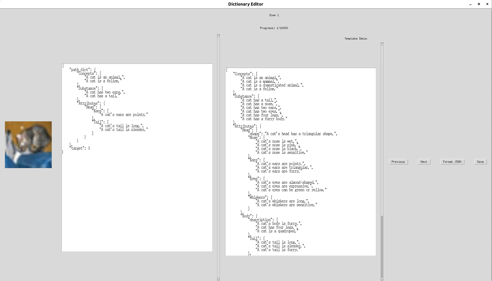 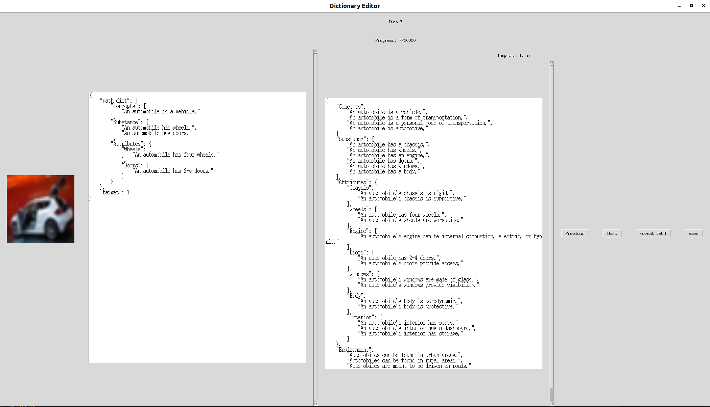 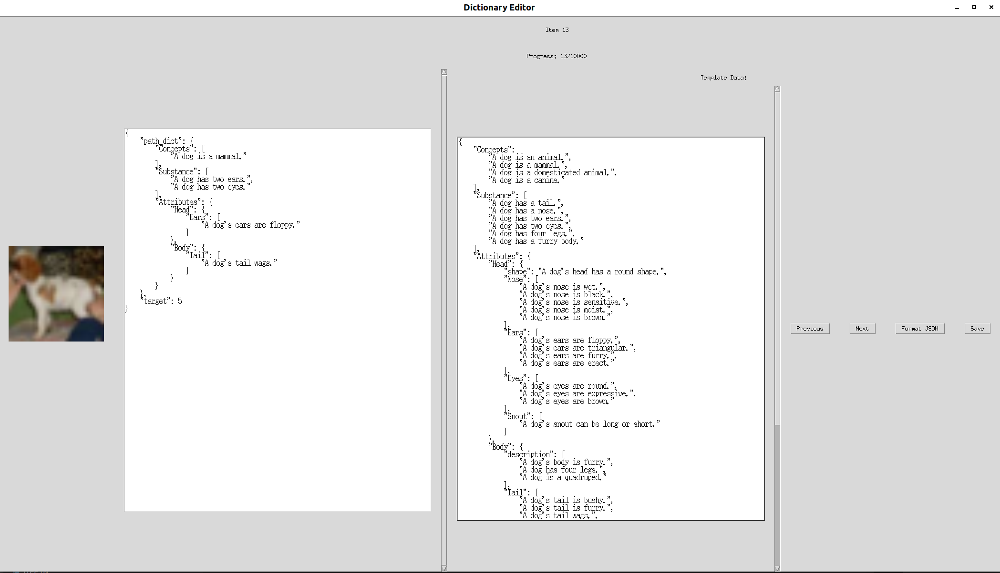 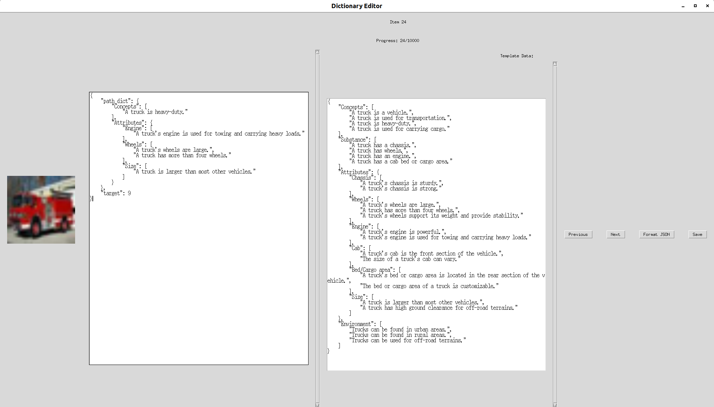

<figcaption>Software tool interface for parse tree annotation.</figcaption>
</figure>

| **Dataset Name** | **No. Categories** | **No. Attributes** | **No. Images** |
|:---|---:|---:|---:|
| <u>CIFAR-10</u> Support | 10 | 289 | 14,024 |
| <u>CIFAR-100</u> Support | 100 | 2,359 | 19,168 |
| <u>ImageNet</u> Support | 1,000 | 26,928 | 142,034 |

Support set Dataset Statistics.

<figure id="fig:statistics_imagenet">
<figure>
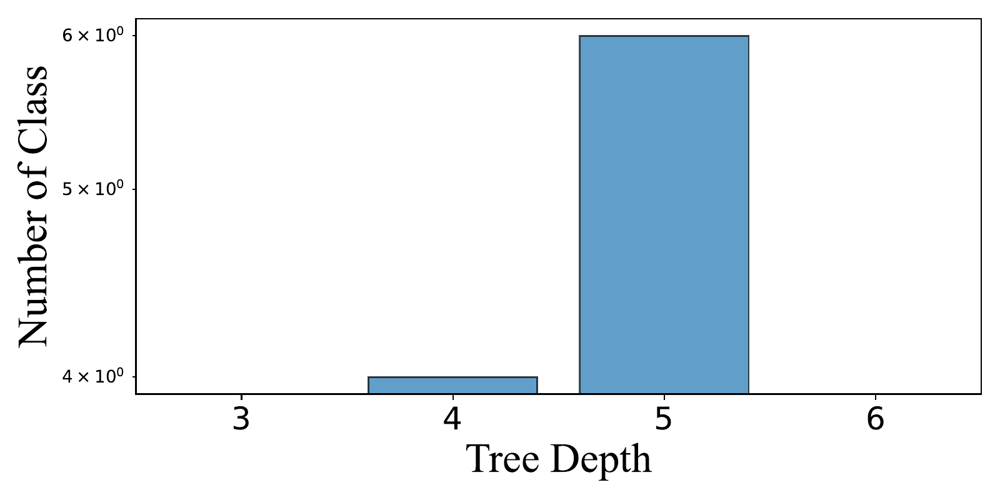
<figcaption>Histogram of Tree Depth.</figcaption>
</figure>
<figure>
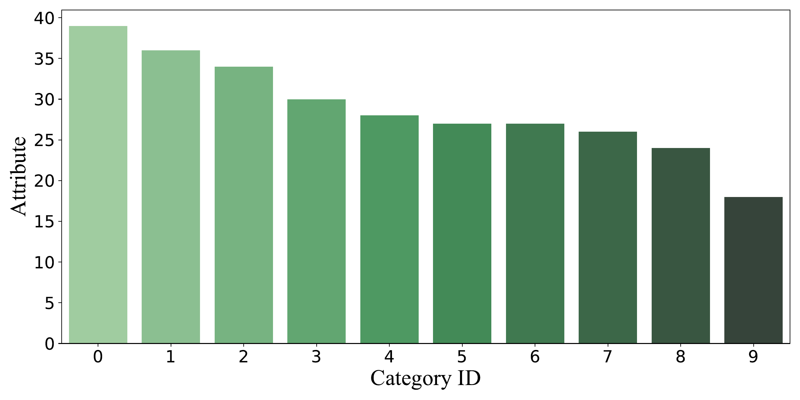
<figcaption>No. Attribute per Category.</figcaption>
</figure>
<figure>
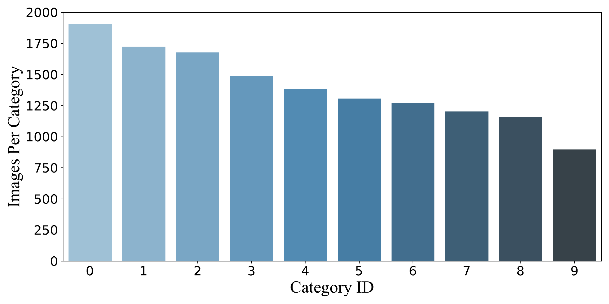
<figcaption>No. Instance per Category.</figcaption>
</figure>
<figure>
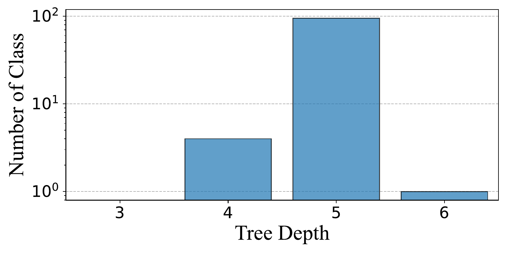
<figcaption>Histogram of Tree Depth.</figcaption>
</figure>
<figure>
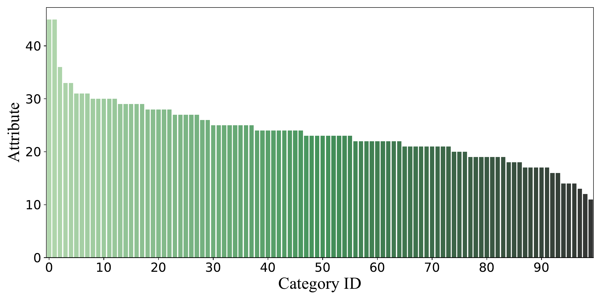
<figcaption>No. Attribute per Category.</figcaption>
</figure>
<figure>
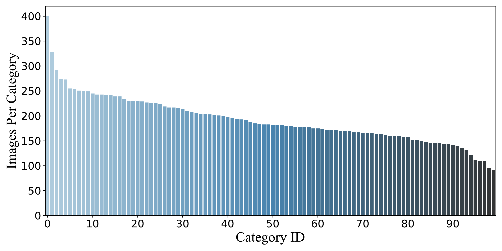
<figcaption>No. Instance per Category.</figcaption>
</figure>
<figure>
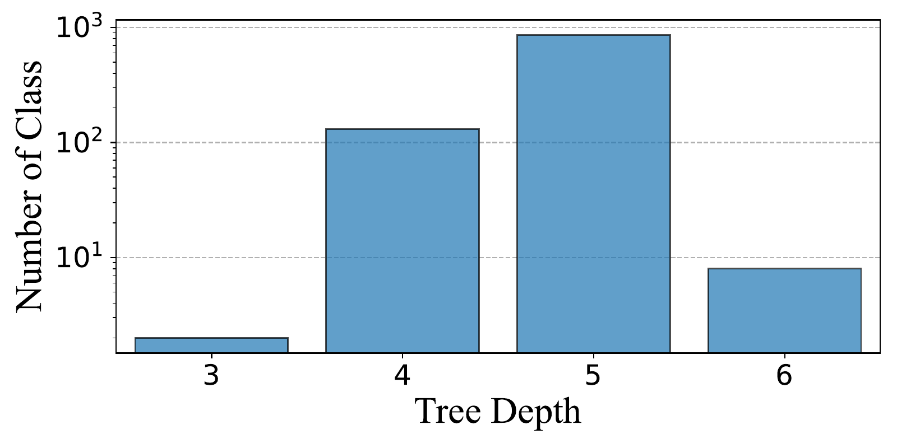
<figcaption>Histogram of Tree Depth.</figcaption>
</figure>
<figure>
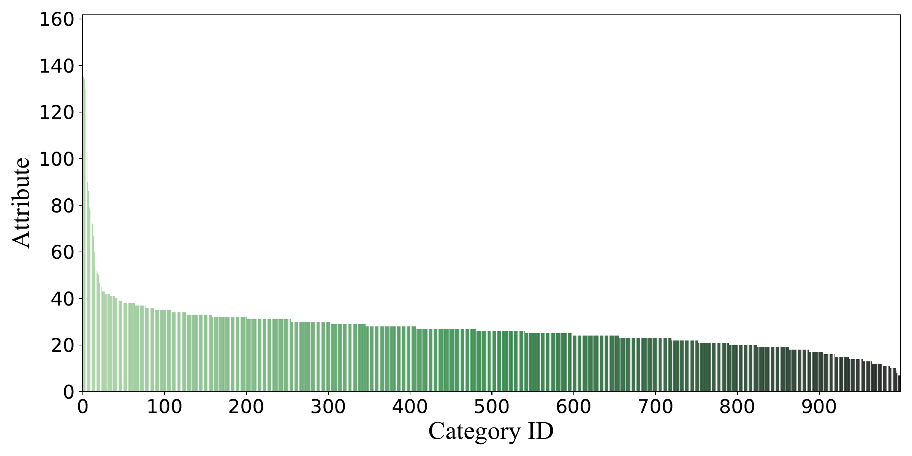
<figcaption>No. Attribute per Category.</figcaption>
</figure>
<figure>
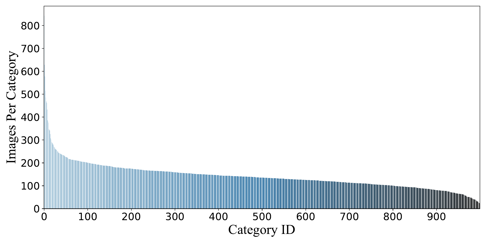
<figcaption>No. Instance per Category.</figcaption>
</figure>
<figcaption>Statistics of the support dataset sets of (Row1) CIFAR10, (Row2) CIFAR100 and (Row3) ImageNet. We examine the (a,d,g) Tree Depth, (b,e,h) Number of Attributes for each category and (c,f,i) Number of image for each category to demonstrate the diversity of collected attributes and the completeness of hierarchical annotations.</figcaption>
</figure>

## Support data

**Data Collection.** Our `LVX` model utilizes a custom support set for each task, created through a reject sampling method. Initially, images are generated using either Bing or the Stable Diffusion Model. Subsequently, CLIP is applied to determine if the CLIP score exceeds 0.5, based on the raw cosine similarities calculated by averaging CLIP `ViT-B/32`,`ViT-B/16`,`ViT-B/14`. If the score is above the specified threshold, the image is retained; otherwise, it is discarded.

To optimize the image collection process, we merge the retrieved images from all models, leading to time and effort savings. This approach allows us to reuse an image already in the dataset if it matches an attribute generated by the LLM. As a result, after the initial models have finished collecting data, subsequent models can simply pull relevant images from this existing pool instead of collecting new ones, saving both time and effort.

**Data Statistics.** We present the statistics of the support datasets collected for CIFAR10, CIFAR100, and ImageNet, highlighting the diversity and comprehensiveness of our dataset. Table <a href="#tab:dataset-stats" data-reference-type="ref" data-reference="tab:dataset-stats">4</a> and Figure <a href="#fig:statistics_imagenet" data-reference-type="ref" data-reference="fig:statistics_imagenet">8</a> provide an overview of these statistics. Specifically, we include the number of attributes, the number of samples for each category, the total number of samples in the dataset, as well as the distribution of tree depths. This rich collection of data showcases the diverse range of attributes and categories covered in our dataset, making it a valuable resource for training and evaluation purposes.

## Limitations of Support Dataset Collection

While collecting a newly curated dataset can be advantageous for our tasks, it is important to acknowledge certain limitations when using such datasets for explanation purposes. Three key limitations arise: false positive simages, the presence of out-of-distribution samples and potential bias in the dataset.

- **False Positive Images.** We observed that both Bing and the Stable Diffusion model occasionally generate imperfect images from textual descriptions, manifesting incorrect or entangled patterns. For instance, the word “crane” could represent either a construction machine or a bird, leading to ambiguity. Furthermore, an image described as “a dog with a long tail” could potentially include not only the tail but also the head and legs, reflecting a broader scope than intended.

- **Out-of-Distribution Samples.** Newly collected datasets may include samples that are out-of-distribution, i.e., they do not align with the source data distribution of interest. These out-of-distribution samples can introduce challenges in generating accurate and reliable explanations. As a result, explanations based solely on a newly collected dataset may not generalize well to unseen instances outside the support dataset distribution.

- **Data Bias.** Biases in the collection process or the underlying data sources can inadvertently influence the dataset, leading to biased explanations. Biases emerge due to various factors, such as data collection source, or imbalances in attribute distributions. Consequently, relying solely on a newly collected dataset for explanations may introduce unintended biases into the interpretation process.

**Solutions.** To deal with mistakes in the gathered images, we used two approaches. First, we used the CLIP model to sift through the images because it’s good at understanding how close an image is to text concepts, helping us remove most mixed-up and incorrect images. Second, we manually sorted out words that have more than one meaning. For instance, we made it clear whether “crane” refers to the bird or the machine by labeling it as “crane (bird)” or “crane (machine)”.

To mitigate the challenges posed by OOD samples and data bias, we adopt a cautious approach. Specifically, we do not directly train our models on the newly collected support dataset. Instead, we utilize this dataset solely for the purpose of providing disentangled attributes for explanations. By decoupling the training data from the support data, we aim to reduce the impact of OOD samples and potential data biases, thus promoting a more robust and unbiased analysis.

Despite these limitations, our emphasis on obtaining a dataset with distinct attributes sharpens our analysis and interpretation of model behavior. This approach allows us to extract meaningful insights in a controlled and clear way.

# User Study [sec:userstudy]

The evaluation of visual decision-making and categorization can be uncertain and subjective, posing challenges in assessing the quality of explanations. To address this, we conducted a user study to verify the plausibility of our explanations.

**Experiment Setup.** Our study compared the performance of `LVX`, with three others: `Subtree`, `TrDec`, and a new baseline called `Single`. The key difference with the `Single` baseline is that it utilizes only the nearest neighbor node from the parse tree for its output. This contrasts with `LVX`, which employs the top-k neighbor nodes from the parse tree.

We recruited 37 participants for this study. Each was asked to respond to 15 questions, each with one image and 4 choices. In each question, they choose the explanation that best matched the image, based on their personal judgment. The format for each choice was arranged as “`The image is a <CLASS_NAME> because <EXPLANATION>.`”.

**Results.** The user study results, as shown in Table <a href="#tab:user study" data-reference-type="ref" data-reference="tab:user study">5</a>, clearly indicate the superiority of the `LVX` method. It was selected by participants 57.66% of the time, a significantly higher rate compared to the other methods included in the study.

| Method    | Choice Percentage |
|:----------|:-----------------:|
| `Subtree` |       3.78%       |
| `TrDec`   |      22.88%       |
| `Single`  |      15.68%       |
| `LVX`     |    **57.66%**     |

User Study Results.

# Experiments on Out-of-Distribution (OOD) Evaluation [sec:ood]

In this section, we evaluate our calibrated model’s performance in Out-of-Distribution (OOD) scenarios, focusing on its robustness and ability to generalize. This evaluation is conducted using a ResNet50 and ViT-S trained on ImageNet, with and without calibration training, and tested on the ImageNet-A and ImageNet-Sketch datasets.

**Results.** The results of OOD generalization, quantified by Top-1 Accuracy, are listed in Table <a href="#tab:ood_results" data-reference-type="ref" data-reference="tab:ood_results">6</a>. For both ResNet-50 and ViT-S 16 models, we notice significant improvements in accuracy in ImageNet-A and ImageNet-S compared to the baselines. This enhancement in Out-of-Distribution generalization confirms the effectiveness of model calibration in not only improving in-domain performance (shown in Figure 7 of the main paper) but also in boosting adaptability and robustness to out-of-domain data.

|  |  |  |  |
|:---|:--:|:--:|:--:|
| Model | ImageNet (In-Domain) | ImageNet-A | ImageNet-S |
|  | Baseline/**Calibrated** | Baseline/**Calibrated** | Baseline/**Calibrated** |
| ResNet-50 | 76.13/**76.54(+0.41)** | 18.96/**23.32(+4.36)** | 24.10/**31.42(+7.32)** |
| ViT-S 16 | 77.85/**78.21(+0.36)** | 13.39/**18.72(+5.33)** | 32.40/**37.21(+4.81)** |

OOD Generalization Results with and without calibration by Top-1 Accuracy.

# Experiments on Chest X-Ray Diagnosis [sec:xray]

In this section, we evaluate the performance of our `LVX` method in security-critical domains, specifically medical image analysis. We train neural networks for chest X-ray diagnosis and utilize `LVX` to interpret and calibrate the predictions.

We adopted the DenseNet-121 architecture for disease diagnosis in our study. The model was trained on the Chestx-ray14 dataset `\citep{wang2017chestx}`{=latex}, which consists of chest X-ray images encompassing 14 diseases, along with an additional “`No Finding`” class. The DenseNet-121 architecture is specifically designed to generate 14 output logits corresponding to the different diseases. During training, we employed a weighted binary cross-entropy loss `\citep{wang2017chestx}`{=latex} for each disease category to optimize the model.

<figure id="fig:explain_xray">
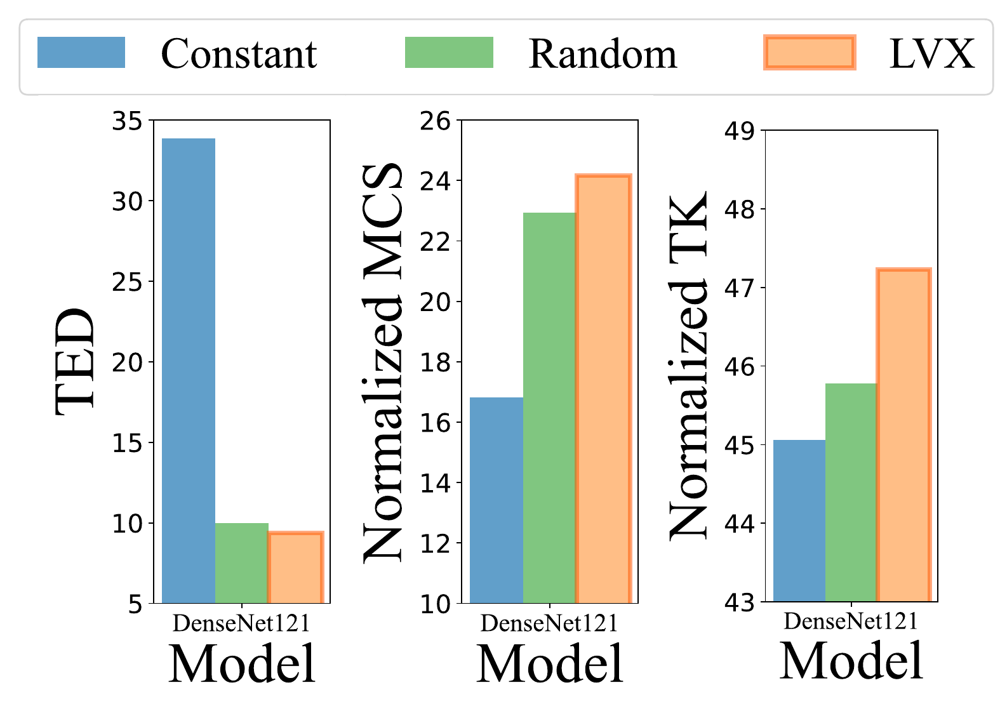
<figcaption>Explanation performance comparison on Chestx-ray14 dataset.</figcaption>
</figure>

<figure id="fig:xray_tree_example">
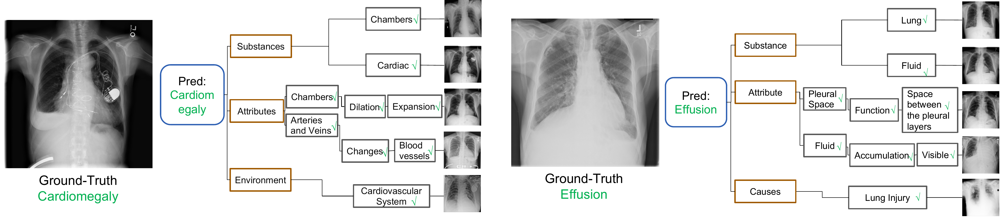
<figcaption>Explanation examples for the chest xray diagnosis task.</figcaption>
</figure>

For optimization, we utilized the Adam optimizer `\citep{kingma2014adam}`{=latex} with an initial learning rate of 1e-4, a weight decay of 1e-5, and a batch size of 32. The model underwent training for a total of 18 epochs.

**Model Explanation.** To enhance interpretability, we incorporated our `LVX` framework into the model. Instead of acquiring images from online sources, we gathered the support set directly from the training data. To accomplish this, we utilized a parse tree generated by the ChatGPT language model. Leveraging this parse tree, we applied a MedCLIP `\citep{wang2022medclip}`{=latex} model to retrieve the most relevant images for each attribute from the training set. These retrieved images served as our support sets for the `LVX` framework.

Compared to applying the `LVX` framework on single-label classification, the Chestx-ray14 dataset poses a multi-label classification challenge. In this dataset, each sample can belong to multiple disease categories simultaneously. Therefore, we modified the `LVX` framework to accommodate and handle the multi-label nature of the classification task.

Specifically, for each input image \\(\mathbf{x}\\), we predict its label \\(\hat{y}=f(\mathbf{x})\in \{0,1\}^{14}\\). To create the visual parse tree, we begin by establishing the root node. If all elements of \\(\hat{y}\\) are 0, the root node is set to “`No Findings`”. Conversely, if any element of \\(\hat{y}\\) is non-zero, the root node is labeled as “`has Findings`”. For each positive finding, we construct a separate parse tree, with these sub-trees becoming the children nodes of the root. By combining these sub-trees, we obtain a comprehensive and coherent explanation for the image. This modification enables us to effectively handle the multi-label nature of the classification task, providing meaningful and interpretable explanations for images with multiple positive findings.

To establish the ground-truth explanation label, we adopt a MedCLIP `\citep{wang2022medclip}`{=latex} model to filter the top-5 attributes for each positive finding of the image. These attributes are then organized into a tree structure. This approach serves as an automatic explanation ground-truth, thereby eliminating the requirement for manual annotations from domain experts.

In addition to providing explanations, we aim to calibrate the model predictions with the parse tree. To achieve this, we apply a modified hierarchical contrastive loss individually on each finding. We then calculate the average of these losses, which serves as our overall loss term. We thus fine-tune the model for 3 epochs using the hieracical term and weighted cross-entropy.

**Explanation Results.** We compare the explanation performance of our proposed `LVX` against the `Random` and `Constant` baselines. The numerical results, depicted in Figure <a href="#fig:explain_xray" data-reference-type="ref" data-reference="fig:explain_xray">9</a>, highlight the superiority of our `LVX` approach.

Additionally, we showcase the parsed visual tree in Figure <a href="#fig:xray_tree_example" data-reference-type="ref" data-reference="fig:xray_tree_example">10</a>, to provide a clearer illistration of our results. Notably, our approach effectively interprets the decision-making process of black-box neural networks. For instance, in the case on the right, our method accurately identifies the presence of *visible fluid* in the lung space and establishes its relevance to the model’s prediction. Consequently, `LVX` enables clinical professionals to make well-informed justifications for their patients, enhancing the overall decision-making process.

**Calibration Results.** Table <a href="#tab:results" data-reference-type="ref" data-reference="tab:results">7</a> presents the comparison between the baseline models and the model with calibration, measured in terms of the Area Under the Curve (AUC) score for each disease type. The AUC score provides a measure of the model’s ability to discriminate between positive and negative cases.

The calibrated model shows notable improvements in several disease types compared to the baseline. Notably, Hernia demonstrates the most significant improvement, with an AUC score of 0.936 compared to 0.914 for the baseline. This indicates that the calibration process has enhanced the model’s ability to accurately detect Hernia cases.

In summary, the `LVX` method markedly improves model accuracy, demonstrated by enhanced calibration performance across different disease types. The integration of visual attributes boosts both accuracy and reliability of predictions, leading to better diagnostic results. These findings underscore the `LVX` method’s potential to elevate model performance, particularly in medical diagnostics.

| **Finding**        | **Baseline** | **`LVX`** |
|:-------------------|:------------:|:---------:|
| Atelectasis        |    0.767     | **0.779** |
| Consolidation      |    0.747     | **0.755** |
| Infiltration       |    0.683     | **0.698** |
| Pneumothorax       |    0.865     | **0.873** |
| Edema              |    0.845     | **0.851** |
| Emphysema          |    0.919     | **0.930** |
| Fibrosis           |    0.832     | **0.830** |
| Effusion           |    0.826     | **0.831** |
| Pneumonia          |    0.721     | **0.719** |
| Pleural Thickening |    0.784     | **0.793** |
| Cardiomegaly       |    0.890     | **0.894** |
| Nodule             |    0.758     | **0.776** |
| Mass               |    0.814     | **0.830** |
| Hernia             |    0.914     | **0.936** |
| Avg.               |    0.812     | **0.821** |

Model performance with and without calibration. AUC scores are reported for each disease type. *Avg.* indicates the average score.

# Experiments on Self-supervised models [sec: ssl]

In this section, we focus on self-supervised models to assess their interpretability. Differing from supervised models, self-supervised models develop representations without labeled data. Our aim is to understand the interpretability of these representations and uncover the underlying structures derived from the input data alone.

**Model to be Explained.** Our objective is to offer a comprehensive explanation for self-supervised models trained on ImageNet-1k. These models include ResNet50 trained using SimCLR `\citep{pmlr-v119-chen20j}`{=latex}, BYOL `\citep{grill2020bootstrap}`{=latex}, SwAV `\citep{caron2020unsupervised}`{=latex}, MoCov3 `\citep{chen2020mocov2}`{=latex}, DINO `\citep{caron2021emerging}`{=latex}, and ViT-S trained with MoCov3 `\citep{chen2021mocov3}`{=latex} and DINO `\citep{caron2021emerging}`{=latex}. The networks are subsequently fine-tuned through linear probing while keeping the *backbone fixed*. We then utilize our `LVX` to provide explanations for their predictions. Additionally, we compare these self-supervised models with their supervised counterparts to highlight the differences in representation between the two approaches.

**Numerical Results.** Table <a href="#tab:ssl_exp" data-reference-type="ref" data-reference="tab:ssl_exp">8</a> presents the results of self-supervised models. Our analysis reveals a strong correlation between the explanatory performance and the overall model accuracy.

However, we also noticed that self-supervised models based on transformer architecture exhibit greater attribute disentanglement compared to supervised models, despite potentially having slightly lower performance. This phenomenon is evident when comparing the DINO ViT-S/16 model and the supervised ViT-S/16 model within the context of tree parsing explanation. Although the DINO ViT-S/16 model shows slightly lower overall performance, it outperforms the supervised model in terms of providing accurate attribute explanation.

These results underscore the potential benefits of self-supervised learning in uncovering meaningful visual attributes without explicit supervision. While self-supervised models may exhibit marginally lower performance on certain tasks, their ability to capture rich visual representations and attribute disentanglement highlights their value in understanding complex visual data.

| Method | Top-1 Acc | TED\\(\downarrow\\) | MCS\\(\uparrow\\) | TK \\(\uparrow\\) |
|:---|:--:|:--:|:--:|:--:|
| ResNet50-SimCLR | 69.2 | 9.38 | 23.72 | 46.53 |
| ResNet50-BYOL | 71.8 | 9.29 | 24.66 | 48.29 |
| ResNet50-MoCov3 | 74.6 | 9.19 | 25.59 | 50.17 |
| ResNet50-DINO | 75.3 | 9.14 | 25.77 | 50.71 |
| ResNet50-SwAV | 75.3 | 9.15 | 25.82 | 50.69 |
| ResNet50-Sup | 76.1 | 9.09 | 25.99 | 51.19 |
| ViT-S/16-MoCov3 | 73.2 | 9.16 | 25.25 | 49.40 |
| ViT-S/16-DINO | <u>77.0</u> | <u>8.99</u> | <u>26.61</u> | <u>52.05</u> |
| ViT-S/8-DINO | 79.7 | 8.89 | 27.62 | 53.95 |
| ViT-S/16-Sup | <u>77.9</u> | <u>9.10</u> | <u>25.73</u> | <u>50.34</u> |

Explanation performance analysis of self-supervised models utilizing linear probing.

<table>
<caption>Explanation performance comparison on CIFAR-10.</caption>
<tbody>
<tr>
<td style="text-align: left;">Model</td>
<td colspan="3" style="text-align: center;">TED↓</td>
<td colspan="3" style="text-align: center;">MCS↑</td>
<td colspan="3" style="text-align: center;">Tree Kernel↑</td>
</tr>
<tr>
<td style="text-align: left;"></td>
<td style="text-align: center;">rand.</td>
<td style="text-align: center;">const.</td>
<td style="text-align: center;"><code>LVX</code></td>
<td style="text-align: center;">rand.</td>
<td style="text-align: center;">const.</td>
<td style="text-align: center;"><code>LVX</code></td>
<td style="text-align: center;">rand.</td>
<td style="text-align: center;">const.</td>
<td style="text-align: center;"><code>LVX</code></td>
</tr>
<tr>
<td style="text-align: left;">VGG13</td>
<td style="text-align: center;">9.21</td>
<td style="text-align: center;">32.97</td>
<td style="text-align: center;">8.21</td>
<td style="text-align: center;">28.98</td>
<td style="text-align: center;">18.77</td>
<td style="text-align: center;">32.31</td>
<td style="text-align: center;">59.49</td>
<td style="text-align: center;">58.41</td>
<td style="text-align: center;">63.43</td>
</tr>
<tr>
<td style="text-align: left;">VGG16</td>
<td style="text-align: center;">9.23</td>
<td style="text-align: center;">32.89</td>
<td style="text-align: center;">8.14</td>
<td style="text-align: center;">29.11</td>
<td style="text-align: center;">19.11</td>
<td style="text-align: center;">32.55</td>
<td style="text-align: center;">59.34</td>
<td style="text-align: center;">59.55</td>
<td style="text-align: center;">63.79</td>
</tr>
<tr>
<td style="text-align: left;">VGG19</td>
<td style="text-align: center;">9.15</td>
<td style="text-align: center;">32.85</td>
<td style="text-align: center;">8.15</td>
<td style="text-align: center;">30.67</td>
<td style="text-align: center;">19.10</td>
<td style="text-align: center;">31.78</td>
<td style="text-align: center;">59.44</td>
<td style="text-align: center;">59.39</td>
<td style="text-align: center;">63.32</td>
</tr>
<tr>
<td style="text-align: left;">ResNet18</td>
<td style="text-align: center;">9.21</td>
<td style="text-align: center;">32.90</td>
<td style="text-align: center;">8.52</td>
<td style="text-align: center;">28.95</td>
<td style="text-align: center;">18.92</td>
<td style="text-align: center;">30.24</td>
<td style="text-align: center;">58.94</td>
<td style="text-align: center;">58.87</td>
<td style="text-align: center;">61.19</td>
</tr>
<tr>
<td style="text-align: left;">ResNet34</td>
<td style="text-align: center;">9.21</td>
<td style="text-align: center;">32.92</td>
<td style="text-align: center;">8.16</td>
<td style="text-align: center;">28.95</td>
<td style="text-align: center;">18.98</td>
<td style="text-align: center;">32.07</td>
<td style="text-align: center;">59.06</td>
<td style="text-align: center;">59.01</td>
<td style="text-align: center;">63.27</td>
</tr>
<tr>
<td style="text-align: left;">ResNet50</td>
<td style="text-align: center;">9.21</td>
<td style="text-align: center;">32.89</td>
<td style="text-align: center;">8.44</td>
<td style="text-align: center;">28.96</td>
<td style="text-align: center;">19.00</td>
<td style="text-align: center;">31.09</td>
<td style="text-align: center;">59.16</td>
<td style="text-align: center;">59.21</td>
<td style="text-align: center;">62.06</td>
</tr>
<tr>
<td style="text-align: left;">DenseNet121</td>
<td style="text-align: center;">9.19</td>
<td style="text-align: center;">32.89</td>
<td style="text-align: center;">8.20</td>
<td style="text-align: center;">29.09</td>
<td style="text-align: center;">19.11</td>
<td style="text-align: center;">32.13</td>
<td style="text-align: center;">59.53</td>
<td style="text-align: center;">59.48</td>
<td style="text-align: center;">63.44</td>
</tr>
<tr>
<td style="text-align: left;">DenseNet161</td>
<td style="text-align: center;">9.20</td>
<td style="text-align: center;">32.88</td>
<td style="text-align: center;">8.19</td>
<td style="text-align: center;">29.07</td>
<td style="text-align: center;">19.11</td>
<td style="text-align: center;">32.12</td>
<td style="text-align: center;">59.35</td>
<td style="text-align: center;">59.48</td>
<td style="text-align: center;">63.73</td>
</tr>
<tr>
<td style="text-align: left;">DenseNet169</td>
<td style="text-align: center;">9.21</td>
<td style="text-align: center;">32.88</td>
<td style="text-align: center;">8.18</td>
<td style="text-align: center;">29.25</td>
<td style="text-align: center;">19.08</td>
<td style="text-align: center;">32.13</td>
<td style="text-align: center;">59.52</td>
<td style="text-align: center;">59.46</td>
<td style="text-align: center;">63.46</td>
</tr>
<tr>
<td style="text-align: left;">MobileNet_v2</td>
<td style="text-align: center;">9.20</td>
<td style="text-align: center;">32.89</td>
<td style="text-align: center;">8.41</td>
<td style="text-align: center;">29.24</td>
<td style="text-align: center;">19.09</td>
<td style="text-align: center;">31.61</td>
<td style="text-align: center;">59.53</td>
<td style="text-align: center;">59.38</td>
<td style="text-align: center;">61.87</td>
</tr>
<tr>
<td style="text-align: left;">GoogLeNet</td>
<td style="text-align: center;">9.23</td>
<td style="text-align: center;">32.96</td>
<td style="text-align: center;">8.41</td>
<td style="text-align: center;">28.66</td>
<td style="text-align: center;">18.86</td>
<td style="text-align: center;">30.75</td>
<td style="text-align: center;">58.62</td>
<td style="text-align: center;">58.71</td>
<td style="text-align: center;">61.38</td>
</tr>
<tr>
<td style="text-align: left;">Inception_v3</td>
<td style="text-align: center;">9.20</td>
<td style="text-align: center;">32.89</td>
<td style="text-align: center;">8.39</td>
<td style="text-align: center;">29.19</td>
<td style="text-align: center;">19.03</td>
<td style="text-align: center;">31.02</td>
<td style="text-align: center;">59.37</td>
<td style="text-align: center;">59.27</td>
<td style="text-align: center;">61.85</td>
</tr>
</tbody>
</table>

<table>
<caption>Explanation performance comparison on CIFAR-100.</caption>
<tbody>
<tr>
<td style="text-align: left;">Model</td>
<td colspan="3" style="text-align: center;">TED↓</td>
<td colspan="3" style="text-align: center;">MCS↑</td>
<td colspan="3" style="text-align: center;">Tree Kernel↑</td>
</tr>
<tr>
<td style="text-align: left;"></td>
<td style="text-align: center;">rand.</td>
<td style="text-align: center;">const.</td>
<td style="text-align: center;"><code>LVX</code></td>
<td style="text-align: center;">rand.</td>
<td style="text-align: center;">const.</td>
<td style="text-align: center;"><code>LVX</code></td>
<td style="text-align: center;">rand.</td>
<td style="text-align: center;">const.</td>
<td style="text-align: center;"><code>LVX</code></td>
</tr>
<tr>
<td style="text-align: left;">ResNet20</td>
<td style="text-align: center;">9.61</td>
<td style="text-align: center;">28.77</td>
<td style="text-align: center;">8.96</td>
<td style="text-align: center;">22.65</td>
<td style="text-align: center;">17.60</td>
<td style="text-align: center;">24.89</td>
<td style="text-align: center;">45.52</td>
<td style="text-align: center;">46.96</td>
<td style="text-align: center;">47.70</td>
</tr>
<tr>
<td style="text-align: left;">ResNet32</td>
<td style="text-align: center;">9.57</td>
<td style="text-align: center;">28.67</td>
<td style="text-align: center;">8.86</td>
<td style="text-align: center;">22.84</td>
<td style="text-align: center;">17.92</td>
<td style="text-align: center;">25.39</td>
<td style="text-align: center;">46.45</td>
<td style="text-align: center;">47.87</td>
<td style="text-align: center;">48.58</td>
</tr>
<tr>
<td style="text-align: left;">ResNet44</td>
<td style="text-align: center;">9.54</td>
<td style="text-align: center;">28.60</td>
<td style="text-align: center;">8.81</td>
<td style="text-align: center;">23.48</td>
<td style="text-align: center;">18.34</td>
<td style="text-align: center;">25.97</td>
<td style="text-align: center;">47.42</td>
<td style="text-align: center;">48.87</td>
<td style="text-align: center;">49.79</td>
</tr>
<tr>
<td style="text-align: left;">ResNet56</td>
<td style="text-align: center;">9.52</td>
<td style="text-align: center;">28.54</td>
<td style="text-align: center;">8.83</td>
<td style="text-align: center;">23.87</td>
<td style="text-align: center;">18.60</td>
<td style="text-align: center;">26.47</td>
<td style="text-align: center;">48.04</td>
<td style="text-align: center;">49.58</td>
<td style="text-align: center;">50.17</td>
</tr>
<tr>
<td style="text-align: left;">MBNv2-x0.5</td>
<td style="text-align: center;">9.55</td>
<td style="text-align: center;">28.58</td>
<td style="text-align: center;">8.87</td>
<td style="text-align: center;">23.43</td>
<td style="text-align: center;">18.19</td>
<td style="text-align: center;">25.50</td>
<td style="text-align: center;">47.13</td>
<td style="text-align: center;">48.58</td>
<td style="text-align: center;">49.08</td>
</tr>
<tr>
<td style="text-align: left;">MBNv2-x0.75</td>
<td style="text-align: center;">9.43</td>
<td style="text-align: center;">28.43</td>
<td style="text-align: center;">8.76</td>
<td style="text-align: center;">24.47</td>
<td style="text-align: center;">18.87</td>
<td style="text-align: center;">26.71</td>
<td style="text-align: center;">49.19</td>
<td style="text-align: center;">50.55</td>
<td style="text-align: center;">51.21</td>
</tr>
<tr>
<td style="text-align: left;">MBNv2-x1.0</td>
<td style="text-align: center;">9.48</td>
<td style="text-align: center;">28.35</td>
<td style="text-align: center;">8.73</td>
<td style="text-align: center;">24.35</td>
<td style="text-align: center;">19.02</td>
<td style="text-align: center;">27.09</td>
<td style="text-align: center;">49.27</td>
<td style="text-align: center;">50.68</td>
<td style="text-align: center;">51.47</td>
</tr>
<tr>
<td style="text-align: left;">MBNv2-x1.4</td>
<td style="text-align: center;">9.43</td>
<td style="text-align: center;">28.16</td>
<td style="text-align: center;">8.65</td>
<td style="text-align: center;">24.87</td>
<td style="text-align: center;">19.47</td>
<td style="text-align: center;">27.41</td>
<td style="text-align: center;">50.52</td>
<td style="text-align: center;">52.08</td>
<td style="text-align: center;">52.91</td>
</tr>
<tr>
<td style="text-align: left;">RepVGG A0</td>
<td style="text-align: center;">9.44</td>
<td style="text-align: center;">28.28</td>
<td style="text-align: center;">8.74</td>
<td style="text-align: center;">24.65</td>
<td style="text-align: center;">19.21</td>
<td style="text-align: center;">26.84</td>
<td style="text-align: center;">49.78</td>
<td style="text-align: center;">51.37</td>
<td style="text-align: center;">52.01</td>
</tr>
<tr>
<td style="text-align: left;">RepVGG A1</td>
<td style="text-align: center;">9.42</td>
<td style="text-align: center;">28.21</td>
<td style="text-align: center;">8.72</td>
<td style="text-align: center;">25.27</td>
<td style="text-align: center;">19.59</td>
<td style="text-align: center;">27.43</td>
<td style="text-align: center;">50.63</td>
<td style="text-align: center;">52.17</td>
<td style="text-align: center;">52.81</td>
</tr>
<tr>
<td style="text-align: left;">RepVGG A2</td>
<td style="text-align: center;">9.40</td>
<td style="text-align: center;">28.08</td>
<td style="text-align: center;">8.70</td>
<td style="text-align: center;">25.46</td>
<td style="text-align: center;">19.82</td>
<td style="text-align: center;">27.99</td>
<td style="text-align: center;">51.26</td>
<td style="text-align: center;">52.87</td>
<td style="text-align: center;">53.04</td>
</tr>
</tbody>
</table>

<table>
<caption>Explanation performance comparison on ImageNet.</caption>
<tbody>
<tr>
<td style="text-align: left;">Model</td>
<td colspan="3" style="text-align: center;">TED↓</td>
<td colspan="3" style="text-align: center;">MCS↑</td>
<td colspan="3" style="text-align: center;">Tree Kernel↑</td>
</tr>
<tr>
<td style="text-align: left;"></td>
<td style="text-align: center;">rand.</td>
<td style="text-align: center;">const.</td>
<td style="text-align: center;"><code>LVX</code></td>
<td style="text-align: center;">rand.</td>
<td style="text-align: center;">const.</td>
<td style="text-align: center;"><code>LVX</code></td>
<td style="text-align: center;">rand.</td>
<td style="text-align: center;">const.</td>
<td style="text-align: center;"><code>LVX</code></td>
</tr>
<tr>
<td style="text-align: left;">ResNet18</td>
<td style="text-align: center;">9.83</td>
<td style="text-align: center;">34.15</td>
<td style="text-align: center;">9.30</td>
<td style="text-align: center;">22.52</td>
<td style="text-align: center;">16.82</td>
<td style="text-align: center;">23.87</td>
<td style="text-align: center;">45.32</td>
<td style="text-align: center;">44.85</td>
<td style="text-align: center;">46.85</td>
</tr>
<tr>
<td style="text-align: left;">ResNet34</td>
<td style="text-align: center;">9.75</td>
<td style="text-align: center;">33.78</td>
<td style="text-align: center;">9.17</td>
<td style="text-align: center;">23.74</td>
<td style="text-align: center;">17.71</td>
<td style="text-align: center;">25.09</td>
<td style="text-align: center;">47.66</td>
<td style="text-align: center;">47.16</td>
<td style="text-align: center;">49.24</td>
</tr>
<tr>
<td style="text-align: left;">ResNet50</td>
<td style="text-align: center;">9.68</td>
<td style="text-align: center;">33.58</td>
<td style="text-align: center;">9.09</td>
<td style="text-align: center;">24.59</td>
<td style="text-align: center;">18.35</td>
<td style="text-align: center;">25.99</td>
<td style="text-align: center;">49.38</td>
<td style="text-align: center;">48.97</td>
<td style="text-align: center;">51.19</td>
</tr>
<tr>
<td style="text-align: left;">ResNet101</td>
<td style="text-align: center;">9.64</td>
<td style="text-align: center;">33.48</td>
<td style="text-align: center;">9.04</td>
<td style="text-align: center;">24.94</td>
<td style="text-align: center;">18.66</td>
<td style="text-align: center;">26.51</td>
<td style="text-align: center;">50.25</td>
<td style="text-align: center;">49.77</td>
<td style="text-align: center;">51.99</td>
</tr>
<tr>
<td style="text-align: left;">ViT-T16</td>
<td style="text-align: center;">10.42</td>
<td style="text-align: center;">35.44</td>
<td style="text-align: center;">9.99</td>
<td style="text-align: center;">15.07</td>
<td style="text-align: center;">11.25</td>
<td style="text-align: center;">15.91</td>
<td style="text-align: center;">30.30</td>
<td style="text-align: center;">29.92</td>
<td style="text-align: center;">31.24</td>
</tr>
<tr>
<td style="text-align: left;">ViT-S16</td>
<td style="text-align: center;">9.69</td>
<td style="text-align: center;">33.61</td>
<td style="text-align: center;">9.10</td>
<td style="text-align: center;">24.16</td>
<td style="text-align: center;">18.01</td>
<td style="text-align: center;">25.73</td>
<td style="text-align: center;">48.53</td>
<td style="text-align: center;">48.05</td>
<td style="text-align: center;">50.34</td>
</tr>
<tr>
<td style="text-align: left;">ViT-B16</td>
<td style="text-align: center;">9.62</td>
<td style="text-align: center;">33.37</td>
<td style="text-align: center;">8.99</td>
<td style="text-align: center;">25.20</td>
<td style="text-align: center;">18.79</td>
<td style="text-align: center;">27.01</td>
<td style="text-align: center;">50.64</td>
<td style="text-align: center;">50.22</td>
<td style="text-align: center;">52.76</td>
</tr>
<tr>
<td style="text-align: left;">ViT-L16</td>
<td style="text-align: center;">9.45</td>
<td style="text-align: center;">32.84</td>
<td style="text-align: center;">8.79</td>
<td style="text-align: center;">27.27</td>
<td style="text-align: center;">20.35</td>
<td style="text-align: center;">29.29</td>
<td style="text-align: center;">54.83</td>
<td style="text-align: center;">54.36</td>
<td style="text-align: center;">57.14</td>
</tr>
</tbody>
</table>

# Raw Results [sec:raw]

This section presents the raw numerical results for Figure 5, as depicted in the main paper. Specifically, Table <a href="#tab:cifar10_performance" data-reference-type="ref" data-reference="tab:cifar10_performance">9</a> provides the results for CIFAR-10, Table <a href="#tab:cifar100_performance" data-reference-type="ref" data-reference="tab:cifar100_performance">10</a> for CIFAR-100, and Table <a href="#tab:imagenet_performance" data-reference-type="ref" data-reference="tab:imagenet_performance">11</a> for ImageNet. We also observed that larger networks within the same model family deliver better results. As the models improve, so does the accuracy of the explanations, suggesting that larger networks facilitate more effective explanations. This is demonstrated by the increase in MCS and TK scores as ResNet deepens on CIFAR-100 and ImageNet, aligning with the general belief that larger neural networks offer enhanced generalization and structural representation capabilities.

# Experimental Setup

In this section, we provide detailed information about our experimental setup to ensure the reproducibility of our method.

## Evaluation Metrics

To evaluate the effectiveness of our proposed tree parsing task, we have developed three metrics that leverage conventional tree similarity and distance measurement techniques.

- **Tree Kernels (TK)**: Tree Kernels (TK) evaluate tree similarity by leveraging shared substructures, assigning higher scores to trees with common subtrees or substructures. To enhance the match, we set the decaying factor for two adjacent tree layers to 0.5, where larger values lead to better matches. Let’s define the subtree kernel mathematically:

  

  

  In the paper, the Tree Kernel (TK) score is normalized to accommodate trees of different sizes. The normalized TK score is computed as: \\(\frac{TK(T_{pred}, T_{gt}) \times 100}{\sqrt{TK(T_{pred}, T_{pred})TK(T_{gt}, T_{gt})}}\\). The kernel value serves as a measure of similarity, where higher values indicate greater similarity.

- **Maximum Common Subgraph (MCS)**`\citep{raymond2002maximum,kann1992approximability}`{=latex}: The Maximum Common Subgraph (MCS) identifies the largest shared subgraph between two trees, measuring the similarity and overlap of their hierarchical structures. Here’s the mathematical definition of the Maximum Common Subgraph:

  

  

  In our paper, we report the normalized MCS score as our measurement of tree similarity \\(\frac{|\text{MCS}(T_{pred}, T_{gt})| \times 100}{\sqrt{|T_{pred}||T_{gt}|}}\\), where a higher score indicates greater similarity between the graphs. Here, \\(|\cdot|\\) represents the number of nodes in a tree. We employ this normalization to address the scenario where one tree is significantly larger and encompasses all other trees as subtrees. By dividing the MCS score by the square root of the product of the numbers of nodes in the predicted tree (\\(T_{\text{pred}}\\)) and the ground truth tree (\\(T_{\text{gt}}\\)), we ensure a fair comparison across trees of varying sizes.

- **Tree Edit Distance (TED)** `\citep{bille2005survey}`{=latex}: The Tree Edit Distance (TED) quantifies the minimum number of editing operations required to transform one hierarchical tree into another. It measures the structural dissimilarity between trees by considering node and edge modifications, insertions, and deletions. With smaller TED, the two graphs are more similar. Let’s define the Tree Edit Distance formally:

  

  

  The \\(TED(T_1, T_2)\\) is the final result obtained after applying the above recursive computation.

## Model Checkpoints

For our experiments, we utilize publicly available pre-trained models. Specifically, we employ CIFAR10 models from <https://github.com/huyvnphan/PyTorch_CIFAR10>, CIFAR100 models from <https://github.com/chenyaofo/pytorch-cifar-models>, and ImageNet models from `torchvision` package and `timm` package. The self-supervised models are downloaded from their respective official repositories.

## Explanation Baselines

To explain visual models using tree-structured language without annotations, we devised four basic baselines, `Random`, `Constant`, `Subtree` and `TrDec`, for comparison with our `LVX` method.

**Random Baseline.** The Random baseline generates random explanations by predicting an image’s category and randomly sampling 5 nodes from its category-specific tree. The connected nodes form a tree-structured explanation, providing a performance baseline for random guessing.

**Constant Baseline.** The Constant baseline Produces a fixed tree-structured clue for images of the same class, using an initial explanatory tree \\(T_i^{(0)}\\) as a template. This baseline assesses `LVX` against a non-adaptive, static approach.

**Subtree Baseline.** This method involves selecting the most common subtree from the test set for explanations, testing the efficacy of using frequent dataset patterns for generic explanations.

**TreDec Baseline.** Based on `\citep{wang2018tree}`{=latex}, the `TrDec` strategy implements a tree-topology RNN decoder over an image encoder. In the absence of hierarchical annotations, this baseline uses the CLIP model to verify nodes in the template trees, which act as pseudo-labels for training. This method focuses on the effectiveness of a structured decoding process in explanation generation.

This comparison demonstrates the effectiveness of `LVX` in creating explanations tailored to individual image content, clearly outperforming methods based on random guessing, static templates, and basic learning-based approaches.

# Limitations

Our system, LVX, depends on an external Large Language Model (LLM) to provide textual explanations. While this integration adds significant functionality, it also introduces the risk of inaccuracies. The LLM may not always deliver correct information, leading to potential misinformation or erroneous explanations.

Additionally, our approach involves generating explanations based on the last embedding layer of the neural network. This method overlooks the comprehensive, multi-level hierarchical structure of deep features, potentially simplifying or omitting important contextual data that could enhance the understanding of the network’s decisions.

# NeurIPS Paper Checklist [neurips-paper-checklist]

The checklist is designed to encourage best practices for responsible machine learning research, addressing issues of reproducibility, transparency, research ethics, and societal impact. Do not remove the checklist: **The papers not including the checklist will be desk rejected.** The checklist should follow the references and precede the (optional) supplemental material. The checklist does NOT count towards the page limit.

Please read the checklist guidelines carefully for information on how to answer these questions. For each question in the checklist:

- You should answer , , or .

- means either that the question is Not Applicable for that particular paper or the relevant information is Not Available.

- Please provide a short (1–2 sentence) justification right after your answer (even for NA).

**The checklist answers are an integral part of your paper submission.** They are visible to the reviewers, area chairs, senior area chairs, and ethics reviewers. You will be asked to also include it (after eventual revisions) with the final version of your paper, and its final version will be published with the paper.

The reviewers of your paper will be asked to use the checklist as one of the factors in their evaluation. While "" is generally preferable to "", it is perfectly acceptable to answer "" provided a proper justification is given (e.g., "error bars are not reported because it would be too computationally expensive" or "we were unable to find the license for the dataset we used"). In general, answering "" or "" is not grounds for rejection. While the questions are phrased in a binary way, we acknowledge that the true answer is often more nuanced, so please just use your best judgment and write a justification to elaborate. All supporting evidence can appear either in the main paper or the supplemental material, provided in appendix. If you answer to a question, in the justification please point to the section(s) where related material for the question can be found.

IMPORTANT, please:

- **Delete this instruction block, but keep the section heading “NeurIPS paper checklist"**,

- **Keep the checklist subsection headings, questions/answers and guidelines below.**

- **Do not modify the questions and only use the provided macros for your answers**.

1.  **Claims**

2.  Question: Do the main claims made in the abstract and introduction accurately reflect the paper’s contributions and scope?

3.  Answer:

4.  Justification: we present LVX to explain vision model with LLM’s help.

5.  Guidelines:

    - The answer NA means that the abstract and introduction do not include the claims made in the paper.

    - The abstract and/or introduction should clearly state the claims made, including the contributions made in the paper and important assumptions and limitations. A No or NA answer to this question will not be perceived well by the reviewers.

    - The claims made should match theoretical and experimental results, and reflect how much the results can be expected to generalize to other settings.

    - It is fine to include aspirational goals as motivation as long as it is clear that these goals are not attained by the paper.

6.  **Limitations**

7.  Question: Does the paper discuss the limitations of the work performed by the authors?

8.  Answer:

9.  Justification: In the limitation section.

10. Guidelines:

    - The answer NA means that the paper has no limitation while the answer No means that the paper has limitations, but those are not discussed in the paper.

    - The authors are encouraged to create a separate "Limitations" section in their paper.

    - The paper should point out any strong assumptions and how robust the results are to violations of these assumptions (e.g., independence assumptions, noiseless settings, model well-specification, asymptotic approximations only holding locally). The authors should reflect on how these assumptions might be violated in practice and what the implications would be.

    - The authors should reflect on the scope of the claims made, e.g., if the approach was only tested on a few datasets or with a few runs. In general, empirical results often depend on implicit assumptions, which should be articulated.

    - The authors should reflect on the factors that influence the performance of the approach. For example, a facial recognition algorithm may perform poorly when image resolution is low or images are taken in low lighting. Or a speech-to-text system might not be used reliably to provide closed captions for online lectures because it fails to handle technical jargon.

    - The authors should discuss the computational efficiency of the proposed algorithms and how they scale with dataset size.

    - If applicable, the authors should discuss possible limitations of their approach to address problems of privacy and fairness.

    - While the authors might fear that complete honesty about limitations might be used by reviewers as grounds for rejection, a worse outcome might be that reviewers discover limitations that aren’t acknowledged in the paper. The authors should use their best judgment and recognize that individual actions in favor of transparency play an important role in developing norms that preserve the integrity of the community. Reviewers will be specifically instructed to not penalize honesty concerning limitations.

11. **Theory Assumptions and Proofs**

12. Question: For each theoretical result, does the paper provide the full set of assumptions and a complete (and correct) proof?

13. Answer:

14. Justification: No proof made.

15. Guidelines:

    - The answer NA means that the paper does not include theoretical results.

    - All the theorems, formulas, and proofs in the paper should be numbered and cross-referenced.

    - All assumptions should be clearly stated or referenced in the statement of any theorems.

    - The proofs can either appear in the main paper or the supplemental material, but if they appear in the supplemental material, the authors are encouraged to provide a short proof sketch to provide intuition.

    - Inversely, any informal proof provided in the core of the paper should be complemented by formal proofs provided in appendix or supplemental material.

    - Theorems and Lemmas that the proof relies upon should be properly referenced.

16. **Experimental Result Reproducibility**

17. Question: Does the paper fully disclose all the information needed to reproduce the main experimental results of the paper to the extent that it affects the main claims and/or conclusions of the paper (regardless of whether the code and data are provided or not)?

18. Answer:

19. Justification: Details and code provided.

20. Guidelines:

    - The answer NA means that the paper does not include experiments.

    - If the paper includes experiments, a No answer to this question will not be perceived well by the reviewers: Making the paper reproducible is important, regardless of whether the code and data are provided or not.

    - If the contribution is a dataset and/or model, the authors should describe the steps taken to make their results reproducible or verifiable.

    - Depending on the contribution, reproducibility can be accomplished in various ways. For example, if the contribution is a novel architecture, describing the architecture fully might suffice, or if the contribution is a specific model and empirical evaluation, it may be necessary to either make it possible for others to replicate the model with the same dataset, or provide access to the model. In general. releasing code and data is often one good way to accomplish this, but reproducibility can also be provided via detailed instructions for how to replicate the results, access to a hosted model (e.g., in the case of a large language model), releasing of a model checkpoint, or other means that are appropriate to the research performed.

    - While NeurIPS does not require releasing code, the conference does require all submissions to provide some reasonable avenue for reproducibility, which may depend on the nature of the contribution. For example

      1.  If the contribution is primarily a new algorithm, the paper should make it clear how to reproduce that algorithm.

      2.  If the contribution is primarily a new model architecture, the paper should describe the architecture clearly and fully.

      3.  If the contribution is a new model (e.g., a large language model), then there should either be a way to access this model for reproducing the results or a way to reproduce the model (e.g., with an open-source dataset or instructions for how to construct the dataset).

      4.  We recognize that reproducibility may be tricky in some cases, in which case authors are welcome to describe the particular way they provide for reproducibility. In the case of closed-source models, it may be that access to the model is limited in some way (e.g., to registered users), but it should be possible for other researchers to have some path to reproducing or verifying the results.

21. **Open access to data and code**

22. Question: Does the paper provide open access to the data and code, with sufficient instructions to faithfully reproduce the main experimental results, as described in supplemental material?

23. Answer:

24. Justification: Code has been uploaded as supplementary material. Data will be available.

25. Guidelines:

    - The answer NA means that paper does not include experiments requiring code.

    - Please see the NeurIPS code and data submission guidelines (<https://nips.cc/public/guides/CodeSubmissionPolicy>) for more details.

    - While we encourage the release of code and data, we understand that this might not be possible, so “No” is an acceptable answer. Papers cannot be rejected simply for not including code, unless this is central to the contribution (e.g., for a new open-source benchmark).

    - The instructions should contain the exact command and environment needed to run to reproduce the results. See the NeurIPS code and data submission guidelines (<https://nips.cc/public/guides/CodeSubmissionPolicy>) for more details.

    - The authors should provide instructions on data access and preparation, including how to access the raw data, preprocessed data, intermediate data, and generated data, etc.

    - The authors should provide scripts to reproduce all experimental results for the new proposed method and baselines. If only a subset of experiments are reproducible, they should state which ones are omitted from the script and why.

    - At submission time, to preserve anonymity, the authors should release anonymized versions (if applicable).

    - Providing as much information as possible in supplemental material (appended to the paper) is recommended, but including URLs to data and code is permitted.

26. **Experimental Setting/Details**

27. Question: Does the paper specify all the training and test details (e.g., data splits, hyperparameters, how they were chosen, type of optimizer, etc.) necessary to understand the results?

28. Answer:

29. Justification: All details mentioned.

30. Guidelines:

    - The answer NA means that the paper does not include experiments.

    - The experimental setting should be presented in the core of the paper to a level of detail that is necessary to appreciate the results and make sense of them.

    - The full details can be provided either with the code, in appendix, or as supplemental material.

31. **Experiment Statistical Significance**

32. Question: Does the paper report error bars suitably and correctly defined or other appropriate information about the statistical significance of the experiments?

33. Answer:

34. Justification: Errorbar presented.

35. Guidelines:

    - The answer NA means that the paper does not include experiments.

    - The authors should answer "Yes" if the results are accompanied by error bars, confidence intervals, or statistical significance tests, at least for the experiments that support the main claims of the paper.

    - The factors of variability that the error bars are capturing should be clearly stated (for example, train/test split, initialization, random drawing of some parameter, or overall run with given experimental conditions).

    - The method for calculating the error bars should be explained (closed form formula, call to a library function, bootstrap, etc.)

    - The assumptions made should be given (e.g., Normally distributed errors).

    - It should be clear whether the error bar is the standard deviation or the standard error of the mean.

    - It is OK to report 1-sigma error bars, but one should state it. The authors should preferably report a 2-sigma error bar than state that they have a 96% CI, if the hypothesis of Normality of errors is not verified.

    - For asymmetric distributions, the authors should be careful not to show in tables or figures symmetric error bars that would yield results that are out of range (e.g. negative error rates).

    - If error bars are reported in tables or plots, The authors should explain in the text how they were calculated and reference the corresponding figures or tables in the text.

36. **Experiments Compute Resources**

37. Question: For each experiment, does the paper provide sufficient information on the computer resources (type of compute workers, memory, time of execution) needed to reproduce the experiments?

38. Answer:

39. Justification: All discussed in the main paper.

40. Guidelines:

    - The answer NA means that the paper does not include experiments.

    - The paper should indicate the type of compute workers CPU or GPU, internal cluster, or cloud provider, including relevant memory and storage.

    - The paper should provide the amount of compute required for each of the individual experimental runs as well as estimate the total compute.

    - The paper should disclose whether the full research project required more compute than the experiments reported in the paper (e.g., preliminary or failed experiments that didn’t make it into the paper).

41. **Code Of Ethics**

42. Question: Does the research conducted in the paper conform, in every respect, with the NeurIPS Code of Ethics <https://neurips.cc/public/EthicsGuidelines>?

43. Answer:

44. Justification:

45. Guidelines:

    - The answer NA means that the authors have not reviewed the NeurIPS Code of Ethics.

    - If the authors answer No, they should explain the special circumstances that require a deviation from the Code of Ethics.

    - The authors should make sure to preserve anonymity (e.g., if there is a special consideration due to laws or regulations in their jurisdiction).

46. **Broader Impacts**

47. Question: Does the paper discuss both potential positive societal impacts and negative societal impacts of the work performed?

48. Answer:

49. Justification: Error bar included.

50. Guidelines:

    - The answer NA means that there is no societal impact of the work performed.

    - If the authors answer NA or No, they should explain why their work has no societal impact or why the paper does not address societal impact.

    - Examples of negative societal impacts include potential malicious or unintended uses (e.g., disinformation, generating fake profiles, surveillance), fairness considerations (e.g., deployment of technologies that could make decisions that unfairly impact specific groups), privacy considerations, and security considerations.

    - The conference expects that many papers will be foundational research and not tied to particular applications, let alone deployments. However, if there is a direct path to any negative applications, the authors should point it out. For example, it is legitimate to point out that an improvement in the quality of generative models could be used to generate deepfakes for disinformation. On the other hand, it is not needed to point out that a generic algorithm for optimizing neural networks could enable people to train models that generate Deepfakes faster.

    - The authors should consider possible harms that could arise when the technology is being used as intended and functioning correctly, harms that could arise when the technology is being used as intended but gives incorrect results, and harms following from (intentional or unintentional) misuse of the technology.

    - If there are negative societal impacts, the authors could also discuss possible mitigation strategies (e.g., gated release of models, providing defenses in addition to attacks, mechanisms for monitoring misuse, mechanisms to monitor how a system learns from feedback over time, improving the efficiency and accessibility of ML).

51. **Safeguards**

52. Question: Does the paper describe safeguards that have been put in place for responsible release of data or models that have a high risk for misuse (e.g., pretrained language models, image generators, or scraped datasets)?

53. Answer:

54. Justification: We provide new annotation for an existing dataset.

55. Guidelines:

    - The answer NA means that the paper poses no such risks.

    - Released models that have a high risk for misuse or dual-use should be released with necessary safeguards to allow for controlled use of the model, for example by requiring that users adhere to usage guidelines or restrictions to access the model or implementing safety filters.

    - Datasets that have been scraped from the Internet could pose safety risks. The authors should describe how they avoided releasing unsafe images.

    - We recognize that providing effective safeguards is challenging, and many papers do not require this, but we encourage authors to take this into account and make a best faith effort.

56. **Licenses for existing assets**

57. Question: Are the creators or original owners of assets (e.g., code, data, models), used in the paper, properly credited and are the license and terms of use explicitly mentioned and properly respected?

58. Answer:

59. Justification: Yes, all properly credited.

60. Guidelines:

    - The answer NA means that the paper does not use existing assets.

    - The authors should cite the original paper that produced the code package or dataset.

    - The authors should state which version of the asset is used and, if possible, include a URL.

    - The name of the license (e.g., CC-BY 4.0) should be included for each asset.

    - For scraped data from a particular source (e.g., website), the copyright and terms of service of that source should be provided.

    - If assets are released, the license, copyright information, and terms of use in the package should be provided. For popular datasets, <a href="paperswithcode.com/datasets" class="uri">paperswithcode.com/datasets</a> has curated licenses for some datasets. Their licensing guide can help determine the license of a dataset.

    - For existing datasets that are re-packaged, both the original license and the license of the derived asset (if it has changed) should be provided.

    - If this information is not available online, the authors are encouraged to reach out to the asset’s creators.

61. **New Assets**

62. Question: Are new assets introduced in the paper well documented and is the documentation provided alongside the assets?

63. Answer:

64. Justification: Code and data are well documented.

65. Guidelines:

    - The answer NA means that the paper does not release new assets.

    - Researchers should communicate the details of the dataset/code/model as part of their submissions via structured templates. This includes details about training, license, limitations, etc.

    - The paper should discuss whether and how consent was obtained from people whose asset is used.

    - At submission time, remember to anonymize your assets (if applicable). You can either create an anonymized URL or include an anonymized zip file.

66. **Crowdsourcing and Research with Human Subjects**

67. Question: For crowdsourcing experiments and research with human subjects, does the paper include the full text of instructions given to participants and screenshots, if applicable, as well as details about compensation (if any)?

68. Answer:

69. Justification: Not applicable

70. Guidelines:

    - The answer NA means that the paper does not involve crowdsourcing nor research with human subjects.

    - Including this information in the supplemental material is fine, but if the main contribution of the paper involves human subjects, then as much detail as possible should be included in the main paper.

    - According to the NeurIPS Code of Ethics, workers involved in data collection, curation, or other labor should be paid at least the minimum wage in the country of the data collector.

71. **Institutional Review Board (IRB) Approvals or Equivalent for Research with Human Subjects**

72. Question: Does the paper describe potential risks incurred by study participants, whether such risks were disclosed to the subjects, and whether Institutional Review Board (IRB) approvals (or an equivalent approval/review based on the requirements of your country or institution) were obtained?

73. Answer:

74. Justification: Not applicable

75. Guidelines:

    - The answer NA means that the paper does not involve crowdsourcing nor research with human subjects.

    - Depending on the country in which research is conducted, IRB approval (or equivalent) may be required for any human subjects research. If you obtained IRB approval, you should clearly state this in the paper.

    - We recognize that the procedures for this may vary significantly between institutions and locations, and we expect authors to adhere to the NeurIPS Code of Ethics and the guidelines for their institution.

    - For initial submissions, do not include any information that would break anonymity (if applicable), such as the institution conducting the review.

<figure id="fig:compare attribute">
<figure>
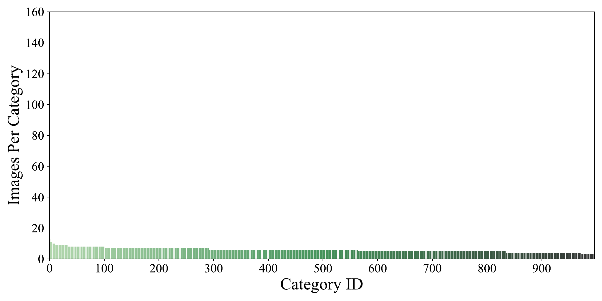
<figcaption>DR-ImageNet.</figcaption>
</figure>
<figure>

<figcaption>H-ImageNet.</figcaption>
</figure>
<figcaption>Number of Attribute per Category for H-ImageNet and DR-ImageNet.</figcaption>
</figure>

<figure id="fig:word coulds attribute">
<figure>
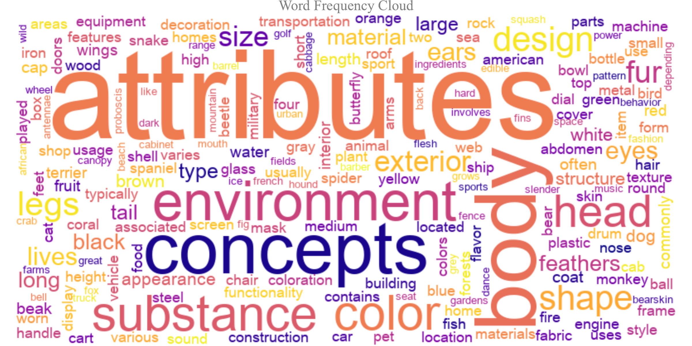
<figcaption>Top Correct Attributes.</figcaption>
</figure>
<figure>
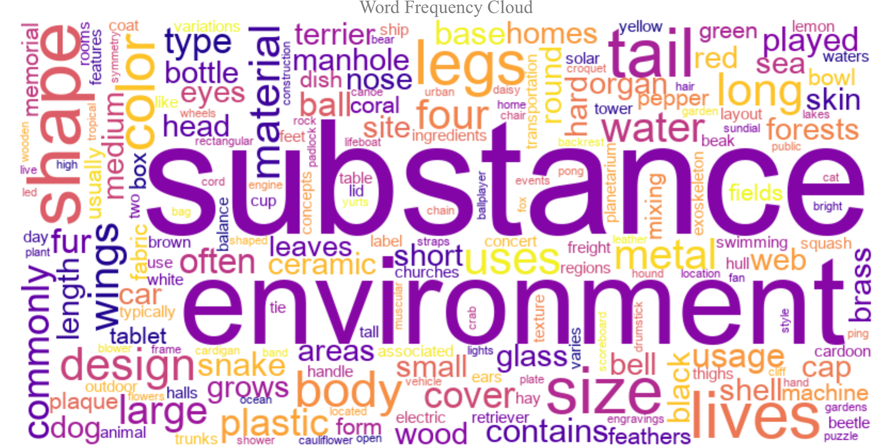
<figcaption>Top Errors.</figcaption>
</figure>
<figcaption>Comparison of word clouds for the most frequently correct attributes and errors. </figcaption>
</figure>

<figure id="fig:enter-label">
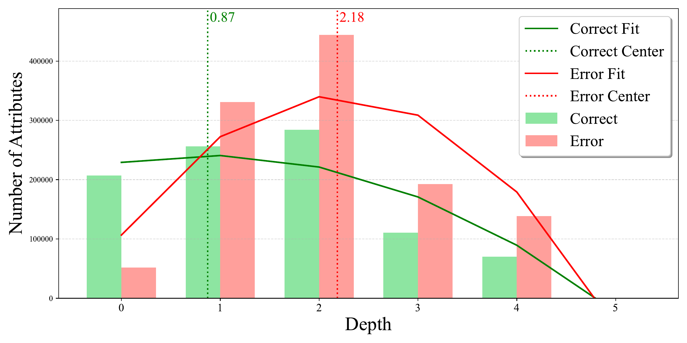
<figcaption>The number of the correct attributes and errors at different tree depth. We fit a quadratic curve to each data and plot the symmetry of the parabola.</figcaption>
</figure>

<figure id="fig:relation">
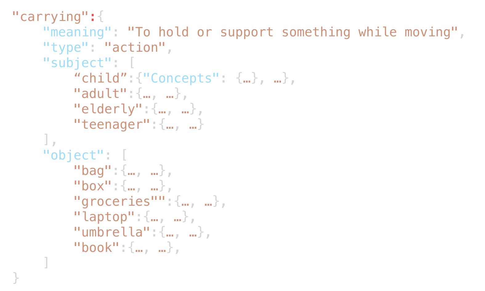
<figcaption>In-context template for relation recognition task. The LLM can identify all “Subject-Relation-Object” triplets.</figcaption>
</figure>

[^1]: Use footnote for providing further information about author (webpage, alternative address)—*not* for acknowledging funding agencies.

[^2]: In practice, we implement \\(d(\mathbf{q},\mathbf{p}) = -\log(\frac{||\mathbf{q}-\mathbf{p}||^2 + 1}{||\mathbf{q}-\mathbf{p}||^2+\epsilon})\\), incorporating \\(\epsilon>0\\) to ensure numerical stability.

[^3]: <https://www.bing.com/images/>

[^4]: <https://chat.openai.com/>

[^5]: <https://github.com/mlfoundations/open_clip>
