# AirSketch: Generative Motion to Sketch

## Abstract

Illustration is a fundamental mode of human expression and communication. Certain types of motion that accompany speech can provide this illustrative mode of communication. While Augmented and Virtual Reality technologies (AR/VR) have introduced tools for producing drawings with hand motions (air drawing), they typically require costly hardware and additional digital markers, thereby limiting their accessibility and portability. Furthermore, air drawing demands considerable skill to achieve aesthetic results. To address these challenges, we introduce the concept of AirSketch, aimed at generating faithful and visually coherent sketches directly from hand motions, eliminating the need for complicated headsets or markers. We devise a simple augmentation-based self-supervised training procedure, enabling a controllable image diffusion model to learn to translate from highly noisy hand tracking images to clean, aesthetically pleasing sketches, while preserving the essential visual cues from the original tracking data. We present two air drawing datasets to study this problem. Our findings demonstrate that beyond producing photo-realistic images from precise spatial inputs, controllable image diffusion can effectively produce a refined, clear sketch from a noisy input. Our work serves as an initial step towards marker-less air drawing and reveals distinct applications of controllable diffusion models to AirSketch and AR/VR in general. Code and dataset are available under: <https://github.com/hxgr4ce/DoodleFusion>.

<figure id="fig:figure1">

<figcaption>Given a hand drawing video, we first use a hand detection algorithm to extract the tracking image (Hand Tracking). We then take this noisy tracking image and generate a clean sketch (Generated), which faithfully and aesthetically resembles the intended sketch (Ground-truth).</figcaption>
</figure>

# Introduction [sec:intro]

Hand gestures are an essential element in communication`\cite{mcneill1992gesture}`{=latex}. In particular, iconic hand motions (*i.e.* air drawing) can depict visual aspects of an object. This form of expression is frequently used to visually supplement verbal communication and is used in various practical applications, including conceptual discussions, overcoming language barriers, and aiding in visual design.

Popular AR/VR tools like Google’s Tiltbrush `\cite{tiltbrush}`{=latex} and HoloARt `\cite{holoart}`{=latex} create visuals via hand motions, but are inconvenient. These applications generally require head-mounted displays and digital hand markers, which are costly and hinder portability. Furthermore, their weight and temperature make them unsuitable for continuous use `\cite{VRtemp, VRweight, headsetworkload}`{=latex}, and so are inconvenient for spontaneous usage. Yet, these devices provide accurate positioning, stabilization, and varied brush controls and are crucial to producing high-quality drawings.

*Can we generate sketches from hand motions without additional sensors or markers?* In order to enhance accessibility and convenience, we aim to generate sketches from hand motions videos captured using any standard camera embedded in devices like smartphones or smart glasses.

One could clearly deploy hand tracking algorithms `\cite{openpose, mediapipe}`{=latex} to turn these hand motion videos into sketches. However, creating air drawings with a hand tracking algorithm alone presents several challenges. These include the user’s drawing ability, physical fatigue, and inaccuracies in hand tracking. Noise in hand tracking can severely distort a sketch, rendering it almost unrecognizable.

The objective, therefore, is to generate clean sketches that faithfully represent the user’s intent, from highly noisy and distorted hand motion input. This task requires the model to possess a deep understanding of shape and object priors, enabling it to discern and correct deformed motion cues while filtering out undesirable noise. We refer to this task as Generative Motion to Sketch.

There are many approaches to this task, with different architecture and data modalities. The input modality might include learned video representations, coordinate sequences from a hand tracking algorithm, or a rasterized image. Depending on the modality, the task may also be reformulated as video-to-sketch, sequence-to-sequence, image-to-image, or a combination thereof. This diversity introduces interesting opportunities for rich exploration of all these diverse approaches.

We explore the use of controllable image Diffusion Models (DM) in generating sketches from motion. Existing work such as ControlNet `\cite{controlnet}`{=latex} and T2IAdapter `\cite{t2iadapter}`{=latex} generate photo-realistic images given spatially-precise conditioning images. We explore a different use case by using controllable DMs to “reconstruct” clean sketches from severely distorted and noisy input images obtained with a hand tracking algorithm. We propose a simple, augmentation-based, self-supervised training procedure and construct two air drawings datasets for evaluation purposes.

Our experiments show that with our augmentation-based training, controllable image DMs are able to recognize and interpret correct visual cues from noisy tracking images, some of which even appear to be nearly unrecognizable to the human eye, and generate sketches faithfully and aesthetically, while being robust to unseen objects. Moreover, we show that through simple augmentations, the model is capable of sketch-completion and text-instructed stroke styling. Finally, we conduct ablations to investigate 1) the effects of different augmentations, 2) the contribution of text prompts to sketch generation and 3) the effect of different levels of input ‘chaos’ on the quality of resulting generations.

In summary, in this paper:

1.  We conduct a pilot study of AirSketch, sketch generation from marker-less air drawing, and provide two air drawing datasets for evaluation.

2.  We propose a controllable DM approach that generates faithful and aesthetic sketches from air-drawn tracking images with a self-supervised, augmentation-based training procedure, and conduct ablation studies to prove its effectiveness and robustness.

3.  We explore a different way of using spatially-conditioned DMs and reveal some of their interesting properties in the context of sketch generation. We hope our experiments shed new light on understanding the properties of controllable DMs and facilitate future research.

# Related Works [sec:related]

## Sketching in AR/VR

There are many methods for drawing in AR and VR. Applications such as Google’s Tilt Brush `\cite{tiltbrush}`{=latex}, Mozilla’s A-Painter `\cite{apainter}`{=latex}, Oculus’ Quill `\cite{quill}`{=latex}, and HoloARt `\cite{holoart}`{=latex} display user strokes as lines or tubes that can extend in all three dimensions. Many sketching applications such as these require a combination of VR/AR headsets and controllers to use. Since drawing freehand with six degrees of freedom makes it difficult to draw steady lines and surfaces, applications like AdaptiBrush `\cite{adaptibrush}`{=latex} and Drawing on Air `\cite{drawingonair}`{=latex} use trajectory-based motion of ribbons to render strokes predictably and reliably. Just-a-Line `\cite{justaline}`{=latex} and ARCore Drawing `\cite{arcoredrawing}`{=latex} are smartphone-based AR drawing applications, where users draw lines by moving a smartphone in the air `\cite{justaline}`{=latex}, or drawing on a smartphone screen `\cite{arcoredrawing}`{=latex}.

## Sketch Applications

#### Representing Sketches.

A sketch can be represented in both vector and pixel space, and with varying levels of abstraction. A sketch can be represented as a rasterized image `\cite{liu2017deep, zhang2018eccv, 8953777, lin2023zeroshot, koley2024youll}`{=latex}, a sequence of coordinates `\cite{sketchrnn, sketchformer, sketchbert}`{=latex}, a set of Bezier curves `\cite{vinker2022clipasso, gal2023breathing}`{=latex}, or a combination `\cite{bhunia2021vectorization}`{=latex}. These representation methods are suited for different tasks. For example, the rasterized image representation is commonly used in Sketch-Based Image Retrieval (SBIR) in order to compare sketches with images, while the coordinate sequence representation is often used for sketch generation. On the other hand, a sketch can also depict the same object at varying abstraction levels, thereby imposing further challenges on downstream tasks, especially sketch-based retrieval in 2D `\cite{lin2023zeroshot, koley2024youll,sain2023clip}`{=latex} and 3D `\cite{wang2015sketchbased, luo2022structureaware, 10376524, koley2024handle}`{=latex}.

#### Sketch Generation.

Most existing sketch generation methods adopt the vector representation `\cite{sketchrnn, sketchformer, sketchbert}`{=latex}, and view sketch generation as an auto-regressive problem on coordinate sequences. These sequences are typically represented by lists of tuple \\((\delta x, \delta y, \mathbf{p})\\), where \\(\delta x\\) and \\(\delta y\\) represent the offset distances of x and y from the previous point, and \\(\mathbf{p}\\) is a one-hot vector indicating the state of the pen. Sketch-RNN `\cite{sketchrnn}`{=latex} uses a Variational Autoencoder (VAE) with a bi-directional RNN as the encoder and an auto-regressive RNN as the decoder. Sketch-Bert `\cite{sketchbert}`{=latex} follows the BERT `\cite{devlin2019bert}`{=latex} model design and training regime. Instead of auto-regressive sketch generation, SketchGAN `\cite{sketchgan}`{=latex} takes in a rasterized sketch image and uses a cascade GAN to iteratively complete the sketch. Sketch-Pix2Seq `\cite{sketchpix2seq}`{=latex} adds a vision encoder on top of Sketch-RNN and thus allow the model to take in an image input and reconstruct the sketch using coordinate sequences.

Nonetheless, these methods generate sketches in the input sketch modality by taking in a sketch and reconstructing the exact same sketch, or by predicting endings given incomplete sketches. In contrast, our work considers the task for generating sketches from hand motions. Specifically, we adopt the image representation for sketch generation as opposed to using coordinate sequences. This offers several advantages: it 1) maintains constant computation complexity with regards to sketch length, 2) is drawing-order invariant, which is especially favorable in our case as we consider extremely noisy sketches as input, and 3) allows us to utilize large pretrained image generative models.

## Image Diffusion Models

#### Diffusion Probabilistic Model.

First introduced by Sohl-Dickstein *et al.* `\cite{pmlr-v37-sohl-dickstein15}`{=latex}, diffusion probabilistic models have been widely applied in image generation `\cite{ddpm, ddim, kingma2023variational}`{=latex}. To reduce computational cost, Latent Diffusion Models `\cite{ldm}`{=latex} project input images to lower dimension latent space, where diffusion steps are performed. Text-to-image diffusion models `\cite{glide, ramesh2022hierarchical, ramesh2021zeroshot, saharia2022photorealistic, podell2023sdxl}`{=latex} achieve text control over image generation by fusing text embeddings obtained by pre-trained language models such as CLIP `\cite{clip}`{=latex} and T5 `\cite{t5}`{=latex} into diffusion UNet `\cite{ronneberger2015unet}`{=latex} via cross attention.

#### Controllable Image Generation.

Beyond text, various recent works have focused on allowing more fine-grained controls over the diffusion process. This can be done via prompt engineering `\cite{yang2022reco, li2023gligen, zhang2023controllable}`{=latex}, manipulating cross-attention `\cite{Avrahami_2022, chen2023trainingfree, ju2023humansd, xie2023boxdiff}`{=latex}, or training additional conditioning adapters `\cite{t2iadapter, controlnet}`{=latex}. ControlNet `\cite{controlnet}`{=latex} learns a trainable copy of the frozen UNet encoder and connects it to the original UNet via zero convolution. T2IAdapter `\cite{t2iadapter}`{=latex} trains a lightweight adapter to predict residuals that are added to the UNet encoder at multiple scales.

In particular, both ControlNet and T2IAdapter take spatially-precise conditional images such as canny edge, depth, and skeleton images extracted from the original image. Koley *et al.* `\cite{koley2024its}`{=latex} considers human sketches as a condition and observes that human sketches have shapes that are deformed compared to canny edge or depth images, resulting in generations that lack photo-realism. Therefore, they avoid using the spatial-conditioning approach by training a sketch adapter to transform the sketch into language tokens that replace the text embeddings as the input to the cross attention.

In our work, we show that the spatial-conditioning does not have to be a “hard” constraint, at least not in the domain of sketch generation. Through proper augmentations, we discover that we can indeed teach ControlNet to map from a noisy input condition to a clean output.

## Hand tracking and gesture recognition

Hand tracking and gesture recognition are used for several purposes, including communication and interaction in an AR environment `\cite{poseforar}`{=latex} `\cite{handyar}`{=latex} and VR `\cite{VRhandinteraction}`{=latex}, for image-based pose estimation in sign language recognition `\cite{arabicSL}`{=latex} `\cite{saudiSL}`{=latex} `\cite{arabicrcnn}`{=latex}, and many others `\cite{3dhandposesurvey}`{=latex} `\cite{handposesurvey2}`{=latex}. Many of these require depth-sensing hardware, such as work done by Oikonomidis et. al. using a Kinect sensor `\cite{kinect}`{=latex}, or use deep learning for pose estimation `\cite{selfsupervised}`{=latex} `\cite{depthcnn}`{=latex}, making it difficult to integrate them into lightweight systems.

Hand pose estimation such as MediaPipe Hands `\cite{mediapipe}`{=latex} and OpenPose `\cite{openpose}`{=latex} take in RGB images or video and return the coordinates of 21 landmarks for each hand detected, and MediaPipe Hands is lightweight enough to integrate into even mobile devices.

# Air-Drawing Dataset [sec:dataset]

In order to thoroughly evaluate our model, we need datasets with sketch-video pairs. Popular sketch datasets include Sketchy `\cite{sketchy}`{=latex}, TUBerlin `\cite{tuberlin}`{=latex}, and Quick, Draw! `\cite{kqd}`{=latex}. There are also hand motion datasets that associate hand motions with semantic meaning, such as Sign Language MNIST `\cite{ASLmnist}`{=latex}, How2Sign `\cite{how2sign}`{=latex}, and the American Sign Language Lexicon Video Dataset `\cite{asllvd}`{=latex}. However, there are no datasets that associate sketches with air drawing hand motions, prompting us to create our own sketch-video pair datasets for evaluation purposes.

<figure id="fig:dataset_example">

<figcaption> Examples of air drawing videos. Left: synthetic hand drawing; Right: real hand drawing.</figcaption>
</figure>

#### Synthetic Air-Drawing Dataset.

We use samples from the Quick, Draw! dataset `\cite{kqd}`{=latex} as the intended ground-truth sketch; each stroke is represented as a sequence of timestamps and coordinates. A 3D human arm asset is animated in the Unity engine `\cite{arm}`{=latex} using inverse kinematics and rotation constraints, see Figure <a href="#fig:dataset_example" data-reference-type="ref" data-reference="fig:dataset_example">2</a> (left). While following stroke coordinates, the index finger is extended, and when the stroke ends, the hand is in a closed fist. The videos have an aspect ratio of 1920 by 1080 pixels and were recorded at 60 frames per second. We choose 50 common object categories from Quick, Draw! dataset, each with 100 sketches to form our synthetic dataset with a total of 5000 sketch-video pairs. This synthetic Air-Drawing dataset simulates the scenario where users have perfect drawing ability, and the errors are solely introduced by the tracking algorithm.

#### Real Air-Drawing Dataset.

A human user attempts to replicate sketches from the Quick, Draw! dataset by moving their index finger through the air. The videos were recorded with aspect ratio of 1280 by 720 pixels and at 30 frames per second. We take 10 samples per category used in the synthetic dataset, resulting in 500 video-sketch pairs.

# Methods [sec:methods]

Our method trains a controllable DM to recover the clean sketch from a noisy one, which we discuss in Sections <a href="#controlldm" data-reference-type="ref" data-reference="controlldm">4.1</a> and <a href="#traindm" data-reference-type="ref" data-reference="traindm">4.2</a>. As input at training time, we simulate noisy sketches produced from the direct application of a hand tracking algorithm, discussed in Section <a href="#sec:aug" data-reference-type="ref" data-reference="sec:aug">4.3</a>. Finally, we evaluate our model using two different datasets: a dataset of 3D animated hand motion videos, and a small dataset of real hand motion videos. The creation of these two datasets is discussed in Section <a href="#sec:dataset" data-reference-type="ref" data-reference="sec:dataset">3</a>.

## Preliminary: Controllable DMs [controlldm]

Diffusion models involve a forward and inverse diffusion process. Given an input image \\(\bm{x}_0\\), the forward process gradually adds noise to \\(\bm{x}_0\\) to form a noisy input \\(\bm{x}_t\\) at time step \\(\bm{t}\\) as: \\[\bm{x}_t = \sqrt{\bar{\alpha}_t}\bm{x}_0 + (\sqrt{1-\bar{\alpha}_t})\epsilon, \epsilon \sim \mathcal{N}(0, \bm{I})\\] where \\(\bar{\alpha}_t := \prod^{t}_{i=1} \alpha_i\\), and \\(\alpha_t = 1 - \beta_t\\) is determined by a pre-defined noise scheduler `\cite{ddpm}`{=latex}.

The reverse process trains a denoising UNet \\(\epsilon_\theta(\cdot)\\) to predict the noise \\(\epsilon\\) added to input \\(\bm{z}_0\\). In the context of controllable generation, as in ControlNet `\cite{controlnet}`{=latex} and T2IAdapter `\cite{t2iadapter}`{=latex}, with a set of conditions including a text prompt \\(\bm{c}_t\\) and an additional condition \\(\bm{c}_\text{f}\\), the overall loss can be defined as: \\[% 
        \mathcal{L} = \mathbb{E}_{\bm{x}_0, \bm{t}, \bm{c}_t, \bm{c}_\text{f}, \epsilon \sim \mathcal{N}(0, 1) }\Big[ \Vert \epsilon - \epsilon_\theta(\bm{x}_{t}, \bm{t}, \bm{c}_t, \bm{c}_\text{f})\Vert_{2}^{2}\Big],
        \label{eq:loss}\\]

## Training Controllable DMs for Sketch Recovery [traindm]

<figure id="fig:pipeline">
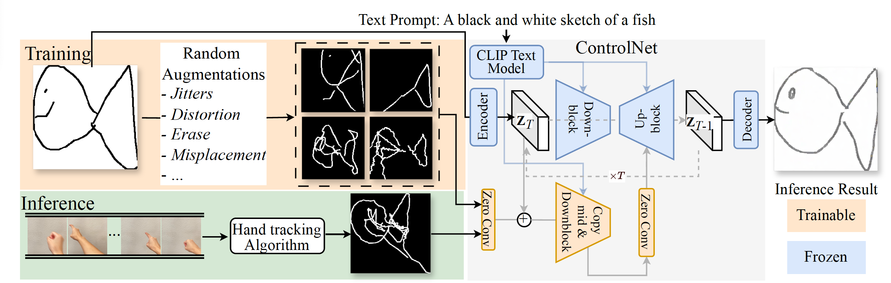
<figcaption> The overall pipeline for training and inference. During training, we randomly apply augmentations to the original ground-truth sketch to form a distorted view. The distorted view is passed to ControlNet, which is asked to generate the original, undistorted sketch. During inference, a hand-tracking algorithm is used on a hand motion video to create the input. </figcaption>
</figure>

We adopt ControlNet `\cite{controlnet}`{=latex} as our primary controlling approach. Our training procedure is illustrated in Figure <a href="#fig:pipeline" data-reference-type="ref" data-reference="fig:pipeline">3</a>. Due to the lack of sketch-video pair datasets, we devise a self-supervised, augmentation-based training procedure. During training, for each sketch image, we randomly sample combinations of augmentations \\(\mathcal{A}(\cdot)\\) and apply to \\(\bm{x}_0\\) to get the distorted view \\(\mathcal{A}(\bm{x}_0)\\). It is then used as the input to ControlNet’s conditioning adapter. Hence, the loss function <a href="#eq:loss" data-reference-type="ref" data-reference="eq:loss">[eq:loss]</a> can be re-written as: \\[% 
        \mathcal{L} = \mathbb{E}_{\bm{x}_0, \bm{t}, \bm{c}_t, \bm{c}_\text{f}, \epsilon \sim \mathcal{N}(0, 1) }\Big[ \Vert \epsilon - \epsilon_\theta(\bm{x}_{t}, \bm{t}, \bm{c}_t, \mathcal{A}(\bm{x}_0)) \Vert_{2}^{2}\Big].
        \label{eq:loss2}\\]

Therefore, unlike regular controllable DMs where the conditioning adapter takes in edge-like maps and predicts spatial-conditioning signals to be injected to the UNet, our adapter learns both the spatial-conditioning signals and a mapping from the distorted to the clean input: \\(\mathcal{A}(\bm{x}_0) \shortrightarrow \bm{x}_0\\).

## Sketch Augmentations [sec:aug]

We categorize the prevalent errors from air drawings into three types: 1) user-induced artifacts such as hand jitters and stroke distortions, 2) hand tracking errors such as inaccurate hand landmark predictions, unintended strokes, and 3) aesthetic shortcomings related to the user’s drawing proficiency. In order to closely replicate these artifacts, we carefully examine typical noise found in real tracking samples and divide them into 3 categories: local, structural, and false strokes. For each category, we observe several types of artifacts, and apply augmentations to introduce each artifact to an input sketch. Visual examples for these augmentations are shown in Figure <a href="#fig:aug_examples" data-reference-type="ref" data-reference="fig:aug_examples">4</a>.

<figure id="fig:aug_examples">
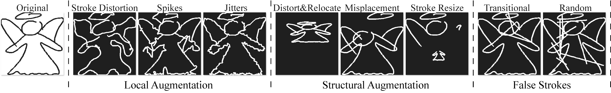
<figcaption> Visual examples of different augmentations.</figcaption>
</figure>

**Local artifacts** include jitters, stroke-wise distortion, and random spikes. Jitters are common and become especially obvious when drawing speed is low. Stroke-wise distortion happens when users fail to properly draw the desired shape primitive (e.g. drawing a rectangle but ending up with unwanted curvy edges), potentially due to lack of friction and visual landmarks. Random spikes can arise from an accidental jerk of a user’s hand or an incorrect detection from the tracking algorithm.

**Structural artifacts** include sketch-level distortion, incorrect stroke size, and misplacement. Sketch-level distortion refers to an overall distorted aspect ratio; incorrect stroke size and misplacement occur when the user unintentionally draws a stroke too small/large, and/or at the wrong position.

**False strokes** refer to unintentionally drawn strokes which commonly occur in three situations: entering or exiting the canvas, transitioning between strokes, and hesitating during drawing.

Unlike real images where shapes and scales are strictly defined, sketches are more versatile and thus do not have a clear boundary for correctness. For example, a slight change of scale during augmentation does not falsify the sketch. Therefore, we carefully tune the augmentation parameters such that the resulting augmented sketches are, in general, obviously incorrect.

# Experiments

#### Datasets and Implementation Details.

In training, we use a subset of 100 categories from the Quick, Draw! dataset `\cite{kqd}`{=latex}. Because a large portion of Quick, Draw! sketches are not well-drawn, we first calculate the CLIP Image-Text similarity between each sketch and their corresponding category and select the top 5% from each category, resulting in 60K sketches. Note that the sketches used for training are mutually exclusive with the sketches used for generating synthetic and real tracking images used during evaluation. To test for generalizability, we select 10 categories with similar statistics [^2] from the rest and exclude them from training.

We primarily use Stable Diffusion XL `\cite{podell2023sdxl}`{=latex} (SDXL) in our experiments, and adhere to the original ControlNet training and inference procedures. During both training and inference phases, we use text prompts in the format of “a black and white sketch of a \<category\>” to guide the model generation. We also finetune SDXL on the Quick, Draw! dataset with Low-Rank Adaptation `\cite{lora}`{=latex} (LoRA) in order to “equip” the model with the basic ability to generate sketches in the appropriate style.

#### Evaluation Metrics.

 We primarily focus on using faithfulness, or the similarity between the generated sketch and the ground-truth sketch, as our model performance. Due to the versatility of sketches, we adopt multiple metrics to ensure comprehensive measurements. On the pixel-level, we use SSIM `\cite{ssim}`{=latex} to measure detailed local structural similarity, and Chamfer Distance `\cite{cd}`{=latex} (CD) for global comparison, as CD is less sensitive to local density mismatch. Taking a perceptual perspective, we adopt LPIPS `\cite{lpips}`{=latex}, CLIP `\cite{clip}`{=latex} Image-to-Image similarity (I2I), and CLIP Image-to-Text similarity (I2T) between sketches and their corresponding text prompts to measure “recognizability”.

We benchmark our model on the similarity between the ground-truth sketch and the hand tracking image. We then train a ControlNet on sketches but without any augmentation as our second baseline.

<table>
<caption> Results on the similarity between generated and ground-truth sketches from Quick, Draw! dataset. “Tracking” refers to hand tracking images, and “Gen.” refers to generated images. “w/ Aug.” refers to whether sketch augmentations have been applied. “CLIP I2I/I2T” refers to CLIP Image-to-Image/Image-to-Text similarity.</caption>
<thead>
<tr>
<th style="text-align: left;"></th>
<th style="text-align: center;">Dataset</th>
<th style="text-align: center;">Backbone</th>
<th style="text-align: center;">w/ Aug.</th>
<th style="text-align: center;">SSIM (↑)</th>
<th style="text-align: center;">CD (↓)</th>
<th style="text-align: center;">LPIPS (↓)</th>
<th style="text-align: center;">CLIP I2I (↑)</th>
<th style="text-align: center;">CLIP I2T (↑)</th>
</tr>
</thead>
<tbody>
<tr>
<td colspan="9" style="text-align: center;">Seen Categories</td>
</tr>
<tr>
<td style="text-align: left;">Tracking</td>
<td style="text-align: center;">synth.</td>
<td style="text-align: center;">–</td>
<td style="text-align: center;">–</td>
<td style="text-align: center;">0.59</td>
<td style="text-align: center;">20.12</td>
<td style="text-align: center;">0.36</td>
<td style="text-align: center;">0.80</td>
<td style="text-align: center;">0.22</td>
</tr>
<tr>
<td style="text-align: left;">Gen.</td>
<td style="text-align: center;">synth.</td>
<td style="text-align: center;">SDXL</td>
<td style="text-align: center;"></td>
<td style="text-align: center;">0.59</td>
<td style="text-align: center;">20.11</td>
<td style="text-align: center;">0.37</td>
<td style="text-align: center;">0.79</td>
<td style="text-align: center;">0.23</td>
</tr>
<tr>
<td style="text-align: left;">Gen.</td>
<td style="text-align: center;">synth.</td>
<td style="text-align: center;">SD1.5</td>
<td style="text-align: center;"></td>
<td style="text-align: center;">0.60</td>
<td style="text-align: center;">17.98</td>
<td style="text-align: center;">0.35</td>
<td style="text-align: center;">0.80</td>
<td style="text-align: center;">0.26</td>
</tr>
<tr>
<td style="text-align: left;">Gen.</td>
<td style="text-align: center;">synth.</td>
<td style="text-align: center;">SDXL</td>
<td style="text-align: center;"></td>
<td style="text-align: center;"><strong>0.64</strong></td>
<td style="text-align: center;"><strong>17.39</strong></td>
<td style="text-align: center;"><strong>0.33</strong></td>
<td style="text-align: center;"><strong>0.85</strong></td>
<td style="text-align: center;"><strong>0.28</strong></td>
</tr>
<tr>
<td style="text-align: left;">Tracking</td>
<td style="text-align: center;">real</td>
<td style="text-align: center;">–</td>
<td style="text-align: center;">–</td>
<td style="text-align: center;">0.55</td>
<td style="text-align: center;">32.36</td>
<td style="text-align: center;">0.42</td>
<td style="text-align: center;">0.76</td>
<td style="text-align: center;">0.21</td>
</tr>
<tr>
<td style="text-align: left;">Gen.</td>
<td style="text-align: center;">real</td>
<td style="text-align: center;">SDXL</td>
<td style="text-align: center;"></td>
<td style="text-align: center;">0.55</td>
<td style="text-align: center;">31.99</td>
<td style="text-align: center;">0.41</td>
<td style="text-align: center;">0.79</td>
<td style="text-align: center;">0.21</td>
</tr>
<tr>
<td style="text-align: left;">Gen.</td>
<td style="text-align: center;">real</td>
<td style="text-align: center;">SD1.5</td>
<td style="text-align: center;"></td>
<td style="text-align: center;">0.59</td>
<td style="text-align: center;">27.59</td>
<td style="text-align: center;">0.38</td>
<td style="text-align: center;">0.80</td>
<td style="text-align: center;">0.27</td>
</tr>
<tr>
<td style="text-align: left;">Gen.</td>
<td style="text-align: center;">real</td>
<td style="text-align: center;">SDXL</td>
<td style="text-align: center;"></td>
<td style="text-align: center;"><strong>0.64</strong></td>
<td style="text-align: center;"><strong>25.46</strong></td>
<td style="text-align: center;"><strong>0.36</strong></td>
<td style="text-align: center;"><strong>0.84</strong></td>
<td style="text-align: center;"><strong>0.29</strong></td>
</tr>
<tr>
<td colspan="9" style="text-align: center;">Unseen Categories</td>
</tr>
<tr>
<td style="text-align: left;">Tracking</td>
<td style="text-align: center;">synth.</td>
<td style="text-align: center;">–</td>
<td style="text-align: center;">–</td>
<td style="text-align: center;">0.59</td>
<td style="text-align: center;">20.47</td>
<td style="text-align: center;">0.36</td>
<td style="text-align: center;">0.80</td>
<td style="text-align: center;">0.22</td>
</tr>
<tr>
<td style="text-align: left;">Gen.</td>
<td style="text-align: center;">synth.</td>
<td style="text-align: center;">SDXL</td>
<td style="text-align: center;"></td>
<td style="text-align: center;">0.59</td>
<td style="text-align: center;">20.32</td>
<td style="text-align: center;">0.35</td>
<td style="text-align: center;">0.81</td>
<td style="text-align: center;">0.22</td>
</tr>
<tr>
<td style="text-align: left;">Gen.</td>
<td style="text-align: center;">synth.</td>
<td style="text-align: center;">SD1.5</td>
<td style="text-align: center;"></td>
<td style="text-align: center;">0.60</td>
<td style="text-align: center;">17.50</td>
<td style="text-align: center;">0.35</td>
<td style="text-align: center;">0.80</td>
<td style="text-align: center;">0.26</td>
</tr>
<tr>
<td style="text-align: left;">Gen.</td>
<td style="text-align: center;">synth.</td>
<td style="text-align: center;">SDXL</td>
<td style="text-align: center;"></td>
<td style="text-align: center;"><strong>0.64</strong></td>
<td style="text-align: center;"><strong>17.27</strong></td>
<td style="text-align: center;"><strong>0.34</strong></td>
<td style="text-align: center;"><strong>0.85</strong></td>
<td style="text-align: center;"><strong>0.27</strong></td>
</tr>
<tr>
<td style="text-align: left;">Tracking</td>
<td style="text-align: center;">real</td>
<td style="text-align: center;">–</td>
<td style="text-align: center;">–</td>
<td style="text-align: center;">0.54</td>
<td style="text-align: center;">33.92</td>
<td style="text-align: center;">0.42</td>
<td style="text-align: center;">0.76</td>
<td style="text-align: center;">0.21</td>
</tr>
<tr>
<td style="text-align: left;">Gen.</td>
<td style="text-align: center;">real</td>
<td style="text-align: center;">SDXL</td>
<td style="text-align: center;"></td>
<td style="text-align: center;">0.55</td>
<td style="text-align: center;">33.53</td>
<td style="text-align: center;">0.41</td>
<td style="text-align: center;">0.78</td>
<td style="text-align: center;">0.21</td>
</tr>
<tr>
<td style="text-align: left;">Gen.</td>
<td style="text-align: center;">real</td>
<td style="text-align: center;">SD1.5</td>
<td style="text-align: center;"></td>
<td style="text-align: center;">0.61</td>
<td style="text-align: center;">27.67</td>
<td style="text-align: center;">0.38</td>
<td style="text-align: center;">0.80</td>
<td style="text-align: center;">0.27</td>
</tr>
<tr>
<td style="text-align: left;">Gen.</td>
<td style="text-align: center;">real</td>
<td style="text-align: center;">SDXL</td>
<td style="text-align: center;"></td>
<td style="text-align: center;"><strong>0.63</strong></td>
<td style="text-align: center;"><strong>24.26</strong></td>
<td style="text-align: center;"><strong>0.38</strong></td>
<td style="text-align: center;"><strong>0.85</strong></td>
<td style="text-align: center;"><strong>0.28</strong></td>
</tr>
</tbody>
</table>

## Results and Analysis

#### Faithfulness.

In Figure <a href="#fig:figure1" data-reference-type="ref" data-reference="fig:figure1">1</a> we can clearly observe the ControlNet trained with augmentations successfully identifies the visual cues from the noisy tracking image, removes artifacts, and generates the clean sketches, while being aesthetic and semantically coherent. Unsurprisingly, ControlNet trained without augmentations fails to make any improvement from the tracking. In Figure <a href="#fig:tuberlin" data-reference-type="ref" data-reference="fig:tuberlin">5</a> we show additional results where the model is trained on TUBerlin `\cite{tuberlin}`{=latex} dataset.

<figure id="fig:tuberlin">
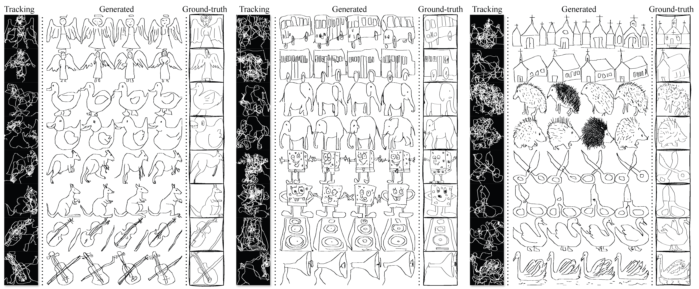
<figcaption> Generations on TUBerlin dataset.</figcaption>
</figure>

Table <a href="#tab:table1" data-reference-type="ref" data-reference="tab:table1">1</a> shows quantitative results for measuring the faithfulness of generated sketch images to ground-truth. For both synthetic and real datasets, we observe a noticeable performance gain. For example, with the real dataset and SDXL, SSIM increases by 10% in SSIM, LPIPS decreases by 6%, and CD decreases by 21%.

<figure id="fig:compare_p2s">

Quantitative comparison between Sketch-Pix2Seq (P2S.) and ours on a subset of 10 classes. 

<table>
<thead>
<tr>
<th style="text-align: left;"></th>
<th style="text-align: center;">SSIM (↑)</th>
<th style="text-align: center;">CD (↓)</th>
<th style="text-align: center;">I2I (↑)</th>
<th style="text-align: center;">I2T (↑)</th>
<th style="text-align: center;"></th>
<th style="text-align: center;"></th>
</tr>
</thead>
<tbody>
<tr>
<td style="text-align: left;">Tracking</td>
<td style="text-align: center;">0.5</td>
<td style="text-align: center;">32.36</td>
<td style="text-align: center;">0.76</td>
<td style="text-align: center;">0.21</td>
<td style="text-align: center;"></td>
<td style="text-align: center;"></td>
</tr>
<tr>
<td style="text-align: left;">P2S.</td>
<td style="text-align: center;">0.58</td>
<td style="text-align: center;">30.19</td>
<td style="text-align: center;">0.82</td>
<td style="text-align: center;">0.26</td>
<td style="text-align: center;"></td>
<td style="text-align: center;"></td>
</tr>
<tr>
<td style="text-align: left;">Ours</td>
<td style="text-align: center;"><strong>0.63</strong></td>
<td style="text-align: center;"><strong>25.45</strong></td>
<td style="text-align: center;"><strong>0.83</strong></td>
<td style="text-align: center;"><strong>0.29</strong></td>
<td style="text-align: center;"></td>
<td style="text-align: center;"></td>
</tr>
</tbody>
</table>
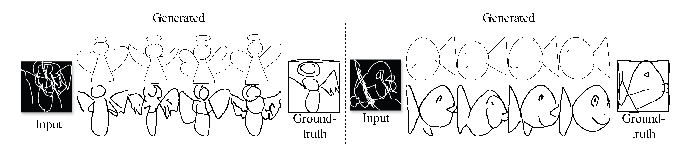
<figcaption>A comparison between generations from Sketch-Pix2Seq (top) and ours (bottom).</figcaption>
</figure>

In Table <a href="#table:compare_p2s" data-reference-type="ref" data-reference="table:compare_p2s">[table:compare_p2s]</a> and Figure <a href="#fig:compare_p2s" data-reference-type="ref" data-reference="fig:compare_p2s">6</a> we show comparison between ours and Sketch-Pix2Seq `\cite{sketchpix2seq}`{=latex} (P2S). Since P2S performs best when the model is trained on only one category, we randomly pick 10 categories to train 10 P2S models, and compare with ours using the selected categories. For each P2S model, following the original work, we first train 60M steps for reconstructing the exact same input sketch, and subsequently train 40M steps for constructing the clean sketch given the noisy tracking image. In Table <a href="#table:compare_p2s" data-reference-type="ref" data-reference="table:compare_p2s">[table:compare_p2s]</a> our SSIM and CD are noticeably higher than P2S, suggesting better faithfulness. This is validated in Figure <a href="#fig:compare_p2s" data-reference-type="ref" data-reference="fig:compare_p2s">6</a>, where we can observe while P2S is able to generate semantically correct sketches, it fails to follow the input tracking faithfully. Moreover, as P2S requires to train a separate model on each individual category and has no generalizability, it is hard to adapt to real-world usage.

<figure id="fig:saliency">
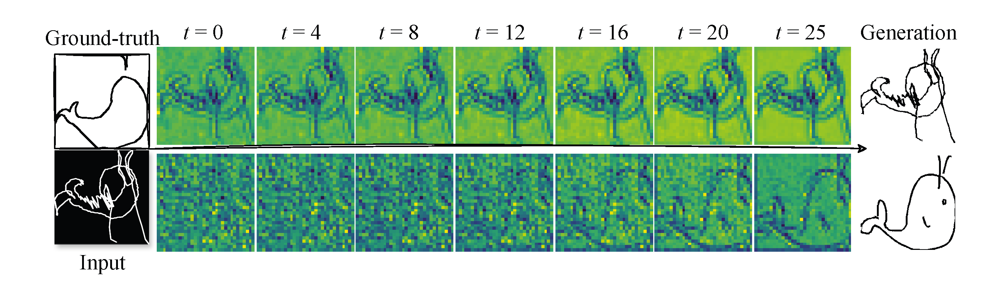
<figcaption>A comparison of visualization of ControlNet hidden states throughout denoising process from baseline approach without augmentation (top) and with augmentations (bottom).</figcaption>
</figure>

In Figure <a href="#fig:saliency" data-reference-type="ref" data-reference="fig:saliency">7</a> we show visualizations of the ControlNet hidden states across denoising steps for both the baseline model, trained with the original ControlNet recipe (top row), and our model with noise-augmented training (bottom row). The baseline ControlNet hidden states closely approximate the input edge structure early in the denoising process but fail to converge toward a clean sketch representation, resulting in largely static visualizations. In contrast, the hidden states from our noise-augmented training progressively reveal a coherent and accurate sketch outline throughout the denoising process.

<figure id="fig:held_out">
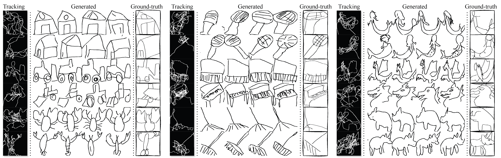
<figcaption> Generations on unseen categories from Quick, Draw! dataset.</figcaption>
</figure>

#### Generalizability.

From Figure <a href="#fig:held_out" data-reference-type="ref" data-reference="fig:held_out">8</a> we can see that our model generalizes well to categories which are not seen during training, suggesting that the trained ControlNet learns a robust category-agnostic mapping from the noisy to clean sketch. The generalizability is also verified in Table <a href="#tab:table1" data-reference-type="ref" data-reference="tab:table1">1</a>, where the resulting scores for unseen categories are close to scores obtained on the seen categories.

## Ablations [sec:ablations]

#### Role of Augmentations.

In Table <a href="#table:aug" data-reference-type="ref" data-reference="table:aug">2</a> we provide similarity scores between ground-truth and generated sketches when different combinations of augmentations are applied in training. We observe that local augmentations plays an important role in detailed local similarity: with only local augmentation applied, SSIM increases more than other metrics, with a 10% improvement to the baseline, yet increases by only 4% and 0% when only false strokes and structural augmentations are applied. Conversely, false strokes and structural augmentation have larger effects on the global similarity of the generated sketch: CD decreases by 9% and 3% when only false strokes and structural augmentations are applied, respectively.

In Figure <a href="#fig:aug" data-reference-type="ref" data-reference="fig:aug">9</a> we provide visual results when different combinations of sketch augmentations are applied during training. We observe that local augmentations are indeed crucial to removing jitters and correcting deformed lines, while false stroke augmentations ensure that the model does not falsely follow the spatial-conditions introduced by these false strokes. The structural augmentations are less significant, likely because structural artifacts are not as common as local artifacts and false strokes.

<figure id="fig:aug">

<figcaption> Qualitative results when different combinations of augmentations are applied during training. Each column represents the generated sketches when the model is trained with one combination of augmentations, e.g. Column 2 are the generated sketches when only structural augmentations are applied during training.</figcaption>
</figure>

<table>
<caption> Model trained on seen categories with different combinations of augmentations. All the experiments are conducted using Stable Diffusion1.5 and trained for 5K steps.</caption>
<thead>
<tr>
<th style="text-align: center;">Local</th>
<th style="text-align: center;">Structural</th>
<th style="text-align: center;">False Strokes</th>
<th style="text-align: center;">SSIM (↑)</th>
<th style="text-align: center;">CD (↓)</th>
<th style="text-align: center;">LPIPS (↓)</th>
<th style="text-align: center;">CLIP I2I (↑)</th>
<th style="text-align: center;">CLIP I2T (↑)</th>
</tr>
</thead>
<tbody>
<tr>
<td colspan="3" style="text-align: center;">Orig. vs Tracking</td>
<td style="text-align: center;">0.55</td>
<td style="text-align: center;">32.36</td>
<td style="text-align: center;">0.42</td>
<td style="text-align: center;">0.76</td>
<td style="text-align: center;">0.21</td>
</tr>
<tr>
<td style="text-align: center;"></td>
<td style="text-align: center;"></td>
<td style="text-align: center;"></td>
<td style="text-align: center;">0.60</td>
<td style="text-align: center;">31.49</td>
<td style="text-align: center;">0.39</td>
<td style="text-align: center;">0.83</td>
<td style="text-align: center;">0.27</td>
</tr>
<tr>
<td style="text-align: center;"></td>
<td style="text-align: center;"></td>
<td style="text-align: center;"></td>
<td style="text-align: center;">0.55</td>
<td style="text-align: center;">31.14</td>
<td style="text-align: center;">0.41</td>
<td style="text-align: center;">0.80</td>
<td style="text-align: center;">0.24</td>
</tr>
<tr>
<td style="text-align: center;"></td>
<td style="text-align: center;"></td>
<td style="text-align: center;"></td>
<td style="text-align: center;">0.57</td>
<td style="text-align: center;">29.04</td>
<td style="text-align: center;">0.40</td>
<td style="text-align: center;">0.82</td>
<td style="text-align: center;">0.24</td>
</tr>
<tr>
<td style="text-align: center;"></td>
<td style="text-align: center;"></td>
<td style="text-align: center;"></td>
<td style="text-align: center;">0.60</td>
<td style="text-align: center;">31.21</td>
<td style="text-align: center;">0.39</td>
<td style="text-align: center;">0.83</td>
<td style="text-align: center;">0.28</td>
</tr>
<tr>
<td style="text-align: center;"></td>
<td style="text-align: center;"></td>
<td style="text-align: center;"></td>
<td style="text-align: center;">0.61</td>
<td style="text-align: center;">29.82</td>
<td style="text-align: center;">0.37</td>
<td style="text-align: center;">0.83</td>
<td style="text-align: center;">0.28</td>
</tr>
<tr>
<td style="text-align: center;"></td>
<td style="text-align: center;"></td>
<td style="text-align: center;"></td>
<td style="text-align: center;">0.60</td>
<td style="text-align: center;">28.97</td>
<td style="text-align: center;">0.39</td>
<td style="text-align: center;">0.82</td>
<td style="text-align: center;">0.23</td>
</tr>
<tr>
<td style="text-align: center;"></td>
<td style="text-align: center;"></td>
<td style="text-align: center;"></td>
<td style="text-align: center;"><strong>0.62</strong></td>
<td style="text-align: center;"><strong>27.33</strong></td>
<td style="text-align: center;"><strong>0.37</strong></td>
<td style="text-align: center;"><strong>0.84</strong></td>
<td style="text-align: center;"><strong>0.29</strong></td>
</tr>
</tbody>
</table>

#### Effect of Text Prompts.

Input tracking image conditions are extremely noisy and may not even possess obvious visual cues about the nature of the intended sketch. It is then important to investigate the effect of text guidance on the generated output and examine if our augmentation-based training significantly contributes to the generation, or if it is guided purely by text prompts.

In Table <a href="#table:prompt_table" data-reference-type="ref" data-reference="table:prompt_table">[table:prompt_table]</a> we show the similarity scores between the ground-truth and generated sketches with or without prompt on seen or unseen categories. When no augmentation is applied during training, there is little to no performance gain, even with a text prompt. When augmentations are present, in most cases, there is noticeable improvement across all metrics. Such results verify the necessity of our augmentation-based training procedure.

<figure id="fig:noprompt">
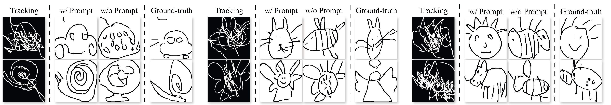
<figcaption> Examples of incorrect generation on unseen categories due to the absence of text prompt (w/o Prompt), comparing to correct generations when prompt is present (w/ Prompt). </figcaption>
</figure>

We find that the model tends to rely more on text prompts when working with unseen categories. When prompts are not present, CLIP I2T and CD drop 24.7% and 21.4% respectively on the unseen categories, versus a decrease of 4.9% and 10.3% on the seen categories. In Figure <a href="#fig:noprompt" data-reference-type="ref" data-reference="fig:noprompt">10</a>, we show examples of the model failing to generate the correct sketch when no prompt is present, under unseen categories. Consider the bottom left example of Figure <a href="#fig:noprompt" data-reference-type="ref" data-reference="fig:noprompt">10</a>: the ground-truth sketch (Ground-truth) represents a snail. With the corresponding text prompt, the model successfully generates a sketch of a snail, following visual cues in the tracking image (Tracking) such as the spiral shape. When no prompt is given, the model falsely, yet reasonably, generates a fan (w/o Prompt) – a category seen during training. In fact, in the absence of a text prompt and given an input from an unseen category, we find that the failure cases tend to be generated sketches of the seen categories.

<figure id="fig:cd_bar">

 Quantitative results on real air drawing dataset with/without prompts. “w/ Aug.” refers to with/without augmentations. “w/ P.” refers to with/without prompts. “I2I” refers to CLIP Image-Image similarity between tracking/generated and ground-truth sketch, and “I2T” refers to CLIP Image-Text similarity between sketches and texts associated with their class labels. 

<table>
<thead>
<tr>
<th style="text-align: center;">w/ Aug.</th>
<th style="text-align: center;">w/ P.</th>
<th style="text-align: center;">SSIM (↑)</th>
<th style="text-align: center;">CD (↓)</th>
<th style="text-align: center;">LPIPS (↓)</th>
<th style="text-align: center;">I2I (↑)</th>
<th style="text-align: center;">I2T (↑)</th>
</tr>
</thead>
<tbody>
<tr>
<td colspan="7" style="text-align: center;">Seen Categories</td>
</tr>
<tr>
<td colspan="2" style="text-align: center;">Tracking</td>
<td style="text-align: center;">0.55</td>
<td style="text-align: center;">32.36</td>
<td style="text-align: center;">0.42</td>
<td style="text-align: center;">0.76</td>
<td style="text-align: center;">0.21</td>
</tr>
<tr>
<td style="text-align: center;"></td>
<td style="text-align: center;"></td>
<td style="text-align: center;">0.55</td>
<td style="text-align: center;">31.99</td>
<td style="text-align: center;">0.41</td>
<td style="text-align: center;">0.79</td>
<td style="text-align: center;">0.21</td>
</tr>
<tr>
<td style="text-align: center;"></td>
<td style="text-align: center;"></td>
<td style="text-align: center;">0.56</td>
<td style="text-align: center;">32.09</td>
<td style="text-align: center;">0.40</td>
<td style="text-align: center;">0.78</td>
<td style="text-align: center;">0.21</td>
</tr>
<tr>
<td style="text-align: center;"></td>
<td style="text-align: center;"></td>
<td style="text-align: center;"><strong>0.64</strong></td>
<td style="text-align: center;"><strong>25.46</strong></td>
<td style="text-align: center;"><strong>0.36</strong></td>
<td style="text-align: center;"><strong>0.85</strong></td>
<td style="text-align: center;"><strong>0.29</strong></td>
</tr>
<tr>
<td style="text-align: center;"></td>
<td style="text-align: center;"></td>
<td style="text-align: center;">0.63</td>
<td style="text-align: center;">26.70</td>
<td style="text-align: center;">0.36</td>
<td style="text-align: center;">0.81</td>
<td style="text-align: center;">0.26</td>
</tr>
<tr>
<td colspan="7" style="text-align: center;">Unseen Categories</td>
</tr>
<tr>
<td colspan="2" style="text-align: center;">Tracking</td>
<td style="text-align: center;">0.54</td>
<td style="text-align: center;">33.92</td>
<td style="text-align: center;">0.42</td>
<td style="text-align: center;">0.76</td>
<td style="text-align: center;">0.21</td>
</tr>
<tr>
<td style="text-align: center;"></td>
<td style="text-align: center;"></td>
<td style="text-align: center;">0.55</td>
<td style="text-align: center;">33.53</td>
<td style="text-align: center;">0.43</td>
<td style="text-align: center;">0.78</td>
<td style="text-align: center;">0.21</td>
</tr>
<tr>
<td style="text-align: center;"></td>
<td style="text-align: center;"></td>
<td style="text-align: center;">0.56</td>
<td style="text-align: center;">33.66</td>
<td style="text-align: center;">0.40</td>
<td style="text-align: center;">0.78</td>
<td style="text-align: center;">0.22</td>
</tr>
<tr>
<td style="text-align: center;"></td>
<td style="text-align: center;"></td>
<td style="text-align: center;"><strong>0.63</strong></td>
<td style="text-align: center;"><strong>24.26</strong></td>
<td style="text-align: center;"><strong>0.38</strong></td>
<td style="text-align: center;"><strong>0.84</strong></td>
<td style="text-align: center;"><strong>0.28</strong></td>
</tr>
<tr>
<td style="text-align: center;"></td>
<td style="text-align: center;"></td>
<td style="text-align: center;">0.61</td>
<td style="text-align: center;">30.47</td>
<td style="text-align: center;">0.39</td>
<td style="text-align: center;">0.80</td>
<td style="text-align: center;">0.23</td>
</tr>
</tbody>
</table>
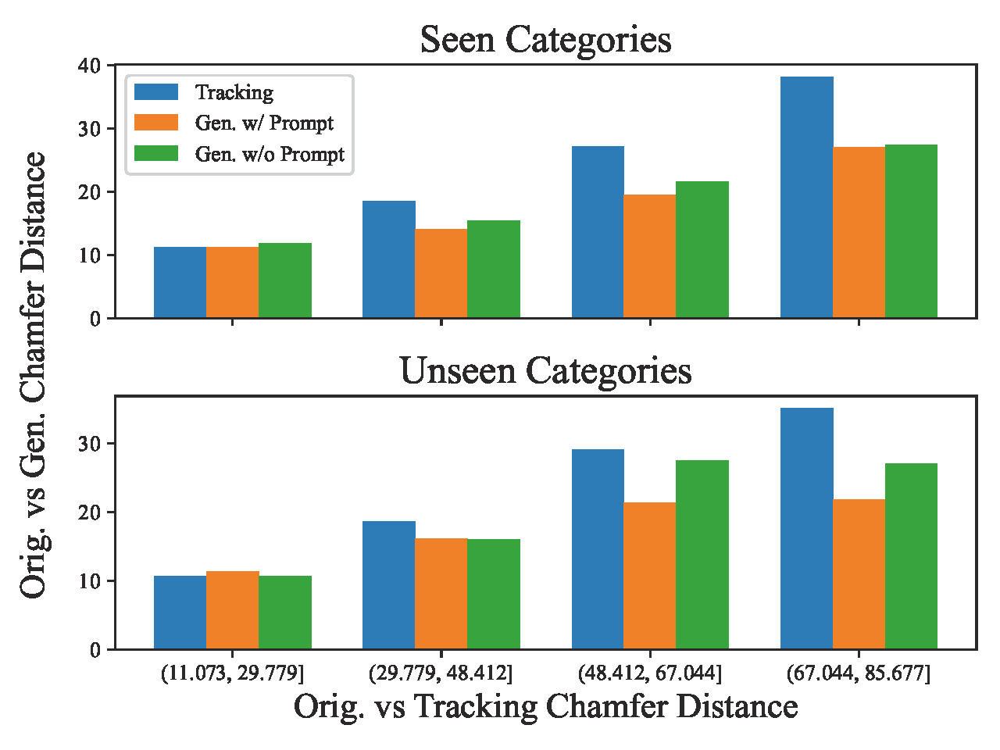
<figcaption> The impact of level of chaos of the tracking on the faithfulness of the generated sketch, based on CD. We divide CD between tracking and ground-truth sketch equally into four bins. Within each bin, we plot the mean of CD between ground-truth sketch, tracking, and generated image with/without prompt.</figcaption>
</figure>

#### Effect of *level of chaos* on conditional input.

In Figure <a href="#fig:cd_bar" data-reference-type="ref" data-reference="fig:cd_bar">11</a>, we investigate how the amount of chaos in the input conditioning tracking image, measured by the CD between the ground-truth and tracking images, affects generation. The improvements are more obvious when the CD between the ground-truth and tracking images is large. On the other hand, the CD between ground-truth and generated sketches are almost the same when the tracking image is already close to the ground-truth sketch, indicating that the generation is being faithful to the ground-truth sketch. We also observe that when the level of chaos is high for the unseen categories (bottom right), the performance gain with text guidance is most obvious, suggesting that the model relies more on text guidance for correct generation. Conversely, the model depends less on the text prompts when the input chaos level is low or under seen categories. Such results are also in line with Figure <a href="#fig:noprompt" data-reference-type="ref" data-reference="fig:noprompt">10</a> and Table <a href="#table:prompt_table" data-reference-type="ref" data-reference="table:prompt_table">[table:prompt_table]</a> as discussed above.

# Conclusions [sec:conclusion]

In this paper, we tackle the problem of marker-less air drawing by leveraging a spatially-controlled diffusion model. We devise a simple augmentation-based data-free training procedure to learn a mapping from noisy to clean sketches. We collect two hand drawing datasets and verify that the trained model can effectively generate coherent and faithful sketch from an extremely noisy tracking image, and exhibits decent generalizability.

#### Limitations and Future Work.

We provide a stepping stone for the proposed task by creating a framework that establishes a correspondence between hand motions and clean, pleasing, and coherent illustrations, and providing datasets to evaluate these tasks. However, this work does not explore the possibility of using hand gestures to create complex, full color images that image diffusers are known for. It also assumes that the desired output sketch is simple and often cartoon-like, as a majority of the Quick, Draw! sketches are drawn with few lines and simple shapes.

#### Societal Impact. 

Generative models for media are generally prone to misuse which can lead to the spread of inappropriate and harmful content. While this work is based in the sketch domain, there could still be adverse adoption for generating mocking content and bullying, especially by younger users.

# References [references]

Alex Adkins *The Importance of Hand Motions for Communication and Interaction in Virtual Reality* PhD thesis, Clemson University, 2022. (@VRhandinteraction)

M. Akmal Butt and P. Maragos Optimum design of chamfer distance transforms *IEEE Transactions on Image Processing*, 7 (10): 1477–1484, 1998. . **Abstract:** The distance transform has found many applications in image analysis. Chamfer distance transforms are a class of discrete algorithms that offer a good approximation to the desired Euclidean distance transform at a lower computational cost. They can also give integer-valued distances that are more suitable for several digital image processing tasks. The local distances used to compute a chamfer distance transform are selected to minimize an approximation error. A new geometric approach is developed to find optimal local distances. This new approach is easier to visualize than the approaches found in previous work, and can be easily extended to chamfer metrics that use large neighborhoods. A new concept of critical local distances is presented which reduces the computational complexity of the chamfer distance transform without increasing the maximum approximation error. (@cd)

Alaa Al-Obodi, Ameerh Al-Hanine, Khalda Al-Harbi, Maryam Al-Dawas, and Amal Al-Shargabi A saudi sign language recognition system based on convolutional neural networks *Building Services Engineering Research and Technology*, 13, 11 2020. . **Abstract:** Sign language is the main communication method for deaf people.It is a collection of signs that deaf people use to deal with each other.Deaf people find it difficult to communicate with normal people, as most of them do not understand the signs of the sign language.Sign language recognition systems translate the signs into natural languages and thus shorten the gap between deaf and normal people.Many studies have been done on different sign languages.There is a considerable number of studies on the standard Arabic sign language.In Saudi Arabia, deaf people use the Saudi language, which is different from standard Arabic.This study proposes a smart recognition system for Saudi sign language based on convolutional neural networks.The system is based on the Saudi Sign language dictionary, which was published recently in 2018.In this study, we constructed a dataset of 40 Saudi signs with about 700 images for each sign.We then developed a deep convolutional neural network and trained it on the constructed dataset.To have better recognition, we took images of the signs with different hand sizes, skin colors, lighting, backgrounds, and with/without accessories.The results showed that the recognition model achieved an accuracy of 97.69% for training data and 99.47% for testing data.The model was implemented in two versions: mobile and desktop. (@saudiSL)

Rahaf Alawwad, Ouiem Bchir, and Mohamed Maher Ben Ismail Arabic sign language recognition using faster r-cnn *International Journal of Advanced Computer Science and Applications*, 12: 692–700, 03 2021. . **Abstract:** Deafness does not restrict its negative effect on the person’s hearing, but rather on all aspect of their daily life. Moreover, hearing people aggravated the issue through their reluctance to learn sign language. This resulted in a constant need for human translators to assist deaf person which represents a real obstacle for their social life. Therefore, automatic sign language translation emerged as an urgent need for the community. The availability and the widespread use of mobile phones equipped with digital cameras promoted the design of image-based Arabic Sign Language (ArSL) recognition systems. In this work, we introduce a new ArSL recognition system that is able to localize and recognize the alphabet of the Arabic sign language using a Faster Region-based Convolutional Neural Network (R-CNN). Specifically, faster R-CNN is designed to extract and map the image features, and learn the position of the hand in a given image. Additionally, the proposed approach alleviates both challenges; the choice of the relevant features used to encode the sign visual descriptors, and the segmentation task intended to determine the hand region. For the implementation and the assessment of the proposed Faster R-CNN based sign recognition system, we exploited VGG-16 and ResNet-18 models, and we collected a real ArSL image dataset. The proposed approach yielded 93% accuracy and confirmed the robustness of the proposed model against drastic background variations in the captured scenes. (@arabicrcnn)

Judith Amores Fernandez and Jaron Lanier Holoart video showcase: Painting with holograms in mixed reality pages 466–466, 05 2017. . (@holoart)

Omri Avrahami, Dani Lischinski, and Ohad Fried Blended diffusion for text-driven editing of natural images In *2022 IEEE/CVF Conference on Computer Vision and Pattern Recognition (CVPR)*. IEEE, June 2022. . URL <http://dx.doi.org/10.1109/CVPR52688.2022.01767>. **Abstract:** Natural language offers a highly intuitive interface for image editing. In this paper, we introduce the first solution for performing local (region-based) edits in generic natural images, based on a natural language description along with an ROI mask. We achieve our goal by leveraging and combining a pretrained language-image model (CLIP), to steer the edit towards a user-provided text prompt, with a denoising diffusion probabilistic model (DDPM) to generate natural-looking results. To seamlessly fuse the edited region with the unchanged parts of the image, we spatially blend noised versions of the input image with the local text-guided diffusion latent at a progression of noise levels. In addition, we show that adding augmentations to the diffusion process mitigates adversarial results. We compare against several baselines and related methods, both qualitatively and quantitatively, and show that our method outperforms these solutions in terms of overall realism, ability to preserve the background and matching the text. Finally, we show several text-driven editing applications, including adding a new object to an image, removing/replacing/altering existing objects, background replacement, and image extrapolation. Code is available at: https://omriavrahami.com/blended-diffusion-page/ (@Avrahami_2022)

Qanita Bani Baker, Nour Alqudah, Tibra Alsmadi, and Rasha Awawdeh Image-based arabic sign language recognition system using transfer deep learning models *Applied Computational Intelligence and Soft Computing*, 2023: 1–11, 12 2023. . **Abstract:** Sign language is a unique communication tool helping to bridge the gap between people with hearing impairments and the general public. It holds paramount importance for various communities, as it allows individuals with hearing difficulties to communicate effectively. In sign languages, there are numerous signs, each characterized by differences in hand shapes, hand positions, motions, facial expressions, and body parts used to convey specific meanings. The complexity of visual sign language recognition poses a significant challenge in the computer vision research area. This study presents an Arabic Sign Language recognition (ArSL) system that utilizes convolutional neural networks (CNNs) and several transfer learning models to automatically and accurately identify Arabic Sign Language characters. The dataset used for this study comprises 54,049 images of ArSL letters. The results of this research indicate that InceptionV3 outperformed other pretrained models, achieving a remarkable 100% accuracy score and a 0.00 loss score without overfitting. These impressive performance measures highlight the distinct capabilities of InceptionV3 in recognizing Arabic characters and underscore its robustness against overfitting. This enhances its potential for future research in the field of Arabic Sign Language recognition. (@arabicSL)

Ayan Kumar Bhunia, Pinaki Nath Chowdhury, Yongxin Yang, Timothy M. Hospedales, Tao Xiang, and Yi-Zhe Song Vectorization and rasterization: Self-supervised learning for sketch and handwriting 2021. **Abstract:** Self-supervised learning has gained prominence due to its efficacy at learning powerful representations from unlabelled data that achieve excellent performance on many challenging downstream tasks. However, supervision-free pre-text tasks are challenging to design and usually modality specific. Although there is a rich literature of self-supervised methods for either spatial (such as images) or temporal data (sound or text) modalities, a common pretext task that benefits both modalities is largely missing. In this paper, we are interested in defining a self-supervised pre-text task for sketches and handwriting data. This data is uniquely characterised by its existence in dual modalities of rasterized images and vector coordinate sequences. We address and exploit this dual representation by proposing two novel cross-modal translation pre-text tasks for self-supervised feature learning: Vectorization and Rasterization. Vectorization learns to map image space to vector coordinates and rasterization maps vector coordinates to image space. We show that our learned encoder modules benefit both raster-based and vector-based downstream approaches to analysing hand-drawn data. Empirical evidence shows that our novel pre-text tasks surpass existing single and multi-modal self-supervision methods. (@bhunia2021vectorization)

Zhe Cao, Gines Hidalgo, Tomas Simon, Shih-En Wei, and Yaser Sheikh Openpose: Realtime multi-person 2d pose estimation using part affinity fields *CoRR*, abs/1812.08008, 2018. URL <http://arxiv.org/abs/1812.08008>. **Abstract:** Realtime multi-person 2D pose estimation is a key component in enabling machines to have an understanding of people in images and videos. In this work, we present a realtime approach to detect the 2D pose of multiple people in an image. The proposed method uses a nonparametric representation, which we refer to as Part Affinity Fields (PAFs), to learn to associate body parts with individuals in the image. This bottom-up system achieves high accuracy and realtime performance, regardless of the number of people in the image. In previous work, PAFs and body part location estimation were refined simultaneously across training stages. We demonstrate that a PAF-only refinement rather than both PAF and body part location refinement results in a substantial increase in both runtime performance and accuracy. We also present the first combined body and foot keypoint detector, based on an internal annotated foot dataset that we have publicly released. We show that the combined detector not only reduces the inference time compared to running them sequentially, but also maintains the accuracy of each component individually. This work has culminated in the release of OpenPose, the first open-source realtime system for multi-person 2D pose detection, including body, foot, hand, and facial keypoints. (@openpose)

Minghao Chen, Iro Laina, and Andrea Vedaldi Training-free layout control with cross-attention guidance 2023. **Abstract:** Recent diffusion-based generators can produce high-quality images from textual prompts. However, they often disregard textual instructions that specify the spatial layout of the composition. We propose a simple approach that achieves robust layout control without the need for training or fine-tuning of the image generator. Our technique manipulates the cross-attention layers that the model uses to interface textual and visual information and steers the generation in the desired direction given, e.g., a user-specified layout. To determine how to best guide attention, we study the role of attention maps and explore two alternative strategies, forward and backward guidance. We thoroughly evaluate our approach on three benchmarks and provide several qualitative examples and a comparative analysis of the two strategies that demonstrate the superiority of backward guidance compared to forward guidance, as well as prior work. We further demonstrate the versatility of layout guidance by extending it to applications such as editing the layout and context of real images. (@chen2023trainingfree)

Weiya Chen, Chenchen Yu, Chenyu Tu, Zehua Lyu, Jing Tang, Shiqi Ou, Yan Fu, and Zhidong Xue A survey on hand pose estimation with wearable sensors and computer-vision-based methods *Sensors*, 20: 1074, 02 2020. . **Abstract:** Real-time sensing and modeling of the human body, especially the hands, is an important research endeavor for various applicative purposes such as in natural human computer interactions. Hand pose estimation is a big academic and technical challenge due to the complex structure and dexterous movement of human hands. Boosted by advancements from both hardware and artificial intelligence, various prototypes of data gloves and computer-vision-based methods have been proposed for accurate and rapid hand pose estimation in recent years. However, existing reviews either focused on data gloves or on vision methods or were even based on a particular type of camera, such as the depth camera. The purpose of this survey is to conduct a comprehensive and timely review of recent research advances in sensor-based hand pose estimation, including wearable and vision-based solutions. Hand kinematic models are firstly discussed. An in-depth review is conducted on data gloves and vision-based sensor systems with corresponding modeling methods. Particularly, this review also discusses deep-learning-based methods, which are very promising in hand pose estimation. Moreover, the advantages and drawbacks of the current hand gesture estimation methods, the applicative scope, and related challenges are also discussed. (@handposesurvey2)

Takanori Chihara and Akihiko Seo Evaluation of physical workload affected by mass and center of mass of head-mounted display *Applied ergonomics*, 68: 204–212, 04 2018. . **Abstract:** A head -mounted display (HMD) with inappropriate mass and center of mass (COM) increases the physical workload of HMD users. The aim of this study was to investigate the effects of mass and COM of HMD on physical workload. Twelve subjects participated in this study. The mass and posteroanterior COM position were 0.8, 1.2, or 1.6 kg and –7.0, 0.0, or 7.0 cm, respectively. The subjects gazed at the target objects in four test postures : the neutral, look- up, body - bending, and look-down postures . The normalized joint torques for the neck and the lumbar region were calculated based on the measured segment angles. The results showed that the neck joint torque was significantly affected by mass and COM , and it increased with increase of the mass for all test postures. The COM position that minimized the neck joint torque varied depending on the test postures, and the recommended ranges of COM were identified. (@headsetworkload)

Pinaki Nath Chowdhury, Ayan Kumar Bhunia, Aneeshan Sain, Subhadeep Koley, Tao Xiang, and Yi-Zhe Song Democratising 2d sketch to 3d shape retrieval through pivoting In *2023 IEEE/CVF International Conference on Computer Vision (ICCV)*, pages 23218–23229, 2023. . **Abstract:** This paper studies the problem of 2D sketch to 3D shape retrieval, but with a focus on democratising the process. We would like this democratisation to happen on two fronts: (i) to remove the need for large-scale specifically sourced 2D sketch and 3D shape datasets, and (ii) to remove restrictions on how well the user needs to sketch and from what viewpoints. The end result is a system that is trainable using existing datasets, and once trained allows users to sketch regardless of drawing skills and without restriction on view angle. We achieve all this via a clever use of pivoting, along with novel designs that injects 3D understanding of 2D sketches into the system. We perform pivoting using two existing datasets, each from a distant research domain to the other: 2D sketch and photo pairs from the sketch-based image retrieval field (SBIR), and 3D shapes from ShapeNet. It follows that the actual feature pivoting happens on photos from the former and 2D projections from the latter. Doing this already achieves most of our democratisation challenge – the level of 2D sketch abstraction embedded in SBIR dataset offers demoralization on drawing quality, and the whole thing works without a specifically sourced 2D sketch and 3D model pair. To further achieve democratisation on sketching viewpoint, we "lift" 2D sketches to 3D space using Blind Perspective-n-Points (BPnP) that injects 3D-aware information into the sketch encoder. Results show ours achieves competitive performance compared with fully-supervised baselines, while meeting all set democratisation goals. (@10376524)

Jacob Devlin, Ming-Wei Chang, Kenton Lee, and Kristina Toutanova Bert: Pre-training of deep bidirectional transformers for language understanding 2019. **Abstract:** We introduce a new language representation model called BERT, which stands for Bidirectional Encoder Representations from Transformers. Unlike recent language representation models, BERT is designed to pre-train deep bidirectional representations from unlabeled text by jointly conditioning on both left and right context in all layers. As a result, the pre-trained BERT model can be fine-tuned with just one additional output layer to create state-of-the-art models for a wide range of tasks, such as question answering and language inference, without substantial task-specific architecture modifications. BERT is conceptually simple and empirically powerful. It obtains new state-of-the-art results on eleven natural language processing tasks, including pushing the GLUE score to 80.5% (7.7% point absolute improvement), MultiNLI accuracy to 86.7% (4.6% absolute improvement), SQuAD v1.1 question answering Test F1 to 93.2 (1.5 point absolute improvement) and SQuAD v2.0 Test F1 to 83.1 (5.1 point absolute improvement). (@devlin2019bert)

Amanda Cardoso Duarte, Shruti Palaskar, Deepti Ghadiyaram, Kenneth DeHaan, Florian Metze, Jordi Torres, and Xavier Giró-i-Nieto How2sign: A large-scale multimodal dataset for continuous american sign language *CoRR*, abs/2008.08143, 2020. URL <https://arxiv.org/abs/2008.08143>. **Abstract:** One of the factors that have hindered progress in the areas of sign language recognition, translation, and production is the absence of large annotated datasets. Towards this end, we introduce How2Sign, a multimodal and multiview continuous American Sign Language (ASL) dataset, consisting of a parallel corpus of more than 80 hours of sign language videos and a set of corresponding modalities including speech, English transcripts, and depth. A three-hour subset was further recorded in the Panoptic studio enabling detailed 3D pose estimation. To evaluate the potential of How2Sign for real-world impact, we conduct a study with ASL signers and show that synthesized videos using our dataset can indeed be understood. The study further gives insights on challenges that computer vision should address in order to make progress in this field. Dataset website: http://how2sign.github.io/ (@how2sign)

Mathias Eitz, James Hays, and Marc Alexa How do humans sketch objects? *ACM Trans. Graph. (Proc. SIGGRAPH)*, 31 (4): 44:1–44:10, 2012. **Abstract:** Humans have used sketching to depict our visual world since prehistoric times. Even today, sketching is possibly the only rendering technique readily available to all humans. This paper is the first large scale exploration of human sketches. We analyze the distribution of non-expert sketches of everyday objects such as ’teapot’ or ’car’. We ask humans to sketch objects of a given category and gather 20,000 unique sketches evenly distributed over 250 object categories. With this dataset we perform a perceptual study and find that humans can correctly identify the object category of a sketch 73% of the time. We compare human performance against computational recognition methods. We develop a bag-of-features sketch representation and use multi-class support vector machines, trained on our sketch dataset, to classify sketches. The resulting recognition method is able to identify unknown sketches with 56% accuracy (chance is 0.4%). Based on the computational model, we demonstrate an interactive sketch recognition system. We release the complete crowd-sourced dataset of sketches to the community. (@tuberlin)

Rinon Gal, Yael Vinker, Yuval Alaluf, Amit H. Bermano, Daniel Cohen-Or, Ariel Shamir, and Gal Chechik Breathing life into sketches using text-to-video priors . **Abstract:** A sketch is one of the most intuitive and versatile tools humans use to convey their ideas visually. An animated sketch opens another dimension to the expression of ideas and is widely used by designers for a variety of purposes. Animating sketches is a laborious process, requiring extensive experience and professional design skills. In this work, we present a method that automatically adds motion to a single-subject sketch (hence, "breathing life into it"), merely by providing a text prompt indicating the desired motion. The output is a short animation provided in vector representation, which can be easily edited. Our method does not require extensive training, but instead leverages the motion prior of a large pretrained text-to-video diffusion model using a score-distillation loss to guide the placement of strokes. To promote natural and smooth motion and to better preserve the sketch’s appearance, we model the learned motion through two components. The first governs small local deformations and the second controls global affine transformations. Surprisingly, we find that even models that struggle to generate sketch videos on their own can still serve as a useful backbone for animating abstract representations. (@gal2023breathing)

Liuhao Ge, Hui Liang, Junsong Yuan, and Daniel Thalmann Robust 3d hand pose estimation in single depth images: from single-view cnn to multi-view cnns 2016. . **Abstract:** Articulated hand pose estimation plays an important role in human-computer interaction. Despite the recent progress, the accuracy of existing methods is still not satisfactory, partially due to the difficulty of embedded high-dimensional and non-linear regression problem. Different from the existing discriminative methods that regress for the hand pose with a single depth image, we propose to first project the query depth image onto three orthogonal planes and utilize these multi-view projections to regress for 2D heat-maps which estimate the joint positions on each plane. These multi-view heat-maps are then fused to produce final 3D hand pose estimation with learned pose priors. Experiments show that the proposed method largely outperforms state-of-the-art on a challenging dataset. Moreover, a cross-dataset experiment also demonstrates the good generalization ability of the proposed method. (@depthcnn)

Google Tiltbrush 2016. https://www.tiltbrush.com/. **Abstract:** The artistic crafting of 3D animations by designers is a complex and iterative process. While classical animation tools have brought significant improvements in creating and manipulating shapes over time, most approaches rely on classical 2D input devices to create 3D contents. With the advent of virtual reality technologies and their ability to dive the users in their 3D worlds and to precisely track devices in 6 dimensions (position and orientation), a number of VR creative tools have emerged such as Quill, AnimVR, Tvori, Tiltbrush or MasterPieceVR. While these tools provide intuitive means to directly design in the 3D space by exploiting both the 6D tracking capacity of the hand devices and the stereoscopic perception by the user, the animation capacities or such tools remain strongly limited, and often reproduce classical 2D manipulators in VR. In this work, we propose the design of smart interactive manipulators which leverage on the specificity of VR to animate poly-articulated animations. We then perform a user study to evaluate the benefits of such manipulators over traditional 2D tools for three groups of users: beginner, intermediate, and professional artists. We build on this user to discuss how smart tools (e.g. using a variety of AI techniques) can be coupled with VR technologies to improve content creation. (@tiltbrush)

Google Creative Lab and Uncorked Studios Just a line March 2018. https://experiments.withgoogle.com/justaline. (@justaline)

Google Research Introducing the kaggle “quick, draw!” doodle recognition challenge September 2018. https://blog.research.google/2018/09/introducing-kaggle-quick-draw-doodle.html. **Abstract:** This paper presents a solution of the ‘Quick, Draw! Doodle Recognition Challenge’ hosted by Google. Doodles are drawings comprised of concrete representational meaning or abstract lines creatively expressed by individuals. In this challenge, a doodle is presented as a sequence of sketches. From the view of at the sketch level, to learn the pattern of strokes representing a doodle, we propose a sequential model stacked with multiple convolution layers and Long Short-Term Memory (LSTM) cells following the attention mechanism \[15\]. From the view at the image level, we use multiple models pre-trained on ImageNet to recognize the doodle. Finally, an ensemble and a post-processing method using the minimum cost flow algorithm are introduced to combine multiple models in achieving better results. In this challenge, our solutions garnered 11th place among 1,316 teams. Our performance was 0.95037 MAP@3, only 0.4% lower than the winner. It demonstrates that our method is very competitive. The source code for this competition is published at: https://github.com/ngxbac/Kaggle-QuickDraw. (@kqd)

David Ha and Douglas Eck A neural representation of sketch drawings 2017. **Abstract:** We present sketch-rnn, a recurrent neural network (RNN) able to construct stroke-based drawings of common objects. The model is trained on thousands of crude human-drawn images representing hundreds of classes. We outline a framework for conditional and unconditional sketch generation, and describe new robust training methods for generating coherent sketch drawings in a vector format. (@sketchrnn)

Jonathan Ho, Ajay Jain, and Pieter Abbeel Denoising diffusion probabilistic models 2020. **Abstract:** We present high quality image synthesis results using diffusion probabilistic models, a class of latent variable models inspired by considerations from nonequilibrium thermodynamics. Our best results are obtained by training on a weighted variational bound designed according to a novel connection between diffusion probabilistic models and denoising score matching with Langevin dynamics, and our models naturally admit a progressive lossy decompression scheme that can be interpreted as a generalization of autoregressive decoding. On the unconditional CIFAR10 dataset, we obtain an Inception score of 9.46 and a state-of-the-art FID score of 3.17. On 256x256 LSUN, we obtain sample quality similar to ProgressiveGAN. Our implementation is available at https://github.com/hojonathanho/diffusion (@ddpm)

Edward J. Hu, Yelong Shen, Phillip Wallis, Zeyuan Allen-Zhu, Yuanzhi Li, Shean Wang, Lu Wang, and Weizhu Chen Lora: Low-rank adaptation of large language models 2021. **Abstract:** An important paradigm of natural language processing consists of large-scale pre-training on general domain data and adaptation to particular tasks or domains. As we pre-train larger models, full fine-tuning, which retrains all model parameters, becomes less feasible. Using GPT-3 175B as an example – deploying independent instances of fine-tuned models, each with 175B parameters, is prohibitively expensive. We propose Low-Rank Adaptation, or LoRA, which freezes the pre-trained model weights and injects trainable rank decomposition matrices into each layer of the Transformer architecture, greatly reducing the number of trainable parameters for downstream tasks. Compared to GPT-3 175B fine-tuned with Adam, LoRA can reduce the number of trainable parameters by 10,000 times and the GPU memory requirement by 3 times. LoRA performs on-par or better than fine-tuning in model quality on RoBERTa, DeBERTa, GPT-2, and GPT-3, despite having fewer trainable parameters, a higher training throughput, and, unlike adapters, no additional inference latency. We also provide an empirical investigation into rank-deficiency in language model adaptation, which sheds light on the efficacy of LoRA. We release a package that facilitates the integration of LoRA with PyTorch models and provide our implementations and model checkpoints for RoBERTa, DeBERTa, and GPT-2 at https://github.com/microsoft/LoRA. (@lora)

Jonas Jongejan August 2017. https://experiments.withgoogle.com/arcore-drawing. **Abstract:** In recent years, the utilization of location-based augmented reality (LAR) has gained popularity across various domains, including tourism, education, gaming, and advertising. The advancements in AR technology have made it easier to develop immersive LAR applications. ARCore, a widely adopted AR development library, enables the creation of location-based AR apps on Android devices. However, the implementation of ARCore in real-time scenarios that demand significant computational resources, like outdoor pedestrian navigation, can vary depending on the chosen development environment. This research aims to explore and compare the running load performance of ARCore implementation in location-based AR applications developed with Unity and Android Native, which are two prevalent AR development platforms. The study involves building a prototype LAR application using both Unity and native Android, followed by comprehensive running load performance evaluations. The findings reveal that while both Unity and native Android apps can deliver compelling location-based AR experiences, native Android apps demonstrate superior performance and resource efficiency in outdoor scenarios, whereas Unity offers the advantage of multi-platform support and ease of development for complex 3D assets. These insights provide valuable guidance to developers in selecting the most suitable approach for developing location-based AR applications for navigation, aligning with their specific needs and requirements. (@arcoredrawing)

Xuan Ju, Ailing Zeng, Chenchen Zhao, Jianan Wang, Lei Zhang, and Qiang Xu Humansd: A native skeleton-guided diffusion model for human image generation 2023. **Abstract:** Controllable human image generation (HIG) has numerous real-life applications. State-of-the-art solutions, such as ControlNet and T2I-Adapter, introduce an additional learnable branch on top of the frozen pre-trained stable diffusion (SD) model, which can enforce various conditions, including skeleton guidance of HIG. While such a plug-and-play approach is appealing, the inevitable and uncertain conflicts between the original images produced from the frozen SD branch and the given condition incur significant challenges for the learnable branch, which essentially conducts image feature editing for condition enforcement.In this work, we propose a native skeleton-guided diffusion model for controllable HIG called HumanSD. Instead of performing image editing with dual-branch diffusion, we fine-tune the original SD model using a novel heatmap-guided denoising loss. This strategy effectively and efficiently strengthens the given skeleton condition during model training while mitigating the catastrophic forgetting effects. HumanSD is fine-tuned on the assembly of three large-scale human-centric datasets with text-image-pose information, two of which are established in this work. Experimental results show that HumanSD outperforms ControlNet in terms of pose control and image quality, particularly when the given skeleton guidance is sophisticated. Code and data are available at: https://idea-research.github.io/HumanSD/. (@ju2023humansd)

Daniel Keefe, Robert Zeleznik, and David Laidlaw Drawing on air: Input techniques for controlled 3d line illustration *IEEE Transactions on Visualization and Computer Graphics*, 13 (5): 1067–1081, 2007. . **Abstract:** We present drawing on air, a haptic-aided input technique for drawing controlled 3D curves through space. Drawing on air addresses a control problem with current 3D modeling approaches based on sweeping movement of the hands through the air. Although artists praise the immediacy and intuitiveness of these systems, a lack of control makes it nearly impossible to create 3D forms beyond quick design sketches or gesture drawings. Drawing on air introduces two new strategies for more controlled 3D drawing: one-handed drag drawing and two-handed tape drawing. Both approaches have advantages for drawing certain types of curves. We describe a tangent preserving method for transitioning between the two techniques while drawing. Haptic-aided redrawing and line weight adjustment while drawing are also supported in both approaches. In a quantitative user study evaluation by illustrators, the one and two-handed techniques performed at roughly the same level and both significantly outperformed freehand drawing and freehand drawing augmented with a haptic friction effect. We present the design and results of this experiment, as well as user feedback from artists and 3D models created in a style of line illustration for challenging artistic and scientific subjects. (@drawingonair)

Diederik P. Kingma, Tim Salimans, Ben Poole, and Jonathan Ho Variational diffusion models 2023. **Abstract:** Diffusion-based generative models have demonstrated a capacity for perceptually impressive synthesis, but can they also be great likelihood-based models? We answer this in the affirmative, and introduce a family of diffusion-based generative models that obtain state-of-the-art likelihoods on standard image density estimation benchmarks. Unlike other diffusion-based models, our method allows for efficient optimization of the noise schedule jointly with the rest of the model. We show that the variational lower bound (VLB) simplifies to a remarkably short expression in terms of the signal-to-noise ratio of the diffused data, thereby improving our theoretical understanding of this model class. Using this insight, we prove an equivalence between several models proposed in the literature. In addition, we show that the continuous-time VLB is invariant to the noise schedule, except for the signal-to-noise ratio at its endpoints. This enables us to learn a noise schedule that minimizes the variance of the resulting VLB estimator, leading to faster optimization. Combining these advances with architectural improvements, we obtain state-of-the-art likelihoods on image density estimation benchmarks, outperforming autoregressive models that have dominated these benchmarks for many years, with often significantly faster optimization. In addition, we show how to use the model as part of a bits-back compression scheme, and demonstrate lossless compression rates close to the theoretical optimum. Code is available at https://github.com/google-research/vdm . (@kingma2023variational)

Knife Entertainment Realistic FPS hands 2018. https://assetstore.unity.com/packages/3d/characters/realistic-fps-hands-107409. **Abstract:** This paper is focusing on the development of a robotic arm using 3D modeling and simulation. The software used is Blender, which is a 3D modeling and simulation software that also supports programming language python as the scripting language. Blender was chosen over Maya because it is a free software suitable for students to develop their projects, and share the same features, more accessible, and the design is more realistic. The robotic arm was designed after studying the human arm and hand. The kinematics of the robotic arm were derived. The simulation shows the movement of rigged objects, e.g., an arm controlling a gun, and bullets projecting from the gun, and it was done using key frame animation and game engine simulation. Modeling and simulation of two robotic arms and hands, shooting with an AK-47 rifle at a bullseye, were done and completed using python in Blender. This work is intended to be integrated into a First-Person Shooter FPS game, which can be used to train biathlon sportsmen and army soldiers for precise shooting. Forward and inverse kinematics are implemented for the rig to move without breaking and deforming, then the bones and mesh together are combined as one unit, then the joined mesh is put to a desired position of a shooting position, then a rifle is added, then the bullets are simulated falling on ground when the bullets hits the target. Then finally the whole file is exported. (@arm)

Subhadeep Koley, Ayan Kumar Bhunia, Aneeshan Sain, Pinaki Nath Chowdhury, Tao Xiang, and Yi-Zhe Song How to handle sketch-abstraction in sketch-based image retrieval? 2024. **Abstract:** In this paper, we propose a novel abstraction-aware sketch-based image retrieval framework capable of handling sketch abstraction at varied levels. Prior works had mainly focused on tackling sub-factors such as drawing style and order, we instead attempt to model abstraction as a whole, and propose feature-level and retrieval granularity-level designs so that the system builds into its DNA the necessary means to interpret abstraction. On learning abstraction-aware features, we for the first-time harness the rich semantic embedding of pre-trained StyleGAN model, together with a novel abstraction-level mapper that deciphers the level of abstraction and dynamically selects appropriate dimensions in the feature matrix correspondingly, to construct a feature matrix embedding that can be freely traversed to accommodate different levels of abstraction. For granularity-level abstraction understanding, we dictate that the retrieval model should not treat all abstraction-levels equally and introduce a differentiable surrogate Acc.@q loss to inject that understanding into the system. Different to the gold-standard triplet loss, our Acc.@q loss uniquely allows a sketch to narrow/broaden its focus in terms of how stringent the evaluation should be - the more abstract a sketch, the less stringent (higher $q$). Extensive experiments depict our method to outperform existing state-of-the-arts in standard SBIR tasks along with challenging scenarios like early retrieval, forensic sketch-photo matching, and style-invariant retrieval. (@koley2024handle)

Subhadeep Koley, Ayan Kumar Bhunia, Aneeshan Sain, Pinaki Nath Chowdhury, Tao Xiang, and Yi-Zhe Song You’ll never walk alone: A sketch and text duet for fine-grained image retrieval 2024. **Abstract:** Two primary input modalities prevail in image retrieval: sketch and text. While text is widely used for inter-category retrieval tasks, sketches have been established as the sole preferred modality for fine-grained image retrieval due to their ability to capture intricate visual details. In this paper, we question the reliance on sketches alone for fine-grained image retrieval by simultaneously exploring the fine-grained representation capabilities of both sketch and text, orchestrating a duet between the two. The end result enables precise retrievals previously unattainable, allowing users to pose ever-finer queries and incorporate attributes like colour and contextual cues from text. For this purpose, we introduce a novel compositionality framework, effectively combining sketches and text using pre-trained CLIP models, while eliminating the need for extensive fine-grained textual descriptions. Last but not least, our system extends to novel applications in composite image retrieval, domain attribute transfer, and fine-grained generation, providing solutions for various real-world scenarios. (@koley2024youll)

Subhadeep Koley, Ayan Kumar Bhunia, Deeptanshu Sekhri, Aneeshan Sain, Pinaki Nath Chowdhury, Tao Xiang, and Yi-Zhe Song It’s all about your sketch: Democratising sketch control in diffusion models 2024. **Abstract:** This paper unravels the potential of sketches for diffusion models, addressing the deceptive promise of direct sketch control in generative AI. We importantly democratise the process, enabling amateur sketches to generate precise images, living up to the commitment of "what you sketch is what you get". A pilot study underscores the necessity, revealing that deformities in existing models stem from spatial-conditioning. To rectify this, we propose an abstraction-aware framework, utilising a sketch adapter, adaptive time-step sampling, and discriminative guidance from a pre-trained fine-grained sketch-based image retrieval model, working synergistically to reinforce fine-grained sketch-photo association. Our approach operates seamlessly during inference without the need for textual prompts; a simple, rough sketch akin to what you and I can create suffices! We welcome everyone to examine results presented in the paper and its supplementary. Contributions include democratising sketch control, introducing an abstraction-aware framework, and leveraging discriminative guidance, validated through extensive experiments. (@koley2024its)

Taehee Lee and Tobias Höllerer Handy ar: Markerless inspection of augmented reality objects using fingertip tracking pages 83–90, 11 2007. ISBN 978-1-4244-1452-9. . **Abstract:** We present markerless camera tracking and user interface methodology for readily inspecting augmented reality (AR) objects in wearable computing applications. Instead of a marker, we use the human hand as a distinctive pattern that almost all wearable computer users have readily available. We present a robust real-time algorithm that recognizes fingertips to reconstruct the six-degree-of-freedom camera pose relative to the user’s outstretched hand. A hand pose model is constructed in a one-time calibration step by measuring the fingertip positions in presence of ground-truth scale information. Through frame-by-frame reconstruction of the camera pose relative to the hand, we can stabilize 3D graphics annotations on top of the hand, allowing the user to inspect such virtual objects conveniently from different viewing angles in AR. We evaluate our approach with regard to speed and accuracy, and compare it to state-of-the-art marker-based AR systems. We demonstrate the robustness and usefulness of our approach in an example AR application for selecting and inspecting world-stabilized virtual objects. (@handyar)

Rui Li, Zhenyu Liu, and Jianrong Tan A survey on 3d hand pose estimation: Cameras, methods, and datasets *Pattern Recognition*, 93, 04 2019. . **Abstract:** The field of 3D hand pose estimation has been gaining a lot of attention recently, due to its significance in several applications that require human-computer interaction (HCI). The utilization of technological advances, such as cost-efficient depth cameras coupled with the explosive progress of Deep Neural Networks (DNNs), has led to a significant boost in the development of robust markerless 3D hand pose estimation methods. Nonetheless, finger occlusions and rapid motions still pose significant challenges to the accuracy of such methods. In this survey, we provide a comprehensive study of the most representative deep learning-based methods in literature and propose a new taxonomy heavily based on the input data modality, being RGB, depth, or multimodal information. Finally, we demonstrate results on the most popular RGB and depth-based datasets and discuss potential research directions in this rapidly growing field. (@3dhandposesurvey)

Yuheng Li, Haotian Liu, Qingyang Wu, Fangzhou Mu, Jianwei Yang, Jianfeng Gao, Chunyuan Li, and Yong Jae Lee Gligen: Open-set grounded text-to-image generation 2023. **Abstract:** Large-scale text-to-image diffusion models have made amazing advances. However, the status quo is to use text input alone, which can impede controllability. In this work, we propose GLIGEN, Grounded-Language-to-Image Generation, a novel approach that builds upon and extends the functionality of existing pre-trained text-to-image diffusion models by enabling them to also be conditioned on grounding inputs. To preserve the vast concept knowledge of the pre-trained model, we freeze all of its weights and inject the grounding information into new trainable layers via a gated mechanism. Our model achieves open-world grounded text2img generation with caption and bounding box condition inputs, and the grounding ability generalizes well to novel spatial configurations and concepts. GLIGEN’s zero-shot performance on COCO and LVIS outperforms existing supervised layout-to-image baselines by a large margin. (@li2023gligen)

Fengyin Lin, Mingkang Li, Da Li, Timothy Hospedales, Yi-Zhe Song, and Yonggang Qi Zero-shot everything sketch-based image retrieval, and in explainable style 2023. **Abstract:** This paper studies the problem of zero-short sketch-based image retrieval (ZS-SBIR), however with two significant differentiators to prior art (i) we tackle all variants (inter-category, intracategory, and cross datasets) of ZS-SBIR with just one network ("everything"), and (ii) we would really like to understand how this sketch-photo matching operates ("explainable"). Our key innovation lies with the realization that such a cross-modal matching problem could be reduced to comparisons of groups of key local patches - akin to the seasoned "bag-of-words" paradigm. Just with this change, we are able to achieve both of the aforementioned goals, with the added benefit of no longer requiring external semantic knowledge. Technically, ours is a transformer-based cross-modal network, with three novel components (i) a self-attention module with a learnable tokenizer to produce visual tokens that correspond to the most informative local regions, (ii) a cross-attention module to compute local correspondences between the visual tokens across two modalities, and finally (iii) a kernel-based relation network to assemble local putative matches and produce an overall similarity metric for a sketch-photo pair. Experiments show ours indeed delivers superior performances across all ZS-SBIR settings. The all important explainable goal is elegantly achieved by visualizing cross-modal token correspondences, and for the first time, via sketch to photo synthesis by universal replacement of all matched photo patches. Code and model are available at https://github.com/buptLinfy/ZSE-SBIR. (@lin2023zeroshot)

Hangyu Lin, Yanwei Fu, Yu-Gang Jiang, and Xiangyang Xue Sketch-bert: Learning sketch bidirectional encoder representation from transformers by self-supervised learning of sketch gestalt 2020. **Abstract:** Previous researches of sketches often considered sketches in pixel format and leveraged CNN based models in the sketch understanding. Fundamentally, a sketch is stored as a sequence of data points, a vector format representation, rather than the photo-realistic image of pixels. SketchRNN studied a generative neural representation for sketches of vector format by Long Short Term Memory networks (LSTM). Unfortunately, the representation learned by SketchRNN is primarily for the generation tasks, rather than the other tasks of recognition and retrieval of sketches. To this end and inspired by the recent BERT model, we present a model of learning Sketch Bidirectional Encoder Representation from Transformer (Sketch-BERT). We generalize BERT to sketch domain, with the novel proposed components and pre-training algorithms, including the newly designed sketch embedding networks, and the self-supervised learning of sketch gestalt. Particularly, towards the pre-training task, we present a novel Sketch Gestalt Model (SGM) to help train the Sketch-BERT. Experimentally, we show that the learned representation of Sketch-BERT can help and improve the performance of the downstream tasks of sketch recognition, sketch retrieval, and sketch gestalt. (@sketchbert)

Fang Liu, Xiaoming Deng, Yu-Kun Lai, Yong-Jin Liu, Cuixia Ma, and Hongan Wang Sketchgan: Joint sketch completion and recognition with generative adversarial network *2019 IEEE/CVF Conference on Computer Vision and Pattern Recognition (CVPR)*, pages 5823–5832, 2019. URL <https://api.semanticscholar.org/CorpusID:182164433>. **Abstract:** Hand-drawn sketch recognition is a fundamental problem in computer vision, widely used in sketch-based image and video retrieval, editing, and reorganization. Previous methods often assume that a complete sketch is used as input; however, hand-drawn sketches in common application scenarios are often incomplete, which makes sketch recognition a challenging problem. In this paper, we propose SketchGAN, a new generative adversarial network (GAN) based approach that jointly completes and recognizes a sketch, boosting the performance of both tasks. Specifically, we use a cascade Encode-Decoder network to complete the input sketch in an iterative manner, and employ an auxiliary sketch recognition task to recognize the completed sketch. Experiments on the Sketchy database benchmark demonstrate that our joint learning approach achieves competitive sketch completion and recognition performance compared with the state-of-the-art methods. Further experiments using several sketch-based applications also validate the performance of our method. (@sketchgan)

Li Liu, Fumin Shen, Yuming Shen, Xianglong Liu, and Ling Shao Deep sketch hashing: Fast free-hand sketch-based image retrieval 2017. **Abstract:** Free-hand sketch-based image retrieval (SBIR) is a specific cross-view retrieval task, in which queries are abstract and ambiguous sketches while the retrieval database is formed with natural images. Work in this area mainly focuses on extracting representative and shared features for sketches and natural images. However, these can neither cope well with the geometric distortion between sketches and images nor be feasible for large-scale SBIR due to the heavy continuous-valued distance computation. In this paper, we speed up SBIR by introducing a novel binary coding method, named Deep Sketch Hashing (DSH), where a semi-heterogeneous deep architecture is proposed and incorporated into an end-to-end binary coding framework. Specifically, three convolutional neural networks are utilized to encode free-hand sketches, natural images and, especially, the auxiliary sketch-tokens which are adopted as bridges to mitigate the sketch-image geometric distortion. The learned DSH codes can effectively capture the cross-view similarities as well as the intrinsic semantic correlations between different categories. To the best of our knowledge, DSH is the first hashing work specifically designed for category-level SBIR with an end-to-end deep architecture. The proposed DSH is comprehensively evaluated on two large-scale datasets of TU-Berlin Extension and Sketchy, and the experiments consistently show DSHs superior SBIR accuracies over several state-of-the-art methods, while achieving significantly reduced retrieval time and memory footprint. (@liu2017deep)

Ling Luo, Yulia Gryaditskaya, Tao Xiang, and Yi-Zhe Song Structure-aware 3d vr sketch to 3d shape retrieval 2022. **Abstract:** We study the practical task of fine-grained 3D-VR-sketch-based 3D shape retrieval. This task is of particular interest as 2D sketches were shown to be effective queries for 2D images. However, due to the domain gap, it remains hard to achieve strong performance in 3D shape retrieval from 2D sketches. Recent work demonstrated the advantage of 3D VR sketching on this task. In our work, we focus on the challenge caused by inherent inaccuracies in 3D VR sketches. We observe that retrieval results obtained with a triplet loss with a fixed margin value, commonly used for retrieval tasks, contain many irrelevant shapes and often just one or few with a similar structure to the query. To mitigate this problem, we for the first time draw a connection between adaptive margin values and shape similarities. In particular, we propose to use a triplet loss with an adaptive margin value driven by a ’fitting gap’, which is the similarity of two shapes under structure-preserving deformations. We also conduct a user study which confirms that this fitting gap is indeed a suitable criterion to evaluate the structural similarity of shapes. Furthermore, we introduce a dataset of 202 VR sketches for 202 3D shapes drawn from memory rather than from observation. The code and data are available at https://github.com/Rowl1ng/Structure-Aware-VR-Sketch-Shape-Retrieval. (@luo2022structureaware)

Eric Marchand, Hideaki Uchiyama, and Fabien Spindler Pose estimation for augmented reality: A hands-on survey *IEEE Transactions on Visualization and Computer Graphics*, 22, 01 2016. . **Abstract:** Augmented reality (AR) allows to seamlessly insert virtual objects in an image sequence. In order to accomplish this goal, it is important that synthetic elements are rendered and aligned in the scene in an accurate and visually acceptable way. The solution of this problem can be related to a pose estimation or, equivalently, a camera localization process. This paper aims at presenting a brief but almost self-contented introduction to the most important approaches dedicated to vision-based camera localization along with a survey of several extension proposed in the recent years. For most of the presented approaches, we also provide links to code of short examples. This should allow readers to easily bridge the gap between theoretical aspects and practical implementations. (@poseforar)

David McNeill *Hand and Mind: What Gestures Reveal about Thought* University of Chicago Press., Chicago, Illinois, USA, 1992. **Abstract:** What is the relation between gestures and speech? In terms of symbolic forms, of course, the spontaneous and unwitting gestures we make while talking differ sharply from spoken language itself. Whereas spoken language is linear, segmented, standardized, and arbitrary, gestures are global, synthetic, idiosyncratic, and imagistic. In Hand and Mind, David McNeill presents a bold theory of the essential unity of speech and the gestures that accompany it. This long-awaited, provocative study argues that the unity of gestures and language far exceeds the surface level of speech noted by previous researchers and in fact also includes the semantic and pragmatic levels of language. In effect, the whole concept of language must be altered to take into account the nonsegmented, instantaneous, and holistic images conveyed by gestures. McNeill and his colleagues carefully devised a standard methodology for examining the speech and gesture behavior of individuals engaged in narrative discourse. A research subject is shown a cartoon like the 1950 Canary Row–a classic Sylvester and Tweedy Bird caper that features Sylvester climbing up a downspout, swallowing a bowling ball and slamming into a brick wall. After watching the cartoon, the subject is videotaped recounting the story from memory to a listener who has not seen the cartoon. Painstaking analysis of the videotapes revealed that although the research subjects–children as well as adults, some neurologically impaired–represented a wide variety of linguistic groupings, the gestures of people speaking English and a half dozen other languages manifest the same principles. Relying on data from more than ten years of research, McNeill shows thatgestures do not simply form a part of what is said and meant but have an impact on thought itself. He persuasively argues that because gestures directly transfer mental images to visible forms, conveying ideas that language cannot always express, we must examine language and gesture (@mcneill1992gesture)

Chong Mou, Xintao Wang, Liangbin Xie, Yanze Wu, Jian Zhang, Zhongang Qi, Ying Shan, and Xiaohu Qie T2i-adapter: Learning adapters to dig out more controllable ability for text-to-image diffusion models *arXiv preprint arXiv:2302.08453*, 2023. **Abstract:** The incredible generative ability of large-scale text-to-image (T2I) models has demonstrated strong power of learning complex structures and meaningful semantics. However, relying solely on text prompts cannot fully take advantage of the knowledge learned by the model, especially when flexible and accurate controlling (e.g., color and structure) is needed. In this paper, we aim to “dig out" the capabilities that T2I models have implicitly learned, and then explicitly use them to control the generation more granularly. Specifically, we propose to learn simple and lightweight T2I-Adapters to align internal knowledge in T2I models with external control signals, while freezing the original large T2I models. In this way, we can train various adapters according to different conditions, achieving rich control and editing effects in the color and structure of the generation results. Further, the proposed T2I-Adapters have attractive properties of practical value, such as composability and generalization ability. Extensive experiments demonstrate that our T2I-Adapter has promising generation quality and a wide range of applications. (@t2iadapter)

Mozilla A-painter 2016. https://blog.mozvr.com/a-painter/. **Abstract:** Introduction by the editor the painter of modern life Edgar Allan Poe - his life and works further notes on Edgar Poe Wagner and Tannhauser in Paris on the essence of laughter some French caricaturists some foreign caricaturists a philosophy of toys philosophic art. (@apainter)

Carol Neidle, Ashwin Thangali, and Stan Sclaroff Challenges in the development of the american sign language lexicon video dataset (asllvd) corpus 2012. (@asllvd)

Alex Nichol, Prafulla Dhariwal, Aditya Ramesh, Pranav Shyam, Pamela Mishkin, Bob McGrew, Ilya Sutskever, and Mark Chen Glide: Towards photorealistic image generation and editing with text-guided diffusion models 2022. **Abstract:** Diffusion models have recently been shown to generate high-quality synthetic images, especially when paired with a guidance technique to trade off diversity for fidelity. We explore diffusion models for the problem of text-conditional image synthesis and compare two different guidance strategies: CLIP guidance and classifier-free guidance. We find that the latter is preferred by human evaluators for both photorealism and caption similarity, and often produces photorealistic samples. Samples from a 3.5 billion parameter text-conditional diffusion model using classifier-free guidance are favored by human evaluators to those from DALL-E, even when the latter uses expensive CLIP reranking. Additionally, we find that our models can be fine-tuned to perform image inpainting, enabling powerful text-driven image editing. We train a smaller model on a filtered dataset and release the code and weights at https://github.com/openai/glide-text2im. (@glide)

Oculus and Smoothstep Quill 2016. https://quill.art/. **Abstract:** A remarkable phenomenon in ultrafast laser processing of transparent materials, in particular, silica glass, manifested as a change in material modification by reversing the writing direction is observed. The effect resembles writing with a quill pen and is interpreted in terms of anisotropic trapping of electron plasma by a tilted front of the ultrashort laser pulse along the writing direction. (@quill)

Iason Oikonomidis, Nikolaos Kyriazis, and Antonis Argyros Efficient model-based 3d tracking of hand articulations using kinect volume 1, 01 2011. . **Abstract:** We present a novel solution to the problem of recovering and tracking the 3D position, orientation and full articulation of a human hand from markerless visual observations obtained by a Kinect sensor. We treat this as an optimization problem, seeking for the hand model parameters that minimize the discrepancy between the appearance and 3D structure of hypothesized instances of a hand model and actual hand observations. This optimization problem is effectively solved using a variant of Particle Swarm Optimization (PSO). The proposed method does not require special markers and/or a complex image acquisition setup. Being model based, it provides continuous solutions to the problem of tracking hand articulations. Extensive experiments with a prototype GPU-based implementation of the proposed method demonstrate that accurate and robust 3D tracking of hand articulations can be achieved in near real-time (15Hz). (@kinect)

Kaiyue Pang, Ke Li, Yongxin Yang, Honggang Zhang, Timothy M. Hospedales, Tao Xiang, and Yi-Zhe Song Generalising fine-grained sketch-based image retrieval In *2019 IEEE/CVF Conference on Computer Vision and Pattern Recognition (CVPR)*, pages 677–686, 2019. . **Abstract:** Fine-grained sketch-based image retrieval (FG-SBIR) addresses matching specific photo instance using free-hand sketch as a query modality. Existing models aim to learn an embedding space in which sketch and photo can be directly compared. While successful, they require instance-level pairing within each coarse-grained category as annotated training data. Since the learned embedding space is domain-specific, these models do not generalise well across categories. This limits the practical applicability of FG-SBIR. In this paper, we identify cross-category generalisation for FG-SBIR as a domain generalisation problem, and propose the first solution. Our key contribution is a novel unsupervised learning approach to model a universal manifold of prototypical visual sketch traits. This manifold can then be used to paramaterise the learning of a sketch/photo representation. Model adaptation to novel categories then becomes automatic via embedding the novel sketch in the manifold and updating the representation and retrieval function accordingly. Experiments on the two largest FG-SBIR datasets, Sketchy and QMUL-Shoe-V2, demonstrate the efficacy of our approach in enabling cross-category generalisation of FG-SBIR. (@8953777)

Dustin Podell, Zion English, Kyle Lacey, Andreas Blattmann, Tim Dockhorn, Jonas Müller, Joe Penna, and Robin Rombach Sdxl: Improving latent diffusion models for high-resolution image synthesis 2023. **Abstract:** We present SDXL, a latent diffusion model for text-to-image synthesis. Compared to previous versions of Stable Diffusion, SDXL leverages a three times larger UNet backbone: The increase of model parameters is mainly due to more attention blocks and a larger cross-attention context as SDXL uses a second text encoder. We design multiple novel conditioning schemes and train SDXL on multiple aspect ratios. We also introduce a refinement model which is used to improve the visual fidelity of samples generated by SDXL using a post-hoc image-to-image technique. We demonstrate that SDXL shows drastically improved performance compared the previous versions of Stable Diffusion and achieves results competitive with those of black-box state-of-the-art image generators. In the spirit of promoting open research and fostering transparency in large model training and evaluation, we provide access to code and model weights at https://github.com/Stability-AI/generative-models (@podell2023sdxl)

Alec Radford, Jong Wook Kim, Chris Hallacy, Aditya Ramesh, Gabriel Goh, Sandhini Agarwal, Girish Sastry, Amanda Askell, Pamela Mishkin, Jack Clark, Gretchen Krueger, and Ilya Sutskever Learning transferable visual models from natural language supervision 2021. **Abstract:** State-of-the-art computer vision systems are trained to predict a fixed set of predetermined object categories. This restricted form of supervision limits their generality and usability since additional labeled data is needed to specify any other visual concept. Learning directly from raw text about images is a promising alternative which leverages a much broader source of supervision. We demonstrate that the simple pre-training task of predicting which caption goes with which image is an efficient and scalable way to learn SOTA image representations from scratch on a dataset of 400 million (image, text) pairs collected from the internet. After pre-training, natural language is used to reference learned visual concepts (or describe new ones) enabling zero-shot transfer of the model to downstream tasks. We study the performance of this approach by benchmarking on over 30 different existing computer vision datasets, spanning tasks such as OCR, action recognition in videos, geo-localization, and many types of fine-grained object classification. The model transfers non-trivially to most tasks and is often competitive with a fully supervised baseline without the need for any dataset specific training. For instance, we match the accuracy of the original ResNet-50 on ImageNet zero-shot without needing to use any of the 1.28 million training examples it was trained on. We release our code and pre-trained model weights at https://github.com/OpenAI/CLIP. (@clip)

Colin Raffel, Noam Shazeer, Adam Roberts, Katherine Lee, Sharan Narang, Michael Matena, Yanqi Zhou, Wei Li, and Peter J. Liu Exploring the limits of transfer learning with a unified text-to-text transformer 2023. **Abstract:** Transfer learning, where a model is first pre-trained on a data-rich task before being fine-tuned on a downstream task, has emerged as a powerful technique in natural language processing (NLP). The effectiveness of transfer learning has given rise to a diversity of approaches, methodology, and practice. In this paper, we explore the landscape of transfer learning techniques for NLP by introducing a unified framework that converts all text-based language problems into a text-to-text format. Our systematic study compares pre-training objectives, architectures, unlabeled data sets, transfer approaches, and other factors on dozens of language understanding tasks. By combining the insights from our exploration with scale and our new “Colossal Clean Crawled Corpus”, we achieve state-of-the-art results on many benchmarks covering summarization, question answering, text classification, and more. To facilitate future work on transfer learning for NLP, we release our data set, pre-trained models, and code. (@t5)

Aditya Ramesh, Mikhail Pavlov, Gabriel Goh, Scott Gray, Chelsea Voss, Alec Radford, Mark Chen, and Ilya Sutskever Zero-shot text-to-image generation 2021. **Abstract:** Text-to-image generation has traditionally focused on finding better modeling assumptions for training on a fixed dataset. These assumptions might involve complex architectures, auxiliary losses, or side information such as object part labels or segmentation masks supplied during training. We describe a simple approach for this task based on a transformer that autoregressively models the text and image tokens as a single stream of data. With sufficient data and scale, our approach is competitive with previous domain-specific models when evaluated in a zero-shot fashion. (@ramesh2021zeroshot)

Aditya Ramesh, Prafulla Dhariwal, Alex Nichol, Casey Chu, and Mark Chen Hierarchical text-conditional image generation with clip latents 2022. **Abstract:** Contrastive models like CLIP have been shown to learn robust representations of images that capture both semantics and style. To leverage these representations for image generation, we propose a two-stage model: a prior that generates a CLIP image embedding given a text caption, and a decoder that generates an image conditioned on the image embedding. We show that explicitly generating image representations improves image diversity with minimal loss in photorealism and caption similarity. Our decoders conditioned on image representations can also produce variations of an image that preserve both its semantics and style, while varying the non-essential details absent from the image representation. Moreover, the joint embedding space of CLIP enables language-guided image manipulations in a zero-shot fashion. We use diffusion models for the decoder and experiment with both autoregressive and diffusion models for the prior, finding that the latter are computationally more efficient and produce higher-quality samples. (@ramesh2022hierarchical)

Leo Sampaio Ferraz Ribeiro, Tu Bui, John Collomosse, and Moacir Ponti Sketchformer: Transformer-based representation for sketched structure 2020. **Abstract:** Sketchformer is a novel transformer-based representation for encoding free-hand sketches input in a vector form, i.e. as a sequence of strokes. Sketchformer effectively addresses multiple tasks: sketch classification, sketch based image retrieval (SBIR), and the reconstruction and interpolation of sketches. We report several variants exploring continuous and tokenized input representations, and contrast their performance. Our learned embedding, driven by a dictionary learning tokenization scheme, yields state of the art performance in classification and image retrieval tasks, when compared against baseline representations driven by LSTM sequence to sequence architectures: SketchRNN and derivatives. We show that sketch reconstruction and interpolation are improved significantly by the Sketchformer embedding for complex sketches with longer stroke sequences. (@sketchformer)

Robin Rombach, Andreas Blattmann, Dominik Lorenz, Patrick Esser, and Björn Ommer High-resolution image synthesis with latent diffusion models 2022. **Abstract:** By decomposing the image formation process into a sequential application of denoising autoencoders, diffusion models (DMs) achieve state-of-the-art synthesis results on image data and beyond. Additionally, their formulation allows for a guiding mechanism to control the image generation process without retraining. However, since these models typically operate directly in pixel space, optimization of powerful DMs often consumes hundreds of GPU days and inference is expensive due to sequential evaluations. To enable DM training on limited computational resources while retaining their quality and flexibility, we apply them in the latent space of powerful pretrained autoencoders. In contrast to previous work, training diffusion models on such a representation allows for the first time to reach a near-optimal point between complexity reduction and detail preservation, greatly boosting visual fidelity. By introducing cross-attention layers into the model architecture, we turn diffusion models into powerful and flexible generators for general conditioning inputs such as text or bounding boxes and high-resolution synthesis becomes possible in a convolutional manner. Our latent diffusion models (LDMs) achieve new state of the art scores for image inpainting and class-conditional image synthesis and highly competitive performance on various tasks, including unconditional image generation, text-to-image synthesis, and super-resolution, while significantly reducing computational requirements compared to pixel-based DMs. (@ldm)

Olaf Ronneberger, Philipp Fischer, and Thomas Brox U-net: Convolutional networks for biomedical image segmentation 2015. **Abstract:** There is large consent that successful training of deep networks requires many thousand annotated training samples. In this paper, we present a network and training strategy that relies on the strong use of data augmentation to use the available annotated samples more efficiently. The architecture consists of a contracting path to capture context and a symmetric expanding path that enables precise localization. We show that such a network can be trained end-to-end from very few images and outperforms the prior best method (a sliding-window convolutional network) on the ISBI challenge for segmentation of neuronal structures in electron microscopic stacks. Using the same network trained on transmitted light microscopy images (phase contrast and DIC) we won the ISBI cell tracking challenge 2015 in these categories by a large margin. Moreover, the network is fast. Segmentation of a 512x512 image takes less than a second on a recent GPU. The full implementation (based on Caffe) and the trained networks are available at http://lmb.informatik.uni-freiburg.de/people/ronneber/u-net . (@ronneberger2015unet)

Enrique Rosales, Chrystiano Araújo, Jafet Rodriguez, Nicholas Vining, DongWook Yoon, and Alla Sheffer Adaptibrush: adaptive general and predictable vr ribbon brush *ACM Trans. Graph.*, 40 (6), 2021. . URL <https://doi.org/10.1145/3478513.3480511>. **Abstract:** Virtual reality drawing applications let users draw 3D shapes using brushes that form ribbon shaped, or ruled-surface, strokes. Each ribbon is uniquely defined by its user-specified ruling length, path, and the ruling directions at each point along this path. Existing brushes use the trajectory of a handheld controller in 3D space as the ribbon path, and compute the ruling directions using a fixed mapping from a specific controller coordinate-frame axis. This fixed mapping forces users to rotate the controller and thus their wrists to change ribbon normal or ruling directions, and requires substantial physical effort to draw even medium complexity ribbons. Since human ability to rotate their wrists continuously is heavily restricted, the space of ribbon geometries users can comfortably draw using these brushes is limited. These brushes can be unpredictable, producing ribbons with unexpectedly varying width or flipped and wobbly normals in response to seemingly natural hand gestures. Our AdaptiBrush ribbon brush system dramatically extends the space of ribbon geometries users can comfortably draw while enabling them to accurately predict the ribbon shape that a given hand motion produces. We achieve this by introducing a novel adaptive ruling direction computation method, enabling users to easily change ribbon ruling and normal orientation using predominantly translational controller, and thus wrist, motion. We facilitate ease-of-use by computing predictable ruling directions that smoothly change in both world and controller coordinate systems, and facilitate ease-of-learning by prioritizing ruling directions which are well-aligned with one of the controller coordinate system axes. Our comparative user studies confirm that our more general and predictable ruling computation leads to significant improvements in brush usability and effectiveness compared to all prior brushes; in a head to head comparison users preferred AdaptiBrush over the next-best brush by a margin of 2 to 1. (@adaptibrush)

Michael Rupp Is it getting hot in here? the effects of vr headset microclimate temperature on perceived thermal discomfort, vr sickness, and skin temperature *Applied Ergonomics*, 114, 2024. (@VRtemp)

Chitwan Saharia, William Chan, Saurabh Saxena, Lala Li, Jay Whang, Emily Denton, Seyed Kamyar Seyed Ghasemipour, Burcu Karagol Ayan, S. Sara Mahdavi, Rapha Gontijo Lopes, Tim Salimans, Jonathan Ho, David J Fleet, and Mohammad Norouzi Photorealistic text-to-image diffusion models with deep language understanding 2022. **Abstract:** We present Imagen, a text-to-image diffusion model with an unprecedented degree of photorealism and a deep level of language understanding. Imagen builds on the power of large transformer language models in understanding text and hinges on the strength of diffusion models in high-fidelity image generation. Our key discovery is that generic large language models (e.g. T5), pretrained on text-only corpora, are surprisingly effective at encoding text for image synthesis: increasing the size of the language model in Imagen boosts both sample fidelity and image-text alignment much more than increasing the size of the image diffusion model. Imagen achieves a new state-of-the-art FID score of 7.27 on the COCO dataset, without ever training on COCO, and human raters find Imagen samples to be on par with the COCO data itself in image-text alignment. To assess text-to-image models in greater depth, we introduce DrawBench, a comprehensive and challenging benchmark for text-to-image models. With DrawBench, we compare Imagen with recent methods including VQ-GAN+CLIP, Latent Diffusion Models, and DALL-E 2, and find that human raters prefer Imagen over other models in side-by-side comparisons, both in terms of sample quality and image-text alignment. See https://imagen.research.google/ for an overview of the results. (@saharia2022photorealistic)

Aneeshan Sain, Ayan Kumar Bhunia, Pinaki Nath Chowdhury, Subhadeep Koley, Tao Xiang, and Yi-Zhe Song Clip for all things zero-shot sketch-based image retrieval, fine-grained or not 2023. **Abstract:** In this paper, we leverage CLIP for zero-shot sketch based image retrieval (ZS-SBIR). We are largely inspired by recent advances on foundation models and the unparalleled generalisation ability they seem to offer, but for the first time tailor it to benefit the sketch community. We put forward novel designs on how best to achieve this synergy, for both the category setting and the fine-grained setting (’all”}. At the very core of our solution is a prompt learning setup. First we show just via factoring in sketch-specific prompts, we already have a category-level ZS-SBIR system that over-shoots all prior arts, by a large margin (24.8%) - a great testimony on studying the CLIP and ZS-SBIR synergy. Moving onto the fine-grained setup is however trickier, and re-quires a deeper dive into this synergy. For that, we come up with two specific designs to tackle the fine-grained matching nature of the problem: (i) an additional regularisation loss to ensure the relative separation between sketches and photos is uniform across categories, which is not the case for the gold standard standalone triplet loss, and (ii) a clever patch shuffling technique to help establishing instance-level structural correspondences between sketch-photo pairs. With these designs, we again observe signifi-cant performance gains in the region of 26.9% over previ-ous state-of-the-art. The take-home message, if any, is the proposed CLIP and prompt learning paradigm carries great promise in tackling other sketch-related tasks (not limited to ZS-SBIR) where data scarcity remains a great challenge. Project page: https://aneeshan95.github.ioISketchLVM/ (@sain2023clip)

Patsorn Sangkloy, Nathan Burnell, Cusuh Ham, and James Hays The sketchy database: learning to retrieve badly drawn bunnies *ACM Transactions on Graphics*, 35: 1–12, 07 2016. . (@sketchy)

Jascha Sohl-Dickstein, Eric Weiss, Niru Maheswaranathan, and Surya Ganguli Deep unsupervised learning using nonequilibrium thermodynamics In Francis Bach and David Blei, editors, *Proceedings of the 32nd International Conference on Machine Learning*, volume 37 of *Proceedings of Machine Learning Research*, pages 2256–2265, Lille, France, 07–09 Jul 2015. PMLR. URL <https://proceedings.mlr.press/v37/sohl-dickstein15.html>. **Abstract:** A central problem in machine learning involves modeling complex data-sets using highly flexible families of probability distributions in which learning, sampling, inference, and evaluation are still analytically or computationally tractable. Here, we develop an approach that simultaneously achieves both flexibility and tractability. The essential idea, inspired by non-equilibrium statistical physics, is to systematically and slowly destroy structure in a data distribution through an iterative forward diffusion process. We then learn a reverse diffusion process that restores structure in data, yielding a highly flexible and tractable generative model of the data. This approach allows us to rapidly learn, sample from, and evaluate probabilities in deep generative models with thousands of layers or time steps, as well as to compute conditional and posterior probabilities under the learned model. We additionally release an open source reference implementation of the algorithm. (@pmlr-v37-sohl-dickstein15)

Jiaming Song, Chenlin Meng, and Stefano Ermon Denoising diffusion implicit models In *International Conference on Learning Representations*, 2021. URL <https://openreview.net/forum?id=St1giarCHLP>. **Abstract:** Denoising diffusion probabilistic models (DDPMs) have achieved high quality image generation without adversarial training, yet they require simulating a Markov chain for many steps to produce a sample. To accelerate sampling, we present denoising diffusion implicit models (DDIMs), a more efficient class of iterative implicit probabilistic models with the same training procedure as DDPMs. In DDPMs, the generative process is defined as the reverse of a Markovian diffusion process. We construct a class of non-Markovian diffusion processes that lead to the same training objective, but whose reverse process can be much faster to sample from. We empirically demonstrate that DDIMs can produce high quality samples $10 \\}times$ to $50 \\}times$ faster in terms of wall-clock time compared to DDPMs, allow us to trade off computation for sample quality, and can perform semantically meaningful image interpolation directly in the latent space. (@ddim)

tecperson Sign language mnist: Drop-in replacement for mnist for hand gesture recognition tasks 2016. https://www.kaggle.com/datasets/datamunge/sign-language-mnist. (@ASLmnist)

Yael Vinker, Ehsan Pajouheshgar, Jessica Y. Bo, Roman Christian Bachmann, Amit Haim Bermano, Daniel Cohen-Or, Amir Zamir, and Ariel Shamir Clipasso: Semantically-aware object sketching 2022. **Abstract:** Abstraction is at the heart of sketching due to the simple and minimal nature of line drawings. Abstraction entails identifying the essential visual properties of an object or scene, which requires semantic understanding and prior knowledge of high-level concepts. Abstract depictions are therefore challenging for artists, and even more so for machines. We present CLIPasso, an object sketching method that can achieve different levels of abstraction, guided by geometric and semantic simplifications. While sketch generation methods often rely on explicit sketch datasets for training, we utilize the remarkable ability of CLIP (Contrastive-Language-Image-Pretraining) to distill semantic concepts from sketches and images alike. We define a sketch as a set of B\\}’ezier curves and use a differentiable rasterizer to optimize the parameters of the curves directly with respect to a CLIP-based perceptual loss. The abstraction degree is controlled by varying the number of strokes. The generated sketches demonstrate multiple levels of abstraction while maintaining recognizability, underlying structure, and essential visual components of the subject drawn. (@vinker2022clipasso)

Chengde Wan, Thomas Probst, Luc Van Gool, and Angela Yao Self-supervised 3d hand pose estimation through training by fitting pages 10845–10854, 06 2019. . **Abstract:** We present a self-supervision method for 3D hand pose estimation from depth maps. We begin with a neural network initialized with synthesized data and fine-tune it on real but unlabelled depth maps by minimizing a set of data-fitting terms. By approximating the hand surface with a set of spheres, we design a differentiable hand renderer to align estimates by comparing the rendered and input depth maps. In addition, we place a set of priors including a data-driven term to further regulate the estimate’s kinematic feasibility. Our method makes highly accurate estimates comparable to current supervised methods which require large amounts of labelled training samples, thereby advancing state-of-the-art in unsupervised learning for hand pose estimation. (@selfsupervised)

Fang Wang, Le Kang, and Yi Li Sketch-based 3d shape retrieval using convolutional neural networks 2015. **Abstract:** Retrieving 3D models from 2D human sketches has received considerable attention in the areas of graphics, image retrieval, and computer vision. Almost always in state of the art approaches a large amount of "best views" are computed for 3D models, with the hope that the query sketch matches one of these 2D projections of 3D models using predefined features. We argue that this two stage approach (view selection - matching) is pragmatic but also problematic because the "best views" are subjective and ambiguous, which makes the matching inputs obscure. This imprecise nature of matching further makes it challenging to choose features manually. Instead of relying on the elusive concept of "best views" and the hand-crafted features, we propose to define our views using a minimalism approach and learn features for both sketches and views. Specifically, we drastically reduce the number of views to only two predefined directions for the whole dataset. Then, we learn two Siamese Convolutional Neural Networks (CNNs), one for the views and one for the sketches. The loss function is defined on the within-domain as well as the cross-domain similarities. Our experiments on three benchmark datasets demonstrate that our method is significantly better than state of the art approaches, and outperforms them in all conventional metrics. (@wang2015sketchbased)

Zhou Wang, A.C. Bovik, H.R. Sheikh, and E.P. Simoncelli Image quality assessment: from error visibility to structural similarity *IEEE Transactions on Image Processing*, 13 (4): 600–612, 2004. . **Abstract:** Objective methods for assessing perceptual image quality traditionally attempted to quantify the visibility of errors (differences) between a distorted image and a reference image using a variety of known properties of the human visual system. Under the assumption that human visual perception is highly adapted for extracting structural information from a scene, we introduce an alternative complementary framework for quality assessment based on the degradation of structural information. As a specific example of this concept, we develop a structural similarity index and demonstrate its promise through a set of intuitive examples, as well as comparison to both subjective ratings and state-of-the-art objective methods on a database of images compressed with JPEG and JPEG2000. A MATLAB implementation of the proposed algorithm is available online at http://www.cns.nyu.edu//spl sim/lcv/ssim/. (@ssim)

Jinheng Xie, Yuexiang Li, Yawen Huang, Haozhe Liu, Wentian Zhang, Yefeng Zheng, and Mike Zheng Shou Boxdiff: Text-to-image synthesis with training-free box-constrained diffusion 2023. **Abstract:** Recent text-to-image diffusion models have demonstrated an astonishing capacity to generate high-quality images. However, researchers mainly studied the way of synthesizing images with only text prompts. While some works have explored using other modalities as conditions, considerable paired data, e.g., box/mask-image pairs, and fine-tuning time are required for nurturing models. As such paired data is time-consuming and labor-intensive to acquire and restricted to a closed set, this potentially becomes the bottleneck for applications in an open world. This paper focuses on the simplest form of user-provided conditions, e.g., box or scribble. To mitigate the aforementioned problem, we propose a training-free method to control objects and contexts in the synthesized images adhering to the given spatial conditions. Specifically, three spatial constraints, i.e., Inner-Box, Outer-Box, and Corner Constraints, are designed and seamlessly integrated into the denoising step of diffusion models, requiring no additional training and massive annotated layout data. Extensive experimental results demonstrate that the proposed constraints can control what and where to present in the images while retaining the ability of Diffusion models to synthesize with high fidelity and diverse concept coverage. (@xie2023boxdiff)

Yan Yan, Ke Chen, Yu Xie, Song Yiming, and Yonghong Liu *The Effects of Weight on Comfort of Virtual Reality Devices*, pages 239–248 2019. ISBN 978-3-319-94705-1. . (@VRweight)

Zhengyuan Yang, Jianfeng Wang, Zhe Gan, Linjie Li, Kevin Lin, Chenfei Wu, Nan Duan, Zicheng Liu, Ce Liu, Michael Zeng, and Lijuan Wang Reco: Region-controlled text-to-image generation 2022. **Abstract:** Recently, large-scale text-to-image (T2I) models have shown impressive performance in generating high-fidelity images, but with limited controllability, e.g., precisely specifying the content in a specific region with a free-form text description. In this paper, we propose an effective technique for such regional control in T2I generation. We augment T2I models’ inputs with an extra set of position tokens, which represent the quantized spatial coordinates. Each region is specified by four position tokens to represent the top-left and bottom-right corners, followed by an open-ended natural language regional description. Then, we fine-tune a pre-trained T2I model with such new input interface. Our model, dubbed as ReCo (Region-Controlled T2I), enables the region control for arbitrary objects described by open-ended regional texts rather than by object labels from a constrained category set. Empirically, ReCo achieves better image quality than the T2I model strengthened by positional words (FID: 8.82 → 7.36, SceneFID: 15.54 → 6.51 on COCO), together with objects being more accurately placed, amounting to a 20.40% region classification accuracy improvement on COCO. Furthermore, we demonstrate that ReCo can better control the object count, spatial relationship, and region attributes such as color/size, with the free-form regional description. Human evaluation on PaintSkill shows that ReCo is +19.28% and +17.21% more accurate in generating images with correct object count and spatial relationship than the T2I model. Code is available at https://github.com/microsoft/Reeo. (@yang2022reco)

Fan Zhang, Valentin Bazarevsky, Andrey Vakunov, Andrei Tkachenka, George Sung, Chuo-Ling Chang, and Matthias Grundmann Mediapipe hands: On-device real-time hand tracking *CoRR*, abs/2006.10214, 2020. URL <https://arxiv.org/abs/2006.10214>. **Abstract:** We present a real-time on-device hand tracking pipeline that predicts hand skeleton from single RGB camera for AR/VR applications. The pipeline consists of two models: 1) a palm detector, 2) a hand landmark model. It’s implemented via MediaPipe, a framework for building cross-platform ML solutions. The proposed model and pipeline architecture demonstrates real-time inference speed on mobile GPUs and high prediction quality. MediaPipe Hands is open sourced at https://mediapipe.dev. (@mediapipe)

Jingyi Zhang, Fumin Shen, Li Liu, Fan Zhu, Mengyang Yu, Ling Shao, Heng Tao Shen, and Luc Van Gool Generative domain-migration hashing for sketch-to-image retrieval In *Proceeding of European Conference on Computer Vision (ECCV)*, 2018. (@zhang2018eccv)

Lvmin Zhang, Anyi Rao, and Maneesh Agrawala Adding conditional control to text-to-image diffusion models 2023. **Abstract:** We present ControlNet, a neural network architecture to add spatial conditioning controls to large, pretrained text-to-image diffusion models. ControlNet locks the production-ready large diffusion models, and reuses their deep and robust encoding layers pretrained with billions of images as a strong backbone to learn a diverse set of conditional controls. The neural architecture is connected with "zero convolutions" (zero-initialized convolution layers) that progressively grow the parameters from zero and ensure that no harmful noise could affect the finetuning. We test various conditioning controls, e.g., edges, depth, segmentation, human pose, etc., with Stable Diffusion, using single or multiple conditions, with or without prompts. We show that the training of ControlNets is robust with small (\<50k) and large (\>1m) datasets. Extensive results show that ControlNet may facilitate wider applications to control image diffusion models. (@controlnet)

Richard Zhang, Phillip Isola, Alexei A Efros, Eli Shechtman, and Oliver Wang The unreasonable effectiveness of deep features as a perceptual metric In *CVPR*, 2018. **Abstract:** While it is nearly effortless for humans to quickly assess the perceptual similarity between two images, the underlying processes are thought to be quite complex. Despite this, the most widely used perceptual metrics today, such as PSNR and SSIM, are simple, shallow functions, and fail to account for many nuances of human perception. Recently, the deep learning community has found that features of the VGG network trained on ImageNet classification has been remarkably useful as a training loss for image synthesis. But how perceptual are these so-called "perceptual losses"? What elements are critical for their success? To answer these questions, we introduce a new dataset of human perceptual similarity judgments. We systematically evaluate deep features across different architectures and tasks and compare them with classic metrics. We find that deep features outperform all previous metrics by large margins on our dataset. More surprisingly, this result is not restricted to ImageNet-trained VGG features, but holds across different deep architectures and levels of supervision (supervised, self-supervised, or even unsupervised). Our results suggest that perceptual similarity is an emergent property shared across deep visual representations. (@lpips)

Tianjun Zhang, Yi Zhang, Vibhav Vineet, Neel Joshi, and Xin Wang Controllable text-to-image generation with gpt-4 2023. **Abstract:** Current text-to-image generation models often struggle to follow textual instructions, especially the ones requiring spatial reasoning. On the other hand, Large Language Models (LLMs), such as GPT-4, have shown remarkable precision in generating code snippets for sketching out text inputs graphically, e.g., via TikZ. In this work, we introduce Control-GPT to guide the diffusion-based text-to-image pipelines with programmatic sketches generated by GPT-4, enhancing their abilities for instruction following. Control-GPT works by querying GPT-4 to write TikZ code, and the generated sketches are used as references alongside the text instructions for diffusion models (e.g., ControlNet) to generate photo-realistic images. One major challenge to training our pipeline is the lack of a dataset containing aligned text, images, and sketches. We address the issue by converting instance masks in existing datasets into polygons to mimic the sketches used at test time. As a result, Control-GPT greatly boosts the controllability of image generation. It establishes a new state-of-art on the spatial arrangement and object positioning generation and enhances users’ control of object positions, sizes, etc., nearly doubling the accuracy of prior models. Our work, as a first attempt, shows the potential for employing LLMs to enhance the performance in computer vision tasks. (@zhang2023controllable)

# Appendix

## Details for Sketch Augmentations

#### Implementation.

Below we provide implementation details for each augmentation:

- **Local Augmentation** includes 3 types of sub-augmentations: stroke distortion, random spikes, and jitters. For stroke distortion, we generate a number of wave functions each with random frequency, shift, and amplitude. We aggregate them to form a random curve, whose value is used to distort the ground-truth sketch. Spikes are implemented in two modes sharp spikes and smooth spikes. Sharp spikes are determined by the width and height which are randomly sampled from a normal distribution; smooth spikes are implemented with Bezier curve, and the control points are randomly sampled from a uniform distribution within predefined range along the gradient of the ground-truth sketch. Jitters are simply small perturbations sampled from a pre-defined normal distribution and added to random locations along the ground-truth sketch.

- **Structural Augmentation** also include 3 types of sub-augmentations: sketch-wise distortion & relocation, stroke-wise misplacement, and stroke-wise resize. For sketch-wise distortion& relocation, we randomly shrink and change aspect ratio of the whole sketch and reposition the sketch in the canvas. For stroke-wise misplacement/resize, we randomly move/resize each stroke within a pre-defined range.

- **False Strokes** includes two types: transitional and random false strokes. For transitional false strokes, we simply draw lines between the transition of each stroke; for random false strokes, we randomly draw a number of extra lines on the canvas.

In the above augmentations, misplacement and stroke resize under structural augmentation are mutually-exclusively applied. This is because it is highly probable that the combination of the two will completely destroy the visual cues of the resulting sketch image. For all other augmentations, we set a 50% chance for each to be applied to each sketch sample during training.

## Training Details

#### Held-out categories. [held_out_details]

 Because different object categories have different drawing difficulty, sketch and tracking samples belonging to different categories exhibit large variance in statistics (CLIP Image-Text similarity between ground-truth sketch and corresponding text, CLIP Image-Image similarity, Chamfer Distance, or SSIM between ground-truth and tracking image). To allow for fair comparison of the performance between seen and held-out categories, we first partition categories into 10 clusters using K-Means Clustering, and randomly sample one category from each cluster as the held-out categories. The held-out categories are:

{car, face, cow, snail, diamond, candle, angel, cat, grapes, sun}

#### Training configurations.

All training is conducted on two Nvidia H100 GPUs. For finetuning the diffusion model with LORA, we set LORA rank to 4, per device batch size to 16, learning rate to \\(5\text{e}^{-5}\\), gradient accumulation steps to 4, and train for 6K steps on the Quick, Draw! dataset. For our augmentation-based ControlNet training, we set per device batch size to 8, learning rate to \\(2\text{e}^{-5}\\), gradient accumulation steps to 4, and the proportion of empty prompts to 25%.

## Comparison on Egocentric Hand Tracking Algorithm

An example of hand landmarking with MediaPipe, OpenPose, and NRSM is shown in Figure <a href="#landmarkingComparison" data-reference-type="ref" data-reference="landmarkingComparison">12</a>. We can see that only MediaPipe’s hand landmarker comparatively accurate and consistent, while OpenPose often fails to detect landmarks, and NSRM is less accurate. However, even though MediaPipe seems to accurately predict hand landmarks, the resulting tracking image, as shown in Figure <a href="#fig:figure1" data-reference-type="ref" data-reference="fig:figure1">1</a> and Figure <a href="#fig:more" data-reference-type="ref" data-reference="fig:more">15</a>, still contains large amount of noise.

<figure id="landmarkingComparison">

<figcaption>A comparison of hand landmarking done by MediaPipe, OpenPose, and NSRM respectively. MediaPipe in general provides most accurate hand landmarks, while OpenPose often struggling to detect the hand, and NSRM not able to provide accurate landmarks. </figcaption>
</figure>

## Sketch Completion & Text-conditioned styling.

With simple augmentations, we can also perform other sketch-based tasks such as sketch completion and text-conditioned styling. Unlike prior works `\cite{sketchgan, sketchbert}`{=latex} on sketch completion that require sophisticated architectures or training procedures, we could achieve sketch completion by simply adding random erasure to the set of augmentations during training. In Figure <a href="#fig:auto_complete" data-reference-type="ref" data-reference="fig:auto_complete">13</a>, we show two types of sketch completion: completion with small missing line segments (column 1&5), and completion with whole strokes missing (column 3&7). In addition, as shown in Figure <a href="#fig:colors" data-reference-type="ref" data-reference="fig:colors">14</a>, we can also utilize the text-conditioning capacity of DMs to prompt for different stroke styles, such as different color and thickness, therefore alleviating the need for fine-grained style control on the user’s part.

<figure id="fig:auto_complete">
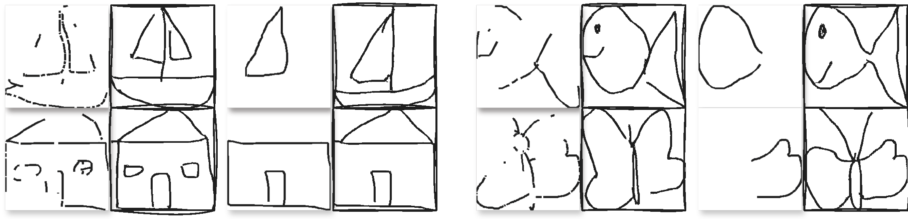
<figcaption>Auto-completion given a partially-drawn sketch in two modes: line segment missing (Column 1&amp;5) and whole strokes missing (Column 3&amp;7). Bordered images are the generated results.</figcaption>
</figure>

<figure id="fig:colors">
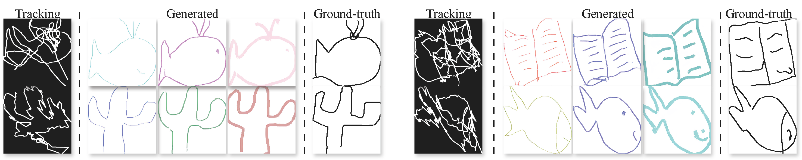
<figcaption>Generation with text instructions for different line colors and brush thickness. Bordered images are the generated results. We use the prompt: “A sketch of a &lt;category&gt;, &lt;color&gt; lines, &lt;thickness&gt; brush.”</figcaption>
</figure>

## Visual Comparison between Controllable DMs

In Figure <a href="#fig:more" data-reference-type="ref" data-reference="fig:more">15</a> we compare the generated sketches between ControlNet and T2IAdapter, when trained under our augmentation-based procedure. We can observe that both ControlNet and T2IAdapter generate visually coherent sketches and generally follow the input tracking image. Nonetheless, by looking into details, ControlNet’s generations are more faithful to the visual cues from the tracking images. For example, the butterfly (bottom right) generated by ControlNet resembles the shapes of the wings from tracking image closely, while the generation from T2IAdapter looks much less similar.

<figure id="fig:more">
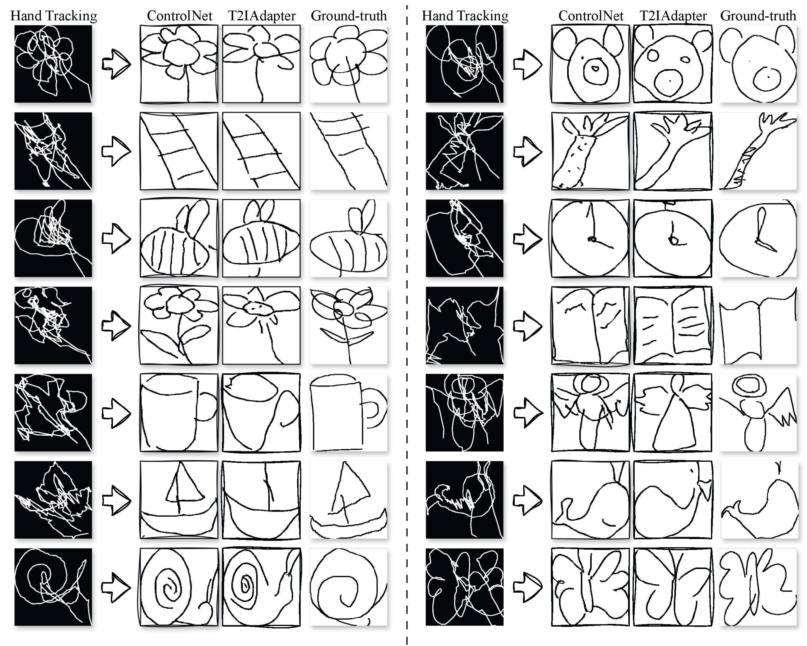
<figcaption>More inference results on ControlNet with our augmentation-based training procedure. We additionally show inference results by using T2IAdapter in our method.</figcaption>
</figure>

[^1]: Authors contributed equally.

[^2]: Details in Appendix <a href="#held_out_details" data-reference-type="ref" data-reference="held_out_details">7.2.0.1</a>
