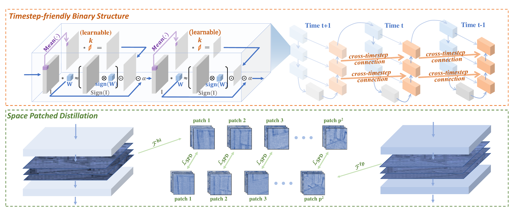
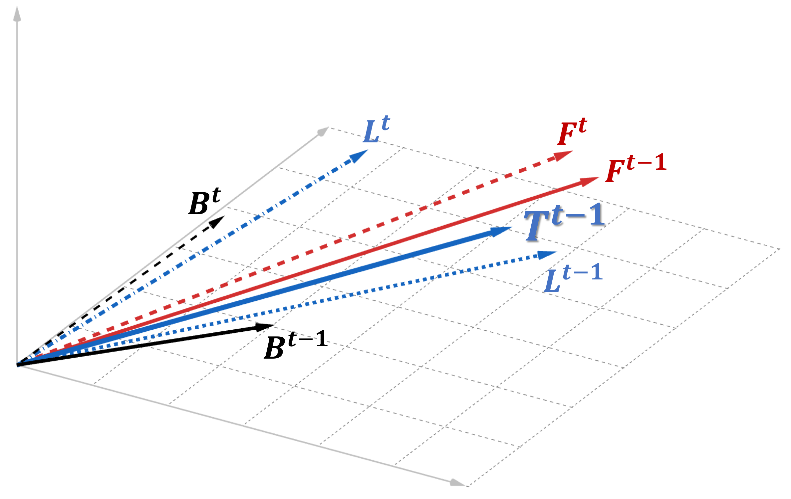
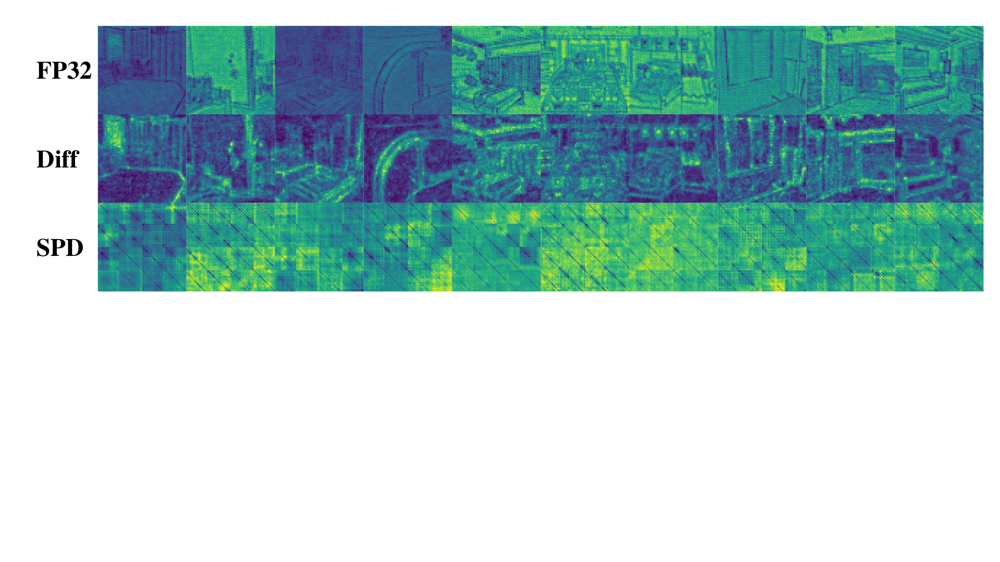
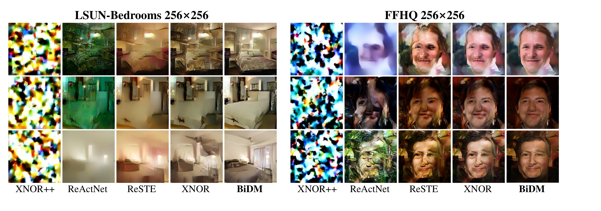
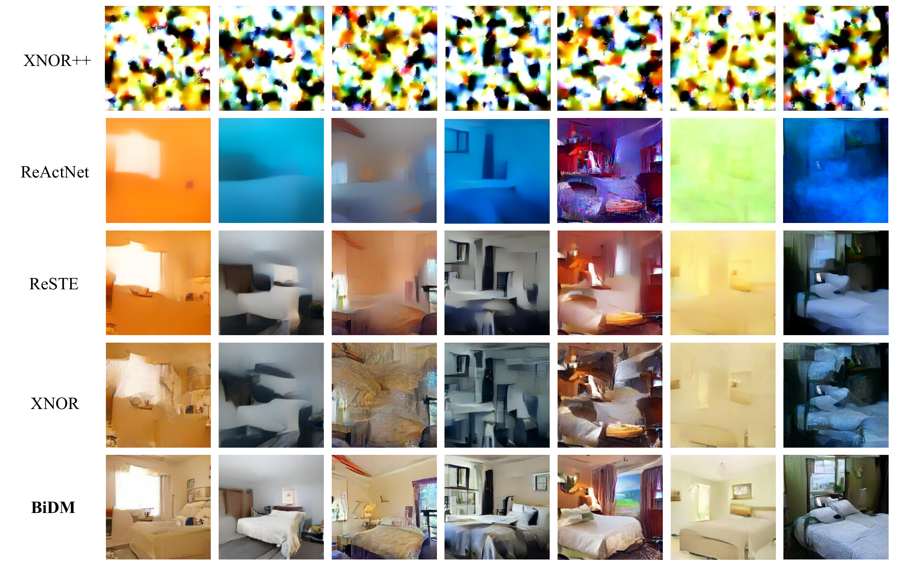

# BiDM: Pushing the Limit of Quantization  
for Diffusion Models

## Abstract

Diffusion models (DMs) have been significantly developed and widely used in various applications due to their excellent generative qualities. However, the expensive computation and massive parameters of DMs hinder their practical use in resource-constrained scenarios. As one of the effective compression approaches, quantization allows DMs to achieve storage saving and inference acceleration by reducing bit-width while maintaining generation performance. However, as the most extreme quantization form, 1-bit binarization causes the generation performance of DMs to face severe degradation or even collapse. This paper proposes a novel method, namely **BiDM**, for fully binarizing weights and activations of DMs, pushing quantization to the 1-bit limit. From a temporal perspective, we introduce the *Timestep-friendly Binary Structure* (TBS), which uses learnable activation binarizers and cross-timestep feature connections to address the highly timestep-correlated activation features of DMs. From a spatial perspective, we propose *Space Patched Distillation* (SPD) to address the difficulty of matching binary features during distillation, focusing on the spatial locality of image generation tasks and noise estimation networks. As the first work to fully binarize DMs, the W1A1 BiDM on the LDM-4 model for LSUN-Bedrooms 256\\(\times\\)`<!-- -->`{=html}256 achieves a remarkable FID of 22.74, significantly outperforming the current state-of-the-art general binarization methods with an FID of 59.44 and invalid generative samples, and achieves up to excellent 28.0\\(\times\\) storage and 52.7\\(\times\\) OPs savings.

# Introduction

Diffusion models (DMs) `\cite{ho2020denoising,rombach2021highresolution,peebles2023scalable,zhao2024dc}`{=latex}, as a type of generative visual model `\cite{xu2023hierarchical,sun2024recent,yan2024dialoguenerf}`{=latex}, have garnered impressive attention and applications in various fields, such as image `\cite{song2019generative,song2020score}`{=latex}, speech `\cite{mittal2021symbolic,popov2021grad,jeong2021diff}`{=latex}, and video `\cite{mei2023vidm,ho2022imagen}`{=latex}, because of their high-quality and diverse generative capabilities. The diffusion model can generate data from random noise through up to 1000 denoising steps `\cite{ho2020denoising}`{=latex}. Although some accelerated sampling methods effectively reduce the number of steps required for generating tasks `\cite{song2020denoising,liu2022pseudo}`{=latex}, the expensive floating-point computation of each timestep still limits its wide application on resource-constrained scenarios. Therefore, compression of the diffusion model becomes a crucial step for its broader application, and existing compression methods mainly include quantization `\cite{li2023q-dm,shang2023post,qin2024accurate}`{=latex}, distillation `\cite{salimans2022progressive,luo2023comprehensive,meng2023distillation,zeng2024improving,guo2023semantic}`{=latex}, pruning `\cite{fang2023structural,guo2021jointpruning,guo2023multidimensional,guo20223d}`{=latex}, *etc*. These compression approaches aim to reduce storage and computation while preserving accuracy.

Quantization is considered a highly effective model compression technique `\cite{yang2019quantization,gholami2022survey,xiao2023robustmq,huang2024good,gong2024survey}`{=latex}, which quantizes the weights and/or activations to low-bit integers or binaries for compact storage and efficient computation in inference. Some existing works thus apply quantization to compress DMs, aiming to compress and accelerate them while maintaining the quality of generation. Among them, 1-bit quantization, namely binarization, can achieve maximum storage savings for models and has performed well in discriminative models such as CNNs `\cite{liu2020reactnet,xu2021recu,xu2021learning}`{=latex}. Furthermore, when both weights and activations are quantized to 1-bit, *e*.*g*., fully binarized, efficient bitwise operations such as XNOR and bitcount can replace matrix multiplication, achieving the most efficient acceleration `\cite{zhang2019dabnn}`{=latex}.

Some existing works have attempted to quantize DM to 1-bit `\cite{zheng2024binarydm}`{=latex}, but their exploration mainly focuses on the weights, which are still far from full binarization. In fact, for generative models like DM, the impact of fully binarizing weights and activations is catastrophic: a) As generative models, DMs have rich intermediate representations closely related to timesteps and highly dynamic activation ranges, which are both very limited in information when binarized weights and activations are used; b) Generative models like DMs are typically required to output complete images, but the highly discrete parameter and feature space make it particularly difficult for binarized DMs to match the ground truth during training. The limited representational capacity, which is hard to match with timesteps dynamically, and the optimization difficulty of generative tasks in discrete space make it difficult for the binarized DM to converge or even collapse during the optimization process.

We propose **BiDM** to push diffusion models towards extreme compression and acceleration through complete binarization of weights and activations. It is designed to address the unique properties of DMs’ activation features, model structure, and the demands of generative tasks, overcoming the difficulties associated with complete binarization. BiDM consists of two novel techniques: *From a temporal perspective*, we observe that the activation properties of DMs are highly correlated with timesteps. We introduce the Timestep-friendly Binary Structure (TBS), which uses learnable activation binary quantizers to match the highly dynamic activation ranges of DMs and designs feature connections across timesteps to leverage the similarity of features between adjacent timesteps, thereby enhancing the representation capacity of the binary model. *From a spatial perspective*, we note the spatial locality of DMs in generative tasks and the convolution-based U-Net structure. We propose Space Patched Distillation (SPD), which introduces a full-precision model as a supervisor and uses attention-guided imitation on divided patches to focus on local features, better guiding the optimization direction of the binary diffusion model.

Extensive experiments show that compared to existing SOTA fully binarized methods, BiDM significantly improves accuracy while maintaining the same inference efficiency, surpassing all existing baselines across various evaluation metrics. Specifically, in pixel space diffusion models, BiDM is the only method that raises the IS to 5.18, close to the level of full-precision models and 0.95 higher than the best baseline method. In LDM, BiDM reduces the FID on LSUN-Bedrooms from the SOTA method’s 59.44 to an impressive 22.74, while fully benefiting from 28.0\\(\times\\) storage and 52.7\\(\times\\) OPs savings. As the first fully binarized method for diffusion models, numerous generated samples also demonstrate that BiDM is currently the only method capable of producing acceptable images with fully binarized DMs, enabling the efficient application of DMs in low-resource scenarios.

<figure id="fig:framework">

<figcaption>Overview of BiDM with <em>Timestep-friendly Binary Structure</em>, which improves DM architecture temporally, and <em>Space Patched Distillation</em>, which enhances DM optimization spatially.</figcaption>
</figure>

# Related Work

Diffusion models (DMs) have demonstrated excellent generative capabilities across various tasks `\cite{ho2020denoising,song2019generative,song2020score,niu2020permutation,mittal2021symbolic,popov2021grad,jeong2021diff}`{=latex}. However, their large-scale model architectures and the high computational costs required for multi-step inference limit their practical applications. To address this, methods for accelerating the process at the timestep level have been widely proposed, including sampling acceleration that does not require retraining `\cite{song2020denoising,liu2022pseudo,lu2022dpm,lu2022dpm++}`{=latex} and distillation methods `\cite{salimans2022progressive,luo2023comprehensive,meng2023distillation}`{=latex}. A recent method called DeepCache `\cite{ma2023deepcache}`{=latex} caches high-dimensional features to avoid a lot of redundant computations and is compatible with typical sampling acceleration methods. However, these methods cannot overcome the memory bottlenecks and efficiency limits during single-step inference.

Quantization is a widely validated compression technique that compresses weights and activations from the usual 32 bits to 1-8 bits to achieve compression and acceleration `\cite{esser2019learned,zhou2016dorefa,lv2024ptq4sam,pmlr-v235-zhang24bb}`{=latex}. Consequently, quantization is being studied for application in diffusion models `\cite{he2023efficientdm,chen2024binarized}`{=latex}. These methods generally consider the unique timestep structure and spatial architecture of diffusion models, but due to the significant difficulty of quantizing generative models, most post-training quantization (PTQ) methods can only quantize models to 4 bits or more `\cite{li2023q-diff,shang2023post,huang2023tfmq}`{=latex}, while more accurate quantization-aware training (QAT) methods face severe performance bottlenecks below 3 bits `\cite{li2023q-dm,so2024temporal}`{=latex}.

Binarization, the most extreme form of quantization, typically expresses weights and activations as ±1, allowing the model to achieve maximum compression and acceleration `\cite{wang2020sparsity,wu2023estimator}`{=latex}. In computer vision, binarization work has mainly focused on discriminative models like CNNs `\cite{rastegari2016xnor,liu2020reactnet,qin2020forward,qin2023distribution}`{=latex} or ViTs `\cite{le2023binaryvit,he2023bivit}`{=latex}, with limited work on generative models. While ResNet VAE and Flow++ `\cite{bird2020reducing}`{=latex} have achieved complete binarization for VAEs `\cite{kingma2013auto}`{=latex}, they do not offer generative performance comparable to current advanced models. Binary Latent Diffusion `\cite{wang2023binary}`{=latex} binarized the latent space of LDMs `\cite{kingma2013auto}`{=latex} but did not improve the model’s spatial footprint or inference efficiency. The latest work, BinaryDM `\cite{rombach2021highresolution}`{=latex}, quantized DMs to nearly W1A4, but it did not address activation quantization, leaving room for achieving full binarization and acceleration of DMs.

# Method

## Binarized Diffusion Model Baseline [Binarized Diffusion Model Baseline]

#### Diffusion models.

Given a data distribution \\(\boldsymbol{x}_0\sim q(\boldsymbol{x}_0)\\), the forward process generates a sequence of random variables \\(\boldsymbol{x}_{t} \in \{\boldsymbol{x}_1,  \cdots, \boldsymbol{x}_T\}\\) with transition kernel \\(q(\boldsymbol{x}_t|\boldsymbol{x}_{t-1})\\), usually Gaussian perturbation, which can be expressed as \\[q\left(\boldsymbol{x}_1, \ldots, \boldsymbol{x}_T \mid \boldsymbol{x}_{0}\right) = \prod_{t=1}^T q(\boldsymbol{x}_t \mid \boldsymbol{x}_{t-1}), \quad
q\left(\boldsymbol{x}_t \mid \boldsymbol{x}_{t-1}\right) = \mathcal{N}\left(\boldsymbol{x}_t ; \sqrt{1-\beta_t} \boldsymbol{x}_{t-1}, \beta_t \boldsymbol{I}\right),\\] where \\(\beta_t\in (0,1)\\) is a noise schedule. Gaussian transition kernel allows us to marginalize the joint distribution, so with \\(\alpha_t:=1-\beta_t\\) and \\(\bar{\alpha}_t:=\prod_{i=1}^t \alpha_i\\), we can easily obtain a sample of \\(\boldsymbol{x}_t\\) by sampling a gaussian vector \\(\boldsymbol{\epsilon}\sim\mathcal{N}(\boldsymbol{0}, \boldsymbol{I})\\) and applying the transformation \\(\boldsymbol{x}_t=\sqrt{\bar{\alpha_t}}\boldsymbol{x}_0+\sqrt{1-\bar{\alpha_t}}\boldsymbol{\epsilon}\\).

The reverse process aims to generate samples by removing noise, approximating the unavailable conditional distribution \\(q\left(\boldsymbol{x}_{t-1} \mid \boldsymbol{x}_t\right)\\) with a learnable transition kernel \\(p_\theta\left(\boldsymbol{x}_{t-1} \mid \boldsymbol{x}_t\right)\\), which can be expressed as \\[p_\theta\left(\boldsymbol{x}_{t-1} \mid \boldsymbol{x}_t\right)=\mathcal{N} \left(\boldsymbol{x}_{t-1} ; \tilde{\boldsymbol{\mu}}_{\theta} \left(\boldsymbol{x}_t, t\right), \tilde{\beta}_t \boldsymbol{I}\right).\\] The mean \\(\tilde{\boldsymbol{\mu}}_{\theta} \left(\boldsymbol{x}_t, t\right)\\) and variance \\(\tilde{\beta}_t\\) could be derived using the reparameterization tricks in `\cite{ho2020denoising}`{=latex}: \\[\begin{aligned}
\tilde{\boldsymbol{\mu}}_{\theta} \left(\boldsymbol{x}_t, t\right) =\frac{1}{\sqrt{\alpha_t}}\left(\boldsymbol{x}_t-\frac{1-\alpha_t}{\sqrt{1-\bar{\alpha}_t}} \boldsymbol{\epsilon}_{\theta}\left(\boldsymbol{x}_t, t\right)\right), \quad
\tilde{\beta}_t =\frac{1-\bar{\alpha}_{t-1}}{1-\bar{\alpha}_t} \cdot \beta_t,
\end{aligned}\\] where \\(\boldsymbol{\epsilon}_{\theta}\\) is a function approximation with the learnable parameter \\(\theta\\), which predicts \\(\boldsymbol{\epsilon}\\) given \\(\boldsymbol{x}_t\\).

For the training of DMs, a simplified variant of the variational lower bound is usually applied as the loss function for better sample quality, which can be expressed as \\[\label{eq:simple_loss}
\mathcal{L}_{\text{DM}}=\mathbb{E}_{t\sim [1, T], \boldsymbol{x}_0\sim q(\boldsymbol{x}_0), \boldsymbol{\epsilon}\sim\mathcal{N}(\boldsymbol{0}, \boldsymbol{I})}\left[\left\|\boldsymbol{\epsilon}_t-\boldsymbol{\epsilon}_\theta\left(\boldsymbol{x}_t, t\right)\right\|^2\right].\\] U-Net `\cite{ronneberger2015u}`{=latex}, due to its ability to fuse low-level and high-dimensional features, has become the mainstream backbone of Diffusion. The input-output blocks of U-Net can be represented as \\(\{D_m\}_{m=1}^d\\) and \\(\{U_m\}_{m=1}^d\\), where blocks corresponding to smaller \\(m\\) are more low-level. Skip connections propagate low-level information from \\(D_m(\cdot)\\) to \\(U_{m}(\cdot)\\), so the input received by \\(U_{m}\\) is expressed as: \\[\label{eq:concat}
\operatorname{Concat}(D_m(\cdot),U_{m+1}(\cdot)).\\]

#### Binarization.

The quantization compresses and accelerates the noise estimation model by discretizing weights and activations to low bit-width. In the baseline of the binarized diffusion model, the weights \\(\boldsymbol{w}\\) are binarized to 1-bit `\cite{rastegari2016xnor,courbariaux2016binarized,huang2024billm}`{=latex}: \\[\label{eq:binarizer}
\boldsymbol{w}^\text{bi}=\sigma\operatorname{sign}(\boldsymbol{w})=
\begin{cases}
\sigma, & \text{if } \boldsymbol{w} \geq 0,\\
-\sigma, & \text{otherwise},
\end{cases}\\] where \\(\operatorname{sign}\\) function confine \\(\boldsymbol{w}\\) to +1 or -1 with 0 thresholds. \\(\sigma\\) is a floating-point scalar, which is initialized as \\(\frac{\|\boldsymbol{w}\|}{n}\\) (\\(n\\) denotes the number of weights) and learnable during training following `\cite{rastegari2016xnor,liu2020reactnet}`{=latex}.

Meanwhile, activations are typically quantized by naive BNN quantizers `\cite{hubara2016binarized,liu2020bi}`{=latex}: \\[\label{eq:binarizer_a}
\boldsymbol{a}^\text{bi}=\operatorname{sign}(\boldsymbol{a})=
\begin{cases}
1, & \text{if } \boldsymbol{a} \geq 0,\\
-1, & \text{otherwise}.
\end{cases}\\] When both weights and activations are quantized to 1-bit, the computations of the denoising model can be replaced by XNOR and bitcount operators, achieving significant compression and acceleration.

<figure id="fig:Observation-1">

<figcaption>(a) The activation range of the 4th convolutional layer of the full-precision DDIM model on CIFAR-10 varies with the denoising timesteps. (b) The output features are similar at each step of the full-precision LDM-4 model on LSUN-Bedrooms compared to the previous step.</figcaption>
</figure>

## Timestep-friendly Binary Structure

Before delving into the detailed description of the proposed method, we summarize our observation on the properties of DMs:

#### Observation 1.

*The activation range varies significantly across long-term timesteps, but the activation features are similar in short-term neighboring timesteps.*

Previous works, such as TDQ `\cite{so2024temporal}`{=latex} and Q-DM `\cite{li2023q-dm}`{=latex}, have commonly demonstrated that the activation distribution of DMs largely depends on denoising process, manifesting as similarities between adjacent timesteps while difference between distant ones, as shown in Figure <a href="#Fig.observation.1" data-reference-type="ref" data-reference="Fig.observation.1">[Fig.observation.1]</a>. Therefore, applying a fixed scaling factor to activations across all timesteps can cause significant distortion in the activation range. Beyond the distribution range, Deepcache `\cite{ma2023deepcache}`{=latex} highlights the substantial temporal consistency of high-dimensional features across consecutive timesteps, as shown in Figure <a href="#Fig.observation.2" data-reference-type="ref" data-reference="Fig.observation.2">[Fig.observation.2]</a>.

These phenomena prompt us to reexamine existing binary structures. Binaryization, especially the full binaryization of weights and activations, results in a greater loss of activation range and precision compared to low-bit quantizations like 4-bit `\cite{rombach2021highresolution}`{=latex}. This makes it more challenging to generate rich activation features. Such deficiencies in activation range and output features significantly harm representation-rich generative models like DMs. Therefore, adopting binary quantizers with more flexible activation ranges for DMs, and enhancing the model’s overall expressive power by leveraging its feature outputs, are crucial strategies for improving its generative capability after full binaryization.

We first focus on the differences between various timesteps over the long term. Most existing activation quantizers, such as BNN `\cite{hubara2016binarized}`{=latex} and Bi-Real `\cite{liu2020bi}`{=latex}, as shown in Eq. (<a href="#eq:binarizer" data-reference-type="ref" data-reference="eq:binarizer">[eq:binarizer]</a>), directly quantize activations to {+1, -1}. This approach significantly disrupts activation features and negatively impacts the expressive power of generative models. Some improved activation binary quantizers, such as XNOR++ `\cite{bulat2019xnor}`{=latex}, adopt a trainable scale factor \\(k\\):

\\[\label{eq:binarizer_xpp}
\boldsymbol{a}^\text{bi}=K\operatorname{sign}(\boldsymbol{a})=
\begin{cases}
K, & \text{if } \boldsymbol{a} \geq 0,\\
-K, & \text{otherwise},
\end{cases}\\] where the form of \\(K\\) could be either a vector or the product of multiple vectors, but it remains a constant value during inference. Although this approach partially restores the feature expression of activations, it does not align well with diffusion models that are highly correlated with timesteps and may still lead to significant performance loss.

We turn our attention to the original XNOR, which employs dynamically computed means to construct the activation binary quantizer. Its operation for 2D convolution can be expressed as: \\[\label{eq:binarizer_xnor}
\mathbf{I} * \mathbf{W} \approx (\operatorname{sign}(\mathbf{I})\otimes \operatorname{sign}(\mathbf{W}))\odot (K\alpha ) = (\operatorname{sign}(\mathbf{I})\otimes \operatorname{sign}(\mathbf{W}))\odot (A*k\alpha ),\\] where \\(\mathbf{I} \in \mathbb{R}^{c\times w_{in}\times h_{in}}\\), \\(\mathbf{W} \in \mathbb{R}^{c\times w\times h}\\), \\(A=\frac{\sum \left | \mathbf{I}{i,:,:} \right | }{c}\\), \\(\alpha=\frac{1}{n} \left \| \mathbf{W} \right \|_{\ell1}\\). \\(k \in \mathbb{R}^{1\times 1 \times w\times h}\\) represents a 2D filter, where \\(\forall ij\\) \\(k_{ij}=\frac{1}{w\times h}\\). \\(*\\) and \\(\otimes\\) indicate convolution with and without multiplication, respectively. This approach naturally preserves the range of activation features and dynamically adapts with the input range across different timesteps. However, due to the rich expression of DM features, local activations exhibit inconsistency in range before and after passing through modules, indicating that the predetermined value of \\(k\\) does not effectively restore the activation representation.

Therefore, we make \\(k\\) adjustable and allow it to be learned during training to adaptively match the changes in the range of activations before and after. The gradient calculation process of our learnable tiny convolution \\(k\\) can be expressed as follows: \\[\label{eq:gradient}
\frac{\partial \mathcal L}{\partial k} 
= \frac{\partial \mathcal L}{\partial (\mathbf{I} * \mathbf{W})} \frac{\partial (A * k\alpha)}{\partial k} (\operatorname{sign}(\mathbf{I})\otimes \operatorname{sign}(\mathbf{W})) .\\] Notably, making \\(k\\) learnable does not add any extra inference burden. The computational cost remains unchanged, allowing for efficient binary operations.

On the other hand, we focus on the similarity between adjacent timesteps. Deepcache directly extracts high-dimensional features as a cache to skip a large amount of deep computation in U-Net, achieving significant inference acceleration. This process is expressed as: \\[\label{eq:deepcache1}
F_{cache}^t \gets U_{m+1}^t(\cdot),\quad
\operatorname{Concat}(D_m^{t-1}(\cdot),F_{cache}^t).\\] However, this approach does not apply to binarized diffusion models, as the information content of each output from a binary network is very limited. For binary diffusion models, which inherently achieve significant compression and acceleration but have limited expressive power, we anticipate that the similarity of features between adjacent timesteps will enhance binary representation, thereby compensating for the representation challenges.

We construct a cross-timestep information enhancement connection to enrich the expression at the current timestep using features from the previous step. This process can be expressed as: \\[\label{eq:connection}
\operatorname{Concat}(D_m^{t-1}(\cdot),(1-\alpha_{m+1}^{t-1})\cdot U_{m+1}^{t-1}(\cdot)+\alpha_{m+1}^{t-1}\cdot U_{m+1}^{t}(\cdot)),\\] where \\(\alpha_{m+1}^{t-1}\\) is a learnable scaling factor. As shown in Figure <a href="#Fig.observation.2" data-reference-type="ref" data-reference="Fig.observation.2">[Fig.observation.2]</a>, the similarity of high-dimensional features varies across different blocks and timesteps in DMs. Therefore, we set multiple independent \\(\alpha\\) values to allow the model to adaptively learn more effectively during training.

In summary, Timestep-friendly Binary Structure (TBS) includes learnable tiny convolution applied to scaling factors after averaging the inputs and connections across timesteps. Their combined effect adapts to the changes in the activation range of diffusion models over long-range timesteps and leverages the similarity of high-dimensional features between adjacent timesteps to enhance information representation.

<figure id="fig:TBS">

<figcaption>An illustration of TBS. Since the feature space is high-dimensional, we illustrate it using schematic diagrams.</figcaption>
</figure>

From the perspective of error reduction, a visualization of TBS is shown in Figure <a href="#fig:TBS" data-reference-type="ref" data-reference="fig:TBS">3</a>. First, we abstract the output of the binary DM under the baseline method as vector \\(B^{t-1}\\). The mismatch in scaling factors creates a significant difference in length between it and the output vector \\(F^{t-1}\\) of the full-precision model. Using our proposed scaling factors and learnable tiny convolutions, \\(B^{t-1}\\) is expanded to \\(L^{t-1}\\). \\(L^{t-1}\\) is closer to \\(F^{t-1}\\), but there is still a directional difference from the full-precision model. The cross-timestep connection further incorporates the outputs \\(F^t\\) of the previous timestep, \\(B^t\\), and \\(L^t\\). The high-dimensional feature similarity between adjacent timesteps means the gap between \\(F^{t-1}\\) and \\(F^t\\) is relatively small, facilitating the combination of \\(L^{t-1}\\) and \\(L^t\\). Finally, we obtain the binarized DM’s output with TBS applied as \\(T^{t-1} = (1-\alpha) \cdot L^{t-1} + \alpha \cdot L^t\\), closest to the output \\(F^{t-1}\\) of the full-precision model. The learnable tiny convolution \\(k\\) in TBS allows scaling factors to adapt more flexibly to the representation of DM, while connections across timesteps enable the binarized DM to use the previous step’s output information for appropriate information compensation.

## Space Patched Distilation

Due to the nature of generative models, the optimization process of diffusion models exhibits different characteristics from past discriminative models:

#### Observation 2.

*Conventional distillation struggles to guide fully binarized DMs to align with full-precision DMs, while the features of DM exhibit locality in space during the generation task.*

In previous practices, adding distillation loss during the training of quantized models has been a common approach. As the numerical space of binary models is limited, directly optimizing them using naive loss leads to difficulties in adjusting gradient update directions and makes learning challenging. Therefore, adding distillation loss to intermediate features can better guide the model’s local and global optimization process.

However, as a generative model, the highly rich feature representation of DMs makes it extremely difficult for binary models to finely mimic full-precision models. Although the L2 loss used in the original DM training aligns with the Gaussian noise in the diffusion process, it is not suitable for the distillation matching of intermediate features. During regular distillation, the commonly used L2 loss tends to prioritize optimizing pixels with larger discrepancies, leading to a more uniform and smooth optimization result. This global constraint learning process is challenging for binary models aimed at image generation, as their limited representation capacity makes it difficult for fine-grained distillation imitation to directly adjust them to fully match the direction of full-precision models.

At the same time, we note that DMs using U-Net as a backbone naturally exhibit spatial locality due to their convolution-based structure and generative task requirements. This is different from past discriminative models, where tasks like classification only require overall feature extraction without low-level requirements, making traditional distillation methods unsuitable for DMs with spatial locality in generative tasks. Additionally, most existing DM distillation methods focus on reducing the number of timesteps and do not address the spatial locality of features required for image generation tasks.

Therefore, given the difficulty in optimizing binary DMs with existing loss functions and the spatial locality of DMs, we propose Space Patched Distillation (SPD). Specifically, we designed a new loss function that partitions features into patches before distillation and then calculates spatial attention-guided loss patch by patch. While conventional L2 loss makes it difficult for binary DMs to achieve direct matching, leading to optimization challenges, the attention mechanism allows the distillation optimization to focus more on critical parts. However, this is still challenging for fully binarized DMs because the highly discrete binary outputs have limited information, making it difficult for the model to capture global information. Therefore, we leverage the spatial locality of DMs by dividing intermediate features into multiple patches and independently calculating spatial attention-guided loss for each patch, allowing the binary model to better utilize local information during optimization.

SPD first divides the intermediate features \\(\mathcal{F}^{\text{bi}}\\) and \\(\mathcal{F}^{\text{fp}} \in \mathbb{F}^{b\times c\times w\times h}\\), output by a block of the binary DM and the full-precision DM respectively, into \\(p^2\\) patches: \\[\label{eq:patch_feature}
\mathcal{P}_{i,j}^{\text{fp}}=\mathcal{F}_{[:,:,i:i+w/p,j:j+h/p]}^{\text{fp}}, \quad \mathcal{P}_{i,j}^{\text{bi}}=\mathcal{F}_{[:,:,i:i+w/p,j:j+h/p]}^{\text{bi}}.\\] Then, attention-guided loss is calculated for each patch separately: \\[\label{eq:attention}
\mathcal{A}_{i,j}^{\text{fp}}=\mathcal{P}_{i,j}^{\text{fp}}{\mathcal{P}_{i,j}^{\text{fp}}}^T, \quad \mathcal{A}_{i,j}^{\text{bi}}=\mathcal{P}_{i,j}^{\text{bi}}{\mathcal{P}_{i,j}^{\text{bi}}}^T.\\] After regularization, the losses at corresponding positions are calculated and summed up: \\[\label{eq:SPD_loss}
\mathcal{L}_{\text{SPD}}^m = \frac{1}{p^2} \sum_{i=0}^{p-1} \sum_{j=0}^{p-1} \left \| { \frac{\mathcal{A}_{i,j}^{\text{fp}}}{ \| \mathcal{A}_{i,j}^{\text{fp}} \|_2} - \frac{\mathcal{A}_{i,j}^{\text{bi}}}{ \| \mathcal{A}_{i,j}^{\text{bi}} \|_2} } \right \|_2,\\] where \\(\|\cdot\|_2\\) denotes the L2 function. Finally, the total training loss \\(\mathcal{L}\\) is computed as: \\[\label{eq:total_loss}
\mathcal{L} = \mathcal{L}_{\text{DM}} +  \frac{\lambda}{2d+1} \sum_{m}^{2d+1} \mathcal{L}_{\text{SPD}}^m,\\] where \\(d\\) denotes the number of blocks during the upsampling process or downsampling process, resulting in a total of \\(2d+1\\) intermediate features, including the middle block. \\(\lambda\\) is a hyperparameter coefficient to balance the loss terms, defaulting set to 4.

We visualize the intermediate features and attention-guided SPD mentioned above. As Figure <a href="#fig:feature-loss" data-reference-type="ref" data-reference="fig:feature-loss">4</a> shown, our SPD allows the model to pay more attention to local information in each patch.

<figure id="fig:feature-loss">

<figcaption>Visualization of the last TimeStepBlock’s output of the LDM model on LSUN-bedroom dataset. FP32 denotes the full-precision model’s output ℱfp. Diff denotes the difference between the output of the full-precision model and the binarized one ∥ℱfp − ℱbi∥. Ours denotes the attention-guided SPD. </figcaption>
</figure>

# Experiment [sec:experiment]

We conduct experiments on various datasets, including CIFAR-10 \\(32\times32\\) `\cite{krizhevsky2009learning}`{=latex}, LSUN-Bedrooms \\(256\times256\\) `\cite{yu2015lsun}`{=latex}, LSUN-Churches \\(256\times256\\) `\cite{yu2015lsun}`{=latex} and FFHQ \\(256\times256\\)  `\cite{karras2019style}`{=latex} over pixel space diffusion models `\cite{ho2020denoising}`{=latex} and latent space diffusion models `\cite{rombach2021highresolution}`{=latex}. The evaluation metrics used in our study encompass Inception Score (IS), Fréchet Inception Distance (FID) `\cite{heusel2017gans}`{=latex}, Sliding Fréchet Inception Distance (sFID) `\cite{salimans2016improved}`{=latex}, Precision and Recall. To date, there has been no research that compresses diffusion models to such an extreme extent. Therefore, we use classical binarization algorithms `\cite{bulat2019xnor,zhou2016dorefa,liu2020reactnet,rastegari2016xnor}`{=latex}, the recent SOTA general binarization algorithms `\cite{wu2023estimator}`{=latex}, and quantization methods suited to generative models `\cite{he2023efficientdm,xia2022basic}`{=latex} as baselines. We extract the outputs of TimestepEmbedBlocks from the DM to serve as the operating target for our TBS and SPD. And we employ the same shortcut connections in convolutional layers as those used in ReActNet`\cite{liu2020reactnet}`{=latex}. Detailed experiment settings are presented in the Appendix <a href="#sec:Experiment_Settings" data-reference-type="ref" data-reference="sec:Experiment_Settings">6</a>.

## Main Results

#### Pixel Space Diffusion Models.

We first conduct experiments on the CIFAR-10 \\(32\times32\\) dataset. As the results presented in Table <a href="#tab:ldm_main_result_1" data-reference-type="ref" data-reference="tab:ldm_main_result_1">1</a>, W1A1 binarization of DM using baseline methods results in substantial degradation. However, BiDM demonstrated significant improvements across all metrics, achieving unprecedented restoration of image quality. Specifically, BiDM achieved remarkable enhancements from 4.23 to 5.18 in the IS metric, and reduced 27.9% in the FID metric.

<table>
<caption>Binarization results for DDIM on CIFAR-10 datasets with 100 steps.</caption>
<thead>
<tr>
<th style="text-align: left;">Model</th>
<th style="text-align: center;">Dataset</th>
<th style="text-align: left;">Method</th>
<th style="text-align: center;">#Bits</th>
<th style="text-align: right;">IS↑</th>
<th style="text-align: right;">FID↓</th>
<th style="text-align: right;">sFID↓</th>
<th style="text-align: right;">Precision↑</th>
<th style="text-align: right;"></th>
<th style="text-align: right;"></th>
<th style="text-align: right;"></th>
</tr>
</thead>
<tbody>
<tr>
<td rowspan="7" style="text-align: left;">DDIM</td>
<td rowspan="7" style="text-align: center;">CIFAR-10 32 × 32</td>
<td style="text-align: left;">FP</td>
<td style="text-align: center;">32/32</td>
<td style="text-align: right;">8.90</td>
<td style="text-align: right;">5.54</td>
<td style="text-align: right;">4.46</td>
<td style="text-align: right;">67.92</td>
<td style="text-align: right;"></td>
<td style="text-align: right;"></td>
<td style="text-align: right;"></td>
</tr>
<tr>
<td style="text-align: left;">XNOR++</td>
<td style="text-align: center;">1/1</td>
<td style="text-align: right;">2.23</td>
<td style="text-align: right;">251.14</td>
<td style="text-align: right;">60.85</td>
<td style="text-align: right;">44.98</td>
<td style="text-align: right;"></td>
<td style="text-align: right;"></td>
<td style="text-align: right;"></td>
</tr>
<tr>
<td style="text-align: left;">DoReFa</td>
<td style="text-align: center;">1/1</td>
<td style="text-align: right;">1.43</td>
<td style="text-align: right;">397.60</td>
<td style="text-align: right;">139.97</td>
<td style="text-align: right;">0.17</td>
<td style="text-align: right;"></td>
<td style="text-align: right;"></td>
<td style="text-align: right;"></td>
</tr>
<tr>
<td style="text-align: left;">ReActNet</td>
<td style="text-align: center;">1/1</td>
<td style="text-align: right;">3.35</td>
<td style="text-align: right;">231.55</td>
<td style="text-align: right;">119.80</td>
<td style="text-align: right;">18.37</td>
<td style="text-align: right;"></td>
<td style="text-align: right;"></td>
<td style="text-align: right;"></td>
</tr>
<tr>
<td style="text-align: left;">ReSTE</td>
<td style="text-align: center;">1/1</td>
<td style="text-align: right;">1.26</td>
<td style="text-align: right;">394.29</td>
<td style="text-align: right;">125.84</td>
<td style="text-align: right;">0.18</td>
<td style="text-align: right;"></td>
<td style="text-align: right;"></td>
<td style="text-align: right;"></td>
</tr>
<tr>
<td style="text-align: left;">XNOR</td>
<td style="text-align: center;">1/1</td>
<td style="text-align: right;">4.23</td>
<td style="text-align: right;">113.36</td>
<td style="text-align: right;">27.67</td>
<td style="text-align: right;">46.96</td>
<td style="text-align: right;"></td>
<td style="text-align: right;"></td>
<td style="text-align: right;"></td>
</tr>
<tr>
<td style="text-align: left;"><strong>BiDM</strong></td>
<td style="text-align: center;"><strong>1/1</strong></td>
<td style="text-align: right;"><strong>5.18</strong></td>
<td style="text-align: right;"><strong>81.65</strong></td>
<td style="text-align: right;"><strong>25.68</strong></td>
<td style="text-align: right;"><strong>52.92</strong></td>
<td style="text-align: right;"></td>
<td style="text-align: right;"></td>
<td style="text-align: right;"></td>
</tr>
</tbody>
</table>

#### Latent Space Diffusion Models.

Our LDM experiments encompass the evaluation of LDM-4 on LSUN-Bedrooms \\(256\times256\\) and FFHQ \\(256\times256\\) datasets, along with the assessment of LDM-8 on the LSUN-Churches \\(256\times256\\) dataset. The experiments utilized the DDIM sampler with 200 steps, and the detailed outcomes are presented in Table <a href="#tab:ldm_main_result_2" data-reference-type="ref" data-reference="tab:ldm_main_result_2">2</a>. Across these three datasets, our method achieved significant improvements over the best baseline methods. In comparison to other binarization algorithms, BiDM outperformed across all metrics. On the LSUN-Bedrooms, LSUN-Churches, and FFHQ datasets, the FID metric of BiDM decreased by 61.7%, 30.7%, and 51.4%, respectively, compared to the best results among the baselines.

In contrast to XNOR++, its adoption of fixed activation scaling factors in the denoising process results in a very limited dynamic range for its activations, making it difficult to match the highly flexible generative representations of DMs. BiDM addressed this challenge by making the tiny convolution \\(k\\) learnable, which acts on the dynamically computed scaling factors. This optimization led to substantial improvements exceeding an order of magnitude across all metrics. On the LSUN-Bedrooms and LSUN-Churches datasets, the FID metric decreased from 319.66 to 22.74 and from 292.48 to 29.70, respectively. Additionally, compared to the SOTA binarization method ReSTE, BiDM achieved significant enhancements across multiple metrics, particularly demonstrating notable improvements on the LSUN-Bedrooms dataset. We have supplemented our work with BBCU, a binarization method more akin to generative models like DMs rather than discriminative models. Experimental results indicate that even as a binarization strategy for generative models, BBCU faces significant breakdowns when applied to DMs, as FID dropped dramatically to 236.07 on LSUN-Bedrooms. As a work targeting QAT for DM, EfficientDM is indeed a suitable comparison, especially since it designs TALSQ to address the variation in activation range. The results show that EfficientDM struggles to adapt to the extreme scenario of W1A1, and this may be due to its quantizer having difficulty adapting to binarized DM, and using QALoRA for weight updates might yield suboptimal results compared to full-parameter QAT.

As we mentioned in the TBS section of our manuscript, most existing binarization methods struggle to handle the wide activation range and flexible expression of DMs, further highlighting the necessity of TBS. Their optimization strategies may also not be tailored for the image generation tasks performed by DM, which means they only achieve conventional but suboptimal optimization.

<table>
<caption>Quantization results for LDM on LSUN-Bedrooms, LSUN-Churches and FFHQ datasets.</caption>
<thead>
<tr>
<th style="text-align: left;">Model</th>
<th style="text-align: center;">Dataset</th>
<th style="text-align: left;">Method</th>
<th style="text-align: center;">#Bits</th>
<th style="text-align: right;">FID↓</th>
<th style="text-align: right;">sFID↓</th>
<th style="text-align: right;">Precision↑</th>
<th style="text-align: right;">Recall↑</th>
<th style="text-align: right;"></th>
<th style="text-align: right;"></th>
<th style="text-align: right;"></th>
</tr>
</thead>
<tbody>
<tr>
<td rowspan="9" style="text-align: left;">LDM-4</td>
<td rowspan="9" style="text-align: center;">LSUN-Bedrooms 256 × 256</td>
<td style="text-align: left;">FP</td>
<td style="text-align: center;">32/32</td>
<td style="text-align: right;">2.99</td>
<td style="text-align: right;">7.08</td>
<td style="text-align: right;">65.02</td>
<td style="text-align: right;">47.54</td>
<td style="text-align: right;"></td>
<td style="text-align: right;"></td>
<td style="text-align: right;"></td>
</tr>
<tr>
<td style="text-align: left;">XNOR++</td>
<td style="text-align: center;">1/1</td>
<td style="text-align: right;">319.66</td>
<td style="text-align: right;">184.75</td>
<td style="text-align: right;">0.00</td>
<td style="text-align: right;">0.00</td>
<td style="text-align: right;"></td>
<td style="text-align: right;"></td>
<td style="text-align: right;"></td>
</tr>
<tr>
<td style="text-align: left;">BBCU</td>
<td style="text-align: center;">1/1</td>
<td style="text-align: right;">236.07</td>
<td style="text-align: right;">89.66</td>
<td style="text-align: right;">0.59</td>
<td style="text-align: right;">5.66</td>
<td style="text-align: right;"></td>
<td style="text-align: right;"></td>
<td style="text-align: right;"></td>
</tr>
<tr>
<td style="text-align: left;">EfficientDM</td>
<td style="text-align: center;">1/1</td>
<td style="text-align: right;">194.45</td>
<td style="text-align: right;">113.24</td>
<td style="text-align: right;">0.99</td>
<td style="text-align: right;">9.20</td>
<td style="text-align: right;"></td>
<td style="text-align: right;"></td>
<td style="text-align: right;"></td>
</tr>
<tr>
<td style="text-align: left;">DoReFa</td>
<td style="text-align: center;">1/1</td>
<td style="text-align: right;">188.30</td>
<td style="text-align: right;">89.28</td>
<td style="text-align: right;">0.86</td>
<td style="text-align: right;">0.18</td>
<td style="text-align: right;"></td>
<td style="text-align: right;"></td>
<td style="text-align: right;"></td>
</tr>
<tr>
<td style="text-align: left;">ReActNet</td>
<td style="text-align: center;">1/1</td>
<td style="text-align: right;">154.74</td>
<td style="text-align: right;">61.50</td>
<td style="text-align: right;">4.63</td>
<td style="text-align: right;">9.30</td>
<td style="text-align: right;"></td>
<td style="text-align: right;"></td>
<td style="text-align: right;"></td>
</tr>
<tr>
<td style="text-align: left;">ReSTE</td>
<td style="text-align: center;">1/1</td>
<td style="text-align: right;">59.44</td>
<td style="text-align: right;">42.16</td>
<td style="text-align: right;">12.06</td>
<td style="text-align: right;">2.92</td>
<td style="text-align: right;"></td>
<td style="text-align: right;"></td>
<td style="text-align: right;"></td>
</tr>
<tr>
<td style="text-align: left;">XNOR</td>
<td style="text-align: center;">1/1</td>
<td style="text-align: right;">106.62</td>
<td style="text-align: right;">56.81</td>
<td style="text-align: right;">6.82</td>
<td style="text-align: right;">5.22</td>
<td style="text-align: right;"></td>
<td style="text-align: right;"></td>
<td style="text-align: right;"></td>
</tr>
<tr>
<td style="text-align: left;"><strong>BiDM</strong></td>
<td style="text-align: center;">1/1</td>
<td style="text-align: right;"><strong>22.74</strong></td>
<td style="text-align: right;"><strong>17.91</strong></td>
<td style="text-align: right;"><strong>33.54</strong></td>
<td style="text-align: right;"><strong>19.90</strong></td>
<td style="text-align: right;"></td>
<td style="text-align: right;"></td>
<td style="text-align: right;"></td>
</tr>
<tr>
<td rowspan="7" style="text-align: left;">LDM-8</td>
<td rowspan="7" style="text-align: center;">LSUN-Churches 256 × 256</td>
<td style="text-align: left;">FP</td>
<td style="text-align: center;">32/32</td>
<td style="text-align: right;">4.36</td>
<td style="text-align: right;">16.00</td>
<td style="text-align: right;">74.64</td>
<td style="text-align: right;">48.98</td>
<td style="text-align: right;"></td>
<td style="text-align: right;"></td>
<td style="text-align: right;"></td>
</tr>
<tr>
<td style="text-align: left;">XNOR++</td>
<td style="text-align: center;">1/1</td>
<td style="text-align: right;">292.48</td>
<td style="text-align: right;">168.65</td>
<td style="text-align: right;">0.02</td>
<td style="text-align: right;">0.00</td>
<td style="text-align: right;"></td>
<td style="text-align: right;"></td>
<td style="text-align: right;"></td>
</tr>
<tr>
<td style="text-align: left;">DoReFa</td>
<td style="text-align: center;">1/1</td>
<td style="text-align: right;">162.06</td>
<td style="text-align: right;">95.37</td>
<td style="text-align: right;">7.85</td>
<td style="text-align: right;">0.74</td>
<td style="text-align: right;"></td>
<td style="text-align: right;"></td>
<td style="text-align: right;"></td>
</tr>
<tr>
<td style="text-align: left;">ReActNet</td>
<td style="text-align: center;">1/1</td>
<td style="text-align: right;">56.39</td>
<td style="text-align: right;">54.68</td>
<td style="text-align: right;">45.13</td>
<td style="text-align: right;">2.06</td>
<td style="text-align: right;"></td>
<td style="text-align: right;"></td>
<td style="text-align: right;"></td>
</tr>
<tr>
<td style="text-align: left;">ReSTE</td>
<td style="text-align: center;">1/1</td>
<td style="text-align: right;">47.88</td>
<td style="text-align: right;">52.44</td>
<td style="text-align: right;">51.98</td>
<td style="text-align: right;">3.34</td>
<td style="text-align: right;"></td>
<td style="text-align: right;"></td>
<td style="text-align: right;"></td>
</tr>
<tr>
<td style="text-align: left;">XNOR</td>
<td style="text-align: center;">1/1</td>
<td style="text-align: right;">42.87</td>
<td style="text-align: right;">49.24</td>
<td style="text-align: right;">51.53</td>
<td style="text-align: right;">4.28</td>
<td style="text-align: right;"></td>
<td style="text-align: right;"></td>
<td style="text-align: right;"></td>
</tr>
<tr>
<td style="text-align: left;"><strong>BiDM</strong></td>
<td style="text-align: center;">1/1</td>
<td style="text-align: right;"><strong>29.70</strong></td>
<td style="text-align: right;"><strong>45.14</strong></td>
<td style="text-align: right;"><strong>55.75</strong></td>
<td style="text-align: right;"><strong>14.80</strong></td>
<td style="text-align: right;"></td>
<td style="text-align: right;"></td>
<td style="text-align: right;"></td>
</tr>
<tr>
<td rowspan="7" style="text-align: left;">LDM-4</td>
<td rowspan="7" style="text-align: center;">FFHQ 256 × 256</td>
<td style="text-align: left;">FP</td>
<td style="text-align: center;">32/32</td>
<td style="text-align: right;">4.87</td>
<td style="text-align: right;">6.96</td>
<td style="text-align: right;">74.73</td>
<td style="text-align: right;">50.57</td>
<td style="text-align: right;"></td>
<td style="text-align: right;"></td>
<td style="text-align: right;"></td>
</tr>
<tr>
<td style="text-align: left;">XNOR++</td>
<td style="text-align: center;">1/1</td>
<td style="text-align: right;">379.49</td>
<td style="text-align: right;">320.64</td>
<td style="text-align: right;">0.00</td>
<td style="text-align: right;">0.00</td>
<td style="text-align: right;"></td>
<td style="text-align: right;"></td>
<td style="text-align: right;"></td>
</tr>
<tr>
<td style="text-align: left;">DoReFa</td>
<td style="text-align: center;">1/1</td>
<td style="text-align: right;">214.06</td>
<td style="text-align: right;">177.63</td>
<td style="text-align: right;">2.09</td>
<td style="text-align: right;">0.00</td>
<td style="text-align: right;"></td>
<td style="text-align: right;"></td>
<td style="text-align: right;"></td>
</tr>
<tr>
<td style="text-align: left;">ReActNet</td>
<td style="text-align: center;">1/1</td>
<td style="text-align: right;">147.88</td>
<td style="text-align: right;">141.31</td>
<td style="text-align: right;">3.36</td>
<td style="text-align: right;">0.69</td>
<td style="text-align: right;"></td>
<td style="text-align: right;"></td>
<td style="text-align: right;"></td>
</tr>
<tr>
<td style="text-align: left;">ReSTE</td>
<td style="text-align: center;">1/1</td>
<td style="text-align: right;">144.37</td>
<td style="text-align: right;">97.43</td>
<td style="text-align: right;">4.03</td>
<td style="text-align: right;">0.03</td>
<td style="text-align: right;"></td>
<td style="text-align: right;"></td>
<td style="text-align: right;"></td>
</tr>
<tr>
<td style="text-align: left;">XNOR</td>
<td style="text-align: center;">1/1</td>
<td style="text-align: right;">89.37</td>
<td style="text-align: right;">54.04</td>
<td style="text-align: right;">31.31</td>
<td style="text-align: right;">4.11</td>
<td style="text-align: right;"></td>
<td style="text-align: right;"></td>
<td style="text-align: right;"></td>
</tr>
<tr>
<td style="text-align: left;"><strong>BiDM</strong></td>
<td style="text-align: center;">1/1</td>
<td style="text-align: right;"><strong>43.42</strong></td>
<td style="text-align: right;"><strong>32.35</strong></td>
<td style="text-align: right;"><strong>49.44</strong></td>
<td style="text-align: right;"><strong>13.96</strong></td>
<td style="text-align: right;"></td>
<td style="text-align: right;"></td>
<td style="text-align: right;"></td>
</tr>
</tbody>
</table>

<figure id="fig:result-main">

<figcaption>Visualization of samples generated by the W1A1 baseline and our BiDM. BiDM is the first fully binarized DM method capable of generating viewable images, significantly surpassing advanced binarization methods.</figcaption>
</figure>

## Ablation Study

We perform comprehensive ablation studies for LDM-4 on the LSUN-Bedrooms \\(256\times256\\) dataset to evaluate the effectiveness of each proposed component in BiDM. We evaluate the effectiveness of our proposed SPD and TBS, and the results are presented in Table <a href="#tab:ablation" data-reference-type="ref" data-reference="tab:ablation">3</a>. Upon separately applying our SPD or TBS methods to LDM, we observed significant improvements compared to the original performance. When the TBS method was incorporated, FID and sFID dropped sharply from 106.62 and 56.61 to 35.23 and 25.13, respectively. Similarly, when the SPD method was added, FID and sFID decreased significantly from 106.62 and 56.61 to 40.62 and 31.61, respectively. Other metrics also exhibited substantial improvements. This demonstrates the effectiveness of our approach in continuously approximating the binarized model features to full-precision features during training by introducing a learnable factor \\(\alpha_{m}^{t}\\) and incorporating connections between adjacent time steps. Furthermore, when we combined our two methods and applied them to LDM, we observed an additional improvement compared to the individual application of each method. This further substantiates that performing distillation between full-precision and binarized models at the patch level can significantly enhance the performance of the binarized model. We also conducted additional ablation experiments, and the results are presented in the appendix <a href="#sec:Additional Experimental Results" data-reference-type="ref" data-reference="sec:Additional Experimental Results">7</a>.

| Method | \#Bits | FID\\(\downarrow\\) | sFID\\(\downarrow\\) | Prec.\\(\uparrow\\) | Recall\\(\uparrow\\) |
|:---|:--:|---:|---:|---:|---:|
| Vanilla | 1/1 | 106.62 | 56.81 | 6.82 | 5.22 |
| +TBS | 1/1 | 35.23 | 25.13 | 26.38 | 14.32 |
| +SPD | 1/1 | 40.62 | 31.61 | 23.87 | 11.18 |
| **BiDM** | 1/1 | **22.74** | **17.91** | **33.54** | **19.90** |

Ablation result of each proposed component.

## Efficiency Analysis

**Inference Efficiency Analysis.** We conducted an analysis of the diffusion model’s inference efficiency under complete binarization. During inference, BiDM requires only a very small number of additional floating-point additions for the connections across timesteps compared to the classic binarization work XNOR-Net, and there are no differences in the majority of calculations, such as convolutions. Performing a floating-point convolution with a depth of 1 for scaling factors requires only a small amount of computation, and the overhead for averaging matrix \\(A\\) is also minimal. The findings presented in Table <a href="#efficiency:analy" data-reference-type="ref" data-reference="efficiency:analy">4</a> reveal that BiDM, while achieving the same 28.0\\(\times\\) memory efficiency and 52.7\\(\times\\) computational savings as the XNOR baseline, demonstrates significantly superior image generation capabilities, with the FID decreased from 106.62 to 22.74. See Appendix <a href="#sec:inference_effciency" data-reference-type="ref" data-reference="sec:inference_effciency">[sec:inference_effciency]</a> for more details.

| Method | \#Bits | Size(MB) | BOPs(\\(\times 10^9\\)) | FLOPs(\\(\times10^9\\)) | OPs(\\(\times10^9\\)) | FID\\(\downarrow\\) |
|:---|:--:|---:|---:|---:|---:|---:|
| FP | 32/32 | 1045.4 | \- | 96.00 | 96.00 | 2.99 |
| XNOR | 1/1 | 37.3 | 92.1 | 0.38 | 1.82 | 106.62 |
| **BiDM** | 1/1 | 37.3 | 92.1 | 0.38 | 1.82 | 22.74 |

Inference efficiency of our proposed BiDM of LDM-4 on LSUN-Bedrooms.

**Training Efficiency Analysis.** We also explored the training efficiency of BiDM, as the overhead required for the QAT of binarized DMs cannot be overlooked. Theoretical analysis and experimental results show that BiDM achieved significantly better generative results than baseline methods under the same training cost, demonstrating that it not only has a higher upper limit of generative capability but is also relatively efficient in terms of generative performance. See Appendix <a href="#sec:training_effciency" data-reference-type="ref" data-reference="sec:training_effciency">[sec:training_effciency]</a> for details.

**Limitations.** The techniques of BiDM increase the training time of DMs compared with the original process, and future efforts may thus focus on the efficient quantization process of DMs.

# Conclusion.

In this paper, we present BiDM, a novel fully binarized method that pushes the compression of diffusion models to the limit. Based on two observations — activations at different timesteps and the characteristics of image generation tasks — we propose the Timestep-friendly Binary Structure (TBS) and Space Patched Distillation (SPD) from temporal and spatial perspectives, respectively. These methods address the severe limitations in representation capacity and the challenges of highly discrete spatial optimization in full binarization. As the first fully binarized diffusion model, BiDM demonstrates significantly better generative performance than the SOTA general binarization methods across multiple models and datasets. On LSUN-Bedrooms, BiDM achieves an FID of 22.74, greatly surpassing the SOTA method with an FID of 59.44, making it the only method capable of generating visually acceptable samples while achieving up to 28.0\\(\times\\) storage savings and 52.7\\(\times\\) OPs savings.

This work was supported by the Beijing Municipal Science and Technology Project (No. Z231100010323002), the National Natural Science Foundation of China (Nos. 62306025, 92367204), and the Fundamental Research Funds for the Central Universities.

# References [references]

Thomas Bird, Friso H Kingma, and David Barber Reducing the computational cost of deep generative models with binary neural networks , 2020. **Abstract:** Deep generative models provide a powerful set of tools to understand real-world data. But as these models improve, they increase in size and complexity, so their computational cost in memory and execution time grows. Using binary weights in neural networks is one method which has shown promise in reducing this cost. However, whether binary neural networks can be used in generative models is an open problem. In this work we show, for the first time, that we can successfully train generative models which utilize binary neural networks. This reduces the computational cost of the models massively. We develop a new class of binary weight normalization, and provide insights for architecture designs of these binarized generative models. We demonstrate that two state-of-the-art deep generative models, the ResNet VAE and Flow++ models, can be binarized effectively using these techniques. We train binary models that achieve loss values close to those of the regular models but are 90%-94% smaller in size, and also allow significant speed-ups in execution time. (@bird2020reducing)

Adrian Bulat and Georgios Tzimiropoulos Xnor-net++: Improved binary neural networks , pages 1–12, 2019. **Abstract:** This paper proposes an improved training algorithm for binary neural networks in which both weights and activations are binary numbers. A key but fairly overlooked feature of the current state-of-the-art method of XNOR-Net is the use of analytically calculated real-valued scaling factors for re-weighting the output of binary convolutions. We argue that analytic calculation of these factors is sub-optimal. Instead, in this work, we make the following contributions: (a) we propose to fuse the activation and weight scaling factors into a single one that is learned discriminatively via backpropagation. (b) More importantly, we explore several ways of constructing the shape of the scale factors while keeping the computational budget fixed. (c) We empirically measure the accuracy of our approximations and show that they are significantly more accurate than the analytically calculated one. (d) We show that our approach significantly outperforms XNOR-Net within the same computational budget when tested on the challenging task of ImageNet classification, offering up to 6\\}% accuracy gain. (@bulat2019xnor)

Zhaowei Cai and Nuno Vasconcelos Rethinking differentiable search for mixed-precision neural networks In *Proceedings of the IEEE/CVF Conference on Computer Vision and Pattern Recognition*, pages 2349–2358, 2020. **Abstract:** Low-precision networks, with weights and activations quantized to low bit-width, are widely used to accelerate inference on edge devices. However, current solutions are uniform, using identical bit-width for all filters. This fails to account for the different sensitivities of different filters and is suboptimal. Mixed-precision networks address this problem, by tuning the bit-width to individual filter requirements. In this work, the problem of optimal mixed-precision network search (MPS) is considered. To circumvent its difficulties of discrete search space and combinatorial optimization, a new differentiable search architecture is proposed, with several novel contributions to advance the efficiency by leveraging the unique properties of the MPS problem. The resulting Efficient differentiable MIxed-Precision network Search (EdMIPS) method is effective at finding the optimal bit allocation for multiple popular networks, and can search a large model, e.g. Inception-V3, directly on ImageNet without proxy task in a reasonable amount of time. The learned mixed-precision networks significantly outperform their uniform counterparts. (@cai2020rethinking)

Zheng Chen, Haotong Qin, Yong Guo, Xiongfei Su, Xin Yuan, Linghe Kong, and Yulun Zhang Binarized diffusion model for image super-resolution , 2024. **Abstract:** Advanced diffusion models (DMs) perform impressively in image super-resolution (SR), but the high memory and computational costs hinder their deployment. Binarization, an ultra-compression algorithm, offers the potential for effectively accelerating DMs. Nonetheless, due to the model structure and the multi-step iterative attribute of DMs, existing binarization methods result in significant performance degradation. In this paper, we introduce a novel binarized diffusion model, BI-DiffSR, for image SR. First, for the model structure, we design a UNet architecture optimized for binarization. We propose the consistent-pixel-downsample (CP-Down) and consistent-pixel-upsample (CP-Up) to maintain dimension consistent and facilitate the full-precision information transfer. Meanwhile, we design the channel-shuffle-fusion (CS-Fusion) to enhance feature fusion in skip connection. Second, for the activation difference across timestep, we design the timestep-aware redistribution (TaR) and activation function (TaA). The TaR and TaA dynamically adjust the distribution of activations based on different timesteps, improving the flexibility and representation alability of the binarized module. Comprehensive experiments demonstrate that our BI-DiffSR outperforms existing binarization methods. Code is released at: https://github.com/zhengchen1999/BI-DiffSR. (@chen2024binarized)

Matthieu Courbariaux, Itay Hubara, Daniel Soudry, Ran El-Yaniv, and Yoshua Bengio Binarized neural networks: Training deep neural networks with weights and activations constrained to+ 1 or-1 , pages 1–11, 2016. **Abstract:** We introduce a method to train Binarized Neural Networks (BNNs) - neural networks with binary weights and activations at run-time. At training-time the binary weights and activations are used for computing the parameters gradients. During the forward pass, BNNs drastically reduce memory size and accesses, and replace most arithmetic operations with bit-wise operations, which is expected to substantially improve power-efficiency. To validate the effectiveness of BNNs we conduct two sets of experiments on the Torch7 and Theano frameworks. On both, BNNs achieved nearly state-of-the-art results over the MNIST, CIFAR-10 and SVHN datasets. Last but not least, we wrote a binary matrix multiplication GPU kernel with which it is possible to run our MNIST BNN 7 times faster than with an unoptimized GPU kernel, without suffering any loss in classification accuracy. The code for training and running our BNNs is available on-line. (@courbariaux2016binarized)

Steven K Esser, Jeffrey L McKinstry, Deepika Bablani, Rathinakumar Appuswamy, and Dharmendra S Modha Learned step size quantization In *International Conference on Learning Representations*, pages 1–12, 2019. **Abstract:** Deep networks run with low precision operations at inference time offer power and space advantages over high precision alternatives, but need to overcome the challenge of maintaining high accuracy as precision decreases. Here, we present a method for training such networks, Learned Step Size Quantization, that achieves the highest accuracy to date on the ImageNet dataset when using models, from a variety of architectures, with weights and activations quantized to 2-, 3- or 4-bits of precision, and that can train 3-bit models that reach full precision baseline accuracy. Our approach builds upon existing methods for learning weights in quantized networks by improving how the quantizer itself is configured. Specifically, we introduce a novel means to estimate and scale the task loss gradient at each weight and activation layer’s quantizer step size, such that it can be learned in conjunction with other network parameters. This approach works using different levels of precision as needed for a given system and requires only a simple modification of existing training code. (@esser2019learned)

Gongfan Fang, Xinyin Ma, and Xinchao Wang Structural pruning for diffusion models , 2023. **Abstract:** Generative modeling has recently undergone remarkable advancements, primarily propelled by the transformative implications of Diffusion Probabilistic Models (DPMs). The impressive capability of these models, however, often entails significant computational overhead during both training and inference. To tackle this challenge, we present Diff-Pruning, an efficient compression method tailored for learning lightweight diffusion models from pre-existing ones, without the need for extensive re-training. The essence of Diff-Pruning is encapsulated in a Taylor expansion over pruned timesteps, a process that disregards non-contributory diffusion steps and ensembles informative gradients to identify important weights. Our empirical assessment, undertaken across several datasets highlights two primary benefits of our proposed method: 1) Efficiency: it enables approximately a 50\\}% reduction in FLOPs at a mere 10\\}% to 20\\}% of the original training expenditure; 2) Consistency: the pruned diffusion models inherently preserve generative behavior congruent with their pre-trained models. Code is available at \\}url{https://github.com/VainF/Diff-Pruning}. (@fang2023structural)

Lukas Geiger and Plumerai Team Larq: An open-source library for training binarized neural networks , 5(45):1746, 2020. **Abstract:** Modern deep learning methods have been successfully applied to many different tasks and have the potential to revolutionize everyday lives. However, existing neural networks that use 32 bits to encode each weight and activation often have an energy budget that far exceeds the capabilities of mobile or embedded devices. One common way to improve computational efficiency is to reduce the precision of the network to 16-bit or 8-bit, also known as quantization. Binarized Neural Networks (BNNs) represent an extreme case of quantized networks, that cannot be viewed as approximations to real-valued networks and therefore requires special tools and optimization strategies (Helwegen et al., 2019). In these networks both weights and activations are restricted to {−1,+1} (Hubara, Courbariaux, Soudry, El-Yaniv, & Bengio, 2016). Compared to an equivalent 8-bit quantized network BNNs require 8 times smaller memory size and 8 times fewer memory accesses, which reduces energy consumption drastically when deployed on optimized hardware (Hubara et al., 2016). However, many open research questions remain until the use of BNNs and other extremely quantized neural networks becomes widespread in industry. larq is an ecosystem of Python packages for BNNs and other Quantized Neural Networks (QNNs). It is intended to facilitate researchers to resolve these outstanding questions. (@geiger2020larq)

Amir Gholami, Sehoon Kim, Zhen Dong, Zhewei Yao, Michael W Mahoney, and Kurt Keutzer A survey of quantization methods for efficient neural network inference In *Low-Power Computer Vision*, pages 291–326. Chapman and Hall/CRC, 2022. **Abstract:** As soon as abstract mathematical computations were adapted to computation on digital computers, the problem of efficient representation, manipulation, and communication of the numerical values in those computations arose.Strongly related to the problem of numerical representation is the problem of quantization: in what manner should a set of continuous real-valued numbers be distributed over a fixed discrete set of numbers to minimize the number of bits required and also to maximize the accuracy of the attendant computations?This perennial problem of quantization is particularly relevant whenever memory and/or computational resources are severely restricted, and it has come to the forefront in recent years due to the remarkable performance of Neural Network models in computer vision, natural language processing, and related areas.Moving from floating-point representations to low-precision fixed integer values represented in four bits or less holds the potential to reduce the memory footprint and latency by a factor of 16x; and, in fact, reductions of 4x to 8x are often realized in practice in these applications.Thus, it is not surprising that quantization has emerged recently as an important and very active sub-area of research in the efficient implementation of computations associated with Neural Networks.In this article, we survey approaches to the problem of quantizing the numerical values in deep Neural Network computations, covering the advantages/disadvantages of current methods.With this survey and its organization, we hope to have presented a useful snapshot of the current research in quantization for Neural Networks and to have given an intelligent organization to ease the evaluation of future research in this area. (@gholami2022survey)

Ruihao Gong, Yifu Ding, Zining Wang, Chengtao Lv, Xingyu Zheng, Jinyang Du, Haotong Qin, Jinyang Guo, Michele Magno, and Xianglong Liu A survey of low-bit large language models: Basics, systems, and algorithms , 2024. **Abstract:** Large language models (LLMs) have achieved remarkable advancements in natural language processing, showcasing exceptional performance across various tasks. However, the expensive memory and computational requirements present significant challenges for their practical deployment. Low-bit quantization has emerged as a critical approach to mitigate these challenges by reducing the bit-width of model parameters, activations, and gradients, thus decreasing memory usage and computational demands. This paper presents a comprehensive survey of low-bit quantization methods tailored for LLMs, covering the fundamental principles, system implementations, and algorithmic strategies. An overview of basic concepts and new data formats specific to low-bit LLMs is first introduced, followed by a review of frameworks and systems that facilitate low-bit LLMs across various hardware platforms. Then, we categorize and analyze techniques and toolkits for efficient low-bit training and inference of LLMs. Finally, we conclude with a discussion of future trends and potential advancements of low-bit LLMs. Our systematic overview from basic, system, and algorithm perspectives can offer valuable insights and guidelines for future works to enhance the efficiency and applicability of LLMs through low-bit quantization. (@gong2024survey)

Guangyu Guo, Longfei Han, Le Wang, Dingwen Zhang, and Junwei Han Semantic-aware knowledge distillation with parameter-free feature uniformization , 1(1):6, 2023. **Abstract:** Abstract Knowledge distillation aims to distill knowledge from teacher networks to train student networks. Distilling intermediate features has attracted much attention in recent years as it can be flexibly applied in various fields such as image classification, object detection and semantic segmentation. A critical obstacle of feature-based knowledge distillation is the dimension gap between the intermediate features of teacher and student, and plenty of methods have been proposed to resolve this problem. However, these works usually implement feature uniformization in an unsupervised way, lacking guidance to help the student network learn meaningful mapping functions in the uniformization process. Moreover, the dimension uniformization process of the student and teacher network is usually not equivalent as the mapping functions are different. To this end, some factors of the feature are discarded during parametric feature alignment, or some factors are blended in some non-parametric operations. In this paper, we propose a novel semantic-aware knowledge distillation scheme to solve these problems. We build a standalone feature-based classification branch to extract semantic-aware knowledge for better guiding the learning process of the student network. In addition, to avoid the inequivalence of feature uniformization between teacher and student, we design a novel parameter-free self-attention operation that can convert features of different dimensions into vectors of the same length. Experimental results show that the proposed knowledge distillation scheme outperforms existing feature-based distillation methods on the widely used CIFAR-100 and CINIC-10 datasets. (@guo2023semantic)

Jinyang Guo, Jiaheng Liu, and Dong Xu Jointpruning: Pruning networks along multiple dimensions for efficient point cloud processing , 32(6):3659–3672, 2021. **Abstract:** Deep neural networks designed for point clouds, also called point cloud neural networks (PCNNs), are attracting increasing attention in recent years. In this work, we propose the first model compression framework referred to as JointPruning (JP) that is specifically designed for compressing PCNNs. Observing that the redundancies in PCNNs are largely affected by certain parameters like the number of points, we first propose a new search space specifically designed for PCNNs. By searching the optimal pruning policy in our newly proposed search space, our JP framework can prune the PCNNs at different levels and simultaneously reduce the redundancies along multiple dimensions. As the newly proposed search space consists of multiple levels and the policy value at each level is continuous in our JP framework, it is hard to directly search for the best pruning policy in such a large search space. To this end, we further propose two strategies called search space refinement and validation set extension to progressively refine the granularity of our searching process in a coarse-to-fine and easy-to-hard fashion, which can help us gradually find better pruning policies. Comprehensive experiments on three benchmark datasets demonstrate the effectiveness of our JP framework for compressing PCNNs. (@guo2021jointpruning)

Jinyang Guo, Jiaheng Liu, and Dong Xu 3d-pruning: A model compression framework for efficient 3d action recognition , 32(12):8717–8729, 2022. **Abstract:** The existing end-to-end optimized 3D action recognition methods often suffer from high computational costs. Observing that different frames and different points in point cloud sequences often have different importance values for the 3D action recognition task, in this work, we propose a fully automatic model compression framework called 3D-Pruning (3DP) for efficient 3D action recognition. After performing model compression by using our 3DP framework, the compressed model can process different frames and different points in each frame by using different computational complexities based on their importance values, in which both the importance value and computational complexity for each frame/point can be automatically learned. Extensive experiments on five benchmark datasets demonstrate the effectiveness of our 3DP framework for model compression. (@guo20223d)

Jinyang Guo, Dong Xu, and Wanli Ouyang Multidimensional pruning and its extension: A unified framework for model compression , 2023. **Abstract:** Observing that the existing model compression approaches only focus on reducing the redundancies in convolutional neural networks (CNNs) along one particular dimension (e.g., the channel or spatial or temporal dimension), in this work, we propose our multidimensional pruning (MDP) framework, which can compress both 2-D CNNs and 3-D CNNs along multiple dimensions in an end-to-end fashion. Specifically, MDP indicates the simultaneous reduction of channels and more redundancy on other additional dimensions. The redundancy of additional dimensions depends on the input data, i.e., spatial dimension for 2-D CNNs when using images as the input data, and spatial and temporal dimensions for 3-D CNNs when using videos as the input data. We further extend our MDP framework to the MDP-Point approach for compressing point cloud neural networks (PCNNs) whose inputs are irregular point clouds (e.g., PointNet). In this case, the redundancy along the additional dimension indicates the point dimension (i.e., the number of points). Comprehensive experiments on six benchmark datasets demonstrate the effectiveness of our MDP framework and its extended version MDP-Point for compressing CNNs and PCNNs, respectively. (@guo2023multidimensional)

Yefei He, Jing Liu, Weijia Wu, Hong Zhou, and Bohan Zhuang Efficientdm: Efficient quantization-aware fine-tuning of low-bit diffusion models , 2023. **Abstract:** Diffusion models have demonstrated remarkable capabilities in image synthesis and related generative tasks. Nevertheless, their practicality for real-world applications is constrained by substantial computational costs and latency issues. Quantization is a dominant way to compress and accelerate diffusion models, where post-training quantization (PTQ) and quantization-aware training (QAT) are two main approaches, each bearing its own properties. While PTQ exhibits efficiency in terms of both time and data usage, it may lead to diminished performance in low bit-width. On the other hand, QAT can alleviate performance degradation but comes with substantial demands on computational and data resources. In this paper, we introduce a data-free and parameter-efficient fine-tuning framework for low-bit diffusion models, dubbed EfficientDM, to achieve QAT-level performance with PTQ-like efficiency. Specifically, we propose a quantization-aware variant of the low-rank adapter (QALoRA) that can be merged with model weights and jointly quantized to low bit-width. The fine-tuning process distills the denoising capabilities of the full-precision model into its quantized counterpart, eliminating the requirement for training data. We also introduce scale-aware optimization and temporal learned step-size quantization to further enhance performance. Extensive experimental results demonstrate that our method significantly outperforms previous PTQ-based diffusion models while maintaining similar time and data efficiency. Specifically, there is only a 0.05 sFID increase when quantizing both weights and activations of LDM-4 to 4-bit on ImageNet 256x256. Compared to QAT-based methods, our EfficientDM also boasts a 16.2x faster quantization speed with comparable generation quality. Code is available at \\}href{https://github.com/ThisisBillhe/EfficientDM}{this hrl}. (@he2023efficientdm)

Yefei He, Zhenyu Lou, Luoming Zhang, Jing Liu, Weijia Wu, Hong Zhou, and Bohan Zhuang Bivit: Extremely compressed binary vision transformers In *Proceedings of the IEEE/CVF International Conference on Computer Vision*, pages 5651–5663, 2023. **Abstract:** Model binarization can significantly compress model size, reduce energy consumption, and accelerate inference through efficient bit-wise operations. Although binarizing convolutional neural networks have been extensively studied, there is little work on exploring binarization of vision Transformers which underpin most recent breakthroughs in visual recognition. To this end, we propose to solve two fundamental challenges to push the horizon of Binary Vision Transformers (BiViT). First, the traditional binary method does not take the long-tailed distribution of softmax attention into consideration, bringing large binarization errors in the attention module. To solve this, we propose Softmax-aware Binarization, which dynamically adapts to the data distribution and reduces the error caused by binarization. Second, to better preserve the information of the pretrained model and restore accuracy, we propose a Cross-layer Binarization scheme that decouples the binarization of self-attention and multi-layer perceptrons (MLPs), and Parameterized Weight Scales which introduce learnable scaling factors for weight binarization. Overall, our method performs favorably against state-of-the-arts by 19.8% on the TinyImageNet dataset. On ImageNet, our BiViT achieves a competitive 75.6% Top-1 accuracy over Swin-S model. Additionally, on COCO object detection, our method achieves an mAP of 40.8 with a Swin-T backbone over Cascade Mask R-CNN framework. (@he2023bivit)

Martin Heusel, Hubert Ramsauer, Thomas Unterthiner, Bernhard Nessler, and Sepp Hochreiter Gans trained by a two time-scale update rule converge to a local nash equilibrium , 30, 2017. **Abstract:** Generative Adversarial Networks (GANs) excel at creating realistic images with complex models for which maximum likelihood is infeasible. However, the convergence of GAN training has still not been proved. We propose a two time-scale update rule (TTUR) for training GANs with stochastic gradient descent on arbitrary GAN loss functions. TTUR has an individual learning rate for both the discriminator and the generator. Using the theory of stochastic approximation, we prove that the TTUR converges under mild assumptions to a stationary local Nash equilibrium. The convergence carries over to the popular Adam optimization, for which we prove that it follows the dynamics of a heavy ball with friction and thus prefers flat minima in the objective landscape. For the evaluation of the performance of GANs at image generation, we introduce the "Fr\\}’echet Inception Distance" (FID) which captures the similarity of generated images to real ones better than the Inception Score. In experiments, TTUR improves learning for DCGANs and Improved Wasserstein GANs (WGAN-GP) outperforming conventional GAN training on CelebA, CIFAR-10, SVHN, LSUN Bedrooms, and the One Billion Word Benchmark. (@heusel2017gans)

Jonathan Ho, William Chan, Chitwan Saharia, Jay Whang, Ruiqi Gao, Alexey Gritsenko, Diederik P Kingma, Ben Poole, Mohammad Norouzi, David J Fleet, et al Imagen video: High definition video generation with diffusion models , 2022. **Abstract:** We present Imagen Video, a text-conditional video generation system based on a cascade of video diffusion models. Given a text prompt, Imagen Video generates high definition videos using a base video generation model and a sequence of interleaved spatial and temporal video super-resolution models. We describe how we scale up the system as a high definition text-to-video model including design decisions such as the choice of fully-convolutional temporal and spatial super-resolution models at certain resolutions, and the choice of the v-parameterization of diffusion models. In addition, we confirm and transfer findings from previous work on diffusion-based image generation to the video generation setting. Finally, we apply progressive distillation to our video models with classifier-free guidance for fast, high quality sampling. We find Imagen Video not only capable of generating videos of high fidelity, but also having a high degree of controllability and world knowledge, including the ability to generate diverse videos and text animations in various artistic styles and with 3D object understanding. See https://imagen.research.google/video/ for samples. (@ho2022imagen)

Jonathan Ho, Ajay Jain, and Pieter Abbeel Denoising diffusion probabilistic models , 33:6840–6851, 2020. **Abstract:** We present high quality image synthesis results using diffusion probabilistic models, a class of latent variable models inspired by considerations from nonequilibrium thermodynamics. Our best results are obtained by training on a weighted variational bound designed according to a novel connection between diffusion probabilistic models and denoising score matching with Langevin dynamics, and our models naturally admit a progressive lossy decompression scheme that can be interpreted as a generalization of autoregressive decoding. On the unconditional CIFAR10 dataset, we obtain an Inception score of 9.46 and a state-of-the-art FID score of 3.17. On 256x256 LSUN, we obtain sample quality similar to ProgressiveGAN. Our implementation is available at https://github.com/hojonathanho/diffusion (@ho2020denoising)

Wei Huang, Yangdong Liu, Haotong Qin, Ying Li, Shiming Zhang, Xianglong Liu, Michele Magno, and Xiaojuan Qi Billm: Pushing the limit of post-training quantization for llms , 2024. **Abstract:** Pretrained large language models (LLMs) exhibit exceptional general language processing capabilities but come with significant demands on memory and computational resources. As a powerful compression technology, binarization can extremely reduce model weights to a mere 1 bit, lowering the expensive computation and memory requirements. However, existing quantization techniques fall short of maintaining LLM performance under ultra-low bit-widths. In response to this challenge, we present BiLLM, a groundbreaking 1-bit post-training quantization scheme tailored for pretrained LLMs. Based on the weight distribution of LLMs, BiLLM first identifies and structurally selects salient weights, and minimizes the compression loss through an effective binary residual approximation strategy. Moreover, considering the bell-shaped distribution of the non-salient weights, we propose an optimal splitting search to group and binarize them accurately. BiLLM achieving for the first time high-accuracy inference (e.g. 8.41 perplexity on LLaMA2-70B) with only 1.08-bit weights across various LLMs families and evaluation metrics, outperforms SOTA quantization methods of LLM by significant margins. Moreover, BiLLM enables the binarization process of the LLM with 7 billion weights within 0.5 hours on a single GPU, demonstrating satisfactory time efficiency. Our code is available at https://github.com/Aaronhuang-778/BiLLM. (@huang2024billm)

Wei Huang, Xudong Ma, Haotong Qin, Xingyu Zheng, Chengtao Lv, Hong Chen, Jie Luo, Xiaojuan Qi, Xianglong Liu, and Michele Magno How good are low-bit quantized llama3 models? an empirical study , 2024. **Abstract:** The LLaMA family, a collection of foundation language models ranging from 7B to 65B parameters, has become one of the most powerful open-source large language models (LLMs) and the popular LLM backbone of multi-modal large language models (MLLMs), widely used in computer vision and natural language understanding tasks. In particular, LLaMA3 models have recently been released and have achieved impressive performance in various domains with super-large scale pre-training on over 15T tokens of data. Given the wide application of low-bit quantization for LLMs in resource-constrained scenarios, we explore LLaMA3’s capabilities when quantized to low bit-width. This exploration can potentially provide new insights and challenges for the low-bit quantization of LLaMA3 and other future LLMs, especially in addressing performance degradation issues that suffer in LLM compression. Specifically, we comprehensively evaluate the 10 existing post-training quantization and LoRA fine-tuning (LoRA-FT) methods of LLaMA3 on 1-8 bits and various datasets to reveal the low-bit quantization performance of LLaMA3. To uncover the capabilities of low-bit quantized MLLM, we assessed the performance of the LLaMA3-based LLaVA-Next-8B model under 2-4 ultra-low bits with post-training quantization methods. Our experimental results indicate that LLaMA3 still suffers from non-negligible degradation in linguistic and visual contexts, particularly under ultra-low bit widths. This highlights the significant performance gap at low bit-width that needs to be addressed in future developments. We expect that this empirical study will prove valuable in advancing future models, driving LLMs and MLLMs to achieve higher accuracy at lower bit to enhance practicality. Our project is released on https://github.com/Macaronlin/LLaMA3-Quantization , and quantized models are released at https://huggingface.co/Efficient-ML . (@huang2024good)

Yushi Huang, Ruihao Gong, Jing Liu, Tianlong Chen, and Xianglong Liu Tfmq-dm: Temporal feature maintenance quantization for diffusion models , 2023. **Abstract:** The Diffusion model, a prevalent framework for image generation, encounters significant challenges in terms of broad applicability due to its extended inference times and substantial memory requirements. Efficient Post-training Quantization (PTQ) is pivotal for addressing these issues in traditional models. Different from traditional models, diffusion models heavily depend on the time-step $t$ to achieve satisfactory multi-round denoising. Usually, $t$ from the finite set $\\}{1, \\}ldots, T\\}}$ is encoded to a temporal feature by a few modules totally irrespective of the sampling data. However, existing PTQ methods do not optimize these modules separately. They adopt inappropriate reconstruction targets and complex calibration methods, resulting in a severe disturbance of the temporal feature and denoising trajectory, as well as a low compression efficiency. To solve these, we propose a Temporal Feature Maintenance Quantization (TFMQ) framework building upon a Temporal Information Block which is just related to the time-step $t$ and unrelated to the sampling data. Powered by the pioneering block design, we devise temporal information aware reconstruction (TIAR) and finite set calibration (FSC) to align the full-precision temporal features in a limited time. Equipped with the framework, we can maintain the most temporal information and ensure the end-to-end generation quality. Extensive experiments on various datasets and diffusion models prove our state-of-the-art results. Remarkably, our quantization approach, for the first time, achieves model performance nearly on par with the full-precision model under 4-bit weight quantization. Additionally, our method incurs almost no extra computational cost and accelerates quantization time by $2.0 \\}times$ on LSUN-Bedrooms $256 \\}times 256$ compared to previous works. Our code is publicly available at https://github.com/ModelTC/TFMQ-DM. (@huang2023tfmq)

Itay Hubara, Matthieu Courbariaux, Daniel Soudry, Ran El-Yaniv, and Yoshua Bengio Binarized neural networks , 29:1–9, 2016. **Abstract:** We introduce a method to train Binarized Neural Networks (BNNs) - neural networks with binary weights and activations at run-time. At training-time the binary weights and activations are used for computing the parameters gradients. During the forward pass, BNNs drastically reduce memory size and accesses, and replace most arithmetic operations with bit-wise operations, which is expected to substantially improve power-efficiency. To validate the effectiveness of BNNs we conduct two sets of experiments on the Torch7 and Theano frameworks. On both, BNNs achieved nearly state-of-the-art results over the MNIST, CIFAR-10 and SVHN datasets. Last but not least, we wrote a binary matrix multiplication GPU kernel with which it is possible to run our MNIST BNN 7 times faster than with an unoptimized GPU kernel, without suffering any loss in classification accuracy. The code for training and running our BNNs is available on-line. (@hubara2016binarized)

Myeonghun Jeong, Hyeongju Kim, Sung Jun Cheon, Byoung Jin Choi, and Nam Soo Kim Diff-tts: A denoising diffusion model for text-to-speech , 2021. **Abstract:** Although neural text-to-speech (TTS) models have attracted a lot of attention and succeeded in generating human-like speech, there is still room for improvements to its naturalness and architectural efficiency. In this work, we propose a novel non-autoregressive TTS model, namely Diff-TTS, which achieves highly natural and efficient speech synthesis. Given the text, Diff-TTS exploits a denoising diffusion framework to transform the noise signal into a mel-spectrogram via diffusion time steps. In order to learn the mel-spectrogram distribution conditioned on the text, we present a likelihood-based optimization method for TTS. Furthermore, to boost up the inference speed, we leverage the accelerated sampling method that allows Diff-TTS to generate raw waveforms much faster without significantly degrading perceptual quality. Through experiments, we verified that Diff-TTS generates 28 times faster than the real-time with a single NVIDIA 2080Ti GPU. (@jeong2021diff)

Tero Karras, Samuli Laine, and Timo Aila A style-based generator architecture for generative adversarial networks In *Proceedings of the IEEE/CVF conference on computer vision and pattern recognition*, pages 4401–4410, 2019. **Abstract:** We propose an alternative generator architecture for generative adversarial networks, borrowing from style transfer literature. The new architecture leads to an automatically learned, unsupervised separation of high-level attributes (e.g., pose and identity when trained on human faces) and stochastic variation in the generated images (e.g., freckles, hair), and it enables intuitive, scale-specific control of the synthesis. The new generator improves the state-of-the-art in terms of traditional distribution quality metrics, leads to demonstrably better interpolation properties, and also better disentangles the latent factors of variation. To quantify interpolation quality and disentanglement, we propose two new, automated methods that are applicable to any generator architecture. Finally, we introduce a new, highly varied and high-quality dataset of human faces. (@karras2019style)

Diederik P Kingma and Max Welling Auto-encoding variational bayes , 2013. **Abstract:** How can we perform efficient inference and learning in directed probabilistic models, in the presence of continuous latent variables with intractable posterior distributions, and large datasets? We introduce a stochastic variational inference and learning algorithm that scales to large datasets and, under some mild differentiability conditions, even works in the intractable case. Our contributions are two-fold. First, we show that a reparameterization of the variational lower bound yields a lower bound estimator that can be straightforwardly optimized using standard stochastic gradient methods. Second, we show that for i.i.d. datasets with continuous latent variables per datapoint, posterior inference can be made especially efficient by fitting an approximate inference model (also called a recognition model) to the intractable posterior using the proposed lower bound estimator. Theoretical advantages are reflected in experimental results. (@kingma2013auto)

Alex Krizhevsky, Geoffrey Hinton, et al Learning multiple layers of features from tiny images pages 1–60, 2009. **Abstract:** In this work we describe how to train a multi-layer generative model of natural images. We use a dataset of millions of tiny colour images, described in the next section. This has been attempted by several groups but without success. The models on which we focus are RBMs (Restricted Boltzmann Machines) and DBNs (Deep Belief Networks). These models learn interesting-looking filters, which we show are more useful to a classifier than the raw pixels. We train the classifier on a labeled subset that we have collected and call the CIFAR-10 dataset. (@krizhevsky2009learning)

Phuoc-Hoan Charles Le and Xinlin Li Binaryvit: pushing binary vision transformers towards convolutional models In *Proceedings of the IEEE/CVF Conference on Computer Vision and Pattern Recognition*, pages 4664–4673, 2023. **Abstract:** With the increasing popularity and the increasing size of vision transformers (ViTs), there has been an increasing interest in making them more efficient and less computationally costly for deployment on edge devices with limited computing resources. Binarization can be used to help reduce the size of ViT models and their computational cost significantly, using popcount operations when the weights and the activations are in binary. However, ViTs suffer a larger performance drop when directly applying convolutional neural network (CNN) binarization methods or existing binarization methods to binarize ViTs compared to CNNs on datasets with a large number of classes such as ImageNet-1k. With extensive analysis, we find that binary vanilla ViTs such as DeiT miss out on a lot of key architectural properties that CNNs have that allow binary CNNs to have much higher representational capability than binary vanilla ViT. Therefore, we propose BinaryViT, in which inspired by the CNN architecture, we include operations from the CNN architecture into a pure ViT architecture to enrich the representational capability of a binary ViT without introducing convolutions. These include an average pooling layer instead of a token pooling layer, a block that contains multiple average pooling branches, an affine transformation right before the addition of each main residual connection, and a pyramid structure. Experimental results on the ImageNet-1k dataset show the effectiveness of these operations that allow a fully-binary pure ViT model to be competitive with previous state-of-the-art binary (SOTA) CNN models. (@le2023binaryvit)

Xiuyu Li, Yijiang Liu, Long Lian, Huanrui Yang, Zhen Dong, Daniel Kang, Shanghang Zhang, and Kurt Keutzer Q-diffusion: Quantizing diffusion models In *Proceedings of the IEEE/CVF International Conference on Computer Vision*, pages 17535–17545, 2023. **Abstract:** Diffusion models have achieved great success in image synthesis through iterative noise estimation using deep neural networks. However, the slow inference, high memory consumption, and computation intensity of the noise estimation model hinder the efficient adoption of diffusion models. Although post-training quantization (PTQ) is considered a go-to compression method for other tasks, it does not work out-of-the-box on diffusion models. We propose a novel PTQ method specifically tailored towards the unique multi-timestep pipeline and model architecture of the diffusion models, which compresses the noise estimation network to accelerate the generation process. We identify the key difficulty of diffusion model quantization as the changing output distributions of noise estimation networks over multiple time steps and the bimodal activation distribution of the shortcut layers within the noise estimation network. We tackle these challenges with timestep-aware calibration and split shortcut quantization in this work. Experimental results show that our proposed method is able to quantize full-precision unconditional diffusion models into 4-bit while maintaining comparable performance (small FID change of at most 2.34 compared to \>100 for traditional PTQ) in a training-free manner. Our approach can also be applied to text-guided image generation, where we can run stable diffusion in 4-bit weights with high generation quality for the first time. (@li2023q-diff)

Yanjing Li, Sheng Xu, Xianbin Cao, Xiao Sun, and Baochang Zhang Q-dm: An efficient low-bit quantized diffusion model In *Thirty-seventh Conference on Neural Information Processing Systems*, 2023. **Abstract:** Diffusion models excel in image generation but are computational and resource-intensive due to their reliance on iterative Markov chain processes, leading to error accumulation and limiting the effectiveness of naive compression techniques. In this paper, we propose PQCAD-DM, a novel hybrid compression framework combining Progressive Quantization (PQ) and Calibration-Assisted Distillation (CAD) to address these challenges. PQ employs a two-stage quantization with adaptive bit-width transitions guided by a momentum-based mechanism, reducing excessive weight perturbations in low-precision. CAD leverages full-precision calibration datasets during distillation, enabling the student to match full-precision performance even with a quantized teacher. As a result, PQCAD-DM achieves a balance between computational efficiency and generative quality, halving inference time while maintaining competitive performance. Extensive experiments validate PQCAD-DM’s superior generative capabilities and efficiency across diverse datasets, outperforming fixed-bit quantization methods. (@li2023q-dm)

Luping Liu, Yi Ren, Zhijie Lin, and Zhou Zhao Pseudo numerical methods for diffusion models on manifolds , 2022. **Abstract:** Denoising Diffusion Probabilistic Models (DDPMs) can generate high-quality samples such as image and audio samples. However, DDPMs require hundreds to thousands of iterations to produce final samples. Several prior works have successfully accelerated DDPMs through adjusting the variance schedule (e.g., Improved Denoising Diffusion Probabilistic Models) or the denoising equation (e.g., Denoising Diffusion Implicit Models (DDIMs)). However, these acceleration methods cannot maintain the quality of samples and even introduce new noise at a high speedup rate, which limit their practicability. To accelerate the inference process while keeping the sample quality, we provide a fresh perspective that DDPMs should be treated as solving differential equations on manifolds. Under such a perspective, we propose pseudo numerical methods for diffusion models (PNDMs). Specifically, we figure out how to solve differential equations on manifolds and show that DDIMs are simple cases of pseudo numerical methods. We change several classical numerical methods to corresponding pseudo numerical methods and find that the pseudo linear multi-step method is the best in most situations. According to our experiments, by directly using pre-trained models on Cifar10, CelebA and LSUN, PNDMs can generate higher quality synthetic images with only 50 steps compared with 1000-step DDIMs (20x speedup), significantly outperform DDIMs with 250 steps (by around 0.4 in FID) and have good generalization on different variance schedules. Our implementation is available at https://github.com/luping-liu/PNDM. (@liu2022pseudo)

Zechun Liu, Wenhan Luo, Baoyuan Wu, Xin Yang, Wei Liu, and Kwang-Ting Cheng Bi-real net: Binarizing deep network towards real-network performance , 128:202–219, 2020. **Abstract:** In this paper, we study 1-bit convolutional neural networks (CNNs), of which both the weights and activations are binary. While being ecient, the lacking of a representational capability and the training diculty impede 1-bit CNNs from performing as well as real-valued networks. To this end, we propose Bi-Real net with a novel training algorithm to tackle these two challenges. To enhance the representational capability, we propagate the real-valued activa- tions generated by each 1-bit convolution via a parameter-free shortcut. To address the training diculty, we propose a training algorithm using a tighter approximation to the derivative of the sign function, a magnitude-aware bi- narization for weight updating, a better initialization method, and a two-step scheme for training a deep network. Experiments on ImageNet show that an 18-layer Bi-Real net with the proposed training algorithm achieves 56.4% top- 1 classi cation accuracy, which is 10% higher than the state-of-the-arts ( e.g., Zechun Liu Hong Kong University of Science and Technology, Hong Kong, China E-mail: liuzechun0216@gmail.com Wenhan Luo Tencent AI lab, Shenzhen, China E-mail: whluo.china@gmail.com Baoyuan Wu Tencent AI lab, Shenzhen, China E-mail: wubaoyuan1987@gmail.com Xin Yang Huazhong University of Science and Technology, Wuhan, China E-mail: xinyang2014@hust.edu.cn Wei Liu Tencent AI lab, Shenzhen, China E-mail: wl2223@columbia.edu Kwang-Ting Cheng Hong Kong University of Science and Technology, Hong Kong, China E-mail: timcheng@ust.hkarXiv:1811.01335v2 \[cs.CV\] 4 Sep 20192 Zechun Liu et al. XNOR-Net), with a greater memory saving and a lower computational cost. Bi-Real net is also the rst to scale up 1-bit CNNs to an ultra-deep network with 152 layers, and achieves 64.5% top-1 accuracy on ImageNet. A 50-layer Bi-Real net shows comparable performance to a real-valued network on the depth estimation task with merely a 0.3% accuracy gap. (@liu2020bi)

Zechun Liu, Zhiqiang Shen, Marios Savvides, and Kwang-Ting Cheng Reactnet: Towards precise binary neural network with generalized activation functions In *Proceedings of the European Conference on Computer Vision*, pages 143–159. Springer, 2020. **Abstract:** In this paper, we propose several ideas for enhancing a bi- nary network to close its accuracy gap from real-valued networks without incurring any additional computational cost. We rst construct a base- line network by modifying and binarizing a compact real-valued network with parameter-free shortcuts, bypassing all the intermediate convolu- tional layers including the downsampling layers. This baseline network strikes a good trade-o between accuracy and eciency, achieving su- perior performance than most of existing binary networks at approxi- mately half of the computational cost. Through extensive experiments and analysis, we observed that the performance of binary networks is sensitive to activation distribution variations. Based on this important observation, we propose to generalize the traditional Sign and PReLU functions, denoted as RSign and RPReLU for the respective general- ized functions, to enable explicit learning of the distribution reshape and shift at near-zero extra cost. Lastly, we adopt a distributional loss to further enforce the binary network to learn similar output distribu- tions as those of a real-valued network. We show that after incorporating all these ideas, the proposed ReActNet outperforms all the state-of-the- arts by a large margin. Speci cally, it outperforms Real-to-Binary Net and MeliusNet29 by 4.0% and 3.6% respectively for the top-1 accuracy and also reduces the gap to its real-valued counterpart to within 3.0% top-1 accuracy on ImageNet dataset. Code and models are available at: https://github.com/liuzechun/ReActNet . 1 Introduction The 1-bit convolutional neural network (1-bit CNN, also known as binary neu- ral network) \[7,30\], of which both weights and activations are binary, has been recognized as one of the most promising neural network compression methods for deploying models onto the resource-limited devices. It enjoys 32 memory compression ratio, and up to 58 practical computational reduction on CPU, as demonstrated in \[30\]. Moreover, with its pure logical computation ( i.e., XNOR operations between binary weights and binary activations), 1-bit CNN is both highly energy-ecient for embedded devices \[8,40\], and possesses the potential of being directly deployed on next generation memristor-based hardware \[17\]. ?Work done while visiting CMU.yCorresponding author.arXiv:2003.03488v2 \[cs.CV\] 13 Jul 20202 Z. Liu et al. 630631632633634635636637638639640641642643644645646647648649650651652653654655656657658659 (@liu2020reactnet)

Cheng Lu, Yuhao Zhou, Fan Bao, Jianfei Chen, Chongxuan Li, and Jun Zhu Dpm-solver: A fast ode solver for diffusion probabilistic model sampling in around 10 steps , 35:5775–5787, 2022. **Abstract:** Diffusion probabilistic models (DPMs) are emerging powerful generative models. Despite their high-quality generation performance, DPMs still suffer from their slow sampling as they generally need hundreds or thousands of sequential function evaluations (steps) of large neural networks to draw a sample. Sampling from DPMs can be viewed alternatively as solving the corresponding diffusion ordinary differential equations (ODEs). In this work, we propose an exact formulation of the solution of diffusion ODEs. The formulation analytically computes the linear part of the solution, rather than leaving all terms to black-box ODE solvers as adopted in previous works. By applying change-of-variable, the solution can be equivalently simplified to an exponentially weighted integral of the neural network. Based on our formulation, we propose DPM-Solver, a fast dedicated high-order solver for diffusion ODEs with the convergence order guarantee. DPM-Solver is suitable for both discrete-time and continuous-time DPMs without any further training. Experimental results show that DPM-Solver can generate high-quality samples in only 10 to 20 function evaluations on various datasets. We achieve 4.70 FID in 10 function evaluations and 2.87 FID in 20 function evaluations on the CIFAR10 dataset, and a $4\\}sim 16\\}times$ speedup compared with previous state-of-the-art training-free samplers on various datasets. (@lu2022dpm)

Cheng Lu, Yuhao Zhou, Fan Bao, Jianfei Chen, Chongxuan Li, and Jun Zhu Dpm-solver++: Fast solver for guided sampling of diffusion probabilistic models , 2022. **Abstract:** Diffusion probabilistic models (DPMs) have achieved impressive success in high-resolution image synthesis, especially in recent large-scale text-to-image generation applications. An essential technique for improving the sample quality of DPMs is guided sampling, which usually needs a large guidance scale to obtain the best sample quality. The commonly-used fast sampler for guided sampling is DDIM, a first-order diffusion ODE solver that generally needs 100 to 250 steps for high-quality samples. Although recent works propose dedicated high-order solvers and achieve a further speedup for sampling without guidance, their effectiveness for guided sampling has not been well-tested before. In this work, we demonstrate that previous high-order fast samplers suffer from instability issues, and they even become slower than DDIM when the guidance scale grows large. To further speed up guided sampling, we propose DPM-Solver++, a high-order solver for the guided sampling of DPMs. DPM-Solver++ solves the diffusion ODE with the data prediction model and adopts thresholding methods to keep the solution matches training data distribution. We further propose a multistep variant of DPM-Solver++ to address the instability issue by reducing the effective step size. Experiments show that DPM-Solver++ can generate high-quality samples within only 15 to 20 steps for guided sampling by pixel-space and latent-space DPMs. (@lu2022dpm++)

Weijian Luo A comprehensive survey on knowledge distillation of diffusion models , 2023. **Abstract:** Diffusion Models (DMs), also referred to as score-based diffusion models, utilize neural networks to specify score functions. Unlike most other probabilistic models, DMs directly model the score functions, which makes them more flexible to parametrize and potentially highly expressive for probabilistic modeling. DMs can learn fine-grained knowledge, i.e., marginal score functions, of the underlying distribution. Therefore, a crucial research direction is to explore how to distill the knowledge of DMs and fully utilize their potential. Our objective is to provide a comprehensible overview of the modern approaches for distilling DMs, starting with an introduction to DMs and a discussion of the challenges involved in distilling them into neural vector fields. We also provide an overview of the existing works on distilling DMs into both stochastic and deterministic implicit generators. Finally, we review the accelerated diffusion sampling algorithms as a training-free method for distillation. Our tutorial is intended for individuals with a basic understanding of generative models who wish to apply DM’s distillation or embark on a research project in this field. (@luo2023comprehensive)

Chengtao Lv, Hong Chen, Jinyang Guo, Yifu Ding, and Xianglong Liu Ptq4sam: Post-training quantization for segment anything In *Proceedings of the IEEE/CVF Conference on Computer Vision and Pattern Recognition*, pages 15941–15951, 2024. **Abstract:** Segment Anything Model (SAM) has achieved impressive performance in many computer vision tasks. However, as a large-scale model, the immense memory and computation costs hinder its practical deployment. In this paper, we propose a post-training quantization (PTQ) framework for Segment Anything Model, namely PTQ4SAM. First, we investigate the inherent bottleneck of SAM quantization attributed to the bimodal distribution in post-Key-Linear activations. We analyze its characteristics from both per-tensor and per-channel perspectives, and propose a Bimodal Integration strategy, which utilizes a mathematically equivalent sign operation to transform the bimodal distribution into a relatively easy-quantized normal distribution offline. Second, SAM encompasses diverse attention mechanisms (i.e., self-attention and two-way cross-attention), resulting in substantial variations in the post-Softmax distributions. Therefore, we introduce an Adaptive Granularity Quantization for Softmax through searching the optimal power-of-two base, which is hardware-friendly. Extensive experimental results across various vision tasks (instance segmentation, semantic segmentation and object detection), datasets and model variants show the superiority of PTQ4SAM. For example, when quantizing SAM-L to 6-bit, we achieve lossless accuracy for instance segmentation, about 0.5\\}% drop with theoretical 3.9$\\}times$ acceleration. The code is available at \\}url{https://github.com/chengtao-lv/PTQ4SAM}. (@lv2024ptq4sam)

Xinyin Ma, Gongfan Fang, and Xinchao Wang Deepcache: Accelerating diffusion models for free , 2023. **Abstract:** Diffusion models have recently gained unprecedented attention in the field of image synthesis due to their remarkable generative capabilities. Notwithstanding their prowess, these models often incur substantial computational costs, primarily attributed to the sequential denoising process and cumbersome model size. Traditional methods for compressing diffusion models typically involve extensive retraining, presenting cost and feasibility challenges. In this paper, we introduce DeepCache, a novel training-free paradigm that accelerates diffusion models from the perspective of model architecture. DeepCache capitalizes on the inherent temporal redundancy observed in the sequential denoising steps of diffusion models, which caches and retrieves features across adjacent denoising stages, thereby curtailing redundant computations. Utilizing the property of the U-Net, we reuse the high-level features while updating the low-level features in a very cheap way. This innovative strategy, in turn, enables a speedup factor of 2.3$\\}times$ for Stable Diffusion v1.5 with only a 0.05 decline in CLIP Score, and 4.1$\\}times$ for LDM-4-G with a slight decrease of 0.22 in FID on ImageNet. Our experiments also demonstrate DeepCache’s superiority over existing pruning and distillation methods that necessitate retraining and its compatibility with current sampling techniques. Furthermore, we find that under the same throughput, DeepCache effectively achieves comparable or even marginally improved results with DDIM or PLMS. The code is available at https://github.com/horseee/DeepCache (@ma2023deepcache)

Brais Martinez, Jing Yang, Adrian Bulat, and Georgios Tzimiropoulos Training binary neural networks with real-to-binary convolutions , 2020. **Abstract:** This paper shows how to train binary networks to within a few percent points ($\\}sim 3-5 \\}%$) of the full precision counterpart. We first show how to build a strong baseline, which already achieves state-of-the-art accuracy, by combining recently proposed advances and carefully adjusting the optimization procedure. Secondly, we show that by attempting to minimize the discrepancy between the output of the binary and the corresponding real-valued convolution, additional significant accuracy gains can be obtained. We materialize this idea in two complementary ways: (1) with a loss function, during training, by matching the spatial attention maps computed at the output of the binary and real-valued convolutions, and (2) in a data-driven manner, by using the real-valued activations, available during inference prior to the binarization process, for re-scaling the activations right after the binary convolution. Finally, we show that, when putting all of our improvements together, the proposed model beats the current state of the art by more than 5% top-1 accuracy on ImageNet and reduces the gap to its real-valued counterpart to less than 3% and 5% top-1 accuracy on CIFAR-100 and ImageNet respectively when using a ResNet-18 architecture. Code available at https://github.com/brais-martinez/real2binary. (@martinez2020training)

Kangfu Mei and Vishal Patel Vidm: Video implicit diffusion models In *Proceedings of the AAAI Conference on Artificial Intelligence*, volume 37, pages 9117–9125, 2023. **Abstract:** Diffusion models have emerged as a powerful generative method for synthesizing high-quality and diverse set of images. In this paper, we propose a video generation method based on diffusion models, where the effects of motion are modeled in an implicit condition manner, i.e. one can sample plausible video motions according to the latent feature of frames. We improve the quality of the generated videos by proposing multiple strategies such as sampling space truncation, robustness penalty, and positional group normalization. Various experiments are conducted on datasets consisting of videos with different resolutions and different number of frames. Results show that the proposed method outperforms the state-of-the-art generative adversarial network-based methods by a significant margin in terms of FVD scores as well as perceptible visual quality. (@mei2023vidm)

Chenlin Meng, Robin Rombach, Ruiqi Gao, Diederik Kingma, Stefano Ermon, Jonathan Ho, and Tim Salimans On distillation of guided diffusion models In *Proceedings of the IEEE/CVF Conference on Computer Vision and Pattern Recognition*, pages 14297–14306, 2023. **Abstract:** Classifier-free guided diffusion models have recently been shown to be highly effective at high-resolution image generation, and they have been widely used in large-scale diffusion frameworks including DALL.E 2, Stable Diffusion and Imagen. However, a downside of classifier-free guided diffusion models is that they are computationally expensive at inference time since they require evaluating two diffusion models, a class-conditional model and an unconditional model, tens to hundreds of times. To deal with this limitation, we propose an approach to distilling classifier-free guided diffusion models into models that are fast to sample from: Given a pre-trained classifier-free guided model, we first learn a single model to match the output of the combined conditional and unconditional models, and then we progressively distill that model to a diffusion model that requires much fewer sampling steps. For standard diffusion models trained on the pixel-space, our approach is able to generate images visually comparable to that of the original model using as few as 4 sampling steps on ImageNet \<tex xmlns:mml="http://www.w3.org/1998/Math/MathML" xmlns:xlink="http://www.w3.org/1999/xlink"\>$64\\}times 64$\</tex\> and CIFAR-10, achieving FID/IS scores comparable to that of the original model while being up to 256 times faster to sample from. For diffusion models trained on the latent-space (e.g., Stable Diffusion), our approach is able to generate high-fidelity images using as few as 1 to 4 denoising steps, accelerating inference by at least 10-fold compared to existing methods on ImageNet \<tex xmlns:mml="http://www.w3.org/1998/Math/MathML" xmlns:xlink="http://www.w3.org/1999/xlink"\>$256\\}times 256$\</tex\> and LAION datasets. We further demonstrate the effectiveness of our approach on text-guided image editing and inpainting, where our distilled model is able to generate high-quality results using as few as 2–4 denoising steps. (@meng2023distillation)

Gautam Mittal, Jesse Engel, Curtis Hawthorne, and Ian Simon Symbolic music generation with diffusion models , 2021. **Abstract:** Score-based generative models and diffusion probabilistic models have been successful at generating high-quality samples in continuous domains such as images and audio. However, due to their Langevin-inspired sampling mechanisms, their application to discrete and sequential data has been limited. In this work, we present a technique for training diffusion models on sequential data by parameterizing the discrete domain in the continuous latent space of a pre-trained variational autoencoder. Our method is non-autoregressive and learns to generate sequences of latent embeddings through the reverse process and offers parallel generation with a constant number of iterative refinement steps. We apply this technique to modeling symbolic music and show strong unconditional generation and post-hoc conditional infilling results compared to autoregressive language models operating over the same continuous embeddings. (@mittal2021symbolic)

Chenhao Niu, Yang Song, Jiaming Song, Shengjia Zhao, Aditya Grover, and Stefano Ermon Permutation invariant graph generation via score-based generative modeling In *International Conference on Artificial Intelligence and Statistics*, pages 4474–4484. PMLR, 2020. **Abstract:** Learning generative models for graph-structured data is challenging because graphs are discrete, combinatorial, and the underlying data distribution is invariant to the ordering of nodes. However, most of the existing generative models for graphs are not invariant to the chosen ordering, which might lead to an undesirable bias in the learned distribution. To address this difficulty, we propose a permutation invariant approach to modeling graphs, using the recent framework of score-based generative modeling. In particular, we design a permutation equivariant, multi-channel graph neural network to model the gradient of the data distribution at the input graph (a.k.a., the score function). This permutation equivariant model of gradients implicitly defines a permutation invariant distribution for graphs. We train this graph neural network with score matching and sample from it with annealed Langevin dynamics. In our experiments, we first demonstrate the capacity of this new architecture in learning discrete graph algorithms. For graph generation, we find that our learning approach achieves better or comparable results to existing models on benchmark datasets. (@niu2020permutation)

William Peebles and Saining Xie Scalable diffusion models with transformers In *Proceedings of the IEEE/CVF International Conference on Computer Vision*, pages 4195–4205, 2023. **Abstract:** We explore a new class of diffusion models based on the transformer architecture. We train latent diffusion models of images, replacing the commonly-used U-Net backbone with a transformer that operates on latent patches. We analyze the scalability of our Diffusion Transformers (DiTs) through the lens of forward pass complexity as measured by Gflops. We find that DiTs with higher Gflops—through increased transformer depth/width or increased number of input tokens—consistently have lower FID. In addition to possessing good scalability properties, our largest DiT-XL/2 models outperform all prior diffusion models on the class-conditional ImageNet 512×512 and 256×256 benchmarks, achieving a state-of-the-art FID of 2.27 on the latter. (@peebles2023scalable)

Vadim Popov, Ivan Vovk, Vladimir Gogoryan, Tasnima Sadekova, and Mikhail Kudinov Grad-tts: A diffusion probabilistic model for text-to-speech In *International Conference on Machine Learning*, pages 8599–8608. PMLR, 2021. **Abstract:** Recently, denoising diffusion probabilistic models and generative score matching have shown high potential in modelling complex data distributions while stochastic calculus has provided a unified point of view on these techniques allowing for flexible inference schemes. In this paper we introduce Grad-TTS, a novel text-to-speech model with score-based decoder producing mel-spectrograms by gradually transforming noise predicted by encoder and aligned with text input by means of Monotonic Alignment Search. The framework of stochastic differential equations helps us to generalize conventional diffusion probabilistic models to the case of reconstructing data from noise with different parameters and allows to make this reconstruction flexible by explicitly controlling trade-off between sound quality and inference speed. Subjective human evaluation shows that Grad-TTS is competitive with state-of-the-art text-to-speech approaches in terms of Mean Opinion Score. We will make the code publicly available shortly. (@popov2021grad)

Haotong Qin, Ruihao Gong, Xianglong Liu, Mingzhu Shen, Ziran Wei, Fengwei Yu, and Jingkuan Song Forward and backward information retention for accurate binary neural networks In *Proceedings of the IEEE/CVF Conference on Computer Vision and Pattern Recognition*, pages 2250–2259, 2020. **Abstract:** Weight and activation binarization is an effective approach to deep neural network compression and can accelerate the inference by leveraging bitwise operations. Although many binarization methods have improved the accuracy of the model by minimizing the quantization error in forward propagation, there remains a noticeable performance gap between the binarized model and the full-precision one. Our empirical study indicates that the quantization brings information loss in both forward and backward propagation, which is the bottleneck of training accurate binary neural networks. To address these issues, we propose an Information Retention Network (IR-Net) to retain the information that consists in the forward activations and backward gradients. IR-Net mainly relies on two technical contributions: (1) Libra Parameter Binarization (Libra-PB): simultaneously minimizing both quantization error and information loss of parameters by balanced and standardized weights in forward propagation; (2) Error Decay Estimator (EDE): minimizing the information loss of gradients by gradually approximating the sign function in backward propagation, jointly considering the updating ability and accurate gradients. We are the first to investigate both forward and backward processes of binary networks from the unified information perspective, which provides new insight into the mechanism of network binarization. Comprehensive experiments with various network structures on CIFAR-10 and ImageNet datasets manifest that the proposed IR-Net can consistently outperform state-of-the-art quantization methods. (@qin2020forward)

Haotong Qin, Xudong Ma, Xingyu Zheng, Xiaoyang Li, Yang Zhang, Shouda Liu, Jie Luo, Xianglong Liu, and Michele Magno Accurate lora-finetuning quantization of llms via information retention , 2024. **Abstract:** The LoRA-finetuning quantization of LLMs has been extensively studied to obtain accurate yet compact LLMs for deployment on resource-constrained hardware. However, existing methods cause the quantized LLM to severely degrade and even fail to benefit from the finetuning of LoRA. This paper proposes a novel IR-QLoRA for pushing quantized LLMs with LoRA to be highly accurate through information retention. The proposed IR-QLoRA mainly relies on two technologies derived from the perspective of unified information: (1) statistics-based Information Calibration Quantization allows the quantized parameters of LLM to retain original information accurately; (2) finetuning-based Information Elastic Connection makes LoRA utilizes elastic representation transformation with diverse information. Comprehensive experiments show that IR-QLoRA can significantly improve accuracy across LLaMA and LLaMA2 families under 2-4 bit-widths, e.g., 4- bit LLaMA-7B achieves 1.4% improvement on MMLU compared with the state-of-the-art methods. The significant performance gain requires only a tiny 0.31% additional time consumption, revealing the satisfactory efficiency of our IR-QLoRA. We highlight that IR-QLoRA enjoys excellent versatility, compatible with various frameworks (e.g., NormalFloat and Integer quantization) and brings general accuracy gains. The code is available at https://github.com/htqin/ir-qlora. (@qin2024accurate)

Haotong Qin, Xiangguo Zhang, Ruihao Gong, Yifu Ding, Yi Xu, and Xianglong Liu Distribution-sensitive information retention for accurate binary neural network , 131(1):26–47, 2023. **Abstract:** Model binarization is an effective method of compressing neural networks and accelerating their inference process, which enables state-of-the-art models to run on resource-limited devices. Recently, advanced binarization methods have been greatly improved by minimizing the quantization error directly in the forward process. However, a significant performance gap still exists between the 1-bit model and the 32-bit one. The empirical study shows that binarization causes a great loss of information in the forward and back- ward propagation which harms the performance of binary neural networks (BNNs). We present a novel Distribution-sensitive Information Retention Network (DIR-Net) that retains the information in the forward and back- ward propagation by improving internal propagation and introducing external representations. The DIR-Net mainly relies on three technical contributions: (1)Information Maximized Binarization (IMB): minimizing the information loss and the binarization error of weights/activations simultaneously by weight balance and standardization; (2) Distribution-sensitive Two-stage Estimator Haotong Qin State Key Laboratory of Software Development Environment & Shen Yuan Honors College, Beihang University Xiangguo Zhang State Key Laboratory of Software Development Environment, Beihang University Ruihao Gong State Key Laboratory of Software Development Environment, Beihang University Yifu Ding State Key Laboratory of Software Development Environment & Shen Yuan Honors College, Beihang University Yi Xu State Key Laboratory of Software Development Environment, Beihang University Xianglong Liu (Corresponding Author) State Key Laboratory of Software Development Environment, Beihang University E-mail: xlliu@buaa.edu.cnarXiv:2109.12338v2 \[cs.CV\] 23 Sep 20222 Haotong Qin et al. (DTE): retaining the information of gradients by distribution-sensitive soft approximation by jointly considering the updating capability and accurate gradient; (3) Representation-align Binarization-aware Distillation (RBD): re- taining the representation information by distilling the representations between full-precision and binarized networks. The DIR-Net investigates both forward and backward processes of BNNs from the unified information perspective, thereby providing new insight into the mechanism of network binarization. The three techniques in our DIR-Net are versatile and effective and can be applied in various structures to improve BNNs. Comprehensive experiments on the (@qin2023distribution)

Mohammad Rastegari, Vicente Ordonez, Joseph Redmon, and Ali Farhadi Xnor-net: Imagenet classification using binary convolutional neural networks In *Proceedings of the European Conference on Computer Vision*, pages 525–542. Springer, 2016. **Abstract:** We propose two efficient approximations to standard convolutional neural networks: Binary-Weight-Networks and XNOR-Networks. In Binary-Weight- Networks, the filters are approximated with binary values resulting in 32mem- ory saving. In XNOR-Networks, both the filters and the input to convolutional layers are binary. XNOR-Networks approximate convolutions using primarily bi- nary operations. This results in 58faster convolutional operations (in terms of number of the high precision operations) and 32memory savings. XNOR-Nets offer the possibility of running state-of-the-art networks on CPUs (rather than GPUs) in real-time. Our binary networks are simple, accurate, efficient, and work on challenging visual tasks. We evaluate our approach on the ImageNet classifi- cation task. The classification accuracy with a Binary-Weight-Network version of AlexNet is the same as the full-precision AlexNet. We compare our method with recent network binarization methods, BinaryConnect and BinaryNets, and out- perform these methods by large margins on ImageNet, more than 16% in top-1 accuracy. Our code is available at: http://allenai.org/plato/xnornet. 1 Introduction Deep neural networks (DNN) have shown significant improvements in several applica- tion domains including computer vision and speech recognition. In computer vision, a particular type of DNN, known as Convolutional Neural Networks (CNN), have demon- strated state-of-the-art results in object recognition \[1,2,3,4\] and detection \[5,6,7\]. Convolutional neural networks show reliable results on object recognition and de- tection that are useful in real world applications. Concurrent to the recent progress in recognition, interesting advancements have been happening in virtual reality (VR by Oculus) \[8\], augmented reality (AR by HoloLens) \[9\], and smart wearable devices. Putting these two pieces together, we argue that it is the right time to equip smart portable devices with the power of state-of-the-art recognition systems. However, CNN- based recognition systems need large amounts of memory and computational power. While they perform well on expensive, GPU-based machines, they are often unsuitable for smaller devices like cell phones and embedded electronics. For example, AlexNet\[1\] has 61M parameters (249MB of memory) and performs 1.5B high precision operations to classify one image. These numbers are even higher for deeper CNNs e.g.,VGG \[2\] (see section 4.1). These models quickly overtax the limited storage, battery (@rastegari2016xnor)

Robin Rombach, Andreas Blattmann, Dominik Lorenz, Patrick Esser, and Björn Ommer High-resolution image synthesis with latent diffusion models 2021. **Abstract:** By decomposing the image formation process into a sequential application of denoising autoencoders, diffusion models (DMs) achieve state-of-the-art synthesis results on image data and beyond. Additionally, their formulation allows for a guiding mechanism to control the image generation process without retraining. However, since these models typically operate directly in pixel space, optimization of powerful DMs often consumes hundreds of GPU days and inference is expensive due to sequential evaluations. To enable DM training on limited computational resources while retaining their quality and flexibility, we apply them in the latent space of powerful pretrained autoencoders. In contrast to previous work, training diffusion models on such a representation allows for the first time to reach a near-optimal point between complexity reduction and detail preservation, greatly boosting visual fidelity. By introducing cross-attention layers into the model architecture, we turn diffusion models into powerful and flexible generators for general conditioning inputs such as text or bounding boxes and high-resolution synthesis becomes possible in a convolutional manner. Our latent diffusion models (LDMs) achieve new state of the art scores for image inpainting and class-conditional image synthesis and highly competitive performance on various tasks, including unconditional image generation, text-to-image synthesis, and super-resolution, while significantly reducing computational requirements compared to pixel-based DMs. (@rombach2021highresolution)

Olaf Ronneberger, Philipp Fischer, and Thomas Brox U-net: Convolutional networks for biomedical image segmentation In *Medical image computing and computer-assisted intervention–MICCAI 2015: 18th international conference, Munich, Germany, October 5-9, 2015, proceedings, part III 18*, pages 234–241. Springer, 2015. **Abstract:** There is large consent that successful training of deep networks requires many thousand annotated training samples. In this paper, we present a network and training strategy that relies on the strong use of data augmentation to use the available annotated samples more efficiently. The architecture consists of a contracting path to capture context and a symmetric expanding path that enables precise localization. We show that such a network can be trained end-to-end from very few images and outperforms the prior best method (a sliding-window convolutional network) on the ISBI challenge for segmentation of neuronal structures in electron microscopic stacks. Using the same network trained on transmitted light microscopy images (phase contrast and DIC) we won the ISBI cell tracking challenge 2015 in these categories by a large margin. Moreover, the network is fast. Segmentation of a 512x512 image takes less than a second on a recent GPU. The full implementation (based on Caffe) and the trained networks are available at http://lmb.informatik.uni-freiburg.de/people/ronneber/u-net . (@ronneberger2015u)

Tim Salimans, Ian Goodfellow, Wojciech Zaremba, Vicki Cheung, Alec Radford, and Xi Chen Improved techniques for training gans , 29, 2016. **Abstract:** We present a variety of new architectural features and training procedures that we apply to the generative adversarial networks (GANs) framework. We focus on two applications of GANs: semi-supervised learning, and the generation of images that humans find visually realistic. Unlike most work on generative models, our primary goal is not to train a model that assigns high likelihood to test data, nor do we require the model to be able to learn well without using any labels. Using our new techniques, we achieve state-of-the-art results in semi-supervised classification on MNIST, CIFAR-10 and SVHN. The generated images are of high quality as confirmed by a visual Turing test: our model generates MNIST samples that humans cannot distinguish from real data, and CIFAR-10 samples that yield a human error rate of 21.3%. We also present ImageNet samples with unprecedented resolution and show that our methods enable the model to learn recognizable features of ImageNet classes. (@salimans2016improved)

Tim Salimans and Jonathan Ho Progressive distillation for fast sampling of diffusion models , 2022. **Abstract:** Diffusion models have recently shown great promise for generative modeling, outperforming GANs on perceptual quality and autoregressive models at density estimation. A remaining downside is their slow sampling time: generating high quality samples takes many hundreds or thousands of model evaluations. Here we make two contributions to help eliminate this downside: First, we present new parameterizations of diffusion models that provide increased stability when using few sampling steps. Second, we present a method to distill a trained deterministic diffusion sampler, using many steps, into a new diffusion model that takes half as many sampling steps. We then keep progressively applying this distillation procedure to our model, halving the number of required sampling steps each time. On standard image generation benchmarks like CIFAR-10, ImageNet, and LSUN, we start out with state-of-the-art samplers taking as many as 8192 steps, and are able to distill down to models taking as few as 4 steps without losing much perceptual quality; achieving, for example, a FID of 3.0 on CIFAR-10 in 4 steps. Finally, we show that the full progressive distillation procedure does not take more time than it takes to train the original model, thus representing an efficient solution for generative modeling using diffusion at both train and test time. (@salimans2022progressive)

Yuzhang Shang, Zhihang Yuan, Bin Xie, Bingzhe Wu, and Yan Yan Post-training quantization on diffusion models In *Proceedings of the IEEE/CVF Conference on Computer Vision and Pattern Recognition*, pages 1972–1981, 2023. **Abstract:** Denoising diffusion (score-based) generative models have recently achieved significant accomplishments in generating realistic and diverse data. Unfortunately, the generation process of current denoising diffusion models is notoriously slow due to the lengthy iterative noise estimations, which rely on cumbersome neural networks. It prevents the diffusion models from being widely deployed, especially on edge devices. Previous works accelerate the generation process of diffusion model (DM) via finding shorter yet effective sampling trajectories. However, they overlook the cost of noise estimation with a heavy network in every iteration. In this work, we accelerate generation from the perspective of compressing the noise estimation network. Due to the difficulty of retraining DMs, we exclude mainstream training-aware compression paradigms and introduce post-training quantization (PTQ) into DM acceleration. However, the output distributions of noise estimation networks change with time-step, making previous PTQ methods fail in DMs since they are designed for single-time step scenarios. To devise a DM-specific PTQ method, we explore PTQ on DM in three aspects: quantized operations, calibration dataset, and calibration metric. We summarize and use several observations derived from all-inclusive investigations to formulate our method, which especially targets the unique multi-time-step structure of DMs. Experimentally, our method can directly quantize full-precision DMs into 8-bit models while maintaining or even improving their performance in a training-free manner. Importantly, our method can serve as a plug-and-play module on other fast-sampling methods, e.g., DDIM \[24\]. The code is available at https://https://github.com/42Shawn/PTQ4DM. (@shang2023post)

Junhyuk So, Jungwon Lee, Daehyun Ahn, Hyungjun Kim, and Eunhyeok Park Temporal dynamic quantization for diffusion models , 36, 2024. **Abstract:** The diffusion model has gained popularity in vision applications due to its remarkable generative performance and versatility. However, high storage and computation demands, resulting from the model size and iterative generation, hinder its use on mobile devices. Existing quantization techniques struggle to maintain performance even in 8-bit precision due to the diffusion model’s unique property of temporal variation in activation. We introduce a novel quantization method that dynamically adjusts the quantization interval based on time step information, significantly improving output quality. Unlike conventional dynamic quantization techniques, our approach has no computational overhead during inference and is compatible with both post-training quantization (PTQ) and quantization-aware training (QAT). Our extensive experiments demonstrate substantial improvements in output quality with the quantized diffusion model across various datasets. (@so2024temporal)

Jiaming Song, Chenlin Meng, and Stefano Ermon Denoising diffusion implicit models , 2020. **Abstract:** Denoising diffusion probabilistic models (DDPMs) have achieved high quality image generation without adversarial training, yet they require simulating a Markov chain for many steps to produce a sample. To accelerate sampling, we present denoising diffusion implicit models (DDIMs), a more efficient class of iterative implicit probabilistic models with the same training procedure as DDPMs. In DDPMs, the generative process is defined as the reverse of a Markovian diffusion process. We construct a class of non-Markovian diffusion processes that lead to the same training objective, but whose reverse process can be much faster to sample from. We empirically demonstrate that DDIMs can produce high quality samples $10 \\}times$ to $50 \\}times$ faster in terms of wall-clock time compared to DDPMs, allow us to trade off computation for sample quality, and can perform semantically meaningful image interpolation directly in the latent space. (@song2020denoising)

Yang Song and Stefano Ermon Generative modeling by estimating gradients of the data distribution , 32, 2019. **Abstract:** We introduce a new generative model where samples are produced via Langevin dynamics using gradients of the data distribution estimated with score matching. Because gradients can be ill-defined and hard to estimate when the data resides on low-dimensional manifolds, we perturb the data with different levels of Gaussian noise, and jointly estimate the corresponding scores, i.e., the vector fields of gradients of the perturbed data distribution for all noise levels. For sampling, we propose an annealed Langevin dynamics where we use gradients corresponding to gradually decreasing noise levels as the sampling process gets closer to the data manifold. Our framework allows flexible model architectures, requires no sampling during training or the use of adversarial methods, and provides a learning objective that can be used for principled model comparisons. Our models produce samples comparable to GANs on MNIST, CelebA and CIFAR-10 datasets, achieving a new state-of-the-art inception score of 8.87 on CIFAR-10. Additionally, we demonstrate that our models learn effective representations via image inpainting experiments. (@song2019generative)

Yang Song, Jascha Sohl-Dickstein, Diederik P Kingma, Abhishek Kumar, Stefano Ermon, and Ben Poole Score-based generative modeling through stochastic differential equations , 2020. **Abstract:** Creating noise from data is easy; creating data from noise is generative modeling. We present a stochastic differential equation (SDE) that smoothly transforms a complex data distribution to a known prior distribution by slowly injecting noise, and a corresponding reverse-time SDE that transforms the prior distribution back into the data distribution by slowly removing the noise. Crucially, the reverse-time SDE depends only on the time-dependent gradient field (\\}aka, score) of the perturbed data distribution. By leveraging advances in score-based generative modeling, we can accurately estimate these scores with neural networks, and use numerical SDE solvers to generate samples. We show that this framework encapsulates previous approaches in score-based generative modeling and diffusion probabilistic modeling, allowing for new sampling procedures and new modeling capabilities. In particular, we introduce a predictor-corrector framework to correct errors in the evolution of the discretized reverse-time SDE. We also derive an equivalent neural ODE that samples from the same distribution as the SDE, but additionally enables exact likelihood computation, and improved sampling efficiency. In addition, we provide a new way to solve inverse problems with score-based models, as demonstrated with experiments on class-conditional generation, image inpainting, and colorization. Combined with multiple architectural improvements, we achieve record-breaking performance for unconditional image generation on CIFAR-10 with an Inception score of 9.89 and FID of 2.20, a competitive likelihood of 2.99 bits/dim, and demonstrate high fidelity generation of 1024 x 1024 images for the first time from a score-based generative model. (@song2020score)

Jia-Mu Sun, Tong Wu, and Lin Gao Recent advances in implicit representation-based 3d shape generation , 2(1):9, 2024. **Abstract:** Abstract Various techniques have been developed and introduced to address the pressing need to create three-dimensional (3D) content for advanced applications such as virtual reality and augmented reality. However, the intricate nature of 3D shapes poses a greater challenge to their representation and generation than standard two-dimensional (2D) image data. Different types of representations have been proposed in the literature, including meshes, voxels and implicit functions. Implicit representations have attracted considerable interest from researchers due to the emergence of the radiance field representation, which allows the simultaneous reconstruction of both geometry and appearance. Subsequent work has successfully linked traditional signed distance fields to implicit representations, and more recently the triplane has offered the possibility of generating radiance fields using 2D content generators. Many articles have been published focusing on these particular areas of research. This paper provides a comprehensive analysis of recent studies on implicit representation-based 3D shape generation, classifying these studies based on the representation and generation architecture employed. The attributes of each representation are examined in detail. Potential avenues for future research in this area are also suggested. (@sun2024recent)

Peisong Wang, Xiangyu He, Gang Li, Tianli Zhao, and Jian Cheng Sparsity-inducing binarized neural networks In *Proceedings of the AAAI Conference on Artificial Intelligence*, volume 34, pages 12192–12199, 2020. **Abstract:** Binarization of feature representation is critical for Binarized Neural Networks (BNNs). Currently, sign function is the commonly used method for feature binarization. Although it works well on small datasets, the performance on ImageNet remains unsatisfied. Previous methods mainly focus on minimizing quantization error, improving the training strategies and decomposing each convolution layer into several binary convolution modules. However, whether sign is the only option for binarization has been largely overlooked. In this work, we propose the Sparsity-inducing Binarized Neural Network (Si-BNN), to quantize the activations to be either 0 or +1, which introduces sparsity into binary representation. We further introduce trainable thresholds into the backward function of binarization to guide the gradient propagation. Our method dramatically outperforms current state-of-the-arts, lowering the performance gap between full-precision networks and BNNs on mainstream architectures, achieving the new state-of-the-art on binarized AlexNet (Top-1 50.5%), ResNet-18 (Top-1 59.7%), and VGG-Net (Top-1 63.2%). At inference time, Si-BNN still enjoys the high efficiency of exclusive-not-or (xnor) operations. (@wang2020sparsity)

Ze Wang, Jiang Wang, Zicheng Liu, and Qiang Qiu Binary latent diffusion In *Proceedings of the IEEE/CVF Conference on Computer Vision and Pattern Recognition*, pages 22576–22585, 2023. **Abstract:** In this paper, we show that a binary latent space can be explored for compact yet expressive image representations. We model the bi-directional mappings between an image and the corresponding latent binary representation by training an auto-encoder with a Bernoulli encoding distribution. On the one hand, the binary latent space provides a compact discrete image representation of which the distribution can be modeled more efficiently than pixels or continuous latent representations. On the other hand, we now represent each image patch as a binary vector instead of an index of a learned cookbook as in discrete image representations with vector quantization. In this way, we obtain binary latent representations that allow for better image quality and high-resolution image representations without any multi-stage hierarchy in the latent space. In this binary latent space, images can now be generated effectively using a binary latent diffusion model tailored specifically for modeling the prior over the binary image representations. We present both conditional and unconditional image generation experiments with multiple datasets, and show that the proposed method performs comparably to state-of-the-art methods while dramatically improving the sampling efficiency to as few as 16 steps without using any test-time acceleration. The proposed framework can also be seamlessly scaled to 1024 x 1024 high-resolution image generation without resorting to latent hierarchy or multi-stage refinements. (@wang2023binary)

Xiao-Ming Wu, Dian Zheng, Zuhao Liu, and Wei-Shi Zheng Estimator meets equilibrium perspective: A rectified straight through estimator for binary neural networks training In *Proceedings of the IEEE/CVF International Conference on Computer Vision*, pages 17055–17064, 2023. **Abstract:** Binarization of neural networks is a dominant paradigm in neural networks compression. The pioneering work BinaryConnect uses Straight Through Estimator (STE) to mimic the gradients of the sign function, but it also causes the crucial inconsistency problem. Most of the previous methods design different estimators instead of STE to mitigate it. However, they ignore the fact that when reducing the estimating error, the gradient stability will decrease concomitantly. These highly divergent gradients will harm the model training and increase the risk of gradient vanishing and gradient exploding. To fully take the gradient stability into consideration, we present a new perspective to the BNNs training, regarding it as the equilibrium between the estimating error and the gradient stability. In this view, we firstly design two indicators to quantitatively demonstrate the equilibrium phenomenon. In addition, in order to balance the estimating error and the gradient stability well, we revise the original straight through estimator and propose a power function based estimator, Rectified Straight Through Estimator (ReSTE for short). Comparing to other estimators, ReSTE is rational and capable of flexibly balancing the estimating error with the gradient stability. Extensive experiments on CIFAR-10 and ImageNet datasets show that ReSTE has excellent performance and surpasses the state-of-the-art methods without any auxiliary modules or losses. (@wu2023estimator)

Bin Xia, Yulun Zhang, Yitong Wang, Yapeng Tian, Wenming Yang, Radu Timofte, and Luc Van Gool Basic binary convolution unit for binarized image restoration network , 2022. **Abstract:** Lighter and faster image restoration (IR) models are crucial for the deployment on resource-limited devices. Binary neural network (BNN), one of the most promising model compression methods, can dramatically reduce the computations and parameters of full-precision convolutional neural networks (CNN). However, there are different properties between BNN and full-precision CNN, and we can hardly use the experience of designing CNN to develop BNN. In this study, we reconsider components in binary convolution, such as residual connection, BatchNorm, activation function, and structure, for IR tasks. We conduct systematic analyses to explain each component’s role in binary convolution and discuss the pitfalls. Specifically, we find that residual connection can reduce the information loss caused by binarization; BatchNorm can solve the value range gap between residual connection and binary convolution; The position of the activation function dramatically affects the performance of BNN. Based on our findings and analyses, we design a simple yet efficient basic binary convolution unit (BBCU). Furthermore, we divide IR networks into four parts and specially design variants of BBCU for each part to explore the benefit of binarizing these parts. We conduct experiments on different IR tasks, and our BBCU significantly outperforms other BNNs and lightweight models, which shows that BBCU can serve as a basic unit for binarized IR networks. All codes and models will be released. (@xia2022basic)

Yisong Xiao, Aishan Liu, Tianyuan Zhang, Haotong Qin, Jinyang Guo, and Xianglong Liu Robustmq: benchmarking robustness of quantized models , 1(1):30, 2023. **Abstract:** Abstract Quantization has emerged as an essential technique for deploying deep neural networks (DNNs) on devices with limited resources. However, quantized models exhibit vulnerabilities when exposed to various types of noise in real-world applications. Despite the importance of evaluating the impact of quantization on robustness, existing research on this topic is limited and often disregards established principles of robustness evaluation, resulting in incomplete and inconclusive findings. To address this gap, we thoroughly evaluated the robustness of quantized models against various types of noise (adversarial attacks, natural corruption, and systematic noise) on ImageNet. The comprehensive evaluation results empirically provide valuable insights into the robustness of quantized models in various scenarios. For example: 1) quantized models exhibit higher adversarial robustness than their floating-point counterparts, but are more vulnerable to natural corruption and systematic noise; 2) in general, increasing the quantization bit-width results in a decrease in adversarial robustness, an increase in natural robustness, and an increase in systematic robustness; 3) among corruption methods, impulse noise and glass blur are the most harmful to quantized models, while brightness has the least impact; 4) among different types of systematic noise, the nearest neighbor interpolation has the highest impact, while bilinear interpolation, cubic interpolation, and area interpolation are the three least harmful. Our research contributes to advancing the robust quantization of models and their deployment in real-world scenarios. (@xiao2023robustmq)

Yixing Xu, Kai Han, Chang Xu, Yehui Tang, Chunjing Xu, and Yunhe Wang Learning frequency domain approximation for binary neural networks , 34:25553–25565, 2021. **Abstract:** Binary neural networks (BNNs) represent original full-precision weights and activations into 1-bit with sign function. Since the gradient of the conventional sign function is almost zero everywhere which cannot be used for back-propagation, several attempts have been proposed to alleviate the optimization difficulty by using approximate gradient. However, those approximations corrupt the main direction of factual gradient. To this end, we propose to estimate the gradient of sign function in the Fourier frequency domain using the combination of sine functions for training BNNs, namely frequency domain approximation (FDA). The proposed approach does not affect the low-frequency information of the original sign function which occupies most of the overall energy, and high-frequency coefficients will be ignored to avoid the huge computational overhead. In addition, we embed a noise adaptation module into the training phase to compensate the approximation error. The experiments on several benchmark datasets and neural architectures illustrate that the binary network learned using our method achieves the state-of-the-art accuracy. Code will be available at \\}textit{https://gitee.com/mindspore/models/tree/master/research/cv/FDA-BNN}. (@xu2021learning)

Zhekai Xu, Haohong Shang, Shaoze Yang, Ruiqi Xu, Yichao Yan, Yixuan Li, Jiawei Huang, Howard C Yang, and Jianjun Zhou Hierarchical painter: Chinese landscape painting restoration with fine-grained styles , 1(1):19, 2023. **Abstract:** Abstract Image inpainting is a critical area of research in computer vision with a broad range of applications, including image restoration and editing. However, current inpainting models often struggle to learn the specific painting styles and fine-grained brushstrokes of individual artists when restoring Chinese landscape paintings. To address this challenge, this paper proposes a novel inpainting model specifically designed for Chinese landscape paintings, featuring a hierarchical structure that can be applied to restore the famous Dwelling in the Fuchun Mountains with remarkable fidelity. The proposed method leverages an image processing algorithm to extract the structural information of Chinese landscape paintings. This approach enables the model to decompose the inpainting process into two separate steps, generating less informative backgrounds and more detailed foregrounds. By seamlessly merging the generated results with the remaining portions of the original work, the proposed method can faithfully restore Chinese landscape paintings while preserving their rich details and fine-grained styles. Overall, the results of this study demonstrate that the proposed method represents a significant step forward in the field of image inpainting, particularly for the restoration of Chinese landscape paintings. The hierarchical structure and image processing algorithm used in this model is able to faithfully restore delicate and intricate details of these paintings, making it a promising tool for art restoration professionals and researchers. (@xu2023hierarchical)

Zihan Xu, Mingbao Lin, Jianzhuang Liu, Jie Chen, Ling Shao, Yue Gao, Yonghong Tian, and Rongrong Ji Recu: Reviving the dead weights in binary neural networks In *Proceedings of the IEEE/CVF International Conference on Computer Vision*, pages 5198–5208, 2021. **Abstract:** Binary neural networks (BNNs) have received increasing attention due to their superior reductions of computation and memory. Most existing works focus on either lessening the quantization error by minimizing the gap between the full-precision weights and their binarization or designing a gradient approximation to mitigate the gradient mismatch, while leaving the "dead weights" untouched. This leads to slow convergence when training BNNs. In this paper, for the first time, we explore the influence of "dead weights" which refer to a group of weights that are barely updated during the training of BNNs, and then introduce rectified clamp unit (ReCU) to revive the "dead weights" for updating. We prove that reviving the "dead weights" by ReCU can result in a smaller quantization error. Besides, we also take into account the information entropy of the weights, and then mathematically analyze why the weight standardization can benefit BNNs. We demonstrate the inherent contradiction between minimizing the quantization error and maximizing the information entropy, and then propose an adaptive exponential scheduler to identify the range of the "dead weights". By considering the "dead weights", our method offers not only faster BNN training, but also state-of-the-art performance on CIFAR-10 and ImageNet, compared with recent methods. Code can be available at https://github.com/z-hXu/ReCU. (@xu2021recu)

Yichao Yan, Zanwei Zhou, Zi Wang, Jingnan Gao, and Xiaokang Yang Dialoguenerf: Towards realistic avatar face-to-face conversation video generation , 2(1):24, 2024. **Abstract:** Abstract Conversation is an essential component of virtual avatar activities in the metaverse. With the development of natural language processing, significant breakthroughs have been made in text and voice conversation generation. However, face-to-face conversations account for the vast majority of daily conversations, while most existing methods focused on single-person talking head generation. In this work, we take a step further and consider generating realistic face-to-face conversation videos. Conversation generation is more challenging than single-person talking head generation, because it requires not only the generation of photo-realistic individual talking heads, but also the listener’s response to the speaker. In this paper, we propose a novel unified framework based on the neural radiance field (NeRF) to address these challenges. Specifically, we model both the speaker and the listener with a NeRF framework under different conditions to control individual expressions. The speaker is driven by the audio signal, while the response of the listener depends on both visual and acoustic information. In this way, face-to-face conversation videos are generated between human avatars, with all the interlocutors modeled within the same network. Moreover, to facilitate future research on this task, we also collected a new human conversation dataset containing 34 video clips. Quantitative and qualitative experiments evaluate our method in different aspects, e.g., image quality, pose sequence trend, and natural rendering of the scene in the generated videos. Experimental results demonstrate that the avatars in the resulting videos are able to carry on a realistic conversation, and maintain individual styles. (@yan2024dialoguenerf)

Jiaming Yang, Chenwei Tang, Caiyang Yu, and Jiancheng Lv Gwq: Group-wise quantization framework for neural networks In *Asian Conference on Machine Learning*, pages 1526–1541. PMLR, 2024. (@yang2024gwq)

Jiwei Yang, Xu Shen, Jun Xing, Xinmei Tian, Houqiang Li, Bing Deng, Jianqiang Huang, and Xian-sheng Hua Quantization networks In *Proceedings of the IEEE/CVF Conference on Computer Vision and Pattern Recognition*, pages 7308–7316, 2019. **Abstract:** Although deep neural networks are highly effective, their high computational and memory costs severely hinder their applications to portable devices. As a consequence, lowbit quantization, which converts a full-precision neural network into a low-bitwidth integer version, has been an active and promising research topic. Existing methods formulate the low-bit quantization of networks as an approximation or optimization problem. Approximation-based methods confront the gradient mismatch problem, while optimizationbased methods are only suitable for quantizing weights and can introduce high computational cost during the training stage. In this paper, we provide a simple and uniform way for weights and activations quantization by formulating it as a differentiable non-linear function. The quantization function is represented as a linear combination of several Sigmoid functions with learnable biases and scales that could be learned in a lossless and end-to-end manner via continuous relaxation of the steepness of Sigmoid functions. Extensive experiments on image classification and object detection tasks show that our quantization networks outperform state-of-the-art methods. We believe that the proposed method will shed new lights on the interpretation of neural network quantization. (@yang2019quantization)

Kai-Lang Yao and Wu-Jun Li Full-precision free binary graph neural networks . **Abstract:** Recent advancements in information technology and the development of smart infrastructure within smart cities have led to an unprecedented increase in data generation. Such large volumes of data can easily overburden data storage and management systems, potentially impeding the full exploitation of the data. Existing traditional and prediction-based compression methods have been applied to reduce data storage needs. However, these methods often struggle with issues such as limited compression ratios and no direct control over decompression error, particularly when tested on large-scale datasets. To address these challenges, this study, for the first time, explores the application of advanced spatio-temporal models such as Graph Neural Networks (GNNs). Specifically, we propose a novel prediction-based compression method using GNN that guarantees the desired decompression precision. We demonstrate the efficacy of the proposed method on three large-scale datasets, including traffic data, smart meter energy consumption data, and renewable power generation data, each incorporating data from thousands of locations. The results demonstrate the scalability and robustness of the proposed method across different data types. Moreover, it outperforms state-of-the-art methods in the literature in terms of accuracy and compression efficiency. (@yao2021full)

Fisher Yu, Ari Seff, Yinda Zhang, Shuran Song, Thomas Funkhouser, and Jianxiong Xiao Lsun: Construction of a large-scale image dataset using deep learning with humans in the loop , 2015. **Abstract:** While there has been remarkable progress in the performance of visual recognition algorithms, the state-of-the-art models tend to be exceptionally data-hungry. Large labeled training datasets, expensive and tedious to produce, are required to optimize millions of parameters in deep network models. Lagging behind the growth in model capacity, the available datasets are quickly becoming outdated in terms of size and density. To circumvent this bottleneck, we propose to amplify human effort through a partially automated labeling scheme, leveraging deep learning with humans in the loop. Starting from a large set of candidate images for each category, we iteratively sample a subset, ask people to label them, classify the others with a trained model, split the set into positives, negatives, and unlabeled based on the classification confidence, and then iterate with the unlabeled set. To assess the effectiveness of this cascading procedure and enable further progress in visual recognition research, we construct a new image dataset, LSUN. It contains around one million labeled images for each of 10 scene categories and 20 object categories. We experiment with training popular convolutional networks and find that they achieve substantial performance gains when trained on this dataset. (@yu2015lsun)

Zelong Zeng, Fan Yang, Hong Liu, and Shin’ichi Satoh Improving deep metric learning via self-distillation and online batch diffusion process , 2(1):18, 2024. **Abstract:** Abstract Currently, deep metric learning (DML) methods typically rely on class labels to keep positive samples as closely clustered as possible, while distancing them from negative samples. However, this approach tends to disregard some vital information inherent in the data, such as intra-class information variation, which can hinder the generalization of the trained model. To address this issue, we propose an online batch diffusion-based self-distillation method (OBD-SD), which consists of a progressive self-distillation (PSD) technique and an online batch diffusion process (OBDP). Specifically, PSD is a simple yet effective self-distillation technique that is beneficial for the diversity of embedding representations. OBDP uses the diffusion process to reveal the intrinsic relationships among samples in the mini-batch and produce better soft distance targets. Our approach combines PSD with OBDP, which can extract richer relational information among samples by capturing the local geometric structure of manifolds in each mini-batch. OBD-SD is a highly flexible framework that can be integrated into state-of-the-art DML methods. Our experimental results on CUB200, CARS196, and Stanford Online Products datasets demonstrate that our OBD-SD consistently enhances the performance of existing DML methods, without requiring additional training time, resulting in competitive results. (@zeng2024improving)

Jianhao Zhang, Yingwei Pan, Ting Yao, He Zhao, and Tao Mei Dabnn: A super fast inference framework for binary neural networks on arm devices In *Proceedings of the 27th ACM International Conference on Multimedia*, pages 2272–2275, 2019. **Abstract:** It is always well believed that Binary Neural Networks (BNNs) could drastically accelerate the inference efficiency by replacing the arithmetic operations in float-valued Deep Neural Networks (DNNs) with bit-wise operations. Nevertheless, there has not been open-source implementation in support of this idea on low-end ARM devices (e.g., mobile phones and embedded devices). In this work, we propose daBNN — a super fast inference framework that implements BNNs on ARM devices. Several speed-up and memory refinement strategies for bit-packing, binarized convolution, and memory layout are uniquely devised to enhance inference efficiency. Compared to the recent open-source BNN inference framework, BMXNet, our daBNN is $7\\}times$$\\}sim$$23\\}times$ faster on a single binary convolution, and about $6\\}times$ faster on Bi-Real Net 18 (a BNN variant of ResNet-18). The daBNN is a BSD-licensed inference framework, and its source code, sample projects and pre-trained models are available on-line: https://github.com/JDAI-CV/dabnn. (@zhang2019dabnn)

Yulun Zhang, Haotong Qin, Zixiang Zhao, Xianglong Liu, Martin Danelljan, and Fisher Yu Flexible residual binarization for image super-resolution In Ruslan Salakhutdinov, Zico Kolter, Katherine Heller, Adrian Weller, Nuria Oliver, Jonathan Scarlett, and Felix Berkenkamp, editors, *Proceedings of the 41st International Conference on Machine Learning*, volume 235 of *Proceedings of Machine Learning Research*, pages 59731–59740. PMLR, 21–27 Jul 2024. **Abstract:** Diffusion-based image super-resolution (SR) methods are mainly limited by the low inference speed due to the requirements of hundreds or even thousands of sampling steps. Existing acceleration sampling techniques inevitably sacrifice performance to some extent, leading to over-blurry SR results. To address this issue, we propose a novel and efficient diffusion model for SR that significantly reduces the number of diffusion steps, thereby eliminating the need for post-acceleration during inference and its associated performance deterioration. Our method constructs a Markov chain that transfers between the high-resolution image and the low-resolution image by shifting the residual between them, substantially improving the transition efficiency. Additionally, an elaborate noise schedule is developed to flexibly control the shifting speed and the noise strength during the diffusion process. Extensive experiments demonstrate that the proposed method obtains superior or at least comparable performance to current state-of-the-art methods on both synthetic and real-world datasets, even only with 15 sampling steps. Our code and model are available at https://github.com/zsyOAOA/ResShift. (@pmlr-v235-zhang24bb)

Wenliang Zhao, Haolin Wang, Jie Zhou, and Jiwen Lu Dc-solver: Improving predictor-corrector diffusion sampler via dynamic compensation , 2024. **Abstract:** Diffusion probabilistic models (DPMs) have shown remarkable performance in visual synthesis but are computationally expensive due to the need for multiple evaluations during the sampling. Recent predictor-corrector diffusion samplers have significantly reduced the required number of function evaluations (NFE), but inherently suffer from a misalignment issue caused by the extra corrector step, especially with a large classifier-free guidance scale (CFG). In this paper, we introduce a new fast DPM sampler called DC-Solver, which leverages dynamic compensation (DC) to mitigate the misalignment of the predictor-corrector samplers. The dynamic compensation is controlled by compensation ratios that are adaptive to the sampling steps and can be optimized on only 10 datapoints by pushing the sampling trajectory toward a ground truth trajectory. We further propose a cascade polynomial regression (CPR) which can instantly predict the compensation ratios on unseen sampling configurations. Additionally, we find that the proposed dynamic compensation can also serve as a plug-and-play module to boost the performance of predictor-only samplers. Extensive experiments on both unconditional sampling and conditional sampling demonstrate that our DC-Solver can consistently improve the sampling quality over previous methods on different DPMs with a wide range of resolutions up to 1024$\\}times$1024. Notably, we achieve 10.38 FID (NFE=5) on unconditional FFHQ and 0.394 MSE (NFE=5, CFG=7.5) on Stable-Diffusion-2.1. Code is available at https://github.com/wl-zhao/DC-Solver (@zhao2024dc)

Xingyu Zheng, Haotong Qin, Xudong Ma, Mingyuan Zhang, Haojie Hao, Jiakai Wang, Zixiang Zhao, Jinyang Guo, and Xianglong Liu Binarydm: Towards accurate binarization of diffusion model , 2024. **Abstract:** With the advancement of diffusion models (DMs) and the substantially increased computational requirements, quantization emerges as a practical solution to obtain compact and efficient low-bit DMs. However, the highly discrete representation leads to severe accuracy degradation, hindering the quantization of diffusion models to ultra-low bit-widths. This paper proposes a novel weight binarization approach for DMs, namely BinaryDM, pushing binarized DMs to be accurate and efficient by improving the representation and optimization. From the representation perspective, we present an Evolvable-Basis Binarizer (EBB) to enable a smooth evolution of DMs from full-precision to accurately binarized. EBB enhances information representation in the initial stage through the flexible combination of multiple binary bases and applies regularization to evolve into efficient single-basis binarization. The evolution only occurs in the head and tail of the DM architecture to retain the stability of training. From the optimization perspective, a Low-rank Representation Mimicking (LRM) is applied to assist the optimization of binarized DMs. The LRM mimics the representations of full-precision DMs in low-rank space, alleviating the direction ambiguity of the optimization process caused by fine-grained alignment. Comprehensive experiments demonstrate that BinaryDM achieves significant accuracy and efficiency gains compared to SOTA quantization methods of DMs under ultra-low bit-widths. With 1-bit weight and 4-bit activation (W1A4), BinaryDM achieves as low as 7.74 FID and saves the performance from collapse (baseline FID 10.87). As the first binarization method for diffusion models, W1A4 BinaryDM achieves impressive 15.2x OPs and 29.2x model size savings, showcasing its substantial potential for edge deployment. The code is available at https://github.com/Xingyu-Zheng/BinaryDM. (@zheng2024binarydm)

Shuchang Zhou, Yuxin Wu, Zekun Ni, Xinyu Zhou, He Wen, and Yuheng Zou Dorefa-net: Training low bitwidth convolutional neural networks with low bitwidth gradients , pages 1–13, 2016. **Abstract:** We propose DoReFa-Net, a method to train convolutional neural networks that have low bitwidth weights and activations using low bitwidth parameter gradients. In particular, during backward pass, parameter gradients are stochastically quantized to low bitwidth numbers before being propagated to convolutional layers. As convolutions during forward/backward passes can now operate on low bitwidth weights and activations/gradients respectively, DoReFa-Net can use bit convolution kernels to accelerate both training and inference. Moreover, as bit convolutions can be efficiently implemented on CPU, FPGA, ASIC and GPU, DoReFa-Net opens the way to accelerate training of low bitwidth neural network on these hardware. Our experiments on SVHN and ImageNet datasets prove that DoReFa-Net can achieve comparable prediction accuracy as 32-bit counterparts. For example, a DoReFa-Net derived from AlexNet that has 1-bit weights, 2-bit activations, can be trained from scratch using 6-bit gradients to get 46.1\\}% top-1 accuracy on ImageNet validation set. The DoReFa-Net AlexNet model is released publicly. (@zhou2016dorefa)

# Experiment Settings [sec:Experiment_Settings]

We adopt several classic binarization algorithms, including XNOR `\cite{rastegari2016xnor}`{=latex}, XNOR++ `\cite{bulat2019xnor}`{=latex}, DoReFa `\cite{zhou2016dorefa}`{=latex}, and ReActNet `\cite{liu2020reactnet}`{=latex}, along with the SOTA binarization method, ReSTE `\cite{wu2023estimator}`{=latex} as baselines. Additionally, we also include the quantization methods designed for generative models, BBCU `\cite{xia2022basic}`{=latex} and EfficientDM `\cite{he2023efficientdm}`{=latex}. We extract the output features of TimestepEmbedBlocks from the DM to serve as the targets of TBS and SPD operations. For the CIFAR-10 `\cite{krizhevsky2009learning}`{=latex} dataset, We add TBS connections to the outputs of the last 2 timestep embedding blocks and set \\(\alpha_{init}\\) to 0.3. The \\(\lambda\\) on CIFAR-10 is set to 3e-2. For the LSUN-Bedrooms `\cite{yu2015lsun}`{=latex}, LSUN-Churches `\cite{yu2015lsun}`{=latex} and FFHQ `\cite{karras2019style}`{=latex} datasets, We add TBS connections to the outputs of the last 8 timestep embedding blocks and also set \\(\alpha_{init}\\) to 0.3. The \\(\lambda\\) on these three datasets is set to 1e-2.

Our quantization-aware training is based on the pre-trained diffusion model, and the quantizer parameters and latent weights are trained simultaneously. The overall training process is relatively consistent with the original training process of DDIM or LDM. For the CIFAR-10 dataset, we set the learning rate to 6e-5 and the batch size to 64 during training. The training process consisted of 100k iterations, and during sampling, we used 100 sampling steps. For the LSUN-Bedrooms, LSUN-Churches and FFHQ datasets, the learning rate was set to 2e-5 and the batch size to 4 during training. The training consisted of 200k iterations, with 200 steps used during denoising phase.

We conducted extensive experiments on two different types of diffusion models: the latent-space diffusion model LDM and the pixel-space diffusion model DDIM. For the DDIM model, we specifically selected the CIFAR-10 dataset with a resolution of \\(32\times32\\) for our experiments. For the LDM model, our experiments spanned multiple datasets, including the LSUN-Bedrooms, LSUN-Churches and the FFHQ dataset, all with a resolution of \\(256\times256\\). To evaluate the generation quality of the diffusion model, we utilize several evaluation metrics, including Inception Score (IS), Fréchet Inception Distance (FID) `\cite{heusel2017gans}`{=latex}, Sliding Fréchet Inception Distance (sFID) `\cite{salimans2016improved}`{=latex}, and Precision-and-Recall. After 200,000 iterations of training, we randomly sample and generate 50,000 images from the model and compute the metrics based on reference batches. The reference batches used to evaluate FID and sFID contain all the corresponding datasets. We recorded FID, sFID, and Precision for all tasks and additional IS for CIFAR-10.

We utilize OPs as metrics for evaluating theoretical inference efficiency. Taking the convolutional unit as an example, the BOPs for a single computation operation of a single convolution are defined as follows \\(nmk^2b_ab_w\\) `\cite{yang2024gwq,yao2021full}`{=latex}. It is composed of \\(b_w\\) bits for weights, \\(b_a\\)bits for activation, \\(n\\) input channels, \\(m\\) output channels, and a \\(k \times k\\) convolutional kernel. For the output feature with width \\(w\\) and height \\(h\\), \\(BOPs\approx whnmk^2b_ab_w\\). As there might also be full-precision modules in the model, the total OPs of the model are summed up as \\(\frac{1}{64}BOPs+FLOPs\\) `\cite{cai2020rethinking}`{=latex}. All our experiments are conducted on a server with NVIDIA A100 40GB GPU.

# Additional Quantitative Results [sec:Additional Experimental Results]

We conducted more detailed ablation experiments to comprehensively validate our results.

**Effects of learnable \\(k\\) in TBS.** We apply the proposed learnable \\(k\\) to the XNOR baseline. The experimental results shown in Table <a href="#tab:xnor-learnable" data-reference-type="ref" data-reference="tab:xnor-learnable">5</a> indicate that this modification can lead to a significant improvement in performance. The model achieved a doubling of improvement in FID, sFID. Their original values were 106.62 and 56.81, respectively, and they decreased to 57.62 and 30.46. The negligible degradation in Recall can be overlooked.

| \\(k\\) | \#Bits | FID\\(\downarrow\\) | sFID\\(\downarrow\\) | Prec.\\(\uparrow\\) | Recall\\(\uparrow\\) |  |  |  |  |  |
|:---|:--:|:--:|:--:|:--:|:--:|:--:|:--:|:--:|:--:|:--:|
| Vanilla | 1/1 | 106.62 | 56.81 | 6.82 | 5.22 |  |  |  |  |  |
| learnable | 1/1 | 57.26 | 30.46 | 15.88 | 5.00 |  |  |  |  |  |

Solely transforming \\(k\\) into learnable on the XNOR baseline network.

**Effects of cross-timestep connection in TBS.** We investigated the impact of varying the number of TBS connections. Table <a href="#tab:num_connections" data-reference-type="ref" data-reference="tab:num_connections">6</a> illustrates that the introduction of TBS cross-timestep connections consistently outperforms models without such connections(\\(n=0\\)). This validates the efficacy of our cross-timestep linkage strategy based on the high-dimensional feature similarity of LDM. Among the experiments incorporating cross-timestep connections, the models with 1 and 8 connections both achieved equally optimal results. The model with 1 connection demonstrated slightly superior performance in FID and Precision, whereas the model with 8 nodes exhibited marginally better outcomes in sFID and Recall.

| \\(n\\) | FID\\(\downarrow\\) | sFID\\(\downarrow\\) | Prec.\\(\uparrow\\) | Recall\\(\uparrow\\) |  |  |  |  |  |  |
|:--:|:--:|:--:|:--:|:--:|:--:|:--:|:--:|:--:|:--:|:--:|
| 0 | 30.24 | 28.21 | 29.77 | 16.94 |  |  |  |  |  |  |
| 1 | 24.22 | 20.94 | 34.28 | 18.22 |  |  |  |  |  |  |
| 8 | 22.74 | 17.91 | 33.54 | 19.90 |  |  |  |  |  |  |
| 12 | 23.25 | 28.31 | 37.74 | 18.78 |  |  |  |  |  |  |

The number of TBS connections

**Effects of SPD.** As a general quantization method, real-to-binary `\cite{martinez2020training}`{=latex} suggests that using attention map-based loss during the distillation of a binary model from a full-precision model achieves better results. In contrast, BinaryDM, as the work most closely related to BiDM, directly points out that using L2 loss makes it difficult to align and optimize binary features with full-precision features. These studies indicate that the general L2 loss is inadequate for meeting the optimization needs of binary scenarios. So we also compare our SPD with the commonly used L2 loss function. As shown in Table <a href="#tab:diff_distill" data-reference-type="ref" data-reference="tab:diff_distill">7</a>, by replacing the L2 loss function with patch distillation, the model can achieve better performance.

| \\(\mathcal{L}_{distil}\\) | FID\\(\downarrow\\) | sFID\\(\downarrow\\) | Prec.\\(\uparrow\\) | Recall\\(\uparrow\\) |  |  |  |  |  |  |
|:---|:--:|:--:|:--:|:--:|:--:|:--:|:--:|:--:|:--:|:--:|
| \\(\mathcal{L}_{2}\\) | 26.07 | 23.26 | 33.12 | 18.98 |  |  |  |  |  |  |
| \\(\mathcal{L}_{SPD}\\) | **22.74** | **17.91** | **33.54** | **19.90** |  |  |  |  |  |  |

Different distillation strategies

**Further Inference Efficiency Analysis.**  We expand upon the inference process described in Eq.<a href="#eq:binarizer_xnor" data-reference-type="ref" data-reference="eq:binarizer_xnor">[eq:binarizer_xnor]</a> and provide a detailed explanation and testing. Since the divisor involved in calculating the mean of \\(A^{1,h,w}\\) from \\(I^{c,h,w}\\) (i.e., the channel dimension \\(c\\)) can be integrated into \\(k^{1,1,3,3}\\) in advance, resulting in \\(k'^{1,1,3,3} = \frac{k^{1,1,3,3}}{c}\\). Additionally, \\(\alpha^{n,1,1,1}\\) derived from \\(W^{n,c,h,w}\\) can also be computed ahead of inference. Therefore, the actual operations involved during inference are as follows:

\[FP\] Original full-precision convolution:

- \(0\) Perform convolution between full-precision \\(I_f^{c=448,h=32,w=32}\\) and full-precision \\(W_f^{n=448,c=448,h=32,w=32}\\) to obtain the full-precision output \\(O_f^{448,32,32}\\).

\[XNOR-Net/BiDM\] The inference process for XNOR-Net/BiDM involves the following 6 steps:

- Sign operation:

  - \(1\) Sign operation:

- Binary operation:

  - \(2\) Perform convolution between the binary \\(I_b^{448,32,32}\\) and the binary \\(W_b^{448,448,3,3}\\) to obtain the full-precision output \\(O_f^{448,32,32}\\).

- Full-precision operations:

  - \(3\) Sum the full-precision \\(I_f^{448,32,32}\\) across channels to obtain \\(A^{1,32,32}\\).

  - \(4\) Perform convolution between full-precision \\(A^{1,32,32}\\) and \\(k'^{1,1,3,3}\\) to obtain \\(O_1^{1,32,32}\\).

  - \(5\) Pointwise multiply \\(O_f^{448,32,32}\\) by \\(O_1^{1,32,32}\\) to obtain the full-precision output \\(O_2^{448,32,32}\\).

  - \(6\) Pointwise multiply \\(O_2^{448,32,32}\\) by \\(\alpha^{448,1,1}\\) to obtain the final full-precision output \\(O^{448,32,32}\\).

We utilized the general deployment library Larq `\cite{geiger2020larq}`{=latex} on a Qualcomm Snapdragon 855 Plus to test the actual runtime efficiency of the aforementioned single convolution. The runtime results for a single inference are summarized in the Table <a href="#tab:actual_runtime" data-reference-type="ref" data-reference="tab:actual_runtime">8</a>. Due to limitations of the deployment library and hardware, Baseline achieved a 9.97x speedup, while XNOR-Net / BiDM achieved an 8.07x speedup. Besides, the improvement in generation performance brought by BiDM is even more significant, and we believe that it could achieve better acceleration results in a more optimized environment.

<table>
<caption>The actual runtime efficiency of a single convolution.</caption>
<tbody>
<tr>
<td rowspan="2" style="text-align: left;">Method</td>
<td rowspan="2" style="text-align: center;">(0)</td>
<td rowspan="2" style="text-align: center;">(1)+(2)</td>
<td rowspan="2" style="text-align: center;">(3)</td>
<td rowspan="2" style="text-align: center;">(4)</td>
<td rowspan="2" style="text-align: center;">(5)</td>
<td rowspan="2" style="text-align: center;">(6)</td>
<td style="text-align: right;">Runtime(<em>μ</em><em>s</em></td>
<td rowspan="2" style="text-align: right;">FID↓</td>
<td style="text-align: right;"></td>
<td style="text-align: right;"></td>
<td style="text-align: right;"></td>
</tr>
<tr>
<td style="text-align: right;">/convolution)</td>
<td style="text-align: right;"></td>
<td style="text-align: right;"></td>
<td style="text-align: right;"></td>
</tr>
<tr>
<td style="text-align: left;">FP</td>
<td style="text-align: center;">176371.0</td>
<td style="text-align: center;"></td>
<td style="text-align: center;"></td>
<td style="text-align: center;"></td>
<td style="text-align: center;"></td>
<td style="text-align: center;"></td>
<td style="text-align: right;">176371.0</td>
<td style="text-align: right;">2.99</td>
<td style="text-align: right;"></td>
<td style="text-align: right;"></td>
<td style="text-align: right;"></td>
</tr>
<tr>
<td style="text-align: left;">Baseline (DoReFa)</td>
<td style="text-align: center;"></td>
<td style="text-align: center;">17695.2</td>
<td style="text-align: center;"></td>
<td style="text-align: center;"></td>
<td style="text-align: center;"></td>
<td style="text-align: center;">4.3</td>
<td style="text-align: right;">17699.5</td>
<td style="text-align: right;">188.30</td>
<td style="text-align: right;"></td>
<td style="text-align: right;"></td>
<td style="text-align: right;"></td>
</tr>
<tr>
<td style="text-align: left;">XNOR-Net / BiDM</td>
<td style="text-align: center;"></td>
<td style="text-align: center;">17695.2</td>
<td style="text-align: center;">2948.8</td>
<td style="text-align: center;">1133.3</td>
<td style="text-align: center;">83.2</td>
<td style="text-align: center;">4.3</td>
<td style="text-align: right;">21864.8</td>
<td style="text-align: right;">22.74</td>
<td style="text-align: right;"></td>
<td style="text-align: right;"></td>
<td style="text-align: right;"></td>
</tr>
</tbody>
</table>

**Further Training Efficiency Analysis.**  BiDM consists of two techniques: TBS and SPD. The time efficiency analysis during training is as follows: (1) TBS includes the learnable convolution of scaling factors (Eq.<a href="#eq:gradient" data-reference-type="ref" data-reference="eq:gradient">[eq:gradient]</a>) and the cross-time step connection (Eq.<a href="#eq:connection" data-reference-type="ref" data-reference="eq:connection">[eq:connection]</a>). The increase in training time due to the convolution of trainable scaling factors is minimal, as the depth of the convolution for scaling factors is only 1, and the size of the trainable convolution kernel is only \\(3\times3\\). The cross-time step connection is the primary factor for the increase in training time. Since it requires training \\(\alpha\\), we introduce this structure during training, so each training sample requires not only noise estimation for \\(T^{t-1}\\) but also for \\(T^{t}\\), directly doubling the sampling steps. (2) SPD may lead to a slight increase in training time (an additional 0.18 times), but since we only apply supervision to the larger upsampling/middle/downsampling blocks, the increase is limited.

The results in Figure <a href="#fig:training_effciency" data-reference-type="ref" data-reference="fig:training_effciency">6</a> align well with the theoretical analysis mentioned above. BiDM achieved significantly better generative results than baseline methods under the same training iterations, demonstrating that it not only has a higher upper limit of generative capability but is also relatively efficient when considering generative performance.

We also tested the FID after uniformly training for 0.5 days, and the results in Tabel <a href="#tab:training_effciency" data-reference-type="ref" data-reference="tab:training_effciency">9</a> show: (1) BiDM has the best convergence, even in a short training time. (2) No.3 significantly outperforms No.5 because connections across timesteps greatly increase training time, making No.3 converge faster in the early training stages. (3) No.5 slightly outperforms No.7 because \\(\mathcal{L}_{SPD}\\) causes a slight increase in training time.

We emphasize that the biggest challenge in fully binarizing DM lies in the drop in accuracy. Although BiDM requires a longer training time for the same number of iters, it significantly enhances the quality of generated images, as no other method has been able to produce effective images.

<figure id="fig:training_effciency">

<figcaption>(a) Training iterations and training loss under different settings. (b) Training time and training loss under different settings. The meaning of the numbers in the legend corresponds to those in Table <a href="#tab:training_effciency" data-reference-type="ref" data-reference="tab:training_effciency">9</a>.</figcaption>
</figure>

<table>
<caption>Training speed under different settings, and FID at 0.5 days.</caption>
<tbody>
<tr>
<td rowspan="2" style="text-align: center;">No.</td>
<td style="text-align: center;">convolution of scaling</td>
<td style="text-align: center;">learnable</td>
<td style="text-align: center;">connections across</td>
<td rowspan="2" style="text-align: center;">ℒ<em>d</em><em>i</em><em>s</em><em>t</em><em>i</em><em>l</em></td>
<td style="text-align: center;">Training Speed</td>
<td style="text-align: right;">FID↓</td>
<td style="text-align: center;"></td>
<td style="text-align: center;"></td>
<td style="text-align: center;"></td>
<td style="text-align: center;"></td>
<td style="text-align: center;"></td>
<td style="text-align: center;"></td>
</tr>
<tr>
<td style="text-align: center;">factors (Eq.<a href="#eq:binarizer_xnor" data-reference-type="ref" data-reference="eq:binarizer_xnor">[eq:binarizer_xnor]</a>)</td>
<td style="text-align: center;"><em>k</em></td>
<td style="text-align: center;">timesteps</td>
<td style="text-align: center;">(ms/iter)</td>
<td style="text-align: right;">at 0.5 days</td>
<td style="text-align: center;"></td>
<td style="text-align: center;"></td>
<td style="text-align: center;"></td>
<td style="text-align: center;"></td>
<td style="text-align: center;"></td>
<td style="text-align: center;"></td>
</tr>
<tr>
<td style="text-align: center;">1</td>
<td style="text-align: center;"></td>
<td style="text-align: center;"></td>
<td style="text-align: center;"></td>
<td style="text-align: center;"></td>
<td style="text-align: center;">309.8</td>
<td style="text-align: right;">167.59</td>
<td style="text-align: center;"></td>
<td style="text-align: center;"></td>
<td style="text-align: center;"></td>
<td style="text-align: center;"></td>
<td style="text-align: center;"></td>
<td style="text-align: center;"></td>
</tr>
<tr>
<td style="text-align: center;">2</td>
<td style="text-align: center;">$\surd$</td>
<td style="text-align: center;"></td>
<td style="text-align: center;"></td>
<td style="text-align: center;"></td>
<td style="text-align: center;">310.2</td>
<td style="text-align: right;">121.63</td>
<td style="text-align: center;"></td>
<td style="text-align: center;"></td>
<td style="text-align: center;"></td>
<td style="text-align: center;"></td>
<td style="text-align: center;"></td>
<td style="text-align: center;"></td>
</tr>
<tr>
<td style="text-align: center;">3</td>
<td style="text-align: center;">$\surd$</td>
<td style="text-align: center;">$\surd$</td>
<td style="text-align: center;"></td>
<td style="text-align: center;"></td>
<td style="text-align: center;">340.8</td>
<td style="text-align: right;">58.55</td>
<td style="text-align: center;"></td>
<td style="text-align: center;"></td>
<td style="text-align: center;"></td>
<td style="text-align: center;"></td>
<td style="text-align: center;"></td>
<td style="text-align: center;"></td>
</tr>
<tr>
<td style="text-align: center;">4</td>
<td style="text-align: center;">$\surd$</td>
<td style="text-align: center;"></td>
<td style="text-align: center;">$\surd$</td>
<td style="text-align: center;"></td>
<td style="text-align: center;">458.5</td>
<td style="text-align: right;">93.66</td>
<td style="text-align: center;"></td>
<td style="text-align: center;"></td>
<td style="text-align: center;"></td>
<td style="text-align: center;"></td>
<td style="text-align: center;"></td>
<td style="text-align: center;"></td>
</tr>
<tr>
<td style="text-align: center;">5</td>
<td style="text-align: center;">$\surd$</td>
<td style="text-align: center;">$\surd$</td>
<td style="text-align: center;">$\surd$</td>
<td style="text-align: center;"></td>
<td style="text-align: center;">480.2</td>
<td style="text-align: right;">70.80</td>
<td style="text-align: center;"></td>
<td style="text-align: center;"></td>
<td style="text-align: center;"></td>
<td style="text-align: center;"></td>
<td style="text-align: center;"></td>
<td style="text-align: center;"></td>
</tr>
<tr>
<td style="text-align: center;">6</td>
<td style="text-align: center;">$\surd$</td>
<td style="text-align: center;"></td>
<td style="text-align: center;"></td>
<td style="text-align: center;">ℒ<em>S</em><em>P</em><em>D</em></td>
<td style="text-align: center;">389.6</td>
<td style="text-align: right;">86.78</td>
<td style="text-align: center;"></td>
<td style="text-align: center;"></td>
<td style="text-align: center;"></td>
<td style="text-align: center;"></td>
<td style="text-align: center;"></td>
<td style="text-align: center;"></td>
</tr>
<tr>
<td style="text-align: center;">7</td>
<td style="text-align: center;">$\surd$</td>
<td style="text-align: center;">$\surd$</td>
<td style="text-align: center;">$\surd$</td>
<td style="text-align: center;">ℒ2 (MSE)</td>
<td style="text-align: center;">496.8</td>
<td style="text-align: right;">71.15</td>
<td style="text-align: center;"></td>
<td style="text-align: center;"></td>
<td style="text-align: center;"></td>
<td style="text-align: center;"></td>
<td style="text-align: center;"></td>
<td style="text-align: center;"></td>
</tr>
<tr>
<td style="text-align: center;">8</td>
<td style="text-align: center;">$\surd$</td>
<td style="text-align: center;">$\surd$</td>
<td style="text-align: center;">$\surd$</td>
<td style="text-align: center;">ℒ<em>S</em><em>P</em><em>D</em></td>
<td style="text-align: center;">547.2</td>
<td style="text-align: right;">47.11</td>
<td style="text-align: center;"></td>
<td style="text-align: center;"></td>
<td style="text-align: center;"></td>
<td style="text-align: center;"></td>
<td style="text-align: center;"></td>
<td style="text-align: center;"></td>
</tr>
</tbody>
</table>

# Additional Visualization Results [sec:Visualization Results]

<figure id="fig:result-bedrooms">

<figcaption>Generation results of BiDM and baselines on the LSUN-Bedrooms dataset.</figcaption>
</figure>

<figure id="fig:result-churches">

<figcaption>Generation results of BiDM and baselines on the LSUN-Churches dataset.</figcaption>
</figure>

<figure id="fig:result-ffhq">

<figcaption>Generation results of BiDM and baselines on the FFHQ dataset.</figcaption>
</figure>

# NeurIPS Paper Checklist [neurips-paper-checklist]

1.  **Claims**

2.  Question: Do the main claims made in the abstract and introduction accurately reflect the paper’s contributions and scope?

3.  Answer:

4.  Justification: We make the main claims made in the abstract and introduction accurately reflect the paper’s contributions and scope.

5.  Guidelines:

    - The answer NA means that the abstract and introduction do not include the claims made in the paper.

    - The abstract and/or introduction should clearly state the claims made, including the contributions made in the paper and important assumptions and limitations. A No or NA answer to this question will not be perceived well by the reviewers.

    - The claims made should match theoretical and experimental results, and reflect how much the results can be expected to generalize to other settings.

    - It is fine to include aspirational goals as motivation as long as it is clear that these goals are not attained by the paper.

6.  **Limitations**

7.  Question: Does the paper discuss the limitations of the work performed by the authors?

8.  Answer:

9.  Justification: The paper discusses the limitations of the work in section<a href="#sec:experiment" data-reference-type="ref" data-reference="sec:experiment">4</a>.

10. Guidelines:

    - The answer NA means that the paper has no limitation while the answer No means that the paper has limitations, but those are not discussed in the paper.

    - The authors are encouraged to create a separate "Limitations" section in their paper.

    - The paper should point out any strong assumptions and how robust the results are to violations of these assumptions (e.g., independence assumptions, noiseless settings, model well-specification, asymptotic approximations only holding locally). The authors should reflect on how these assumptions might be violated in practice and what the implications would be.

    - The authors should reflect on the scope of the claims made, e.g., if the approach was only tested on a few datasets or with a few runs. In general, empirical results often depend on implicit assumptions, which should be articulated.

    - The authors should reflect on the factors that influence the performance of the approach. For example, a facial recognition algorithm may perform poorly when image resolution is low or images are taken in low lighting. Or a speech-to-text system might not be used reliably to provide closed captions for online lectures because it fails to handle technical jargon.

    - The authors should discuss the computational efficiency of the proposed algorithms and how they scale with dataset size.

    - If applicable, the authors should discuss possible limitations of their approach to address problems of privacy and fairness.

    - While the authors might fear that complete honesty about limitations might be used by reviewers as grounds for rejection, a worse outcome might be that reviewers discover limitations that aren’t acknowledged in the paper. The authors should use their best judgment and recognize that individual actions in favor of transparency play an important role in developing norms that preserve the integrity of the community. Reviewers will be specifically instructed to not penalize honesty concerning limitations.

11. **Theory Assumptions and Proofs**

12. Question: For each theoretical result, does the paper provide the full set of assumptions and a complete (and correct) proof?

13. Answer:

14. Justification: The paper does not include theoretical results.

15. Guidelines:

    - The answer NA means that the paper does not include theoretical results.

    - All the theorems, formulas, and proofs in the paper should be numbered and cross-referenced.

    - All assumptions should be clearly stated or referenced in the statement of any theorems.

    - The proofs can either appear in the main paper or the supplemental material, but if they appear in the supplemental material, the authors are encouraged to provide a short proof sketch to provide intuition.

    - Inversely, any informal proof provided in the core of the paper should be complemented by formal proofs provided in appendix or supplemental material.

    - Theorems and Lemmas that the proof relies upon should be properly referenced.

16. **Experimental Result Reproducibility**

17. Question: Does the paper fully disclose all the information needed to reproduce the main experimental results of the paper to the extent that it affects the main claims and/or conclusions of the paper (regardless of whether the code and data are provided or not)?

18. Answer:

19. Justification: the paper fully discloses all the information needed to reproduce the main experimental results of the paper to the extent that it affects the main claims and conclusions of the paper.

20. Guidelines:

    - The answer NA means that the paper does not include experiments.

    - If the paper includes experiments, a No answer to this question will not be perceived well by the reviewers: Making the paper reproducible is important, regardless of whether the code and data are provided or not.

    - If the contribution is a dataset and/or model, the authors should describe the steps taken to make their results reproducible or verifiable.

    - Depending on the contribution, reproducibility can be accomplished in various ways. For example, if the contribution is a novel architecture, describing the architecture fully might suffice, or if the contribution is a specific model and empirical evaluation, it may be necessary to either make it possible for others to replicate the model with the same dataset, or provide access to the model. In general. releasing code and data is often one good way to accomplish this, but reproducibility can also be provided via detailed instructions for how to replicate the results, access to a hosted model (e.g., in the case of a large language model), releasing of a model checkpoint, or other means that are appropriate to the research performed.

    - While NeurIPS does not require releasing code, the conference does require all submissions to provide some reasonable avenue for reproducibility, which may depend on the nature of the contribution. For example

      1.  If the contribution is primarily a new algorithm, the paper should make it clear how to reproduce that algorithm.

      2.  If the contribution is primarily a new model architecture, the paper should describe the architecture clearly and fully.

      3.  If the contribution is a new model (e.g., a large language model), then there should either be a way to access this model for reproducing the results or a way to reproduce the model (e.g., with an open-source dataset or instructions for how to construct the dataset).

      4.  We recognize that reproducibility may be tricky in some cases, in which case authors are welcome to describe the particular way they provide for reproducibility. In the case of closed-source models, it may be that access to the model is limited in some way (e.g., to registered users), but it should be possible for other researchers to have some path to reproducing or verifying the results.

21. **Open access to data and code**

22. Question: Does the paper provide open access to the data and code, with sufficient instructions to faithfully reproduce the main experimental results, as described in supplemental material?

23. Answer:

24. Justification: The paper provides open access to the data and code, with sufficient instructions to faithfully reproduce the main experimental results, as described in the supplemental material.

25. Guidelines:

    - The answer NA means that paper does not include experiments requiring code.

    - Please see the NeurIPS code and data submission guidelines (<https://nips.cc/public/guides/CodeSubmissionPolicy>) for more details.

    - While we encourage the release of code and data, we understand that this might not be possible, so “No” is an acceptable answer. Papers cannot be rejected simply for not including code, unless this is central to the contribution (e.g., for a new open-source benchmark).

    - The instructions should contain the exact command and environment needed to run to reproduce the results. See the NeurIPS code and data submission guidelines (<https://nips.cc/public/guides/CodeSubmissionPolicy>) for more details.

    - The authors should provide instructions on data access and preparation, including how to access the raw data, preprocessed data, intermediate data, and generated data, etc.

    - The authors should provide scripts to reproduce all experimental results for the new proposed method and baselines. If only a subset of experiments are reproducible, they should state which ones are omitted from the script and why.

    - At submission time, to preserve anonymity, the authors should release anonymized versions (if applicable).

    - Providing as much information as possible in supplemental material (appended to the paper) is recommended, but including URLs to data and code is permitted.

26. **Experimental Setting/Details**

27. Question: Does the paper specify all the training and test details (e.g., data splits, hyperparameters, how they were chosen, type of optimizer, etc.) necessary to understand the results?

28. Answer:

29. Justification: The paper specifies all the details necessary to understand the results in the section <a href="#sec:Experiment_Settings" data-reference-type="ref" data-reference="sec:Experiment_Settings">6</a>.

30. Guidelines:

    - The answer NA means that the paper does not include experiments.

    - The experimental setting should be presented in the core of the paper to a level of detail that is necessary to appreciate the results and make sense of them.

    - The full details can be provided either with the code, in appendix, or as supplemental material.

31. **Experiment Statistical Significance**

32. Question: Does the paper report error bars suitably and correctly defined or other appropriate information about the statistical significance of the experiments?

33. Answer:

34. Justification: The paper ensure the reproducibility of the experiment by fixing random seeds.

35. Guidelines:

    - The answer NA means that the paper does not include experiments.

    - The authors should answer "Yes" if the results are accompanied by error bars, confidence intervals, or statistical significance tests, at least for the experiments that support the main claims of the paper.

    - The factors of variability that the error bars are capturing should be clearly stated (for example, train/test split, initialization, random drawing of some parameter, or overall run with given experimental conditions).

    - The method for calculating the error bars should be explained (closed form formula, call to a library function, bootstrap, etc.)

    - The assumptions made should be given (e.g., Normally distributed errors).

    - It should be clear whether the error bar is the standard deviation or the standard error of the mean.

    - It is OK to report 1-sigma error bars, but one should state it. The authors should preferably report a 2-sigma error bar than state that they have a 96% CI, if the hypothesis of Normality of errors is not verified.

    - For asymmetric distributions, the authors should be careful not to show in tables or figures symmetric error bars that would yield results that are out of range (e.g. negative error rates).

    - If error bars are reported in tables or plots, The authors should explain in the text how they were calculated and reference the corresponding figures or tables in the text.

36. **Experiments Compute Resources**

37. Question: For each experiment, does the paper provide sufficient information on the computer resources (type of compute workers, memory, time of execution) needed to reproduce the experiments?

38. Answer:

39. Justification: The paper provides sufficient information on the computer resources in the section <a href="#sec:Experiment_Settings" data-reference-type="ref" data-reference="sec:Experiment_Settings">6</a>.

40. Guidelines:

    - The answer NA means that the paper does not include experiments.

    - The paper should indicate the type of compute workers CPU or GPU, internal cluster, or cloud provider, including relevant memory and storage.

    - The paper should provide the amount of compute required for each of the individual experimental runs as well as estimate the total compute.

    - The paper should disclose whether the full research project required more compute than the experiments reported in the paper (e.g., preliminary or failed experiments that didn’t make it into the paper).

41. **Code Of Ethics**

42. Question: Does the research conducted in the paper conform, in every respect, with the NeurIPS Code of Ethics <https://neurips.cc/public/EthicsGuidelines>?

43. Answer:

44. Justification: The research conducted in the paper conform, in every respect, with the NeurIPS Code of Ethics.

45. Guidelines:

    - The answer NA means that the authors have not reviewed the NeurIPS Code of Ethics.

    - If the authors answer No, they should explain the special circumstances that require a deviation from the Code of Ethics.

    - The authors should make sure to preserve anonymity (e.g., if there is a special consideration due to laws or regulations in their jurisdiction).

46. **Broader Impacts**

47. Question: Does the paper discuss both potential positive societal impacts and negative societal impacts of the work performed?

48. Answer:

49. Justification: There is no societal impact of the work performed.

50. Guidelines:

    - The answer NA means that there is no societal impact of the work performed.

    - If the authors answer NA or No, they should explain why their work has no societal impact or why the paper does not address societal impact.

    - Examples of negative societal impacts include potential malicious or unintended uses (e.g., disinformation, generating fake profiles, surveillance), fairness considerations (e.g., deployment of technologies that could make decisions that unfairly impact specific groups), privacy considerations, and security considerations.

    - The conference expects that many papers will be foundational research and not tied to particular applications, let alone deployments. However, if there is a direct path to any negative applications, the authors should point it out. For example, it is legitimate to point out that an improvement in the quality of generative models could be used to generate deepfakes for disinformation. On the other hand, it is not needed to point out that a generic algorithm for optimizing neural networks could enable people to train models that generate Deepfakes faster.

    - The authors should consider possible harms that could arise when the technology is being used as intended and functioning correctly, harms that could arise when the technology is being used as intended but gives incorrect results, and harms following from (intentional or unintentional) misuse of the technology.

    - If there are negative societal impacts, the authors could also discuss possible mitigation strategies (e.g., gated release of models, providing defenses in addition to attacks, mechanisms for monitoring misuse, mechanisms to monitor how a system learns from feedback over time, improving the efficiency and accessibility of ML).

51. **Safeguards**

52. Question: Does the paper describe safeguards that have been put in place for responsible release of data or models that have a high risk for misuse (e.g., pretrained language models, image generators, or scraped datasets)?

53. Answer:

54. Justification: The paper poses no such risks.

55. Guidelines:

    - The answer NA means that the paper poses no such risks.

    - Released models that have a high risk for misuse or dual-use should be released with necessary safeguards to allow for controlled use of the model, for example by requiring that users adhere to usage guidelines or restrictions to access the model or implementing safety filters.

    - Datasets that have been scraped from the Internet could pose safety risks. The authors should describe how they avoided releasing unsafe images.

    - We recognize that providing effective safeguards is challenging, and many papers do not require this, but we encourage authors to take this into account and make a best faith effort.

56. **Licenses for existing assets**

57. Question: Are the creators or original owners of assets (e.g., code, data, models), used in the paper, properly credited and are the license and terms of use explicitly mentioned and properly respected?

58. Answer:

59. Justification: The paper cites the original papers of assets used and introduces the details in the section <a href="#sec:Experiment_Settings" data-reference-type="ref" data-reference="sec:Experiment_Settings">6</a>.

60. Guidelines:

    - The answer NA means that the paper does not use existing assets.

    - The authors should cite the original paper that produced the code package or dataset.

    - The authors should state which version of the asset is used and, if possible, include a URL.

    - The name of the license (e.g., CC-BY 4.0) should be included for each asset.

    - For scraped data from a particular source (e.g., website), the copyright and terms of service of that source should be provided.

    - If assets are released, the license, copyright information, and terms of use in the package should be provided. For popular datasets, <a href="paperswithcode.com/datasets" class="uri">paperswithcode.com/datasets</a> has curated licenses for some datasets. Their licensing guide can help determine the license of a dataset.

    - For existing datasets that are re-packaged, both the original license and the license of the derived asset (if it has changed) should be provided.

    - If this information is not available online, the authors are encouraged to reach out to the asset’s creators.

61. **New Assets**

62. Question: Are new assets introduced in the paper well documented and is the documentation provided alongside the assets?

63. Answer:

64. Justification: The details of the new assets are introduced in the section <a href="#sec:experiment" data-reference-type="ref" data-reference="sec:experiment">4</a> and the section <a href="#sec:Experiment_Settings" data-reference-type="ref" data-reference="sec:Experiment_Settings">6</a>.

65. Guidelines:

    - The answer NA means that the paper does not release new assets.

    - Researchers should communicate the details of the dataset/code/model as part of their submissions via structured templates. This includes details about training, license, limitations, etc.

    - The paper should discuss whether and how consent was obtained from people whose asset is used.

    - At submission time, remember to anonymize your assets (if applicable). You can either create an anonymized URL or include an anonymized zip file.

66. **Crowdsourcing and Research with Human Subjects**

67. Question: For crowdsourcing experiments and research with human subjects, does the paper include the full text of instructions given to participants and screenshots, if applicable, as well as details about compensation (if any)?

68. Answer:

69. Justification: The paper does not involve crowdsourcing nor research with human subjects.

70. Guidelines:

    - The answer NA means that the paper does not involve crowdsourcing nor research with human subjects.

    - Including this information in the supplemental material is fine, but if the main contribution of the paper involves human subjects, then as much detail as possible should be included in the main paper.

    - According to the NeurIPS Code of Ethics, workers involved in data collection, curation, or other labor should be paid at least the minimum wage in the country of the data collector.

71. **Institutional Review Board (IRB) Approvals or Equivalent for Research with Human Subjects**

72. Question: Does the paper describe potential risks incurred by study participants, whether such risks were disclosed to the subjects, and whether Institutional Review Board (IRB) approvals (or an equivalent approval/review based on the requirements of your country or institution) were obtained?

73. Answer:

74. Justification: The paper does not involve crowdsourcing nor research with human subjects.

75. Guidelines:

    - The answer NA means that the paper does not involve crowdsourcing nor research with human subjects.

    - Depending on the country in which research is conducted, IRB approval (or equivalent) may be required for any human subjects research. If you obtained IRB approval, you should clearly state this in the paper.

    - We recognize that the procedures for this may vary significantly between institutions and locations, and we expect authors to adhere to the NeurIPS Code of Ethics and the guidelines for their institution.

    - For initial submissions, do not include any information that would break anonymity (if applicable), such as the institution conducting the review.
