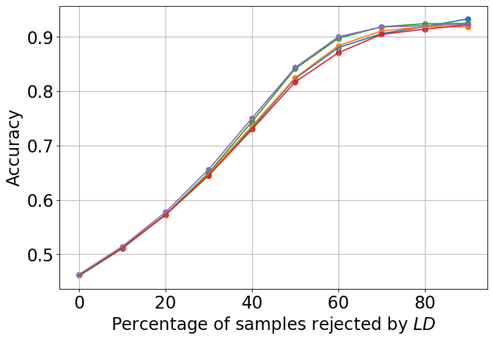
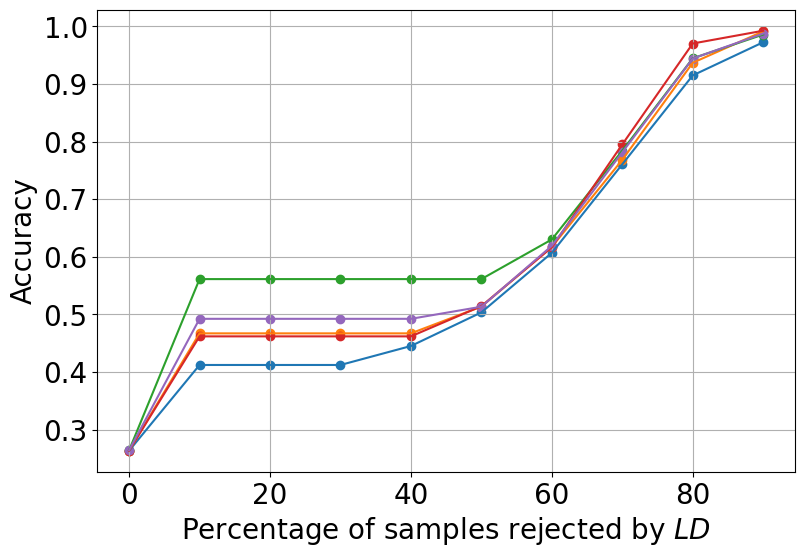

#  Combining Statistical Depth and Fermat Distance for Uncertainty Quantification

## Abstract

We measure the Out-of-domain uncertainty in the prediction of Neural Networks using a statistical notion called “Lens Depth” (LD) combined with Fermat Distance, which is able to capture precisely the “depth” of a point with respect to a distribution in feature space, without any assumption about the form of distribution. Our method has no trainable parameter. The method is applicable to any classification model as it is applied directly in feature space at test time and does *not* intervene in training process. As such, it does *not* impact the performance of the original model. The proposed method gives excellent qualitative result on toy datasets and can give competitive or better uncertainty estimation on standard deep learning datasets compared to strong baseline methods.

# Introduction [intro]

We consider a multi-class classification problem with the input space \\(\mathcal{X}\\). In general, a classification model consists of a feature extractor (backbone) \\(\Phi_{\theta_1}\\) and a classifier \\(h_{\theta_2}\\): \\(f_{\theta} = h_{\theta_2} \circ \Phi_{\theta_1}\\), where \\(\theta = \theta_1 \cup \theta_2\\) is the set of parameters of the model. The backbone transforms inputs into fixed-dimension vectors in the so-called *feature space* \\(\mathcal{F}\\). The classifier \\(h\\) then maps the features to predictions. In our experiments, the classification model is provided by a neural network, \\(h\\) is a softmax layer consisting of a linear transformation and a *softmax* function, \\(\mathcal{F}\\) is the output space of the penultimate layer right before the softmax layer. The model \\(f_{\theta}\\) is trained on i.i.d. examples drawn from *In-Distribution* (ID) \\(P_{\text{in}}\\). \\(f_{\hat{\theta}}\\) denotes the trained model.

<figure id="fig:two_moon_intro">

<figcaption> Motivation example using the two-moons dataset. Colors indicate OOD score. Gaussian fitting (left), fails completely to capture the distribution of dataset whereas our proposed method (right) represents very well how central a point is with respect to (w.r.t.) clusters without any <em>prior assumption</em>. </figcaption>
</figure>

**OOD detection.** Classification neural networks have proved highly effective in terms of precision. However, beside performance, in critical applications, one needs to detect out-of-distribution (OOD) data for safety reasons. Indeed, at the inference stage, the model should only predict for data coming from the ID and reject OOD samples. For this purpose, one needs to associate a confidence (or uncertainty) score \\(S\\) with these data so that one can reject uncertain predictions. This is referred as *Out-of-domain uncertainty* `\cite{gawlikowski2023survey}`{=latex}. At the inference stage, \\(x\\) is considered as ID if \\(S(x)\geq \varepsilon\\) (with some threshold \\(\varepsilon \in \mathbb{R}\\)) and OOD otherwise.

We develop a method applicable directly in the feature space \\(\mathcal{F}\\) of the trained model \\(f_{\hat{\theta}}\\). It yields a score function \\(S_{\mathcal{F}}\\): \\(S(x):= S_{\mathcal{F}}(\Phi_{\hat{\theta}_1}(x))\\). One major advantage is that there is no need of supplementary training. Besides, the model’s performance is also preserved. Discussion about advantages of this approach over other methods is in Section <a href="#related" data-reference-type="ref" data-reference="related">2</a>.

A desirable property for any well-trained model is the preservation of the data geometry in the feature space.In other words, in this space, similar data should be close and dissimilar data should be far away. Intuitively, each class should be represented as a different cluster in feature space (see, e.g. `\citet{caron2018deep}`{=latex}, `\citet{yang2017towards}`{=latex}). In addition, data that are dissimilar to the training data should be distant from any cluster obtained on the training data in the feature space. Assuming this desirable property, a method measuring directly “how central” a point is with respect to (w.r.t.) clusters taking into account density and geometry of each cluster in the feature space should provide an uncertainty score. For this objective, standard methods consist in assuming some *prior* distribution such as a Gaussian model `\cite{lee2018simple}`{=latex}. However, the assumption that the data in a cluster is Gaussian distributed or follow any particular distribution is quite restrictive. We will show in our experiments section that the Gaussian assumption fails even in a very simple case (Section <a href="#sec:two_moon" data-reference-type="ref" data-reference="sec:two_moon">5.1</a>). Let us take the example of a simple frame in the plane with 2 clusters corresponding to 2 classes in form of two-moons (Fig. <a href="#fig:two_moon_intro" data-reference-type="ref" data-reference="fig:two_moon_intro">1</a>). In this example, Gaussian fitting (Fig. <a href="#fig:two_moon_gaussian_intro" data-reference-type="ref" data-reference="fig:two_moon_gaussian_intro">[fig:two_moon_gaussian_intro]</a>) fails totally to capture the distribution of clusters.

This motivates us to develop a non-parametric method that can measure explicitly how “central” a point is w.r.t. a cluster without the need of additional training and prior assumption. Furthermore, the method should accurately capture distribution with complex support and shape, in order to be adapted to a variety of cases. To measure how central a point is w.r.t. a distribution, we use the so-called notion of statistical *Lens Depth* (*LD*) `\cite{liu1990notion}`{=latex}, that will be presented in Section <a href="#sec_LD" data-reference-type="ref" data-reference="sec_LD">3.1</a>. Furthermore, for *LD* to correctly capture the shape of the distribution, an appropriate distance must be adopted that adaptively takes into account its geometry and density. Fermat distance is a good candidate for this purpose. However, it is not directly tractable as it stands on integrals along rectifiable paths. A recent paper `\citet{groisman2022nonhomogeneous}`{=latex} proposes the use of an explicit sampled Fermat distance and shows its consistency property (see also `\citet{cholaquidis2023weighted}`{=latex}). In our work, we make use of their results to compute the *LD*. The general scheme is illustrated in Figure <a href="#fig:general_scheme_tikz" data-reference-type="ref" data-reference="fig:general_scheme_tikz">2</a>.

<figure id="fig:general_scheme_tikz">

<figcaption>General scheme of our method. Given a set of features <em>Φ</em>, the Fermat distance is a metric which respects and adapts to the distribution of <em>Φ</em>. Lens depth wraps the Fermat distance into a probabilistic and interpretable score <em>S</em>. No additional training is needed. </figcaption>
</figure>

**Consistency of the uncertainty score.** *Out-of-domain* uncertainty is more demanding than OOD detection. A consistent uncertainty score function should allow us to detect OOD. Furthermore, when more samples are rejected based on this score, the accuracy of the multi-class classification on the retained samples should increase. In other words, the fewer examples retained (based on the score), the better the accuracy. This means that the score represents the true confidence in prediction. Many previous methods (e.g. `\citet{sun2022out}`{=latex}, `\citet{liang2017enhancing}`{=latex}) focus purely on OOD detection, and this second desired property is not satisfied or proved. In contrary, we show in Sections <a href="#sec:fashion_mnist" data-reference-type="ref" data-reference="sec:fashion_mnist">5.2</a> and <a href="#sec:svhn_cifar10" data-reference-type="ref" data-reference="sec:svhn_cifar10">5.3</a> that our method respects this property. This is because our method measures a natural "depth" of the considered example. Consequently, the larger the depth of this example, the more typical this point is (relative to the training set), and so the easier it is for the model to classify.

In summary, our contribution is at the following three levels:

- We are bringing to machine learning the mathematical tool of \\(LD\\), combined with Fermat distance. It proves particularly efficient for OOD uncertainty quantification. We also propose improvements that avoid undesirable artifacts, and simple strategies for reducing significantly the complexity in computing \\(LD\\).

- The method we propose is non-parametric and non-intrusive. We do not have priors on the distribution of data nor features. We do not require modifying the training algorithms.

- The method is almost hyperparameter-free, as we show that it is rather insensitive the only parameter used to define Fermat distance.

Tables <a href="#table:auroc_mnist" data-reference-type="ref" data-reference="table:auroc_mnist">8</a> and <a href="#table:auroc_cifar10" data-reference-type="ref" data-reference="table:auroc_cifar10">12</a> in the experiments section give benchmarks. And our code can be shared upon request.

# Related Work [related]

One approach to construct a confidence score consists in fine-tuning the model \\(f_{\hat{\theta}}\\) using some auxiliary OOD data so that the ID and OOD data are more separable in the feature space `\cite{liu2020energy}`{=latex}. One may even use very particular type of model and training mechanism for the original classification task such as RBF models `\cite{lecun1998gradient}`{=latex} in DUQ method `\cite{van2020uncertainty}`{=latex} or *Prior Networks* in which the prior distribution is put on on the output of the model `\cite{malinin2018predictive}`{=latex}. More laborious method to handle uncertainty in neural network is its Bayesian modeling ( `\citet{MacKay1992APB}`{=latex}, `\citet{gal2016uncertainty}`{=latex}). Another approach is to train some additional models to train such Deep Ensembles `\cite{lakshminarayanan2017simple}`{=latex} or LL ratio `\cite{ren2019likelihood}`{=latex}. In these approaches, one needs to carefully perform the supplementary training. Otherwise one could reflect wrongly the true underlying distribution. Moreover, the performance of the multi-class classification task could be impacted. Furthermore, the training process itself contains some stochastic factors (e.g. mini-batch sampling), that could increase the error of the confidence score. For all these reasons, these methods can be considered *intrusive*.

Independently from above methods, a *non-intrusive* approach is to work directly in the feature space \\(\mathcal{F}\\) of the trained model \\(f_{\hat{\theta}}\\). This is *non-intrusive* in the sense that there is no need of supplementary training. Besides, model performance is not impacted. One of the simplest method is to use the \\(k\\)-nearest neighbor distance `\cite{sun2022out}`{=latex}. It is very simple but has the drawback of completely ignoring cluster geometry and density. A more sophisticated approach uses minimum Mahalanobis distance [^1] `\cite{mahalanobis2018generalized}`{=latex} based on *Gaussian prior* `\cite{lee2018simple}`{=latex}. Despite taking the distribution into account, Gaussian modeling is too restrictive as it leads to an ellipsoid for shaping each cluster. A classical non-parametric method is one-class SVM `\cite{scholkopf1999support}`{=latex} which demands supplementary training. Besides, its effectiveness is known to be significantly influenced by the kernel choice and its hyper-parameters. On the other hand, our method needs no additional training and has following properties at the same time: (1) *non-intrusive*; (2) non-parametric; (3) nearly hyperparameter-free. All these properties make it unique in comparison to other methods.

# Background

## Lens Depth [sec_LD]

Lens depth (LD) `\cite{liu1990notion}`{=latex} is a specific notion of a more general quantity called Depth `\cite{tukey1975mathematics}`{=latex}. A depth is a score measure of the membership of a point w.r.t. a distribution in a general space. The greater the depth, the more central the point is to the distribution. LD of a point w.r.t a distribution \\(P_X\\) is defined as the probability that it belongs to the intersection of two random balls. These balls are centered at two independent random points \\(X\\) and \\(Y\\), both having the distribution \\(P_X\\) and a radius equal to the distance between \\(X\\) and \\(Y\\). More formally, if we work on \\(\mathbb{R}^d\\), the LD of a point \\(x \in \mathbb{R}^d\\) w.r.t. \\(P_X\\) is defined as follows, \\[\begin{aligned}
 LD(x,P_X) := \mathbb{P}(x \in B_1 \cap B_2) \ .
\end{aligned}
\label{eq:theory_LD}\\] Here

- \\(d\\) is a given distance on \\(\mathbb{R}^d\\),

- \\(X_1\\),\\(X_2\\) are i.i.d with law \\(P_X\\),

- \\(B(p, r)\\) is the closed ball centered at \\(p\\) with radius \\(r\\),

- \\(B_i=B(X_i,d(X_2,X_1)),\ i=1,2\\).

Let \\(A(X_1,X_2) = B_1 \cap B_2\\). Equation <a href="#eq:theory_LD" data-reference-type="eqref" data-reference="eq:theory_LD">[eq:theory_LD]</a> naturally gives rise to the following empirical version of LD, \\[\widehat{LD}_n(x) := {\binom{n}{2}}^{-1} \sum_{1\leq i_1 < i_2 \leq n} \mathds{1}_{A(X_{i_1},X_{i_2})}(x) \ .
\label{eq:emp_ld}\\] Note that for the empirical version, the intersection set might be rewritten as \\[A(X_1,X_2) = \{ x %\in \BBr^d
                    : \max_{i=1,2} d(x,X_i)\leq d(X_1,X_2)\} \ .\\]

Obviously, a crucial question is the choice of the distance \\(d\\). A naive choice is the Euclidean one. Examples of \\(\widehat{LD}\\) using Euclidean distance are depicted in Fig. <a href="#fig:ld_naive" data-reference-type="ref" data-reference="fig:ld_naive">3</a>. We see that in the Gaussian case, the level curves of \\(\widehat{LD}\\) rather well capture the distribution. However, for the moon distribution they fail miserably. This is not surprising as the Euclidean distance does not take into account the data distribution \\(P_X\\).

<figure id="fig:ld_naive">

<figcaption>$\widehat{LD}$ using Euclidean distance. We see that using simply Euclidean distance cannot capture correctly the distribution.</figcaption>
</figure>

This gives rise to a natural problem as stated by `\citet{groisman2022nonhomogeneous}`{=latex}: *How to learn a distance that can capture both the geometry of the manifold and the underlying density?* The Fermat distance allows us to solve this problem and it is presented in the following section.

## Fermat distance

Following `\citet{groisman2022nonhomogeneous}`{=latex}, let \\(S\\) be a subset of \\(\mathbb{R}^d\\). For a continuous and positive function \\(f: S \rightarrow \mathbb{R}_+\\) , \\(\beta \geq 0\\) and \\(x,y \in S\\), the Fermat distance \\(\mathcal{D}_{f,\beta}(x,y)\\) is defined as \\[\mathcal{D}_{f,\beta}(x,y) := {\inf}_{\gamma}\mathcal{T}_{f,\beta}(\gamma) \ ,\\] where \\[\mathcal{T}_{f,\beta}(\gamma) := \int_\gamma f^{-\beta} \ .\\]

The infimum is taken over all continuous and rectifiable paths \\(\gamma\\) contained in \\(\bar{S}\\), the closure of \\(S\\), that start at \\(x\\) and end at \\(y\\).

**Sample Fermat Distance.** Let \\(Q\\) be a non-empty, locally finite, subset of \\(\mathbb{R}^d\\), serving as dataset. \\(|x|\\) denotes Euclidean norm of \\(x\\), \\(q_Q(x) \in Q\\) is the particle closest to \\(x\\) in Euclidean distance – assuming uniqueness[^2]. For \\(\alpha \geq 1\\), and \\(x,y \in \mathbb{R}^d\\), the sample Fermat distance is defined as: \\[\begin{aligned}
  & D_{Q,\alpha}(x,y) := \min \Big\{
  \sum_{j=1}^{k-1} |q_{j+1}-q_j|^\alpha \ :   (q_1, \dots,  q_k)\in Q^k 
  \nonumber \\ 
  & \quad \quad \quad \text{ with } q_1=q_Q(x), \ q_k = q_Q(y), \ k \geq 1
  \Big\} \ .
\label{eq:sample_fermat}
\end{aligned}\\]

`\citet{groisman2022nonhomogeneous}`{=latex} show that the sample Fermat distance when appropriately scaled converges to the Fermat distance.

**Intuition behind Sample Fermat Distance.** The sample Fermat distance searches for the shortest path relating the points. The length of each path is the sum of the Euclidean distances of consecutive points in the path powered by \\(\alpha\\). With \\(\alpha=1\\), the shorted path between \\(x\\) and \\(y\\) is simply the line relating \\(q_Q(x)\\) and \\(q_Q(y)\\) (Fig. <a href="#fig:min_path_1" data-reference-type="ref" data-reference="fig:min_path_1">[fig:min_path_1]</a>). However, with a sufficiently large \\(\alpha\\), this definition of path length discards consecutive points with a large Euclidean distance instead favoring points that are closely positioned in terms of Euclidean distance. So, this will qualify the path passing through high density areas. Moreover, as this distance depends also on the number of terms in the sum in Eq. <a href="#eq:sample_fermat" data-reference-type="eqref" data-reference="eq:sample_fermat">[eq:sample_fermat]</a>, this enforces a path to be smooth enough. These two remarks show that Fermat distance naturally captures the density and geometry of the data set.

In Fig. <a href="#fig:min_path" data-reference-type="ref" data-reference="fig:min_path">4</a>, we go back to the moon example. We randomly choose 2 points and compute the Fermat path. We see that with \\(\alpha=1\\), we recover the Euclidean distance and so the Fermat path is simply a line. For \\(\alpha\\) larger than 1 but not large enough (for instance, \\(\alpha=1.2\\), Fig. <a href="#fig:min_path_1.2" data-reference-type="ref" data-reference="fig:min_path_1.2">[fig:min_path_1.2]</a>), the Fermat path still does not capture the orientation of the dataset. However, as \\(\alpha\\) gets larger, the Fermat path rapidly tracks the orientation of the dataset. For instance, with \\(\alpha=3\\), the path follows very well the distribution shape.

<figure id="fig:min_path">

<figcaption>Sample Fermat path between two fixed randomly chosen points using different values of <em>α</em>.</figcaption>
</figure>

# Combining LD and Fermat Distance [FLD]

## Artifacts from classical Fermat distance

In the computation of the depth, instead of using Euclidean distance, we use sample Fermat distance. The results for the moon and spiral datasets are depicted in Fig. <a href="#fig:ld_fermat_naive" data-reference-type="ref" data-reference="fig:ld_fermat_naive">[fig:ld_fermat_naive]</a> and <a href="#fig:ld_fermat_naive_spiral" data-reference-type="ref" data-reference="fig:ld_fermat_naive_spiral">[fig:ld_fermat_naive_spiral]</a>. We see that the shape of datasets is much better captured. However, we also observe some zones having constant LD value (represented by the same color). The existence of such zones are explained by the following proposition:

<figure id="fig:ld_fermat">

<figcaption>$\widehat{LD}$ with Sample Fermat Distance on moon and spiral datasets. (a) and (b) are results of using directly sample Fermat distance in Eq. <a href="#eq:sample_fermat" data-reference-type="eqref" data-reference="eq:sample_fermat">[eq:sample_fermat]</a>. This produces undesirable artifacts where we observe zones of constant value of <em>L</em><em>D</em>. This phenomenon is explained by Proposition <a href="#prop:1" data-reference-type="ref" data-reference="prop:1">1</a>. (c) and (d) use our modified version in Eq. <a href="#eq:modified_sample_fermat" data-reference-type="eqref" data-reference="eq:modified_sample_fermat">[eq:modified_sample_fermat]</a>: it captures perfectly the distributions.</figcaption>
</figure>

**Proposition 1**. *For \\(x\in\mathbb{R}^d, \;\widehat{LD}(x)=\widehat{LD}(q_Q(x))\\). In other words, the empirical lens depth is constant over the Voronoï cells[^3] associated to \\(Q\\).*

The proof of Proposition <a href="#prop:1" data-reference-type="ref" data-reference="prop:1">1</a> is in **Appendix** <a href="#proof" data-reference-type="ref" data-reference="proof">10</a>. The consequence of the last proposition is that, even for a point far removed from \\(Q\\), the value of \\(\widehat{LD}\\) remains the same as that of its nearest point in \\(Q\\). Consequently, \\(\widehat{LD}\\) does not vanish at infinity. This is totally undesirable, as an ideal property of any depth is to vanish at infinity. To avoid this undesirable artifact, we need to modify the sample Fermat distance so that it takes into account the distance to \\(Q\\).

## Modified Sample Fermat Distance

The modified distance is defined, for \\(y\in Q,\; x\in\mathbb{R}^d\\) as follows: \\[D^{\mathrm{modif}}_{Q,\alpha}(x,y) := \min_{q\in Q}\{|x-q|^{\alpha} + D_{Q,\alpha}(q,y)\} \ . 
\label{eq:modified_sample_fermat}\\]

Here, \\(D_{Q,\alpha}(q,y)\\) has been defined in Eq. <a href="#eq:sample_fermat" data-reference-type="eqref" data-reference="eq:sample_fermat">[eq:sample_fermat]</a>.

**Interpretation.** In the original definition in Eq. <a href="#eq:sample_fermat" data-reference-type="eqref" data-reference="eq:sample_fermat">[eq:sample_fermat]</a>, the path always starts by the closest point in the dataset. Consequently, the distance to this closest point is totally ignored. To eliminate this drawback, the distance to a potential starting point lying in \\(Q\\) is added. Note that the optimization problem for calculating \\(D^{\mathrm{modif}}_{Q,\alpha}\\) is of the same type as that for calculating \\(D_{Q,\alpha}\\) with only a change of starting point. Hence, the consistency of this empirical distance towards the theoretical Fermat distance remains true. Indeed, in the new formulation <a href="#eq:modified_sample_fermat" data-reference-type="eqref" data-reference="eq:modified_sample_fermat">[eq:modified_sample_fermat]</a>, the point \\(q\in Q\\) is not fixed at \\(q_{Q}(x)\\) but remains free and is a part of the optimization problem. Notice further that our modified version enjoys two nice properties. Firstly, if \\(x\in Q\\) then Eq. <a href="#eq:modified_sample_fermat" data-reference-type="eqref" data-reference="eq:modified_sample_fermat">[eq:modified_sample_fermat]</a> coincides with Eq. <a href="#eq:sample_fermat" data-reference-type="eqref" data-reference="eq:sample_fermat">[eq:sample_fermat]</a> (\\(D^{\mathrm{modif}}_{Q,\alpha}(x,y)= D_{Q,\alpha}(x,y)\\)). Secondly, \\(D^{\mathrm{modif}}_{Q,\alpha}(x,y)\\) increases to infinity when \\(x\\) is going far away from \\(Q\\). Consequently, in this case, the corresponding \\(\widehat{LD}\\) w.r.t \\(Q\\) tends to \\(0\\). The \\(\widehat{LD}\\) using this modified version of the distance is displayed on two examples in Fig. <a href="#fig:ld_fermat_moon" data-reference-type="ref" data-reference="fig:ld_fermat_moon">[fig:ld_fermat_moon]</a> and <a href="#fig:ld_fermat_spiral" data-reference-type="ref" data-reference="fig:ld_fermat_spiral">[fig:ld_fermat_spiral]</a>. With our modification, the undesirable artifact of constant-valued zone is erased. Furthermore, for points far away from the dataset, \\(\widehat{LD}\\) tends quickly to 0. In conclusion, our method captures the shape of distributions perfectly.

## Qualitative evaluation of stability

We experiment and evaluate the stability of our method on the spiral dataset. This is a tricky dataset, and a standard method like the Gaussian one cannot capture its shape.

### Stability with respect to number of training points

When running a statistical algorithm, it is desirable to have as large a sample as possible. However, in many cases, only a very small amount of data is available. This motivates the study of the stability of our method in a small data regime. Here, we simulate the spiral dataset with 1000 points. Then, we choose randomly only \\(20\%\\) of the simulated points (i.e. 200 points) as the sample dataset to compute \\(LD\\). We perform different runs for different random samples with \\(\alpha=5\\) for a visual evaluation. For the sake of brevity, only the results of four tests are shown in Fig. <a href="#fig:stab_points" data-reference-type="ref" data-reference="fig:stab_points">6</a>. More replications are displayed in **Appendix** <a href="#sec:append_stable_points" data-reference-type="ref" data-reference="sec:append_stable_points">9</a>. We see that in the 4 tries, our method gives slightly different estimation of \\(LD\\). This small fluctuation is to be expected, as we take only \\(20\%\\) of the points at random each time. Nevertheless, the method captures the shape of the data set really well (the full sample of 1000 points is displayed in the figures).

<figure id="fig:stab_points">

<figcaption><em>L</em><em>D</em> using only 20% of points (200 points) on simulated spiral dataset of 1000 points. The contours of <em>L</em><em>D</em> level changes slightly between different tries, but in general, the proposed method captures well the general shape of distribution.</figcaption>
</figure>

### Stability with respect to the hyperparameter \\(\alpha\\)

In our method, only one hyperparameter (\\(\alpha\\)), governing the Fermat distance needs to be chosen. It is therefore important to assess the stability of the method w.r.t. \\(\alpha\\). For this purpose, we experiment with different values of \\(\alpha>1\\) (recall that \\(\alpha=1\\) corresponds to the Euclidean distance). For each \\(\alpha \in \{3,5,10,15\}\\), we test our method on the spiral dataset. Results are shown in Fig. <a href="#fig:stab_alpha" data-reference-type="ref" data-reference="fig:stab_alpha">7</a>. The conclusion is that our method is very stable through different values of \\(\alpha\\). Indeed, in the 4 cases, it always captures almost perfectly the dataset support, which implies a strong stability of the method. Of course this stability is only achieved in the proper range when \\(\alpha\\) is large enough (See Fig. <a href="#fig:min_path" data-reference-type="ref" data-reference="fig:min_path">4</a>).

<figure id="fig:stab_alpha">

<figcaption><em>L</em><em>D</em> applying different values of hyperparameter <em>α</em> in Sample Fermat Distance. For different values of <em>α</em>, the method always captures really well the distribution.</figcaption>
</figure>

## From LD to OOD uncertainty score

Our ultimate objective is to use \\(LD\\) to provide an out-of-distribution uncertainty score. To do so, we apply \\(LD\\) to the feature space \\(\mathcal{F}\\) of our classification model. Let \\(C\\) be the number of separate clusters. Now, there are two ways for computing \\(LD\\) of a new point: (1) All the clusters are considered as a sole distribution to compute \\(LD\\); (2) Compute \\(LD\\) w.r.t. the different clusters and then take the \\(max\\) among the \\(LD\\)’s (i.e. \\(LD\\) w.r.t. the nearest cluster). It turns out that the first approach gives unsatisfying result as explained in **Appendix** <a href="#one_or_multiple" data-reference-type="ref" data-reference="one_or_multiple">11</a>. So, we adopt the second approach in this paper. More formally, let us denote \\(\widehat{LD}(\Phi (x), \mathcal{C}_i)\\) the empirical LD of \\(x\\) w.r.t. the \\(i^{th}\\) cluster formed by training examples of class \\(i\\) (in the feature space). Then, the confidence score of \\(x\\) is defined as \\[S(x) := \max_{i} \widehat{LD}(\Phi (x), \mathcal{C}_i) \ .
    \label{eq:define_score}\\]

## Reducing complexity for computing \\(LD\\) [reduce]

From Eq. <a href="#eq:emp_ld" data-reference-type="eqref" data-reference="eq:emp_ld">[eq:emp_ld]</a>, we can deduce that the complexity of calculating \\(LD\\) for a given point is more than \\(O(CN^2)\\) (\\(C\\) is the number of classes, \\(N\\) is number of examples in each class). It is therefore very interesting to reduce the number of inner points \\(N\\) used to calculate \\(LD\\) while maintaining good precision. Keeping only \\(n\\) inner points among the \\(N\\) initial ones, we then have 3 different straightforward strategies:

- **I. Random.** Randomly sample without replacement \\(n\\) points among \\(N\\) intial points.

- **II. K-mean/center.** We want the \\(n\\) points to cover well the support of the initial sample. Hence, we first apply a *K-mean clustering* with \\(n\\) centroids on the \\(N\\) points. Then, the \\(n\\) resulted centroids are used as inner points.

- **III. K-mean/center+.** Same as strategy **II**, but instead of using directly the centroids, we use the inner point closest to each centroid.

We test and discuss about these strategies in Appendix <a href="#sec:reduce_strategy" data-reference-type="ref" data-reference="sec:reduce_strategy">12</a>. It turns out that *K-mean / Center* outperforms the two other strategies with a very small number of inner points \\(n\\). Indeed, *K-mean / Center* has a regularization effect from averaging points (for calculating centroids). We conjecture that this effect makes the method much more stable, and also facilitates the capture of the overall shape of the cluster by avoiding certain irregular points that could have a negative impact on the estimate of \\(LD\\). We refer to Appendix <a href="#sec:reduce_strategy" data-reference-type="ref" data-reference="sec:reduce_strategy">12</a> for more discussion and detailed experiment. So, for the rest of this paper, we use strategy *K-mean / Center*.

# Experiments on Neural Networks [exp]

We first evaluate our method on the two-moon dataset. Then, we evaluate on 2 benchmarks FashionMNIST/MNIST and CIFAR10/SVHN the ability of our method for the detection of Out-of-distribution. Besides, we also evaluate the consistency property of our uncertainty score as presented in introduction section (shown in Fig. <a href="#fig:consistency_curve_fashion_mnist" data-reference-type="ref" data-reference="fig:consistency_curve_fashion_mnist">9</a> and <a href="#fig:consistency_curve_cifar10" data-reference-type="ref" data-reference="fig:consistency_curve_cifar10">10</a>). Without further mention, we fix \\(\alpha=7\\) for all experiments.

**Experiment Setup:** For a fair comparison, we use the same model architectures as in the previous work of `\citet{van2020uncertainty}`{=latex} for the two experiments FashionMNIST/MNIST and CIFAR10/SVHN. More details about the models and the training schemes can be found in the **Appendix** <a href="#exp_details" data-reference-type="ref" data-reference="exp_details">8</a>. Moreover, as in `\citet{van2020uncertainty}`{=latex}, at test time, we use the statistics (mean and standard deviation) of the training set (i.e. FashionMNIST or CIFAR10 in our case). Indeed, these statistics are used both in the *Batch normalization* layers and in the data normalization process (both for OOD and for ID set).

## How is the input distribution represented in the feature space of *softmax* model? [sec:two_moon]

We apply our method on the feature space \\(\mathcal{F}\\) of *softmax* model with the assumption that the input distribution is properly represented in \\(\mathcal{F}\\). To assess this assumption, we first perform experiment on the two-moon dataset consisting of 2 classes, each having a moon shape. We train a neural network with 2 hidden layers for classification[^4]. After training, the model parameters are fixed and different methods for uncertainty evaluation are applied in \\(\mathcal{F}\\).

One popular way to provide an uncertainty score is to use the predictive distribution entropy[^5]. It is maximized when the distribution is uniform. In this example, predictive distribution entropy is high only in a boundary zone (Fig. <a href="#fig:two_moon_entropy" data-reference-type="ref" data-reference="fig:two_moon_entropy">[fig:two_moon_entropy]</a>). This is to be expected, as the model is trained to learn a boundary between the two classes. Nevertheless, it is desired to assign a high uncertainty to the region without training data. Indeed, it might be too risky to make decision in these zones, especially in critical applications.

**Is Gaussian prior suitable?** We consider the methods of Euclidean distance (Fig. <a href="#fig:two_moon_euclidean" data-reference-type="ref" data-reference="fig:two_moon_euclidean">[fig:two_moon_euclidean]</a>) and Mahalanobis distance (Fig. <a href="#fig:two_moon_gaussian" data-reference-type="ref" data-reference="fig:two_moon_gaussian">[fig:two_moon_gaussian]</a>). For the Euclidean distance method, we compute the distance to the centroids of the different clusters (in \\(\mathcal{F}\\)) and then we take its minimum. For the Mahalanobis distance method we proceed in the same way but using the metric based on the covariance matrix. Surprisingly, in this example, the crude use of Euclidean distance seems to better capture the input distribution than the use of the Mahalanobis distance (failing miserably on this dataset). This suggests that the distribution of clusters in feature space is more complicated than the Gaussian one.

This remark shows the necessity to have a method able to capture better the distribution. \\(LD\\) can capture impressively well the zone where we have training data (Fig. <a href="#fig:two_moon_LD_3" data-reference-type="ref" data-reference="fig:two_moon_LD_3">[fig:two_moon_LD_3]</a>, <a href="#fig:two_moon_LD_10" data-reference-type="ref" data-reference="fig:two_moon_LD_10">[fig:two_moon_LD_10]</a> and <a href="#fig:two_moon_LD_15" data-reference-type="ref" data-reference="fig:two_moon_LD_15">[fig:two_moon_LD_15]</a> corresponding to \\(\alpha =3,\,10\\) and \\(15\\)). Hence, \\(LD\\) is able to pin down clusters with a complex support shape in feature space. Furthermore, we intentionally use 3 values for \\(\alpha\\) with large gaps to show the stability w.r.t. \\(\alpha\\).

<figure id="fig:two_moon_exp">

 

<figcaption>Methods for uncertainty estimation applied on the same neural net trained to classify 2 classes in moon-shape (represented by yellow and black points respectively). Uncertainty estimations are computed based solely on the feature space of the model without seeing directly the inputs. Our method (Fig. <a href="#fig:two_moon_LD_3" data-reference-type="ref" data-reference="fig:two_moon_LD_3">[fig:two_moon_LD_3]</a>, <a href="#fig:two_moon_LD_10" data-reference-type="ref" data-reference="fig:two_moon_LD_10">[fig:two_moon_LD_10]</a> and <a href="#fig:two_moon_LD_15" data-reference-type="ref" data-reference="fig:two_moon_LD_15">[fig:two_moon_LD_15]</a>) gives excellent results and much better than other methods.</figcaption>
</figure>

## FashionMNIST vs MNIST [sec:fashion_mnist]

We perform five different runs to train classification models on the data set FashionMNIST `\cite{xiao2017fashionmnist}`{=latex}.

Firstly, we evaluate our method by studying the separation capacity between the test set of FashionMNIST and of MNIST `\cite{lecun1998mnist}`{=latex} based on *AUROC* score. Results are reported in Table <a href="#table:auroc_mnist" data-reference-type="ref" data-reference="table:auroc_mnist">8</a>. We first compare our method to Euclidean and Mahalanobis distance method `\cite{lee2018simple}`{=latex} (that are explained in Section <a href="#sec:two_moon" data-reference-type="ref" data-reference="sec:two_moon">5.1</a>). Notice that our method outperforms these two distance-based methods. Notice also that Euclidean distance gives slightly better AUROC score than Mahalanobis one. This might result from the fact that the distributions are far to be Gaussian, confirming once again that Gaussian assumption does not hold. A more sophisticated method called DUQ stands on a devoted neural architecture (RBF network) (see `\cite{van2020uncertainty}`{=latex}). This particular type of model is much more difficult to train and so generally does not preserve the accuracy of the main classification task (compared to standard *softmax* models). Once again, our method outperforms this method. This indicates that our method measures a natural “depth” directly in the feature space without the need of changing completely the model as in DUQ method. Another popular method is Deep Ensembles in which one trains and applies many independently-trained models for the same task. Consequently, this approach needs more resource both at training and inference times. Despite its heavy demanding of resource, our method outperforms this approach in this experiment. A more advanced method for density estimation is LL ratio `\cite{ren2019likelihood}`{=latex}. In this method, one needs to train two supplementary generative models to estimate distributions. A first model is trained on ID data and a second one is trained on perturbed inputs. This method needs an adequate noise in the way that the perturbed inputs contain only background information. Moreover, one needs to really carefully train these 2 generative models so that they can reflect the true underlying input density. With this complex process, this method gives better AUROC score than ours (in this experiment). However, we will show that our method outperforms it in the next experiment.

<table>
<caption>Results on FashionMNIST, with MNIST as OOD set. Results marked by (□) are extracted from  and (△) are extracted from . Deep Ensembles by , Mahalanobis Distance by , LL ratio by , DUQ by .</caption>
<thead>
<tr>
<th style="text-align: left;">Charateristics</th>
<th style="text-align: left;">Method</th>
<th style="text-align: left;">AUROC</th>
</tr>
</thead>
<tbody>
<tr>
<td rowspan="3" style="text-align: left;">

<table>
<caption>Results on FashionMNIST, with MNIST as OOD set. Results marked by (□) are extracted from  and (△) are extracted from . Deep Ensembles by , Mahalanobis Distance by , LL ratio by , DUQ by .</caption>
<tbody>
<tr>
<td style="text-align: left;">No impact</td>
</tr>
<tr>
<td style="text-align: left;">on original model</td>
</tr>
</tbody>
</table>

</td>
<td style="text-align: left;">LD (our method)</td>
<td style="text-align: left;">0.971 ± 0.001</td>
</tr>
<tr>
<td style="text-align: left;">

<table>
<caption>Results on FashionMNIST, with MNIST as OOD set. Results marked by (□) are extracted from  and (△) are extracted from . Deep Ensembles by , Mahalanobis Distance by , LL ratio by , DUQ by .</caption>
<tbody>
<tr>
<td style="text-align: left;">Euclidean</td>
</tr>
<tr>
<td style="text-align: left;">Distance</td>
</tr>
</tbody>
</table>

</td>
<td style="text-align: left;">0.943 ± 0.009</td>
</tr>
<tr>
<td style="text-align: left;">

<table>
<caption>Results on FashionMNIST, with MNIST as OOD set. Results marked by (□) are extracted from  and (△) are extracted from . Deep Ensembles by , Mahalanobis Distance by , LL ratio by , DUQ by .</caption>
<tbody>
<tr>
<td style="text-align: left;">Mahalanobis</td>
</tr>
<tr>
<td style="text-align: left;">Distance (□)</td>
</tr>
</tbody>
</table>

</td>
<td style="text-align: left;">0.942</td>
</tr>
<tr>
<td style="text-align: left;">

<table>
<caption>Results on FashionMNIST, with MNIST as OOD set. Results marked by (□) are extracted from  and (△) are extracted from . Deep Ensembles by , Mahalanobis Distance by , LL ratio by , DUQ by .</caption>
<tbody>
<tr>
<td style="text-align: left;">Use particular type</td>
</tr>
<tr>
<td style="text-align: left;">of model difficult</td>
</tr>
<tr>
<td style="text-align: left;">to train</td>
</tr>
</tbody>
</table>

</td>
<td style="text-align: left;">DUQ (△)</td>
<td style="text-align: left;">0.955</td>
</tr>
<tr>
<td style="text-align: left;">

<table>
<caption>Results on FashionMNIST, with MNIST as OOD set. Results marked by (□) are extracted from  and (△) are extracted from . Deep Ensembles by , Mahalanobis Distance by , LL ratio by , DUQ by .</caption>
<tbody>
<tr>
<td style="text-align: left;">Need to train</td>
</tr>
<tr>
<td style="text-align: left;">many models</td>
</tr>
</tbody>
</table>

</td>
<td style="text-align: left;">

<table>
<caption>Results on FashionMNIST, with MNIST as OOD set. Results marked by (□) are extracted from  and (△) are extracted from . Deep Ensembles by , Mahalanobis Distance by , LL ratio by , DUQ by .</caption>
<tbody>
<tr>
<td style="text-align: left;">Deep Ensembles</td>
</tr>
<tr>
<td style="text-align: left;">(5 Models) (△)</td>
</tr>
</tbody>
</table>

</td>
<td style="text-align: left;">0.861</td>
</tr>
<tr>
<td style="text-align: left;">

<table>
<caption>Results on FashionMNIST, with MNIST as OOD set. Results marked by (□) are extracted from  and (△) are extracted from . Deep Ensembles by , Mahalanobis Distance by , LL ratio by , DUQ by .</caption>
<tbody>
<tr>
<td style="text-align: left;">Need to train extra</td>
</tr>
<tr>
<td style="text-align: left;">generative models</td>
</tr>
</tbody>
</table>

</td>
<td style="text-align: left;">LL ratio (△)</td>
<td style="text-align: left;">0.994</td>
</tr>
</tbody>
</table>

**Consistency curve.** Next, we evaluate the usefulness of our uncertainty estimation for decision making. Following some previous works (e.g. `\citet{lakshminarayanan2017simple}`{=latex}, `\citet{van2020uncertainty}`{=latex}), we compound test set of FashionMNIST and MNIST together and all the data from MNIST are considered to be incorrectly predicted by the model. Then, a certain percentage of data is rejected based on their \\(LD\\). If \\(LD\\) is an appropriate indicator for prediction uncertainty, then accuracy on the retained data has to be an increasing function of the rejection percentage. We call the resulted curve *consistency curve*. The results for five runs are depicted in Fig. <a href="#fig:consistency_curve_fashion_mnist" data-reference-type="ref" data-reference="fig:consistency_curve_fashion_mnist">9</a>. We see that the curves are always increasing over 5 runs. Hence, \\(LD\\) is a good measure for uncertainty estimation. Moreover, the 5 curves are very similar. This implies the stability of our method.

<figure id="fig:consistency_curve_fashion_mnist">

<figcaption>Consistency curve FashionMNIST/MNIST for 5 runs (each curve corresponds to an independently trained model).</figcaption>
</figure>

## CIFAR10 vs SVHN [sec:svhn_cifar10]

We perform the same study as in the previous experiment. Nevertheless, this time we train the model on the training set CIFAR10 `\cite{cifar10}`{=latex} and then we test on the test sets of CIFAR10 and of SVHN `\cite{netzer2011reading}`{=latex}. AUROC scores are reported in Table <a href="#table:auroc_cifar10" data-reference-type="ref" data-reference="table:auroc_cifar10">12</a>. We see that our method outperforms the other baseline methods. Especially, this time our method outperforms Deep Ensembles with 3 and 5 models that are costly to train. In addition, our method also outperforms the LL ratio method, although this last method requires the careful training of two additional generative models only for density estimation, which is a difficult task in itself. This reinforces our intuition that we can work directly in the feature space of the base model (i.e. the model for the main classification problem), rather than to fit supplementary models just for density estimation.

<table>
<caption>Results on CIFAR10, with SVHN as OOD set. Our method outperforms other baseline methods. Results marked by (□) are extracted from  and (△) extracted from . Deep Ensembles by , LL ratio by , DUQ by , Energy by , KNN by .</caption>
<thead>
<tr>
<th style="text-align: left;">

<table>
<caption>Results on CIFAR10, with SVHN as OOD set. Our method outperforms other baseline methods. Results marked by (□) are extracted from  and (△) extracted from . Deep Ensembles by , LL ratio by , DUQ by , Energy by , KNN by .</caption>
<tbody>
<tr>
<td style="text-align: left;">Extra</td>
</tr>
<tr>
<td style="text-align: left;">data<a href="#fn1" class="footnote-ref" id="fnref1" role="doc-noteref">1</a></td>
</tr>
</tbody>
</table>

</th>
<th style="text-align: left;">Intrusive<a href="#fn2" class="footnote-ref" id="fnref2" role="doc-noteref">2</a></th>
<th style="text-align: left;">Method</th>
<th style="text-align: left;">AUROC</th>
</tr>
</thead>
<tbody>
<tr>
<td style="text-align: left;"></td>
<td style="text-align: left;"><strong>No</strong></td>
<td style="text-align: left;">LD (our method)</td>
<td style="text-align: left;"><strong>0.936</strong> ± 0.006</td>
</tr>
<tr>
<td style="text-align: left;">2-4</td>
<td style="text-align: left;">Yes</td>
<td style="text-align: left;">DUQ (□)</td>
<td style="text-align: left;">0.927 ± 0.013</td>
</tr>
<tr>
<td style="text-align: left;">2-4</td>
<td style="text-align: left;">Yes</td>
<td style="text-align: left;">

<table>
<caption>Results on CIFAR10, with SVHN as OOD set. Our method outperforms other baseline methods. Results marked by (□) are extracted from  and (△) extracted from . Deep Ensembles by , LL ratio by , DUQ by , Energy by , KNN by .</caption>
<tbody>
<tr>
<td style="text-align: left;">Deep Ensembles</td>
</tr>
<tr>
<td style="text-align: left;">(3 models) (□)</td>
</tr>
</tbody>
</table>

</td>
<td style="text-align: left;">0.926 ± 0.010</td>
</tr>
<tr>
<td style="text-align: left;">2-4</td>
<td style="text-align: left;">Yes</td>
<td style="text-align: left;">

<table>
<caption>Results on CIFAR10, with SVHN as OOD set. Our method outperforms other baseline methods. Results marked by (□) are extracted from  and (△) extracted from . Deep Ensembles by , LL ratio by , DUQ by , Energy by , KNN by .</caption>
<tbody>
<tr>
<td style="text-align: left;">Deep Ensemble</td>
</tr>
<tr>
<td style="text-align: left;">(5 models) (□)</td>
</tr>
</tbody>
</table>

</td>
<td style="text-align: left;">0.933 ± 0.008</td>
</tr>
<tr>
<td style="text-align: left;"></td>
<td style="text-align: left;">Yes</td>
<td style="text-align: left;">LL ratio (□)</td>
<td style="text-align: left;">0.930</td>
</tr>
<tr>
<td style="text-align: left;">2-4</td>
<td style="text-align: left;">Yes</td>
<td style="text-align: left;">Energy(△)</td>
<td style="text-align: left;">0.912</td>
</tr>
<tr>
<td style="text-align: left;">2-4</td>
<td style="text-align: left;"><strong>No</strong></td>
<td style="text-align: left;">KNN (ours)</td>
<td style="text-align: left;">0.926 ± 0.002</td>
</tr>
</tbody>
</table>
<section id="footnotes" class="footnotes footnotes-end-of-document" role="doc-endnotes">

<ol>
<li id="fn1">
Yes means there is the need of auxiliary OOD data.<a href="#fnref1" class="footnote-back" role="doc-backlink">↩︎</a>
</li>
<li id="fn2">
The term <em>intrusive</em> means that in order to get the result, one needs to change/fine-tune the original model (such as DUQ and Energy method), or to train supplementary models (such as Deep Ensembles or LL ratio method).<a href="#fnref2" class="footnote-back" role="doc-backlink">↩︎</a>
</li>
</ol>
</section>

In the Energy method `\cite{liu2020energy}`{=latex}, the authors show that *softmax* model is a special case of Energy-based model `\cite{lecun2006tutorial}`{=latex}. Based on this insight, one can derive energy from logits of *softmax* layer and then use the energy as a criteria to distinguish ID from OOD data. However, one needs to carefully tune the model using supplementary OOD data to increase the margin of energy between ID and OOD data. In this experiment, our method outperforms this method. This implies that capturing distribution in the feature space using our method is more effective than working on the logits of *softmax* layer despite its interpretation form energy-based point of view.

More recently, deep nearest neighbors method was proposed by `\citet{sun2022out}`{=latex} (denoted as *KNN* in Table <a href="#table:auroc_cifar10" data-reference-type="ref" data-reference="table:auroc_cifar10">12</a>). In this method, one first computes the (Euclidean) distance of the considered point to all the training points in the feature space (after normalizing the features using \\(l^2\\)-norm). Then, the distance to the \\(k^{th}\\) nearest neighbor is the criteria to distinguish ID from OOD data. \\(k\\) is a hyperparameter chosen based on a validation process using an auxiliary OOD data. The AUROC score in the original paper is \\(0.959\\). However, when we apply this method on our trained models (over 5 runs), our method outperforms this method (Table <a href="#table:auroc_cifar10" data-reference-type="ref" data-reference="table:auroc_cifar10">12</a>). As the 2 methods are applied in the same feature space, it would be fair to say that our method can capture better the distribution than *KNN* method. This is not surprising, since this method is rather heuristic and not based on clear statistical or probabilistic foundations, whereas ours is based on well-developed statistical notion which is *LD*.

Next, we plot the consistency curve for the 5 runs with the combined test set of CIFAR10 and of SVHN, where the data in SVHN test set are considered incorrect. (Fig. <a href="#fig:consistency_curve_cifar10" data-reference-type="ref" data-reference="fig:consistency_curve_cifar10">10</a>). Once again, accuracy is always an increasing function of the rejected percentage of the data based on \\(LD\\). This confirms again that \\(LD\\) is an appropriate indicator for uncertainty estimation and so it is useful for decision making.

<figure id="fig:consistency_curve_cifar10">

<figcaption>Consistency curve CIFAR10/SVHN for 5 runs (each curve corresponds to an independently trained model).</figcaption>
</figure>

# Discussion

In this work, we aim to show that with a sharp enough method for capturing the distribution in the feature space, we should have access to an appropriate indicator for uncertainty estimation. In the two-moon example where we train a model for classification, Euclidean and Mahalanobis distances (i.e. Gaussian fitting) fail to capture the input distribution (Fig. <a href="#fig:two_moon_euclidean" data-reference-type="ref" data-reference="fig:two_moon_euclidean">[fig:two_moon_euclidean]</a> and <a href="#fig:two_moon_gaussian" data-reference-type="ref" data-reference="fig:two_moon_gaussian">[fig:two_moon_gaussian]</a>). So, one could have conjectured that the feature space itself cannot conserve the input distribution. However, when applying our method, the input distribution is totally captured and perfectly represented (Fig. <a href="#fig:two_moon_LD_3" data-reference-type="ref" data-reference="fig:two_moon_LD_3">[fig:two_moon_LD_3]</a> and <a href="#fig:two_moon_LD_10" data-reference-type="ref" data-reference="fig:two_moon_LD_10">[fig:two_moon_LD_10]</a>). This indicates that the problem does not reside in the properness of the feature space itself but in the methods capturing the distribution. Through more challenging examples on FashionMNIST/MNIST and CIFAR10/SVHN, we once again confirm this last statement as our method gives AUROC scores that are competitive or better than those of other methods.

In some prior works, one makes ID and OOD data more separable in the feature space by applying techniques such as: performing some preprocessing techniques on the inputs (e.g. `\citet{liang2017enhancing}`{=latex}, `\citet{lakshminarayanan2017simple}`{=latex}); fine-tuning neural net using OOD data (e.g. `\citet{liu2020energy}`{=latex}); applying some particular loss function on the feature space (e.g. `\citet{sun2022out}`{=latex}). These techniques are orthogonal to our method and so they can be combined with ours. Hence, these techniques are not considered here. Indeed, we aim to highlight the importance of the method capturing the distribution. Combining these techniques with our method is out-of-scope of this paper and will be studied in a future work.

# Conclusion

In this work, we use the statistical notion of Lens Depth combined with a modified version of the sample Fermat distance. This combination captures naturally the shape and density of the input distribution. This is not the case with many previously proposed methods, which assume a prior distribution or use additional models with trainable parameters, or even modify the mechanism of the training process. Our method is non-parametric and non-intrusive. Through a toy dataset as well as experiments conducted on Deep Neural Networks, we show that our method adapts very well to many cases. Hence, our work is opening new tracks for non-parametric methods capturing the input distribution to quantify uncertainty in the context of Deep Learning. For future work, it would be interesting both to have an efficient algorithm for computing Lens Depth with some error bound and to investigate more the impact of the hyper-parameter \\(\alpha\\).

Finally notice that, while we were focused on neural networks, any classification model with a feature space, e.g. kernel methods, can benefit from our framework.

# References [references]

Aurenhammer, F Voronoi diagrams—a survey of a fundamental geometric data structure *ACM Computing Surveys (CSUR)*, 23 (3): 345–405, 1991. **Abstract:** article Free Access Share on Voronoi diagrams—a survey of a fundamental geometric data structure Author: Franz Aurenhammer Technische Univ. Graz, Schiebbstattgasse, Austria Technische Univ. Graz, Schiebbstattgasse, AustriaView Profile Authors Info & Claims ACM Computing SurveysVolume 23Issue 3Sept. 1991 pp 345–405https://doi.org/10.1145/116873.116880Published:01 September 1991Publication History 2,817citation20,462DownloadsMetricsTotal Citations2,817Total Downloads20,462Last 12 Months1,262Last 6 weeks220 Get Citation AlertsNew Citation Alert added!This alert has been successfully added and will be sent to:You will be notified whenever a record that you have chosen has been cited.To manage your alert preferences, click on the button below.Manage my Alerts New Citation Alert!Please log in to your account Save to BinderSave to BinderCreate a New BinderNameCancelCreateExport CitationPublisher SiteeReaderPDF (@aurenhammer1991voronoi)

Caron, M., Bojanowski, P., Joulin, A., and Douze, M Deep clustering for unsupervised learning of visual features In *Proceedings of the European conference on computer vision (ECCV)*, pp. 132–149, 2018. **Abstract:** Clustering is a class of unsupervised learning methods that has been extensively applied and studied in computer vision. Little work has been done to adapt it to the end-to-end training of visual features on large scale datasets. In this work, we present DeepCluster, a clus- tering method that jointly learns the parameters of a neural network and the cluster assignments of the resulting features. DeepCluster it- eratively groups the features with a standard clustering algorithm, k- means, and uses the subsequent assignments as supervision to update the weights of the network. We apply DeepCluster to the unsupervised training of convolutional neural networks on large datasets like ImageNet and YFCC100M. The resulting model outperforms the current state of the art by a signi cant margin on all the standard benchmarks. (@caron2018deep)

Cholaquidis, A., Fraiman, R., Gamboa, F., and Moreno, L Weighted lens depth: Some applications to supervised classification *Canadian Journal of Statistics*, 51 (2): 652–673, 2023. **Abstract:** Abstract Starting with Tukey’s pioneering work in the 1970s, the notion of depth in statistics has been widely extended, especially in the last decade. Such extensions include those to high‐dimensional data, functional data, and manifold‐valued data. In particular, in the learning paradigm, the depth‐depth method has become a useful technique. In this article, we extend the lens depth to the case of data in metric spaces and study its main properties. We also introduce, for Riemannian manifolds, the weighted lens depth. The weighted lens depth is nothing more than a lens depth for a weighted version of the Riemannian distance. To build it, we replace the geodesic distance on the manifold with the Fermat distance, which has the important property of taking into account the density of the data together with the geodesic distance. Next, we illustrate our results with some simulations and also in some interesting real datasets, including pattern recognition in phylogenetic trees, using the depth‐depth approach. (@cholaquidis2023weighted)

DeVries, T. and Taylor, G. W Improved regularization of convolutional neural networks with cutout *arXiv preprint arXiv:1708.04552*, 2017. **Abstract:** Convolutional neural networks are capable of learning powerful representational spaces, which are necessary for tackling complex learning tasks. However, due to the model capacity required to capture such representations, they are often susceptible to overfitting and therefore require proper regularization in order to generalize well. In this paper, we show that the simple regularization technique of randomly masking out square regions of input during training, which we call cutout, can be used to improve the robustness and overall performance of convolutional neural networks. Not only is this method extremely easy to implement, but we also demonstrate that it can be used in conjunction with existing forms of data augmentation and other regularizers to further improve model performance. We evaluate this method by applying it to current state-of-the-art architectures on the CIFAR-10, CIFAR-100, and SVHN datasets, yielding new state-of-the-art results of 2.56%, 15.20%, and 1.30% test error respectively. Code is available at https://github.com/uoguelph-mlrg/Cutout (@devries2017cutout)

Gal, Y. et al Uncertainty in deep learning . **Abstract:** Deep learning tools have gained tremendous attention in applied machine learning. However such tools for regression and classification do not capture model uncertainty. In comparison, Bayesian models offer a mathematically grounded framework to reason about model uncertainty, but usually come with a prohibitive computational cost. In this paper we develop a new theoretical framework casting dropout training in deep neural networks (NNs) as approximate Bayesian inference in deep Gaussian processes. A direct result of this theory gives us tools to model uncertainty with dropout NNs – extracting information from existing models that has been thrown away so far. This mitigates the problem of representing uncertainty in deep learning without sacrificing either computational complexity or test accuracy. We perform an extensive study of the properties of dropout’s uncertainty. Various network architectures and non-linearities are assessed on tasks of regression and classification, using MNIST as an example. We show a considerable improvement in predictive log-likelihood and RMSE compared to existing state-of-the-art methods, and finish by using dropout’s uncertainty in deep reinforcement learning. (@gal2016uncertainty)

Gawlikowski, J., Tassi, C. R. N., Ali, M., Lee, J., Humt, M., Feng, J., Kruspe, A., Triebel, R., Jung, P., Roscher, R., et al A survey of uncertainty in deep neural networks *Artificial Intelligence Review*, 56 (Suppl 1): 1513–1589, 2023. **Abstract:** Abstract Over the last decade, neural networks have reached almost every field of science and become a crucial part of various real world applications. Due to the increasing spread, confidence in neural network predictions has become more and more important. However, basic neural networks do not deliver certainty estimates or suffer from over- or under-confidence, i.e. are badly calibrated. To overcome this, many researchers have been working on understanding and quantifying uncertainty in a neural network’s prediction. As a result, different types and sources of uncertainty have been identified and various approaches to measure and quantify uncertainty in neural networks have been proposed. This work gives a comprehensive overview of uncertainty estimation in neural networks, reviews recent advances in the field, highlights current challenges, and identifies potential research opportunities. It is intended to give anyone interested in uncertainty estimation in neural networks a broad overview and introduction, without presupposing prior knowledge in this field. For that, a comprehensive introduction to the most crucial sources of uncertainty is given and their separation into reducible model uncertainty and irreducible data uncertainty is presented. The modeling of these uncertainties based on deterministic neural networks, Bayesian neural networks (BNNs), ensemble of neural networks, and test-time data augmentation approaches is introduced and different branches of these fields as well as the latest developments are discussed. For a practical application, we discuss different measures of uncertainty, approaches for calibrating neural networks, and give an overview of existing baselines and available implementations. Different examples from the wide spectrum of challenges in the fields of medical image analysis, robotics, and earth observation give an idea of the needs and challenges regarding uncertainties in the practical applications of neural networks. Additionally, the practical limitations of uncertainty quantification methods in neural networks for mission- and safety-critical real world applications are discussed and an outlook on the next steps towards a broader usage of such methods is given. (@gawlikowski2023survey)

Groisman, P., Jonckheere, M., and Sapienza, F Nonhomogeneous euclidean first-passage percolation and distance learning *Bernoulli*, 28 (1): 255–276, 2022. **Abstract:** Consider an i.i.d. sample from an unknown density function supported on an unknown manifold embedded in a high dimensional Euclidean space. We tackle the problem of learning a distance between points, able to capture both the geometry of the manifold and the underlying density. We define such a sample distance and prove the convergence, as the sample size goes to infinity, to a macroscopic one that we call Fermat distance as it minimizes a path functional, resembling Fermat principle in optics. The proof boils down to the study of geodesics in Euclidean first-passage percolation for nonhomogeneous Poisson point processes. (@groisman2022nonhomogeneous)

Krizhevsky, A., Nair, V., and Hinton, G Cifar-10 (canadian institute for advanced research) URL <http://www.cs.toronto.edu/~kriz/cifar.html>. **Abstract:** Image classification requires the generation of features capable of detecting image patterns informative of group identity. The objective of this study was to classify images from the public CIFAR10 image dataset by leveraging combinations of disparate image feature sources from deep learning approaches. The majority of regular convolutional neural networks (CNN) are based on the same structure: modification of convolution and the process of max-pooling layers connected with a number of entirely linked layers. In this paper, the prime objective is to improve the effectiveness of simple convolutional neural network models. The Artificial Neural Network (ANN) algorithm is applied on a Canadian Institute For Advanced Research dataset (CIFAR-10) using two different CNN structures. The result of the improved model achieves 88% classification accuracy rate by running for 10 hours. The deep learning models are implemented with the use of Keras library available for Python programming language. (@cifar10)

Lakshminarayanan, B., Pritzel, A., and Blundell, C Simple and scalable predictive uncertainty estimation using deep ensembles *Advances in neural information processing systems*, 30, 2017. **Abstract:** Deep neural networks (NNs) are powerful black box predictors that have recently achieved impressive performance on a wide spectrum of tasks. Quantifying predictive uncertainty in NNs is a challenging and yet unsolved problem. Bayesian NNs, which learn a distribution over weights, are currently the state-of-the-art for estimating predictive uncertainty; however these require significant modifications to the training procedure and are computationally expensive compared to standard (non-Bayesian) NNs. We propose an alternative to Bayesian NNs that is simple to implement, readily parallelizable, requires very little hyperparameter tuning, and yields high quality predictive uncertainty estimates. Through a series of experiments on classification and regression benchmarks, we demonstrate that our method produces well-calibrated uncertainty estimates which are as good or better than approximate Bayesian NNs. To assess robustness to dataset shift, we evaluate the predictive uncertainty on test examples from known and unknown distributions, and show that our method is able to express higher uncertainty on out-of-distribution examples. We demonstrate the scalability of our method by evaluating predictive uncertainty estimates on ImageNet. (@lakshminarayanan2017simple)

LeCun, Y The mnist database of handwritten digits *http://yann. lecun. com/exdb/mnist/*, 1998. **Abstract:** In this issue, "Best of the Web" presents the modified National Institute of Standards and Technology (MNIST) resources, consisting of a collection of handwritten digit images used extensively in optical character recognition and machine learning research. (@lecun1998mnist)

LeCun, Y., Bottou, L., Bengio, Y., and Haffner, P Gradient-based learning applied to document recognition *Proceedings of the IEEE*, 86 (11): 2278–2324, 1998. **Abstract:** Multilayer neural networks trained with the back-propagation algorithm constitute the best example of a successful gradient based learning technique. Given an appropriate network architecture, gradient-based learning algorithms can be used to synthesize a complex decision surface that can classify high-dimensional patterns, such as handwritten characters, with minimal preprocessing. This paper reviews various methods applied to handwritten character recognition and compares them on a standard handwritten digit recognition task. Convolutional neural networks, which are specifically designed to deal with the variability of 2D shapes, are shown to outperform all other techniques. Real-life document recognition systems are composed of multiple modules including field extraction, segmentation recognition, and language modeling. A new learning paradigm, called graph transformer networks (GTN), allows such multimodule systems to be trained globally using gradient-based methods so as to minimize an overall performance measure. Two systems for online handwriting recognition are described. Experiments demonstrate the advantage of global training, and the flexibility of graph transformer networks. A graph transformer network for reading a bank cheque is also described. It uses convolutional neural network character recognizers combined with global training techniques to provide record accuracy on business and personal cheques. It is deployed commercially and reads several million cheques per day. (@lecun1998gradient)

LeCun, Y., Chopra, S., Hadsell, R., Ranzato, M., and Huang, F A tutorial on energy-based learning *Predicting structured data*, 1 (0), 2006. **Abstract:** Energy-Based Models (EBMs) capture dependencies between variables by associating a scalar energy to each configuration of the variab les. Inference consists in clamping the value of observed variables and finding config urations of the remaining variables that minimize the energy. Learning consists in finding an energy function in which observed configurations of the variables a re given lower energies than unobserved ones. The EBM approach provides a common theoretical framework for many learning models, including traditional discr iminative and generative approaches, as well as graph-transformer networks, co nditional random fields, maximum margin Markov networks, and several manifold learning methods. Probabilistic models must be properly normalized, which sometimes requires evaluating intractable integrals over the space of all poss ible variable configurations. Since EBMs have no requirement for proper normalization, this problem is naturally circumvented. EBMs can be viewed as a form of non-probabilistic factor graphs, and they provide considerably more flexibility in th e design of architectures and training criteria than probabilistic approaches . (@lecun2006tutorial)

Lee, K., Lee, K., Lee, H., and Shin, J A simple unified framework for detecting out-of-distribution samples and adversarial attacks *Advances in neural information processing systems*, 31, 2018. **Abstract:** Detecting test samples drawn sufficiently far away from the training distribution statistically or adversarially is a fundamental requirement for deploying a good classifier in many real-world machine learning applications. However, deep neural networks with the softmax classifier are known to produce highly overconfident posterior distributions even for such abnormal samples. In this paper, we propose a simple yet effective method for detecting any abnormal samples, which is applicable to any pre-trained softmax neural classifier. We obtain the class conditional Gaussian distributions with respect to (low- and upper-level) features of the deep models under Gaussian discriminant analysis, which result in a confidence score based on the Mahalanobis distance. While most prior methods have been evaluated for detecting either out-of-distribution or adversarial samples, but not both, the proposed method achieves the state-of-the-art performances for both cases in our experiments. Moreover, we found that our proposed method is more robust in harsh cases, e.g., when the training dataset has noisy labels or small number of samples. Finally, we show that the proposed method enjoys broader usage by applying it to class-incremental learning: whenever out-of-distribution samples are detected, our classification rule can incorporate new classes well without further training deep models. (@lee2018simple)

Liang, S., Li, Y., and Srikant, R Enhancing the reliability of out-of-distribution image detection in neural networks *arXiv preprint arXiv:1706.02690*, 2017. **Abstract:** We consider the problem of detecting out-of-distribution images in neural networks. We propose ODIN, a simple and effective method that does not require any change to a pre-trained neural network. Our method is based on the observation that using temperature scaling and adding small perturbations to the input can separate the softmax score distributions between in- and out-of-distribution images, allowing for more effective detection. We show in a series of experiments that ODIN is compatible with diverse network architectures and datasets. It consistently outperforms the baseline approach by a large margin, establishing a new state-of-the-art performance on this task. For example, ODIN reduces the false positive rate from the baseline 34.7% to 4.3% on the DenseNet (applied to CIFAR-10) when the true positive rate is 95%. (@liang2017enhancing)

Liu, R. Y On a notion of data depth based on random simplices *The Annals of Statistics*, pp. 405–414, 1990. **Abstract:** For a distribution $F$ on $\\}mathbb{R}\^p$ and a point $x$ in $\\}mathbb{R}\^p$, the simplical depth $D(x)$ is introduced, which is the probability that the point $x$ is contained inside a random simplex whose vertices are $p + 1$ independent observations from $F$. Mathematically and heuristically it is argued that $D(x)$ indeed can be viewed as a measure of depth of the point $x$ with respect to $F$. An empirical version of $D(\\}cdot)$ gives rise to a natural ordering of the data points from the center outward. The ordering thus obtained leads to the introduction of multivariate generalizations of the univariate sample median and $L$-statistics. This generalized sample median and $L$-statistics are affine equivariant. (@liu1990notion)

Liu, W., Wang, X., Owens, J., and Li, Y Energy-based out-of-distribution detection *Advances in neural information processing systems*, 33: 21464–21475, 2020. **Abstract:** Determining whether inputs are out-of-distribution (OOD) is an essential building block for safely deploying machine learning models in the open world. However, previous methods relying on the softmax confidence score suffer from overconfident posterior distributions for OOD data. We propose a unified framework for OOD detection that uses an energy score. We show that energy scores better distinguish in- and out-of-distribution samples than the traditional approach using the softmax scores. Unlike softmax confidence scores, energy scores are theoretically aligned with the probability density of the inputs and are less susceptible to the overconfidence issue. Within this framework, energy can be flexibly used as a scoring function for any pre-trained neural classifier as well as a trainable cost function to shape the energy surface explicitly for OOD detection. On a CIFAR-10 pre-trained WideResNet, using the energy score reduces the average FPR (at TPR 95%) by 18.03% compared to the softmax confidence score. With energy-based training, our method outperforms the state-of-the-art on common benchmarks. (@liu2020energy)

MacKay, D. J. C A practical bayesian framework for backpropagation networks *Neural Computation*, 4: 448–472, 1992. URL <https://api.semanticscholar.org/CorpusID:16543854>. **Abstract:** A quantitative and practical Bayesian framework is described for learning of mappings in feedforward networks. The framework makes possible (1) objective comparisons between solutions using alternative network architectures, (2) objective stopping rules for network pruning or growing procedures, (3) objective choice of magnitude and type of weight decay terms or additive regularizers (for penalizing large weights, etc.), (4) a measure of the effective number of well-determined parameters in a model, (5) quantified estimates of the error bars on network parameters and on network output, and (6) objective comparisons with alternative learning and interpolation models such as splines and radial basis functions. The Bayesian "evidence" automatically embodies "Occam’s razor," penalizing overflexible and overcomplex models. The Bayesian approach helps detect poor underlying assumptions in learning models. For learning models well matched to a problem, a good correlation between generalization ability and the Bayesian evidence is obtained. (@MacKay1992APB)

Mahalanobis, P. C On the generalized distance in statistics *Sankhyā: The Indian Journal of Statistics, Series A (2008-)*, 80: S1–S7, 2018. **Abstract:** Bayesian nonparametric methods are naturally suited to the problem of out-of-distribution (OOD) detection. However, these techniques have largely been eschewed in favor of simpler methods based on distances between pre-trained or learned embeddings of data points. Here we show a formal relationship between Bayesian nonparametric models and the relative Mahalanobis distance score (RMDS), a commonly used method for OOD detection. Building on this connection, we propose Bayesian nonparametric mixture models with hierarchical priors that generalize the RMDS. We evaluate these models on the OpenOOD detection benchmark and show that Bayesian nonparametric methods can improve upon existing OOD methods, especially in regimes where training classes differ in their covariance structure and where there are relatively few data points per class. (@mahalanobis2018generalized)

Malinin, A. and Gales, M Predictive uncertainty estimation via prior networks *Advances in neural information processing systems*, 31, 2018. **Abstract:** Estimating how uncertain an AI system is in its predictions is important to improve the safety of such systems. Uncertainty in predictive can result from uncertainty in model parameters, irreducible data uncertainty and uncertainty due to distributional mismatch between the test and training data distributions. Different actions might be taken depending on the source of the uncertainty so it is important to be able to distinguish between them. Recently, baseline tasks and metrics have been defined and several practical methods to estimate uncertainty developed. These methods, however, attempt to model uncertainty due to distributional mismatch either implicitly through model uncertainty or as data uncertainty. This work proposes a new framework for modeling predictive uncertainty called Prior Networks (PNs) which explicitly models distributional uncertainty. PNs do this by parameterizing a prior distribution over predictive distributions. This work focuses on uncertainty for classification and evaluates PNs on the tasks of identifying out-of-distribution (OOD) samples and detecting misclassification on the MNIST dataset, where they are found to outperform previous methods. Experiments on synthetic and MNIST and CIFAR-10 data show that unlike previous non-Bayesian methods PNs are able to distinguish between data and distributional uncertainty. (@malinin2018predictive)

Netzer, Y., Wang, T., Coates, A., Bissacco, A., Wu, B., and Ng, A. Y Reading digits in natural images with unsupervised feature learning . **Abstract:** Detecting and reading text from natural images is a hard computer vision task that is central to a variety of emerging applications. Related problems like document character recognition have been widely studied by computer vision and machine learning researchers and are virtually solved for practical applications like reading handwritten digits. Reliably recognizing characters in more complex scenes like photographs, however, is far more difficult: the best existing methods lag well behind human performance on the same tasks. In this paper we attack the problem of recognizing digits in a real application using unsupervised feature learning methods: reading house numbers from street level photos. To this end, we introduce a new benchmark dataset for research use containing over 600,000 labeled digits cropped from Street View images. We then demonstrate the difficulty of recognizing these digits when the problem is approached with hand-designed features. Finally, we employ variants of two recently proposed unsupervised feature learning methods and find that they are convincingly superior on our benchmarks. (@netzer2011reading)

Pedregosa, F., Varoquaux, G., Gramfort, A., Michel, V., Thirion, B., Grisel, O., Blondel, M., Prettenhofer, P., Weiss, R., Dubourg, V., Vanderplas, J., Passos, A., Cournapeau, D., Brucher, M., Perrot, M., and Duchesnay, E Scikit-learn: Machine learning in Python *Journal of Machine Learning Research*, 12: 2825–2830, 2011. **Abstract:** Scikit-learn is a Python module integrating a wide range of state-of-the-art machine learning algorithms for medium-scale supervised and unsupervised problems. This package focuses on bringing mach... (@scikit-learn)

Ren, J., Liu, P. J., Fertig, E., Snoek, J., Poplin, R., Depristo, M., Dillon, J., and Lakshminarayanan, B Likelihood ratios for out-of-distribution detection *Advances in neural information processing systems*, 32, 2019. **Abstract:** Discriminative neural networks offer little or no performance guarantees when deployed on data not generated by the same process as the training distribution. On such out-of-distribution (OOD) inputs, the prediction may not only be erroneous, but confidently so, limiting the safe deployment of classifiers in real-world applications. One such challenging application is bacteria identification based on genomic sequences, which holds the promise of early detection of diseases, but requires a model that can output low confidence predictions on OOD genomic sequences from new bacteria that were not present in the training data. We introduce a genomics dataset for OOD detection that allows other researchers to benchmark progress on this important problem. We investigate deep generative model based approaches for OOD detection and observe that the likelihood score is heavily affected by population level background statistics. We propose a likelihood ratio method for deep generative models which effectively corrects for these confounding background statistics. We benchmark the OOD detection performance of the proposed method against existing approaches on the genomics dataset and show that our method achieves state-of-the-art performance. We demonstrate the generality of the proposed method by showing that it significantly improves OOD detection when applied to deep generative models of images. (@ren2019likelihood)

Schölkopf, B., Williamson, R. C., Smola, A., Shawe-Taylor, J., and Platt, J Support vector method for novelty detection *Advances in neural information processing systems*, 12, 1999. **Abstract:** Suppose you are given some dataset drawn from an underlying probability distribution P and you want to estimate a simple subset S of input space such that the probability that a test point drawn from P lies outside of S equals some a priori specified ν between 0 and 1. We propose a method to approach this problem by trying to estimate a function f which is positive on S and negative on the complement. The functional form of f is given by a kernel expansion in terms of a potentially small subset of the training data; it is regularized by controlling the length of the weight vector in an associated feature space. We provide a theoretical analysis of the statistical performance of our algorithm. The algorithm is a natural extension of the support vector algorithm to the case of unlabelled data. (@scholkopf1999support)

Sun, Y., Ming, Y., Zhu, X., and Li, Y Out-of-distribution detection with deep nearest neighbors In *International Conference on Machine Learning*, pp. 20827–20840. PMLR, 2022. **Abstract:** Out-of-distribution (OOD) detection is a critical task for deploying machine learning models in the open world. Distance-based methods have demonstrated promise, where testing samples are detected as OOD if they are relatively far away from in-distribution (ID) data. However, prior methods impose a strong distributional assumption of the underlying feature space, which may not always hold. In this paper, we explore the efficacy of non-parametric nearest-neighbor distance for OOD detection, which has been largely overlooked in the literature. Unlike prior works, our method does not impose any distributional assumption, hence providing stronger flexibility and generality. We demonstrate the effectiveness of nearest-neighbor-based OOD detection on several benchmarks and establish superior performance. Under the same model trained on ImageNet-1k, our method substantially reduces the false positive rate (FPR@TPR95) by 24.77% compared to a strong baseline SSD+, which uses a parametric approach Mahalanobis distance in detection. Code is available: https://github.com/deeplearning-wisc/knn-ood. (@sun2022out)

Tukey, J. W Mathematics and the picturing of data In *Proceedings of the International Congress of Mathematicians, Vancouver, 1975*, volume 2, pp. 523–531, 1975. (@tukey1975mathematics)

Van Amersfoort, J., Smith, L., Teh, Y. W., and Gal, Y Uncertainty estimation using a single deep deterministic neural network In *International conference on machine learning*, pp. 9690–9700. PMLR, 2020. **Abstract:** We propose a method for training a deterministic deep model that can find and reject out of distribution data points at test time with a single forward pass. Our approach, deterministic uncertainty quantification (DUQ), builds upon ideas of RBF networks. We scale training in these with a novel loss function and centroid updating scheme and match the accuracy of softmax models. By enforcing detectability of changes in the input using a gradient penalty, we are able to reliably detect out of distribution data. Our uncertainty quantification scales well to large datasets, and using a single model, we improve upon or match Deep Ensembles in out of distribution detection on notable difficult dataset pairs such as FashionMNIST vs. MNIST, and CIFAR-10 vs. SVHN. (@van2020uncertainty)

Xiao, H., Rasul, K., and Vollgraf, R Fashion-mnist: a novel image dataset for benchmarking machine learning algorithms 2017. **Abstract:** We present Fashion-MNIST, a new dataset comprising of 28x28 grayscale images of 70,000 fashion products from 10 categories, with 7,000 images per category. The training set has 60,000 images and the test set has 10,000 images. Fashion-MNIST is intended to serve as a direct drop-in replacement for the original MNIST dataset for benchmarking machine learning algorithms, as it shares the same image size, data format and the structure of training and testing splits. The dataset is freely available at https://github.com/zalandoresearch/fashion-mnist (@xiao2017fashionmnist)

Yang, B., Fu, X., Sidiropoulos, N. D., and Hong, M Towards k-means-friendly spaces: Simultaneous deep learning and clustering In *international conference on machine learning*, pp. 3861–3870. PMLR, 2017. **Abstract:** Most learning approaches treat dimensionality reduction (DR) and clustering separately (i.e., sequentially), but recent research has shown that optimizing the two tasks jointly can substantially improve the performance of both. The premise behind the latter genre is that the data samples are obtained via linear transformation of latent representations that are easy to cluster; but in practice, the transformation from the latent space to the data can be more complicated. In this work, we assume that this transformation is an unknown and possibly nonlinear function. To recover the ‘clustering-friendly’ latent representations and to better cluster the data, we propose a joint DR and K-means clustering approach in which DR is accomplished via learning a deep neural network (DNN). The motivation is to keep the advantages of jointly optimizing the two tasks, while exploiting the deep neural network’s ability to approximate any nonlinear function. This way, the proposed approach can work well for a broad class of generative models. Towards this end, we carefully design the DNN structure and the associated joint optimization criterion, and propose an effective and scalable algorithm to handle the formulated optimization problem. Experiments using different real datasets are employed to showcase the effectiveness of the proposed approach. (@yang2017towards)

 

# Experimental Details [exp_details]

All experiments related to neural networks are implemented in Pytorch *2.0.1+cuda*, with its default initialization.

## Two-moons [seq:append_two_moon]

For generating two-moon dataset, we use package scikit-learn `\cite{scikit-learn}`{=latex}, with noise 0.07, random state 1, and 1000 samples.

For model, we construct a simple fully connected network with 2 hidden layers, each gives output of dimension 20. First hidden layer is followed by non-linearity *ReLU*. We train model for 160 epochs using Adam optimizer, learning rate \\(10^{-3}\\), other parameters are set by default of Pytorch package.

## FashionMNIST [seq:append_mnist]

For a fair comparison, we follow exactly the same CNN architecture proposed in `\cite{van2020uncertainty}`{=latex} and the same training scheme with only one minor modification: the dimension of penultimate layer is 25 instead of 256 for efficient computation related to *LD*. We observe this modification has no impact on accuracy of model. We refer reader to `\cite{van2020uncertainty}`{=latex} for details. From training set, we randomly split 80:20 to have training data and validatation. We choose the best model based on accuracy on validation set. Test accuracy after training over 5 runs is \\(92.35 \% \pm 0.19\\).

For estimating \\(\widehat{LD}\\), we use 1500 training examples for each class based on results of the experiment in Section <a href="#sec:reduce_strategy" data-reference-type="ref" data-reference="sec:reduce_strategy">12</a>. We observed that applying the method on normalized feature vectors (L2-norms) (which is the reported result) gives slightly better result than applying directly on the feature vectors. The method is applied on the test set of FashionMNIST consisting of 10,000 images and the test set of MNIST also consisting of 10,000 images).

## CIFAR10 [seq:append_cifar10]

We use ResNet-18 model implemented by `\cite{devries2017cutout}`{=latex} with a minor modification and training scheme of the same authors. More specifically, after Global Average Pooling layer of CNN, we add a layer of output dimension of 25 instead of 256 proposed by `\cite{van2020uncertainty}`{=latex} before softmax layer. For training model, we use SGD optimizer with nesterov momentum, learning rate 0.1 (decayed by factor of 5 at epochs 60,120 and 160), momentum 0.9, weight decay \\(5 \cdot 10^{-4}\\).Model is trained for 200 epochs. We train model on the full training set (i.e. no validation set) and save the last model, i.e. the model at epoch 200. Test accuracy after training over 5 runs is \\(0.950 \pm 0.001\\).

As there are many more images to test compared to the previous experiment, we use only 1000 training images in each class for estimate \\(LD\\) using *K-mean/Center* strategy to have a reasonable run time. We tested the method on normalized and non-normalized feature vectors and observed no significant difference. The reported result is on non-normalized vectors. Notice that the method is applied on test sets of CIFAR10 consisting of 10,000 images and of SVHN consisting of 26,032 images.

# More qualitative results of Fermat Lens Depth on spiral dataset using \\(20\%\\) points [sec:append_stable_points]

 We use \\(LD\\) using only \\(20\%\\) of points (200 points) on simulated spiral dataset of 1000 points over 10 runs for qualitatively evaluating stable of the method w.r.t. number of points.Results in Fig.<a href="#fig:stab_points_app" data-reference-type="ref" data-reference="fig:stab_points_app">11</a>.

<figure id="fig:stab_points_app">

 
 
 

<figcaption><em>L</em><em>D</em> using only 20% of points (200 points) on simulated spiral dataset of 1000 points over 10 runs. We see that the contours of <em>L</em><em>D</em> level changes slightly between different tries, but in general, the proposed method captures well the general form of distribution. Note that the points presented in the plot are the full dataset of 1000 points.</figcaption>
</figure>

# Proof of Proposition 1 [proof]

*Proof.* By definition, \\(q(q(x))=q(x)\\) and \\(q(y)=y\\) as \\(q(x), y \in Q\\), so the closest point to them in \\(Q\\) is themselves. Hence, according to Eq.<a href="#eq:sample_fermat" data-reference-type="ref" data-reference="eq:sample_fermat">[eq:sample_fermat]</a>, it is obvious that \\(D_{Q,\alpha}(x,y) = D_{Q,\alpha}(q(x),y), \forall x \in \mathbb{R}^d \quad \text{and} \quad y \in Q\\). Applying this sample Fermat distance to Eq.<a href="#eq:emp_ld" data-reference-type="ref" data-reference="eq:emp_ld">[eq:emp_ld]</a> to compute empirical \\(LD\\), we obtain \\(\widehat{LD}(x)=\widehat{LD}(q(x))\\). ◻

# One or multiple clusters? [one_or_multiple]

Our ultimate objective is to use \\(LD\\) for finding out-of-distribution data associated with an uncertainty (or equivalently confidence) score. For this purpose, we apply \\(LD\\) in feature space of *softmax* model. More concretely, we apply in the activation of penultimate layer right before *softmax* layer. In this setup where we have different separate clusters, one important question is: *Can we simply consider them as one distribution for computing LD?*

To answer this question, we simulate a dataset composed of 3 separate Gaussian clusters and then we compute \\(LD\\) w.r.t this dataset by consider them as one distribution. The result is shown in Fig.<a href="#fig:ld_multiple_gaussians" data-reference-type="ref" data-reference="fig:ld_multiple_gaussians">[fig:ld_multiple_gaussians]</a>. We see that the result is not good: value of \\(LD\\) is large for zones lying between clusters whereas in this case, we want \\(LD\\) to be large only in 3 cluster and NOT in the zones lying between them. So, the solution for this problem is quite straightforward: we compute \\(LD\\) of a points w.r.t different clusters, than the final \\(LD\\) of that point is considered as its \\(LD\\) w.r.t to the closest cluster, i.e. we take the *max* among computed \\(LD\\)’s. The result is shown in Fig.<a href="#fig:ltiple_gaussians_separate" data-reference-type="ref" data-reference="fig:ltiple_gaussians_separate">[fig:ltiple_gaussians_separate]</a>. We see that the result now is much bette: \\(LD\\) is only large in the zones of dataset which are 3 clusters.

<figure id="fig:ld_multiple_clusters">

<figcaption><em>L</em><em>D</em> computed by 2 ways: (a)Consider 3 clusters as one distribution w.r.t which one compute <em>L</em><em>D</em> and (b) Compute <em>L</em><em>D</em> w.r.t 3 separate clusters than final <em>L</em><em>D</em> is computed as the <em>max</em> among the 3 <em>L</em><em>D</em>’s computed</figcaption>
</figure>

# Effectiveness of Reduced Lens Depth [sec:reduce_strategy]

In this section, we evaluate the effectiveness of the 3 strategies discussed in Section <a href="#reduce" data-reference-type="ref" data-reference="reduce">4.5</a> to reduce the computing complexity of \\(LD\\). We evaluate the quality of each strategy by measuring how well the ID can be separated from OOD set in term of the *AUROC* metric[^6]. The pair FashionMNIST/MNIST is used to assess the suitability of the three strategies. This pair is much more difficult to handle than MNIST/NotMNIST as argued in previous works (e.g. `\citet{van2020uncertainty}`{=latex}). For each strategy, we use \\(n \in \{500, 1000, 1500\}\\) points for each class (each class contains 6000 training examples). Results are reported in Table <a href="#table:compare_reduce" data-reference-type="ref" data-reference="table:compare_reduce">13</a>. In all cases, strategy **II** always gives the best result. Remarkably, with only 500 points, *K-mean / Center* is already better than the two other strategies with 1500 points. *K-mean / Center* has a regularization effect from averaging points (for calculating centroids). We conjecture that this effect makes the method much more stable, and also facilitates the capture of the overall shape of the cluster by avoiding certain irregular points that could have a negative impact on the estimate of \\(LD\\).

Moreover, as number of points are increased from 500 to 1500, we observe no significant improvement in *AUROC* score. This reinforces our conjecture about the impact of irregular points on estimation of \\(LD\\) and furthermore, this remark implies that if the \\(n\\) chosen points cover well enough the initial space occupied by the \\(N\\) original points, then we only need to choose a very small percentage of points for a good estimation of \\(LD\\). So, for the rest of this paper, we use strategy *K-mean / Center*.

| No. of training examples |    500     |    1000    |    1500    |     |
|:-------------------------|:----------:|:----------:|:----------:|----:|
| I. Random                |   0.9368   |   0.9426   |   0.9436   |     |
| II\. K-mean / Center     | **0.9543** | **0.9548** | **0.9553** |     |
| III\. K-mean / Center+   |   0.9475   |   0.9536   |   0.9537   |     |

Comparing AUROC performance of strategies for reducing complexity of LD on FashionMNIST/MNIST

# Voronoï cells [voronoi]

Suppose we have a finite number of distinct points in the plane, referred as *sites*, *seeds* or *generators*. Each seed has a corresponding region, called a Voronoï cell, made up of all the points in the plane closer to that seed than to any other. We refer to `\cite{aurenhammer1991voronoi}`{=latex} for more details.

[^1]: The Mahalanobis distance from a point \\(x \in \mathbb{R}^d\\) to a given probability \\(Q\\) (with mean \\(\mu\\) and covariance matrix \\(\Sigma\\)) is defined as \\(d(x,Q)= \sqrt{(x-\mu)^T \Sigma^{-1}(x-\mu)}\\).

[^2]: Of course, uniqueness is generically achieved, for example almost surely for random points sampled according to a diffuse measure.

[^3]: *Definition of the Voronoï cells is in **Appendix** <a href="#voronoi" data-reference-type="ref" data-reference="voronoi">13</a>.*

[^4]: More details can be found in the **Appendix** <a href="#exp_details" data-reference-type="ref" data-reference="exp_details">8</a>.

[^5]: The entropy of a predicted probability \\(p \in \mathbb{R}^C\\) is calculated as \\(H(p) = -\sum_{i=1}^C p_i\log(p_i)\\), with \\(\sum_{i=1}^C p_i=1\\) and \\(0\leq p_i \leq 1\\).

[^6]: AUROC is equal to 1 when the data are perfectly separable.
