# AlphaMath Almost Zero: Process Supervision  
without Process

## Abstract

Although recent advancements in large language models (LLMs) have significantly improved their performance on various tasks, they still face challenges with complex and symbolic multi-step reasoning, particularly in mathematical reasoning. To bolster the mathematical reasoning capabilities of LLMs, most existing efforts concentrate on seeking assistance from either domain experts or GPT-4 for high-quality process-supervised data, which is not only expensive but also labor-intensive. In our study, we propose an innovative framework, AlphaMath, that bypasses the need for process annotations (from humans or GPTs) by leveraging Monte Carlo Tree Search (MCTS). This framework focuses on unleashing the potential of a well-pretrained LLM to autonomously enhance its mathematical reasoning. Specifically, we integrate a value model with the LLM, automatically generating both process supervision and step-level evaluation signals in MCTS. Furthermore, we propose an efficient inference strategy—step-level beam search, where the value model is crafted to assist the policy model (*i.e.*, LLM) in navigating more effective reasoning paths, rather than solely relying on prior probabilities. The experimental results on both in-domain and out-of-domain datasets demonstrate that even without GPT-4 or human-annotated process supervision, our AlphaMath framework achieves comparable or superior results to previous state-of-the-art methods.

# Introduction [sec:intro]

<div id="tab:annotation_cost" markdown="1">

<table>
<caption>Annotation Cost</caption>
<thead>
<tr>
<th colspan="2" style="text-align: center;">Annotation Source</th>
<th style="text-align: center;">Methods</th>
</tr>
</thead>
<tbody>
<tr>
<td style="text-align: center;"><span>1-2</span> Human</td>
<td style="text-align: center;">GPT-4</td>
<td style="text-align: center;"></td>
</tr>
<tr>
<td style="text-align: center;"><span style="color: darkgreen"></span></td>
<td style="text-align: center;"><span style="color: darkgreen"></span></td>
<td style="text-align: center;"><span class="citation" data-cites="liao2024mario yue2023mammoth"></span></td>
</tr>
<tr>
<td style="text-align: center;"><span style="color: darkred"></span></td>
<td style="text-align: center;"><span style="color: darkgreen"></span></td>
<td style="text-align: center;"><span class="citation" data-cites="gou2023tora lu2024mathgenie wang2023mathcoder"></span></td>
</tr>
<tr>
<td style="text-align: center;"><span style="color: darkred"></span></td>
<td style="text-align: center;"><span style="color: darkred"></span></td>
<td style="text-align: center;">Ours</td>
</tr>
</tbody>
</table>

</div>

Recent studies have extensively explored how to improve mathematical reasoning in large language models (LLMs) `\citep{openai2023gpt4,anil2023palm,touvron2023llama,team2023gemini,claude,team2024gemma}`{=latex}. An effective approach `\citep{yue2023mammoth,wang2023mathcoder,gou2023tora,liao2024mario,shao2024deepseekmath,lu2024mathgenie}`{=latex} is to artificially inject external knowledge into LLMs through fine-tuning on a substantial volume of high-quality, process-supervised data (*i.e.*, solutions). As shown in Table <a href="#tab:annotation_cost" data-reference-type="ref" data-reference="tab:annotation_cost">1</a>, the annotation of high-quality solutions in current efforts primarily relies on domain experts or GPT-4 `\citep{openai2023gpt4}`{=latex}. However, due to trillions of training tokens and billions of parameters, existing LLMs possess a vast reservoir of knowledge, which remains underutilized in current finetuning-based approaches.

To more effectively harness the intrinsic knowledge of LLMs, advanced prompting techniques, such as Program-of-Thought (PoT) `\citep{chen2022program}`{=latex} and Program-Aided Language (PAL) `\citep{gao2023pal}`{=latex}, have been developed, integrating the in-context learning proficiency with external tools such as code interpreter to handle precise numerical and symbolic computation. However, these approaches have not fully unleashed the potential of LLMs and often rely on self-consistent majority voting `\citep{wang2022self}`{=latex}, which does not reflect the natural process by which humans solve mathematical problems. This discrepancy arises because both the PoT and PAL frameworks pursue a solution to its final answer regardless of the accuracy of intermediate steps. Unlike these approaches, humans tend to reassess and potentially alter their solution path upon encountering a mistake or dead-end in the problem-solving process. In this manner, humans iteratively enhance their self-cognition and reinforce the utilization of knowledge.

In this research, we aspire for LLMs to possess the similar ability as humans to realize self-evolution and strengthen their utilization of knowledge autonomously. Notably, AlphaGo Zero `\cite{silver2017mastering}`{=latex} showcases how a neural network model can progressively evolve without human knowledge, autonomously producing the Go game training strategies. For the strategy (*i.e.*, solution) of mathematical problems, both textual analysis `\citep{yu2023metamath}`{=latex} and code snippets `\citep{gou2023tora}`{=latex} demand rigorous logical structuring. Consequently, most finetuning-based approaches concentrate on seeking assistance from domain experts or GPT-4 for annotated solutions, thereby overlooking the reservoir of knowledge inherent in LLMs.

Instead, we hypothesize that well pre-trained LLMs already possess the necessary mathematical knowledge to generate correct reasoning; however, they require appropriate stimulation—such as an improved prompt or search strategy—to do so. In this work, solutions including both textual analysis and code snippets are autonomously generated by a well pre-trained LLM equipped with appropriate prompts and deliberately designed Monte Carlo Tree Search (MCTS) framework `\citep{browne2012survey,silver2016mastering}`{=latex}. Specifically, we integrate LLMs with the MCTS to strike a more effective balance between exploration and exploitation, enabling the generation of high-quality process-supervised solutions without professional human annotations. To enhance the efficiency of solution generation, we incorporate a value model into the same LLM by appending a linear layer. This advancement removes the necessity for time-consuming rollouts for reward estimation. While the LLM learns to solve mathematical problems from its own annotated solutions, the value model simultaneously learns how to assess the quality of intermediate reasoning steps from the corresponding state values in MCTS, just like humans.

During the inference stage, with the value model, LLMs can perform MCTS inference, which significantly enhances their reasoning capabilities but limited by efficiency. Therefore, inspired by beam search algorithm `\citep{tillmann2003word}`{=latex}, we propose a step-level beam search strategy, where the value model is crafted to assist the policy model (*i.e.*, LLM) in navigating more effective solution paths, as opposed to relying solely on prior probabilities. Compared to the greedy or MCTS inference strategies, the step-level beam search significantly enhances the LLM’s reasoning capability at a minimal cost.

Empirically, we build an iterative training framework as shown in Figure <a href="#fig:pipeline" data-reference-type="ref" data-reference="fig:pipeline">1</a>. Unlike in the game of Go, where the final board state directly indicates a win or loss, our methodology requires validation of the equivalence between predicted answers and actual ones. This is the fundamental reason why our training data necessarily consists of question statements and their final answers. Furthermore, we validate the applicability of our framework on three popular types of LLMs: domain-specific pre-trained models `\citep{shao2024deepseekmath}`{=latex}, general-purpose pre-trained models `\citep{llamma3blog}`{=latex}, and supervised fine-tuned models `\citep{liao2024mario}`{=latex}. Our contributions are summarized as follows:

- We propose a novel approach that integrates a pre-trained LLM with a deliberately designed Monte Carlo Tree Search (MCTS) framework. This combination allows LLMs to autonomously generate high-quality mathematical reasoning solutions without the need for professional human annotations, leading to a more efficient utilization of their inherent knowledge.

- To address the efficiency limitations of MCTS inference, we propose a step-level beam search strategy, which introduces a lightweight value model that works alongside the LLM, enabling the simultaneous assessment of the quality of intermediate reasoning steps. This method parallels human problem-solving by allowing the LLM to learn from its own solutions while also evaluating the effectiveness of its reasoning strategy, thus enhancing the overall reasoning capabilities.

- Extensive experiments demonstrate that our AlphaMath can effectively stimulate the internal knowledge of LLMs, achieving better or on par task performance on both in-domain and out-of-domain mathematical reasoning datasets, even without any process annotations.

# Preliminary [sec:prelim]

We assume that, for any given input question \\(\mathbf{q}\\), the solution process can be broken into multiple reasoning steps (*e.g.*, segmenting the solution based on distinct stages or simply on a period). From this perspective, we conceptualize mathematical problem solving within the context of reinforcement learning. Concretely, consider a complete solution consisting of \\(T\\) reasoning steps. At a given time \\(t\\), we represent the partial solution as the state \\(\mathbf{s}_t\\), and the subsequent reasoning step that might be taken as the action as \\(\mathbf{a}_t\\). For detailed definitions and examples of our reasoning step, please refer to Appendix <a href="#sec:appendix_definition_mcts" data-reference-type="ref" data-reference="sec:appendix_definition_mcts">9.1</a>. In this scenario, the policy model is embodied by a large language model, and the transition \\(f(\mathbf{s}_{t+1}|\mathbf{a}_t, \mathbf{s}_t)\\) from one state to the next is deterministically accomplished through the concatenation operation. \\[\label{eq:policy}
     \pi_{\theta}(\mathbf{a}_t|\mathbf{s}_t) = \text{LLM}(\mathbf{a}_t|\mathbf{s}_t), \quad\quad \mathbf{s}_{t+1} = \text{Cat}(\mathbf{s_t}, \mathbf{a}_t)\\] Our primary goal is to develop a step-level value model, denoted as \\(V_{\phi}(\mathbf{s})\\), which is capable of assessing the expected returns from the current partial solution and guiding the LLM to select more reasonable subsequent reasoning steps.

To train the value model, we first define the reward in the context of mathematical problem solving, by assigning the reward \\(r=0\\) to all non-terminal reasoning steps, and \\(r=\pm 1\\) to a correct/incorrect final answer. A common method to create the training signal is to employ Monte Carlo (MC) evaluation \\(\widetilde{V}(\mathbf{s}_t) = \frac{1}{N} \sum_{i=1}^N r\left( \mathbf{a}^{(i)}_{t^\prime \geq t},\mathbf{s}^{(i)}_{t^\prime > t}|\mathbf{s}_t \right)\\), where \\(\mathbf{a}^{(i)}_{t^\prime \geq t}\\) and \\(\mathbf{s}^{(i)}_{t^\prime > t}\\) represent the actions and states in the \\(i\\)-th simulation sampled by the policy model and the state transition function. \\(r(\cdot|\mathbf{s}_t)\\) means the reward of the final outcome in one simulation from state \\(\mathbf{s}_t\\). Then, for any given partial solution \\(\mathbf{s}\\), we can train the step-level value model \\(V_{\phi}\\) using a regression loss defined as follows: \\[\label{eq:val_loss}
    \mathcal{L}_{V_{\phi}} (\mathbf{s}) = \left\| V_{\phi}(\mathbf{s}) - \widetilde{V}(\mathbf{s}) \right\|^2 .\\]

<figure id="fig:pipeline">
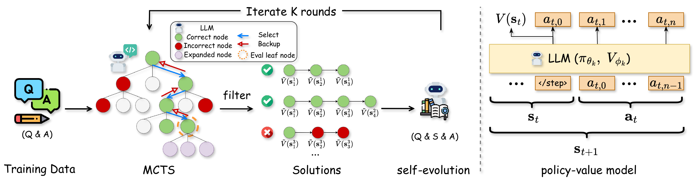
<figcaption>Our approach involves iterating through three distinct stages. (1) Collect a mathematical dataset that comprises questions and their corresponding final answers. (2) Employ MCTS on the policy and the value model to generate both correct and incorrect solution paths along with state values. (3) Optimize the policy and the value model with generated data from MCTS.</figcaption>
</figure>

# AlphaMath [sec:method]

In the above approach of MC evaluation, it requires multiple simulations from each state, which may be inefficient in practice. We propose employing the Monte Carlo Tree Search (MCTS) algorithm, which has the potential to reuse simulations and update the estimated values in a principled manner.

## MCTS Evaluation

As shown in Figure <a href="#fig:pipeline" data-reference-type="ref" data-reference="fig:pipeline">1</a>, our approach employs iterative training. Before the \\((k+1)\\)-th round training, we have a value model \\(V_{\phi_k}\\) and a LLM policy model \\(\pi_{\theta_k}\\), which are the same model but with different final layers in our paper. Using these models, we can construct an inference algorithm powered by MCTS. This algorithm starts with the initial state as its root, and through the synergistic use of the policy and value models, systematically grows the search tree by adding new nodes. These nodes correspond to the states deemed to have high potential based on the outcomes of simulated trajectories. Specifically within the context of mathematical problem-solving, as shown in Figure <a href="#fig:mcts" data-reference-type="ref" data-reference="fig:mcts">2</a>, we customize the four key operations of the MCTS algorithm as follows:

**Selection** During the \\(i\\)-th simulation of the MCTS, the process begins with \\(\mathbf{s}_0\\), representing the initial state containing the input question. The algorithm then proceeds to explore the tree \\(\mathcal{T}_k\\) by selecting nodes according to a variant of the PUCT algorithm `\citep{rosin2011multi}`{=latex}. This selection process is mathematically represented as: \\[\label{eq:mcts_select}
\mathbf{a}_t = \arg\max_{\mathbf{a} \in \mathcal{T}_k} \left[ \hat{Q}(\mathbf{s}_t, \mathbf{a}) + c_{\text{puct}}\pi_{\theta_k}(\mathbf{a}|\mathbf{s}_t)\frac{\sqrt{N_{parent}(\mathbf{a})}}{1+N(\mathbf{s}_t,\mathbf{a})}\right]\\] where the state-action value \\(\hat{Q}(\mathbf{s}, \mathbf{a})\\) and its visiting count \\(N(\mathbf{s}, \mathbf{a})\\) are stored in the tree and will be updated as the search progresses. \\(N_{parent}(\mathbf{a})\\) represents the visiting count of the parent node of \\(\mathbf{a}\\). The action selection iterates until it encounters a leaf node of the current search tree. In our case, the prior \\(\pi(\mathbf{a}|\mathbf{s}_t)\\) is defined as the exponential of averaged log-probability of all tokens in the step \\(\mathbf{a}\\), *i.e.*, \\(\exp\left( \frac{1}{|\mathbf{a}|}\sum \log \pi(a_j|\mathbf{a}_{<j}, \mathbf{s}_t) \right)\\).

**Expansion** Back-tracing from the selected leaf node to the root forms a partial solution, serving as a prompt for further node expansions. In our case, given that the LLM can theoretically generate an unlimited number of potential actions (token sequence), we employ sampling generation with higher temperature to ensure diversity.

**Evaluation** Evaluation of the leaf node or partial solution \\(\mathbf{s}_t\\), identified after the selection phase, is conducted by weighted sum as introduced in `\cite{silver2016mastering,silver2017mastering}`{=latex}. \\[\label{eq:mcts_eval}
    \hat{V}(\mathbf{s}_t)^{(i)} = (1 - \lambda) \cdot V_{\phi_k}(\mathbf{s}_t) + \lambda \cdot r\left( \mathbf{a}^{(i)}_{t^\prime \geq t}, \mathbf{s}^{(i)}_{t^\prime > t}|\mathbf{s}_t \right)\\] The intermediate value estimation \\(\hat{V}\\) in MCTS differs from the training signal \\(\widetilde{V}\\) defined in preliminary section <a href="#sec:prelim" data-reference-type="ref" data-reference="sec:prelim">2</a>. The parameter \\(\lambda\\) serves to balance the contribution of the value model’s estimation with the empirical reward obtained during the rollout.

In our case, we follow a trade-off rollout strategy between AlphaGo `\cite{silver2016mastering}`{=latex} and AlphaGo Zero `\cite{silver2017mastering}`{=latex}. Because our tree depth is much shallower than Go games (*e.g.*, a maximum depth of 8) and expansions can easily reach a terminal node, we set an indicator function \\(\lambda = \mathbb{I}_{\text{terminal}}(\mathbf{s}_t)\\). If the expanded node is terminal, the reward is returned; otherwise, the value is predicted by the model \\(V_{\phi_k}\\).

**Backup** We did not make any modifications to the backup. At the end of the \\(i\\)-th simulation, each edge \\((\mathbf{s}, \mathbf{a})\\) along the path from the leaf node \\(\mathbf{s}_t\\) to the root undergoes a backward pass update. The updates to their state-action values and visiting counts are executed according to the following rules: \\(N(\mathbf{s}, \mathbf{a}) \leftarrow N(\mathbf{s}, \mathbf{a}) +  1\\) and \\(\hat{Q}(\mathbf{s}, \mathbf{a}) \leftarrow \frac{1}{N(\mathbf{s}, \mathbf{a})} \sum_{j=1}^i \mathbb{I}_{\mathbf{s},\mathbf{a}\rightarrow \mathbf{s}_t}\hat{V}(\mathbf{s}_t)^{(j)}\\).

**Value Estimation** After running \\(N\\) simulations with the MCTS algorithm, we obtain the final tree \\(\mathcal{T}_k\\), which stores the expanded nodes and their corresponding state-action values \\(Q(\mathbf{s}, \mathbf{a})\\). Considering that the transition function is deterministic, and assuming that \\(Q(\mathbf{s}_t, \mathbf{a}_t) = r(\mathbf{s}_t, \mathbf{a}_t) + V(\mathbf{s}_{t+1}) = V(\mathbf{s}_{t+1})\\) for non-terminal nodes[^3], we can employ the \\(Q\\) values as training signals. This implies that we can directly fit the state-action value of non-terminal nodes as, \\[\label{eq:mcts_v2}
    \widetilde{V}(\mathbf{s}_{t+1}) = \hat{Q}(\mathbf{s}_t, \mathbf{a}_t)\\]

<figure id="fig:mcts">
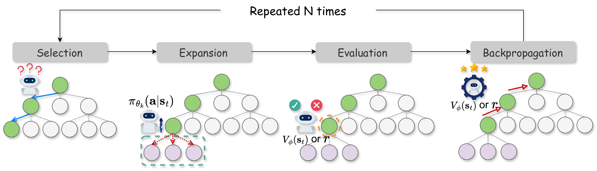
<figcaption>An overview of the four key operations in MCTS</figcaption>
</figure>

## Iterative Training

**Initialization** Initially, our approach begins with a pre-trained LLM as the policy model \\(\pi_{\theta_1}\\). We extend this model by adding an auxiliary linear layer with a `tanh` activation function, which works alongside the traditional softmax layer responsible for token prediction, as depicted in the rightmost panel of Figure <a href="#fig:pipeline" data-reference-type="ref" data-reference="fig:pipeline">1</a>. This design implies that these two models, \\(\pi_{\theta}\\) and \\(V_{\phi}\\), share the majority of their parameters. The parameters of the linear layer associated with \\(V_{\phi_1}\\) are randomly initialized, leading to an initial tendency of the value head to predict a value close to 0 at the first (\\(k=1\\)) round of MCTS. However, as the simulations in the first round MCTS proceed, the rewards (\\(\pm 1\\)) from terminal nodes are back-propagated to their parent nodes. As simulations \\(N\\) gradually increase, the estimated values \\(\hat{Q}\\) of intermediate nodes converge towards the underlying true value within the range of \\([-1, 1]\\).

**Training Method** From the tree \\(\mathcal{T}_k\\) constructed from the \\(k\\)-th round of MCTS, we can sample solution paths corresponding to terminal nodes with correct and incorrect predicted answers, denoted as \\(\mathbf{x}^+\\) and \\(\mathbf{x}^-\\), respectively, together with the value estimation of each node along these paths. We then apply a multi-task loss function to update both the policy and value models. \\[\label{eq:overall_loss}
    \arg\min_{\theta,\phi} - \log \pi_{\theta}(\mathbf{x}^+|\mathbf{q}) + \beta \cdot \left( \sum_{t =1}^{T(\mathbf{x}^+)} \|V_\phi(\mathbf{s}_t) - \widetilde{V}(\mathbf{s}_t) \|^2 + \sum_{t =1}^{T(\mathbf{x}^-)}  \|V_\phi(\mathbf{s}_t) - \widetilde{V}(\mathbf{s}_t) \|^2 \right)\\] where the first term represents the negative log-likelihood loss for next-token prediction in correct solutions, and the second term within the big brackets captures the loss in value prediction for both correct and incorrect solutions, respectively. \\(T(\mathbf{x})\\) denotes the number of steps for solution path \\(\mathbf{x}\\). \\(\beta\\) is a tunable hyper-parameter to control the weight of value loss. With the updated policy and value models \\(\pi_{\theta_{k+1}}\\) and \\(V_{\phi_{k+1}}\\), we can advance to the next-round MCTS, iterating this training process to enhance our models further.

<figure id="alg:mcts_inference">
<div class="algorithmic">
<p>ALGORITHM BLOCK (caption below)</p>
<p><br />
Require <span class="math inline"><em>B</em><sub>1</sub> = 1</span>, question <span class="math inline"><strong>q</strong></span> (<span class="math inline"><strong>s</strong><sub>0</sub></span>), policy / value models <span class="math inline"><em>π</em><sub><em>θ</em></sub>, <em>V</em><sub><em>ϕ</em></sub></span>, simulations <span class="math inline"><em>N</em></span>, max depth <span class="math inline"><em>T</em></span>.<br />
Build the complete tree <span class="math inline">𝒯</span> by running <span class="math inline">MCTS<sub><em>π</em><sub><em>θ</em></sub>, <em>V</em><sub><em>ϕ</em></sub></sub>(<strong>s</strong><sub>0</sub>, <em>N</em>, <em>T</em>)</span>.<br />
<span class="math inline">𝒞 = [<strong>s</strong><sub>0</sub>]</span>, <span class="math inline"><em>t</em> = 0</span> # comment: <span>Initialize candidates</span><br />
<strong>While</strong> <span><span class="math inline"><em>t</em> &lt; <em>T</em></span> <strong>and</strong> non-terminal path in <span class="math inline">𝒞</span></span><br />
Initialize priority queue <span class="math inline">𝒞<sub><em>t</em> + 1</sub></span> # comment: <span>Max heap</span><br />
<strong>For</strong> <span><span class="math inline"><strong>s</strong><sub><em>t</em></sub></span> in <span class="math inline">𝒞</span></span><br />
<strong>For</strong> <span><span class="math inline"><strong>a</strong></span> in <span class="math inline">𝒯<sub>children</sub>(<strong>s</strong><sub><em>t</em></sub>)</span></span> # comment: <span>Directly get children from tree</span><br />
<span class="math inline"><strong>s</strong><sub><strong>t</strong> <strong>+</strong> <strong>1</strong></sub> = Cat[<strong>s</strong><sub><em>t</em></sub>, <strong>a</strong>]</span><br />
Add <span class="math inline">(<strong>s</strong><sub><em>t</em> + 1</sub>, 𝒯<sub><em>Q</em></sub>(<strong>s</strong><sub><em>t</em></sub>, <strong>a</strong>))</span> to <span class="math inline">𝒞<sub><em>t</em> + 1</sub></span> # comment: <span>Directly get <span class="math inline"><em>Q</em></span>-value from tree</span><br />
EndFor<br />
EndFor<br />
<span class="math inline">𝒞←</span> Top-<span class="math inline"><em>B</em><sub>1</sub></span> of <span class="math inline">𝒞<sub><em>t</em> + 1</sub></span><br />
EndWhile<br />
Return Top-1 of <span class="math inline">𝒞</span> # comment: <span>Return top-1 as the final solution path</span></p>
</div>
<figcaption>Inference with MCTS</figcaption>
</figure>

<figure id="alg:sbs_inference">
<div class="algorithmic">
<p>ALGORITHM BLOCK (caption below)</p>
<p><br />
Require Beam sizes <span class="math inline"><em>B</em><sub>1</sub></span>, <span class="math inline"><em>B</em><sub>2</sub></span>, question <span class="math inline"><strong>q</strong></span> (<span class="math inline"><strong>s</strong><sub>0</sub></span>), policy / value models <span class="math inline"><em>π</em><sub><em>θ</em></sub>, <em>V</em><sub><em>ϕ</em></sub></span>, max steps <span class="math inline"><em>T</em></span>.<br />
<span class="math inline">𝒞 = [<strong>s</strong><sub>0</sub>] * <em>B</em><sub>1</sub></span>, <span class="math inline"><em>t</em> = 0</span> # comment: <span>Initialize candidates</span><br />
<strong>While</strong> <span><span class="math inline"><em>t</em> &lt; <em>T</em></span> <strong>and</strong> non-terminal path in <span class="math inline">𝒞</span></span><br />
Initialize priority queue <span class="math inline">𝒞<sub><em>t</em> + 1</sub></span> # comment: <span>Max heap</span><br />
<strong>For</strong> <span><span class="math inline"><strong>s</strong><sub><em>t</em></sub></span> in <span class="math inline">𝒞</span></span><br />
Sample <span class="math inline">{<strong>a</strong><sup>(<em>b</em>)</sup>}<sub><em>b</em> = 1</sub><sup><em>B</em><sub>2</sub></sup> ∼ <em>π</em><sub><em>θ</em></sub>(<strong>a</strong>|<strong>s</strong><sub><em>t</em></sub>)</span> # comment: <span>LLM generates <span class="math inline"><em>B</em><sub>2</sub></span> samples in parallel.</span><br />
<strong>For</strong> <span><span class="math inline"><em>b</em> = 1</span> to <span class="math inline"><em>B</em><sub>2</sub></span></span><br />
<span class="math inline"><strong>s</strong><sub><strong>t</strong> <strong>+</strong> <strong>1</strong></sub> = Cat[<strong>s</strong><sub><em>t</em></sub>, <strong>a</strong><sup>(<em>b</em>)</sup>]</span><br />
Add <span class="math inline">(<strong>s</strong><sub><em>t</em> + 1</sub>, <em>V</em><sub><em>ϕ</em></sub>(<strong>s</strong><sub><em>t</em> + 1</sub>))</span> to <span class="math inline">𝒞<sub><em>t</em> + 1</sub></span> # comment: <span><span class="math inline"><em>V</em><sub><em>ϕ</em></sub>(<strong>s</strong><sub><em>t</em> + 1</sub>)</span> predicted by value model</span><br />
EndFor<br />
EndFor<br />
<span class="math inline">𝒞←</span> Top-<span class="math inline"><em>B</em><sub>1</sub></span> of <span class="math inline">𝒞<sub><em>t</em> + 1</sub></span><br />
EndWhile<br />
Return Top-1 of <span class="math inline">𝒞</span> # comment: <span>Return top-1 as the final solution path</span></p>
</div>
<figcaption>Step-level Beam Search</figcaption>
</figure>

## Inference

**MCTS** For MCTS inference, it is necessary to set \\(\lambda = 0\\) in the evaluation of Eq. (<a href="#eq:mcts_eval" data-reference-type="ref" data-reference="eq:mcts_eval">[eq:mcts_eval]</a>). Unlike in board games, we cannot verify the correctness of a path during inference. Therefore, we consistently rely on the value model for node evaluation, including for terminal nodes. MCTS demands multiple simulations to update visiting counts and \\(Q\\) values, aiming to estimate a robust policy distribution.

After the tree has been completely built, the algorithm iteratively selects the top-\\(B_1\\) steps (usually \\(B_1=1\\) in MCTS) from the root in a top-down manner. This selection is guided by the *maximum \\(Q\\)-value* stored in the child nodes of the tree. Subsequently, all child nodes from the previously selected \\(B_1\\) steps are collectively re-ranked based on their \\(Q\\)-values, and the top-\\(B_1\\) nodes from this ranking are retained for the next iteration. A summary of the algorithm can be found in Algorithm <a href="#alg:mcts_inference" data-reference-type="ref" data-reference="alg:mcts_inference">3</a>.

**Step-level Beam Search** However, MCTS is computationally intensive for simulations, making it less viable for use in production environments. To address this, we modify the MCTS inference process by eliminating the backup operation, introducing a simplified method, which we refer to as Step-level Beam Search (SBS), detailed in Algorithm <a href="#alg:sbs_inference" data-reference-type="ref" data-reference="alg:sbs_inference">4</a>. This approach does not construct the entire tree; instead, it dynamically selects the best child node during node expansion.

There are two primary technical distinctions in SBS. First, since node expansion is required on the fly, we introduce a new beam size, \\(B_2\\), to represent the maximum number of node expansions. Second, the selection criterion no longer relies on the \\(Q\\)-value converged after \\(N\\) simulations but instead uses the *maximum value prediction* directly from the value model. Importantly, with special case SBS \\(B_1=1\\) as a fast approximation of MCTS, it facilitates the sequential, streaming output of steps, rendering it more suitable for practical implementation in real-world production.

# Experiments [sec:exp]

## Experimental Setup [sec:exp_setup]

In this study, we mainly investigate the math domain-specific language model, DeepSeekMath-Base-7B `\cite{shao2024deepseekmath}`{=latex}, pre-trained on a substantial math-related corpus without any supervised fine-tuning (SFT), which is believed to possess necessary mathematical knowledge to tackle a wide range of mathematical problems.

**Training Data Generation via MCTS** For the training sets, we exclusively extract question and answer pairs from GSM8K `\cite{gsm8kcobbe2021}`{=latex} and MATH `\cite{mathhendrycks2021}`{=latex}, omitting the human-annotated solution analysis. *In total, our training set includes only 15k question-answer pairs and 0 solution process.*

In our setup, we utilize the MCTS framework to generate detailed solution processes equipped with the Python code interpreter. Initially, for the first round of MCTS, the prompt used for our solution generation adheres to the REACT `\cite{yao2022react}`{=latex} format, incorporating 2 demonstrations randomly selected from a pool of 20 prepared examples. Starting from the second round, with an already fine-tuned model from the first round, we employ a straightforward prompt in our SFT XML format without any demonstration. Two prompt examples are shown in Appendix <a href="#app:prompts" data-reference-type="ref" data-reference="app:prompts">12</a>.

Specifically, we iteratively generate data and train our policy and value models through \\(K=3\\) rounds, continuing until the enhancement observed between any two consecutive rounds is incremental. In every round, we build 10 trees for each question-answer pair and randomly sample at most 4 correct and 4 incorrect solution processes. The ratio between positive and negative examples is approximately 1:1, with the count of positive examples in each round varying between 57k and 59k.

**Test Data** We evaluate our approach not only on GSM8K and MATH but also on out-of-distribution (OOD) datasets GaoKao2023 `\citep{liao2024mario}`{=latex} and OCWCourses `\citep{lewkowycz2022solving}`{=latex}. These two OOD datasets are even more challenging than MATH. Please refer to Appendix <a href="#sec:app_dataset" data-reference-type="ref" data-reference="sec:app_dataset">9.5</a> for more details about the dataset statistics. To assess the accuracy of the predicted answers, we utilize the math evaluation toolkit `\cite{zhang2024mario}`{=latex}.

**Baselines** We first compare our approach with strong proprietary and open-source models, including OpenAI’s ChatGPT and GPT-4 `\cite{openai2023gpt4}`{=latex}, Llama2 `\cite{touvron2023llama}`{=latex}, Llemma `\cite{azerbayev2023llemma}`{=latex}. By default, we report the results obtained using Chain of Thought (CoT) prompting `\cite{wei2022chain}`{=latex}, along with the prompting results of PAL `\cite{gao2023pal}`{=latex}, due to its enhanced performance in mathematical reasoning.

SFT models leverage high-quality seed data with process supervision derived from GPT-4 or humans to enhance their reasoning capabilities. To ensure a fair comparison, we primarily contrast our approach with the highest-performing SFT models that utilize an external tool - a Python code interpreter. These include MAmmoTH `\cite{yue2023mammoth}`{=latex}, MathCoder `\cite{wang2023mathcoder}`{=latex}, ToRA `\cite{gou2023tora}`{=latex}, MARIO `\cite{liao2024mario}`{=latex}, MathGenie `\cite{lu2024mathgenie}`{=latex}, and DeepSeek-Math-Instruct `\cite{shao2024deepseekmath}`{=latex}. More implementation details can be found in Appendix <a href="#sec:appendix_implementation_details" data-reference-type="ref" data-reference="sec:appendix_implementation_details">9</a>.

<div class="tabular" markdown="1">

@lccccccccc@ & & & & & & &  
& & & & & & & & &  
  
GPT-4 & - & - & - & <span style="color: darkred"></span>& & 92.0 & & - & -  
GPT-4 (PAL) & - & - & - & <span style="color: darkgreen"></span>& & 94.2 & & 43.6 & 30.1  
ChatGPT & - & - & - & <span style="color: darkred"></span>& & 80.8 & & - & -  
ChatGPT (PAL) & - & - & - & <span style="color: darkgreen"></span>& & 78.6 & & - & -  
Gemini-1.5 Pro & - & - & - & <span style="color: darkred"></span>& & 91.7 & & - & -  
Claude-3.5-Sonnet & - & - & - & <span style="color: darkred"></span>& & 96.4 & & - & -  
  
Llama-2 & 7B & - & - & <span style="color: darkred"></span>& & 13.3 & & - & 3.7  
CodeLlama & 7B & - & - & <span style="color: darkred"></span>& & 10.5 & & - & 4.7  
CodeLlama(PAL) & 7B & - & - & <span style="color: darkgreen"></span>& & 27.1 & & - & -  
Llemma & 7B & - & - & <span style="color: darkred"></span>& & 36.4 & & - & 7.7  
Llemma(PAL) & 7B & - & - & <span style="color: darkgreen"></span>& & 40.1 & & - & -  
DeepSeekMath-Base(PAL) & 7B & - & - & <span style="color: darkgreen"></span>& & 66.9 & & - & -  
  
MAmmoTH-Coder & 34B & GPT-4+Human & 260k & <span style="color: darkgreen"></span>& & 72.7 & & 25.2 & 14.0  
MathCoder & 34B & GPT-4 & 49k & <span style="color: darkgreen"></span>& & 81.7 & & - & -  
ToRA-Code & 34B & GPT-4 & 16k & <span style="color: darkgreen"></span>& & 80.7 & & 31.7 & 5.5  
MARIO & 34B & GPT-4+Human & 27k & <span style="color: darkgreen"></span>& & 78.2 & & 42.6 & 30.2  
MathGenie & 34B & GPT-4 & 80k & <span style="color: darkgreen"></span>& & **84.1** & & - & -  
Llama-2 SFT & 7B & Human & 15k & <span style="color: darkred"></span>& & 41.3 & & - & -  
Llama-2 RFT & 7B & Human & 15k & <span style="color: darkred"></span>& & 51.2 & & - & -  
MAmmoTH-Coder & 7B & GPT-4+Human & 260k & <span style="color: darkgreen"></span>& & 59.4 & & 15.3 & 11.0  
MathCoder & 7B & GPT-4 & 49k & <span style="color: darkgreen"></span>& & 67.8 & & - & -  
ToRA & 7B & GPT-4 & 16k & <span style="color: darkgreen"></span>& & 68.8 & & 19.5 & 2.6  
ToRA-Code & 7B & GPT-4 & 16k & <span style="color: darkgreen"></span>& & 72.6 & & 23.9 & 4.8  
MARIO & 7B & GPT-4+Human & 27k & <span style="color: darkgreen"></span>& & 74.5 & & 34.5 & 21.7  
MathGenie & 7B & GPT-4 & 80k & <span style="color: darkgreen"></span>& & 76.0 & & - & -  
DeepSeekMath-Instruct & 7B & GPT-4+Human & 776k & <span style="color: darkgreen"></span>& & 83.7 & & 43.9 & 18.0  
DeepSeekMath-Base & 7B & & & & & & &  
& - & - & <span style="color: darkgreen"></span>& & 59.7 & & 21.9 & 9.2  
& <span style="color: darkred"></span>& **<span style="color: darkred">0</span>** & <span style="color: darkgreen"></span>& & 73.5 & & 40.5 & 26.1  
& <span style="color: darkred"></span>& **<span style="color: darkred">0</span>** & <span style="color: darkgreen"></span>& & 81.1 & & 46.2 & 30.5  
& <span style="color: darkred"></span>& **<span style="color: darkred">0</span>** & <span style="color: darkgreen"></span>& & **84.1** & & **51.4** & 33.1  
& <span style="color: darkred"></span>& **<span style="color: darkred">0</span>** & <span style="color: darkgreen"></span>& & 83.2 & & 48.4 & **33.8**  

</div>

## Main Results

We report our in-domain and out-of-domain (OOD) results in Table <a href="#tab:main_result" data-reference-type="ref" data-reference="tab:main_result">[tab:main_result]</a>. Different from previous works `\cite{yue2023mammoth,wang2023mathcoder,gou2023tora,liao2024mario,lu2024mathgenie}`{=latex}, our proposed AlphaMath does not rely on high-quality solutions annotated by humans or GPT-4, whether in the form of text analysis or code snippets. Such solutions typically bolster the model’s reasoning abilities but also entail substantial costs associated with annotation. Furthermore, our method differs from prior research by not incorporating any external datasets (*e.g.*, new questions and solutions) beyond the GSM8K and MATH datasets. The last five rows of Table <a href="#tab:main_result" data-reference-type="ref" data-reference="tab:main_result">[tab:main_result]</a> present our principal findings.

**First**, we establish a baseline with the inherent mathematical reasoning ability of DeepSeekMath-Base using our designed prompt in a 2-shot setting. It’s important to note that this outcome differs from the results reported for DeepSeekMath-Base (PAL) in the original study, as it utilized prompts with 8-shot and 4-shot for the GSM8K and MATH datasets, respectively. **Secondly**, we only evaluate the policy model with greedy decoding. In comparison to our initial study, we record an enhancement of about 20 points for challenging problems in the MATH, GaoKao2023 (GK2023), and OCWCourses (OCW) datasets, and an improvement of more than 10 points for grade school math problems. **Thirdly**, we delve into the role of the value model in facilitating mathematical reasoning, utilizing a computationally efficient step-level beam search (SBS) in Algorithm <a href="#alg:sbs_inference" data-reference-type="ref" data-reference="alg:sbs_inference">4</a>. When we increment \\(B_1\\) with a default \\(B_2=5\\) and temperature of 1.0, a corresponding gradual improvement in performance is observed. More discussion about the temperature in SBS can refer to Appendix <a href="#app:sbs_temp" data-reference-type="ref" data-reference="app:sbs_temp">4.7</a>. **Ultimately**, we evaluate our approach in Algorithm <a href="#alg:mcts_inference" data-reference-type="ref" data-reference="alg:mcts_inference">3</a>. In contrast to the training data generation, we construct a single tree with 40 simulations, a maximum of 5 child nodes, and a temperature of 0.6. While MCTS demonstrates improved performance on more challenging datasets, attributed to its expansive search space, its substantial computational demands curtail its practical applicability in real-world scenarios.

In summary, our approach demonstrates that, even in the absence of high-quality GPT-4 or human-annotated solution processes, it remains competitive with or surpasses the performance of the state-of-the-art (SOTA) on 7B LLMs.

## Analysis 1: Performance of each round

We evaluate the problem-solving rate in the MATH training dataset, which categorizes each problem by difficulty level. As shown in Figure <a href="#fig:solver_rate_math_train" data-reference-type="ref" data-reference="fig:solver_rate_math_train">[fig:solver_rate_math_train]</a>, it becomes evident that MCTS achieves greater success in solving more challenging problems in subsequent rounds. In Figure <a href="#fig:infer_methods" data-reference-type="ref" data-reference="fig:infer_methods">7</a>, our findings show a general increase in performance with additional rounds of training across all strategies, applicable to both in-domain and out-of-domain test sets. Therefore, we can conclude that the quality of our self-generated training data improves incrementally with each round, and this enhancement is reflected in the performance on the test set. More analysis can refer to Appendix <a href="#app:analysis_round" data-reference-type="ref" data-reference="app:analysis_round">8.3</a>.

## Analysis 2: Performance of different inference strategies

We explore the performance of our model under various inference strategies including greedy decoding, step-level beam search, and MCTS. The results of MATH and GaoKao2023 are illustrated in Figure <a href="#fig:infer_methods" data-reference-type="ref" data-reference="fig:infer_methods">7</a>, while the results of other datasets can be found in Appendix <a href="#app:analysis_strategies" data-reference-type="ref" data-reference="app:analysis_strategies">8.1</a>. Specifically, for SBS, an enhancement in performance was observed with an increase in the beam size \\(B_1\\). MCTS exhibited the higher performance than its approximation SBS (\\(B_1=1\\)), but we previously noted its significant time consumption and computational inefficiency. Consequently, we provide a summary of the average problem-solving duration and the average number of intermediate steps taken on the MATH dataset in Table <a href="#tab:comp_eff" data-reference-type="ref" data-reference="tab:comp_eff">5</a>. The results indicate that MCTS demands the longest solving time and the highest number of steps, attributable to our configuration of 40 simulations. To achieve similar accuracy, step-level beam search is more computationally friendly. Additionally, we observe an intriguing phenomenon: a larger beam size \\(B_1\\) tends to reduce the average problem-solving duration. This can be attributed to the decrease in the number of average steps required when a larger \\(B_1\\) is employed.

<div id="tab:comp_eff" markdown="1">

<table>
<caption>Analysis of Computational Efficiency on MATH dataset. # Sol. denotes the number of solutions obtained eventually. </caption>
<thead>
<tr>
<th style="text-align: left;"><div id="tab:comp_eff">
<table>
<caption>Analysis of Computational Efficiency on MATH dataset. # Sol. denotes the number of solutions obtained eventually. </caption>
<tbody>
<tr>
<td style="text-align: left;">Inference</td>
</tr>
<tr>
<td style="text-align: left;">Strategy</td>
</tr>
</tbody>
</table>
</div></th>
<th style="text-align: left;">Acc.</th>
<th style="text-align: center;"><div id="tab:comp_eff">
<table>
<caption>Analysis of Computational Efficiency on MATH dataset. # Sol. denotes the number of solutions obtained eventually. </caption>
<tbody>
<tr>
<td style="text-align: center;">Avg.</td>
</tr>
<tr>
<td style="text-align: center;">time (s)</td>
</tr>
</tbody>
</table>
</div></th>
<th style="text-align: center;"><div id="tab:comp_eff">
<table>
<caption>Analysis of Computational Efficiency on MATH dataset. # Sol. denotes the number of solutions obtained eventually. </caption>
<tbody>
<tr>
<td style="text-align: center;">Avg.</td>
</tr>
<tr>
<td style="text-align: center;">steps</td>
</tr>
</tbody>
</table>
</div></th>
<th style="text-align: center;"># Sol.</th>
</tr>
</thead>
<tbody>
<tr>
<td style="text-align: left;">Greedy</td>
<td style="text-align: left;">53.62</td>
<td style="text-align: center;">1.6</td>
<td style="text-align: center;">3.10</td>
<td style="text-align: center;">1</td>
</tr>
<tr>
<td style="text-align: left;">Maj@5</td>
<td style="text-align: left;">61.84 (<span style="color: red">+8.22</span>)</td>
<td style="text-align: center;">2.9</td>
<td style="text-align: center;">2.88</td>
<td style="text-align: center;">5</td>
</tr>
<tr>
<td style="text-align: left;">SBS (<span class="math inline"><em>B</em><sub>1</sub> = 1</span>)</td>
<td style="text-align: left;">62.80 (<span style="color: red">+9.18</span>)</td>
<td style="text-align: center;">3.1</td>
<td style="text-align: center;">3.01</td>
<td style="text-align: center;">1</td>
</tr>
<tr>
<td style="text-align: left;">SBS (<span class="math inline"><em>B</em><sub>1</sub> = 2</span>)</td>
<td style="text-align: left;">64.66 (<span style="color: red">+11.04</span>)</td>
<td style="text-align: center;">2.4</td>
<td style="text-align: center;">2.36</td>
<td style="text-align: center;">2</td>
</tr>
<tr>
<td style="text-align: left;">SBS (<span class="math inline"><em>B</em><sub>1</sub> = 3</span>)</td>
<td style="text-align: left;">66.30 (<span style="color: red">+12.68</span>)</td>
<td style="text-align: center;">2.3</td>
<td style="text-align: center;">2.21</td>
<td style="text-align: center;">3</td>
</tr>
<tr>
<td style="text-align: left;">SBS (<span class="math inline"><em>B</em><sub>1</sub> = 5</span>)</td>
<td style="text-align: left;">65.98 (<span style="color: red">+12.37</span>)</td>
<td style="text-align: center;">4.7</td>
<td style="text-align: center;">2.26</td>
<td style="text-align: center;">5</td>
</tr>
<tr>
<td style="text-align: left;">MCTS (<span class="math inline"><em>B</em><sub>1</sub> = 1</span>)</td>
<td style="text-align: left;">64.02 (<span style="color: red">+10.40</span>)</td>
<td style="text-align: center;">10.1</td>
<td style="text-align: center;">3.76</td>
<td style="text-align: center;">n</td>
</tr>
</tbody>
</table>

</div>

**Discussion of Majority Voting** It is challenging to directly compare maj@5 with step-level beam search due to the inherent differences in their methodologies. Generally speaking, as Algorithm <a href="#alg:sbs_inference" data-reference-type="ref" data-reference="alg:sbs_inference">4</a>, SBS will eventually return the top-1 final answer based on the value model, while maj@5 will generate all 5 possible final answers and vote the majority for evaluation.

From the step-level perspective, maj@5 will maintain 5 candidates for the current step to generate another 5 candidates for the next step. In contrast, the SBS (*e.g.*, \\(B_1=1, B_2=5\\)) will always retain the top-1 candidate, discarding the 4 others. This provides the advantage of step-by-step streaming output in real-world production, whereas maj@5 can only output the complete solution until the voting is finalized. To sum up, their specific mechanics of candidate selection and retention differ significantly.

<figure id="fig:infer_methods">
<figure>
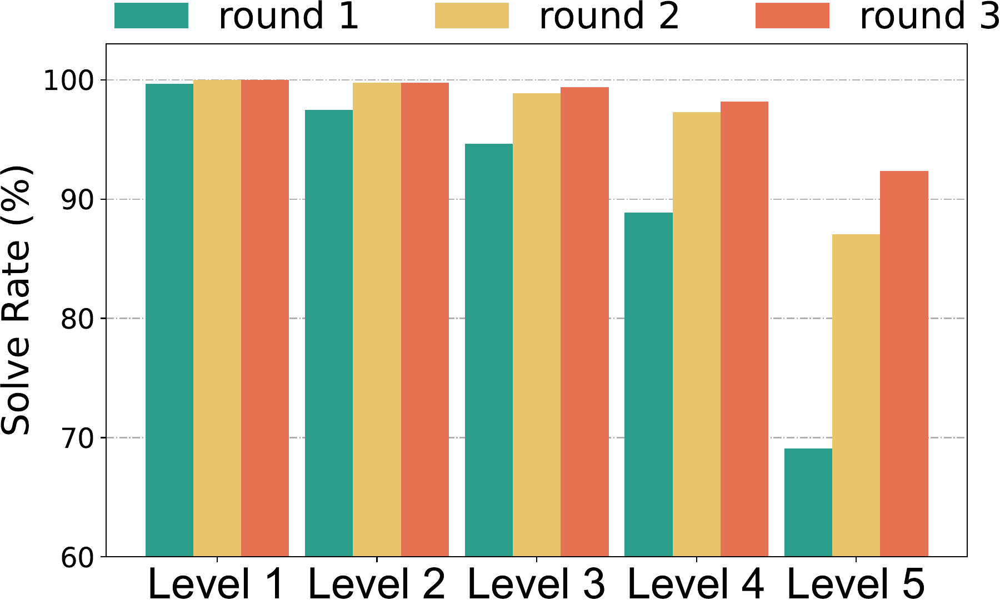
</figure>
<figure id="fig:infer_math">
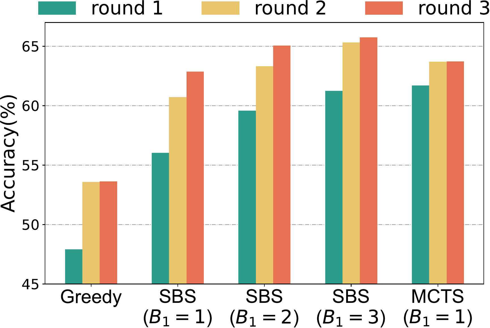
<figcaption>MATH (In-Domain)</figcaption>
</figure>
<figure id="fig:infer_gaokao">
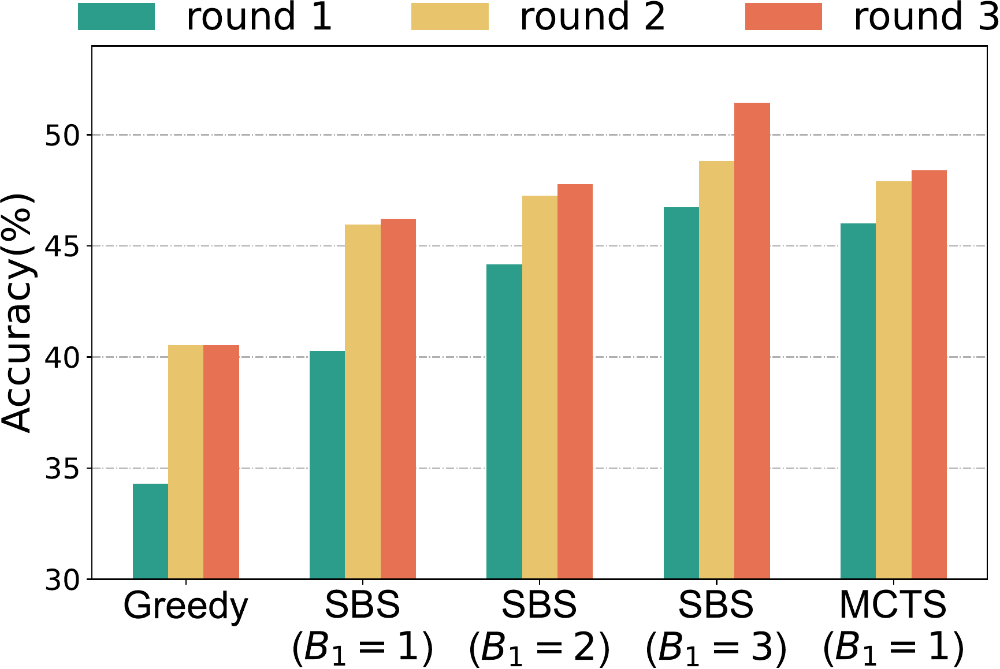
<figcaption>GaoKao2023 (Out-of-Domain)</figcaption>
</figure>
<figcaption>Comparison of Different Inference Strategies.</figcaption>
</figure>

## Analysis 3: Value model [sec:analysis_value_model]

In the left panel of Figure <a href="#fig:q_value_dist" data-reference-type="ref" data-reference="fig:q_value_dist">8</a>, we plot the fitted distribution of \\(Q\\)-values (as defined in Eq. (<a href="#eq:mcts_v2" data-reference-type="ref" data-reference="eq:mcts_v2">[eq:mcts_v2]</a>)) on MATH training set for intermediate steps. For correct solutions, the distribution is markedly skewed towards a value of 1. In contrast, the distribution for incorrect solutions exhibits a lower degree of skewness, albeit with the majority of the probability density leaning towards \\(-1\\). This is because a correct final answer typically suggests that the entire solution process is likely accurate, whereas an incorrect final answer may still encompass some correct intermediate steps. Thus, with the backup of MCTS, the \\(Q\\)-values of intermediate steps in incorrect solutions may also be updated with a reward of 1 during simulations.

<figure id="fig:q_value_dist">
<figure>
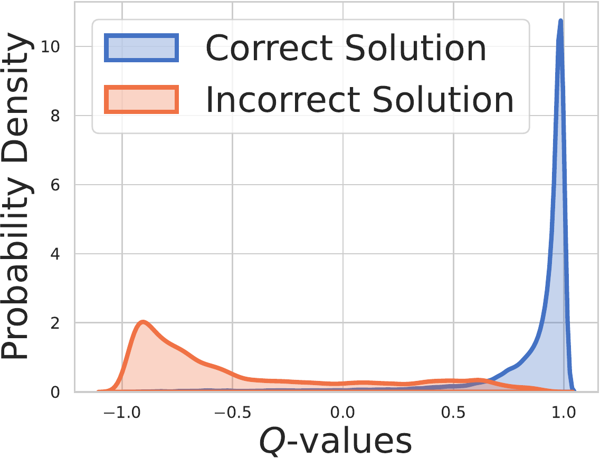
</figure>
<figure>
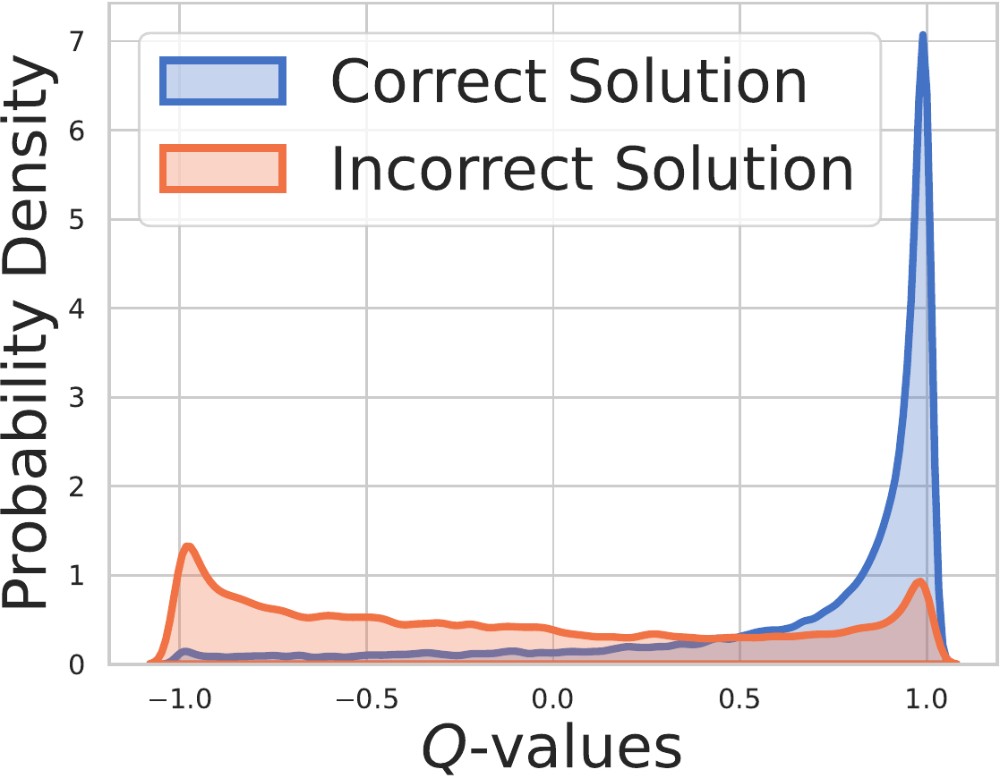
</figure>
<figcaption>(Left) Fitted distribution of <span class="math inline"><em>Q</em></span>-values of 3rd round MCTS on the training set. (Right) Fitted distribution of <span class="math inline"><em>Q</em></span>-values via MCTS inference on the test set.</figcaption>
</figure>

In the right panel of Figure <a href="#fig:q_value_dist" data-reference-type="ref" data-reference="fig:q_value_dist">8</a>, we plot the \\(Q\\)-values distribution on the test set, including both intermediate and terminal steps. The distribution associated with correct solutions exhibits a shape similar to that found in the training set. However, the distribution of incorrect solutions, which are the bad cases of the policy model, demonstrates a bimodal pattern. **(1)** When the value model believes the incorrect solution predicted by the policy model to be incorrect, the \\(Q\\)-values cluster around \\(-1\\). **(2)** Conversely, there are instances where the value model erroneously considers an incorrect solution as correct, resulting in another modal towards \\(1\\), which represents the bad cases of the value model.

## Analysis 4: Self-evolution on General-purpose and SFT models

<div id="tab:additional_result" markdown="1">

<table>
<caption>Additional Results on Llama3 and MARIO. <span class="math inline"><sup>†</sup></span>DeepSeekMath-Base-7B. <span class="math inline">$^\S$</span>Our designed prompt in 2-shot setting. </caption>
<tbody>
<tr>
<td rowspan="2" style="text-align: left;"><strong>Model</strong></td>
<td colspan="2" style="text-align: center;"><strong>In-Domain</strong></td>
<td colspan="2" style="text-align: center;"><strong>OOD</strong></td>
</tr>
<tr>
<td style="text-align: center;"><strong>GSM8K</strong></td>
<td style="text-align: center;"><strong>MATH</strong></td>
<td style="text-align: center;"><strong>GK2023</strong></td>
<td style="text-align: center;"><strong>OCW</strong></td>
</tr>
<tr>
<td style="text-align: left;">Llama3-base<span class="math inline">$^\S$</span></td>
<td style="text-align: center;">40.7</td>
<td style="text-align: center;">18.7</td>
<td style="text-align: center;">12.9</td>
<td style="text-align: center;">2.9</td>
</tr>
<tr>
<td style="text-align: left;">+ AlphaMath (<span class="math inline"><em>K</em> = 3</span>)</td>
<td style="text-align: center;">59.4</td>
<td style="text-align: center;">36.8</td>
<td style="text-align: center;">27.1</td>
<td style="text-align: center;">6.6</td>
</tr>
<tr>
<td style="text-align: left;">+ SBS (<span class="math inline"><em>B</em><sub>1</sub> = 3</span>)</td>
<td style="text-align: center;">71.8</td>
<td style="text-align: center;">41.9</td>
<td style="text-align: center;">31.4</td>
<td style="text-align: center;">10.7</td>
</tr>
<tr>
<td style="text-align: left;">DSM<span class="math inline"><sup>†</sup></span> + 27k MARIO data</td>
<td style="text-align: center;">78.4</td>
<td style="text-align: center;">56.1</td>
<td style="text-align: center;">41.6</td>
<td style="text-align: center;">25.0</td>
</tr>
<tr>
<td style="text-align: left;">+ AlphaMath (<span class="math inline"><em>K</em> = 2</span>)</td>
<td style="text-align: center;">80.2</td>
<td style="text-align: center;">58.8</td>
<td style="text-align: center;">48.1</td>
<td style="text-align: center;">31.3</td>
</tr>
<tr>
<td style="text-align: left;">+ SBS (<span class="math inline"><em>B</em><sub>1</sub> = 3</span>)</td>
<td style="text-align: center;"><strong>88.3</strong></td>
<td style="text-align: center;"><strong>68.6</strong></td>
<td style="text-align: center;"><strong>54.1</strong></td>
<td style="text-align: center;"><strong>42.3</strong></td>
</tr>
</tbody>
</table>

</div>

We further investigate the potential of two other popular types of LLMs: general-purpose pre-trained models and SFT models. These models represent the scenarios of lacking continual pre-training (CPT) in domain-specific data and supervised fine-tuning (SFT) on high-quality annotated domain data, respectively. We select Llama3 `\citep{llamma3blog}`{=latex} and MARIO `\citep{liao2024mario}`{=latex} as the base models and report the results in Table <a href="#tab:additional_result" data-reference-type="ref" data-reference="tab:additional_result">6</a>. For a fair comparison, the MARIO is trained on DeepSeekMath-Base-7B rather than its original Llemma-7B `\cite{azerbayev2023llemma}`{=latex}. First, although not proficient in mathematical reasoning, our AlphaMath enhances Llama3’s mathematical reasoning capabilities without any annotations, yielding an average improvement of +20 points. Secondly, AlphaMath can significantly enhance the performance of existing SFT models, enabling MARIO to be competitive with and even outperform GPT-4.

## Analysis 5: The Effects of Temperature on Step-level Beam Search [app:sbs_temp]

<figure id="fig:temperature">
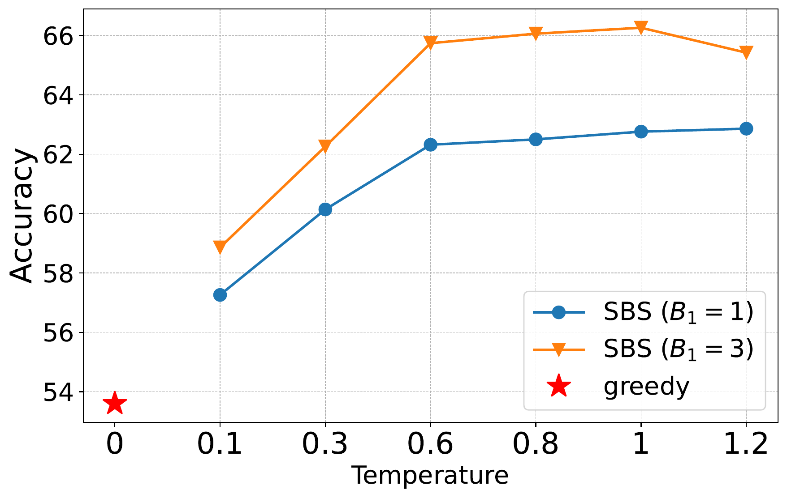
<figcaption>The Effects of Temperature on the performance of SBS.</figcaption>
</figure>

We further investigate the effects of temperature during decoding on the performance of inference algorithms. For the greedy strategy, the temperature is consistently maintained at 0, whereas step-level beam search (SBS) and Monte Carlo Tree Search(MCTS) are more significantly influenced by higher temperatures. Therefore, taking step-level beam search (\\(B_1=1\\) and \\(B_1=3\\)) as an example, we obtained the results as illustrated in Figure <a href="#fig:temperature" data-reference-type="ref" data-reference="fig:temperature">9</a>.

**First**, under any temperature setting, the performance of step-level beam search significantly surpasses that of the greedy strategy. This is attributed to the value model effectively assisting the policy model in identifying more effective reasoning paths. **Secondly**, at lower temperatures, the performance of step-level beam search is constrained due to the lack of diversity in the generated solutions. With elevated temperatures, the value model is capable of discerning optimal paths within a more diverse set of solutions, thereby effectively enhancing reasoning performance. **Finally**, with a larger beam width, the model can explore more solutions. Therefore, the performance of \\(B_1=3\\) always surpasses that of \\(B_1=1\\).

# Related Works [sec:related]

**Solution Annotation in Math.** Recent works  `\cite{yue2023mammoth,wang2023mathcoder,gou2023tora,li2023query,liao2024mario,shao2024deepseekmath,lu2024mathgenie,huang2024mustard}`{=latex} on mathematical reasoning have made impressive progress empowered by process-supervised data. However, most existing efforts concentrate on seeking high-quality solutions from domain experts or formidable commercial models, such as GPT-4 `\citep{openai2023gpt4}`{=latex}, which hampers the scalability of methods and escalates the associated expenses. Unlike previous work, only with the help of question-answer pairs, we focus on activating the intrinsic knowledge within LLMs to realize iterative self-evolution and strengthen their utilization of knowledge autonomously, just like humans.

**Value/Reward Model.** Recent studies `\citep{gsm8kcobbe2021,cobbe2021training,lightman2023let,yu2023outcome,zhu2023solving,xie2023decomposition,weng2023large,feng2023alphazero}`{=latex} have demonstrated that process supervision can significantly enhance mathematical reasoning performance. Especially, value model `\citep{feng2023alphazero,liu2024dont,mao2024dont}`{=latex} is incorporated into the decoding process, while reward model is the source of the training signal in reinforcement learning `\citep{ouyang2022training, shao2024deepseekmath}`{=latex}. However, these value/reward models require substantial annotated process-supervised data and introduce significant inference latency. In our work, we consider the state values \\(\widetilde{V}(\mathbf{s}_t)\\) from MCTS as supervision signals, which are aligned with the solutions and eliminate the annotation costs. Furthermore, we integrate the value model into the generative model to navigate more effective reasoning paths at minimal cost, thereby providing richer decoding strategies, such as step-level beam search or MCTS.

# Conclusion [sec:concl]

In this work, we introduce AlphaMath, a simple iterative training paradigm for leveraging Monte Carlo Tree Search to unleash the potential of a well pre-trained large language model to autonomously enhance its mathematical reasoning capabilities. Furthermore, by applying step-level beam search, the value model can assist the policy model in selecting a more reasonable solution path, rather than solely relying on prior probabilities, which significantly enhances mathematical reasoning capabilities at minimal cost. The experimental results on both in-domain and out-of-domain datasets demonstrate that even without GPT-4 or human-annotated process supervision, AlphaMath remains competitive with or surpasses the performance of the state-of-the-art methods.

# Acknowledgments [acknowledgments]

This work was supported by Alibaba Research Intern Program.

# References [references]

<div class="thebibliography" markdown="1">

R. Anil, A. M. Dai, O. Firat, M. Johnson, D. Lepikhin, A. Passos, S. Shakeri, E. Taropa, P. Bailey, Z. Chen, et al Palm 2 technical report *arXiv preprint arXiv:2305.10403*, 2023. **Abstract:** We introduce PaLM 2, a new state-of-the-art language model that has better multilingual and reasoning capabilities and is more compute-efficient than its predecessor PaLM. PaLM 2 is a Transformer-based model trained using a mixture of objectives. Through extensive evaluations on English and multilingual language, and reasoning tasks, we demonstrate that PaLM 2 has significantly improved quality on downstream tasks across different model sizes, while simultaneously exhibiting faster and more efficient inference compared to PaLM. This improved efficiency enables broader deployment while also allowing the model to respond faster, for a more natural pace of interaction. PaLM 2 demonstrates robust reasoning capabilities exemplified by large improvements over PaLM on BIG-Bench and other reasoning tasks. PaLM 2 exhibits stable performance on a suite of responsible AI evaluations, and enables inference-time control over toxicity without additional overhead or impact on other capabilities. Overall, PaLM 2 achieves state-of-the-art performance across a diverse set of tasks and capabilities. When discussing the PaLM 2 family, it is important to distinguish between pre-trained models (of various sizes), fine-tuned variants of these models, and the user-facing products that use these models. In particular, user-facing products typically include additional pre- and post-processing steps. Additionally, the underlying models may evolve over time. Therefore, one should not expect the performance of user-facing products to exactly match the results reported in this report. (@anil2023palm)

Anthropic Model card and evaluations for claude models July 2023. **Abstract:** Background Sub-Saharan African countries have a high burden of viral hepatitis and poor access to screening and care. The aim of this study was to evaluate the feasibility and acceptability of using the plasma separation card (PSC) for viral hepatitis B and C screening among people living with HIV (PLHIV) in Cameroon and Uganda. Methods This is a cross-sectional study carried out between 05/2021 and 03/2023 including 192 PLHIV in Cameroon (n = 104) and Uganda (n = 88). Basic sociodemographic variables and whole blood samples were collected. Adequate filling with blood of PSCs was used to determine feasibility together with participant responses to questions on acceptability. A logistic regression model was carried out to assess the relationship between PSC acceptability and factors of interest. Results 70% of participants reported PSC as an acceptable viral hepatitis screening tool, and it was significantly more accepted in Uganda than Cameroon (100% vs. 43.2%, p \< 0.001). Similarly, 75% of PSCs had at least one spot sample filled and were viable for analysis, 99% were correctly filled in Uganda and 53.4% in Cameroon. Reported ease of method performance (aOR: 24.77 95% CI 2.97-206.42, p = 0.003) and reduced collection time (aOR: 3.73 95% CI 1.26–11.04, p = 0.017) were associated with greater odds of PSC acceptance. HBsAg + and anti-HCV + prevalence were 11.1% and 1.0%, respectively. Conclusions In spite of country differences, overall, the PSC was reported as a feasible and acceptable viral hepatitis testing method. Acceptability and feasibility of the method must be explored in heterogeneous target communities and qualitative research to better understand country-specific barriers and facilitators should be carried out. (@claude)

Z. Azerbayev, H. Schoelkopf, K. Paster, M. D. Santos, S. McAleer, A. Q. Jiang, J. Deng, S. Biderman, and S. Welleck Llemma: An open language model for mathematics *arXiv preprint arXiv:2310.10631*, 2023. **Abstract:** We present Llemma, a large language model for mathematics. We continue pretraining Code Llama on the Proof-Pile-2, a mixture of scientific papers, web data containing mathematics, and mathematical code, yielding Llemma. On the MATH benchmark Llemma outperforms all known open base models, as well as the unreleased Minerva model suite on an equi-parameter basis. Moreover, Llemma is capable of tool use and formal theorem proving without any further finetuning. We openly release all artifacts, including 7 billion and 34 billion parameter models, the Proof-Pile-2, and code to replicate our experiments. (@azerbayev2023llemma)

C. B. Browne, E. Powley, D. Whitehouse, S. M. Lucas, P. I. Cowling, P. Rohlfshagen, S. Tavener, D. Perez, S. Samothrakis, and S. Colton A survey of monte carlo tree search methods *IEEE Transactions on Computational Intelligence and AI in games*, 4 (1): 1–43, 2012. **Abstract:** Monte Carlo tree search (MCTS) is a recently proposed search method that combines the precision of tree search with the generality of random sampling. It has received considerable interest due to its spectacular success in the difficult problem of computer Go, but has also proved beneficial in a range of other domains. This paper is a survey of the literature to date, intended to provide a snapshot of the state of the art after the first five years of MCTS research. We outline the core algorithm’s derivation, impart some structure on the many variations and enhancements that have been proposed, and summarize the results from the key game and nongame domains to which MCTS methods have been applied. A number of open research questions indicate that the field is ripe for future work. (@browne2012survey)

G. Chen, K. Tang, C. Yang, F. Ye, Y. Qiao, and Y. Qian : Facilitating structured reasoning and explanation via reinforcement learning In L.-W. Ku, A. Martins, and V. Srikumar, editors, *Proceedings of the 62nd Annual Meeting of the Association for Computational Linguistics (Volume 1: Long Papers)*, pages 5901–5921, Bangkok, Thailand, Aug. 2024. Association for Computational Linguistics. . URL <https://aclanthology.org/2024.acl-long.321>. **Abstract:** Elucidating the reasoning process with structured explanations from question to answer is crucial, as it significantly enhances the interpretability, traceability, and trustworthiness of question-answering (QA) systems. However, structured explanations demand models to perform intricately structured reasoning, which poses great challenges. Most existing methods focus on single-step reasoning through supervised learning, ignoring logical dependencies between steps. Moreover, existing reinforcement learning (RL) based methods overlook the structured relationships, underutilizing the potential of RL in structured reasoning. In this paper, we propose SEER, a novel method that maximizes a structure-based return to facilitate structured reasoning and explanation. Our proposed structure-based return precisely describes the hierarchical and branching structure inherent in structured reasoning, effectively capturing the intricate relationships between different reasoning steps. In addition, we introduce a fine-grained reward function to meticulously delineate diverse reasoning steps. Extensive experiments show that SEER significantly outperforms state-of-the-art methods, achieving an absolute improvement of 6.9% over RL-based methods on EntailmentBank, a 4.4% average improvement on STREET benchmark, and exhibiting outstanding efficiency and cross-dataset generalization performance. (@chen-etal-2024-seer)

W. Chen, X. Ma, X. Wang, and W. W. Cohen Program of thoughts prompting: Disentangling computation from reasoning for numerical reasoning tasks *arXiv preprint arXiv:2211.12588*, 2022. **Abstract:** Recently, there has been significant progress in teaching language models to perform step-by-step reasoning to solve complex numerical reasoning tasks. Chain-of-thoughts prompting (CoT) is by far the state-of-art method for these tasks. CoT uses language models to perform both reasoning and computation in the multi-step ‘thought’ process. To disentangle computation from reasoning, we propose ‘Program of Thoughts’ (PoT), which uses language models (mainly Codex) to express the reasoning process as a program. The computation is relegated to an external computer, which executes the generated programs to derive the answer. We evaluate PoT on five math word problem datasets (GSM, AQuA, SVAMP, TabMWP, MultiArith) and three financial-QA datasets (FinQA, ConvFinQA, TATQA) for both few-shot and zero-shot setups. Under both few-shot and zero-shot settings, PoT can show an average performance gain over CoT by around 12\\}% across all the evaluated datasets. By combining PoT with self-consistency decoding, we can achieve SoTA performance on all math problem datasets and near-SoTA performance on financial datasets. All of our data and code are released in Github https://github.com/wenhuchen/Program-of-Thoughts (@chen2022program)

K. Cobbe, V. Kosaraju, M. Bavarian, M. Chen, H. Jun, L. Kaiser, M. Plappert, J. Tworek, J. Hilton, R. Nakano, C. Hesse, and J. Schulman Training verifiers to solve math word problems *arXiv preprint arXiv:2110.14168*, 2021. **Abstract:** State-of-the-art language models can match human performance on many tasks, but they still struggle to robustly perform multi-step mathematical reasoning. To diagnose the failures of current models and support research, we introduce GSM8K, a dataset of 8.5K high quality linguistically diverse grade school math word problems. We find that even the largest transformer models fail to achieve high test performance, despite the conceptual simplicity of this problem distribution. To increase performance, we propose training verifiers to judge the correctness of model completions. At test time, we generate many candidate solutions and select the one ranked highest by the verifier. We demonstrate that verification significantly improves performance on GSM8K, and we provide strong empirical evidence that verification scales more effectively with increased data than a finetuning baseline. (@gsm8kcobbe2021)

K. Cobbe, V. Kosaraju, M. Bavarian, M. Chen, H. Jun, L. Kaiser, M. Plappert, J. Tworek, J. Hilton, R. Nakano, et al Training verifiers to solve math word problems *arXiv preprint arXiv:2110.14168*, 2021. **Abstract:** State-of-the-art language models can match human performance on many tasks, but they still struggle to robustly perform multi-step mathematical reasoning. To diagnose the failures of current models and support research, we introduce GSM8K, a dataset of 8.5K high quality linguistically diverse grade school math word problems. We find that even the largest transformer models fail to achieve high test performance, despite the conceptual simplicity of this problem distribution. To increase performance, we propose training verifiers to judge the correctness of model completions. At test time, we generate many candidate solutions and select the one ranked highest by the verifier. We demonstrate that verification significantly improves performance on GSM8K, and we provide strong empirical evidence that verification scales more effectively with increased data than a finetuning baseline. (@cobbe2021training)

T. Dao Flashattention-2: Faster attention with better parallelism and work partitioning *arXiv preprint arXiv:2307.08691*, 2023. **Abstract:** Scaling Transformers to longer sequence lengths has been a major problem in the last several years, promising to improve performance in language modeling and high-resolution image understanding, as well as to unlock new applications in code, audio, and video generation. The attention layer is the main bottleneck in scaling to longer sequences, as its runtime and memory increase quadratically in the sequence length. FlashAttention exploits the asymmetric GPU memory hierarchy to bring significant memory saving (linear instead of quadratic) and runtime speedup (2-4$\\}times$ compared to optimized baselines), with no approximation. However, FlashAttention is still not nearly as fast as optimized matrix-multiply (GEMM) operations, reaching only 25-40\\}% of the theoretical maximum FLOPs/s. We observe that the inefficiency is due to suboptimal work partitioning between different thread blocks and warps on the GPU, causing either low-occupancy or unnecessary shared memory reads/writes. We propose FlashAttention-2, with better work partitioning to address these issues. In particular, we (1) tweak the algorithm to reduce the number of non-matmul FLOPs (2) parallelize the attention computation, even for a single head, across different thread blocks to increase occupancy, and (3) within each thread block, distribute the work between warps to reduce communication through shared memory. These yield around 2$\\}times$ speedup compared to FlashAttention, reaching 50-73\\}% of the theoretical maximum FLOPs/s on A100 and getting close to the efficiency of GEMM operations. We empirically validate that when used end-to-end to train GPT-style models, FlashAttention-2 reaches training speed of up to 225 TFLOPs/s per A100 GPU (72\\}% model FLOPs utilization). (@dao2023flashattention)

J. Devlin, M.-W. Chang, K. Lee, and K. Toutanova Bert: Pre-training of deep bidirectional transformers for language understanding In *Proceedings of the 2019 Conference of the North American Chapter of the Association for Computational Linguistics*, pages 4171–4186, 2019. **Abstract:** We introduce a new language representation model called BERT, which stands for Bidirectional Encoder Representations from Transformers. Unlike recent language representation models, BERT is designed to pre-train deep bidirectional representations from unlabeled text by jointly conditioning on both left and right context in all layers. As a result, the pre-trained BERT model can be fine-tuned with just one additional output layer to create state-of-the-art models for a wide range of tasks, such as question answering and language inference, without substantial task-specific architecture modifications. BERT is conceptually simple and empirically powerful. It obtains new state-of-the-art results on eleven natural language processing tasks, including pushing the GLUE score to 80.5% (7.7% point absolute improvement), MultiNLI accuracy to 86.7% (4.6% absolute improvement), SQuAD v1.1 question answering Test F1 to 93.2 (1.5 point absolute improvement) and SQuAD v2.0 Test F1 to 83.1 (5.1 point absolute improvement). (@devlin2019bert)

A. Dubey, A. Jauhri, A. Pandey, A. Kadian, A. Al-Dahle, A. Letman, A. Mathur, A. Schelten, A. Yang, A. Fan, et al The llama 3 herd of models *arXiv preprint arXiv:2407.21783*, 2024. **Abstract:** Modern artificial intelligence (AI) systems are powered by foundation models. This paper presents a new set of foundation models, called Llama 3. It is a herd of language models that natively support multilinguality, coding, reasoning, and tool usage. Our largest model is a dense Transformer with 405B parameters and a context window of up to 128K tokens. This paper presents an extensive empirical evaluation of Llama 3. We find that Llama 3 delivers comparable quality to leading language models such as GPT-4 on a plethora of tasks. We publicly release Llama 3, including pre-trained and post-trained versions of the 405B parameter language model and our Llama Guard 3 model for input and output safety. The paper also presents the results of experiments in which we integrate image, video, and speech capabilities into Llama 3 via a compositional approach. We observe this approach performs competitively with the state-of-the-art on image, video, and speech recognition tasks. The resulting models are not yet being broadly released as they are still under development. (@llamma3blog)

X. Feng, Z. Wan, M. Wen, Y. Wen, W. Zhang, and J. Wang Alphazero-like tree-search can guide large language model decoding and training *arXiv preprint arXiv:2309.17179*, 2023. **Abstract:** Recent works like Tree-of-Thought (ToT) and Reasoning via Planning (RAP) aim to augment the reasoning capabilities of LLMs by using tree-search algorithms to guide multi-step reasoning. These methods rely on prompting a pre-trained model to serve as a value function and focus on problems with low search depth. As a result, these methods will not work in domains where the pre-trained LLM does not have enough knowledge to serve as an effective value function or in domains that require long-horizon planning. To address these limitations, we present an AlphaZero-like tree-search learning framework for LLMs (termed TS-LLM), systematically illustrating how tree-search with a learned value function can guide LLM decoding. TS-LLM distinguishes itself in two key ways. (1) Leveraging a learned value function and AlphaZero-like algorithms, our approach can be generally adaptable to a wide range of tasks, language models of any size, and tasks of varying search depths. (2) Our approach can guide LLMs during both inference and training, iteratively improving the LLM. Empirical results across reasoning, planning, alignment, and decision-making tasks show that TS-LLM outperforms existing approaches and can handle trees with a depth of 64. (@feng2023alphazero)

L. Gao, A. Madaan, S. Zhou, U. Alon, P. Liu, Y. Yang, J. Callan, and G. Neubig Pal: Program-aided language models In *International Conference on Machine Learning*, pages 10764–10799. PMLR, 2023. **Abstract:** Large language models (LLMs) have recently demonstrated an impressive ability to perform arithmetic and symbolic reasoning tasks, when provided with a few examples at test time ("few-shot prompting"). Much of this success can be attributed to prompting methods such as "chain-of-thought”, which employ LLMs for both understanding the problem description by decomposing it into steps, as well as solving each step of the problem. While LLMs seem to be adept at this sort of step-by-step decomposition, LLMs often make logical and arithmetic mistakes in the solution part, even when the problem is decomposed correctly. In this paper, we present Program-Aided Language models (PAL): a novel approach that uses the LLM to read natural language problems and generate programs as the intermediate reasoning steps, but offloads the solution step to a runtime such as a Python interpreter. With PAL, decomposing the natural language problem into runnable steps remains the only learning task for the LLM, while solving is delegated to the interpreter. We demonstrate this synergy between a neural LLM and a symbolic interpreter across 13 mathematical, symbolic, and algorithmic reasoning tasks from BIG-Bench Hard and other benchmarks. In all these natural language reasoning tasks, generating code using an LLM and reasoning using a Python interpreter leads to more accurate results than much larger models. For example, PAL using Codex achieves state-of-the-art few-shot accuracy on the GSM8K benchmark of math word problems, surpassing PaLM-540B which uses chain-of-thought by absolute 15% top-1. Our code and data are publicly available at http://reasonwithpal.com/ . (@gao2023pal)

Z. Gou, Z. Shao, Y. Gong, Y. Yang, M. Huang, N. Duan, W. Chen, et al Tora: A tool-integrated reasoning agent for mathematical problem solving *arXiv preprint arXiv:2309.17452*, 2023. **Abstract:** Large language models have made significant progress in various language tasks, yet they still struggle with complex mathematics. In this paper, we propose ToRA a series of Tool-integrated Reasoning Agents designed to solve challenging mathematical problems by seamlessly integrating natural language reasoning with the utilization of external tools (e.g., computation libraries and symbolic solvers), thereby amalgamating the analytical prowess of language and the computational efficiency of tools. To train ToRA, we curate interactive tool-use trajectories on mathematical datasets, apply imitation learning on the annotations, and propose output space shaping to further refine models’ reasoning behavior. As a result, ToRA models significantly outperform open-source models on 10 mathematical reasoning datasets across all scales with 13%-19% absolute improvements on average. Notably, ToRA-7B reaches 44.6% on the competition-level dataset MATH, surpassing the best open-source model WizardMath-70B by 22% absolute. ToRA-Code-34B is also the first open-source model that achieves an accuracy exceeding 50% on MATH, which significantly outperforms GPT-4’s CoT result, and is competitive with GPT-4 solving problems with programs. Additionally, we conduct a comprehensive analysis of the benefits and remaining challenges of tool interaction for mathematical reasoning, providing valuable insights for future research. (@gou2023tora)

D. Hendrycks, C. Burns, S. Kadavath, A. Arora, S. Basart, E. Tang, D. Song, and J. Steinhardt Measuring mathematical problem solving with the math dataset *Advances in Neural Information Processing Systems*, 2021. **Abstract:** Many intellectual endeavors require mathematical problem solving, but this skill remains beyond the capabilities of computers. To measure this ability in machine learning models, we introduce MATH, a new dataset of 12,500 challenging competition mathematics problems. Each problem in MATH has a full step-by-step solution which can be used to teach models to generate answer derivations and explanations. To facilitate future research and increase accuracy on MATH, we also contribute a large auxiliary pretraining dataset which helps teach models the fundamentals of mathematics. Even though we are able to increase accuracy on MATH, our results show that accuracy remains relatively low, even with enormous Transformer models. Moreover, we find that simply increasing budgets and model parameter counts will be impractical for achieving strong mathematical reasoning if scaling trends continue. While scaling Transformers is automatically solving most other text-based tasks, scaling is not currently solving MATH. To have more traction on mathematical problem solving we will likely need new algorithmic advancements from the broader research community. (@mathhendrycks2021)

Y. Huang, X. Lin, Z. Liu, Q. Cao, H. Xin, H. Wang, Z. Li, L. Song, and X. Liang Mustard: Mastering uniform synthesis of theorem and proof data *arXiv preprint arXiv:2402.08957*, 2024. **Abstract:** Recent large language models (LLMs) have witnessed significant advancement in various tasks, including mathematical reasoning and theorem proving. As these two tasks require strict and formal multi-step inference, they are appealing domains for exploring the reasoning ability of LLMs but still face important challenges. Previous studies such as Chain-of-Thought (CoT) have revealed the effectiveness of intermediate steps guidance. However, such step-wise annotation requires heavy labor, leading to insufficient training steps for current benchmarks. To fill this gap, this work introduces MUSTARD, a data generation framework that masters uniform synthesis of theorem and proof data of high quality and diversity. MUSTARD synthesizes data in three stages: (1) It samples a few mathematical concept seeds as the problem category. (2) Then, it prompts a generative language model with the sampled concepts to obtain both the problems and their step-wise formal solutions. (3) Lastly, the framework utilizes a proof assistant (e.g., Lean Prover) to filter the valid proofs. With the proposed MUSTARD, we present a theorem-and-proof benchmark MUSTARDSAUCE with 5,866 valid data points. Each data point contains an informal statement, an informal proof, and a translated formal proof that passes the prover validation. We perform extensive analysis and demonstrate that MUSTARD generates validated high-quality step-by-step data. We further apply the MUSTARDSAUCE for fine-tuning smaller language models. The fine-tuned Llama 2-7B achieves a 15.41% average relative performance gain in automated theorem proving, and 8.18% in math word problems. Codes and data are available at https://github.com/Eleanor-H/MUSTARD. (@huang2024mustard)

Z. Ji, N. Lee, R. Frieske, T. Yu, D. Su, Y. Xu, E. Ishii, Y. J. Bang, A. Madotto, and P. Fung Survey of hallucination in natural language generation *ACM Computing Surveys*, 55 (12): 1–38, 2023. **Abstract:** Natural Language Generation (NLG) has improved exponentially in recent years thanks to the development of sequence-to-sequence deep learning technologies such as Transformer-based language models. This advancement has led to more fluent and coherent NLG, leading to improved development in downstream tasks such as abstractive summarization, dialogue generation and data-to-text generation. However, it is also apparent that deep learning based generation is prone to hallucinate unintended text, which degrades the system performance and fails to meet user expectations in many real-world scenarios. To address this issue, many studies have been presented in measuring and mitigating hallucinated texts, but these have never been reviewed in a comprehensive manner before. In this survey, we thus provide a broad overview of the research progress and challenges in the hallucination problem in NLG. The survey is organized into two parts: (1) a general overview of metrics, mitigation methods, and future directions; (2) an overview of task-specific research progress on hallucinations in the following downstream tasks, namely abstractive summarization, dialogue generation, generative question answering, data-to-text generation, machine translation, and visual-language generation; and (3) hallucinations in large language models (LLMs). This survey serves to facilitate collaborative efforts among researchers in tackling the challenge of hallucinated texts in NLG. (@ji2023survey)

W. Kwon, Z. Li, S. Zhuang, Y. Sheng, L. Zheng, C. H. Yu, J. E. Gonzalez, H. Zhang, and I. Stoica Efficient memory management for large language model serving with pagedattention In *Proceedings of the ACM SIGOPS 29th Symposium on Operating Systems Principles*, 2023. **Abstract:** High throughput serving of large language models (LLMs) requires batching sufficiently many requests at a time. However, existing systems struggle because the key-value cache (KV cache) memory for each request is huge and grows and shrinks dynamically. When managed inefficiently, this memory can be significantly wasted by fragmentation and redundant duplication, limiting the batch size. To address this problem, we propose PagedAttention, an attention algorithm inspired by the classical virtual memory and paging techniques in operating systems. On top of it, we build vLLM, an LLM serving system that achieves (1) near-zero waste in KV cache memory and (2) flexible sharing of KV cache within and across requests to further reduce memory usage. Our evaluations show that vLLM improves the throughput of popular LLMs by 2–4× with the same level of latency compared to the state-of-the-art systems, such as FasterTransformer and Orca. The improvement is more pronounced with longer sequences, larger models, and more complex decoding algorithms. vLLM’s source code is publicly available at https://github.com/vllm-project/vllm. (@kwon2023efficient)

A. Lewkowycz, A. Andreassen, D. Dohan, E. Dyer, H. Michalewski, V. Ramasesh, A. Slone, C. Anil, I. Schlag, T. Gutman-Solo, et al Solving quantitative reasoning problems with language models *Advances in Neural Information Processing Systems*, 35: 3843–3857, 2022. **Abstract:** Language models have achieved remarkable performance on a wide range of tasks that require natural language understanding. Nevertheless, state-of-the-art models have generally struggled with tasks that require quantitative reasoning, such as solving mathematics, science, and engineering problems at the college level. To help close this gap, we introduce Minerva, a large language model pretrained on general natural language data and further trained on technical content. The model achieves state-of-the-art performance on technical benchmarks without the use of external tools. We also evaluate our model on over two hundred undergraduate-level problems in physics, biology, chemistry, economics, and other sciences that require quantitative reasoning, and find that the model can correctly answer nearly a third of them. (@lewkowycz2022solving)

C. Li, Z. Yuan, G. Dong, K. Lu, J. Wu, C. Tan, X. Wang, and C. Zhou Query and response augmentation cannot help out-of-domain math reasoning generalization *arXiv preprint arXiv:2310.05506*, 2023. **Abstract:** In math reasoning with large language models (LLMs), fine-tuning data augmentation by query evolution and diverse reasoning paths is empirically verified effective, profoundly narrowing the gap between open-sourced LLMs and cutting-edge proprietary LLMs. In this paper, we conduct an investigation for such data augmentation in math reasoning and are intended to answer: (1) What strategies of data augmentation are more effective; (2) What is the scaling relationship between the amount of augmented data and model performance; and (3) Can data augmentation incentivize generalization to out-of-domain mathematical reasoning tasks? To this end, we create two new dataset AugGSM8K and AugMATH, by complicating and diversifying the queries and sampling multiple reasoning paths from GSM8K and MATH. We obtained a series of LLMs called MuggleMath by fine-tuning LLaMA models on AugGSM8K and AugMATH. MuggleMath substantially achieves new state-of-the-art on GSM8K and MATH. A log-linear relationship and a segmented log-linear are presented between MuggleMath’s performance and the amount of augmented data on GSM8K and MATH, respectively. We also find that it is weak in out-of-domain math reasoning generalization from AugGSM8K to MATH and from AugMATH to GSM8K, which suggests that augmenting queries that cover a broader range of subjects is more beneficial for generalization. We release our codes and augmented data in https://github.com/OFA-Sys/gsm8k-ScRel. (@li2023query)

M. Liao, W. Luo, C. Li, J. Wu, and K. Fan Mario: Math reasoning with code interpreter output–a reproducible pipeline *arXiv preprint arXiv:2401.08190*, 2024. **Abstract:** Large language models (LLMs) have seen considerable advancements in natural language understanding tasks, yet there remains a gap to bridge before attaining true artificial general intelligence, especially concerning shortcomings in mathematical reasoning capabilities. We postulate that the inherent nature of LLM training, which focuses on predicting probabilities of next token, presents challenges in effectively modeling mathematical reasoning that demands exact calculations, both from data-driven and theoretical standpoints. In this paper, we address this challenge by enriching the data landscape and introducing a novel math dataset, enhanced with a capability to utilize a Python code interpreter. This dataset is derived from GSM8K and MATH and has been further refined through a combination of GPT-4 annotations, human review, and self-training processes, where the errors in the original GSM8K training set have been fixed. Additionally, we propose a tentative, easily replicable protocol for the fine-tuning of math-specific LLMs, which has led to a significant improvement in the performance of a 7B-parameter LLM on the GSM8K and MATH datasets. We are committed to advancing the field of mathematical reasoning in LLMs and, to that end, we have made source code for data generation / training / inference, and the model checkpoints publicly available at \\}url{https://github.com/MARIO-Math-Reasoning/MARIO}. We hope this will facilitate further research and development within the community. (@liao2024mario)

H. Lightman, V. Kosaraju, Y. Burda, H. Edwards, B. Baker, T. Lee, J. Leike, J. Schulman, I. Sutskever, and K. Cobbe Let’s verify step by step *arXiv preprint arXiv:2305.20050*, 2023. **Abstract:** In recent years, large language models have greatly improved in their ability to perform complex multi-step reasoning. However, even state-of-the-art models still regularly produce logical mistakes. To train more reliable models, we can turn either to outcome supervision, which provides feedback for a final result, or process supervision, which provides feedback for each intermediate reasoning step. Given the importance of training reliable models, and given the high cost of human feedback, it is important to carefully compare the both methods. Recent work has already begun this comparison, but many questions still remain. We conduct our own investigation, finding that process supervision significantly outperforms outcome supervision for training models to solve problems from the challenging MATH dataset. Our process-supervised model solves 78% of problems from a representative subset of the MATH test set. Additionally, we show that active learning significantly improves the efficacy of process supervision. To support related research, we also release PRM800K, the complete dataset of 800,000 step-level human feedback labels used to train our best reward model. (@lightman2023let)

J. Liu, A. Cohen, R. Pasunuru, Y. Choi, H. Hajishirzi, and A. Celikyilmaz Don’t throw away your value model! making ppo even better via value-guided monte-carlo tree search decoding *arXiv e-prints*, pages arXiv–2309, 2023. **Abstract:** Inference-time search algorithms such as Monte-Carlo Tree Search (MCTS) may seem unnecessary when generating natural language text based on state-of-the-art reinforcement learning such as Proximal Policy Optimization (PPO). In this paper, we demonstrate that it is possible to get extra mileage out of PPO by integrating MCTS on top. The key idea is not to throw out the value network, a byproduct of PPO training for evaluating partial output sequences, when decoding text out of the policy network. More concretely, we present a novel value-guided decoding algorithm called PPO-MCTS, which can integrate the value network from PPO to work closely with the policy network during inference-time generation. Compared to prior approaches based on MCTS for controlled text generation, the key strength of our approach is to reduce the fundamental mismatch of the scoring mechanisms of the partial outputs between training and test. Evaluation on four text generation tasks demonstrate that PPO-MCTS greatly improves the preferability of generated text compared to the standard practice of using only the PPO policy. Our results demonstrate the promise of search algorithms even on top of the aligned language models from PPO, and the under-explored benefit of the value network. (@liu2024dont)

I. Loshchilov and F. Hutter Decoupled weight decay regularization *arXiv preprint arXiv:1711.05101*, 2017. **Abstract:** L$\_2$ regularization and weight decay regularization are equivalent for standard stochastic gradient descent (when rescaled by the learning rate), but as we demonstrate this is \\}emph{not} the case for adaptive gradient algorithms, such as Adam. While common implementations of these algorithms employ L$\_2$ regularization (often calling it "weight decay" in what may be misleading due to the inequivalence we expose), we propose a simple modification to recover the original formulation of weight decay regularization by \\}emph{decoupling} the weight decay from the optimization steps taken w.r.t. the loss function. We provide empirical evidence that our proposed modification (i) decouples the optimal choice of weight decay factor from the setting of the learning rate for both standard SGD and Adam and (ii) substantially improves Adam’s generalization performance, allowing it to compete with SGD with momentum on image classification datasets (on which it was previously typically outperformed by the latter). Our proposed decoupled weight decay has already been adopted by many researchers, and the community has implemented it in TensorFlow and PyTorch; the complete source code for our experiments is available at https://github.com/loshchil/AdamW-and-SGDW (@loshchilov2019decoupled)

Z. Lu, A. Zhou, H. Ren, K. Wang, W. Shi, J. Pan, M. Zhan, and H. Li Mathgenie: Generating synthetic data with question back-translation for enhancing mathematical reasoning of llms *arXiv preprint arXiv:2402.16352*, 2024. **Abstract:** Large language models (LLMs) have exhibited great potential in mathematical reasoning. However, there remains a performance gap in this area between existing open-source models and closed-source models such as GPT-4. In this paper, we introduce MathGenie, a novel method for generating diverse and reliable math problems from a small-scale problem-solution dataset (denoted as seed data). We augment the ground-truth solutions of our seed data and train a back-translation model to translate the augmented solutions back into new questions. Subsequently, we generate code-integrated solutions for the new questions. To ensure the correctness of the code-integrated solutions, we employ rationale-based strategy for solution verification. Various pretrained models, ranging from 7B to 70B, are trained on the newly curated data to test the effectiveness of the proposed augmentation technique, resulting in a family of models known as MathGenieLM. These models consistently outperform previous open-source models across five representative mathematical reasoning datasets, achieving state-of-the-art performance. In particular, MathGenieLM-InternLM2 achieves an accuracy of 87.7% on GSM8K and 55.7% on MATH, securing the best overall score among open-source language models. (@lu2024mathgenie)

X. Mao, F.-L. Li, H. Xu, W. Zhang, and A. T. Luu Don’t forget your reward values: Language model alignment via value-based calibration *arXiv preprint arXiv:2402.16030*, 2024. **Abstract:** While Reinforcement Learning from Human Feedback (RLHF) significantly enhances the generation quality of Large Language Models (LLMs), recent studies have raised concerns regarding the complexity and instability associated with the Proximal Policy Optimization (PPO) algorithm, proposing a series of order-based calibration methods as viable alternatives. This paper delves further into current order-based methods, examining their inefficiencies in utilizing reward values and addressing misalignment issues. Building upon these findings, we propose a novel \\}textbf{V}alue-based \\}textbf{C}ali\\}textbf{B}ration (VCB) method to better align LLMs with human preferences. Experimental results demonstrate that VCB surpasses existing alignment methods on AI assistant and summarization datasets, providing impressive generalizability, robustness, and stability in diverse settings. (@mao2024dont)

OpenAI Gpt-4 technical report 2023. **Abstract:** We report the development of GPT-4, a large-scale, multimodal model which can accept image and text inputs and produce text outputs. While less capable than humans in many real-world scenarios, GPT-4 exhibits human-level performance on various professional and academic benchmarks, including passing a simulated bar exam with a score around the top 10% of test takers. GPT-4 is a Transformer-based model pre-trained to predict the next token in a document. The post-training alignment process results in improved performance on measures of factuality and adherence to desired behavior. A core component of this project was developing infrastructure and optimization methods that behave predictably across a wide range of scales. This allowed us to accurately predict some aspects of GPT-4’s performance based on models trained with no more than 1/1,000th the compute of GPT-4. (@openai2023gpt4)

L. Ouyang, J. Wu, X. Jiang, D. Almeida, C. Wainwright, P. Mishkin, C. Zhang, S. Agarwal, K. Slama, A. Ray, et al Training language models to follow instructions with human feedback *Advances in Neural Information Processing Systems*, 35: 27730–27744, 2022. **Abstract:** Making language models bigger does not inherently make them better at following a user’s intent. For example, large language models can generate outputs that are untruthful, toxic, or simply not helpful to the user. In other words, these models are not aligned with their users. In this paper, we show an avenue for aligning language models with user intent on a wide range of tasks by fine-tuning with human feedback. Starting with a set of labeler-written prompts and prompts submitted through the OpenAI API, we collect a dataset of labeler demonstrations of the desired model behavior, which we use to fine-tune GPT-3 using supervised learning. We then collect a dataset of rankings of model outputs, which we use to further fine-tune this supervised model using reinforcement learning from human feedback. We call the resulting models InstructGPT. In human evaluations on our prompt distribution, outputs from the 1.3B parameter InstructGPT model are preferred to outputs from the 175B GPT-3, despite having 100x fewer parameters. Moreover, InstructGPT models show improvements in truthfulness and reductions in toxic output generation while having minimal performance regressions on public NLP datasets. Even though InstructGPT still makes simple mistakes, our results show that fine-tuning with human feedback is a promising direction for aligning language models with human intent. (@ouyang2022training)

S. Rajbhandari, O. Ruwase, J. Rasley, S. Smith, and Y. He Zero-infinity: Breaking the gpu memory wall for extreme scale deep learning In *Proceedings of the international conference for high performance computing, networking, storage and analysis*, pages 1–14, 2021. **Abstract:** In the last three years, the largest dense deep learning models have grown over 1000x to reach hundreds of billions of parameters, while the GPU memory has only grown by 5x (16 GB to 80 GB). Therefore, the growth in model scale has been supported primarily though system innovations that allow large models to fit in the aggregate GPU memory of multiple GPUs. However, we are getting close to the GPU memory wall. It requires 800 NVIDIA V100 GPUs just to fit a trillion parameter model for training, and such clusters are simply out of reach for most data scientists. In addition, training models at that scale requires complex combinations of parallelism techniques that puts a big burden on the data scientists to refactor their model. In this paper we present ZeRO-Infinity, a novel heterogeneous system technology that leverages GPU, CPU, and NVMe memory to allow for unprecedented model scale on limited resources without requiring model code refactoring. At the same time it achieves excellent training throughput and scalability, unencumbered by the limited CPU or NVMe bandwidth. ZeRO-Infinity can fit models with tens and even hundreds of trillions of parameters for training on current generation GPU clusters. It can be used to fine-tune trillion parameter models on a single NVIDIA DGX-2 node, making large models more accessible. In terms of training throughput and scalability, it sustains over 25 petaflops on 512 NVIDIA V100 GPUs(40% of peak), while also demonstrating super linear scalability. An open source implementation of ZeRO-Infinity is available through DeepSpeed, a deep learning optimization library that makes distributed training easy, efficient, and effective. (@rajbhandari2021zero)

C. D. Rosin Multi-armed bandits with episode context *Annals of Mathematics and Artificial Intelligence*, 61 (3): 203–230, 2011. **Abstract:** A multi-armed bandit episode consists of n trials, each allowing selection of one of K arms, resulting in payoff from a distribution over \[0,1\] associated with that arm. We assume contextual side information is available at the start of the episode. This context enables an arm predictor to identify possible favorable arms, but predictions may be imperfect so that they need to be combined with further exploration during the episode. Our setting is an alternative to classical multi-armed bandits which provide no contextual side information, and is also an alternative to contextual bandits which provide new context each individual trial. Multi-armed bandits with episode context can arise naturally, for example in computer Go where context is used to bias move decisions made by a multi-armed bandit algorithm. The UCB1 algorithm for multi-armed bandits achieves worst-case regret bounded by $O\\}left(\\}sqrt{Kn\\}log(n)}\\}right)$ . We seek to improve this using episode context, particularly in the case where K is large. Using a predictor that places weight M i ?\>?0 on arm i with weights summing to 1, we present the PUCB algorithm which achieves regret $O\\}left(\\}frac{1}{M\_{\\}ast}}\\}sqrt{n\\}log(n)}\\}right)$ where M ??? is the weight on the optimal arm. We illustrate the behavior of PUCB with small simulation experiments, present extensions that provide additional capabilities for PUCB, and describe methods for obtaining suitable predictors for use with PUCB. (@rosin2011multi)

Z. Shao, P. Wang, Q. Zhu, R. Xu, J. Song, M. Zhang, Y. Li, Y. Wu, and D. Guo Deepseekmath: Pushing the limits of mathematical reasoning in open language models *arXiv preprint arXiv:2402.03300*, 2024. **Abstract:** Mathematical reasoning poses a significant challenge for language models due to its complex and structured nature. In this paper, we introduce DeepSeekMath 7B, which continues pre-training DeepSeek-Coder-Base-v1.5 7B with 120B math-related tokens sourced from Common Crawl, together with natural language and code data. DeepSeekMath 7B has achieved an impressive score of 51.7% on the competition-level MATH benchmark without relying on external toolkits and voting techniques, approaching the performance level of Gemini-Ultra and GPT-4. Self-consistency over 64 samples from DeepSeekMath 7B achieves 60.9% on MATH. The mathematical reasoning capability of DeepSeekMath is attributed to two key factors: First, we harness the significant potential of publicly available web data through a meticulously engineered data selection pipeline. Second, we introduce Group Relative Policy Optimization (GRPO), a variant of Proximal Policy Optimization (PPO), that enhances mathematical reasoning abilities while concurrently optimizing the memory usage of PPO. (@shao2024deepseekmath)

D. Silver, A. Huang, C. J. Maddison, A. Guez, L. Sifre, G. Van Den Driessche, J. Schrittwieser, I. Antonoglou, V. Panneershelvam, M. Lanctot, et al Mastering the game of go with deep neural networks and tree search *Nature*, 529 (7587): 484–489, 2016. (@silver2016mastering)

D. Silver, J. Schrittwieser, K. Simonyan, I. Antonoglou, A. Huang, A. Guez, T. Hubert, L. Baker, M. Lai, A. Bolton, et al Mastering the game of go without human knowledge *Nature*, 550 (7676): 354–359, 2017. (@silver2017mastering)

G. Team, R. Anil, S. Borgeaud, Y. Wu, J.-B. Alayrac, J. Yu, R. Soricut, J. Schalkwyk, A. M. Dai, A. Hauth, et al Gemini: a family of highly capable multimodal models *arXiv preprint arXiv:2312.11805*, 2023. **Abstract:** This report introduces a new family of multimodal models, Gemini, that exhibit remarkable capabilities across image, audio, video, and text understanding. The Gemini family consists of Ultra, Pro, and Nano sizes, suitable for applications ranging from complex reasoning tasks to on-device memory-constrained use-cases. Evaluation on a broad range of benchmarks shows that our most-capable Gemini Ultra model advances the state of the art in 30 of 32 of these benchmarks - notably being the first model to achieve human-expert performance on the well-studied exam benchmark MMLU, and improving the state of the art in every one of the 20 multimodal benchmarks we examined. We believe that the new capabilities of the Gemini family in cross-modal reasoning and language understanding will enable a wide variety of use cases. We discuss our approach toward post-training and deploying Gemini models responsibly to users through services including Gemini, Gemini Advanced, Google AI Studio, and Cloud Vertex AI. (@team2023gemini)

G. Team, T. Mesnard, C. Hardin, R. Dadashi, S. Bhupatiraju, S. Pathak, L. Sifre, M. Rivière, M. S. Kale, J. Love, et al Gemma: Open models based on gemini research and technology *arXiv preprint arXiv:2403.08295*, 2024. **Abstract:** This work introduces Gemma, a family of lightweight, state-of-the art open models built from the research and technology used to create Gemini models. Gemma models demonstrate strong performance across academic benchmarks for language understanding, reasoning, and safety. We release two sizes of models (2 billion and 7 billion parameters), and provide both pretrained and fine-tuned checkpoints. Gemma outperforms similarly sized open models on 11 out of 18 text-based tasks, and we present comprehensive evaluations of safety and responsibility aspects of the models, alongside a detailed description of model development. We believe the responsible release of LLMs is critical for improving the safety of frontier models, and for enabling the next wave of LLM innovations. (@team2024gemma)

C. Tillmann and H. Ney Word reordering and a dynamic programming beam search algorithm for statistical machine translation *Computational linguistics*, 29 (1): 97–133, 2003. **Abstract:** In this article, we describe an efficient beam search algorithm for statistical machine translation based on dynamic programming (DP). The search algorithm uses the translation model presented in Brown et al. (1993). Starting from a DP-based solution to the traveling-salesman problem, we present a novel technique to restrict the possible word reorderings between source and target language in order to achieve an efficient search algorithm. Word reordering restrictions especially useful for the translation direction German to English are presented. The restrictions are generalized, and a set of four parameters to control the word reordering is introduced, which then can easily be adopted to new translation directions. The beam search procedure has been successfully tested on the Verbmobil task (German to English, 8,000-word vocabulary) and on the Canadian Hansards task (French to English, 100,000-word vocabulary). For the medium-sized Verbmobil task, a sentence can be translated in a few seconds, only a small number of search errors occur, and there is no performance degradation as measured by the word error criterion used in this article. (@tillmann2003word)

H. Touvron, L. Martin, K. Stone, P. Albert, A. Almahairi, Y. Babaei, N. Bashlykov, S. Batra, P. Bhargava, S. Bhosale, et al Llama 2: Open foundation and fine-tuned chat models *arXiv preprint arXiv:2307.09288*, 2023. **Abstract:** In this work, we develop and release Llama 2, a collection of pretrained and fine-tuned large language models (LLMs) ranging in scale from 7 billion to 70 billion parameters. Our fine-tuned LLMs, called Llama 2-Chat, are optimized for dialogue use cases. Our models outperform open-source chat models on most benchmarks we tested, and based on our human evaluations for helpfulness and safety, may be a suitable substitute for closed-source models. We provide a detailed description of our approach to fine-tuning and safety improvements of Llama 2-Chat in order to enable the community to build on our work and contribute to the responsible development of LLMs. (@touvron2023llama)

K. Wang, H. Ren, A. Zhou, Z. Lu, S. Luo, W. Shi, R. Zhang, L. Song, M. Zhan, and H. Li Mathcoder: Seamless code integration in llms for enhanced mathematical reasoning 2023. **Abstract:** The recently released GPT-4 Code Interpreter has demonstrated remarkable proficiency in solving challenging math problems, primarily attributed to its ability to seamlessly reason with natural language, generate code, execute code, and continue reasoning based on the execution output. In this paper, we present a method to fine-tune open-source language models, enabling them to use code for modeling and deriving math equations and, consequently, enhancing their mathematical reasoning abilities. We propose a method of generating novel and high-quality datasets with math problems and their code-based solutions, referred to as MathCodeInstruct. Each solution interleaves natural language, code, and execution results. We also introduce a customized supervised fine-tuning and inference approach. This approach yields the MathCoder models, a family of models capable of generating code-based solutions for solving challenging math problems. Impressively, the MathCoder models achieve state-of-the-art scores among open-source LLMs on the MATH (45.2%) and GSM8K (83.9%) datasets, substantially outperforming other open-source alternatives. Notably, the MathCoder model not only surpasses ChatGPT-3.5 and PaLM-2 on GSM8K and MATH but also outperforms GPT-4 on the competition-level MATH dataset. The dataset and models will be released at https://github.com/mathllm/MathCoder. (@wang2023mathcoder)

X. Wang, J. Wei, D. Schuurmans, Q. Le, E. Chi, S. Narang, A. Chowdhery, and D. Zhou Self-consistency improves chain of thought reasoning in language models *arXiv preprint arXiv:2203.11171*, 2022. **Abstract:** Chain-of-thought prompting combined with pre-trained large language models has achieved encouraging results on complex reasoning tasks. In this paper, we propose a new decoding strategy, self-consistency, to replace the naive greedy decoding used in chain-of-thought prompting. It first samples a diverse set of reasoning paths instead of only taking the greedy one, and then selects the most consistent answer by marginalizing out the sampled reasoning paths. Self-consistency leverages the intuition that a complex reasoning problem typically admits multiple different ways of thinking leading to its unique correct answer. Our extensive empirical evaluation shows that self-consistency boosts the performance of chain-of-thought prompting with a striking margin on a range of popular arithmetic and commonsense reasoning benchmarks, including GSM8K (+17.9%), SVAMP (+11.0%), AQuA (+12.2%), StrategyQA (+6.4%) and ARC-challenge (+3.9%). (@wang2022self)

J. Wei, X. Wang, D. Schuurmans, M. Bosma, F. Xia, E. Chi, Q. V. Le, D. Zhou, et al Chain-of-thought prompting elicits reasoning in large language models *Advances in Neural Information Processing Systems*, 35: 24824–24837, 2022. **Abstract:** We explore how generating a chain of thought – a series of intermediate reasoning steps – significantly improves the ability of large language models to perform complex reasoning. In particular, we show how such reasoning abilities emerge naturally in sufficiently large language models via a simple method called chain of thought prompting, where a few chain of thought demonstrations are provided as exemplars in prompting. Experiments on three large language models show that chain of thought prompting improves performance on a range of arithmetic, commonsense, and symbolic reasoning tasks. The empirical gains can be striking. For instance, prompting a 540B-parameter language model with just eight chain of thought exemplars achieves state of the art accuracy on the GSM8K benchmark of math word problems, surpassing even finetuned GPT-3 with a verifier. (@wei2022chain)

Y. Weng, M. Zhu, F. Xia, B. Li, S. He, S. Liu, B. Sun, K. Liu, and J. Zhao Large language models are better reasoners with self-verification In *Findings of the Association for Computational Linguistics: EMNLP 2023*, pages 2550–2575, 2023. **Abstract:** Recently, with the chain of thought (CoT) prompting, large language models (LLMs), e.g., GPT-3, have shown strong reasoning ability in several natural language processing tasks such as arithmetic, commonsense, and logical reasoning. However, LLMs with CoT require multi-step prompting and multi-token prediction, which is highly sensitive to individual mistakes and vulnerable to error accumulation. The above issues make the LLMs need the ability to verify the answers. In fact, after inferring conclusions in some thinking decision tasks, people often check them by re-verifying steps to avoid some mistakes. In this paper, we propose and prove that LLMs also have similar self-verification abilities. We take the conclusion obtained by CoT as one of the conditions for solving the original problem. By performing a backward verification of the answers that LLM deduced for itself, we can obtain interpretable answer validation scores to select the candidate answer with the highest score. Experimental results demonstrate that the proposed method can improve the reasoning performance on various arithmetic, commonsense, and logical reasoning datasets. Our code is publicly available at: https://github.com/WENGSYX/Self-Verification. (@weng2023large)

Y. Xie, K. Kawaguchi, Y. Zhao, X. Zhao, M.-Y. Kan, J. He, and Q. Xie Decomposition enhances reasoning via self-evaluation guided decoding 2023. **Abstract:** We endow Large Language Models (LLMs) with fine-grained self-evaluation to refine multi-step reasoning inference. We propose an effective prompting approach that integrates self-evaluation guidance through stochastic beam search. Our approach explores the reasoning search space using a well-calibrated automatic criterion. This enables an efficient search to produce higher-quality final predictions. With the self-evaluation guided stochastic beam search, we also balance the quality–diversity trade-off in the generation of reasoning chains. This allows our approach to adapt well with majority voting and surpass the corresponding Codex-backboned baselines by 6 . 34% , 9 . 56% , and 5 . 46% on the GSM8K, AQuA, and StrategyQA benchmarks, respectively, in few-shot accuracy. Analysis of our decompositional reasoning finds it pinpoints logic failures and leads to higher consistency and robustness. Our code is publicly available at https://github.com/YuxiXie/SelfEval-Guided-Decoding (@xie2023decomposition)

S. Yao, J. Zhao, D. Yu, N. Du, I. Shafran, K. R. Narasimhan, and Y. Cao React: Synergizing reasoning and acting in language models In *The Eleventh International Conference on Learning Representations*, 2022. **Abstract:** While large language models (LLMs) have demonstrated impressive capabilities across tasks in language understanding and interactive decision making, their abilities for reasoning (e.g. chain-of-thought prompting) and acting (e.g. action plan generation) have primarily been studied as separate topics. In this paper, we explore the use of LLMs to generate both reasoning traces and task-specific actions in an interleaved manner, allowing for greater synergy between the two: reasoning traces help the model induce, track, and update action plans as well as handle exceptions, while actions allow it to interface with external sources, such as knowledge bases or environments, to gather additional information. We apply our approach, named ReAct, to a diverse set of language and decision making tasks and demonstrate its effectiveness over state-of-the-art baselines, as well as improved human interpretability and trustworthiness over methods without reasoning or acting components. Concretely, on question answering (HotpotQA) and fact verification (Fever), ReAct overcomes issues of hallucination and error propagation prevalent in chain-of-thought reasoning by interacting with a simple Wikipedia API, and generates human-like task-solving trajectories that are more interpretable than baselines without reasoning traces. On two interactive decision making benchmarks (ALFWorld and WebShop), ReAct outperforms imitation and reinforcement learning methods by an absolute success rate of 34% and 10% respectively, while being prompted with only one or two in-context examples. Project site with code: https://react-lm.github.io (@yao2022react)

F. Yu, A. Gao, and B. Wang Outcome-supervised verifiers for planning in mathematical reasoning *arXiv preprint arXiv:2311.09724*, 2023. **Abstract:** Large language models (LLMs) often struggle with maintaining accuracy throughout multiple multiple reasoning steps, especially in mathematical reasoning where an error in earlier steps can propagate to subsequent ones and it ultimately leading to an incorrect answer. To reduce error propagation, guided decoding is employed to direct the LM decoding on a step-by-step basis. We argue that in guided decoding, assessing the potential of an incomplete reasoning path can be more advantageous than simply ensuring per-step correctness, as the former approach leads towards a correct final answer. This transforms the task into a $\\}textit{value estimation}$ problem in planning. Inspired by the findings that $\\}textit{outcome supervision for guided decoding essentially acts as a value model}$, we propose Outcome-supervised Value Model (OVM) that employs outcome supervision for training a value model, which prioritizes steps that lead to accurate conclusions. Furthermore, the OVM eliminates the need for labor-intensive annotations of step-level correctness, thereby significantly enhancing its scalability. Our experiments on two multi-step mathematical reasoning datasets, GSM8K and Game of 24, demonstrate the superior performance of the OVM model. Notably, in GSM8K, our $\\}textbf{OVM-7B model achieves state-of-the-art results among LLMs up to 13B parameters}$; especially it does not utilize GPT-4 or code execution. These findings offer a novel perspective on the role of outcome supervision in training value models for multi-step reasoning tasks and provide theoretical justification for its advantage in value estimation for guided decoding. (@yu2023outcome)

L. Yu, W. Jiang, H. Shi, J. Yu, Z. Liu, Y. Zhang, J. T. Kwok, Z. Li, A. Weller, and W. Liu Metamath: Bootstrap your own mathematical questions for large language models *arXiv preprint arXiv:2309.12284*, 2023. **Abstract:** Large language models (LLMs) have pushed the limits of natural language understanding and exhibited excellent problem-solving ability. Despite the great success, most existing open-source LLMs (e.g., LLaMA-2) are still far away from satisfactory for solving mathematical problem due to the complex reasoning procedures. To bridge this gap, we propose MetaMath, a fine-tuned language model that specializes in mathematical reasoning. Specifically, we start by bootstrapping mathematical questions by rewriting the question from multiple perspectives without extra knowledge, which results in a new dataset called MetaMathQA. Then we fine-tune the LLaMA-2 models on MetaMathQA. Experimental results on two popular benchmarks (i.e., GSM8K and MATH) for mathematical reasoning demonstrate that MetaMath outperforms a suite of open-source LLMs by a significant margin. Our MetaMath-7B model achieves 66.4% on GSM8K and 19.4% on MATH, exceeding the state-of-the-art models of the same size by 11.5% and 8.7%. Particularly, MetaMath-70B achieves an accuracy of 82.3% on GSM8K, slightly better than GPT-3.5-Turbo. We release all the MetaMathQA dataset, the MetaMath models with different model sizes and the training code for public use. (@yu2023metamath)

X. Yue, X. Qu, G. Zhang, Y. Fu, W. Huang, H. Sun, Y. Su, and W. Chen Mammoth: Building math generalist models through hybrid instruction tuning *arXiv preprint arXiv:2309.05653*, 2023. **Abstract:** We introduce MAmmoTH, a series of open-source large language models (LLMs) specifically tailored for general math problem-solving. The MAmmoTH models are trained on MathInstruct, our meticulously curated instruction tuning dataset. MathInstruct is compiled from 13 math datasets with intermediate rationales, six of which have rationales newly curated by us. It presents a unique hybrid of chain-of-thought (CoT) and program-of-thought (PoT) rationales, and also ensures extensive coverage of diverse fields in math. The hybrid of CoT and PoT not only unleashes the potential of tool use but also allows different thought processes for different math problems. As a result, the MAmmoTH series substantially outperform existing open-source models on nine mathematical reasoning datasets across all scales with an average accuracy gain between 16% and 32%. Remarkably, our MAmmoTH-7B model reaches 33% on MATH (a competition-level dataset), which exceeds the best open-source 7B model (WizardMath) by 23%, and the MAmmoTH-34B model achieves 44% accuracy on MATH, even surpassing GPT-4’s CoT result. Our work underscores the importance of diverse problem coverage and the use of hybrid rationales in developing superior math generalist models. (@yue2023mammoth)

B. Zhang, C. Li, and K. Fan Mario eval: Evaluate your math llm with your math llm–a mathematical dataset evaluation toolkit *arXiv preprint arXiv:2404.13925*, 2024. **Abstract:** Large language models (LLMs) have been explored in a variety of reasoning tasks including solving of mathematical problems. Each math dataset typically includes its own specially designed evaluation script, which, while suitable for its intended use, lacks generalizability across different datasets. Consequently, updates and adaptations to these evaluation tools tend to occur without being systematically reported, leading to inconsistencies and obstacles to fair comparison across studies. To bridge this gap, we introduce a comprehensive mathematical evaluation toolkit that not only utilizes a python computer algebra system (CAS) for its numerical accuracy, but also integrates an optional LLM, known for its considerable natural language processing capabilities. To validate the effectiveness of our toolkit, we manually annotated two distinct datasets. Our experiments demonstrate that the toolkit yields more robust evaluation results compared to prior works, even without an LLM. Furthermore, when an LLM is incorporated, there is a notable enhancement. The code for our method will be made available at \\}url{https://github.com/MARIO-Math-Reasoning/math_evaluation}. (@zhang2024mario)

Y. Zheng, R. Zhang, J. Zhang, Y. Ye, Z. Luo, and Y. Ma Llamafactory: Unified efficient fine-tuning of 100+ language models *arXiv preprint arXiv:2403.13372*, 2024. URL <http://arxiv.org/abs/2403.13372>. **Abstract:** Efficient fine-tuning is vital for adapting large language models (LLMs) to downstream tasks. However, it requires non-trivial efforts to implement these methods on different models. We present LlamaFactory, a unified framework that integrates a suite of cutting-edge efficient training methods. It provides a solution for flexibly customizing the fine-tuning of 100+ LLMs without the need for coding through the built-in web UI LlamaBoard. We empirically validate the efficiency and effectiveness of our framework on language modeling and text generation tasks. It has been released at https://github.com/hiyouga/LLaMA-Factory and received over 25,000 stars and 3,000 forks. (@zheng2024llamafactory)

X. Zhu, J. Wang, L. Zhang, Y. Zhang, Y. Huang, R. Gan, J. Zhang, and Y. Yang Solving math word problems via cooperative reasoning induced language models In *Proceedings of the 61st Annual Meeting of the Association for Computational Linguistics*, pages 4471–4485, 2023. **Abstract:** Xinyu Zhu, Junjie Wang, Lin Zhang, Yuxiang Zhang, Yongfeng Huang, Ruyi Gan, Jiaxing Zhang, Yujiu Yang. Proceedings of the 61st Annual Meeting of the Association for Computational Linguistics (Volume 1: Long Papers). 2023. (@zhu2023solving)

</div>

# Contents of Appendix [contents-of-appendix]

# Dicussion [sec:app_discussion]

## Limitation [sec:app_limitation]

Compared to previous works, our AlphaMath achieves comparable or even superior results without annotated high-quality, process-supervised data. However, unlike the game of Go, where the final board configuration directly reflects winning or losing, in mathematical reasoning, we rely on the actual answer as the source of reward. This hinders us from “*AlphaMath really from zero*”, an unsupervised algorithm. However, compared to process-supervised data, the acquisition of actual answers is considerably more straightforward. For instance, existing question-answering datasets as well as questions from examinations typically encompass the answers, yet lack annotations for process supervision.

## Future Work

**Directions for Future Work:** Our research highlights several issues for further exploration:

- **Really from Zero:** In this work, we have demonstrated that a well pre-trained large language model can unleash its potential to identify correct mathematical reasoning processes through the AlpahMath framework, independent of GPT-4 or manually annotated process-supervised datasets. A challenging yet profoundly meaningful future direction is to identify an appropriate reward definition that allows AlphaMath to eliminate dependence on actual answers, thereby achieving really from zero. Notably, this process should avoid introducing additional annotation costs, such as training a reward model to replace the actual answers.

- **A closed-loop self-evolution training framework:** With the question-answer pairs, our AlphaMath framework can realize iterative self-evolution in complex reasoning scenarios, just like humans. In this study, as an initial attempt, we have maintained the same set of question-answer pairs (total only *15k pairs*) in each iteration, which limits the potential of AlphaMath. In the future, we will explore how to automatically obtain such question-answer pairs from the Internet, which could facilitate the development of a closed-loop self-evolution framework for AlphaMath. In this setup, the LLM automatically acquires question-answer pairs from the Internet and then autonomously enhances its reasoning capabilities through our AlphaMath framework, thereby achieving complete independence from human intervention.

- **Explore beyond mathematical reasoning:** Since mathematical reasoning tasks involve complex, symbolic multi-step reasoning, we primarily choose them as an example to investigate the effectiveness of AlphaMath. However, our proposed AlphaMath has the potential to be broadly applied to any task that can be evaluated against actual answers. In future work, we plan to expand its application to a broader range of tasks.

# Supplementary Experiments and Analysis [sec:app_sup_exp]

## More Results of Inference Strategies [app:analysis_strategies]

<figure id="fig:app_inference_strategy">
<figure>
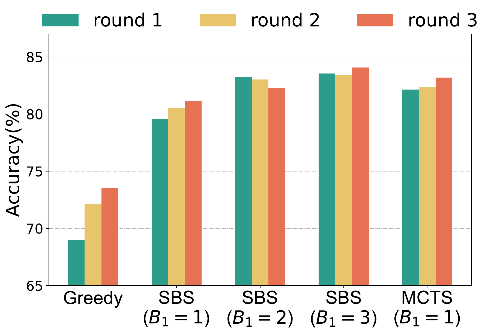
<figcaption>GSM8K (In-Domain)</figcaption>
</figure>
<figure>
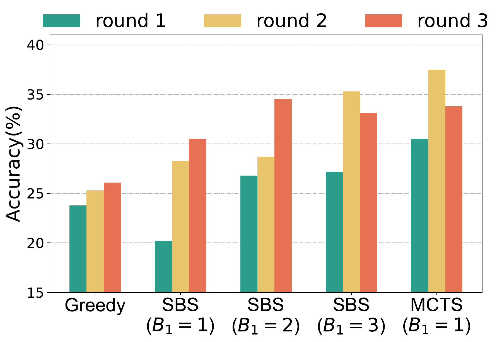
<figcaption>OCWCourses (Out-of-Domain)</figcaption>
</figure>
<figcaption>Comparison of Different Inference Strategies (Other datasets).</figcaption>
</figure>

In this experiment, we can draw similar conclusions as in Figure <a href="#fig:infer_methods" data-reference-type="ref" data-reference="fig:infer_methods">7</a>. With the progress of iteration, there is a significant enhancement in the model’s performance, especially between the first and second rounds, as shown in Figure <a href="#fig:app_inference_strategy" data-reference-type="ref" data-reference="fig:app_inference_strategy">10</a>. Furthermore, we observe that the performance of various inference strategies on the OCWCourses slightly differs from the other three datasets. This variation can be attributed to the fact that OCWCourses is a mathematical dataset in the fields of physics and chemistry. Nonetheless, our method still significantly enhances the model’s reasoning capabilities on such datasets overall.

## More Analysis of Value Model [sec:app_value_model]

<figure id="fig:value_dist">
<figure>
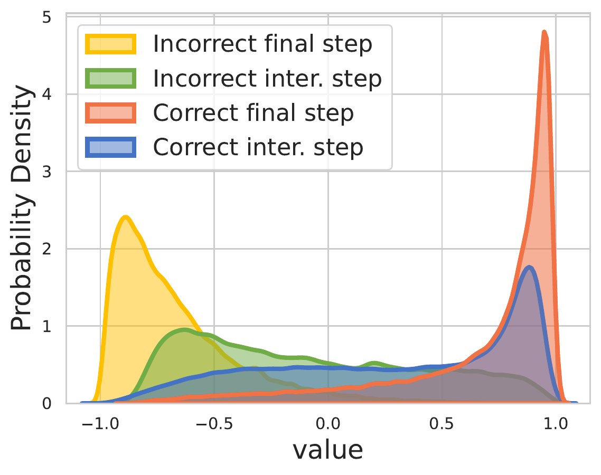
</figure>
<figure>
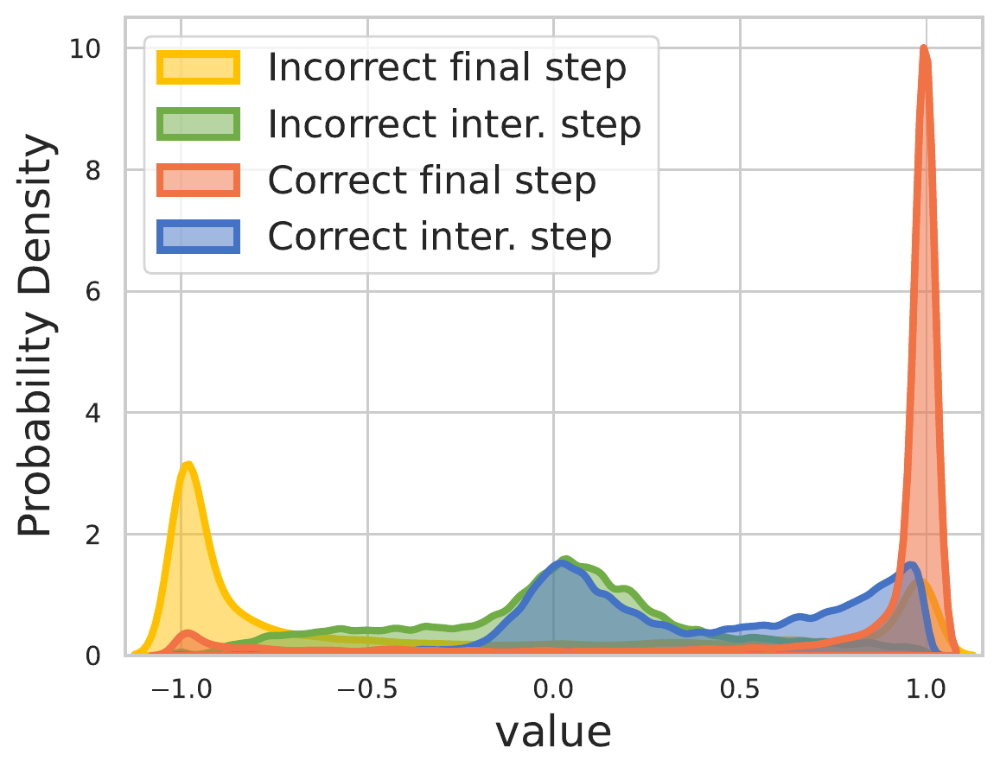
</figure>
<figcaption>(Left) Fitted distribution of <strong>value predictions</strong> of sampled solutions on the training set. (Right) Fitted distribution of <strong>value predictions</strong> of sampled solutions on the test set. "Incorrect inter. step" denotes the state value <span class="math inline"><em>V</em>(<strong>s</strong>)</span> of an intermediate step within an incorrect solution.</figcaption>
</figure>

In addition to the discussion regarding the value model in Section <a href="#sec:analysis_value_model" data-reference-type="ref" data-reference="sec:analysis_value_model">4.5</a>, we have also specifically analyzed the overall distribution of the predicted state values \\(V(\mathbf{s})\\) by the value model for both the intermediate and final steps in correct/incorrect solutions, as illustrated in Figure <a href="#fig:value_dist" data-reference-type="ref" data-reference="fig:value_dist">11</a>. "Final step" refers to the scoring of the entire solution in the last step, representing the value model’s overall assessment.

In the left panel of Figure <a href="#fig:value_dist" data-reference-type="ref" data-reference="fig:value_dist">11</a>, we plot the fitted distribution of the state values for both intermediate and final steps as predicted by the value model, during the process of solution generation on the training set. For correct and incorrect solutions, the value model’s overall assessment is highly accurate, which is distinctly skewed towards 1 and -1, respectively. Notably, "Incorrect inter. Step" represents the intermediate steps of an incorrect solution, rather than incorrect intermediate steps. Therefore, "Incorrect inter. Step" may also contain some correct processes, which explains why its distribution crosses over 0. Overall, the distribution of the value model on the training set aligns very well with intuition, which aids in identifying higher-quality solutions in MCTS.

In the right panel of Figure <a href="#fig:value_dist" data-reference-type="ref" data-reference="fig:value_dist">11</a>, we plot the distribution of state value \\(V(\mathbf{s})\\) predicted by the value model on the test set. It can be clearly seen that the value model accurately distinguished between correct and incorrect solutions, which explains why the performance of step-level beam search significantly surpasses that of greedy inference. The value model aids the policy model in navigating more efficient solutions, rather than relying solely on prior probabilities. Additionally, due to the fact that incorrect solutions may contain correct steps, their distribution is primarily concentrated near 0. The intermediate steps of correct solutions exhibit a bimodal distribution, with peaks concentrated near 0 and 1. This can be attributed to the fact that even correct solution steps may contain some errors, such as coding mistakes. Therefore, in conjunction with the analysis in Section <a href="#sec:analysis_value_model" data-reference-type="ref" data-reference="sec:analysis_value_model">4.5</a>, we believe that our value model can effectively distinguish between correct and incorrect solutions, aiding the policy model in finding better solution paths.

## More Analysis of Problem Solving Rate of MCTS in Each Round [app:analysis_round]

<figure id="fig:solver_rate_train">
<figure id="fig:diff_level">

<figcaption>Difficulty Level</figcaption>
</figure>
<figure id="fig:sub_type">
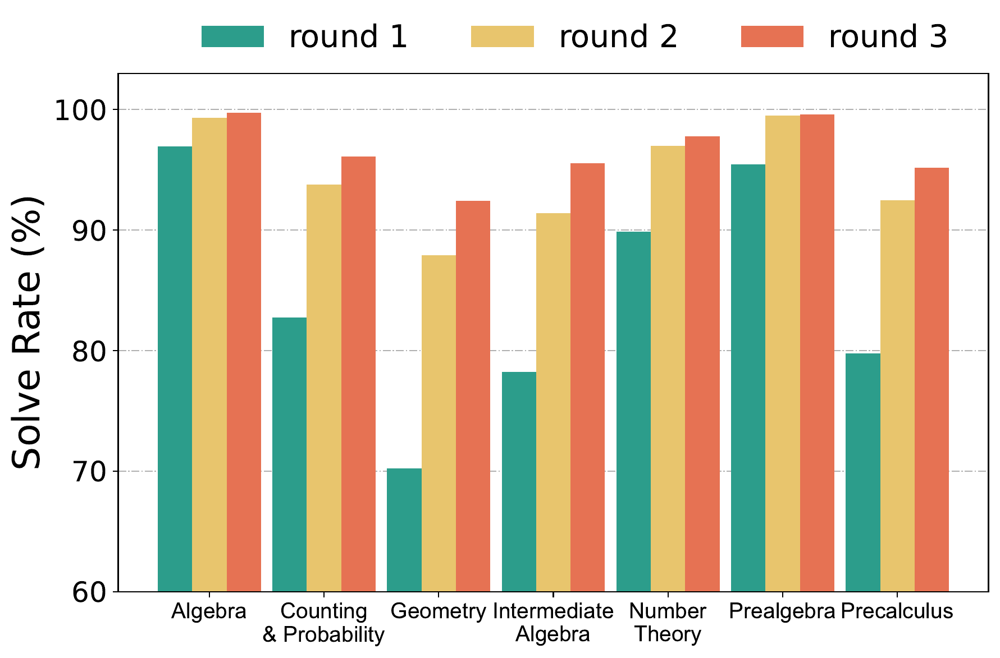
<figcaption>Subject Type</figcaption>
</figure>
<figcaption>Problem Solving Rate on MATH Training Set</figcaption>
</figure>

<figure id="fig:solver_rate_test">
<figure id="fig:diff_level_test">
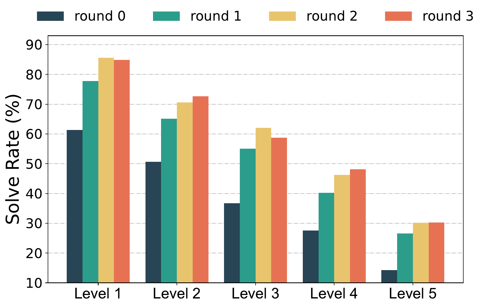
<figcaption>Difficulty Level</figcaption>
</figure>
<figure id="fig:sub_type_test">
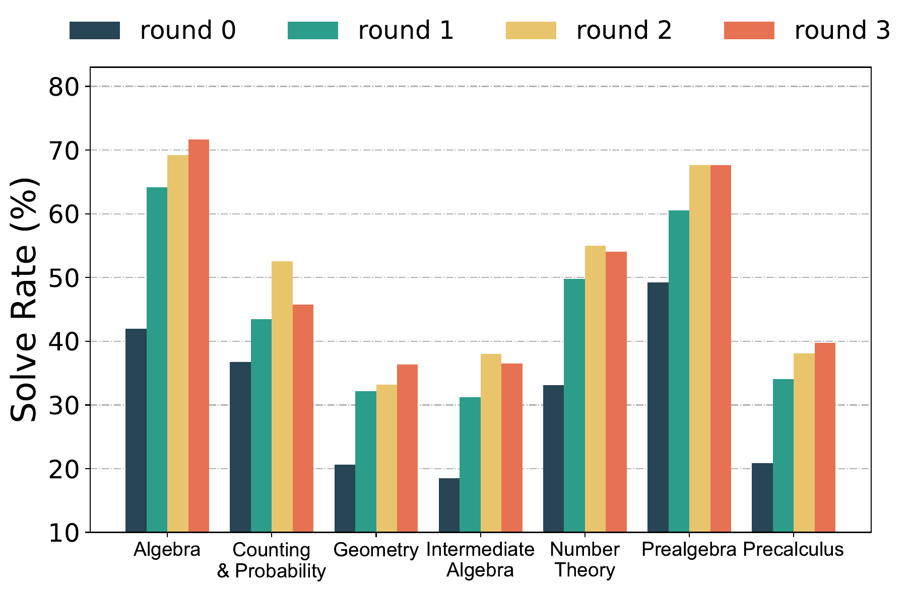
<figcaption>Subject Type</figcaption>
</figure>
<figcaption>Problem Solving Rate on MATH Test Set</figcaption>
</figure>

In this experiment, we evaluate the successful solving rate of MCTS across various rounds. Utilizing the MATH dataset, which categorizes each problem by difficulty level and subject type, we compute the problem-solving rate across different categories and difficulty levels. For our training set, we count the instances wherein problems are successfully solved along any of the paths within the 10 constructed trees. As illustrated in Figure <a href="#fig:diff_level" data-reference-type="ref" data-reference="fig:diff_level">12</a>, it becomes evident that MCTS achieves greater success in solving more challenging problems in subsequent rounds. Similarly, Figure <a href="#fig:sub_type" data-reference-type="ref" data-reference="fig:sub_type">13</a> indicates that, in later rounds, MCTS consistently demonstrates an improved capability to solve a broader array of problems across different subjects.

For the test set depicted in Figure <a href="#fig:solver_rate_test" data-reference-type="ref" data-reference="fig:solver_rate_test">17</a>, we include the results from round 0, which correspond to the performance of our "prompt 2-shot" in Table <a href="#tab:main_result" data-reference-type="ref" data-reference="tab:main_result">[tab:main_result]</a>. Unlike the training set, we observe that the improvement observed in round 3 is not consistent across different levels and subjects, even though the overall accuracy is slightly increased. In fact, for easier problems, the performance in round 3 actually declines. This is the reason we terminate our iterative training process after round 3.

## Problem Solving Rate for Each LLM in Training Set

<div id="tab:app_solve_rate_model" markdown="1">

<table>
<caption>Solving Rate for Each LLM in Training Set. <span class="math inline">$^\S$</span>Since MARIO is a SFT model and already possesses the capability to follow instructions, we opted to skip its first round.</caption>
<thead>
<tr>
<th style="text-align: left;">Model</th>
<th colspan="2" style="text-align: center;">Round 1</th>
<th colspan="2" style="text-align: center;">Round 2</th>
<th colspan="2" style="text-align: center;">Round 3</th>
</tr>
</thead>
<tbody>
<tr>
<td style="text-align: left;"><span>2-7</span></td>
<td style="text-align: center;">GSM8K</td>
<td style="text-align: center;">MATH</td>
<td style="text-align: center;">GSM8K</td>
<td style="text-align: center;">MATH</td>
<td style="text-align: center;">GSM8K</td>
<td style="text-align: center;">MATH</td>
</tr>
<tr>
<td style="text-align: left;">DeepseekMath-base-7B <span class="citation" data-cites="shao2024deepseekmath"></span></td>
<td style="text-align: center;">97.24%</td>
<td style="text-align: center;">83.93%</td>
<td style="text-align: center;">99.90%</td>
<td style="text-align: center;">93.73%</td>
<td style="text-align: center;">99.94%</td>
<td style="text-align: center;">95.61%</td>
</tr>
<tr>
<td style="text-align: left;">Llama3-base-8B <span class="citation" data-cites="llamma3blog"></span></td>
<td style="text-align: center;">94.48%</td>
<td style="text-align: center;">78.42%</td>
<td style="text-align: center;">99.07%</td>
<td style="text-align: center;">89.77%</td>
<td style="text-align: center;">99.92%</td>
<td style="text-align: center;">94.50%</td>
</tr>
<tr>
<td style="text-align: left;">MARIO<span class="math inline">$^\S$</span> <span class="citation" data-cites="liao2024mario"></span></td>
<td style="text-align: center;">-</td>
<td style="text-align: center;">-</td>
<td style="text-align: center;">99.91%</td>
<td style="text-align: center;">94.51%</td>
<td style="text-align: center;">99.97%</td>
<td style="text-align: center;">94.79%</td>
</tr>
</tbody>
</table>

</div>

We further discuss the problem solving rates of different models in each round, as shown in Table <a href="#tab:app_solve_rate_model" data-reference-type="ref" data-reference="tab:app_solve_rate_model">7</a>. **First**, given that the problems in the GSM8K dataset are relatively simple, the corresponding solution rates are higher, even in the first round. Despite the challenging nature of MATH, its problem-solving rate increases with more iterations, indicating continuous improvement in the model’s performance. **Secondly**, there are also noticeable differences in the problem-solving rates between different models. Since the SFT model (MARIO) is fine-tuned on high-quality data, it exhibits the best performance. Furthermore, the math domain-specific pre-trained LLM (DeepseekMath-base-7B) significantly outperforms general-purpose pre-trained LLM (Llama3). This phenomenon is intuitive because domain-specific pre-trained LLMs possess more specialized knowledge. **Finally**, we note that in the third round, the solution rates of each model are quite similar. However, the final performance of the models differs significantly, as shown in Table <a href="#tab:additional_result" data-reference-type="ref" data-reference="tab:additional_result">6</a>. This discrepancy can be attributed to variations in the quality of solutions generated by different models. Generally speaking, the more relevant knowledge is embedded within LLMs, the higher the quality of problem-solving solutions that will be generated. This explains why domain-specific pretrained models significantly outperform general-purpose pretrained models. However, the advantage of our proposed AlphaMath lies in its ability to significantly enhance the performance of existing models without relying on high-quality data annotated by GPT-4 or humans. Even with a weaker general-purpose pre-trained model, AlphaMath achieves a remarkable +20 points improvement, as shown in Table <a href="#tab:additional_result" data-reference-type="ref" data-reference="tab:additional_result">6</a>. Furthermore, our AlphaMath enables a domain-specific pre-trained model to achieve comparable or even superior results compared to state-of-the-art SFT models.

# Implementation Details [sec:appendix_implementation_details]

## Definitions of various elements in MCTS [sec:appendix_definition_mcts]

#### State

The state \\(\mathbf{s}_t\\) is defined as a partial solution, consisting of the initial prompt (question) and all actions taken along the Monte Carlo tree search path from the root node to the current node, as shown in Eq. <a href="#eq:policy" data-reference-type="ref" data-reference="eq:policy">[eq:policy]</a>.

#### Node

Nodes are used to record information, such as the action (step) \\(\mathbf{a}_t\\), the value predicted by the value model \\(V_{\phi}\\), the state-action value \\(Q\\) from MCTS, depth, visiting counts, and etc. Each node is defined to only contain a single step.

#### Action (Steps)

Following `\citet{liao2024mario}`{=latex}, we define two types of actions (steps) \\(\mathbf{a}_t\\): \\(\mathcal{C}\\)-steps and \\(\mathcal{A}\\)-steps. Each node contains only one type of action, and \\(\mathcal{A}\\)-steps typically appear at the end, as shown in Figure <a href="#fig:app_case_study_train_mcts_round0" data-reference-type="ref" data-reference="fig:app_case_study_train_mcts_round0">21</a>. \\(\mathcal{C}\\)-step represents code execution, which is composed of textual analysis, code snippets, and execution results. The textual analysis and code snippets are generated by the policy model (LLM), while the execution results are the outputs returned by the Python code interpreter. \\(\mathcal{A}\\)-step represents the summary of the answer, which is composed of text analysis and predicted answers. Both the text analysis and predicted answers are generated by the policy model. We organize these two steps in the following XML format:

<div class="center" markdown="1">

<div class="tcolorbox" markdown="1">

\<step\>\n\<p\>\n`{textual analysis}`\n\</p\>\n\<code\>\n`{code snippets}`\n\</code\>\n\<p\>\n`{code output}`\n\</p\>\n\</step\>

</div>

</div>

<div class="center" markdown="1">

<div class="tcolorbox" markdown="1">

\<step\>\n\<p\>\n`{textual analysis}`\n\</p\>\n\<p\>\n`Final Answer:{predicted answer}`\n\</p\>\n\</step\>

</div>

</div>

## Solution Filtering Algorithm [sec:app_solution_selection]

After solution generation via MCTS, we randomly sample the correct and incorrect solutions of each question for training. During this process, we found that the generated solutions might suffer from issues such as hallucinations `\cite{ji2023survey}`{=latex}. Hence, we propose a solution filtering algorithm to optimize the solution selection.

<figure id="alg:solution_filter">
<div class="algorithmic">
<p>ALGORITHM BLOCK (caption below)</p>
<p><br />
Require Sampled solutions <span class="math inline">𝒮</span>.<br />
Ensure Candidate correct solutions <span class="math inline">𝒮<sub><em>c</em></sub></span>, candidate incorrect solutions <span class="math inline">𝒮<sub><em>e</em></sub></span>.<br />
<span class="math inline">𝒮<sub><em>c</em></sub> = [ ]</span>, <span class="math inline">𝒮<sub><em>e</em></sub> = [ ]</span> # comment: <span>Initialization</span><br />
<strong>For</strong> <span><span class="math inline"><em>s</em></span> in <span class="math inline">𝒮</span></span><br />
<strong>If</strong> <span><span class="math inline"><em>s</em></span> not in <span class="math inline">𝒮<sub><em>c</em></sub></span> or <span class="math inline"><em>s</em></span> not in <span class="math inline">𝒮<sub><em>e</em></sub></span></span> # comment: <span>De-duplication</span><br />
<strong>If</strong> <span>Code Errors persist across All Steps in <span class="math inline"><em>s</em></span></span><br />
<strong>continue</strong> # comment: <span>Eliminating solutions where errors permeate all steps.</span><br />
EndIf<br />
<strong>If</strong> <span><span class="math inline"><em>s</em></span> is incorrect solution</span><br />
Add <span class="math inline"><em>s</em></span> to <span class="math inline">𝒮<sub><em>e</em></sub></span> # comment: <span>InCorrect Solution</span><br />
Else<br />
<span class="math inline">flag ← False</span><br />
<strong>For</strong> <span>each output of code <span class="math inline"><em>o</em></span> in <span class="math inline"><em>s</em></span></span><br />
<strong>If</strong> <span><strong>is_equiv</strong>(<span class="math inline"><em>o</em></span>, predict answer in <span class="math inline"><em>s</em></span>)</span> # comment: <span>is_equiv is the evaluation toolkit <span class="citation" data-cites="zhang2024mario"></span>.</span><br />
<span class="math inline">flag ← True</span><br />
<strong>Break</strong><br />
EndIf<br />
EndFor<br />
<strong>If</strong> <span>flag</span><br />
Add <span class="math inline"><em>s</em></span> to <span class="math inline">𝒮<sub><em>c</em></sub></span> # comment: <span>Level 1 Correct Solution</span><br />
Else<br />
<strong>If</strong> <span>code is correct at every step in <span class="math inline"><em>s</em></span></span><br />
Add <span class="math inline"><em>s</em></span> to <span class="math inline">𝒮<sub><em>c</em></sub></span> # comment: <span>Level 2 Correct Solution</span><br />
Else<br />
Add <span class="math inline"><em>s</em></span> to <span class="math inline">𝒮<sub><em>c</em></sub></span> # comment: <span>Level 3 Correct Solution</span><br />
EndIf<br />
EndIf<br />
EndIf<br />
EndIf<br />
EndFor</p>
</div>
<figcaption>Solution Filtering</figcaption>
</figure>

Algorithm <a href="#alg:solution_filter" data-reference-type="ref" data-reference="alg:solution_filter">18</a> outlines the process of our solution filtering algorithm. We initially deduplicate and remove the solutions where code errors are present across all steps (Lines 3-5). As indicated in Figure <a href="#fig:example_all_code_error" data-reference-type="ref" data-reference="fig:example_all_code_error">[fig:example_all_code_error]</a>, the solutions that present code errors in all steps yet yield a correct final answer are evidently hallucinations. To preserve the diversity of incorrect solutions, we refrain from excessive processing, which aids the value model in being exposed to a wide variety of incorrect solutions (Lines 6-7). Furthermore, to filter out higher-quality yet diverse correct solutions, we categorize them into different levels. We consider the solutions where the predicted answer is consistent with the code output as level 1 correct solutions because the model has generated code and understood the output correctly (Lines 9-15). Then, we observe that for some questions, the quality of a solution cannot be solely gauged by the consistency between the code’s output and the predicted answer (for which we provide an example in Figure <a href="#fig:example_level2_solution" data-reference-type="ref" data-reference="fig:example_level2_solution">20</a>). Therefore, we view the solutions with entirely correct code as level 2 correct solutions (Lines 17-18). Generating correct code to some extent proves that the model has a correct understanding of this question. Finally, we consider the remaining correct solutions as level 3 solutions (Line 20).

In general, Algorithm <a href="#alg:solution_filter" data-reference-type="ref" data-reference="alg:solution_filter">18</a> offers a method for swiftly filtering solutions. By categorizing solutions into different levels, we prioritize higher-level solutions for each problem. We provide several examples to intuitively illustrate the necessity and rationality of Algorithm <a href="#alg:solution_filter" data-reference-type="ref" data-reference="alg:solution_filter">18</a>, as shown in Figure <a href="#fig:example_all_code_error" data-reference-type="ref" data-reference="fig:example_all_code_error">[fig:example_all_code_error]</a> <a href="#fig:example_level1_solution" data-reference-type="ref" data-reference="fig:example_level1_solution">19</a> <a href="#fig:example_level2_solution" data-reference-type="ref" data-reference="fig:example_level2_solution">20</a>.

<div class="tcolorbox" markdown="1">

<div class="small" markdown="1">

````
<question>
What is the sum of all positive integers \$\textbackslash{}nu\$ for which \$\textbackslash{}mathop\{\text{lcm}\}[\textbackslash{}nu,20]
=60\$?
</question>
<step>
<p>
To find the sum of all positive integers \$\textbackslash{}nu\$ for which \$\textbackslash{}mathop\{\text{lcm}\}[\textbackslash{}nu,20]
=60\$, we need to find the values of \$\textbackslash{}nu\$ that satisfy the equation. We can
start by simplifying the equation by dividing both sides by 20, which gives us
\$\textbackslash{}mathop\{\text{lcm}\}[\textbackslash{}nu,1]=3$. Since $\textbackslash{}mathop\{\text{lcm}\}[1,1]=1$, we can see that \$\textbackslash{}nu\$ must
be equal to 3. Therefore, the sum of all positive integers \$\textbackslash{}nu\$ for which 
\$\textbackslash{}mathop\{\text{lcm}\}[\textbackslash{}nu,20]=60\$ is 3.
</p> 
<code>
```python
from sympy import lcm
# Define the equation
equation = lcm(nu, 20) == 60
# Solve the equation
solution = solve(equation, nu)
# Find the sum of the solutions
sum_of_solutions = sum(solution)
print(sum_of_solutions)
``` 
</code>
<output>
\textcolor{blue}{AttributeError: 'int' object has no attribute 'is_commutative'}
</output>
</step>
<step>
<p>
From the result, we can see that there is an error. This is because the `solve`
function is not able to solve the equation with the `lcm` function. We need
to find a different way to solve the equation.
</p>
<code>
```python
from sympy import factorint, lambdify
# Define the equation
equation = lcm(nu, 20) == 60
# Factorize the numbers in the equation
factorized_equation = equation.subs(lcm(nu, 20), lcm(factorint(nu),
        factorint(20)))
# Simplify the equation
simplified_equation = simplify(factorized_equation)
# Evaluate the equation
evaluated_equation = eval(simplified_equation.str)
# Solve the equation
solution = solve(evaluated_equation, nu)
# Find the sum of the solutions
sum_of_solutions = sum(solution)
print(sum_of_solutions)
```
</code>
<output>
\textcolor{blue}{AttributeError: 'bool' object has no attribute 'subs'}
</output>
</step>
\textcolor{red}{similar error repeated in subsequent steps...}
<step>
<p>
From the result, we can see that there is an error. This is because the `subs`
function is not able to substitute the `lcm` function with the `factorint`
function. We need to find a different way to factorize the numbers in
the equation.
</p>
<p>
\textcolor{blue}{Final Answer: $126$}
</p>
</step>
````

</div>

</div>

<span id="fig:example_all_code_error" label="fig:example_all_code_error"></span>

<figure id="fig:example_level1_solution">
<div class="tcolorbox">
<div class="small">
<pre data-commandchars="\\\{\}"><code>&lt;question&gt;
What is the value of \$525^2 - 475^2\$?
&lt;/question&gt;
&lt;step&gt;
&lt;p&gt;
To find the value of \$525^2 - 475^2\$, we can use the difference of squares
formula: \$a^2 - b^2 = (a + b)(a - b)\$.
&lt;/p&gt;
&lt;code&gt;
```python
a = 525
b = 475
# Use the difference of squares formula
# value = (a + b) * (a - b)
print(value)
```
&lt;/code&gt;
&lt;output&gt;
\textcolor{blue}{50000}
&lt;/output&gt;
&lt;/step&gt;
&lt;step&gt;
&lt;p&gt;
The result from the Python code gives us the value of \$525^2 - 475^2\$ as \$50000\$.
&lt;/p&gt;
&lt;p&gt;
Final Answer: \textcolor{blue}{\$50000\$}
&lt;/p&gt;
&lt;/step&gt;</code></pre>
</div>
</div>
<figcaption>An example of the level 1 correct solution. In this example, the model generates the correct code and provides a correct answer based on the output of this code. We regard such solutions as dependable and categorize this type of solution as the level 1 correct solutions.</figcaption>
</figure>

<figure id="fig:example_level2_solution">
<div class="tcolorbox">
<div class="small">
<pre data-commandchars="\\\{\}"><code>&lt;question&gt;
How many \$y\$-intercepts does the graph of the parabola \$x = 2y^2 - 3y + 7\$ have?
&lt;/question&gt;
&lt;step&gt;
&lt;p&gt;
To find the \$y\$-intercepts of a parabola, we need to set \$x = 0\$ and solve for
\$y\$. In this case, we have \$x = 2y^2 - 3y + 7\$, so we need to solve the quadratic
equation \$2y^2 - 3y + 7 = 0\$.
&lt;/p&gt;
&lt;code&gt;
```python
from sympy import solve, symbols
# define variables
y = symbols(&#39;y&#39;)
# solve the quadratic equation
solution = solve(2 * y**2 - 3 * y + 7, y)
print(solution)
```
&lt;/code&gt;
&lt;output&gt;
[3/4 - sqrt(47)*I/4, 3/4 + sqrt(47)*I/4]
&lt;/output&gt;
&lt;/step&gt;
&lt;step&gt;
&lt;p&gt;
The quadratic equation \$2y^2 - 3y + 7 = 0\$ has \textcolor{blue}{no real solutions}, which means
the parabola \textcolor{blue}{has no \$y\$-intercepts}. We can also see this from the complex
solutions for \$y\$ in the previous step.
&lt;/p&gt;
&lt;p&gt;
Final Answer: $0$
&lt;/p&gt;
&lt;/step&gt;</code></pre>
</div>
</div>
<figcaption>An example of the level 2 correct solution. In this example, the consistency between the code’s output and the answer does not adequately measure the quality of the solution. Therefore, we categorize solutions that are entirely correct in terms of the code as the level 2 correct solutions.</figcaption>
</figure>

## Parameter Details

**For the solution generation via MCTS**, we set \\(c_{\text{puct}}=1.25\\), set the temperature between \\(0.6\\) to \\(1.2\\), limit the maximum tree depth to 8, and allow each node to expand 5 child nodes (\\(B_2=5\\)), and a maximum of 40 simulations (\\(N=40\\)). Since MARIO `\citep{liao2024mario}`{=latex} already has the ability to follow instructions, we set \\(K=2\\) for MARIO. For DeepseekMath-Base `\citep{shao2024deepseekmath}`{=latex} and Llama3 `\citep{llamma3blog}`{=latex}, we set \\(K=3\\). In each round, we build 10 trees for each question-answer pair and randomly sample at most 4 correct and 4 incorrect solution processes for training. In this setting, the ratio of positive to negative examples is approximately 1:1, and the count of positive examples varies between 57k to 59k for each round.

**For supervised fine-tuning**, we set the learning rate of 4e-5, batch size of 1024, the weight of the value loss to 0.01 or 0.0005 (for Llama3 `\citep{llamma3blog}`{=latex}), and train the model for 10 epochs. We employ the AdamW optimizer `\citep{loshchilov2019decoupled}`{=latex} and the cosine learning rate scheduler with the warmup rate set to 0.03. More hyperparameter details can be found in Table <a href="#tab:key_param" data-reference-type="ref" data-reference="tab:key_param">8</a>.

**For baselines**, the results recorded in Table <a href="#tab:main_result" data-reference-type="ref" data-reference="tab:main_result">[tab:main_result]</a> come from corresponding published papers.

<div id="tab:key_param" markdown="1">

| **Hyperparameter** | **Value** |  |  |  |  |
|:---|:---|:---|:---|:---|:---|
| \\(c_{\text{puct}}\\) | 1.25 |  |  |  |  |
| \\(K\\) | 3 or 2 (for MARIO `\citep{liao2024mario}`{=latex}) |  |  |  |  |
| Weight of value loss \\(\beta\\) | \\(0.1\\) or 0.0005 (for Llama3 `\citep{llamma3blog}`{=latex}) |  |  |  |  |
| \\(B_1\\) | \\(\{1,3\}\\) |  |  |  |  |
| \\(B_2\\) | 5 |  |  |  |  |
| Simulations \\(N\\) | 40 |  |  |  |  |
| Temperature | \\(\{0.6, 1.0, 1.2\}\\) |  |  |  |  |
| max depth (max steps) \\(T\\) | 8 |  |  |  |  |
| Batch size | 1024 |  |  |  |  |
| Optimizer type | AdamW `\citep{loshchilov2019decoupled}`{=latex} |  |  |  |  |
| Learning rate | 4e-5 |  |  |  |  |
| lr scheduler type | cosine |  |  |  |  |
| Warmup ratio | 0.03 |  |  |  |  |
| Epochs | 10 |  |  |  |  |
| Weight decay | 0\. |  |  |  |  |

Key hyperparameters of AlphaMath

</div>

## Policy-Value model Details

Unlike previous work `\citep{zhu2023solving,yu2023outcome,feng2023alphazero,chen-etal-2024-seer}`{=latex}, the value model is trained separately to assist the policy model. In this study, we integrate the value model into the policy model by appending a linear layer, as illustrated in Figure <a href="#fig:pipeline" data-reference-type="ref" data-reference="fig:pipeline">1</a>. Since most of the existing LLMs adhere to decode-only architecture, we utilize the last token as the representation of the entire reasoning step, similar to the role of “\[CLS\]” token in BERT `\citep{devlin2019bert}`{=latex}. In our case, it is typically “\</step\>”, which ensures that the representation of the reasoning step will not be affected by the last token itself. The value model and the policy model share the majority of parameters, that is, they share the understanding of the reasoning steps. The value model assesses the expected returns based on the current reasoning step, while the policy model generates the next token.

## Datasets Details [sec:app_dataset]

<div id="tab:appendix_dataset_statistic" markdown="1">

| Dataset | OOD? | \# Training | \# Test |
|:---|:--:|:--:|:--:|
| GSM8K `\citep{gsm8kcobbe2021}`{=latex} | In-Domain | 7473 | 1319 |
| MATH `\citep{mathhendrycks2021}`{=latex} | In-Domain | 7500 | 5000 |
| GaoKao2023 `\citep{liao2024mario}`{=latex} | OOD | \- | 385 |
| OCWCourses `\citep{lewkowycz2022solving}`{=latex} | OOD | \- | 272 |

Datasets Statistics

</div>

Table <a href="#tab:appendix_dataset_statistic" data-reference-type="ref" data-reference="tab:appendix_dataset_statistic">9</a> describes the statistics of datasets in detail. The division of the training and test set follows the previous work `\citep{gsm8kcobbe2021,mathhendrycks2021}`{=latex}. GSM8K `\citep{gsm8kcobbe2021}`{=latex} is a multi-step mathematical reasoning dataset comprising high-quality, diverse grade school math word problems, created by human problem writers. MATH `\citep{mathhendrycks2021}`{=latex} is a dataset of challenging competitive mathematics problems. GaoKao2023 `\citep{liao2024mario}`{=latex} is a collection of mathematics problems from the 2023 Chinese National College Entrance Examination, the 2023 American Mathematics Competitions, and the 2023 American College Testing, while OCWCourses `\citep{lewkowycz2022solving}`{=latex} comprises a collection of 272 STEM problems aimed at the undergraduate level, requiring multi-step reasoning for most questions.

## Experiment Environments [sec:app_exp_env]

All experiments were conducted on Ubuntu 22.04 equipped with 8 \* NVIDIA A100 GPUs. Our code mainly depends on Python 3.11[^4] and PyTorch 2.1.2[^5]. We use our customized *Llama Factory* `\citep{zheng2024llamafactory}`{=latex} as the training framework and our customized *vLLM* `\citep{kwon2023efficient}`{=latex} as the inference framework[^6]. We trained all models with *DeepSpeed ZeRO Stage2* `\citep{rajbhandari2021zero}`{=latex} and *Flash-Attention 2* `\citep{dao2023flashattention}`{=latex}. The pre-trained language models are derived from *HuggingFace*[^7].

# Case Study

<figure id="fig:app_case_study_train_mcts_round0">

<figcaption>Example of Solution Generation via MCTS in Round 1. The <span style="background-color: case_green">green</span> and <span style="background-color: case_red">red</span> areas represent correct and incorrect nodes, respectively. The <span style="color: red">red text segment</span> indicates a specific error in the solution. In round 1, due to the value head being randomly initialized, the estimated values are not accurate; therefore, we have not presented the estimated value here. For the sake of clarity in our demonstration, we only display a subset of the original Monte Carlo tree and present each node in XML format (as detailed in Appendix <a href="#sec:app_prompt_round1" data-reference-type="ref" data-reference="sec:app_prompt_round1">12.2</a>), even though the format utilized in round 1 was Thought/Action/Action Input/Observation (as detailed in Appendix <a href="#sec:app_prompt_round0" data-reference-type="ref" data-reference="sec:app_prompt_round0">12.1</a>).</figcaption>
</figure>

#### Solution Generation in Round 1

Figure <a href="#fig:app_case_study_train_mcts_round0" data-reference-type="ref" data-reference="fig:app_case_study_train_mcts_round0">21</a> illustrates an example of solution generation on the MATH dataset via MCTS in round 1. We guide the pretrained model, such as DeepseekMath-Base `\cite{shao2024deepseekmath}`{=latex}, to generate solutions in the form of Thought/Action/Action Input/Observation, as shown in Sec. <a href="#sec:app_prompt_round0" data-reference-type="ref" data-reference="sec:app_prompt_round0">12.1</a>. For clarity of presentation, we only illustrate a subset of the nodes of the original Monte Carlo tree in Figure <a href="#fig:app_case_study_train_mcts_round0" data-reference-type="ref" data-reference="fig:app_case_study_train_mcts_round0">21</a>. As shown in Figure <a href="#fig:app_case_study_train_mcts_round0" data-reference-type="ref" data-reference="fig:app_case_study_train_mcts_round0">21</a>, the path \\((a)\rightarrow (c) \rightarrow (f)\\) represents a correct solution, whereas the other solutions contain errors to some degree. Node (b) attempts to solve the problem in a single step and proposes a correct thought. However, minor errors in the coding process ("k = 7 <span style="color: red">\*\*2</span> \* 3\*\*3" was mistakenly written as "k = 7 \* 3\*\*3") led to mistakes in all subsequent steps. Node (d) attempts a different approach from node (c), specifically trying to solve for \\(a\\) first, then proceeding to solve for \\(a^2\\). Although this process is more redundant compared to that of node (c), it is nonetheless a correct approach. However, in subsequent steps, we encountered errors of various forms. Firstly, within the node (g), the model mistakenly treats the output for (d) as equivalent to \\(a^2\\), leading directly to an output. At node (h), the model opts to calculate a relying on its capabilities; however, this results in a numerical error. From a holistic perspective, we observe that, aided by MCTS, the pretrained model attempts to solve the problem through various approaches. During this process, we naturally excavate the knowledge embedded within the model, thereby reinforcing the model’s understanding and application of this knowledge in subsequent training iterations. Furthermore, we collect the \\(Q\\)-values along the path to aid the model in enhancing its judgment of the correctness of the reasoning process.

#### Solution Generation in Round 3

Figure <a href="#fig:app_case_study_train_mcts_round3" data-reference-type="ref" data-reference="fig:app_case_study_train_mcts_round3">22</a> illustrates an example of solution generation via MCTS in round 3. Compared to round 1, the quality of the model in round 3 has significantly improved, resulting in more correct solutions. We observe that the code quality in round 3 is superior, containing more comprehensive annotations. This signifies an enhancement in the model’s understanding of the question and its coding proficiency. Furthermore, as illustrated by node (b), the model attempts to resolve the question in a single step, yielding solutions that are both shorter and more efficient.

<figure id="fig:app_case_study_train_mcts_round3">

<figcaption>Example of Solution Generation via MCTS in Round 3.</figcaption>
</figure>

# Error Analysis [sec:appendix_error_analysis]

In this section, we conducted a comprehensive error analysis on the MATH dataset to foster future work. We randomly select 100 error solutions for analysis. We find the following three types of errors.

#### (1) Numerical Errors (53%).

This is one of the main sources of errors. Within this category of errors, the model usually possesses the correct thought to solve the problem, but an error occurs during the numerical computation. The most common types of numerical computation errors arise from incorrect code generated by the model, which we will not discuss in detail. We have identified errors caused by numerical precision issues in Python, which we refer to as “numerical precision errors”. Here is an example:

```
\textcolor{red}{Question:} The first two terms of a sequence are $a_1 = 1$ and $a_2 = 
\textbackslash{}frac\{1\}\{\textbackslash{}sqrt3\}$. For $n\textbackslash{}ge 1$, \textbackslash{}begin\{align*\} a_\{n + 2\} = \textbackslash{}frac \{a_n +
a_\{n + 1\}\}\{1 - a_na_\{n + 1\}\}. \textbackslash{}end\{align*\}What is $a_\{2009\}$?

\textcolor{red}{The actual answer: } 0

\textcolor{red}{The thought of LLM: } To find $a_\{2009\}$, we need to calculate the first 2009
terms of the sequence. However, the sequence is defined recursively, so we
need to find a way to calculate the next term based on the previous two.

\textcolor{red}{The code written by LLM: }
import math
a1 = 1
a2 = 1 / math.sqrt(3)
for i in range(2, 2009):
    an = a2
    an_1 = a1
    a2 = (an + an_1) / (1 - an * an_1)
    a1 = an
print(a2)

\textcolor{blue}{The output of above code: }  -2.7267039150707353
```

In this example, the model possesses the correct thought of problem-solving and generates the correct Python code. But an incorrect answer was still produced. To ensure numerical precision, we found that the correct implementation should simplify the equation using “sympy”, as shown below:

```
import sympy as sp
a1 = 1
a2 = 1 / sp.sqrt(3)
for i in range(2, 2009):
    an = a2
    an_1 = a1
    a2 = \textcolor{red}{sp.simplify((an + an_1) /(1-an*an_1))}
    a1 = an
print(a2)

\textcolor{blue}{The output of above code: } 0
```

#### (2) Logical Errors (45%).

This is another major source of errors. In this type of error, the model usually ignores some details in the question, resulting in incorrect problem-solving approaches. Indeed, humans can also make similar mistakes due to carelessness. Here is an example:

```
\textcolor{red}{Question:} If $x$ and $y$ are numbers such that $(x + 3)(y-5) = 0$, what is
the \textcolor{blue}{smallest possible value} of $x^2+ y^2$?

\textcolor{red}{The thought of LLM: } To calculate the value of $x^2+ y^2$, we need to solve
the equation $(x + 3)(y-5) = 0$. After finding the solutions for $x$ and $y$,
we need to calculate $x^2+ y^2$ by substituting these values into the
expression $x^2 + y^2$.

\textcolor{red}{The code written by LLM: }
from sympy import symbols, solve
x, y = symbols('x y')
eq1 = Eq(x + 3, 0)
eq2 = Eq(y - 5, 0)
solution1 = solve(eq1, x)
solution2 = solve(eq2, y)
x_value = solution1[0]
y_value = solution2[0]
result = x_value**2 + y_value**2
print(result)
```

In this example, the model overlooked the requirement in the question to find the smallest possible value, resulting in the incorrect code and final answer.

#### (3) Other Errors (2%).

Aside from the two common types of errors mentioned above, we have also discovered other errors, which may stem from the ambiguity in the question statements or inaccuracies in the actual answer. Here is an example:

```
\textcolor{red}{Question:} For which values of $k$ does the quadratic $kx^2 - 3kx + 4k + 7
= 0$ have real roots?

\textcolor{red}{The actual answer: } [-4,0)

\textcolor{red}{The thought 1 of LLM: } To find the values of $k$ for which the quadratic
equation $kx^2 - 3kx + 4k + 7 = 0$ has real roots, we need to consider the
discriminant of the equation, which is $b^2 - 4ac$. If the discriminant is
positive, the equation has two distinct real roots, and if it is zero, the
equation has one real root.

\textcolor{red}{The code 1 written by LLM: }
from sympy import symbols, Eq, solve
k = symbols('k')
discriminant = (-3*k)**2 - 4*k*(4*k + 7)
print(discriminant)

\textcolor{blue}{The output of above code: } 9*k**2 - 4*k*(4*k + 7)

\textcolor{red}{The thought 2 of LLM: } The discriminant is $9k^2 - 4k(4k + 7)$. To find the
values of $k$ for which the discriminant is non-negative, we need to solve
the inequality $9k^2 - 4k(4k + 7) \textbackslash{}geq 0$.

\textcolor{red}{The code 2 written by LLM: }
from sympy import symbols, Eq, solve
k = symbols('k')
inequality = 9*k**2 - 4*k*(4*k + 7) >= 0
solutions = solve(inequality, k)
print(solutions)

\textcolor{blue}{The output of above code: } (-4 <= k) & (k <= 0)

\textcolor{red}{The predicted answer by LLM: } $[-4, 0]$
```

In this example, the model correctly solved the problem. However, due to the inaccuracy of the actual answer, the evaluation tool mistakenly deemed the model’s predicted answer as incorrect.

# Prompts [app:prompts]

We provide instructions and examples for generating solutions and performing reasoning. For the solution generation through MCTS in round 1, the pre-trained models such as DeepseekMath-base `\cite{shao2024deepseekmath}`{=latex} may not adhere to instructions. Therefore, we employ few-shot learning to guide the model towards producing outputs in the format of Thought/Action/Action Input/Observation. Subsequently, we train the model in our SFT XML format and proceed with both the solution generation and reasoning in this format. We provide specific details regarding two formats of prompts as follows:

## Prompt Example of MCTS in Round 1 [sec:app_prompt_round0]

We employ few-shot learning to steer pre-trained models toward performing mathematical reasoning, ensuring the output conforms to the format of Thought/Action/Action Input/Observation. As the following example shows, the text in black is prompt, and the text in <span style="color: red">red</span> is model generation.

````
You are a powerful agent with broad math knowledge and great Python 
programming skills, but not good at accurate calculation on math equations. 
Answer the math questions as best you can. You have access to the following 
tool:

Python_interpreter: A Python shell. Use this to execute python commands.

!!!Remember:

1. When solving math problem, you should think step by step, where each step 
includes 4 mini-steps Thought/Action/Action Input/Observation.

2. If some step requires accurate calculation (including but not limited to 
numerical calculation and symbolic deduction), you should write Python code and 
execute for accurate result. 

3. The most related Python packages include `math`, `sympy`, `scipy` and `numpy`. 

4. Please use the following template.

Question: the input question

Thought: the text analysis, and list the math equations if necessary

Action: the action to take, should be `Python\_interpreter`, or None

Action Input: the Python Code in markdown format (if Action is None, it is None), 
e.g.,
```python
import math
theta = math.pi / 4
some_var = math.cos(theta)
print(some_var)
```

Observation: the result of the action

... (this Thought/Action/Action Input/Observation can repeat N times)

Thought: the final analysis of the answer

Final Answer: the concise answer without verbose context

Here are some examples:

\textcolor{green}{<examples here>}

Now! It's your turn.

Question: Ben works 8-hour shifts in a furniture shop. It takes him 5 hours
to build 1 rocking chair.  How many chairs can he build in 10 days?

\textcolor{red}{Thought: To calculate the number of chairs Ben can build in 10 days, we need}
\textcolor{red}{to first determine how many hours he would work in 10 days and then use the}
\textcolor{red}{given information to calculate the number of chairs he can build in those hours.}

\textcolor{red}{Action: python_interpreter}

\textcolor{red}{Action Input: ```python}
\textcolor{red}{hours_per_day = 8}
\textcolor{red}{total_days = 10}
\textcolor{red}{hours_in_10_days = hours_per_day * total_days}

\textcolor{red}{chairs_per_hour = 1 / 5}
\textcolor{red}{chairs_in_10_days = hours_in_10_days * chairs_per_hour}
\textcolor{red}{print(chairs_in_10_days)}
\textcolor{red}{```}

\textcolor{red}{Observation: 16.0}

\textcolor{red}{Thought: I have calculated the number of chairs Ben can build in 10 days.}
\textcolor{red}{The number of chairs is 16.}

\textcolor{red}{Final Answer: 16}
````

## Prompt Example of MCTS after Round 1 [sec:app_prompt_round1]

To train the SFT model in executing mathematical reasoning, we utilize an XML format alongside zero-shot learning. This approach is adopted because the math-related pre-training corpora are predominantly harvested from the Internet, where HTML tags serve to distinguish various types of content, including text, equations, and code snippets. As the following example shows, the text in black is prompt, and the text in <span style="color: red">red</span> is model generation.

```
<question>Haley grows at the rate of 3 inches every year. If she is currently
20 inches tall, what will be her height after 10 years?</question>
\textcolor{red}{<step>} 
\textcolor{red}{<p>} 
\textcolor{red}{To calculate Haley's height after 10 years, I need to add 10 times the growth}
\textcolor{red}{rate of 3 inches to her current height.}
\textcolor{red}{</p>}
\textcolor{red}{<code>}
\textcolor{red}{```python}
\textcolor{red}{current_height = 20}
\textcolor{red}{growth_rate = 3}
\textcolor{red}{years = 10}
\textcolor{red}{future_height = current_height + (growth_rate * years)}
\textcolor{red}{print(future_height)}
\textcolor{red}{```}
\textcolor{red}{</code>}
\textcolor{red}{<output>}
\textcolor{red}{50}
\textcolor{red}{</output>}
\textcolor{red}{</step>}
\textcolor{red}{<step>}
\textcolor{red}{<p>}
\textcolor{red}{I have calculated Haley's height after 10 years. Haley will be 50 inches tall}
\textcolor{red}{after 10 years.}
\textcolor{red}{</p>}
\textcolor{red}{<p>}
\textcolor{red}{Final Answer: $50$}
\textcolor{red}{</p>}
\textcolor{red}{</step>}
```

[^1]: equal contribution

[^2]: Corresponding Author.

[^3]: Reward is \\(0\\) for non-terminal node, and reward is determined by the final answer in terminal node.

[^4]: <https://www.python.org/>

[^5]: <https://pytorch.org/>

[^6]: We have released our customized framework in our [Github Repository](https://github.com/MARIO-Math-Reasoning/Super_MARIO).

[^7]: <https://huggingface.co/>
