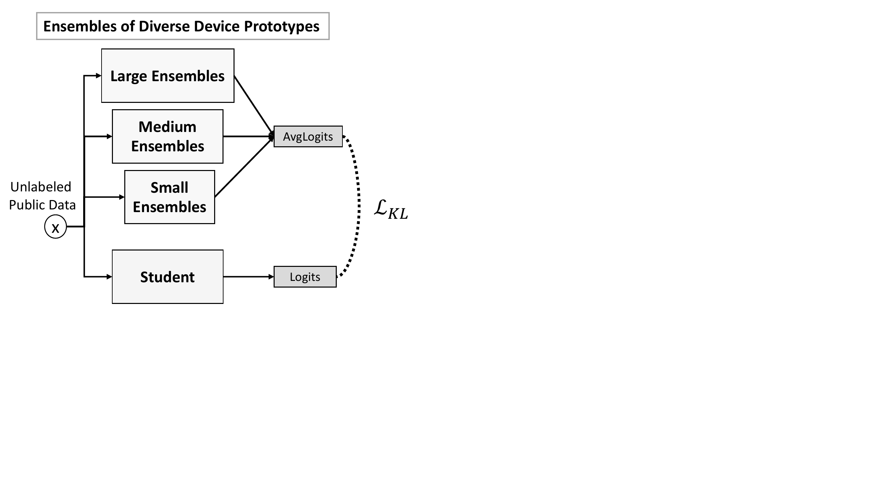
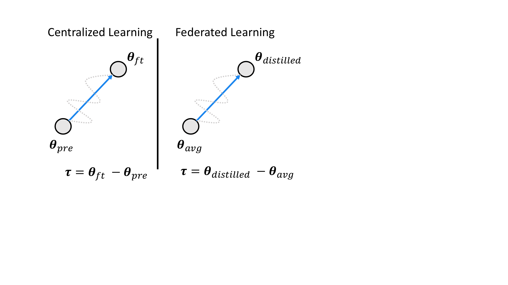
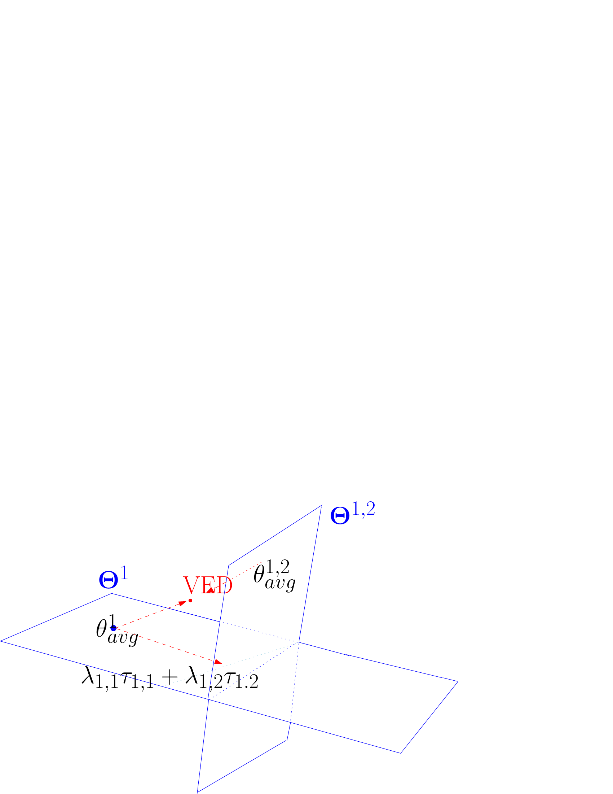
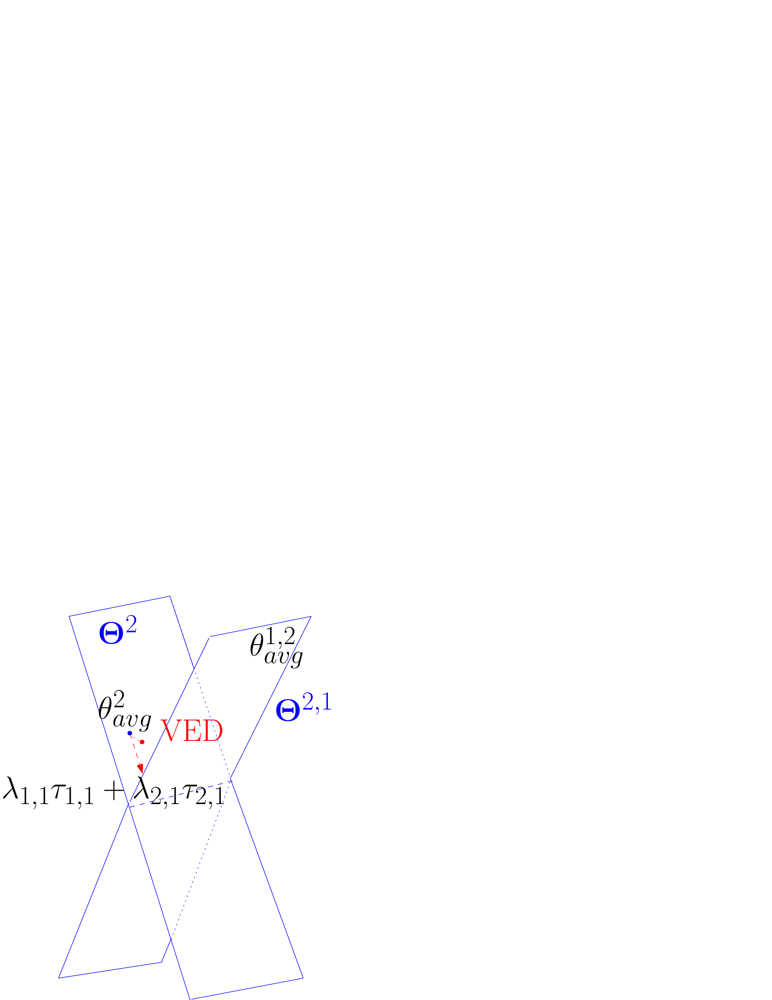
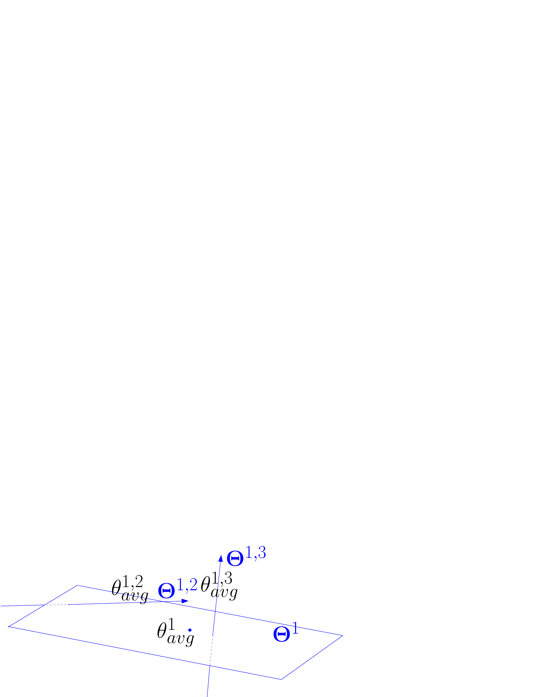
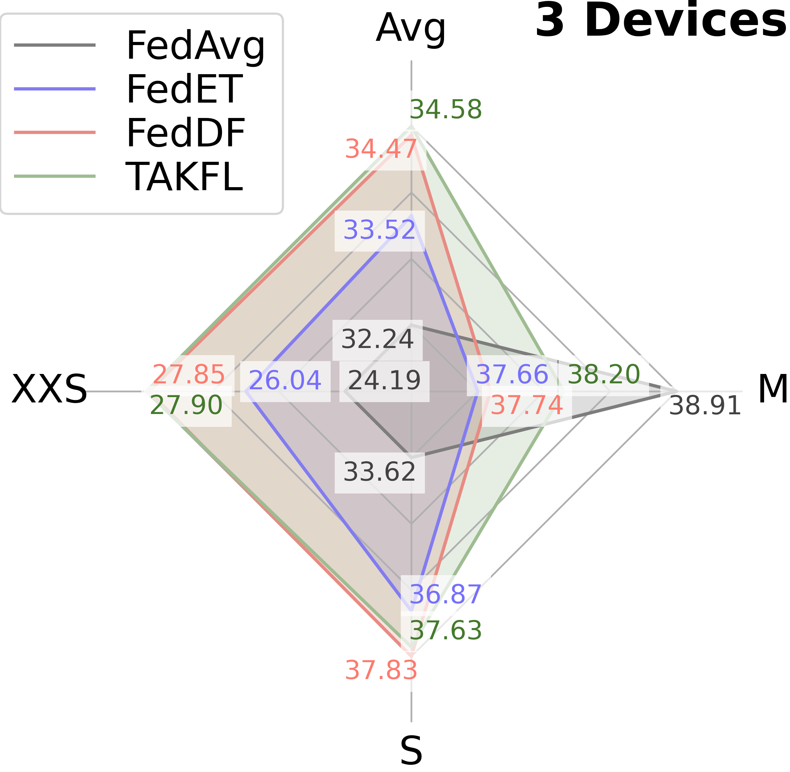
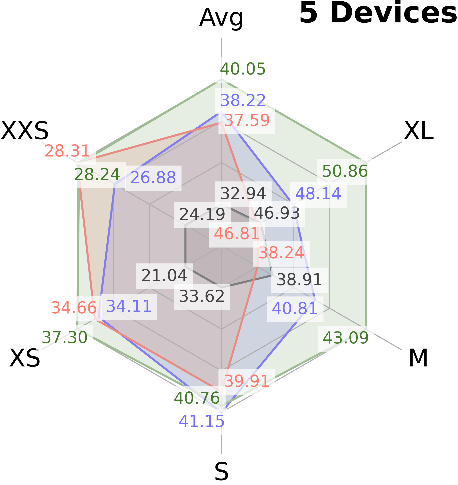
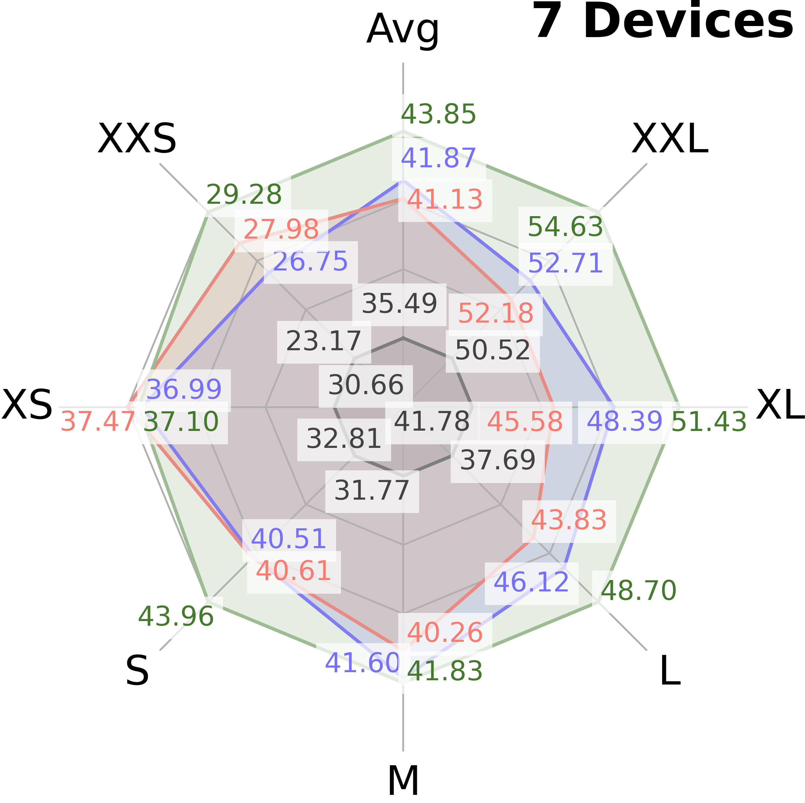

# Towards Diverse Device Heterogeneous Federated Learning via Task Arithmetic Knowledge Integration

## Abstract

Federated Learning (FL) has emerged as a promising paradigm for collaborative machine learning, while preserving user data privacy. Despite its potential, standard FL algorithms lack support for diverse heterogeneous device prototypes, which vary significantly in model and dataset sizes—from small IoT devices to large workstations. This limitation is only partially addressed by existing knowledge distillation (KD) techniques, which often fail to transfer knowledge effectively across a broad spectrum of device prototypes with varied capabilities. This failure primarily stems from two issues: the dilution of informative logits from more capable devices by those from less capable ones, and the use of a single integrated logits as the distillation target across all devices, which neglects their individual learning capacities and and the unique contributions of each device. To address these challenges, we introduce TAKFL, a novel KD-based framework that treats the knowledge transfer from each device prototype’s ensemble as a separate task, independently distilling each to preserve its unique contributions and avoid dilution. TAKFL also incorporates a KD-based self-regularization technique to mitigate the issues related to the noisy and unsupervised ensemble distillation process. To integrate the separately distilled knowledge, we introduce an adaptive *task arithmetic* knowledge integration process, allowing each student model to customize the knowledge integration for optimal performance. Additionally, we present theoretical results demonstrating the effectiveness of task arithmetic in transferring knowledge across heterogeneous device prototypes with varying capacities. Comprehensive evaluations of our method across both computer vision (CV) and natural language processing (NLP) tasks demonstrate that TAKFL achieves state-of-the-art results in a variety of datasets and settings, significantly outperforming existing KD-based methods. Our code is released at <https://github.com/MMorafah/TAKFL>.

[^1]

# Introduction

Federated Learning (FL) has rapidly gained traction as a promising approach to train machine learning models collaboratively across multiple devices, while preserving the privacy of user data. Standard federated learning methods, such as FedAvg `\cite{mcmahan2017communication}`{=latex}, however, are primarily designed for unrealistic *device-homogeneous* scenarios, where all devices are assumed to have identical compute resource and can train the same neural network architecture `\cite{li2020federated, mcmahan2017communication, wang2020tackling, karimireddy2020scaffold, li2021model, wang2020federated, liu2022deep}`{=latex}. Therefore, standard FL cannot support the participation of *heterogeneous devices*, all of which could significantly contribute to model training due to their unique and invaluable local datasets. To address this gap, knowledge distillation (KD) techniques have emerged as a promising approach to establish federation among heterogeneous device prototypes and facilitate knowledge transfer between them. In this approach, locally updated client models from different device prototypes, collectively termed as ensembles, serve as teachers to distill their knowledge into each device prototype’s server student model using an unlabeled public dataset.

Despite their success, however, existing KD-based methods for device heterogeneous FL are primarily designed for scenarios where device prototypes are in the same-size with similar capabilities, i.e. same model and dataset sizes. However, in practice, *device capabilities vary widely*, ranging from small devices like IoTs with small models and small datasets to large devices like workstations with large models and large datasets. <u>This diversity, often overlooked in the existing literature, results in device prototypes with varying strengths and information qualities.</u> Unfortunately, existing methods struggle to establish effective knowledge transfer in these challenging, real-world device heterogeneous settings, primarily due to two reasons: Existing methods often disregard the individual strengths and information quality of each device prototype’s ensembles and integrate their logits into a single distillation target. *This approach dilutes the richer, more informative logits from larger, more capable devices with less informative logits from smaller, less capable ones.* Additionally, these methods employ this single integrated distillation target to transfer knowledge across all different size student models. *This one-size-fits-all approach fails to provide customized knowledge integration based on the unique learning capacities of each student and the specific helpfulness of each device prototype’s ensembles.*

Moreover, the heterogeneous ensemble distillation process can inadvertently lead student models into erroneous learning directions, causing them to forget their self-knowledge acquired through averaged locally updated parameters. This issue arises primarily due to two reasons: The distillation process introduces noise, *as the ensembles’ logits are inferred on an unfamiliar public dataset*, distinct from their original training data. Additionally, the presence of data heterogeneity and the insufficient training of some ensembles, due to computational constraints, can further exacerbate this noise. The distillation process *lacks supervision from the actual private datasets, which are the ultimate learning objectives.* Consequently, these factors, combined with the limitations outlined earlier, result in *suboptimal knowledge transfer* in device heterogeneous settings. This underscores the urgent need for a more effective knowledge transfer framework.

In this paper, we introduce TAKFL, a novel *“**T**ask **A**rithmetic **K**nowledge Transfer **I**ntegration for **F**ederated **L**earning”* framework, designed to overcome the fundamental limitations in the existing methods and improve knowledge transfer in scenarios where device prototypes vary in size—both model and dataset—and consequently, in strength. TAKFL treats knowledge transfer from each device prototype’s ensembles as separate tasks, distilling them independently to ensure that each prototype’s unique contributions are accurately distilled without interference. To tackle the challenges associated with noisy and unsupervised ensemble distillation, we incorporate a KD-based self-regularization technique into this individual knowledge transfer process. Subsequently, to selectively integrate the separately distilled knowledge from heterogeneous prototypes’ ensembles, we introduce an adaptive *task arithmetic* knowledge integration method by extending the notion of task vectors from centralized learning to federated learning. Our approach enables the student model to strategically customize the knowledge integration process based on the quality of knowledge from each prototype’s ensembles and its intrinsic capacity, aiming to achieve optimal performance. We present theoretical results, grounded on the established theoretical learning properties of overparametrized neural networks, that conceptualize knowledge distillation as the allocation of device prototypes’ capacities to accurately fit the chosen logits. These results demonstrate the advantages of employing task arithmetic for knowledge transfer in terms of overall accuracy, coverage, and efficiency, as well as the adaptive knowledge integration based on the capacity of the student prototype. Furthermore, we comprehensively evaluate our method across both computer vision (CV) and natural language processing (NLP) tasks, utilizing various datasets and architectures, and demonstrate that TAKFL consistently achieves state-of-the-art (SOTA) performance.

The contribution of our paper is as follows:

1.  We formalize and review the important considerations of the problem statement of federated learning with heterogeneous device prototypes.

2.  We introduce TAKFL, a novel KD-based method designed to overcome the fundamental limitations of existing approaches, effectively facilitating knowledge transfer across diverse heterogeneous device prototypes with varying capabilities.

3.  We present the first theoretical model for device heterogeneous KD, and demonstrate the effectiveness and efficiency of TAKFL compared to the standard alternatives that do not adapt to the student’s self-knowledge quality and available learning capacity.

4.  Our comprehensive experimental evaluations on both CV and NLP tasks, spanning various datasets and architectures, reveal that TAKFL consistently achieves SOTA performance, outperforming existing KD-based methods.

<figure id="fig:main">
<figure id="fig:sub1">

<figcaption>Vanilla Ensemble Distillation</figcaption>
</figure>
<figure id="fig:overview-takfl">

<figcaption>Overview of TAKFL</figcaption>
</figure>
<figcaption><strong>Overview of our approach and its distinction from prior works.</strong> (a) This figure illustrates the vanilla ensemble distillation process, where logits from ensembles of various sizes are averaged and used as the distillation target across all prototypes. This approach leads to the dilution of information and suboptimal knowledge transfer (refer to Sections <a href="#sec:main-theory" data-reference-type="ref" data-reference="sec:main-theory">8</a> and <a href="#sec:main-exp" data-reference-type="ref" data-reference="sec:main-exp">10</a> for details). (b) This figure depicts our approach, TAKFL, which treats knowledge transfer from each prototype’s ensemble as a separate task and distills them independently. Additionally, a KD-based self-regularization technique is introduced to mitigate issues related to the noisy and unsupervised ensemble distillation. Finally, the heterogeneously distilled knowledge is strategically integrated using an adaptive task arithmetic operation, allowing for customized knowledge integration based on each student prototype’s needs.</figcaption>
</figure>

# Related Works [sec:related_works]

**Device Heterogeneous FL.** Prior works on device heterogeneous FL have considered two distinct approaches with different objectives and settings. The first array of studies focuses on accommodating devices with varying compute resources, aiming to train a single global model. Techniques such as static and rolling-based partial model training allow devices to train a sub-model of the global model tailored to their compute resources `\cite{diao2020heterofl, horvath2021fjord, caldas2018expanding, alam2022fedrolex}`{=latex}. However, this approach does not fully reflect real-world scenarios. In practice, device prototypes such as IoTs and smartphones have unique neural network architectures designed for their specific configurations and underlying tasks, which may not support training varying neural architectures. This highlights a significant limitation in accommodating the full spectrum of device heterogeneity in this approach. The second array of studies addresses a more practical scenario where device prototypes with heterogeneous model architectures participate in FL to enhance their global model performance through mutual knowledge sharing `\cite{lin2020ensemble, sattler2021fedaux, cho2022heterogeneous}`{=latex}. In this context, KD techniques are used to transfer knowledge among prototypes, where locally updated client models, termed as ensembles, serve as teachers to distill their knowledge into each server’s student model using an unlabeled public dataset. For example, FedDF `\cite{lin2020ensemble}`{=latex} uses vanilla logit averaging, while Fed-ET `\cite{cho2022heterogeneous}`{=latex} applies an uncertainty-weighted logit averaging, enhanced by a diversity regularization technique. *However, existing works typically focus on settings where prototypes have similar capabilities—both model and dataset sizes—and thus neglecting the challenges in more diverse settings with varying capabilities. This oversight leaves their effectiveness in such settings largely unexplored. In this paper, we aim to study the underexplored diverse heterogeneous device settings.* See Appendix <a href="#sec:app-related-works" data-reference-type="ref" data-reference="sec:app-related-works">[sec:app-related-works]</a> for a more detailed discussion on the related works.

**Model Editing via Task Arithmetic.** Traditional methods for model editing often involve expensive joint fine-tuning across multiple tasks, which can limit scalability and democratization `\cite{zhuang2020comprehensive}`{=latex}. Recently, a promising technique called task arithmetic has emerged as a cost-effective and scalable method for updating pre-trained models with new information or refining undesired behavior `\cite{wortsman2022model, ortiz2024task, liu2023tangent}`{=latex}. The concept of “task vectors” introduced by `\citet{wortsman2022model}`{=latex} plays a pivotal role in these techniques. For any given task \\(t\\), a task vector is derived by subtracting the model’s pre-trained weights \\({\boldsymbol \theta}_{pre}\\) from its fine-tuned weights \\({\boldsymbol \theta}_{ft}^t\\) on task \\(t\\) , i.e. \\({\boldsymbol \tau}_t = {\boldsymbol \theta}_{ft} - {\boldsymbol \theta}_{pre}\\). These task vectors act as unique representations for specific tasks. Furthermore, researchers have demonstrated that by summing multiple task vectors \\(\{{\boldsymbol \tau}_t\}_{t=1}^{T}\\), and integrating them into a pre-trained model via \\({\boldsymbol \theta}= {\boldsymbol \theta}_{pre} + \lambda \sum_{t=1}^T {\boldsymbol \tau}_t\\), one can effectively create a model capable of handling multiple tasks `\cite{wortsman2022model, yadav2024ties}`{=latex}. *To the best of our knowledge, this work is the first to extend the notion of task vectors to the federated learning setting, introducing a task arithmetic for knowledge distillation across diverse heterogeneous device prototypes.*

# Problem Statement: FL with Heterogeneous Device Prototypes [sec:problem]

Consider a cross-device FL setup with a set of \\(M\\) distinct device prototypes \\(\mathbb{M}\\), i.e., \\(M = \vert\mathbb{M}\vert\\). Each device prototype \\(m_j \in \mathbb{M}\\) has a distinct neural network architecture \\(f^j(\cdot; {\boldsymbol \theta}^j)\\) parameterized by \\({\boldsymbol \theta}^j\in\mathbb{R}^{n_j}\\) and a set of clients \\(\mathbb{C}^j\\), with \\(N^j = \vert\mathbb{C}^j\vert\\) clients in total. Each client \\(c_k \in \mathbb{C}^j\\) has a local private dataset \\(\mathbb{D}_k^j=\{({\boldsymbol x}_i,y_i)\}_{i=1}^{n_{j,k}}\\), where \\(n_{j,k}=\vert\mathbb{D}_k^j\vert\\), and locally trains the parameters \\({\boldsymbol \theta}^j\\) of the neural network architecture \\(f^j\\) on its local dataset. Furthermore, denote \\(\mathbb{D}^j=\cup_{k\in \mathbb{C}^j} \mathbb{D}^j_k\\) to be the union of the private datasets for device prototype \\(j\\). We assume \\(\mathbb{D}^j\sim \mathcal{D}^j\\), that is a subsample from the population distribution \\(\mathcal{D}^j\\) and similarly \\(\mathbb{D}^j_k \sim \mathcal{D}^j_k\\). The union of the private datasets, i.e. \\(\mathbb{D} = \bigcup_{j\in \mathcal{M}} \mathbb{D}^j\\), is sampled from the entire population \\(\mathcal{D}\\), which is defined as an unknown mixture of the distributions each device prototype sampled its data from, i.e. generically non-i.i.d. We formalize this as a mixture of local clients data population, i.e., \\(\mathcal{D} = \sum_j \omega_{j,:} \mathcal{D}^j = \sum_j \sum_k \omega_{j,k} \mathcal{D}_k^j\\), where \\(0 \leq \omega_{j,k} \leq 1\\) and \\(\sum_{jk} \omega_{j,k} = 1\\), and \\(\omega_{j,k}\\) is unknown.

The ultimate objective is to minimize the test error and thus enable accurate inference for each device prototype \\(j\\), aiming to obtain the optimal parameters for the population dataset:

\\[\begin{aligned}
 \label{eq:problem}
    %\{{\widehat \btheta_j^g}\}_{j=1}^M = 
    %(\hat\btheta^{(*,1)}, \cdots, \btheta^{(*,M)}) =
    \underset{{\boldsymbol \theta}^j}{\mathrm{argmin}} \ \mathbb{E}_{({\boldsymbol x},y)\sim \mathcal{D}}[\ell(f^j({\boldsymbol x}; {\boldsymbol \theta}^j), y)] = 
    \underset{{\boldsymbol \theta}^j}{\mathrm{argmin}} \ \sum\limits_{j=1}^M\sum\limits_{k=1}^{N^j} \omega_{i,k}\mathbb{E}_{({\boldsymbol x},y)\sim \mathcal{D}^j_k}[\ell(f^j({\boldsymbol x}; {\boldsymbol \theta}^j), y)]
%    \argmin{(\btheta^{1}, \cdots, \btheta^{M})} \sum_{j \in \M} \sum_{k \in \C^j} \E_{(\bx,y)\sim \D_k^{j}}[\ell(f^j(\bx; \btheta^j), y)],
    %\E_{(\bx,y)\sim D_k^{j}}[\ell(f^j(\bx; \btheta_j^g), y)].
\end{aligned}\\] where \\(\ell(\cdot, \cdot)\\) is the sample-wise loss function (e.g. cross entropy for image classification) and we decompose by total population loss with the linearity of expectation in the mixture. See Fig <a href="#fig:overview-prototype" data-reference-type="ref" data-reference="fig:overview-prototype">[fig:overview-prototype]</a> for a visual illustration of heterogeneous device prototype FL.

# Background and Problem Definition [sec:problem]

## Background and Notations

**Vanilla FedAvg.** Suppose there is a set of clients \\(S\\), where each client \\(k\\) has local dataset \\(D_k\\). The entire clients participate in federating learning process to train a machine learning model \\(f(\cdot; {\boldsymbol \theta})\\) over the whole dataset \\({\mathcal D}= \bigcup_{k=1}^{\vert S\vert} {\mathcal D}_k\\) under orchestration of a central server while preserving the privacy of local datasets. At each round \\(r\\), \\(C \in (0, 1]\\) fraction of clients are being randomly selected denoted as \\(S_r\\). The \\(S_r\\) selected clients receive the current parameters of global model \\({\boldsymbol \theta}_r^g\\) and locally train it. Then, they send back their updated parameters \\(\{{\widehat {\boldsymbol \theta}_k}\}_{k \in S_r}\\). Consequently, the server updates the global model by aggregating the locally updated parameters \\({\boldsymbol \theta}_{r+1}^g = \sum_{k \in \vert S_r\vert} \frac{\vert{\mathcal D}_k \vert}{\sum_{k \in \vert S_r\vert} \vert{\mathcal D}_k \vert} {\widehat {\boldsymbol \theta}_k}\\). This process continues for \\(R\\) communication rounds.  
**Knowledge distillation.** Given a dataset of input images, denoted as \\({\mathcal X}\\), the goal is to train a student model \\({\mathcal S}\\) that approximates the behavior of a teacher model \\({\mathcal T}\\). To facilitate this transfer of knowledge, the knowledge distillation loss is defined as follows: \\[\begin{aligned}
\mathcal{L}_{KD} = \text{KL}\left[\sigma\left({\mathcal T}({\mathcal X})\right) \, \Vert \, \sigma\left({\mathcal S}({\mathcal X})\right)\right],
\end{aligned}\\] where \\(\sigma\\) represents sotfmax function with temperature \\(T\\) defined as \\(\sigma({\boldsymbol z})_i = \frac{\exp(z_i / T)}{\sum_j \exp(z_j / T)}\\), and \\(\text{KL}\\) represents the Kullback-Leibler divergence.

**Task Arithmetic.** A task \\(t\\) is defined as a specific instance of a dataset paired with a corresponding loss function. For any given task \\(t\\), a task vector is derived by subtracting the model’s pre-trained weights \\({\boldsymbol \theta}_{pre}\\) from its fine-tuned weights \\({\boldsymbol \theta}_{ft}^t\\) on task \\(t\\) , i.e. \\(\tau_t = {\boldsymbol \theta}_{ft} - {\boldsymbol \theta}_{pre}\\). To construct a model that performs adeptly across multiple tasks \\(\{\tau_t\}_{t=1}^{T}\\), the task vectors are aggregated and then applied to the pre-trained model weights, resulting in \\({\boldsymbol \theta}= {\boldsymbol \theta}_{pre} + \lambda \sum_{t=1}^T \tau_t\\). Here, \\(\lambda \in [0,1]\\) serves as a hyperparameter that controls the extent of model adaptation. Task arithmetic offers a straightforward, cost-efficient, and scalable method for model editing, demonstrating superior performance compared to methods such as weight averaging.

# Background: Federated Ensemble Distillation

In this part, we revisit the prior federated ensemble distillation as a necessary background and preliminary.

## Knowledge Distillation

Consider a \\(K\\)-way classification problem on a dataset \\(D = \{({\boldsymbol x}, {\boldsymbol y}) \vert \, {\boldsymbol x}\in {\mathcal X}, \, {\boldsymbol y}\in {\mathcal Y}\}\\), where \\({\mathcal X}\subseteq {\mathbb R}^D\\) is the feature space and \\({\mathcal Y}\subseteq \{0, 1, \cdots, K\}\\) is the set of labels. Furthermore, Let \\({\mathcal T}\\) be a pre-trained teacher model and \\({\mathcal S}_{{\boldsymbol \theta}}\\) a student model. Knowledge distillation (KD) `\cite{hinton2015distilling}`{=latex}, distills the teacher’s knowledge into the student model by encouraging the student to mimic the behavior of the teacher. This is achieved by minimizing the Kullback-Leibler divergence between the student’s softened logits and those of the teacher on a input data \\({\boldsymbol x}\\), as following: \\[\begin{aligned}
\mathcal{L}_{KL} = KL\left[\sigma\left({\mathcal T}({\boldsymbol x})\right) \, \Vert \, \sigma\left({\mathcal S}_{{\boldsymbol \theta}}({\boldsymbol x})\right)\right].
\end{aligned}\\] In the above equation, \\(\sigma\\) represents sotfmax function with temperature \\(T\\) defined as \\(\sigma({\boldsymbol z})_i = \frac{\exp(z_i / T)}{\sum_j \exp(z_j / T)}\\), and \\(KL\\) represents the Kullback-Leibler divergence loss.

## Task Arithmetic.

A task \\(t\\) is defined as a specific instance of a dataset paired with a corresponding loss function. For any given task \\(t\\), a task vector is derived by subtracting the model’s pre-trained weights \\({\boldsymbol \theta}_{pre}\\) from its fine-tuned weights \\({\boldsymbol \theta}_{ft}^t\\) on task \\(t\\) , i.e. \\(\tau_t = {\boldsymbol \theta}_{ft} - {\boldsymbol \theta}_{pre}\\). To construct a model that performs adeptly across multiple tasks \\(\{\tau_t\}_{t=1}^{T}\\), the task vectors are aggregated and then applied to the pre-trained model weights, resulting in \\({\boldsymbol \theta}= {\boldsymbol \theta}_{pre} + \lambda \sum_{t=1}^T \tau_t\\). Here, \\(\lambda \in [0,1]\\) serves as a hyperparameter that controls the extent of model adaptation. Task arithmetic offers a straightforward, cost-efficient, and scalable method for model editing, demonstrating superior performance compared to methods such as weight averaging.

## Federated Ensemble Distillation

Standard FL methods, like FedAvg `\cite{mcmahan2017communication}`{=latex}, face a significant limitation in solving eq <a href="#eq:problem" data-reference-type="ref" data-reference="eq:problem">[eq:problem]</a>. Specifically, they are designed to operate independently for each device prototype and lack the capability to accommodate heterogeneous devices with varying neural network architectures and thereby unable to harness the potential data value of heterogeneous devices which is essential for performance improvement. To address this limitation, `\citet{lin2020ensemble}`{=latex} proposed ensemble knowledge distillation to transfer knowledge between heterogeneous devices in FL.

In this context, at each round \\(r\\) a subset of clients \\(\mathbb{C}^{j}_r\\) from each device prototype \\(j \in \mathbb{M}\\) is randomly selected by the server and download their corresponding model initialization \\({\boldsymbol \theta}_r^{j}\\). Each client \\(c_k^{j} \in \mathbb{C}^{j}_r\\), starting from this model initialization, locally train the model \\(f^j\\) on its local private data \\(\mathbb{D}^j_k\\) by taking multiple steps of stochastic gradient descent. Then, they send back their updated parameters \\(\{{\widehat {\boldsymbol \theta}^j_k}\}_{k \in \mathbb{C}^j_r}\\) to the server. The server aggregates the received clients parameters, computing \\({\boldsymbol \theta}_{avg}^j = \sum_{k \in \mathbb{C}^j_r} \frac{\vert\mathbb{D}_k \vert}{\sum_{k \in \mathbb{C}^j_r} \vert\mathbb{D}_k \vert} {\widehat {\boldsymbol \theta}^j_k}\\) to initialize each server model \\(f^j\\). Subsequently, each each server model \\(f^j\\) starting from this initialization, undergoes updates using ensemble knowledge distillation. Here, heterogeneous client models from heterogeneous devices, collectively termed as ensembles, i.e., \\({\boldsymbol \theta}_{ens} = \{\widehat {\boldsymbol \theta}^{i}_{k} \vert \, i \in \mathbb{M}, \, k \in \mathbb{C}^i_r\}\\), serve as teachers, transferring their knowledge to each server student models \\(f^i(\cdot, {\boldsymbol \theta}^i)\\).

Specifically, let \\({\boldsymbol x}\in \mathbb{D}^{public}\\) be a mini-batch of data from an unlabeled public dataset, and \\({\boldsymbol z}^i_k = f^i({\boldsymbol x};{\boldsymbol \theta}^i_k)\\) denote the logits of ensemble \\(\widehat {\boldsymbol \theta}^i_k\\), while \\({\boldsymbol q}^i = f^i({\boldsymbol x};{\boldsymbol \theta}^i)\\) denote the logits of device prototype \\(m_i\\) server student model. For simplicity, we drop the index for each server student model, denoting it as \\({\boldsymbol q}= f({\boldsymbol x};{\boldsymbol \theta})\\). Consequently, the softened averaged logits of the entire ensemble are considered as the soft target for distillation, aiming to teach each server student model. This objective is captured by the following equation: \\[\begin{aligned}
 \label{eq:ed}

\hspace{-1.7mm}\mathcal{L}_{\text{ED}} = \text{KL}\bigg[\sigma\bigg(\frac{1}{\sum_{j \in \mathbb{M}}\vert\mathbb{C}^j_r\vert} \sum_{j\in \mathbb{M}}\sum_{k \in \mathbb{C}^j_r} {\boldsymbol z}^i_k \bigg) \, , \, \sigma\left({\boldsymbol q}\right)\bigg]. \quad \text{(AvgLogits)}
\end{aligned}\\]

FedDF `\cite{lin2020ensemble}`{=latex} uses the AvgLogit objective defined in equation <a href="#eq:ed" data-reference-type="ref" data-reference="eq:ed">[eq:ed]</a> to update every heterogeneous server student models. However, this approach has two significant limitations: 1 in practice, there exist different size device prototypes from small ones with small data and small model to large ones with large data and large models where they vary in strength significantly. Therefore, the teacher ensembles coming from different size device prototypes vary in strength and helpfulness significantly. AvgLogits neglects this fact and equally regard the importance of all teacher ensembles in the knowledge distillation which may be suboptimal. For instance, consider a federation involving a smartwatch and a desktop computer. The ensembles from the smartwatch, due to its small dataset and model size, are inherently weaker compared to those from the desktop computer. Nevertheless, AvgLogits disregards this distinction and combines the logits of both weak and strong ensembles without consideration of their relative strengths. 2 FedDF employs the same soft distillation target for knowledge transfer across different server student models, utilizing the AvgLogits objective in equation <a href="#eq:ed" data-reference-type="ref" data-reference="eq:ed">[eq:ed]</a> for all. However, student models vary in size, learning capacities, and architecture significantly. Consequently, using the same soft target distillation may not facilitate an optimal knowledge transfer. Each server student model may require a tailored distillation target to effectively leverage the knowledge embedded in the teacher ensembles. To clarify, let’s consider our previous example involving a smartwatch and a desktop computer. The smaller smartwatch student model may derive greater benefit from distilling knowledge from the larger ensembles of desktop computers. Conversely, the larger desktop computer student model may struggle to effectively learn from smaller teacher ensembles due to their limited knowledge and capacity.

# Background: Federated Ensemble Distillation

To address the limitations of standard FL in device heterogeneous settings,  `\citet{lin2020ensemble}`{=latex} proposed ensemble knowledge distillation to transfer knowledge between heterogeneous device prototypes in FL. This procedure consists of two stages: (1) local per-prototype FL, and (2) server-side vanilla ensemble distillation. The details of each stage discussed in the following paragraphs.

**Local Per-Prototype FL.** In this context, at each round \\(r\\) a subset of clients \\(\mathbb{C}^{j}_r\\) from each device prototype \\(j \in \mathbb{M}\\) is randomly selected by the server and download their corresponding model initialization \\({\boldsymbol \theta}_r^{j}\\). Each client \\(c_k^{j} \in \mathbb{C}^{j}_r\\), starting from this model initialization, locally train the model \\(f^j\\) on its local private data \\(\mathbb{D}^j_k\\) by taking multiple steps of stochastic gradient descent. Then, they send back their updated parameters \\(\{{\widehat {\boldsymbol \theta}^j_k}\}_{k \in \mathbb{C}^j_r}\\) to the server. The server aggregates the received clients parameters, and computes \\({\boldsymbol \theta}_{avg}^j = \sum_{k \in \mathbb{C}^j_r} \frac{\vert\mathbb{D}_k \vert}{\sum_{k \in \mathbb{C}^j_r} \vert\mathbb{D}_k \vert} {\widehat {\boldsymbol \theta}^j_k}\\). In classic federated learning formalism, the parameters \\({\boldsymbol \theta}_{avg}^j\\) satisfy, \\[\begin{aligned}
\label{eq:localfl}
    {\boldsymbol \theta}_{avg}^j\in \underset{{\boldsymbol \theta}^j}{\mathrm{argmin}} \  \,\sum\limits_{k=1}^{N^j} \mathbb{E}_{({\boldsymbol x},y)\sim \mathbb{D}^j_k}\left[\ell(f^j({\boldsymbol x}; {\boldsymbol \theta}^j), y)\right]
\end{aligned}\\]

**Vanilla Ensemble Distillation.** In this stage, each server model \\(f^j\\) gets initialized with \\({\boldsymbol \theta}^j\\), and undergoes updates using ensemble knowledge distillation. Here, heterogeneous client models from heterogeneous device prototypes, collectively termed as ensembles, serve as teachers, i.e. \\({\mathcal T}:= \{f^i(\cdot, \widehat {\boldsymbol \theta}^i_k)\vert \, i \in \mathbb{M}, k \in \mathbb{C}^i\}\\), transferring their knowledge to each server student model, i.e. \\({\mathcal S}_i := f^i(\cdot, {\boldsymbol \theta}^i)\\). For simplicity, we drop the index for each server student model, denoting it as \\({\mathcal S}\\). The ensemble distillation loss using a mini-batch of data from an unlabeled public dataset, i.e \\({\boldsymbol x}\in \mathbb{D}^{public}\\), can be defined by the following equation: \\[\begin{aligned}
 \label{eq:avglogits}
\mathcal{L}_{\text{ED}} = \text{KL}\bigg[\sigma\bigg(\frac{1}{\vert{\mathcal T}\vert} \sum_{{\mathcal F}\in {\mathcal T}} {\mathcal F}({\boldsymbol x}) \bigg) \, , \, \sigma\left({\mathcal S}({\boldsymbol x})\right)\bigg], \quad \quad \text{(AvgLogits)}
\end{aligned}\\] where \\(\sigma(\cdot)\\) is the softmax function. As illustrated in Eq. <a href="#eq:avglogits" data-reference-type="ref" data-reference="eq:avglogits">[eq:avglogits]</a>, vanilla ensemble distillation treats all heterogeneous device prototypes’ ensembles equally by uniformly averaging their logits. This way of knowledge integration overlooks the individual strengths and informational value of each prototype’s ensembles. As a result, the richer, more informative logits from stronger ensembles are diluted by less informative logits from weaker ensembles, leading to information loss. Furthermore, this averaged logits is used as the distillation target across different-sized student models, irrespective of their intrinsic capacity and the helpfulness of each prototype’s ensembles. Consequently, this leads to suboptimal knowledge transfer in device heterogeneous FL. See Section <a href="#sec:main-theory" data-reference-type="ref" data-reference="sec:main-theory">8</a> for theoretical analysis and Section <a href="#sec:main-exp" data-reference-type="ref" data-reference="sec:main-exp">10</a> for experimental observations.

# Task Arithmetic Knowledge Transfer and Integration [sec:method]

In this section, we introduce TAKFL, designed to overcome the fundamental limitations of previous approaches and enhance knowledge transfer across diverse heterogeneous device prototypes, which vary in size—in terms of both model and dataset size. TAKFL consists of two main components: (1) individually transferring knowledge from each device prototype’s ensembles, and (2) adaptively integrating knowledge via task arithmetic. Detailed descriptions of each component are provided in Section <a href="#sec:main-method-kt" data-reference-type="ref" data-reference="sec:main-method-kt">7.1</a> and <a href="#sec:main-method-ta" data-reference-type="ref" data-reference="sec:main-method-ta">7.2</a>, respectively. An illustrative overview of TAKFL is presented in Figure <a href="#fig:overview-takfl" data-reference-type="ref" data-reference="fig:overview-takfl">2</a>, and the full algorithm is detailed in Appendix <a href="#sec:app-algorithm" data-reference-type="ref" data-reference="sec:app-algorithm">[sec:app-algorithm]</a>, Algorithm <a href="#alg:takfl" data-reference-type="ref" data-reference="alg:takfl">[alg:takfl]</a>.

## Knowledge Transfer from Individual Device Prototype [sec:main-method-kt]

We begin by discussing our proposed knowledge transfer framework from each individual device prototype’s ensembles. This process consists of two main components: ensemble knowledge transfer and self-regularization, each detailed in the subsequent paragraphs.

**Ensemble Knowledge Transfer.** Vanilla ensemble distillation integrates the knowledge of varying strength ensembles by uniformly averaging their logits. This approach can potentially transform or even degrade the overall quality of the knowledge being transferred, leading to suboptimal knowledge transfer. To effectively distill the unique knowledge and contributions of each prototype’s ensembles, and to avoid dilution, information loss, and interference from other prototypes’ ensembles, we propose transferring the knowledge from each prototype’s ensembles separately and independently.

Specifically, let’s consider \\({\mathcal T}_i := \{f^i(\cdot, \widehat {\boldsymbol \theta}^i_k)\vert \, k \in \mathbb{C}^i\}\\) denotes the ensembles of device prototype \\(i\\) as teacher and \\({\mathcal S}_j\\) denotes the server student model of the device prototype \\(j\\). Without loss of generality, we refer to each device prototype’s server student model as just student denoted as \\({\mathcal S}\\). Therefore, the knowledge distillation loss between the teacher ensembles \\({\mathcal T}_i\\) and server student \\({\mathcal S}\\) (\\({\mathcal T}_i \rightarrow {\mathcal S}\\)) is defined below: \\[\begin{aligned}
 \label{eq:sED}
\hspace{0mm}\mathcal{L}^{{\mathcal T}_i \mathrel{%
   \hbox{\rule[\dimexpr\fontdimen 22\textfont 2-.2pt\relax]{5pt}{.4pt}}%
   \mkern-4mu\hbox{\usefont{U}{lasy}{m}{n}\symbol{41}}}{\mathcal S}}_{KD} = \text{KL}\bigg[\sigma\bigg(\frac{1}{\vert{\mathcal T}_i\vert} \sum_{{\mathcal F}\in {\mathcal T}_i} {\mathcal F}({\boldsymbol x}) \bigg) \, , \, \sigma\left({\mathcal S}({\boldsymbol x})\right)\bigg].
\end{aligned}\\]

**Scaffolding Student from Noisy Ensemble Distillation.** The ensemble distillation process may adversely impact the student, causing it to forget its own knowledge acquired through averaged locally updated parameters and be drifted into erroneous directions. This is primarily due to two key factors: (1) The ensemble distillation process introduces noise, mainly because the ensembles’ logits are inferred on an unfamiliar public dataset they have not been trained on. These ensembles are originally trained on local private datasets, which usually differ from the unlabeled public dataset used for distillation. Moreover, other factors such as the presence of data heterogeneity within FL and insufficient training of some ensembles due to limited computational resources can exacerbate this noise, particularly in the initial rounds of federation. (2) The ensemble distillation process lacks supervision from the actual private datasets, which is the ultimate learning objective.

To scaffold the student models from the noisy and unsupervised distillation process, which may cause them to drift into erroneous directions and forget their invaluable self-knowledge, we introduce a KD-based self-regularization technique. Our self-regularization technique mitigates these issues by enforcing similarity between the logits of the student and its initial logits (when the student is initialized with averaged parameters) using KL divergence loss defined below: \\[\begin{aligned}
 \label{eq:sg}
\hspace{-1.7mm}\mathcal{L}^{\text{self}}_{{\mathcal S}} = \text{KL}\bigg[\sigma\left({\mathcal S}({\boldsymbol x}; {\boldsymbol \theta}_{avg}) \right) \, , \, \sigma\left({\mathcal S}({\boldsymbol x})\right)\bigg].
\end{aligned}\\]

**Overall Knowledge Transfer Objective.** The overall knowledge transfer objective from teacher ensembles \\({\mathcal T}_i\\) of device prototype \\(i\\) to the student \\({\mathcal S}\\) is the combination of the ensemble knowledge distillation loss \\(\mathcal{L}^{{\mathcal T}_i \mathrel{%
   \hbox{\rule[\dimexpr\fontdimen 22\textfont 2-.2pt\relax]{5pt}{.4pt}}%
   \mkern-4mu\hbox{\usefont{U}{lasy}{m}{n}\symbol{41}}}{\mathcal S}}_{KD}\\) (Eq. <a href="#eq:sED" data-reference-type="ref" data-reference="eq:sED">[eq:sED]</a>) and the self-regularization loss \\(\mathcal{L}^{\text{self}}_{{\mathcal S}}\\) (Eq. <a href="#eq:sg" data-reference-type="ref" data-reference="eq:sg">[eq:sg]</a>) defined in the following: \\[\begin{aligned}
\label{eq:overall}
    \mathcal{L}^{{\mathcal T}_i}_{{\mathcal S}} = \mathcal{L}^{{\mathcal T}_i \mathrel{%
   \hbox{\rule[\dimexpr\fontdimen 22\textfont 2-.2pt\relax]{5pt}{.4pt}}%
   \mkern-4mu\hbox{\usefont{U}{lasy}{m}{n}\symbol{41}}}{\mathcal S}}_{KD} + \gamma \cdot \mathcal{L}^{\text{self}}_{{\mathcal S}}.
\end{aligned}\\]Here, \\(\gamma\\) is a hyperparameter controlling the effect of self-regularization term. We associate the knowledge transfer from each device prototype \\(i\\) to a task \\(T_i\\) with the loss \\(\mathcal{L}^{{\mathcal T}_i}_{{\mathcal S}}\\).

## Task Arithmetic Knowledge Integration [sec:main-method-ta]

<figure id="fig:task-vector">

<figcaption><strong>Analogy between task vector in centralized learning and federated learning.</strong></figcaption>
</figure>

Herein, we delve into the details of our proposed method for customized integration of the separately distilled knowledge from heterogeneous ensembles. Drawing inspiration from recent advances in model editing via task arithmetic `\cite{wortsman2022model}`{=latex}, where a pre-trained model’s knowledge can be edited via task-specific vectors using arithmetic operation, we propose a novel customizable knowledge integration method via task arithmetic. To do so we extend the notion of task vector from centralized learning to federated learning. We conceptualize the averaged locally updated parameters, i.e. \\({\boldsymbol \theta}_{avg}\\), as a “pre-trained”, similar to those in centralized learning, and the parameters of the distilled model via knowledge transfer objective (Eq. <a href="#eq:sED" data-reference-type="ref" data-reference="eq:sED">[eq:sED]</a>), denoted as \\({\boldsymbol \theta}_{distilled}\\), as a “fine-tuned” version of the model (see Fig. <a href="#fig:task-vector" data-reference-type="ref" data-reference="fig:task-vector">4</a>). Consequently, the task vector \\({\boldsymbol \tau}_i\\) associated with the knowledge transfer task \\(\mathcal{L}^{{\mathcal T}_i}_{{\mathcal S}}\\) can be defined by subtracting the distilled parameters from the averaged locally updated parameters as follows: \\[\begin{aligned}
    {\boldsymbol \tau}_{i} = {\boldsymbol \theta}^{{\mathcal T}_i \mathrel{%
   \hbox{\rule[\dimexpr\fontdimen 22\textfont 2-.2pt\relax]{5pt}{.4pt}}%
   \mkern-4mu\hbox{\usefont{U}{lasy}{m}{n}\symbol{41}}}{\mathcal S}}_{distilled} - {\boldsymbol \theta}_{avg}.
\end{aligned}\\] Essentially, task vectors serve as unique representations for the transferred knowledge from each prototype’s ensembles to the student and encapsulate the distinct contributions of each prototype’s ensembles to the student model. To selectively merge the knowledge of each prototype’ ensembles into the student, we employ an adaptive task arithmetic operation as follows: \\[\begin{aligned}
\label{eq:taskupdate}
    {\boldsymbol \theta}_{merged} = {\boldsymbol \theta}_{avg} + \sum_{i \in \mathbb{M}} \lambda_i {\boldsymbol \tau}_i,
\end{aligned}\\] where \\(\lambda_i\\) denotes the merging coefficient associated with task vector \\({\boldsymbol \tau}_i\\), and they sum to one, i.e. \\(\sum_{i \in \mathbb{M}} \lambda_i = 1\\). The merging coefficients determine the extent of knowledge integration from each prototype’s ensembles. Essentially, they enable the student to have customized knowledge integration to achieve maximum performance. The student can determine these merging coefficients based on its own learning capacity and the relative knowledge and helpfulness of other device prototypes’ ensembles. This approach provides an effective, low-cost, and scalable knowledge integration strategy in settings with diverse device heterogeneity. In our experiments, we considered this as a hyperparameter and tuned it manually or determined it using held-out validation sets which achieves similar results. More details can be found in Appendix <a href="#sec:app-hp-lambda" data-reference-type="ref" data-reference="sec:app-hp-lambda">[sec:app-hp-lambda]</a>.

# Theoretical Results [sec:main-theory]

We present a theoretical understanding on the efficacy of knowledge distillation in device heterogeneous FL. We argue that vanilla ensemble distillation (VED) diffuses the information from logits, which presents a notable disadvantage for solving <a href="#eq:problem" data-reference-type="eqref" data-reference="eq:problem">[eq:problem]</a>. This effect is particularly pronounced when the teacher ensembles are from a device prototype of small capacity, and the student model is from a device prototype of large capacity. By contrast, our proposed method of task arithmetic knowledge integration, mitigates the drawbacks of VED and is able to simultaneously incorporate information from differently sized heterogeneous ensembles, efficiently filling up the capacity of each student with the most informative knowledge, achieving optimal knowledge transfer.

**Assumptions and Preliminaries.** Standard practice, including the setting in consideration as well as the numerical experiments here, involves *overparametrized* neural networks, that is, the total number of weights far exceeds the training sample size. This implies that the set of weights that minimize the loss is non-unique, and moreover, it has been argued that they form a submanifold `\cite{cooper2021global}`{=latex}. This submanifold structure of solution sets will provide the critical source of understanding the subsequent results. In particular, we shall consider knowledge distillation as filling up the capacity of device prototypes’ models with basis vectors corresponding to submanifolds that minimize as many device prototypes’ data distributions as possible.

Since we are interested in server-side distillation across heterogeneous device prototypes, we assume optimal conditions at the local per-prototype FL level, meaning that the perfect solution for local per-prototype FL is achieved. The formal details of the assumptions and statements are presented in Appendix <a href="#sec:app-theory" data-reference-type="ref" data-reference="sec:app-theory">9</a>. In these Propositions we assume that the prototype \\(i\\) and \\(j\\) datasets are disjoint, i.e. \\(\mathcal{D}^i \cap \mathcal{D}^j = \emptyset\\), and \\(\bigcup_{i=1}^{M} \mathcal{D}^i = \mathcal{D}\\). We show that the other cases are trivial and uninteresting in the appendix.

**Proposition 1**. ***(information loss in VED, informal).** Consider the VED procedure in the form of solving <a href="#eq:avglogits" data-reference-type="eqref" data-reference="eq:avglogits">[eq:avglogits]</a>. Consider two device prototypes with a device capacity and solution dimension of \\(Q^1,Q^2\\) and \\(W^1,W^2\\), respectively, and with associated eigenbases \\(\mathcal{Q}^i,\mathcal{W}^i\\). Denote \\(W^{i,j},i,j=1,2\\) as the capacity allocated by student \\(i\\) in order to distill knowledge from teacher \\(j\\)’s logits.*

1.  ***Case 1:** When the capacities are the same, that is \\(Q^1 = Q^2\\) and \\(W^1= W^2=W^{1,2}=W^{2,1}\\), then with VED, there will be some capacity, in the sense of eigenspace, of student prototypes that will be allocated with parameters that do not minimize the student’s its own data distribution.*

2.  ***Case 2:** Assume that \\(Q^1 > Q^2\\) and \\(W^1=W^{1,2}> W^2\\). Then the phenomenon as for Case 1 holds. Moreover, there will be some capacity of student 1’s model that will be allocated with parameters that do not minimize either of the teacher or student prototype’s data distribution.*

An interesting key mechanism of the proof is that when VED is applied in distilling logits from a small device prototype to a large one, the modeling capacity of \\(W^{1,2}\\) is structurally reduced to that of \\(W^2<W^{1,2}\\), i.e., it is an operation wasteful of the potential model capacity.

**Remark 1**. *This proposition proves that in general, VED is prone to diffuse knowledge already present in students, and leads to inefficient and inaccurate use of model capacity. Furthermore, under the case that device prototypes have different capacities, VED ends up leading to more erronous models entirely as the small information within the small teacher is transferred onto a larger capacity target.*

**Proposition 2**. ***(improve knowledge transfer with task arithmetic, informal).** Consider the TAKFL procedure as in the form of computing <a href="#eq:taskupdate" data-reference-type="eqref" data-reference="eq:taskupdate">[eq:taskupdate]</a>. Consider two device prototypes with a device capacity and solution dimension of \\(Q^1,Q^2\\) and \\(W^1,W^2\\), respectively, and with associated eigenbases \\(\mathcal{Q}^i,\mathcal{W}^i\\).*

1.  ***Case 1:** In the case that that \\(Q^1 \ge Q^2\\) and \\(W^1 \ge W^2\\), it holds that the TAKFL with prototype 1 as student preserves the eigenbasis associated to the parameters used to accurately fit the data \\(\mathcal{D}^1\\).*

2.  ***Case 2:** Assume that \\(Q^1 = Q^2\\) and \\(W^1= W^2\\). TAKFL yields a solution for the student that is at the intersection of the subspaces corresponding to minimizing the two data distributions.*

3.  ***Case 3:** Assume that \\(Q^1 > Q^2\\) and \\(W^1> W^2\\). In the case of prototype \\(1\\) being the student, TAKFL yields a solution that:*

    1.  *retains the approximation accuracy on device 1’s data distribution,*

    2.  *ensures approximation accuracy to the level of device \\(2\\)’s relative capacity*

    3.  *fills the remaining local capacity device \\(1\\) has allocated for device \\(2\\)’s logits with no informative new knowledge, unless enforced otherwise.*

**Remark 2**. *This proposition proves that in general, TAKFL promotes the most efficient allocation of the devices’ capacity in order to accurately fit a diverse set of data distributions. With TAKFL, the previously acquired knowledge is entirely preserved. Even under the case that device prototypes have different capacities, TAKFL smartly transfers the most informative knowledge to each prototype’s student model based on its own intrinsic capacity. Still, the final statement indicates that in the case that there are many different teachers, while a small device prototype serving as teacher will not be necessarily compromise information, it would still be preferable to allocate that capacity to a more informative, larger, teacher model.*

**Comments.** We comment on the complexity and convergence aspects of TAKFL briefly:

1.  **Computation Time**: TAKFL’s computation time is \\(O(1)\\) (constant) due to parallelization, as all distillation processes occur simultaneously.

2.  **Computation Load**: The overall computational load scales as \\(O(M)\\) (linear) since the distillation tasks are performed independently for each prototype in parallel and merged into a singe task arithmetic operation (Eq. <a href="#eq:taskupdate" data-reference-type="ref" data-reference="eq:taskupdate">[eq:taskupdate]</a>).

3.  **Resource Usage (Memory)**: The resource usage scales as \\(O(M^2)\\) (quadratic) because of the need to store and process multiple task vectors concurrently.

4.  **Optimization Convergence Rate**: The convergence rate of the Knowledge Distillation procedure is as standard for training a nonconvex loss function, e.g. `\cite{reddi2018convergence}`{=latex}.

# Theoretical Results [sec:app-theory]

## Proofs of the Main Propositions

First we present the formal assumptions associated with our theoretical derivations.

**Assumption 1**. Local federated averaging is performed with perfect test accuracy, i.e., \\[\underset{{\boldsymbol \theta}^j}{\mathrm{argmin}} \  \,\sum\limits_{j=1}^M\sum\limits_{k=1}^{N^j} \mathbb{E}_{({\boldsymbol x},y)\sim \mathbb{D}^j_k}\left[\ell(f^j({\boldsymbol x}; {\boldsymbol \theta}^j), y)\right] = \underset{{\boldsymbol \theta}^j}{\mathrm{argmin}} \   
\mathbb{E}_{({\boldsymbol x},y)\sim \mathcal{D}^j}\left[ \ell (f^j({\boldsymbol x};{\boldsymbol \theta}),y\right]\\] That is, the training error on the datasets \\(\{\mathbb{D}^j_k\}\\) for the computed \\(\theta^j_{avg}\\) is the same as the test error on the population distribution \\(\mathcal{D}^j\\). Moreover assume that we can write \\(\mathcal{T}_i=\left\{\sum\limits_{k=1}^{N^i} f^i(\cdot,\hat{{\boldsymbol \theta}}^i_k)\vert k\in\mathbb{C}^i\right\}=\{f^i(\cdot,\theta^i_{avg})\}\\). Finally, we assume that the same population distribution \\(\sum_j \omega_j \mathcal{D}^j\\) is the same that the clients perform their testing on as the server performs distillation on.

These assumptions are made for mathematical practicality while at the same time not starkly unreasonable. The local FL the device prototypes perform is generically prone to imprecision, especially as the clients’ data varies, but this discrepancy is bounded `\cite{haddadpour2019convergence}`{=latex}. Similarly the difference in the average of logits and the logit of averages has a bounded difference norm `\cite{wortsman2022model}`{=latex}. Thus, violations of the Assumption add additional perturbations to quantities derived in the Theoretical analysis without having structural/qualitative effects, and thus would only present clutter in the presentation.

**Notations.** Now we present the notation defining the specific quantities we refer to in the derivations below. The set of important quantities is given in Table <a href="#tab:notations" data-reference-type="ref" data-reference="tab:notations">1</a>. Note that the formal definitions of the first two quantities are, \\[{\boldsymbol \Theta}^j:=\underset{{\boldsymbol \theta}}{\mathrm{argmin}} \   
\mathbb{E}_{({\boldsymbol x},y)\sim \mathcal{D}^j}\left[ \ell (f^j({\boldsymbol x};{\boldsymbol \theta}),y\right],\,
{\boldsymbol \Theta}^{j,k}:=\underset{{\boldsymbol \theta}}{\mathrm{argmin}} \   
\mathbb{E}_{({\boldsymbol x},y)\sim \mathcal{D}^i}\left[ \ell (f^j({\boldsymbol x};{\boldsymbol \theta}),y\right]\\]

| **Notation** | **Definition** |
|:--:|:---|
| \\({\boldsymbol \Theta}^j\\) | Parameters in \\(j\\)’s device model that minimize the loss on its population distribution |
| \\({\boldsymbol \Theta}^{j,k}\\) | Parameters in \\(j\\)’s device model that minimize the loss on \\(i\\)’th population distribution |
| \\(Q^j=\dim({\boldsymbol \theta}^j)\\) | The total capacity of device prototype \\(j\\) |
| \\(\mathcal{Q}^j=\{{\boldsymbol e}^j_k\}_{k=1,...,Q^j}\\) | Eigenbasis for the model of device prototype \\(j\\) |
| \\(W^{j}=\dim({\boldsymbol \Theta}^j)\\) | Dimension of the solution submanifold \\({\boldsymbol \Theta}^j\\) |
| \\(W^{j,k}=\dim({\boldsymbol \Theta}^{j,k})\\) | Dimension of the solution submanifold \\({\boldsymbol \Theta}^{j,k}\\) |
| \\(\mathcal{W}^{j}=\{{\boldsymbol e}^j_k\}_{k=1,...,W^j}\\) | Eigenbasis the solution submanifold \\({\boldsymbol \Theta}^j\\) |
| \\(\mathcal{W}^{j,k}=\{{\boldsymbol e}^{j,k}_l\}_{l=1,...,W^{j,k}}\\) | Eigenbasis the solution submanifold \\({\boldsymbol \Theta}^{j,k}\\) |

Notation and Definitions

We shall make use of the “Choose” combinatorial operator, defined to be \\(\mathop{Ch}(n,p)=\frac{n!}{p!(n-p)!}\\). The standard \\(O(\cdot)\\) notation indicates \\(a_k=O(b_k)\\) to mean there exists \\(K\\) and \\(C\\) such that for \\(k\ge K\\), \\(a_k\le C b_k\\).

A recent finding that inspired the methodology in this work is the discovery of the weight disentanglement phenomenon underlying task arithmetic `\cite{ortiz2024task}`{=latex}. Indeed the *task arithmetic property* provides the ideal circumstance for federated knowledge transfer as we shall see below. Formally, adapting their definition to our notation:

(**Task Arithmetic Property**) holds for a set of vectors \\(\{{\boldsymbol \tau}_j\}\\) if for all \\(j\\) it holds that, \\[\label{eq:taskarit}
    f^j\left({\boldsymbol x}; {\boldsymbol \theta}_{avg}^j+\sum\limits_{i\neq j} \lambda_i {\boldsymbol \tau}_i\right) = 
    \left\{\begin{array}{lr} f^j({\boldsymbol x};{\boldsymbol \theta}^j_{avg}+\lambda_i {\boldsymbol \tau}_i) & {\boldsymbol x}\in \mathcal{D}^i \\
    f^j({\boldsymbol x};{\boldsymbol \theta}^j_{avg}) & {\boldsymbol x}\in \mathcal{D}^j\setminus \cup_{i\neq j}\mathcal{D}^i \end{array}\right.\\]

Let us define an important property of task arithmetic that we shall use in the sequel.

**(Weight disentanglement).**`\cite{ortiz2024task}`{=latex} A parametric function \\(f : \mathcal{X} \times \Theta \to \mathcal{Y}\\) is weight disentangled with respect to a set of task vectors \\(T = \{{\boldsymbol \tau}_j\}_{j \in \mathbf{T}}\\) and the corresponding supports \\(\mathcal{D}_T: = \{\mathcal{D}_j\}_{j \in \mathbf{T}}\\) if \\[\begin{aligned}
f({\boldsymbol x}; {\boldsymbol \theta}_0 + \sum_{i\in \mathbf{T}}^T \alpha_i {\boldsymbol \tau}_i) = \sum_{i\in\mathbf{T}} g_j({\boldsymbol x}; \alpha_i {\boldsymbol \tau}_i) + g_0({\boldsymbol x}),
\end{aligned}\\] where \\(g_i(x; \alpha_i {\boldsymbol \tau}_i) = 0\\) for \\({\boldsymbol x}\not\in \mathcal{D}_i\\) and \\(i \in\mathbf{T}\\), and \\(g_0({\boldsymbol x}) = 0\\) for \\({\boldsymbol x}\in \bigcup_{i \in \mathbf{T}} \mathcal{D}_i\\).

We now present the formal statements as well as the proofs of the main propositions.

**Proposition 3**. ***(Information Loss in VED).** Let the prototype \\(i\\) and \\(j\\) datasets be disjoint, i.e. \\(\mathcal{D}^i \cap \mathcal{D}^j = \emptyset\\), and \\(\bigcup_{i=1}^{M} \mathcal{D^i} = \mathcal{D}\\). Note that this implies the weight disentanglement property. Consider the VED procedure in the form of solving <a href="#eq:avglogits" data-reference-type="eqref" data-reference="eq:avglogits">[eq:avglogits]</a>. Consider two device prototypes with a device capacity and solution dimension of \\(Q^1,Q^2\\) and \\(W^1,W^2\\), respectively, and with associated eigenbases \\(\mathcal{Q}^i,\mathcal{W}^i\\). Let the solution set of VED with prototype \\(i\\) as student be \\(\hat{\Theta}^i_{VED}\\) with \\(\dim(\hat{\Theta}^i_{VED})=W^{v_i}\\) with eigenbasis \\(\mathcal{W}^{v_i}\\). In addition, denote \\(W^{s,t},\,s,t\in\{1,2\}\\) the dimension of the solution set for the student model trained on the data from the teacher device’s ensembles. We assume that self-distillation is executed appropriately, e.g., \\(W^{1,1}=W^1\\) and \\(W^{2,2}=W^2\\).*

1.  ***Case 1:** Assume that \\(Q^1 = Q^2\\) and \\(W^1= W^2=W^{1,2}=W^{2,1}\\). Then it holds that, in expectation, \\[\dim\left(\hat{\Theta}^1_{VED} \cap \left[\mathcal{Q}^1 \setminus \mathcal{W}^1 \right]\right) = O\left( \frac{(Q^1-W^1)(W^1)!(Q^1-W^{1,2})!}{Q^1!(W^1)!(Q^1-W^1)!+Q^1!W^{1,2}!(Q^1-W^{1,2})!} \right)\\] This corresponds to the expected capacity of prototype 1 that is taken up for fitting logits that are not in the span of \\(\mathcal{W}^1\\), that is, that do not fit the data corresponding to prototype \\(1\\).*

2.  ***Case 2:** Assume that \\(Q^1 > Q^2\\) and \\(W^1=W^{1,2}> W^2\\). Then the same quantity as for Case 1 holds. Moreover, \\[\dim\left(\hat{\Theta}_{VED} \cap \left[\mathcal{Q}^1 \setminus (\mathcal{W}^1\cup \mathcal{W}^{1,2} \right]\right) = 
    O\left(\frac{(Q^1-W^1)(W^1!)(W^{1,2}-W^2)!}{Q^1!W^1!(Q^1-W^1)!+Q^1!W^2!(W^{1,2}-W^2)!}\right)\\] This corresponds to capacity of client \\(1\\) that has been allocated but fits, in the model of prototype 1, neither the data of prototype 1, nor of the data of prototype 2.*

*Proof.* Formally, \\[\hat{\Theta}_{VED} := \underset{\theta \in \mathcal{Q}^1}{\mathrm{argmin}} \ \mathcal{L}_{\text{ED}} = \underset{\theta}{\mathrm{argmin}} \ \text{KL}\bigg[\sum\limits_{i=1,2}\sigma\bigg( f^i({\boldsymbol x},{\boldsymbol \theta}^i_{avg}) \bigg) \, , \, \sigma\left({\mathcal S}({\boldsymbol x})\right)\bigg]\\] Since by assumption \\({\boldsymbol \theta}^i_{avg}\\) solves the training problem on the data associated with device prototype \\(i\\), the logit is accurate, and thus there is a map \\(\mathcal{O}(i,j):\mathcal{T}_i\to \mathcal{T}^j_i \subseteq \mathcal{W}^{i,j}\\). The self distillation, that is, \\(\mathcal{S}_j\\) defines a bijective map from \\(\mathcal{W}^j\\) to \\(\mathcal{W}^j\\) and thus does not affect the capacity allocation.

**Case 1:** In this case, generically (that is, measure zero on some non-atomic sampling on a distribution of operators) \\(\mathcal{O}(i,j)\\) is bijective. Now let us compute the expectation of the number of eigenvectors of, e.g. \\(\mathcal{W}^{1,2}\\) that are in the complement of the span of \\(\mathcal{W}^1\\). Assuming, for simplicity, independence, this would correspond to counting the possible choices within the capacity of \\(\mathcal{Q}^1\setminus \mathcal{W}^1\\) over the range of possible choices of filling the capacity of \\(\mathcal{Q}^1\\) with vectors in \\(\mathcal{W}^1\\) together with choices of filling it with vectors in \\(\mathcal{W}^{1,2}\\): \\[\sum\limits_{i=1}^{Q^1-W^1} i \frac{\mathop{Ch}(Q^1-W^1,i)}{\mathop{Ch}(Q^1,W^1)+\mathop{Ch}(Q^1,W^{1,2})}\\] For, e.g., \\(Q^1=4\\) and \\(W^1=W^{1,2}=2\\) this is \\(\frac{1}{3}\\).

To derive a scaling rate we can write: \\[\begin{array}{l}
\sum_i i \frac{\frac{(Q^1-W^1)!}{i!(Q^1-W^1-i)!}}{\frac{Q^1!}{(W^1)!(Q^1-W^1)!}+\frac{Q^1!}{W^{1,2}!(Q^1-W^{1,2})!}} =O\left( \frac{(Q^1-W^1)(W^1)!(Q^1-W^{1,2})!}{Q^1!(W^1)!(Q^1-W^1)!+Q^1!W^{1,2}!(Q^1-W^{1,2})!} \right) 
\end{array}\\]

**Case 2:** In this case, it must be that, at best almost surely, \\(\mathcal{O}(2,1)\\) is injective, but not surjective. This means that distilling from \\(2\\) to \\(1\\) does not fill the capacity of \\(\mathcal{W}^{1,2}\\), and is thus a fundamentally wasteful operation, that is \\(\vert \mathcal{T}^j_i\vert =W^{2}<W^{1,2}\\). Now let us compute the expectation of the number of eigenvectors of, e.g. \\(\mathcal{W}^{1,2}\\) that are in the complement of the span of \\(\mathcal{W}^1\\). Since \\(\mathcal{W}^{1,2}\\) are being structurally allocated for fitting, the combinatorial expression is the same: \\[\sum\limits_{i=1}^{Q^1-W^1} i \frac{\mathop{Ch}(Q^1-W^1,i)}{\mathop{Ch}(Q^1,W^1)+\mathop{Ch}(Q^1,W^{1,2})}\\] Thus for, e.g., \\(Q^1=4\\) and \\(W^1=W^{1,2}=2\\) this is, again, \\(\frac{1}{3}\\). The scaling in this case is \\[O\left(\frac{(Q^1-W^1)(W^1!)(Q^1-W^{1,2})!}{Q^1!W^1!(Q^1-W^1)!+Q^1!W^2!(Q^1-W^2)!}\right)\\] However, we observe that there are vectors in the range of \\(\mathcal{W}^{1,2}\setminus \mathcal{O}(2,1)(\mathcal{W}^2)\\) that have been allocated by the VED but lie in neither \\(\mathcal{W}^1\\) nor in \\(\mathcal{W}^{1,2}\\), that is, are garbage. We can compute those as the expected number of eigenvectors arising from allocating \\(\mathcal{W}^{1,2}\setminus \mathcal{O}(2,1)(\mathcal{W}^2)\\) that intersect with \\(\mathcal{Q}^1\setminus \mathcal{W}^1\\) (that is, the spare capacity not used for fitting data \\(\mathcal{D}^1\\)). This is, using similar principles: \\[\sum\limits_{i=1}^{W^{1,2}-W^1} i \frac{\mathop{Ch}(Q^1-W^1,i)}{\mathop{Ch}(Q^1,W^1)+\mathop{Ch}(Q^1,W^{1,2}-W^2)}\\] This is for, e.g., \\(Q^1=4\\), \\(W^{1,2}=2\\) and \\(W^2=1\\), this would be \\(\frac{3}{10}\\)

The scaling here is \\[O\left(\frac{(Q^1-W^1)(W^1!)(W^{1,2}-W^2)!}{Q^1!W^1!(Q^1-W^1)!+Q^1!W^2!(W^{1,2}-W^2)!}\right)\\] ◻

**Proposition 4**. ***(Improve knowledge transfer with task arithmetic).** Consider the TAKFL procedure as in the form of computing <a href="#eq:taskupdate" data-reference-type="eqref" data-reference="eq:taskupdate">[eq:taskupdate]</a>. Consider two device prototypes with a device capacity and solution dimension of \\(Q^1,Q^2\\) and \\(W^1,W^2\\), respectively, and with associated eigenbases \\(\mathcal{Q}^i,\mathcal{W}^i\\). Let the solution set of TAKFL with prototype \\(i\\) as student be \\(\hat{\Theta}^i_{TA}\\) with \\(\dim(\hat{\Theta}^i_{TA})=W^v\\) with eigenbasis \\(\mathcal{W}^v\\). In addition, denote \\(W^{s,t},\,s,t\in\{1,2\}\\) dimension of the solution set for the student model trained on the data from the teacher device’s ensembles. . The following statements hold:*

1.  *In the case that that \\(Q^1 \ge Q^2\\) and \\(W^1 \ge W^2\\), it holds that the TAKFL preserves that the eigenbasis used to model the data \\(\mathcal{D}^1\\)’s accuracy for device prototype 1, that is for student \\(1\\) \\[\dim\left(\mathcal{W}^v \cap \left[\mathcal{Q}^1 \setminus \mathcal{W}^1 \right]\right) = 0\\]*

2.  ***Case 1:** Assume that \\(Q^1 = Q^2\\) and \\(W^1= W^2\\). Then it holds that, \\[\dim\left(\mathcal{W}^v \cap \left[\mathcal{Q}^1 \setminus (\mathcal{W}^1\cup \mathcal{W}^{1,2} \right]\right) = 0\\] Moreover, it holds that, \\[\hat{\Theta}_{TA}\in\mathop{Span}(\mathcal{W}^1\cap \mathcal{W}^{1,2})\\] Thus, with equal capacity, no information is lost in Task Arithmetic aided knowledge ensemble distillation and capacity is efficiently used to model the data from both prototype 1 and prototype 2.*

3.  ***Case 2:** Assume that \\(Q^1 > Q^2\\) and \\(W^1> W^2\\). Then it again holds that, \\[\dim\left(\mathcal{W}^v \cap \left[\mathcal{Q}^1 \setminus (\mathcal{W}^1\cup \mathcal{W}^{1,2} \right]\right) = 0\\] However, while \\(\hat{\Theta}_{TA}\in\mathop{Span}(\mathcal{W}^1)\\), it holds that \\(\dim\left(\mathcal{W}^v\cap \mathcal{W}^{1,2}\right)=W^2<W^{1,2}\\).*

*Proof.* We consider the case that the prototype \\(i\\) and \\(j\\) datasets be disjoint, i.e. \\(\mathcal{D}^i \cap \mathcal{D}^j = \emptyset\\), and \\(\bigcup_{i=1}^{M} \mathcal{D^i} = \mathcal{D}\\). We shall see how the other cases are easier and the result remain the same.

We can see immediately from the weight disentanglement property of Task Arithmetic that, \\[f^1({\boldsymbol x};{\boldsymbol \theta}^1_{avg}+\alpha_1 {\boldsymbol \tau}_1+\alpha_2 {\boldsymbol \tau}_2) = g^{1,1}({\boldsymbol x};\alpha_1{\boldsymbol \tau}_1)+g^{1,2}({\boldsymbol x};\alpha_2,{\boldsymbol \tau}_2)+g^{1,0}(x)\\] with \\(g^{1,1}({\boldsymbol x};\alpha_1{\boldsymbol \tau}_1)\\) for \\({\boldsymbol x}\notin \mathcal{D}^1\\), \\(g^{1,2}({\boldsymbol x};\alpha_2{\boldsymbol \tau}_2)\\) for \\({\boldsymbol x}\notin \mathcal{D}^2\\) and \\(g^{1,0}({\boldsymbol x})=0\\) for \\({\boldsymbol x}\in\mathcal{D}^1\cup\mathcal{D}^2\\). From this, we can immediately conclude the first statement of the Proposition as well as the expression \\[\dim\left(\mathcal{W}^v \cap \left[\mathcal{Q}^1 \setminus (\mathcal{W}^1\cup \mathcal{W}^{1,2} \right]\right) = 0\\] and also, in the case of \\(W^1=W^{1,2}=W^2\\) implies \\[\hat{\Theta}_{TA}\in\mathop{Span}(\mathcal{W}^1\cap \mathcal{W}^{1,2})\\]

For the last statement we observe again as in the second Case in the Proposition describing VED, \\(\dim\left(\mathcal{O}(2,1)(\mathcal{W}^{2})\right)<W^{1,2}\\) from which we can conclude that, generically \\[\dim\left(\left\{v:v\in \mathcal{O}(2,1)(\mathcal{W}^{2})\subseteq \mathcal{W}^v,\, \mathbb{E}_{({\boldsymbol x},y)\sim \mathcal{D}^2}l(f^1({\boldsymbol x};v),y) > 0\right\}\right) = W^{1,2}-W^2\\] proving the final statement. ◻

We observe that a key mechanism of the proof is the dimension of the target space of the teaching operator \\(\mathcal{O}(i,j)\\). As an informative model, we can consider coefficients \\(\lambda_j\\) of task vectors as restricting the rank, relative to other teachers. For instance, in the previous Proposition, if \\(W^{1,2}=2\\) and \\(W^2=1\\), then \\(\lambda_2=1/2\\), so as to enforce one vector of \\(\mathcal{W}^{1,2}\\) is a target for the map \\(\tilde{O}(2,1)\\), would be appropriately sensible.

The prototype \\(i\\) and \\(j\\) datasets are fully overlapping, i.e. \\(\mathcal{D}^i \subseteq \mathcal{D}^j\\), meaning that the two prototypes have the same classes \\(\mathcal{D}_c, \forall c \in D\\), then these are the changes to the the proposition 1 and 2 in our theory.

Consider that in this case, the logits corresponding to \\(\mathcal{W}^{1,1}\\) and \\(\mathcal{W}^{1,2}\\) are the same. As such \\(\mathcal{W}^{1,2}\in \mathcal{Q}^1\\), and so the propositions change to, trivially:

**Proposition 5**. **(Information Loss in VED).* Consider the VED procedure. Consider two device prototypes with a device capacity and solution dimension of \\(Q^1,Q^2\\) and \\(W^1,W^2\\), respectively, and with associated eigenbases \\(\mathcal{Q}^i,\mathcal{W}^i\\). Let the solution set of VED with prototype \\(i\\) as student be \\(\hat{\Theta}^i_{VED}\\) with \\(\dim(\hat{\Theta}^i_{VED})=W^{v_i}\\) with eigenbasis \\(\mathcal{W}^{v_i}\\). In addition, denote \\(W^{s,t},\,s,t\in\{1,2\}\\) the dimension of the solution set for the student model trained on the data from the teacher device’s ensembles. We assume that self-distillation is executed appropriately, e.g., \\(W^{1,1}=W^1\\) and \\(W^{2,2}=W^2\\).*

1.  ***Case 1:** Assume that \\(Q^1 = Q^2\\) and \\(W^1= W^2=W^{1,2}=W^{2,1}\\). Then it holds that, in expectation, \\[\dim\left(\hat{\Theta}^1_{VED} \cap \left[\mathcal{Q}^1 \setminus \mathcal{W}^1 \right]\right) = 0\\] This corresponds to the expected capacity of prototype 1 that is taken up for fitting logits that do not fit the data corresponding to prototype \\(1\\).*

2.  ***Case 2:** Assume that \\(Q^1 > Q^2\\) and \\(W^1=W^{1,2}> W^2\\). Then the same quantity as for Case 1 holds. Moreover, \\[\dim\left(\hat{\Theta}_{VED} \cap \left[\mathcal{Q}^1 \setminus (\mathcal{W}^1\cup \mathcal{W}^{1,2} \right]\right) = 0\\] This corresponds to capacity of client \\(1\\) that has been allocated but fits, in the model of prototype 1, neither the data of prototype 1, nor of the data of prototype 2.*

Now consider that the prototype \\(i\\) and \\(j\\) datasets are partially overlapping, i.e. \\(\mathcal{D}^i \cap \mathcal{D}^j \neq \emptyset\\), meaning that the two prototypes have the overlap over some of the classes \\(\mathcal{D}_c\\), then these are the changes to the the proposition 1 and 2 in our theory.

In this case, \\(\mathcal{W}^{1,2}=\mathcal{W}^{1,2}_1\cup\mathcal{W}_2^{1,2}\\), that is, the class labels across data prototypes partially overlap (with \\(W^{1,2}_1\\) the overlapping dimensionality), the Proposition for VED changes to:

**Proposition 6**. **(Information Loss in VED).* Consider the VED procedure. Consider two device prototypes with a device capacity and solution dimension of \\(Q^1,Q^2\\) and \\(W^1,W^2\\), respectively, and with associated eigenbases \\(\mathcal{Q}^i,\mathcal{W}^i\\). Let the solution set of VED with prototype \\(i\\) as student be \\(\hat{\Theta}^i_{VED}\\) with \\(\dim(\hat{\Theta}^i_{VED})=W^{v_i}\\) with eigenbasis \\(\mathcal{W}^{v_i}\\). In addition, denote \\(W^{s,t},\,s,t\in\{1,2\}\\) the dimension of the solution set for the student model trained on the data from the teacher device’s ensembles. We assume that self-distillation is executed appropriately, e.g., \\(W^{1,1}=W^1\\) and \\(W^{2,2}=W^2\\).*

1.  ***Case 1:** Assume that \\(Q^1 = Q^2\\) and \\(W^1= W^2=W^{1,2}=W^{2,1}\\). Then it holds that, in expectation, \\[\dim\left(\hat{\Theta}^1_{VED} \cap \left[\mathcal{Q}^1 \setminus \mathcal{W}^1 \right]\right) = O\left( \frac{(Q^1-W^1)(W^1)!(Q^1-W_2^{1,2})!}{Q^1!(W^1)!(Q^1-W^1)!+Q^1!W_2^{1,2}!(Q^1-W_2^{1,2})!} \right)\\] This corresponds to the expected capacity of prototype 1 that is taken up for fitting logits that do not fit the data corresponding to prototype \\(1\\).*

2.  ***Case 2:** Assume that \\(Q^1 > Q^2\\) and \\(W^1=W^{1,2}> W^2\\). Then the same quantity as for Case 1 holds. Moreover, \\[\dim\left(\hat{\Theta}_{VED} \cap \left[\mathcal{Q}^1 \setminus (\mathcal{W}^1\cup \mathcal{W}^{1,2} \right]\right) = O\left(\frac{(Q^1-W^1)(W^1!)(W_2^{1,2}-W^2)!}{Q^1!W^1!(Q^1-W^1)!+Q^1!W^2!(W_2^{1,2}-W^2)!}\right)\\] This corresponds to capacity of client \\(1\\) that has been allocated but fits, in the model of prototype 1, neither the data of prototype 1, nor of the data of prototype 2.*

Note that the presence of overlapping logits \\(W^{1,2}_1\\) do not appear in the result, it is exactly the same as the original Proposition 1 in the original paper just with \\(W_2^{1,2}\\) in place of \\(W^{1,2}\\).

The Propositions for TAKFL remain the same.

## Geometric Intuition

<figure id="fig:illus">

  

<figcaption><strong>Illustration of Geometric Intuition</strong>. Each panel presents a different case example. The left and center panels present the geometric intuition of KD for vanilla ensemble distillation (VED) and TAKFL in the case where two different large device prototypes performing knowledge transfer. The planes represent the solution subspaces. The right panel presents a circumstance by which two small device prototypes (2, and 3) serve as teacher for transferring knowledge to a larger device prototype 1.</figcaption>
</figure>

In this section we aim to provide geometric intuition for the mechanism of VED and Task Arithmetic KD on three different cases. Figure <a href="#fig:illus" data-reference-type="ref" data-reference="fig:illus">5</a> presents the geometry illustration for three different cases. We discuss each case in the following.

**Case I: KD between two large prototypes with different data distributions.** Consider Figure <a href="#fig:illus" data-reference-type="ref" data-reference="fig:illus">5</a> left panel. This panel corresponds to a setting where two large device prototypes with similar total capacity, i.e. \\(Q^1=Q^2=3\\) perform knowledge transfer. We consider the solution dimensions of both prototypes to be the same, i.e. \\(W^1=W^2=2\\). These would correspond to planes in the ambient space. Therefore, one plane corresponds to the solution subspace of the prototype 1 trained on its own data, i.e. \\({\boldsymbol \Theta}^1\\) subspace in the panel, and the other corresponds to the (theoretical) solution subspace of this prototype trained on prototype 2’s data, i.e. \\({\boldsymbol \Theta}^{(1,2)}\\) in the panel. In this case, since the data distributions of the prototypes are fairly disparate, this has resulted into near orthogonal subspaces corresponding to these solutions. As we can see from the panel, VED will lead to point which is far away from either of the planes corresponding to optimal solution subspaces, and far from the optimal set of parameters, which is their intersection, suggesting a loss of knowledge. By contrast, the TAKFL approach, by customizing the merging coefficients and putting each to half, i.e. \\(\lambda_{1,1} \lambda_{1,2} = 0.5\\), can traverse in the tangent space of zero loss surface and get into the intersection subspace which is exactly the optimal solution (\\({\boldsymbol \theta}^*_{merged} = {\boldsymbol \theta}^1_{avg}+ \lambda_{1,1}{\boldsymbol \tau}_{1,1} + \lambda_{1,2}{\boldsymbol \tau}_{1,2}\\)).

**Case II: KD between two large prototypes with similar data distributions.** Consider Figure <a href="#fig:illus" data-reference-type="ref" data-reference="fig:illus">5</a> center panel. Similar to Case I, this panel corresponds to a setting where two large device prototypes with similar total capacity, i.e. \\(Q^1=Q^2=3\\) performing knowledge transfer. We consider the solution dimensions of both prototypes to be the same, i.e. \\(W^1=W^2=2\\). These would correspond to planes in the ambient space. Therefore, one plane corresponds to the solution subspace of the prototype 1 trained on its own data, i.e. \\({\boldsymbol \Theta}^1\\) subspace in the panel, and the other corresponds to the (theoretical) solution subspace of this prototype trained on prototype 2’s data, i.e. \\({\boldsymbol \Theta}^{(1,2)}\\) in the panel. In this case, since the data distributions of the prototypes are fairly close, this has resulted into non-orthogonal solution subspaces. As we can see from the panel, while VED could still lead to some information loss, by and large we expect straightforward KD. Our task arithmetic (TA) approach, again by customizing the merging coefficients \\(\lambda_{1,1} \lambda_{1,2} = 0.5\\), can traverse in the tangent space of zero loss surface on each plane and get into the intersection subspace, corresponding to the most efficient allocation of device prototype capacity for fitting simultaneously the logits corresponding to accurate modeling of device prototype 1 as well as device prototype 2’s data distribution.

**Case III: KD between two small prototypes and one large prototype.** Now consider the right panel in Figure <a href="#fig:illus" data-reference-type="ref" data-reference="fig:illus">5</a>. This panel corresponds to a setting where two small prototypes serve as teachers and one large prototype is the student. The \\({\boldsymbol \theta}_{avg}^1\\) plane corresponds to the solution subspace of the large prototype 1 on its own data, \\(\mathcal{D}^1\\). The line \\({\boldsymbol \theta}_{avg}^{1,2}\\) line corresponds to the subspace of solutions in prototype 1’s parameter space projected into the capacity of the information transferred from device prototype 2. Finally, the line labelled \\({\boldsymbol \theta}^{1,3}_{avg}\\) corresponds to the subspace of solutions in prototype 1’s parameter space projected into the capacity of the information transferred from device prototype 3. Here, we can see from the relative angle of the lines with respect to the plane that the distribution \\(\mathcal{D}^1\\) is closer to the distribution \\(\mathcal{D}^2\\) than to \\(\mathcal{D}^3\\). Comparing this case to the previous cases, \\({\boldsymbol \theta}_{avg}^{1,3}\\) is like case I and \\({\boldsymbol \theta}_{avg}^{1,2}\\) is like case II. We can apply the same conclusions here as well regarding the performance of vanilla ensemble distillation and our adaptive task arithmetic approach. We can see from the geometric visualization that knowledge distillation towards \\({\boldsymbol \theta}_{avg}^{1,3}\\) has more margin of error for prototype 1. Therefore, with the TAKFL approach large prototype 1 can strategically select which prototype to learn more from, and since \\({\boldsymbol \theta}_{avg}^{1,2}\\) has closer data distribution to prototype 1, TAKFL will prioritizes this by putting a larger merging coefficient, i.e \\(\lambda_{1,2} > \lambda_{1,3}\\). By contrast, VED lacks this customization and results in sub-optimal knowledge distillation.

The geometric intuition discussed here is consistent with our detailed experimental analysis in <a href="#sec:app-analysis" data-reference-type="ref" data-reference="sec:app-analysis">[sec:app-analysis]</a>.

## Analytical Properties of Learning Dynamics

Here we provide additional insights from the literature as to the nature and properties of learning as it takes place on overparametrized models. Specifically, we comment on literature in the area of Stochastic Differential Equation (SDE) models for SGD training dynamics, and its correspondence to the results above. Overparametrization has been conjectured to be a significant factor in contributing to the (unexpected, by classical bias-variance tradeoffs) generalization ability of deep neural networks, from a number of perspectives `\cite{fang2021mathematical}`{=latex}.

Consider the diffusion model of SGD training for overparametrized NNs provided in `\cite{li2021happens}`{=latex}. Their analysis relies on the following two assumptions. For our purposes \\(L\\) is shorthand for a client group’s loss, \\(L({\boldsymbol \theta}) = \sum\limits_{k\in \mathbb{C}^j} 
\mathbb{E}_{({\boldsymbol x},y)\sim \mathbb{D}^j_k}\left[ \ell (f^j({\boldsymbol x};{\boldsymbol \theta}),y) \right]\\) for some \\(j\\), which will be identified from the context.

**Assumption 2**. \\(L:\mathbb{R}^Q\to \mathbb{R}\\) is \\(C^3\\) and the solution set \\(\Gamma\\) is a \\(W\\)-dimensional \\(C^2\\)-submanifold of \\(\mathbb{R}^D\\) for \\(0\le W\le D\\) and \\(\text{rank}(\nabla^2 L(\theta))=Q-W\\)

**Assumption 3**. Assume that \\(U\\) is an open neighborhood of \\(\Gamma\\) satisfying that gradient flow starting in \\(U\\) converges to some point in \\(\Gamma\\)

From these, `\cite{li2021happens}`{=latex} derives Theorem 4.6. This Theorem decomposes the random process of the parameter weights driven by SGD after it has reached the solution manifold, e.g., the diffusive random walk of \\(\theta^1_{avg}\\) in Figure <a href="#fig:illus" data-reference-type="ref" data-reference="fig:illus">5</a> along its respective solution manifold.

**Theorem 1**. *Given \\(L\\), \\(\Gamma\\) and \\(\theta_{\mu}(0)=\theta(0)\in U\\) as by Assumptions <a href="#as:zerolossas1" data-reference-type="ref" data-reference="as:zerolossas1">2</a> and <a href="#as:zerolossas2" data-reference-type="ref" data-reference="as:zerolossas2">3</a> the SDE modeling the optimization of \\(F\\) by SGD, that is, defining \\(\Phi(X)\\) to be the gradient flow applied to the state random variable \\(X\\), then for \\(T\\) as long as \\(\mathbb{P}[Y(t)\in U,\forall 0\le t\le T]=1\\), \\(\theta_{\eta}(\lfloor T/\eta^2\rfloor\\) converges in distribution to the stochastic process \\(Y(T)\\) as \\(\eta\to 0\\), with \\(Y(t)\\) given as, \\[\label{eq:sdesoln}
    \begin{array}{l}
        dY(t) = \Sigma^{1/2}_{\parallel}(Y) dW(t)-\frac 12 \nabla^2 L(Y)^{\dagger}\partial^2(\nabla L)(Y)[\Sigma_{\parallel}(Y)]dt \\ \qquad -\frac 12 \partial\Phi(Y)\left(2\partial^2(\nabla L)(Y)\left[\nabla^2 L(Y)^{\dagger}\Sigma_{\perp,\parallel}(Y)\right]+\partial^2(\nabla L)(Y)\left[\mathcal{L}^{-1}_{\nabla^2 L}(\Sigma_{\perp}(Y))\right]\right)dt
        \end{array}\\] where \\(\Sigma\equiv \sigma\sigma^T\\) and \\(\Sigma_{\parallel}\\), \\(\Sigma_{\parallel}\\), \\(\Sigma_{\parallel}\\) are given as, \\[\label{eq;sgdsolnnoise}
    \begin{array}{l}
        \Sigma_{\parallel}=\partial \Phi \Sigma \partial \Phi, \,\Sigma_{\perp}=(I_D-\partial \Phi)\Sigma (I_D-\partial \Phi), \\
        \Sigma_{\parallel,\perp} = \partial\Phi \sigma (I_D-\partial\Phi)
        \end{array}\\]*

This theorem indicates that the asymptotic flow of SGD on the client training can be decomposed into a covariance-driven random walk in the tangent space, drift to preserve the flow into the tangent plane, the tangent-normal portion of the noise covariance and noise in the normal direction.

This analytical expression provides the probabilistic foundations for the more higher level theoretical results above. In particular, local gradient dynamics, as employed by individual device prototypes \\(j\\) using FedAvg on its local clients, yields a flow for the stochastic process defined by the weights. At this point of learning, the weights are traversing the solution set, with noise predominantly in the tangent directions. Thus knowledge distillation which preserves this noise structure is going to be more effective as far as preserving accuracy across data.

# Experiments [sec:main-exp]

## Main Experimental Setup

**Dataset and Architecture.** We evaluate our method on computer vision (CV) and natural language processing (NLP) tasks. For CV, we train image classification using CIFAR10/100 `\cite{Krizhevsky09learningmultiple}`{=latex}, CINIC-10 `\cite{darlow2018cinic10}`{=latex}, and TinyImagenet `\cite{Le2015TinyIV}`{=latex}. For NLP, we fine-tune pre-trained models for text classification on MNLI `\cite{williams2018broadcoverage}`{=latex}, SST-2 `\cite{socher-etal-2013-recursive}`{=latex}, MARC `\cite{marc_reviews}`{=latex}, and AG News `\cite{Zhang2015CharacterlevelCN}`{=latex}. Our architectures include ResNet `\cite{he2015deep}`{=latex}, VGG `\cite{simonyan2015deep}`{=latex}, and ViT `\cite{dosovitskiy2021image}`{=latex} for CV, and small BERT variants `\cite{turc2019}`{=latex} (-Tiny, -Mini, -Small) for NLP. We simulate a federated non-i.i.d setting using a Dirichlet distribution \\(Dir(\alpha)\\), where a lower \\(\alpha\\) indicates higher heterogeneity `\cite{li2021model, morafah2023practical}`{=latex}. Further details can be found in Appendix <a href="#sec:app-cv-details" data-reference-type="ref" data-reference="sec:app-cv-details">[sec:app-cv-details]</a> and <a href="#sec:app-nlp-details" data-reference-type="ref" data-reference="sec:app-nlp-details">[sec:app-nlp-details]</a>.

**Implementation Details.** We use the Adam optimizer for both CV and NLP tasks. For CV, local training involves 20 epochs with a learning rate of 0.001, weight decay of 5e-5, and a batch size of 64. NLP training is conducted over 1 epoch with a learning rate of 3e-5, no weight decay, and a batch size of 32. For distillation, Adam is used with a learning rate of 1e-5 and weight decay of 5e-4 for CV, and 3e-5 with no weight decay for NLP. Batch sizes for distillation are 128 for CV and 32 for NLP. The softmax temperature is set at 3 for both tasks, with a temperature of 20 for self-regularization. Further details are provided in Appendix <a href="#sec:app-cv-details" data-reference-type="ref" data-reference="sec:app-cv-details">[sec:app-cv-details]</a> and <a href="#sec:app-nlp-details" data-reference-type="ref" data-reference="sec:app-nlp-details">[sec:app-nlp-details]</a>.

**Baselines and Evaluation Metric.** We compare our method against standard FL, i.e. FedAvg `\cite{mcmahan2017communication}`{=latex} and SOTA KD-based methods designed for heterogeneous device prototypes FL, including FedDF `\cite{lin2020ensemble}`{=latex} and FedET `\cite{cho2022heterogeneous}`{=latex}. The evaluation metric is the final top-1 classification accuracy of each device prototype’s global model on the test dataset, as per the methodology described in `\cite{morafah2023practical}`{=latex}. We report the average results and the standard deviation over three independent runs, each with a different random seed.

*A more detailed version of the experiments, alongside additional experiments and ablation studies, is presented in Appendix <a href="#sec:app-exp" data-reference-type="ref" data-reference="sec:app-exp">[sec:app-exp]</a> and <a href="#sec:app-ablation" data-reference-type="ref" data-reference="sec:app-ablation">[sec:app-ablation]</a>.*

## Main Experimental Results [sec:main-exp-results]

In this section, we evaluate the performance of our method, TAKFL, in a federated learning environment that mirrors real-world scenarios with diverse, heterogeneous device prototypes, as illustrated in Fig. <a href="#fig:overview-prototype" data-reference-type="ref" data-reference="fig:overview-prototype">[fig:overview-prototype]</a>. Our experimental setup includes three different device prototype sizes: Small (S) with a small model and small dataset, Medium (M) with a medium-sized model and medium-sized dataset, and large (L) with a large model and large dataset.

**Performance on CV Task.** Table <a href="#tab:main-cv-performance" data-reference-type="ref" data-reference="tab:main-cv-performance">[tab:main-cv-performance]</a> presents the performance of TAKFL in the homo-family architecture setting on the CIFAR-10 and CIFAR-100 `\cite{Krizhevsky09learningmultiple}`{=latex} datasets (for hetero-family architecture results, see Appendix <a href="#sec:app-main-cv" data-reference-type="ref" data-reference="sec:app-main-cv">[sec:app-main-cv]</a>, Table <a href="#tab:app-cv-performance" data-reference-type="ref" data-reference="tab:app-cv-performance">[tab:app-cv-performance]</a>). TAKFL consistently enhances performance across all device prototypes in various scenarios, achieving SOTA results. Notably, in the Dir(0.3) setting on CIFAR-10, TAKFL improves average performance across all prototypes by 8%, and by 4% on CIFAR-100. From Table <a href="#tab:main-cv-performance" data-reference-type="ref" data-reference="tab:main-cv-performance">[tab:main-cv-performance]</a>, inconsistent performance improvements are observed with prior KD-based methods, especially for the L prototype. While S and M prototypes achieve gains, the L prototype suffers up to a 10% degradation compared to vanilla FedAvg, highlighting the dilution issue where valuable information from larger, more capable device prototypes is diluted by less informative outputs from smaller devices. Moreover, the significant performance improvements TAKFL achieves for each device prototype, particularly for S and M prototypes, illustrate the ineffectiveness of the one-size-fits-all approach used in the existing KD methods. These observations confirm the shortcomings of vanilla ensemble distillation and corroborate our theoretical findings in Remark <a href="#remark1" data-reference-type="ref" data-reference="remark1">1</a> and <a href="#remark2" data-reference-type="ref" data-reference="remark2">2</a>. The effectiveness of our self-regularization technique is further supported by these experimental results. For more detailed and insightful analysis see Appendix <a href="#sec:app-analysis" data-reference-type="ref" data-reference="sec:app-analysis">[sec:app-analysis]</a>.

= 0.605mm = 0.984mm = 0mm = 0.38mm

ll llll\|llll\[colortbl-like\] & & &  
(lr)3-6 (lr)7-10 & & & & & & & & &  
& FedAvg & \\(36.21_{\pm2.24}\\)& \\(46.41_{\pm2.33}\\) & \\(59.46_{\pm6.17}\\) & \\(47.36\\) & \\(22.01_{\pm0.78}\\) & \\(25.26_{\pm3.89}\\) & \\(51.51_{\pm3.52}\\) & \\(32.93\\)  
& FedDF & \\(49.31_{\pm0.15}\\) & \\(50.63_{\pm0.73}\\) & \\(49.82_{\pm0.98}\\) & \\(49.92\\) & \\(34.71_{\pm1.48}\\) & \\(35.27_{\pm4.74}\\) & \\(51.08_{\pm4.04}\\) & \\(40.35\\)  
& FedET & \\(49.21_{\pm0.72}\\) & \\(55.01_{\pm1.81}\\) & \\(53.60_{\pm6.47}\\) & \\(52.60\\) & \\(29.58_{\pm3.00}\\) & \\(30.96_{\pm4.70}\\) & \\(45.53_{\pm6.46}\\) & \\(35.36\\)  
& TAKFL & \\(55.90_{\pm1.70}\\) & \\(57.93_{\pm3.49}\\) & \\(60.58_{\pm 2.35}\\) & \\(58.14\\) & \\(37.40_{\pm1.68}\\) & \\(38.96_{\pm0.17}\\) & \\(51.49_{\pm6.15}\\) & \\(42.62\\)  
& TAKFL+Reg & \\(\bf{56.37_{\pm0.46}}\\) & \\(\bf{58.60_{\pm0.43}}\\) & \\(\bf{65.69_{\pm1.28}}\\) & \\(\bf{60.22}\\) & \\(\bf{40.51_{\pm1.05}}\\) & \\(\bf{40.12_{\pm1.24}}\\) & \\(\bf{53.24_{\pm2.51}}\\) & \\(\bf{44.62}\\)  
& FedAvg & \\(13.22_{\pm0.14}\\) & \\(21.39_{\pm1.11}\\) & \\(29.47_{\pm0.86}\\) & \\(21.36\\) & \\(11.86_{\pm0.08}\\) & \\(14.63_{\pm0.65}\\) & \\(26.25_{\pm1.64}\\) & \\(17.58\\)  
& FedDF & \\(19.54_{\pm0.20}\\) & \\(24.32_{\pm0.45}\\) & \\(29.29_{\pm1.45}\\) & \\(24.38\\) & \\(16.09_{\pm0.32}\\) & \\(19.80_{\pm0.17}\\) & \\(26.59_{\pm0.25}\\) & \\(20.83\\)  
& FedET & \\(19.67_{\pm0.35}\\) & \\(25.27_{\pm0.66}\\) & \\(31.10_{\pm1.53}\\) & \\(25.35\\) & \\(11.18_{\pm1.68}\\) & \\(18.22_{\pm0.35}\\) & \\(26.40_{\pm0.65}\\) & \\(18.60\\)  
& TAKFL & \\(24.48_{\pm0.42}\\) & \\(27.60_{\pm0.25}\\) & \\(29.84_{\pm0.94}\\) & \\(27.31\\) & \\(\bf{22.90_{\pm0.18}}\\) & \\(23.63_{\pm0.72}\\) & \\(26.98_{\pm0.13}\\) & \\(24.50\\)  
& TAKFL+Reg& \\(\bf{27.18_{\pm0.27}}\\) & \\(\bf{29.14_{\pm0.20}}\\) & \\(\bf{31.15_{\pm0.97}}\\) & \\(\bf{29.15}\\) & \\(22.88_{\pm0.37}\\) & \\(\bf{23.92_{\pm0.57}}\\) & \\(\bf{28.01_{\pm0.34}}\\) & \\(\bf{24.94}\\)  

= 0.605mm = 0.984mm

= 0mm = 0.38mm

l llll\|llll & &  
(lr)2-5 (lr)6-9 & & & & Average & & & & Average  
FedAvg &\\(36.15_{\pm 0.46}\\)& \\(54.47_{\pm 2.48}\\)& \\(57.51_{\pm 2.79}\\)& \\(49.37\\) & \\(54.98_{\pm 1.81}\\)& \\(74.71_{\pm 8.22}\\)& \\(86.69_{\pm 0.06}\\)& \\(72.13\\)  
FedDF &\\(54.21_{\pm 0.15}\\)& \\(60.44_{\pm 1.91}\\)& \\(66.71_{\pm 1.09}\\)& \\(60.45\\) & \\(74.41_{\pm 2.62}\\)& \\(80.71_{\pm 1.63}\\)& \\(84.35_{\pm 1.66}\\)& \\(79.82\\)  
FedET &\\(48.03_{\pm 6.32}\\)& \\(50.33_{\pm 7.87}\\)& \\(53.80_{\pm 6.18}\\)& \\(50.72\\) & \\(66.63_{\pm 9.14}\\)& \\(65.89_{\pm16.35}\\)& \\(70.05_{\pm15.83}\\)& \\(67.52\\)  
TAKFL &\\(57.43_{\pm 0.21}\\)& \\(63.58_{\pm 0.31}\\)& \\(68.74_{\pm 0.12}\\)& \\(63.25\\) & \\(74.73_{\pm 0.55}\\)& \\(82.17_{\pm 0.31}\\)& \\(86.93_{\pm 0.42}\\)& \\(81.28\\)  
TAKFL+Reg &\\(\bf{57.61_{\pm 0.89}}\\)& \\(\bf{63.91_{\pm 1.05}}\\)& \\(\bf{68.96_{\pm 1.10}}\\)& \\(\bf{63.49}\\) & \\(\bf{74.88_{\pm 0.43}}\\)& \\(\bf{82.40_{\pm 0.83}}\\)& \\(\bf{87.33_{\pm 0.63}}\\)& \\(\bf{81.54}\\)  

= 0.605mm = 0.984mm

**Performance on NLP Task.** Table <a href="#tab:main-nlp-performance" data-reference-type="ref" data-reference="tab:main-nlp-performance">[tab:main-nlp-performance]</a> presents the results on MNLI `\cite{williams2018broadcoverage}`{=latex} and SST-2 `\cite{socher-etal-2013-recursive}`{=latex} datasets (see Appendix <a href="#sec:app-main-nlp" data-reference-type="ref" data-reference="sec:app-main-nlp">[sec:app-main-nlp]</a> for further experiments). Similar to the CV task, TAKFL has consistently improved performance across all device prototypes of varying sizes, achieving SOTA results: a 3% average increase on MNLI and 2% on SST-2. The suboptimality of existing KD methods, is evident from the results presented here as well. Notably, FedET suffers from a significant performance degradation compared to vanilla FedAvg. This issue stems from FedET’s reliance on the confidence scores of neural networks for uncertainty estimates. However, neural networks, especially pretrained language models (PLMs), tend to be poorly calibrated and overconfident, undermining reliable uncertainty estimates `\cite{wang2022uncertainty, guo2017calibration, chen2022close, xiao2022uncertainty}`{=latex}.

<figure id="fig:main-scalability">

<figcaption><strong>Scalability Evaluation of TAKFL.</strong> Image classification on CINIC-10  dataset is used to evaluate TAKFL’s scalability across device prototypes ranging from XXS to XXL. Training data is distributed among prototypes in a 1:2:3:4:5:6:7 ratio, further subdivided using Dir(0.5). Client configurations range from 35 for XXS to 5 for XXL. Architectures span from ResNet10-XXS for XXS to ResNet50 for XXL prototype, all initialized from scratch and trained over 30 communication rounds. The public dataset is CIFAR-100 . See Appendix <a href="#sec:app-scalability" data-reference-type="ref" data-reference="sec:app-scalability">[sec:app-scalability]</a> for more details.</figcaption>
</figure>

## Scalability Evaluation [sec:main-scalability]

We evaluate the scalability of TAKFL across a spectrum of device prototypes, from extremely small (XXS) to extremely large (XXL), to see how well our method adapts from a uniform array of small-size prototypes to a diverse mix of sizes. Each prototype is equipped with appropriately scaled model and dataset sizes, simulating real-world variations in device capabilities.

Figure <a href="#fig:main-scalability" data-reference-type="ref" data-reference="fig:main-scalability">6</a> illustrates TAKFL’s ability to effectively scale from 3 to 7 device prototypes. In scenarios where all devices are similarly small, i.e. 3-device setup, TAKFL’s performance is slightly better than FedDF. This is because when devices are homogeneously small and similar in capability, they do not offer unique contributions that could benefit from more complex distillation strategies. However, as the scenario expands to include larger devices like XL and XXL in the 5- and 7-device configurations, TAKFL significantly outperforms existing KD-based methods. This improvement is driven by the larger devices’ ability to offer more significant and higher-quality knowledge, which TAKFL effectively distills across all prototypes, contrasting sharply with existing methods that fail to utilize this potential. These experimental observations, corroborated by our theoretical insights in Remark <a href="#remark2" data-reference-type="ref" data-reference="remark2">2</a>, demonstrate TAKFL’s superior scalability and effectiveness.

# Conclusion and Discussion [sec:conclusion]

In this work, we addressed a fundamental issue in standard federated learning: the lack of support for heterogeneous device prototypes. Existing KD-based methods often fall short in real-world scenarios, where device capabilities vary widely. To address this, we introduced TAKFL, a novel KD-based method that treats knowledge transfer from each prototype’s ensembles as separate tasks and distills them independently. TAKFL susequently integrates the knowledge using an adaptive task arithmetic technique for optimized performance. We also introduced a KD-based self-regulation technique to mitigate issues arising from noisy and unsupervised ensemble distillation. The effectiveness of our method is substantiated by both theoretical results and extensive experimentation across CV and NLP tasks, using various datasets and models.

Limitations remain, notably in real-world applicability. While TAKFL’s effectiveness in an approximated real-world setup has been demonstrated, actual deployment on physical devices and in environments with extremely large models remains untested due to resource constraints. Experiencing TAKFL in genuine real-world settings could unveil additional challenges or limitations, providing further insights into its scalability and efficiency.

# Acknowledgment

This work was partially supported by a research grant from Cisco Systems, Inc., Project Number 49790. V.K. acknowledges support from the Czech National Science Foundation under Project 24-11664S. We also gratefully acknowledge the use of the computational infrastructure provided by the OP VVV funded project CZ.02.1.01/0.0/0.0/16_019/0000765, “Research Center for Informatics,” which enabled us to conduct the experiments presented in this work.

We would like to express our sincere gratitude to Ang Li, Matias Mendieta, and Guangyu Sun for their invaluable feedback and insightful discussions, which significantly contributed to the development and refinement of this work. Their thoughtful suggestions and careful review of earlier drafts were instrumental in enhancing the quality of this paper.

# References [references]

Samiul Alam, Luyang Liu, Ming Yan, and Mi Zhang Fedrolex: Model-heterogeneous federated learning with rolling sub-model extraction *Advances in Neural Information Processing Systems*, 35: 29677–29690, 2022. **Abstract:** Most cross-device federated learning (FL) studies focus on the model-homogeneous setting where the global server model and local client models are identical. However, such constraint not only excludes low-end clients who would otherwise make unique contributions to model training but also restrains clients from training large models due to on-device resource bottlenecks. In this work, we propose FedRolex, a partial training (PT)-based approach that enables model-heterogeneous FL and can train a global server model larger than the largest client model. At its core, FedRolex employs a rolling sub-model extraction scheme that allows different parts of the global server model to be evenly trained, which mitigates the client drift induced by the inconsistency between individual client models and server model architectures. We show that FedRolex outperforms state-of-the-art PT-based model-heterogeneous FL methods (e.g. Federated Dropout) and reduces the gap between model-heterogeneous and model-homogeneous FL, especially under the large-model large-dataset regime. In addition, we provide theoretical statistical analysis on its advantage over Federated Dropout and evaluate FedRolex on an emulated real-world device distribution to show that FedRolex can enhance the inclusiveness of FL and boost the performance of low-end devices that would otherwise not benefit from FL. Our code is available at: https://github.com/AIoT-MLSys-Lab/FedRolex (@alam2022fedrolex)

Samuel R. Bowman, Gabor Angeli, Christopher Potts, and Christopher D. Manning A large annotated corpus for learning natural language inference 2015. **Abstract:** Understanding entailment and contradiction is fundamental to understanding natural language, and inference about entailment and contradiction is a valuable testing ground for the development of semantic representations. However, machine learning research in this area has been dramatically limited by the lack of large-scale resources. To address this, we introduce the Stanford Natural Language Inference corpus, a new, freely available collection of labeled sentence pairs, written by humans doing a novel grounded task based on image captioning. At 570K pairs, it is two orders of magnitude larger than all other resources of its type. This increase in scale allows lexicalized classifiers to outperform some sophisticated existing entailment models, and it allows a neural network-based model to perform competitively on natural language inference benchmarks for the first time. (@bowman2015large)

Sebastian Caldas, Jakub Konečny, H Brendan McMahan, and Ameet Talwalkar Expanding the reach of federated learning by reducing client resource requirements *arXiv preprint arXiv:1812.07210*, 2018. **Abstract:** Communication on heterogeneous edge networks is a fundamental bottleneck in Federated Learning (FL), restricting both model capacity and user participation. To address this issue, we introduce two novel strategies to reduce communication costs: (1) the use of lossy compression on the global model sent server-to-client; and (2) Federated Dropout, which allows users to efficiently train locally on smaller subsets of the global model and also provides a reduction in both client-to-server communication and local computation. We empirically show that these strategies, combined with existing compression approaches for client-to-server communication, collectively provide up to a $14\\}times$ reduction in server-to-client communication, a $1.7\\}times$ reduction in local computation, and a $28\\}times$ reduction in upload communication, all without degrading the quality of the final model. We thus comprehensively reduce FL’s impact on client device resources, allowing higher capacity models to be trained, and a more diverse set of users to be reached. (@caldas2018expanding)

Chuan Chen, Tianchi Liao, Xiaojun Deng, Zihou Wu, Sheng Huang, and Zibin Zheng Advances in robust federated learning: Heterogeneity considerations *arXiv preprint arXiv:2405.09839*, 2024. **Abstract:** In the field of heterogeneous federated learning (FL), the key challenge is to efficiently and collaboratively train models across multiple clients with different data distributions, model structures, task objectives, computational capabilities, and communication resources. This diversity leads to significant heterogeneity, which increases the complexity of model training. In this paper, we first outline the basic concepts of heterogeneous federated learning and summarize the research challenges in federated learning in terms of five aspects: data, model, task, device, and communication. In addition, we explore how existing state-of-the-art approaches cope with the heterogeneity of federated learning, and categorize and review these approaches at three different levels: data-level, model-level, and architecture-level. Subsequently, the paper extensively discusses privacy-preserving strategies in heterogeneous federated learning environments. Finally, the paper discusses current open issues and directions for future research, aiming to promote the further development of heterogeneous federated learning. (@chen2024advances)

Yangyi Chen, Lifan Yuan, Ganqu Cui, Zhiyuan Liu, and Heng Ji A close look into the calibration of pre-trained language models *arXiv preprint arXiv:2211.00151*, 2022. **Abstract:** Pre-trained language models (PLMs) may fail in giving reliable estimates of their predictive uncertainty. We take a close look into this problem, aiming to answer two questions: (1) Do PLMs learn to become calibrated in the training process? (2) How effective are existing calibration methods? For the first question, we conduct fine-grained control experiments to study the dynamic change in PLMs’ calibration performance in training. We consider six factors as control variables, including dataset difficulty, available training samples, training steps, the number of tunable parameters, model scale, and pretraining. We observe a consistent change in calibration performance across six factors. We find that PLMs don’t learn to become calibrated in training, evidenced by the continual increase in confidence, no matter whether the predictions are correct or not. We highlight that our finding somewhat contradicts two established conclusions: (a) Larger PLMs are more calibrated; (b) Pretraining improves model calibration. Next, we study the effectiveness of existing calibration methods in mitigating the overconfidence issue. Besides unlearnable calibration methods (e.g., label smoothing), we adapt and extend two recently proposed learnable methods that directly collect data to train models to have reasonable confidence estimations. Experimental results show that learnable methods significantly reduce PLMs’ confidence in wrong predictions. The code is available at \\}url{https://github.com/lifan-yuan/PLMCalibration}. (@chen2022close)

Yae Jee Cho, Andre Manoel, Gauri Joshi, Robert Sim, and Dimitrios Dimitriadis Heterogeneous ensemble knowledge transfer for training large models in federated learning *arXiv preprint arXiv:2204.12703*, 2022. **Abstract:** Federated learning (FL) enables edge-devices to collaboratively learn a model without disclosing their private data to a central aggregating server. Most existing FL algorithms require models of identical architecture to be deployed across the clients and server, making it infeasible to train large models due to clients’ limited system resources. In this work, we propose a novel ensemble knowledge transfer method named Fed-ET in which small models (different in architecture) are trained on clients, and used to train a larger model at the server. Unlike in conventional ensemble learning, in FL the ensemble can be trained on clients’ highly heterogeneous data. Cognizant of this property, Fed-ET uses a weighted consensus distillation scheme with diversity regularization that efficiently extracts reliable consensus from the ensemble while improving generalization by exploiting the diversity within the ensemble. We show the generalization bound for the ensemble of weighted models trained on heterogeneous datasets that supports the intuition of Fed-ET. Our experiments on image and language tasks show that Fed-ET significantly outperforms other state-of-the-art FL algorithms with fewer communicated parameters, and is also robust against high data-heterogeneity. (@cho2022heterogeneous)

Adam Coates, Andrew Ng, and Honglak Lee An analysis of single-layer networks in unsupervised feature learning In *Proceedings of the Fourteenth International Conference on Artificial Intelligence and Statistics*, pages 215–223, Fort Lauderdale, FL, USA, 2011. PMLR. **Abstract:** A great deal of research has focused on algorithms for learning features from unlabeled data. Indeed, much progress has been made on benchmark datasets like NORB and CIFAR by employing increasingly complex unsupervised learning algorithms and deep models. In this paper, however, we show that several simple factors, such as the number of hidden nodes in the model, may be more important to achieving high performance than the learning algorithm or the depth of the model. Specifically, we will apply several othe-shelf feature learning algorithms (sparse auto-encoders, sparse RBMs, K-means clustering, and Gaussian mixtures) to CIFAR, NORB, and STL datasets using only singlelayer networks. We then present a detailed analysis of the eect of changes in the model setup: the receptive field size, number of hidden nodes (features), the step-size (“stride”) between extracted features, and the eect of whitening. Our results show that large numbers of hidden nodes and dense feature extraction are critical to achieving high performance—so critical, in fact, that when these parameters are pushed to their limits, we achieve state-of-the-art performance on both CIFAR-10 and NORB using only a single layer of features. More surprisingly, our best performance is based on K-means clustering, which is extremely fast, has no hyperparameters to tune beyond the model structure itself, and is very easy to implement. Despite the simplicity of our system, we achieve accuracy beyond all previously published results on the CIFAR-10 and NORB datasets (79.6% and 97.2% respectively). (@pmlr-v15-coates11a)

Yaim Cooper Global minima of overparameterized neural networks *SIAM Journal on Mathematics of Data Science*, 3 (2): 676–691, 2021. **Abstract:** Related DatabasesWeb of Science You must be logged in with an active subscription to view this.Article DataHistorySubmitted: 27 December 2019Accepted: 10 February 2021Published online: 13 May 2021Keywordsoptimization, landscape, manifold, eigenvalues of the Hessian, overparameterizationAMS Subject Headings68T99, 51M99Publication DataISSN (online): 2577-0187Publisher: Society for Industrial and Applied MathematicsCODEN: sjmdaq (@cooper2021global)

Luke N. Darlow, Elliot J. Crowley, Antreas Antoniou, and Amos J. Storkey Cinic-10 is not imagenet or cifar-10 2018. **Abstract:** In this brief technical report we introduce the CINIC-10 dataset as a plug-in extended alternative for CIFAR-10. It was compiled by combining CIFAR-10 with images selected and downsampled from the ImageNet database. We present the approach to compiling the dataset, illustrate the example images for different classes, give pixel distributions for each part of the repository, and give some standard benchmarks for well known models. Details for download, usage, and compilation can be found in the associated github repository. (@darlow2018cinic10)

Jia Deng, Wei Dong, Richard Socher, Li-Jia Li, Kai Li, and Li Fei-Fei Imagenet: A large-scale hierarchical image database In *2009 IEEE Conference on Computer Vision and Pattern Recognition*, pages 248–255, 2009. **Abstract:** The explosion of image data on the Internet has the potential to foster more sophisticated and robust models and algorithms to index, retrieve, organize and interact with images and multimedia data. But exactly how such data can be harnessed and organized remains a critical problem. We introduce here a new database called "ImageNet", a large-scale ontology of images built upon the backbone of the WordNet structure. ImageNet aims to populate the majority of the 80,000 synsets of WordNet with an average of 500–1000 clean and full resolution images. This will result in tens of millions of annotated images organized by the semantic hierarchy of WordNet. This paper offers a detailed analysis of ImageNet in its current state: 12 subtrees with 5247 synsets and 3.2 million images in total. We show that ImageNet is much larger in scale and diversity and much more accurate than the current image datasets. Constructing such a large-scale database is a challenging task. We describe the data collection scheme with Amazon Mechanical Turk. Lastly, we illustrate the usefulness of ImageNet through three simple applications in object recognition, image classification and automatic object clustering. We hope that the scale, accuracy, diversity and hierarchical structure of ImageNet can offer unparalleled opportunities to researchers in the computer vision community and beyond. (@5206848)

Enmao Diao, Jie Ding, and Vahid Tarokh Heterofl: Computation and communication efficient federated learning for heterogeneous clients *arXiv preprint arXiv:2010.01264*, 2020. **Abstract:** Federated Learning (FL) is a method of training machine learning models on private data distributed over a large number of possibly heterogeneous clients such as mobile phones and IoT devices. In this work, we propose a new federated learning framework named HeteroFL to address heterogeneous clients equipped with very different computation and communication capabilities. Our solution can enable the training of heterogeneous local models with varying computation complexities and still produce a single global inference model. For the first time, our method challenges the underlying assumption of existing work that local models have to share the same architecture as the global model. We demonstrate several strategies to enhance FL training and conduct extensive empirical evaluations, including five computation complexity levels of three model architecture on three datasets. We show that adaptively distributing subnetworks according to clients’ capabilities is both computation and communication efficient. (@diao2020heterofl)

Alexey Dosovitskiy, Lucas Beyer, Alexander Kolesnikov, Dirk Weissenborn, Xiaohua Zhai, Thomas Unterthiner, Mostafa Dehghani, Matthias Minderer, Georg Heigold, Sylvain Gelly, Jakob Uszkoreit, and Neil Houlsby An image is worth 16x16 words: Transformers for image recognition at scale 2021. **Abstract:** While the Transformer architecture has become the de-facto standard for natural language processing tasks, its applications to computer vision remain limited. In vision, attention is either applied in conjunction with convolutional networks, or used to replace certain components of convolutional networks while keeping their overall structure in place. We show that this reliance on CNNs is not necessary and a pure transformer applied directly to sequences of image patches can perform very well on image classification tasks. When pre-trained on large amounts of data and transferred to multiple mid-sized or small image recognition benchmarks (ImageNet, CIFAR-100, VTAB, etc.), Vision Transformer (ViT) attains excellent results compared to state-of-the-art convolutional networks while requiring substantially fewer computational resources to train. (@dosovitskiy2021image)

Cong Fang, Hanze Dong, and Tong Zhang Mathematical models of overparameterized neural networks *Proceedings of the IEEE*, 109 (5): 683–703, 2021. **Abstract:** Deep learning has received considerable empirical successes in recent years. However, while many ad hoc tricks have been discovered by practitioners, until recently, there has been a lack of theoretical understanding for tricks invented in the deep learning literature. Known by practitioners that overparameterized neural networks are easy to learn, in the past few years there have been important theoretical developments in the analysis of overparameterized neural networks. In particular, it was shown that such systems behave like convex systems under various restricted settings, such as for two-layer NNs, and when learning is restricted locally in the so-called neural tangent kernel space around specialized initializations. This paper discusses some of these recent progresses leading to significant better understanding of neural networks. We will focus on the analysis of two-layer neural networks, and explain the key mathematical models, with their algorithmic implications. We will then discuss challenges in understanding deep neural networks and some current research directions. (@fang2021mathematical)

Alec Go, Richa Bhayani, and Lei Huang Twitter sentiment classification using distant supervision *CS224N project report, Stanford*, 1 (12): 2009, 2009. **Abstract:** As microblogging services like Twitter are becoming more and more influential in today’s globalized world, its facets like sentiment analysis are being extensively studied. We are no longer constrained by our own opinion. Others’ opinions and sentiments play a huge role in shaping our perspective. In this paper, we build on previous works on Twitter sentiment analysis using Distant Supervision. The existing approach requires huge computation resource for analyzing large number of tweets. In this paper, we propose techniques to speed up the computation process for sentiment analysis. We use tweet subjectivity to select the right training samples. We also introduce the concept of EFWS (Effective Word Score) of a tweet that is derived from polarity scores of frequently used words, which is an additional heuristic that can be used to speed up the sentiment classification with standard machine learning algorithms. We performed our experiments using 1.6 million tweets. Experimental evaluations show that our proposed technique is more efficient and has higher accuracy compared to previously proposed methods. We achieve overall accuracies of around 80% (EFWS heuristic gives an accuracy around 85%) on a training dataset of 100K tweets, which is half the size of the dataset used for the baseline model. The accuracy of our proposed model is 2-3% higher than the baseline model, and the model effectively trains at twice the speed of the baseline model. (@go2009twitter)

Chuan Guo, Geoff Pleiss, Yu Sun, and Kilian Q Weinberger On calibration of modern neural networks In *International conference on machine learning*, pages 1321–1330. PMLR, 2017. **Abstract:** Confidence calibration – the problem of predicting probability estimates representative of the true correctness likelihood – is important for classification models in many applications. We discover that modern neural networks, unlike those from a decade ago, are poorly calibrated. Through extensive experiments, we observe that depth, width, weight decay, and Batch Normalization are important factors influencing calibration. We evaluate the performance of various post-processing calibration methods on state-of-the-art architectures with image and document classification datasets. Our analysis and experiments not only offer insights into neural network learning, but also provide a simple and straightforward recipe for practical settings: on most datasets, temperature scaling – a single-parameter variant of Platt Scaling – is surprisingly effective at calibrating predictions. (@guo2017calibration)

Farzin Haddadpour and Mehrdad Mahdavi On the convergence of local descent methods in federated learning *arXiv preprint arXiv:1910.14425*, 2019. **Abstract:** In federated distributed learning, the goal is to optimize a global training objective defined over distributed devices, where the data shard at each device is sampled from a possibly different distribution (a.k.a., heterogeneous or non i.i.d. data samples). In this paper, we generalize the local stochastic and full gradient descent with periodic averaging– originally designed for homogeneous distributed optimization, to solve nonconvex optimization problems in federated learning. Although scant research is available on the effectiveness of local SGD in reducing the number of communication rounds in homogeneous setting, its convergence and communication complexity in heterogeneous setting is mostly demonstrated empirically and lacks through theoretical understating. To bridge this gap, we demonstrate that by properly analyzing the effect of unbiased gradients and sampling schema in federated setting, under mild assumptions, the implicit variance reduction feature of local distributed methods generalize to heterogeneous data shards and exhibits the best known convergence rates of homogeneous setting both in general nonconvex and under {\\}pl}\~ condition (generalization of strong-convexity). Our theoretical results complement the recent empirical studies that demonstrate the applicability of local GD/SGD to federated learning. We also specialize the proposed local method for networked distributed optimization. To the best of our knowledge, the obtained convergence rates are the sharpest known to date on the convergence of local decant methods with periodic averaging for solving nonconvex federated optimization in both centralized and networked distributed optimization. (@haddadpour2019convergence)

Kaiming He, Xiangyu Zhang, Shaoqing Ren, and Jian Sun Deep residual learning for image recognition 2015. **Abstract:** Deeper neural networks are more difficult to train. We present a residual learning framework to ease the training of networks that are substantially deeper than those used previously. We explicitly reformulate the layers as learning residual functions with reference to the layer inputs, instead of learning unreferenced functions. We provide comprehensive empirical evidence showing that these residual networks are easier to optimize, and can gain accuracy from considerably increased depth. On the ImageNet dataset we evaluate residual nets with a depth of up to 152 layers - 8× deeper than VGG nets \[40\] but still having lower complexity. An ensemble of these residual nets achieves 3.57% error on the ImageNet test set. This result won the 1st place on the ILSVRC 2015 classification task. We also present analysis on CIFAR-10 with 100 and 1000 layers. The depth of representations is of central importance for many visual recognition tasks. Solely due to our extremely deep representations, we obtain a 28% relative improvement on the COCO object detection dataset. Deep residual nets are foundations of our submissions to ILSVRC & COCO 2015 competitions1, where we also won the 1st places on the tasks of ImageNet detection, ImageNet localization, COCO detection, and COCO segmentation. (@he2015deep)

Samuel Horvath, Stefanos Laskaridis, Mario Almeida, Ilias Leontiadis, Stylianos Venieris, and Nicholas Lane Fjord: Fair and accurate federated learning under heterogeneous targets with ordered dropout *Advances in Neural Information Processing Systems*, 34: 12876–12889, 2021. **Abstract:** Federated Learning (FL) has been gaining significant traction across different ML tasks, ranging from vision to keyboard predictions. In large-scale deployments, client heterogeneity is a fact and constitutes a primary problem for fairness, training performance and accuracy. Although significant efforts have been made into tackling statistical data heterogeneity, the diversity in the processing capabilities and network bandwidth of clients, termed as system heterogeneity, has remained largely unexplored. Current solutions either disregard a large portion of available devices or set a uniform limit on the model’s capacity, restricted by the least capable participants. In this work, we introduce Ordered Dropout, a mechanism that achieves an ordered, nested representation of knowledge in deep neural networks (DNNs) and enables the extraction of lower footprint submodels without the need of retraining. We further show that for linear maps our Ordered Dropout is equivalent to SVD. We employ this technique, along with a self-distillation methodology, in the realm of FL in a framework called FjORD. FjORD alleviates the problem of client system heterogeneity by tailoring the model width to the client’s capabilities. Extensive evaluation on both CNNs and RNNs across diverse modalities shows that FjORD consistently leads to significant performance gains over state-of-the-art baselines, while maintaining its nested structure. (@horvath2021fjord)

Andrew G. Howard, Menglong Zhu, Bo Chen, Dmitry Kalenichenko, Weijun Wang, Tobias Weyand, Marco Andreetto, and Hartwig Adam Mobilenets: Efficient convolutional neural networks for mobile vision applications 2017. **Abstract:** We present a class of efficient models called MobileNets for mobile and embedded vision applications. MobileNets are based on a streamlined architecture that uses depth-wise separable convolutions to build light weight deep neural networks. We introduce two simple global hyper-parameters that efficiently trade off between latency and accuracy. These hyper-parameters allow the model builder to choose the right sized model for their application based on the constraints of the problem. We present extensive experiments on resource and accuracy tradeoffs and show strong performance compared to other popular models on ImageNet classification. We then demonstrate the effectiveness of MobileNets across a wide range of applications and use cases including object detection, finegrain classification, face attributes and large scale geo-localization. (@howard2017mobilenets)

Anil Kag, Durmus Alp Emre Acar, Aditya Gangrade, and Venkatesh Saligrama Scaffolding a student to instill knowledge In *The Eleventh International Conference on Learning Representations*, 2022. **Abstract:** The development of technology could facilitate individuals to access information, solve problems and communicate. This physics education research, the author wants to convey the impact of utilization quantitatively and qualitatively scaffolding of computer packet Instruction (SCPI) on students’ problem solving performance. SCPI learning packet consists of material, Check your knowledge, feedback and evaluation buttons. The research method used is a mixed method embedded design. The participants in this study were 32 students in class X MIA 1 ISLAM PUJON SMA MALANG. Students consist of 10 male and 22 female. The study was conducted in the even semester of the 2017/2018 school year with topics of work and energy topic. Quantitative data analysis through calculation of N-gain test, effect size test and paired t-test. Based on Quantitative analysis results, the use of SCPI media could have a positive impact on students’ physics problem solving performance. This result is supported by data on the increase in pretest and posttest values. The statement was also supported by students ‘responses in filling out the online questionnaire that there was an increase in independent learning capacity after SCPI was implemented in the concept of solving students’ physics problems. (@kag2022scaffolding)

Sai Praneeth Karimireddy, Satyen Kale, Mehryar Mohri, Sashank Reddi, Sebastian Stich, and Ananda Theertha Suresh Scaffold: Stochastic controlled averaging for federated learning In *International conference on machine learning*, pages 5132–5143. PMLR, 2020. **Abstract:** Federated Averaging (FedAvg) has emerged as the algorithm of choice for federated learning due to its simplicity and low communication cost. However, in spite of recent research efforts, its performance is not fully understood. We obtain tight convergence rates for FedAvg and prove that it suffers from ‘client-drift’ when the data is heterogeneous (non-iid), resulting in unstable and slow convergence. As a solution, we propose a new algorithm (SCAFFOLD) which uses control variates (variance reduction) to correct for the ‘client-drift’ in its local updates. We prove that SCAFFOLD requires significantly fewer communication rounds and is not affected by data heterogeneity or client sampling. Further, we show that (for quadratics) SCAFFOLD can take advantage of similarity in the client’s data yielding even faster convergence. The latter is the first result to quantify the usefulness of local-steps in distributed optimization. (@karimireddy2020scaffold)

Phillip Keung, Yichao Lu, György Szarvas, and Noah A. Smith The multilingual amazon reviews corpus In *Proceedings of the 2020 Conference on Empirical Methods in Natural Language Processing*, 2020. **Abstract:** We present the Multilingual Amazon Reviews Corpus (MARC), a large-scale collection of Amazon reviews for multilingual text classification. The corpus contains reviews in English, Japanese, German, French, Spanish, and Chinese, which were collected between 2015 and 2019. Each record in the dataset contains the review text, the review title, the star rating, an anonymized reviewer ID, an anonymized product ID, and the coarse-grained product category (e.g., ‘books’, ‘appliances’, etc.) The corpus is balanced across the 5 possible star ratings, so each rating constitutes 20% of the reviews in each language. For each language, there are 200,000, 5,000, and 5,000 reviews in the training, development, and test sets, respectively. We report baseline results for supervised text classification and zero-shot cross-lingual transfer learning by fine-tuning a multilingual BERT model on reviews data. We propose the use of mean absolute error (MAE) instead of classification accuracy for this task, since MAE accounts for the ordinal nature of the ratings. (@marc_reviews)

Diederik P. Kingma and Jimmy Ba Adam: A method for stochastic optimization 2017. **Abstract:** We introduce Adam, an algorithm for first-order gradient-based optimization of stochastic objective functions, based on adaptive estimates of lower-order moments. The method is straightforward to implement, is computationally efficient, has little memory requirements, is invariant to diagonal rescaling of the gradients, and is well suited for problems that are large in terms of data and/or parameters. The method is also appropriate for non-stationary objectives and problems with very noisy and/or sparse gradients. The hyper-parameters have intuitive interpretations and typically require little tuning. Some connections to related algorithms, on which Adam was inspired, are discussed. We also analyze the theoretical convergence properties of the algorithm and provide a regret bound on the convergence rate that is comparable to the best known results under the online convex optimization framework. Empirical results demonstrate that Adam works well in practice and compares favorably to other stochastic optimization methods. Finally, we discuss AdaMax, a variant of Adam based on the infinity norm. (@kingma2017adam)

Alex Krizhevsky Learning multiple layers of features from tiny images Technical report, 2009. **Abstract:** In this work we describe how to train a multi-layer generative model of natural images. We use a dataset of millions of tiny colour images, described in the next section. This has been attempted by several groups but without success. The models on which we focus are RBMs (Restricted Boltzmann Machines) and DBNs (Deep Belief Networks). These models learn interesting-looking filters, which we show are more useful to a classifier than the raw pixels. We train the classifier on a labeled subset that we have collected and call the CIFAR-10 dataset. (@Krizhevsky09learningmultiple)

Ya Le and Xuan S. Yang Tiny imagenet visual recognition challenge . (@Le2015TinyIV)

Lin Li, Jianping Gou, Baosheng Yu, Lan Du, and Zhang Yiand Dacheng Tao Federated distillation: A survey *arXiv preprint arXiv:2404.08564*, 2024. **Abstract:** Federated Learning (FL) seeks to train a model collaboratively without sharing private training data from individual clients. Despite its promise, FL encounters challenges such as high communication costs for large-scale models and the necessity for uniform model architectures across all clients and the server. These challenges severely restrict the practical applications of FL. To address these limitations, the integration of knowledge distillation (KD) into FL has been proposed, forming what is known as Federated Distillation (FD). FD enables more flexible knowledge transfer between clients and the server, surpassing the mere sharing of model parameters. By eliminating the need for identical model architectures across clients and the server, FD mitigates the communication costs associated with training large-scale models. This paper aims to offer a comprehensive overview of FD, highlighting its latest advancements. It delves into the fundamental principles underlying the design of FD frameworks, delineates FD approaches for tackling various challenges, and provides insights into the diverse applications of FD across different scenarios. (@li2024federated)

Qinbin Li, Bingsheng He, and Dawn Song Model-contrastive federated learning In *Proceedings of the IEEE/CVF conference on computer vision and pattern recognition*, pages 10713–10722, 2021. **Abstract:** Federated learning enables multiple parties to collaboratively train a machine learning model without communicating their local data. A key challenge in federated learning is to handle the heterogeneity of local data distribution across parties. Although many studies have been proposed to address this challenge, we find that they fail to achieve high performance in image datasets with deep learning models. In this paper, we propose MOON: model-contrastive federated learning. MOON is a simple and effective federated learning framework. The key idea of MOON is to utilize the similarity between model representations to correct the local training of individual parties, i.e., conducting contrastive learning in model-level. Our extensive experiments show that MOON significantly outperforms the other state-of-the-art federated learning algorithms on various image classification tasks. (@li2021model)

Tian Li, Anit Kumar Sahu, Manzil Zaheer, Maziar Sanjabi, Ameet Talwalkar, and Virginia Smith Federated optimization in heterogeneous networks *Proceedings of Machine learning and systems*, 2: 429–450, 2020. **Abstract:** Federated Learning is a distributed learning paradigm with two key challenges that differentiate it from traditional distributed optimization: (1) significant variability in terms of the systems characteristics on each device in the network (systems heterogeneity), and (2) non-identically distributed data across the network (statistical heterogeneity). In this work, we introduce a framework, FedProx, to tackle heterogeneity in federated networks. FedProx can be viewed as a generalization and re-parametrization of FedAvg, the current state-of-the-art method for federated learning. While this re-parameterization makes only minor modifications to the method itself, these modifications have important ramifications both in theory and in practice. Theoretically, we provide convergence guarantees for our framework when learning over data from non-identical distributions (statistical heterogeneity), and while adhering to device-level systems constraints by allowing each participating device to perform a variable amount of work (systems heterogeneity). Practically, we demonstrate that FedProx allows for more robust convergence than FedAvg across a suite of realistic federated datasets. In particular, in highly heterogeneous settings, FedProx demonstrates significantly more stable and accurate convergence behavior relative to FedAvg—improving absolute test accuracy by 22% on average. (@li2020federated)

Zhiyuan Li, Tianhao Wang, and Sanjeev Arora What happens after sgd reaches zero loss?–a mathematical framework In *International Conference on Learning Representations*, 2021. **Abstract:** Understanding the implicit bias of Stochastic Gradient Descent (SGD) is one of the key challenges in deep learning, especially for overparametrized models, where the local minimizers of the loss function $L$ can form a manifold. Intuitively, with a sufficiently small learning rate $\\}eta$, SGD tracks Gradient Descent (GD) until it gets close to such manifold, where the gradient noise prevents further convergence. In such a regime, Blanc et al. (2020) proved that SGD with label noise locally decreases a regularizer-like term, the sharpness of loss, $\\}mathrm{tr}\[\\}nabla\^2 L\]$. The current paper gives a general framework for such analysis by adapting ideas from Katzenberger (1991). It allows in principle a complete characterization for the regularization effect of SGD around such manifold – i.e., the "implicit bias" – using a stochastic differential equation (SDE) describing the limiting dynamics of the parameters, which is determined jointly by the loss function and the noise covariance. This yields some new results: (1) a global analysis of the implicit bias valid for $\\}eta\^{-2}$ steps, in contrast to the local analysis of Blanc et al. (2020) that is only valid for $\\}eta\^{-1.6}$ steps and (2) allowing arbitrary noise covariance. As an application, we show with arbitrary large initialization, label noise SGD can always escape the kernel regime and only requires $O(\\}kappa\\}ln d)$ samples for learning an $\\}kappa$-sparse overparametrized linear model in $\\}mathbb{R}\^d$ (Woodworth et al., 2020), while GD initialized in the kernel regime requires $\\}Omega(d)$ samples. This upper bound is minimax optimal and improves the previous $\\}tilde{O}(\\}kappa\^2)$ upper bound (HaoChen et al., 2020). (@li2021happens)

Tao Lin, Lingjing Kong, Sebastian U Stich, and Martin Jaggi Ensemble distillation for robust model fusion in federated learning *Advances in Neural Information Processing Systems*, 33: 2351–2363, 2020. **Abstract:** Federated Learning (FL) is a machine learning setting where many devices collaboratively train a machine learning model while keeping the training data decentralized. In most of the current training schemes the central model is refined by averaging the parameters of the server model and the updated parameters from the client side. However, directly averaging model parameters is only possible if all models have the same structure and size, which could be a restrictive constraint in many scenarios. In this work we investigate more powerful and more flexible aggregation schemes for FL. Specifically, we propose ensemble distillation for model fusion, i.e. training the central classifier through unlabeled data on the outputs of the models from the clients. This knowledge distillation technique mitigates privacy risk and cost to the same extent as the baseline FL algorithms, but allows flexible aggregation over heterogeneous client models that can differ e.g. in size, numerical precision or structure. We show in extensive empirical experiments on various CV/NLP datasets (CIFAR-10/100, ImageNet, AG News, SST2) and settings (heterogeneous models/data) that the server model can be trained much faster, requiring fewer communication rounds than any existing FL technique so far. (@lin2020ensemble)

Chang Liu, Chenfei Lou, Runzhong Wang, Alan Yuhan Xi, Li Shen, and Junchi Yan Deep neural network fusion via graph matching with applications to model ensemble and federated learning In *International Conference on Machine Learning*, pages 13857–13869. PMLR, 2022. (@liu2022deep)

Tian Yu Liu and Stefano Soatto Tangent model composition for ensembling and continual fine-tuning In *Proceedings of the IEEE/CVF International Conference on Computer Vision*, pages 18676–18686, 2023. **Abstract:** Tangent Model Composition (TMC) is a method to combine component models independently fine-tuned around a pre-trained point. Component models are tangent vectors to the pre-trained model that can be added, scaled, or subtracted to support incremental learning, ensembling, or unlearning. Component models are composed at inference time via scalar combination, reducing the cost of ensembling to that of a single model. TMC improves accuracy by 4.2% compared to ensembling non-linearly fine-tuned models at a 2.5× to 10× reduction of inference cost, growing linearly with the number of component models. Each component model can be forgotten at zero cost, with no residual effect on the resulting inference. When used for continual fine-tuning, TMC is not constrained by sequential bias and can be executed in parallel on federated data. TMC outperforms recently published continual fine-tuning methods almost uniformly on each setting – task-incremental, class-incremental, and data-incremental – on a total of 13 experiments across 3 benchmark datasets, despite not using any replay buffer. TMC is designed for composing models that are local to a pre-trained embedding, but could be extended to more general settings. The code is available at: https://github.com/tianyu139/tangent-model-composition (@liu2023tangent)

Brendan McMahan, Eider Moore, Daniel Ramage, Seth Hampson, and Blaise Aguera y Arcas Communication-efficient learning of deep networks from decentralized data In *Artificial intelligence and statistics*, pages 1273–1282. PMLR, 2017. **Abstract:** Modern mobile devices have access to a wealth of data suitable for learning models, which in turn can greatly improve the user experience on the device. For example, language models can improve speech recognition and text entry, and image models can automatically select good photos. However, this rich data is often privacy sensitive, large in quantity, or both, which may preclude logging to the data center and training there using conventional approaches. We advocate an alternative that leaves the training data distributed on the mobile devices, and learns a shared model by aggregating locally-computed updates. We term this decentralized approach Federated Learning. We present a practical method for the federated learning of deep networks based on iterative model averaging, and conduct an extensive empirical evaluation, considering five different model architectures and four datasets. These experiments demonstrate the approach is robust to the unbalanced and non-IID data distributions that are a defining characteristic of this setting. Communication costs are the principal constraint, and we show a reduction in required communication rounds by 10-100x as compared to synchronized stochastic gradient descent. (@mcmahan2017communication)

Sachin Mehta and Mohammad Rastegari Mobilevit: Light-weight, general-purpose, and mobile-friendly vision transformer 2022. **Abstract:** Light-weight convolutional neural networks (CNNs) are the de-facto for mobile vision tasks. Their spatial inductive biases allow them to learn representations with fewer parameters across different vision tasks. However, these networks are spatially local. To learn global representations, self-attention-based vision trans-formers (ViTs) have been adopted. Unlike CNNs, ViTs are heavy-weight. In this paper, we ask the following question: is it possible to combine the strengths of CNNs and ViTs to build a light-weight and low latency network for mobile vision tasks? Towards this end, we introduce MobileViT, a light-weight and general-purpose vision transformer for mobile devices. MobileViT presents a different perspective for the global processing of information with transformers, i.e., transformers as convolutions. Our results show that MobileViT significantly outperforms CNN- and ViT-based networks across different tasks and datasets. On the ImageNet-1k dataset, MobileViT achieves top-1 accuracy of 78.4% with about 6 million parameters, which is 3.2% and 6.2% more accurate than MobileNetv3 (CNN-based) and DeIT (ViT-based) for a similar number of parameters. On the MS-COCO object detection task, MobileViT is 5.7% more accurate than MobileNetv3 for a similar number of parameters. Our source code is open-source and available at: https://github.com/apple/ml-cvnets (@mehta2022mobilevit)

Alessio Mora, Irene Tenison, Paolo Bellavista, and Irina Rish Knowledge distillation for federated learning: a practical guide *arXiv preprint arXiv:2211.04742*, 2022. **Abstract:** Federated Learning (FL) enables the training of Deep Learning models without centrally collecting possibly sensitive raw data. The most used algorithms for FL are parameter-averaging based schemes (e.g., Federated Averaging) that, however, have well known limits, i.e., model homogeneity, high communication cost, poor performance in presence of heterogeneous data distributions. Federated adaptations of regular Knowledge Distillation (KD) can solve or mitigate the weaknesses of parameter-averaging FL algorithms while possibly introducing other trade-offs. In this article, we originally present a focused review of the state-of-the-art KD-based algorithms specifically tailored for FL, by providing both a novel classification of the existing approaches and a detailed technical description of their pros, cons, and tradeoffs. (@mora2022knowledge)

Mahdi Morafah, Weijia Wang, and Bill Lin A practical recipe for federated learning under statistical heterogeneity experimental design *IEEE Transactions on Artificial Intelligence*, 2023. **Abstract:** Federated learning (FL) has been an area of active research in recent years. There have been numerous studies in FL to make it more successful in the presence of data heterogeneity. However, despite the existence of many publications, the state of progress in the field is unknown. Many of the works use inconsistent experimental settings and there are no comprehensive studies on the effect of FL-specific experimental variables on the results and practical insights for a more comparable and consistent FL experimental setup. Furthermore, the existence of several benchmarks and confounding variables has further complicated the issue of inconsistency and ambiguity. In this work, we present the first comprehensive study on the effect of FL-specific experimental variables in relation to each other and performance results, bringing several insights and recommendations for designing a meaningful and well-incentivized FL experimental setup. We further aid the community by releasing FedZoo-Bench, an open-source library based on PyTorch with pre-implementation of 22 state-of-the-art methods, and a broad set of standardized and customizable features. We also provide a comprehensive comparison of several SOTA ethods to better understand the current state of the field and existing limitations. (@morafah2023practical)

Guillermo Ortiz-Jimenez, Alessandro Favero, and Pascal Frossard Task arithmetic in the tangent space: Improved editing of pre-trained models *Advances in Neural Information Processing Systems*, 36, 2024. **Abstract:** Task arithmetic has recently emerged as a cost-effective and scalable approach to edit pre-trained models directly in weight space: By adding the fine-tuned weights of different tasks, the model’s performance can be improved on these tasks, while negating them leads to task forgetting. Yet, our understanding of the effectiveness of task arithmetic and its underlying principles remains limited. We present a comprehensive study of task arithmetic in vision-language models and show that weight disentanglement is the crucial factor that makes it effective. This property arises during pre-training and manifests when distinct directions in weight space govern separate, localized regions in function space associated with the tasks. Notably, we show that fine-tuning models in their tangent space by linearizing them amplifies weight disentanglement. This leads to substantial performance improvements across multiple task arithmetic benchmarks and diverse models. Building on these findings, we provide theoretical and empirical analyses of the neural tangent kernel (NTK) of these models and establish a compelling link between task arithmetic and the spatial localization of the NTK eigenfunctions. Overall, our work uncovers novel insights into the fundamental mechanisms of task arithmetic and offers a more reliable and effective approach to edit pre-trained models through the NTK linearization. (@ortiz2024task)

Adam Paszke, Sam Gross, Francisco Massa, Adam Lerer, James Bradbury, Gregory Chanan, Trevor Killeen, Zeming Lin, Natalia Gimelshein, Luca Antiga, Alban Desmaison, Andreas Köpf, Edward Yang, Zach DeVito, Martin Raison, Alykhan Tejani, Sasank Chilamkurthy, Benoit Steiner, Lu Fang, Junjie Bai, and Soumith Chintala Pytorch: An imperative style, high-performance deep learning library 2019. **Abstract:** Deep learning frameworks have often focused on either usability or speed, but not both. PyTorch is a machine learning library that shows that these two goals are in fact compatible: it provides an imperative and Pythonic programming style that supports code as a model, makes debugging easy and is consistent with other popular scientific computing libraries, while remaining efficient and supporting hardware accelerators such as GPUs. In this paper, we detail the principles that drove the implementation of PyTorch and how they are reflected in its architecture. We emphasize that every aspect of PyTorch is a regular Python program under the full control of its user. We also explain how the careful and pragmatic implementation of the key components of its runtime enables them to work together to achieve compelling performance. We demonstrate the efficiency of individual subsystems, as well as the overall speed of PyTorch on several common benchmarks. (@paszke2019pytorch)

Kilian Pfeiffer, Martin Rapp, Ramin Khalili, and Jörg Henkel Federated learning for computationally constrained heterogeneous devices: A survey *ACM Computing Surveys*, 55 (14s): 1–27, 2023. **Abstract:** With an increasing number of smart devices like internet of things (IoT) devices deployed in the field, offloadingtraining of neural networks (NNs) to a central server becomes more and more infeasible. Recent efforts toimprove users’ privacy have led to on-device learning emerging as an alternative. However, a model trainedonly on a single device, using only local data, is unlikely to reach a high accuracy. Federated learning (FL)has been introduced as a solution, offering a privacy-preserving trade-off between communication overheadand model accuracy by sharing knowledge between devices but disclosing the devices’ private data. Theapplicability and the benefit of applying baseline FL are, however, limited in many relevant use cases dueto the heterogeneity present in such environments. In this survey, we outline the heterogeneity challengesFL has to overcome to be widely applicable in real-world applications. We especially focus on the aspect ofcomputation heterogeneity among the participating devices and provide a comprehensive overview of recentworks on heterogeneity-aware FL. We discuss two groups: works that adapt the NN architecture and worksthat approach heterogeneity on a system level, covering Federated Averaging (FedAvg), distillation, and splitlearning-based approaches, as well as synchronous and asynchronous aggregation schemes. (@pfeiffer2023federated)

Alec Radford, Jong Wook Kim, Chris Hallacy, Aditya Ramesh, Gabriel Goh, Sandhini Agarwal, Girish Sastry, Amanda Askell, Pamela Mishkin, Jack Clark, et al Learning transferable visual models from natural language supervision In *International conference on machine learning*, pages 8748–8763. PMLR, 2021. **Abstract:** State-of-the-art computer vision systems are trained to predict a fixed set of predetermined object categories. This restricted form of supervision limits their generality and usability since additional labeled data is needed to specify any other visual concept. Learning directly from raw text about images is a promising alternative which leverages a much broader source of supervision. We demonstrate that the simple pre-training task of predicting which caption goes with which image is an efficient and scalable way to learn SOTA image representations from scratch on a dataset of 400 million (image, text) pairs collected from the internet. After pre-training, natural language is used to reference learned visual concepts (or describe new ones) enabling zero-shot transfer of the model to downstream tasks. We study the performance of this approach by benchmarking on over 30 different existing computer vision datasets, spanning tasks such as OCR, action recognition in videos, geo-localization, and many types of fine-grained object classification. The model transfers non-trivially to most tasks and is often competitive with a fully supervised baseline without the need for any dataset specific training. For instance, we match the accuracy of the original ResNet-50 on ImageNet zero-shot without needing to use any of the 1.28 million training examples it was trained on. We release our code and pre-trained model weights at https://github.com/OpenAI/CLIP. (@radford2021learning)

Sashank Reddi, Zachary Charles, Manzil Zaheer, Zachary Garrett, Keith Rush, Jakub Konečnỳ, Sanjiv Kumar, and H Brendan McMahan Adaptive federated optimization *arXiv preprint arXiv:2003.00295*, 2020. **Abstract:** Federated learning is a distributed machine learning paradigm in which a large number of clients coordinate with a central server to learn a model without sharing their own training data. Standard federated optimization methods such as Federated Averaging (FedAvg) are often difficult to tune and exhibit unfavorable convergence behavior. In non-federated settings, adaptive optimization methods have had notable success in combating such issues. In this work, we propose federated versions of adaptive optimizers, including Adagrad, Adam, and Yogi, and analyze their convergence in the presence of heterogeneous data for general non-convex settings. Our results highlight the interplay between client heterogeneity and communication efficiency. We also perform extensive experiments on these methods and show that the use of adaptive optimizers can significantly improve the performance of federated learning. (@reddi2020adaptive)

Sashank J Reddi, Satyen Kale, and Sanjiv Kumar On the convergence of adam and beyond In *International Conference on Learning Representations*, 2018. **Abstract:** Several recently proposed stochastic optimization methods that have been successfully used in training deep networks such as RMSProp, Adam, Adadelta, Nadam are based on using gradient updates scaled by square roots of exponential moving averages of squared past gradients. In many applications, e.g. learning with large output spaces, it has been empirically observed that these algorithms fail to converge to an optimal solution (or a critical point in nonconvex settings). We show that one cause for such failures is the exponential moving average used in the algorithms. We provide an explicit example of a simple convex optimization setting where Adam does not converge to the optimal solution, and describe the precise problems with the previous analysis of Adam algorithm. Our analysis suggests that the convergence issues can be fixed by endowing such algorithms with ‘long-term memory’ of past gradients, and propose new variants of the Adam algorithm which not only fix the convergence issues but often also lead to improved empirical performance. (@reddi2018convergence)

Felix Sattler, Tim Korjakow, Roman Rischke, and Wojciech Samek Fedaux: Leveraging unlabeled auxiliary data in federated learning *IEEE Transactions on Neural Networks and Learning Systems*, 2021. **Abstract:** Federated distillation (FD) is a popular novel algorithmic paradigm for Federated learning (FL), which achieves training performance competitive to prior parameter averaging-based methods, while additionally allowing the clients to train different model architectures, by distilling the client predictions on an unlabeled auxiliary set of data into a student model. In this work, we propose FedAUX, an extension to FD, which, under the same set of assumptions, drastically improves the performance by deriving maximum utility from the unlabeled auxiliary data. FedAUX modifies the FD training procedure in two ways: First, unsupervised pre-training on the auxiliary data is performed to find a suitable model initialization for the distributed training. Second, (ε, δ) -differentially private certainty scoring is used to weight the ensemble predictions on the auxiliary data according to the certainty of each client model. Experiments on large-scale convolutional neural networks (CNNs) and transformer models demonstrate that our proposed method achieves remarkable performance improvements over state-of-the-art FL methods, without adding appreciable computation, communication, or privacy cost. For instance, when training ResNet8 on non-independent identically distributed (i.i.d.) subsets of CIFAR10, FedAUX raises the maximum achieved validation accuracy from 30.4% to 78.1%, further closing the gap to centralized training performance. Code is available at https://github.com/fedl-repo/fedaux. (@sattler2021fedaux)

Karen Simonyan and Andrew Zisserman Very deep convolutional networks for large-scale image recognition 2015. **Abstract:** In this work we investigate the effect of the convolutional network depth on its accuracy in the large-scale image recognition setting. Our main contribution is a thorough evaluation of networks of increasing depth using an architecture with very small (3x3) convolution filters, which shows that a significant improvement on the prior-art configurations can be achieved by pushing the depth to 16-19 weight layers. These findings were the basis of our ImageNet Challenge 2014 submission, where our team secured the first and the second places in the localisation and classification tracks respectively. We also show that our representations generalise well to other datasets, where they achieve state-of-the-art results. We have made our two best-performing ConvNet models publicly available to facilitate further research on the use of deep visual representations in computer vision. (@simonyan2015deep)

Richard Socher, Alex Perelygin, Jean Wu, Jason Chuang, Christopher D. Manning, Andrew Ng, and Christopher Potts Recursive deep models for semantic compositionality over a sentiment treebank In *Proceedings of the 2013 Conference on Empirical Methods in Natural Language Processing*, pages 1631–1642, Seattle, Washington, USA, 2013. Association for Computational Linguistics. **Abstract:** Semantic word spaces have been very useful but cannot express the meaning of longer phrases in a principled way. Further progress towards understanding compositionality in tasks such as sentiment detection requires richer supervised training and evaluation resources and more powerful models of composition. To remedy this, we introduce a Sentiment Treebank. It includes fine grained sentiment labels for 215,154 phrases in the parse trees of 11,855 sentences and presents new challenges for sentiment compositionality. To address them, we introduce the Recursive Neural Tensor Network. When trained on the new treebank, this model outperforms all previous methods on several metrics. It pushes the state of the art in single sentence positive/negative classification from 80% up to 85.4%. The accuracy of predicting fine-grained sentiment labels for all phrases reaches 80.7%, an improvement of 9.7% over bag of features baselines. Lastly, it is the only model that can accurately capture the effects of negation and its scope at various tree levels for both positive and negative phrases. (@socher-etal-2013-recursive)

Nitish Srivastava, Geoffrey Hinton, Alex Krizhevsky, Ilya Sutskever, and Ruslan Salakhutdinov Dropout: a simple way to prevent neural networks from overfitting *The journal of machine learning research*, 15 (1): 1929–1958, 2014. **Abstract:** Deep neural nets with a large number of parameters are very powerful machine learning systems. However, overfitting is a serious problem in such networks. Large networks are also slow to use, making it difficult to deal with overfitting by combining the predictions of many different large neural nets at test time. Dropout is a technique for addressing this problem. The key idea is to randomly drop units (along with their connections) from the neural network during training. This prevents units from co-adapting too much. During training, dropout samples from an exponential number of different networks. At test time, it is easy to approximate the effect of averaging the predictions of all these thinned networks by simply using a single unthinned network that has smaller weights. This significantly reduces overfitting and gives major improvements over other regularization methods. We show that dropout improves the performance of neural networks on supervised learning tasks in vision, speech recognition, document classification and computational biology, obtaining state-of-the-art results on many benchmark data sets. (@srivastava2014dropout)

Iulia Turc, Ming-Wei Chang, Kenton Lee, and Kristina Toutanova Well-read students learn better: On the importance of pre-training compact models *arXiv preprint arXiv:1908.08962v2*, 2019. **Abstract:** Recent developments in natural language representations have been accompanied by large and expensive models that leverage vast amounts of general-domain text through self-supervised pre-training. Due to the cost of applying such models to down-stream tasks, several model compression techniques on pre-trained language representations have been proposed (Sun et al., 2019; Sanh, 2019). However, surprisingly, the simple baseline of just pre-training and fine-tuning compact models has been overlooked. In this paper, we first show that pre-training remains important in the context of smaller architectures, and fine-tuning pre-trained compact models can be competitive to more elaborate methods proposed in concurrent work. Starting with pre-trained compact models, we then explore transferring task knowledge from large fine-tuned models through standard knowledge distillation. The resulting simple, yet effective and general algorithm, Pre-trained Distillation, brings further improvements. Through extensive experiments, we more generally explore the interaction between pre-training and distillation under two variables that have been under-studied: model size and properties of unlabeled task data. One surprising observation is that they have a compound effect even when sequentially applied on the same data. To accelerate future research, we will make our 24 pre-trained miniature BERT models publicly available. (@turc2019)

Hongyi Wang, Mikhail Yurochkin, Yuekai Sun, Dimitris Papailiopoulos, and Yasaman Khazaeni Federated learning with matched averaging *arXiv preprint arXiv:2002.06440*, 2020. **Abstract:** Federated learning allows edge devices to collaboratively learn a shared model while keeping the training data on device, decoupling the ability to do model training from the need to store the data in the cloud. We propose Federated matched averaging (FedMA) algorithm designed for federated learning of modern neural network architectures e.g. convolutional neural networks (CNNs) and LSTMs. FedMA constructs the shared global model in a layer-wise manner by matching and averaging hidden elements (i.e. channels for convolution layers; hidden states for LSTM; neurons for fully connected layers) with similar feature extraction signatures. Our experiments indicate that FedMA not only outperforms popular state-of-the-art federated learning algorithms on deep CNN and LSTM architectures trained on real world datasets, but also reduces the overall communication burden. (@wang2020federated)

Jianyu Wang, Qinghua Liu, Hao Liang, Gauri Joshi, and H Vincent Poor Tackling the objective inconsistency problem in heterogeneous federated optimization *Advances in neural information processing systems*, 33: 7611–7623, 2020. **Abstract:** In federated optimization, heterogeneity in the clients’ local datasets and computation speeds results in large variations in the number of local updates performed by each client in each communication round. Naive weighted aggregation of such models causes objective inconsistency, that is, the global model converges to a stationary point of a mismatched objective function which can be arbitrarily different from the true objective. This paper provides a general framework to analyze the convergence of federated heterogeneous optimization algorithms. It subsumes previously proposed methods such as FedAvg and FedProx and provides the first principled understanding of the solution bias and the convergence slowdown due to objective inconsistency. Using insights from this analysis, we propose FedNova, a normalized averaging method that eliminates objective inconsistency while preserving fast error convergence. (@wang2020tackling)

Yuxia Wang, Daniel Beck, Timothy Baldwin, and Karin Verspoor Uncertainty estimation and reduction of pre-trained models for text regression *Transactions of the Association for Computational Linguistics*, 10: 680–696, 2022. **Abstract:** Abstract State-of-the-art classification and regression models are often not well calibrated, and cannot reliably provide uncertainty estimates, limiting their utility in safety-critical applications such as clinical decision-making. While recent work has focused on calibration of classifiers, there is almost no work in NLP on calibration in a regression setting. In this paper, we quantify the calibration of pre- trained language models for text regression, both intrinsically and extrinsically. We further apply uncertainty estimates to augment training data in low-resource domains. Our experiments on three regression tasks in both self-training and active-learning settings show that uncertainty estimation can be used to increase overall performance and enhance model generalization. (@wang2022uncertainty)

Ross Wightman, Hugo Touvron, and Herve Jegou Resnet strikes back: An improved training procedure in timm In *NeurIPS 2021 Workshop on ImageNet: Past, Present, and Future*. **Abstract:** The influential Residual Networks designed by He et al. remain the gold-standard architecture in numerous scientific publications. They typically serve as the default architecture in studies, or as baselines when new architectures are proposed. Yet there has been significant progress on best practices for training neural networks since the inception of the ResNet architecture in 2015. Novel optimization & data-augmentation have increased the effectiveness of the training recipes. In this paper, we re-evaluate the performance of the vanilla ResNet-50 when trained with a procedure that integrates such advances. We share competitive training settings and pre-trained models in the timm open-source library, with the hope that they will serve as better baselines for future work. For instance, with our more demanding training setting, a vanilla ResNet-50 reaches 80.4% top-1 accuracy at resolution 224x224 on ImageNet-val without extra data or distillation. We also report the performance achieved with popular models with our training procedure. (@wightman2021resnet)

Adina Williams, Nikita Nangia, and Samuel R. Bowman A broad-coverage challenge corpus for sentence understanding through inference 2018. **Abstract:** Adina Williams, Nikita Nangia, Samuel Bowman. Proceedings of the 2018 Conference of the North American Chapter of the Association for Computational Linguistics: Human Language Technologies, Volume 1 (Long Papers). 2018. (@williams2018broadcoverage)

Mitchell Wortsman, Gabriel Ilharco, Samir Ya Gadre, Rebecca Roelofs, Raphael Gontijo-Lopes, Ari S Morcos, Hongseok Namkoong, Ali Farhadi, Yair Carmon, Simon Kornblith, et al Model soups: averaging weights of multiple fine-tuned models improves accuracy without increasing inference time In *International Conference on Machine Learning*, pages 23965–23998. PMLR, 2022. **Abstract:** The conventional recipe for maximizing model accuracy is to (1) train multiple models with various hyperparameters and (2) pick the individual model which performs best on a held-out validation set, discarding the remainder. In this paper, we revisit the second step of this procedure in the context of fine-tuning large pre-trained models, where fine-tuned models often appear to lie in a single low error basin. We show that averaging the weights of multiple models fine-tuned with different hyperparameter configurations often improves accuracy and robustness. Unlike a conventional ensemble, we may average many models without incurring any additional inference or memory costs – we call the results "model soups." When fine-tuning large pre-trained models such as CLIP, ALIGN, and a ViT-G pre-trained on JFT, our soup recipe provides significant improvements over the best model in a hyperparameter sweep on ImageNet. The resulting ViT-G model, which attains 90.94% top-1 accuracy on ImageNet, achieved a new state of the art. Furthermore, we show that the model soup approach extends to multiple image classification and natural language processing tasks, improves out-of-distribution performance, and improves zero-shot performance on new downstream tasks. Finally, we analytically relate the performance similarity of weight-averaging and logit-ensembling to flatness of the loss and confidence of the predictions, and validate this relation empirically. Code is available at https://github.com/mlfoundations/model-soups. (@wortsman2022model)

Yebo Wu, Li Li, Chunlin Tian, and Chengzhong Xu Breaking the memory wall for heterogeneous federated learning with progressive training *arXiv preprint arXiv:2404.13349*, 2024. **Abstract:** This paper presents ProFL, a new framework that effectively addresses the memory constraints in FL. Rather than updating the full model during local training, ProFL partitions the model into blocks based on its original architecture and trains each block in a progressive fashion. It first trains the front blocks and safely freezes them after convergence. Training of the next block is then triggered. This process progressively grows the model to be trained until the training of the full model is completed. In this way, the peak memory footprint is effectively reduced for feasible deployment on heterogeneous devices. In order to preserve the feature representation of each block, the training process is divided into two stages: model shrinking and model growing. During the model shrinking stage, we meticulously design corresponding output modules to assist each block in learning the expected feature representation and obtain the initialization model parameters. Subsequently, the obtained output modules and initialization model parameters are utilized in the corresponding model growing stage, which progressively trains the full model. Additionally, a novel metric from the scalar perspective is proposed to assess the learning status of each block, enabling us to securely freeze it after convergence and initiate the training of the next one. Finally, we theoretically prove the convergence of ProFL and conduct extensive experiments on representative models and datasets to evaluate its effectiveness. The results demonstrate that ProFL effectively reduces the peak memory footprint by up to 57.4% and improves model accuracy by up to 82.4%. (@wu2024breaking)

Yuxin Xiao, Paul Pu Liang, Umang Bhatt, Willie Neiswanger, Ruslan Salakhutdinov, and Louis-Philippe Morency Uncertainty quantification with pre-trained language models: A large-scale empirical analysis *arXiv preprint arXiv:2210.04714*, 2022. **Abstract:** Pre-trained language models (PLMs) have gained increasing popularity due to their compelling prediction performance in diverse natural language processing (NLP) tasks. When formulating a PLM-based prediction pipeline for NLP tasks, it is also crucial for the pipeline to minimize the calibration error, especially in safety-critical applications. That is, the pipeline should reliably indicate when we can trust its predictions. In particular, there are various considerations behind the pipeline: (1) the choice and (2) the size of PLM, (3) the choice of uncertainty quantifier, (4) the choice of fine-tuning loss, and many more. Although prior work has looked into some of these considerations, they usually draw conclusions based on a limited scope of empirical studies. There still lacks a holistic analysis on how to compose a well-calibrated PLM-based prediction pipeline. To fill this void, we compare a wide range of popular options for each consideration based on three prevalent NLP classification tasks and the setting of domain shift. In response, we recommend the following: (1) use ELECTRA for PLM encoding, (2) use larger PLMs if possible, (3) use Temp Scaling as the uncertainty quantifier, and (4) use Focal Loss for fine-tuning. (@xiao2022uncertainty)

Ziyue Xu, Mingfeng Xu, Tianchi Liao, Zibin Zheng, and Chuan Chen Fedbrb: An effective solution to the small-to-large scenario in device-heterogeneity federated learning *arXiv preprint arXiv:2402.17202*, 2024. **Abstract:** Recently, the success of large models has demonstrated the importance of scaling up model size. This has spurred interest in exploring collaborative training of large-scale models from federated learning perspective. Due to computational constraints, many institutions struggle to train a large-scale model locally. Thus, training a larger global model using only smaller local models has become an important scenario (i.e., the \\}textbf{small-to-large scenario}). Although recent device-heterogeneity federated learning approaches have started to explore this area, they face limitations in fully covering the parameter space of the global model. In this paper, we propose a method called \\}textbf{FedBRB} (\\}underline{B}lock-wise \\}underline{R}olling and weighted \\}underline{B}roadcast) based on the block concept. FedBRB can uses small local models to train all blocks of the large global model, and broadcasts the trained parameters to the entire space for faster information interaction. Experiments demonstrate FedBRB yields substantial performance gains, achieving state-of-the-art results in this scenario. Moreover, FedBRB using only minimal local models can even surpass baselines using larger local models. (@xu2024fedbrb)

Prateek Yadav, Derek Tam, Leshem Choshen, Colin A Raffel, and Mohit Bansal Ties-merging: Resolving interference when merging models *Advances in Neural Information Processing Systems*, 36, 2024. **Abstract:** Transfer learning - i.e., further fine-tuning a pre-trained model on a downstream task - can confer significant advantages, including improved downstream performance, faster convergence, and better sample efficiency. These advantages have led to a proliferation of task-specific fine-tuned models, which typically can only perform a single task and do not benefit from one another. Recently, model merging techniques have emerged as a solution to combine multiple task-specific models into a single multitask model without performing additional training. However, existing merging methods often ignore the interference between parameters of different models, resulting in large performance drops when merging multiple models. In this paper, we demonstrate that prior merging techniques inadvertently lose valuable information due to two major sources of interference: (a) interference due to redundant parameter values and (b) disagreement on the sign of a given parameter’s values across models. To address this, we propose our method, TRIM, ELECT SIGN & MERGE (TIES-Merging), which introduces three novel steps when merging models: (1) resetting parameters that only changed a small amount during fine-tuning, (2) resolving sign conflicts, and (3) merging only the parameters that are in alignment with the final agreed-upon sign. We find that TIES-Merging outperforms several existing methods in diverse settings covering a range of modalities, domains, number of tasks, model sizes, architectures, and fine-tuning settings. We further analyze the impact of different types of interference on model parameters, and highlight the importance of resolving sign interference. Our code is available at https://github.com/prateeky2806/ties-merging (@yadav2024ties)

Tuo Zhang, Lei Gao, Sunwoo Lee, Mi Zhang, and Salman Avestimehr Timelyfl: Heterogeneity-aware asynchronous federated learning with adaptive partial training In *Proceedings of the IEEE/CVF Conference on Computer Vision and Pattern Recognition*, pages 5064–5073, 2023. **Abstract:** In cross-device Federated Learning (FL) environments, scaling synchronous FL methods is challenging as stragglers hinder the training process. Moreover, the availability of each client to join the training is highly variable over time due to system heterogeneities and intermittent connectivity. Recent asynchronous FL methods (e.g., FedBuff \[22\]) have been proposed to overcome these issues by allowing slower users to continue their work on local training based on stale models and to contribute to aggregation when ready. However, we show empirically that this method can lead to a substantial drop in training accuracy as well as a slower convergence rate. The primary reason is that fast-speed devices contribute to many more rounds of aggregation while others join more intermittently or not at all, and with stale model updates. To overcome this barrier, we propose TimelyFL, a heterogeneity-aware asynchronous FL framework with adaptive partial training. During the training, TimelyFL adjusts the local training workload based on the real-time resource capabilities of each client, aiming to allow more available clients to join in the global update without staleness. We demonstrate the performance benefits of TimelyFL by conducting extensive experiments on various datasets (e.g., CIFAR-10, Google Speech, and Reddit) and models (e.g., ResNet20, VGG11, and ALBERT). In comparison with the state-of-the-art (i.e., FedBuff), our evaluations reveal that TimelyFL improves participation rate by 21.13%, harvests 1.28× - 2.89× more efficiency on convergence rate, and provides a 6.25% increment on test accuracy. (@zhang2023timelyfl)

Xiang Zhang, Junbo Zhao, and Yann LeCun Character-level convolutional networks for text classification In *Advances in Neural Information Processing Systems*. Curran Associates, Inc., 2015. **Abstract:** This article offers an empirical exploration on the use of character-level convolutional networks (ConvNets) for text classification. We constructed several large-scale datasets to show that character-level convolutional networks could achieve state-of-the-art or competitive results. Comparisons are offered against traditional models such as bag of words, n-grams and their TFIDF variants, and deep learning models such as word-based ConvNets and recurrent neural networks. (@NIPS2015_250cf8b5)

Xiang Zhang, Junbo Jake Zhao, and Yann LeCun Character-level convolutional networks for text classification In *NIPS*, 2015. **Abstract:** This article offers an empirical exploration on the use of character-level convolutional networks (ConvNets) for text classification. We constructed several large-scale datasets to show that character-level convolutional networks could achieve state-of-the-art or competitive results. Comparisons are offered against traditional models such as bag of words, n-grams and their TFIDF variants, and deep learning models such as word-based ConvNets and recurrent neural networks. (@Zhang2015CharacterlevelCN)

Xiang Zhang, Junbo Zhao, and Yann LeCun Character-level convolutional networks for text classification 2016. **Abstract:** This article offers an empirical exploration on the use of character-level convolutional networks (ConvNets) for text classification. We constructed several large-scale datasets to show that character-level convolutional networks could achieve state-of-the-art or competitive results. Comparisons are offered against traditional models such as bag of words, n-grams and their TFIDF variants, and deep learning models such as word-based ConvNets and recurrent neural networks. (@zhang2016characterlevel)

Fuzhen Zhuang, Zhiyuan Qi, Keyu Duan, Dongbo Xi, Yongchun Zhu, Hengshu Zhu, Hui Xiong, and Qing He A comprehensive survey on transfer learning *Proceedings of the IEEE*, 109 (1): 43–76, 2020. **Abstract:** Transfer learning aims at improving the performance of target learners on target domains by transferring the knowledge contained in different but related source domains. In this way, the dependence on a large number of target-domain data can be reduced for constructing target learners. Due to the wide application prospects, transfer learning has become a popular and promising area in machine learning. Although there are already some valuable and impressive surveys on transfer learning, these surveys introduce approaches in a relatively isolated way and lack the recent advances in transfer learning. Due to the rapid expansion of the transfer learning area, it is both necessary and challenging to comprehensively review the relevant studies. This survey attempts to connect and systematize the existing transfer learning research studies, as well as to summarize and interpret the mechanisms and the strategies of transfer learning in a comprehensive way, which may help readers have a better understanding of the current research status and ideas. Unlike previous surveys, this survey article reviews more than 40 representative transfer learning approaches, especially homogeneous transfer learning approaches, from the perspectives of data and model. The applications of transfer learning are also briefly introduced. In order to show the performance of different transfer learning models, over 20 representative transfer learning models are used for experiments. The models are performed on three different data sets, that is, Amazon Reviews, Reuters-21578, and Office-31, and the experimental results demonstrate the importance of selecting appropriate transfer learning models for different applications in practice. (@zhuang2020comprehensive)

# NeurIPS Paper Checklist [neurips-paper-checklist]

1.  **Claims**

2.  Question: Do the main claims made in the abstract and introduction accurately reflect the paper’s contributions and scope?

3.  Answer:

4.  Justification:

5.  Guidelines:

    - The answer NA means that the abstract and introduction do not include the claims made in the paper.

    - The abstract and/or introduction should clearly state the claims made, including the contributions made in the paper and important assumptions and limitations. A No or NA answer to this question will not be perceived well by the reviewers.

    - The claims made should match theoretical and experimental results, and reflect how much the results can be expected to generalize to other settings.

    - It is fine to include aspirational goals as motivation as long as it is clear that these goals are not attained by the paper.

6.  **Limitations**

7.  Question: Does the paper discuss the limitations of the work performed by the authors?

8.  Answer:

9.  Justification: The limitation of the work is discussed in the main paper Section <a href="#sec:conclusion" data-reference-type="ref" data-reference="sec:conclusion">11</a>.

10. Guidelines:

    - The answer NA means that the paper has no limitation while the answer No means that the paper has limitations, but those are not discussed in the paper.

    - The authors are encouraged to create a separate "Limitations" section in their paper.

    - The paper should point out any strong assumptions and how robust the results are to violations of these assumptions (e.g., independence assumptions, noiseless settings, model well-specification, asymptotic approximations only holding locally). The authors should reflect on how these assumptions might be violated in practice and what the implications would be.

    - The authors should reflect on the scope of the claims made, e.g., if the approach was only tested on a few datasets or with a few runs. In general, empirical results often depend on implicit assumptions, which should be articulated.

    - The authors should reflect on the factors that influence the performance of the approach. For example, a facial recognition algorithm may perform poorly when image resolution is low or images are taken in low lighting. Or a speech-to-text system might not be used reliably to provide closed captions for online lectures because it fails to handle technical jargon.

    - The authors should discuss the computational efficiency of the proposed algorithms and how they scale with dataset size.

    - If applicable, the authors should discuss possible limitations of their approach to address problems of privacy and fairness.

    - While the authors might fear that complete honesty about limitations might be used by reviewers as grounds for rejection, a worse outcome might be that reviewers discover limitations that aren’t acknowledged in the paper. The authors should use their best judgment and recognize that individual actions in favor of transparency play an important role in developing norms that preserve the integrity of the community. Reviewers will be specifically instructed to not penalize honesty concerning limitations.

11. **Theory Assumptions and Proofs**

12. Question: For each theoretical result, does the paper provide the full set of assumptions and a complete (and correct) proof?

13. Answer:

14. Justification: The informal statements are in the main paper Section <a href="#sec:main-theory" data-reference-type="ref" data-reference="sec:main-theory">8</a>, and the full formal statements with assumptions and proofs can be found in the Appendix <a href="#sec:app-theory" data-reference-type="ref" data-reference="sec:app-theory">9</a>.

15. Guidelines:

    - The answer NA means that the paper does not include theoretical results.

    - All the theorems, formulas, and proofs in the paper should be numbered and cross-referenced.

    - All assumptions should be clearly stated or referenced in the statement of any theorems.

    - The proofs can either appear in the main paper or the supplemental material, but if they appear in the supplemental material, the authors are encouraged to provide a short proof sketch to provide intuition.

    - Inversely, any informal proof provided in the core of the paper should be complemented by formal proofs provided in appendix or supplemental material.

    - Theorems and Lemmas that the proof relies upon should be properly referenced.

16. **Experimental Result Reproducibility**

17. Question: Does the paper fully disclose all the information needed to reproduce the main experimental results of the paper to the extent that it affects the main claims and/or conclusions of the paper (regardless of whether the code and data are provided or not)?

18. Answer:

19. Justification: The detailed information can be found in Appendix <a href="#sec:app-exp" data-reference-type="ref" data-reference="sec:app-exp">[sec:app-exp]</a>, and <a href="#sec:app-imp" data-reference-type="ref" data-reference="sec:app-imp">[sec:app-imp]</a>.

20. Guidelines:

    - The answer NA means that the paper does not include experiments.

    - If the paper includes experiments, a No answer to this question will not be perceived well by the reviewers: Making the paper reproducible is important, regardless of whether the code and data are provided or not.

    - If the contribution is a dataset and/or model, the authors should describe the steps taken to make their results reproducible or verifiable.

    - Depending on the contribution, reproducibility can be accomplished in various ways. For example, if the contribution is a novel architecture, describing the architecture fully might suffice, or if the contribution is a specific model and empirical evaluation, it may be necessary to either make it possible for others to replicate the model with the same dataset, or provide access to the model. In general. releasing code and data is often one good way to accomplish this, but reproducibility can also be provided via detailed instructions for how to replicate the results, access to a hosted model (e.g., in the case of a large language model), releasing of a model checkpoint, or other means that are appropriate to the research performed.

    - While NeurIPS does not require releasing code, the conference does require all submissions to provide some reasonable avenue for reproducibility, which may depend on the nature of the contribution. For example

      1.  If the contribution is primarily a new algorithm, the paper should make it clear how to reproduce that algorithm.

      2.  If the contribution is primarily a new model architecture, the paper should describe the architecture clearly and fully.

      3.  If the contribution is a new model (e.g., a large language model), then there should either be a way to access this model for reproducing the results or a way to reproduce the model (e.g., with an open-source dataset or instructions for how to construct the dataset).

      4.  We recognize that reproducibility may be tricky in some cases, in which case authors are welcome to describe the particular way they provide for reproducibility. In the case of closed-source models, it may be that access to the model is limited in some way (e.g., to registered users), but it should be possible for other researchers to have some path to reproducing or verifying the results.

21. **Open access to data and code**

22. Question: Does the paper provide open access to the data and code, with sufficient instructions to faithfully reproduce the main experimental results, as described in supplemental material?

23. Answer:

24. Justification: The information can be found in Appendix <a href="#sec:app-imp" data-reference-type="ref" data-reference="sec:app-imp">[sec:app-imp]</a>

25. Guidelines:

    - The answer NA means that paper does not include experiments requiring code.

    - Please see the NeurIPS code and data submission guidelines (<https://nips.cc/public/guides/CodeSubmissionPolicy>) for more details.

    - While we encourage the release of code and data, we understand that this might not be possible, so “No” is an acceptable answer. Papers cannot be rejected simply for not including code, unless this is central to the contribution (e.g., for a new open-source benchmark).

    - The instructions should contain the exact command and environment needed to run to reproduce the results. See the NeurIPS code and data submission guidelines (<https://nips.cc/public/guides/CodeSubmissionPolicy>) for more details.

    - The authors should provide instructions on data access and preparation, including how to access the raw data, preprocessed data, intermediate data, and generated data, etc.

    - The authors should provide scripts to reproduce all experimental results for the new proposed method and baselines. If only a subset of experiments are reproducible, they should state which ones are omitted from the script and why.

    - At submission time, to preserve anonymity, the authors should release anonymized versions (if applicable).

    - Providing as much information as possible in supplemental material (appended to the paper) is recommended, but including URLs to data and code is permitted.

26. **Experimental Setting/Details**

27. Question: Does the paper specify all the training and test details (e.g., data splits, hyperparameters, how they were chosen, type of optimizer, etc.) necessary to understand the results?

28. Answer:

29. Justification: The information can be found in Appendix <a href="#sec:app-exp" data-reference-type="ref" data-reference="sec:app-exp">[sec:app-exp]</a> and <a href="#sec:app-imp" data-reference-type="ref" data-reference="sec:app-imp">[sec:app-imp]</a>.

30. Guidelines:

    - The answer NA means that the paper does not include experiments.

    - The experimental setting should be presented in the core of the paper to a level of detail that is necessary to appreciate the results and make sense of them.

    - The full details can be provided either with the code, in appendix, or as supplemental material.

31. **Experiment Statistical Significance**

32. Question: Does the paper report error bars suitably and correctly defined or other appropriate information about the statistical significance of the experiments?

33. Answer:

34. Justification: We conduct the main experiments in the main paper Section <a href="#sec:main-exp" data-reference-type="ref" data-reference="sec:main-exp">10</a> over 3 independent trials with different random seeds and average results with the standard deviation is reported in Tables <a href="#tab:main-cv-performance" data-reference-type="ref" data-reference="tab:main-cv-performance">[tab:main-cv-performance]</a>, <a href="#tab:main-nlp-performance" data-reference-type="ref" data-reference="tab:main-nlp-performance">[tab:main-nlp-performance]</a>, <a href="#tab:app-cv-performance" data-reference-type="ref" data-reference="tab:app-cv-performance">[tab:app-cv-performance]</a>, <a href="#tab:app-nlp-performance" data-reference-type="ref" data-reference="tab:app-nlp-performance">[tab:app-nlp-performance]</a>, <a href="#tab:app-scalability-hp" data-reference-type="ref" data-reference="tab:app-scalability-hp">[tab:app-scalability-hp]</a>, and <a href="#tab:app-cv-public dataset" data-reference-type="ref" data-reference="tab:app-cv-public dataset">[tab:app-cv-public dataset]</a>.

35. Guidelines:

    - The answer NA means that the paper does not include experiments.

    - The authors should answer "Yes" if the results are accompanied by error bars, confidence intervals, or statistical significance tests, at least for the experiments that support the main claims of the paper.

    - The factors of variability that the error bars are capturing should be clearly stated (for example, train/test split, initialization, random drawing of some parameter, or overall run with given experimental conditions).

    - The method for calculating the error bars should be explained (closed form formula, call to a library function, bootstrap, etc.)

    - The assumptions made should be given (e.g., Normally distributed errors).

    - It should be clear whether the error bar is the standard deviation or the standard error of the mean.

    - It is OK to report 1-sigma error bars, but one should state it. The authors should preferably report a 2-sigma error bar than state that they have a 96% CI, if the hypothesis of Normality of errors is not verified.

    - For asymmetric distributions, the authors should be careful not to show in tables or figures symmetric error bars that would yield results that are out of range (e.g. negative error rates).

    - If error bars are reported in tables or plots, The authors should explain in the text how they were calculated and reference the corresponding figures or tables in the text.

36. **Experiments Compute Resources**

37. Question: For each experiment, does the paper provide sufficient information on the computer resources (type of compute workers, memory, time of execution) needed to reproduce the experiments?

38. Answer:

39. Justification: The information can be found in Appendix <a href="#sec:app-imp" data-reference-type="ref" data-reference="sec:app-imp">[sec:app-imp]</a>.

40. Guidelines:

    - The answer NA means that the paper does not include experiments.

    - The paper should indicate the type of compute workers CPU or GPU, internal cluster, or cloud provider, including relevant memory and storage.

    - The paper should provide the amount of compute required for each of the individual experimental runs as well as estimate the total compute.

    - The paper should disclose whether the full research project required more compute than the experiments reported in the paper (e.g., preliminary or failed experiments that didn’t make it into the paper).

41. **Code Of Ethics**

42. Question: Does the research conducted in the paper conform, in every respect, with the NeurIPS Code of Ethics <https://neurips.cc/public/EthicsGuidelines>?

43. Answer:

44. Justification:

45. Guidelines:

    - The answer NA means that the authors have not reviewed the NeurIPS Code of Ethics.

    - If the authors answer No, they should explain the special circumstances that require a deviation from the Code of Ethics.

    - The authors should make sure to preserve anonymity (e.g., if there is a special consideration due to laws or regulations in their jurisdiction).

46. **Broader Impacts**

47. Question: Does the paper discuss both potential positive societal impacts and negative societal impacts of the work performed?

48. Answer:

49. Justification: This paper focuses on advancing technical methodologies in federated learning and does not directly engage with specific societal impacts, as the applications of the proposed method are varied and context-dependent. The societal implications would largely depend on the specific use cases implemented by subsequent practitioners.

50. Guidelines:

    - The answer NA means that there is no societal impact of the work performed.

    - If the authors answer NA or No, they should explain why their work has no societal impact or why the paper does not address societal impact.

    - Examples of negative societal impacts include potential malicious or unintended uses (e.g., disinformation, generating fake profiles, surveillance), fairness considerations (e.g., deployment of technologies that could make decisions that unfairly impact specific groups), privacy considerations, and security considerations.

    - The conference expects that many papers will be foundational research and not tied to particular applications, let alone deployments. However, if there is a direct path to any negative applications, the authors should point it out. For example, it is legitimate to point out that an improvement in the quality of generative models could be used to generate deepfakes for disinformation. On the other hand, it is not needed to point out that a generic algorithm for optimizing neural networks could enable people to train models that generate Deepfakes faster.

    - The authors should consider possible harms that could arise when the technology is being used as intended and functioning correctly, harms that could arise when the technology is being used as intended but gives incorrect results, and harms following from (intentional or unintentional) misuse of the technology.

    - If there are negative societal impacts, the authors could also discuss possible mitigation strategies (e.g., gated release of models, providing defenses in addition to attacks, mechanisms for monitoring misuse, mechanisms to monitor how a system learns from feedback over time, improving the efficiency and accessibility of ML).

51. **Safeguards**

52. Question: Does the paper describe safeguards that have been put in place for responsible release of data or models that have a high risk for misuse (e.g., pretrained language models, image generators, or scraped datasets)?

53. Answer:

54. Justification: This paper primarily focuses on a technical methodological approach without releasing any models. The potential for misuse depends on specific applications by end users, which are beyond the scope of this study.

55. Guidelines:

    - The answer NA means that the paper poses no such risks.

    - Released models that have a high risk for misuse or dual-use should be released with necessary safeguards to allow for controlled use of the model, for example by requiring that users adhere to usage guidelines or restrictions to access the model or implementing safety filters.

    - Datasets that have been scraped from the Internet could pose safety risks. The authors should describe how they avoided releasing unsafe images.

    - We recognize that providing effective safeguards is challenging, and many papers do not require this, but we encourage authors to take this into account and make a best faith effort.

56. **Licenses for existing assets**

57. Question: Are the creators or original owners of assets (e.g., code, data, models), used in the paper, properly credited and are the license and terms of use explicitly mentioned and properly respected?

58. Answer:

59. Justification: The datasets and models used in this work are properly credited in main paper Section <a href="#sec:main-exp" data-reference-type="ref" data-reference="sec:main-exp">10</a>, Appendix <a href="#sec:app-exp" data-reference-type="ref" data-reference="sec:app-exp">[sec:app-exp]</a>, and Appendix <a href="#sec:app-imp" data-reference-type="ref" data-reference="sec:app-imp">[sec:app-imp]</a>.

60. Guidelines:

    - The answer NA means that the paper does not use existing assets.

    - The authors should cite the original paper that produced the code package or dataset.

    - The authors should state which version of the asset is used and, if possible, include a URL.

    - The name of the license (e.g., CC-BY 4.0) should be included for each asset.

    - For scraped data from a particular source (e.g., website), the copyright and terms of service of that source should be provided.

    - If assets are released, the license, copyright information, and terms of use in the package should be provided. For popular datasets, <a href="paperswithcode.com/datasets" class="uri">paperswithcode.com/datasets</a> has curated licenses for some datasets. Their licensing guide can help determine the license of a dataset.

    - For existing datasets that are re-packaged, both the original license and the license of the derived asset (if it has changed) should be provided.

    - If this information is not available online, the authors are encouraged to reach out to the asset’s creators.

61. **New Assets**

62. Question: Are new assets introduced in the paper well documented and is the documentation provided alongside the assets?

63. Answer:

64. Justification: The information can be found in Appendix <a href="#sec:app-imp" data-reference-type="ref" data-reference="sec:app-imp">[sec:app-imp]</a>.

65. Guidelines:

    - The answer NA means that the paper does not release new assets.

    - Researchers should communicate the details of the dataset/code/model as part of their submissions via structured templates. This includes details about training, license, limitations, etc.

    - The paper should discuss whether and how consent was obtained from people whose asset is used.

    - At submission time, remember to anonymize your assets (if applicable). You can either create an anonymized URL or include an anonymized zip file.

66. **Crowdsourcing and Research with Human Subjects**

67. Question: For crowdsourcing experiments and research with human subjects, does the paper include the full text of instructions given to participants and screenshots, if applicable, as well as details about compensation (if any)?

68. Answer:

69. Justification:

70. Guidelines:

    - The answer NA means that the paper does not involve crowdsourcing nor research with human subjects.

    - Including this information in the supplemental material is fine, but if the main contribution of the paper involves human subjects, then as much detail as possible should be included in the main paper.

    - According to the NeurIPS Code of Ethics, workers involved in data collection, curation, or other labor should be paid at least the minimum wage in the country of the data collector.

71. **Institutional Review Board (IRB) Approvals or Equivalent for Research with Human Subjects**

72. Question: Does the paper describe potential risks incurred by study participants, whether such risks were disclosed to the subjects, and whether Institutional Review Board (IRB) approvals (or an equivalent approval/review based on the requirements of your country or institution) were obtained?

73. Answer:

74. Justification:

75. Guidelines:

    - The answer NA means that the paper does not involve crowdsourcing nor research with human subjects.

    - Depending on the country in which research is conducted, IRB approval (or equivalent) may be required for any human subjects research. If you obtained IRB approval, you should clearly state this in the paper.

    - We recognize that the procedures for this may vary significantly between institutions and locations, and we expect authors to adhere to the NeurIPS Code of Ethics and the guidelines for their institution.

    - For initial submissions, do not include any information that would break anonymity (if applicable), such as the institution conducting the review.

[^1]: Project Website: <https://mmorafah.github.io/takflpage>.
