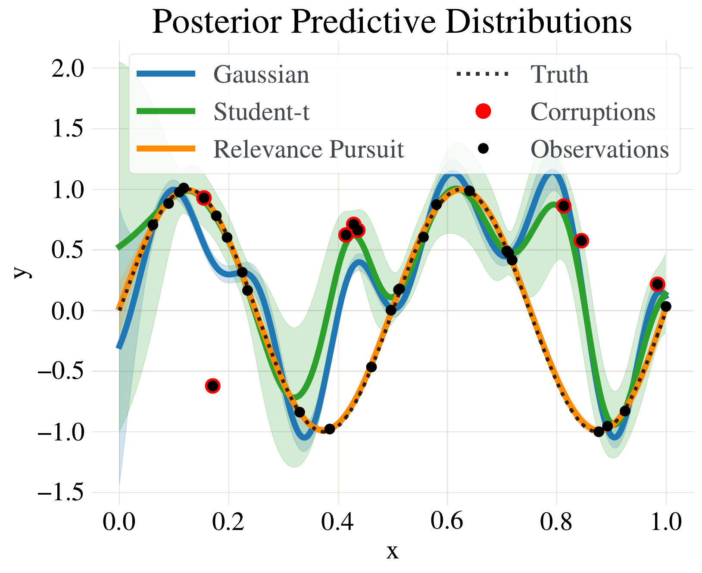
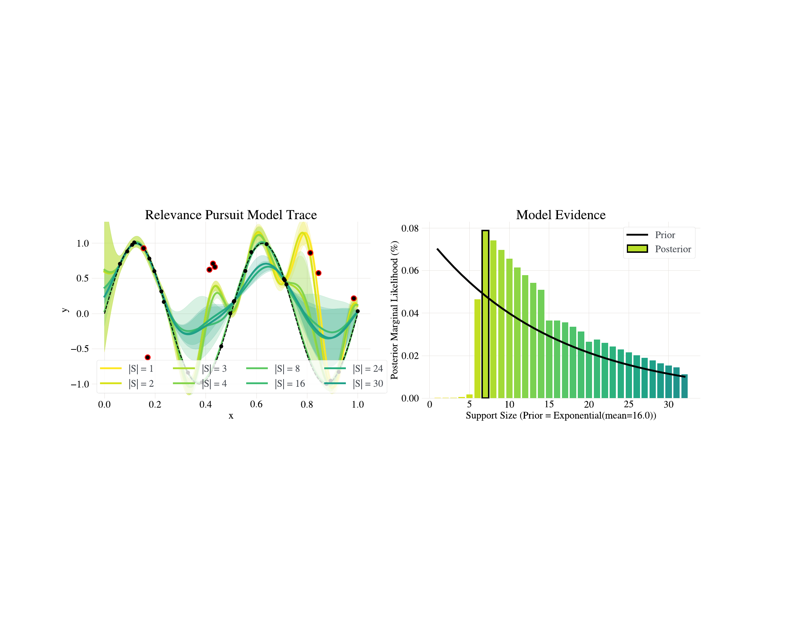
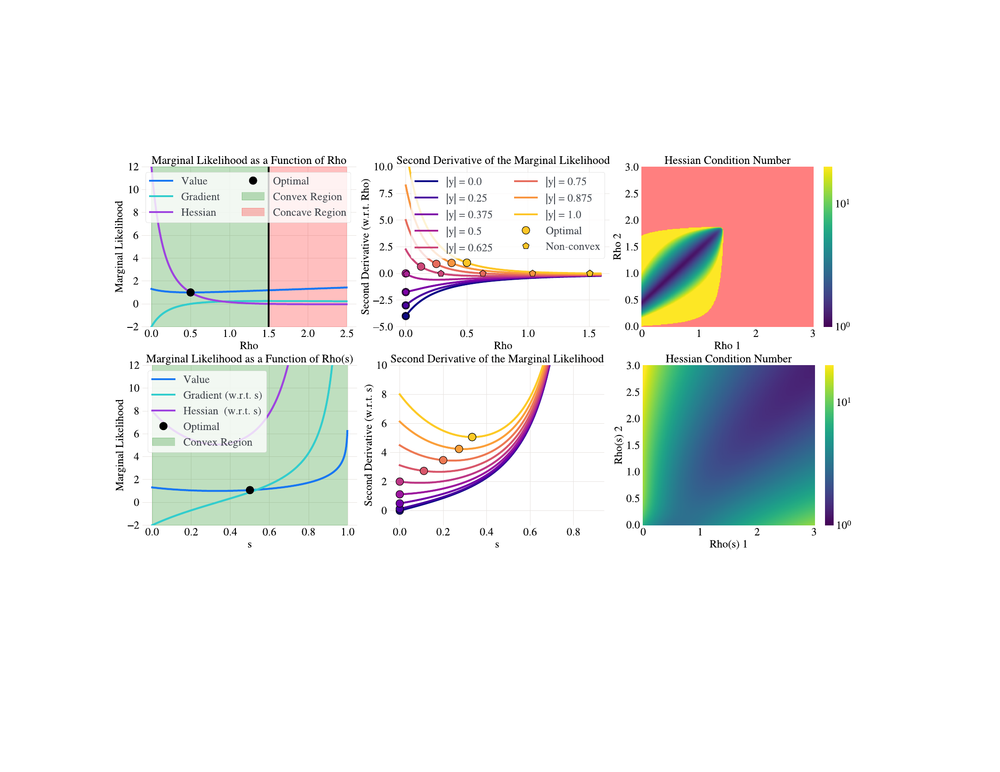
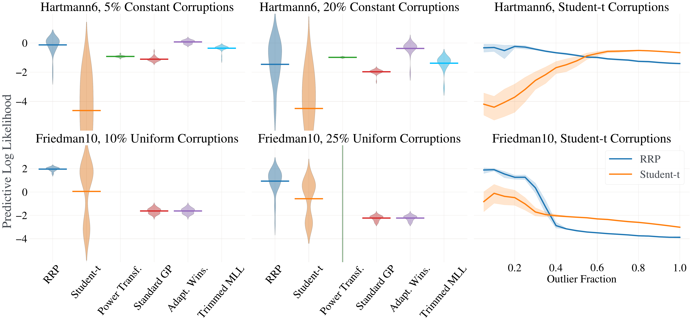
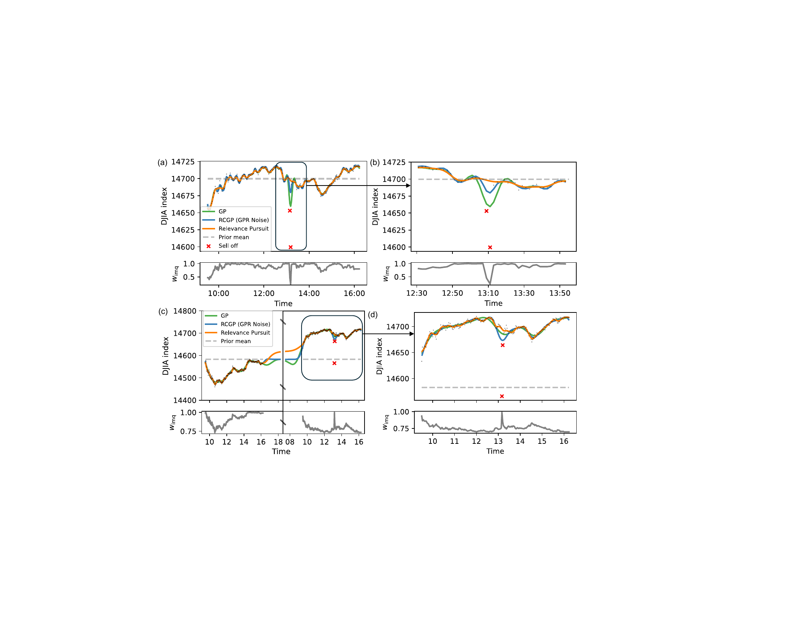
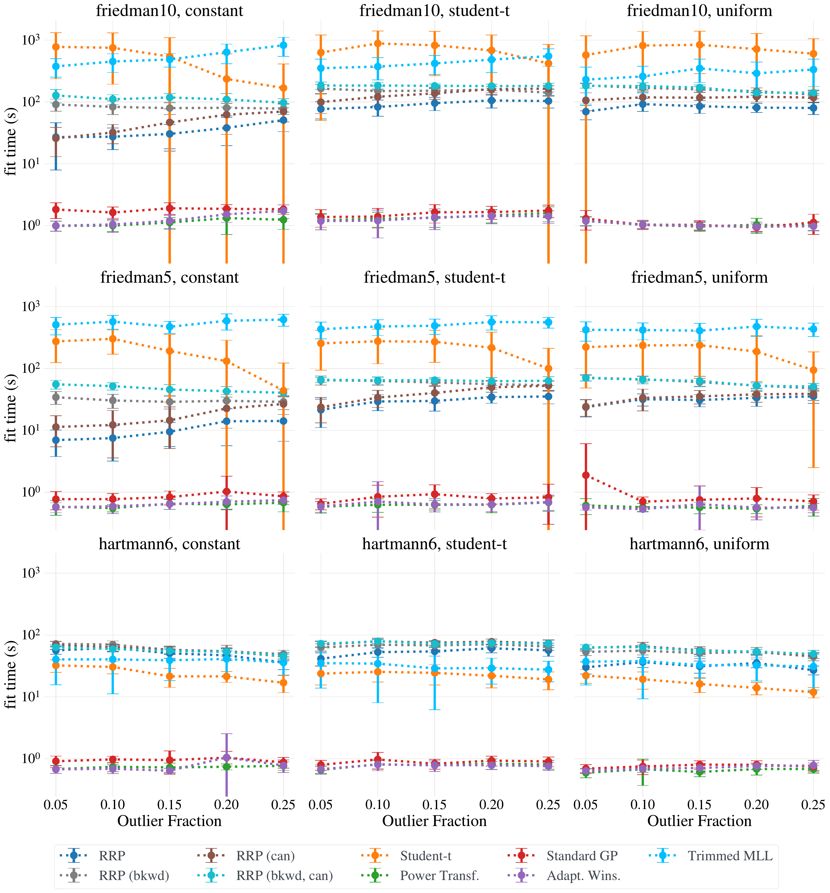
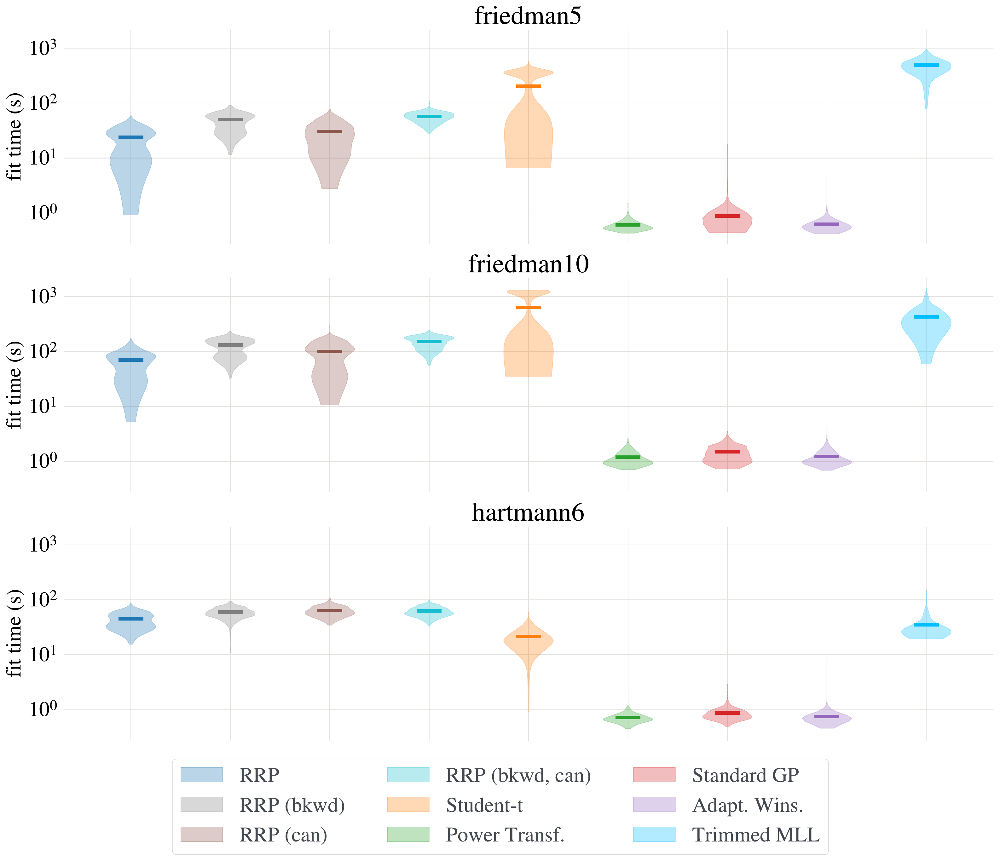

# Robust Gaussian Processes via Relevance Pursuit

## Abstract

Gaussian processes (GPs) are non-parametric probabilistic regression models that are popular due to their flexibility, data efficiency, and well-calibrated uncertainty estimates. However, standard GP models assume homoskedastic Gaussian noise, while many real-world applications are subject to non-Gaussian corruptions. Variants of GPs that are more robust to alternative noise models have been proposed, and entail significant trade-offs between accuracy and robustness, and between computational requirements and theoretical guarantees. In this work, we propose and study a GP model that achieves robustness against sparse outliers by inferring data-point-specific noise levels with a sequential selection procedure maximizing the log marginal likelihood that we refer to as *relevance pursuit*. We show, surprisingly, that the model can be parameterized such that the associated log marginal likelihood is *strongly concave* in the data-point-specific noise variances, a property rarely found in either robust regression objectives or GP marginal likelihoods. This in turn implies the weak submodularity of the corresponding subset selection problem, and thereby proves approximation guarantees for the proposed algorithm. We compare the model’s performance relative to other approaches on diverse regression and Bayesian optimization tasks, including the challenging but common setting of sparse corruptions of the labels within or close to the function range.

# Introduction [sec:Introduction]

Probabilistic models have long been a central part of machine learning, and Gaussian process (GP) models are a key workhorse for many important tasks `\citep{rasmussen2006gaussian}`{=latex}, especially in the small-data regime. GPs are flexible, non-parametric predictive models known for their high data efficiency and well-calibrated uncertainty estimates, making them a popular choice for regression, uncertainty quantification, and downstream applications such as Bayesian optimization (BO) `\citep{ament2023sustainableconcretebayesianoptimization, frazier2018tutorial, garnett_bayesoptbook_2023}`{=latex} and active learning `\citep{ament2021sara, riis2022bayesian}`{=latex}.

GPs flexibly model a distribution over functions, but assume a particular observation model. The standard formulation assumes i.i.d Gaussian observation noise, i.e., \\(y({\mathbf x}) = f({\mathbf x}) + \epsilon\\), where \\(f({\mathbf x})\\) is the true (latent) function value at a point \\({\mathbf x}\\) and \\(\epsilon \sim \mathcal{N}(0, \sigma^2)\\), implying a homoskedastic Gaussian likelihood. While mathematically convenient, this assumption can be a limitation in practice, since noise distributions are often heavy-tailed or observations may be corrupted due to issues such as sensor failures, data processing errors, or software bugs. Using a standard GP model in such settings can result in poor predictive performance.

A number of *robust* GP modeling approaches have been proposed to remedy this shortcoming, most of which fall into the following broad categories: data pre-processing (e.g., Winsorizing), modified likelihood functions (e.g., Student-\\(t\\)), and model-based data selection and down-weighting procedures. These approaches offer different trade-offs between model accuracy, degree of robustness, broad applicability, computational requirements, and theoretical guarantees.

In this paper, we propose a simple yet effective implicit data-weighting approach that endows GPs with a high degree of robustness to challenging label corruptions. Our approach is flexible and can be used with arbitrary kernels, is efficient to compute, and yields provable approximation guarantees. Our main contributions are as follows:

1.  We propose a modification to the standard GP model that introduces learnable data-point-specific noise variances.

2.  We introduce a novel greedy sequential selection procedure for maximizing the model’s marginal log-likelihood (MLL) that we refer to as *relevance pursuit*.

3.  We prove that, under a particular parameterization, the MLL is strongly concave in the data-point-specific noise variances, and derive approximation guarantees for our algorithm.

4.  We demonstrate that our approach, Robust Gaussian Processes via Relevance Pursuit (RRP), performs favorably compared to alternative methods across various benchmarks, including challenging settings of sparse label corruptions within the function’s range, see e.g. Figure <a href="#fig:sine_example" data-reference-type="ref" data-reference="fig:sine_example">1</a>.

<figure id="fig:sine_example">

<figcaption>Comparison of RRP to a standard GP and a variational GP with a Student-<em>t</em> likelihood on a regression example. While the other models are led astray by the corrupted observations, RRP successfully identifies the corruptions (red) and thus achieves a much better fit to the ground truth.</figcaption>
</figure>

# Preliminaries [sec:Preliminaries]

We aim to model a function \\(f: \mathbb{X} \rightarrow \mathbb{R}\\) over some domain \\(\mathbb{X} \subset \mathbb{R}^d\\). With a standard Gaussian noise model, for \\({\mathbf x}_i \in \mathbb{X}\\) we obtain observations \\(y_i = f({\mathbf x}_i) + \epsilon_i\\), where \\(\epsilon_i \sim \ensuremath{\mathcal{N}}(0, \sigma^2)\\) are i.i.d. draws from a Gaussian random variable. \\(\|\cdot\|\\) denotes the Euclidean norm unless indicated otherwise.

## Gaussian Processes [subsec:Preliminaries:GPs]

A GP \\(f \sim {\mathcal GP}(\mu(\cdot), k_{{\boldsymbol \theta}}(\cdot,\cdot))\\) is fully defined by its mean function \\(\mu: {\mathbb X}\rightarrow \mathbb{R}\\) and covariance or kernel function \\(k_{{\boldsymbol \theta}}: {\mathbb X}\times {\mathbb X}\rightarrow \mathbb{R}\\), which is parameterized by \\({\boldsymbol \theta}\\). Without loss of generality, we will assume that \\(\mu \equiv 0\\). Suppose we have collected data \\(\ensuremath{\mathcal{D}}= \{({\mathbf x}_i, y_i)\}_{i=1}^n\\) where \\({\mathbf X}:= \{{\mathbf x}_i\}_{i=1}^n\\), \\({\mathbf y}:= \{y_i\}_{i=1}^n\\). Let \\({\boldsymbol \Sigma}_{\boldsymbol \theta}\in \ensuremath{\mathcal{S}}_{++}^n\\) denote the covariance matrix of the data set, i.e., \\([{\boldsymbol \Sigma}_{\boldsymbol \theta}]_{ij} = k_{\boldsymbol \theta}({\mathbf x}_i, {\mathbf x}_j) + \delta_{ij} \sigma^2\\), where \\(\delta_{ij}\\) is the Kronecker delta. The negative marginal log-likelihood (NMLL) \\(\ensuremath{\mathcal{L}}\\) is given by \\[\begin{aligned}
    \label{eq:Preliminaries:GPs:mll}
    % -\calL(\btheta) = \y^\top \bSigma(\btheta)^{-1} \y 
    %     + \log \det \bSigma(\btheta) + n \log 2 \pi.
    -2\ensuremath{\mathcal{L}}({\boldsymbol \theta}) :=
    -2 \log p({\mathbf y}| {\mathbf X}, {\boldsymbol \theta}) = {\mathbf y}^\top {\boldsymbol \Sigma}_{\boldsymbol \theta}^{-1} {\mathbf y}
        + \log \det {\boldsymbol \Sigma}_{\boldsymbol \theta}+ n \log 2 \pi.
\end{aligned}\\]

In the following, we will suppress the explicit dependence of the kernel matrix on \\({\boldsymbol \theta}\\) for brevity of notation. For a comprehensive background on GPs, we refer to `\citet{rasmussen2006gaussian}`{=latex}.

## Noise Models [subsec:Preliminaries:NoiseModels]

#### Additive, heavy-tailed noise

Instead of assuming the noise term \\(\epsilon_i\\) in the observation model to be Gaussian, other noise models consider zero-mean perturbations drawn from distributions with heavier tails, such as the Student-\\(t\\) `\citep{jylanki2011robust}`{=latex}, Laplace `\citep{kuss2006gaussian}`{=latex}, or \\(\alpha\\)-Stable `\citep{ament2018accurate}`{=latex} distributions. These types of errors are common in applications such as finance, geophysics, and epidemiology `\citep{congdon2017representing}`{=latex}. Robust regression models utilizing Student-\\(t\\) errors are commonly used to combat heavy-tailed noise and outliers.

#### Sparse corruptions

In practice, often a small number of labels are corrupted. We will refer to these as “outliers," though emphasize that the corrupted values may fall within the range of normal outputs. Sparse corruptions are captured by a model of the form \\(y_i = Z_i f({\mathbf x}_i) + (1 - Z_i)W_i\\), where \\(Z_i \in \{0, 1\}\\) and \\(W_i \in \mathbb{R}\\) is a random variable. Note that \\(W_i\\) need not have (and rarely has) \\(f({\mathbf x}_i)\\) as its mean. For instance, consider a faulty sensor that with some probability \\(p\\) reports a random value within the sensor range \\([y_l, y_h]\\). In this case \\(Z_i \sim \text{Ber}(p)\\) and \\(W_i \sim \text{U}[y_l, y_h]\\). Software bugs, such as those found in ML training procedures, or errors in logging data can result in sparse corruptions.

# Related Work [sec:RelatedWork]

#### Data pre-processing

Data pre-processing can be an effective technique for handling simple forms of data corruption, such as values that fall outside a valid range of outputs. With such pre-processing, outliers are handled upstream of the regression model. Common techniques include the power transformations `\citep{box1964analysis}`{=latex}, trimming, and winsorization. These methods can add substantial bias if not used carefully, and generally do not handle data corruptions that occur within the normal range of the process to be modeled. See `\citep{chu2016cleaning}`{=latex} for a review on data cleaning.

#### Heavy-tailed likelihoods

One class of robust methods uses additive heavy-tailed noise likelihoods for GPs, particularly Student-\\(t\\) `\citep{jylanki2011robust}`{=latex}, Laplace `\citep{ranjan2016robustGPEMalgo}`{=latex}, and Huber `\citep{algikar2023robustgaussianprocessregression}`{=latex}, and could be extended with \\(\alpha\\)-Stable distributions, which follow a generalized central limit theorem `\citep{ament2018accurate}`{=latex}. These models are less sensitive to outliers, but they lose efficiency when the outliers are a sparse subset of the observations, as opposed to global heavy-tailed noise. Furthermore, model inference is no longer analytic, necessitating the use of approximate inference approaches such as MCMC `\citep{neal1997mcmcGP}`{=latex}, Laplace approximation `\citep{vanhatalo2009studenttGP}`{=latex}, expectation propagation (EP) `\citep{jylanki2011robust}`{=latex}, Expectation Maximization `\citep{ranjan2016robustGPEMalgo}`{=latex}, or variational inference `\citep{tipping2005variationalstudentt}`{=latex}. `\citet{shah2014student}`{=latex} take a related approach using a Student-\\(t\\) process prior in the place of the GP prior. Unfortunately, the Student-\\(t\\) process is not closed under addition and lacks the tractability that makes GPs so versatile. Alternative noise specifications include a hierarchical mixture of Gaussians `\citep{daemi2019gpmixturelik}`{=latex} and a “twinned” GP model `\citep{Naish2007twinnedgp}`{=latex} that uses a two-component noise model to allow outlier behavior to depend on the inputs. This method is suited for settings where outliers are not totally stochastic, but generally is not able to differentiate “inliers” from outliers when they can occur with similar inputs.

#### Outlier classification

`\citet{awasthi2022trimmed}`{=latex} introduces the Trimmed MLE approach, which identifies the subset of data points (of pre-specified size) under which the marginal likelihood is maximized. `\citet{andrade2023trimmed}`{=latex} fit GPs using the trimmed MLE by applying a projected gradient method to an approximation of the marginal likelihood. The associated theory only guarantees convergence to a stationary point, with no guarantee on quality. When no outliers are present, this method can be worse than a standard GP. `\citet{li2021iterativetrimming}`{=latex} propose a heuristic iterative procedure of removing those data points with the largest residuals after fitting a standard GP, with subsequent reweighting. The method shows favorable empirical performance but has no theoretical guarantees, and fails if the largest residual is not associated with an outlier. `\citet{park2022robustGPRbias}`{=latex} consider a model of the form \\(y_i = \delta_i + f({\mathbf x}_i) + \epsilon_i\\), where outliers are regarded as data with a large bias \\(\delta_i\\). Their random bias model is related to our model in that it also introduces learnable, data-point-specific variances. However, inference is done in one step by optimizing the NMLL with an inverse-gamma prior on the \\(\delta_i\\)’s, which – in contrast to the method proposed herein – generally does not lead to exactly sparse \\(\delta_i\\)’s .

#### Sample re-weighting

`\citet{altamirano2023robust}`{=latex} propose robust and conjugate GPs (RCGP) based on a modification to the Gaussian likelihood function that is equivalent to standard GP inference, where the covariance of the noise \\(\sigma^2 {\mathbf I}\\) is replaced by \\(\sigma^2 \mathop{\mathrm{diag}}({\mathbf w}^{-2})\\) and the prior mean \\(\mathbf m\\) is replaced by \\(\mathbf m_{\mathbf w}= \mathbf m + \sigma^2 \nabla_y \log({\mathbf w}^2)\\). The authors advocate for the use of the inverse multi-quadratic weight function \\(w({\mathbf x}, y) = \beta (1 + (y - m({\mathbf x}))^2 / c^2)^{-1/2}\\), which introduces two additional hyper-parameters: the soft threshold \\(c\\), and the “learning rate” \\(\beta\\). Importantly, the weights \\({\mathbf w}\\) are defined *a-priori* as a function of the prior mean \\(m({\mathbf x})\\) and the targets \\(y\\), thereby necessitating the weights to identify the correct outliers without access to a model. This is generally only realistic if the outlier data points are clearly separated in the input or output spaces rather than randomly interspersed.

# Robust Gaussian Process Regression via Relevance Pursuit [sec:rgp-rp]

Our method adaptively identifies a sparse set of outlying data points that are corrupted by a mechanism that is not captured by the other components of the model. This is in contrast to many other approaches to robust regression that non-adaptively apply a heavy-tailed likelihood to *all* observations, which can be suboptimal if many observations are of high quality.

## The Extended Likelihood Model [sec:Theory:RobustVariance]

We extend the standard GP observation noise variance \\(\sigma^2\\) with data-point-specific noise variances \\({\boldsymbol \rho}\ = \{\rho_i\}_{i=1}^n\\), so that the \\(i\\)-th data point is distributed as \\[\label{eq:basic_robust_likelihood}
    y_i \ \big | \ {\mathbf x}_i \sim \ensuremath{\mathcal{N}}
    \left(f({\mathbf x}_i), \sigma^2 + \rho_i\right).\\] This is similar to Sparse Bayesian Learning `\citep{tipping2001sparse}`{=latex} in which weight-specific prior variances control a feature’s degree of influence on a model’s predictions. The marginal likelihood optimization of \\(\rho_i\\) in <a href="#eq:basic_robust_likelihood" data-reference-type="eqref" data-reference="eq:basic_robust_likelihood">[eq:basic_robust_likelihood]</a> gives rise to an *automatic mechanism* for the detection and weighting of outliers. The effect of \\(y_i\\) on the estimate of \\(f\\) vanishes as \\(\rho_i \rightarrow \infty\\), similar to the effect of the latent varibales \\(\mathbf h\\) in `\citet{bodin2020modulatingsurrogates}`{=latex}’s extended GP model \\(f({\mathbf x}, \mathbf h)\\), though \\(\mathbf h\\) requires MCMC for inference. While many heteroskedastic GP likelihoods model noise as an input-dependent process `\citep{goldberg1998inputnoiseGP, kersting2007mostlikelyhet}`{=latex}, our formulation does not require such assumptions, and is thus suitable for corruptions that are not spatially correlated.

An elegant consequence of our modeling assumption is that we can compute individual marginal-likelihood maximizing \\(\rho_i\\)’s in closed form when keeping all \\(\rho_j\\) for \\(j \neq i\\) fixed. In particular,

lemrobustvariance\[Optimal Robust Variances\]  Let \\(\ensuremath{\mathcal{D}}_{\backslash i} = \{({\mathbf x}_j, y_j): j \neq i\}\\), \\({\boldsymbol \rho}= {\boldsymbol \rho}_{\backslash i} + \rho_i \mathbf e_i\\), where \\({\boldsymbol \rho}, {\boldsymbol \rho}_{\backslash i} \in \mathbb{R}_+^n\\), \\([{\boldsymbol \rho}_{\backslash i}]_i = 0\\), and \\(\mathbf e_i\\) is the \\(i\\)th canonical basis vector. Then keeping \\({\boldsymbol \rho}_{\backslash i}\\) fixed, \\[\label{eq:robust_incremental_ml}
    \begin{aligned}
     \rho_i^* = \arg \max_{\rho_i} \ensuremath{\mathcal{L}}\bigl({\boldsymbol \rho}_{\backslash i} + \rho_i \mathbf e_{i} \bigr) 
     = 
    \left[
        (y_i - \mathbb{E}[y({\mathbf x}_i) | \ensuremath{\mathcal{D}}_{\backslash i}])^2  % \sigma^2 implicit
        - \mathbb{V}[y({\mathbf x}_i) | \ensuremath{\mathcal{D}}_{\backslash i}]
        \right]_+,
    \end{aligned}\\] where \\(y({\mathbf x}_i) = f({\mathbf x}_i) + \epsilon_i\\). These quantities can be expressed as functions of \\({\boldsymbol \Sigma}^{-1} = ({\mathbf K}+ {\mathbf D}_{\sigma^2 + {\boldsymbol \rho}})^{-1}\\): \\[\nonumber
    \begin{aligned}
        {\mathbb E}[y({\mathbf x}_i) | \ensuremath{\mathcal{D}}_{\backslash i}]^2 = y_i - \left[
            {\boldsymbol \Sigma}^{-1} {\mathbf y}
            \right]_i
            \big / \left[ {\boldsymbol \Sigma}^{-1} \right]_{ii}, 
            \qquad 
            \text{and}
            \qquad
        {\mathbb V}[y({\mathbf x}_i) | \ensuremath{\mathcal{D}}_{\backslash i}] = 1 \big / \left[ {\boldsymbol \Sigma}^{-1} \right]_{ii},
    \end{aligned}\\] where \\({\mathbf D}_{\sigma^2 + {\boldsymbol \rho}}\\) is a diagonal matrix whose entries are \\({\sigma^2 + {\boldsymbol \rho}}\\).

The first component \\(\mathbb{E}[f({\mathbf x}_i) + \epsilon_i | \ensuremath{\mathcal{D}}_{\backslash i}]^2\\) of <a href="#eq:robust_incremental_ml" data-reference-type="eqref" data-reference="eq:robust_incremental_ml">[eq:robust_incremental_ml]</a> is the empirical error to \\(y_i\\) of the model trained without the \\(i\\)-th data point, i.e., the leave-one-out (LOO) cross-validation error `\citep{rasmussen2006gaussian}`{=latex}. The second component \\(\mathbb{V}[f({\mathbf x}_i) + \epsilon_i | \ensuremath{\mathcal{D}}_{\backslash i}]\\) is the LOO predictive variance. The optimal solution to \\(\rho_i\\) is only non-zero for those observations whose squared LOO error is larger than the LOO predictive variance at that point.

<figure id="fig:enter-label">

<figcaption><em>Left:</em> Evolution of model posterior during Relevance Pursuit, as the number of data-point-specific variances |<em>S</em>| increases (from light colors to dark). Red points indicate corruptions that were generated by uniformly sampling from the function’s range. <em>Right:</em> Comparison of posterior marginal likelihoods as a function of a model’s |<em>S</em>|. The maximizer – boxed in black – is the preferred model.</figcaption>
</figure>

## Optimization with a Maximum Number of Outliers [sec:CappedAlgorithmDescription]

Without additional structure, inference of the noise variances \\(\rho_i\\) does not yield desirable models, as the marginal likelihood can be improved by increasing the prior variance \\(\rho_i\\) of any data point where Eq. <a href="#eq:robust_incremental_ml" data-reference-type="eqref" data-reference="eq:robust_incremental_ml">[eq:robust_incremental_ml]</a> is greater than zero, even if that is due to regular (non-outlier) measurement noise. To avoid this, we constrain the number of non-zero \\(\rho_i\\), that is, \\(\|{\boldsymbol \rho}\|_\infty = |\{0 < \rho_i \}| \leq k < n\\). While this sparsity constraint mitigates over-flexibility, it gives rise to a formidably challenging optimization problem, as there are a combinatorial number of sparse outlier sets to consider. Even if the number of outliers \\(n_o\\) were known, exhaustive search would still require considering \\(n\\)-choose-\\(n_o\\) possibilities.

For tractability, we iteratively add data points to a set of potential “outliers” by setting their associated \\(\rho_i\\) to be nonzero, using the closed-form expression for the optimal individual \\(\rho_i\\) variances in Lemma <a href="#lem:robust_incremental_ml" data-reference-type="ref" data-reference="lem:robust_incremental_ml">[lem:robust_incremental_ml]</a>. As the algorithm seeks to identify the most “relevant” data points (as measured by \\(\ensuremath{\mathcal{L}}\\)) upon completion, we refer to it as *Relevance Pursuit*. This is Algorithm <a href="#algo:RobustRegressionModel:Inference:RelevancePursuitForward" data-reference-type="ref" data-reference="algo:RobustRegressionModel:Inference:RelevancePursuitForward">3</a> with \\(\mathrm{useBayesianModelSelection}\\) as \\(\mathrm{false}\\). Specifically, this is the “forward” variant; Algorithm <a href="#algo:RobustRegressionModel:Inference:RelevancePursuitBackward" data-reference-type="ref" data-reference="algo:RobustRegressionModel:Inference:RelevancePursuitBackward">9</a> in the Appendix presents an alternative “backward” variant that we found to work well if the number of corrupted data points is large.

Crucial to the performance of the optimizer, it never removes data from consideration completely; a data point is only down-weighted if it is apparently an outlier. This allows the down-weighting to be reversed if a data point appears “inlying” after having down-weighted other data points, improving the method’s robustness and performance. This is in contrast to `\citet{andrade2023trimmed}`{=latex}’s greedy algorithm, in which the exclusion of a data point can both increase or decrease the associated marginal likelihood. This means that their objective is not monotonic, a necessary condition to provide constant-factor submodular approximation guarantees for greedy algorithms, see Section <a href="#sec:Theory" data-reference-type="ref" data-reference="sec:Theory">5</a>.  

<figure id="algo:RobustRegressionModel:Inference:RelevancePursuitForward">

ALGORITHM BLOCK (caption below)

 
Require <strong>X</strong>, <strong>y</strong>, schedule 𝒦 = (<em>k</em>1, <em>k</em>2, …, <em>k</em>𝒦), useBayesianModelSelection (boolean) 
Initialize 𝒮0 ⊆ {1, …, <em>n</em>} (typically 𝒮0 = ∅) 
<strong>For</strong> <em>i</em> in (1, …, |𝒦|) 
Optimize MLL: <strong>ρ</strong>𝒮<em>i</em> ← arg max<strong>ρ</strong>𝒮<em>i</em>ℒ(<strong>ρ</strong>𝒮<em>i</em>), where <strong>ρ</strong>𝒮<em>i</em> = {<strong>ρ</strong> : <em>ρ</em><em>j</em> = 0, ∀ <em>j</em> ∉ 𝒮<em>i</em>}. 
Expand Support: 
Compute <em>Δ</em><em>i</em>(<em>j</em>) ← max<em>ρ</em><em>j</em>ℒ(<strong>ρ</strong>𝒮<em>i</em> + <em>ρ</em><em>j</em><strong>e</strong><em>j</em>) − ℒ(<strong>ρ</strong>𝒮<em>i</em>) for all <em>j</em> ∉ 𝒮<em>i</em> via Lemma <a href="#lem:robust_incremental_ml" data-reference-type="ref" data-reference="lem:robust_incremental_ml">[lem:robust_incremental_ml]</a> . 
𝒜<em>i</em> ← {<em>j</em>1, …, <em>j</em><em>k</em><em>i</em>} such that <em>Δ</em><em>i</em>(<em>j</em>) ≥ <em>Δ</em><em>i</em>(<em>j</em>′) for all <em>j</em> ∈ 𝒜<em>i</em> and <em>j</em>′ ∉ (𝒜<em>i</em> ∪ 𝒮<em>i</em>). 
𝒮<em>i</em> + 1 ← 𝒮<em>i</em> ∪ 𝒜<em>i</em> 
EndFor 
<strong>If</strong> useBayesianModelSelection 
Compute the marginal likelihood <em>p</em>(𝒟|𝒮<em>i</em>) ≈ <em>p</em>(𝒟|𝒮<em>i</em>, <strong>ρ</strong>𝒮<em>i</em>) 
𝒮* ← arg max𝒮<em>i</em><em>p</em>(𝒟|𝒮<em>i</em>)<em>p</em>(𝒮<em>i</em>). 
Else 
𝒮* = 𝒮𝒦. 
EndIf 
Return 𝒮*, <strong>ρ</strong>𝒮*.

<figcaption>Relevance Pursuit (Forward Algorithm)</figcaption>
</figure>

## Automatic Outlier Detection via Bayesian Model Selection [sec:MainAlgorithmDescription]

In practice, it is often impossible to set a hard threshold on the number of outliers for a particular data set. For example, a sensor might have a known failure rate, but how many outliers it produces will depend on the specific application of the sensor. Thus, is often more natural to specify a prior distribution \\(p({\mathcal{S}})\\) over the number of outliers, rather than fix the number *a priori*. We leverage the Bayesian model selection framework `\citep{wasserman2000bayesian, %garnettbms,
lotfi2023bayesianmodelselectionmarginal}`{=latex} to determine the most probable number of outliers in a data- and model-dependent way, aiming to maximize \\(p({\mathcal{S}}| \ensuremath{\mathcal{D}})\\). This gives rise to Algorithm <a href="#algo:RobustRegressionModel:Inference:RelevancePursuitForward" data-reference-type="ref" data-reference="algo:RobustRegressionModel:Inference:RelevancePursuitForward">3</a>, with \\(\mathrm{useBayesianModelSelction}\\) as \\(\mathrm{true}\\).

Computationally, we start by iteratively adding outliers up to the maximal support of the prior, similar to the procedure described in Section <a href="#sec:CappedAlgorithmDescription" data-reference-type="ref" data-reference="sec:CappedAlgorithmDescription">4.2</a>. We store a trace of models generated at each iteration, then approximate the model posterior \\(p({\mathcal{S}}_i | \ensuremath{\mathcal{D}}) \propto p(\ensuremath{\mathcal{D}}| S_i) p(S_i)\\) at each point in the trace. As the exact posterior is intractable, we approximate it with \\(p(\ensuremath{\mathcal{D}}| {\mathcal{S}}_i) = \int p(\ensuremath{\mathcal{D}}| {\mathcal{S}}_i, {\boldsymbol \rho}_{{\mathcal{S}}_i}) \text{d}{\boldsymbol \rho}_{{\mathcal{S}}_i}
\approx  p(\ensuremath{\mathcal{D}}| {\mathcal{S}}_i, {\boldsymbol \rho}_{{\mathcal{S}}_i}^*)\\). Finally, we select the model from the model trace \\(\{{\mathcal{S}}_i\}_{i}\\) that attains the highest model posterior likelihood. Imposing a prior on the number of outliers differs notably from most sparsity-inducing priors, which are instead defined on the parameter values, like \\(l_1\\)-norm regularization. In practice, \\(p({\mathcal{S}})\\) can be informed by empirical distributions of outliers. For our experiments, we use an exponential prior on \\(|{\mathcal{S}}|\\) to encourage the selection of models that fit as much of the data as tightly as possible.

Regarding the schedule \\(\ensuremath{\mathcal{K}}\\) in Algorithm <a href="#algo:RobustRegressionModel:Inference:RelevancePursuitForward" data-reference-type="ref" data-reference="algo:RobustRegressionModel:Inference:RelevancePursuitForward">3</a>, the most natural choice is simply to add one data point at a time, i.e. \\(\ensuremath{\mathcal{K}}= (1, 1, ...)\\), but this can be slow for large \\(n\\). In practice, we recommend schedules that test a fixed set of outlier fractions, e.g. \\(\ensuremath{\mathcal{K}}= (0.05n, 0.05n, \dots)\\).

# Theoretical Analysis [sec:Theory]

We now provide a theoretical analysis of our approach. We first propose a re-parameterization of the \\(\rho_i\\) that maps the optimization problem to a compact domain. Surprisingly, the re-parameterized problem exhibits strong convexity and smoothness when the base covariance matrix (excluding the \\(\rho_i\\)) is well-conditioned. We connect the convexity and smoothness with existing results that yield approximation guarantees for sequential greedy algorithms, implying a constant-factor approximation guarantee to the optimal achievable NMLL value for generalized orthogonal matching pursuit (OMP), a greedy algorithm that is closely related to Algorithm <a href="#algo:RobustRegressionModel:Inference:RelevancePursuitForward" data-reference-type="ref" data-reference="algo:RobustRegressionModel:Inference:RelevancePursuitForward">3</a>.

## Preliminaries for Sparse Optimization [sec:Theory:SparseOpt]

The optimization of linear models with respect to least-squares objectives in the presence of sparsity constraints has been richly studied in statistics `\citep{tibshirani1996regression}`{=latex}, compressed sensing `\citep{ament2021optimality, tropp2004greed}`{=latex}, and machine learning `\citep{ament2021sblviastepwise, wipf2007newvieward}`{=latex}. Of central importance to the theoretical study of this problem class are the eigenvalues of sub-matrices of the feature matrix, corresponding to sparse feature selections and so often referred to as *sparse eigenvalues*. The restricted isometry property (RIP) formalizes this.

**Definition 1** (Restricted Isometry Property). *An \\((n \times m)\\)-matrix \\(\mathbf A\\) satisfies the \\(r\\)-restricted isometry property (RIP) with constant \\(\delta_r \in (0, 1)\\) if for every submatrix \\(\mathbf A_{\mathcal{S}}\\) with \\(|{\mathcal{S}}| = r \leq m\\) columns, \\[(1-\delta_r) \|{\mathbf x}\| \leq \|\mathbf A_{\mathcal{S}}{\mathbf x}_{{\mathcal{S}}} \| \leq (1 + \delta_r) \|{\mathbf x}\|,\\] where \\({\mathbf x}_{\mathcal{S}}\in \mathbb{R}^r\\). This is equivalent to \\((1 - \delta_r) {\mathbf I}\preceq (\mathbf A_{\mathcal{S}}^* \mathbf A_{\mathcal{S}}) \preceq (1 - \delta_r) {\mathbf I}\\).*

The RIP has been proven to lead to exact recovery guarantees `\citep{candes2008restricted}`{=latex}, as well as approximation guarantees `\citep{das2018approximate}`{=latex}. `\citet{elenberg2018restricted}`{=latex} generalized the RIP to non-linear models and other data likelihoods, using the notion of restricted strong convexity (RSC) and restricted smoothness.

**Definition 2** (Restricted Strong Convexity and Smoothness). *A function \\(f: \mathbb{R}^d \to \mathbb{R}\\) is \\(m_r\\)-restricted strong convex and \\(M_r\\)-restricted smooth if for all \\(({\mathbf x}, {\mathbf x}')\\) in the domain \\(D_r \subset (\mathbb{R}^d \times \mathbb{R}^d)\\), \\[m_r \| {\mathbf x}' - {\mathbf x}\|^2 / 2
    \ \leq \ 
    f({\mathbf x}') - f({\mathbf x}) - 
    % \braket{\nabla[f](\x), \x' - \x} 
    \nabla[f]({\mathbf x})^\top ({\mathbf x}' - {\mathbf x})
    \ \leq \
    M_r \| {\mathbf x}' - {\mathbf x}\|^2 / 2.\\] In the context of sparse optimization, we let \\(D_r\\) be the set of tuples of \\(r\\)-sparse vectors whose difference is also at most \\(r\\)-sparse. In particular, \\(D_r =
\{
    ({\mathbf x}, {\mathbf x}') \ \text{s.t.} \ 
    % \|\x\|_0 \leq r, 
    % \|\x'\|_0 \leq r, 
    % \|\x' - \x\|_0 \leq r
    \|{\mathbf x}\|_0, 
    \|{\mathbf x}'\|_0, 
    \|{\mathbf x}' - {\mathbf x}\|_0 \leq r
\}\\).*

Generalized orthogonal matching pursuit (OMP) `\citep{ament2022gmp, locatello2017gmp, locatello2018matchingpursuit}`{=latex} is a greedy algorithm that keeps track of a support set \\({\mathcal{S}}\\) of non-zero coefficients, and expands the support based on the largest gradient magnitudes, applied to the marginal liklihood optimization problem, \\({\mathcal{S}}_{i + 1} = {\mathcal{S}}_{i} \cup \arg \max_{j \not \in {\mathcal{S}}} |\nabla_{{\boldsymbol \rho}}\ensuremath{\mathcal{L}}({\boldsymbol \rho})|_j\\). Algorithm <a href="#algo:RobustRegressionModel:Inference:RelevancePursuitForward" data-reference-type="ref" data-reference="algo:RobustRegressionModel:Inference:RelevancePursuitForward">3</a> generalizes OMP `\citep{tropp2004greed}`{=latex} by allowing more general support expansion schedules \\(\ensuremath{\mathcal{K}}\\), and specializes the support expansion criterion using the special problem structure exposed by Lemma <a href="#lem:robust_incremental_ml" data-reference-type="ref" data-reference="lem:robust_incremental_ml">[lem:robust_incremental_ml]</a>.

## The Convex Parameterization [sec:Theory:Convexity]

<figure id="fig:theory_figure">

<figcaption><em>Top:</em> The behavior of the −log ℒ(<em>ρ</em>) with respect to the canonical parameterization of <strong>ρ</strong>. <em>Bottom:</em> The behavior of −log ℒ(<em>ρ</em>(<strong>s</strong>)), highlighting the convexity property. <em>Left:</em> The value, and first two derivatives of −log ℒ for a 1d example. <em>Center:</em> The second derivatives of a 1d −log ℒ as a function of |<em>y</em>|. The <strong>s</strong>-parameterization is everwhere convex for all considered |<em>y</em>|, while the canonical <strong>ρ</strong>-parameterization is only convex around the origin and only for |<em>y</em>| &gt; 0.5. <em>Right:</em> The heatmaps highlight that the original parameterization is non-convex (red) for larger values of <em>ρ</em>, and quickly becomes ill-conditioned, whereas the parameterization <strong>ρ</strong>(<strong>s</strong>) is convex and much better conditioned. </figcaption>
</figure>

The NMLL \\(\ensuremath{\mathcal{L}}\\) of a GP <a href="#eq:Preliminaries:GPs:mll" data-reference-type="eqref" data-reference="eq:Preliminaries:GPs:mll">[eq:Preliminaries:GPs:mll]</a> is the sum of a convex function \\((\cdot)^{-1}\\) and a concave function \\(\log \det (\cdot)\\) of \\({\mathbf K}\\), and is therefore not generally convex as a function of the hyper-parameters \\({\boldsymbol \theta}\\), including the robust variances \\({\boldsymbol \rho}\\). Here, we propose a re-parameterization that allows us to prove strong convexity guarantees of the associated NMLL. In particular, we let \\({\boldsymbol \rho}(\mathbf s) = \mathop{\mathrm{diag}}({\mathbf K}_0) \odot ((1 - \mathbf s)^{-1} - 1)\\), where \\({\mathbf K}_0 := k({\mathbf X}, {\mathbf X}) + \sigma^2 {\mathbf I}\\) and the inverse is element-wise. Note that \\({\boldsymbol \rho}(\mathbf s)\\) is a diffeomorphism that maps \\(\mathbf s\\) from the compact domain \\(\mathbf s \in [0, 1]^n\\) to the entire range of \\({\boldsymbol \rho}\in [0, \infty]^n\\).

Henceforth, we refer to the original \\({\boldsymbol \rho}\\) as the *canonical* or \\({\boldsymbol \rho}\\)-parameterization and the newly proposed \\({\boldsymbol \rho}({\mathbf s})\\) as the *convex* or \\({\mathbf s}\\)-parameterization. Lemma <a href="#lem:Theory:Convexity:ReparamHessian" data-reference-type="ref" data-reference="lem:Theory:Convexity:ReparamHessian">[lem:Theory:Convexity:ReparamHessian]</a> shows the Hessian of the \\({\mathbf s}\\)-parameterization.

lemreparameterizedhessian\[Reparameterized Hessian\]  Let \\({\mathbf K}_{{\mathbf s}} = k({\mathbf X}, {\mathbf X}) + \sigma^2 {\mathbf I}+ {\mathbf D}_{{\boldsymbol \rho}({\mathbf s})}\\), \\(\hat {\mathbf K}_{\mathbf s}= \mathop{\mathrm{diag}}({\mathbf K}_{\mathbf s})^{-1/2} {\mathbf K}_{\mathbf s}\mathop{\mathrm{diag}}({\mathbf K}_{\mathbf s})^{-1/2}\\), and \\(\hat {\boldsymbol \alpha}= \hat {\mathbf K}_{\mathbf s}^{-1} \mathop{\mathrm{diag}}({\mathbf K}_{\mathbf s})^{-1/2} {\mathbf y}\\). Then \\[\ensuremath{\mathbf H}_{\mathbf s}[-2 \ensuremath{\mathcal{L}}({\boldsymbol \rho}({\mathbf s})] = 
{\mathbf D}_{1-{\mathbf s}}^{-1}
 \left[
 2 \left( 
    \hat {\boldsymbol \alpha}\hat {\boldsymbol \alpha}^\top \odot (\hat {\mathbf K}^{-1} - {\mathbf I})
    \right)
    +
    2\mathop{\mathrm{diag}}(\hat {\mathbf K}^{-1}) - (\hat {\mathbf K}^{-1} \odot \hat {\mathbf K}^{-1})
\right] 
{\mathbf D}_{1-{\mathbf s}}^{-1}.\\]

Based on this representation, we now derive conditions on the eigenvalues of \\(\hat {\mathbf K}\\) that imply the \\(m\\)-strong convexity and \\(M\\)-smoothness of the NMLL.

lemeigenconvexity\[Strong Convexity via Eigenvalue Condition\]  Let \\(\hat {\mathbf K}_{\mathbf s}\\) as in Lemma <a href="#lem:Theory:Convexity:ReparamHessian" data-reference-type="ref" data-reference="lem:Theory:Convexity:ReparamHessian">[lem:Theory:Convexity:ReparamHessian]</a>. Then \\(\ensuremath{\mathbf H}_{{\mathbf s}} \succ m\\) if \\[\begin{aligned}
\label{eq:Theory:Convexity:EvalCondition:condition}
    \lambda_{\min} \hat\lambda_{\min}^2  
    \frac{(2 \hat \lambda_{\max}^{-1} - \hat \lambda_{\min}^{-2} - m)}{2(1 -  \lambda_{\min} / \lambda_{\max})} > \| {\mathbf y}\|_2^2,
\end{aligned}\\] where \\(\lambda_{\min, \max}\\) (resp. \\(\hat \lambda_{\min, \max}\\)) are the smallest and largest eigenvalues of \\({\mathbf K}_{\mathbf s}\\), respectively \\(\hat {\mathbf K}_{\mathbf s}\\).

The behavior Lemma <a href="#lem:Theory:Convexity:EvalCondition" data-reference-type="ref" data-reference="lem:Theory:Convexity:EvalCondition">[lem:Theory:Convexity:EvalCondition]</a> predicts is surprising and validated in Fig. <a href="#fig:theory_figure" data-reference-type="ref" data-reference="fig:theory_figure">4</a>. Notably, the denominator “blows up” as \\({\mathbf K}\\) becomes close to unitary, making the inequality more likely to be satisfied, an indication that the convexity property of the NMLL is intimately linked to the RIP (Def. <a href="#defi:rip" data-reference-type="ref" data-reference="defi:rip">1</a>). Note that Lemma <a href="#lem:Theory:Convexity:EvalCondition" data-reference-type="ref" data-reference="lem:Theory:Convexity:EvalCondition">[lem:Theory:Convexity:EvalCondition]</a> is a condition for non-support-restricted convexity, which is stronger than is necessary for the approximation guarantees that rely on restricted convexity (Def. <a href="#defi:rsc" data-reference-type="ref" data-reference="defi:rsc">2</a>). However, sparse eigenvalues are generally difficult to compute exactly. Fortunately, covariance matrices of GPs naturally tend to exhibit a property that facilitates a different sufficient condition for convexity for all \\({\mathbf s}\in [0, 1]^{n}\\).

**Definition 3** (Diagonal Dominance). *A matrix \\(\mathbf A\\) is said to be \\(\delta\\)-diagonally dominant if the elements \\(a_{ij}\\) satisfy \\(\sum_{i \neq j} |a_{ij}| < \delta |a_{ii}|\\) for all \\(i\\).*

Intuitively, the \\(\rho_i(s)\\) that are selected to be non-zero by the greedy algorithm take on large values, further encouraging the diagonal dominance of the sub-matrix of \\({\mathbf K}\\) associated with the support of \\({\boldsymbol \rho}\\). For this reason, the following condition on \\({\mathbf K}_0\\) is sufficient to guarantee convexity for all \\({\mathbf s}\in [0, 1]^n\\).

lemddconcavity\[Strong Convexity via Diagonal Dominance\]  Let \\(m > 0\\) and \\({\mathbf K}_0\\) be \\(\delta\\)-diagonally dominant with \\(\delta < 
    \left( (5 - m) -  \sqrt{25 - 9m + 17}\right) / 4
    \leq 
    (5 - \sqrt{17}) / 4 \approx 0.44\\) and \\[% \frac{1}{2\delta} 
    % \left[
    %     2 \frac{(1 - \delta)^2}{1 + \delta} - 1
    % \right]
    %     \geq 
    \lambda_{\min}({\mathbf K}_0) (1 - \delta)^2 
    \frac{2 (1 + \delta)^{-1} - (1-\delta)^{-2} - m}{2(1 -  (1 - \delta) / (1 + \delta))}
    \geq 
    \| {\mathbf y}\|^2_2.\\] Then the NMLL is \\(m\\)-strongly convex for all \\({\mathbf s}\in [0,1]^n\\), i.e. \\({\boldsymbol \rho}(\mathbf s) \in [0, \infty]^n\\).

We attain similar results for \\(M\\)-smoothness, see Lemma <a href="#lem:Theory:Smoothness:EvalCondition" data-reference-type="ref" data-reference="lem:Theory:Smoothness:EvalCondition">[lem:Theory:Smoothness:EvalCondition]</a> and Lemma <a href="#lem:smoothness_via_diagonal_dominance" data-reference-type="ref" data-reference="lem:smoothness_via_diagonal_dominance">[lem:smoothness_via_diagonal_dominance]</a> in the Appendix. Having proven \\(m\\)-convexity and \\(M\\)-smoothness conditions, we appeal to the results of `\citet{elenberg2018restricted}`{=latex}.

thmapproxguarantee\[Approximation Guarantee\] Let \\({\mathbf K}_0 = k({\mathbf X}, {\mathbf X}) + \sigma^2 {\mathbf I}\\) be \\(\delta\\)-diagonally dominant, \\(s_{\max} > 0\\) be an upper bound on \\(\|{\mathbf s}\|_\infty\\), and suppose \\(\|{\mathbf y}\|, \delta\\) satisfy the bounds of Lemmas <a href="#lem:strong_convexity_via_diagonal_dominance" data-reference-type="ref" data-reference="lem:strong_convexity_via_diagonal_dominance">[lem:strong_convexity_via_diagonal_dominance]</a> and <a href="#lem:smoothness_via_diagonal_dominance" data-reference-type="ref" data-reference="lem:smoothness_via_diagonal_dominance">[lem:smoothness_via_diagonal_dominance]</a>, guaranteeing \\(m\\)-convexity and \\(M\\)-smoothness of the NMLL for some \\(m > 0\\), \\(M > 1 / (1 - s_{\max})^2\\). Let \\({\mathbf s}_{\operatorname{OMP}}(r)\\) be the \\(r\\)-sparse vector attained by OMP on the NMLL objective for \\(r\\) steps, and let \\({\mathbf s}_{\operatorname{OPT}}(r) = \arg \max_{\|{\mathbf s}\|_0=r, \|{\mathbf s}\|_\infty \leq s_{\max}} \ensuremath{\mathcal{L}}({\boldsymbol \rho}({\mathbf s}))\\) be the optimal \\(r\\)-sparse vector. Then for any \\(2r \leq n\\), \\[\tilde \ensuremath{\mathcal{L}}\left({\boldsymbol \rho}({\mathbf s}_{\operatorname{OMP}}(r))\right) 
    \ \geq \ 
    \bigl(1 - e^{-m / M} \bigr)
    \ 
    \tilde\ensuremath{\mathcal{L}}\left({\boldsymbol \rho}({\mathbf s}_{\operatorname{OPT}}(r))\right),\\] where \\(\tilde \ensuremath{\mathcal{L}}(\cdot) = \ensuremath{\mathcal{L}}(\cdot) - \ensuremath{\mathcal{L}}(\mathbf 0)\\) is normalized so that \\(\max_{{\mathbf s}_{\mathcal{S}}} \tilde \ensuremath{\mathcal{L}}({\mathbf s}_{{\mathcal{S}}}) \geq 0\\) for any support \\({\mathcal{S}}\\).

A limitation of the theory is that it assumes the other hyper-parameters of the GP model to be constant, as doing otherwise would introduce the non-convexity that is common to most marginal likelihood optimization problems. In practice, we typically optimize \\({\boldsymbol \rho}\\) jointly with the other hyper-parameters of the model in each iteration of RRP, as this yields improved performance, see App. <a href="#subsec:convex_parameterization_for_joint_optimization" data-reference-type="ref" data-reference="subsec:convex_parameterization_for_joint_optimization">11.5</a> for details.

# Empirical Results [sec:EmpiricalResults]

We evaluate the empirical performance of RRP against various baselines on a number of regression and Bayesian Optimization problems. Specifically, we compare against a standard GP with a Matern-5/2 kernel (“Standard GP”), data pre-processing through Ax’s adaptive winsorization procedure (“Adapt. Wins.”) `\citep{bakshy2018ae}`{=latex}, and a power transformation (“Power Transf.”) `\cite{box1964analysis}`{=latex}. Further, we also consider a Student-\\(t\\) likelihood model from `\citet{jylanki2011robust}`{=latex} (“Student-\\(t\\)”), the trimmed marginal likelihood model from `\citet{andrade2023trimmed}`{=latex} (“Trimmed MLL”), and the RCGP model from `\citet{altamirano2023robust}`{=latex}. Unless stated otherwise, all models are implemented in GPyTorch `\cite{gardner2018gpytorch}`{=latex} and all experiments in this section use \\(32\\) replications. See Appendix <a href="#appdx:AddEmpirical" data-reference-type="ref" data-reference="appdx:AddEmpirical">11</a> for additional details.

## Regression Problems [subsec:EmpiricalResults:Regression]

#### Synthetic

We first consider the popular Friedman10 and Hartmann6 `\citep{dixon1978global}`{=latex} test functions from the literature. We use two data generating processes: uniform noise, extreme outliers at some fixed value, and heavy-tailed (Student-\\(t\\)) noise at true function values. In these experiments, we compare the performance predictive log-likelihood. The results are shown in Fig. <a href="#fig:EmpiricalResults:Regression:synthetic_violin" data-reference-type="ref" data-reference="fig:EmpiricalResults:Regression:synthetic_violin">5</a>.

<figure id="fig:EmpiricalResults:Regression:synthetic_violin">

 

<figcaption> <em>Left:</em> Distribution of predictive test-set log likelihood for various methods. Methods ommitted are those that performed substantially worse. <em>Right:</em> Predictive log likelihood as a function of the corruption probability for Student-<em>t</em>-distributed corruptions with two degrees of freedom. The GP model with the Student-<em>t</em> likelihood only starts outperforming RRP as the corruption probability increases beyond 40%, and exhibits a large variance in outcomes, which shrinks as the proportion of corruptions increases. All methods not shown were inferior to either RRP or Student-<em>t</em>. </figcaption>
</figure>

#### Twitter Flash Crash

In Fig. <a href="#fig:EmpiricalResults:Regression:twitter" data-reference-type="ref" data-reference="fig:EmpiricalResults:Regression:twitter">6</a>, we report a comparison to `\citet{altamirano2023robust}`{=latex}’s RCGP on data from the Dow Jones Industrial Average (DJIA) index on April 22-23 2013, which includes a sharp drop at 13:10 on the 23rd. The top panels shows that RCGP exhibits higher robustness than the standard GP, but is still affected by the outliers, when trained on data from the 23rd. RRP is virtually unaffected. Notably, RCGP relies on an a-priori weighting of data points based on the target values’ proximity to their median, which can be counter-productive when the outliers are not a-priori separated in the range. To highlight this, we included the previous trading day into the training data for the bottom panels, leading RCGP to assign the *highest* weight to the outlying data points due to their proximity to the target values’ median, thereby leading RCGP to “trust” the outliers more than any inlier, resulting in it being less robust than a standard GP in this scenario. See Appendix <a href="#appdx:AddEmpirical:rcgp" data-reference-type="ref" data-reference="appdx:AddEmpirical:rcgp">11.6</a> for additional comparisons to RCGP, on data sets from the UCI machine learning repository `\citep{kelly2023uci}`{=latex}.

<figure id="fig:EmpiricalResults:Regression:twitter">

<figcaption>  Results on the intra-day data from the Dow Jones Industrial Average (DJIA) index on April 22-23 2013, which includes a sharp drop at 13:10 on the 23rd, see (b) for a detailed view. The accompanying panels labeled <em>w</em>imq show the function that ’s RCGP uses to down-weight data points. <em>Top</em>: RCGP, exhibits higher robustness than the standard GP, but is still affected by the outliers. The RRP model is virtually unaffected. <em>Bottom</em>: Including the previous trading day into the training data in (c), leads RCGP to assign the <em>highest</em> weight <em>w</em>imq to the outlying data points due to their proximity to the target values’ median, thereby leading RCGP to be even more affected than a standard GP, see (d) for a detailed view of the results on the data of April 23.  </figcaption>
</figure>

## Robust Bayesian Optimization [subsec:EmpiricalResults:BayesOpt]

GPs are commonly used for Bayesian optimization (BO), which is a popular approach to sample-efficient black-box optimization `\cite{frazier2018tutorial}`{=latex}. However, many of the GP models used for BO are sensitive to outliers and may not perform well in settings where such outliers occur. While `\citet{martinezcantin2017robust}`{=latex} consider the use of a Student-\\(t\\) likelihood for BO with outliers, the use of other robust GP models has not been thoroughly studied in the literature.

#### Experimental setup

We use `\citet{ament2023logei}`{=latex}’s [`qLogNoisyExpectedImprovement`](https://github.com/pytorch/botorch/blob/66660e341b7dd0780feac4640f3709a8fd024206/botorch/acquisition/logei.py#L239C7-L239C35) (`qLogNEI`), a variant of the LogEI family of acquisition functions, 32 replications, and initialize all methods with the same quasi-random Sobol batch for each replication. We follow `\citet{hvarfner2024self}`{=latex} and plot the true value of the best in-sample point according to the GP model posterior at each iteration. We also include Sobol and an “Oracle”, which is a Standard GP that always observes the uncorrupted value, and consider the backward canonical version of relevance pursuit, denoted by RRP, for these experiments. The plots show the mean performance with a bootstrapped 90% confidence interval.

#### Synthetic problems

We consider the popular 6-dimensional Hartmann test function with three different corruption settings: (1) a constant value of \\(100\\), (2) a \\(U[-3, 3]\\) distributed value, (3) the objective value for a randomly chosen point in the domain. The results for a 10% corruption probability are shown in Fig. <a href="#fig:bo_hartmann" data-reference-type="ref" data-reference="fig:bo_hartmann">7</a>. We also include results for a 20% corruption probability in Appendix <a href="#appdx:additional_bo" data-reference-type="ref" data-reference="appdx:additional_bo">11.3</a>.

<figure id="fig:bo_hartmann">

 

<figcaption> BO results for Hartmann6: <em>Left:</em> Relevance pursuit performs well in the case of constant outliers of value 100, almost as well as the oracle. <em>Middle:</em> Relevance pursuit performs the best followed by the Student-<em>t</em> likelihood in the case of <em>U</em>[−3, 3]. <em>Right:</em> Similar to the middle plot, this setting hides the corruptions within the range of the function, making it a challenging task.</figcaption>
</figure>

#### Real-world problems

We include three real-world problems: A 3D SVM problem, a 5D CNN problem, and a 20D rover trajectory planning problem, see the App. <a href="#appdx:AddEmpirical:bo_details" data-reference-type="ref" data-reference="appdx:AddEmpirical:bo_details">11.2</a> for details. For SVM and CNN, we simulate random corruptions corresponding to an I/O error, which causes the corresponding ML model to be trained using only a small subset of the training data. For the rover planning problem we follow the setup in `\citep{robot}`{=latex} with the main difference that we consider a \\(20\\)D trajectory, and the corruptions are generated randomly, causing the rover to break down at an arbitrary point along its trajectory. In most cases, this results in a smaller reward than the reward of the full trajectory.

<figure id="fig:bo_real_world">

 

<figcaption>BO results for three real-world problems: <em>Left:</em> RRP is competitive with the oracle on the 3D SVM problem. <em>Middle:</em> The power transform performs best on the 5D CNN problem, outperforming RRP as well as the Oracle. <em>Right:</em> RRP performs well on the 20D Rover problem. </figcaption>
</figure>

# Conclusion and Future Work [sec:Conclusion]

#### Contributions

Robust Gaussian Processes via Relevance Pursuit (RRP) provides a novel and principled way to perform robust GP regression. It permits efficient and robust inference, performs well across a variety of label corruption settings, retains good performance in the absence of corruptions, and is flexible, e.g., can be used with any mean or kernel function. Our method can be readily applied to both robust regression problems as well as applications such as Bayesian optimization and is available through [`BoTorch`](https://botorch.org/) `\citep{balandat2020botorch}`{=latex}. Importantly, it also provides theoretical approximation guarantees.

#### Limitations

As our approach does not explicitly consider the locations of the data points in the outlier identification, it may be outperformed by other methods if the underlying noise is heteroskedastic and location-dependent. On the other hand, those methods generally do not perform well in the presence of sparse, location-independent data corruptions.

#### Extensions

Promising extensions of this work include performing Bayesian model averaging, i.e., average the predictions of the different possible sparsity models according to their likelihoods instead of using a MAP estimate, applying RRP to specialized models such as `\citet{lin2024scalinggaussianprocesseslearning}`{=latex}’s scalable learning-curve model for AutoML applications, and `\citet{ament2023sustainableconcretebayesianoptimization}`{=latex}’s model for sustainable concrete. On a higher level, the approach of combining greedy optimization algorithms with Bayesian model selection and leveraging a convex parameterization to achieve approximation guarantees might apply to other parameters that are optimized using the MLL objective: length-scales of stationary kernels, coefficients of additive kernels, inducing inputs, and even related model classes like `\citet{tipping2001sparse}`{=latex}’s Sparse Bayesian Learning (SBL), which seeks to identify sparse linear models and is intimately linked to greedy matching pursuits `\citep{ament2021sblviastepwise}`{=latex}. Overall, the approach has the potential to lead to theoretical guarantees, new insights, and performance improvements to widely-adopted Bayesian models.

# References [references]

P. Algikar and L. Mili Robust gaussian process regression with huber likelihood 2023. URL <https://arxiv.org/abs/2301.07858>. **Abstract:** Gaussian process regression in its most simplified form assumes normal homoscedastic noise and utilizes analytically tractable mean and covariance functions of predictive posterior distribution using Gaussian conditioning. Its hyperparameters are estimated by maximizing the evidence, commonly known as type II maximum likelihood estimation. Unfortunately, Bayesian inference based on Gaussian likelihood is not robust to outliers, which are often present in the observational training data sets. To overcome this problem, we propose a robust process model in the Gaussian process framework with the likelihood of observed data expressed as the Huber probability distribution. The proposed model employs weights based on projection statistics to scale residuals and bound the influence of vertical outliers and bad leverage points on the latent functions estimates while exhibiting a high statistical efficiency at the Gaussian and thick tailed noise distributions. The proposed method is demonstrated by two real world problems and two numerical examples using datasets with additive errors following thick tailed distributions such as Students t, Laplace, and Cauchy distribution. (@algikar2023robustgaussianprocessregression)

M. Altamirano, F.-X. Briol, and J. Knoblauch Robust and conjugate gaussian process regression *arXiv preprint arXiv:2311.00463*, 2023. **Abstract:** To enable closed form conditioning, a common assumption in Gaussian process (GP) regression is independent and identically distributed Gaussian observation noise. This strong and simplistic assumption is often violated in practice, which leads to unreliable inferences and uncertainty quantification. Unfortunately, existing methods for robustifying GPs break closed-form conditioning, which makes them less attractive to practitioners and significantly more computationally expensive. In this paper, we demonstrate how to perform provably robust and conjugate Gaussian process (RCGP) regression at virtually no additional cost using generalised Bayesian inference. RCGP is particularly versatile as it enables exact conjugate closed form updates in all settings where standard GPs admit them. To demonstrate its strong empirical performance, we deploy RCGP for problems ranging from Bayesian optimisation to sparse variational Gaussian processes. (@altamirano2023robust)

S. Ament and C. Gomes On the optimality of backward regression: Sparse recovery and subset selection In *ICASSP 2021 - 2021 IEEE International Conference on Acoustics, Speech and Signal Processing (ICASSP)*, pages 5599–5603, 2021. . **Abstract:** Sparse recovery and subset selection are fundamental problems in varied communities, including signal processing, statistics and machine learning. Herein, we focus on an important greedy algorithm for these problems: Backward Stepwise Regression. We present novel guarantees for the algorithm, propose an efficient, numerically stable implementation, and put forth Stepwise Regression with Replacement (SRR), a new family of two-stage algorithms that employs both forward and backward steps for compressed sensing problems. Prior work on the backward algorithm has proven its optimality for the subset selection problem, provided the residual associated with the optimal solution is small enough. However, the existing bounds on the residual magnitude are NP-hard to compute. In contrast, our main theoretical result includes a bound that can be computed in polynomial time, depends chiefly on the smallest singular value of the matrix, and also extends to the method of magnitude pruning. In addition, we report numerical experiments highlighting crucial differences between forward and backward greedy algorithms and compare SRR against popular two-stage algorithms for compressed sensing. Remarkably, SRR algorithms generally maintain good sparse recovery performance on coherent dictionaries. Further, a particular SRR algorithm has an edge over Subspace Pursuit. (@ament2021optimality)

S. Ament and C. Gomes Generalized matching pursuits for the sparse optimization of separable objectives In *ICASSP 2022 - 2022 IEEE International Conference on Acoustics, Speech and Signal Processing (ICASSP)*, pages 5553–5557, 2022. . **Abstract:** Matching pursuit algorithms are a popular family of algorithms for compressed sensing and feature selection. Originally, Matching Pursuit (MP) was proposed as an algorithm for the least-squares objective, but has recently been generalized to arbitrary convex objectives. Here, we are concerned with the case of a general objective that is separable over observed data points, which encompasses most problems of practical interest: least-squares, logistic, and robust regression problems, and the class of generalized linear models. We propose efficient generalizations of Forward and Backward Stepwise Regression for this case, which take advantage of special structure in the Hessian matrix and are based on a locally quadratic approximation of the objective. Notably, the acquisition criterion of the generalized stepwise algorithms can be computed with the same complexity as the ones for the least-squares objective. We further propose a modification to the Newton step to avoid saddle points of non-convex objectives. Lastly, we demonstrate the generality and performance of the forward algorithm on least-squares, logistic, and robust regression problems, for which it compares favorably to generalized Orthogonal Matching Pursuit (OMP) on problems with moderate to large condition numbers. (@ament2022gmp)

S. Ament and M. O’Neil Accurate and efficient numerical calculation of stable densities via optimized quadrature and asymptotics *Statistics and Computing*, 28: 171–185, 2018. **Abstract:** Stable distributions are an important class of infinitely-divisible probability distributions, of which two special cases are the Cauchy distribution and the normal distribution. Aside from a few special cases, the density function for stable distributions has no known analytic form, and is expressible only through the variate’s characteristic function or other integral forms. In this paper we present numerical schemes for evaluating the density function for stable distributions, its gra- dient, and distribution function in various parameter regimes of interest, some of which had no pre-existing efficient method for their computation. The novel evaluation schemes consist of opti- mized generalized Gaussian quadrature rules for integral representations of the density function, complemented by asymptotic expansions near various values of the shape and argument parame- ters. We report several numerical examples illustrating the efficiency of our methods. The resulting code has been made available online. (@ament2018accurate)

S. Ament, M. Amsler, D. R. Sutherland, M.-C. Chang, D. Guevarra, A. B. Connolly, J. M. Gregoire, M. O. Thompson, C. P. Gomes, and R. B. van Dover Autonomous materials synthesis via hierarchical active learning of nonequilibrium phase diagrams *Science Advances*, 7 (51): eabg4930, 2021. . URL <https://www.science.org/doi/abs/10.1126/sciadv.abg4930>. **Abstract:** Artificial intelligence accelerates the search and discovery of new metastable materials for energy applications. (@ament2021sara)

S. Ament, S. Daulton, D. Eriksson, M. Balandat, and E. Bakshy Unexpected improvements to expected improvement for bayesian optimization In A. Oh, T. Naumann, A. Globerson, K. Saenko, M. Hardt, and S. Levine, editors, *Advances in Neural Information Processing Systems*, volume 36, pages 20577–20612. Curran Associates, Inc., 2023. URL <https://proceedings.neurips.cc/paper_files/paper/2023/file/419f72cbd568ad62183f8132a3605a2a-Paper-Conference.pdf>. **Abstract:** Expected Improvement (EI) is arguably the most popular acquisition function in Bayesian optimization and has found countless successful applications, but its performance is often exceeded by that of more recent methods. Notably, EI and its variants, including for the parallel and multi-objective settings, are challenging to optimize because their acquisition values vanish numerically in many regions. This difficulty generally increases as the number of observations, dimensionality of the search space, or the number of constraints grow, resulting in performance that is inconsistent across the literature and most often sub-optimal. Herein, we propose LogEI, a new family of acquisition functions whose members either have identical or approximately equal optima as their canonical counterparts, but are substantially easier to optimize numerically. We demonstrate that numerical pathologies manifest themselves in "classic" analytic EI, Expected Hypervolume Improvement (EHVI), as well as their constrained, noisy, and parallel variants, and propose corresponding reformulations that remedy these pathologies. Our empirical results show that members of the LogEI family of acquisition functions substantially improve on the optimization performance of their canonical counterparts and surprisingly, are on par with or exceed the performance of recent state-of-the-art acquisition functions, highlighting the understated role of numerical optimization in the literature. (@ament2023logei)

S. Ament, A. Witte, N. Garg, and J. Kusuma Sustainable concrete via bayesian optimization 2023. URL <https://arxiv.org/abs/2310.18288>. **Abstract:** Eight percent of global carbon dioxide emissions can be attributed to the production of cement, the main component of concrete, which is also the dominant source of CO2 emissions in the construction of data centers. The discovery of lower-carbon concrete formulae is therefore of high significance for sustainability. However, experimenting with new concrete formulae is time consuming and labor intensive, as one usually has to wait to record the concrete’s 28-day compressive strength, a quantity whose measurement can by its definition not be accelerated. This provides an opportunity for experimental design methodology like Bayesian Optimization (BO) to accelerate the search for strong and sustainable concrete formulae. Herein, we 1) propose modeling steps that make concrete strength amenable to be predicted accurately by a Gaussian process model with relatively few measurements, 2) formulate the search for sustainable concrete as a multi-objective optimization problem, and 3) leverage the proposed model to carry out multi-objective BO with real-world strength measurements of the algorithmically proposed mixes. Our experimental results show improved trade-offs between the mixtures’ global warming potential (GWP) and their associated compressive strengths, compared to mixes based on current industry practices. Our methods are open-sourced at github.com/facebookresearch/SustainableConcrete. (@ament2023sustainableconcretebayesianoptimization)

S. E. Ament and C. P. Gomes Sparse bayesian learning via stepwise regression In M. Meila and T. Zhang, editors, *Proceedings of the 38th International Conference on Machine Learning*, volume 139 of *Proceedings of Machine Learning Research*, pages 264–274. PMLR, 18–24 Jul 2021. URL <https://proceedings.mlr.press/v139/ament21a.html>. **Abstract:** Sparse Bayesian Learning (SBL) is a powerful framework for attaining sparsity in probabilistic models. Herein, we propose a coordinate ascent algorithm for SBL termed Relevance Matching Pursuit (RMP) and show that, as its noise variance parameter goes to zero, RMP exhibits a surprising connection to Stepwise Regression. Further, we derive novel guarantees for Stepwise Regression algorithms, which also shed light on RMP. Our guarantees for Forward Regression improve on deterministic and probabilistic results for Orthogonal Matching Pursuit with noise. Our analysis of Backward Regression on determined systems culminates in a bound on the residual of the optimal solution to the subset selection problem that, if satisfied, guarantees the optimality of the result. To our knowledge, this bound is the first that can be computed in polynomial time and depends chiefly on the smallest singular value of the matrix. We report numerical experiments using a variety of feature selection algorithms. Notably, RMP and its limiting variant are both efficient and maintain strong performance with correlated features. (@ament2021sblviastepwise)

D. Andrade and A. Takeda Robust Gaussian process regression with the trimmed marginal likelihood In R. J. Evans and I. Shpitser, editors, *Proceedings of the Thirty-Ninth Conference on Uncertainty in Artificial Intelligence*, volume 216 of *Proceedings of Machine Learning Research*, pages 67–76. PMLR, 31 Jul–04 Aug 2023. URL <https://proceedings.mlr.press/v216/andrade23a.html>. **Abstract:** The error estimation capability of machine learning interatomic potentials (MLIPs) based on probabilistic learning methods such as Gaussian process regression (GPR) is currently under-exploited, because of the tendancy of the predicted errors to overestimate the true error. We present approaches based on maximising either the marginal likelihood or an alternative likelihood constructed using leave-one-out cross validation to provide improved error estimates for interatomic potentials based on GPR. We benchmarked these approaches on models representing the Ar trimer, showing significant improvements in the robustness of the predicted error estimates. (@andrade2023trimmed)

P. Awasthi, A. Das, W. Kong, and R. Sen Trimmed maximum likelihood estimation for robust generalized linear model In A. H. Oh, A. Agarwal, D. Belgrave, and K. Cho, editors, *Advances in Neural Information Processing Systems*, 2022. URL <https://openreview.net/forum?id=VHmdFPy4U_u>. **Abstract:** We study the problem of learning generalized linear models under adversarial corruptions. We analyze a classical heuristic called the iterative trimmed maximum likelihood estimator which is known to be effective against label corruptions in practice. Under label corruptions, we prove that this simple estimator achieves minimax near-optimal risk on a wide range of generalized linear models, including Gaussian regression, Poisson regression and Binomial regression. Finally, we extend the estimator to the more challenging setting of label and covariate corruptions and demonstrate its robustness and optimality in that setting as well. (@awasthi2022trimmed)

E. Bakshy, L. Dworkin, B. Karrer, K. Kashin, B. Letham, A. Murthy, and S. Singh Ae: A domain-agnostic platform for adaptive experimentation In *NeurIPS Workshop on Systems for Machine Learning*, 2018. (@bakshy2018ae)

M. Balandat, B. Karrer, D. R. Jiang, S. Daulton, B. Letham, A. G. Wilson, and E. Bakshy In *Advances in Neural Information Processing Systems 33*, 2020. **Abstract:** Bayesian optimization provides sample-efficient global optimization for a broad range of applications, including automatic machine learning, engineering, physics, and experimental design. We introduce BoTorch, a modern programming framework for Bayesian optimization that combines Monte-Carlo (MC) acquisition functions, a novel sample average approximation optimization approach, auto-differentiation, and variance reduction techniques. BoTorch’s modular design facilitates flexible specification and optimization of probabilistic models written in PyTorch, simplifying implementation of new acquisition functions. Our approach is backed by novel theoretical convergence results and made practical by a distinctive algorithmic foundation that leverages fast predictive distributions, hardware acceleration, and deterministic optimization. We also propose a novel "one-shot" formulation of the Knowledge Gradient, enabled by a combination of our theoretical and software contributions. In experiments, we demonstrate the improved sample efficiency of BoTorch relative to other popular libraries. (@balandat2020botorch)

E. Bodin, M. Kaiser, I. Kazlauskaite, Z. Dai, N. Campbell, and C. H. Ek Modulating surrogates for Bayesian optimization In H. D. III and A. Singh, editors, *Proceedings of the 37th International Conference on Machine Learning*, volume 119 of *Proceedings of Machine Learning Research*, pages 970–979. PMLR, 13–18 Jul 2020. URL <https://proceedings.mlr.press/v119/bodin20a.html>. **Abstract:** Bayesian optimization (BO) methods often rely on the assumption that the objective function is well-behaved, but in practice, this is seldom true for real-world objectives even if noise-free observations can be collected. Common approaches, which try to model the objective as precisely as possible, often fail to make progress by spending too many evaluations modeling irrelevant details. We address this issue by proposing surrogate models that focus on the well-behaved structure in the objective function, which is informative for search, while ignoring detrimental structure that is challenging to model from few observations. First, we demonstrate that surrogate models with appropriate noise distributions can absorb challenging structures in the objective function by treating them as irreducible uncertainty. Secondly, we show that a latent Gaussian process is an excellent surrogate for this purpose, comparing with Gaussian processes with standard noise distributions. We perform numerous experiments on a range of BO benchmarks and find that our approach improves reliability and performance when faced with challenging objective functions. (@bodin2020modulatingsurrogates)

G. E. Box and D. R. Cox An analysis of transformations *Journal of the Royal Statistical Society Series B: Statistical Methodology*, 26 (2): 211–243, 1964. **Abstract:** Summary In the analysis of data it is often assumed that observations y 1, y 2, …, yn are independently normally distributed with constant variance and with expectations specified by a model linear in a set of parameters θ. In this paper we make the less restrictive assumption that such a normal, homoscedastic, linear model is appropriate after some suitable transformation has been applied to the y’s. Inferences about the transformation and about the parameters of the linear model are made by computing the likelihood function and the relevant posterior distribution. The contributions of normality, homoscedasticity and additivity to the transformation are separated. The relation of the present methods to earlier procedures for finding transformations is discussed. The methods are illustrated with examples. (@box1964analysis)

E. J. Candes The restricted isometry property and its implications for compressed sensing *Comptes rendus. Mathematique*, 346 (9-10): 589–592, 2008. **Abstract:** It is now well-known that one can reconstruct sparse or compressible signals accurately from a very limited number of mea- surements, possibly contaminated with noise. This technique known as “compressed sensing” or “compressive sampling” relies on properties of the sensing matrix such as the restricted isometry property . In this Note, we establish new results about the accuracy of the reconstruction from undersampled measurements which improve on earlier estimates, and have the advantage of being moreelegant. To cite this article: E.J. Candès, C. R. Acad. Sci. Paris, Ser. I 346 (2008). ©2008 Académie des sciences. Published by Elsevier Masson SAS. All rights reserved. Résumé La propriété d’isométrie restreinte et ses conséquences pour le compressed sensing. Il est maintenant bien connu que l’on peut reconstruire des signaux compressibles de manière précise à partir d’un nombre étonnamment petit de mesures, peut- être même bruitées. Cette technique appelée le “compressed sensing” ou “compressive sampling” utilise des propriétés de lamatrice d’échantillonage comme la propriété d’isométrie restreinte. Dans cette Note, nous présentons de nouveaux résultats sur lareconstruction de signaux à partir de données incomplètes qui améliorent des travaux précedents et qui, en outre, ont l’avantaged’être plus élégants. Pour citer cet article : E.J. Candès, C. R. Acad. Sci. Paris, Ser. I 346 (2008). ©2008 Académie des sciences. Published by Elsevier Masson SAS. All rights reserved. (@candes2008restricted)

X. Chu, I. F. Ilyas, S. Krishnan, and J. Wang Data cleaning: Overview and emerging challenges In *Proceedings of the 2016 international conference on management of data*, pages 2201–2206, 2016. (@chu2016cleaning)

P. Congdon Representing spatial dependence and spatial discontinuity in ecological epidemiology: a scale mixture approach *Stochastic Environmental Research and Risk Assessment*, 31 (2): 291–304, 2017. **Abstract:** Variation in disease risk underlying observed disease counts is increasingly a focus for Bayesian spatial modelling, including applications in spatial data mining. Bayesian analysis of spatial data, whether for disease or other types of event, often employs a conditionally autoregressive prior, which can express spatial dependence commonly present in underlying risks or rates. Such conditionally autoregressive priors typically assume a normal density and uniform local smoothing for underlying risks. However, normality assumptions may be affected or distorted by heteroscedasticity or spatial outliers. It is also desirable that spatial disease models represent variation that is not attributable to spatial dependence. A spatial prior representing spatial heteroscedasticity within a model accommodating both spatial and non-spatial variation is therefore proposed. Illustrative applications are to human TB incidence. A simulation example is based on mainland US states, while a real data application considers TB incidence in 326 English local authorities. (@congdon2017representing)

A. Daemi, H. Kodamana, and B. Huang Gaussian process modelling with gaussian mixture likelihood *Journal of Process Control*, 81: 209–220, 2019. **Abstract:** Abstract With the development of the sensor network and manufacturing technology, multivariate processes face a new challenge of high‐dimensional data. However, traditional statistical methods based on small‐ or medium‐sized samples such as T 2 monitoring statistics may not be suitable because of the “curse of dimensionality” problem. To overcome this shortcoming, some control charts based on the variable‐selection (VS) algorithms using penalized likelihood have been suggested for process monitoring and fault diagnosis. Although there has been much effort to improve VS‐based control charts, there is usually a common distributional assumption that in‐control observations should follow a single multivariate Gaussian distribution. However, in current manufacturing processes, processes can have multimodal properties. To handle the high‐dimensionality and multimodality, in this study, a VS‐based control chart with a Gaussian mixture model (GMM) is proposed. We extend the VS‐based control chart framework to the process with multimodal distributions, so that the high‐dimensionality and multimodal information in the process can be better considered. (@daemi2019gpmixturelik)

A. Das and D. Kempe Approximate submodularity and its applications: Subset selection, sparse approximation and dictionary selection *Journal of Machine Learning Research*, 19 (3): 1–34, 2018. **Abstract:** We introduce the submodularity ratio as a measure of how close to submodular a set function f is. We show that when f has submodularity ratio γ, the greedy algorithm for maximizing f provides a (1 - e-γ)-approximation. Furthermore, when γ is bounded away from 0, the greedy algorithm for minimum submodular cover also provides essentially an O(log n) approximation for a universe of n elements. As a main application of this framework, we study the problem of selecting a subset of k random variables from a large set, in order to obtain the best linear prediction of another variable of interest. We analyze the performance of widely used greedy heuristics; in particular, by showing that the submodularity ratio is lower-bounded by the smallest 2k- sparse eigenvalue of the covariance matrix, we obtain the strongest known approximation guarantees for the Forward Regression and Orthogonal Matching Pursuit algorithms. As a second application, we analyze greedy algorithms for the dictionary selection problem, and significantly improve the previously known guarantees. Our theoretical analysis is complemented by experiments on real-world and synthetic data sets; in particular, we focus on an analysis of how tight various spectral parameters and the submodularity ratio are in terms of predicting the performance of the greedy algorithms. (@das2018approximate)

L. C. W. Dixon The global optimization problem: an introduction *Towards Global Optimiation 2*, pages 1–15, 1978. **Abstract:** Particle Swarm Optimization (PSO) is facing more challenges in solving high-dimensional global optimization problems. In order to overcome this difficulty, this paper proposes a novel PSO variant of the hybrid Sine Cosine Algorithm (SCA) strategy, named Velocity Four Sine Cosine Particle Swarm Optimization (VFSCPSO). The introduction of the SCA strategy in the velocity formulation ensures that the global optimal solution is found accurately. It increases the flexibility of PSO. A series of experiments are conducted on the CEC2005 test suite with compositional algorithms, algorithmic variants, and good intelligent algorithms. The experimental results show that the algorithm effectively improves the overall performance of compositional algorithms; the Friedman test proves that the algorithm has good competitiveness. The algorithm also performs better in PID parameter tuning. Therefore, the VFSCPSO is able to solve the high-dimensional global optimization problems in a better way. (@dixon1978global)

K. Dong, D. Eriksson, H. Nickisch, D. Bindel, and A. G. Wilson Scalable log determinants for gaussian process kernel learning *Advances in Neural Information Processing Systems*, 30, 2017. **Abstract:** For applications as varied as Bayesian neural networks, determinantal point processes, elliptical graphical models, and kernel learning for Gaussian processes (GPs), one must compute a log determinant of an $n \\}times n$ positive definite matrix, and its derivatives - leading to prohibitive $\\}mathcal{O}(n\^3)$ computations. We propose novel $\\}mathcal{O}(n)$ approaches to estimating these quantities from only fast matrix vector multiplications (MVMs). These stochastic approximations are based on Chebyshev, Lanczos, and surrogate models, and converge quickly even for kernel matrices that have challenging spectra. We leverage these approximations to develop a scalable Gaussian process approach to kernel learning. We find that Lanczos is generally superior to Chebyshev for kernel learning, and that a surrogate approach can be highly efficient and accurate with popular kernels. (@dong2017scalable)

E. R. Elenberg, R. Khanna, A. G. Dimakis, and S. Negahban Restricted strong convexity implies weak submodularity *The Annals of Statistics*, 46 (6B): 3539–3568, 2018. **Abstract:** We connect high-dimensional subset selection and submodular maximization. Our results extend the work of Das and Kempe \[In ICML (2011) 1057–1064\] from the setting of linear regression to arbitrary objective functions. For greedy feature selection, this connection allows us to obtain strong multiplicative performance bounds on several methods without statistical modeling assumptions. We also derive recovery guarantees of this form under standard assumptions. Our work shows that greedy algorithms perform within a constant factor from the best possible subset-selection solution for a broad class of general objective functions. Our methods allow a direct control over the number of obtained features as opposed to regularization parameters that only implicitly control sparsity. Our proof technique uses the concept of weak submodularity initially defined by Das and Kempe. We draw a connection between convex analysis and submodular set function theory which may be of independent interest for other statistical learning applications that have combinatorial structure. (@elenberg2018restricted)

P. I. Frazier A tutorial on bayesian optimization *arXiv preprint arXiv:1807.02811*, 2018. **Abstract:** Bayesian optimization is an approach to optimizing objective functions that take a long time (minutes or hours) to evaluate. It is best-suited for optimization over continuous domains of less than 20 dimensions, and tolerates stochastic noise in function evaluations. It builds a surrogate for the objective and quantifies the uncertainty in that surrogate using a Bayesian machine learning technique, Gaussian process regression, and then uses an acquisition function defined from this surrogate to decide where to sample. In this tutorial, we describe how Bayesian optimization works, including Gaussian process regression and three common acquisition functions: expected improvement, entropy search, and knowledge gradient. We then discuss more advanced techniques, including running multiple function evaluations in parallel, multi-fidelity and multi-information source optimization, expensive-to-evaluate constraints, random environmental conditions, multi-task Bayesian optimization, and the inclusion of derivative information. We conclude with a discussion of Bayesian optimization software and future research directions in the field. Within our tutorial material we provide a generalization of expected improvement to noisy evaluations, beyond the noise-free setting where it is more commonly applied. This generalization is justified by a formal decision-theoretic argument, standing in contrast to previous ad hoc modifications. (@frazier2018tutorial)

J. R. Gardner, G. Pleiss, D. Bindel, K. Q. Weinberger, and A. G. Wilson In *Proceedings of the 32Nd International Conference on Neural Information Processing Systems*, NIPS’18, pages 7587–7597, USA, 2018. Curran Associates Inc. **Abstract:** Despite advances in scalable models, the inference tools used for Gaussian processes (GPs) have yet to fully capitalize on developments in computing hardware. We present an efficient and general approach to GP inference based on Blackbox Matrix-Matrix multiplication (BBMM). BBMM inference uses a modified batched version of the conjugate gradients algorithm to derive all terms for training and inference in a single call. BBMM reduces the asymptotic complexity of exact GP inference from $O(n\^3)$ to $O(n\^2)$. Adapting this algorithm to scalable approximations and complex GP models simply requires a routine for efficient matrix-matrix multiplication with the kernel and its derivative. In addition, BBMM uses a specialized preconditioner to substantially speed up convergence. In experiments we show that BBMM effectively uses GPU hardware to dramatically accelerate both exact GP inference and scalable approximations. Additionally, we provide GPyTorch, a software platform for scalable GP inference via BBMM, built on PyTorch. (@gardner2018gpytorch)

R. Garnett *Bayesian Optimization* Cambridge University Press, 2023. to appear. **Abstract:** Machine learning algorithms frequently require careful tuning of model hyperparameters, regularization terms, and optimization parameters. Unfortunately, this tuning is often a "black art" that requires expert experience, unwritten rules of thumb, or sometimes brute-force search. Much more appealing is the idea of developing automatic approaches which can optimize the performance of a given learning algorithm to the task at hand. In this work, we consider the automatic tuning problem within the framework of Bayesian optimization, in which a learning algorithm’s generalization performance is modeled as a sample from a Gaussian process (GP). The tractable posterior distribution induced by the GP leads to efficient use of the information gathered by previous experiments, enabling optimal choices about what parameters to try next. Here we show how the effects of the Gaussian process prior and the associated inference procedure can have a large impact on the success or failure of Bayesian optimization. We show that thoughtful choices can lead to results that exceed expert-level performance in tuning machine learning algorithms. We also describe new algorithms that take into account the variable cost (duration) of learning experiments and that can leverage the presence of multiple cores for parallel experimentation. We show that these proposed algorithms improve on previous automatic procedures and can reach or surpass human expert-level optimization on a diverse set of contemporary algorithms including latent Dirichlet allocation, structured SVMs and convolutional neural networks. (@garnett_bayesoptbook_2023)

J. Gerritsma, R. Onnink, and A. Versluis Yacht hydrodynamics UCI Machine Learning Repository, 1981. : https://doi.org/10.24432/C5XG7R. **Abstract:** The towing tank test is accepted by yacht designers as a worthwhile means of design confirmation. However, certain discrepancies variously attributed to such tests and having the broad description effects have caused a renewed interest in a better understanding of the correlation problem. The paper presents the results of a background study of potential scale effect problems and a broad experimental investigation, supplemented by the reanalysis of existing data, aimed at defining the sources and levels of inaccuracy, and improving prediction methods. Certain promising methods are proposed which improve correlation for the cases studied. Practical guidelines for designers planning model test programs are included. The Appendix includes basic model test data from all known comparative large yacht tests for further analysis by others. (@yacht_hydrodynamics_243)

P. W. Goldberg, C. K. I. Williams, and C. Bishop Regression with input-dependent noise: A gaussian process treatment In *Advances in Neural Information Processing Systems*, volume 10, January 1998. **Abstract:** Gaussian processes provide natural non-parametric prior distributions over regression functions. In this paper we consider regression problems where there is noise on the output, and the variance of the noise depends on the inputs. If we assume that the noise is a smooth function of the inputs, then it is natural to model the noise variance using a second Gaussian process, in addition to the Gaussian process governing the noise-free output value. We show that prior uncertainty about the parameters controlling both processes can be handled and that the posterior distribution of the noise rate can be sampled from using Markov chain Monte Carlo methods. Our results on a synthetic data set give a posterior noise variance that well-approximates the true variance. (@goldberg1998inputnoiseGP)

J. Harrison, David and D. L. Rubinfeld Hedonic prices and the demand for clean air *Journal of Environmental Economics and Management*, 5: 81–102, 1978. (@HarrisonRubinfeld1978boston_housing)

R. A. Horn and C. R. Johnson *Matrix analysis* Cambridge university press, 2012. **Abstract:** Linear algebra and matrix theory are fundamental tools in mathematical and physical science, as well as fertile fields for research. This new edition of the acclaimed text presents results of both classic and recent matrix analyses using canonical forms as a unifying theme, and demonstrates their importance in a variety of applications. The authors have thoroughly revised, updated, and expanded on the first edition. The book opens with an extended summary of useful concepts and facts and includes numerous new topics and features, such as: - New sections on the singular value and CS decompositions - New applications of the Jordan canonical form - A new section on the Weyr canonical form - Expanded treatments of inverse problems and of block matrices - A central role for the Von Neumann trace theorem - A new appendix with a modern list of canonical forms for a pair of Hermitian matrices and for a symmetric-skew symmetric pair - Expanded index with more than 3,500 entries for easy reference - More than 1,100 problems and exercises, many with hints, to reinforce understanding and develop auxiliary themes such as finite-dimensional quantum systems, the compound and adjugate matrices, and the Loewner ellipsoid - A new appendix provides a collection of problem-solving hints. (@horn2012matrix)

C. Hvarfner, E. Hellsten, F. Hutter, and L. Nardi Self-correcting bayesian optimization through bayesian active learning *Advances in Neural Information Processing Systems*, 36, 2024. **Abstract:** Gaussian processes are the model of choice in Bayesian optimization and active learning. Yet, they are highly dependent on cleverly chosen hyperparameters to reach their full potential, and little effort is devoted to finding good hyperparameters in the literature. We demonstrate the impact of selecting good hyperparameters for GPs and present two acquisition functions that explicitly prioritize hyperparameter learning. Statistical distance-based Active Learning (SAL) considers the average disagreement between samples from the posterior, as measured by a statistical distance. SAL outperforms the state-of-the-art in Bayesian active learning on several test functions. We then introduce Self-Correcting Bayesian Optimization (SCoreBO), which extends SAL to perform Bayesian optimization and active learning simultaneously. SCoreBO learns the model hyperparameters at improved rates compared to vanilla BO, while outperforming the latest Bayesian optimization methods on traditional benchmarks. Moreover, we demonstrate the importance of self-correction on atypical Bayesian optimization tasks. (@hvarfner2024self)

P. Jylänki, J. Vanhatalo, and A. Vehtari Robust gaussian process regression with a student-t likelihood *Journal of Machine Learning Research*, 12 (11), 2011. **Abstract:** This paper considers the robust and efficient implementation of Gaussian process regression with a Student-t observation model, which has a non-log-concave likelihood. The challenge with the Student-t model is the analytically intractable inference which is why several approximative methods have been proposed. Expectation propagation (EP) has been found to be a very accurate method in many empirical studies but the convergence of EP is known to be problematic with models containing non-log-concave site functions. In this paper we illustrate the situations where standard EP fails to converge and review different modifications and alternative algorithms for improving the convergence. We demonstrate that convergence problems may occur during the type-II maximum a posteriori (MAP) estimation of the hyperparameters and show that standard EP may not converge in the MAP values with some difficult data sets. We present a robust implementation which relies primarily on parallel EP updates and uses a moment-matching-based double-loop algorithm with adaptively selected step size in difficult cases. The predictive performance of EP is compared with Laplace, variational Bayes, and Markov chain Monte Carlo approximations. (@jylanki2011robust)

O. Karaca, D. Tihanyi, and M. Kamgarpour Performance guarantees of forward and reverse greedy algorithms for minimizing nonsupermodular nonsubmodular functions on a matroid *Operations Research Letters*, 49 (6): 855–861, 2021. **Abstract:** This letter studies the problem of minimizing increasing set functions, equivalently, maximizing decreasing set functions, over the base matroid. This setting has received great interest, since it generalizes several applied problems including actuator and sensor placement problems in control, task allocation problems, video summarization, and many others. We study two greedy heuristics, namely, the forward and reverse greedy. We provide two novel performance guarantees for the approximate solutions obtained by them depending on both submodularity ratio and curvature. (@karaca2021performance)

M. Kelly, R. Longjohn, and K. Nottingham The uci machine learning repository *URL https://archive. ics. uci. edu*, 2023. **Abstract:** The University of California–Irvine (UCI) Machine Learning (ML) Repository (UCIMLR) is consistently cited as one of the most popular dataset repositories, hosting hundreds of high-impact datasets. However, a significant portion, including 28.4% of the top 250, cannot be imported via the ucimlrepo package that is provided and recommended by the UCIMLR website. Instead, they are hosted as .zip files, containing nonstandard formats that are difficult to import without additional ad hoc processing. To address this issue, here we present lucie—load University California Irvine examples—a utility that automatically determines the data format and imports many of these previously non-importable datasets, while preserving as much of a tabular data structure as possible. lucie was designed using the top 100 most popular datasets and benchmarked on the next 130, where it resulted in a success rate of 95.4% vs. 73.1% for ucimlrepo. lucie is available as a Python package on PyPI with 98% code coverage. (@kelly2023uci)

K. Kersting, C. Plagemann, P. Pfaff, and W. Burgard Most likely heteroscedastic gaussian process regression In *Proceedings of the 24th International Conference on Machine Learning*, ICML ’07, pages 393–400, 2007. **Abstract:** This paper presents a novel Gaussian process (GP) approach to regression with input-dependent noise rates. We follow Goldberg et al.’s approach and model the noise variance using a second GP in addition to the GP governing the noise-free output value. In contrast to Goldberg et al., however, we do not use a Markov chain Monte Carlo method to approximate the posterior noise variance but a most likely noise approach. The resulting model is easy to implement and can directly be used in combination with various existing extensions of the standard GPs such as sparse approximations. Extensive experiments on both synthetic and real-world data, including a challenging perception problem in robotics, show the effectiveness of most likely heteroscedastic GP regression. (@kersting2007mostlikelyhet)

A. Krause and D. Golovin Submodular function maximization In L. Bordeaux, Y. Hamadi, and P. Kohli, editors, *Tractability*, pages 71–104. Cambridge University Press, 2014. ISBN 9781139177801. URL <http://dblp.uni-trier.de/db/books/collections/BHK2014.html#0001G14>. **Abstract:** In this chapter we will introduce submodularity and some of its generalizations, illustrate how it arises in various applications, and discuss algorithms for optimizing submodular functions. (@krause2014submodularsurvey)

A. Krause and C. Guestrin Near-optimal nonmyopic value of information in graphical models In *Proceedings of the Twenty-First Conference on Uncertainty in Artificial Intelligence*, UAI’05, page 324–331, Arlington, Virginia, USA, 2005. AUAI Press. ISBN 0974903914. **Abstract:** A fundamental issue in real-world systems, such as sensor networks, is the selection of observations which most effectively reduce uncertainty. More specifically, we address the long standing problem of nonmyopically selecting the most informative subset of variables in a graphical model. We present the first efficient randomized algorithm providing a constant factor (1-1/e-epsilon) approximation guarantee for any epsilon &gt; 0 with high confidence. The algorithm leverages the theory of submodular functions, in combination with a polynomial bound on sample complexity. We furthermore prove that no polynomial time algorithm can provide a constant factor approximation better than (1 - 1/e) unless P = NP. Finally, we provide extensive evidence of the effectiveness of our method on two complex real-world datasets. (@krause2005near)

A. Krause, A. Singh, and C. Guestrin Near-optimal sensor placements in gaussian processes: Theory, efficient algorithms and empirical studies *Journal of Machine Learning Research*, 9 (2), 2008. **Abstract:** When monitoring spatial phenomena, which can often be modeled as Gaussian processes (GPs), choosing sensor locations is a fundamental task. There are several common strategies to address this task, for example, geometry or disk models, placing sensors at the points of highest entropy (variance) in the GP model, and A-, D-, or E-optimal design. In this paper, we tackle the combinatorial optimization problem of maximizing the mutual information between the chosen locations and the locations which are not selected. We prove that the problem of finding the configuration that maximizes mutual information is NP-complete. To address this issue, we describe a polynomial-time approximation that is within (1-1/e) of the optimum by exploiting the submodularity of mutual information. We also show how submodularity can be used to obtain online bounds, and design branch and bound search procedures. We then extend our algorithm to exploit lazy evaluations and local structure in the GP, yielding significant speedups. We also extend our approach to find placements which are robust against node failures and uncertainties in the model. These extensions are again associated with rigorous theoretical approximation guarantees, exploiting the submodularity of the objective function. We demonstrate the advantages of our approach towards optimizing mutual information in a very extensive empirical study on two real-world data sets. (@krause2008near)

M. Kuss *Gaussian process models for robust regressiÏon, classification, and reinforcement learning* PhD thesis, Technische Universität Darmstadt, 2006. (@kuss2006gaussian)

Z.-Z. Li, L. Li, and Z. Shao Robust gaussian process regression based on iterative trimming *Astronomy and Computing*, 36: 100483, 2021. ISSN 2213-1337. . URL <https://www.sciencedirect.com/science/article/pii/S2213133721000378>. **Abstract:** The Gaussian process (GP) regression can be severely biased when the data are contaminated by outliers. This paper presents a new robust GP regression algorithm that iteratively trims the most extreme data points. While the new algorithm retains the attractivepropertiesofthestandardGPasanonparametricandflexibleregressionmethod,itcangreatlyimprovethemodelaccuracy for contaminated data even in the presence of extreme or abundant outliers. It is also easier to implement compared with previous robust GP variants that rely on approximate inference. Applied to a wide range of experiments with different contamination levels, the proposed method significantly outperforms the standard GP and the popular robust GP variant with the Student- 𝑡likelihood in mosttestcases. Inaddition,asapracticalexampleintheastrophysicalstudy,weshowthatthismethodcanpreciselydeterminethe main-sequence ridge line in the color-magnitude diagram of star clusters. (@li2021iterativetrimming)

J. A. Lin, S. Ament, M. Balandat, and E. Bakshy Scaling gaussian processes for learning curve prediction via latent kronecker structure 2024. URL <https://arxiv.org/abs/2410.09239>. **Abstract:** A key task in AutoML is to model learning curves of machine learning models jointly as a function of model hyper-parameters and training progression. While Gaussian processes (GPs) are suitable for this task, na\\}"ive GPs require $\\}mathcal{O}(n\^3m\^3)$ time and $\\}mathcal{O}(n\^2 m\^2)$ space for $n$ hyper-parameter configurations and $\\}mathcal{O}(m)$ learning curve observations per hyper-parameter. Efficient inference via Kronecker structure is typically incompatible with early-stopping due to missing learning curve values. We impose $\\}textit{latent Kronecker structure}$ to leverage efficient product kernels while handling missing values. In particular, we interpret the joint covariance matrix of observed values as the projection of a latent Kronecker product. Combined with iterative linear solvers and structured matrix-vector multiplication, our method only requires $\\}mathcal{O}(n\^3 + m\^3)$ time and $\\}mathcal{O}(n\^2 + m\^2)$ space. We show that our GP model can match the performance of a Transformer on a learning curve prediction task. (@lin2024scalinggaussianprocesseslearning)

D. C. Liu and J. Nocedal On the limited memory bfgs method for large scale optimization *Math. Program.*, 45 (1–3): 503–528, Aug. 1989. ISSN 0025-5610. **Abstract:** This paper examines the numerical performances of two methods for large-scale optimization: a limited memory quasi-Newton method (L-BFGS), and a discrete truncated-Newton method (TN). Various ways of classifying test problems are discussed in order to better understand the types of problems that each algorithm solves well. The L-BFGS and TN methods are also compared with the Polak–Ribiere conjugate gradient method. (@nocedal1989lbfgs)

F. Locatello, R. Khanna, M. Tschannen, and M. Jaggi In A. Singh and J. Zhu, editors, *Proceedings of the 20th International Conference on Artificial Intelligence and Statistics*, volume 54 of *Proceedings of Machine Learning Research*, pages 860–868. PMLR, 20–22 Apr 2017. URL <https://proceedings.mlr.press/v54/locatello17a.html>. **Abstract:** Reference EPFL-CONF-229229 URL: http://proceedings.mlr.press/v54/locatello17a.html Record created on 2017-06-21, modified on 2017-07-11 (@locatello2017gmp)

F. Locatello, A. Raj, S. P. Karimireddy, G. Raetsch, B. Schölkopf, S. Stich, and M. Jaggi On matching pursuit and coordinate descent In J. Dy and A. Krause, editors, *Proceedings of the 35th International Conference on Machine Learning*, volume 80 of *Proceedings of Machine Learning Research*, pages 3198–3207. PMLR, 10–15 Jul 2018. URL <https://proceedings.mlr.press/v80/locatello18a.html>. **Abstract:** Two popular examples of first-order optimization methods over linear spaces are coordinate descent and matching pursuit algorithms, with their randomized variants. While the former targets the optimization by moving along coordinates, the latter considers a generalized notion of directions. Exploiting the connection between the two algorithms, we present a unified analysis of both, providing affine invariant sublinear $\\}mathcal{O}(1/t)$ rates on smooth objectives and linear convergence on strongly convex objectives. As a byproduct of our affine invariant analysis of matching pursuit, our rates for steepest coordinate descent are the tightest known. Furthermore, we show the first accelerated convergence rate $\\}mathcal{O}(1/t\^2)$ for matching pursuit and steepest coordinate descent on convex objectives. (@locatello2018matchingpursuit)

S. Lotfi, P. Izmailov, G. Benton, M. Goldblum, and A. G. Wilson Bayesian model selection, the marginal likelihood, and generalization 2023. URL <https://arxiv.org/abs/2202.11678>. **Abstract:** How do we compare between hypotheses that are entirely consistent with observations? The marginal likelihood (aka Bayesian evidence), which represents the probability of generating our observations from a prior, provides a distinctive approach to this foundational question, automatically encoding Occam’s razor. Although it has been observed that the marginal likelihood can overfit and is sensitive to prior assumptions, its limitations for hyperparameter learning and discrete model comparison have not been thoroughly investigated. We first revisit the appealing properties of the marginal likelihood for learning constraints and hypothesis testing. We then highlight the conceptual and practical issues in using the marginal likelihood as a proxy for generalization. Namely, we show how marginal likelihood can be negatively correlated with generalization, with implications for neural architecture search, and can lead to both underfitting and overfitting in hyperparameter learning. We also re-examine the connection between the marginal likelihood and PAC-Bayes bounds and use this connection to further elucidate the shortcomings of the marginal likelihood for model selection. We provide a partial remedy through a conditional marginal likelihood, which we show is more aligned with generalization, and practically valuable for large-scale hyperparameter learning, such as in deep kernel learning. (@lotfi2023bayesianmodelselectionmarginal)

R. Martinez-Cantin, M. McCourt, and K. Tee Robust bayesian optimization with student-t likelihood 2017. **Abstract:** Bayesian optimization has recently attracted the attention of the automatic machine learning community for its excellent results in hyperparameter tuning. BO is characterized by the sample efficiency with which it can optimize expensive black-box functions. The efficiency is achieved in a similar fashion to the learning to learn methods: surrogate models (typically in the form of Gaussian processes) learn the target function and perform intelligent sampling. This surrogate model can be applied even in the presence of noise; however, as with most regression methods, it is very sensitive to outlier data. This can result in erroneous predictions and, in the case of BO, biased and inefficient exploration. In this work, we present a GP model that is robust to outliers which uses a Student-t likelihood to segregate outliers and robustly conduct Bayesian optimization. We present numerical results evaluating the proposed method in both artificial functions and real problems. (@martinezcantin2017robust)

N. Maus, K. Wu, D. Eriksson, and J. Gardner Discovering many diverse solutions with Bayesian optimization In *Proceedings of the International Conference on Artificial Intelligence and Statistics*, volume 206, pages 1779–1798. PMLR, Apr. 2023. **Abstract:** Bayesian optimization (BO) is a popular approach for sample-efficient optimization of black-box objective functions. While BO has been successfully applied to a wide range of scientific applications, traditional approaches to single-objective BO only seek to find a single best solution. This can be a significant limitation in situations where solutions may later turn out to be intractable. For example, a designed molecule may turn out to violate constraints that can only be reasonably evaluated after the optimization process has concluded. To address this issue, we propose Rank-Ordered Bayesian Optimization with Trust-regions (ROBOT) which aims to find a portfolio of high-performing solutions that are diverse according to a user-specified diversity metric. We evaluate ROBOT on several real-world applications and show that it can discover large sets of high-performing diverse solutions while requiring few additional function evaluations compared to finding a single best solution. (@robot)

A. Naish-Guzman and S. Holden Robust regression with twinned gaussian processes In J. Platt, D. Koller, Y. Singer, and S. Roweis, editors, *Advances in Neural Information Processing Systems*, volume 20. Curran Associates, Inc., 2007. URL <https://proceedings.neurips.cc/paper_files/paper/2007/file/2ab56412b1163ee131e1246da0955bd1-Paper.pdf>. **Abstract:** We propose a Gaussian process (GP) framework for robust inference in which a GP prior on the mixing weights of a two-component noise model augments the standard process over latent function values. This approach is a generalization of the mixture likelihood used in traditional robust GP regression, and a specialization of the GP mixture models suggested by Tresp \[1\] and Rasmussenand Ghahramani \[2\]. The value of this restriction is in its tractable expectation propagation updates, which allow for faster inference and model selection, and better convergence than the standard mixture. An additional benefit over the latter method lies in our ability to incorporate knowledge of the noise domain to influence predictions, and to recover with the predictive distribution information about the outlier distribution via the gating process. The model has asymptotic complexity equal to that of conventional robust methods, but yields more confident predictions on benchmark problems than classical heavy-tailed models and exhibits improved stability for data with clustered corruptions, for which they fail altogether. We show further how our approach can be used without adjustment for more smoothly heteroscedastic data, and suggest how it could be extended to more general noise models. We also address similarities with the work of Goldberg et al. \[3\]. (@Naish2007twinnedgp)

R. M. Neal Technical Report 9702, Department of Statistics, University of Toronto, 1997. **Abstract:** Gaussian processes are a natural way of defining prior distributions over functions of one or more input variables. In a simple nonparametric regression problem, where such a function gives the mean of a Gaussian distribution for an observed response, a Gaussian process model can easily be implemented using matrix computations that are feasible for datasets of up to about a thousand cases. Hyperparameters that define the covariance function of the Gaussian process can be sampled using Markov chain methods. Regression models where the noise has a t distribution and logistic or probit models for classification applications can be implemented by sampling as well for latent values underlying the observations. Software is now available that implements these methods using covariance functions with hierarchical parameterizations. Models defined in this way can discover high-level properties of the data, such as which inputs are relevant to predicting the response. (@neal1997mcmcGP)

G. L. Nemhauser, L. A. Wolsey, and M. L. Fisher An analysis of approximations for maximizing submodular set functions—i *Mathematical programming*, 14: 265–294, 1978. (@nemhauser1978analysis)

R. K. Pace and R. Barry Sparse spatial autoregressions *Statistics & Probability Letters*, 33 (3): 291–297, 1997. **Abstract:** We propose a new class of spatio-temporal models with unknown and banded autoregressive coefficient matrices. The setting represents a sparse structure for high-dimensional spatial panel dynamic models when panel members represent economic (or other type) individuals at many different locations. The structure is practically meaningful when the order of panel members is arranged appropriately. Note that the implied autocovariance matrices are unlikely to be banded, and therefore, the proposal is radically different from the existing literature on the inference for high-dimensional banded covariance matrices. Due to the innate endogeneity, we apply the least squares method based on a Yule-Walker equation to estimate autoregressive coefficient matrices. The estimators based on multiple Yule-Walker equations are also studied. A ratio-based method for determining the bandwidth of autoregressive matrices is also proposed. Some asymptotic properties of the inference methods are established. The proposed methodology is further illustrated using both simulated and real data sets. (@pace1997cahousing)

C. Park, D. J. Borth, N. S. Wilson, C. N. Hunter, and F. J. Friedersdorf Robust gaussian process regression with a bias model *Pattern Recognition*, 124: 108444, 2022. **Abstract:** This paper presents a new approach to a robust Gaussian process (GP) regression. Most existing approaches replace an outlier-prone Gaussian likelihood with a non-Gaussian likelihood induced from a heavy tail distribution, such as the Laplace distribution and Student-t distribution. However, the use of a non-Gaussian likelihood would incur the need for a computationally expensive Bayesian approximate computation in the posterior inferences. The proposed approach models an outlier as a noisy and biased observation of an unknown regression function, and accordingly, the likelihood contains bias terms to explain the degree of deviations from the regression function. We entail how the biases can be estimated accurately with other hyperparameters by a regularized maximum likelihood estimation. Conditioned on the bias estimates, the robust GP regression can be reduced to a standard GP regression problem with analytical forms of the predictive mean and variance estimates. Therefore, the proposed approach is simple and very computationally attractive. It also gives a very robust and accurate GP estimate for many tested scenarios. For the numerical evaluation, we perform a comprehensive simulation study to evaluate the proposed approach with the comparison to the existing robust GP approaches under various simulated scenarios of different outlier proportions and different noise levels. The approach is applied to data from two measurement systems, where the predictors are based on robust environmental parameter measurements and the response variables utilize more complex chemical sensing methods that contain a certain percentage of outliers. The utility of the measurement systems and value of the environmental data are improved through the computationally efficient GP regression and bias model. (@park2022robustGPRbias)

R. Ranjan, B. Huang, and A. Fatehi Robust gaussian process modeling using em algorithm *Journal of Process Control*, 42: 125–136, 2016. **Abstract:** Availability of large amounts of industrial process data is allowing researchers to explore new data-based modelling methods. In this thesis, Gaussian process (GP) regression, a relatively new Bayesian approach to non-parametric data based modelling is investigated in detail. One of the primary concerns regarding the application of such methods is their sensitivity to the presence of outlying observations. Another concern is that their ability to predict beyond the range of observed data is often poor which can limit their applicability. Both of these issues are explored in this work. The problem of sensitivity to outliers is dealt with by using a robust GP regression model. The common approach in literature for identification of this model is to approximate the marginal likelihood and maximize it using conjugate gradient algorithm. In this work, an EM algorithm based approach is proposed in which an approximate lower bound on the marginal likelihood is iteratively maximized. Models identified using this method are compared against those identified using conjugate gradient method in terms of prediction performance on many synthetic and real benchmark datasets. It is observed that the two approaches are similar in prediction performance. However the advantages of EM approach are numerical stability, ease of implementation and theoretical guarantee of convergence. The application of proposed robust GP regression in chemical engineering is also explored. An optimization problem for an industrial water treatment and steam generation network is formulated. Process models are constructed using material balance equations and used for data reconciliation and steady state optimization of the cost of steam production. Since the overall network is under manual operation, a dynamic optimization framework is constructed to find a set point change strategy which operators can use for minimizing steam production cost. Dynamic models for process units and tanks are integrated into this framework. Some of these models are identi- (@ranjan2016robustGPEMalgo)

C. E. Rasmussen, C. K. Williams, et al *Gaussian processes for machine learning*, volume 1 Springer, 2006. (@rasmussen2006gaussian)

C. Riis, F. Antunes, F. Hüttel, C. Lima Azevedo, and F. Pereira Bayesian active learning with fully bayesian gaussian processes *Advances in Neural Information Processing Systems*, 35: 12141–12153, 2022. **Abstract:** The bias-variance trade-off is a well-known problem in machine learning that only gets more pronounced the less available data there is. In active learning, where labeled data is scarce or difficult to obtain, neglecting this trade-off can cause inefficient and non-optimal querying, leading to unnecessary data labeling. In this paper, we focus on active learning with Gaussian Processes (GPs). For the GP, the bias-variance trade-off is made by optimization of the two hyperparameters: the length scale and noise-term. Considering that the optimal mode of the joint posterior of the hyperparameters is equivalent to the optimal bias-variance trade-off, we approximate this joint posterior and utilize it to design two new acquisition functions. The first one is a Bayesian variant of Query-by-Committee (B-QBC), and the second is an extension that explicitly minimizes the predictive variance through a Query by Mixture of Gaussian Processes (QB-MGP) formulation. Across six simulators, we empirically show that B-QBC, on average, achieves the best marginal likelihood, whereas QB-MGP achieves the best predictive performance. We show that incorporating the bias-variance trade-off in the acquisition functions mitigates unnecessary and expensive data labeling. (@riis2022bayesian)

A. Shah, A. Wilson, and Z. Ghahramani Student-t processes as alternatives to gaussian processes In *Artificial intelligence and statistics*, pages 877–885. PMLR, 2014. **Abstract:** We investigate the Student-t process as an alternative to the Gaussian process as a nonparametric prior over functions. We derive closed form expressions for the marginal likelihood and predictive distribution of a Student-t process, by integrating away an inverse Wishart process prior over the covariance kernel of a Gaussian process model. We show surprising equivalences between different hierarchical Gaussian process models leading to Student-t processes, and derive a new sampling scheme for the inverse Wishart process, which helps elucidate these equivalences. Overall, we show that a Student-t process can retain the attractive properties of a Gaussian process – a nonparametric representation, analytic marginal and predictive distributions, and easy model selection through covariance kernels – but has enhanced flexibility, and predictive covariances that, unlike a Gaussian process, explicitly depend on the values of training observations. We verify empirically that a Student-t process is especially useful in situations where there are changes in covariance structure, or in applications like Bayesian optimization, where accurate predictive covariances are critical for good performance. These advantages come at no additional computational cost over Gaussian processes. (@shah2014student)

N. Srinivas, A. Krause, S. Kakade, and M. Seeger Gaussian process optimization in the bandit setting: No regret and experimental design In *Proceedings of the 27th International Conference on International Conference on Machine Learning*, ICML’10, page 1015–1022, Madison, WI, USA, 2010. Omnipress. ISBN 9781605589077. **Abstract:** Many applications require optimizing an unknown, noisy function that is expensive to evaluate. We formalize this task as a multi-armed bandit problem, where the payoff function is either sampled from a Gaussian process (GP) or has low RKHS norm. We resolve the important open problem of deriving regret bounds for this setting, which imply novel convergence rates for GP optimization. We analyze GP-UCB, an intuitive upper-confidence based algorithm, and bound its cumulative regret in terms of maximal information gain, establishing a novel connection between GP optimization and experimental design. Moreover, by bounding the latter in terms of operator spectra, we obtain explicit sublinear regret bounds for many commonly used covariance functions. In some important cases, our bounds have surprisingly weak dependence on the dimensionality. In our experiments on real sensor data, GP-UCB compares favorably with other heuristical GP optimization approaches. (@srinivas2010regret)

S. Sundararajan and S. Keerthi Predictive approaches for choosing hyperparameters in gaussian processes In S. Solla, T. Leen, and K. Müller, editors, *Advances in Neural Information Processing Systems*, volume 12. MIT Press, 1999. URL <https://proceedings.neurips.cc/paper_files/paper/1999/file/e8fd4a8a5bab2b3785d794ab51fef55c-Paper.pdf>. **Abstract:** Gaussian processes are powerful regression models specified by parameterized mean and covariance functions. Standard approaches to choose these parameters (known by the name hyperparameters) are maximum likelihood and maximum a posteriori. In this article, we propose and investigate predictive approaches based on Geisser’s predictive sample reuse (PSR) methodology and the related Stone’s cross-validation (CV) methodology. More specifically, we derive results for Geisser’s surrogate predictive probability (GPP), Geisser’s predictive mean square error (GPE), and the standard CV error and make a comparative study. Within an approximation we arrive at the generalized cross-validation (GCV) and establish its relationship with the GPP and GPE approaches. These approaches are tested on a number of problems. Experimental results show that these approaches are strongly competitive with the existing approaches. (@sundararajan1999optloo)

R. Tibshirani Regression shrinkage and selection via the lasso *Journal of the Royal Statistical Society Series B: Statistical Methodology*, 58 (1): 267–288, 1996. **Abstract:** SUMMARY We propose a new method for estimation in linear models. The ‘lasso’ minimizes the residual sum of squares subject to the sum of the absolute value of the coefficients being less than a constant. Because of the nature of this constraint it tends to produce some coefficients that are exactly 0 and hence gives interpretable models. Our simulation studies suggest that the lasso enjoys some of the favourable properties of both subset selection and ridge regression. It produces interpretable models like subset selection and exhibits the stability of ridge regression. There is also an interesting relationship with recent work in adaptive function estimation by Donoho and Johnstone. The lasso idea is quite general and can be applied in a variety of statistical models: extensions to generalized regression models and tree-based models are briefly described. (@tibshirani1996regression)

M. E. Tipping Sparse bayesian learning and the relevance vector machine *Journal of machine learning research*, 1 (Jun): 211–244, 2001. **Abstract:** Data mining tasks are made more complicated when adversaries attack by modifying malicious data to evade detection. The main challenge lies in finding a robust learning model that is insensitive to unpredictable malicious data distribution. In this paper, we present a sparse relevance vector machine ensemble for adversarial learning. The novelty of our work is the use of individualized kernel parameters to model potential adversarial attacks during model training. We allow the kernel parameters to drift in the direction that minimizes the likelihood of the positive data. This step is interleaved with learning the weights and the weight priors of a relevance vector machine. Our empirical results demonstrate that an ensemble of such relevance vector machine models is more robust to adversarial attacks. (@tipping2001sparse)

M. E. Tipping and N. D. Lawrence Variational inference for student-t models: Robust bayesian interpolation and generalised component analysis *Neurocomputing*, 69 (1): 123–141, 2005. (@tipping2005variationalstudentt)

J. A. Tropp Greed is good: Algorithmic results for sparse approximation *IEEE Transactions on Information theory*, 50 (10): 2231–2242, 2004. **Abstract:** This article presents new results on using a greedy algorithm, orthogonal matching pursuit (OMP), to solve the sparse approximation problem over redundant dictionaries. It provides a sufficient condition under which both OMP and Donoho’s basis pursuit (BP) paradigm can recover the optimal representation of an exactly sparse signal. It leverages this theory to show that both OMP and BP succeed for every sparse input signal from a wide class of dictionaries. These quasi-incoherent dictionaries offer a natural generalization of incoherent dictionaries, and the cumulative coherence function is introduced to quantify the level of incoherence. This analysis unifies all the recent results on BP and extends them to OMP. Furthermore, the paper develops a sufficient condition under which OMP can identify atoms from an optimal approximation of a nonsparse signal. From there, it argues that OMP is an approximation algorithm for the sparse problem over a quasi-incoherent dictionary. That is, for every input signal, OMP calculates a sparse approximant whose error is only a small factor worse than the minimal error that can be attained with the same number of terms. (@tropp2004greed)

A. Tsanas and A. Xifara UCI Machine Learning Repository, 2012. : https://doi.org/10.24432/C51307. **Abstract:** The adoption of a Reconfigurable Intelligent Surface (RIS) for downlink multi-user communication from a multi-antenna base station is investigated in this paper. We develop energy-efficient designs for both the transmit power allocation and the phase shifts of the surface reflecting elements, subject to individual link budget guarantees for the mobile users. This leads to non-convex design optimization problems for which to tackle we propose two computationally affordable approaches, capitalizing on alternating maximization, gradient descent search, and sequential fractional programming. Specifically, one algorithm employs gradient descent for obtaining the RIS phase coefficients, and fractional programming for optimal transmit power allocation. Instead, the second algorithm employs sequential fractional programming for the optimization of the RIS phase shifts. In addition, a realistic power consumption model for RIS-based systems is presented, and the performance of the proposed methods is analyzed in a realistic outdoor environment. In particular, our results show that the proposed RIS-based resource allocation methods are able to provide up to $300\\}%$ higher energy efficiency, in comparison with the use of regular multi-antenna amplify-and-forward relaying. (@energy_efficiency_242)

J. Vanhatalo, P. Jylänki, and A. Vehtari Gaussian process regression with student-t likelihood In *Advances in Neural Information Processing Systems*, volume 22, 2009. **Abstract:** In the Gaussian process regression the observation model is commonly assumed to be Gaussian, which is convenient in computational perspective. However, the drawback is that the predictive accuracy of the model can be significantly compromised if the observations are contaminated by outliers. A robust observation model, such as the Student-t distribution, reduces the influence of outlying observations and improves the predictions. The problem, however, is the analytically intractable inference. In this work, we discuss the properties of a Gaussian process regression model with the Student-t likelihood and utilize the Laplace approximation for approximate inference. We compare our approach to a variational approximation and a Markov chain Monte Carlo scheme, which utilize the commonly used scale mixture representation of the Student-t distribution. (@vanhatalo2009studenttGP)

Z. Wang, C. Gehring, P. Kohli, and S. Jegelka Batched large-scale bayesian optimization in high-dimensional spaces In *Proceedings of the International Conference on Artificial Intelligence and Statistics*, volume 84 of *PMLR*, pages 745–754. JMLR, Mar. 2018. **Abstract:** Bayesian optimization (BO) has become an effective approach for black-box function optimization problems when function evaluations are expensive and the optimum can be achieved within a relatively small number of queries. However, many cases, such as the ones with high-dimensional inputs, may require a much larger number of observations for optimization. Despite an abundance of observations thanks to parallel experiments, current BO techniques have been limited to merely a few thousand observations. In this paper, we propose ensemble Bayesian optimization (EBO) to address three current challenges in BO simultaneously: (1) large-scale observations; (2) high dimensional input spaces; and (3) selections of batch queries that balance quality and diversity. The key idea of EBO is to operate on an ensemble of additive Gaussian process models, each of which possesses a randomized strategy to divide and conquer. We show unprecedented, previously impossible results of scaling up BO to tens of thousands of observations within minutes of computation. (@ebo)

L. Wasserman Bayesian model selection and model averaging *Journal of mathematical psychology*, 44 (1): 92–107, 2000. **Abstract:** Model selection is a topic of special relevance in molecular phylogenetics that affects many, if not all, stages of phylogenetic inference. Here we discuss some fundamental concepts and techniques of model selection in the context of phylogenetics. We start by reviewing different aspects of the selection of substitution models in phylogenetics from a theoretical, philosophical and practical point of view, and summarize this comparison in table format. We argue that the most commonly implemented model selection approach, the hierarchical likelihood ratio test, is not the optimal strategy for model selection in phylogenetics, and that approaches like the Akaike Information Criterion (AIC) and Bayesian methods offer important advantages. In particular, the latter two methods are able to simultaneously compare multiple nested or nonnested models, assess model selection uncertainty, and allow for the estimation of phylogenies and model parameters using all available models (model-averaged inference or multimodel inference). We also describe how the relative importance of the different parameters included in substitution models can be depicted. To illustrate some of these points, we have applied AIC-based model averaging to 37 mitochondrial DNA sequences from the subgenus Ohomopterus (genus Carabus) ground beetles described by Sota and Vogler (2001). (@wasserman2000bayesian)

D. Wipf and S. Nagarajan A new view of automatic relevance determination In J. Platt, D. Koller, Y. Singer, and S. Roweis, editors, *Advances in Neural Information Processing Systems*, volume 20. Curran Associates, Inc., 2007. URL <https://proceedings.neurips.cc/paper_files/paper/2007/file/9c01802ddb981e6bcfbec0f0516b8e35-Paper.pdf>. **Abstract:** Automatic relevance determination (ARD) and the closely-related sparse Bayesian learning (SBL) framework are effective tools for pruning large numbers of irrelevant features leading to a sparse explanatory subset. However, popular update rules used for ARD are either difficult to extend to more general problems of interest or are characterized by non-ideal convergence properties. Moreover, it remains unclear exactly how ARD relates to more traditional MAP estimation-based methods for learning sparse representations (e.g., the Lasso). This paper furnishes an alternative means of expressing the ARD cost function using auxiliary functions that naturally addresses both of these issues. First, the proposed reformulation of ARD can naturally be optimized by solving a series of re-weighted l1 problems. The result is an efficient, extensible algorithm that can be implemented using standard convex programming toolboxes and is guaranteed to converge to a local minimum (or saddle point). Secondly, the analysis reveals that ARD is exactly equivalent to performing standard MAP estimation in weight space using a particular feature- and noise-dependent, non-factorial weight prior. We then demonstrate that this implicit prior maintains several desirable advantages over conventional priors with respect to feature selection. Overall these results suggest alternative cost functions and update procedures for selecting features and promoting sparse solutions in a variety of general situations. In particular, the methodology readily extends to handle problems such as non-negative sparse coding and covariance component estimation. (@wipf2007newvieward)

I.-C. Yeh UCI Machine Learning Repository, 1998. : https://doi.org/10.24432/C5PK67. **Abstract:** Concrete compressive strength (CS) is a crucial performance parameter in concrete structure design. Reliable strength prediction reduces costs and time in design and prevents material waste from extensive mixture trials. Machine learning techniques solve structural engineering challenges such as CS prediction. This study used Machine Learning (ML) models to enhance the prediction of CS, analyzing 1030 experimental CS data ranging from 2.33 to 82.60 MPa from previous research databases. The ML models included both non-ensemble and ensemble types. The non-ensemble models were regression-based, evolutionary, neural network, and fuzzy-inference-system. Meanwhile, the ensemble models consisted of adaptive boosting, random forest, and gradient boosting. There were eight input parameters: cement, blast-furnace-slag, aggregates (coarse and fine), fly ash, water, superplasticizer, and curing days, with the CS as the output. Comprehensive performance evaluations include visual and quantitative methods and k-fold cross-validation to assess the study’s reliability and accuracy. A sensitivity analysis using Shapley-Additive-exPlanations (SHAP) was conducted to understand better how each input variable affects CS. The findings showed that the Categorical-Gradient-Boosting (CatBoost) model was the most accurate prediction during the testing stage. It had the highest determination-coefficient (R2) of 0.966 and the lowest Root-Mean-Square-Error (RMSE) of 3.06 MPa. The SHAP analysis showed that the age of the concrete was the most critical factor in the predictive accuracy. Finally, a Graphical User Interface (GUI) was offered for designers to predict concrete CS quickly and economically instead of costly computational or experimental tests. (@concrete_compressive_strength_165)

# Additional Details on the Model [appdx:AddModel]

Algorithm <a href="#algo:RobustRegressionModel:Inference:RelevancePursuitBackward" data-reference-type="ref" data-reference="algo:RobustRegressionModel:Inference:RelevancePursuitBackward">9</a> below is the “backward” variant of Algorithm <a href="#algo:RobustRegressionModel:Inference:RelevancePursuitForward" data-reference-type="ref" data-reference="algo:RobustRegressionModel:Inference:RelevancePursuitForward">3</a> from Sec <a href="#sec:rgp-rp" data-reference-type="ref" data-reference="sec:rgp-rp">4</a>. As its name suggests, the main difference compared to the “forward” variant is that rather than building up a set of “outliers”, it starts from a (typically large) set of “outliers” and iteratively *removes* those data points from the set that have the smallest inferred data-point-dependent noise variance \\(\rho_i\\).

While we have not derived theoretical guarantees for this “backward” version, we have found it to generally behave similarly to the “forward” version in terms of performance and robustness. One empirical observation from our studies is that while the “forward” version tends to perform slightly better than the “backward” version if there are only few outliers, the opposite is true if the outlier frequency is very high. This behavior is rather intuitive and illustrates that relevance pursuit is particularly well-suited to identify sparse, low-cardinality subsets (note that in the “backward” variant under large corruptions, the uncorrupted data points can be viewed as the sparse subset that needs to be identified).

<figure id="algo:RobustRegressionModel:Inference:RelevancePursuitBackward">

ALGORITHM BLOCK (caption below)

 
Require <strong>X</strong>, <strong>y</strong>, schedule 𝒦 = (<em>k</em>1, <em>k</em>2, …) 
Initialize 𝒮0<em>c</em> ⊆ {1, …, <em>n</em>} (typically 𝒮0<em>c</em> = {1, …, <em>n</em>}) 
<strong>For</strong> <em>k</em><em>i</em> in 𝒦 
Optimize ML: <strong>ρ</strong>𝒮<em>i</em><em>c</em>* ← arg max<strong>ρ</strong>𝒮<em>i</em><em>c</em>ℒ(<strong>ρ</strong>𝒮<em>i</em><em>c</em>), where <strong>ρ</strong>𝒮<em>i</em><em>c</em> = {<strong>ρ</strong> : <em>ρ</em><em>j</em> = 0, ∀ <em>j</em> ∉ 𝒮<em>i</em><em>c</em>} 
Compute the set ℛ<em>i</em> containing the <em>k</em><em>i</em> elements of 𝒮<em>i</em><em>c</em> with smallest inferred variance: 
ℛ<em>i</em> ← {<em>j</em><em>i</em>1, …, <em>j</em><em>i</em><em>k</em><em>i</em>} where <em>j</em><em>i</em><em>l</em> ∈ 𝒮<em>i</em><em>c</em> such that <em>ρ</em>𝒮<em>i</em><em>c</em>*(<em>j</em><em>i</em><em>l</em>) ≤ <em>ρ</em>𝒮<em>i</em><em>c</em>*(<em>j</em><em>i</em><em>l</em>′) for <em>l</em> &lt; <em>l</em>′ 
𝒮<em>i</em> + 1<em>c</em> ← 𝒮<em>i</em><em>c</em> \ ℛ<em>i</em> 
EndFor 
𝒮<em>i</em> ← {1, …, <em>n</em>} \ 𝒮<em>i</em><em>c</em> for each <em>k</em><em>i</em> 
Compute the marginal likelihood <em>p</em>(𝒮<em>i</em>|<strong>X</strong>, <strong>y</strong>) ≈ <em>p</em>(𝒮<em>i</em>, <strong>ρ</strong>𝒮<em>i</em>*, |<strong>X</strong>, <strong>y</strong>) 
𝒮* ← arg max𝒮<em>i</em><em>p</em>(𝒮<em>i</em>|<strong>X</strong>, <strong>y</strong>)<em>p</em>(𝒮<em>i</em>). 
Return 𝒮*, <strong>ρ</strong>𝒮**.

<figcaption>Relevance Pursuit (Backward Algorithm)</figcaption>
</figure>

# Additional Background on the Theory [appdx:AddTheory]

## Submodular Functions [appdx:AddTheory:Submodular]

`\citet{krause2014submodularsurvey}`{=latex} provides a survey on the maximization of general submodular functions. Here, we focus on applications of submodularity to sparse regression and Gaussian process models.

#### Sparse Regression

`\citet{das2018approximate}`{=latex} showed that the subset selection problem of regression features with an \\(R^2\\) objective satisfies a weak submodularity property, which can be invoked to prove approximation guarantees for the greedy maximization of the objective. `\citet{elenberg2018restricted}`{=latex} generalized this work by proving that any log likelihood function exhibiting restricted strong concavity gives rise to the weak submodularity of the associated subset selection problem, which can be invoked to prove approximation guarantees for the greedy algorithm. `\citet{karaca2021performance}`{=latex} contains a guarantee for the backward algorithm applied to the maximization of submodular set functions.

#### Gaussian Processes [gaussian-processes]

Submodularity has also found application to Gaussian process models. For a sensor placement problem, `\citet{krause2008near}`{=latex} proved that the mutual information (MI) criterion, capturing the reduction in uncertainty in the entire search space, can be a submodular function. In this case, MI is not monotonic everywhere, but monotonic for small sets (\\(2k\\)) of sensors, which is sufficient to apply Nemhauser’s guarantee for sparse sets of sensors up to size \\(k\\) `\citep{nemhauser1978analysis}`{=latex}. Relatedly, the “myopic” joint entropy of a set of observables is unconditionally submodular as a consequence of the “information never hurts” principle `\citep{krause2005near}`{=latex}, but generally leads to lower-quality sensor placements than the MI criterion. `\citet{srinivas2010regret}`{=latex} used the submodularity of the joint entropy in order to prove regret bounds for the convergence of a GP-based BO algorithm using the upper-confidence bound acquisition function.

`\citet{elenberg2018restricted}`{=latex} proved that any log likelihood function exhibiting restricted strong concavity and smoothness implies the weak submodularity of the associated subset selection problem.

**Definition 4** (Submodularity Ratios `\citep{elenberg2018restricted}`{=latex}). *Let \\(\mathcal{A}, \mathcal{B} \subset [n]\\) be two disjoint sets, and \\(f : 2^{[n]} \to \mathbb{R}\\). The submodularity ratio of \\(\mathcal{B}\\) with respect to \\(\mathcal{A}\\) is defined by \\[\gamma_{\mathcal{B}, \mathcal{A}} = 
    % \frac{
        \sum_{i \in \mathcal{A}} \left(
            f(\mathcal{B} \cup \{i\}) - f(\mathcal{B}) 
        \right)
        \big /
    % }{
        (f(\mathcal{B} \cup \mathcal{A}) - f(\mathcal{B}))
    % }\\] The submodularity ratio of a set \\(\mathcal{C}\\) with respect to an integer \\(k\\) is defined by \\[\gamma_{\mathcal{C}, k} = \min_{\mathcal{B}, \mathcal{A}} \gamma_{\mathcal{B}, \mathcal{A}} 
    \qquad \text{such that} \qquad 
    \mathcal{A} \cap \mathcal{B} = \emptyset, \qquad
    \mathcal{B} \subseteq \mathcal{C}, \qquad \text{and} \qquad
    |\mathcal{A}| \leq k.\\] Then given \\(\gamma > 0\\), a function is \\(\gamma\\)-weakly submodular at a set \\(\mathcal{C}\\) with respect to \\(k\\) if \\(\gamma_{\mathcal{C}, k} \geq \gamma\\).*

**Theorem 5** (Weak Submodularity via RSC `\citep{elenberg2018restricted}`{=latex}). *The submodularity ratio \\(\gamma_{{\mathcal{S}}, k}\\) can be bound below using the restricted convexity and smoothness parameters \\(m_{|{\mathcal{S}}| + k}\\) and \\(\ M_{|{\mathcal{S}}| + k}\\), \\[\gamma_{{\mathcal{S}}, k} \geq m_{|{\mathcal{S}}| + k} \ \big / \ M_{|{\mathcal{S}}| + k}.\\]*

**Theorem 6** (OMP Approximation Guarantee `\citep{elenberg2018restricted}`{=latex}). *Let \\({\mathbf x}_{\operatorname{OMP}}(r)\\) be the \\(r\\)-sparse vector selected by OMP, and \\({\mathbf x}_{\operatorname{OPT}}(r) = \arg \min_{\|{\mathbf x}\|_0=r} f({\mathbf x})\\) be the optimal \\(r\\)-sparse vector. Then \\[f\left({\mathbf x}_{\operatorname{OMP}}(r)\right) \geq \left(1 - e^{-m_{2r} / M_{2r}} \right) f\left({\mathbf x}_{\operatorname{OPT}}(r)\right),\\] where \\(m_{2r}, M_{2r}\\) are the restricted strong convexity and smoothness parameters of \\(f\\), respectively.*

# Theoretical Results and Proofs [appdx:proofs]

*Proof.* First, we partition the covariance matrix \\({\mathbf K}+ \sigma^2 {\mathbf I}+ {\mathbf D}_{\rho}\\) to separate the effect of \\(\rho_i\\) and use the block matrix inverse \\[\begin{aligned}
            {\boldsymbol \Sigma}^{-1} = ({\mathbf K}+ {\mathbf D}_{{\boldsymbol \rho}+ \sigma^2})^{-1}
                &= \begin{bmatrix}
                    {\boldsymbol \Sigma}_{\backslash i}^{-1} + {\mathbf u}\beta_i {\mathbf u}^\top 
                    & -{\mathbf u}\beta_i \\
                    - {\mathbf u}^\top \beta_i 
                    & \beta_i \\ 
                \end{bmatrix},
        \end{aligned}\\] where \\[\begin{aligned}
            {\boldsymbol \Sigma}_{\backslash i} &= k({\mathbf X}_{\backslash i}, {\mathbf X}_{\backslash i}) + {\mathbf D}_{{\boldsymbol \rho}_{\backslash i} + \sigma^2}, \\ 
            {\mathbf u}&= {\boldsymbol \Sigma}_{\backslash i}^{-1} k({\mathbf X}_{\backslash i}, {\mathbf x}_i), 
            \qquad \text{and} \\
            \beta_i &= \left( 
                [k({\mathbf x}_i, {\mathbf x}_i) + \sigma^2 + \rho_i] - k({\mathbf x}_i, {\mathbf X}_{\backslash i}) {\boldsymbol \Sigma}_{\backslash i}^{-1} k({\mathbf X}_{\backslash i}, {\mathbf x}_i)
                \right)^{-1}.
        \end{aligned}\\]

#### Quadratic Term

With the expression for the inverse of \\({\boldsymbol \Sigma}\\) above, we can write the quadratic term of the log likelihood as \\[\begin{aligned}
            {\mathbf y}^\top ({\mathbf K}+ {\mathbf D}_{{\boldsymbol \rho}+ \sigma^2})^{-1} {\mathbf y}
                &= {\mathbf y}_{\backslash i}^\top ({\boldsymbol \Sigma}_{\backslash i}^{-1} + {\mathbf u}\beta_i {\mathbf u}^\top) {\mathbf y}_{\backslash i}
                - 2 {\mathbf y}_{\backslash i}^\top {\mathbf u}\beta_i y_i 
                + y_i^2 \beta_i \\
                &= {\mathbf y}_{\backslash i}^\top {\boldsymbol \Sigma}_{\backslash i}^{-1} {\mathbf y}_{\backslash i} + \beta_i ({\mathbf y}_{\backslash i}^\top {\mathbf u}- y_i)^2.
        \end{aligned}\\]

#### Determinant Term

The determinant of a block matrix is given by \\[\left| \begin{bmatrix}
            \mathbf A & \mathbf B \\
            \mathbf C & \mathbf D \\
        \end{bmatrix} \right|
        = |\mathbf A| |\mathbf D - \mathbf C \mathbf A^{-1} \mathbf B|.\\] Applying this identity to \\({\boldsymbol \Sigma}= ({\mathbf K}+ {\mathbf D}_{{\boldsymbol \rho}+ \sigma^2})\\), we get \\[\begin{aligned}
            |{\mathbf K}+ {\mathbf D}_{{\boldsymbol \rho}+ \sigma^2}| = |{\boldsymbol \Sigma}_{\backslash i}| \beta_i^{-1}.
        \end{aligned}\\]

#### Log Marginal Likelihood

\\[2(\ensuremath{\mathcal{L}}({\boldsymbol \rho}) - \ensuremath{\mathcal{L}}({\boldsymbol \rho}_{\backslash i})) = - \beta_i ({\mathbf y}_{\backslash i}^\top {\mathbf u}- y_i)^2 - \log(\beta_i^{-1}).\\] Noting that \\(\partial_{\rho_i} \beta_i = -\beta_i^2\\), the derivative of the difference in log marginal likelihood w.r.t. \\(\rho_i\\), is \\[\partial_{\rho_i} 2(\ensuremath{\mathcal{L}}({\boldsymbol \rho}) - \ensuremath{\mathcal{L}}({\boldsymbol \rho}_{\backslash i})) 
        = ({\mathbf y}_{\backslash i}^\top {\mathbf u}- y_i)^2 \beta_i^2 - \beta_i.\\] While \\(\beta_i = 0\\) is a root of the derivative, we ignore this solution since \\(\beta_i\\) is never zero when \\(\sigma^2 > 0\\). Therefore, the remaining stationary point is \\(\beta_i^{-1} = ({\mathbf y}_{\backslash i}^\top {\mathbf u}- y_i)^2\\). Since we constrain \\(\rho \geq 0\\), this point might not always be attainable. However, because there is only a single stationary point with respect to \\(\beta_i\\) when \\(\sigma^2 > 0\\), and \\(\beta_i\\) is a strictly decreasing function of \\(\rho_i\\), it follows that the marginal likelihood is monotonic as a function of \\(\rho_i\\) to both the left and the right of the stationary point. Therefore, the optimal constraint \\(\rho_i\\) is simply the optimal unconstrained value, projected into the feasible space. In particular, solving \\(\beta_i^{-1} = ({\mathbf y}_{\backslash i}^\top {\mathbf u}- y_i)^2\\) for \\(\rho_i\\) and projecting to the non-negative half-line, we get \\[\rho_i = \left[
            \left(
                {\mathbf y}_{\backslash i}^\top {\mathbf u}- y_i
            \right)^2 
            - 
            \left(
                k({\mathbf x}_i, {\mathbf x}_i) + \sigma^2 - k({\mathbf x}_i, {\mathbf X}_{\backslash i}) {\boldsymbol \Sigma}_{\backslash i}^{-1} k({\mathbf X}_{\backslash i}, {\mathbf x}_i)
            \right) 
        \right]_{+}.\\] Lastly, note \\[\begin{aligned}
        {\mathbf y}_{\backslash i}^\top {\mathbf u}- y_i = {\mathbf y}_{\backslash i}^\top (k({\mathbf X}_{\backslash i}, {\mathbf X}_{\backslash i}) + {\mathbf D}_{\sigma^2 + {\boldsymbol \rho}_{\backslash i}})^{-1} k({\mathbf X}_{\backslash i}, {\mathbf x}_i) - y_i 
        &= {\mathbb E}[y({\mathbf x}_i) | \ensuremath{\mathcal{D}}_{\backslash i}] - y_i, \\
        k({\mathbf x}_i, {\mathbf x}_i) - k({\mathbf x}_i, {\mathbf X}_{\backslash i}) {\boldsymbol \Sigma}_{\backslash i}^{-1} k({\mathbf X}_{\backslash i}, {\mathbf x}_i) + \sigma^2
        &= {\mathbb V}[y({\mathbf x}_i) | \ensuremath{\mathcal{D}}_{\backslash i}].
    \end{aligned}\\]

As stated by `\citet{rasmussen2006gaussian}`{=latex} (P. 117, Eq. 5.12), originally shown by `\citet{sundararajan1999optloo}`{=latex}, these quantities can be expressed as simple functions of \\({\boldsymbol \Sigma}^{-1}\\): \\[\begin{aligned}
            {\mathbb E}[y({\mathbf x}_i) | \ensuremath{\mathcal{D}}_{\backslash i}]^2 &= y_i - \left[
                {\boldsymbol \Sigma}^{-1} {\mathbf y}
                \right]_i
                \big / \left[ {\boldsymbol \Sigma}^{-1} \right]_{ii} \\ 
            {\mathbb V}[y({\mathbf x}_i) | \ensuremath{\mathcal{D}}_{\backslash i}] &= 1 \big / \left[ {\boldsymbol \Sigma}^{-1} \right]_{ii}.
        \end{aligned}\\] Therefore, all LOO predictive values can be computed in \\(\mathcal{O}(n^3)\\) or faster, if an inducing point method is used for \\({\mathbf K}\\). ◻

The following is a preliminary result for our analysis of the log marginal likelihood w.r.t. \\({\boldsymbol \rho}\\).

lemrobustgradienthessian  The gradient and Hessian of the log marginal likelihood \\(\ensuremath{\mathcal{L}}\\) with respect to \\({\boldsymbol \rho}\\) are given by \\[% \begin{aligned}
        -2 \nabla_{{\boldsymbol \rho}}[\ensuremath{\mathcal{L}}] = \mathop{\mathrm{diag}}({\mathbf K}^{-1} - {\boldsymbol \alpha}{\boldsymbol \alpha}^\top), 
        \qquad \text{and} \qquad
        -2 \ensuremath{\mathbf H}_{{\boldsymbol \rho}}[\ensuremath{\mathcal{L}}] = (2{\boldsymbol \alpha}{\boldsymbol \alpha}^\top - {\mathbf K}^{-1}) \odot {\mathbf K}^{-1},
    % \end{aligned}\\] where \\({\mathbf K}= {\mathbf K}_0 + {\mathbf D}_{{\boldsymbol \rho}}\\) for some base covariance matrix \\({\mathbf K}_0\\) and \\({\boldsymbol \alpha}= {\mathbf K}^{-1} {\mathbf y}\\).

*Proof.* Let \\({\boldsymbol \alpha}= {\mathbf K}^{-1} {\mathbf y}\\). Regarding the gradient, note that \\(\partial_{\rho_i} {\mathbf K}= \mathbf{e}_i\mathbf{e}_i^\top\\), where \\(\mathbf{e}_i\\) is the canonical basis vector with a one as the \\(i\\)th element, and based on Equation 5.9 of `\citet{rasmussen2006gaussian}`{=latex}, \\[\begin{aligned}
    -2 \partial_{\rho_i} [\ensuremath{\mathcal{L}}] &= 
    \mathop{\mathrm{tr}}\left(
        \left(
            {\mathbf K}^{-1} - {\boldsymbol \alpha}{\boldsymbol \alpha}^\top
        \right) \partial_{\rho_i} {\mathbf K}
    \right) \\
    &= 
    \mathop{\mathrm{tr}}(
        \left(
            {\mathbf K}^{-1} - {\boldsymbol \alpha}{\boldsymbol \alpha}^\top
        \right) \mathbf e_i \mathbf e_i^\top
    ) \\
    &= 
        \mathbf e_i^\top\left(
            {\mathbf K}^{-1} - {\boldsymbol \alpha}{\boldsymbol \alpha}^\top
        \right) \mathbf e_i \\
    &= 
        \left(
            {\mathbf K}^{-1} - {\boldsymbol \alpha}{\boldsymbol \alpha}^\top
        \right)_{ii}. \\
    \end{aligned}\\] Regarding the second derivatives, according to `\citet{dong2017scalable}`{=latex}, \\[\begin{aligned}
    \partial_{\theta_i} \partial_{\theta_j} [\log |{\mathbf K}|]
    &= \mathop{\mathrm{tr}}(
        {\mathbf K}^{-1} [\partial_{\theta_i} \partial_{\theta_j} {\mathbf K}] - {\mathbf K}^{-1} [\partial_{\theta_i} {\mathbf K}] {\mathbf K}^{-1} [\partial_{\theta_j} {\mathbf K}]
    ) \\ 
\partial_{\theta_i} \partial_{\theta_j} [{\mathbf y}^\top {\mathbf K}^{-1} {\mathbf y}]
    &= 2{\boldsymbol \alpha}^T [\partial_{\theta_i} {\mathbf K}]
    {\mathbf K}^{-1}
    [\partial_{\theta_j} {\mathbf K}] {\boldsymbol \alpha}
    - {\boldsymbol \alpha}^\top 
    [\partial_{\theta_i} \partial_{\theta_j} {\mathbf K}]
    {\boldsymbol \alpha}.
\end{aligned}\\] Therefore, \\[\begin{aligned}
   -2 \partial_{\rho_i} \partial_{\rho_j} \ensuremath{\mathcal{L}}&= 
    \mathop{\mathrm{tr}}\left(
        ({\mathbf K}^{-1} - {\boldsymbol \alpha}{\boldsymbol \alpha}^T) [\partial_{\rho_i} \partial_{\rho_j} {\mathbf K}]
        - ({\mathbf K}^{-1} - 2 {\boldsymbol \alpha}{\boldsymbol \alpha}^\top) 
        ([\partial_{\rho_i} {\mathbf K}] {\mathbf K}^{-1} [\partial_{\rho_j} {\mathbf K}])
    \right) \\
    &= \mathop{\mathrm{tr}}\left(
        (2 {\boldsymbol \alpha}{\boldsymbol \alpha}^\top - {\mathbf K}^{-1}) 
        ([{\mathbf K}^{-1}]_{ij} \mathbf{e}_i \mathbf{e}_j^\top)
    \right) \\
    &= 
    \mathop{\mathrm{tr}}\left(
        \mathbf{e}_j^\top (2 {\boldsymbol \alpha}{\boldsymbol \alpha}^\top - {\mathbf K}^{-1}) 
        \mathbf{e}_i
    \right) [{\mathbf K}^{-1}]_{ij} \\
    &= [2 {\boldsymbol \alpha}{\boldsymbol \alpha}^\top - {\mathbf K}^{-1}]_{ij} [{\mathbf K}^{-1}]_{ij} \\
    &= \left[ (2{\boldsymbol \alpha}{\boldsymbol \alpha}^\top - {\mathbf K}^{-1}) \odot {\mathbf K}^{-1} \right]_{ij},
\end{aligned}\\] since \\([\partial_{\rho_i} \partial_{\rho_j} {\mathbf K}] = \mathbf 0\\). The third equality is due to the invariance of the trace to circular shifts of its argument. The forth equality is due to the symmetry of the matrix in brackets. ◻

## Strong Convexity and Smoothness of the Reparameterized Robust Marginal Likelihood

Here, we re-parameterize \\(\mathbf {\boldsymbol \rho}(\mathbf s) = \mathop{\mathrm{diag}}({\mathbf K}_0) \odot ((1 - {\mathbf s})^{-1} - 1)\\), and attain strong convexity for all inputs \\(\mathbf s\\), if conditions on the eigenvalues of the covariance matrix and the norm of the data vector \\(\|{\mathbf y}\|\\) are met. The convexity result is surprising in two ways: the negative log marginal likelihood of GPs is generally a non-convex function, and in addition, the negative log likelihoods of many alternative robust regression methods like the Student-\\(t\\) likelihood or \\(\alpha\\)-stable likelihoods are non-convex, and even Huber’s proposal is non-*strongly*-convex.

*Proof.* Using the chain-rule, the Hessian \\(\ensuremath{\mathbf H}_{\mathbf s}[\ensuremath{\mathcal{L}}]\\) can be expressed as a function of the Jacobian \\(\mathbf J_{{\mathbf s}}[{\boldsymbol \rho}({\mathbf s})] = {\mathbf D}_{\partial {\boldsymbol \rho}({\mathbf s})}\\), which is diagonal since \\({\boldsymbol \rho}({\mathbf s})\\) is an element-wise function, and the second derivatives \\(\partial_s^2 \rho(s_i)\\). Then \\[\begin{aligned}
    -2\ensuremath{\mathbf H}_{\mathbf s}[\ensuremath{\mathcal{L}}] 
    &= -{\mathbf J}_{\mathbf s}[{\boldsymbol \rho}]^\top \ensuremath{\mathbf H}_{\boldsymbol \rho}[2\log \ensuremath{\mathcal{L}}] {\mathbf J}_{\mathbf s}[{\boldsymbol \rho}]
    + {\mathbf D}_{\nabla_{\boldsymbol \rho}[-2 \ensuremath{\mathcal{L}}]} {\mathbf D}_{\partial_s^2 {\boldsymbol \rho}} \\
    &=  {\mathbf D}_{{\boldsymbol \rho}'({\mathbf s})} [(2{\boldsymbol \alpha}{\boldsymbol \alpha}^\top - {\mathbf K}^{-1}) \odot {\mathbf K}^{-1}] {\mathbf D}_{{\boldsymbol \rho}'({\mathbf s})} 
    + \mathop{\mathrm{diag}}({\mathbf K}^{-1}) {\mathbf D}_{{\boldsymbol \rho}''} - {\mathbf D}_{{\boldsymbol \rho}'} ({\mathbf K}^{-1} \circ {\mathbf K}^{-1}) {\mathbf D}_{{\boldsymbol \rho}'},
\end{aligned}\\] where we substituted the relevant expressions from Lemma <a href="#lem:robust_gradient_hessian" data-reference-type="ref" data-reference="lem:robust_gradient_hessian">[lem:robust_gradient_hessian]</a>. Further substituting \\({\boldsymbol \rho}(\mathbf s)_i = [{\mathbf K}_0]_{ii} [(1 - s_i)^{-1} - 1]\\), \\({\boldsymbol \rho}'(\mathbf s)_i = [{\mathbf K}_0]_{ii} (1 - s_i)^{-2}\\), and \\({\boldsymbol \rho}''(\mathbf s)_i = 2[{\mathbf K}_0]_{ii} (1 - s_i)^{-3}\\), noting that \\({\mathbf K}= {\mathbf K}_0 + \mathop{\mathrm{diag}}({\mathbf K}_0) [(1-s)^{-1} - 1] = ({\mathbf K}_0 - \mathop{\mathrm{diag}}({\mathbf K}_0)) + \mathop{\mathrm{diag}}({\mathbf K}_0) (1-s)^{-1}\\), and algebraic manipulation finish the proof. ◻

*Proof.* We seek to lower-bound the smallest eigenvalue of the Hessian matrix, which—for twice-continuously-differentiable problems—is equivalent to lower and upper bounds of the problem’s Hessian matrix. Starting with the result of Lemma <a href="#lem:Theory:Convexity:ReparamHessian" data-reference-type="ref" data-reference="lem:Theory:Convexity:ReparamHessian">[lem:Theory:Convexity:ReparamHessian]</a>, \\[\begin{aligned}
    \ensuremath{\mathbf H}_{\mathbf s}[-2 \ensuremath{\mathcal{L}}({\boldsymbol \rho}({\mathbf s})] 
    &= 
{\mathbf D}_{1-{\mathbf s}}^{-1}
 \left[
 2 \left( 
    \hat {\boldsymbol \alpha}\hat {\boldsymbol \alpha}^\top \odot (\hat {\mathbf K}^{-1} - {\mathbf I})
    \right)
    +
    2\mathop{\mathrm{diag}}(\hat {\mathbf K}^{-1}) - (\hat {\mathbf K}^{-1} \odot \hat {\mathbf K}^{-1})
\right] 
{\mathbf D}_{1-{\mathbf s}}^{-1} \\
    &\succeq
    2 \left( 
    \hat {\boldsymbol \alpha}\hat {\boldsymbol \alpha}^\top \odot (\hat {\mathbf K}^{-1} - {\mathbf I})
    \right)
    +
    2\mathop{\mathrm{diag}}(\hat {\mathbf K}^{-1}) - (\hat {\mathbf K}^{-1} \odot \hat {\mathbf K}^{-1}).
\end{aligned}\\] Now, we bound each of the three additive terms independently from below.

**Term 1:** \\[\begin{aligned}
    2\mathop{\mathrm{diag}}(\hat {\mathbf K}^{-1}) 
    \succeq 2 \lambda_{\min}(\hat {\mathbf K}^{-1}) {\mathbf I}
    = 2 \lambda_{\max}(\hat {\mathbf K})^{-1} {\mathbf I}.
    % \succeq 2 \lambda_{\max}(\K)^{-1} \lambda_{\min}(\K) \I.
\end{aligned}\\] The first inequality comes from \\({\mathbf K}\\) being positive definite, and the absolute value of the diagonal of a matrix, which is already positive for positive definite matrices, being lower bounded by the minimum eigenvalue of the matrix. The last steps is a basic consequence of the eigenvalues of inverses matrices. Note that the eigenvalues of \\(\hat {\mathbf K}\\) can be further bound by the eigenvalues of the original matrix \\({\mathbf K}\\): \\[\begin{aligned}
\lambda_{\min}(\hat {\mathbf K}) &= \lambda_{\min}(\mathop{\mathrm{diag}}({\mathbf K})^{-1/2} {\mathbf K}\mathop{\mathrm{diag}}({\mathbf K})^{-1/2})  \\
    &\geq \lambda_{\min}(\mathop{\mathrm{diag}}({\mathbf K})^{-1/2})^2 \lambda_{\min}({\mathbf K})  \\
    &= \lambda_{\min}(\mathop{\mathrm{diag}}({\mathbf K})^{-1}) \lambda_{\min}({\mathbf K}) \\
    &\geq \lambda_{\min}({\mathbf K}^{-1}) \lambda_{\min}({\mathbf K}) \\
    &= \lambda_{\min}({\mathbf K}) / \lambda_{\max}({\mathbf K}).
\end{aligned}\\] In a similar way, we can show that \\(\lambda_{\max}(\hat {\mathbf K}) \leq \lambda_{\max}({\mathbf K}) / \lambda_{\min}({\mathbf K})\\), which implies \\(\lambda_{\max}(\hat {\mathbf K})^{-1} \geq \lambda_{\min}({\mathbf K}) / \lambda_{\max}({\mathbf K})\\).

**Term 2:** Next, we have \\[\begin{aligned}
    - (\hat {\mathbf K}^{-1} \odot \hat {\mathbf K}^{-1}) 
    \succeq - \lambda_{\max}(\hat {\mathbf K}^{-1})^2 {\mathbf I}= 
    -  \lambda_{\min}(\hat {\mathbf K})^{-2} {\mathbf I},
\end{aligned}\\] which is due to the Hadamard product being a sub-matrix of the Kronecker product of the same matrices, the largest eigenvalue of the former are bounded by the largest eigenvalue of the latter, which is the product of the largest eigenvalues of the constituent matrices.

**Term 3:** Lastly, note that \\[\begin{aligned}
2 \left( 
    \hat {\boldsymbol \alpha}\hat {\boldsymbol \alpha}^\top \odot (\hat {\mathbf K}^{-1} - {\mathbf I})
    \right)
    &= 
    2{\mathbf D}_{\hat {\boldsymbol \alpha}} (\hat {\mathbf K}^{-1} - {\mathbf I}) {\mathbf D}_{\hat {\boldsymbol \alpha}} \\
    &\succeq 
    2{\mathbf D}_{\hat {\boldsymbol \alpha}} (\lambda_{\min}(\hat {\mathbf K}^{-1}){\mathbf I}- {\mathbf I}) {\mathbf D}_{\hat {\boldsymbol \alpha}} \\
    &= 
    2(\lambda_{\min}(\hat {\mathbf K}^{-1}) - 1) {\mathbf D}_{\hat {\boldsymbol \alpha}}^2 \\
    &=
    2(\lambda_{\max}(\hat {\mathbf K})^{-1} - 1) {\mathbf D}_{\hat {\boldsymbol \alpha}}^2 \\
    &\succeq
    2(\lambda_{\min}({\mathbf K}) / \lambda_{\max}({\mathbf K}) - 1) {\mathbf D}_{\hat {\boldsymbol \alpha}}^2 \\
    &\succeq
    2(\lambda_{\min}({\mathbf K}) / \lambda_{\max}({\mathbf K}) - 1) \|\hat {\boldsymbol \alpha}\|_\infty^2 {\mathbf I},
\end{aligned}\\] where the last inequality comes from the second to last lower bound of Term 3 being non-positive, and therefore, being able to lower bound it with the largest magnitude entry of \\(\hat {\boldsymbol \alpha}\\).

**Term 1 + 2 + 3:** Putting together the inequalities for all terms, we get \\[\begin{aligned}
\lambda_{\min}(\ensuremath{\mathbf H}_{{\mathbf s}}) 
    &\geq 2 \lambda_{\max}(\hat {\mathbf K})^{-1} - \lambda_{\min}(\hat {\mathbf K})^{-2} 
    + 2(\lambda_{\min}({\mathbf K}) / \lambda_{\max}({\mathbf K}) - 1) \|\hat {\boldsymbol \alpha}\|_\infty^2, \\  
\end{aligned}\\] where in slight abuse of notation, we let \\(\ensuremath{\mathbf H}_{\mathbf s}= \ensuremath{\mathbf H}_{\mathbf s}[-2\ensuremath{\mathcal{L}}]\\) be the Hessian of the negative log likelihood.

Using the bound \\(\|\hat {\boldsymbol \alpha}\|_\infty \leq \|\hat {\boldsymbol \alpha}\|_2 \leq \lambda_{\min}(\hat {\mathbf K})^{-1} \|\hat {\mathbf y}\|\\), where \\(\hat {\mathbf y}= \mathop{\mathrm{diag}}({\mathbf K})^{-1/2} {\mathbf y}\\). Therefore, \\(\|\hat {\boldsymbol \alpha}\|_\infty \leq \lambda_{\min}(\hat {\mathbf K})^{-1} \lambda_{\min}({\mathbf K})^{-1/2} \|{\mathbf y}\|_2 \leq \lambda_{\max}({\mathbf K}) \lambda_{\min}({\mathbf K})^{-3/2} \|{\mathbf y}\|_2\\).

Finally, lower bounding the current lower bound by \\(m > 0\\) yields a sufficient condition for the convexity at \\({\mathbf s}\\). \\[\begin{aligned}
    % 2 \lambda_{\max}(\hat \K)^{-1} - \lambda_{\min}(\hat \K)^{-2} 
    % + 2((\lambda_{\min}(\K) / \lambda_{\max}(\K) - 1) \lambda_{\max}(\K)^{2} \lambda_{\min}(\K)^{-3} \|\y\|_2^2 > m \\  
    2 \lambda_{\max}(\hat {\mathbf K})^{-1} - \lambda_{\min}(\hat {\mathbf K})^{-2} 
    + 2(\lambda_{\min}({\mathbf K}) / \lambda_{\max}({\mathbf K}) - 1) \lambda_{\min}(\hat {\mathbf K})^{-2} \lambda_{\min}({\mathbf K})^{-1} \|{\mathbf y}\|_2^2 > m. \\  
\end{aligned}\\] Re-arranging, we attain \\[\begin{aligned}
    \lambda_{\min} \hat\lambda_{\min}^2  
    \frac{(2 \hat \lambda_{\max}^{-1} - \hat \lambda_{\min}^{-2} - m)}{2(1 -  \lambda_{\min} / \lambda_{\max})} > \| {\mathbf y}\|_2^2,
\end{aligned}\\] which is a non-trivial guarantee when \\(2 \hat \lambda_{\max}^{-1} - \hat \lambda_{\min}^{-2} - m > 0\\). ◻

lemeigensmoothness\[Smoothness via Eigenvalue Condition\]  Let \\(\hat {\mathbf K}\\) as in Lemma <a href="#lem:Theory:Convexity:ReparamHessian" data-reference-type="ref" data-reference="lem:Theory:Convexity:ReparamHessian">[lem:Theory:Convexity:ReparamHessian]</a>. Suppose that \\(\|{\mathbf s}\|_{\infty} \leq s_{\max}\\) and \\[\begin{aligned}
\label{eq:Theory:Smoothness:EvalCondition:condition}
    \lambda_{\min} \hat\lambda_{\min}^2  
    \frac{(M (1 - s_{\max})^{2} + \hat \lambda_{\min}^{-2} - 2 \hat \lambda_{\max}^{-1})}{2(\lambda_{\max} / \lambda_{\min} - 1)} > \| {\mathbf y}\|_2^2,
\end{aligned}\\] where \\(\lambda_{\min, \max}\\) (resp. \\(\hat \lambda_{\min, \max}\\)) are the smallest and largest eigenvalues of \\({\mathbf K}\\) (resp. \\(\hat {\mathbf K}\\)) respectively. Then \\(\ensuremath{\mathbf H}_{{\mathbf s}} \prec M\\). This is a non-trivial guarantee when \\(M (1 - s_{\max})^{2} + \hat \lambda_{\min}^{-2} - 2 \hat \lambda_{\max}^{-1} > 0\\).

*Proof.* We now derive an equivalent upper bound for the largest eigenvalue of the Hessian. Starting with the result of Lemma <a href="#lem:Theory:Convexity:ReparamHessian" data-reference-type="ref" data-reference="lem:Theory:Convexity:ReparamHessian">[lem:Theory:Convexity:ReparamHessian]</a>, \\[\begin{aligned}
    \ensuremath{\mathbf H}_{\mathbf s}[-2 \ensuremath{\mathcal{L}}({\boldsymbol \rho}({\mathbf s})] 
    &= 
{\mathbf D}_{1-{\mathbf s}}^{-1}
 \left[
 2 \left( 
    \hat {\boldsymbol \alpha}\hat {\boldsymbol \alpha}^\top \odot (\hat {\mathbf K}^{-1} - {\mathbf I})
    \right)
    +
    2\mathop{\mathrm{diag}}(\hat {\mathbf K}^{-1}) - (\hat {\mathbf K}^{-1} \odot \hat {\mathbf K}^{-1})
\right] 
{\mathbf D}_{1-{\mathbf s}}^{-1} \\
    &\preceq
    \|(1 - {\mathbf s})^{-1}\|_\infty^2
     \left[
    2 \left( 
    \hat {\boldsymbol \alpha}\hat {\boldsymbol \alpha}^\top \odot (\hat {\mathbf K}^{-1} - {\mathbf I})
    \right)
    +
    2\mathop{\mathrm{diag}}(\hat {\mathbf K}^{-1}) - (\hat {\mathbf K}^{-1} \odot \hat {\mathbf K}^{-1})
    \right].
\end{aligned}\\] Therefore, it becomes immediately apparent that we will need to introduce an upper bound on \\(\|(1 - {\mathbf s})^{-1}\|_\infty^2\\), which is a restriction on the domain that \\({\boldsymbol \rho}\\) can take. Proceeding in a similar way as above, we bound the three terms in square brackets, now from above.

**Term 1:** \\[\begin{aligned}
    2\mathop{\mathrm{diag}}(\hat {\mathbf K}^{-1}) 
    \preceq 2 \lambda_{\max}(\hat {\mathbf K}^{-1}) {\mathbf I}
    = 2 \lambda_{\min}(\hat {\mathbf K})^{-1} {\mathbf I}.
    % \succeq 2 \lambda_{\max}(\K)^{-1} \lambda_{\min}(\K) \I.
\end{aligned}\\]

**Term 2:** \\[\begin{aligned}
    - (\hat {\mathbf K}^{-1} \odot \hat {\mathbf K}^{-1}) 
    \preceq - \lambda_{\min}(\hat {\mathbf K}^{-1})^2 {\mathbf I}= 
    -  \lambda_{\max}(\hat {\mathbf K})^{-2} {\mathbf I}.
\end{aligned}\\] **Term 3:** \\[\begin{aligned}
2 \left( 
    \hat {\boldsymbol \alpha}\hat {\boldsymbol \alpha}^\top \odot (\hat {\mathbf K}^{-1} - {\mathbf I})
    \right)
    &= 
    2{\mathbf D}_{\hat {\boldsymbol \alpha}} (\hat {\mathbf K}^{-1} - {\mathbf I}) {\mathbf D}_{\hat {\boldsymbol \alpha}} \\
    &\preceq 
    2{\mathbf D}_{\hat {\boldsymbol \alpha}} (\lambda_{\max}(\hat {\mathbf K}^{-1}){\mathbf I}- {\mathbf I}) {\mathbf D}_{\hat {\boldsymbol \alpha}} \\
    &= 
    2(\lambda_{\max}(\hat {\mathbf K}^{-1}) - 1) {\mathbf D}_{\hat {\boldsymbol \alpha}}^2 \\
    &=
    2(\lambda_{\min}(\hat {\mathbf K})^{-1} - 1) {\mathbf D}_{\hat {\boldsymbol \alpha}}^2 \\
    &\preceq
    2(\lambda_{\max}({\mathbf K}) / \lambda_{\min}({\mathbf K}) - 1) {\mathbf D}_{\hat {\boldsymbol \alpha}}^2 \\
    &\preceq
    2(\lambda_{\max}({\mathbf K}) / \lambda_{\min}({\mathbf K}) - 1) \|\hat {\boldsymbol \alpha}\|_\infty^2 {\mathbf I},
\end{aligned}\\] where now the last inequality follows because the second to last expression is always non-negative. **Term 1 + 2 + 3:** Putting together the inequalities for all terms, we get \\[\begin{aligned}
\lambda_{\max}(\ensuremath{\mathbf H}_{{\mathbf s}}) 
    &\leq 2 \lambda_{\min}(\hat {\mathbf K})^{-1} - \lambda_{\max}(\hat {\mathbf K})^{-2} 
    + 2(\lambda_{\max}({\mathbf K}) / \lambda_{\min}({\mathbf K}) - 1) \|\hat {\boldsymbol \alpha}\|_\infty^2, \\  
\end{aligned}\\] Finally, upper bounding the current upper bound by \\(M / \|(1 - {\mathbf s})^{-1}\|_\infty^2 > 0\\) yields a sufficient condition for the \\(M\\)-smoothness at \\({\mathbf s}\\). Using the same bound for \\(\|\hat {\boldsymbol \alpha}\|_\infty\\) derived for the convexity result, \\[\begin{aligned}
    % 2 \lambda_{\max}(\hat \K)^{-1} - \lambda_{\min}(\hat \K)^{-2} 
    % + 2((\lambda_{\min}(\K) / \lambda_{\max}(\K) - 1) \lambda_{\max}(\K)^{2} \lambda_{\min}(\K)^{-3} \|\y\|_2^2 > m \\  
    2 \lambda_{\min}(\hat {\mathbf K})^{-1} - \lambda_{\max}(\hat {\mathbf K})^{-2} 
    + 2((\lambda_{\max}({\mathbf K}) / \lambda_{\min}({\mathbf K}) - 1) \lambda_{\min}(\hat {\mathbf K})^{-2} \lambda_{\min}({\mathbf K})^{-1} \|{\mathbf y}\|_2^2 < M. \\  
\end{aligned}\\] Re-arranging, we attain \\[\begin{aligned}
    \lambda_{\min} \hat\lambda_{\min}^2  
    \frac{(M (1 - s_{\max})^{2} + \hat \lambda_{\min}^{-2} - 2 \hat \lambda_{\max}^{-1})}{2(\lambda_{\max} / \lambda_{\min} - 1)} > \| {\mathbf y}\|_2^2,
\end{aligned}\\] which is a non-trivial guarantee when \\(M (1 - s_{\max})^{2} + \hat \lambda_{\min}^{-2} - 2 \hat \lambda_{\max}^{-1} > 0\\). ◻

*Proof.* Fist, Gershgorin’s Disk Theorem implies that the eigenvalues of \\(\mathop{\mathrm{diag}}(\mathbf A)^{-1/2} \mathbf A \mathop{\mathrm{diag}}(\mathbf A)^{-1/2}\\) lie in \\((1 - \delta, 1 + \delta)\\) for a \\(\delta\\)-diagonally dominant matrix \\(\mathbf A\\). Further, the condition number of \\(\mathbf A\\) is bounded above by \\(\kappa(\mathbf A) = \lambda_{\max}(\mathbf A) / \lambda_{\min}(\mathbf A) \leq (1 + \delta) / (1 - \delta)\\). See `\citet{horn2012matrix}`{=latex} for more background on matrix analysis. Plugging these bounds into the results of Lemma <a href="#lem:Theory:Convexity:EvalCondition" data-reference-type="ref" data-reference="lem:Theory:Convexity:EvalCondition">[lem:Theory:Convexity:EvalCondition]</a> yields \\[\begin{aligned}
        \lambda_{\min}({\mathbf K}) \hat\lambda_{\min}^2  
    \frac{(2 \hat \lambda_{\max}^{-1} - \hat \lambda_{\min}^{-2} - m)}{2(1 -  \lambda_{\min} / \lambda_{\max})} 
    &\geq \lambda_{\min}({\mathbf K}) (1 - \delta)^2 
    \frac{(2 (1 + \delta)^{-1} - (1-\delta)^{-2} - m)}{2(1 -  (1 - \delta) / (1 + \delta))}.
    \end{aligned}\\] Lower bounding the last expression by \\(\|{\mathbf y}\|_2^2\\) implies \\(m\\)-strong convexity. This gives rise to a non-trivial guarantee whenever the numerator is larger than zero. In particular, \\[2 (1 + \delta)^{-1} - (1-\delta)^{-2} - m > 0.\\] Expanding, noting that \\(0 < \delta < 1\\) implies \\(\delta^3 < \delta^2\\) in order to reduce a power in the resulting expression, and collecting terms with like powers, we attain the following sufficient condition \\[2\delta^2 + (m-5) \delta + (1 - m) > 0.\\] Note that for this condition to hold if \\(\delta = 0\\), we need to have \\(m < 1\\). Fortunately, this is a quadratic in \\(\delta\\) whose smallest positive root is \\[\delta_{-} = \frac{1}{4}\left( (5 - m) -  \sqrt{(5 - m)^2 - 8(1-m)}\right).\\] In particular, for \\(m=0\\), this reduces to \\[\delta_{-} = 
    \frac{1}{4}\left( 5 - \sqrt{17}\right)
    \approx 0.4384471871911697.\\] Lastly, note that if \\({\mathbf K}_0\\) is \\(\delta\\)-diagonally dominant, then so is \\({\mathbf K}_{\mathbf s}= {\mathbf K}_0 + {\mathbf D}_{\boldsymbol \rho}({\mathbf s})\\), since the robust variances add to the diagonal, making it more dominant. Therefore, the convexity guarantee holds for all \\({\boldsymbol \rho}({\mathbf s})\\), if it holds for the base covariance matrix \\({\mathbf K}_0\\). Note that \\(\lambda_{\min}({\mathbf K}) \geq \sigma^2\\). ◻

Similarly, we can prove a similar statement relating diagonal dominance with \\(M\\)-smoothness.

lemddsmoothness\[Smoothness via Diagonal Dominance\]  Suppose \\({\mathbf K}_0\\) is a \\(\delta\\)-diagonally dominant covariance matrix and suppose we constrain \\(\|{\mathbf s}\|_\infty \leq s_{\max} \leq 1 - \sqrt{1 / M}\\). Then \\[\lambda_{\min}({\mathbf K}_0) 
    (1-\delta)^2  
    \frac{M (1 - s_{\max})^{2} - 1}{2((1+\delta) / (1-\delta) - 1)}
    \geq 
    \| {\mathbf y}\|^2_2,\\] implies that the NLML is \\(m\\)-strongly convex for all \\({\mathbf s}\in [0,1]^n\\), i.e. \\({\boldsymbol \rho}(\mathbf s) \in [0, \infty]^n\\).

*Proof.* We proceed in a similar way as for Lemma <a href="#lem:strong_convexity_via_diagonal_dominance" data-reference-type="ref" data-reference="lem:strong_convexity_via_diagonal_dominance">[lem:strong_convexity_via_diagonal_dominance]</a>, but with Lemma <a href="#lem:Theory:Smoothness:EvalCondition" data-reference-type="ref" data-reference="lem:Theory:Smoothness:EvalCondition">[lem:Theory:Smoothness:EvalCondition]</a> as the starting point. \\[\begin{aligned}
    \lambda_{\min}({\mathbf K}) (\hat\lambda_{\min})^2  
    \frac{(M (1 - s_{\max})^{2} + \hat \lambda_{\min}^{-2} - 2 \hat \lambda_{\max}^{-1})}{2(\lambda_{\max} / \lambda_{\min} - 1)} 
    &\geq \lambda_{\min}({\mathbf K}) 
    (1-\delta)^2  
    \frac{M (1 - s_{\max})^{2} - 1}{2((1+\delta) / (1-\delta) - 1)},
    \end{aligned}\\] where we used \\((\hat \lambda_{\min}^{-2} - 2 \hat \lambda_{\max}^{-1}) \geq -1\\), which is tight when \\(\hat {\mathbf K}\\) is unitary. Lower bounding the last expression by \\(\|{\mathbf y}\|_2^2\\) implies \\(M\\)-smoothness. This gives rise to a non-trivial guarantee whenever the numerator is larger than zero. In particular, \\(M (1 - s_{\max})^{2} - 1 > 0\\), which implies \\(s_{\max} \leq 1 - \sqrt{1 / M}\\) or equivalently, \\(M > 1 / (1 - s_{\max})^2\\). Lastly, note that if \\({\mathbf K}_0\\) is \\(\delta\\)-diagonally dominant, then so is \\({\mathbf K}_{\mathbf s}= {\mathbf K}_0 + {\mathbf D}_{\boldsymbol \rho}({\mathbf s})\\), since the robust variances only add to the diagonal. Therefore, if the inequality holds for the base covariance matrix \\({\mathbf K}_0\\), the smoothness guarantee holds for all \\({\boldsymbol \rho}({\mathbf s})\\) such that \\({\mathbf s}\leq s_{\max} \leq 1 - \sqrt{1 / M}\\). Note also that \\(\lambda_{\min}({\mathbf K}) \geq \sigma^2\\). ◻

*Proof.* The result is a direct consequence of meeting the \\(m\\)-convexity and \\(M\\)-smoothness conditions of Lemmas <a href="#lem:strong_convexity_via_diagonal_dominance" data-reference-type="ref" data-reference="lem:strong_convexity_via_diagonal_dominance">[lem:strong_convexity_via_diagonal_dominance]</a>, <a href="#lem:smoothness_via_diagonal_dominance" data-reference-type="ref" data-reference="lem:smoothness_via_diagonal_dominance">[lem:smoothness_via_diagonal_dominance]</a> above, and the OMP approximation guarantee of Theorem <a href="#thm:omp_approximation_guarantee" data-reference-type="ref" data-reference="thm:omp_approximation_guarantee">6</a> due to `\citet{elenberg2018restricted}`{=latex}. Note that the condition on \\(2r \leq n\\) comes from the RSC condition in Theorem <a href="#thm:omp_approximation_guarantee" data-reference-type="ref" data-reference="thm:omp_approximation_guarantee">6</a> being required for subsets of size \\(2r\\). As we proved bounds for the \\(m\\)-convexity of the full Hessian of size \\(n\\), \\(r\\) has to be smaller than \\(n / 2\\) for the assumptions of the theorem to hold. Regarding the upper bound \\(s_{\max}\\) on \\({\mathbf s}\\), we note that the constraint is convex and therefore doesn’t change the convexity property of the optimization problem.

Further, note that \\(\max_{{\boldsymbol \rho}_{{\mathcal{S}}}} \ensuremath{\mathcal{L}}({\boldsymbol \rho}_{{\mathcal{S}}}) \leq 
    \max_{{\boldsymbol \rho}_{{\mathcal{S}}\cup i}} \ensuremath{\mathcal{L}}({\boldsymbol \rho}_{{\mathcal{S}}\cup i})\\), since the additional non-zero element could stay at \\(0\\), if the marginal likelihood does not improve with \\(\rho_i\\) increasing. That is, the subset selection problem is monotonic. As a consequence, we can normalize the MLL by \\(\tilde \ensuremath{\mathcal{L}}(\cdot) = \ensuremath{\mathcal{L}}(\cdot) - \ensuremath{\mathcal{L}}(\mathbf 0)\\), which then only takes positive values for any \\({\mathbf s}^*_{\mathcal{S}}
= \arg \max_{{\mathbf s}_{\backslash {\mathcal{S}}} = 0}
\ensuremath{\mathcal{L}}({\boldsymbol \rho}({\mathbf s}_{\mathcal{S}}))\\), i.e. \\(\max_{{\mathbf s}_{\mathcal{S}}} \tilde \ensuremath{\mathcal{L}}({\mathbf s}_{{\mathcal{S}}}) \geq 0\\). This normalization is required for the constant factor approximation guarantee to apply, similar to the original work of Nemhauser. ◻

This theoretical approach could lead to approximation guarantees for `\citet{tipping2001sparse}`{=latex}’s Sparse Bayesian Learning (SBL) model, for which `\citet{ament2021sblviastepwise}`{=latex} show that greedily optimizing the associated NMLL is equivalent to stepwise regression in the limit of \\(\sigma \to 0\\), proving exact recovery guarantees.

# Additional Detail on the Experiments [appdx:AddEmpirical]

Our benchmark uses a modified version of the code from `\citet{andrade2023trimmed}`{=latex}, available at <https://github.com/andrade-stats/TrimmedMarginalLikelihoodGP> under the GNU GPLv2 license.

## Synthetic Regression Problems [appdx:AddEmpirical:Synthetic]

#### Model fitting runtimes

Fig. <a href="#fig::AddEmpirical:Synthetic:FitTimeComplete" data-reference-type="ref" data-reference="fig::AddEmpirical:Synthetic:FitTimeComplete">10</a> summarizes the fitting times for the different models on the different scenarios from Section <a href="#subsubsec:EmpiricalResults:Regression:Synthetic" data-reference-type="ref" data-reference="subsubsec:EmpiricalResults:Regression:Synthetic">[subsubsec:EmpiricalResults:Regression:Synthetic]</a>. We observe that the outlier type and the fraction of outliers both have relatively limited effect on the fitting times for all of the models. Fig. <a href="#fig:AddEmpirical:Synthetic:FitTimeAggregated" data-reference-type="ref" data-reference="fig:AddEmpirical:Synthetic:FitTimeAggregated">11</a> therefore provides a more compact view of the same data (aggregated across outlier types and outlier fractions), giving a better sense of the distribution of the fitting times. Unsurprisingly, the baselines that simply fit a single GP model (“vanilla”, “winsorize”, “power_transform”) are substantially faster than any of the robust approaches. While all of the robust models show similar fitting times on the Hartmann problem, fitting our RRP is significantly faster (note the logarithmic scale of the y-axis) than fitting the Student-\\(t\\) and trimmed MLE models on the 5-dim and 10-dim Friedman problems. The trimmed MLE model in particular ends up being quite slow, especially on the 5d Friedman function.

<figure id="fig::AddEmpirical:Synthetic:FitTimeComplete">

<figcaption> Fitting times of the different robust GP modeling approaches. The plots show means and one standard deviation. Here “bkwd” indicates the backward variant of RRP (Algorithm <a href="#algo:RobustRegressionModel:Inference:RelevancePursuitBackward" data-reference-type="ref" data-reference="algo:RobustRegressionModel:Inference:RelevancePursuitBackward">9</a>), and “can” indicates the canonical (non-convex) parameterization.</figcaption>
</figure>

<figure id="fig:AddEmpirical:Synthetic:FitTimeAggregated">

<figcaption> Fitting times of the different robust GP modeling approaches on the regression tasks from Section <a href="#subsubsec:EmpiricalResults:Regression:Synthetic" data-reference-type="ref" data-reference="subsubsec:EmpiricalResults:Regression:Synthetic">[subsubsec:EmpiricalResults:Regression:Synthetic]</a>. Results are aggregated across outlier types and outlier fractions as those do not affect fitting times much (see Fig. <a href="#fig::AddEmpirical:Synthetic:FitTimeComplete" data-reference-type="ref" data-reference="fig::AddEmpirical:Synthetic:FitTimeComplete">10</a>).</figcaption>
</figure>

## BO experiments, additional details [appdx:AddEmpirical:bo_details]

For Hartmann6, we consider the standard domain of \\([0, 1]^6\\).

#### SVM

The SVM problem, the goal is to optimize the test RMSE of an SVM regression model trained on \\(100\\) features from the CT slice UCI dataset. We tune the following three parameters: \\(C \in\\) \[1e-2, 1e2\], \\(\epsilon \in\\) \[1e-2, 1\], and \\(\gamma \in\\) \[1e-3, 1e-1\]. All parameters are tuned in log-scale. Corruptions simulate I/O failures in which case we only train on \\(U[100, 1000]\\) training points out of the available \\(50,000\\) training observations.

#### CNN

For the 5D CNN problem the goal is to optimize the test accuracy of a CNN classifier trained on the MNIST dataset. We tune the following 5 parameters: learning rate in the interval \[1e-4, 1e-1\], momentum in the interval \[0, 1\], weight decay in the interval \[0, 1\], step size in the interval \[1, 100\], and \\(\gamma \in\\) \[0, 1\]. Similarly to the SVM problem, we only train on \\(U[100, 1000]\\) of the available training batches when an I/O failure occurs.

#### Rover

The rover trajectory planning problem was originally proposed in `\citet{ebo}`{=latex}. The goal is to tune the trajectory of a rover in order to maximize the reward of its final trajectory. We use the same obstacle locations and trajectory parameterization as in `\citet{robot}`{=latex}, with the main difference being that we parameterize the trajectory using \\(10\\) points, resulting in \\(20\\) tunable parameters. When a corruption occurs, the rover will stop at a uniformly random point along its trajectory, generally resulting in lower reward than the original trajectory.

## Additional Synthetic BO Results [appdx:additional_bo]

In addition to the results in Fig. <a href="#fig:bo_hartmann" data-reference-type="ref" data-reference="fig:bo_hartmann">7</a>, we also include results when the corruption probability is 20% in Fig. <a href="#fig:bo_hartmann_2" data-reference-type="ref" data-reference="fig:bo_hartmann_2">12</a>. We observe that the results are similar as with 10% corruption probability, but that the performance of several baselines regresses significantly.

<figure id="fig:bo_hartmann_2">

<figcaption>BO results for Hartmann6: <em>Left:</em> We see that Relevance pursuit performs well in the case of constant outliers of value 100 and almost performs just as well as the oracle. <em>Middle:</em> Relevance pursuit performs the best followed by the Student-<em>t</em> likelihood from  in the case of <em>U</em>[−3, 3]. No method performs as well as the oracle when the outlier probability is 20%. <em>Right:</em> Similarly to the middle column, this setting hides the outliers within the range of the outliers making it difficult to match the performance of the oracle.</figcaption>
</figure>

## Computational Setup and Requirements [appdx:AddEmpirical:Compute]

Robust GP regression is very data-efficient, focuses on the small-data regime, and runs fast (faster than competing baselines studied in this paper). Therefore, each individual run required very limited compute resources (this includes the baseline methods). To produce statistically meaningful results, however, we ran a large number of replications for both our regression and Bayesian optimization benchmarks on a proprietary cluster. We estimate the amount of compute spent on these experiments to be around 2 CPU years in total, using standard (Intel Xeon) CPU hardware. The amount of compute spent on exploratory investigations as part of this work was negligible (this was ad-hoc exploratory and development work on a single CPU machine).

## Impact of Convex Parameterization on Joint Optimization of Hyper-Parameters [subsec:convex_parameterization_for_joint_optimization]

A limitation of Lemma <a href="#lem:Theory:Convexity:ReparamHessian" data-reference-type="ref" data-reference="lem:Theory:Convexity:ReparamHessian">[lem:Theory:Convexity:ReparamHessian]</a> is that it only guarantees convexity for the sub-problem of optimizing the \\(\rho_i\\)’s. In practice, we jointly optimize all GP hyper-parameters, including length scales. In this case, the theory guarantees the positive-definiteness of the *submatrix* of the Hessian corresponding to \\({\boldsymbol \rho}({\mathbf s})\\), and we expect this to improve the quality of the results of the numerical optimization routines.

Indeed, positive-definiteness is beneficial for quasi-Newton optimization algorithms like L-BFGS `\cite{nocedal1989lbfgs}`{=latex}, which restarts its approximation to the Hessian whenever it encounters non-convex regions, because the associated updates to the Hessian approximation are not positive-definite. This leads the algorithm to momentarily revert back to gradient descent, with an associated slower convergence rate.

To quantify the impact of this, we ran convergence analyses using the data from Fig. <a href="#fig:sine_example" data-reference-type="ref" data-reference="fig:sine_example">1</a>, allowing all \\({\boldsymbol \rho}\\) to be optimized jointly with other hyper-parameters (length scale, kernel variance and noise variance), recording the achieved negative log marginal likelihood (NLML) as a function of the tolerance parameter ftol of the L-BFGS optimizer. The results are reported in Table <a href="#table:convergence_comparison" data-reference-type="ref" data-reference="table:convergence_comparison">1</a>, and indicate that the optimizer terminates with a much better NLML using the convex parameterization with the same convergence tolerance.

| `ftol` | Canonical \\({\boldsymbol \rho}\\) | Convex \\({\boldsymbol \rho}({\mathbf s})\\) |
|:--:|:--:|:--:|
| \\(1\mathrm{e}{-3}\\) | \\(-4.37\\) | \\(\mathbf{-14.18}\\) |
| \\(1\mathrm{e}{-4}\\) | \\(-4.37\\) | \\(\mathbf{-93.00}\\) |
| \\(1\mathrm{e}{-5}\\) | \\(-4.37\\) | \\(\mathbf{-93.01}\\) |
| \\(1\mathrm{e}{-6}\\) | \\(-4.37\\) | \\(\mathbf{-135.05}\\) |
| \\(1\mathrm{e}{-7}\\) | \\(-98.62\\) | \\(\mathbf{-518.68}\\) |
| \\(1\mathrm{e}{-8}\\) | \\(-97.52\\) | \\(\mathbf{-1139.29}\\) |

Comparison of the negative log marginal likelihood achieved after numerical optimization of the canonical and convex parameterization of \\({\boldsymbol \rho}\\) with L-BFGS. Notably, the convex parameterization leads to improved marginal likelihood values for for a given convergence tolerance `ftol`.

There are also settings in which we do not actually jointly optimize the hyper-parameters, particularly when we have access to data from the same data generating process that has been manually labeled by domain experts as outlier-free. Then we can estimate the model hyper-parameters on that data, and fix them for the RRP on new data sets that we do not know to be outlier-free.

## Comparison to Robust and Conjugate Gaussian Processes (RCGP) [appdx:AddEmpirical:rcgp]

We report extended empirical comparisons with `\citet{altamirano2023robust}`{=latex}’s RCGP method, using their experimental setup and method [implementation in GPFLow](https://github.com/maltamiranomontero/RCGP). Including GPFlow in our own benchmarking setup and compute resources proved difficult. To circumvent this, we wrote wrappers for both BoTorch’s standard GP and RRP, which also accounts for any orthogonal implementation differences between the two frameworks, and ran the benchmarks locally on an M-series MacBook.

See Tables <a href="#tab:rcgp_comparison:mae" data-reference-type="ref" data-reference="tab:rcgp_comparison:mae">2</a> and <a href="#tab:rcgp_comparison:nlpd" data-reference-type="ref" data-reference="tab:rcgp_comparison:nlpd">3</a> for the mean absolute error and negative log predictive density, respectively. The tables include the empirical mean and standard deviation over 20 replications on corrupted version of the following base data sets: 1) Synthetic, which is generated as a draw of a GP with a exponentiated quadratic kernel, and four data sets available on the UCI machine learning repository`\citep{kelly2023uci}`{=latex}, in particular, 2) Boston `\citep{HarrisonRubinfeld1978boston_housing}`{=latex}, 3) Concrete `\citep{concrete_compressive_strength_165}`{=latex}, 4) Energy `\citep{energy_efficiency_242}`{=latex}, and 5) Yacht `\citep{yacht_hydrodynamics_243}`{=latex}. The benchmark considers no corruptions (“No Outliers”), “Asymmetric Outliers”, which are uniform in \\(x\\) are shifted negatively in \\(y\\), “Uniform Outliers”, which shift \\(y\\) in both directions (positively and negatively), and “Focused Outliers”, which form concentrated clusters in both \\(x\\) and \\(y\\). Any bold entry in the table signifies a results that is within one standard-error of the best result’s one standard-error confidence bound.

|  | Standard GP (GPFlow) | Student-\\(t\\) GP (GPFLow) | RCGP (GPFlow) | Standard GP (BoTorch) | RRP (BoTorch) |  |  |
|:---|:--:|:--:|:--:|:--:|:--:|:--:|:--:|
| No Outliers |  |  |  |  |  |  |  |
| Synthetic | **8.82e-2 (2.12e-3)** | **8.81e-2 (2.09e-3)** | **8.77e-2 (2.08e-3)** | **8.90e-2 (2.19e-3)** | **8.90e-2 (2.19e-3)** |  |  |
| Boston | 2.24e-1 (7.11e-3) | 2.24e-1 (6.50e-3) | 2.24e-1 (7.29e-3) | **2.08e-1 (5.53e-3)** | **2.08e-1 (5.75e-3)** |  |  |
| Concrete | 2.00e-1 (3.72e-3) | **1.99e-1 (3.73e-3)** | **1.93e-1 (4.05e-3)** | **1.92e-1 (3.80e-3)** | **1.93e-1 (3.66e-3)** |  |  |
| Energy | 3.01e-2 (8.65e-4) | 3.44e-2 (1.46e-3) | **2.42e-2 (1.01e-3)** | 3.09e-2 (9.41e-4) | 3.03e-2 (8.88e-4) |  |  |
| Yacht | **1.69e-2 (2.09e-3)** | 2.02e-2 (1.29e-3) | 2.19e-2 (4.63e-3) | **1.49e-2 (1.95e-3)** | **1.42e-2 (1.58e-3)** |  |  |
| Uniform Outliers |  |  |  |  |  |  |  |
| Synthetic | 3.45e-1 (1.48e-2) | 2.93e-1 (1.23e-2) | 2.15e-1 (9.30e-3) | 3.48e-1 (1.62e-2) | **8.99e-2 (2.37e-3)** |  |  |
| Boston | 4.97e-1 (2.80e-2) | 3.86e-1 (1.52e-2) | 4.94e-1 (1.81e-2) | 6.81e-1 (2.25e-2) | **2.83e-1 (3.16e-2)** |  |  |
| Concrete | 3.80e-1 (8.36e-3) | 3.54e-1 (5.98e-3) | 4.43e-1 (7.97e-3) | 3.80e-1 (7.77e-3) | **2.03e-1 (3.98e-3)** |  |  |
| Energy | 2.67e-1 (8.93e-3) | 2.73e-1 (2.40e-2) | 3.05e-1 (3.55e-2) | 5.60e-1 (1.47e-2) | **3.06e-2 (8.35e-4)** |  |  |
| Yacht | 3.23e-1 (1.68e-2) | 2.29e-1 (1.54e-2) | 4.18e-1 (3.48e-2) | 6.81e-1 (3.21e-2) | **1.20e-2 (1.04e-3)** |  |  |
| Asymmetric Outliers |  |  |  |  |  |  |  |
| Synthetic | 1.11e+0 (2.24e-2) | 1.02e+0 (2.34e-2) | 7.72e-1 (3.31e-2) | 1.17e+0 (2.55e-2) | **2.71e-1 (9.96e-2)** |  |  |
| Boston | 6.92e-1 (1.40e-2) | 5.80e-1 (1.24e-2) | 5.31e-1 (2.33e-2) | 8.55e-1 (3.04e-2) | **3.35e-1 (4.33e-2)** |  |  |
| Concrete | 6.60e-1 (1.21e-2) | 5.55e-1 (1.08e-2) | 4.91e-1 (1.11e-2) | 6.60e-1 (1.25e-2) | **2.03e-1 (4.45e-3)** |  |  |
| Energy | 6.03e-1 (1.12e-2) | 4.74e-1 (9.99e-3) | 4.08e-1 (3.34e-2) | 7.05e-1 (1.78e-2) | **3.07e-2 (8.33e-4)** |  |  |
| Yacht | 5.90e-1 (1.60e-2) | 4.58e-1 (9.31e-3) | 4.32e-1 (3.30e-2) | 8.36e-1 (3.76e-2) | **2.70e-2 (1.35e-2)** |  |  |
| Focused Outliers |  |  |  |  |  |  |  |
| Synthetic | **1.89e-1 (1.50e-2)** | **1.92e-1 (1.56e-2)** | **1.64e-1 (1.29e-2)** | **1.80e-1 (1.46e-2)** | 2.00e-1 (1.62e-2) |  |  |
| Boston | **2.44e-1 (8.48e-3)** | **2.60e-1 (1.30e-2)** | **2.49e-1 (1.04e-2)** | **2.49e-1 (8.37e-3)** | **2.48e-1 (8.38e-3)** |  |  |
| Concrete | 2.40e-1 (5.54e-3) | **2.35e-1 (5.63e-3)** | **2.38e-1 (1.10e-2)** | **2.24e-1 (6.20e-3)** | **2.25e-1 (5.86e-3)** |  |  |
| Energy | 8.83e-2 (5.46e-2) | 3.24e-2 (1.36e-3) | **2.92e-2 (8.95e-4)** | **3.03e-2 (8.95e-4)** | **3.03e-2 (8.95e-4)** |  |  |
| Yacht | 2.42e-1 (6.89e-2) | 1.10e-1 (2.07e-2) | **1.93e-2 (1.88e-3)** | **1.78e-2 (2.96e-3)** | **1.59e-2 (2.20e-3)** |  |  |

Mean absolute error (MAE) using `\citet{altamirano2023robust}`{=latex}’s experimental setup in GPFlow. RRP is always competitive with the other methods, and outperforms them significantly for uniform and asymmetric outliers.

|  | Standard GP (GPFlow) | Student-\\(t\\) GP (GPFLow) | RCGP (GPFlow) | Standard GP (BoTorch) | RRP (BoTorch) |  |  |
|:---|:--:|:--:|:--:|:--:|:--:|:--:|:--:|
| No Outliers |  |  |  |  |  |  |  |
| Synthetic | **-8.21e-1 (2.16e-2)** | **-8.20e-1 (2.16e-2)** | **-8.23e-1 (2.21e-2)** | **-8.05e-1 (2.25e-2)** | **-8.05e-1 (2.24e-2)** |  |  |
| Boston | 2.08e-1 (4.26e-2) | 1.99e-1 (3.76e-2) | 1.95e-1 (4.69e-2) | **9.24e-2 (2.82e-2)** | **9.43e-2 (2.82e-2)** |  |  |
| Concrete | **1.48e-1 (2.33e-2)** | **1.29e-1 (2.31e-2)** | **1.09e-1 (3.19e-2)** | **1.11e-1 (2.73e-2)** | **1.16e-1 (2.68e-2)** |  |  |
| Energy | -1.72e+0 (3.83e-2) | -1.62e+0 (3.46e-2) | **-1.96e+0 (4.37e-2)** | -1.67e+0 (3.08e-2) | -1.69e+0 (4.02e-2) |  |  |
| Yacht | -1.79e+0 (3.23e-1) | -2.05e+0 (6.61e-2) | -2.00e+0 (3.27e-1) | **-2.47e+0 (1.06e-1)** | **-2.23e+0 (1.84e-1)** |  |  |
| Uniform Outliers |  |  |  |  |  |  |  |
| Synthetic | 1.60e+0 (1.41e-2) | 1.47e+0 (1.55e-2) | 1.57e+0 (1.39e-2) | 1.58e+0 (1.40e-2) | **-7.99e-1 (2.26e-2)** |  |  |
| Boston | 1.67e+0 (7.55e-3) | 1.54e+0 (8.98e-3) | 1.64e+0 (1.12e-2) | 1.81e+0 (5.95e-2) | **4.52e-1 (1.34e-1)** |  |  |
| Concrete | 1.64e+0 (6.83e-3) | 1.51e+0 (6.56e-3) | 1.63e+0 (7.57e-3) | 1.63e+0 (6.72e-3) | **1.47e-1 (2.51e-2)** |  |  |
| Energy | 1.61e+0 (7.75e-3) | 1.50e+0 (1.76e-2) | 1.61e+0 (9.74e-3) | 1.70e+0 (8.58e-3) | **-1.67e+0 (3.72e-2)** |  |  |
| Yacht | 1.61e+0 (9.50e-3) | 1.46e+0 (1.19e-2) | 1.62e+0 (1.87e-2) | 1.78e+0 (4.67e-2) | **-2.32e+0 (1.97e-1)** |  |  |
| Asymmetric Outliers |  |  |  |  |  |  |  |
| Synthetic | 1.94e+0 (9.39e-3) | 1.90e+0 (9.98e-3) | 1.89e+0 (1.13e-2) | 1.93e+0 (1.06e-2) | **-3.70e-1 (2.30e-1)** |  |  |
| Boston | 1.68e+0 (1.01e-2) | 1.56e+0 (1.09e-2) | 1.64e+0 (9.51e-3) | 2.52e+0 (7.26e-1) | **6.14e-1 (1.19e-1)** |  |  |
| Concrete | 1.66e+0 (7.43e-3) | 1.54e+0 (7.45e-3) | 1.62e+0 (6.63e-3) | 1.65e+0 (7.55e-3) | **1.55e-1 (2.86e-2)** |  |  |
| Energy | 1.62e+0 (8.85e-3) | 1.49e+0 (9.70e-3) | 1.62e+0 (1.82e-2) | 1.71e+0 (9.79e-3) | **-1.66e+0 (3.55e-2)** |  |  |
| Yacht | **1.59e+0 (9.35e-3)** | **1.45e+0 (1.01e-2)** | **1.56e+0 (8.15e-3)** | 1.75e+0 (1.41e-2) | **-2.17e-1 (1.82e+0)** |  |  |
| Focused Outliers |  |  |  |  |  |  |  |
| Synthetic | 6.78e-1 (6.59e-2) | **6.11e-1 (8.68e-2)** | **5.69e-1 (4.07e-2)** | **6.66e-1 (6.60e-2)** | 9.67e+0 (2.24e+0) |  |  |
| Boston | **2.57e-1 (4.23e-2)** | 3.21e-1 (6.40e-2) | **2.74e-1 (6.13e-2)** | **1.98e-1 (3.04e-2)** | **1.97e-1 (3.06e-2)** |  |  |
| Concrete | 2.77e-1 (2.58e-2) | **2.72e-1 (2.81e-2)** | **2.43e-1 (4.26e-2)** | **2.22e-1 (2.87e-2)** | **2.28e-1 (2.72e-2)** |  |  |
| Energy | 2.81e+4 (2.81e+4) | **-1.67e+0 (4.13e-2)** | **-1.74e+0 (4.98e-2)** | **-1.70e+0 (4.59e-2)** | **-1.70e+0 (4.59e-2)** |  |  |
| Yacht | 9.38e+4 (5.09e+4) | -4.60e-1 (2.91e-1) | -2.47e+0 (8.09e-2) | **-2.63e+0 (5.55e-2)** | **-2.61e+0 (5.66e-2)** |  |  |

Negative log predictive density (NLPD) using `\citet{altamirano2023robust}`{=latex}’s experimental setup in GPFlow. RRP is generally competitive, and outperforms other methods significantly for uniform and asymmetric outliers.

## Comparison to Robust Gaussian Process with Huber Likelihood

In the following, we compare our method with additional variational GP baselines with Laplace and Huber likelihoods, and translated the Matlab code of the "projection statistics" of `\citet{algikar2023robustgaussianprocessregression}`{=latex} to PyTorch. We then combined the projection-statistics-based weighting of the Huber loss with a variational (referred to as Huber-Projection) to get as close as possible to a direct comparison to `\citet{algikar2023robustgaussianprocessregression}`{=latex} without access to a Matlab license.

Tables <a href="#table:rmse_15_percent_huber" data-reference-type="ref" data-reference="table:rmse_15_percent_huber">4</a> and <a href="#table:nlpd_15_percent_huber" data-reference-type="ref" data-reference="table:nlpd_15_percent_huber">5</a> shows the root mean square error and negative log predictive density on the Neal, Friedman 5 and Friedman 10 test functions, as well as the Yacht Hydrodynamics `\citep{yacht_hydrodynamics_243}`{=latex} and California Housing `\citep{pace1997cahousing}`{=latex} datasets from the UCI database `\citep{kelly2023uci}`{=latex}, where 15% of the training data sets of the models were corrupted. Tables <a href="#table:rmse_100_percent_huber" data-reference-type="ref" data-reference="table:rmse_100_percent_huber">6</a> and <a href="#table:nlpd_100_percent_huber" data-reference-type="ref" data-reference="table:nlpd_100_percent_huber">7</a> below were generated in a similar way, but 100% of the data were subject to heavier-tailed noise, either Student-\\(t\\) or Laplace.

In summary, the Relevance Pursuit model generally outperforms the variational GPs with heavy-tailed likelihoods when the corruptions are a sparse subset of all observations. Unsurprisingly, the GPs with heavy-tailed likelihoods perform best when *all* observations are subject to heavy-tailed noise. While such uniformly heavy-tailed noise does exist in practice, we stress that this is a distinct setting to the common setting where datasets contain a *subset* of a-priori unknown outliers, while a dominant fraction of the data can be considered inliers that, once they are identified, can be used to train a model without additional treatment.

| Data | Standard | Relevance Pursuit | Student-\\(t\\) | Laplace | Huber | Huber + Projection |  |
|:---|:--:|:--:|:--:|:--:|:--:|:--:|:--:|
| Neal |  |  |  |  |  |  |  |
| Uniform | 3.87e-1 (2.40e-2) | **3.79e-2 (1.10e-2)** | 4.18e-1 (8.65e-3) | 4.18e-1 (4.72e-3) | 4.18e-1 (4.76e-3) | 4.18e-1 (4.76e-3) |  |
| Constant | 1.91e+0 (1.18e-1) | **4.37e-2 (1.87e-2)** | 7.26e-1 (1.38e-1) | 4.73e-1 (1.28e-2) | 4.89e-1 (1.62e-2) | 4.89e-1 (1.62e-2) |  |
| Student-\\(t\\) | 7.74e-1 (2.70e-1) | **6.71e-2 (2.29e-2)** | 3.90e-1 (3.59e-3) | 4.07e-1 (4.79e-3) | 4.09e-1 (5.02e-3) | 4.09e-1 (5.02e-3) |  |
| Laplace | 7.19e-1 (6.17e-2) | **6.27e-2 (1.52e-2)** | 4.01e-1 (4.42e-3) | 4.20e-1 (4.34e-3) | 4.20e-1 (4.00e-3) | 4.20e-1 (4.00e-3) |  |
| Friedman 5 |  |  |  |  |  |  |  |
| Uniform | 2.05e+0 (8.83e-2) | **9.40e-2 (1.23e-2)** | 7.01e-1 (1.37e-1) | 7.30e-1 (7.33e-2) | 6.78e-1 (6.67e-2) | 7.12e-1 (7.50e-2) |  |
| Constant | 1.48e+1 (5.16e-1) | **7.29e-2 (5.40e-3)** | 8.98e-1 (1.40e-1) | 2.37e+0 (5.19e-2) | 2.50e+0 (7.18e-2) | 2.50e+0 (7.18e-2) |  |
| Student-\\(t\\) | 7.91e+0 (8.80e-1) | **1.17e-1 (2.24e-2)** | 5.26e-1 (1.26e-1) | 1.27e+0 (9.49e-2) | 1.36e+0 (9.34e-2) | 1.31e+0 (9.73e-2) |  |
| Laplace | 7.59e+0 (4.98e-1) | **9.63e-2 (1.15e-2)** | 6.62e-1 (1.34e-1) | 1.51e+0 (7.78e-2) | 1.63e+0 (6.89e-2) | 1.63e+0 (6.89e-2) |  |
| Friedman 10 |  |  |  |  |  |  |  |
| Uniform | 1.67e+0 (4.94e-2) | **4.84e-2 (6.21e-3)** | 5.92e-1 (1.36e-1) | 6.82e-1 (1.03e-1) | 6.74e-1 (1.04e-1) | 5.93e-1 (9.43e-2) |  |
| Constant | 1.34e+1 (2.97e-1) | **5.12e-2 (2.69e-3)** | 8.63e-1 (1.39e-1) | 2.10e+0 (2.39e-2) | 2.18e+0 (3.01e-2) | 2.18e+0 (3.01e-2) |  |
| Student-\\(t\\) | 7.93e+0 (1.75e+0) | **8.45e-2 (2.42e-2)** | 5.30e-1 (1.30e-1) | 1.40e+0 (9.10e-2) | 1.40e+0 (9.12e-2) | 1.40e+0 (9.04e-2) |  |
| Laplace | 6.42e+0 (3.42e-1) | **5.70e-2 (8.16e-3)** | 7.23e-1 (1.39e-1) | 1.64e+0 (4.98e-2) | 1.72e+0 (1.06e-2) | 1.72e+0 (1.06e-2) |  |
| Yacht |  |  |  |  |  |  |  |
| Uniform | 6.72e+0 (5.08e-1) | **8.56e-1 (4.99e-2)** | 1.62e+1 (1.81e-1) | 1.62e+1 (2.08e-1) | 1.61e+1 (2.04e-1) | 1.61e+1 (1.94e-1) |  |
| Constant | 3.50e+1 (1.61e+0) | **8.27e-1 (5.78e-2)** | 1.60e+1 (2.11e-1) | 1.59e+1 (2.02e-1) | 1.55e+1 (1.73e-1) | 1.58e+1 (1.95e-1) |  |
| Student-\\(t\\) | 2.11e+1 (3.51e+0) | **1.12e+0 (2.03e-1)** | 1.64e+1 (2.17e-1) | 1.67e+1 (2.15e-1) | 1.64e+1 (2.08e-1) | 1.66e+1 (2.02e-1) |  |
| Laplace | 1.61e+1 (1.97e+0) | **1.15e+0 (1.84e-1)** | 1.63e+1 (2.10e-1) | 1.64e+1 (4.06e-1) | 1.63e+1 (2.05e-1) | 1.66e+1 (1.99e-1) |  |
| CA Housing |  |  |  |  |  |  |  |
| Uniform | **7.10e-1 (7.58e-3)** | 7.39e-1 (1.75e-2) | 1.16e+0 (1.79e-3) | 1.17e+0 (3.04e-3) | 1.17e+0 (2.93e-3) | 1.18e+0 (6.17e-3) |  |
| Constant | 2.28e+0 (5.12e-2) | **6.35e-1 (4.38e-3)** | 1.17e+0 (2.39e-3) | 1.16e+0 (1.87e-3) | 1.16e+0 (1.88e-3) | 1.17e+0 (5.51e-3) |  |
| Student-\\(t\\) | 1.34e+0 (1.68e-1) | **6.56e-1 (5.46e-3)** | 1.18e+0 (3.56e-3) | 1.19e+0 (4.13e-3) | 1.18e+0 (3.83e-3) | 1.19e+0 (6.74e-3) |  |
| Laplace | 1.00e+0 (5.04e-2) | **6.51e-1 (4.71e-3)** | 1.18e+0 (3.41e-3) | 1.18e+0 (3.91e-3) | 1.18e+0 (3.67e-3) | 1.18e+0 (6.30e-3) |  |

Comparison with Huber GP: Root mean square error with 15% Corruptions

| Data | Standard | Relevance Pursuit | Student-\\(t\\) | Laplace | Huber | Huber + Projection |  |
|:---|:--:|:--:|:--:|:--:|:--:|:--:|:--:|
| Neal |  |  |  |  |  |  |  |
| Uniform | 6.87e+0 (4.15e+0) | **3.80e+0 (4.01e+0)** | **1.85e+0 (9.93e-2)** | **1.64e+0 (1.20e-1)** | **1.70e+0 (1.23e-1)** | **1.70e+0 (1.23e-1)** |  |
| Constant | 1.32e+2 (1.29e+2) | **-2.50e+0 (2.99e-1)** | 2.03e+0 (1.84e-1) | 8.67e-1 (4.32e-2) | 8.84e-1 (3.87e-2) | 8.84e-1 (3.87e-2) |  |
| Student-\\(t\\) | **1.98e+0 (9.67e-1)** | **1.99e-1 (2.29e+0)** | **1.67e+0 (1.17e-1)** | **1.25e+0 (8.32e-2)** | **1.28e+0 (8.03e-2)** | **1.28e+0 (8.03e-2)** |  |
| Laplace | 3.07e+2 (2.15e+2) | **2.02e+0 (2.83e+0)** | 1.73e+0 (1.10e-1) | **1.20e+0 (8.89e-2)** | **1.21e+0 (8.99e-2)** | **1.21e+0 (8.99e-2)** |  |
| Friedman 5 |  |  |  |  |  |  |  |
| Uniform | 2.07e+0 (4.88e-2) | **-1.35e+0 (7.22e-2)** | 4.67e-1 (3.00e-1) | 8.88e-1 (1.01e-1) | 8.29e-1 (9.14e-2) | 8.88e-1 (1.08e-1) |  |
| Constant | 4.28e+0 (2.25e-2) | **-1.13e+0 (1.82e-2)** | 8.24e-1 (3.17e-1) | 2.28e+0 (2.63e-2) | 2.34e+0 (3.13e-2) | 2.34e+0 (3.13e-2) |  |
| Student-\\(t\\) | 3.42e+0 (1.34e-1) | **-1.11e+0 (1.04e-1)** | 1.78e-2 (2.86e-1) | 1.55e+0 (1.14e-1) | 1.66e+0 (1.11e-1) | 1.59e+0 (1.10e-1) |  |
| Laplace | 3.55e+0 (7.84e-2) | **-1.22e+0 (5.89e-2)** | 3.47e-1 (3.13e-1) | 1.75e+0 (8.46e-2) | 1.90e+0 (7.36e-2) | 1.90e+0 (7.36e-2) |  |
| Friedman 10 |  |  |  |  |  |  |  |
| Uniform | 1.86e+0 (3.04e-2) | **-1.82e+0 (3.97e-2)** | 6.78e-2 (3.85e-1) | 9.20e-1 (1.99e-1) | 9.39e-1 (2.01e-1) | 7.65e-1 (1.80e-1) |  |
| Constant | 4.21e+0 (1.39e-2) | **-1.27e+0 (1.10e-2)** | 8.85e-1 (3.79e-1) | 2.20e+0 (1.45e-2) | 2.23e+0 (1.54e-2) | 2.23e+0 (1.54e-2) |  |
| Student-\\(t\\) | 3.34e+0 (1.24e-1) | **-1.40e+0 (1.17e-1)** | -6.80e-2 (3.65e-1) | 1.96e+0 (1.25e-1) | 1.95e+0 (1.23e-1) | 1.96e+0 (1.22e-1) |  |
| Laplace | 3.46e+0 (6.68e-2) | **-1.44e+0 (5.91e-2)** | 4.89e-1 (3.94e-1) | 2.13e+0 (6.35e-2) | 2.21e+0 (2.01e-2) | 2.21e+0 (2.01e-2) |  |
| Yacht |  |  |  |  |  |  |  |
| Uniform | 3.45e+0 (1.42e-1) | **2.37e+0 (2.79e-1)** | 1.18e+2 (1.06e+1) | 7.07e+1 (5.17e+0) | 7.46e+1 (5.38e+0) | 1.89e+2 (1.64e+1) |  |
| Constant | 5.29e+0 (1.70e-1) | **1.79e+0 (2.43e-1)** | 7.16e+1 (7.68e+0) | 2.32e+1 (1.59e+0) | 1.95e+1 (1.12e+0) | 3.89e+1 (3.46e+0) |  |
| Student-\\(t\\) | 4.46e+0 (3.08e-1) | **2.42e+0 (3.38e-1)** | 1.32e+2 (1.05e+1) | 8.20e+1 (5.07e+0) | 8.13e+1 (5.17e+0) | 1.55e+2 (1.38e+1) |  |
| Laplace | 4.35e+0 (2.88e-1) | **2.27e+0 (3.71e-1)** | 1.14e+2 (9.86e+0) | 6.85e+1 (4.72e+0) | 6.12e+1 (3.87e+0) | 1.17e+2 (8.89e+0) |  |
| CA Housing |  |  |  |  |  |  |  |
| Uniform | **3.14e+0 (1.44e-1)** | **2.92e+0 (2.06e-1)** | 5.85e+1 (9.59e-1) | 6.77e+1 (2.41e+0) | 6.69e+1 (1.94e+0) | 8.94e+1 (2.45e+1) |  |
| Constant | **3.57e+0 (2.26e-1)** | 4.51e+0 (2.11e-1) | 4.02e+1 (1.59e+0) | 1.83e+1 (6.58e-1) | 1.75e+1 (7.03e-1) | 2.18e+1 (4.19e+0) |  |
| Student-\\(t\\) | **1.77e+0 (6.65e-2)** | 3.15e+0 (1.67e-1) | 5.95e+1 (1.44e+0) | 5.20e+1 (2.19e+0) | 4.95e+1 (1.75e+0) | 6.90e+1 (2.02e+1) |  |
| Laplace | **1.61e+0 (4.21e-2)** | 3.51e+0 (1.93e-1) | 5.60e+1 (1.58e+0) | 4.23e+1 (1.72e+0) | 4.06e+1 (1.47e+0) | 5.62e+1 (1.66e+1) |  |

Comparison with Huber GP: Negative log predictive density with 15% Corruptions

| Data | Standard | Relevance Pursuit | Student-\\(t\\) | Laplace | Huber | Huber + Projection |  |
|:---|:--:|:--:|:--:|:--:|:--:|:--:|:--:|
| Neal |  |  |  |  |  |  |  |
| Student-\\(t\\) | 1.96e+0 (3.64e-1) | 1.56e+0 (2.48e-1) | **7.39e-1 (4.08e-2)** | **7.54e-1 (3.17e-2)** | **7.48e-1 (3.00e-2)** | **7.48e-1 (3.01e-2)** |  |
| Laplace | 1.51e+0 (1.06e-1) | 2.40e+0 (2.72e-1) | **1.16e+0 (9.18e-2)** | **1.12e+0 (9.90e-2)** | **1.12e+0 (9.80e-2)** | **1.12e+0 (9.80e-2)** |  |
| Friedman 5 |  |  |  |  |  |  |  |
| Student-\\(t\\) | 1.67e+1 (1.83e+0) | 9.30e+0 (3.05e-1) | 5.26e+0 (1.30e-1) | **4.57e+0 (1.60e-1)** | **4.61e+0 (1.55e-1)** | **4.61e+0 (1.55e-1)** |  |
| Laplace | 1.39e+1 (5.95e-1) | 1.37e+1 (6.36e-1) | 8.33e+0 (3.69e-1) | **7.34e+0 (3.50e-1)** | **7.40e+0 (3.45e-1)** | **7.40e+0 (3.45e-1)** |  |
| Friedman 10 |  |  |  |  |  |  |  |
| Student-\\(t\\) | 2.10e+1 (3.42e+0) | 7.80e+0 (2.03e-1) | 4.72e+0 (1.14e-1) | **4.02e+0 (9.57e-2)** | **4.05e+0 (9.34e-2)** | **4.05e+0 (9.34e-2)** |  |
| Laplace | 1.30e+1 (3.77e-1) | 1.27e+1 (3.99e-1) | 7.24e+0 (1.99e-1) | **6.07e+0 (1.91e-1)** | **6.26e+0 (1.71e-1)** | **6.26e+0 (1.71e-1)** |  |
| Yacht |  |  |  |  |  |  |  |
| Student-\\(t\\) | 5.89e+1 (1.37e+1) | 2.44e+1 (1.77e+0) | **1.57e+1 (1.36e-1)** | **1.57e+1 (1.51e-1)** | **1.57e+1 (1.51e-1)** | **1.60e+1 (3.16e-1)** |  |
| Laplace | 2.57e+1 (1.17e+0) | 4.75e+1 (3.51e+0) | **1.64e+1 (3.18e-1)** | **1.61e+1 (2.52e-1)** | **1.62e+1 (2.60e-1)** | **1.67e+1 (3.55e-1)** |  |
| CA Housing |  |  |  |  |  |  |  |
| Student-\\(t\\) | 2.92e+0 (5.80e-1) | **1.24e+0 (6.17e-2)** | **1.17e+0 (3.65e-3)** | **1.18e+0 (4.42e-3)** | **1.17e+0 (4.14e-3)** | 1.21e+0 (3.05e-2) |  |
| Laplace | 1.57e+0 (8.25e-2) | 2.06e+0 (1.44e-1) | **1.21e+0 (1.08e-2)** | **1.20e+0 (9.39e-3)** | **1.20e+0 (9.69e-3)** | 1.23e+0 (2.05e-2) |  |

Comparison with Huber GP: Root mean squared error for 100% Laplace noise

| Data | Standard | Relevance Pursuit | Student-\\(t\\) | Laplace | Huber | Huber + Projection |  |
|:---|:--:|:--:|:--:|:--:|:--:|:--:|:--:|
| Neal |  |  |  |  |  |  |  |
| Student-\\(t\\) | 1.95e+0 (1.22e-1) | 8.78e+1 (2.80e+1) | **1.17e+0 (6.08e-2)** | **1.22e+0 (5.71e-2)** | **1.20e+0 (5.17e-2)** | **1.21e+0 (5.15e-2)** |  |
| Laplace | 1.89e+0 (1.14e-1) | 1.38e+2 (3.98e+1) | **1.57e+0 (9.22e-2)** | **1.55e+0 (9.20e-2)** | **1.55e+0 (9.12e-2)** | **1.55e+0 (9.12e-2)** |  |
| Friedman 5 |  |  |  |  |  |  |  |
| Student-\\(t\\) | 4.43e+0 (8.19e-2) | 3.93e+0 (2.19e-2) | 3.11e+0 (2.69e-2) | **2.96e+0 (3.49e-2)** | **2.97e+0 (3.27e-2)** | **2.97e+0 (3.27e-2)** |  |
| Laplace | 4.55e+0 (2.81e-2) | 4.56e+0 (1.88e-2) | 3.64e+0 (4.03e-2) | **3.46e+0 (4.45e-2)** | **3.48e+0 (4.31e-2)** | **3.48e+0 (4.31e-2)** |  |
| Friedman 10 |  |  |  |  |  |  |  |
| Student-\\(t\\) | 4.60e+0 (8.54e-2) | 3.89e+0 (1.36e-2) | 3.04e+0 (2.45e-2) | **2.83e+0 (2.30e-2)** | **2.84e+0 (2.22e-2)** | **2.84e+0 (2.22e-2)** |  |
| Laplace | 4.58e+0 (1.25e-2) | 4.57e+0 (1.27e-2) | 3.60e+0 (2.53e-2) | **3.32e+0 (3.01e-2)** | **3.37e+0 (2.61e-2)** | **3.37e+0 (2.61e-2)** |  |
| Yacht |  |  |  |  |  |  |  |
| Student-\\(t\\) | 5.14e+0 (1.85e-1) | **4.60e+0 (8.15e-2)** | 7.30e+0 (1.40e-1) | 6.79e+0 (1.52e-1) | 6.70e+0 (1.32e-1) | 1.28e+1 (7.75e-1) |  |
| Laplace | **4.74e+0 (4.45e-2)** | 5.30e+0 (8.31e-2) | 4.91e+0 (8.87e-2) | 5.19e+0 (1.17e-1) | 5.12e+0 (1.04e-1) | 9.90e+0 (6.44e-1) |  |
| CA Housing |  |  |  |  |  |  |  |
| Student-\\(t\\) | 2.08e+0 (1.01e-1) | **1.79e+0 (6.40e-2)** | 7.41e+0 (2.39e-1) | 6.52e+0 (2.54e-1) | 6.41e+0 (2.07e-1) | 6.83e+0 (3.28e-1) |  |
| Laplace | **1.88e+0 (5.25e-2)** | 2.24e+0 (9.41e-2) | 2.92e+0 (6.01e-2) | 3.33e+0 (7.47e-2) | 3.27e+0 (5.84e-2) | 6.64e+0 (3.28e+0) |  |

Comparison with Huber GP: Negative log predictive density with 100% Laplace noise

# NeurIPS Paper Checklist [neurips-paper-checklist]

1.  **Claims**

2.  Question: Do the main claims made in the abstract and introduction accurately reflect the paper’s contributions and scope?

3.  Answer:

4.  Justification: Everything that is claimed in the abstract and introduction is discussed in detail in the rest of the paper.

5.  Guidelines:

    - The answer NA means that the abstract and introduction do not include the claims made in the paper.

    - The abstract and/or introduction should clearly state the claims made, including the contributions made in the paper and important assumptions and limitations. A No or NA answer to this question will not be perceived well by the reviewers.

    - The claims made should match theoretical and experimental results, and reflect how much the results can be expected to generalize to other settings.

    - It is fine to include aspirational goals as motivation as long as it is clear that these goals are not attained by the paper.

6.  **Limitations**

7.  Question: Does the paper discuss the limitations of the work performed by the authors?

8.  Answer:

9.  Justification: Limitations of the work are mentioned throughout the paper as well as summarized in the conclusion.

10. Guidelines:

    - The answer NA means that the paper has no limitation while the answer No means that the paper has limitations, but those are not discussed in the paper.

    - The authors are encouraged to create a separate "Limitations" section in their paper.

    - The paper should point out any strong assumptions and how robust the results are to violations of these assumptions (e.g., independence assumptions, noiseless settings, model well-specification, asymptotic approximations only holding locally). The authors should reflect on how these assumptions might be violated in practice and what the implications would be.

    - The authors should reflect on the scope of the claims made, e.g., if the approach was only tested on a few datasets or with a few runs. In general, empirical results often depend on implicit assumptions, which should be articulated.

    - The authors should reflect on the factors that influence the performance of the approach. For example, a facial recognition algorithm may perform poorly when image resolution is low or images are taken in low lighting. Or a speech-to-text system might not be used reliably to provide closed captions for online lectures because it fails to handle technical jargon.

    - The authors should discuss the computational efficiency of the proposed algorithms and how they scale with dataset size.

    - If applicable, the authors should discuss possible limitations of their approach to address problems of privacy and fairness.

    - While the authors might fear that complete honesty about limitations might be used by reviewers as grounds for rejection, a worse outcome might be that reviewers discover limitations that aren’t acknowledged in the paper. The authors should use their best judgment and recognize that individual actions in favor of transparency play an important role in developing norms that preserve the integrity of the community. Reviewers will be specifically instructed to not penalize honesty concerning limitations.

11. **Theory Assumptions and Proofs**

12. Question: For each theoretical result, does the paper provide the full set of assumptions and a complete (and correct) proof?

13. Answer:

14. Justification: All theoretical results clearly state the required assumptions; proofs are provided in Appendix <a href="#appdx:proofs" data-reference-type="ref" data-reference="appdx:proofs">10</a>.

15. Guidelines:

    - The answer NA means that the paper does not include theoretical results.

    - All the theorems, formulas, and proofs in the paper should be numbered and cross-referenced.

    - All assumptions should be clearly stated or referenced in the statement of any theorems.

    - The proofs can either appear in the main paper or the supplemental material, but if they appear in the supplemental material, the authors are encouraged to provide a short proof sketch to provide intuition.

    - Inversely, any informal proof provided in the core of the paper should be complemented by formal proofs provided in appendix or supplemental material.

    - Theorems and Lemmas that the proof relies upon should be properly referenced.

16. **Experimental Result Reproducibility**

17. Question: Does the paper fully disclose all the information needed to reproduce the main experimental results of the paper to the extent that it affects the main claims and/or conclusions of the paper (regardless of whether the code and data are provided or not)?

18. Answer:

19. Justification: Code for our method as well as for the benchmarking setup is provided in the supplementary material, and core models and algorithms will be open-sourced upon publication.

20. Guidelines:

    - The answer NA means that the paper does not include experiments.

    - If the paper includes experiments, a No answer to this question will not be perceived well by the reviewers: Making the paper reproducible is important, regardless of whether the code and data are provided or not.

    - If the contribution is a dataset and/or model, the authors should describe the steps taken to make their results reproducible or verifiable.

    - Depending on the contribution, reproducibility can be accomplished in various ways. For example, if the contribution is a novel architecture, describing the architecture fully might suffice, or if the contribution is a specific model and empirical evaluation, it may be necessary to either make it possible for others to replicate the model with the same dataset, or provide access to the model. In general. releasing code and data is often one good way to accomplish this, but reproducibility can also be provided via detailed instructions for how to replicate the results, access to a hosted model (e.g., in the case of a large language model), releasing of a model checkpoint, or other means that are appropriate to the research performed.

    - While NeurIPS does not require releasing code, the conference does require all submissions to provide some reasonable avenue for reproducibility, which may depend on the nature of the contribution. For example

      1.  If the contribution is primarily a new algorithm, the paper should make it clear how to reproduce that algorithm.

      2.  If the contribution is primarily a new model architecture, the paper should describe the architecture clearly and fully.

      3.  If the contribution is a new model (e.g., a large language model), then there should either be a way to access this model for reproducing the results or a way to reproduce the model (e.g., with an open-source dataset or instructions for how to construct the dataset).

      4.  We recognize that reproducibility may be tricky in some cases, in which case authors are welcome to describe the particular way they provide for reproducibility. In the case of closed-source models, it may be that access to the model is limited in some way (e.g., to registered users), but it should be possible for other researchers to have some path to reproducing or verifying the results.

21. **Open access to data and code**

22. Question: Does the paper provide open access to the data and code, with sufficient instructions to faithfully reproduce the main experimental results, as described in supplemental material?

23. Answer:

24. Justification: Code for reproducing the results in the paper is included in the supplementary material. All data sets are publicly available and referenced in the work and the code.

25. Guidelines:

    - The answer NA means that paper does not include experiments requiring code.

    - Please see the NeurIPS code and data submission guidelines (<https://nips.cc/public/guides/CodeSubmissionPolicy>) for more details.

    - While we encourage the release of code and data, we understand that this might not be possible, so “No” is an acceptable answer. Papers cannot be rejected simply for not including code, unless this is central to the contribution (e.g., for a new open-source benchmark).

    - The instructions should contain the exact command and environment needed to run to reproduce the results. See the NeurIPS code and data submission guidelines (<https://nips.cc/public/guides/CodeSubmissionPolicy>) for more details.

    - The authors should provide instructions on data access and preparation, including how to access the raw data, preprocessed data, intermediate data, and generated data, etc.

    - The authors should provide scripts to reproduce all experimental results for the new proposed method and baselines. If only a subset of experiments are reproducible, they should state which ones are omitted from the script and why.

    - At submission time, to preserve anonymity, the authors should release anonymized versions (if applicable).

    - Providing as much information as possible in supplemental material (appended to the paper) is recommended, but including URLs to data and code is permitted.

26. **Experimental Setting/Details**

27. Question: Does the paper specify all the training and test details (e.g., data splits, hyperparameters, how they were chosen, type of optimizer, etc.) necessary to understand the results?

28. Answer:

29. Justification: Details on the experiments are provided in the experimental section as well as the Appendix. Exact implementation details are contained in the included code submission.

30. Guidelines:

    - The answer NA means that the paper does not include experiments.

    - The experimental setting should be presented in the core of the paper to a level of detail that is necessary to appreciate the results and make sense of them.

    - The full details can be provided either with the code, in appendix, or as supplemental material.

31. **Experiment Statistical Significance**

32. Question: Does the paper report error bars suitably and correctly defined or other appropriate information about the statistical significance of the experiments?

33. Answer:

34. Justification: Variance in the results is provided throughout in the form of confidence intervals and/or violin plots.

35. Guidelines:

    - The answer NA means that the paper does not include experiments.

    - The authors should answer "Yes" if the results are accompanied by error bars, confidence intervals, or statistical significance tests, at least for the experiments that support the main claims of the paper.

    - The factors of variability that the error bars are capturing should be clearly stated (for example, train/test split, initialization, random drawing of some parameter, or overall run with given experimental conditions).

    - The method for calculating the error bars should be explained (closed form formula, call to a library function, bootstrap, etc.)

    - The assumptions made should be given (e.g., Normally distributed errors).

    - It should be clear whether the error bar is the standard deviation or the standard error of the mean.

    - It is OK to report 1-sigma error bars, but one should state it. The authors should preferably report a 2-sigma error bar than state that they have a 96% CI, if the hypothesis of Normality of errors is not verified.

    - For asymmetric distributions, the authors should be careful not to show in tables or figures symmetric error bars that would yield results that are out of range (e.g. negative error rates).

    - If error bars are reported in tables or plots, The authors should explain in the text how they were calculated and reference the corresponding figures or tables in the text.

36. **Experiments Compute Resources**

37. Question: For each experiment, does the paper provide sufficient information on the computer resources (type of compute workers, memory, time of execution) needed to reproduce the experiments?

38. Answer:

39. Justification: Total compute resources spent are described in Section <a href="#appdx:AddEmpirical:Compute" data-reference-type="ref" data-reference="appdx:AddEmpirical:Compute">11.4</a> and are estimated at around 2 CPU years in total.

40. Guidelines:

    - The answer NA means that the paper does not include experiments.

    - The paper should indicate the type of compute workers CPU or GPU, internal cluster, or cloud provider, including relevant memory and storage.

    - The paper should provide the amount of compute required for each of the individual experimental runs as well as estimate the total compute.

    - The paper should disclose whether the full research project required more compute than the experiments reported in the paper (e.g., preliminary or failed experiments that didn’t make it into the paper).

41. **Code Of Ethics**

42. Question: Does the research conducted in the paper conform, in every respect, with the NeurIPS Code of Ethics <https://neurips.cc/public/EthicsGuidelines>?

43. Answer:

44. Justification: The research fully conforms to the NeurIPS Code of ethics.

45. Guidelines:

    - The answer NA means that the authors have not reviewed the NeurIPS Code of Ethics.

    - If the authors answer No, they should explain the special circumstances that require a deviation from the Code of Ethics.

    - The authors should make sure to preserve anonymity (e.g., if there is a special consideration due to laws or regulations in their jurisdiction).

46. **Broader Impacts**

47. Question: Does the paper discuss both potential positive societal impacts and negative societal impacts of the work performed?

48. Answer:

49. Justification: The paper makes foundational methodological contributions to robust probabilistic regression, and we do not see any direct societal impacts of the work that would require specific discussion.

50. Guidelines:

    - The answer NA means that there is no societal impact of the work performed.

    - If the authors answer NA or No, they should explain why their work has no societal impact or why the paper does not address societal impact.

    - Examples of negative societal impacts include potential malicious or unintended uses (e.g., disinformation, generating fake profiles, surveillance), fairness considerations (e.g., deployment of technologies that could make decisions that unfairly impact specific groups), privacy considerations, and security considerations.

    - The conference expects that many papers will be foundational research and not tied to particular applications, let alone deployments. However, if there is a direct path to any negative applications, the authors should point it out. For example, it is legitimate to point out that an improvement in the quality of generative models could be used to generate deepfakes for disinformation. On the other hand, it is not needed to point out that a generic algorithm for optimizing neural networks could enable people to train models that generate Deepfakes faster.

    - The authors should consider possible harms that could arise when the technology is being used as intended and functioning correctly, harms that could arise when the technology is being used as intended but gives incorrect results, and harms following from (intentional or unintentional) misuse of the technology.

    - If there are negative societal impacts, the authors could also discuss possible mitigation strategies (e.g., gated release of models, providing defenses in addition to attacks, mechanisms for monitoring misuse, mechanisms to monitor how a system learns from feedback over time, improving the efficiency and accessibility of ML).

51. **Safeguards**

52. Question: Does the paper describe safeguards that have been put in place for responsible release of data or models that have a high risk for misuse (e.g., pretrained language models, image generators, or scraped datasets)?

53. Answer:

54. Justification: The paper poses no such risks.

55. Guidelines:

    - The answer NA means that the paper poses no such risks.

    - Released models that have a high risk for misuse or dual-use should be released with necessary safeguards to allow for controlled use of the model, for example by requiring that users adhere to usage guidelines or restrictions to access the model or implementing safety filters.

    - Datasets that have been scraped from the Internet could pose safety risks. The authors should describe how they avoided releasing unsafe images.

    - We recognize that providing effective safeguards is challenging, and many papers do not require this, but we encourage authors to take this into account and make a best faith effort.

56. **Licenses for existing assets**

57. Question: Are the creators or original owners of assets (e.g., code, data, models), used in the paper, properly credited and are the license and terms of use explicitly mentioned and properly respected?

58. Answer:

59. Justification: All creators or original owners of the code and data sets that were used in this paper are properly cited and credited. Licenses for these assets are mentioned in Sec. <a href="#appdx:AddEmpirical" data-reference-type="ref" data-reference="appdx:AddEmpirical">11</a> and our use complies with those licenses.

60. Guidelines:

    - The answer NA means that the paper does not use existing assets.

    - The authors should cite the original paper that produced the code package or dataset.

    - The authors should state which version of the asset is used and, if possible, include a URL.

    - The name of the license (e.g., CC-BY 4.0) should be included for each asset.

    - For scraped data from a particular source (e.g., website), the copyright and terms of service of that source should be provided.

    - If assets are released, the license, copyright information, and terms of use in the package should be provided. For popular datasets, <a href="paperswithcode.com/datasets" class="uri">paperswithcode.com/datasets</a> has curated licenses for some datasets. Their licensing guide can help determine the license of a dataset.

    - For existing datasets that are re-packaged, both the original license and the license of the derived asset (if it has changed) should be provided.

    - If this information is not available online, the authors are encouraged to reach out to the asset’s creators.

61. **New Assets**

62. Question: Are new assets introduced in the paper well documented and is the documentation provided alongside the assets?

63. Answer:

64. Justification: The only new asset introduced in this paper is the code for method and benchmarks; it does not introduce any other assets (data sets or models). The code is provided as an anonymized zip file for the reviewers. Upon publication, the code released as open source and documented according to community standards.

65. Guidelines:

    - The answer NA means that the paper does not release new assets.

    - Researchers should communicate the details of the dataset/code/model as part of their submissions via structured templates. This includes details about training, license, limitations, etc.

    - The paper should discuss whether and how consent was obtained from people whose asset is used.

    - At submission time, remember to anonymize your assets (if applicable). You can either create an anonymized URL or include an anonymized zip file.

66. **Crowdsourcing and Research with Human Subjects**

67. Question: For crowdsourcing experiments and research with human subjects, does the paper include the full text of instructions given to participants and screenshots, if applicable, as well as details about compensation (if any)?

68. Answer:

69. Justification: The paper does not involve crowdsourcing nor research with human subjects.

70. Guidelines:

    - The answer NA means that the paper does not involve crowdsourcing nor research with human subjects.

    - Including this information in the supplemental material is fine, but if the main contribution of the paper involves human subjects, then as much detail as possible should be included in the main paper.

    - According to the NeurIPS Code of Ethics, workers involved in data collection, curation, or other labor should be paid at least the minimum wage in the country of the data collector.

71. **Institutional Review Board (IRB) Approvals or Equivalent for Research with Human Subjects**

72. Question: Does the paper describe potential risks incurred by study participants, whether such risks were disclosed to the subjects, and whether Institutional Review Board (IRB) approvals (or an equivalent approval/review based on the requirements of your country or institution) were obtained?

73. Answer:

74. Justification: The paper does not involve crowdsourcing nor research with human subjects.

75. Guidelines:

    - The answer NA means that the paper does not involve crowdsourcing nor research with human subjects.

    - Depending on the country in which research is conducted, IRB approval (or equivalent) may be required for any human subjects research. If you obtained IRB approval, you should clearly state this in the paper.

    - We recognize that the procedures for this may vary significantly between institutions and locations, and we expect authors to adhere to the NeurIPS Code of Ethics and the guidelines for their institution.

    - For initial submissions, do not include any information that would break anonymity (if applicable), such as the institution conducting the review.
