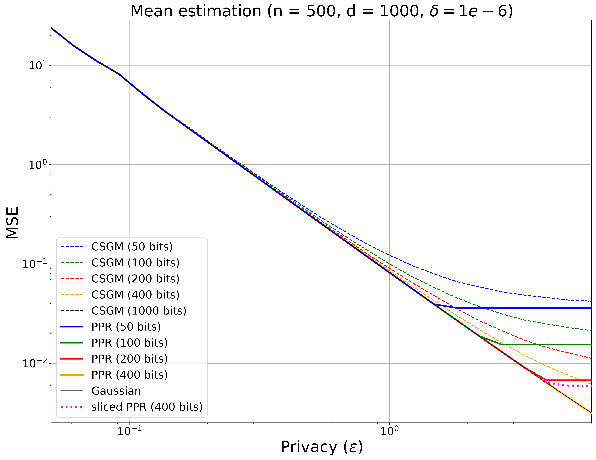
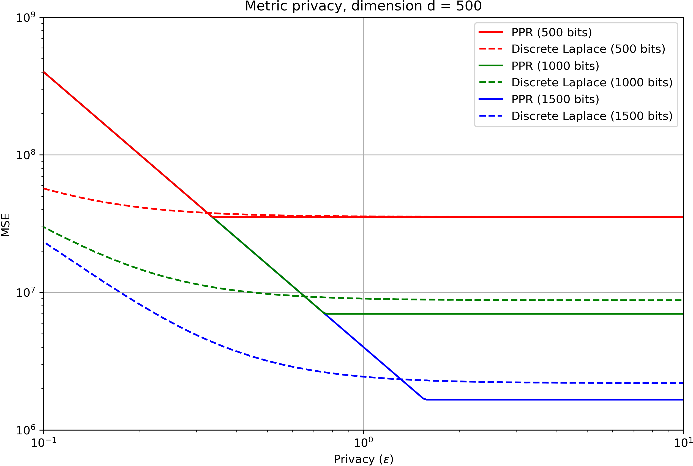
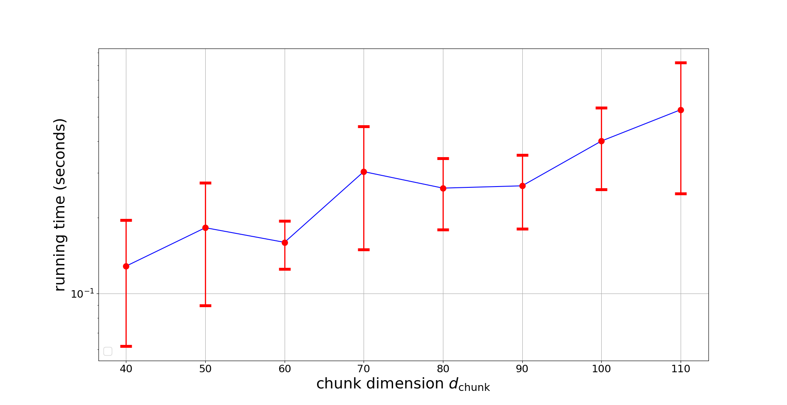

# Universal Exact Compression of Differentially Private Mechanisms

## Abstract

To reduce the communication cost of differential privacy mechanisms, we introduce a novel construction, called Poisson private representation (PPR), designed to compress and simulate any local randomizer while ensuring local differential privacy. Unlike previous simulation-based local differential privacy mechanisms, PPR exactly preserves the joint distribution of the data and the output of the original local randomizer. Hence, the PPR-compressed privacy mechanism retains all desirable statistical properties of the original privacy mechanism such as unbiasedness and Gaussianity. Moreover, PPR achieves a compression size within a logarithmic gap from the theoretical lower bound. Using the PPR, we give a new order-wise trade-off between communication, accuracy, central and local differential privacy for distributed mean estimation. Experiment results on distributed mean estimation show that PPR consistently gives a better trade-off between communication, accuracy and central differential privacy compared to the coordinate subsampled Gaussian mechanism, while also providing local differential privacy.

# Introduction

In modern data science, there is a growing dependence on large amounts of high-quality data, often generated by edge devices (e.g., photos and videos captured by smartphones, or messages hosted by social networks). However, this data inherently contains personal information, making it susceptible to privacy breaches during acquisition, collection, or utilization. For instance, despite the significant recent advancement in foundational models `\citep{bommasani2021opportunities}`{=latex}, studies have shown that these models can accidentally memorize their training data. This poses a risk where malicious users, even with just API access, can extract substantial portions of sensitive information `\citep{carlini2021extracting, carlini2023extracting}`{=latex}. In recent years, differential privacy (DP) `\citep{dwork2006calibrating}`{=latex} has emerged as a powerful framework for safeguarding users’ privacy by ensuring that local data is properly randomized before leaving users’ devices. Apart from privacy concerns, communicating local data from edge devices to the central server often becomes a bottleneck in the system pipeline, especially with high-dimensional data common in many machine learning scenarios. This leads to the following fundamental question: how can we efficiently communicate privatized data?

Recent works have shown that a wide range of differential privacy mechanisms can be “simulated” and “compressed” using shared randomness, resulting in a “compressed mechanism” which has a smaller communication cost compared to the original mechanism, while retaining the (perhaps slightly weakened) privacy guarantee. This can be done via rejection sampling `\citep{feldman2021lossless}`{=latex}, importance sampling `\citep{shah2022optimal, triastcyn2021dp}`{=latex}, or dithered quantization `\citep{lang2023joint,shahmiri2024communication,hasircioglu2023communication,hegazy2024compression,yan2023layered}`{=latex} with each approach having its own advantages and disadvantages. For example, importance-sampling-based methods `\citep{shah2022optimal, triastcyn2021dp}`{=latex} and the rejection-sampling-based method `\citep{feldman2021lossless}`{=latex} can simulate a wide range of privacy mechanisms; however, the output distribution of the induced mechanism does not perfectly match the original mechanism. This is limiting in scenarios where the original mechanism is designed to satisfy some desired statistical properties, e.g. it is often desirable for the local randomizer to be unbiased or to be “summable” noise such as Gaussian or other infinitely divisible distributions. Since the induced mechanism is different from the original one, these statistical properties are not preserved. On the other hand, dithered-quantization-based approaches `\citep{hegazy2022randomized,lang2023joint,shahmiri2024communication,hasircioglu2023communication,hegazy2024compression,yan2023layered}`{=latex} can ensure a correct simulated distribution, but they can only simulate additive noise mechanisms. More importantly, dithered quantization relies on shared randomness between the user and the server, and the server needs to know the dither for decoding. This annuls the local privacy guarantee on the user data, unless we are willing to assume a trusted aggregator `\citep{hasircioglu2023communication}`{=latex}, use an additional secure aggregation step `\citep{hegazy2024compression}`{=latex}, or restrict attention to specific privacy mechanisms (e.g., one-dimensional Laplace `\citep{shahmiri2024communication}`{=latex}).

## Our contribution [our-contribution]

In this paper, we introduce a novel “DP mechanism compressor” called *Poisson private representation (PPR)*, designed to compress and *exactly* simulate *any* local randomizer while ensuring local DP, through the use of shared randomness.[^1] We elaborate on three main advantages of PPR, namely universality, exactness and communication efficiency.

**Universality.** Unlike dithered-quantization-based approaches which can only simulate additive noise mechanisms, PPR can simulate any local or central DP mechanism with discrete or continuous input and output. Moreover, PPR is *universal* in the sense that the user and the server only need to agree on the output space and a proposal distribution, and the user can simulate any DP mechanism with the same output space. The user can choose a suitable DP mechanism and privacy budget according to their communication bandwidth and privacy requirement, without divulging their choice to the server.

**Exactness.** Unlike previous DP mechanism compressors such as `\citet{feldman2021lossless, shah2022optimal, triastcyn2021dp}`{=latex}, PPR enables *exact* simulation, ensuring that the reproduced distribution perfectly matches the original one. Exact distribution recovery offers several advantages. Firstly, the compressed sample maintains the same statistical properties as the uncompressed one. If the local randomizer is unbiased (a crucial requirement for many machine learning tasks like DP-SGD), the outcome of PPR remains unbiased. In contrast, reconstruction distributions in prior simulation-based compression methods `\citep{feldman2021lossless, shah2022optimal}`{=latex} are often biased unless specific debiasing steps are performed (only possible for certain DP mechanisms `\citep{shah2022optimal}`{=latex}). Secondly, when the goal is to compute the mean (e.g., for private mean or frequency estimation problems) and the local noise is “summable” (e.g., Gaussian noise or other infinitely divisible distributions `\citep{kotz2012laplace, goryczka2015comprehensive}`{=latex}), exact distribution recovery of the local noise enables precise privacy accounting for the final *central* DP guarantee, without relying on generic privacy amplification techniques like shuffling `\citep{erlingsson2019amplification,feldman2022hiding}`{=latex}. PPR can compress a central DP mechanism (e.g., the Gaussian mechanism `\citep{dwork2006our}`{=latex}) and simultaneously achieve weaker local DP (i.e., with a larger \\(\varepsilon_{\mathsf{local}}\\)) and stronger central DP (i.e., with a smaller \\(\varepsilon_{\mathsf{central}}\\)), while maintaining exactly the same privacy-utility trade-offs as the uncompressed Gaussian mechanism.

**Communication efficiency.** PPR compresses the output of any DP mechanism to a size close to the theoretical lower bound. For a mechanism on the data \\(X\\) with output \\(Z\\), the compression size of PPR is \\(I(X;Z)+\log (I(X;Z)+1) + O(1)\\), with only a logarithmic gap from the mutual information lower bound \\(I(X;Z)\\).[^2] The “\\(O(1)\\)” constant can be given explicitly in terms of a tunable parameter \\(\alpha > 1\\) which controls the trade-off between compression size, computational time and privacy.

The main technical tool we utilize for PPR is the Poisson functional representation `\citep{sfrl_trans,li2021unified}`{=latex}, which provides precise control over the reconstructed joint distribution in channel simulation problems `\citep{bennett2002entanglement, harsha2010communication, sfrl_trans,flamich2024greedy, goc2024channel,braverman2014public,bennet2014reverse,cuff2013distributed}`{=latex}. Channel simulation aims to achieve the minimum communication for simulating a channel (i.e., a specific conditional distribution). Typically, these methods rely on shared randomness between the user and server, and privacy is only preserved *when the shared randomness is hidden from the adversary*. This setup conflicts with local DP, where the server (which requires access to shared randomness for decoding) is considered adversarial. To ensure local DP, we introduce a randomized encoder based on the Poisson functional representation, which stochastically maps a private local message to its representation. Hence, PPR achieves order-wise trade-offs between privacy, communication, and accuracy, while preserving the original distribution of local randomizers.

**Notations.** Entropy \\(H(X)\\), mutual information \\(I(X;Y)\\), KL divergence \\(D(P\Vert Q)\\) and logarithm are to the same base, e.g., they can be all in bits (base \\(2\\)), or all in nats (base \\(e\\)). For \\(P,Q\\), \\(\mathrm{d} P(\cdot) / \mathrm{d} Q\\) denotes the Radon-Nikodym derivative.

# Related Work

#### Generic compression of local DP mechanisms.

In this work, we consider both central DP `\citep{dwork2006calibrating}`{=latex} and local DP `\citep{warner1965randomized, kasiviswanathan2011can}`{=latex}. Recent research has explored methods for compressing local DP randomizers when shared randomness is involved. For instance, when \\(\varepsilon \leq 1\\), `\citet{bassily2015local}`{=latex} demonstrated that a single bit can simulate any local DP randomizer with a small degradation of utility, as long as the output can be computed using only a subset of the users’ data. `\citet{bun18hh}`{=latex} proposed another generic compression technique based on rejection sampling, which compresses a \\(\varepsilon\\)-DP mechanism into a \\(10\varepsilon\\)-DP mechanism. `\citet{feldman2021lossless}`{=latex} proposed a distributed simulation approach using rejection sampling with shared randomness, while `\citet{shah2022optimal, triastcyn2021dp}`{=latex} utilized importance sampling (or more specifically, minimum random coding `\citep{cuff2008communication,song2016likelihood, havasi2019minimal}`{=latex}). However, all these methods only *approximate* the original local DP mechanism, unlike our scheme, which achieves an *exact* distribution recovery.

#### Distributed mean estimation under DP.

Mean estimation is the canonical problems in distributed learning and analytics. They have been widely studied under privacy `\citep{duchi2013local, bhowmick2018protection, duchi2019lower, asi2022optimal}`{=latex}, communication `\citep{garg2014communication, braverman2016communication, suresh2017distributed}`{=latex}, or both constraints `\citep{chen2020breaking, feldman2021lossless, shah2022optimal, guo2023privacy, chaudhuri2022privacy, chen2024privacy}`{=latex}. Among them, `\citet{asi2022optimal}`{=latex} has demonstrated that the optimal unbiased mean estimation scheme under local differential privacy is \\(\mathsf{privUnit}\\) `\citep{bhowmick2018protection}`{=latex}. Subsequently, communication-efficient mechanisms introduced by `\citet{feldman2021lossless, shah2022optimal, isik2024exact}`{=latex} aimed to construct communication-efficient versions of \\(\mathsf{privUnit}\\), either through distributed simulation or discretization. However, these approaches only approximate the \\(\mathsf{privUnit}\\) distribution, while our proposed method ensures exact distribution recovery.

#### Distributed channel simulation.

Our approach relies on the notion of channel simulation `\citep{bennett2002entanglement, harsha2010communication, sfrl_trans,flamich2024greedy, goc2024channel,braverman2014public,bennet2014reverse,cuff2013distributed}`{=latex}. One-shot channel simulation is a lossy compression task, which aims to find the minimum amount of communications over a noiseless channel that is in need to “simulate” some channel \\(P_{Z|X}\\) (a specific conditional distribution). By `\citet{harsha2010communication,sfrl_trans}`{=latex}, the average communication cost is \\(I(X;Z) + O(\log(I(X;Z)))\\). In `\cite{harsha2010communication}`{=latex}, algorithms based on rejection sampling are proposed, and it is further generalized in `\cite{flamich2023faster}`{=latex} by introducing the greedy rejection coding. Dithered quantization `\cite{ziv1985universal}`{=latex} has also been used to simulate an additive noise channel in `\cite{agustsson2020universally}`{=latex} for neural compression. As also shown in `\cite{agustsson2020universally}`{=latex}, the time complexity of channel simulation protocols (e.g., in `\cite{sfrl_trans}`{=latex}) is usually high, and `\cite{theis2022algorithms, flamich2024greedy, goc2024channel}`{=latex} try to improve the runtime under certain assumptions. Moreover, channel simulation tools have also been used in neural network compression `\cite{havasi2019minimal}`{=latex}, image compression via variational autoencoders `\cite{flamich2020compressing}`{=latex}, diffusion models with perfect realism `\cite{theis2022lossy}`{=latex} and differentially private federated learning `\cite{shah2022optimal}`{=latex}.

#### Poisson functional representation.

The Poisson functional representation is a channel simulation scheme studied in `\citep{sfrl_trans}`{=latex}. Also refer to `\citep{maddison2016poisson}`{=latex} for related constructions for Monte Carlo simulations. Based on the Poisson functional representation, the Poisson matching lemma has been used in proving one-shot achievability results for various network information theory problems `\citep{li2021unified, liu2024one_arxiv}`{=latex}. Also see applications on unequal message protection `\cite{khisti2024unequal}`{=latex}, hypothesis testing `\cite{guo2024hypothesis}`{=latex}, information hiding `\cite{liu2024hiding}`{=latex}, minimax learning `\citep{li2018minimax}`{=latex} and secret key generation `\cite{hentila2024communication}`{=latex}. A variation called the importance matching lemma `\citep{phan2024importance}`{=latex} has also used in distributed lossy compression. By `\citep{flamich2022fast}`{=latex}, the Poisson functional representation can be viewed as a certain variant of the \\(\mathrm{A}^*\\) sampling `\citep{maddison2014sampling, maddison2016poisson}`{=latex}, and hence an optimized version with better runtime for one-dimensional unimodal distribution has been proposed in `\citep{flamich2022fast}`{=latex}.

# Preliminaries [sec::preliminary]

We begin by reviewing the formal definitions of differential privacy (DP). We consider two models of DP data analysis. In the central model, introduced in `\citet{dwork2006calibrating}`{=latex}, the data of the individuals is stored in a database \\(X \in \mathcal{X}\\) by the server. The server is then trusted to perform data analysis whose output \\(Z = \mathcal{A}(X) \in \mathcal{Z}\\) (where \\(\mathcal{A}\\) is a randomized algorithm), which is sent to an untrusted data analyst, does not reveal too much information about any particular individual’s data. While this model requires a higher level of trust than the local model, it is possible to design significantly more accurate algorithms. We say that two databases \\(X,X' \in \mathcal{X}\\) are neighboring if they differ in a single data point. More generally, we can consider a symmetric neighbor relation \\(\mathcal{N} \subseteq \mathcal{X}^2\\), and regard \\(X,X'\\) as neighbors if \\((X,X')\in \mathcal{N}\\).

On the other hand, in the local model, each individual (or client) randomizes their data before sending it to the server, meaning that individuals are not required to trust the server. A local DP mechanism `\citep{kasiviswanathan2011can}`{=latex} is a local randomizer \\(\mathcal{A}\\) that maps the local data \\(X\in \mathcal{X}\\) to the output \\(Z  = \mathcal{A}(X) \in \mathcal{Z}\\). Note that here \\(X\\) is the data at one user, unlike central-DP where \\(X\\) is the database with the data of all users. We now review the notion of \\((\varepsilon, \delta)\\)-central and local DP.

**Definition 1** (Differential privacy `\citep{ dwork2006calibrating,kasiviswanathan2011can}`{=latex}). Given a mechanism \\(\mathcal{A}\\) which induces the conditional distribution \\(P_{Z|X}\\) of \\(Z = \mathcal{A}(X)\\), we say that it satisfies \\((\varepsilon, \delta)\\)-DP if for any neighboring \\((x, x') \in \mathcal{N}\\) and \\(\mathcal{S} \subseteq \mathcal{Z}\\), it holds that \\[\Pr ( Z \in \mathcal{S}\, |\, X=x ) \leq  e^\varepsilon \Pr ( Z \in \mathcal{S}\, |\, X=x' ) + \delta.\\] In particular, if \\(\mathcal{N} = \mathcal{X}^2\\), we say that the mechanism satisfies \\((\varepsilon, \delta)\\)-local DP `\citep{kasiviswanathan2011can}`{=latex}.[^3]

When a mechanism satisfies \\((\varepsilon, 0)\\)-central/local DP, we will refer to it simply as \\(\varepsilon\\)-central/local DP. \\(\varepsilon\\)-DP can be generalized to *metric privacy* by considering a metric \\(d_{\mathcal{X}}(x,x')\\) over \\(\mathcal{X}\\) `\cite{chatzikokolakis2013broadening,andres2013geo}`{=latex}.

**Definition 2** (\\(\varepsilon\cdot d_{\mathcal{X}}\\)-privacy `\citep{chatzikokolakis2013broadening,andres2013geo}`{=latex}). Given a mechanism \\(\mathcal{A}\\) with conditional distribution \\(P_{Z|X}\\), and a metric \\(d_{\mathcal{X}}\\) over \\(\mathcal{X}\\), we say that \\(\mathcal{A}\\) satisfies \\(\varepsilon\cdot d_{\mathcal{X}}\\)-privacy if for any \\(x, x' \in \mathcal{X}\\), \\(\mathcal{S} \subseteq \mathcal{Z}\\), we have \\[\Pr ( Z \in \mathcal{S}\, |\, X=x ) \leq  e^{\varepsilon \cdot d_{\mathcal{X}}(x,x')} \Pr ( Z \in \mathcal{S}\, |\, X=x' ).\\]

This recovers the original \\(\varepsilon\\)-central DP by considering \\(d_{\mathcal{X}}\\) to be the Hamming distance among databases, and recovers the original \\(\varepsilon\\)-local DP by considering \\(d_{\mathcal{X}}\\) to be the discrete metric `\cite{chatzikokolakis2013broadening}`{=latex}.

The reason we use \\(X\\) to refer to both the database in central DP and the user’s data in local DP is that our proposed method can compress both central and local DP mechanisms in exactly the same manner. In the following sections, the mechanism \\(\mathcal{A}\\) to be compressed (often written as a conditional distribution \\(P_{Z|X}\\)) can be either a central or local DP mechanism, and the neighbor relation \\(\mathcal{N}\\) can be any symmetric relation. The “encoder” refers to the server in central DP, or the user in local DP. The “decoder” refers to the data analyst in central DP, or the server in local DP.

# Poisson Private Representation

**Definition 3** (Poisson functional representation `\citep{sfrl_trans,li2021unified}`{=latex}). Let \\((T_{i})_{i}\\) be a Poisson process with rate \\(1\\) (i.e., \\(T_{1},T_{2}-T_{1},T_{3}-T_{2},\ldots\stackrel{iid}{\sim}\mathrm{Exp}(1)\\)), independent of \\(Z_{i}\stackrel{iid}{\sim}Q\\) for \\(i=1,2,\ldots\\). Then \\((Z_{i},T_{i})_{i}\\) is a Poisson process with intensity measure \\(Q\times\lambda_{[0,\infty)}\\) `\cite{last2017lectures}`{=latex}, where \\(\lambda_{[0,\infty)}\\) is the Lebesgue measure over \\([0,\infty)\\). Fix any distribution \\(P\\) over \\(\mathcal{Z}\\) that is absolutely continuous with respect to \\(Q\\). Let \\[\tilde{T}_{i}:=T_{i} \cdot \Big(\frac{\mathrm{d}P}{\mathrm{d}Q}(Z_{i})\Big)^{-1}.
    \label{eq:PFR}\\] Then \\((Z_{i},\tilde{T}_{i})\\) is a Poisson process with intensity measure \\(P\times\lambda_{[0,\infty)}\\), which is from the mapping theorem `\citep{last2017lectures}`{=latex}. The *Poisson functional representation* (PFR) `\citep{sfrl_trans,li2021unified}`{=latex} selects the point \\(Z=Z_{K}\\) with the smallest associated \\(\tilde{T}_{K}\\), i.e., let \\(K:=\mathrm{argmin}_{i}\tilde{T}_{i}\\) and \\(Z := Z_K\\).[^4]

The PFR selects a sample following the target distribution \\(P\\) using another distribution \\(Q\\). It draws a random sequence \\((Z_i)_i\\) from \\(Q\\) and a sequence of times \\((T_i)_i\\) according to a Poisson process. If we select the sample \\(Z_i\\) with the smallest \\(T_i\\), then the selected sample follows \\(Q\\). To obtain a sample from \\(P\\) instead, we multiply the time by the factor \\((\frac{\mathrm{d}P}{\mathrm{d}Q}(Z_{i}))^{-1}\\) in <a href="#eq:PFR" data-reference-type="eqref" data-reference="eq:PFR">[eq:PFR]</a> to give \\(\tilde{T}_i\\), so the \\(Z_i\\) with the smallest \\(\tilde{T}_i\\) will follow \\(P\\).

The Poisson functional representation guarantees that \\(Z \sim P\\) `\citep{sfrl_trans}`{=latex}. To simulate a DP mechanism with a conditional distribution \\(P_{Z|X}\\) using the Poisson functional representation, we can use \\((Z_{i})_{i}\\) as the shared randomness between the encoder and the decoder.

[^5]

Upon observing \\(X\\), the encoder generates the Poisson process \\((T_{i})_{i}\\), computes \\(\tilde{T}_{i}\\) and \\(K\\) using \\(P=P_{Z|X}\\), and transmits \\(K\\) to the decoder. The decoder simply outputs \\(Z_{K}\\), which follows the conditional distribution \\(P_{Z|X}\\). The issue is that \\(K\\) is a function of \\(X\\) and the shared randomness \\((Z_{i},T_{i})_{i}\\), and a change of \\(X\\) may affect \\(K\\) in a deterministic manner, and hence this method cannot be directly used to protect the privacy of \\(X\\).

**Poisson private representation.** To ensure privacy, we introduce randomness in the encoder by a generalization of the Poisson functional representation, which we call *Poisson private representation (PPR)* with parameter \\(\alpha\in(1,\infty]\\), proposal distribution \\(Q\\) and the simulated mechanism \\(P_{Z|X}\\). Both \\(X\\) and \\(Z\\) can be discrete or continuous, though as a regularity condition, we require \\(P_{Z|X}(\cdot |X)\\) to be absolutely continuous with respect to \\(Q\\) almost surely. The PPR-compressed mechanism is given as:

1.  We use \\((Z_{i})_{i=1,2,\ldots}\\), \\(Z_{i}\stackrel{iid}{\sim}Q\\) as the shared randomness between the encoder and the decoder. Practically, the encoder and the decoder can share a random seed and generate \\(Z_{i}\stackrel{iid}{\sim}Q\\) from it using a pseudorandom number generator.[^6]

2.  The encoder knows \\((Z_{i})_{i},X, P_{Z|X}\\) and performs the following steps:

    1.  Generates the Poisson process \\((T_{i})_{i}\\) with rate \\(1\\).

    2.  Computes \\(\tilde{T}_{i}:=T_{i} \cdot (\frac{\mathrm{d}P}{\mathrm{d}Q}(Z_{i}))^{-1}\\), where \\(P:=P_{Z|X}(\cdot|X)\\). Take \\(\tilde{T}_{i}=\infty\\) if \\(\frac{\mathrm{d}P}{\mathrm{d}Q}(Z_{i})=0\\).

    3.  Generates \\(K\in\mathbb{Z}_{+}\\) using local randomness with \\[\Pr(K=k)=\frac{\tilde{T}_{k}^{-\alpha}}{\sum_{i=1}^{\infty}\tilde{T}_{i}^{-\alpha}}.\\]

    4.  Compress \\(K\\) (e.g., using Elias delta coding `\cite{elias1975universal}`{=latex}) and sends \\(K\\).

3.  The decoder, which knows \\((Z_{i})_{i},K\\), outputs \\(Z=Z_{K}\\).

Note that when \\(\alpha=\infty\\), we have \\(K=\mathrm{argmin}_{i}\tilde{T}_{i}\\), and PPR reduces to the original Poisson functional representation `\cite{sfrl_trans,li2021unified}`{=latex}. PPR can simulate the privacy mechanism \\(P_{Z|X}\\) precisely, as shown in the following proposition. The proof is in Appendix <a href="#sec:pf_ppr_output_dist" data-reference-type="ref" data-reference="sec:pf_ppr_output_dist">[sec:pf_ppr_output_dist]</a>.

**Proposition 4**. *The output \\(Z\\) of PPR follows the conditional distribution \\(P_{Z|X}\\) exactly.*

Due to the *exactness* of PPR, it guarantees unbiasedness for tasks such as DME. If the goal is only to design a stand-alone privacy mechanism, we can focus on the privacy and utility of the mechanism without studying the output distribution. However, if the output of the mechanism is used for downstream tasks (e.g., for DME, after receiving information from clients, the server sends information about the aggregated mean to data analysts, where central DP is crucial), having an exact characterization of the conditional distribution of the output given the input allows us to obtain precise (central) privacy and utility guarantees.

Notably, PPR is *universal* in the sense that only the encoder needs to know the simulated mechanism \\(P_{Z|X}\\). The decoder can decode the index \\(K\\) as long as it has access to the shared randomness \\((Z_i)_i\\). This allows the encoder to choose an arbitrary mechanism \\(P_{Z|X}\\) with the same \\(\mathcal{Z}\\), and adapt the choice of \\(P_{Z|X}\\) to the communication and privacy constraints without explicitly informing the decoder which mechanism is chosen.

Practically, the algorithm cannot compute the whole infinite sequence \\((\tilde{T}_{i})_i\\). We can truncate the method and only compute \\(\tilde{T}_{i},\ldots,\tilde{T}_{N}\\) for a large \\(N\\) and select \\(K\in\{1,\ldots,N\}\\), which incurs a small distortion in the distribution of \\(Z\\).[^7] While this method is practically acceptable, it might defeat the purpose of having an exact algorithm that ensures the correct conditional distribution \\(P_{Z|X}\\). In Appendix <a href="#sec:reparametrization" data-reference-type="ref" data-reference="sec:reparametrization">[sec:reparametrization]</a>, we will present an exact algorithm for PPR that terminates in a finite amount of time, using a reparametrization that allows the encoder to know when the optimal point \\(Z_i\\) has already been encountered (see Algorithm <a href="#alg:ppr" data-reference-type="ref" data-reference="alg:ppr">2</a> in Appendix <a href="#sec:reparametrization" data-reference-type="ref" data-reference="sec:reparametrization">[sec:reparametrization]</a>).

By the lower bound for channel simulation `\cite{bennett2002entanglement,sfrl_trans}`{=latex}, we must have \\(H(K)\ge I(X;Z)\\), i.e., the compression size is at least the mutual information between the data \\(X\\) and the output \\(Z\\). The following result shows that the compression provided by PPR is “almost optimal”, i.e., close to the theoretical lower bound \\(I(X;Z)\\). The proof is given in Appendix <a href="#sec:pf_logk_bound_simple" data-reference-type="ref" data-reference="sec:pf_logk_bound_simple">[sec:pf_logk_bound_simple]</a>.

**Theorem 5** (Compression size of PPR). *For PPR with parameter \\(\alpha>1\\), when the encoder is given the input \\(x\\), the message \\(K\\) given by PPR satisfies \\[\begin{aligned}
\mathbb{E}[\log K] & \le D(P\Vert Q)+(\log(3.56)) / \min\{(\alpha-1)/2,1\},
\end{aligned}\\] where \\(P:=P_{Z|X}(\cdot|x)\\). As a result, when the input \\(X\sim P_{X}\\) is random, taking \\(Q=P_{Z}\\), we have \\[\begin{aligned}
\mathbb{E}[\log K] & \le I(X;Z)+(\log(3.56)) / \min\{(\alpha-1)/2,1\}.
\end{aligned}\\]*

Note the running time complexity (which depends on the number of samples \\(Z_i\\) the algorithm must examine before outputting the index \\(K\\)) can be quite high. Since \\(\mathbb{E}[\log K] \approx I(X;Z)\\), \\(K\\) (and hence the running time) is at least exponential in \\(I(X;Z)\\). See more discussions in Section <a href="#sec:limitations" data-reference-type="ref" data-reference="sec:limitations">[sec:limitations]</a>.

If a prefix-free encoding of \\(K\\) is required, then the number of bits needed is slightly larger than \\(\log_2 K\\). For example, if Elias delta code `\cite{elias1975universal}`{=latex} is used, the expected compression size is \\(\le\mathbb{E}[\log_{2}K]+2\log_{2}(\mathbb{E}[\log_{2}K]+1)+1\\) bits. If the Shannon code `\cite{shannon1948mathematical}`{=latex} (an almost-optimal prefix-free code) for the Zipf distribution \\(p(k) \propto k^{-\lambda}\\) with \\(\lambda = 1 + 1/\mathbb{E}[\log_{2}K]\\) is used, the expected compression size is \\(\le\mathbb{E}[\log_{2}K]+\log_{2}(\mathbb{E}[\log_{2}K]+1)+2\\) bits (see `\cite{sfrl_trans}`{=latex}). Both codes yield an \\(I(X;Z)+O(\log I(X;Z))\\) size, within a logarithmic gap from the lower bound \\(I(X;Z)\\). This is similar to some other channel simulation schemes such as `\cite{harsha2010communication,braverman2014public,sfrl_trans}`{=latex}, though these schemes do not provide privacy guarantees.

Note that if \\(P_{Z|X}\\) is \\(\varepsilon\\)-DP, then by definition, for any \\(z \in \mathcal{Z}\\) and \\(x, x_0 \in \mathcal{X}\\), it holds that \\[D\left(P_{Z|X = x} \middle \Vert P_{Z|X = x_0} \right)= \mathbb{E}_{Z \sim P_{Z|X = x}}\left[\log\left(\frac{\mathrm{d}P_{Z|X = x}}{\mathrm{d}P_{Z|X = x_0}}(Z)  \right)\right]\leq \varepsilon \log e.\\] Setting the proposal distribution \\(Q = P_{Z|X = x_0}\\) for an arbitrary \\(x_0 \in \mathcal{X}\\) gives the following bound.

**Corollary 6** (Compression size under \\(\varepsilon\\)-LDP). *Let \\(P_{Z|X}\\) satisfy \\(\varepsilon\\)-differential privacy. Let \\(x_0 \in \mathcal{X}\\) and \\(Q = P_{Z|X = x_0}\\). Then for PPR with parameter \\(\alpha > 1\\), the expected compression size is at most \\(\ell + \log_2(\ell+1)+2\\) bits, where \\(\ell :=\varepsilon \log_2 e + {(\log_2(3.56))}/{\min\left\{(\alpha - 1)/2, 1 \right\}}\\).*

Next, we analyze the privacy guarantee of PPR. The PPR method induces a conditional distribution \\(P_{(Z_{i})_{i},K|X}\\) of the knowledge of the decoder \\(((Z_{i})_{i},K)\\), given the data \\(X\\). To analyze the privacy guarantee, we study whether the randomized mapping \\(P_{(Z_{i})_{i},K|X}\\) from \\(X\\) to \\(((Z_{i})_{i},K)\\) satisfies \\(\varepsilon\\)-DP or \\((\varepsilon,\delta)\\)-DP.

[^8]

This is similar to the privacy condition in `\cite{shah2022optimal}`{=latex}, and is referred as *decoder privacy* in `\cite{shahmiri2024communication}`{=latex}, which is stronger than *database privacy* which concerns the privacy of the randomized mapping from \\(X\\) to the final output \\(Z\\) `\cite{shahmiri2024communication}`{=latex} (which is simply the privacy of the original mechanism \\(P_{Z|X}\\) to be compressed since PPR simulates \\(P_{Z|X}\\) precisely).

Since the decoder knows \\(((Z_{i})_{i},K)\\), more than just the final output \\(Z\\), we expect that the PPR-compressed mechanism \\(P_{(Z_{i})_{i},K|X}\\) to have a worse privacy guarantee than the original mechanism \\(P_{Z|X}\\), which is the price of having a smaller communication cost. The following result shows that, if the original mechanism \\(P_{Z|X}\\) is \\(\varepsilon\\)-DP, then the PPR-compressed mechanism is guaranteed to be \\(2\alpha\varepsilon\\)-DP.

**Theorem 7** (\\(\varepsilon\\)-DP of PPR). *If the mechanism \\(P_{Z|X}\\) is \\(\varepsilon\\)-differentially private, then PPR \\(P_{(Z_{i})_{i},K|X}\\) with parameter \\(\alpha>1\\) is \\(2\alpha\varepsilon\\)-differentially private.*

Similar results also apply to \\((\varepsilon,\delta)\\)-DP and metric DP.

**Theorem 8** (\\((\varepsilon,\delta)\\)-DP of PPR). *If the mechanism \\(P_{Z|X}\\) is \\((\varepsilon,\delta)\\)-differentially private, then PPR \\(P_{(Z_{i})_{i},K|X}\\) with parameter \\(\alpha>1\\) is \\((2\alpha\varepsilon, 2\delta)\\)-differentially private.*

**Theorem 9** (Metric privacy of PPR). *If the mechanism \\(P_{Z|X}\\) satisfies \\(\varepsilon \cdot d_{\mathcal{X}}\\)-privacy, then PPR \\(P_{(Z_{i})_{i},K|X}\\) with parameter \\(\alpha>1\\) satisfies \\(2\alpha\varepsilon \cdot d_{\mathcal{X}}\\)-privacy.*

Refer to Appendices <a href="#sec:pf_eps_dp" data-reference-type="ref" data-reference="sec:pf_eps_dp">[sec:pf_eps_dp]</a> and <a href="#sec:eps_delta_dp_2" data-reference-type="ref" data-reference="sec:eps_delta_dp_2">[sec:eps_delta_dp_2]</a> for the proofs. In Theorem <a href="#thm:eps_dp" data-reference-type="ref" data-reference="thm:eps_dp">7</a> and Theorem <a href="#thm:eps_delta_dp_2" data-reference-type="ref" data-reference="thm:eps_delta_dp_2">8</a>, PPR imposes a multiplicative penalty \\(2\alpha\\) on the privacy parameter \\(\varepsilon\\).

This penalty can be made arbitrarily close to \\(2\\) by taking \\(\alpha\\) close to \\(1\\), which increases the communication cost (see Theorem <a href="#thm:logk_bound_simple" data-reference-type="ref" data-reference="thm:logk_bound_simple">5</a>). Compared to minimal random coding which has a factor \\(2\\) penalty in the DP guarantee `\cite{havasi2019minimal,shah2022optimal}`{=latex}, the \\(2\alpha\\) factor in PPR is slightly larger, though PPR ensures exact simulation (unlike `\cite{havasi2019minimal,shah2022optimal}`{=latex} which are approximate). The method in `\cite{feldman2021lossless}`{=latex} does not have a penalty on \\(\varepsilon\\), but the utility and compression size depends on computational hardness assumptions on the pseudorandom number generator, and there is no guarantee that the compression size is close to the optimum. In comparison, the compression and privacy guarantees of PPR are *unconditional* and does not rely on computational assumptions.

In order to make the penalty of PPR close to \\(1\\), we have to consider \\((\varepsilon,\delta)\\)-differential privacy, and allow a small failure probability, i.e., a small increase in \\(\delta\\). The

following result shows that PPR can compress any \\(\varepsilon\\)-DP mechanism into a \\((\approx \varepsilon,\, \approx 0)\\)-DP mechanism as long as \\(\alpha\\) is close enough to \\(1\\) (i.e., almost no inflation).

More generally, PPR can compress an \\((\varepsilon,\delta)\\)-DP mechanism into an \\((\approx\varepsilon,\,\approx2\delta)\\)-DP mechanism for \\(\alpha\\) close to \\(1\\).

The proof is in Appendix <a href="#sec:pf_eps_delta_dp" data-reference-type="ref" data-reference="sec:pf_eps_delta_dp">[sec:pf_eps_delta_dp]</a>.

**Theorem 10** (Tighter \\((\varepsilon,\delta)\\)-DP of PPR). *If the mechanism \\(P_{Z|X}\\) is \\((\varepsilon,\delta)\\)-differentially private, then PPR \\(P_{(Z_{i})_{i},K|X}\\) with parameter \\(\alpha>1\\) is \\((\alpha\varepsilon+\tilde{\varepsilon},\,2(\delta+\tilde{\delta}))\\)-differentially private, for every \\(\tilde{\varepsilon}\in(0,1]\\) and \\(\tilde{\delta}\in(0,1/3]\\) that satisfy \\(\alpha\le e^{-4.2}\tilde{\delta}\tilde{\varepsilon}^{2} / (-\ln\tilde{\delta}) +1\\).*

# Applications to Distributed Mean Estimation [sec:mean_estimation]

We demonstrate the efficacy of PPR by applying it to distributed mean estimation (DME) `\citep{suresh2017distributed}`{=latex}. Note that private DME is the core sub-routine in various private and federated optimization algorithms, such as DP-SGD `\citep{abadi2016deep}`{=latex} or DP-FedAvg `\citep{mcmahan2017communication}`{=latex}.

Consider the following general distributed setting: each of \\(n\\) clients holds a local data point \\(X_i\in \mathcal{X}\\), and a central server aims to estimate a function of all local data \\(\mu\left(X^n\right)\\), subject to privacy and local communication constraints. To this end, each client \\(i\\) compresses \\(X_i\\) into a message \\(Z_i\in\mathcal{Z}_n\\) via a local encoder, and we require that each \\(Z_i\\) can be encoded into a bit string with an expected length of at most \\(b\\) bits. Upon receiving \\(Z^n:=\left(Z_1,\ldots, Z_n\right)\\), the central server decodes it and outputs a DP estimate \\(\hat{\mu}\\). Two DP criteria can be considered: the \\((\varepsilon,\delta)\\)-central DP of the randomized mapping from \\(X^n\\) to \\(\hat{\mu}\\), and the \\((\varepsilon,\delta)\\)-local DP of the randomized mapping from \\(X_i\\) to \\(Z_i\\) for each client \\(i\\).

In the distributed \\(L_2\\) mean estimation problem, \\(\mathcal{X} = \mathcal{B}_d(C) := \left\{v \in \mathbb{R}^d \,\middle\vert\, \left\lVert v \right\rVert_2 \leq C \right\}\\), and the central server aims to estimate the sample mean \\(\mu(X^n) := \frac{1}{n} \sum_{i=1}^n X_i\\) by minimizing the mean squared error (MSE) \\(\mathbb{E}[\left\lVert\mu - \hat{\mu}\right\rVert_2^2]\\). It is recently proved that under \\(\varepsilon\\)-local DP, \\(\mathsf{privUnit}\\) `\citep{bhowmick2018protection, asi2022optimal}`{=latex} is the optimal mechanism. By simulating \\(\mathsf{privUnit}\\) with PPR and applying Corollary <a href="#cor:generic_compression_bdd" data-reference-type="ref" data-reference="cor:generic_compression_bdd">6</a> and Theorem <a href="#thm:eps_delta_dp_2" data-reference-type="ref" data-reference="thm:eps_delta_dp_2">8</a>, we immediately obtain the following corollary:

**Corollary 11** (PPR simulating \\(\mathsf{privUnit}\\)). *Let \\(P\\) be the density defined by \\(\varepsilon\\)-\\(\mathsf{privUnit}_2\\) `\citet[Algorithm~1]{bhowmick2018protection}`{=latex}. Let \\(Q\\) be the uniform density over the sphere \\(\mathbb{S}^{d-1}\left(1/m \right)\\) where the radius \\(1/m\\) is defined in `\citet[(15)]{bhowmick2018protection}`{=latex}. Let \\(r^* := e^\varepsilon\\). Then the outcome of PPR (see Algorithm <a href="#alg:ppr" data-reference-type="ref" data-reference="alg:ppr">2</a>) satisfies (1) \\(2\alpha\varepsilon\\)-local DP; and (2) \\((\alpha\varepsilon+\tilde{\varepsilon}, 2\tilde{\delta})\\)-DP for any \\(\alpha \leq e^{-4.2}\tilde{\delta}\tilde{\varepsilon}^2/\log(1/\tilde{\delta}) +1\\). In addition, the average compression size is at most \\(\ell + \log_2(\ell + 1) + 2\\) bits where \\(\ell := \varepsilon + (\log_2\left(3.56 \right))/\min\{(\alpha-1)/2, 1\}\\). Moreover, PPR achieves the same MSE as \\(\varepsilon\\)-\\(\mathsf{privUnit}_2\\), which is \\(O\left(d/\min\left(\varepsilon, \varepsilon^2 \right)\right)\\).*

Note that PPR can simulate arbitrary local DP mechanisms. However, we present only the result of \\(\mathsf{privUnit}_2\\) because it achieves the optimal privacy-accuracy trade-off. Besides simulating local DP mechanisms, PPR can also compress central DP mechanisms while still preserving some (albeit weaker) local guarantees. We give a corollary of Theorems <a href="#thm:logk_bound_simple" data-reference-type="ref" data-reference="thm:logk_bound_simple">5</a> and <a href="#thm:eps_delta_dp_2" data-reference-type="ref" data-reference="thm:eps_delta_dp_2">8</a>. The proof is in Appendix <a href="#sec:pf_gaussian_ppr2" data-reference-type="ref" data-reference="sec:pf_gaussian_ppr2">[sec:pf_gaussian_ppr2]</a>.

**Corollary 12** (PPR-compressed Gaussian mechanism). *Let \\(\varepsilon,\delta \in (0,1)\\). Consider the Gaussian mechanism \\(P_{Z|X}(\cdot | x) = \mathcal{N}( x, \frac{\sigma^2}{n}\mathbb{I}_d)\\), and the proposal distribution \\(Q=\mathcal{N}(0,(\frac{C^{2}}{d}+\frac{\sigma^{2}}{n})\mathbb{I}_{d})\\), where \\(\sigma \geq \frac{C\sqrt{2\ln\left(1.25/\delta \right)}}{\varepsilon}\\). For each client \\(i\\), let \\(Z_i\\) be the output of PPR applied on \\(P_{Z|X}(\cdot | X_i)\\). We have:*

- *\\(\hat{\mu}(Z^n) := \frac{1}{n}\sum_i Z_i\\) yields an unbiased estimator of \\(\mu( X^n) = \frac{1}{n} \sum_{i=1}^n X_i\\) satisfying \\((\varepsilon, \delta)\\)-central DP and has MSE \\(\mathbb{E}[\left\lVert\mu - \hat{\mu}\right\rVert_2^2] = \sigma^2 d/n^2\\).*

- *As long as \\(\varepsilon < 1/\sqrt{n}\\), PPR satisfies \\(\left(2\alpha\sqrt{n}\varepsilon, 2\delta\right)\\)-local DP.[^9]*

- *The average per-client communication cost is at most \\(\ell + \log_2(\ell + 1) + 2\\) bits where \\[\begin{aligned}
  \ell & :=\frac{d}{2}\log_{2}\Big(\frac{C^{2}n}{d\sigma^{2}}+1\Big)+\eta_{\alpha} \; \le\;\frac{d}{2}\log_{2}\Big(\frac{n\varepsilon^{2}}{2d\ln(1.25/\delta)}+1\Big)+\eta_{\alpha},
  \end{aligned}\\] where \\(\eta_{\alpha}:=(\log_{2}(3.56))/\min\{(\alpha-1)/2,\,1\}\\).*

A few remarks are in order. First, notice that when \\(\alpha\\) is fixed, for an \\(O(\frac{C^2 d}{n^2\varepsilon^2}\log(1/\delta))\\) MSE, the per-client communication cost is \\[O\Big(d\log\Big(\frac{n\varepsilon^{2}}{d\log(1/\delta)}+1\Big)+1\Big),\\] which is at least as good as the \\(O(n\varepsilon^{2}/\log(1/\delta)+1)\\) bound in `\citep{suresh2017distributed, chen2024privacy}`{=latex}, and can be better than \\(O(n\varepsilon^{2}/\log(1/\delta)+1)\\) when \\(n \gg d\\). Hence, the PPR-compressed Gaussian mechanism is order-wise optimal. Second, compared to other works that also compress the Gaussian mechanism, PPR is the only lossless compressor; schemes based on random sparsification, projection, or minimum random coding (e.g., `\citet{triastcyn2021dp, chen2024privacy}`{=latex}) are *lossy*, i.e., they introduce additional distortion on top of the DP noise. Finally, other DP mechanism compressors tailored to local randomizers `\citep{feldman2021lossless, shah2022optimal}`{=latex} do not provide the same level of central DP guarantees when applied to local Gaussian noise since the reconstructed noise is no longer Gaussian. Refer to Section <a href="#sec::exp" data-reference-type="ref" data-reference="sec::exp">7</a> for experiments.

# Applications to Metric Privacy

Metric privacy `\cite{chatzikokolakis2013broadening,andres2013geo}`{=latex} (see Definition <a href="#def:metric_privacy" data-reference-type="ref" data-reference="def:metric_privacy">2</a>) allows users to send privatized version \\(Z \in \mathbb{R}^d\\) of their data vectors \\(X \in \mathbb{R}^d\\) to an untrusted server, so that the server can know \\(X\\) approximately but not exactly. A popular mechanism is the *Laplace mechanism* `\cite{chatzikokolakis2013broadening,andres2013geo,fernandes2019generalised,feyisetan2020privacy}`{=latex}, where a \\(d\\)-dimensional Laplace noise is added to \\(X\\). The conditional density function of \\(Z\\) given \\(X\\) is \\(f_{Z|X}(z|x) \propto e^{-\varepsilon d_{\mathcal{X}}(x,z)}\\), where \\(\varepsilon\\) is the privacy parameter, and the metric \\(d_{\mathcal{X}}(x,z)=\Vert x-z \Vert_2\\) is the Euclidean distance. The Laplace mechanism achieves \\(\varepsilon \cdot d_{\mathcal{X}}\\)-privacy, and has been used, for example, in geo-indistinguishability to privatize the users’ locations `\cite{andres2013geo}`{=latex}, and to privatize high-dimensional word embedding vectors `\cite{fernandes2019generalised,feyisetan2020privacy}`{=latex}.

A problem is that the real vector \\(Z\\) cannot be encoded into finitely many bits. To this end, `\cite{andres2013geo}`{=latex} studies a *discrete Laplace mechanism* where each coordinate of \\(Z\\) is quantized to a finite number of levels, introducing additional distortion to \\(Z\\). PPR provides an alternative compression method that preserves the statistical behavior of \\(Z\\) (e.g., unbiasedness) exactly. We give a corollary of Theorems <a href="#thm:logk_bound_simple" data-reference-type="ref" data-reference="thm:logk_bound_simple">5</a> and <a href="#thm:metric_privacy" data-reference-type="ref" data-reference="thm:metric_privacy">9</a>. The proof is in Appendix <a href="#sec:pf_laplace_ppr" data-reference-type="ref" data-reference="sec:pf_laplace_ppr">[sec:pf_laplace_ppr]</a>. Refer to Appendix <a href="#sec:exp_laplace" data-reference-type="ref" data-reference="sec:exp_laplace">[sec:exp_laplace]</a> for an experiment on metric privacy.

**Corollary 13** (PPR-compressed Laplace mechanism). *Consider PPR applied to the Laplace mechanism \\(P_{Z|X}\\) where \\(X\in\mathcal{B}_{d}(C)=\{x\in\mathbb{R}^{d}\,|\,\Vert x\Vert_{2}\le C\}\\), with a proposal distribution \\(Q=\mathcal{N}(0,(\frac{C^{2}}{d}+\frac{d+1}{\varepsilon^{2}})\mathbb{I}_{d})\\). It achieves an MSE \\(\frac{d(d+1)}{\varepsilon^{2}}\\), a \\(2\alpha\epsilon\cdot d_{\mathcal{X}}\\)-privacy, and a compression size at most \\(\ell+\log_{2}(\ell+1)+2\\) bits, where \\[\begin{aligned}
\ell & :=\frac{d}{2}\log_{2}\left(\frac{2}{e}\left(\frac{C^{2}\varepsilon^{2}}{d}+d+1\right)\right)-\log_{2}\frac{\Gamma(d+1)}{\Gamma(\frac{d}{2}+1)}+\eta_{\alpha},
\end{aligned}\\] where \\(\eta_{\alpha}:=(\log_{2}(3.56))/\min\{(\alpha-1)/2,\,1\}\\).*

# Empirical Results [sec::exp]

We empirically evaluate our scheme on the DME problem (which is formally introduced in Section <a href="#sec:mean_estimation" data-reference-type="ref" data-reference="sec:mean_estimation">5</a>), examine the privacy-accuracy-communication trade-off, and compare it with the Coordinate Subsampled Gaussian Mechanism (CSGM) `\citep[Algorithm 1]{chen2024privacy}`{=latex}, an order-optimal scheme for DME under central DP. In `\citet{chen2024privacy}`{=latex}, each client only communicates partial information (via sampling a subset of the coordinates of the data vector) about its samples to amplify the privacy, and the compression is mainly from subsampling. Moreover, CSGM only guarantees central DP.

We use the same setup that has been used in `\cite{chen2024privacy}`{=latex}: consider \\(n=500\\) clients, and the dimension of local vectors is \\(d=1000\\), each of which is generated according to \\(X_i(j)\overset{\mathrm{i.i.d.}}{\sim} 
\left(2\cdot \mathrm{Ber}(0.8) - 1 \right)\\), where \\(\mathrm{Ber}(0.8)\\) is a Bernoulli random variable with parameter \\(p = 0.8\\). We require \\((\varepsilon,\delta)\\)-central DP with \\(\delta = 10^{-6}\\) and \\(\varepsilon \in [0.05, 6]\\) and apply the PPR with \\(\alpha =  2\\) to simulate the Gaussian mechanism, where the privacy budgets are accounted via Rényi DP.

We compare the MSE of PPR (\\(\alpha =  2\\), using Theorem <a href="#thm:logk_bound_simple" data-reference-type="ref" data-reference="thm:logk_bound_simple">5</a>) and CSGM under various compression sizes in Figure <a href="#fig:experiment_log" data-reference-type="ref" data-reference="fig:experiment_log">1</a> (the \\(y\\)-axis is in logarithmic scale).[^10] Note that the MSE of the (uncompressed) Gaussian mechanism coincides with the CSGM with \\(1000\\) bits, and the PPR with only \\(400\\) bits. We see that PPR consistently achieves a smaller MSE compared to CSGM for all \\(\varepsilon\\)’s and compression sizes considered. For \\(\epsilon=1\\) and we compress \\(d=1000\\) to \\(50\\) bits, CSGM has an MSE \\(0.1231\\) , while PPR has an MSE \\(0.08173\\), giving a \\(33.61\%\\) reduction. For \\(\epsilon=0.5\\) and we compress \\(d=1000\\) to \\(25\\) bits (the case of high compression and conservative privacy), CSGM has an MSE \\(0.3877\\), while PPR has an MSE \\(0.3011\\), giving a \\(22.33\%\\) reduction. These reductions are significant, since all considered mechanisms are asymptotically close to optimal and a large improvement compared to an (almost optimal) mechanism is unexpected. See Section <a href="#sec::mse_size" data-reference-type="ref" data-reference="sec::mse_size">[sec::mse_size]</a> for more about MSE against the compression sizes.

We also emphasize that PPR provides *both* central and local DP guarantees according to Theorem <a href="#thm:eps_dp" data-reference-type="ref" data-reference="thm:eps_dp">7</a>, <a href="#thm:eps_delta_dp_2" data-reference-type="ref" data-reference="thm:eps_delta_dp_2">8</a> and <a href="#thm:eps_delta_dp" data-reference-type="ref" data-reference="thm:eps_delta_dp">10</a>. In contrast, CSGM only provides central DP guarantees. Another advantage of PPR under conservative privacy (small \\(\epsilon\\)) is that the trade-off between \\(\epsilon\\) and MSE of PPR exactly coincides with the trade-off of the Gaussian mechanism for small \\(\epsilon\\) (see Figure <a href="#fig:experiment_log" data-reference-type="ref" data-reference="fig:experiment_log">1</a>), and CSGM is only close to (but strictly worse than) the Gaussian mechanism. This means that for small \\(\epsilon\\), PPR provides compression without any drawback in terms of \\(\epsilon\\)-MSE trade-off compared to the Gaussian mechanism (which requires an infinite size communication to exactly realize).

Moreover, although directly applying PPR on the \\(d\\)-dimensional vectors is impractical for a large \\(d\\), one can ensure an efficient \\(O(d)\\) running time (see Section <a href="#sec:limitations" data-reference-type="ref" data-reference="sec:limitations">[sec:limitations]</a> for details) by breaking the vector with \\(d=1000\\) dimensions into small chunks of fixed lengths (we use \\(d_{\mathrm{chunk}} = 50\\) dimensions for each chunk), and apply the PPR to each chunk. We call it the *sliced PPR* in Figure <a href="#fig:experiment_log" data-reference-type="ref" data-reference="fig:experiment_log">1</a>. Though the sliced PPR has a small penalty on the MSE (as shown in Figure <a href="#fig:experiment_log" data-reference-type="ref" data-reference="fig:experiment_log">1</a>), it still outperforms the CSGM (\\(400\\) bits) for the range of \\(\varepsilon\\) in the plot. For the sliced PPR for one \\(d=1000\\) vector, when \\(\epsilon = 0.05\\), the running time is \\(1.3348\\) seconds on average.[^11] For larger \\(\epsilon\\)’s, we can choose smaller \\(d_{\mathrm{chunk}}\\)’s to have reasonable running time: For \\(\epsilon=6\\) and \\(d_{\mathrm{chunk}} = 2\\) we have an average running time \\(0.0127\\) seconds and with \\(d_{\mathrm{chunk}} = 4\\) we have an average running time \\(0.6343\\) seconds; for \\(\epsilon=10\\) and \\(d_{\mathrm{chunk}} = 2\\) we have an average running time \\(0.0128\\) seconds and with \\(d_{\mathrm{chunk}} = 4\\) we have an average running time \\(0.7301\\) seconds. See Appendix <a href="#sec::run_time" data-reference-type="ref" data-reference="sec::run_time">[sec::run_time]</a> for more experiments on the running time of the sliced PPR.

<figure id="fig:experiment_log">

<figcaption>MSE of distributed mean estimation for PPR and CSGM  for different <em>ε</em>’s. </figcaption>
</figure>

# Limitations

While PPR is communication-efficient, having only a logarithmic gap from the theoretical lower bound on the compression size as shown in Theorem <a href="#thm:logk_bound_simple" data-reference-type="ref" data-reference="thm:logk_bound_simple">5</a>, the running time complexity can be high. However, we note that an exponential complexity is also needed in sampling methods that do not ensure privacy, such as `\citep{maddison2016poisson,havasi2019minimal}`{=latex}. It has been proved in `\citep{agustsson2020universally}`{=latex} that no polynomial time general sampling-based method exists (even without privacy constraint), if \\(RP \neq NP\\). All existing polynomial time exact channel simulation methods can only simulate specific noisy channels.[^12] Hence, a polynomial time algorithm for exactly compressing a general DP mechanism is likely nonexistent.

Nevertheless, this is not an obstacle for simulating local DP mechanisms, since the mutual information \\(I(X;Z)\\) for a reasonable local DP mechanism must be small, or else the leakage of the data \\(X\\) in \\(Z\\) would be too large. For an \\(\varepsilon\\)-local DP mechanism, we have \\(I(X;Z) \le \min\{\varepsilon, \varepsilon^2\}\\) (in nats) `\citep{cuff2016differential}`{=latex}. Hence, the PPR algorithm can terminate quickly even if has a running time exponential in \\(I(X;Z)\\).

Another way to ensure a polynomial running time is to divide the data into small chunks and apply the mechanism to each chunk separately. For example, to apply the Gaussian mechanism to a high-dimensional vector, we break it into several shorter vectors and apply the mechanism to each vector. Experiments in Section <a href="#sec::exp" data-reference-type="ref" data-reference="sec::exp">7</a> show that this greatly reduces the running time while having only a small penalty on the compression size. See Appendix <a href="#sec::run_time" data-reference-type="ref" data-reference="sec::run_time">[sec::run_time]</a> for experiments on the running time of PPR.

# Conclusion

We proposed a novel scheme for compressing DP mechanisms, called Poisson private representation (PPR). Unlike previous schemes which are either constrained on special classes of DP mechanisms or introducing additional distortions on the output, our scheme can compress and exactly simulate arbitrary mechanisms while protecting differential privacy, with a compression size that is close to the theoretic lower bound. A future direction is to reduce the running time of PPR under certain restrictions on \\(P_{Z|X}\\). For example, the techniques in `\cite{flamich2022fast,flamich2024greedy}`{=latex} may be useful when \\(P_{Z|X}\\) is unimodal.

# Acknowledgment [acknowledgment]

YL was partially supported by the CUHK PhD International Mobility for Partnerships and Collaborations Award 2023-24. WC and AO were supported by the NSF grant CIF-2213223. CTL was partially supported by two grants from the Research Grants Council of the Hong Kong Special Administrative Region, China \[Project No.s: CUHK 24205621 (ECS), CUHK 14209823 (GRF)\].

# References [references]

Martin Abadi, Andy Chu, Ian Goodfellow, H Brendan McMahan, Ilya Mironov, Kunal Talwar, and Li Zhang Deep learning with differential privacy In *Proceedings of the 2016 ACM SIGSAC conference on computer and communications security*, pages 308–318, 2016. **Abstract:** Machine learning techniques based on neural networks are achieving remarkable results in a wide variety of domains. Often, the training of models requires large, representative datasets, which may be crowdsourced and contain sensitive information. The models should not expose private information in these datasets. Addressing this goal, we develop new algorithmic techniques for learning and a refined analysis of privacy costs within the framework of differential privacy. Our implementation and experiments demonstrate that we can train deep neural networks with non-convex objectives, under a modest privacy budget, and at a manageable cost in software complexity, training efficiency, and model quality. (@abadi2016deep)

Eirikur Agustsson and Lucas Theis Universally quantized neural compression *Advances in neural information processing systems*, 33: 12367–12376, 2020. **Abstract:** A popular approach to learning encoders for lossy compression is to use additive uniform noise during training as a differentiable approximation to test-time quantization. We demonstrate that a uniform noise channel can also be implemented at test time using universal quantization (Ziv, 1985). This allows us to eliminate the mismatch between training and test phases while maintaining a completely differentiable loss function. Implementing the uniform noise channel is a special case of the more general problem of communicating a sample, which we prove is computationally hard if we do not make assumptions about its distribution. However, the uniform special case is efficient as well as easy to implement and thus of great interest from a practical point of view. Finally, we show that quantization can be obtained as a limiting case of a soft quantizer applied to the uniform noise channel, bridging compression with and without quantization. (@agustsson2020universally)

Miguel E Andrés, Nicolás E Bordenabe, Konstantinos Chatzikokolakis, and Catuscia Palamidessi Geo-indistinguishability: Differential privacy for location-based systems In *Proceedings of the 2013 ACM SIGSAC conference on Computer & communications security*, pages 901–914, 2013. **Abstract:** The growing popularity of location-based systems, allowing unknown/untrusted servers to easily collect huge amounts of information regarding users’ location, has recently started raising serious privacy concerns. In this paper we study geo-indistinguishability, a formal notion of privacy for location-based systems that protects the user’s exact location, while allowing approximate information - typically needed to obtain a certain desired service - to be released. Our privacy definition formalizes the intuitive notion of protecting the user’s location within a radius r with a level of privacy that depends on r, and corresponds to a generalized version of the well-known concept of differential privacy. Furthermore, we present a perturbation technique for achieving geo-indistinguishability by adding controlled random noise to the user’s location. We demonstrate the applicability of our technique on a LBS application. Finally, we compare our mechanism with other ones in the literature. It turns our that our mechanism offers the best privacy guarantees, for the same utility, among all those which do not depend on the prior. (@andres2013geo)

Hilal Asi, Vitaly Feldman, and Kunal Talwar Optimal algorithms for mean estimation under local differential privacy In *International Conference on Machine Learning*, pages 1046–1056. PMLR, 2022. **Abstract:** We study the problem of mean estimation of $\\}ell_2$-bounded vectors under the constraint of local differential privacy. While the literature has a variety of algorithms that achieve the asymptotically optimal rates for this problem, the performance of these algorithms in practice can vary significantly due to varying (and often large) hidden constants. In this work, we investigate the question of designing the protocol with the smallest variance. We show that PrivUnit (Bhowmick et al. 2018) with optimized parameters achieves the optimal variance among a large family of locally private randomizers. To prove this result, we establish some properties of local randomizers, and use symmetrization arguments that allow us to write the optimal randomizer as the optimizer of a certain linear program. These structural results, which should extend to other problems, then allow us to show that the optimal randomizer belongs to the PrivUnit family. We also develop a new variant of PrivUnit based on the Gaussian distribution which is more amenable to mathematical analysis and enjoys the same optimality guarantees. This allows us to establish several useful properties on the exact constants of the optimal error as well as to numerically estimate these constants. (@asi2022optimal)

Raef Bassily and Adam Smith Local, private, efficient protocols for succinct histograms In *Proceedings of the forty-seventh annual ACM symposium on Theory of computing*, pages 127–135, 2015. **Abstract:** We give efficient protocols and matching accuracy lower bounds for frequency estimation in the local model for differential privacy. In this model, individual users randomize their data themselves, sending differentially private reports to an untrusted server that aggregates them. We study protocols that produce a succinct histogram representation of the data. A succinct histogram is a list of the most frequent items in the data (often called "heavy hitters") along with estimates of their frequencies; the frequency of all other items is implicitly estimated as 0. If there are $n$ users whose items come from a universe of size $d$, our protocols run in time polynomial in $n$ and $\\}log(d)$. With high probability, they estimate the accuracy of every item up to error $O\\}left(\\}sqrt{\\}log(d)/(\\}epsilon\^2n)}\\}right)$ where $\\}epsilon$ is the privacy parameter. Moreover, we show that this much error is necessary, regardless of computational efficiency, and even for the simple setting where only one item appears with significant frequency in the data set. Previous protocols (Mishra and Sandler, 2006; Hsu, Khanna and Roth, 2012) for this task either ran in time $\\}Omega(d)$ or had much worse error (about $\\}sqrt\[6\]{\\}log(d)/(\\}epsilon\^2n)}$), and the only known lower bound on error was $\\}Omega(1/\\}sqrt{n})$. We also adapt a result of McGregor et al (2010) to the local setting. In a model with public coins, we show that each user need only send 1 bit to the server. For all known local protocols (including ours), the transformation preserves computational efficiency. (@bassily2015local)

Charles H Bennett, Peter W Shor, John Smolin, and Ashish V Thapliyal Entanglement-assisted capacity of a quantum channel and the reverse Shannon theorem *IEEE Trans. Inf. Theory*, 48 (10): 2637–2655, 2002. **Abstract:** The entanglement-assisted classical capacity of a noisy quantum channel (C/sub E/) is the amount of information per channel use that can be sent over the channel in the limit of many uses of the channel, assuming that the sender and receiver have access to the resource of shared quantum entanglement, which may be used up by the communication protocol. We show that the capacity C/sub E/ is given by an expression parallel to that for the capacity of a purely classical channel: i.e., the maximum, over channel inputs /spl rho/, of the entropy of the channel input plus the entropy of the channel output minus their joint entropy, the latter being defined as the entropy of an entangled purification of /spl rho/ after half of it has passed through the channel. We calculate entanglement-assisted capacities for two interesting quantum channels, the qubit amplitude damping channel and the bosonic channel with amplification/attenuation and Gaussian noise. We discuss how many independent parameters are required to completely characterize the asymptotic behavior of a general quantum channel, alone or in the presence of ancillary resources such as prior entanglement. In the classical analog of entanglement-assisted communication - communication over a discrete memoryless channel (DMC) between parties who share prior random information - we show that one parameter is sufficient, i.e., that in the presence of prior shared random information, all DMCs of equal capacity can simulate one another with unit asymptotic efficiency. (@bennett2002entanglement)

Charles H Bennett, Igor Devetak, Aram W Harrow, Peter W Shor, and Andreas Winter The quantum reverse shannon theorem and resource tradeoffs for simulating quantum channels *IEEE Transactions on Information Theory*, 60 (5): 2926–2959, 2014. **Abstract:** Dual to the usual noisy channel coding problem, where a noisy (classical or quantum) channel is used to simulate a noiseless one, reverse Shannon theorems concern the use of noiseless channels to simulate noisy ones, and more generally the use of one noisy channel to simulate another. For channels of nonzero capacity, this simulation is always possible, but for it to be efficient, auxiliary resources of the proper kind and amount are generally required. In the classical case, shared randomness between sender and receiver is a sufficient auxiliary resource, regardless of the nature of the source, but in the quantum case the requisite auxiliary resources for efficient simulation depend on both the channel being simulated, and the source from which the channel inputs are coming. For tensor power sources (the quantum generalization of classical IID sources), entanglement in the form of standard ebits (maximally entangled pairs of qubits) is sufficient, but for general sources, which may be arbitrarily correlated or entangled across channel inputs, additional resources, such as entanglement-embezzling states or backward communication, are generally needed. Combining existing and new results, we establish the amounts of communication and auxiliary resources needed in both the classical and quantum cases, the tradeoffs among them, and the loss of simulation efficiency when auxiliary resources are absent or insufficient. In particular we find a new single-letter expression for the excess forward communication cost of coherent feedback simulations of quantum channels (i.e. simulations in which the sender retains what would escape into the environment in an ordinary simulation), on non-tensor-power sources in the presence of unlimited ebits but no other auxiliary resource. Our results on tensor power sources establish a strong converse to the entanglement-assisted capacity theorem. (@bennet2014reverse)

Abhishek Bhowmick, John Duchi, Julien Freudiger, Gaurav Kapoor, and Ryan Rogers Protection against reconstruction and its applications in private federated learning *arXiv preprint arXiv:1812.00984*, 2018. **Abstract:** In large-scale statistical learning, data collection and model fitting are moving increasingly toward peripheral devices—phones, watches, fitness trackers—away from centralized data collection. Concomitant with this rise in decentralized data are increasing challenges of maintaining privacy while allowing enough information to fit accurate, useful statistical models. This motivates local notions of privacy—most significantly, local differential privacy, which provides strong protections against sensitive data disclosures—where data is obfuscated before a statistician or learner can even observe it, providing strong protections to individuals’ data. Yet local privacy as traditionally employed may prove too stringent for practical use, especially in modern high-dimensional statistical and machine learning problems. Consequently, we revisit the types of disclosures and adversaries against which we provide protections, considering adversaries with limited prior information and ensuring that with high probability, ensuring they cannot reconstruct an individual’s data within useful tolerances. By reconceptualizing these protections, we allow more useful data release—large privacy parameters in local differential privacy—and we design new (minimax) optimal locally differentially private mechanisms for statistical learning problems for \\}emph{all} privacy levels. We thus present practicable approaches to large-scale locally private model training that were previously impossible, showing theoretically and empirically that we can fit large-scale image classification and language models with little degradation in utility. (@bhowmick2018protection)

Rishi Bommasani, Drew A Hudson, Ehsan Adeli, Russ Altman, Simran Arora, Sydney von Arx, Michael S Bernstein, Jeannette Bohg, Antoine Bosselut, Emma Brunskill, et al On the opportunities and risks of foundation models *arXiv preprint arXiv:2108.07258*, 2021. **Abstract:** AI is undergoing a paradigm shift with the rise of models (e.g., BERT, DALL-E, GPT-3) that are trained on broad data at scale and are adaptable to a wide range of downstream tasks. We call these models foundation models to underscore their critically central yet incomplete character. This report provides a thorough account of the opportunities and risks of foundation models, ranging from their capabilities (e.g., language, vision, robotics, reasoning, human interaction) and technical principles(e.g., model architectures, training procedures, data, systems, security, evaluation, theory) to their applications (e.g., law, healthcare, education) and societal impact (e.g., inequity, misuse, economic and environmental impact, legal and ethical considerations). Though foundation models are based on standard deep learning and transfer learning, their scale results in new emergent capabilities,and their effectiveness across so many tasks incentivizes homogenization. Homogenization provides powerful leverage but demands caution, as the defects of the foundation model are inherited by all the adapted models downstream. Despite the impending widespread deployment of foundation models, we currently lack a clear understanding of how they work, when they fail, and what they are even capable of due to their emergent properties. To tackle these questions, we believe much of the critical research on foundation models will require deep interdisciplinary collaboration commensurate with their fundamentally sociotechnical nature. (@bommasani2021opportunities)

Mark Braverman and Ankit Garg Public vs private coin in bounded-round information In *International Colloquium on Automata, Languages, and Programming*, pages 502–513. Springer, 2014. **Abstract:** We precisely characterize the role of private randomness in the ability of Alice to send a message to Bob while minimizing the amount of information revealed to him. We give an example of a (randomized) message which can be transmitted while revealing only I bits of information using private randomness, but requires Alice to reveal I + logI − O(1) bits of information if only public coins are allowed. This gives the first example of an ω(1) additive separation between these two models. Our example also shows that the one-round compression construction of Harsha et al. \[HJMR07\] cannot be improved. (@braverman2014public)

Mark Braverman, Ankit Garg, Tengyu Ma, Huy L Nguyen, and David P Woodruff Communication lower bounds for statistical estimation problems via a distributed data processing inequality In *Proceedings of the forty-eighth annual ACM symposium on Theory of Computing*, pages 1011–1020, 2016. **Abstract:** We study the tradeoff between the statistical error and communication cost of distributed statistical estimation problems in high dimensions. In the distributed sparse Gaussian mean estimation problem, each of the m machines receives n data points from a d-dimensional Gaussian distribution with unknown mean θ which is promised to be k-sparse. The machines communicate by message passing and aim to estimate the mean θ. We provide a tight (up to logarithmic factors) tradeoff between the estimation error and the number of bits communicated between the machines. This directly leads to a lower bound for the distributed sparse linear regression problem: to achieve the statistical minimax error, the total communication is at least Ω(min{n,d}m), where n is the number of observations that each machine receives and d is the ambient dimension. These lower results improve upon Shamir (NIPS’14) and Steinhardt-Duchi (COLT’15) by allowing multi-round iterative communication model. We also give the first optimal simultaneous protocol in the dense case for mean estimation. As our main technique, we prove a distributed data processing inequality, as a generalization of usual data processing inequalities, which might be of independent interest and useful for other problems. (@braverman2016communication)

Mark Bun, Jelani Nelson, and Uri Stemmer Heavy hitters and the structure of local privacy In *Proceedings of the 37th ACM SIGMOD-SIGACT-SIGAI Symposium on Principles of Database Systems*, SIGMOD/PODS ’18, page 435–447, New York, NY, USA, 2018. Association for Computing Machinery. **Abstract:** We present a new locally differentially private algorithm for the heavy hitters problem which achieves optimal worst-case error as a function of all standardly considered parameters. Prior work obtained error rates which depend optimally on the number of users, the size of the domain, and the privacy parameter, but depend sub-optimally on the failure probability. We strengthen existing lower bounds on the error to incorporate the failure probability, and show that our new upper bound is tight with respect to this parameter as well. Our lower bound is based on a new understanding of the structure of locally private protocols. We further develop these ideas to obtain the following general results beyond heavy hitters. (1) Advanced Grouposition: In the local model, group privacy for k users degrades proportionally to root k, instead of linearly in k as in the central model. Stronger group privacy yields improved max-information guarantees, as well as stronger lower bounds (via "packing arguments"), over the central model. (2) Building on a transformation of Bassily and Smith (STOC 2015), we give a generic transformation from any non-interactive approximate-private local protocol into a pure-private local protocol. Again in contrast with the central model, this shows that we cannot obtain more accurate algorithms by moving from pure to approximate local privacy. (@bun18hh)

Clément L Canonne, Gautam Kamath, and Thomas Steinke The discrete Gaussian for differential privacy *Advances in Neural Information Processing Systems*, 33: 15676–15688, 2020. **Abstract:** A key tool for building differentially private systems is adding Gaussian noise to the output of a function evaluated on a sensitive dataset. Unfortunately, using a continuous distribution presents several practical challenges. First and foremost, finite computers cannot exactly represent samples from continuous distributions, and previous work has demonstrated that seemingly innocuous numerical errors can entirely destroy privacy. Moreover, when the underlying data is itself discrete (e.g., population counts), adding continuous noise makes the result less interpretable. With these shortcomings in mind, we introduce and analyze the discrete Gaussian in the context of differential privacy. Specifically, we theoretically and experimentally show that adding discrete Gaussian noise provides essentially the same privacy and accuracy guarantees as the addition of continuous Gaussian noise. We also present an simple and efficient algorithm for exact sampling from this distribution. This demonstrates its applicability for privately answering counting queries, or more generally, low-sensitivity integer-valued queries. (@canonne2020discrete)

Nicholas Carlini, Florian Tramer, Eric Wallace, Matthew Jagielski, Ariel Herbert-Voss, Katherine Lee, Adam Roberts, Tom Brown, Dawn Song, Ulfar Erlingsson, et al Extracting training data from large language models In *30th USENIX Security Symposium (USENIX Security 21)*, pages 2633–2650, 2021. **Abstract:** It has become common to publish large (billion parameter) language models that have been trained on private datasets. This paper demonstrates that in such settings, an adversary can perform a training data extraction attack to recover individual training examples by querying the language model. We demonstrate our attack on GPT-2, a language model trained on scrapes of the public Internet, and are able to extract hundreds of verbatim text sequences from the model’s training data. These extracted examples include (public) personally identifiable information (names, phone numbers, and email addresses), IRC conversations, code, and 128-bit UUIDs. Our attack is possible even though each of the above sequences are included in just one document in the training data. We comprehensively evaluate our extraction attack to understand the factors that contribute to its success. Worryingly, we find that larger models are more vulnerable than smaller models. We conclude by drawing lessons and discussing possible safeguards for training large language models. (@carlini2021extracting)

Nicolas Carlini, Jamie Hayes, Milad Nasr, Matthew Jagielski, Vikash Sehwag, Florian Tramer, Borja Balle, Daphne Ippolito, and Eric Wallace Extracting training data from diffusion models In *32nd USENIX Security Symposium (USENIX Security 23)*, pages 5253–5270, 2023. **Abstract:** Image diffusion models such as DALL-E 2, Imagen, and Stable Diffusion have attracted significant attention due to their ability to generate high-quality synthetic images. In this work, we show that diffusion models memorize individual images from their training data and emit them at generation time. With a generate-and-filter pipeline, we extract over a thousand training examples from state-of-the-art models, ranging from photographs of individual people to trademarked company logos. We also train hundreds of diffusion models in various settings to analyze how different modeling and data decisions affect privacy. Overall, our results show that diffusion models are much less private than prior generative models such as GANs, and that mitigating these vulnerabilities may require new advances in privacy-preserving training. (@carlini2023extracting)

Konstantinos Chatzikokolakis, Miguel E Andrés, Nicolás Emilio Bordenabe, and Catuscia Palamidessi Broadening the scope of differential privacy using metrics In *Privacy Enhancing Technologies: 13th International Symposium, PETS 2013, Bloomington, IN, USA, July 10-12, 2013. Proceedings 13*, pages 82–102. Springer, 2013. **Abstract:** Differential Privacy is one of the most prominent frameworks used to deal with disclosure prevention in statistical databases. It provides a formal pri- vacy guarantee, ensuring that sensitive information relative to individuals cannot be easily inferred by disclosing answers to aggregate queries. If two databases are adjacent, i.e. differ only for an individual, then the query should not allow to tell them apart by more than a certain factor. This induces a bound also on the distinguishability of two generic databases, which is determined by their distance on the Hamming graph of the adjacency relation. In this paper we explore the implications of differential privacy when the indis- tinguishability requirement depends on an arbitrary notion of distance. We show that we can naturally express, in this way, (protection against) privacy threats that cannot be represented with the standard notion, leading to new applications of the differential privacy framework. We give intuitive characterizations of these threats in terms of Bayesian adversaries, which generalize two interpretations of (standard) differential privacy from the literature. We revisit the well-known re- sults stating that universally optimal mechanisms exist only for counting queries: We show that, in our extended setting, universally optimal mechanisms exist for other queries too, notably sum, average, and percentile queries. We explore vari- ous applications of the generalized definition, for statistical databases as well as for other areas, such that geolocation and smart metering. 1 Introduction Differential privacy \[1,2\] is a formal definition of privacy which originated from the area of statistical databases, and it is now applied in many other domains, ranging from programming languages \[3\] to social networks \[4\] and geolocation \[5\]. Statistical databases are queried by analysts to obtain aggregate information about individuals. It is important to protect the privacy of the participants in the database, in the sense that it should not be possible to infer the value of an individual from the aggregate information. This can be achieved by adding random noise to the answer. ?This work is partially funded by the Inria large scale initiative CAPPRIS, the EU FP7 grant no. 295261 (MEALS), and the project ANR-12-IS02-001 PACE. Nicolás E. Bordenabe was partially funded by the French Defense procurement agency (DGA) with a PhD grant.Because of the focus on the single individual as the unit of prote (@chatzikokolakis2013broadening)

Kamalika Chaudhuri, Chuan Guo, and Mike Rabbat Privacy-aware compression for federated data analysis In *Uncertainty in Artificial Intelligence*, pages 296–306. PMLR, 2022. **Abstract:** Federated data analytics is a framework for distributed data analysis where a server compiles noisy responses from a group of distributed low-bandwidth user devices to estimate aggregate statistics. Two major challenges in this framework are privacy, since user data is often sensitive, and compression, since the user devices have low network bandwidth. Prior work has addressed these challenges separately by combining standard compression algorithms with known privacy mechanisms. In this work, we take a holistic look at the problem and design a family of privacy-aware compression mechanisms that work for any given communication budget. We first propose a mechanism for transmitting a single real number that has optimal variance under certain conditions. We then show how to extend it to metric differential privacy for location privacy use-cases, as well as vectors, for application to federated learning. Our experiments illustrate that our mechanism can lead to better utility vs. compression trade-offs for the same privacy loss in a number of settings. (@chaudhuri2022privacy)

Wei-Ning Chen, Peter Kairouz, and Ayfer Özgür Breaking the communication-privacy-accuracy trilemma *Advances in Neural Information Processing Systems*, 33: 3312–3324, 2020. **Abstract:** Two major challenges in distributed learning and estimation are 1) preserving the privacy of the local samples; and 2) communicating them efficiently to a central server, while achieving high accuracy for the end-to-end task. While there has been significant interest in addressing each of these challenges separately in the recent literature, treatments that simultaneously address both challenges are still largely missing. In this paper, we develop novel encoding and decoding mechanisms that simultaneously achieve optimal privacy and communication efficiency in various canonical settings. In particular, we consider the problems of mean estimation and frequency estimation under $\\}varepsilon$-local differential privacy and $b$-bit communication constraints. For mean estimation, we propose a scheme based on Kashin’s representation and random sampling, with order-optimal estimation error under both constraints. For frequency estimation, we present a mechanism that leverages the recursive structure of Walsh-Hadamard matrices and achieves order-optimal estimation error for all privacy levels and communication budgets. As a by-product, we also construct a distribution estimation mechanism that is rate-optimal for all privacy regimes and communication constraints, extending recent work that is limited to $b=1$ and $\\}varepsilon=O(1)$. Our results demonstrate that intelligent encoding under joint privacy and communication constraints can yield a performance that matches the optimal accuracy achievable under either constraint alone. (@chen2020breaking)

Wei-Ning Chen, Dan Song, Ayfer Özgür, and Peter Kairouz Privacy amplification via compression: Achieving the optimal privacy-accuracy-communication trade-off in distributed mean estimation *Advances in Neural Information Processing Systems*, 36, 2024. **Abstract:** Privacy and communication constraints are two major bottlenecks in federated learning (FL) and analytics (FA). We study the optimal accuracy of mean and frequency estimation (canonical models for FL and FA respectively) under joint communication and $(\\}varepsilon, \\}delta)$-differential privacy (DP) constraints. We show that in order to achieve the optimal error under $(\\}varepsilon, \\}delta)$-DP, it is sufficient for each client to send $\\}Theta\\}left( n \\}min\\}left(\\}varepsilon, \\}varepsilon\^2\\}right)\\}right)$ bits for FL and $\\}Theta\\}left(\\}log\\}left( n\\}min\\}left(\\}varepsilon, \\}varepsilon\^2\\}right) \\}right)\\}right)$ bits for FA to the server, where $n$ is the number of participating clients. Without compression, each client needs $O(d)$ bits and $\\}log d$ bits for the mean and frequency estimation problems respectively (where $d$ corresponds to the number of trainable parameters in FL or the domain size in FA), which means that we can get significant savings in the regime $ n \\}min\\}left(\\}varepsilon, \\}varepsilon\^2\\}right) = o(d)$, which is often the relevant regime in practice. Our algorithms leverage compression for privacy amplification: when each client communicates only partial information about its sample, we show that privacy can be amplified by randomly selecting the part contributed by each client. (@chen2024privacy)

Paul Cuff Communication requirements for generating correlated random variables In *2008 IEEE International Symposium on Information Theory*, pages 1393–1397. IEEE, 2008. **Abstract:** Two familiar notions of correlation are re-discovered as extreme operating points for simulating a discrete memoryless channel, in which a channel output is generated based only on a description of the channel input. Wynerpsilas ldquocommon informationrdquo coincides with the minimum description rate needed. However, when common randomness independent of the input is available, the necessary description rate reduces to Shannonpsilas mutual information. This work characterizes the optimal tradeoff between the amount of common randomness used and the required rate of description. (@cuff2008communication)

Paul Cuff Distributed channel synthesis *IEEE Trans. Inf. Theory*, 59 (11): 7071–7096, Nov 2013. **Abstract:** Two familiar notions of correlation are rediscovered as the extreme operating points for distributed synthesis of a discrete memoryless channel, in which a stochastic channel output is generated based on a compressed description of the channel input. Wyner’s common information is the minimum description rate needed. However, when common randomness independent of the input is available, the necessary description rate reduces to Shannon’s mutual information. This work characterizes the optimal trade-off between the amount of common randomness used and the required rate of description. We also include a number of related derivations, including the effect of limited local randomness, rate requirements for secrecy, applications to game theory, and new insights into common information duality. Our proof makes use of a soft covering lemma, known in the literature for its role in quantifying the resolvability of a channel. The direct proof (achievability) constructs a feasible joint distribution over all parts of the system using a soft covering, from which the behavior of the encoder and decoder is inferred, with no explicit reference to joint typicality or binning. Of auxiliary interest, this work also generalizes and strengthens this soft covering tool. (@cuff2013distributed)

Paul Cuff and Lanqing Yu Differential privacy as a mutual information constraint In *Proceedings of the 2016 ACM SIGSAC Conference on Computer and Communications Security*, pages 43–54, 2016. **Abstract:** Differential privacy is a precise mathematical constraint meant to ensure privacy of individual pieces of information in a database even while queries are being answered about the aggregate. Intuitively, one must come to terms with what differential privacy does and does not guarantee. For example, the definition prevents a strong adversary who knows all but one entry in the database from further inferring about the last one. This strong adversary assumption can be overlooked, resulting in misinterpretation of the privacy guarantee of differential privacy. Herein we give an equivalent definition of privacy using mutual information that makes plain some of the subtleties of differential privacy. The mutual-information differential privacy is in fact sandwiched between $\\}epsilon$-differential privacy and $(\\}epsilon,\\}delta)$-differential privacy in terms of its strength. In contrast to previous works using unconditional mutual information, differential privacy is fundamentally related to conditional mutual information, accompanied by a maximization over the database distribution. The conceptual advantage of using mutual information, aside from yielding a simpler and more intuitive definition of differential privacy, is that its properties are well understood. Several properties of differential privacy are easily verified for the mutual information alternative, such as composition theorems. (@cuff2016differential)

John Duchi and Ryan Rogers Lower bounds for locally private estimation via communication complexity In *Conference on Learning Theory*, pages 1161–1191. PMLR, 2019. **Abstract:** We develop lower bounds for estimation under local privacy constraints—including differential privacy and its relaxations to approximate or Renyi differential privacy—by showing an equivalence between private estimation and communication-restricted estimation problems. Our results apply to arbitrarily interactive privacy mechanisms, and they also give sharp lower bounds for all levels of differential privacy protections, that is, privacy mechanisms with privacy levels $\\}varepsilon \\}in \[0, \\}infty)$. As a particular consequence of our results, we show that the minimax mean-squared error for estimating the mean of a bounded or Gaussian random vector in $d$ dimensions scales as $\\}frac{d}{n} \\}cdot \\}frac{d}{ \\}min\\}{\\}varepsilon, \\}varepsilon\^2\\}}}$. (@duchi2019lower)

John C Duchi, Michael I Jordan, and Martin J Wainwright Local privacy and statistical minimax rates In *2013 IEEE 54th Annual Symposium on Foundations of Computer Science*, pages 429–438. IEEE, 2013. **Abstract:** Working under local differential privacy-a model of privacy in which data remains private even from the statistician or learner-we study the tradeoff between privacy guarantees and the utility of the resulting statistical estimators. We prove bounds on information-theoretic quantities, including mutual information and Kullback-Leibler divergence, that influence estimation rates as a function of the amount of privacy preserved. When combined with minimax techniques such as Le Cam’s and Fano’s methods, these inequalities allow for a precise characterization of statistical rates under local privacy constraints. In this paper, we provide a treatment of two canonical problem families: mean estimation in location family models and convex risk minimization. For these families, we provide lower and upper bounds for estimation of population quantities that match up to constant factors, giving privacy-preserving mechanisms and computationally efficient estimators that achieve the bounds. (@duchi2013local)

Cynthia Dwork Differential privacy In *International colloquium on automata, languages, and programming*, pages 1–12. Springer, 2006. **Abstract:** Machine learning techniques based on neural networks are achieving remarkable results in a wide variety of domains. Often, the training of models requires large, representative datasets, which may be crowdsourced and contain sensitive information. The models should not expose private information in these datasets. Addressing this goal, we develop new algorithmic techniques for learning and a refined analysis of privacy costs within the framework of differential privacy. Our implementation and experiments demonstrate that we can train deep neural networks with non-convex objectives, under a modest privacy budget, and at a manageable cost in software complexity, training efficiency, and model quality. (@dwork2006differential)

Cynthia Dwork and Aaron Roth The algorithmic foundations of differential privacy *Foundations and Trends in Theoretical Computer Science*, 9 (3–4): 211–407, 2014. **Abstract:** The problem of privacy-preserving data analysis has a long history spanning multiple disciplines. As electronic data about individuals becomes increasingly detailed, and as technology enables ever more powerful collection and curation of these data, the need increases for a robust, meaningful, and mathematically rigorous definition of privacy, together with a computationally rich class of algorithms that satisfy this definition. Differential Privacy is such a definition. The Algorithmic Foundations of Differential Privacy starts out by motivating and discussing the meaning of differential privacy, and proceeds to explore the fundamental techniques for achieving differential privacy, and the application of these techniques in creative combinations, using the query-release problem as an ongoing example. A key point is that, by rethinking the computational goal, one can often obtain far better results than would be achieved by methodically replacing each step of a non-private computation with a differentially private implementation. Despite some powerful computational results, there are still fundamental limitations. Virtually all the algorithms discussed herein maintain differential privacy against adversaries of arbitrary computational power — certain algorithms are computationally intensive, others are efficient. Computational complexity for the adversary and the algorithm are both discussed. The monograph then turns from fundamentals to applications other than query-release, discussing differentially private methods for mechanism design and machine learning. The vast majority of the literature on differentially private algorithms considers a single, static, database that is subject to many analyses. Differential privacy in other models, including distributed databases and computations on data streams, is discussed. The Algorithmic Foundations of Differential Privacy is meant as a thorough introduction to the problems and techniques of differential privacy, and is an invaluable reference for anyone with an interest in the topic. (@dwork2014algorithmic)

Cynthia Dwork, Krishnaram Kenthapadi, Frank McSherry, Ilya Mironov, and Moni Naor Our data, ourselves: Privacy via distributed noise generation In *Advances in Cryptology-EUROCRYPT 2006: 24th Annual International Conference on the Theory and Applications of Cryptographic Techniques, St. Petersburg, Russia, May 28-June 1, 2006. Proceedings 25*, pages 486–503. Springer, 2006. **Abstract:** Federated analytics seeks to compute accurate statistics from data distributed across users’ devices while providing a suitable privacy guarantee and being practically feasible to implement and scale. In this paper, we show how a strong $(\\}epsilon, \\}delta)$-Differential Privacy (DP) guarantee can be achieved for the fundamental problem of histogram generation in a federated setting, via a highly practical sampling-based procedure that does not add noise to disclosed data. Given the ubiquity of sampling in practice, we thus obtain a DP guarantee almost for free, avoid over-estimating histogram counts, and allow easy reasoning about how privacy guarantees may obscure minorities and outliers. Using such histograms, related problems such as heavy hitters and quantiles can be answered with provable error and privacy guarantees. Experimental results show that our sample-and-threshold approach is accurate and scalable. (@dwork2006our)

Cynthia Dwork, Frank McSherry, Kobbi Nissim, and Adam Smith Calibrating noise to sensitivity in private data analysis In *Theory of cryptography conference*, pages 265–284. Springer, 2006. **Abstract:** We continue a line of research initiated in Dinur and Nissim (2003); Dwork and Nissim (2004); and Blum et al. (2005) on privacy-preserving statistical databases. Consider a trusted server that holds a database of sensitive information. Given a query function $f$ mapping databases to reals, the so-called {\\}em true answer} is the result of applying $f$ to the database. To protect privacy, the true answer is perturbed by the addition of random noise generated according to a carefully chosen distribution, and this response, the true answer plus noise, is returned to the user. Previous work focused on the case of noisy sums, in which $f = \\}sum_i g(x_i)$, where $x_i$ denotes the $i$th row of the database and $g$ maps database rows to $\[0,1\]$. We extend the study to general functions $f$, proving that privacy can be preserved by calibrating the standard deviation of the noise according to the {\\}em sensitivity} of the function $f$. Roughly speaking, this is the amount that any single argument to $f$ can change its output. The new analysis shows that for several particular applications substantially less noise is needed than was previously understood to be the case. The first step is a very clean definition of privacy—now known as differential privacy—and measure of its loss. We also provide a set of tools for designing and combining differentially private algorithms, permitting the construction of complex differentially private analytical tools from simple differentially private primitives. Finally, we obtain separation results showing the increased value of interactive statistical release mechanisms over non-interactive ones. (@dwork2006calibrating)

Peter Elias Universal codeword sets and representations of the integers *IEEE transactions on information theory*, 21 (2): 194–203, 1975. **Abstract:** Countable prefix codeword sets are constructed with the universal property that assigning messages in order of decreasing probability to codewords in order of increasing length gives an average code-word length, for any message set with positive entropy, less than a constant times the optimal average codeword length for that source. Some of the sets also have the asymptotically optimal property that the ratio of average codeword length to entropy approaches one uniformly as entropy increases. An application is the construction of a uniformly universal sequence of codes for countable memoryless sources, in which the \<tex xmlns:mml="http://www.w3.org/1998/Math/MathML" xmlns:xlink="http://www.w3.org/1999/xlink"\>n\</tex\> th code has a ratio of average codeword length to source rate bounded by a function of \<tex xmlns:mml="http://www.w3.org/1998/Math/MathML" xmlns:xlink="http://www.w3.org/1999/xlink"\>n\</tex\> for all sources with positive rate; the bound is less than two for \<tex xmlns:mml="http://www.w3.org/1998/Math/MathML" xmlns:xlink="http://www.w3.org/1999/xlink"\>n = 0\</tex\> and approaches one as \<tex xmlns:mml="http://www.w3.org/1998/Math/MathML" xmlns:xlink="http://www.w3.org/1999/xlink"\>n\</tex\> increases. (@elias1975universal)

Úlfar Erlingsson, Vitaly Feldman, Ilya Mironov, Ananth Raghunathan, Kunal Talwar, and Abhradeep Thakurta Amplification by shuffling: From local to central differential privacy via anonymity In *Proceedings of the Thirtieth Annual ACM-SIAM Symposium on Discrete Algorithms*, pages 2468–2479. SIAM, 2019. **Abstract:** Sensitive statistics are often collected across sets of users, with repeated collection of reports done over time. For example, trends in users’ private preferences or software usage may be monitored via such reports. We study the collection of such statistics in the local differential privacy (LDP) model, and describe an algorithm whose privacy cost is polylogarithmic in the number of changes to a user’s value.More fundamentally—by building on anonymity of the users’ reports—we also demonstrate how the privacy cost of our LDP algorithm can actually be much lower when viewed in the central model of differential privacy. We show, via a new and general privacy amplification technique, that any permutation-invariant algorithm satisfying ε-local differential privacy will satisfy -central differential privacy. By this, we explain how the high noise and overhead of LDP protocols is a consequence of them being significantly more private in the central model. As a practical corollary, our results imply that several LDP-based industrial deployments may have much lower privacy cost than their advertised ε would indicate—at least if reports are anonymized. (@erlingsson2019amplification)

Vitaly Feldman and Kunal Talwar Lossless compression of efficient private local randomizers In *International Conference on Machine Learning*, pages 3208–3219. PMLR, 2021. **Abstract:** Locally Differentially Private (LDP) Reports are commonly used for collection of statistics and machine learning in the federated setting. In many cases the best known LDP algorithms require sending prohibitively large messages from the client device to the server (such as when constructing histograms over large domain or learning a high-dimensional model). This has led to significant efforts on reducing the communication cost of LDP algorithms. At the same time LDP reports are known to have relatively little information about the user’s data due to randomization. Several schemes are known that exploit this fact to design low-communication versions of LDP algorithm but all of them do so at the expense of a significant loss in utility. Here we demonstrate a general approach that, under standard cryptographic assumptions, compresses every efficient LDP algorithm with negligible loss in privacy and utility guarantees. The practical implication of our result is that in typical applications the message can be compressed to the size of the server’s pseudo-random generator seed. More generally, we relate the properties of an LDP randomizer to the power of a pseudo-random generator that suffices for compressing the LDP randomizer. From this general approach we derive low-communication algorithms for the problems of frequency estimation and high-dimensional mean estimation. Our algorithms are simpler and more accurate than existing low-communication LDP algorithms for these well-studied problems. (@feldman2021lossless)

Vitaly Feldman, Audra McMillan, and Kunal Talwar Hiding among the clones: A simple and nearly optimal analysis of privacy amplification by shuffling In *2021 IEEE 62nd Annual Symposium on Foundations of Computer Science (FOCS)*, pages 954–964. IEEE, 2022. **Abstract:** Recent work of Erlingsson, Feldman, Mironov, Raghunathan, Talwar, and Thakurta \[1\] demonstrates that random shuffling amplifies differential privacy guarantees of locally randomized data. Such amplification implies substan-tially stronger privacy guarantees for systems in which data is contributed anonymously \[2\] and has lead to significant interest in the shuffle model of privacy \[3\], \[1\]. We give a characterization of the privacy guarantee of the random shuffling of \<tex xmlns:mml="http://www.w3.org/1998/Math/MathML" xmlns:xlink="http://www.w3.org/1999/xlink"\>$\\}mathbf{n}$\</tex\> data records input to epsilon-differentially private local randomizers that significantly im-proves over previous work and achieves the asymptotically optimal dependence in epsilon. Our result is based on a new approach that is simpler than previous work and extends to approximate differential privacy with nearly the same guarantees. Importantly, our work also yields an algorithm for deriving tighter bounds on the resulting epsilon and delta as well as Rényi differential privacy guarantees. We show numerically that our algorithm gets to within a small constant factor of the optimal bound. As a direct corollary of our analysis we derive a simple and nearly optimal algorithm for frequency estimation in the shuffle model of privacy. We also observe that our result implies the first asymptotically optimal privacy analysis of noisy stochastic gradient descent that applies to sampling without replacement. (@feldman2022hiding)

Natasha Fernandes, Mark Dras, and Annabelle McIver Generalised differential privacy for text document processing In *Principles of Security and Trust: 8th International Conference, POST 2019*, pages 123–148. Springer International Publishing, 2019. **Abstract:** We address the problem of how to "obfuscate" texts by removing stylistic clues which can identify authorship, whilst preserving (as much as possible) the content of the text. In this paper we combine ideas from "generalised differential privacy" and machine learning techniques for text processing to model privacy for text documents. We define a privacy mechanism that operates at the level of text documents represented as "bags-of-words"—these representations are typical in machine learning and contain sufficient information to carry out many kinds of classification tasks including topic identification and authorship attribution (of the original documents). We show that our mechanism satisfies privacy with respect to a metric for semantic similarity, thereby providing a balance between utility, defined by the semantic content of texts, with the obfuscation of stylistic clues. We demonstrate our implementation on a "fan fiction" dataset, confirming that it is indeed possible to disguise writing style effectively whilst preserving enough information and variation for accurate content classification tasks. We refer the reader to our complete paper \[15\] which contains full proofs and further experimentation details. (@fernandes2019generalised)

Oluwaseyi Feyisetan, Borja Balle, Thomas Drake, and Tom Diethe Privacy-and utility-preserving textual analysis via calibrated multivariate perturbations In *Proceedings of the 13th international conference on web search and data mining*, pages 178–186, 2020. **Abstract:** Accurately learning from user data while providing quantifiable privacy guarantees provides an opportunity to build better ML models while maintaining user trust. This paper presents a formal approach to carrying out privacy preserving text perturbation using the notion of d_χ-privacy designed to achieve geo-indistinguishability in location data. Our approach applies carefully calibrated noise to vector representation of words in a high dimension space as defined by word embedding models. We present a privacy proof that satisfies d_χ-privacy where the privacy parameter $\\}varepsilon$ provides guarantees with respect to a distance metric defined by the word embedding space. We demonstrate how $\\}varepsilon$ can be selected by analyzing plausible deniability statistics backed up by large scale analysis on GloVe and fastText embeddings. We conduct privacy audit experiments against $2$ baseline models and utility experiments on 3 datasets to demonstrate the tradeoff between privacy and utility for varying values of varepsilon on different task types. Our results demonstrate practical utility (\< 2% utility loss for training binary classifiers) while providing better privacy guarantees than baseline models. (@feyisetan2020privacy)

Gergely Flamich Greedy poisson rejection sampling *Advances in Neural Information Processing Systems*, 36, 2024. **Abstract:** One-shot channel simulation is a fundamental data compression problem concerned with encoding a single sample from a target distribution $Q$ using a coding distribution $P$ using as few bits as possible on average. Algorithms that solve this problem find applications in neural data compression and differential privacy and can serve as a more efficient alternative to quantization-based methods. Sadly, existing solutions are too slow or have limited applicability, preventing widespread adoption. In this paper, we conclusively solve one-shot channel simulation for one-dimensional problems where the target-proposal density ratio is unimodal by describing an algorithm with optimal runtime. We achieve this by constructing a rejection sampling procedure equivalent to greedily searching over the points of a Poisson process. Hence, we call our algorithm greedy Poisson rejection sampling (GPRS) and analyze the correctness and time complexity of several of its variants. Finally, we empirically verify our theorems, demonstrating that GPRS significantly outperforms the current state-of-the-art method, A\* coding. Our code is available at https://github.com/gergely-flamich/greedy-poisson-rejection-sampling. (@flamich2024greedy)

Gergely Flamich and Lucas Theis Adaptive greedy rejection sampling In *2023 IEEE International Symposium on Information Theory (ISIT)*, pages 454–459. IEEE, 2023. **Abstract:** We consider channel simulation protocols between two communicating parties, Alice and Bob. First, Alice receives a target distribution Q, unknown to Bob. Then, she employs a shared coding distribution P to send the minimum amount of information to Bob so that he can simulate a single sample X \~ Q. For discrete distributions, Harsha et al. \[1\] developed a well-known channel simulation protocol – greedy rejection sampling (GRS) – with a bound of ${D\_{{\\}text{KL}}}}\\}left\[ {Q\\}left\\}\| P \\}right.} \\}right\] + 2\\}ln \\}left( {{D\_{{\\}text{KL}}}}\\}left\[ {Q\\}left\\}\| P \\}right.} \\}right\] + 1} \\}right) + \\}mathcal{O}\\}left( 1 \\}right)$ on the expected code-length of the protocol. In this paper, we extend the definition of GRS to general probability spaces and allow it to adapt its proposal distribution after each step. We call this new procedure Adaptive GRS (AGRS) and prove its correctness. Furthermore, we prove the surprising result that the expected runtime of GRS is exactly exp(D \<inf xmlns:mml="http://www.w3.org/1998/Math/MathML" xmlns:xlink="http://www.w3.org/1999/xlink"\>∞\</inf\> \[Q║P\]), where D \<inf xmlns:mml="http://www.w3.org/1998/Math/MathML" xmlns:xlink="http://www.w3.org/1999/xlink"\>∞\</inf\> \[Q║P\] denotes the Rényi ∞-divergence. We then apply AGRS to Gaussian channel simulation problems. We show that the expected runtime of GRS is infinite when averaged over target distributions and propose a solution that trades off a slight increase in the coding cost for a finite runtime. Finally, we describe a specific instance of AGRS for 1D Gaussian channels inspired by hybrid coding \[2\]. We conjecture and demonstrate empirically that the runtime of AGRS is $\\}mathcal{O}\\}left( {{D\_{KL}}\\}left\[ {Q\\}left\\}\| P \\}right.} \\}right\]} \\}right)$ in this case. (@flamich2023adaptive)

Gergely Flamich, Marton Havasi, and José Miguel Hernández-Lobato Compressing images by encoding their latent representations with relative entropy coding *Advances in Neural Information Processing Systems*, 33: 16131–16141, 2020. **Abstract:** Variational Autoencoders (VAEs) have seen widespread use in learned image compression. They are used to learn expressive latent representations on which downstream compression methods can operate with high efficiency. Recently proposed ’bits-back’ methods can indirectly encode the latent representation of images with codelength close to the relative entropy between the latent posterior and the prior. However, due to the underlying algorithm, these methods can only be used for lossless compression, and they only achieve their nominal efficiency when compressing multiple images simultaneously; they are inefficient for compressing single images. As an alternative, we propose a novel method, Relative Entropy Coding (REC), that can directly encode the latent representation with codelength close to the relative entropy for single images, supported by our empirical results obtained on the Cifar10, ImageNet32 and Kodak datasets. Moreover, unlike previous bits-back methods, REC is immediately applicable to lossy compression, where it is competitive with the state-of-the-art on the Kodak dataset. (@flamich2020compressing)

Gergely Flamich, Stratis Markou, and José Miguel Hernández-Lobato Fast relative entropy coding with A\* coding In *International Conference on Machine Learning*, pages 6548–6577. PMLR, 2022. **Abstract:** Relative entropy coding (REC) algorithms encode a sample from a target distribution $Q$ using a proposal distribution $P$, such that the expected codelength is $\\}mathcal{O}(D\_{KL}\[Q \\},\|\|\\}, P\])$. REC can be seamlessly integrated with existing learned compression models since, unlike entropy coding, it does not assume discrete $Q$ or $P$, and does not require quantisation. However, general REC algorithms require an intractable $\\}Omega(e\^{D\_{KL}\[Q \\},\|\|\\}, P\]})$ runtime. We introduce AS\* and AD\* coding, two REC algorithms based on A\* sampling. We prove that, for continuous distributions over $\\}mathbb{R}$, if the density ratio is unimodal, AS\* has $\\}mathcal{O}(D\_{\\}infty}\[Q \\},\|\|\\}, P\])$ expected runtime, where $D\_{\\}infty}\[Q \\},\|\|\\}, P\]$ is the R\\}’enyi $\\}infty$-divergence. We provide experimental evidence that AD\* also has $\\}mathcal{O}(D\_{\\}infty}\[Q \\},\|\|\\}, P\])$ expected runtime. We prove that AS\* and AD\* achieve an expected codelength of $\\}mathcal{O}(D\_{KL}\[Q \\},\|\|\\}, P\])$. Further, we introduce DAD\*, an approximate algorithm based on AD\* which retains its favourable runtime and has bias similar to that of alternative methods. Focusing on VAEs, we propose the IsoKL VAE (IKVAE), which can be used with DAD\* to further improve compression efficiency. We evaluate A\* coding with (IK)VAEs on MNIST, showing that it can losslessly compress images near the theoretically optimal limit. (@flamich2022fast)

Gergely Flamich, Stratis Markou, and José Miguel Hernández Lobato Faster relative entropy coding with greedy rejection coding *arXiv preprint arXiv:2309.15746*, 2023. **Abstract:** Relative entropy coding (REC) algorithms encode a sample from a target distribution $Q$ using a proposal distribution $P$ using as few bits as possible. Unlike entropy coding, REC does not assume discrete distributions or require quantisation. As such, it can be naturally integrated into communication pipelines such as learnt compression and differentially private federated learning. Unfortunately, despite their practical benefits, REC algorithms have not seen widespread application, due to their prohibitively slow runtimes or restrictive assumptions. In this paper, we make progress towards addressing these issues. We introduce Greedy Rejection Coding (GRC), which generalises the rejection based-algorithm of Harsha et al. (2007) to arbitrary probability spaces and partitioning schemes. We first show that GRC terminates almost surely and returns unbiased samples from $Q$, after which we focus on two of its variants: GRCS and GRCD. We show that for continuous $Q$ and $P$ over $\\}mathbb{R}$ with unimodal density ratio $dQ/dP$, the expected runtime of GRCS is upper bounded by $\\}beta D\_{KL}\[Q \|\| P\] + O(1)$ where $\\}beta \\}approx 4.82$, and its expected codelength is optimal. This makes GRCS the first REC algorithm with guaranteed optimal runtime for this class of distributions, up to the multiplicative constant $\\}beta$. This significantly improves upon the previous state-of-the-art method, A\* coding (Flamich et al., 2022). Under the same assumptions, we experimentally observe and conjecture that the expected runtime and codelength of GRCD are upper bounded by $D\_{KL}\[Q \|\| P\] + O(1)$. Finally, we evaluate GRC in a variational autoencoder-based compression pipeline on MNIST, and show that a modified ELBO and an index-compression method can further improve compression efficiency. (@flamich2023faster)

Ankit Garg, Tengyu Ma, and Huy Nguyen On communication cost of distributed statistical estimation and dimensionality In *Advances in Neural Information Processing Systems*, pages 2726–2734, 2014. **Abstract:** We explore the connection between dimensionality and communication cost in distributed learning problems. Specifically we study the problem of estimating the mean θ→ of an unknown d dimensional gaussian distribution in the distributed setting. In this problem, the samples from the unknown distribution are distributed among m different machines. The goal is to estimate the mean θ→ at the optimal minimax rate while communicating as few bits as possible. We show that in this setting, the communication cost scales linearly in the number of dimensions i.e. one needs to deal with different dimensions individually. Applying this result to previous lower bounds for one dimension in the interactive setting \[1\] and to our improved bounds for the simultaneous setting, we prove new lower bounds of Ω(md/ log(m)) and Ω(md) for the bits of communication needed to achieve the minimax squared loss, in the interactive and simultaneous settings respectively. To complement, we also demonstrate an interactive protocol achieving the mini-max squared loss with O(md) bits of communication, which improves upon the simple simultaneous protocol by a logarithmic factor. Given the strong lower bounds in the general setting, we initiate the study of the distributed parameter estimation problems with structured parameters. Specifically, when the parameter is promised to be s-sparse, we show a simple thresholding based protocol that achieves the same squared loss while saving a d/s factor of communication. We conjecture that the tradeoff between communication and squared loss demonstrated by this protocol is essentially optimal up to logarithmic factor. (@garg2014communication)

Daniel Goc and Gergely Flamich On channel simulation with causal rejection samplers *arXiv preprint arXiv:2401.16579*, 2024. **Abstract:** One-shot channel simulation has recently emerged as a promising alternative to quantization and entropy coding in machine-learning-based lossy data compression schemes. However, while there are several potential applications of channel simulation - lossy compression with realism constraints or differential privacy, to name a few - little is known about its fundamental limitations. In this paper, we restrict our attention to a subclass of channel simulation protocols called causal rejection samplers (CRS), establish new, tighter lower bounds on their expected runtime and codelength, and demonstrate the bounds’ achievability. Concretely, for an arbitrary CRS, let $Q$ and $P$ denote a target and proposal distribution supplied as input, and let $K$ be the number of samples examined by the algorithm. We show that the expected runtime $\\}mathbb{E}\[K\]$ of any CRS scales at least as $\\}exp_2(D\_\\}infty\[Q \|\| P\])$, where $D\_\\}infty\[Q \|\| P\]$ is the R\\}’enyi $\\}infty$-divergence. Regarding the codelength, we show that $D\_{KL}\[Q \|\| P\] \\}leq D\_{CS}\[Q \|\| P\] \\}leq \\}mathbb{H}\[K\]$, where $D\_{CS}\[Q \|\| P\]$ is a new quantity we call the channel simulation divergence. Furthermore, we prove that our new lower bound, unlike the $D\_{KL}\[Q \|\| P\]$ lower bound, is achievable tightly, i.e. there is a CRS such that $\\}mathbb{H}\[K\] \\}leq D\_{CS}\[Q \|\| P\] + \\}log_2 (e + 1)$. Finally, we conduct numerical studies of the asymptotic scaling of the codelength of Gaussian and Laplace channel simulation algorithms. (@goc2024channel)

Slawomir Goryczka and Li Xiong A comprehensive comparison of multiparty secure additions with differential privacy *IEEE transactions on dependable and secure computing*, 14 (5): 463–477, 2015. **Abstract:** This paper considers the problem of secure data aggregation (mainly summation) in a distributed setting, while ensuring differential privacy of the result. We study secure multiparty addition protocols using well known security schemes: Shamir’s secret sharing, perturbation-based, and various encryptions. We supplement our study with our new enhanced encryption scheme EFT, which is efficient and fault tolerant.Differential privacy of the final result is achieved by either distributed Laplace or Geometric mechanism (respectively DLPA or DGPA), while approximated differential privacy is achieved by diluted mechanisms. Distributed random noise is generated collectively by all participants, which draw random variables from one of several distributions: Gamma, Gauss, Geometric, or their diluted versions. We introduce a new distributed privacy mechanism with noise drawn from the Laplace distribution, which achieves smaller redundant noise with efficiency. We compare complexity and security characteristics of the protocols with different differential privacy mechanisms and security schemes. More importantly, we implemented all protocols and present an experimental comparison on their performance and scalability in a real distributed environment. Based on the evaluations, we identify our security scheme and Laplace DLPA as the most efficient for secure distributed data aggregation with differential privacy. (@goryczka2015comprehensive)

Chuan Guo, Kamalika Chaudhuri, Pierre Stock, and Michael Rabbat Privacy-aware compression for federated learning through numerical mechanism design In *International Conference on Machine Learning*, pages 11888–11904. PMLR, 2023. **Abstract:** In private federated learning (FL), a server aggregates differentially private updates from a large number of clients in order to train a machine learning model. The main challenge in this setting is balancing privacy with both classification accuracy of the learnt model as well as the number of bits communicated between the clients and server. Prior work has achieved a good trade-off by designing a privacy-aware compression mechanism, called the minimum variance unbiased (MVU) mechanism, that numerically solves an optimization problem to determine the parameters of the mechanism. This paper builds upon it by introducing a new interpolation procedure in the numerical design process that allows for a far more efficient privacy analysis. The result is the new Interpolated MVU mechanism that is more scalable, has a better privacy-utility trade-off, and provides SOTA results on communication-efficient private FL on a variety of datasets. (@guo2023privacy)

Yuanxin Guo, Sadaf Salehkalaibar, Stark C. Draper, and Wei Yu One-shot achievability region for hypothesis testing with communication constraint In *accepted at the IEEE Information Theory Workshop*. IEEE, 2024. **Abstract:** The paper considers a communication constrained distributed hypothesis testing problem in which the transmitter sends a message about its local observation to the receiver, and the receiver tries to decide whether or not its own observation is independent of the observation at the transmitter. We analyze the problem in the one-shot setting and derive an achievability region under both the fixed-length and the variable-length communication constraints. Novel information-theoretic tools, including the generalized Poisson matching lemma and the strong functional representation lemma, are applied. It is shown that the proposed one-shot schemes, when applied to the asymptotic case, recover the optimal fixed-length and variable-length type-II error exponents for testing against independence. (@guo2024hypothesis)

Prahladh Harsha, Rahul Jain, David McAllester, and Jaikumar Radhakrishnan The communication complexity of correlation *IEEE Trans. Inf. Theory*, 56 (1): 438–449, Jan 2010. **Abstract:** Let \<i xmlns:mml="http://www.w3.org/1998/Math/MathML" xmlns:xlink="http://www.w3.org/1999/xlink"\>X\</i\> and \<i xmlns:mml="http://www.w3.org/1998/Math/MathML" xmlns:xlink="http://www.w3.org/1999/xlink"\>Y\</i\> be finite nonempty sets and \<i xmlns:mml="http://www.w3.org/1998/Math/MathML" xmlns:xlink="http://www.w3.org/1999/xlink"\>(X\</i\> , \<i xmlns:mml="http://www.w3.org/1998/Math/MathML" xmlns:xlink="http://www.w3.org/1999/xlink"\>Y\</i\> ) a pair of random variables taking values in \<i xmlns:mml="http://www.w3.org/1998/Math/MathML" xmlns:xlink="http://www.w3.org/1999/xlink"\>X\</i\> ? \<i xmlns:mml="http://www.w3.org/1998/Math/MathML" xmlns:xlink="http://www.w3.org/1999/xlink"\>Y\</i\> . We consider communication protocols between two parties, \<b xmlns:mml="http://www.w3.org/1998/Math/MathML" xmlns:xlink="http://www.w3.org/1999/xlink"\>Alice\</b\> and \<b xmlns:mml="http://www.w3.org/1998/Math/MathML" xmlns:xlink="http://www.w3.org/1999/xlink"\>Bob\</b\> , for generating \<i xmlns:mml="http://www.w3.org/1998/Math/MathML" xmlns:xlink="http://www.w3.org/1999/xlink"\>X\</i\> and \<i xmlns:mml="http://www.w3.org/1998/Math/MathML" xmlns:xlink="http://www.w3.org/1999/xlink"\>Y\</i\> . \<b xmlns:mml="http://www.w3.org/1998/Math/MathML" xmlns:xlink="http://www.w3.org/1999/xlink"\>Alice\</b\> is provided an \<i xmlns:mml="http://www.w3.org/1998/Math/MathML" xmlns:xlink="http://www.w3.org/1999/xlink"\>x\</i\> ? \<i xmlns:mml="http://www.w3.org/1998/Math/MathML" xmlns:xlink="http://www.w3.org/1999/xlink"\>X\</i\> generated according to the distribution of \<i xmlns:mml="http://www.w3.org/1998/Math/MathML" xmlns:xlink="http://www.w3.org/1999/xlink"\>X\</i\> , and is required to send a message to \<b xmlns:mml="http://www.w3.org/1998/Math/MathML" xmlns:xlink="http://www.w3.org/1999/xlink"\>Bob\</b\> in order to enable him to generate \<i xmlns:mml="http://www.w3.org/1998/Math/MathML" xmlns:xlink="http://www.w3.org/1999/xlink"\>y\</i\> ? \<i xmlns:mml="http://www.w3.org/1998/Math/MathML" xmlns:xlink="http://www.w3.org/1999/xlink"\>Y\</i\> , whose distribution is the same as that of \<i xmlns:mml="http://www.w3.org/1998/Math/MathML" xmlns:xlink="http://www.w3.org/1999/xlink"\>Y\</i\> \| \<i xmlns:mml="http://www.w3.org/1998/Math/MathML" xmlns:xlink="http://www.w3.org/1999/xlink"\>X\</i\> = \<i xmlns:mml="http://www.w3.org/1998/Math/MathML" xmlns:xlink="http://www.w3.org/1999/xlink"\>x\</i\> . Both parties have access to a shared random string generated in advance. Let \<i xmlns:mml="http://www.w3.org/1998/Math/MathML" xmlns:xlink="http://www.w3.org/1999/xlink"\>T\</i\> \[ \<i xmlns:mml="http://www.w3.org/1998/Math/MathML" xmlns:xlink="http://www.w3.org/1999/xlink"\>X\</i\> : \<i xmlns:mml="http://www.w3.org/1998/Math/MathML" xmlns:xlink="http://www.w3.org/1999/xlink"\>Y\</i\> \] be the minimum (over all protocols) of the expected number of bits \<b xmlns:mml="http://www.w3.org/1998/Math/MathML" xmlns:xlink="http://www.w3.org/1999/xlink"\>Alice\</b\> needs to transmit to achieve this. We show that I\[X:Y\] ? T\[X:Y\] ? I \[X:Y\] + 2 log \2\</sub\> (I\[X:Y\]+ O(1). We also consider the worst case communication required for this problem, where we seek to minimize the average number of bits \<b xmlns:mml="http://www.w3.org/1998/Math/MathML" xmlns:xlink="http://www.w3.org/1999/xlink"\>Alice\</b\> must transmit for the worst case \<i xmlns:mml="http://www.w3.org/1998/Math/MathML" xmlns:xlink="http://www.w3.org/1999/xlink"\>x\</i\> ? \<i xmlns:mml="http://www.w3.org/1998/Math/MathML" xmlns:xlink="http://www.w3.org/1999/xlink"\>X\</i\> . We show that the communication required in this case is related to the capacity \<i xmlns:mml="http://www.w3.org/1998/Math/MathML" xmlns:xlink="http://www.w3.org/1999/xlink"\>C\</i\> ( \<i xmlns:mml="http://www.w3.org/1998/Math/MathML" xmlns:xlink="http://www.w3.org/1999/xlink"\>E\</i\> ) of the channel \<i xmlns:mml="http://www.w3.org/1998/Math/MathML" xmlns:xlink="http://www.w3.org/1999/xlink"\>E\</i\> , derived from \<i xmlns:mml="http://www.w3.org/1998/Math/MathML" xmlns:xlink="http://www.w3.org/1999/xlink"\>(X\</i\> , \<i xmlns:mml="http://www.w3.org/1998/Math/MathML" xmlns:xlink="http://www.w3.org/1999/xlink"\>Y\</i\> ) , that maps \<i xmlns:mml="http://www.w3.org/1998/Math/MathML" xmlns:xlink="http://www.w3.org/1999/xlink"\>x\</i\> ? \<i xmlns:mml="http://www.w3.org/1998/Math/MathML" xmlns:xlink="http://www.w3.org/1999/xlink"\>X\</i\> to the distribution of \<i xmlns:mml="http://www.w3.org/1998/Math/MathML" xmlns:xlink="http://www.w3.org/1999/xlink"\>Y\</i\> \| \<i xmlns:mml="http://www.w3.org/1998/Math/MathML" xmlns:xlink="http://www.w3.org/1999/xlink"\>X\</i\> = \<i xmlns:mml="http://www.w3.org/1998/Math/MathML" xmlns:xlink="http://www.w3.org/1999/xlink"\>x\</i\> . We also show that the required communication \<i xmlns:mml="http://www.w3.org/1998/Math/MathML" xmlns:xlink="http://www.w3.org/1999/xlink"\>T\</i\> ( \<i xmlns:mml="http://www.w3.org/1998/Math/MathML" xmlns:xlink="http://www.w3.org/1999/xlink"\>E\</i\> ) satisfies \<i xmlns:mml="http://www.w3.org/1998/Math/MathML" xmlns:xlink="http://www.w3.org/1999/xlink"\>C\</i\> ( \<i xmlns:mml="http://www.w3.org/1998/Math/MathML" xmlns:xlink="http://www.w3.org/1999/xlink"\>E\</i\> ) ? \<i xmlns:mml="http://www.w3.org/1998/Math/MathML" xmlns:xlink="http://www.w3.org/1999/xlink"\>T\</i\> ( \<i xmlns:mml="http://www.w3.org/1998/Math/MathML" xmlns:xlink="http://www.w3.org/1999/xlink"\>E\</i\> ) ? \<i xmlns:mml="http://www.w3.org/1998/Math/MathML" xmlns:xlink="http://www.w3.org/1999/xlink"\>C\</i\> ( \<i xmlns:mml="http://www.w3.org/1998/Math/MathML" xmlns:xlink="http://www.w3.org/1999/xlink"\>E\</i\> ) + 2 log \2\</sub\> ( \<i xmlns:mml="http://www.w3.org/1998/Math/MathML" xmlns:xlink="http://www.w3.org/1999/xlink"\>C\</i\> ( \<i xmlns:mml="http://www.w3.org/1998/Math/MathML" xmlns:xlink="http://www.w3.org/1999/xlink"\>E\</i\> )+1) + \<i xmlns:mml="http://www.w3.org/1998/Math/MathML" xmlns:xlink="http://www.w3.org/1999/xlink"\>O\</i\> (1). Using the first result, we derive a direct-sum theorem in communication complexity that substantially improves the previous such result shown by Jain, Radhakrishnan, and Sen \[In Proc. 30th International Colloquium of Automata, Languages and Programming (ICALP), ser. Lecture Notes in Computer Science, vol. 2719. 2003, pp. 300-315\]. These results are obtained by employing a rejection sampling procedure that relates the relative entropy between two distributions to the communication complexity of generating one distribution from the other. (@harsha2010communication)

Burak Hasırcıoğlu and Deniz Gündüz Communication efficient private federated learning using dithering In *ICASSP 2024-2024 IEEE International Conference on Acoustics, Speech and Signal Processing (ICASSP)*, pages 7575–7579. IEEE, 2024. **Abstract:** The task of preserving privacy while ensuring efficient communication is a fundamental challenge in federated learning. In this work, we tackle this challenge in the trusted aggregator model, and propose a solution that achieves both objectives simultaneously. We show that employing a quantization scheme based on subtractive dithering at the clients can effectively replicate the normal noise addition process at the aggregator. This implies that we can guarantee the same level of differential privacy against other clients while substantially reducing the amount of communication required, as opposed to transmitting full precision gradients and using central noise addition. We also experimentally demonstrate that the accuracy of our proposed approach matches that of the full precision gradient method. (@hasircioglu2023communication)

Marton Havasi, Robert Peharz, and José Miguel Hernández-Lobato Minimal random code learning: Getting bits back from compressed model parameters In *7th International Conference on Learning Representations, ICLR 2019*, 2019. **Abstract:** © 7th International Conference on Learning Representations, ICLR 2019. All Rights Reserved. While deep neural networks are a highly successful model class, their large memory footprint puts considerable strain on energy consumption, communication bandwidth, and storage requirements. Consequently, model size reduction has become an utmost goal in deep learning. A typical approach is to train a set of deterministic weights, while applying certain techniques such as pruning and quantization, in order that the empirical weight distribution becomes amenable to Shannon-style coding schemes. However, as shown in this paper, relaxing weight determinism and using a full variational distribution over weights allows for more efficient coding schemes and consequently higher compression rates. In particular, following the classical bits-back argument, we encode the network weights using a random sample, requiring only a number of bits corresponding to the Kullback-Leibler divergence between the sampled variational distribution and the encoding distribution. By imposing a constraint on the Kullback-Leibler divergence, we are able to explicitly control the compression rate, while optimizing the expected loss on the training set. The employed encoding scheme can be shown to be close to the optimal information-theoretical lower bound, with respect to the employed variational family. Our method sets new state-of-the-art in neural network compression, as it strictly dominates previous approaches in a Pareto sense: On the benchmarks LeNet-5/MNIST and VGG-16/CIFAR-10, our approach yields the best test performance for a fixed memory budget, and vice versa, it achieves the highest compression rates for a fixed test performance. (@havasi2019minimal)

Mahmoud Hegazy and Cheuk Ting Li Randomized quantization with exact error distribution In *2022 IEEE Information Theory Workshop (ITW)*, pages 350–355. IEEE, 2022. **Abstract:** We design a randomized scalar quantization scheme, where the quantization error is independent of the source and follows any given unimodal distribution (e.g. Gaussian distribution) exactly. We characterize the optimal encoding length of the quantization, and show that our scheme is optimal. This can also be regarded as a one-shot channel simulation setting, where the channel to be simulated is an additive noise channel. Potential applications include neural compression and coupling from the past. (@hegazy2022randomized)

Mahmoud Hegazy, Rémi Leluc, Cheuk Ting Li, and Aymeric Dieuleveut Compression with exact error distribution for federated learning In *Proceedings of The 27th International Conference on Artificial Intelligence and Statistics*, volume 238 of *Proceedings of Machine Learning Research*, pages 613–621. PMLR, 02–04 May 2024. **Abstract:** Compression schemes have been extensively used in Federated Learning (FL) to reduce the communication cost of distributed learning. While most approaches rely on a bounded variance assumption of the noise produced by the compressor, this paper investigates the use of compression and aggregation schemes that produce a specific error distribution, e.g., Gaussian or Laplace, on the aggregated data. We present and analyze different aggregation schemes based on layered quantizers achieving exact error distribution. We provide different methods to leverage the proposed compression schemes to obtain compression-for-free in differential privacy applications. Our general compression methods can recover and improve standard FL schemes with Gaussian perturbations such as Langevin dynamics and randomized smoothing. (@hegazy2024compression)

Henri Hentilä, Yanina Y Shkel, and Visa Koivunen Communication-constrained secret key generation: Second-order bounds *IEEE Transactions on Information Theory*, 2024. **Abstract:** We study communication-constrained secret key generation, where two legitimate parties would like to generate a secret key using communication subject to a rate constraint. The problem is studied in the finite-blocklength regime. In this regime, the use of auxiliary random variables subject to Markov chain conditions in the corresponding asymptotic bounds has proven to make most existing proof techniques insufficient. However, two recently proposed proof techniques – one for the achievability side based on Poisson matching, and another for the converse side based on reverse hypercontractivity – allow us to overcome these issues to some extent. Based on these techniques, novel one-shot and second-order achievability and converse bounds are derived for the problem. While the second-order bounds do not coincide, leaving a precise second-order characterization of the problem an open issue, they improve upon the previously known tightest bounds. The second-order bounds are demonstrated for two simple sources: the binary symmetric source and the Gaussian symmetric source. For the binary source, we find that the gap between the two bounds is mainly due to an unwanted constant in the converse bound, and the non-convexity of the achievability bound. (@hentila2024communication)

Berivan Isik, Wei-Ning Chen, Ayfer Özgür, Tsachy Weissman, and Albert No Exact optimality of communication-privacy-utility tradeoffs in distributed mean estimation *Advances in Neural Information Processing Systems*, 36, 2024. **Abstract:** We study the mean estimation problem under communication and local differential privacy constraints. While previous work has proposed \\}emph{order}-optimal algorithms for the same problem (i.e., asymptotically optimal as we spend more bits), \\}emph{exact} optimality (in the non-asymptotic setting) still has not been achieved. In this work, we take a step towards characterizing the \\}emph{exact}-optimal approach in the presence of shared randomness (a random variable shared between the server and the user) and identify several conditions for \\}emph{exact} optimality. We prove that one of the conditions is to utilize a rotationally symmetric shared random codebook. Based on this, we propose a randomization mechanism where the codebook is a randomly rotated simplex – satisfying the properties of the \\}emph{exact}-optimal codebook. The proposed mechanism is based on a $k$-closest encoding which we prove to be \\}emph{exact}-optimal for the randomly rotated simplex codebook. (@isik2024exact)

Peter Kairouz, H Brendan McMahan, Brendan Avent, Aurélien Bellet, Mehdi Bennis, Arjun Nitin Bhagoji, Kallista Bonawitz, Zachary Charles, Graham Cormode, Rachel Cummings, et al Advances and open problems in federated learning *Foundations and trends® in machine learning*, 14 (1–2): 1–210, 2021. **Abstract:** The term Federated Learning was coined as recently as 2016 to describe a machine learning setting where multiple entities collaborate in solving a machine learning problem, under the coordination of a central server or service provider. Each client’s raw data is stored locally and not exchanged or transferred; instead, focused updates intended for immediate aggregation are used to achieve the learning objective. Since then, the topic has gathered much interest across many different disciplines and the realization that solving many of these interdisciplinary problems likely requires not just machine learning but techniques from distributed optimization, cryptography, security, differential privacy, fairness, compressed sensing, systems, information theory, statistics, and more. This monograph has contributions from leading experts across the disciplines, who describe the latest state-of-the art from their perspective. These contributions have been carefully curated into a comprehensive treatment that enables the reader to understand the work that has been done and get pointers to where effort is required to solve many of the problems before Federated Learning can become a reality in practical systems. Researchers working in the area of distributed systems will find this monograph an enlightening read that may inspire them to work on the many challenging issues that are outlined. This monograph will get the reader up to speed quickly and easily on what is likely to become an increasingly important topic: Federated Learning. (@kairouz2021advances)

Shiva Prasad Kasiviswanathan, Homin K Lee, Kobbi Nissim, Sofya Raskhodnikova, and Adam Smith What can we learn privately? *SIAM Journal on Computing*, 40 (3): 793–826, 2011. **Abstract:** Learning problems form an important category of computational tasks that generalizes many of the computations researchers apply to large real-life data sets. We ask, What concept classes can be learned privately, namely, by an algorithm whose output does not depend too heavily on any one input or specific training example? More precisely, we investigate learning algorithms that satisfy differential privacy, a notion that provides strong confidentiality guarantees in contexts where aggregate information is released about a database containing sensitive information about individuals. Our goal is a broad understanding of the resources required for private learning in terms of samples, computation time, and interaction. We demonstrate that, ignoring computational constraints, it is possible to privately agnostically learn any concept class using a sample size approximately logarithmic in the cardinality of the concept class. Therefore, almost anything learnable is learnable privately: specifically, if a concept class is learnable by a (nonprivate) algorithm with polynomial sample complexity and output size, then it can be learned privately using a polynomial number of samples. We also present a computationally efficient private probabilistically approximately correct learner for the class of parity functions. This result dispels the similarity between learning with noise and private learning (both must be robust to small changes in inputs), since parity is thought to be very hard to learn given random classification noise. Local (or randomized response) algorithms are a practical class of private algorithms that have received extensive investigation. We provide a precise characterization of local private learning algorithms. We show that a concept class is learnable by a local algorithm if and only if it is learnable in the statistical query (SQ) model. Therefore, for local private learning algorithms, the similarity to learning with noise is stronger: local learning is equivalent to SQ learning, and SQ algorithms include most known noise-tolerant learning algorithms. Finally, we present a separation between the power of interactive and noninteractive local learning algorithms. Because of the equivalence to SQ learning, this result also separates adaptive and nonadaptive SQ learning. (@kasiviswanathan2011can)

Ashish Khisti, Arash Behboodi, Gabriele Cesa, and Pratik Kumar Unequal message protection: One-shot analysis via poisson matching lemma In *2024 IEEE International Symposium on Information Theory (ISIT)*. IEEE, 2024. **Abstract:** The Poisson Matching Lemma (PML) introduced by Li & Anantharam (IT-Trans 2021) is a powerful technique for one-shot analysis of a variety of multi-terminal source and channel coding problems. In this work we make use of PML to derive one-shot achievability results for unequal message protection with a fixed number of message classes. Our analysis involves revisiting the proof of the PML to account for the error associated with each codebook at the decoder. Our approach leads to compact bounds on the error probability for each message class for arbitrary input distributions and channels. For the example of binary erasure channel, we compare our bounds numerically with prior work \[1\] and demonstrate improvements in the achievable rate. (@khisti2024unequal)

Samuel Kotz, Tomasz Kozubowski, and Krzystof Podgorski *The Laplace distribution and generalizations: a revisit with applications to communications, economics, engineering, and finance* Springer Science & Business Media, 2012. **Abstract:** This book describes the inferential and modeling advantages that this distribution, together with its generalizations and modifications, offers. The exposition systematically unfolds with many examples, tables, illustrations, and exercises. A comprehensive index and extensive bibliography also make this book an ideal text for a senior undergraduate and graduate seminar on statistical distributions, or for a short half-term academic course in statistics, applied probability, and finance. (@kotz2012laplace)

Natalie Lang, Elad Sofer, Tomer Shaked, and Nir Shlezinger Joint privacy enhancement and quantization in federated learning *IEEE Transactions on Signal Processing*, 71: 295–310, 2023. **Abstract:** Federated learning (FL) is an emerging paradigm for training machine learning models using possibly private data available at edge devices. The distributed operation of FL gives rise to challenges that are not encountered in centralized machine learning, including the need to preserve the privacy of the local datasets, and the communication load due to the repeated exchange of updated models. These challenges are often tackled individually via techniques that induce some distortion on the updated models, e.g., local differential privacy (LDP) mechanisms and lossy compression. In this work we propose a method coined joint privacy enhancement and quantization (JoPEQ), which jointly implements lossy compression and privacy enhancement in FL settings. In particular, JoPEQ utilizes vector quantization based on random lattice, a universal compression technique whose byproduct distortion is statistically equivalent to additive noise. This distortion is leveraged to enhance privacy by augmenting the model updates with dedicated multivariate privacy preserving noise. We show that JoPEQ simultaneously quantizes data according to a required bit-rate while holding a desired privacy level, without notably affecting the utility of the learned model. This is shown via analytical LDP guarantees, distortion and convergence bounds derivation, and numerical studies. Finally, we empirically assert that JoPEQ demolishes common attacks known to exploit privacy leakage. (@lang2023joint)

Günter Last and Mathew Penrose *Lectures on the Poisson process*, volume 7 Cambridge University Press, 2017. (@last2017lectures)

Cheuk Ting Li Pointwise redundancy in one-shot lossy compression via Poisson functional representation *arXiv preprint*, 2024. **Abstract:** We study different notions of pointwise redundancy in variable-length lossy source coding. We present a construction of one-shot variable-length lossy source coding schemes using the Poisson functional representation, and give bounds on its pointwise redundancy for various definitions of pointwise redundancy. This allows us to describe the distribution of the encoding length in a precise manner. We also generalize the result to the one-shot lossy Gray-Wyner system. (@li2024lossy_arxiv)

Cheuk Ting Li and Venkat Anantharam Pairwise multi-marginal optimal transport and embedding for earth mover’s distance *arXiv preprint arXiv:1908.01388*, 2019. **Abstract:** We investigate the problem of pairwise multi-marginal optimal transport, that is, given a collection of probability distributions $\\}{P\_\\}alpha\\}}$ on a Polish space $\\}mathcal{X}$, to find a coupling $\\}{X\_\\}alpha\\}}$, $X\_\\}alpha\\}sim P\_\\}alpha$, such that $\\}mathbf{E}\[c(X\_\\}alpha,X\_\\}beta)\]\\}le r\\}inf\_{X\\}sim P\_\\}alpha,Y\\}sim P\_\\}beta}\\}mathbf{E}\[c(X,Y)\]$ for all $\\}alpha,\\}beta$, where $c$ is a cost function and $r\\}ge1$. In other words, every pair $(X\_\\}alpha,X\_\\}beta)$ has an expected cost at most a factor of $r$ from its lowest possible value. This can be regarded as a locality sensitive hash function for probability distributions, and has applications such as robust and distributed computation of transport plans. It can also be considered as a bi-Lipschitz embedding of the collection of probability distributions into the space of random variables taking values on $\\}mathcal{X}$. For $c(x,y)=\\}Vert x-y\\}Vert_2\^q$ on $\\}mathbb{R}\^n$, where $q\>0$, we show that a finite $r$ is attainable if and only if either $n=1$ or $0\<q\<1$. As $n\\}to\\}infty$, the growth rate of the smallest possible $r$ is exactly $\\}Theta(n\^{q/2})$ if $0\<q\<1$. Hence, the metric space of probability distributions on $\\}mathbb{R}\^n$ with finite $q$-th absolute moments, $0\<q\<1$, with the earth mover’s distance (or 1-Wasserstein distance) with respect to the snowflake metric $c(x,y)=\\}Vert x-y\\}Vert_2\^q$, is bi-Lipschitz embeddable into $L_1$ with distortion $O(n\^{q/2})$. If we consider $c(x,y)=\\}Vert x-y\\}Vert_2$ (i.e., $q=1$) on the grid $\[0..s\]\^n$ instead of $\\}mathbb{R}\^n$, then $r=O(\\}sqrt{n}\\}log s)$ is attainable, which implies the embeddability of the space of probability distributions on $\[0..s\]\^n$ into $L_1$ with distortion $O(\\}sqrt{n}\\}log s)$, and improves upon the $O(n\\}log s)$ result by Indyk and Thaper. The case of the discrete metric cost $c(x,y)=\\}mathbf{1}\\}{x\\}neq y\\}}$ and more general metric and ultrametric costs are also investigated. (@li2019pairwise)

Cheuk Ting Li and Venkat Anantharam A unified framework for one-shot achievability via the Poisson matching lemma *IEEE Transactions on Information Theory*, 67 (5): 2624–2651, 2021. **Abstract:** We introduce a fundamental lemma called the Poisson matching lemma, and apply it to prove one-shot achievability results for various settings, namely channels with state information at the encoder, lossy source coding with side information at the decoder, joint source-channel coding, broadcast channels, distributed lossy source coding, multiple access channels, channel resolvability and wiretap channels. Our one-shot bounds improve upon the best known one-shot bounds in most of the aforementioned settings (except multiple access channels, channel resolvability and wiretap channels, where we recover bounds comparable to the best known bounds), with shorter proofs in some settings even when compared to the conventional asymptotic approach using typicality. The Poisson matching lemma replaces both the packing and covering lemmas, greatly simplifying the error analysis. This paper extends the work of Li and El Gamal on Poisson functional representation, which mainly considered variable-length source coding settings, whereas this paper studies fixed-length settings, and is not limited to source coding, showing that the Poisson functional representation is a viable alternative to typicality for most problems in network information theory. (@li2021unified)

Cheuk Ting Li and Abbas El Gamal Strong functional representation lemma and applications to coding theorems *IEEE Transactions on Information Theory*, 64 (11): 6967–6978, Nov 2018. **Abstract:** This paper shows that for any random variables X and Y, it is possible to represent Y as a function of (X, Z) such that Z is independent of X and I(X; Z\|Y) ≤ log(I(X; Y)+1)+4 bits. We use this strong functional representation lemma (SFRL) to establish a bound on the rate needed for one-shot exact channel simulation for general (discrete or continuous) random variables, strengthening the results by Harsha et al. and Braverman and Garg, and to establish new and simple achievability results for one-shot variable-length lossy source coding, multiple description coding, and Gray-Wyner system. We also show that the SFRL can be used to reduce the channel with state noncausally known at the encoder to a point-to-point channel, which provides a simple achievability proof of the Gelfand-Pinsker theorem. (@sfrl_trans)

Cheuk Ting Li, Xiugang Wu, Ayfer Özgür, and Abbas El Gamal Minimax learning for remote prediction In *2018 IEEE ISIT*, pages 541–545, June 2018. . **Abstract:** The classical problem of supervised learning is to infer an accurate predictor of a target variable Y from a measured variable X by using a finite number of labeled training samples. Motivated by the increasingly distributed nature of data and decision making, in this paper we consider a variation of this classical problem in which the prediction is performed remotely based on a rate-constrained description M of X. Upon receiving M, the remote node computes an estimate Y of Y. We follow the recent minimax approach to study this learning problem and show that it corresponds to a one-shot minimax noisy source coding problem. We then establish information theoretic bounds on the risk-rate Lagrangian cost and a general method to design a near-optimal descriptor-estimator pair, which can be viewed as a rate-constrained analog to the maximum conditional entropy principle used in the classical minimax learning problem. Our results show that a naive estimate-compress scheme for rate-constrained prediction is not in general optimal. (@li2018minimax)

Yanxiao Liu and Cheuk Ting Li One-shot information hiding In *accepted at the IEEE Information Theory Workshop*. IEEE, 2024. **Abstract:** We present a one-shot information-theoretic analysis of the information hiding problem, which has a wide range of applications including watermarking, fingerprinting, steganogra-phy and copyright protection. The problem can be viewed as a game: one party includes an information hider and a decoder, where the former embeds a message into a host data source and introduces some tolerable distortion, and the latter wishes to reconstruct the message; another party is an attacker that is modeled as a noisy channel which aims at removing the hidden information. We derive a one-shot achievability result using the Poisson matching lemma. Unlike previous asymptotic results, our result applies to any distribution of the host data, and any class of attack channels (not necessarily memoryless or ergodic). (@liu2024hiding)

Yanxiao Liu and Cheuk Ting Li One-shot coding over general noisy networks *arXiv preprint arXiv:2402.06021*, 2024. **Abstract:** We present a unified one-shot coding framework designed for the communication and compression of messages among multiple nodes across a general acyclic noisy network. Our setting can be seen as a one-shot version of the acyclic discrete memoryless network studied by Lee and Chung, and noisy network coding studied by Lim, Kim, El Gamal and Chung. We design a proof technique, called the exponential process refinement lemma, that is rooted in the Poisson matching lemma by Li and Anantharam, and can significantly simplify the analyses of one-shot coding over multi-hop networks. Our one-shot coding theorem not only recovers a wide range of existing asymptotic results, but also yields novel one-shot achievability results in different multi-hop network information theory problems, such as compress-and-forward and partial-decode-and-forward bounds for a one-shot (primitive) relay channel, and a bound for one-shot cascade multiterminal source coding. In a broader context, our framework provides a unified one-shot bound applicable to any combination of source coding, channel coding and coding for computing problems. (@liu2024one_arxiv)

Chris J Maddison A Poisson process model for Monte Carlo *Perturbation, Optimization, and Statistics*, pages 193–232, 2016. **Abstract:** Simulating samples from arbitrary probability distributions is a major research program of statistical computing. Recent work has shown promise in an old idea, that sampling from a discrete distribution can be accomplished by perturbing and maximizing its mass function. Yet, it has not been clearly explained how this research project relates to more traditional ideas in the Monte Carlo literature. This chapter addresses that need by identifying a Poisson process model that unifies the perturbation and accept-reject views of Monte Carlo simulation. Many existing methods can be analyzed in this framework. The chapter reviews Poisson processes and defines a Poisson process model for Monte Carlo methods. This model is used to generalize the perturbation trick to infinite spaces by constructing Gumbel processes, random functions whose maxima are located at samples over infinite spaces. The model is also used to analyze A\* sampling and OS\*, two methods from distinct Monte Carlo families. (@maddison2016poisson)

Chris J Maddison, Daniel Tarlow, and Tom Minka A\* sampling *Advances in neural information processing systems*, 27, 2014. **Abstract:** A new paradigm, Random Sample Consensus (RANSAC), for fitting a model to experimental data is introduced. RANSAC is capable of interpreting/smoothing data containing a significant percentage of gross errors, and is thus ideally suited for applications in automated image analysis where interpretation is based on the data provided by error-prone feature detectors. A major portion of this paper describes the application of RANSAC to the Location Determination Problem (LDP): Given an image depicting a set of landmarks with known locations, determine that point in space from which the image was obtained. In response to a RANSAC requirement, new results are derived on the minimum number of landmarks needed to obtain a solution, and algorithms are presented for computing these minimum-landmark solutions in closed form. These results provide the basis for an automatic system that can solve the LDP under difficult viewing (@maddison2014sampling)

Brendan McMahan, Eider Moore, Daniel Ramage, Seth Hampson, and Blaise Aguera y Arcas Communication-efficient learning of deep networks from decentralized data In *Artificial intelligence and statistics*, pages 1273–1282. PMLR, 2017. **Abstract:** Modern mobile devices have access to a wealth of data suitable for learning models, which in turn can greatly improve the user experience on the device. For example, language models can improve speech recognition and text entry, and image models can automatically select good photos. However, this rich data is often privacy sensitive, large in quantity, or both, which may preclude logging to the data center and training there using conventional approaches. We advocate an alternative that leaves the training data distributed on the mobile devices, and learns a shared model by aggregating locally-computed updates. We term this decentralized approach Federated Learning. We present a practical method for the federated learning of deep networks based on iterative model averaging, and conduct an extensive empirical evaluation, considering five different model architectures and four datasets. These experiments demonstrate the approach is robust to the unbalanced and non-IID data distributions that are a defining characteristic of this setting. Communication costs are the principal constraint, and we show a reduction in required communication rounds by 10-100x as compared to synchronized stochastic gradient descent. (@mcmahan2017communication)

Ilya Mironov Rényi differential privacy In *2017 IEEE 30th computer security foundations symposium (CSF)*, pages 263–275. IEEE, 2017. **Abstract:** With the newly proposed privacy definition of Renyi Differential Privacy (RDP) in (Mironov, 2017), we re-examine the inherent privacy of releasing a single sample from a posterior distribution. We exploit the impact of the prior distribution in mitigating the influence of individual data points. In particular, we focus on sampling from an exponential family and specific generalized linear models, such as logistic regression. We propose novel RDP mechanisms as well as offering a new RDP analysis for an existing method in order to add value to the RDP framework. Each method is capable of achieving arbitrary RDP privacy guarantees, and we offer experimental results of their efficacy. (@mironov2017renyi)

Buu Phan, Ashish Khisti, and Christos Louizos Importance matching lemma for lossy compression with side information In *International Conference on Artificial Intelligence and Statistics*, pages 1387–1395. PMLR, 2024. **Abstract:** We propose two extensions to existing importance sampling based methods for lossy compression. First, we introduce an importance sampling based compression scheme that is a variant of ordered random coding (Theis and Ahmed, 2022) and is amenable to direct evaluation of the achievable compression rate for a finite number of samples. Our second and major contribution is the importance matching lemma, which is a finite proposal counterpart of the recently introduced Poisson matching lemma (Li and Anantharam, 2021). By integrating with deep learning, we provide a new coding scheme for distributed lossy compression with side information at the decoder. We demonstrate the effectiveness of the proposed scheme through experiments involving synthetic Gaussian sources, distributed image compression with MNIST and vertical federated learning with CIFAR-10. (@phan2024importance)

John K Salmon, Mark A Moraes, Ron O Dror, and David E Shaw Parallel random numbers: as easy as 1, 2, 3 In *Proceedings of 2011 international conference for high performance computing, networking, storage and analysis*, pages 1–12, 2011. (@salmon2011parallel)

Abhin Shah, Wei-Ning Chen, Johannes Balle, Peter Kairouz, and Lucas Theis Optimal compression of locally differentially private mechanisms In *International Conference on Artificial Intelligence and Statistics*, pages 7680–7723. PMLR, 2022. **Abstract:** Compressing the output of \\}epsilon-locally differentially private (LDP) randomizers naively leads to suboptimal utility. In this work, we demonstrate the benefits of using schemes that jointly compress and privatize the data using shared randomness. In particular, we investigate a family of schemes based on Minimal Random Coding (Havasi et al., 2019) and prove that they offer optimal privacy-accuracy-communication tradeoffs. Our theoretical and empirical findings show that our approach can compress PrivUnit (Bhowmick et al., 2018) and Subset Selection (Ye et al., 2018), the best known LDP algorithms for mean and frequency estimation, to to the order of \\}epsilon-bits of communication while preserving their privacy and accuracy guarantees. (@shah2022optimal)

Ali Moradi Shahmiri, Chih Wei Ling, and Cheuk Ting Li Communication-efficient laplace mechanism for differential privacy via random quantization In *ICASSP 2024-2024 IEEE International Conference on Acoustics, Speech and Signal Processing (ICASSP)*, pages 4550–4554. IEEE, 2024. **Abstract:** We propose the first method that realizes the Laplace mechanism exactly (i.e., a Laplace noise is added to the data) that requires only a finite amount of communication (whereas the original Laplace mechanism requires the transmission of a real number) while guaranteeing privacy against the server and database. Our mechanism can serve as a drop-in replacement for local or centralized differential privacy applications where the Laplace mechanism is used. Our mechanism is constructed using a random quantization technique. Unlike the simple and prevalent Laplace-mechanism-then-quantize approach, the quantization in our mechanism does not result in any distortion or degradation of utility. Unlike existing dithered quantization and channel simulation schemes for simulating additive Laplacian noise, our mechanism guarantees privacy not only against the database and downstream, but also against the honest but curious server which attempts to decode the data using the dither signals. (@shahmiri2024communication)

Claude E Shannon A mathematical theory of communication *Bell system technical journal*, 27 (3): 379–423, 1948. **Abstract:** The recent development of various methods of modulation such as PCM and PPM which exchange bandwidth for signal-to-noise ratio has intensified the interest in a general theory of communication. A basis for such a theory is contained in the important papers of Nyquist \1\</sup\> and Hartley \2\</sup\> on this subject. In the present paper we will extend the theory to include a number of new factors, in particular the effect of noise in the channel, and the savings possible due to the statistical structure of the original message and due to the nature of the final destination of the information. (@shannon1948mathematical)

Eva C Song, Paul Cuff, and H Vincent Poor The likelihood encoder for lossy compression *IEEE Trans. Inf. Theory*, 62 (4): 1836–1849, 2016. **Abstract:** A likelihood encoder is studied in the context of lossy source compression. The analysis of the likelihood encoder is based on the soft-covering lemma. It is demonstrated that the use of a likelihood encoder together with the soft-covering lemma yields simple achievability proofs for classical source coding problems. The cases of the point-to-point rate-distortion function, the rate-distortion function with side information at the decoder (i.e., the Wyner-Ziv problem), and the multi-terminal source coding inner bound (i.e., the Berger-Tung problem) are examined in this paper. Furthermore, a non-asymptotic analysis is used for the point-to-point case to examine the upper bound on the excess distortion provided by this method. The likelihood encoder is also related to a recent alternative technique using the properties of random binning. (@song2016likelihood)

Ananda Theertha Suresh, X Yu Felix, Sanjiv Kumar, and H Brendan McMahan Distributed mean estimation with limited communication In *International conference on machine learning*, pages 3329–3337. PMLR, 2017. **Abstract:** Motivated by the need for distributed learning and optimization algorithms with low communication cost, we study communication efficient algorithms for distributed mean estimation. Unlike previous works, we make no probabilistic assumptions on the data. We first show that for d dimensional data with n clients, a naive stochastic rounding approach yields a mean squared error (MSE) of Θ (d/n) and uses a constant number of bits per dimension per client. We then extend this naive algorithm in two ways: we show that applying a structured random rotation before quantization reduces the error to O((log d)/n) and a better coding strategy further reduces the error to O(1/n). We also show that the latter coding strategy is optimal up to a constant in the minimax sense i.e., it achieves the best MSE for a given communication cost. We finally demonstrate the practicality of our algorithms by applying them to distributed Lloyd’s algorithm for k-means and power iteration for PCA. (@suresh2017distributed)

Lucas Theis and Noureldin Y Ahmed Algorithms for the communication of samples In *International Conference on Machine Learning*, pages 21308–21328. PMLR, 2022. **Abstract:** Integrated communication and control systems (ICCS) consist of several distributed control processes which share a network medium. Performance of several feedback control loops in the ICCS is subject to the network-induced delays from sensor to controller and from controller to actuator. The network-induced delays are directly dependent upon the data sampling times of the control components which share a network medium. In this study, a scheduling algorithm of determining data sampling times is developed using the window concept, where the sampled data from the control components in the ICCS share a limited number of windows, so that the performance requirement of each control loop is satisfied as well as the utilization of network resources is considerably increased. The scheduling algorithm is verified by discrete-event/continuous-time simulation model of an example of ICCS.\< \<ETX xmlns:mml="http://www.w3.org/1998/Math/MathML" xmlns:xlink="http://www.w3.org/1999/xlink"\>&gt;\</ETX\> (@theis2022algorithms)

Lucas Theis, Tim Salimans, Matthew D Hoffman, and Fabian Mentzer Lossy compression with Gaussian diffusion *arXiv preprint arXiv:2206.08889*, 2022. **Abstract:** We consider a novel lossy compression approach based on unconditional diffusion generative models, which we call DiffC. Unlike modern compression schemes which rely on transform coding and quantization to restrict the transmitted information, DiffC relies on the efficient communication of pixels corrupted by Gaussian noise. We implement a proof of concept and find that it works surprisingly well despite the lack of an encoder transform, outperforming the state-of-the-art generative compression method HiFiC on ImageNet 64x64. DiffC only uses a single model to encode and denoise corrupted pixels at arbitrary bitrates. The approach further provides support for progressive coding, that is, decoding from partial bit streams. We perform a rate-distortion analysis to gain a deeper understanding of its performance, providing analytical results for multivariate Gaussian data as well as theoretic bounds for general distributions. Furthermore, we prove that a flow-based reconstruction achieves a 3 dB gain over ancestral sampling at high bitrates. (@theis2022lossy)

Aleksei Triastcyn, Matthias Reisser, and Christos Louizos -REC: Private & communication-efficient federated learning *arXiv preprint arXiv:2111.05454*, 2021. **Abstract:** Privacy and communication efficiency are important challenges in federated training of neural networks, and combining them is still an open problem. In this work, we develop a method that unifies highly compressed communication and differential privacy (DP). We introduce a compression technique based on Relative Entropy Coding (REC) to the federated setting. With a minor modification to REC, we obtain a provably differentially private learning algorithm, DP-REC, and show how to compute its privacy guarantees. Our experiments demonstrate that DP-REC drastically reduces communication costs while providing privacy guarantees comparable to the state-of-the-art. (@triastcyn2021dp)

Stanley L Warner Randomized response: A survey technique for eliminating evasive answer bias *Journal of the American Statistical Association*, 60 (309): 63–69, 1965. **Abstract:** A survey technique for improving the reliability of responses to sensitive interview questions is described. The technique permits the respondentto answer "yes" or "no" to a question without the interviewer knowing what informationis being conveyed by the respondent. The privacy of the interviewee is protected by randomizing his response. For example if all members of a population belong either to group A or to group B and the investigator wants to determine the proportion of group A individuals in the population, this information can be elicited by using the following procedures. Before each interview, the respondent is provided with a spinner marked with a point A and a point B. The spinner is marked off in such a way that the spinner’s marker will stop at point A with a probability of p and at point B with a probability of 1-p. When the interviewer asks the sensitive question concerning group membership, the respondent spins the spinner out of the sight of the interviewer. The marker will either stop at point A or point B. The respondent then indicates whether or not he belongs to the group to which the marker is pointing. The respondent does not tell the interviewer where the marker is pointing. Assuming that these responses are truthful, it is then possible to determine maximum likelihood estimates of the true proportion of As in the population. The formula for calculating these estimates is provided. Both the degree of truthfulness which can be expected from the respondents and the sample size required for given levels of precision depends on the parameter p. (@warner1965randomized)

Guangfeng Yan, Tan Li, Tian Lan, Kui Wu, and Linqi Song Layered randomized quantization for communication-efficient and privacy-preserving distributed learning *arXiv preprint arXiv:2312.07060*, 2023. **Abstract:** Next-generation wireless networks, such as edge intelligence and wireless distributed learning, face two critical challenges: communication efficiency and privacy protection. In this work, our focus is on addressing these issues in a distributed learning framework. We consider a new approach that simultaneously achieves communication efficiency and privacy protection by exploiting the privacy advantage offered by quantization. Specifically, we use a quantization scheme called \\}textbf{Gau}ssian \\}textbf{L}ayered \\}textbf{R}andomized \\}textbf{Q}uantization (Gau-LRQ) that compresses the raw model gradients using a layer multishift coupler. By adjusting the parameters of Gau-LRQ, we shape the quantization error to follow the expected Gaussian distribution, thus ensuring client-level differential privacy (CLDP). We demonstrate the effectiveness of our proposed Gau-LRQ in the distributed stochastic gradient descent (SGD) framework and theoretically quantify the trade-offs between communication, privacy, and convergence performance. We further improve the convergence performance by enabling dynamic private budget and quantization bit allocation. We achieve this by using an optimization formula that minimizes convergence error subject to the privacy budget constraint. We evaluate our approach on multiple datasets, including MNIST, CIFAR-10, and CIFAR-100, and show that our proposed method outperforms the baselines in terms of learning performance under various privacy constraints. Moreover, we observe that dynamic privacy allocation yields additional accuracy improvements for the models compared to the fixed scheme. (@yan2023layered)

Jacob Ziv On universal quantization *IEEE Transactions on Information Theory*, 31 (3): 344–347, 1985. **Abstract:** The quantization of \<tex xmlns:mml="http://www.w3.org/1998/Math/MathML" xmlns:xlink="http://www.w3.org/1999/xlink"\>n\</tex\> -dimensional vectors in \<tex xmlns:mml="http://www.w3.org/1998/Math/MathML" xmlns:xlink="http://www.w3.org/1999/xlink"\>R\^{n}\</tex\> with an arbitrary probability measure, under a mean-square error constraint, is discussed. It is demonstrated that a uniform, one-dimensional quantizer followed by a noiseless digital variable-rate encoder ("entropy encoding") can yield a rate that is, for any \<tex xmlns:mml="http://www.w3.org/1998/Math/MathML" xmlns:xlink="http://www.w3.org/1999/xlink"\>n\</tex\> , no more than \<tex xmlns:mml="http://www.w3.org/1998/Math/MathML" xmlns:xlink="http://www.w3.org/1999/xlink"\>0.754\</tex\> bit-per-sample higher than the rate associated with the optimal \<tex xmlns:mml="http://www.w3.org/1998/Math/MathML" xmlns:xlink="http://www.w3.org/1999/xlink"\>n\</tex\> -dimensionai quantizer, regardless of the probabilistic characterization of the input \<tex xmlns:mml="http://www.w3.org/1998/Math/MathML" xmlns:xlink="http://www.w3.org/1999/xlink"\>n\</tex\> -vector for the allowable mean-square error. (@ziv1985universal)

# Proof of Proposition <a href="#prop:ppr_output_dist" data-reference-type="ref" data-reference="prop:ppr_output_dist">4</a> [proof-of-proposition-propppr_output_dist]

Write \\((X_{i})_{i}\sim\mathrm{PP}(\mu)\\) if the points \\((X_{i})_{i}\\) (as a multiset, ignoring the ordering) form a Poisson point process with intensity measure \\(\mu\\). Similarly, for \\(f:[0,\infty)^{n}\to[0,\infty)\\), we write \\(\mathrm{PP}(f)\\) for the Poisson point process with intensity function \\(f\\) (i.e., the intensity measure has a Radon-Nikodym derivative \\(f\\) against the Lebesgue measure).

Let \\((T_{i})_{i}\sim\mathrm{PP}(1)\\) be a Poisson process with rate \\(1\\), independent of \\(Z_{1},Z_{2},\ldots\stackrel{iid}{\sim}Q\\). By the marking theorem `\cite{last2017lectures}`{=latex}, \\((Z_i,T_i)_i \sim \mathrm{PP}(Q \times \lambda_{[0,\infty)})\\), where \\(Q \times \lambda_{[0,\infty)}\\) is the product measure between \\(Q\\) and the Lebesgues measure over \\([0,\infty)\\). Let \\(P = P_{Z|X}(\cdot | x)\\), and \\(\tilde{T}_{i} = T_{i} \cdot (\frac{\mathrm{d}P}{\mathrm{d}Q}(Z_{i}))^{-1}\\). By the mapping theorem `\cite{last2017lectures}`{=latex} (also see `\cite{sfrl_trans,li2021unified}`{=latex}), \\((Z_i,\tilde{T}_i)_i \sim \mathrm{PP}(P \times \lambda_{[0,\infty)})\\). Note that the points \\((Z_i,\tilde{T}_i)_i\\) may not be sorted in ascending order of \\(\tilde{T}_i\\). Therefore, we will sort them as follows. Let \\(j_1\\) be the \\(j\\) such that \\(\tilde{T}_{j}\\) is the smallest, \\(j_2\\) be the \\(j\\) other than \\(j_1\\) such that \\(\tilde{T}_{j}\\) is the smallest, and so on. Break ties arbitrarily. Then \\((\tilde{T}_{j_i})_i\\) is an ascending sequence, and we still have \\((Z_{j_i},\tilde{T}_{j_i})_i \sim \mathrm{PP}(P \times \lambda_{[0,\infty)})\\) since we are merely rearranging the points. Comparing \\((Z_{j_i},\tilde{T}_{j_i})_i \sim \mathrm{PP}(P \times \lambda_{[0,\infty)})\\) with the definition of \\((Z_i,T_i)_i \sim \mathrm{PP}(Q \times \lambda_{[0,\infty)})\\), we can see that \\((\tilde{T}_{j_i})_i \sim\mathrm{PP}(1)\\) is independent of \\(Z_{j_1},Z_{j_2},\ldots \stackrel{iid}{\sim}P\\).

Recall that in PPR, we generate \\(K\in\mathbb{Z}_{+}\\) with \\[\Pr(K=k)=\frac{\tilde{T}_{k}^{-\alpha}}{\sum_{i=1}^{\infty}\tilde{T}_{i}^{-\alpha}},\\] and the final output is \\(Z_K\\). Rearranging the points according to \\((j_i)_i\\), the distribution of the final output remains the same if we instead generate \\(K'\in\mathbb{Z}_{+}\\) with \\[\Pr(K'=k)=\frac{\tilde{T}_{j_k}^{-\alpha}}{\sum_{i=1}^{\infty}\tilde{T}_{j_i}^{-\alpha}},\\] and the final output is \\(Z_{j_{K'}}\\). Since \\((\tilde{T}_{j_i})_i \sim\mathrm{PP}(1)\\) is independent of \\(Z_{j_i}\stackrel{iid}{\sim}P\\), we know that \\(K'\\) is independent of \\((Z_{j_i})_i\\), and hence \\(Z_{j_{K'}} \sim P\\) follows the desired distribution.

# Reparametrization and Detailed Algorithm of PPR

We now discuss the implementation of the Poisson private representation in Section <a href="#sec:ppr" data-reference-type="ref" data-reference="sec:ppr">[sec:ppr]</a>. Practically, the algorithm cannot compute the whole infinite sequence \\((\tilde{T}_{i})_i\\).

We now present an exact algorithm for PPR that terminates in a finite amount of time using a reparametrization.

In the proof of Theorem <a href="#thm:logk_bound" data-reference-type="ref" data-reference="thm:logk_bound">[thm:logk_bound]</a>, we showed that, letting \\((T_{i})_{i}\sim\mathrm{PP}(1)\\), \\(Z_{1},Z_{2},\ldots\stackrel{iid}{\sim}Q\\), \\(R_{i}:=(\mathrm{d}P/\mathrm{d}Q)(Z_{i})\\), \\(V_{1},V_{2},\ldots\stackrel{iid}{\sim}\mathrm{Exp}(1)\\), PPR can be equivalently expressed as \\[K=\underset{k}{\mathrm{argmin}}T_{k}^{\alpha}R_{k}^{-\alpha}V_{k}.\\] The problem of finding \\(K\\) is that there is no stopping criteria for the argmin. For example, if we scan the points \\((T_{i},R_{i},V_{i})_{i}\\) in increasing order of \\(T_{i}\\), it is always possible that there is a future point with \\(V_{i}\\) so small that it makes \\(T_{i}^{\alpha}R_{i}^{-\alpha}V_{i}\\) smaller than the current minimum. If we scan the points in increasing order of \\(V_{i}\\) instead, it is likewise possible that there is a future point with a very small \\(T_{i}\\). We can scan the points in increasing order of \\(U_{i}:=T_{i}^{\alpha}V_{i}\\), but we would not know the indices of the points in the original process where \\(T_{1}\le T_{2}\le\cdots\\) is in increasing order, which is necessary to find out the \\(Z_{i}\\) corresponding to each point (recall that in PPR, the point with the smallest \\(T_{i}\\) corresponds to \\(Z_{1}\\), the second smallest \\(T_{i}\\) corresponds to \\(Z_{2}\\), etc.).

Therefore, we will scan the points in increasing order of \\(B_{i}:=T_{i}^{\alpha}\min\{V_{i},1\}\\) instead. By the mapping theorem `\cite{last2017lectures}`{=latex}, \\((T_{i}^{\alpha})_{i}\sim\mathrm{PP}(\alpha^{-1}t^{1/\alpha-1})\\). By the marking theorem `\cite{last2017lectures}`{=latex}, \\[(T_{i}^{\alpha},V_{i})_{i}\sim\mathrm{PP}(\alpha^{-1}t^{1/\alpha-1}e^{-v}).\\] By the mapping theorem, \\[(T_{i}^{\alpha},T_{i}^{\alpha}V_{i})_{i}\sim\mathrm{PP}(\alpha^{-1}t^{1/\alpha-2}e^{-vt^{-1}}).\\] Since \\(B_{i}=\min\{T_{i}^{\alpha},T_{i}^{\alpha}V_{i}\}\\), again by the mapping theorem, \\[\begin{aligned}
(B_{i})_{i} & \sim\mathrm{PP}\Bigg(\int_{b}^{\infty}\alpha^{-1}b^{1/\alpha-2}e^{-vb^{-1}}\mathrm{d}v \\
&\qquad\qquad
+\int_{b}^{\infty}\alpha^{-1}t^{1/\alpha-2}e^{-bt^{-1}}\mathrm{d}t\Bigg)\\
 & =\mathrm{PP}\left(\alpha^{-1}b^{1/\alpha-1}e^{-1}+\alpha^{-1}b^{1/\alpha-1}\gamma(1-\alpha^{-1},1)\right)\\
 & =\mathrm{PP}\left(\alpha^{-1}\left(e^{-1}+\gamma_{1}\right)b^{1/\alpha-1}\right),
\end{aligned}\\] where \\(\gamma_{1}:=\gamma(1-\alpha^{-1},1)\\) and \\(\gamma(\beta,x)=\int_{0}^{x}e^{-\tau}\tau^{\beta-1}\mathrm{d}\tau\\) is the lower incomplete gamma function. Comparing the distribution of \\((B_{i})_{i}\\) and \\((T_{i}^{\alpha})_{i}\\), we can generate \\((B_{i})_{i}\\) by first generating \\((U_{i})_{i}\sim\mathrm{PP}(1)\\), and then taking \\(B_{i}=(U_{i}\alpha/(e^{-1}+\gamma_{1}))^{\alpha}\\). The conditional distribution of \\((T_{i},V_{i})\\) given \\(B_{i}=b\\) is described as follows:

- With probability \\(e^{-1}/(e^{-1}+\gamma_{1})\\), we have \\(T_{i}^{\alpha}=b\\) and \\(T_{i}^{\alpha}V_{i}\sim b(\mathrm{Exp}(1)+1)\\), and hence \\(T_{i}=b^{1/\alpha}\\) and \\(V_{i}\sim\mathrm{Exp}(1)+1\\).

- With probability \\(\gamma_{1}/(e^{-1}+\gamma_{1})\\), we have \\(T_{i}^{\alpha}V_{i}=b\\) and \\[T_{i}^{\alpha}\sim\frac{\alpha^{-1}t^{1/\alpha-2}e^{-bt^{-1}}}{\alpha^{-1}\gamma(1-\alpha^{-1},1)b^{1/\alpha-1}}.\\] Hence, for \\(0<\tau\le1\\), \\[\Pr(V_{i}\le\tau)=\Pr(T_{i}^{\alpha}\ge b/\tau)=\frac{\gamma(1-\alpha^{-1},\tau)}{\gamma(1-\alpha^{-1},1)},\\] and \\(V_{i}\\) follows the truncated gamma distribution with shape \\(1-\alpha^{-1}\\) and scale \\(1\\), truncated within the interval \\([0,1]\\). We then have \\(T_{i}=(b/V_{i})^{1/\alpha}\\).

The algorithm is given in Algorithm <a href="#alg:ppr" data-reference-type="ref" data-reference="alg:ppr">2</a>. The encoder and decoder require a shared random seed \\(s\\). One way to generate \\(s\\) is to have the encoder and decoder maintain two synchronized pseudorandom number generators (PRNGs) that are always at the same state, and invoke the PRNGs to generate \\(s\\), guaranteeing that the \\(s\\) at the encoder is the same as the \\(s\\) at the decoder. The encoder maintains a collection of points \\((T_{i},V_{i},\Theta_{i})\\), stored in a heap to allow fast query and removal of the point with the smallest \\(T_{i}\\). The value \\(\Theta_{i}\in\{0,1\}\\) indicates whether it is possible that the point \\((T_{i},V_{i})\\) attains the minimum of \\(T_{k}^{\alpha}R_{k}^{-\alpha}V_{k}\\). The encoding algorithm repeats until there is no possible points left in the heap, and it is impossible for any future point to be better than the current minimum of \\(T_{k}^{\alpha}R_{k}^{-\alpha}V_{k}\\). The encoding time complexity is \\(O(\sup_{z}(\mathrm{d}P/\mathrm{d}Q)(z) \log(\sup_{z}(\mathrm{d}P/\mathrm{d}Q)(z)))\\), which is close to other sampling-based channel simulation schemes `\cite{harsha2010communication, flamich2023adaptive}`{=latex}.[^13] The decoding algorithm simply outputs the \\(k\\)-th sample generated using the random seed \\(s\\), which can be performed in \\(O(1)\\) time.[^14]

The PPR is implemented by Algorithm <a href="#alg:ppr" data-reference-type="ref" data-reference="alg:ppr">2</a>. We write \\(x\leftarrow\mathrm{Exp}_{\mathscr{G}}(1)\\) to mean that we generate an exponential random variate \\(x\\) with rate \\(1\\) using the pseudorandom number generator \\(\mathscr{G}\\). Write \\(x\leftarrow\mathrm{Exp}_{\mathrm{local}}(1)\\) to mean that \\(x\\) is generated using a local pseudorandom number generator (not \\(\mathscr{G}\\)).

<figure id="alg:ppr">

<strong>Procedure</strong> $\textsc{PPREncode}(\alpha,Q,r,r^{*},s):$

<strong>    Input:</strong> parameter <em>α</em> &gt; 1, distribution <em>Q</em>, density <em>r</em>(<em>z</em>) := (d<em>P</em>/d<em>Q</em>)(<em>z</em>),

<strong>            </strong>bound <em>r</em>* ≥ sup<em>z</em><em>r</em>(<em>z</em>), random seed <em>s</em>

<strong>    Output:</strong> index <em>k</em> ∈ ℤ &gt; 0

skip

ALGORITHM BLOCK (caption below)

 
Initialize PRNG 𝒢 using the seed <em>s</em>

 
<em>u</em> ← 0, <em>w</em>* ← ∞, <em>k</em> ← 0, <em>k</em>* ← 0, <em>n</em> ← 0

 
<em>γ</em>1 ← <em>γ</em>(1 − <em>α</em>−1, 1) = ∫01<em>e</em>−<em>τ</em><em>τ</em>−<em>α</em>−1d<em>τ</em>

 
<em>h</em> ← ∅ (empty heap)

 
<strong>While</strong> true

 
<em>u</em> ← <em>u</em> + Explocal(1) # comment: <em>Generated using local randomness (not</em> 𝒢<em>)</em>

 
<em>b</em> ← (<em>u</em><em>α</em>/(<em>e</em>−1 + <em>γ</em>1))<em>α</em>

 
<strong>If</strong> <em>n</em> = 0 and <em>b</em>(<em>r</em>*)−<em>α</em> ≥ <em>w</em>* # comment: <em>No possible points left and future points impossible</em>

 
 
<strong>Return</strong> <em>k</em>*

 
EndIf

 
<strong>If</strong> Uniflocal(0, 1) &lt; <em>e</em>−1/(<em>e</em>−1 + <em>γ</em>1) # comment: <em>Run with prob. <em>e</em>−1/(<em>e</em>−1 + <em>γ</em>1)</em>

 
<em>t</em> ← <em>b</em>1/<em>α</em>, <em>v</em> ← Explocal(1) + 1

 
Else

 
Repeat

 
<em>v</em> ← Gammalocal(1 − <em>α</em>−1, 1) # comment: <em>Gamma distribution</em>

 
<strong>Until</strong> <em>v</em> ≤ 1

 
<em>t</em> ← (<em>b</em>/<em>v</em>)1/<em>α</em>

 
EndIf

 
<em>θ</em> ← <strong>1</strong>{(<em>t</em>/<em>r</em>*)<em>α</em><em>v</em> ≤ <em>w</em>*} # comment: <em>Is it possible for this point to be optimal</em>

 
Push (<em>t</em>, <em>v</em>, <em>θ</em>) to <em>h</em>

 
<em>n</em> ← <em>n</em> + <em>θ</em> # comment: <em>Number of possible points in heap</em>

 
<strong>While</strong> <em>h</em> ≠ ∅ and min(<em>t</em>′, <em>v</em>′, <em>θ</em>′) ∈ <em>h</em><em>t</em>′ ≤ <em>b</em>1/<em>α</em> # comment: <em>Assign <em>Z</em><em>i</em>’s to points in heap with small <em>T</em><em>i</em></em>

 
(<em>t</em>, <em>v</em>, <em>θ</em>) ← arg min(<em>t</em>′, <em>v</em>′, <em>θ</em>′) ∈ <em>h</em><em>t</em>′, and pop (<em>t</em>, <em>v</em>, <em>θ</em>) from <em>h</em>

 
<em>n</em> ← <em>n</em> − <em>θ</em>

 
<em>k</em> ← <em>k</em> + 1

 
Generate <em>z</em> ∼ <em>Q</em> using 𝒢

 
<em>w</em> ← (<em>t</em>/<em>r</em>(<em>z</em>))<em>α</em><em>v</em>

 
<strong>If</strong> <em>w</em> &lt; <em>w</em>*

 
<em>w</em>* ← <em>w</em>

 
<em>k</em>* ← <em>k</em>

 
EndIf

 
EndWhile

 
EndWhile

<strong>Procedure</strong> $\textsc{PPRDecode}(Q,k,s):$

<strong>    Input:</strong> <em>Q</em>, index <em>k</em> ∈ ℤ &gt; 0, seed <em>s</em>

<strong>    Output:</strong> sample <em>z</em>

skip

ALGORITHM BLOCK (caption below)

 
Initialize PRNG 𝒢 using the seed <em>s</em>

 
<strong>For</strong> <em>i</em> = 1, 2, …, <em>k</em>

 
Generate <em>z</em> ∼ <em>Q</em> using 𝒢 # comment: <em>See footnote <a href="#fn:counterbased" data-reference-type="ref" data-reference="fn:counterbased">14</a></em>

 
EndFor

 
 
<strong>Return</strong> <em>z</em>

<figcaption>Poisson private representation</figcaption>
</figure>

# Proofs of Theorem <a href="#thm:eps_dp" data-reference-type="ref" data-reference="thm:eps_dp">7</a> and Theorem <a href="#thm:metric_privacy" data-reference-type="ref" data-reference="thm:metric_privacy">9</a> [proofs-of-theorem-thmeps_dp-and-theorem-thmmetric_privacy]

First prove Theorem <a href="#thm:eps_dp" data-reference-type="ref" data-reference="thm:eps_dp">7</a>. Consider a \\(\varepsilon\\)-DP mechanism \\(P_{Z|X}\\). Consider neighbors \\(x_{1},x_{2}\\), and let \\(P_{j}:=P_{Z|X}(\cdot|x_{j})\\), \\(\tilde{T}_{j,i}:=T_{i}/(\frac{\mathrm{d}P_{j}}{\mathrm{d}Q}(Z_{i}))\\), and \\(K_{j}\\) be the output of PPR applied on \\(P_{j}\\), for \\(j=1,2\\). Since \\(P_{Z|X}\\) is \\(\varepsilon\\)-DP, \\[e^{-\varepsilon}\frac{\mathrm{d}P_{2}}{\mathrm{d}Q}(z) \le \frac{\mathrm{d}P_{1}}{\mathrm{d}Q}(z)\le e^{\varepsilon}\frac{\mathrm{d}P_{2}}{\mathrm{d}Q}(z) \label{eq:derivative_ratios}\\] for \\(Q\\)-almost every \\(z\\),[^15] and hence \\(e^{-\varepsilon} \tilde{T}_{2,i} \le \tilde{T}_{1,i} \le e^{\varepsilon} \tilde{T}_{2,i}\\). For \\(k \in \mathbb{Z}_{+}\\), we have, almost surely, \\[\begin{aligned}
\Pr(K_1 = k \, | \, (Z_i,T_i)_i) & = \frac{\tilde{T}_{1,k}^{-\alpha}}{\sum_{i=1}^{\infty} \tilde{T}_{1,i}^{-\alpha}} \\
& \le \frac{e^{\alpha \varepsilon}\tilde{T}_{2,k}^{-\alpha}}{\sum_{i=1}^{\infty} e^{- \alpha \varepsilon}\tilde{T}_{2,i}^{-\alpha}} \\
& = e^{2 \alpha \varepsilon} \Pr(K_2 = k \, | \, (Z_i,T_i)_i).
\end{aligned}\\] For any measurable \\(\mathcal{S}\subseteq\mathcal{Z}^{\infty}\times\mathbb{Z}_{>0}\\), \\[\begin{aligned}
& \Pr\left(((Z_{i})_{i},K_{1})\in\mathcal{S}\right) \nonumber \\
& =\mathbb{E}\left[\Pr\left(((Z_{i})_{i},K_{1})\in\mathcal{S}\,\big|\,(Z_{i},T_{i})_{i}\right)\right] \nonumber \\
& =\mathbb{E}\left[\sum_{k:\,((Z_{i})_{i},k)\in\mathcal{S}}\Pr\left(K_{1}=k\,\big|\,(Z_{i},T_{i})_{i}\right)\right] \nonumber \\
& \le e^{2 \alpha \varepsilon} \cdot \mathbb{E}\left[\sum_{k:\,((Z_{i})_{i},k)\in\mathcal{S}}\Pr\left(K_{2}=k\,\big|\,(Z_{i},T_{i})_{i}\right)\right] \nonumber \\
& =  e^{2 \alpha \varepsilon} \Pr\left(((Z_{i})_{i},K_{2})\in\mathcal{S}\right). \label{eq:eps_dp_set_bound}
\end{aligned}\\] Hence, \\(P_{(Z_i)_i,K | X}\\) is \\(2\alpha \varepsilon\\)-DP.

For Theorem <a href="#thm:metric_privacy" data-reference-type="ref" data-reference="thm:metric_privacy">9</a>, consider a \\(\varepsilon \cdot d_{\mathcal{X}}\\)-private mechanism \\(P_{Z|X}\\), and consider \\(x_{1},x_{2} \in \mathcal{X}\\). We have \\[e^{-\varepsilon \cdot d_{\mathcal{X}}(x_1,x_2)}\frac{\mathrm{d}P_{2}}{\mathrm{d}Q}(z) \le \frac{\mathrm{d}P_{1}}{\mathrm{d}Q}(z)\le e^{\varepsilon \cdot d_{\mathcal{X}}(x_1,x_2)}\frac{\mathrm{d}P_{2}}{\mathrm{d}Q}(z)\\] for \\(Q\\)-almost every \\(z\\). By exactly the same arguments as in the proof of Theorem <a href="#thm:eps_dp" data-reference-type="ref" data-reference="thm:eps_dp">7</a>, \\(\Pr\left(((Z_{i})_{i},K_{1})\in\mathcal{S}\right) \le e^{2 \alpha \varepsilon \cdot d_{\mathcal{X}}(x_1,x_2)} \Pr\left(((Z_{i})_{i},K_{2})\in\mathcal{S}\right)\\), and hence \\(P_{(Z_i)_i,K | X}\\) is \\(2\alpha \varepsilon\cdot d_{\mathcal{X}}\\)-private.

# Proof of Theorem <a href="#thm:eps_delta_dp_2" data-reference-type="ref" data-reference="thm:eps_delta_dp_2">8</a> [proof-of-theorem-thmeps_delta_dp_2]

Consider a \\((\varepsilon,\delta)\\)-DP mechanism \\(P_{Z|X}\\). Consider neighbors \\(x_{1},x_{2}\\), and let \\(P_{j}:=P_{Z|X}(\cdot|x_{j})\\), and \\(K_{j}\\) be the output of PPR applied on \\(P_{j}\\), for \\(j=1,2\\). By the definition of \\((\varepsilon,\delta)\\)-differential privacy, we have \\[\int\max\left\{ \rho_{1}(z)-e^{\varepsilon}\rho_{2}(z),\,0\right\} Q(\mathrm{d}z)\le\delta,\label{eq:eps_delta_dp_intbd1}\\] \\[\int\max\left\{ \rho_{2}(z)-e^{\varepsilon}\rho_{1}(z),\,0\right\} Q(\mathrm{d}z)\le\delta.\label{eq:eps_delta_dp_intbd2}\\] Let \\[\overline{\rho}(z):=\min\left\{ \max\left\{ \rho_{1}(z),\,e^{-\varepsilon}\rho_{2}(z)\right\} ,\,e^{\varepsilon}\rho_{2}(z)\right\} .\\] Note that \\(e^{-\varepsilon}\rho_{2}(z)\le\overline{\rho}(z)\le e^{\varepsilon}\rho_{2}(z)\\). We then consider two cases:

Case 1: \\(\int\overline{\rho}(z)Q(\mathrm{d}z)\le1\\). Let \\(\rho_{3}(z)\\) be such that \\(\int\rho_{3}(z)Q(\mathrm{d}z)=1\\) and \\[\overline{\rho}(z)\le\rho_{3}(z)\le e^{\varepsilon}\rho_{2}(z).\\] We can always find such \\(\rho_{3}\\) by taking an appropriate convex combination of the lower bound above (which integrates to \\(\le1\\)) and the upper obund above (which integrates to \\(\ge1\\)). We then have \\[e^{-\varepsilon}\rho_{2}(z)\le\rho_{3}(z)\le e^{\varepsilon}\rho_{2}(z).\label{eq:eps_delta_dp_ratio1}\\] If \\(\rho_{1}(z)-e^{\varepsilon}\rho_{2}(z)\le0\\), then \\(\rho_{1}(z)-\rho_{3}(z)\le\rho_{1}(z)-\overline{\rho}(z)\le0\\). If \\(\rho_{1}(z)-e^{\varepsilon}\rho_{2}(z)>0\\), then \\(\rho_{3}(z)=\overline{\rho}(z)=e^{\varepsilon}\rho_{2}(z)\\). Either way, we have \\(\max\left\{ \rho_{1}(z)-\rho_{3}(z),\,0\right\} =\max\left\{ \rho_{1}(z)-e^{\varepsilon}\rho_{2}(z),\,0\right\}\\). By (<a href="#eq:eps_delta_dp_intbd1" data-reference-type="ref" data-reference="eq:eps_delta_dp_intbd1">[eq:eps_delta_dp_intbd1]</a>), we have \\[\int\max\left\{ \rho_{1}(z)-\rho_{3}(z),\,0\right\} Q(\mathrm{d}z)\le\delta.\\] Let \\(P_{3}=\rho_{3}Q\\) be the probability measure with \\(\mathrm{d}P_{3}/\mathrm{d}Q=\rho_{3}\\). Then the total variation distance \\(d_{\mathrm{TV}}(P_{1},P_{3})\\) between \\(P_{1}\\) and \\(P_{3}\\) is at most \\(\delta\\), and by (<a href="#eq:eps_delta_dp_ratio1" data-reference-type="ref" data-reference="eq:eps_delta_dp_ratio1">[eq:eps_delta_dp_ratio1]</a>), \\[e^{-\varepsilon}\frac{\mathrm{d}P_{2}}{\mathrm{d}Q}(z)\le\frac{\mathrm{d}P_{3}}{\mathrm{d}Q}(z)\le e^{\varepsilon}\frac{\mathrm{d}P_{2}}{\mathrm{d}Q}(z).\label{eq:eps_delta_dp_ratio0}\\]

Case 2: \\(\int\overline{\rho}(z)Q(\mathrm{d}z)>1\\). Let \\(\rho_{3}(z)\\) be such that \\(\int\rho_{3}(z)Q(\mathrm{d}z)=1\\) and \\[e^{-\varepsilon}\rho_{2}(z)\le\rho_{3}(z)\le\overline{\rho}(z).\\] We can always find such \\(\rho_{3}\\) by taking an appropriate convex combination of the lower bound above (which integrates to \\(\le1\\)) and the upper obund above (which integrates to \\(>1\\)). We again have \\(e^{-\varepsilon}\rho_{2}(z)\le\rho_{3}(z)\le e^{\varepsilon}\rho_{2}(z)\\). If \\(e^{-\varepsilon}\rho_{2}(z)-\rho_{1}(z)\le0\\), then \\(\rho_{3}(z)-\rho_{1}(z)\le\overline{\rho}(z)-\rho_{1}(z)\le0\\). If \\(e^{-\varepsilon}\rho_{2}(z)-\rho_{1}(z)>0\\), then \\(\rho_{3}(z)=\overline{\rho}(z)=e^{-\varepsilon}\rho_{2}(z)\\). Either way, we have \\(\max\left\{ \rho_{3}(z)-\rho_{1}(z),\,0\right\} =\max\left\{ e^{-\varepsilon}\rho_{2}(z)-\rho_{1}(z),\,0\right\}\\). By (<a href="#eq:eps_delta_dp_intbd2" data-reference-type="ref" data-reference="eq:eps_delta_dp_intbd2">[eq:eps_delta_dp_intbd2]</a>), we have \\[\int\max\left\{ \rho_{3}(z)-\rho_{1}(z),\,0\right\} Q(\mathrm{d}z)\le e^{-\varepsilon}\delta\le\delta.\\] Let \\(P_{3}=\rho_{3}Q\\) be the probability measure with \\(\mathrm{d}P_{3}/\mathrm{d}Q=\rho_{3}\\). Again, we have \\(d_{\mathrm{TV}}(P_{1},P_{3})\le\delta\\) and (<a href="#eq:eps_delta_dp_ratio0" data-reference-type="ref" data-reference="eq:eps_delta_dp_ratio0">[eq:eps_delta_dp_ratio0]</a>). Therefore, regardless of whether Case 1 or Case 2 holds, we can construct \\(P_{3}\\) satisfying \\(d_{\mathrm{TV}}(P_{1},P_{3})\le\delta\\) and (<a href="#eq:eps_delta_dp_ratio0" data-reference-type="ref" data-reference="eq:eps_delta_dp_ratio0">[eq:eps_delta_dp_ratio0]</a>). Let \\(K_{3}\\) be the output of PPR applied on \\(P_{3}\\).

In the proof of Theorem <a href="#thm:logk_bound" data-reference-type="ref" data-reference="thm:logk_bound">[thm:logk_bound]</a>, we see that PPR has the following equivalent formulation. Let \\((T_{i})_{i}\sim\mathrm{PP}(1)\\) be a Poisson process with rate \\(1\\), independent of \\(Z_{1},Z_{2},\ldots\stackrel{iid}{\sim}Q\\). Let \\(R_{i}:=(\mathrm{d}P/\mathrm{d}Q)(Z_{i})\\), and let its probability measure be \\(P_{R}\\). Let \\(V_{1},V_{2},\ldots\stackrel{iid}{\sim}\mathrm{Exp}(1)\\). PPR can be equivalently expressed as \\[\begin{aligned}
K & =\underset{k}{\mathrm{argmin}}T_{k}^{\alpha}R_{k}^{-\alpha}V_{k} =\underset{k}{\mathrm{argmin}}\frac{T_{k}V_{k}^{1/\alpha}}{R_{k}}.
\end{aligned}\\] Note that \\((T_{i}V_{i}^{1/\alpha})_{i}\sim\mathrm{PP}(\int_{0}^{\infty}v^{-1/\alpha}e^{-v}\mathrm{d}v)=\mathrm{PP}(\Gamma(1-\alpha^{-1}))\\) is a uniform Poisson process. Therefore PPR is the same as the Poisson functional representation `\cite{sfrl_trans,li2021unified}`{=latex} applied on \\((T_{i}V_{i}^{1/\alpha})_{i}\\). By the grand coupling property of Poisson functional representation `\cite{li2021unified,li2019pairwise}`{=latex} (see `\cite[Theorem 3]{li2019pairwise}`{=latex}), if we apply the Poisson functional representation on \\(P_{1}\\) and \\(P_{3}\\) to get \\(K_{1}\\) and \\(K_{3}\\) respectively, then \\[\Pr(K_{1}\neq K_{3})\le2d_{\mathrm{TV}}(P_{1},P_{3}) \le 2 \delta.\\] Therefore, for any measurable \\(\mathcal{S}\subseteq\mathcal{Z}^{\infty}\times\mathbb{Z}_{>0}\\), \\[\begin{aligned}
 \Pr\left(((Z_{i})_{i},K_{1})\in\mathcal{S}\right) & \le\Pr\left(((Z_{i})_{i},K_{3})\in\mathcal{S}\right)+2\delta\\
 & \le e^{2\alpha\varepsilon}\Pr\left(((Z_{i})_{i},K_{2})\in\mathcal{S}\right)+2\delta,
\end{aligned}\\] where the last inequality is by applying <a href="#eq:eps_dp_set_bound" data-reference-type="eqref" data-reference="eq:eps_dp_set_bound">[eq:eps_dp_set_bound]</a> on \\(P_{3},P_{2}\\) instead of \\(P_{1},P_{2}\\). Hence, \\(P_{(Z_i)_i,K | X}\\) is \\((2\alpha\varepsilon, 2\delta)\\)-DP.

# Proof of Theorem <a href="#thm:eps_delta_dp" data-reference-type="ref" data-reference="thm:eps_delta_dp">10</a> [proof-of-theorem-thmeps_delta_dp]

We present the proof of \\((\varepsilon,\delta)\\)-DP of PPR (i.e., Theorem <a href="#thm:eps_delta_dp" data-reference-type="ref" data-reference="thm:eps_delta_dp">10</a>).

*Proof.* We assume \\[\alpha-1\le\frac{\beta\tilde{\delta}\tilde{\varepsilon}^{2}}{-\ln\tilde{\delta}},\label{eq:eps_d_alpha}\\] where \\(\beta:=e^{-4.2}\\). Using the Laplace functional of the Poisson process \\((\tilde{T}_{i})_{i}\\) `\cite[Theorem 3.9]{last2017lectures}`{=latex}, for \\(w>0\\), \\[\begin{aligned}
\mathbb{E}\left[\exp\left(-w\sum_{i}\tilde{T}_{i}^{-\alpha}\right)\right] & =\exp\left(-\int_{0}^{\infty}(1-\exp(-wt^{-\alpha}))\mathrm{d}t\right)\label{eq:laplace}\\
 & =\exp\left(-w^{1/\alpha}\Gamma(1-\alpha^{-1})\right).\nonumber 
\end{aligned}\\] We first bound the left tail of \\(\sum_{i}\tilde{T}_{i}^{-\alpha}\\). By Chernoff bound, for \\(d\ge0\\),

\\[\begin{aligned}
 & \Pr\left(\sum_{i}\tilde{T}_{i}^{-\alpha}\le d\right)\\
 & \le\inf_{w>0}e^{wd}\mathbb{E}\left[\exp\left(-w\sum_{i}\tilde{T}_{i}^{-\alpha}\right)\right]\\
 & =\inf_{w>0}\exp\left(wd-w^{1/\alpha}\Gamma(1-\alpha^{-1})\right)\\
 & \le\exp\left(\left(\frac{\Gamma(1-\alpha^{-1})}{\alpha d}\right)^{\frac{\alpha}{\alpha-1}}d-\left(\frac{\Gamma(1-\alpha^{-1})}{\alpha d}\right)^{\frac{1}{\alpha-1}}\Gamma(1-\alpha^{-1})\right)\\
 & =\exp\left(\left(\Gamma(1-\alpha^{-1})\right)^{\frac{\alpha}{\alpha-1}}d^{-\frac{1}{\alpha-1}}\left(\alpha^{-\frac{\alpha}{\alpha-1}}-\alpha^{-\frac{1}{\alpha-1}}\right)\right)\\
 & =\exp\left(-\left(\frac{\alpha d}{\left(\Gamma(1-\alpha^{-1})\right)^{\alpha}}\right)^{-\frac{1}{\alpha-1}}\left(1-\alpha^{-1}\right)\right)\\
 & =\exp\left(-\left(\frac{\alpha d(1-\alpha^{-1})^{\alpha}}{\left(\Gamma(2-\alpha^{-1})\right)^{\alpha}}\right)^{-\frac{1}{\alpha-1}}\left(1-\alpha^{-1}\right)\right)\\
 & =\exp\left(-\left(\frac{(\alpha-1)d}{\left(\Gamma(2-\alpha^{-1})\right)^{\alpha}}\right)^{-\frac{1}{\alpha-1}}\right).
\end{aligned}\\] Therefore, to guarantee \\(\Pr(\sum_{i}\tilde{T}_{i}^{-\alpha}\le d)\le\tilde{\delta}/3\\), we require \\[d\le\frac{\Gamma(2-\alpha^{-1})^{\alpha}\left(-\ln(\tilde{\delta}/3)\right)^{-(\alpha-1)}}{\alpha-1},\\] where \\[\begin{aligned}
 & \Gamma(2-\alpha^{-1})^{\alpha}\left(-\ln(\tilde{\delta}/3)\right)^{-(\alpha-1)}\\
 & \ge\left(\exp\left(-\gamma(\alpha-1)\right)\right)^{\alpha}\left(-\ln(\tilde{\delta}^{2})\right)^{-(\alpha-1)}\\
 & \ge\exp\left(-\gamma\alpha\frac{\beta\tilde{\delta}\tilde{\varepsilon}^{2}}{-\ln\tilde{\delta}}\right)\left(-2\ln\tilde{\delta}\right)^{-\frac{\beta\tilde{\delta}\tilde{\varepsilon}^{2}}{-\ln\tilde{\delta}}}\\
 & \ge\exp\left(-2\gamma\frac{\beta\tilde{\delta}\tilde{\varepsilon}^{2}}{-\ln\tilde{\delta}}-2e^{-1}\beta\tilde{\delta}\tilde{\varepsilon}^{2}\right)\\
 & \ge\exp\left(-\left(\frac{2\gamma}{3\ln2}+\frac{2}{3e}\right)\beta\tilde{\varepsilon}^{2}\right)\\
 & \ge\exp\left(-0.81\cdot\beta\tilde{\varepsilon}^{2}\right)\\
 & \ge e^{-\tilde{\varepsilon}/2},
\end{aligned}\\] since \\(1<\alpha\le2\\), \\(0<\tilde{\delta}\le1/3\\), \\(\beta=e^{-4.2}\\) and \\(0<\tilde{\varepsilon}\le1\\), where \\(\gamma\\) is the Euler-Mascheroni constant. Hence, we have \\[\Pr\left(\sum_{i}\tilde{T}_{i}^{-\alpha}\le\frac{e^{-\tilde{\varepsilon}/2}}{\alpha-1}\right)\le\frac{\tilde{\delta}}{3}.\label{eq:sumt_lefttail}\\]

We then bound the right tail of \\(\sum_{i}\tilde{T}_{i}^{-\alpha}\\). Unfortunately, the Laplace functional <a href="#eq:laplace" data-reference-type="eqref" data-reference="eq:laplace">[eq:laplace]</a> does not work since the integral diverges for small \\(t\\). Therefore, we have to bound \\(t\\) away from \\(0\\). Note that \\(\min_{i}\tilde{T}_{i}\sim\mathrm{Exp}(1)\\), and hence \\[\Pr(\min_{i}\tilde{T}_{i}\le\tilde{\delta}/3)\le\tilde{\delta}/3.\label{eq:mint_lefttail}\\] Write \\(\tau=\tilde{\delta}/3\\). Using the Laplace functional again, for \\(w>0\\), \\[\begin{aligned}
 & \mathbb{E}\left[\exp\Big(w\sum_{i:\,\tilde{T}_{i}>\tau}\tilde{T}_{i}^{-\alpha}\Big)\right]\\
 & =\exp\left(-\int_{\tau}^{\infty}(1-\exp(wt^{-\alpha}))\mathrm{d}t\right)\\
 & =\exp\left(\int_{\tau}^{\infty}(\exp(wt^{-\alpha})-1)\mathrm{d}t\right)\\
 & \le\exp\left(\int_{\tau}^{\infty}(\exp(w\tau^{-\alpha})-1)\frac{t^{-\alpha}}{\tau^{-\alpha}}\mathrm{d}t\right)\\
 & =\exp\left(\frac{\exp(w\tau^{-\alpha})-1}{\tau^{-\alpha}}\cdot\frac{\tau^{-(\alpha-1)}}{\alpha-1}\right)\\
 & =\exp\left(\frac{\tau(\exp(w\tau^{-\alpha})-1)}{\alpha-1}\right).
\end{aligned}\\] Therefore, by Chernoff bound, for \\(d\ge0\\),

\\[\begin{aligned}
 & \Pr\Big(\sum_{i:\,\tilde{T}_{i}>\tau}\tilde{T}_{i}^{-\alpha}\ge d\Big)\nonumber \\
 & \le\inf_{w>0}\exp\left(-wd+\frac{\tau(\exp(w\tau^{-\alpha})-1)}{\alpha-1}\right)\nonumber \\
 & \le\exp\left(-d\tau^{\alpha}\ln(d(\alpha-1)\tau^{\alpha-1})+\frac{\tau(\exp(\ln(d(\alpha-1)\tau^{\alpha-1}))-1)}{\alpha-1}\right)\nonumber \\
 & =\exp\left(-d\tau^{\alpha}\ln(d(\alpha-1)\tau^{\alpha-1})+\tau\frac{d(\alpha-1)\tau^{\alpha-1}-1}{\alpha-1}\right)\nonumber \\
 & =\exp\left(-\frac{c\tau}{\alpha-1}\ln c+\tau\frac{c-1}{\alpha-1}\right)\nonumber \\
 & =\exp\left(-\frac{\tau}{\alpha-1}\left(c\ln c-c+1\right)\right)\nonumber \\
 & \le\exp\left(-\frac{\tau(2\ln2-1)(c-1)^{2}}{\alpha-1}\right),\label{eq:sumt_righttail}
\end{aligned}\\] where \\[c:=d(\alpha-1)\tau^{\alpha-1},\\] and the last inequality holds whenever \\(c\in[1,2]\\) since in this range, \\[c\ln c-c+1\ge(2\ln2-1)(c-1)^{2}.\\] Substituting \\[d=\frac{e^{\tilde{\varepsilon}/2}}{\alpha-1},\\] we have \\(c=e^{\tilde{\varepsilon}/2}\tau^{\alpha-1}\\). By <a href="#eq:sumt_righttail" data-reference-type="eqref" data-reference="eq:sumt_righttail">[eq:sumt_righttail]</a>, to guarantee \\(\Pr(\sum_{i:\,\tilde{T}_{i}>\tau}\tilde{T}_{i}^{-\alpha}\ge d)\le\tilde{\delta}/3=\tau\\), we require \\[\frac{\tau(2\ln2-1)(e^{\tilde{\varepsilon}/2}\tau^{\alpha-1}-1)^{2}}{\alpha-1}\ge-\ln\tau,\\] \\[e^{\tilde{\varepsilon}/2}\tau^{\alpha-1}\ge\sqrt{\frac{(\alpha-1)(-\ln\tau)}{\tau(2\ln2-1)}}+1.\label{eq:sumt_righttail_2}\\] Substituting <a href="#eq:eps_d_alpha" data-reference-type="eqref" data-reference="eq:eps_d_alpha">[eq:eps_d_alpha]</a>, we have \\[\begin{aligned}
e^{\tilde{\varepsilon}/2}\tau^{\alpha-1} & \ge e^{\tilde{\varepsilon}/2}\tau^{\frac{\beta\tilde{\delta}\tilde{\varepsilon}^{2}}{-\ln\tilde{\delta}}}\\
 & =\exp\left(\frac{\tilde{\varepsilon}}{2}+\left(\ln\frac{\tilde{\delta}}{3}\right)\frac{\beta\tilde{\delta}\tilde{\varepsilon}^{2}}{-\ln\tilde{\delta}}\right)\\
 & \ge\exp\left(\frac{\tilde{\varepsilon}}{2}+\left(2\ln\tilde{\delta}\right)\frac{\beta\tilde{\varepsilon}}{-3\ln\tilde{\delta}}\right)\\
 & =\exp\left(\tilde{\varepsilon}\left(\frac{1}{2}-\frac{2\beta}{3}\right)\right),
\end{aligned}\\] since \\(0<\tilde{\delta}\le1/3\\). Note that this also guarantees \\(c=e^{\tilde{\varepsilon}/2}\tau^{\alpha-1}\in[1,2]\\) since \\(\beta=e^{-4.2}\\) and \\(0<\tilde{\varepsilon}\le1\\). We also have \\[\begin{aligned}
\frac{(\alpha-1)(-\ln\tau)}{\tau(2\ln2-1)} & \le\frac{\frac{\beta\tilde{\delta}\tilde{\varepsilon}^{2}}{-\ln\tilde{\delta}}(-\ln\tau)}{\tau(2\ln2-1)}\\
 & \le\frac{\frac{\beta\tilde{\delta}\tilde{\varepsilon}^{2}}{-\ln\tilde{\delta}}(-2\ln\tilde{\delta})}{(\tilde{\delta}/3)(2\ln2-1)}\\
 & =\frac{6\beta\tilde{\varepsilon}^{2}}{2\ln2-1}\\
 & \le16\beta\tilde{\varepsilon}^{2}.
\end{aligned}\\] Hence, \\[\begin{aligned}
\sqrt{\frac{(\alpha-1)(-\ln\tau)}{\tau(2\ln2-1)}}+1 & \le4\tilde{\varepsilon}\sqrt{\beta}+1\\
 & \le\exp\left(4\tilde{\varepsilon}\sqrt{\beta}\right)\\
 & \stackrel{(a)}{\le}\exp\left(\tilde{\varepsilon}\left(\frac{1}{2}-\frac{2\beta}{3}\right)\right)\\
 & \le e^{\tilde{\varepsilon}/2}\tau^{\alpha-1},
\end{aligned}\\] where (a) is by \\(\beta=e^{-4.2}\\). Hence <a href="#eq:sumt_righttail_2" data-reference-type="eqref" data-reference="eq:sumt_righttail_2">[eq:sumt_righttail_2]</a> is satisfied, and \\[\Pr\Big(\sum_{i:\,\tilde{T}_{i}>\tau}\tilde{T}_{i}^{-\alpha}\ge\frac{e^{\tilde{\varepsilon}/2}}{\alpha-1}\Big)\le\frac{\tilde{\delta}}{3}.\\] Combining this with <a href="#eq:sumt_lefttail" data-reference-type="eqref" data-reference="eq:sumt_lefttail">[eq:sumt_lefttail]</a> and <a href="#eq:mint_lefttail" data-reference-type="eqref" data-reference="eq:mint_lefttail">[eq:mint_lefttail]</a>, \\[\begin{aligned}
 & \Pr\Big(\sum_{i}\tilde{T}_{i}^{-\alpha}\notin\Big[\frac{e^{-\tilde{\varepsilon}/2}}{\alpha-1},\,\frac{e^{\tilde{\varepsilon}/2}}{\alpha-1}\Big]\Big)\\
 & \le\Pr\Big(\sum_{i}\tilde{T}_{i}^{-\alpha}\le\frac{e^{-\tilde{\varepsilon}/2}}{\alpha-1}\Big)+\Pr(\min_{i}\tilde{T}_{i}\le\tilde{\delta}/3)\\
 & \;\;\;+\Pr\Big(\sum_{i:\,\tilde{T}_{i}>\tilde{\delta}/3}\tilde{T}_{i}^{-\alpha}\ge\frac{e^{\tilde{\varepsilon}/2}}{\alpha-1}\Big)\\
 & \le\tilde{\delta}.
\end{aligned}\\]

Consider an \\((\varepsilon,\delta)\\)-differentially private mechanism \\(P_{Z|X}\\). Consider neighbors \\(x_{1},x_{2}\\), and let \\(P_{j}:=P_{Z|X}(\cdot|x_{j})\\), \\(\tilde{T}_{j,i}:=T_{i}/(\frac{\mathrm{d}P_{j}}{\mathrm{d}Q}(Z_{i}))\\), and \\(K_{j}\\) be the output of PPR applied on \\(P_{j}\\), for \\(j=1,2\\). We first consider the case \\(\delta=0\\), which gives \\(\frac{\mathrm{d}P_{1}}{\mathrm{d}Q}(z)\le e^{\varepsilon}\frac{\mathrm{d}P_{2}}{\mathrm{d}Q}(z)\\) for every \\(z\\). For any measurable \\(\mathcal{S}\subseteq\mathcal{Z}^{\infty}\times\mathbb{Z}_{>0}\\), \\[\begin{aligned}
 & \Pr\left(((Z_{i})_{i},K_{1})\in\mathcal{S}\right)\nonumber \\
 & =\mathbb{E}\left[\Pr\left(((Z_{i})_{i},K_{1})\in\mathcal{S}\,\big|\,(Z_{i},T_{i})_{i}\right)\right]\nonumber \\
 & =\mathbb{E}\left[\sum_{k:\,((Z_{i})_{i},k)\in\mathcal{S}}\Pr\left(K_{1}=k\,\big|\,(Z_{i},T_{i})_{i}\right)\right]\nonumber \\
 & =\mathbb{E}\left[\sum_{k:\,((Z_{i})_{i},k)\in\mathcal{S}}\frac{\tilde{T}_{1,k}^{-\alpha}}{\sum_{i}\tilde{T}_{1,i}^{-\alpha}}\right]\nonumber \\
 & \le\mathbb{E}\left[\mathbf{1}\left\{ \sum_{i}\tilde{T}_{1,i}^{-\alpha}\in\Big[\frac{e^{-\tilde{\varepsilon}/2}}{\alpha-1},\,\frac{e^{\tilde{\varepsilon}/2}}{\alpha-1}\Big]\right\} \min\left\{ \sum_{k:\,((Z_{i})_{i},k)\in\mathcal{S}}\frac{\tilde{T}_{1,k}^{-\alpha}}{\sum_{i}\tilde{T}_{1,i}^{-\alpha}},\,1\right\} \right]+\tilde{\delta}\nonumber \\
 & \le\mathbb{E}\left[\min\left\{ \sum_{k:\,((Z_{i})_{i},k)\in\mathcal{S}}\frac{\tilde{T}_{1,k}^{-\alpha}}{e^{-\tilde{\varepsilon}/2}/(\alpha-1)},\,1\right\} \right]+\tilde{\delta}\nonumber \\
 & =\mathbb{E}\left[\min\left\{ \sum_{k:\,((Z_{i})_{i},k)\in\mathcal{S}}\frac{(\frac{\mathrm{d}P_{1}}{\mathrm{d}Q}(Z_{k}))^{\alpha}T_{k}^{-\alpha}}{e^{-\tilde{\varepsilon}/2}/(\alpha-1)},\,1\right\} \right]+\tilde{\delta}\nonumber \\
 & \le\mathbb{E}\left[\min\left\{ \sum_{k:\,((Z_{i})_{i},k)\in\mathcal{S}}\frac{(e^{\varepsilon}\frac{\mathrm{d}P_{2}}{\mathrm{d}Q}(Z_{k}))^{\alpha}T_{k}^{-\alpha}}{e^{-\tilde{\varepsilon}/2}/(\alpha-1)},\,1\right\} \right]+\tilde{\delta}\nonumber \\
 & \le\mathbb{E}\left[\mathbf{1}\left\{ \sum_{i}\tilde{T}_{2,i}^{-\alpha}\in\Big[\frac{e^{-\tilde{\varepsilon}/2}}{\alpha-1},\,\frac{e^{\tilde{\varepsilon}/2}}{\alpha-1}\Big]\right\} \min\left\{ \sum_{k:\,((Z_{i})_{i},k)\in\mathcal{S}}\frac{(e^{\varepsilon}\frac{\mathrm{d}P_{2}}{\mathrm{d}Q}(Z_{k}))^{\alpha}T_{k}^{-\alpha}}{e^{-\tilde{\varepsilon}/2}/(\alpha-1)},\,1\right\} \right]+2\tilde{\delta}\nonumber \\
 & \le\mathbb{E}\left[\min\left\{ e^{\alpha\varepsilon}\sum_{k:\,((Z_{i})_{i},k)\in\mathcal{S}}\frac{(\frac{\mathrm{d}P_{2}}{\mathrm{d}Q}(Z_{k}))^{\alpha}T_{k}^{-\alpha}}{e^{-\tilde{\varepsilon}}\sum_{i}\tilde{T}_{2,i}^{-\alpha}},\,1\right\} \right]+2\tilde{\delta}\nonumber \\
 & \le\mathbb{E}\left[e^{\alpha\varepsilon+\tilde{\varepsilon}}\sum_{k:\,((Z_{i})_{i},k)\in\mathcal{S}}\frac{\tilde{T}_{2,k}^{-\alpha}}{\sum_{i}\tilde{T}_{2,i}^{-\alpha}}\right]+2\tilde{\delta}\nonumber \\
 & =e^{\alpha\varepsilon+\tilde{\varepsilon}}\Pr\left(((Z_{i})_{i},K_{2})\in\mathcal{S}\right)+2\tilde{\delta}.\label{eq:pf_eps_dp}
\end{aligned}\\] Hence PPR is \\((\alpha\varepsilon+\tilde{\varepsilon},\,2\tilde{\delta})\\)-differentially private.

For the case \\(\delta>0\\), by the definition of \\((\varepsilon,\delta)\\)-differential privacy, we have \\[\int\max\left\{ \frac{\mathrm{d}P_{1}}{\mathrm{d}Q}(z)-e^{\varepsilon}\frac{\mathrm{d}P_{2}}{\mathrm{d}Q}(z),\,0\right\} Q(\mathrm{d}z)\le\delta.\\] Let \\(P_{3}\\) be a probability measure that satisfies \\[\min\left\{ \frac{\mathrm{d}P_{1}}{\mathrm{d}Q}(z),\,e^{\varepsilon}\frac{\mathrm{d}P_{2}}{\mathrm{d}Q}(z)\right\} \le\frac{\mathrm{d}P_{3}}{\mathrm{d}Q}(z)\le e^{\varepsilon}\frac{\mathrm{d}P_{2}}{\mathrm{d}Q}(z),\\] for every \\(z\\). Such \\(P_{3}\\) can be constructed by taking an appropriate convex combination of the lower bound above (which integrates to \\(\le1\\)) and the upper bound above (which integrates to \\(\ge1\\)) such that \\(P_{3}\\) integrates to \\(1\\). We have \\[\int\max\left\{ \frac{\mathrm{d}P_{1}}{\mathrm{d}Q}(z)-\frac{\mathrm{d}P_{3}}{\mathrm{d}Q}(z),\,0\right\} Q(\mathrm{d}z)\le\delta,\\] and hence the total variation distance \\(d_{\mathrm{TV}}(P_{1},P_{3})\\) between \\(P_{1}\\) and \\(P_{3}\\) is at most \\(\delta\\). Let \\(K_{3}\\) be the output of PPR applied on \\(P_{3}\\).

In the proof of Theorem <a href="#thm:logk_bound" data-reference-type="ref" data-reference="thm:logk_bound">[thm:logk_bound]</a>, we see that PPR has the following equivalent formulation. Let \\((T_{i})_{i}\sim\mathrm{PP}(1)\\) be a Poisson process with rate \\(1\\), independent of \\(Z_{1},Z_{2},\ldots\stackrel{iid}{\sim}Q\\). Let \\(R_{i}:=(\mathrm{d}P/\mathrm{d}Q)(Z_{i})\\), and let its probability measure be \\(P_{R}\\). Let \\(V_{1},V_{2},\ldots\stackrel{iid}{\sim}\mathrm{Exp}(1)\\). PPR can be equivalently expressed as \\[\begin{aligned}
K & =\underset{k}{\mathrm{argmin}}T_{k}^{\alpha}R_{k}^{-\alpha}V_{k} =\underset{k}{\mathrm{argmin}}\frac{T_{k}V_{k}^{1/\alpha}}{R_{k}}.
\end{aligned}\\] Note that \\((T_{i}V_{i}^{1/\alpha})_{i}\sim\mathrm{PP}(\int_{0}^{\infty}v^{-1/\alpha}e^{-v}\mathrm{d}v)=\mathrm{PP}(\Gamma(1-\alpha^{-1}))\\) is a uniform Poisson process. Therefore PPR is the same as the Poisson functional representation `\cite{sfrl_trans,li2021unified}`{=latex} applied on \\((T_{i}V_{i}^{1/\alpha})_{i}\\). By the grand coupling property of Poisson functional representation `\cite{li2021unified,li2019pairwise}`{=latex} (see `\cite[Theorem 3]{li2019pairwise}`{=latex}), if we apply the Poisson functional representation on \\(P_{1}\\) and \\(P_{3}\\) to get \\(K_{1}\\) and \\(K_{3}\\) respectively, then \\[\Pr(K_{1}\neq K_{3})\le2d_{\mathrm{TV}}(P_{1},P_{3}) \le 2 \delta.\\] Therefore, for any measurable \\(\mathcal{S}\subseteq\mathcal{Z}^{\infty}\times\mathbb{Z}_{>0}\\), \\[\begin{aligned}
 & \Pr\left(((Z_{i})_{i},K_{1})\in\mathcal{S}\right)\\
 & \le\Pr\left(((Z_{i})_{i},K_{3})\in\mathcal{S}\right)+2\delta\\
 & \le e^{\alpha\varepsilon+\tilde{\varepsilon}}\Pr\left(((Z_{i})_{i},K_{2})\in\mathcal{S}\right)+2\tilde{\delta}+2\delta,
\end{aligned}\\] where the last inequality is by applying <a href="#eq:pf_eps_dp" data-reference-type="eqref" data-reference="eq:pf_eps_dp">[eq:pf_eps_dp]</a> on \\(P_{3},P_{2}\\) instead of \\(P_{1},P_{2}\\). This completes the proof. ◻

# Proof of Theorem <a href="#thm:logk_bound_simple" data-reference-type="ref" data-reference="thm:logk_bound_simple">5</a> [proof-of-theorem-thmlogk_bound_simple]

We now bound the size of the index output by the Poisson private representation. The following is a refined version of Theorem <a href="#thm:logk_bound_simple" data-reference-type="ref" data-reference="thm:logk_bound_simple">5</a>.

**Theorem 14**. *For PPR with parameter \\(\alpha>1\\), when the encoder is given the input \\(x\\), the message \\(K\\) given by PPR satisfies \\[\begin{aligned}
\mathbb{E}[\log K]  &\le D(P\Vert Q) \nonumber \\
&\quad\; +\inf_{\eta\in(0,1]\cap(0,\alpha-1)}\frac{1}{\eta}\log\left(\frac{\Gamma(1-\frac{\eta+1}{\alpha})\Gamma(\eta+1)}{(\Gamma(1-\frac{1}{\alpha}))^{\eta+1}}+1\right)\label{eq:logK_bd1}\\
 & \le D(P\Vert Q)+\frac{\log(3.56)}{\min\{(\alpha-1)/2,1\}},\label{eq:logK_bd2}
\end{aligned}\\] where \\(P:=P_{Z|X}(\cdot|x)\\).*

Note that for \\(\alpha=\infty\\), <a href="#eq:logK_bd1" data-reference-type="eqref" data-reference="eq:logK_bd1">[eq:logK_bd1]</a> with \\(\eta=1\\) gives \\(\mathbb{E}[\log K]\le D(P\Vert Q)+\log2\\), recovering the bound in `\cite{li2024lossy_arxiv}`{=latex} (which strengthened `\cite{sfrl_trans}`{=latex}).

*Proof.* Write \\((X_{i})_{i}\sim\mathrm{PP}(\mu)\\) if the points \\((X_{i})_{i}\\) (as a multiset, ignoring the ordering) form a Poisson point process with intensity measure \\(\mu\\). Similarly, for \\(f:[0,\infty)^{n}\to[0,\infty)\\), we write \\(\mathrm{PP}(f)\\) for the Poisson point process with intensity function \\(f\\) (i.e., the intensity measure has a Radon-Nikodym derivative \\(f\\) against the Lebesgue measure). Let \\((T_{i})_{i}\sim\mathrm{PP}(1)\\) be a Poisson process with rate \\(1\\), independent of \\(Z_{1},Z_{2},\ldots\stackrel{iid}{\sim}Q\\). Let \\(R_{i}:=(\mathrm{d}P/\mathrm{d}Q)(Z_{i})\\), and let its probability measure be \\(P_{R}\\). We have \\(\tilde{T}_{i}=T_{i}/R_{i}\\). Let \\(V_{1},V_{2},\ldots\stackrel{iid}{\sim}\mathrm{Exp}(1)\\). By the property of exponential random variables, for any \\(p_{1},p_{2},\ldots\ge0\\) with \\(\sum_{i}p_{i}<\infty\\), we have \\(\Pr(\mathrm{argmin}_{k}V_{k}/p_{k}=k)=p_{k}/\sum_{i}p_{i}\\). Therefore, PPRF can be equivalently expressed as \\[K=\underset{k}{\mathrm{argmin}}T_{k}^{\alpha}R_{k}^{-\alpha}V_{k}.\\] By the marking theorem `\cite{last2017lectures}`{=latex}, \\((T_{i},R_{i},V_{i})_{i}\\) is a Poisson process over \\([0,\infty)^{3}\\) with intensity measure \\[(T_{i},R_{i},V_{i})_{i}\sim\mathrm{PP}\left(e^{-v}P_{R}(r)\right).\\] By the mapping theorem `\cite{last2017lectures}`{=latex}, letting \\(W_{i}:=T_{i}^{\alpha}R_{i}^{-\alpha}V_{i}\\), we have \\[(T_{i},R_{i},W_{i})_{i}\sim\mathrm{PP}\left(r^{\alpha}t^{-\alpha}e^{-wr^{\alpha}t^{-\alpha}}P_{R}(r)\right).\label{eq:three_poisson}\\] Again by the mapping theorem, \\[\begin{aligned}
(W_{i})_{i} & \sim\mathrm{PP}\left(\mathbb{E}_{R\sim P_{R}}\left[\int_{0}^{\infty}R^{\alpha}t^{-\alpha}e^{-wR^{\alpha}t^{-\alpha}}\mathrm{d}t\right]\right)\\
 & =\mathrm{PP}\left(\mathbb{E}\left[\alpha^{-1}(wR^{\alpha})^{1/\alpha-1}\Gamma(1-\alpha^{-1})R^{\alpha}\right]\right)\\
 & =\mathrm{PP}\left(\mathbb{E}\left[\alpha^{-1}w^{1/\alpha-1}\Gamma(1-\alpha^{-1})R\right]\right)\\
 & =\mathrm{PP}\left(\alpha^{-1}w^{1/\alpha-1}\Gamma(1-\alpha^{-1})\right)
\end{aligned}\\] since \\(\mathbb{E}[R]=\int(\mathrm{d}P/\mathrm{d}Q)(z)Q(\mathrm{d}z)=1\\). Recall that \\(W_{K}=\min_{i}W_{i}\\) by the definition of \\(K\\). We have \\[\begin{aligned}
\Pr(W_{K}>w) & =\exp\left(-\int_{0}^{w}\alpha^{-1}v^{1/\alpha-1}\Gamma(1-\alpha^{-1})\mathrm{d}v\right)\\
 & =\exp\left(-w^{1/\alpha}\Gamma(1-\alpha^{-1})\right).
\end{aligned}\\] Hence the probability density function of \\(W_{K}\\) is \\[\begin{aligned}
 & -\frac{\mathrm{d}}{\mathrm{d}w}\exp\left(-w^{1/\alpha}\Gamma(1-\alpha^{-1})\right)\nonumber \\
 & =\alpha^{-1}w^{1/\alpha-1}\Gamma(1-\alpha^{-1})\exp\left(-w^{1/\alpha}\Gamma(1-\alpha^{-1})\right).\label{eq:w_pdf}
\end{aligned}\\] By <a href="#eq:three_poisson" data-reference-type="eqref" data-reference="eq:three_poisson">[eq:three_poisson]</a>, the Radon-Nikodym derivative between the conditional distribution of \\(R_{K}\\) given \\(W_{K}=w\\) and \\(P_{R}\\) is \\[\begin{aligned}
 & \Pr(R_{K}\in[r,r+\mathrm{d}r)\,|\,W_{K}=w)/P_{R}(\mathrm{d}r)\\
 & =\frac{\int_{0}^{\infty}r^{\alpha}t^{-\alpha}e^{-wr^{\alpha}t^{-\alpha}}\mathrm{d}t}{\mathbb{E}_{R\sim P_{R}}\left[\int_{0}^{\infty}R^{\alpha}t^{-\alpha}e^{-wR^{\alpha}t^{-\alpha}}\mathrm{d}t\right]}\\
 & =\frac{\alpha^{-1}w^{1/\alpha-1}\Gamma(1-\alpha^{-1})r}{\alpha^{-1}w^{1/\alpha-1}\Gamma(1-\alpha^{-1})}\\
 & =r
\end{aligned}\\] does not depend on \\(w\\). Hence \\(R_{K}\\) is independent of \\(W_{K}\\). By <a href="#eq:three_poisson" data-reference-type="eqref" data-reference="eq:three_poisson">[eq:three_poisson]</a>, for \\(0\le\eta<\alpha-1\\),

\\[\begin{aligned}
 & \mathbb{E}[T_{K}^{\eta}\,|\,R_{K}=r,\,W_{K}=w]\nonumber \\
 & =\frac{\int_{0}^{\infty}t^{\eta}r^{\alpha}t^{-\alpha}e^{-wr^{\alpha}t^{-\alpha}}\mathrm{d}t}{\int_{0}^{\infty}r^{\alpha}t^{-\alpha}e^{-wr^{\alpha}t^{-\alpha}}\mathrm{d}t}\nonumber \\
 & =\frac{\alpha^{-1}w^{(\eta+1)/\alpha-1}\Gamma(1-(\eta+1)\alpha^{-1})r^{\eta+1}}{\alpha^{-1}w^{1/\alpha-1}\Gamma(1-\alpha^{-1})r}.\label{eq:ET_gRW}
\end{aligned}\\] Since \\(R_{K}\\) is independent of \\(W_{K}\\), using <a href="#eq:ET_gRW" data-reference-type="eqref" data-reference="eq:ET_gRW">[eq:ET_gRW]</a> and <a href="#eq:w_pdf" data-reference-type="eqref" data-reference="eq:w_pdf">[eq:w_pdf]</a>, for \\(\eta\in(0,1]\cap(0,\alpha-1)\\), \\[\begin{aligned}
 & \mathbb{E}[T_{K}^{\eta}\,|\,R_{K}=r]\nonumber \\
 & =\int_{0}^{\infty}\alpha^{-1}w^{(\eta+1)/\alpha-1}\Gamma(1-(\eta+1)\alpha^{-1})r^{\eta}\exp\left(-w^{1/\alpha}\Gamma(1-\alpha^{-1})\right)\mathrm{d}w\nonumber \\
 & =r^{\eta}\Gamma(1-(\eta+1)\alpha^{-1})\int_{0}^{\infty}\alpha^{-1}w^{(\eta+1)/\alpha-1}\exp\left(-w^{1/\alpha}\Gamma(1-\alpha^{-1})\right)\mathrm{d}w\nonumber \\
 & =r^{\eta}\Gamma(1-(\eta+1)\alpha^{-1})(\Gamma(1-\alpha^{-1}))^{-(\eta+1)}\Gamma(\eta+1)\nonumber \\
 & =:c_{\alpha,\eta}r^{\eta},\label{eq:ET_gR}
\end{aligned}\\] where \\(c_{\alpha,\eta}:=\Gamma(1-(\eta+1)\alpha^{-1})(\Gamma(1-\alpha^{-1}))^{-(\eta+1)}\Gamma(\eta+1)\\). Hence, \\[\begin{aligned}
 & \mathbb{E}[\log(T_{K}+1)\,|\,R_{K}=r]\nonumber \\
 & \le\mathbb{E}[\log((T_{K}^{\eta}+1)^{1/\eta})\,|\,R_{K}=r]\nonumber \\
 & =\mathbb{E}[\eta^{-1}\log(T_{K}^{\eta}+1)\,|\,R_{K}=r]\nonumber \\
 & \le\eta^{-1}\log(c_{\alpha,\eta}r^{\eta}+1).\label{eq:logT_gR}
\end{aligned}\\]

Note that \\[K-1=\left|\left\{ i:\,T_{i}<T_{K}\right\} \right|,\\] and hence the expecation of \\(K-1\\) given \\(T_{K}\\) should be around \\(T_{K}\\). This is not exact since conditioning on \\(T_{K}\\) changes the distribution of the process \\((T_{i},R_{i},V_{i})_{i}\\). To resolve this problem, we define a new process \\((T'_{i},R'_{i},V'_{i})_{i}\\) which includes all points in \\((T_{i},R_{i},V_{i})_{i}\\) excluding the point \\((T_{K},R_{K},V_{K})\\), together with newly generated points according to \\[\mathrm{PP}\left(e^{-v}P_{R}(r)\mathbf{1}\{t^{\alpha}r^{-\alpha}v<T_{K}^{\alpha}R_{K}^{-\alpha}V_{K}\}\right).\\] Basically, \\(\{t^{\alpha}r^{-\alpha}v<T_{K}^{\alpha}R_{K}^{-\alpha}V_{K}\}\\) is the “impossible region” where the points in \\((T_{i},R_{i},V_{i})_{i}\\) cannot be located in, since \\(K\\) attains the minimum of \\(T_{K}^{\alpha}R_{K}^{-\alpha}V_{K}\\). The new process \\((T'_{i},R'_{i},V'_{i})_{i}\\) removes the point \\((T_{K},R_{K},V_{K})\\), and then fills in the impossible region. It is straightforward to check that \\((T'_{i},R'_{i},V'_{i})_{i}\sim\mathrm{PP}(e^{-v}P_{R}(r))\\), independent of \\((T_{K},R_{K},V_{K})\\). We have \\[\begin{aligned}
 & \mathbb{E}[K\,|\,T_{K}]\\
 & =\mathbb{E}\left[\left|\left\{ i:\,T_{i}<T_{K}\right\} \right|\,\Big|\,T_{K}\right]+1\\
 & \le\mathbb{E}\left[\left|\left\{ i:\,T'_{i}<T_{K}\right\} \right|\,\Big|\,T_{K}\right]+1\\
 & =T_{K}+1.
\end{aligned}\\] Therefore, by <a href="#eq:logT_gR" data-reference-type="eqref" data-reference="eq:logT_gR">[eq:logT_gR]</a> and Jensen’s inequality, \\[\begin{aligned}
 & \mathbb{E}[\log K]\\
 & =\mathbb{E}\left[\mathbb{E}[\log K\,|\,T_{K}]\right]\\
 & \le\mathbb{E}\left[\log(T_{K}+1)\right]\\
 & =\mathbb{E}\left[\mathbb{E}\left[\log(T_{K}+1)\,\big|\,R_{K}\right]\right]\\
 & \le\mathbb{E}\left[\eta^{-1}\log(c_{\alpha,\eta}R_{K}^{\eta}+1)\right]\\
 & =\eta^{-1}\mathbb{E}_{Z\sim P}\left[\log\left(c_{\alpha,\eta}\left(\frac{\mathrm{d}P}{\mathrm{d}Q}(Z)\right)^{\eta}+1\right)\right]\\
 & =\eta^{-1}\mathbb{E}\left[\log\left(\left(\frac{\mathrm{d}P}{\mathrm{d}Q}(Z)\right)^{\eta}\right)\right]+\eta^{-1}\mathbb{E}\left[\log\left(c_{\alpha,\eta}+\Big(\frac{\mathrm{d}P}{\mathrm{d}Q}(Z)\Big)^{-\eta}\right)\right]\\
 & \le D(P\Vert Q)+\eta^{-1}\log\left(c_{\alpha,\eta}+\left(\mathbb{E}\left[\Big(\frac{\mathrm{d}P}{\mathrm{d}Q}(Z)\Big)^{-1}\right]\right)^{\eta}\right)\\
 & \le D(P\Vert Q)+\eta^{-1}\log(c_{\alpha,\eta}+1),
\end{aligned}\\] where the last line is due to \\(\mathbb{E}[((\mathrm{d}P/\mathrm{d}Q)(Z))^{-1}]=\int((\mathrm{d}P/\mathrm{d}Q)(Z))^{-1}P(\mathrm{d}z)\le1\\) (this step appeared in `\cite{li2024lossy_arxiv}`{=latex}). The bound <a href="#eq:logK_bd1" data-reference-type="eqref" data-reference="eq:logK_bd1">[eq:logK_bd1]</a> follows from minimizing over \\(\eta\in(0,1]\cap(0,\alpha-1)\\).

To show <a href="#eq:logK_bd2" data-reference-type="eqref" data-reference="eq:logK_bd2">[eq:logK_bd2]</a>, substituting \\(\eta=\min\{(\alpha-1)/2,1\}\\), \\[\begin{aligned}
c_{\alpha,\eta} & =\frac{\Gamma(1-(\eta+1)\alpha^{-1})\Gamma(\eta+1)}{(\Gamma(1-\alpha^{-1}))^{\eta+1}}\\
 & \stackrel{(a)}{\le}\frac{(1-\alpha^{-1})^{\eta+1}}{0.885^{\eta+1}\cdot(1-(\eta+1)\alpha^{-1})}\\
 & \le\frac{(1-\alpha^{-1})^{\eta+1}}{0.885^{2}\cdot(1-((\alpha-1)/2+1)\alpha^{-1})}\\
 & =\frac{2}{0.885^{2}}(1-\alpha^{-1})^{\eta}\\
 & \le2.56,
\end{aligned}\\] where (a) is because \\(0.885\le x\Gamma(x)=\Gamma(x+1)\le1\\) for \\(0<x\le1\\). Hence, \\[\begin{aligned}
\mathbb{E}[\log K] & \le D(P\Vert Q)+\eta^{-1}\log(c_{\alpha,\eta}+1),\\
 & \le D(P\Vert Q)+\frac{\log(3.56)}{\min\{(\alpha-1)/2,1\}}.
\end{aligned}\\] ◻

# Distributed Mean Estimation with Rényi DP [sec::appendix_mean_est]

In many machine learning applications, privacy budgets are often accounted in the moment space, and one popular moment accountant is the Rényi DP accountant. For completeness, we provide a Rényi DP version of Corollary <a href="#cor:gaussian_ppr2" data-reference-type="ref" data-reference="cor:gaussian_ppr2">12</a> in this section. We begin with the following definition of Rényi DP:

**Definition 15** (Rényi Differential privacy `\citep{abadi2016deep, mironov2017renyi}`{=latex}). Given a mechanism \\(\mathcal{A}\\) which induces the conditional distribution \\(P_{Z|X}\\) of \\(Z = \mathcal{A}(X)\\), we say that it satisfies \\((\gamma, \varepsilon)\\)- Rényi DP if for any neighboring \\((x, x') \in \mathcal{N}\\) and \\(\mathcal{S} \subseteq \mathcal{Z}\\), it holds that \\[D_\gamma\left(P_{Z | X=x} \middle\Vert P_{Z | X=x'} \right)\leq  \varepsilon,\\] where \\[D_\gamma\left(P \middle \Vert Q \right):=\frac{1}{\gamma-1}\log\left(\mathbb{E}_{Q}\left[\left(\frac{P}{Q}\right)^\gamma \right]\right)\\] is the Rényi divergence between \\(P\\) and \\(Q\\). If \\(\mathcal{N} = \mathcal{X}^2\\), we say that the mechanism satisfies \\((\gamma, \varepsilon)\\)-local DP.

The following conversion lemma from `\cite{canonne2020discrete}`{=latex} relates Rényi DP to \\(\left(\varepsilon_{\mathsf{DP}}(\delta), \delta\right)\\)-DP.

**Lemma 16**. *If \\(\mathcal{A}\\) satisfies \\(\left(\gamma, \varepsilon \right)\\)-Rényi DP for some \\(\gamma \geq 1\\), then, for any \\(\delta > 0\\), \\(\mathcal{A}\\) satisfies \\(\left(\varepsilon_{\mathsf{DP}}(\delta), \delta \right)\\)-DP, where \\[\label{eq:rdp_to_dp}
        \varepsilon_{\mathsf{DP}}(\delta) = \varepsilon+\frac{\log\left(1/\gamma\delta \right)}{\gamma-1}+\log(1-1/\gamma).\\]*

The following theorem states that, when simulating the Gaussian mechanism, PPR satisfies the following both central and local DP guarantee:

**Corollary 17** (PPR-compressed Gaussian mechanism). *Let \\(\varepsilon \geq 0\\) and \\(\gamma \geq 1\\). Consider the Gaussian mechanism \\(P_{Z|X}(\cdot | x) = \mathcal{N}( x, \frac{\sigma^2}{n}\mathbb{I}_d)\\), and the proposal distribution \\(Q=\mathcal{N}(0,(\frac{C^{2}}{d}+\frac{\sigma^{2}}{n})\mathbb{I}_{d})\\), where \\(\sigma \geq \sqrt{\frac{C\gamma}{2\varepsilon}}\\). For each client \\(i\\), let \\(Z_i\\) be the output of PPR applied on \\(P_{Z|X}(\cdot | X_i)\\). We have:*

- *\\(\hat{\mu}(Z^n) := \frac{1}{n}\sum_i Z_i\\) yields an unbiased estimator of \\(\mu( X^n) = \frac{1}{n} \sum_{i=1}^n X_i\\) satisfying \\((\gamma, \varepsilon)\\)-(central) Rényi DP and \\((\varepsilon_{\mathsf{DP}}(\delta), \delta)\\)-DP, where \\(\varepsilon_{\mathsf{DP}}(\delta)\\) is defined in <a href="#eq:rdp_to_dp" data-reference-type="eqref" data-reference="eq:rdp_to_dp">[eq:rdp_to_dp]</a>.*

- *\\(P_{Z|X_i}\\) satisfies \\(\left(2\alpha\tilde{\varepsilon}_{\mathsf{DP}}(\delta), 2\delta\right)\\)-local DP, where \\[\tilde{\varepsilon}_{\mathsf{DP}}(\delta) :=\sqrt{n}\varepsilon+\frac{\log\left(1/\gamma\delta \right)}{\gamma-1}+\log(1-1/\gamma).\\]*

- *\\(\hat{\mu}(Z^n)\\) has MSE \\(\mathbb{E}[\left\lVert\mu - \hat{\mu}\right\rVert_2^2] = \sigma^2 d/n^2\\).*

- *The average per-client communication cost is at most \\(\ell + \log_2(\ell + 1) + 2\\) bits where \\[\begin{aligned}
  \ell & :=\frac{d}{2}\log_{2}\Big(\frac{C^{2}n}{d\sigma^{2}}+1\Big)+\eta_{\alpha} \; \le\;\frac{d}{2}\log_{2}\Big(\frac{n\varepsilon^{2}}{2d\ln(1.25/\delta)}+1\Big)+\eta_{\alpha},
  \end{aligned}\\]*

  *where \\(\eta_{\alpha}:=(\log_{2}(3.56))/\min\{(\alpha-1)/2,\,1\}\\).*

**Proof.** The central DP guarantee follows from `\citep{mironov2017renyi}`{=latex} and Lemma <a href="#lemma:rdp_to_approx_dp" data-reference-type="ref" data-reference="lemma:rdp_to_approx_dp">16</a>. The local DP guarantee follows from Lemma <a href="#lemma:rdp_to_approx_dp" data-reference-type="ref" data-reference="lemma:rdp_to_approx_dp">16</a> and Theorem <a href="#thm:eps_delta_dp" data-reference-type="ref" data-reference="thm:eps_delta_dp">10</a>. Finally, the communication bound can be obtained from the same analysis as in Corollary <a href="#cor:gaussian_ppr2" data-reference-type="ref" data-reference="cor:gaussian_ppr2">12</a>. 0◻

# Proof of Corollary <a href="#cor:gaussian_ppr2" data-reference-type="ref" data-reference="cor:gaussian_ppr2">12</a> [proof-of-corollary-corgaussian_ppr2]

Consider the PPR applied on the Gaussian mechanism \\(P_{Z|X}(\cdot|x)=\mathcal{N}(x,\frac{\sigma^{2}}{n}\mathbb{I}_{d})\\), with the proposal distribution \\(Q=\mathcal{N}(0,(\frac{C^{2}}{d}+\frac{\sigma^{2}}{n})\mathbb{I}_{d})\\). PPR ensures that \\(Z_{i}\\) follows the distribution \\(\mathcal{N}(X_{i},\frac{\sigma^{2}}{n}\mathbb{I}_{d})\\). Therefore the MSE is \\[\begin{aligned}
\mathbb{E}\left[\Vert\mu-\hat{\mu}\Vert_{2}^{2}\right] & =\mathbb{E}\left[\left\Vert \frac{1}{n}\sum_{i=1}^{n}(X_{i}-Z_{i})\right\Vert _{2}^{2}\right]\\
 & =\frac{1}{n}\cdot d\cdot\frac{\sigma^{2}}{n}\\
 & =\frac{\sigma^{2}d}{n^{2}}.
\end{aligned}\\] For the compression size, for \\(x\in\mathbb{R}^{d}\\) with \\(\Vert x\Vert_{2}\le C\\), we have \\[\begin{aligned}
 & D(P_{Z|X}(\cdot|x)\Vert Q)\\
 & =\mathbb{E}_{Z\sim P_{Z|X}(\cdot|x)}\left[\log\frac{\mathrm{d}P_{Z|X}(\cdot|x)}{\mathrm{d}Q}(Z)\right]\\
 & =\mathbb{E}_{Z\sim P_{Z|X}(\cdot|x)}\left[\log\frac{(2\pi\sigma^{2}/n)^{-d/2}\exp(-\frac{1}{2}\Vert Z-x\Vert_{2}^{2}/(\sigma^{2}/n))}{(2\pi(\frac{C^{2}}{d}+\frac{\sigma^{2}}{n}))^{-d/2}\exp(-\frac{1}{2}\Vert Z\Vert_{2}^{2}/(\frac{C^{2}}{d}+\frac{\sigma^{2}}{n}))}\right]\\
 & =\mathbb{E}_{Z\sim P_{Z|X}(\cdot|x)}\left[\frac{d}{2}\log\frac{\frac{C^{2}}{d}+\frac{\sigma^{2}}{n}}{\sigma^{2}/n}+\frac{1}{2}\left(\frac{\Vert Z\Vert_{2}^{2}}{\frac{C^{2}}{d}+\frac{\sigma^{2}}{n}}-\frac{\Vert Z-x\Vert_{2}^{2}}{\sigma^{2}/n}\right)\right]\\
 & \le\frac{d}{2}\log\frac{\frac{C^{2}}{d}+\frac{\sigma^{2}}{n}}{\sigma^{2}/n}+\frac{1}{2}\left(\frac{C^{2}+\sigma^{2}d/n}{\frac{C^{2}}{d}+\frac{\sigma^{2}}{n}}-\frac{\sigma^{2}d/n}{\sigma^{2}/n}\right)\\
 & =\frac{d}{2}\log\left(\frac{C^{2}n}{d\sigma^{2}}+1\right).
\end{aligned}\\] Hence, by Theorem <a href="#thm:logk_bound_simple" data-reference-type="ref" data-reference="thm:logk_bound_simple">5</a>, the compression size is at most \\(\ell+\log_{2}(\ell+1)+2\\) bits, where \\[\begin{aligned}
\ell & :=\frac{d}{2}\log_{2}\Big(\frac{C^{2}n}{d\sigma^{2}}+1\Big)+\eta_{\alpha}\\
 & \le\frac{d}{2}\log_{2}\Big(\frac{n\epsilon^{2}}{2d\ln(1.25/\delta)}+1\Big)+\eta_{\alpha}\\
 & \le\frac{n\epsilon^{2}\log_{2}(e)}{4\ln(1.25/\delta)}+\eta_{\alpha},
\end{aligned}\\] where \\(\eta_{\alpha}:=(\log_{2}(3.56))/\min\{(\alpha-1)/2,\,1\}\\).

The central-DP guarantee follows from \\((\varepsilon,\delta)\\)-DP of Gaussian mechanism `\cite[Appendix A]{dwork2014algorithmic}`{=latex} since the output distribution of PPR is exactly the same as the Gaussian mechanism, whereas the local-DP guarantee follows from Theorem <a href="#thm:eps_delta_dp_2" data-reference-type="ref" data-reference="thm:eps_delta_dp_2">8</a> and `\cite[Appendix A]{dwork2014algorithmic}`{=latex}.

# Proof of Corollary <a href="#cor:laplace_ppr" data-reference-type="ref" data-reference="cor:laplace_ppr">13</a> [proof-of-corollary-corlaplace_ppr]

Let \\(\Vert X-Z\Vert_{2}=RS\\) where \\(R\in[0,\infty)\\) is the magnitude of \\(X-Z\\), and \\(\Vert S\Vert_{2}=1\\). As shown in `\cite{fernandes2019generalised}`{=latex}, \\(R\\) follows the Gamma distribution with shape \\(d\\) and scale \\(1/\varepsilon\\). Hence the MSE is

\\[\begin{aligned}
\mathbb{E}\left[\Vert X-Z\Vert_{2}^{2}\right]=\mathbb{E}\left[R^{2}\right] & =\left(\frac{d}{\varepsilon}\right)^{2}+\frac{d}{\varepsilon^{2}}=\frac{d(d+1)}{\varepsilon^{2}}.
\end{aligned}\\] The conditional differential entropy (in nats) of \\(Z\\) given \\(X\\) is \\[\begin{aligned}
h(Z|X) & =h(R)+h(S|R)\\
 & =d+\ln\Gamma(d)-(d-1)\psi(d)-\ln\varepsilon+\mathbb{E}\left[\ln(nR^{d-1}\mathrm{Vol}(\mathcal{B}_{d}(1)))\right]\\
 & =d+\ln\Gamma(d)-(d-1)\psi(d)-\ln\varepsilon+\ln d+\ln(\mathrm{Vol}(\mathcal{B}_{d}(1)))+(d-1)\mathbb{E}\left[\ln R\right]\\
 & =d+\ln\Gamma(d)-(d-1)\psi(d)-\ln\varepsilon+\ln d+\frac{d}{2}\ln\pi-\ln\Gamma\left(\frac{d}{2}+1\right) \\
 &\qquad -(d-1)\ln\epsilon+(d-1)\psi(d)\\
 & =d\ln\frac{e\sqrt{\pi}}{\varepsilon}+\ln\frac{d\Gamma(d)}{\Gamma(\frac{d}{2}+1)},
\end{aligned}\\] where \\(\psi\\) is the digamma function. Therefore, the KL divergence between \\(P_{Z|X}(\cdot|x)\\) and \\(Q\\) (in nats) is \\[\begin{aligned}
 & D(P_{Z|X}(\cdot|x)\Vert Q)\\
 & =-\mathbb{E}_{Z\sim P_{Z|X}(\cdot|x)}\left[\ln\left(\left(2\pi\left(\frac{C^{2}}{d}+\frac{d+1}{\varepsilon^{2}}\right)\right)^{-d/2}\exp\left(-\frac{\Vert Z\Vert_{2}^{2}}{2(\frac{C^{2}}{d}+\frac{d+1}{\varepsilon^{2}})}\right)\right)\right]-h(Z|X)\\
 & =\frac{d}{2}\ln\left(2\pi\left(\frac{C^{2}}{d}+\frac{d+1}{\varepsilon^{2}}\right)\right)+\frac{\mathbb{E}_{Z\sim P_{Z|X}(\cdot|x)}\left[\Vert Z\Vert_{2}^{2}\right]}{2(\frac{C^{2}}{d}+\frac{d+1}{\varepsilon^{2}})}-d\ln\frac{e\sqrt{\pi}}{\varepsilon}-\ln\frac{d\Gamma(d)}{\Gamma(\frac{d}{2}+1)}\\
 & \le\frac{d}{2}\ln\left(2\pi\left(\frac{C^{2}}{d}+\frac{d+1}{\varepsilon^{2}}\right)\right)+\frac{C^{2}+\frac{d(d+1)}{\varepsilon^{2}}}{2(\frac{C^{2}}{d}+\frac{d+1}{\varepsilon^{2}})}-d\ln\frac{e\sqrt{\pi}}{\varepsilon}-\ln\frac{d\Gamma(d)}{\Gamma(\frac{d}{2}+1)}\\
 & =\frac{d}{2}\ln\left(\frac{2}{e}\left(\frac{C^{2}\varepsilon^{2}}{d}+d+1\right)\right)-\ln\frac{\Gamma(d+1)}{\Gamma(\frac{d}{2}+1)}.
\end{aligned}\\] Hence, by Theorem <a href="#thm:logk_bound_simple" data-reference-type="ref" data-reference="thm:logk_bound_simple">5</a>, the compression size is at most \\(\ell+\log_{2}(\ell+1)+2\\) bits. The metric privacy guarantee follows from Theorem <a href="#thm:metric_privacy" data-reference-type="ref" data-reference="thm:metric_privacy">9</a>.

# Experiments on Metric Privacy

We use PPR to simulate the Laplace mechanism `\cite{andres2013geo,fernandes2019generalised,feyisetan2020privacy}`{=latex} \\(f_{Z|X}(z|x) \propto e^{-\varepsilon d_{\mathcal{X}}(x,z)}\\) discussed in Section <a href="#sec:app_metric" data-reference-type="ref" data-reference="sec:app_metric">[sec:app_metric]</a>. We consider \\(X \in \mathcal{B}_d(C)\\) where \\(C=10000\\) and \\(d=500\\). A large number of dimensions \\(d\\) is common, for example, in privatizing word embedding vectors `\cite{fernandes2019generalised,feyisetan2020privacy}`{=latex}. We compare the performance of PPR-compressed Laplace mechanism (Corollary <a href="#cor:laplace_ppr" data-reference-type="ref" data-reference="cor:laplace_ppr">13</a>) with the discrete Laplace mechanism `\cite{andres2013geo}`{=latex}. The discrete Laplace mechanism is described as follows (slightly modified from `\cite{andres2013geo}`{=latex} to work for the \\(d\\)-ball \\(\mathcal{B}_d(C)\\)): 1) generate a Laplace noise \\(Y\\) with probability density function \\(f_Y(y) \propto e^{-\varepsilon \Vert y \Vert_2}\\); 2) compute \\(\hat{Z}=X+Y\\); 3) truncate \\(\hat{Z}\\) to the closest point \\(Z\\) in \\(\mathcal{B}_d(C)\\); and 4) quantize each coordinate of \\(Z\\) by a quantizer with step size \\(u>0\\). The number of bits required by the discrete Laplace mechanism is \\(\lceil \log_2(\mathrm{Vol}(\mathcal{B}_d(C)) / u^d) \rceil\\), where \\(\mathrm{Vol}(\mathcal{B}_d(C)) / u^d\\) is the number of quantization cells (hypercube of side length \\(u\\)) inside \\(\mathcal{B}_d(C)\\). The parameter \\(u\\) is selected to fit the number of bits allowed.

Figure <a href="#fig:experiment_laplace" data-reference-type="ref" data-reference="fig:experiment_laplace">3</a> shows the mean squared error of PPR-compressed Laplace mechanism (\\(\alpha=2\\)) and the discrete Laplace mechanism for different \\(\varepsilon\\)’s, when the number of bits is limited to \\(500\\), \\(1000\\) and \\(1500\\).[^16] We can see that PPR performs better for larger \\(\epsilon\\) or smaller MSE, whereas the discrete Laplace mechanism performs better for smaller \\(\epsilon\\) or larger MSE. The performance of discrete Laplace mechanism for smaller \\(\epsilon\\) is due to the truncation step which limits \\(Z\\) to \\(\mathcal{B}_d(C)\\), which reduces the error at the expense of introducing distortion to the distribution of \\(Z\\), and making \\(Z\\) a biased estimate of \\(X\\). In comparison, PPR preserves the Laplace conditional distribution \\(f_{Z|X}\\) exactly, and hence produces an unbiased \\(Z\\).

<figure id="fig:experiment_laplace">

<figcaption>MSE of PPR-compressed Laplace mechanism and discrete Laplace mechanism  for different <em>ε</em>’s. </figcaption>
</figure>

# Running Time of PPR

## 

As discussed in Section <a href="#sec::exp" data-reference-type="ref" data-reference="sec::exp">7</a>, we can ensure an \\(O(d)\\) running time for the Gaussian mechanism by using the sliced PPR, where the \\(d\\)-dimensional vector \\(X\\) is divided into \\(\lceil d/d_{\mathrm{chunk}} \rceil\\) chunks, each with a fixed dimension \\(d_{\mathrm{chunk}}\\) (possibly except the last chunk if \\(d_{\mathrm{chunk}}\\) is not a factor of \\(d\\)). The average total running time is \\(\lceil d/d_{\mathrm{chunk}} \rceil T_{\mathrm{chunk}}\\), where \\(T_{\mathrm{chunk}}\\) is the average running time of PPR applied on one chunk.[^17] Therefore, to study the running time of the sliced PPR, we study how \\(T_{\mathrm{chunk}}\\) depend on \\(d_{\mathrm{chunk}}\\).

In Figure <a href="#fig:time_err" data-reference-type="ref" data-reference="fig:time_err">4</a> we show the running time \\(T_{\mathrm{chunk}}\\) of PPR applied on one chunk with dimension \\(d_{\mathrm{chunk}}\\), where \\(d_{\mathrm{chunk}}\\) ranges from \\(40\\) to \\(110\\).[^18] With \\(d=1000\\), \\(n=500\\), \\(\varepsilon = 0.05\\) and \\(\delta = 10^{-6}\\), we require a Gaussian mechanism with noise \\(\mathcal{N}(0, n \tilde{\sigma}^2 \mathbb{I}_{d_{\mathrm{chunk}}})\\) where \\(\tilde{\sigma} = 1.0917\\) at each user in order to ensure \\((\varepsilon,\delta)\\)-central DP. We record the mean \\(T_{\mathrm{chunk}}\\) and the standard error of the mean[^19] of the running time of PPR applied to simulate this Gaussian mechanism (averaged over \\(20000\\) trials).

<figure id="fig:time_err">

<figcaption>Average running time of PPR applied to a chunk of dimension <em>d</em>chunk, with error bars indicating the interval <em>T</em>chunk ± 2<em>σ</em>mean, where <em>T</em>chunk is the sample mean of the running time, and <em>σ</em>mean is the standard error of the mean (see Footnote <a href="#footnote:stderr" data-reference-type="ref" data-reference="footnote:stderr">19</a>). </figcaption>
</figure>

## 

We plot the average running time (over \\(20000\\) trials for each data point) against the values of \\(\epsilon\in[0.06, 10]\\), with \\(d_{\mathrm{chunk}}\\) always chosen to be \\(4\\). The average running time is denoted as \\(T_{\mathrm{chunk}}\\), and the standard error of the mean is given by \\(\sigma_{\mathrm{mean}} = \sigma_{\mathrm{time}} / \sqrt{n_{\mathrm{trials}}}\\), where \\(\sigma_{\mathrm{time}}\\) is the standard deviation of the running time among the \\(\sigma_{\mathrm{time}} = 20000\\) trials.

![Average running time (over \\(20000\\) trials), \\(d_{\mathrm{chunk}}=4\\) and \\(\varepsilon\in [0.06, 10]\\), with error bars indicating the interval \\(T_{\mathrm{chunk}} \pm 2 \sigma_{\mathrm{mean}}\\), where \\(T_{\mathrm{chunk}}\\) is the sample mean of the running time, and \\(\sigma_{\mathrm{mean}}\\) is the standard error of the mean.](experiment_running_time_eps.png)

# MSE against Compression Size

We plot the MSE against the compression size (ranging from \\(25\\) to \\(1000\\) bits) for \\(\epsilon\in\{0.25, 0.5, 1.0, 2.0 \}\\) in the following figure.

[^1]: Our code can be found in <https://github.com/cheuktingli/PoissonPrivateRepr>

[^2]: This is similar to channel simulation `\cite{harsha2010communication}`{=latex} and the strong functional representation lemma `\cite{sfrl_trans}`{=latex}, though `\cite{harsha2010communication,sfrl_trans}`{=latex} do not concern privacy.

[^3]: Equivalently, local DP can be viewed as a special case of central DP with dataset size \\(n=1\\).

[^4]: Since the \\(T_i\\)’s are continuous, with probability \\(1\\), there do not exist two equal values among \\(\tilde{T}_i\\)’s.

[^5]: The original Poisson functional representation `\cite{sfrl_trans,li2021unified}`{=latex} uses the whole \\((Z_{i},T_{i})_{i}\\) as the shared randomness. It is clear that \\((T_{i})_{i}\\) is not needed by the decoder, and hence we can use only \\((Z_{i})_{i}\\) as the shared randomness.

[^6]: We note that our analyses assume that the adversary knows both the index \\(K\\) and the shared randomness \\((Z_i)_i\\), and we prove that the mechanism is still private despite the shared randomness between the encoder and the decoder, since the privacy is provided by locally randomizing \\(K\\) in Step <a href="#step:generate_K" data-reference-type="ref" data-reference="step:generate_K">[step:generate_K]</a>.

[^7]: To compare to the minimal random coding (MRC) `\cite{havasi2019minimal,cuff2008communication,song2016likelihood}`{=latex} scheme in `\cite{shah2022optimal}`{=latex}, which also utilizes a finite number \\(N\\) of samples \\((Z_{i})_{i=1,\ldots,N}\\), while truncating the number of samples to \\(N\\) in both PPR and MRC results in a distortion in the distribution of \\(Z\\) that tends to \\(0\\) as \\(N\to\infty\\), the difference is that \\(\log K\\) (which is approximately the compression size) in MRC grows like \\(\log N\\), whereas \\(\log K\\) does not grow as \\(N\to\infty\\) in PPR. The size \\(N\\) in truncated PPR merely controls the tradeoff between accuracy of the distribution of \\(Z\\) and the running time of the algorithm.

[^8]: Note that the encoder does not actually send \\(((Z_{i})_{i},K)\\); it only sends \\(K\\). The common randomness \\((Z_{i})_{i}\\) is independent of the data \\(X\\), and can be pre-generated using a common random seed in practice. While this seed must be communicated between the client and the server as a small overhead, the client and the server only ever need to communicate *one* seed to initialize a pseudorandom number generator, that can be used in *all* subsequent privacy mechanisms and communication tasks (to transmit high-dimensional data or use DP mechanisms for many times). The conditional distribution \\(P_{(Z_{i})_{i},K|X}\\) is only relevant for privacy analysis.

[^9]: *The restricted range on \\(\varepsilon < 1/\sqrt{n}\\) is due to the simpler privacy accountant `\citep{dwork2006differential}`{=latex}. By using the Rényi DP accountant instead, one can achieve a tighter result that applies to any \\(n\\). We present the Rényi DP version of the corollary in Appendix <a href="#sec::appendix_mean_est" data-reference-type="ref" data-reference="sec::appendix_mean_est">16</a>. Moreover, in the context of federated learning, \\(n\\) refers to the number of clients in *each round*, which is typically much smaller than the total number of clients. For example, as observed in `\cite{kairouz2021advances}`{=latex}, the per-round cohort size in Google’s FL application typically ranges from \\(10^3\\) to \\(10^5\\), significantly smaller than the number of trainable parameters \\(d\in [10^6, 10^9]\\) or the number of available users \\(N\in [10^6, 10^8]\\).*

[^10]: Source code: <https://github.com/cheuktingli/PoissonPrivateRepr>. Experiments were executed on M1 Pro Macbook, \\(8\\)-core CPU (\\(\approx 3.2\\) GHz) with 16GB memory. For PPR under a privacy budget \\(\varepsilon\\) and communication budget \\(b\\), we find the largest \\(\varepsilon' \le \varepsilon\\) such that the communication cost bound in Theorem <a href="#thm:logk_bound_simple" data-reference-type="ref" data-reference="thm:logk_bound_simple">5</a> (with Shannon code `\cite{shannon1948mathematical}`{=latex}) for simulating the Gaussian mechanism with \\((\varepsilon',\delta)\\)-central DP is at most \\(b\\), and use PPR to simulate this Gaussian mechanism. Thus, MSE of PPR in Figure <a href="#fig:experiment_log" data-reference-type="ref" data-reference="fig:experiment_log">1</a> becomes flat for large \\(\varepsilon\\), as PPR falls back to using a smaller \\(\varepsilon'\\) instead of \\(\varepsilon\\) due to the communication budget.

[^11]: The running time is calculated by \\(\frac{1000}{50} \times T_{\mathrm{chunk}}\\), where each chunk’s running time \\(T_{\mathrm{chunk}}\\) is averaged over \\(1000\\) trials. The estimate of the mean of \\(T_{\mathrm{chunk}}\\) is \\(0.0667\\), whereas the standard deviation is \\(0.2038\\).

[^12]: For example, `\cite{flamich2023adaptive}`{=latex} and dithered-quantization-based schemes `\citep{hegazy2022randomized,shahmiri2024communication}`{=latex} can only simulate additive noise mechanisms. Among these existing works, only `\citep{shahmiri2024communication}`{=latex} ensures local DP.

[^13]: It was shown in `\cite{flamich2023adaptive}`{=latex} that greedy rejection sampling `\cite{harsha2010communication}`{=latex} runs in \\(O(\sup_{z}(\mathrm{d}P/\mathrm{d}Q)(z))\\) time. The PPR algorithm has an additional log term due to the use of heap.

[^14]: A counter-based PRNG `\cite{salmon2011parallel}`{=latex} allows us to directly jump to the state after \\(k\\) uses of the PRNG, without the need of generating all \\(k\\) samples, greatly improving the decoding efficiency. This technique is applicable to greedy rejection sampling `\cite{harsha2010communication}`{=latex} and the original Poisson functional representation `\cite{sfrl_trans,li2021unified}`{=latex} as well.

[^15]: \\(\varepsilon\\)-DP only implies that <a href="#eq:derivative_ratios" data-reference-type="eqref" data-reference="eq:derivative_ratios">[eq:derivative_ratios]</a> holds for \\(P_1\\)-almost every \\(z\\) (or equivalently \\(P_2\\)-almost every \\(z\\) since \\(P_1,P_2\\) are absolutely continuous with respect to each other). We now show that <a href="#eq:derivative_ratios" data-reference-type="eqref" data-reference="eq:derivative_ratios">[eq:derivative_ratios]</a> holds for \\(Q\\)-almost every \\(z\\). Apply Lebesgue’s decomposition theorem to find measures \\(\tilde{Q}, \hat{Q}\\) such that \\(Q=\tilde{Q}+\hat{Q}\\), \\(\tilde{Q} \ll P_1\\) and \\(\hat{Q} \perp P_1\\). There exists \\(\mathcal{Z}' \subseteq \mathcal{Z}\\) such that \\(P_1(\mathcal{Z}')=1\\) and \\(\hat{Q}(\mathcal{Z}')=0\\). Since \\(P_1 \ll Q\\), we have \\(P_1 \ll \tilde{Q}\\). We have <a href="#eq:derivative_ratios" data-reference-type="eqref" data-reference="eq:derivative_ratios">[eq:derivative_ratios]</a> for \\(\tilde{Q}\\)-almost every \\(z\\). Also, we have <a href="#eq:derivative_ratios" data-reference-type="eqref" data-reference="eq:derivative_ratios">[eq:derivative_ratios]</a> for \\(\hat{Q}\\)-almost every \\(z\\) since \\(z \notin \mathcal{Z}'\\) gives \\(\frac{\mathrm{d}P_1}{\mathrm{d}Q}(z) = \frac{\mathrm{d}P_1}{\mathrm{d}\hat{Q}}(z) = 0\\) for \\(\hat{Q}\\)-almost every \\(z\\), and also \\(\frac{\mathrm{d}P_2}{\mathrm{d}Q}(z) = 0\\) for \\(\hat{Q}\\)-almost every \\(z\\) since \\(P_2 \ll P_1\\).

[^16]: The MSE of PPR is computed using the closed-form formula in Corollary <a href="#cor:laplace_ppr" data-reference-type="ref" data-reference="cor:laplace_ppr">13</a>, which is tractable since \\(Z\\) follows the Laplace conditional distribution \\(f_{Z|X}\\) exactly. The number of bits used by PPR is given by the bound in Corollary <a href="#cor:laplace_ppr" data-reference-type="ref" data-reference="cor:laplace_ppr">13</a>. The MSE of the discrete Laplace mechanism is estimated using \\(5000\\) trials per data point. Although we do not plot the error bars, the largest coefficient of variation of the sample mean (i.e., standard error of the mean divided by the sample mean) is only 0.00117, which would be unnoticeable even if the error bars were plotted.

[^17]: Note that the chunks may be processed in parallel for improved efficiency.

[^18]: Experiments were executed on M1 Pro Macbook, \\(8\\)-core CPU (\\(\approx 3.2\\) GHz) with 16GB memory.

[^19]: The standard error of the mean is given by \\(\sigma_{\mathrm{mean}} = \sigma_{\mathrm{time}} / \sqrt{n_{\mathrm{trials}}}\\), where \\(\sigma_{\mathrm{time}}\\) is the standard deviation of the running time among the \\(n_{\mathrm{trials}}=20000\\) trials.
