# On the Surprising Effectiveness of Attention Transfer for Vision Transformers

## Abstract

Conventional wisdom suggests that pre-training Vision Transformers (ViT) improves downstream performance by learning useful representations. Is this actually true? We investigate this question and find that the features and representations learned during pre-training are not essential. Surprisingly, using only the attention patterns from pre-training (*i.e*.., guiding how information flows between tokens) is sufficient for models to learn high quality features from scratch and achieve comparable downstream performance. We show this by introducing a simple method called attention transfer, where only the attention patterns from a pre-trained teacher ViT are transferred to a student, either by copying or distilling the attention maps. Since attention transfer lets the student learn its own features, ensembling it with a fine-tuned teacher also further improves accuracy on ImageNet. We systematically study various aspects of our findings on the sufficiency of attention maps, including distribution shift settings where they underperform fine-tuning. We hope our exploration provides a better understanding of what pre-training accomplishes and leads to a useful alternative to the standard practice of fine-tuning. Code to reproduce our results is at <https://github.com/alexlioralexli/attention-transfer>.

# Introduction

Pre-training has emerged as a dominant paradigm in machine learning and has significantly improved performance on a variety of tasks `\cite{howard2018universal,Devlin2019,Brown2020,he2022masked}`{=latex}. In computer vision in particular, self-supervised representation learning methods `\cite{He2020,Chen2020,Caron2021,he2022masked}`{=latex} and weakly supervised methods `\cite{Mahajan2018,Radford2021}`{=latex} have enabled learning from large amounts of images. It is widely accepted that these methods work because they teach models useful features that are relevant for downstream tasks. But is this story actually true? Perhaps there is another capability learned during pre-training that is sufficient to explain its benefits.

In this paper, we present an alternative explanation: pre-training teaches the model how information should be routed between tokens. We specifically focus on Vision Transformers (ViT) `\cite{dosovitskiy2020image}`{=latex}, not only because they are the most popular architecture for scaling, but also because Transformers explicitly *decouple* this information flow. Inter-token communication is solely fulfilled by attention, while the remaining bulk of computation are intra-token operations that are applied to each token independently. In contrast, other architectures such as ConvNets `\cite{LeCun1989,He2016}`{=latex} simultaneously expand the receptive fields and extract the features, making it difficult to isolate the effect of information flow. We hypothesize that the features computed by the intra-token operations are not essential to explain the benefits of pre-training, and that the pre-trained attention maps are typically sufficient for downstream tasks.

We test our hypothesis by introducing a new set of methods called attention transfer. Concretely, we treat a pre-trained ViT as the teacher and train a student model for downstream tasks while transferring only the attention patterns from the teacher. In contrast to the common fine-tuning paradigm of transferring all the weights (which mixes the effect of features and attention maps), *only* the inter-token flow is transferred. In this way, the student must learn features from scratch, while isolating the benefits of the attention maps learned during pre-training.

<figure id="fig:teaser">
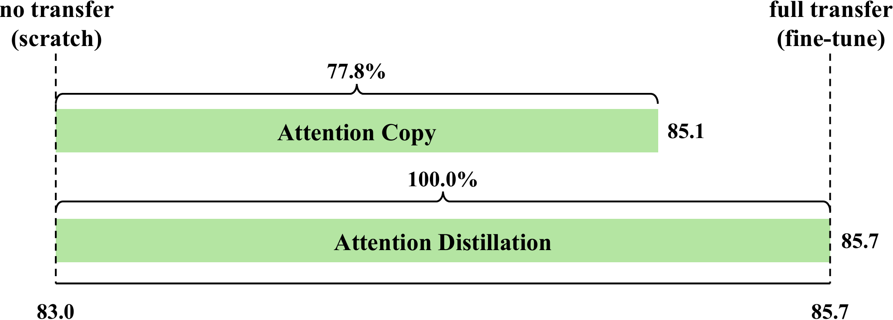
<figcaption><strong>Using only attention is sufficient for full performance</strong>. By copying the attention maps (top) from a MAE  pre-trained ViT-L , a ViT-L can reach a top-1 accuracy of 85.1 on ImageNet-1K  – recovering 77.8% of the gap between no transfer (training from scratch, 83.0) and full transfer (fine-tuning all the weights, 85.7). Distilling attention maps (bottom) can even <em>fully</em> match MAE weight tuning while only transferring the inter-token flow. </figcaption>
</figure>

We study two types of attention transfer. The first is *Attention Copy*, which directly “copy-and-pastes” the attention maps. The learning is fully decoupled, as inter-token computation is entirely from the teacher, and the student only learns intra-token patterns routed by the teacher’s attention maps. This is well-suited as a scientific probe, but is less practical since both networks need to be forwarded during the inference. The second is *Attention Distillation*, where the student simply distills attention patterns from the teacher, whose attention maps are no longer used after training. This is practical, but also helps identify the importance of the teacher’s inter-token information flow.

While both attention transfer variants are straightforward, we find them *highly effective*.  
effig:teaser illustrates this with a ViT-L `\cite{dosovitskiy2020image}`{=latex} pre-trained using Masked Autoencoding (MAE) `\cite{he2022masked}`{=latex}. Compared to no transfer (training from scratch) and full transfer (fine-tuning all the MAE weights), Attention Copy can close most of the gap in performance, whereas Attention Distillation can *match* the fine-tuning accuracy on ImageNet-1K classification `\cite{Deng2009}`{=latex}. This is achieved by only transferring the inter-token flow from the same model. Furthermore, since attention transfer requires the student to learn features from scratch, those features are significantly different from the teachers’ (  
effig:cka) and improve ImageNet-1K accuracy score to 86.3 (+0.6) when ensembled with the teacher (  
effig:ensemble).

To summarize, we make the following contributions:

- **Detailed analysis on the sufficiency of attention maps**. We find that solely using the pre-trained attention patterns is typically *sufficient* to achieve the same downstream accuracy as fine-tuning on ImageNet-1K. Furthermore, we observe practical benefits, as ensembling with attention transfer significantly improves ImageNet performance. This calls into question the commonly-believed story that pre-training is only about feature learning. While our main observation is robust w.r.t.. different models and pre-training methods, we *do find settings where pre-trained features are indeed necessary* to realize the full gains from pre-training. Our bare-minimum solution for attention transfer is more affected by data distribution shifts compared to weight tuning.  
  efsec:analysis presents extensive analyses to better understand the behaviors of attention transfer. They are i) partial transfer with a subset of layers or heads; ii) variants of our method that transfer other attention-related activations; and importantly, iii) various ways to verify that the student is *not* just re-learning the teacher model.  
  efsec:gen_and_limit systematically tests how well our findings apply across a variety of pre-training and fine-tuning datasets, pre-training methods, model sizes, and tasks.

- **Attention transfer methods**. We introduce Attention Copy and Attention Distillation, which are methods to train a ViT on a downstream task while utilizing only the attention maps of a pre-trained teacher ViT. These methods help us understand the role of the features versus the attention patterns learned during pre-training. With further research, attention transfer could offer a potential alternative to the decade-long practice of fine-tuning pre-trained vision models `\cite{Girshick2014,dosovitskiy2020image,he2022masked}`{=latex}. Nearly all aspects of the fine-tuning pipeline have been thoroughly examined, suggesting a probable saturation of recipes. Weight sharing can also face security risks (*e.g*.., white-box attacks `\cite{goodfellow2014explaining}`{=latex}). We hope our systematic examination of attention transfer sheds new light on how to leverage pre-trained ViTs, and will help establish this approach as an effective alternative when weight transfer is less applicable.

<figure id="fig:method">
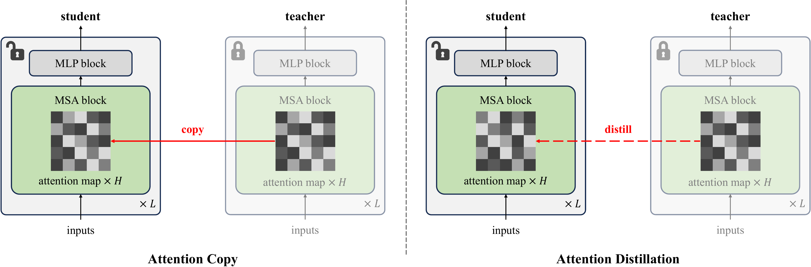
<figcaption>Two types of <strong>Attention transfer</strong> for Vision Transformers. <strong>Attention Copy</strong> (left): We simply “copy-and-paste” the attention maps from a pre-trained teacher model to a randomly initialized student one. Other weights of the student are then trained via supervised learning. This fully decouples inter-token learning (from the teacher) and intra-token learning (in the student); but is less practical. <strong>Attention Distillation</strong> (right): The student computes its own attention maps, with an additional cross-entropy loss to distill patterns from the teacher during training. The teacher is no longer used during inference. <em>H</em>: number of heads; <em>L</em>: number of Transformer layers.</figcaption>
</figure>

# Attention Transfer

## Attention Preliminaries

To work with a Vision Transformer (ViT) `\cite{dosovitskiy2020image}`{=latex}, an image is first “patchified” into \\(N\\) tokens. Their intermediate activations are represented as a sequence \\(X{=}\left[x_1, x_2, \cdots, x_N\right]^\top\\), \\(x_i{\in}\mathbb{R}^C\\), where \\(C\\) is the embedding dimension. The self-attention `\cite{vaswani2017attention}`{=latex} mechanism mainly introduces three learnable parameters \\(W_q, W_k, W_v{\in}\mathbb{R}^{C\times C/H}\\) (\\(H\\) is the number of heads). \\(Q{=}XW_q\\) is often referred to as the queries, \\(K{=}XW_k\\) as the keys, and \\(V{=}XW_v\\) as the values. Then the attention function is defined as: \\[\begin{aligned}
\label{eq:attn}
    f_\text{attn} =\underbrace{\text{softmax}\left(QK^\top\right)}_{\text{attention map}}V,
\end{aligned}\\] where the softmax function is computed per query for the *attention map*. Attention maps determine how the values from other tokens are aggregated, and with multiple heads, each token uses multiple attention distributions within the same Multi-headed Self-Attention (MSA) block.

For an \\(L\\)-layer Transformer, MSA blocks are interleaved with MLP blocks, and each Transformer layer contains one of each block type. Most operations are *intra-token computations*, which are applied independently to each token: value and projection matrices, normalization layers `\cite{ba2016layer}`{=latex}, and MLPs. The only *inter-token computation* is applying the attention map \\(\text{softmax}(QK^\top)\\), which is the only way for information to flow between tokens. Transformers are unique because their inter- and intra-token computations are *decoupled*; however, the relative importance of each type of operation is not well understood, and Transformers are typically trained by *jointly* fine-tuning all the weights.

Deviating from the common practice of joint weight tuning, we propose two attention transfer methods with the goal of exploring decoupled training for ViTs, described next.

## Attention Copy

In this setup, we utilize two separate networks: a pre-trained teacher network that *only* does a forward pass to compute its attention maps, and a student network that directly copies the attention maps from the teacher but computes all of the other activations. The student’s weights are randomly initialized and trained via back-propagation, while the teacher’s weights are kept frozen. This setting fully isolates the attention maps from the features that they are applied to, and thus is ideal for measuring the utility of pre-trained attention patterns when the student network learns to perform other tasks (*e.g*.., image classification).

We call this method *Attention Copy*, as we “copy-and-paste” the attention maps from teacher to student.  
effig:method (left) shows a diagram of this approach. Note that it requires forward passes through both the teacher and student networks during the inference time. Given the extra computation, Attention Copy is not meant to be an entirely practical method. We mitigate this issue next.

## Attention Distillation

In *Attention Distillation*, the teacher network is only utilized at the training time. Given each training example, we forward both networks in parallel, with the student also computing its own attention maps. But besides the task-driven loss, we also enforce a distillation loss between student’s attention maps and the teacher’s counterparts as (soft) targets. Formally, using \\(Q_s {K_s}^\top\\) for the student and \\(Q_t {K_t}^\top\\) for the teacher, the loss is then defined as: \\[\begin{aligned}
    \mathcal{L}_\text{dist} = \mathcal{H}\left[\text{softmax}(Q_s{K_s}^\top), \text{softmax}(Q_t{K_t}^\top)\right],
\end{aligned}\\] where \\(\mathcal{H}\\) computes the cross entropy. As there can be multiple heads and layers in a Transformer, we simply sum up all the losses from wherever attention distillation is applied. Again, the student is trained via back-propagation.  
effig:method (right) shows the diagram of Attention Distillation.

Compared to Attention Copy, Attention Distillation is much more practical. After training, the teacher is no longer needed, and the student can be used as a standalone model. Compared to training ViTs from scratch, the only addition is the distillation loss, meaning most of the optimization (*e.g*.., learning rate, momentum) and regularization (*e.g*.., weight decay, dropout rate `\cite{Srivastava2014}`{=latex}) hyperparameters can follow the scratch recipe with minimal adjustments. It does introduce a new hyperparameter \\(\lambda\\), which weights the distillation loss and balances it with the task loss.

Attention Distillation can be viewed as a form of generalized knowledge distillation, but it has several key differences from the design proposed by `\citet{hinton2015distilling}`{=latex}. Attention Distillation trains the student to match the teacher’s intermediate attention maps, not the final teacher output. This gives the flexibility of distilling from models trained on any task, not just models trained on the same final task. This property is well-suited for today’s “pre-train and transfer” paradigm, where the pre-training task (*e.g*.., reconstruction) and the downstream task (*e.g*.., classification) are usually different. However, Attention Distillation does add the constraint that the architecture needs to compute attention maps. We leave experimenting on this idea for other architectures as future work.

Overall, while fancier designs can be used for both Attention Copy and Attention Distillation, we choose to keep them simple for cleaner assessments of their effectiveness.

## Connection to Transformer Training Dynamics

Our investigation is also linked to recent attempts to theoretically understand the training dynamics of Transformers. Specifically, the inter-token flow encoded in the pre-trained attention maps can be regarded as a discovered latent *hierarchy* from the dataset. Self-attention can quickly capture frequently co-occurring token pairs `\cite{jelassi2022vision,tian2023scan}`{=latex}. However, more occasional co-occurrences need to be explained by the top-level hierarchy, rather than directly learned in the lower levels `\cite{tian2023joma}`{=latex}. This is due to many potential spurious correlations `\cite{izmailov2022feature}`{=latex}, especially in the over-parameterized setting. Transferring attention maps from a trained teacher reduces these spurious inter-token correlations, so the student can focus on intra-token learning (*i.e.*, computing useful features).

# Main Results

As featured in  
effig:teaser, attention transfer is highly effective despite its simplicity. Specifically, we demonstrate this with a ViT-L `\cite{dosovitskiy2020image}`{=latex} pre-trained with Masked Autoencoding (MAE) `\cite{he2022masked}`{=latex} for ImageNet-1K classification `\cite{Deng2009}`{=latex}. Note that this is the *signature* result that established MAE’s effectiveness for pre-training: compared to a ViT-L trained from scratch (with an accuracy score of 83.0), fine-tuning the MAE pre-trained on the same dataset results in a significant improvement to 85.7.[^2]

For attention transfer, we use the same pre-trained MAE model as our teacher, and since scratch training can be viewed as no transfer, and fine-tuning weights transfers all the weights, the above two results serve as natural lower and upper bounds for the effectiveness of our attention transfer methods. We make two observations (from  
eftab:main_result and  
effig:teaser).

## *Attention Copy can largely close the gap between scratch training and full weight fine-tuning* [attention-copy-can-largely-close-the-gap-between-scratch-training-and-full-weight-fine-tuning]

We report an accuracy of 85.1 with Attention Copy. This has largely closed the gap between scratch and full weight tuning (to be precise, 77.8% of the 2.7 percentage point gap). This is surprising, since the teacher’s attention maps are frozen after pre-training for a different task (image reconstruction), and the student must learn everything else (the intra-token operations) completely from scratch.

As another upper-bound, we also experimented with Attention Copy from the *fine-tuned* model. This reaches an accuracy score of 85.6 – almost matching the teacher’s performance (85.7), suggesting that adapting attention maps to the specific task is still helpful, but not crucial, especially as MAE pre-training is performed on the same data distribution.

## *Attention Distillation can match fine-tuning performance* [attention-distillation-can-match-fine-tuning-performance]

Even more surprisingly, we find Attention Distillation can achieve 85.7 – *on par* with fine-tuning the ViT-L weights from MAE. Since Attention Distillation and weight tuning both result in the same-sized model, which requires the same compute budget for inference, this result suggests Attention Distillation can be an effective drop-in replacement for weight tuning when the latter is less applicable (*e.g*.., if weight sharing poses security risks, we can instead send the teacher’s attention maps).

We hypothesize that distillation is better than copy because the student can choose how closely it matches the teacher attention maps, to better suit the task objective. This is also supported by the 85.6 accuracy of copying from fine-tuned MAE, which has the correct task-specific attention maps.

|                                          |          |
|:-----------------------------------------|:--------:|
| method                                   |   acc.   |
| scratch                                  |   83.0   |
| fine-tune                                |   85.7   |
| attn. copy                               |   85.1   |
| attn. copy from fine-tuned               |   85.6   |
| attn. distill                            |   85.7   |
| ensemble attn. distill \\(+\\) fine-tune | **86.3** |

**Transfer other attention activations**. We test copying alternative attention activations other than the attention map – \\(\text{softmax}(QK^\top)\\). All alternatives do better than training from scratch, and transferring queries \\(Q\\) actually does better than transferring the attention map.

|                 |      |
|:----------------|:----:|
| transfer target | acc. |
| \\(Q\\)         | 85.6 |
| \\(K\\)         | 84.4 |
| \\(V\\)         | 84.4 |
|                 |      |

**Transfer other attention activations**. We test copying alternative attention activations other than the attention map – \\(\text{softmax}(QK^\top)\\). All alternatives do better than training from scratch, and transferring queries \\(Q\\) actually does better than transferring the attention map.

# Analysis

Next, we provide extensive analyses to better understand the effectiveness of attention transfer. Broadly speaking, the explorations are driven by the following two questions:

1.  How important are different activations, layers, and heads? (  
    efsec:variants)

2.  Is attention transfer re-learning everything from the teacher? (  
    efsec:relearn)

## Variants of Attention Transfer

We study four variants of attention transfer. We use Attention Copy within this section, since it is a fully-decoupled setting well-suited for scientific analysis.

<figure id="fig:head">
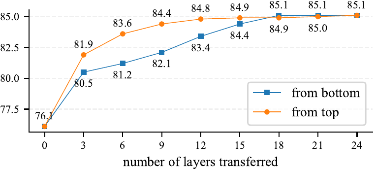
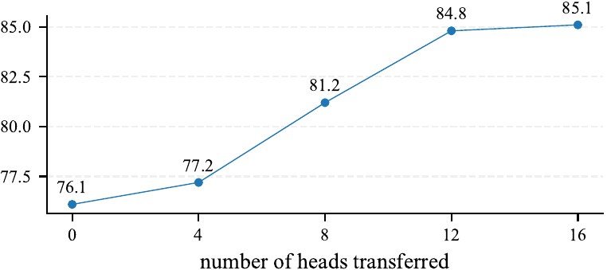
<figcaption><strong>Copy a subset of heads.</strong> The pre-trained ViT-L has 16 heads in each MSA block. By default, all of them are transferred. Here we only transfer a subset, and find more heads helps in general, but performance saturates at 12 heads.</figcaption>
</figure>

**Transfer a subset of \\(Q\\), \\(K\\) and \\(V\\).** A natural alternative to transferring attention maps is to transfer different activations that come with self-attention (Eq. <a href="#eq:attn" data-reference-type="ref" data-reference="eq:attn">[eq:attn]</a>), namely queries \\(Q\\), keys \\(K\\), or values \\(V\\). Without loss of generality, if we transfer the teacher’s \\(Q\\), the student will compute its own \\(K\\) and \\(V\\) and use them normally. Note that transferring both \\(Q\\) and \\(K\\) is equivalent to transferring the map \\(\text{softmax}(QK^\top)\\).  
eftab:copy_subset shows that transferring \\(Q\\) works surprisingly well, and is actually better than transferring the attention map.

We suggest that copying \\(Q\\) gives the model the flexibility to deviate from the teacher attention maps and use attention patterns that are better suited for the downstream task. This is supported by the fact that copying \\(Q\\) and Attention Copy from the fine-tuned model both achieve the same accuracy of \\(85.6\\).  
efsec:head_jsd dives deeper into this hypothesis and finds that the attention maps for copying \\(Q\\) are similar to the teacher’s but less constrained than they are in other transfer methods. While more investigation could be done in future work, our findings suggests that the queries \\(Q\\) are more important than the keys, which is consistent with previous findings in text sequence modeling where the number of keys and values per layer can be significantly reduced `\cite{shazeer2019fast}`{=latex}.

|                 |      |
|:----------------|:----:|
| method          | acc. |
| attn. distill   | 85.7 |
| \\(Q\\) distill | 81.3 |

Attention Distillation outperforms \\(Q\\) distillation.

Finally, we test whether distilling \\(Q\\) could outperform full Attention Distillation. However,  
eftab:q_distill shows that \\(Q\\) distillation does significantly worse. We hypothesize that this is because it is harder for the student to learn useful keys \\(K\\) while \\(Q\\) is still being learned, and because Attention Distillation already has the flexibility to adjust its attention maps to suit the downstream task.

**Partial transfer: layers.** We next change the number of Transformer layers transferred, aiming to identify which layers are more valuable from the teacher. The baseline transfers all the layers. In  
effig:block, we try transferring attention maps only from the first or last layers. For the remaining layers, the student learns to compute its own attention maps.

We make several observations: i) We find transferring more layers is always more helpful. This is a bit surprising, as one may expect attention patterns optimized for MAE’s patch-wise reconstruction task to be sub-optimal for a high-level recognition task like classification. ii) We find transferring the later attention maps is generally better. In fact, performance roughly saturates when transferring the last 15 attention maps out of a total of 24. This indicates that ViTs are capable of learning good low-level representations, as long as they are told how to combine these features into higher-level ones; but not vice versa. This reinforces the theory from `\citet{tian2023joma}`{=latex} that guidance on top-level hierarchy is more important, as there are many more possibilities, and attention transfer can reduce possible spurious correlations in the lower levels.

**Partial transfer: heads.** Finally, we switch back to transferring all the layers, but change the number of heads copied from each MSA block. Specifically, instead of copying the attention map from every head, we can selectively choose to use a subset of the teacher’s heads. The student can then compute its own attention patterns for the unused heads.  
effig:head shows the effect of transferring fewer heads for each layer. Performance improves as we do attention transfer with more heads, though performance almost saturates at 12 out of 16 heads. Note that we simply follow a naïve selection strategy and use the first set of heads; more advanced strategies based on diversity or activation magnitude can potentially improve the robustness as we reduce the number of heads.

## Are We Re-Learning the Teacher?

Since attention transfer provides a significant amount of information from the teacher (ViT-L attention maps have about 10M activations total per image, see   
efsec:bits for detailed calculations), a natural question is whether the student performs well because it simply relearns the same representations as the teacher. We thoroughly test this hypothesis on different aspects of the student model.

<figure id="fig:cka">
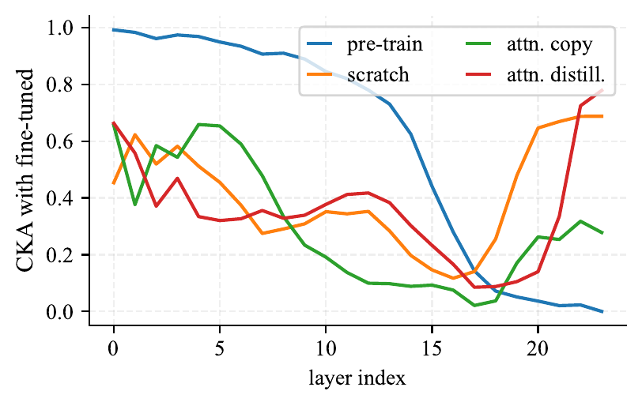
<figcaption><strong>CKA representation similarity to the fine-tuned model.</strong> We use CKA  to measure the layer-wise similarity between representations learned in different models against the fine-tuned MAE model. Higher means more similar. We find that attention transfer methods are quite <em>dissimlar</em> to the fine-tuned model, with roughly the same CKA as an independent scratch model.</figcaption>
</figure>

**Representation similarity.** One way that the student can reproduce the teacher is by learning the same intermediate features. We measure this using Centered Kernel Alignment (CKA) `\cite{kornblith2019similarity}`{=latex}, a similarity measure for representations that has been shown to be effective even for networks trained with different initializations or architectures. CKA is a layer-wise comparison that ranges from 0 (completely dissimilar) to 1 (identical) and is invariant to orthogonal linear transformations and isotropic scaling of the features.  
effig:cka shows the CKA between our fine-tuned model and our attention transfer methods. We also show the pre-trained model and a ViT-L trained from scratch for reference. We compute CKA with respect to the fine-tuned model, even though we copy or distill from the pre-trained MAE model, since the features change significantly during fine-tuning to become more task-specific. Overall, Attention Copy and Attention Distillation are both quite *dissimilar* to the fine-tuned MAE model, following the same similarity trend as the scratch model. Our sanity check passes, as CKA shows that pre-trained and fine-tuned MAE have very similar representations in the early layers. This is expected since fine-tuning with layer-wise learning rate decay `\cite{Clark2020}`{=latex} means the earliest layers change very little during fine-tuning.

<figure id="fig:ensemble">
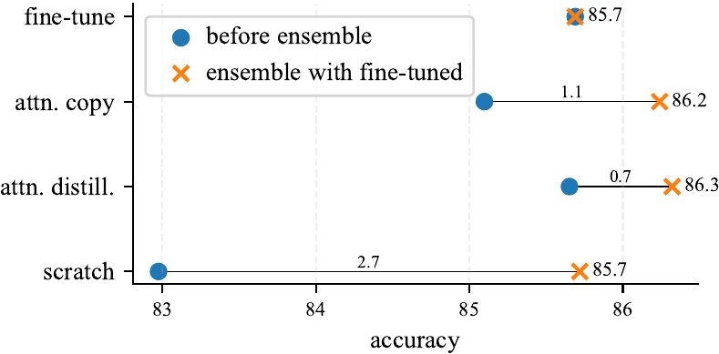
<figcaption><strong>Ensemble accuracy with the fine-tuned model</strong>. We plot the accuracy of ensembling our attention transfer models and a fine-tuned MAE. We use this to measure model prediction similarity with the fine-tuned model. The ensemble yields notable accuracy gains over the base model, reaching as much as 86.3, indicating that the attention transfer based models are <em>not</em> particularly correlated with the fine-tuned model.</figcaption>
</figure>

**Prediction similarity and ensembling.** Our CKA analysis may not catch some similarity of the intermediate representations, as CKA does not detect all forms of the same information (*e.g*.., invertible nonlinear transforms) `\cite{kornblith2019similarity}`{=latex}. Since intermediate representations may not tell the full story, we also examine the similarity of the network outputs. We measure this using network ensembling: given softmax predictions \\(p_\text{ft}\\) from the fine-tuned model and \\(p_\text{other}\\) from another model, we test the accuracy of their average \\((p_\text{ft} + p_\text{other})/2\\). The more independent the model predictions are, the higher their ensemble accuracy is. Figure <a href="#fig:ensemble" data-reference-type="ref" data-reference="fig:ensemble">5</a> compares accuracy before and after ensembling with the fine-tuned model. Attention transfer is dissimilar enough to achieve high ensemble accuracy, and ensembling Attention Distillation with a fine-tuned MAE achieves 86.3, +0.6 over the fine-tuned MAE model.

Finally,  
efsec:attn_map_vis visualizes the attention maps learned by Attention Distillation and shows that they match for distilled attention blocks but are drastically different for layers that are not distilled.

# Generalization and Limitations

In this section, we test how well our findings on attention transfer apply across a variety of pre-training and fine-tuning datasets, pre-training methods, model sizes, and tasks.

|                   |      |      |     |
|:------------------|:----:|:----:|:---:|
| pre-training data | tune | copy |     |
| ImageNet          | 85.7 | 85.1 |     |
| ImageNet-22K      | 85.5 | 84.4 |     |
| COCO              | 85.2 | 83.1 |     |

**Long-tail recognition on iNaturalist**, with ImageNet-1K pre-trained MAE. We tune weights or do attention transfer on iNaturalist, and we again find attention transfer is worse than tuning weights when the pre-training dataset is different from the downstream dataset.

|            |         |      |      |         |
|:-----------|:-------:|:----:|:----:|:-------:|
| eval. data | scratch | tune | copy | distill |
| iNat 2017  |  49.7   | 75.9 | 69.1 |  69.3   |
| iNat 2018  |  64.3   | 79.9 | 71.8 |  74.1   |
| iNat 2019  |  66.2   | 83.8 | 77.9 |  80.0   |

**Long-tail recognition on iNaturalist**, with ImageNet-1K pre-trained MAE. We tune weights or do attention transfer on iNaturalist, and we again find attention transfer is worse than tuning weights when the pre-training dataset is different from the downstream dataset.

## Pre-training and fine-tuning datasets

So far, we have focused on a MAE model pre-trained and evaluated on ImageNet-1K. What happens if we pre-train or evaluate on different datasets? We first test this by pre-training MAE ViT-L models on two new datasets: ImageNet-22K `\cite{Deng2009}`{=latex} and COCO `\cite{Lin2014}`{=latex}. These have substantially different dataset bias `\cite{torralba2011unbiased}`{=latex} from ImageNet, across axes like appearance, class balance, and diversity.  
eftab:laion shows that the resulting MAE models maintain relatively good performance when fine-tuning on ImageNet-1K, with a maximum drop of at most 0.5. However, Attention Copy accuracy drops more, losing as much as 2.1. We see a similar phenomenon in  
eftab:dataset where we use a MAE pre-trained on ImageNet and transfer to the iNaturalist datasets `\cite{VanHorn2018}`{=latex}. Again, when the pre-training dataset does not match the transfer dataset, Attention Copy accuracy drops significantly. We hypothesize that the frozen teacher’s attention maps are ill-suited for the fine-tuning dataset, which limits the performance.

## Out-of-distribution robustness

One notable aspect of a standard fine-tuned MAE model is that it shows slight “effective robustness,” *i.e.*, it achieves slightly better out-of-distribution (OOD) accuracy than expected based on its in-distribution (ID) accuracy `\cite{fang2022data}`{=latex}. We test whether Attention Distillation, which achieves the same ID accuracy, has the same benefits OOD.  
eftab:robustness shows that Attention Distillation still does quite well, but has lower accuracy than fine-tuned MAE on all 4 distribution shifts we tried. These results indicate that the attention maps do not account for the full robustness benefits, and that the features learned by MAE during pre-training are helpful OOD even if they are not ID.

|                                                |         |      |      |         |
|:-----------------------------------------------|:-------:|:----:|:----:|:-------:|
| out-of-distribution evaluation                 | scratch | tune | copy | distill |
| ImageNet-A `\cite{Hendrycks2021}`{=latex}      |  32.0   | 56.5 | 48.9 |  54.3   |
| ImageNet-R `\cite{Hendrycks2021a}`{=latex}     |  51.9   | 59.6 | 57.5 |  56.8   |
| ImageNet-S `\cite{Wang2019}`{=latex}           |  38.0   | 45.2 | 43.1 |  42.9   |
| ImageNet-V2 `\cite{recht2019imagenet}`{=latex} |  72.4   | 76.4 | 75.5 |  75.9   |

**Out-of-distribution robustness**. We take two models that achieve the same accuracy on ImageNet-1K (fine-tuned and distilled), and evaluate them on a suite of distribution shifts. Attention Distillation does well when the distribution is close (*e.g*.., on ImageNet-V2), but loses the mild “effective robustness” that fine-tuned MAE has been found to have `\cite{fang2022data}`{=latex}.

|  |  |  |  |
|:---|:--:|:--:|:--:|
| pre-training method | tune | copy | distill |
| MAE `\cite{he2022masked}`{=latex} | 85.7 | 85.1 | 85.7 |
| MoCo-v3 `\cite{Chen2021a}`{=latex} | 84.0 | 82.5 | 83.3 |
| FLIP `\cite{li2023scaling}`{=latex} | 87.4 | 86.6 | 86.1 |
| DINO^†^ `\cite{Caron2021}`{=latex} | 83.2 | 82.3 | 82.8 |
| none | 83.0 | 72.7 | 76.3 |

**Different model size** with MAE pre-trained on ImageNet-1K. Similar to weight tuning, the classification accuracy of attention transfer scales well as we vary the model size, while scratch training saturates.

|       |         |      |      |         |
|:------|:-------:|:----:|:----:|:-------:|
| model | scratch | tune | copy | distill |
| ViT-B |  82.5   | 83.6 | 82.0 |  83.4   |
| ViT-L |  83.0   | 85.7 | 85.1 |  85.7   |
| ViT-H |  83.0   | 86.9 | 86.1 |  86.3   |

**Different model size** with MAE pre-trained on ImageNet-1K. Similar to weight tuning, the classification accuracy of attention transfer scales well as we vary the model size, while scratch training saturates.

|                 |         |             |             |
|:----------------|:-------:|:-----------:|:-----------:|
| metric          | scratch |    tune     |   distill   |
| \\(AP^{box}\\)  |  39.1   | 46.3 (+7.2) | 43.6 (+4.5) |
| \\(AP^{mask}\\) |  34.6   | 40.6 (+6.0) | 38.7 (+4.1) |

**Object detection results** on COCO with a MAE ViT-B pre-trained on COCO. Attention transfer achieves a majority of the gains of pre-training in this setting as well.

## Pre-training methods

We have so far focused on MAE, a reconstruction-based pre-training method. We now check whether attention transfer still works if the teacher has been pre-trained with a different algorithm. Specifically, we test MoCo-v3 `\cite{Chen2021a}`{=latex}, a self-supervised contrastive learning approach, and FLIP `\cite{li2023scaling}`{=latex}, which does image-text contrastive learning.  
eftab:init shows that Attention Copy still achieves most of the performance benefits for each pre-training method. *Impressively, ViT-L is even able to reach 86.6 by just transferring attention maps from FLIP*. This confirms that learning the proper attention patterns is indeed a significant bottleneck during learning. Note that the FLIP model we used is pre-trained on LAION-2B `\cite{schuhmann2022laion}`{=latex}, yet its effectiveness is less affected by distribution shifts to ImageNet-1K.

## Model size

We test whether attention transfer works across model sizes. For all experiments so far, we have used ViT-L; here, we try Attention Copy from a smaller (ViT-B) and larger (ViT-H) model, both pre-trained with MAE.  
eftab:model_scale shows that Attention Copy continues to improve with scale, even reaching 86.1% accuracy with ViT-H. It can do this even though scratch model performance already saturates at the ViT-L size. Again, this indicates that models need proper inter-token routing in order to learn good features that generalize. Otherwise, they cannot properly utilize increased model capacity.

## Object Detection

Finally, we examine the performance of attention transfer in the standard ViTDet pipeline `\cite{li2022exploring}`{=latex} for COCO object detection. We compare training from scratch against fine-tuning and attention transfer from a MAE ViT-B pre-trained on COCO, which is done to mitigate the effect of distribution shift. For fair comparisons, we use a \\(448 {\times}448\\) input to remove the effect from window attention and positional embedding interpolation, and remove the effect of relative positional embeddings.  
eftab:detection shows that Attention Distillation recovers a majority of the gains from pre-training in this dense prediction setting as well. Based on  
eftab:model_scale, we anticipate that the gap between fine-tuning and attention transfer will decrease with ViT-L, but we are limited by computational resources.

# Related Work

**Structure in attention patterns.** Numerous previous works have studied the attention patterns of pre-trained vision transformers `\cite{walmer2023teaching,xie2023revealing,park2023self}`{=latex}. These works present these differences only as qualitative observations, whereas we are able to isolate the attention patterns and show that they are causally responsible for most of the differences in fine-tuning performance. Other methods, such as Lora `\cite{hu2021lora}`{=latex} or Prompt-to-Prompt `\cite{hertz2022prompt}`{=latex}, do rely on the importance of high quality attention patterns within pre-trained networks, but they also utilize pre-trained features and do not provide our insight that *these features are typically unnecessary* for the tasks we examine. `\citet{trockman2023mimetic}`{=latex} observe diagonal structure within the product of attention layer weights in a trained supervised network. They show that initializing the weights with this structure moderately improves accuracy for small models early in training. The work most similar to us is `\citet{zhang2022unveiling}`{=latex} in the language domain, which finds that pre-trained BERT models improve length generalization on a few particular synthetic tasks. They attribute it to the attention patterns of a few, specific heads and show that hardcoding these patterns into the network achieves the same benefit. Our work is complementary and emphasizes the importance of attention maps over features.

**Decoupling inter- and intra-token operations.** GLoMo `\cite{yang2018glomo}`{=latex} also attempts to decouple features from the way they should be combined. They use unsupervised pre-training to train a network to output a graph, which is later used to combine task-specific features. We find that there is no need to develop a specialized architecture to achieve this – Vision Transformers *already do this naturally*.

**Knowledge Distillation** Knowledge distillation is a popular framework for training small, high-performing student networks `\cite{hinton2015distilling}`{=latex}. Knowledge distillation methods typically add a loss to encourage the student network to match the teacher network’s logits, but variants often use other feature statistics as targets, such as the final representations `\cite{navaneet2022simreg,duval2023simple}`{=latex}, intermediate feature similarities `\cite{hao2022learning}`{=latex}, or intermediate feature magnitudes `\cite{zagoruyko2016paying,li2021neural}`{=latex}. This last approach has also previously been called “attention transfer,” but their method is quite different and actually refers to distilling spatial activation magnitudes in ConvNets. These knowledge distillation approaches all assume that students need to be explicitly taught the right features. In contrast, our analysis with attention transfer shows that attention maps are sufficient to recover all of the gains from pre-training. Some papers have used attention distillation as an auxiliary loss to help a smaller model learn the teacher outputs more effectively `\cite{wang2020minilm,wang2022attention}`{=latex}. However, these only consider transferring the same function across model sizes, instead of transferring knowledge from a pre-trained model to a different downstream task.

**Connection to the lottery ticket hypothesis** The lottery ticket hypothesis `\cite{frankle2018lottery}`{=latex} suggests that large, dense neural networks contain small, sparse subnetworks (“winning tickets”) that, when trained from scratch, can match or even outperform the performance of the original dense network. This is particularly interesting because these sparse subnetworks maintain their performance only with their original initialization values; the strength of their connections between *neurons* is special in some way. Our findings draw a parallel, indicating that the connections between *patches*, controlled solely by the attention patterns, are similarly special within pretrained ViTs. `\citet{frankle2018lottery}`{=latex} further conjecture that overparameterization improves performance because larger models contain exponentially more sparse subnetworks in superposition and are thus more likely to contain a “winning ticket” – a hypothesis supported by subsequent empirical and theoretical work `\citep{ramanujan2020s,pensia2020optimal,orseau2020logarithmic,burkholz2022most}`{=latex}. However, this phenomenon does not arise in our setting with ViT attention patterns, since there are only a handful of attention maps per layer (rather than thousands of neurons). Consequently, good attention patterns are unlikely to appear by chance and must instead be learned during pretraining. We hope that a new model architecture that efficiently combines many more attention maps per layer can address this limitation and learn better from scratch than existing ViTs.

# Conclusion

Even as Transformers have surged in popularity, the way we use them has remained stagnant: pre-train, then fine-tune the weights. In this work, we present attention transfer, a simple alternative to ViT fine-tuning that decouples intra-token operations (how to extract more usable features for each token) from inter-token operations (how those features should be combined). Our key finding is that the attention patterns (inter-token operations) are the key factor behind much of the effectiveness of pre-training – our Attention Distillation method *completely matches fine-tuning* on ImageNet-1K. We do find some limitations: attention transfer does not work well if the pre-training and transfer datasets are different, and it loses a bit of OOD robustness. Nevertheless, our findings provide insights into the role of attention in pre-trained ViTs, and we hope future work fixes attention transfer’s shortcomings and explores the advantages of this new transfer method.

Some directions for future work are particularly interesting. First, a deeper investigation of the queries \\(Q\\) could help us better understand their importance and potentially yield better transfer strategies. Second, attention transfer eliminates the need for tricks that fine-tuning requires, such as layerwise learning rate decay. Layerwise learning rate decay adds the prior that early layers should change less compared to later layers. However, this prior may be overly restrictive for next-generation models, since it prevents early features from changing, and getting rid of it could open up new opportunities. Finally, since attention maps are \\(L \times L\\), where \\(L\\) is the sequence length, attention maps could be transferred more easily across model sizes. In contrast, weight tuning is more difficult to apply when the models have different dimensions. Pre-training a smaller model and transferring its attention patterns to a larger downstream model could be more practical than the current practice of fine-tuning.

AL is supported by the NSF GRFP DGE1745016 and DGE2140739 and performed the work during an internship at FAIR.

# References [references]

J. L. Ba, J. R. Kiros, and G. E. Hinton Layer normalization *arXiv:1607.06450*, 2016. **Abstract:** Training state-of-the-art, deep neural networks is computationally expensive. One way to reduce the training time is to normalize the activities of the neurons. A recently introduced technique called batch normalization uses the distribution of the summed input to a neuron over a mini-batch of training cases to compute a mean and variance which are then used to normalize the summed input to that neuron on each training case. This significantly reduces the training time in feed-forward neural networks. However, the effect of batch normalization is dependent on the mini-batch size and it is not obvious how to apply it to recurrent neural networks. In this paper, we transpose batch normalization into layer normalization by computing the mean and variance used for normalization from all of the summed inputs to the neurons in a layer on a single training case. Like batch normalization, we also give each neuron its own adaptive bias and gain which are applied after the normalization but before the non-linearity. Unlike batch normalization, layer normalization performs exactly the same computation at training and test times. It is also straightforward to apply to recurrent neural networks by computing the normalization statistics separately at each time step. Layer normalization is very effective at stabilizing the hidden state dynamics in recurrent networks. Empirically, we show that layer normalization can substantially reduce the training time compared with previously published techniques. (@ba2016layer)

T. Brown, B. Mann, N. Ryder, M. Subbiah, J. D. Kaplan, P. Dhariwal, A. Neelakantan, P. Shyam, G. Sastry, A. Askell, S. Agarwal, A. Herbert-Voss, G. Krueger, T. Henighan, R. Child, A. Ramesh, D. Ziegler, J. Wu, C. Winter, C. Hesse, M. Chen, E. Sigler, M. Litwin, S. Gray, B. Chess, J. Clark, C. Berner, S. McCandlish, A. Radford, I. Sutskever, and D. Amodei Language models are few-shot learners In *NeurIPS*, 2020. **Abstract:** Recent work has demonstrated substantial gains on many NLP tasks and benchmarks by pre-training on a large corpus of text followed by fine-tuning on a specific task. While typically task-agnostic in architecture, this method still requires task-specific fine-tuning datasets of thousands or tens of thousands of examples. By contrast, humans can generally perform a new language task from only a few examples or from simple instructions - something which current NLP systems still largely struggle to do. Here we show that scaling up language models greatly improves task-agnostic, few-shot performance, sometimes even reaching competitiveness with prior state-of-the-art fine-tuning approaches. Specifically, we train GPT-3, an autoregressive language model with 175 billion parameters, 10x more than any previous non-sparse language model, and test its performance in the few-shot setting. For all tasks, GPT-3 is applied without any gradient updates or fine-tuning, with tasks and few-shot demonstrations specified purely via text interaction with the model. GPT-3 achieves strong performance on many NLP datasets, including translation, question-answering, and cloze tasks, as well as several tasks that require on-the-fly reasoning or domain adaptation, such as unscrambling words, using a novel word in a sentence, or performing 3-digit arithmetic. At the same time, we also identify some datasets where GPT-3’s few-shot learning still struggles, as well as some datasets where GPT-3 faces methodological issues related to training on large web corpora. Finally, we find that GPT-3 can generate samples of news articles which human evaluators have difficulty distinguishing from articles written by humans. We discuss broader societal impacts of this finding and of GPT-3 in general. (@Brown2020)

R. Burkholz Most activation functions can win the lottery without excessive depth *Advances in Neural Information Processing Systems*, 35: 18707–18720, 2022. **Abstract:** The strong lottery ticket hypothesis has highlighted the potential for training deep neural networks by pruning, which has inspired interesting practical and theoretical insights into how neural networks can represent functions. For networks with ReLU activation functions, it has been proven that a target network with depth $L$ can be approximated by the subnetwork of a randomly initialized neural network that has double the target’s depth $2L$ and is wider by a logarithmic factor. We show that a depth $L+1$ network is sufficient. This result indicates that we can expect to find lottery tickets at realistic, commonly used depths while only requiring logarithmic overparametrization. Our novel construction approach applies to a large class of activation functions and is not limited to ReLUs. (@burkholz2022most)

M. Caron, H. Touvron, I. Misra, H. Jégou, J. Mairal, P. Bojanowski, and A. Joulin Emerging properties in self-supervised vision transformers In *ICCV*, 2021. **Abstract:** In this paper, we question if self-supervised learning provides new properties to Vision Transformer (ViT) \[16\] that stand out compared to convolutional networks (convnets). Beyond the fact that adapting self-supervised methods to this architecture works particularly well, we make the following observations: first, self-supervised ViT features contain explicit information about the semantic segmentation of an image, which does not emerge as clearly with supervised ViTs, nor with convnets. Second, these features are also excellent k-NN classifiers, reaching 78.3% top-1 on ImageNet with a small ViT. Our study also underlines the importance of momentum encoder \[26\], multi-crop training \[9\], and the use of small patches with ViTs. We implement our findings into a simple self-supervised method, called DINO, which we interpret as a form of self-distillation with no labels. We show the synergy between DINO and ViTs by achieving 80.1% top-1 on ImageNet in linear evaluation with ViT-Base. (@Caron2021)

M. Chen, A. Radford, R. Child, J. Wu, H. Jun, D. Luan, and I. Sutskever Generative pretraining from pixels In *ICML*, 2020. **Abstract:** Inspired by progress in unsupervised representa- tion learning for natural language, we examine whether similar models can learn useful repre- sentations for images. We train a sequence Trans- former to auto-regressively predict pixels, without incorporating knowledge of the 2D input struc- ture. Despite training on low-resolution ImageNet without labels, we find that a GPT-2 scale model learns strong image representations as measured by linear probing, fine-tuning, and low-data clas- sification. On CIFAR-10, we achieve 96.3% ac- curacy with a linear probe, outperforming a su- pervised Wide ResNet, and 99.0% accuracy with full fine-tuning, matching the top supervised pre- trained models. We are also competitive with self-supervised benchmarks on ImageNet when substituting pixels for a VQV AE encoding, achiev- ing 69.0% top-1 accuracy on a linear probe of our features. (@Chen2020c)

T. Chen, S. Kornblith, M. Norouzi, and G. Hinton A simple framework for contrastive learning of visual representations In *ICML*, 2020. **Abstract:** This paper presents SimCLR: a simple framework for contrastive learning of visual representations. We simplify recently proposed contrastive self-supervised learning algorithms without requiring specialized architectures or a memory bank. In order to understand what enables the contrastive prediction tasks to learn useful representations, we systematically study the major components of our framework. We show that (1) composition of data augmentations plays a critical role in defining effective predictive tasks, (2) introducing a learnable nonlinear transformation between the representation and the contrastive loss substantially improves the quality of the learned representations, and (3) contrastive learning benefits from larger batch sizes and more training steps compared to supervised learning. By combining these findings, we are able to considerably outperform previous methods for self-supervised and semi-supervised learning on ImageNet. A linear classifier trained on self-supervised representations learned by SimCLR achieves 76.5% top-1 accuracy, which is a 7% relative improvement over previous state-of-the-art, matching the performance of a supervised ResNet-50. When fine-tuned on only 1% of the labels, we achieve 85.8% top-5 accuracy, outperforming AlexNet with 100X fewer labels. (@Chen2020)

X. Chen, S. Xie, and K. He An empirical study of training self-supervised Vision Transformers In *ICCV*, 2021. **Abstract:** This paper does not describe a novel method. Instead, it studies a straightforward, incremental, yet must-know baseline given the recent progress in computer vision: self-supervised learning for Vision Transformers (ViT). While the training recipes for standard convolutional networks have been highly mature and robust, the recipes for ViT are yet to be built, especially in the self-supervised scenarios where training becomes more challenging. In this work, we go back to basics and investigate the effects of several fundamental components for training self-supervised ViT. We observe that instability is a major issue that degrades accuracy, and it can be hidden by apparently good results. We reveal that these results are indeed partial failure, and they can be improved when training is made more stable. We benchmark ViT results in MoCo v3 and several other self-supervised frameworks, with ablations in various aspects. We discuss the currently positive evidence as well as challenges and open questions. We hope that this work will provide useful data points and experience for future research. (@Chen2021a)

K. Clark, M.-T. Luong, Q. V. Le, and C. D. Manning : Pre-training text encoders as discriminators rather than generators In *ICLR*, 2020. **Abstract:** Masked language modeling (MLM) pre-training methods such as BERT corrupt the input by replacing some tokens with \[MASK\] and then train a model to reconstruct the original tokens. While they produce good results when transferred to downstream NLP tasks, they generally require large amounts of compute to be effective. As an alternative, we propose a more sample-efficient pre-training task called replaced token detection. Instead of masking the input, our approach corrupts it by replacing some tokens with plausible alternatives sampled from a small generator network. Then, instead of training a model that predicts the original identities of the corrupted tokens, we train a discriminative model that predicts whether each token in the corrupted input was replaced by a generator sample or not. Thorough experiments demonstrate this new pre-training task is more efficient than MLM because the task is defined over all input tokens rather than just the small subset that was masked out. As a result, the contextual representations learned by our approach substantially outperform the ones learned by BERT given the same model size, data, and compute. The gains are particularly strong for small models; for example, we train a model on one GPU for 4 days that outperforms GPT (trained using 30x more compute) on the GLUE natural language understanding benchmark. Our approach also works well at scale, where it performs comparably to RoBERTa and XLNet while using less than 1/4 of their compute and outperforms them when using the same amount of compute. (@Clark2020)

E. D. Cubuk, B. Zoph, J. Shlens, and Q. V. Le Randaugment: Practical automated data augmentation with a reduced search space In *CVPR Workshops*, 2020. **Abstract:** Recent work on automated augmentation strategies has led to state-of-the-art results in image classification and object detection. An obstacle to a large-scale adoption of these methods is that they require a separate and expensive search phase. A common way to overcome the expense of the search phase was to use a smaller proxy task. However, it was not clear if the optimized hyperparameters found on the proxy task are also optimal for the actual task. In this work, we rethink the process of designing automated augmentation strategies. We find that while previous work required a search for both magnitude and probability of each operation independently, it is sufficient to only search for a single distortion magnitude that jointly controls all operations. We hence propose a simplified search space that vastly reduces the computational expense of automated augmentation, and permits the removal of a separate proxy task. Despite the simplifications, our method achieves equal or better performance over previous automated augmentation strategies on on CIFAR-10/100, SVHN, ImageNet and COCO datasets. EfficientNet-B7, we achieve 85.0% accuracy, a 1.0% increase over baseline augmentation, a 0.6% improvement over AutoAugment on the ImageNet dataset. With EfficientNet-B8, we achieve 85.4% accuracy on ImageNet, which matches a previous result that used 3.5B extra images. On object detection, the same method as classification leads to 1.0-1.3% improvement over baseline augmentation. Code will be made available online. (@Cubuk2020)

J. Deng, W. Dong, R. Socher, L.-J. Li, K. Li, and L. Fei-Fei In *CVPR*, 2009. **Abstract:** The explosion of image data on the Internet has the potential to foster more sophisticated and robust models and algorithms to index, retrieve, organize and interact with images and multimedia data. But exactly how such data can be harnessed and organized remains a critical problem. We introduce here a new database called "ImageNet", a large-scale ontology of images built upon the backbone of the WordNet structure. ImageNet aims to populate the majority of the 80,000 synsets of WordNet with an average of 500–1000 clean and full resolution images. This will result in tens of millions of annotated images organized by the semantic hierarchy of WordNet. This paper offers a detailed analysis of ImageNet in its current state: 12 subtrees with 5247 synsets and 3.2 million images in total. We show that ImageNet is much larger in scale and diversity and much more accurate than the current image datasets. Constructing such a large-scale database is a challenging task. We describe the data collection scheme with Amazon Mechanical Turk. Lastly, we illustrate the usefulness of ImageNet through three simple applications in object recognition, image classification and automatic object clustering. We hope that the scale, accuracy, diversity and hierarchical structure of ImageNet can offer unparalleled opportunities to researchers in the computer vision community and beyond. (@Deng2009)

J. Devlin, M.-W. Chang, K. Lee, and K. Toutanova : Pre-training of deep bidirectional transformers for language understanding In *NAACL*, 2019. **Abstract:** We introduce a new language representation model called BERT, which stands for Bidirectional Encoder Representations from Transformers. Unlike recent language representation models, BERT is designed to pre-train deep bidirectional representations from unlabeled text by jointly conditioning on both left and right context in all layers. As a result, the pre-trained BERT model can be fine-tuned with just one additional output layer to create state-of-the-art models for a wide range of tasks, such as question answering and language inference, without substantial task-specific architecture modifications. BERT is conceptually simple and empirically powerful. It obtains new state-of-the-art results on eleven natural language processing tasks, including pushing the GLUE score to 80.5% (7.7% point absolute improvement), MultiNLI accuracy to 86.7% (4.6% absolute improvement), SQuAD v1.1 question answering Test F1 to 93.2 (1.5 point absolute improvement) and SQuAD v2.0 Test F1 to 83.1 (5.1 point absolute improvement). (@Devlin2019)

A. Dosovitskiy, L. Beyer, A. Kolesnikov, D. Weissenborn, X. Zhai, T. Unterthiner, M. Dehghani, M. Minderer, G. Heigold, S. Gelly, J. Uszkoreit, and N. Houlsby An image is worth 16x16 words: Transformers for image recognition at scale In *ICLR*, 2021. **Abstract:** While the Transformer architecture has become the de-facto standard for natural language processing tasks, its applications to computer vision remain limited. In vision, attention is either applied in conjunction with convolutional networks, or used to replace certain components of convolutional networks while keeping their overall structure in place. We show that this reliance on CNNs is not necessary and a pure transformer applied directly to sequences of image patches can perform very well on image classification tasks. When pre-trained on large amounts of data and transferred to multiple mid-sized or small image recognition benchmarks (ImageNet, CIFAR-100, VTAB, etc.), Vision Transformer (ViT) attains excellent results compared to state-of-the-art convolutional networks while requiring substantially fewer computational resources to train. (@dosovitskiy2020image)

Q. Duval, I. Misra, and N. Ballas A simple recipe for competitive low-compute self supervised vision models *arXiv preprint arXiv:2301.09451*, 2023. **Abstract:** Self-supervised methods in vision have been mostly focused on large architectures as they seem to suffer from a significant performance drop for smaller architectures. In this paper, we propose a simple self-supervised distillation technique that can train high performance low-compute neural networks. Our main insight is that existing joint-embedding based SSL methods can be repurposed for knowledge distillation from a large self-supervised teacher to a small student model. Thus, we call our method Replace one Branch (RoB) as it simply replaces one branch of the joint-embedding training with a large teacher model. RoB is widely applicable to a number of architectures such as small ResNets, MobileNets and ViT, and pretrained models such as DINO, SwAV or iBOT. When pretraining on the ImageNet dataset, RoB yields models that compete with supervised knowledge distillation. When applied to MSN, RoB produces students with strong semi-supervised capabilities. Finally, our best ViT-Tiny models improve over prior SSL state-of-the-art on ImageNet by $2.3\\}%$ and are on par or better than a supervised distilled DeiT on five downstream transfer tasks (iNaturalist, CIFAR, Clevr/Count, Clevr/Dist and Places). We hope RoB enables practical self-supervision at smaller scale. (@duval2023simple)

A. Fang, G. Ilharco, M. Wortsman, Y. Wan, V. Shankar, A. Dave, and L. Schmidt Data determines distributional robustness in contrastive language image pre-training (clip) In *ICML*, 2022. **Abstract:** Contrastively trained language-image models such as CLIP, ALIGN, and BASIC have demonstrated unprecedented robustness to multiple challenging natural distribution shifts. Since these language-image models differ from previous training approaches in several ways, an important question is what causes the large robustness gains. We answer this question via a systematic experimental investigation. Concretely, we study five different possible causes for the robustness gains: (i) the training set size, (ii) the training distribution, (iii) language supervision at training time, (iv) language supervision at test time, and (v) the contrastive loss function. Our experiments show that the more diverse training distribution is the main cause for the robustness gains, with the other factors contributing little to no robustness. Beyond our experimental results, we also introduce ImageNet-Captions, a version of ImageNet with original text annotations from Flickr, to enable further controlled experiments of language-image training. (@fang2022data)

J. Frankle and M. Carbin The lottery ticket hypothesis: Finding sparse, trainable neural networks *arXiv preprint arXiv:1803.03635*, 2018. **Abstract:** Neural network pruning techniques can reduce the parameter counts of trained networks by over 90%, decreasing storage requirements and improving computational performance of inference without compromising accuracy. However, contemporary experience is that the sparse architectures produced by pruning are difficult to train from the start, which would similarly improve training performance. We find that a standard pruning technique naturally uncovers subnetworks whose initializations made them capable of training effectively. Based on these results, we articulate the "lottery ticket hypothesis:" dense, randomly-initialized, feed-forward networks contain subnetworks ("winning tickets") that - when trained in isolation - reach test accuracy comparable to the original network in a similar number of iterations. The winning tickets we find have won the initialization lottery: their connections have initial weights that make training particularly effective. We present an algorithm to identify winning tickets and a series of experiments that support the lottery ticket hypothesis and the importance of these fortuitous initializations. We consistently find winning tickets that are less than 10-20% of the size of several fully-connected and convolutional feed-forward architectures for MNIST and CIFAR10. Above this size, the winning tickets that we find learn faster than the original network and reach higher test accuracy. (@frankle2018lottery)

R. Girshick, J. Donahue, T. Darrell, and J. Malik Rich feature hierarchies for accurate object detection and semantic segmentation In *CVPR*, 2014. **Abstract:** Object detection performance, as measured on the canonical PASCAL VOC dataset, has plateaued in the last few years. The best-performing methods are complex ensemble systems that typically combine multiple low-level image features with high-level context. In this paper, we propose a simple and scalable detection algorithm that improves mean average precision (mAP) by more than 30% relative to the previous best result on VOC 2012 – achieving a mAP of 53.3%. Our approach combines two key insights: (1) one can apply high-capacity convolutional neural networks (CNNs) to bottom-up region proposals in order to localize and segment objects and (2) when labeled training data is scarce, supervised pre-training for an auxiliary task, followed by domain-specific fine-tuning, yields a significant performance boost. Since we combine region proposals with CNNs, we call our method R-CNN: Regions with CNN features. We also present experiments that provide insight into what the network learns, revealing a rich hierarchy of image features. Source code for the complete system is available at http://www.cs.berkeley.edu/\~rbg/rcnn. (@Girshick2014)

I. J. Goodfellow, J. Shlens, and C. Szegedy Explaining and harnessing adversarial examples *arXiv preprint arXiv:1412.6572*, 2014. **Abstract:** Several machine learning models, including neural networks, consistently misclassify adversarial examples—inputs formed by applying small but intentionally worst-case perturbations to examples from the dataset, such that the perturbed input results in the model outputting an incorrect answer with high confidence. Early attempts at explaining this phenomenon focused on nonlinearity and overfitting. We argue instead that the primary cause of neural networks’ vulnerability to adversarial perturbation is their linear nature. This explanation is supported by new quantitative results while giving the first explanation of the most intriguing fact about them: their generalization across architectures and training sets. Moreover, this view yields a simple and fast method of generating adversarial examples. Using this approach to provide examples for adversarial training, we reduce the test set error of a maxout network on the MNIST dataset. (@goodfellow2014explaining)

P. Goyal, P. Dollár, R. Girshick, P. Noordhuis, L. Wesolowski, A. Kyrola, A. Tulloch, Y. Jia, and K. He Accurate, large minibatch SGD: Training ImageNet in 1 hour *arXiv:1706.02677*, 2017. **Abstract:** Deep learning thrives with large neural networks and large datasets. However, larger networks and larger datasets result in longer training times that impede research and development progress. Distributed synchronous SGD offers a potential solution to this problem by dividing SGD minibatches over a pool of parallel workers. Yet to make this scheme efficient, the per-worker workload must be large, which implies nontrivial growth in the SGD minibatch size. In this paper, we empirically show that on the ImageNet dataset large minibatches cause optimization difficulties, but when these are addressed the trained networks exhibit good generalization. Specifically, we show no loss of accuracy when training with large minibatch sizes up to 8192 images. To achieve this result, we adopt a hyper-parameter-free linear scaling rule for adjusting learning rates as a function of minibatch size and develop a new warmup scheme that overcomes optimization challenges early in training. With these simple techniques, our Caffe2-based system trains ResNet-50 with a minibatch size of 8192 on 256 GPUs in one hour, while matching small minibatch accuracy. Using commodity hardware, our implementation achieves \~90% scaling efficiency when moving from 8 to 256 GPUs. Our findings enable training visual recognition models on internet-scale data with high efficiency. (@Goyal2017)

Z. Hao, J. Guo, D. Jia, K. Han, Y. Tang, C. Zhang, H. Hu, and Y. Wang Learning efficient vision transformers via fine-grained manifold distillation In *NeurIPS*, 2022. **Abstract:** In the past few years, transformers have achieved promising performances on various computer vision tasks. Unfortunately, the immense inference overhead of most existing vision transformers withholds their from being deployed on edge devices such as cell phones and smart watches. Knowledge distillation is a widely used paradigm for compressing cumbersome architectures via transferring information to a compact student. However, most of them are designed for convolutional neural networks (CNNs), which do not fully investigate the character of vision transformer (ViT). In this paper, we utilize the patch-level information and propose a fine-grained manifold distillation method. Specifically, we train a tiny student model to match a pre-trained teacher model in the patch-level manifold space. Then, we decouple the manifold matching loss into three terms with careful design to further reduce the computational costs for the patch relationship. Equipped with the proposed method, a DeiT-Tiny model containing 5M parameters achieves 76.5% top-1 accuracy on ImageNet-1k, which is +2.0% higher than previous distillation approaches. Transfer learning results on other classification benchmarks and downstream vision tasks also demonstrate the superiority of our method over the state-of-the-art algorithms. (@hao2022learning)

K. He, X. Zhang, S. Ren, and J. Sun Deep residual learning for image recognition In *CVPR*, 2016. **Abstract:** Deeper neural networks are more difficult to train. We present a residual learning framework to ease the training of networks that are substantially deeper than those used previously. We explicitly reformulate the layers as learning residual functions with reference to the layer inputs, instead of learning unreferenced functions. We provide comprehensive empirical evidence showing that these residual networks are easier to optimize, and can gain accuracy from considerably increased depth. On the ImageNet dataset we evaluate residual nets with a depth of up to 152 layers - 8× deeper than VGG nets \[40\] but still having lower complexity. An ensemble of these residual nets achieves 3.57% error on the ImageNet test set. This result won the 1st place on the ILSVRC 2015 classification task. We also present analysis on CIFAR-10 with 100 and 1000 layers. The depth of representations is of central importance for many visual recognition tasks. Solely due to our extremely deep representations, we obtain a 28% relative improvement on the COCO object detection dataset. Deep residual nets are foundations of our submissions to ILSVRC & COCO 2015 competitions1, where we also won the 1st places on the tasks of ImageNet detection, ImageNet localization, COCO detection, and COCO segmentation. (@He2016)

K. He, H. Fan, Y. Wu, S. Xie, and R. Girshick Momentum contrast for unsupervised visual representation learning In *CVPR*, 2020. **Abstract:** We present Momentum Contrast (MoCo) for unsupervised visual representation learning. From a perspective on contrastive learning as dictionary look-up, we build a dynamic dictionary with a queue and a moving-averaged encoder. This enables building a large and consistent dictionary on-the-fly that facilitates contrastive unsupervised learning. MoCo provides competitive results under the common linear protocol on ImageNet classification. More importantly, the representations learned by MoCo transfer well to downstream tasks. MoCo can outperform its supervised pre-training counterpart in 7 detection/segmentation tasks on PASCAL VOC, COCO, and other datasets, sometimes surpassing it by large margins. This suggests that the gap between unsupervised and supervised representation learning has been largely closed in many vision tasks. (@He2020)

K. He, X. Chen, S. Xie, Y. Li, P. Dollár, and R. Girshick Masked autoencoders are scalable vision learners In *CVPR*, 2022. **Abstract:** This paper shows that masked autoencoders (MAE) are scalable self-supervised learners for computer vision. Our MAE approach is simple: we mask random patches of the input image and reconstruct the missing pixels. It is based on two core designs. First, we develop an asymmetric encoder-decoder architecture, with an encoder that operates only on the visible subset of patches (without mask tokens), along with a lightweight decoder that reconstructs the original image from the latent representation and mask tokens. Second, we find that masking a high proportion of the input image, e.g., 75%, yields a nontrivial and meaningful self-supervisory task. Coupling these two designs enables us to train large models efficiently and effectively: we accelerate training (by 3× or more) and improve accuracy. Our scalable approach allows for learning high-capacity models that generalize well: e.g., a vanilla ViT-Huge model achieves the best accuracy (87.8%) among methods that use only ImageNet-1K data. Transfer performance in downstream tasks outperforms supervised pretraining and shows promising scaling behavior. (@he2022masked)

D. Hendrycks, S. Basart, N. Mu, S. Kadavath, F. Wang, E. Dorundo, R. Desai, T. Zhu, S. Parajuli, M. Guo, et al The many faces of robustness: A critical analysis of out-of-distribution generalization In *ICCV*, 2021. **Abstract:** We introduce four new real-world distribution shift datasets consisting of changes in image style, image blurriness, geographic location, camera operation, and more. With our new datasets, we take stock of previously proposed methods for improving out-of-distribution robustness and put them to the test. We find that using larger models and artificial data augmentations can improve robustness on real-world distribution shifts, contrary to claims in prior work. We find improvements in artificial robustness benchmarks can transfer to real-world distribution shifts, contrary to claims in prior work. Motivated by our observation that data augmentations can help with real-world distribution shifts, we also introduce a new data augmentation method which advances the state-of-the-art and outperforms models pre-trained with 1000× more labeled data. Overall we find that some methods consistently help with distribution shifts in texture and local image statistics, but these methods do not help with some other distribution shifts like geographic changes. Our results show that future research must study multiple distribution shifts simultaneously, as we demonstrate that no evaluated method consistently improves robustness. (@Hendrycks2021a)

D. Hendrycks, K. Zhao, S. Basart, J. Steinhardt, and D. Song Natural adversarial examples In *CVPR*, 2021. **Abstract:** We introduce two challenging datasets that reliably cause machine learning model performance to substantially degrade. The datasets are collected with a simple adversarial filtration technique to create datasets with limited spurious cues. Our datasets’ real-world, unmodified examples transfer to various unseen models reliably, demonstrating that computer vision models have shared weaknesses. The first dataset is called IMAGENET-A and is like the ImageNet test set, but it is far more challenging for existing models. We also curate an adversarial out-of-distribution detection dataset called IMAGENET-O, which is the first out-of-distribution detection dataset created for ImageNet models. On IMAGENET-A a DenseNet-121 obtains around 2% accuracy, an accuracy drop of approximately 90%, and its out-of-distribution detection performance on IMAGENET-O is near random chance levels. We find that existing data augmentation techniques hardly boost performance, and using other public training datasets provides improvements that are limited. However, we find that improvements to computer vision architectures provide a promising path towards robust models. (@Hendrycks2021)

A. Hertz, R. Mokady, J. Tenenbaum, K. Aberman, Y. Pritch, and D. Cohen-Or Prompt-to-prompt image editing with cross attention control *arXiv preprint arXiv:2208.01626*, 2022. **Abstract:** Recent large-scale text-driven synthesis models have attracted much attention thanks to their remarkable capabilities of generating highly diverse images that follow given text prompts. Such text-based synthesis methods are particularly appealing to humans who are used to verbally describe their intent. Therefore, it is only natural to extend the text-driven image synthesis to text-driven image editing. Editing is challenging for these generative models, since an innate property of an editing technique is to preserve most of the original image, while in the text-based models, even a small modification of the text prompt often leads to a completely different outcome. State-of-the-art methods mitigate this by requiring the users to provide a spatial mask to localize the edit, hence, ignoring the original structure and content within the masked region. In this paper, we pursue an intuitive prompt-to-prompt editing framework, where the edits are controlled by text only. To this end, we analyze a text-conditioned model in depth and observe that the cross-attention layers are the key to controlling the relation between the spatial layout of the image to each word in the prompt. With this observation, we present several applications which monitor the image synthesis by editing the textual prompt only. This includes localized editing by replacing a word, global editing by adding a specification, and even delicately controlling the extent to which a word is reflected in the image. We present our results over diverse images and prompts, demonstrating high-quality synthesis and fidelity to the edited prompts. (@hertz2022prompt)

G. Hinton, O. Vinyals, and J. Dean Distilling the knowledge in a neural network *arXiv preprint arXiv:1503.02531*, 2015. **Abstract:** A very simple way to improve the performance of almost any machine learning algorithm is to train many different models on the same data and then to average their predictions. Unfortunately, making predictions using a whole ensemble of models is cumbersome and may be too computationally expensive to allow deployment to a large number of users, especially if the individual models are large neural nets. Caruana and his collaborators have shown that it is possible to compress the knowledge in an ensemble into a single model which is much easier to deploy and we develop this approach further using a different compression technique. We achieve some surprising results on MNIST and we show that we can significantly improve the acoustic model of a heavily used commercial system by distilling the knowledge in an ensemble of models into a single model. We also introduce a new type of ensemble composed of one or more full models and many specialist models which learn to distinguish fine-grained classes that the full models confuse. Unlike a mixture of experts, these specialist models can be trained rapidly and in parallel. (@hinton2015distilling)

J. Howard and S. Ruder Universal language model fine-tuning for text classification *arXiv preprint arXiv:1801.06146*, 2018. **Abstract:** Inductive transfer learning has greatly impacted computer vision, but existing approaches in NLP still require task-specific modifications and training from scratch. We propose Universal Language Model Fine-tuning (ULMFiT), an effective transfer learning method that can be applied to any task in NLP, and introduce techniques that are key for fine-tuning a language model. Our method significantly outperforms the state-of-the-art on six text classification tasks, reducing the error by 18-24% on the majority of datasets. Furthermore, with only 100 labeled examples, it matches the performance of training from scratch on 100x more data. We open-source our pretrained models and code. (@howard2018universal)

E. J. Hu, Y. Shen, P. Wallis, Z. Allen-Zhu, Y. Li, S. Wang, L. Wang, and W. Chen Lora: Low-rank adaptation of large language models *arXiv preprint arXiv:2106.09685*, 2021. **Abstract:** An important paradigm of natural language processing consists of large-scale pre-training on general domain data and adaptation to particular tasks or domains. As we pre-train larger models, full fine-tuning, which retrains all model parameters, becomes less feasible. Using GPT-3 175B as an example – deploying independent instances of fine-tuned models, each with 175B parameters, is prohibitively expensive. We propose Low-Rank Adaptation, or LoRA, which freezes the pre-trained model weights and injects trainable rank decomposition matrices into each layer of the Transformer architecture, greatly reducing the number of trainable parameters for downstream tasks. Compared to GPT-3 175B fine-tuned with Adam, LoRA can reduce the number of trainable parameters by 10,000 times and the GPU memory requirement by 3 times. LoRA performs on-par or better than fine-tuning in model quality on RoBERTa, DeBERTa, GPT-2, and GPT-3, despite having fewer trainable parameters, a higher training throughput, and, unlike adapters, no additional inference latency. We also provide an empirical investigation into rank-deficiency in language model adaptation, which sheds light on the efficacy of LoRA. We release a package that facilitates the integration of LoRA with PyTorch models and provide our implementations and model checkpoints for RoBERTa, DeBERTa, and GPT-2 at https://github.com/microsoft/LoRA. (@hu2021lora)

G. Huang, Y. Sun, Z. Liu, D. Sedra, and K. Q. Weinberger Deep networks with stochastic depth In *ECCV*, 2016. **Abstract:** Very deep convolutional networks with hundreds of layers have led to signi cant reductions in error on competitive benchmarks. Although the unmatched expressiveness of the many layers can be highly desirable at test time, training very deep networks comes with its own set of challenges. The gradients can vanish, the forward ow often di- minishes, and the training time can be painfully slow. To address these problems, we propose stochastic depth , a training procedure that enables the seemingly contradictory setup to train short networks and use deep networks at test time. We start with very deep networks but during train- ing, for each mini-batch, randomly drop a subset of layers and bypass them with the identity function. This simple approach complements the recent success of residual networks. It reduces training time substantially and improves the test error signi cantly on almost all data sets that we used for evaluation. With stochastic depth we can increase the depth of residual networks even beyond 1200 layers and still yield meaningful improvements in test error (4.91% on CIFAR-10). 1 Introduction Convolutional Neural Networks (CNNs) were arguably popularized within the vision community in 2009 through AlexNet \[1\] and its celebrated victory at the ImageNet competition \[2\]. Since then there has been a notable shift towards CNNs in many areas of computer vision \[3, 4, 5, 6, 7, 8\]. As this shift unfolds, a second trend emerges; deeper and deeper CNN architectures are being developed and trained. Whereas AlexNet had 5 convolutional layers \[1\], the VGG network and GoogLeNet in 2014 had 19 and 22 layers respectively \[5, 7\], and most recently the ResNet architecture featured 152 layers \[8\]. Network depth is a major determinant of model expressiveness, both in the- ory \[9, 10\] and in practice \[5, 7, 8\]. However, very deep models also introduce new challenges: vanishing gradients in backward propagation, diminishing fea- ture reuse in forward propagation, and long training time. Vanishing Gradients is a well known nuisance in neural networks with many layers \[11\]. As the gradient information is back-propagated, repeated multipli- cation or convolution with small weights renders the gradient information inef- fectively small in earlier layers. Several approaches exist to reduce this e ect in practice, for example through careful initialization \[12\], hidden layer supervision \[13\], or, recently, Batch Normalization \[14\]. arXiv:1603.09382v3 \[cs.LG\] 28 Jul 20 (@Huang2016)

P. Izmailov, P. Kirichenko, N. Gruver, and A. G. Wilson On feature learning in the presence of spurious correlations *Advances in Neural Information Processing Systems*, 35: 38516–38532, 2022. **Abstract:** Deep classifiers are known to rely on spurious features $\\}unicode{x2013}$ patterns which are correlated with the target on the training data but not inherently relevant to the learning problem, such as the image backgrounds when classifying the foregrounds. In this paper we evaluate the amount of information about the core (non-spurious) features that can be decoded from the representations learned by standard empirical risk minimization (ERM) and specialized group robustness training. Following recent work on Deep Feature Reweighting (DFR), we evaluate the feature representations by re-training the last layer of the model on a held-out set where the spurious correlation is broken. On multiple vision and NLP problems, we show that the features learned by simple ERM are highly competitive with the features learned by specialized group robustness methods targeted at reducing the effect of spurious correlations. Moreover, we show that the quality of learned feature representations is greatly affected by the design decisions beyond the training method, such as the model architecture and pre-training strategy. On the other hand, we find that strong regularization is not necessary for learning high quality feature representations. Finally, using insights from our analysis, we significantly improve upon the best results reported in the literature on the popular Waterbirds, CelebA hair color prediction and WILDS-FMOW problems, achieving 97%, 92% and 50% worst-group accuracies, respectively. (@izmailov2022feature)

S. Jelassi, M. Sander, and Y. Li Vision transformers provably learn spatial structure *Advances in Neural Information Processing Systems*, 35: 37822–37836, 2022. **Abstract:** Vision Transformers (ViTs) have achieved comparable or superior performance than Convolutional Neural Networks (CNNs) in computer vision. This empirical breakthrough is even more remarkable since, in contrast to CNNs, ViTs do not embed any visual inductive bias of spatial locality. Yet, recent works have shown that while minimizing their training loss, ViTs specifically learn spatially localized patterns. This raises a central question: how do ViTs learn these patterns by solely minimizing their training loss using gradient-based methods from random initialization? In this paper, we provide some theoretical justification of this phenomenon. We propose a spatially structured dataset and a simplified ViT model. In this model, the attention matrix solely depends on the positional encodings. We call this mechanism the positional attention mechanism. On the theoretical side, we consider a binary classification task and show that while the learning problem admits multiple solutions that generalize, our model implicitly learns the spatial structure of the dataset while generalizing: we call this phenomenon patch association. We prove that patch association helps to sample-efficiently transfer to downstream datasets that share the same structure as the pre-training one but differ in the features. Lastly, we empirically verify that a ViT with positional attention performs similarly to the original one on CIFAR-10/100, SVHN and ImageNet. (@jelassi2022vision)

S. Kornblith, M. Norouzi, H. Lee, and G. Hinton Similarity of neural network representations revisited In *ICML*, 2019. **Abstract:** Recent work has sought to understand the behavior of neural networks by comparing representations between layers and between different trained models. We examine methods for comparing neural network representations based on canonical correlation analysis (CCA). We show that CCA belongs to a family of statistics for measuring multivariate similarity, but that neither CCA nor any other statistic that is invariant to invertible linear transformation can measure meaningful similarities between representations of higher dimension than the number of data points. We introduce a similarity index that measures the relationship between representational similarity matrices and does not suffer from this limitation. This similarity index is equivalent to centered kernel alignment (CKA) and is also closely connected to CCA. Unlike CCA, CKA can reliably identify correspondences between representations in networks trained from different initializations. (@kornblith2019similarity)

Y. LeCun, B. Boser, J. S. Denker, D. Henderson, R. E. Howard, W. Hubbard, and L. D. Jackel Backpropagation applied to handwritten zip code recognition *Neural computation*, 1989. **Abstract:** The ability of learning networks to generalize can be greatly enhanced by providing constraints from the task domain. This paper demonstrates how such constraints can be integrated into a backpropagation network through the architecture of the network. This approach has been successfully applied to the recognition of handwritten zip code digits provided by the U.S. Postal Service. A single network learns the entire recognition operation, going from the normalized image of the character to the final classification. (@LeCun1989)

Y. Li, X. Lyu, N. Koren, L. Lyu, B. Li, and X. Ma Neural attention distillation: Erasing backdoor triggers from deep neural networks *arXiv preprint arXiv:2101.05930*, 2021. **Abstract:** Deep neural networks (DNNs) are known vulnerable to backdoor attacks, a training time attack that injects a trigger pattern into a small proportion of training data so as to control the model’s prediction at the test time. Backdoor attacks are notably dangerous since they do not affect the model’s performance on clean examples, yet can fool the model to make incorrect prediction whenever the trigger pattern appears during testing. In this paper, we propose a novel defense framework Neural Attention Distillation (NAD) to erase backdoor triggers from backdoored DNNs. NAD utilizes a teacher network to guide the finetuning of the backdoored student network on a small clean subset of data such that the intermediate-layer attention of the student network aligns with that of the teacher network. The teacher network can be obtained by an independent finetuning process on the same clean subset. We empirically show, against 6 state-of-the-art backdoor attacks, NAD can effectively erase the backdoor triggers using only 5\\}% clean training data without causing obvious performance degradation on clean examples. Code is available in https://github.com/bboylyg/NAD. (@li2021neural)

Y. Li, H. Mao, R. Girshick, and K. He Exploring plain vision transformer backbones for object detection In *ECCV*, 2022. **Abstract:** We explore the plain ,non-hierarchical Vision Transformer (ViT) as a backbone network for object detection. This design enables the original ViT architecture to be fine-tuned for object detection with- out needing to redesign a hierarchical backbone for pre-training. With minimal adaptations for fine-tuning, our plain-backbone detector can achieve competitive results. Surprisingly, we observe: (i) it is sufficient to build a simple feature pyramid from a single-scale feature map (without the common FPN design) and (ii) it is sufficient to use window attention (without shifting) aided with very few cross-window propagation blocks. With plain ViT backbones pre-trained as Masked Autoencoders (MAE), our detector, named ViTDet, can compete with the previous leading methods that were all based on hierarchical backbones, reaching up to 61.3 APboxon the COCO dataset using only ImageNet-1K pre-training. We hope our study will draw attention to research on plain-backbone detectors. Code for ViTDet is available.1 1 Introduction Modern object detectors in general consist of a backbone feature extractor that isagnostic to the detection task and a set of necks and heads that incorpo- rate detection-specific prior knowledge. Common components in the necks/heads may include Region-of-Interest (RoI) operations \[26,20,25\], Region Proposal Net- works (RPN) or anchors \[48\], Feature Pyramid Networks (FPN) \[37\], etc. If the design of the task-specific necks/heads is decoupled from the design of the backbone, they may evolve in parallel. Empirically, object detection research has benefited from the largely independent exploration of general-purpose backbones \[30,49,50,27\] and detection-specific modules. For a long while, these backbones have been multi-scale ,hierarchical architectures due to the de facto design of con- volutional networks (ConvNet) \[32\], which has heavily influenced the neck/head design for detecting objects at multiple scales ( e.g., FPN). Over the past year, Vision Transformers (ViT) \[14\] have been established as a powerful backbone for visual recognition. Unlike typical ConvNets, the original ViT is a plain, non-hierarchical architecture that maintains a single-scale feature map throughout. Its “minimalist” pursuit is met by challenges when applied to object detection— e.g., How can we address multi-scale objects in a downstream task with a plain backbone from upstream pre-training? Is a plain ViT too 1https://github.com/facebookresearch/detectron2/tree/main (@li2022exploring)

Y. Li, H. Fan, R. Hu, C. Feichtenhofer, and K. He Scaling language-image pre-training via masking In *CVPR*, 2023. **Abstract:** We present Fast Language-Image Pre-training (FLIP), a simple and more efficient method for training CLIP \[52\]. Our method randomly masks out and removes a large portion of image patches during training. Masking allows us to learn from more image-text pairs given the same wall-clock time and contrast more samples per iteration with similar memory footprint. It leads to a favorable trade-off between accuracy and training time. In our experiments on 400 million image-text pairs, FLIP improves both accuracy and speed over the no-masking baseline. On a large diversity of downstream tasks, FLIP dominantly outperforms the CLIP counterparts trained on the same data. Facilitated by the speedup, we explore the scaling behavior of increasing the model size, data size, or training length, and report encouraging results and comparisons. We hope that our work will foster future research on scaling vision-language learning. (@li2023scaling)

T.-Y. Lin, M. Maire, S. Belongie, J. Hays, P. Perona, D. Ramanan, P. Dollár, and C. L. Zitnick In *ECCV*, 2014. **Abstract:** We present a new dataset with the goal of advancing the state-of-the-art in object recognition by placing the question of object recognition in the context of the broader question of scene understanding. This is achieved by gathering images of complex everyday scenes containing common objects in their natural context. Objects are labeled using per-instance segmentations to aid in precise object localization. Our dataset contains photos of 91 objects types that would be easily recognizable by a 4 year old. With a total of 2.5 million labeled instances in 328k images, the creation of our dataset drew upon extensive crowd worker involvement via novel user interfaces for category detection, instance spotting and instance segmentation. We present a detailed statistical analysis of the dataset in comparison to PASCAL, ImageNet, and SUN. Finally, we provide baseline performance analysis for bounding box and segmentation detection results using a Deformable Parts Model. (@Lin2014)

I. Loshchilov and F. Hutter : Stochastic gradient descent with warm restarts In *ICLR*, 2017. **Abstract:** Restart techniques are common in gradient-free optimization to deal with multimodal functions. Partial warm restarts are also gaining popularity in gradient-based optimization to improve the rate of convergence in accelerated gradient schemes to deal with ill-conditioned functions. In this paper, we propose a simple warm restart technique for stochastic gradient descent to improve its anytime performance when training deep neural networks. We empirically study its performance on the CIFAR-10 and CIFAR-100 datasets, where we demonstrate new state-of-the-art results at 3.14% and 16.21%, respectively. We also demonstrate its advantages on a dataset of EEG recordings and on a downsampled version of the ImageNet dataset. Our source code is available at https://github.com/loshchil/SGDR (@Loshchilov2016)

I. Loshchilov and F. Hutter Decoupled weight decay regularization In *ICLR*, 2019. **Abstract:** L$\_2$ regularization and weight decay regularization are equivalent for standard stochastic gradient descent (when rescaled by the learning rate), but as we demonstrate this is \\}emph{not} the case for adaptive gradient algorithms, such as Adam. While common implementations of these algorithms employ L$\_2$ regularization (often calling it "weight decay" in what may be misleading due to the inequivalence we expose), we propose a simple modification to recover the original formulation of weight decay regularization by \\}emph{decoupling} the weight decay from the optimization steps taken w.r.t. the loss function. We provide empirical evidence that our proposed modification (i) decouples the optimal choice of weight decay factor from the setting of the learning rate for both standard SGD and Adam and (ii) substantially improves Adam’s generalization performance, allowing it to compete with SGD with momentum on image classification datasets (on which it was previously typically outperformed by the latter). Our proposed decoupled weight decay has already been adopted by many researchers, and the community has implemented it in TensorFlow and PyTorch; the complete source code for our experiments is available at https://github.com/loshchil/AdamW-and-SGDW (@Loshchilov2019)

D. Mahajan, R. Girshick, V. Ramanathan, K. He, M. Paluri, Y. Li, A. Bharambe, and L. van der Maaten Exploring the limits of weakly supervised pretraining In *ECCV*, 2018. **Abstract:** State-of-the-art visual perception models for a wide range of tasks rely on supervised pretraining. ImageNet classific ation is the de facto pretraining task for these models. Yet, ImageNet is no w nearly ten years old and is by modern standards “small”. Even so, relati vely little is known about the behavior of pretraining with datasets that a re multiple orders of magnitude larger. The reasons are obvious: such da tasets are difficult to collect and annotate. In this paper, we present a u nique study of transfer learning with large convolutional networks tra ined to predict hashtags on billionsof social media images. Our experiments demon- strate that training for large-scale hashtag prediction le ads to excellent results. We show improvements on several image classificati on and object detection tasks, and report the highest ImageNet-1k single -crop, top-1 accuracy to date: 85.4% (97.6% top-5). We also perform exten sive ex- periments that provide novel empirical data on the relation ship between large-scale pretraining and transfer learning performanc e. 1 Introduction Nearlyall state-of-the-artvisualperception algorithmsrely on t he same formula: (1) pretrain a convolutional network on a large, manually annotate d image clas- sificationdatasetand(2)finetune the networkonasmaller,task- specificdataset. This formula \[1,2,3\] has been in wide use for several years and led to imp res- sive improvements on numerous tasks. Examples include: object de tection \[1,4\], semantic segmentation \[5,6\], human pose estimation \[7,8\], video recog nition \[9\], monocular depth estimation \[10\], and so on. In fact, it is so effective t hat it would now be considered foolhardy notto use supervised pretraining. TheImageNetdataset\[11\]isthede factopretrainingdataset.Wh ilethereare studies analyzing the effects of various ImageNet pretraining fact ors on transfer learning (e.g., \[12,13\]) or the use of different datasets that are of th e same size magnitudeasImageNet(e.g.,\[14,15\]),relativelylittle isknownaboutpr etraining on datasets that are multiple orders of magnitude larger (\[16,17\] are the largest studies to date). The reasons for this are numerous: few such da tasets exist, building new datasets is labor intensive, and large computational res ources are needed to conduct experiments. Yet, given the central role of pr etraining it is important to expand our scientific knowledge in this domain. Thispapertriestoaddressthiscomplexissuebystudyinganunexplo reddata regime:billions of images “l (@Mahajan2018)

K. Navaneet, S. A. Koohpayegani, A. Tejankar, and H. Pirsiavash Simreg: Regression as a simple yet effective tool for self-supervised knowledge distillation *arXiv preprint arXiv:2201.05131*, 2022. **Abstract:** Feature regression is a simple way to distill large neural network models to smaller ones. We show that with simple changes to the network architecture, regression can outperform more complex state-of-the-art approaches for knowledge distillation from self-supervised models. Surprisingly, the addition of a multi-layer perceptron head to the CNN backbone is beneficial even if used only during distillation and discarded in the downstream task. Deeper non-linear projections can thus be used to accurately mimic the teacher without changing inference architecture and time. Moreover, we utilize independent projection heads to simultaneously distill multiple teacher networks. We also find that using the same weakly augmented image as input for both teacher and student networks aids distillation. Experiments on ImageNet dataset demonstrate the efficacy of the proposed changes in various self-supervised distillation settings. (@navaneet2022simreg)

L. Orseau, M. Hutter, and O. Rivasplata Logarithmic pruning is all you need *Advances in Neural Information Processing Systems*, 33: 2925–2934, 2020. **Abstract:** The Lottery Ticket Hypothesis is a conjecture that every large neural network contains a subnetwork that, when trained in isolation, achieves comparable performance to the large network. An even stronger conjecture has been proven recently: Every sufficiently overparameterized network contains a subnetwork that, at random initialization, but without training, achieves comparable accuracy to the trained large network. This latter result, however, relies on a number of strong assumptions and guarantees a polynomial factor on the size of the large network compared to the target function. In this work, we remove the most limiting assumptions of this previous work while providing significantly tighter bounds:the overparameterized network only needs a logarithmic factor (in all variables but depth) number of neurons per weight of the target subnetwork. (@orseau2020logarithmic)

N. Park, W. Kim, B. Heo, T. Kim, and S. Yun What do self-supervised vision transformers learn? *arXiv preprint arXiv:2305.00729*, 2023. **Abstract:** We present a comparative study on how and why contrastive learning (CL) and masked image modeling (MIM) differ in their representations and in their performance of downstream tasks. In particular, we demonstrate that self-supervised Vision Transformers (ViTs) have the following properties: (1) CL trains self-attentions to capture longer-range global patterns than MIM, such as the shape of an object, especially in the later layers of the ViT architecture. This CL property helps ViTs linearly separate images in their representation spaces. However, it also makes the self-attentions collapse into homogeneity for all query tokens and heads. Such homogeneity of self-attention reduces the diversity of representations, worsening scalability and dense prediction performance. (2) CL utilizes the low-frequency signals of the representations, but MIM utilizes high-frequencies. Since low- and high-frequency information respectively represent shapes and textures, CL is more shape-oriented and MIM more texture-oriented. (3) CL plays a crucial role in the later layers, while MIM mainly focuses on the early layers. Upon these analyses, we find that CL and MIM can complement each other and observe that even the simplest harmonization can help leverage the advantages of both methods. The code is available at https://github.com/naver-ai/cl-vs-mim. (@park2023self)

A. Pensia, S. Rajput, A. Nagle, H. Vishwakarma, and D. Papailiopoulos Optimal lottery tickets via subset sum: Logarithmic over-parameterization is sufficient *Advances in neural information processing systems*, 33: 2599–2610, 2020. **Abstract:** The strong lottery ticket hypothesis (LTH) postulates that one can approximate any target neural network by only pruning the weights of a sufficiently over- parameterized random network. A recent work by Malach et al. \[1\] establishes the first theoretical analysis for the strong LTH: one can provably approximate a neural network of width dand depthl, by pruning a random one that is a factor O(d4l2) wider and twice as deep. This polynomial over-parameterization requirement is at odds with recent experimental research that achieves good approximation with networks that are a small factor wider than the target. In this work, we close the gap and offer an exponential improvement to the over-parameterization requirement for the existence of lottery tickets. We show that any target network of width d and depthlcan be approximated by pruning a random network that is a factor O(log(dl))wider and twice as deep. Our analysis heavily relies on connecting pruning random ReLU networks to random instances of the SUBSET SUMproblem. We then show that this logarithmic over-parameterization is essentially optimal for constant depth networks. Finally, we verify several of our theoretical insights with experiments. 1 Introduction Many of the recent unprecedented successes of machine learning can be partially attributed to state- of-the-art neural network architectures that come with up to tens of billions of trainable parameters. Although test accuracy is one of the gold standards in choosing one of these architectures, in many applications having a “compressed” model is of practical interest, due to typically reduced energy, memory, and computational footprint \[2 –15\]. Such a compressed form can be achieved by either modifying the architecture to be leaner in terms of the number of weights, or by starting with a high-accuracy network and pruning it down to one that is sparse in some representation domain, while not sacrificing much of the original network’s accuracy. A rich and long body of research work shows that one can prune a large network to a tiny fraction of its size, while maintaining (or sometimes even improving) its original accuracy \[2–15\]. Authors contributed equally to this paper and are listed alphabetically. 34th Conference on Neural Information Processing Systems (NeurIPS 2020), Vancouver, Canada.Although network pruning dates back at least to the 80s \[16 –19\], there has been a recent flurry of results that introduce sophisticated pruning, sparsification, and qu (@pensia2020optimal)

A. Radford, J. W. Kim, C. Hallacy, A. Ramesh, G. Goh, S. Agarwal, G. Sastry, A. Askell, P. Mishkin, J. Clark, et al Learning transferable visual models from natural language supervision In *ICML*, 2021. **Abstract:** State-of-the-art computer vision systems are trained to predict a fixed set of predetermined object categories. This restricted form of supervision limits their generality and usability since additional labeled data is needed to specify any other visual concept. Learning directly from raw text about images is a promising alternative which leverages a much broader source of supervision. We demonstrate that the simple pre-training task of predicting which caption goes with which image is an efficient and scalable way to learn SOTA image representations from scratch on a dataset of 400 million (image, text) pairs collected from the internet. After pre-training, natural language is used to reference learned visual concepts (or describe new ones) enabling zero-shot transfer of the model to downstream tasks. We study the performance of this approach by benchmarking on over 30 different existing computer vision datasets, spanning tasks such as OCR, action recognition in videos, geo-localization, and many types of fine-grained object classification. The model transfers non-trivially to most tasks and is often competitive with a fully supervised baseline without the need for any dataset specific training. For instance, we match the accuracy of the original ResNet-50 on ImageNet zero-shot without needing to use any of the 1.28 million training examples it was trained on. We release our code and pre-trained model weights at https://github.com/OpenAI/CLIP. (@Radford2021)

V. Ramanujan, M. Wortsman, A. Kembhavi, A. Farhadi, and M. Rastegari What’s hidden in a randomly weighted neural network? In *Proceedings of the IEEE/CVF conference on computer vision and pattern recognition*, pages 11893–11902, 2020. **Abstract:** Training a neural network is synonymous with learning the values of the weights. By contrast, we demonstrate that randomly weighted neural networks contain which achieve impressive performance without ever training the weight values. Hidden in a randomly weighted Wide ResNet-50 we show that there is a (with random weights) that is smaller than, but matches the performance of a ResNet-34 trained on ImageNet. Not only do these untrained subnetworks exist, but we provide an algorithm to effectively find them. We empirically show that as randomly weighted neural networks with fixed weights grow wider and deeper, an untrained subnetwork approaches a network with learned weights in accuracy. Our code and pretrained models are available at this https URL. (@ramanujan2020s)

B. Recht, R. Roelofs, L. Schmidt, and V. Shankar Do imagenet classifiers generalize to imagenet? In *ICML*, 2019. **Abstract:** We build new test sets for the CIFAR-10 and ImageNet datasets. Both benchmarks have been the focus of intense research for almost a decade, raising the danger of overfitting to excessively re-used test sets. By closely following the original dataset creation processes, we test to what extent current classification models generalize to new data. We evaluate a broad range of models and find accuracy drops of 3% - 15% on CIFAR-10 and 11% - 14% on ImageNet. However, accuracy gains on the original test sets translate to larger gains on the new test sets. Our results suggest that the accuracy drops are not caused by adaptivity, but by the models’ inability to generalize to slightly "harder" images than those found in the original test sets. (@recht2019imagenet)

C. Schuhmann, R. Beaumont, R. Vencu, C. Gordon, R. Wightman, M. Cherti, T. Coombes, A. Katta, C. Mullis, M. Wortsman, et al Laion-5b: An open large-scale dataset for training next generation image-text models In *NeurIPS*, 2022. **Abstract:** Groundbreaking language-vision architectures like CLIP and DALL-E proved the utility of training on large amounts of noisy image-text data, without relying on expensive accurate labels used in standard vision unimodal supervised learning. The resulting models showed capabilities of strong text-guided image generation and transfer to downstream tasks, while performing remarkably at zero-shot classification with noteworthy out-of-distribution robustness. Since then, large-scale language-vision models like ALIGN, BASIC, GLIDE, Flamingo and Imagen made further improvements. Studying the training and capabilities of such models requires datasets containing billions of image-text pairs. Until now, no datasets of this size have been made openly available for the broader research community. To address this problem and democratize research on large-scale multi-modal models, we present LAION-5B - a dataset consisting of 5.85 billion CLIP-filtered image-text pairs, of which 2.32B contain English language. We show successful replication and fine-tuning of foundational models like CLIP, GLIDE and Stable Diffusion using the dataset, and discuss further experiments enabled with an openly available dataset of this scale. Additionally we provide several nearest neighbor indices, an improved web-interface for dataset exploration and subset generation, and detection scores for watermark, NSFW, and toxic content detection. Announcement page https://laion.ai/laion-5b-a-new-era-of-open-large-scale-multi-modal-datasets/ (@schuhmann2022laion)

N. Shazeer Fast transformer decoding: One write-head is all you need *arXiv preprint arXiv:1911.02150*, 2019. **Abstract:** Multi-head attention layers, as used in the Transformer neural sequence model, are a powerful alternative to RNNs for moving information across and between sequences. While training these layers is generally fast and simple, due to parallelizability across the length of the sequence, incremental inference (where such paralleization is impossible) is often slow, due to the memory-bandwidth cost of repeatedly loading the large "keys" and "values" tensors. We propose a variant called multi-query attention, where the keys and values are shared across all of the different attention "heads", greatly reducing the size of these tensors and hence the memory bandwidth requirements of incremental decoding. We verify experimentally that the resulting models can indeed be much faster to decode, and incur only minor quality degradation from the baseline. (@shazeer2019fast)

N. Srivastava, G. Hinton, A. Krizhevsky, I. Sutskever, and R. Salakhutdinov Dropout: A simple way to prevent neural networks from overfitting *The Journal of Machine Learning Research*, pages 1929–1958, 2014. **Abstract:** Deep neural nets with a large number of parameters are very powerful machine learning systems. However, overfitting is a serious problem in such networks. Large networks are also slow to use, making it difficult to deal with overfitting by combining the predictions of many different large neural nets at test time. Dropout is a technique for addressing this problem. The key idea is to randomly drop units (along with their connections) from the neural network during training. This prevents units from co-adapting too much. During training, dropout samples from an exponential number of different networks. At test time, it is easy to approximate the effect of averaging the predictions of all these thinned networks by simply using a single unthinned network that has smaller weights. This significantly reduces overfitting and gives major improvements over other regularization methods. We show that dropout improves the performance of neural networks on supervised learning tasks in vision, speech recognition, document classification and computational biology, obtaining state-of-the-art results on many benchmark data sets. (@Srivastava2014)

C. Szegedy, V. Vanhoucke, S. Ioffe, J. Shlens, and Z. Wojna Rethinking the inception architecture for computer vision In *CVPR*, 2016. **Abstract:** Convolutional networks are at the core of most state of-the-art computer vision solutions for a wide variety of tasks. Since 2014 very deep convolutional networks started to become mainstream, yielding substantial gains in various benchmarks. Although increased model size and computational cost tend to translate to immediate quality gains for most tasks (as long as enough labeled data is provided for training), computational efficiency and low parameter count are still enabling factors for various use cases such as mobile vision and big-data scenarios. Here we are exploring ways to scale up networks in ways that aim at utilizing the added computation as efficiently as possible by suitably factorized convolutions and aggressive regularization. We benchmark our methods on the ILSVRC 2012 classification challenge validation set demonstrate substantial gains over the state of the art: 21:2% top-1 and 5:6% top-5 error for single frame evaluation using a network with a computational cost of 5 billion multiply-adds per inference and with using less than 25 million parameters. With an ensemble of 4 models and multi-crop evaluation, we report 3:5% top-5 error and 17:3% top-1 error on the validation set and 3:6% top-5 error on the official test set. (@Szegedy2016a)

Y. Tian, Y. Wang, B. Chen, and S. Du Scan and snap: Understanding training dynamics and token composition in 1-layer transformer *NeurIPS*, 2023. **Abstract:** Transformer architecture has shown impressive performance in multiple research domains and has become the backbone of many neural network models. However, there is limited understanding on how it works. In particular, with a simple predictive loss, how the representation emerges from the gradient \\}emph{training dynamics} remains a mystery. In this paper, for 1-layer transformer with one self-attention layer plus one decoder layer, we analyze its SGD training dynamics for the task of next token prediction in a mathematically rigorous manner. We open the black box of the dynamic process of how the self-attention layer combines input tokens, and reveal the nature of underlying inductive bias. More specifically, with the assumption (a) no positional encoding, (b) long input sequence, and (c) the decoder layer learns faster than the self-attention layer, we prove that self-attention acts as a \\}emph{discriminative scanning algorithm}: starting from uniform attention, it gradually attends more to distinct key tokens for a specific next token to be predicted, and pays less attention to common key tokens that occur across different next tokens. Among distinct tokens, it progressively drops attention weights, following the order of low to high co-occurrence between the key and the query token in the training set. Interestingly, this procedure does not lead to winner-takes-all, but decelerates due to a \\}emph{phase transition} that is controllable by the learning rates of the two layers, leaving (almost) fixed token combination. We verify this \\}textbf{\\}emph{scan and snap}} dynamics on synthetic and real-world data (WikiText). (@tian2023scan)

Y. Tian, Y. Wang, Z. Zhang, B. Chen, and S. Du Joma: Demystifying multilayer transformers via joint dynamics of mlp and attention *ICLR*, 2024. **Abstract:** We propose Joint MLP/Attention (JoMA) dynamics, a novel mathematical framework to understand the training procedure of multilayer Transformer architectures. This is achieved by integrating out the self-attention layer in Transformers, producing a modified dynamics of MLP layers only. JoMA removes unrealistic assumptions in previous analysis (e.g., lack of residual connection) and predicts that the attention first becomes sparse (to learn salient tokens), then dense (to learn less salient tokens) in the presence of nonlinear activations, while in the linear case, it is consistent with existing works that show attention becomes sparse over time. We leverage JoMA to qualitatively explains how tokens are combined to form hierarchies in multilayer Transformers, when the input tokens are generated by a latent hierarchical generative model. Experiments on models trained from real-world dataset (Wikitext2/Wikitext103) and various pre-trained models (OPT, Pythia) verify our theoretical findings. Code can be found in https://github.com/facebookresearch/luckmatters/tree/yuandong3. (@tian2023joma)

A. Torralba and A. A. Efros Unbiased look at dataset bias In *CVPR*, 2011. **Abstract:** Datasets are an integral part of contemporary object recognition research. They have been the chief reason for the considerable progress in the field, not just as source of large amounts of training data, but also as means of measuring and comparing performance of competing algorithms. At the same time, datasets have often been blamed for narrowing the focus of object recognition research, reducing it to a single benchmark performance number. Indeed, some datasets, that started out as data capture efforts aimed at representing the visual world, have become closed worlds unto themselves (e.g. the Corel world, the Caltech-101 world, the PASCAL VOC world). With the focus on beating the latest benchmark numbers on the latest dataset, have we perhaps lost sight of the original purpose? The goal of this paper is to take stock of the current state of recognition datasets. We present a comparison study using a set of popular datasets, evaluated based on a number of criteria including: relative data bias, cross-dataset generalization, effects of closed-world assumption, and sample value. The experimental results, some rather surprising, suggest directions that can improve dataset collection as well as algorithm evaluation protocols. But more broadly, the hope is to stimulate discussion in the community regarding this very important, but largely neglected issue. (@torralba2011unbiased)

A. Trockman and J. Z. Kolter Mimetic initialization of self-attention layers *arXiv preprint arXiv:2305.09828*, 2023. **Abstract:** It is notoriously difficult to train Transformers on small datasets; typically, large pre-trained models are instead used as the starting point. We explore the weights of such pre-trained Transformers (particularly for vision) to attempt to find reasons for this discrepancy. Surprisingly, we find that simply initializing the weights of self-attention layers so that they "look" more like their pre-trained counterparts allows us to train vanilla Transformers faster and to higher final accuracies, particularly on vision tasks such as CIFAR-10 and ImageNet classification, where we see gains in accuracy of over 5% and 4%, respectively. Our initialization scheme is closed form, learning-free, and very simple: we set the product of the query and key weights to be approximately the identity, and the product of the value and projection weights to approximately the negative identity. As this mimics the patterns we saw in pre-trained Transformers, we call the technique "mimetic initialization". (@trockman2023mimetic)

G. Van Horn, O. Mac Aodha, Y. Song, Y. Cui, C. Sun, A. Shepard, H. Adam, P. Perona, and S. Belongie The iNaturalist species classification and detection dataset In *CVPR*, 2018. **Abstract:** Existing image classification datasets used in computer vision tend to have a uniform distribution of images across object categories. In contrast, the natural world is heavily imbalanced, as some species are more abundant and easier to photograph than others. To encourage further progress in challenging real world conditions we present the iNaturalist species classification and detection dataset, consisting of 859,000 images from over 5,000 different species of plants and animals. It features visually similar species, captured in a wide variety of situations, from all over the world. Images were collected with different camera types, have varying image quality, feature a large class imbalance, and have been verified by multiple citizen scientists. We discuss the collection of the dataset and present extensive baseline experiments using state-of-the-art computer vision classification and detection models. Results show that current non-ensemble based methods achieve only 67% top one classification accuracy, illustrating the difficulty of the dataset. Specifically, we observe poor results for classes with small numbers of training examples suggesting more attention is needed in low-shot learning. (@VanHorn2018)

A. Vaswani, N. Shazeer, N. Parmar, J. Uszkoreit, L. Jones, A. N. Gomez, L. Kaiser, and I. Polosukhin Attention is all you need In *NeurIPS*, 2017. **Abstract:** The dominant sequence transduction models are based on complex recurrent or convolutional neural networks in an encoder-decoder configuration. The best performing models also connect the encoder and decoder through an attention mechanism. We propose a new simple network architecture, the Transformer, based solely on attention mechanisms, dispensing with recurrence and convolutions entirely. Experiments on two machine translation tasks show these models to be superior in quality while being more parallelizable and requiring significantly less time to train. Our model achieves 28.4 BLEU on the WMT 2014 English-to-German translation task, improving over the existing best results, including ensembles by over 2 BLEU. On the WMT 2014 English-to-French translation task, our model establishes a new single-model state-of-the-art BLEU score of 41.8 after training for 3.5 days on eight GPUs, a small fraction of the training costs of the best models from the literature. We show that the Transformer generalizes well to other tasks by applying it successfully to English constituency parsing both with large and limited training data. (@vaswani2017attention)

S. Venkataramanan, A. Ghodrati, Y. M. Asano, F. Porikli, and A. Habibian Skip-attention: Improving vision transformers by paying less attention *arXiv preprint arXiv:2301.02240*, 2023. **Abstract:** This work aims to improve the efficiency of vision transformers (ViT). While ViTs use computationally expensive self-attention operations in every layer, we identify that these operations are highly correlated across layers – a key redundancy that causes unnecessary computations. Based on this observation, we propose SkipAt, a method to reuse self-attention computation from preceding layers to approximate attention at one or more subsequent layers. To ensure that reusing self-attention blocks across layers does not degrade the performance, we introduce a simple parametric function, which outperforms the baseline transformer’s performance while running computationally faster. We show the effectiveness of our method in image classification and self-supervised learning on ImageNet-1K, semantic segmentation on ADE20K, image denoising on SIDD, and video denoising on DAVIS. We achieve improved throughput at the same-or-higher accuracy levels in all these tasks. (@venkataramanan2023skip)

M. Walmer, S. Suri, K. Gupta, and A. Shrivastava Teaching matters: Investigating the role of supervision in vision transformers In *CVPR*, 2023. **Abstract:** Vision Transformers (ViTs) have gained significant popularity in recent years and have proliferated into many applications. However, their behavior under different learning paradigms is not well explored. We compare ViTs trained through different methods of supervision, and show that they learn a diverse range of behaviors in terms of their attention, representations, and downstream performance. We also discover ViT behaviors that are consistent across supervision, including the emergence of Offset Local Attention Heads. These are self-attention heads that attend to a token adjacent to the current token with a fixed directional offset, a phenomenon that to the best of our knowledge has not been highlighted in any prior work. Our analysis shows that ViTs are highly flexible and learn to process local and global information in different orders depending on their training method. We find that contrastive self-supervised methods learn features that are competitive with explicitly supervised features, and they can even be superior for part-level tasks. We also find that the representations of reconstruction-based models show non-trivial similarity to contrastive self-supervised models. (@walmer2023teaching)

H. Wang, S. Ge, Z. Lipton, and E. P. Xing Learning robust global representations by penalizing local predictive power In *NeurIPS*, 2019. **Abstract:** Despite their renowned predictive power on i.i.d. data, convolutional neural networks are known to rely more on high-frequency patterns that humans deem superficial than on low-frequency patterns that agree better with intuitions about what constitutes category membership. This paper proposes a method for training robust convolutional networks by penalizing the predictive power of the local representations learned by earlier layers. Intuitively, our networks are forced to discard predictive signals such as color and texture that can be gleaned from local receptive fields and to rely instead on the global structures of the image. Across a battery of synthetic and benchmark domain adaptation tasks, our method confers improved generalization out of the domain. Also, to evaluate cross-domain transfer, we introduce ImageNet-Sketch, a new dataset consisting of sketch-like images, that matches the ImageNet classification validation set in categories and scale. (@Wang2019)

K. Wang, F. Yang, and J. van de Weijer Attention distillation: self-supervised vision transformer students need more guidance *arXiv preprint arXiv:2210.00944*, 2022. **Abstract:** Self-supervised learning has been widely applied to train high-quality vision transformers. Unleashing their excellent performance on memory and compute constraint devices is therefore an important research topic. However, how to distill knowledge from one self-supervised ViT to another has not yet been explored. Moreover, the existing self-supervised knowledge distillation (SSKD) methods focus on ConvNet based architectures are suboptimal for ViT knowledge distillation. In this paper, we study knowledge distillation of self-supervised vision transformers (ViT-SSKD). We show that directly distilling information from the crucial attention mechanism from teacher to student can significantly narrow the performance gap between both. In experiments on ImageNet-Subset and ImageNet-1K, we show that our method AttnDistill outperforms existing self-supervised knowledge distillation (SSKD) methods and achieves state-of-the-art k-NN accuracy compared with self-supervised learning (SSL) methods learning from scratch (with the ViT-S model). We are also the first to apply the tiny ViT-T model on self-supervised learning. Moreover, AttnDistill is independent of self-supervised learning algorithms, it can be adapted to ViT based SSL methods to improve the performance in future research. The code is here: https://github.com/wangkai930418/attndistill (@wang2022attention)

W. Wang, F. Wei, L. Dong, H. Bao, N. Yang, and M. Zhou Minilm: Deep self-attention distillation for task-agnostic compression of pre-trained transformers *Advances in Neural Information Processing Systems*, 33: 5776–5788, 2020. **Abstract:** Pre-trained language models (e.g., BERT (Devlin et al., 2018) and its variants) have achieved remarkable success in varieties of NLP tasks. However, these models usually consist of hundreds of millions of parameters which brings challenges for fine-tuning and online serving in real-life applications due to latency and capacity constraints. In this work, we present a simple and effective approach to compress large Transformer (Vaswani et al., 2017) based pre-trained models, termed as deep self-attention distillation. The small model (student) is trained by deeply mimicking the self-attention module, which plays a vital role in Transformer networks, of the large model (teacher). Specifically, we propose distilling the self-attention module of the last Transformer layer of the teacher, which is effective and flexible for the student. Furthermore, we introduce the scaled dot-product between values in the self-attention module as the new deep self-attention knowledge, in addition to the attention distributions (i.e., the scaled dot-product of queries and keys) that have been used in existing works. Moreover, we show that introducing a teacher assistant (Mirzadeh et al., 2019) also helps the distillation of large pre-trained Transformer models. Experimental results demonstrate that our monolingual model outperforms state-of-the-art baselines in different parameter size of student models. In particular, it retains more than 99% accuracy on SQuAD 2.0 and several GLUE benchmark tasks using 50% of the Transformer parameters and computations of the teacher model. We also obtain competitive results in applying deep self-attention distillation to multilingual pre-trained models. (@wang2020minilm)

Z. Xie, Z. Geng, J. Hu, Z. Zhang, H. Hu, and Y. Cao Revealing the dark secrets of masked image modeling In *CVPR*, 2023. **Abstract:** Masked image modeling (MIM) as pre-training is shown to be effective for numerous vision downstream tasks, but how and where MIM works remain unclear. In this paper, we compare MIM with the long-dominant supervised pretrained models from two perspectives, the visualizations and the experiments, to uncover their key representational differences. From the visualizations, we find that MIM brings locality inductive bias to all layers of the trained models, but supervised models tend to focus locally at lower layers but more globally at higher layers. That may be the reason why MIM helps Vision Transformers that have a very large receptive field to optimize. Using MIM, the model can maintain a large diversity on attention heads in all layers. But for supervised models, the diversity on attention heads almost disappears from the last three layers and less diversity harms the fine-tuning performance. From the experiments, we find that MIM models can perform significantly better on geometric and motion tasks with weak semantics or fine-grained classification tasks, than their supervised counterparts. Without bells and whistles, a standard MIM pre-trained SwinV2-L could achieve state-of-the-art performance on pose estimation (78.9 AP on COCO test-dev and 78.0 AP on CrowdPose), depth estimation (0.287 RMSE on NYUv2 and 1.966 RMSE on KITTI), and video object tracking (70.7 SUC on LaSOT). For the semantic understanding datasets where the categories are sufficiently covered by the supervised pre-training, MIM models can still achieve highly competitive transfer performance. With a deeper understanding of MIM, we hope that our work can inspire new and solid research in this direction. Code will be available at https://github.com/zdaxie/MIM-DarkSecrets. (@xie2023revealing)

Z. Yang, J. Zhao, B. Dhingra, K. He, W. W. Cohen, R. Salakhutdinov, and Y. LeCun Glomo: Unsupervisedly learned relational graphs as transferable representations *arXiv preprint arXiv:1806.05662v1*, 2018. **Abstract:** Modern deep transfer learning approaches have mainly focused on learning generic feature vectors from one task that are transferable to other tasks, such as word embeddings in language and pretrained convolutional features in vision. However, these approaches usually transfer unary features and largely ignore more structured graphical representations. This work explores the possibility of learning generic latent relational graphs that capture dependencies between pairs of data units (e.g., words or pixels) from large-scale unlabeled data and transferring the graphs to downstream tasks. Our proposed transfer learning framework improves performance on various tasks including question answering, natural language inference, sentiment analysis, and image classification. We also show that the learned graphs are generic enough to be transferred to different embeddings on which the graphs have not been trained (including GloVe embeddings, ELMo embeddings, and task-specific RNN hidden unit), or embedding-free units such as image pixels. (@yang2018glomo)

S. Yun, D. Han, S. J. Oh, S. Chun, J. Choe, and Y. Yoo Cutmix: Regularization strategy to train strong classifiers with localizable features In *ICCV*, 2019. **Abstract:** Regional dropout strategies have been proposed to enhance performance of convolutional neural network classifiers. They have proved to be effective for guiding the model to attend on less discriminative parts of objects (e.g. leg as opposed to head of a person), thereby letting the network generalize better and have better object localization capabilities. On the other hand, current methods for regional dropout removes informative pixels on training images by overlaying a patch of either black pixels or random noise. Such removal is not desirable because it suffers from information loss causing inefficiency in training. We therefore propose the CutMix augmentation strategy: patches are cut and pasted among training images where the ground truth labels are also mixed proportionally to the area of the patches. By making efficient use of training pixels and retaining the regularization effect of regional dropout, CutMix consistently outperforms state-of-the-art augmentation strategies on CIFAR and ImageNet classification tasks, as well as on ImageNet weakly-supervised localization task. Moreover, unlike previous augmentation methods, our CutMix-trained ImageNet classifier, when used as a pretrained model, results in consistent performance gain in Pascal detection and MS-COCO image captioning benchmarks. We also show that CutMix can improve the model robustness against input corruptions and its out-of distribution detection performance. (@Yun2019)

S. Zagoruyko and N. Komodakis Paying more attention to attention: Improving the performance of convolutional neural networks via attention transfer In *ICLR*, 2017. **Abstract:** Attention plays a critical role in human visual experience. Furthermore, it has recently been demonstrated that attention can also play an important role in the context of applying artificial neural networks to a variety of tasks from fields such as computer vision and NLP. In this work we show that, by properly defining attention for convolutional neural networks, we can actually use this type of information in order to significantly improve the performance of a student CNN network by forcing it to mimic the attention maps of a powerful teacher network. To that end, we propose several novel methods of transferring attention, showing consistent improvement across a variety of datasets and convolutional neural network architectures. Code and models for our experiments are available at https://github.com/szagoruyko/attention-transfer (@zagoruyko2016paying)

H. Zhang, M. Cisse, Y. N. Dauphin, and D. Lopez-Paz mixup: Beyond empirical risk minimization In *ICLR*, 2018. **Abstract:** Large deep neural networks are powerful, but exhibit undesirable behaviors such as memorization and sensitivity to adversarial examples. In this work, we propose mixup, a simple learning principle to alleviate these issues. In essence, mixup trains a neural network on convex combinations of pairs of examples and their labels. By doing so, mixup regularizes the neural network to favor simple linear behavior in-between training examples. Our experiments on the ImageNet-2012, CIFAR-10, CIFAR-100, Google commands and UCI datasets show that mixup improves the generalization of state-of-the-art neural network architectures. We also find that mixup reduces the memorization of corrupt labels, increases the robustness to adversarial examples, and stabilizes the training of generative adversarial networks. (@Zhang2018a)

Y. Zhang, A. Backurs, S. Bubeck, R. Eldan, S. Gunasekar, and T. Wagner Unveiling transformers with lego: a synthetic reasoning task *arXiv preprint arXiv:2206.04301*, 2022. **Abstract:** We propose a synthetic reasoning task, LEGO (Learning Equality and Group Operations), that encapsulates the problem of following a chain of reasoning, and we study how the Transformer architectures learn this task. We pay special attention to data effects such as pretraining (on seemingly unrelated NLP tasks) and dataset composition (e.g., differing chain length at training and test time), as well as architectural variants such as weight-tied layers or adding convolutional components. We study how the trained models eventually succeed at the task, and in particular, we manage to understand some of the attention heads as well as how the information flows in the network. In particular, we have identified a novel \\}emph{association} pattern that globally attends only to identical tokens. Based on these observations we propose a hypothesis that here pretraining helps for LEGO tasks due to certain structured attention patterns, and we experimentally verify this hypothesis. We also observe that in some data regime the trained transformer finds “shortcut" solutions to follow the chain of reasoning, which impedes the model’s robustness, and moreover we propose ways to prevent it. Motivated by our findings on structured attention patterns, we propose the LEGO attention module, a drop-in replacement for vanilla attention heads. This architectural change significantly reduces Flops and maintains or even \\}emph{improves} the model’s performance at large-scale pretraining. (@zhang2022unveiling)

# Appendix [appendix]

# Key Numbers

## Information in Attention Transfer

How much information is transferred during attention transfer?  
eftab:params shows two ways of doing this accounting. If considering the map as 24 layers \\(\times\\) 16 heads \\(\times\\) 197 query tokens \\(\times\\) 197 key tokens, there are about 15 million activations transferred per example. However, \\(QK^\top\\) is low rank since \\(Q\\) and \\(K\\) are very “tall,” so the attention map \\(\text{softmax}(QK^\top)\\) can be considered 24 layers \\(\times\\) 16 heads \\(\times\\) 197 tokens \\(\times\\) 64 head dim \\(\times\\) 2 matrices, which is about 9.7 million activations.

| Accounting Method | Parameters |
|:---|:--:|
| Count sizes of \\(Q, K\\) | \\(24 \times 16 \times 197 \times 64 \times 2 \approx\\) 9.7M |
| Count size of \\(QK^\top\\) | \\(24 \times 16 \times 197 \times 197 \approx\\) 15M |

Number of parameters activations transferred per example for a ViT-L teacher.

## Computational Cost of Attention Transfer [sec:cost]

Attention transfer has the same computational and memory cost as any other knowledge distillation method that does a forward pass through a teacher. We compare fine-tuning vs attention distillation on a 16GB NVIDIA GP100 with ViT-L and a batch size of 16:

| Method                      | Memory (GB) | Time per iteration (s) |
|:----------------------------|:-----------:|:----------------------:|
| Weight Fine-tuning          |     9.4     |          0.93          |
| Knowledge Distillation      |    11.1     |          1.23          |
| Attention Copy/Distillation |    11.1     |          1.23          |

Training cost of Attention Transfer.

Training these large models on ImageNet-1K is quite computationally expensive. 100 epochs of regular fine-tuning is about 2070 GPU-hours per 100 epochs, and 100 epochs of attention transfer is about 2735 GPU-hours. In total, we estimate about 150k GPU-hours are required to reproduce all experiments.

# Additional Analysis

## Aggregated Attention Transfer

|              |      |
|:-------------|:----:|
| average over | acc. |
| examples     | 79.7 |
| layers       | 82.7 |
| heads        | 82.2 |
| query tokens | 79.9 |
|              |      |

**Aggregated attention transfer**. The full set of attention maps from the teacher has shape (examples, layers, heads, query tokens, key tokens). Here we try to average over each of these axes *before* the transfer. Performance drops the most when averaging over examples or query tokens, indicating that these are the most important aspects of the attention maps.

In  
efsec:variants, we conducted a thorough analysis of which aspects of attention matter the most. Another way to identify key properties of the teacher’s attention maps is to average them across some axis during the transfer. For example, one can average the attention maps over all layers of the teacher network, so that the student uses the same map at every layer.  
eftab:averaged shows the results with aggregations over several natural axes. Averaging over examples (*i.e*.., using the same attention map, independent of the input) or averaging over query tokens (*i.e*.., each attention distribution is the same, regardless of the query token given an image) does quite poorly. This indicates, unsurprisingly, that these are key elements of self-attention. This also shows that prior work that focuses on aggregate statistics of the attention maps (*e.g*.., averaged over examples) `\cite{walmer2023teaching}`{=latex} fail to capture the per-example nature of the attention maps that are actually responsible for full fine-tuning performance. Attention copy performance is more reasonable when averaging over heads or layers. This partially corroborates previous findings that attention maps can largely be shared across all layers `\cite{venkataramanan2023skip}`{=latex}. However, while the results can be potentially improved with more recipe search, the performance is far short of the full fine-tuning accuracy (85.7).

## Comparison to Knowledge Distillation

|                 |          |
|:----------------|:--------:|
| method          |   acc.   |
| attn. distill   | **85.7** |
| feature distill |   81.3   |
| fine-tune       | **85.7** |
|                 |          |

**Comparison with knowledge distillation**. We try knowledge distillation from the pre-trained teacher by adding an auxiliary MSE loss on the residual stream output. This encourages the student model to match the representations of the teacher (“feature distill”). We find that this does much worse than Attention Distillation.

Our central hypothesis has been that the pre-trained attention maps are *sufficient*, and the pre-trained features are not *necessary*. Since our attention transfer methods are special instances of knowledge distillation `\cite{hinton2015distilling}`{=latex}, we additionally compare to a baseline of distilling the residual stream features from a pre-trained MAE ViT-L. In  
eftab:kd, we obtain a downstream accuracy of 81.3 on ImageNet-1k. This is significantly lower than the 85.7 that can be achieved through fine-tuning or attention distillation. This makes sense: the features learned during self-supervised pre-training are not directly well-suited for classification, so trying to match them can hurt performance. CKA analysis of the features (  
effig:cka) supports this hypothesis – the fine-tuned MAE does well by significantly changing the features in the latter half of the network. Overall, transferring attention appears to do much better than distilling the features.

## Attention Map Analysis for Transferring \\(Q\\) [sec:head_jsd]

<figure id="fig:head_jsd">
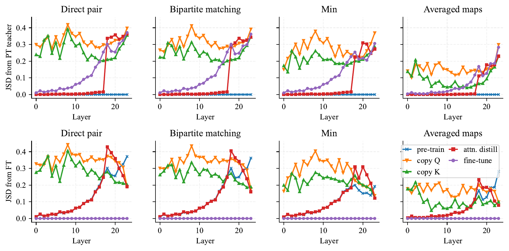
<figcaption><strong>Attention map similarity across methods</strong>. Each column corresponds to a different way of matching up attention heads between two models. The top row shows the Jensen-Shannon divergence (JSD) with respect to the MAE pre-trained teacher, whereas the bottom row shows the JSD with respect to the fine-tuned MAE model. These plots match our intuition on distillation or fine-tuning methods, but copy <em>Q</em> is consistently dissimilar from the PT and FT models. Note that this may be a limitation of this particular analysis, since there are many settings of <em>Q</em>, <em>K</em>, and <em>V</em> that lead to the same layer output.</figcaption>
</figure>

In  
efsec:variants, we found that copying the queries \\(Q\\) does surprisingly well, almost matching Attention Distillation or fine-tuning the pre-trained weights. Here, we compare the attention maps learned by the copy \\(Q\\) model to those of other models, in hopes of understanding why copy \\(Q\\) does so well.

Each of the 24 layers within a ViT-L has 16 attention heads, which each compute an \\(L \times L\\) attention map for an image with \\(L\\) patches. We would like to determine the similarity between the attention heads in two models using some divergence measure; we use the Jensen-Shannon divergence (JSD) because it is symmetric in its arguments. However, there is one caveat. Because the output of the attention layer is invariant to the ordering of its heads, it is insufficient to compare the \\(i\\)th head of one model against the \\(i\\)th head of another. We need to properly match heads up across models. We explored four ways of doing so:

1.  Direct pair: this is the naive approach of computing the JSD between the \\(i\\)th head of the first model and the \\(i\\)th head of the second model. This can fail since similar heads may not be in the same order across models.

2.  Bipartite matching: for each layer, we compute the JSD between each of the 16 heads in the first model and the 16 heads in the second model. We then use bipartite matching to create a one-to-one pairing between the heads that minimizes the cumulative JSD. This solves the previous problem, but can still be thrown off, such as if one of the models has heads that it applies no weight to (\\(V=0\\) or \\(W_{proj}=0\\) or \\(W_{proj}\\) is orthogonal to the values).

3.  Minimum: instead of creating a one-to-one matching, we allow many-to-one matching between heads. We call this Minimum because each head in the first model is paired with the head from the second model with the smallest JSD. This allows our metric to potentially ignore extraneous heads in the second model, but is still susceptible to extraneous heads in the first model.

4.  Averaged maps: we average the attention maps of all heads in a layer and compare the averaged maps across models. This can still be thrown off by extraneous heads.

  
effig:head_jsd shows the results of comparing models against the pre-trained teacher (top row) or fine-tuned model (bottom row) as the second model in the JSD. Most of our findings align with our intuition. In the top row, when comparing against the pre-trained teacher, attention distillation matches the teacher maps closely until layer 18, the last layer whose attention maps it is trained to approximate. The fine-tuned model’s attention maps diverge more in later layers, since layerwise learning rate decay ensures that the earlier layers don’t change much. However, copy \\(Q\\) is only somewhat similar to the pre-trained teacher or the fine-tuned model, across all of our ways to measure attention map similarity. Furthermore, it is less similar than copy \\(K\\) is, even though copy \\(K\\) has much lower downstream performance than copy \\(Q\\).

Note that these plots have major limitations in what kinds of similarity they capture. With enough attention heads per layer, the same exact attention map can be partitioned differently across the heads between two models. Hypothetically, let’s say that an attention layer wants to attend uniformly across all locations (*i.e.,* perform average pooling), and that we have 3 models, each with 2 attention heads:

1.  Head 1 attends uniformly over all locations, head 2 attends arbitrarily over locations, and the second head’s values are set to 0.

2.  Head 1 attends uniformly over the top half of the image, head 2 attends uniformly over the bottom half of the image, and both use values \\(V/2\\).

3.  Head 1 attends uniformly over the left half of the image, head 2 attends uniformly over the right half of the image, and both use values \\(V/2\\).

All 3 heads compute the same exact attention operation, yet would register as highly dissimilar in the setup from  
effig:head_jsd. Overall, this experiment shows that copy \\(Q\\)’s behavior is highly complex, and its strong downstream performance is still not fully understand.

<figure id="fig:attn_vis">
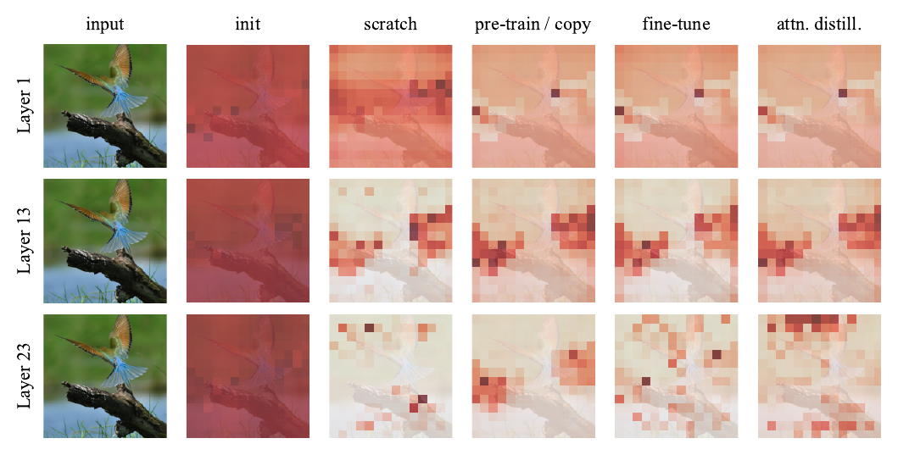
<figcaption><strong>Visualization of attention maps for different methods</strong>. We show what the [CLS] token attends to at various layers within the network. Darker patches indicate more attention weight. Notably, the pre-trained MAE model’s attention maps provide a significant prior over what the model should use, separating the object from potentially spurious cues like the branch or the background. In contrast, models right at random initialization (“init”) start off attending uniformly over the image, which leads the scratch model to use more of the spurious patches. We show more attention map visualizations in Appendix <a href="#sec:more_attn_vis" data-reference-type="ref" data-reference="sec:more_attn_vis">11</a>. </figcaption>
</figure>

## Attention Map Visualizations [sec:attn_map_vis]

  
efsec:relearn provided several results to show that attention transfer does not simply “relearn” the teacher. Here, we examine one final piece of evidence. We show the attention maps of different networks in  
effig:attn_vis. We focus on Attention Distillation, since Attention Copy’s maps are identical to those in the teacher. Attention Distillation’s maps generally match the teacher (pre-trained MAE), but are not completely identical for layers that are distilled (*e.g.,* layer 13). For layer 24, which is not distilled, Attention Distillation looks very different from pre-trained model, instead resembling the attention map of a model trained from scratch. These visualizations also highlight the fact that these attention maps are a very strong prior on what the model should use. While the randomly initialized model attends completely uniformly over all tokens, the pre-trained teacher attention maps already separate the relevant object from potentially spurious correlations (like the branch or background in the example). We show additional attention map visualizations in  
effig:more_attn_vis and  
effig:more_attn_vis2.

## Attention Distillation Hyperparameter Sensitivity

We show the sensitivity of Attention Distillation to its hyperparameters.

**Distillation loss weight** We first consider the distillation loss weight \\(\lambda\\) which is used to compute the overall loss for the student: \\[\begin{aligned}
    \mathcal L = \mathcal L_\text{task} + \lambda L_\text{dist}
\end{aligned}\\] Table <a href="#tab:distill_loss_weight" data-reference-type="ref" data-reference="tab:distill_loss_weight">[tab:distill_loss_weight]</a> shows that a larger weight, \\(\lambda = 3\\), does best. This may be because it encourages the student to learn useful attention maps more quickly, letting it guide feature learning earlier in training. We use this value of \\(\lambda\\) for our main result, where we match the 85.7 accuracy of fine-tuning. However, all other results in this paper use \\(\lambda = 1\\) for simplicity.

**Partial distillation: layers** Just as we tried for Attention Copy, we also tried distilling various numbers of layers from the MAE teacher network, starting from the bottom of the network. Table <a href="#tab:distill_teacher_layers" data-reference-type="ref" data-reference="tab:distill_teacher_layers">8</a> shows that there is a “sweet spot” when distilling the first 21 out of 24 layers. Distilling all layers may hurt performance by forcing the student to use attention maps that are more suited for reconstruction than classification. Note that all other distillation results in this paper use the first 18 layers by default.

<figure id="tab:distill_teacher_layers">
<table>
<tbody>
<tr>
<td style="text-align: left;">Distillation loss weight <em>λ</em></td>
<td style="text-align: center;">Accuracy</td>
</tr>
<tr>
<td style="text-align: left;"></td>
<td style="text-align: center;">84.7</td>
</tr>
<tr>
<td style="text-align: left;">1.0</td>
<td style="text-align: center;">85.3</td>
</tr>
<tr>
<td style="text-align: left;">3.0</td>
<td style="text-align: center;">85.7</td>
</tr>
</tbody>
</table>
<table>
<tbody>
<tr>
<td style="text-align: left;">Layers distilled</td>
<td style="text-align: center;">Accuracy</td>
</tr>
<tr>
<td style="text-align: left;"></td>
<td style="text-align: center;">85.3</td>
</tr>
<tr>
<td style="text-align: left;">21</td>
<td style="text-align: center;">85.5</td>
</tr>
<tr>
<td style="text-align: left;">24</td>
<td style="text-align: center;">85.1</td>
</tr>
</tbody>
</table>
<figcaption><strong>Number of layers distilled</strong></figcaption>
</figure>

|         |         |          |
|:--------|:-------:|:--------:|
| Teacher | Student | Accuracy |
| Random  | Random  |   72.7   |
| MAE     | Random  |   85.1   |
| MoCo-v3 | Random  |   82.5   |
| FLIP    | Random  |   86.6   |
| FLIP    |   MAE   |   84.2   |
| MAE     |   MAE   |   85.4   |
| MoCo-v3 |   MAE   |   82.9   |
| MAE     |  FLIP   |   83.2   |

**Decoupling attention maps from features**. We try Attention Distillation with various pre-trained students.

## Mix and Match, Student and Teacher

In the main paper, we focused on transferring attention maps from a pre-trained teacher to a randomly initialized student. However, the fact that Transformers have decoupled inter- and intra-token computation means that we can actually initialize the student with a pre-trained network as well. This entails testing whether the attention patterns from one network can improve the features of an already-pre-trained student model. We try Attention Distillation for various combinations of MAE, MoCo-v3, FLIP, and a randomly initialized network. Table <a href="#tab:decouple" data-reference-type="ref" data-reference="tab:decouple">14</a> shows that this “mix-and-match” training does better than training from scratch (83.0) but does not match the performance in  
eftab:init, where the students are randomly initialized. These are preliminary results, as the overall training recipe may need to be changed to accommodate the different learning dynamics of a different student model. Further hyperparameter tuning may significantly improve these results.

# Implementation Details

We present the training recipe for Attention Copy in  
eftab:copy_recipe and the recipe for Attention Distillation in  
eftab:distill_recipe. For our partial layer transfer experiments in  
effig:block, we set \\(\beta_2 = 0.95\\) as it helps avoid training instabilities.

| Config | Value |
|:---|:---|
| optimizer | AdamW `\cite{Loshchilov2019}`{=latex} |
| base learning rate | 1e-3 |
| minimum absolute lr | 2e-3 |
| weight decay | 0.05 |
| optimizer momentum | \\(\beta_1=0.9\\), \\(\beta_2 = 0.999\\) |
| layerwise lr decay | 0.75 |
| batch size | 2048 |
| learning rate schedule | cosine decay `\cite{Loshchilov2016}`{=latex} |
| warmup epochs `\cite{Goyal2017}`{=latex} | 5 |
| training epochs | 100 |
| augmentation | RandAug (9, 0.5) `\cite{Cubuk2020}`{=latex} |
| label smoothing `\cite{Szegedy2016a}`{=latex} | 0.1 |
| mixup `\cite{Zhang2018a}`{=latex} | 0.8 |
| cutmix `\cite{Yun2019}`{=latex} | 1.0 |
| drop path `\cite{Huang2016}`{=latex} | 0 |
| exp. moving average (EMA) | 0.9999 |
| layers copied | 24 |

**Training recipe for Attention Copy on ViT-L**.

| Config | Value |
|:---|:---|
| optimizer | AdamW |
| base learning rate | 1e-4 |
| weight decay | 0.3 |
| optimizer momentum | \\(\beta_1=0.9\\), \\(\beta_2 = 0.95\\) `\cite{Chen2020c}`{=latex} |
| batch size | 2048 |
| learning rate schedule | cosine decay |
| warmup epochs | 20 |
| training epochs | 200 |
| augmentation | RandAug (9, 0.5) |
| label smoothing | 0.1 |
| mixup | 0.8 |
| cutmix | 1.0 |
| drop path | 0.2 |
| exp. moving average (EMA) | 0.9999 |
| layers copied | 18 |
| distillation weight \\(\lambda\\) | 3 |

**Training recipe for Attention Distillation on ViT-L**.

# Additional Attention Map Visualizations [sec:more_attn_vis]

<figure id="fig:more_attn_vis">

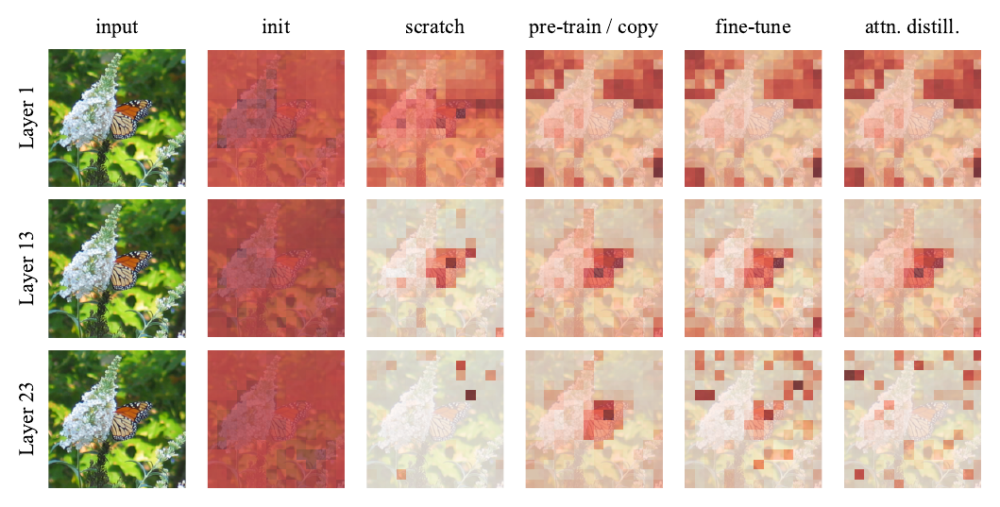 
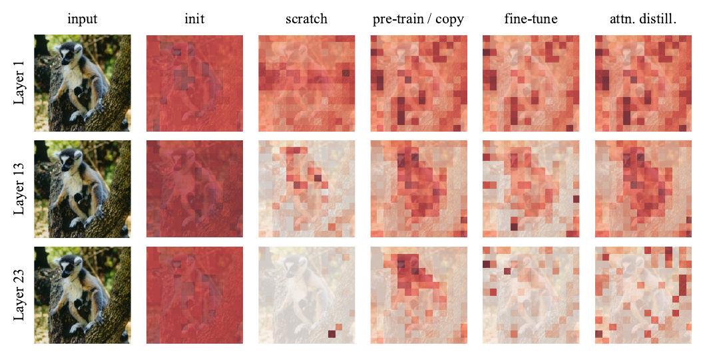

<figcaption><strong>Attention map visualizations on more examples</strong></figcaption>
</figure>

<figure id="fig:more_attn_vis2">

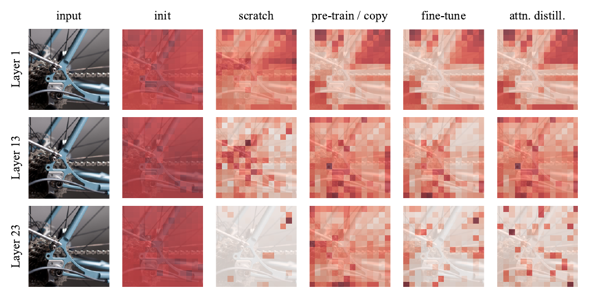 
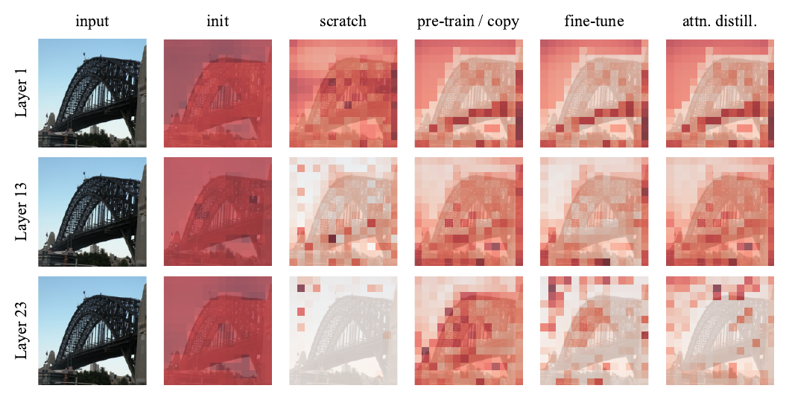

<figcaption><strong>Attention map visualizations on more examples</strong></figcaption>
</figure>

[^1]: Work done during an internship at FAIR.

[^2]: If not otherwise specified, our results are based on our faithful reimplementation of the official code in JAX.
