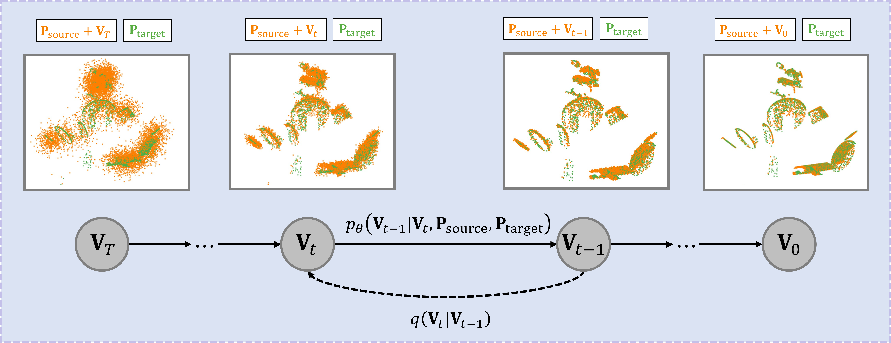
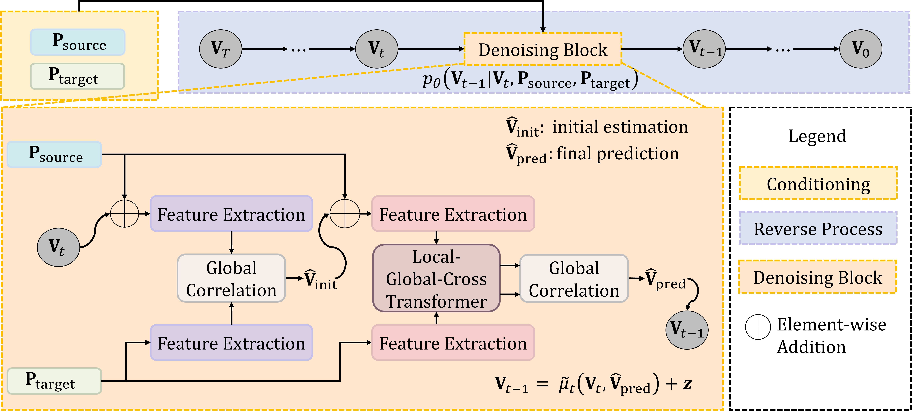
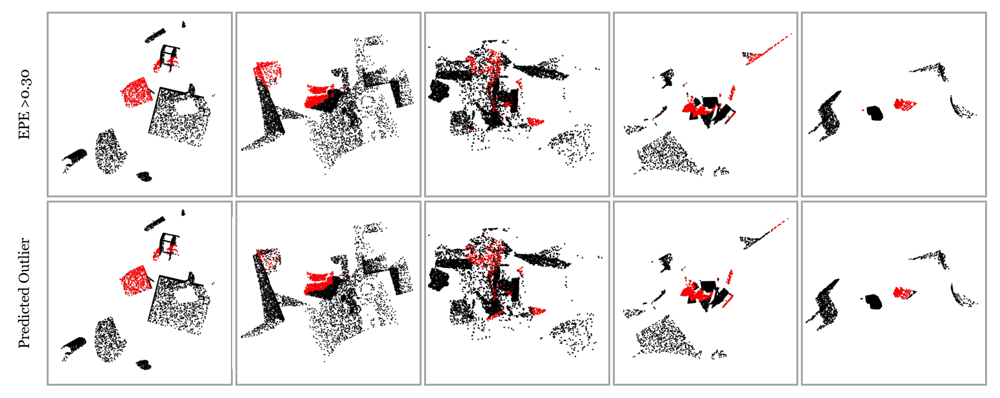

# DiffSF: Diffusion Models for Scene Flow Estimation

## Abstract

Scene flow estimation is an essential ingredient for a variety of real-world applications, especially for autonomous agents, such as self-driving cars and robots. While recent scene flow estimation approaches achieve reasonable accuracy, their applicability to real-world systems additionally benefits from a reliability measure. Aiming at improving accuracy while additionally providing an estimate for uncertainty, we propose *DiffSF* that combines transformer-based scene flow estimation with denoising diffusion models. In the diffusion process, the ground truth scene flow vector field is gradually perturbed by adding Gaussian noise. In the reverse process, starting from randomly sampled Gaussian noise, the scene flow vector field prediction is recovered by conditioning on a source and a target point cloud. We show that the diffusion process greatly increases the robustness of predictions compared to prior approaches resulting in state-of-the-art performance on standard scene flow estimation benchmarks. Moreover, by sampling multiple times with different initial states, the denoising process predicts multiple hypotheses, which enables measuring the output uncertainty, allowing our approach to detect a majority of the inaccurate predictions. The code is available at <https://github.com/ZhangYushan3/DiffSF>.

# Introduction

Scene flow estimation is an important research topic in computer vision with applications in various fields, such as autonomous driving `\cite{menze2015object}`{=latex} and robotics `\cite{seita2023toolflownet}`{=latex}. Given a source and a target point cloud, the objective is to estimate a scene flow vector field that maps each point in the source point cloud to the target point cloud. Many studies on scene flow estimation aim at enhancing accuracy and substantial progress has been made particularly on clean, synthetic datasets. However, real-world data contains additional challenges such as severe occlusion and noisy input, thus requiring a high level of robustness when constructing models for scene flow estimation.

Recently, Denoising Diffusion Probabilistic Models (DDPMs) have not only been widely explored in image generation `\cite{ho2020denoising, rombach2022high}`{=latex} but also in analysis tasks, e.g. detection `\cite{chen2023diffusiondet}`{=latex}, classification `\cite{han2022card}`{=latex}, segmentation `\cite{baranchuk2021label, gu2022diffusioninst}`{=latex}, optical flow `\cite{saxena2024surprising}`{=latex}, human pose estimation `\cite{holmquist2023diffpose}`{=latex}, point cloud registration `\cite{jiang2024se}`{=latex}, etc. Drawing inspiration from the recent successes of diffusion models in regression tasks and recognizing their potential compatibility with scene flow estimation, we formulate scene flow estimation as a diffusion process following DDPMs `\cite{ho2020denoising}`{=latex} as shown in Figure <a href="#Diffusion" data-reference-type="ref" data-reference="Diffusion">1</a>. The forward process initiates from the ground truth scene flow vector field and gradually introduces noise to it. Conversely, the reverse process is conditioned on the source and the target point cloud and is tasked to reconstruct the scene flow vector field based on the current noisy input. To learn the denoising process, a new network is proposed inspired by state-of-the-art scene flow estimation methods FLOT `\cite{puy2020flot}`{=latex} and GMSF `\cite{zhang2024gmsf}`{=latex}.

Previous methods `\cite{zhang2024gmsf, cheng2023multi, wang2022matters, cheng2022bi}`{=latex} usually suffer from inaccuracies when occlusions occur or when dealing with noisy inputs. During inference, based on the fixed parameters learned during training, they cannot provide information about their inaccurate predictions, which might lead to problems in safety-critical downstream tasks. Our proposed method approaches this problem in two aspects: First, denoising diffusion models are capable of handling noisy data by modeling stochastic processes. The noise caused by sensors in the real world is filtered out, which allows the model to focus on learning underlying patterns. By learning feature representations that are robust to noise, the prediction accuracy is improved. Second, since the diffusion process introduces randomness into the inherently deterministic prediction task, it can provide a measure of uncertainty for each prediction by averaging over a set of hypotheses, notably without any modifications to the training process. Extensive experiments on multiple benchmarks, FlyingThings3D `\cite{mayer2016large}`{=latex}, KITTI Scene Flow `\cite{menze2015object}`{=latex}, and Waymo-Open `\cite{sun2020scalability}`{=latex}, demonstrate state-of-the-art performance of our proposed method. Furthermore, we demonstrate that the predicted uncertainty correlates with the prediction error, establishing it as a reasonable measure that can be adjusted to the desired certainty level with a simple threshold value.

To summarize, our contributions are: (1) We introduce DiffSF, leveraging diffusion models to solve the full scene flow estimation problem, where the inherent noisy property of the diffusion process filters out noisy data, thus, increasing the focus on learning the relevant patterns. (2) DiffSF introduces randomness to the scene flow estimation task, which allows us to predict the uncertainty of the estimates without being explicitly trained for this purpose. (3) We develop a novel architecture that combines transformers and diffusion models for the task of scene flow estimation, improving both accuracy and robustness for a variety of datasets.

<figure id="Diffusion">

<figcaption><strong>Diffusion process.</strong> In the forward process, we start from a ground truth scene flow vector field <strong>V</strong>0 and gradually add noise to it until we reach <strong>V</strong><em>T</em>, which is completely Gaussian noise. In the reverse process, we recover the scene flow vector field <strong>V</strong>0 from the randomly sampled noisy vector field <strong>V</strong><em>T</em> conditioned on the source point cloud <strong>P</strong>source and the target point cloud <strong>P</strong>target.</figcaption>
</figure>

# Related Work

**Scene Flow Estimation** has rapidly progressed since the introduction of FlyingThings3D `\cite{mayer2016large}`{=latex}, KITTI Scene Flow `\cite{menze2015object}`{=latex}, and Waymo-Open `\cite{sun2020scalability}`{=latex} benchmarks. Many existing methods `\cite{behl2017bounding,ma2019deep,menze2015object,ren2017cascaded,sommer2022sf2se3,vogel20153d,yang2021learning}`{=latex} assume scene objects are rigid and break down the estimation task into sub-tasks involving object detection or segmentation, followed by motion model fitting. While effective for autonomous driving scenes with static background and moving vehicles, these methods struggle with more complex scenes containing deformable objects, and their non-differentiable components impede end-to-end training without instance-level supervision. Recent advancements in scene flow estimation focus on end-to-end trainable models and are categorized into encoder-decoder, coarse-to-fine, recurrent, soft correspondence methods, and runtime optimization-based methods. Encoder-decoder techniques, exemplified by FlowNet3D `\cite{liu2019flownet3d,wang2020flownet3d++}`{=latex} and HPLFlowNet `\cite{gu2019hplflownet}`{=latex}, utilize neural networks to learn scene flow by adopting an hourglass architecture. Coarse-to-fine methods, such as PointPWC-Net `\cite{wu2020pointpwc}`{=latex}, progressively estimate motion from coarse to fine scales, leveraging hierarchical feature extraction and warping. Recurrent methods like FlowStep3D `\cite{kittenplon2021flowstep3d}`{=latex}, PV-RAFT `\cite{wei2021pv}`{=latex}, and RAFT3D `\cite{teed2021raft}`{=latex} iteratively refine the estimated motion, thus enhancing accuracy. Some approaches like FLOT `\cite{puy2020flot}`{=latex}, STCN`\cite{li2022sctn}`{=latex}, and GMSF `\cite{zhang2024gmsf}`{=latex} frame scene flow estimation as an optimal transport problem, employing convolutional layers and point transformer modules for correspondence computation. Different from the previously mentioned methods, which are fully trained and supervised offline, the runtime optimization-based methods `\cite{li2021neural,li2023fast,chodosh2023re}`{=latex} are optimized during the evaluation time based on each pair of inputs. While these methods have the advantage of without the need for training datasets, it also means that they can not take advantage of large-scale training datasets. Due to the online optimization, they also suffer from slow inference speed. Moreover, most of them focus only on autonomous driving scenes. On the other hand, we aim to estimate the scene flow of more general scenarios. Our proposed method takes the current state-of-the-art soft correspondence method GMSF `\cite{zhang2024gmsf}`{=latex} as a baseline. Given the fact that being able to indicate uncertainty of the estimation is an important feature for safety-critical downstream tasks, we propose to leverage the diffusion models for this purpose, whose ability of uncertainty indication has been proven by other relevant research areas `\cite{han2022card, saxena2024surprising}`{=latex}.

**Diffusion Models for Regression.** Diffusion models have been widely exploited for image generation `\cite{ho2020denoising, rombach2022high}`{=latex}. Beyond their capacity to generate realistic images and videos, researchers have also explored their potential to approach regression tasks. CARD `\cite{han2022card}`{=latex} introduces a classification and regression diffusion model to accurately capture the mean and the uncertainty of the prediction. DiffusionDet `\cite{chen2023diffusiondet}`{=latex} formulates object detection as a denoising diffusion process from noisy boxes to object boxes. Baranchuk *et al*.. `\cite{baranchuk2021label}`{=latex} employ diffusion models for semantic segmentation with scarce labeled data. DiffusionInst `\cite{gu2022diffusioninst}`{=latex} depicts instances as instance-aware filters and casts instance segmentation as a denoising process from noise to filter. Jiang *et al*.. `\cite{jiang2024se}`{=latex} introduce diffusion models to point cloud registration that operates on the rigid body transformation group. Recent research on optical flow and depth estimation `\cite{saxena2024surprising}`{=latex} shows the possibility of using diffusion models for dense vision tasks. While there have been attempts to employ diffusion models for scene flow estimation `\cite{liu2023difflow3d}`{=latex}, they mainly focus on refining an initial estimation. On the contrary, our goal is to construct a model to estimate the full scene flow vector field instead of a refinement plug-in module. To the best of our knowledge, we are the first to propose using diffusion models to estimate the full scene flow directly from two point clouds.

# Proposed Method

## Preliminaries [sec: preliminaries]

#### Scene Flow Estimation.

Given a source point cloud \\(\mathbf{P}_\mathrm{source} \in \mathbb{R}^{N_1 \times 3}\\) and a target point cloud \\(\mathbf{P}_\mathrm{target} \in \mathbb{R}^{N_2 \times 3}\\), where \\(N_1\\) and \\(N_2\\) are the number of points in the source and the target point cloud respectively, the objective is to estimate a scene flow vector field \\(\mathbf{V} \in \mathbb{R}^{N_1 \times 3}\\) that maps each source point to the correct position in the target point cloud.

#### Diffusion Models.

Inspired by non-equilibrium thermodynamics, diffusion models `\cite{ho2020denoising, song2021denoising}`{=latex} are a class of latent variable (\\(x_1, ..., x_T\\)) models of the form \\(p_{\theta}(x_{0}) = \int p_{\theta}(x_{0:T}) d x_{1:T}\\), where the latent variables are of the same dimensionality as the input data \\(x_0\\) (any dimensionality). The joint distribution \\(p_{\theta}(x_{0:T})\\) is also called the *reverse process* \\[\label{eq: reverse}
\begin{array}{cc}
    p_{\theta}(x_{0:T}) = p(x_T)\prod_{t=1}^{T} p_{\theta}(x_{t-1}|x_{t}), & p_{\theta}(x_{t-1}|x_{t}) = \mathcal{N}(x_{t-1};\mu_\theta(x_t,t),\Sigma_\theta(x_t,t))
    . 
\end{array}\\] The approximate posterior \\(q(x_{1:T}|x_{0})\\) is called the *forward process*, which is fixed to a Markov chain that gradually adds noise according to a predefined noise scheduler \\(\beta_{1:T}\\) \\[\label{eq: diffusion}
\begin{array}{cc}
    q(x_{1:T}|x_{0}) = \prod_{t=1}^{T} q(x_{t}|x_{t-1}), & q(x_{t}|x_{t-1}) = \mathcal{N}(x_{t};\sqrt{1-\beta_{t}}x_{t-1},\beta_{t}\mathbf{I}).
\end{array}\\] The training is performed by minimizing a variational bound on the negative log-likelihood \\[\label{eq: elbo}
\begin{split}
    \mathbb{E}_{q}[-\log p_\theta(x_{0})] &\leq \mathbb{E}_{q}[-\log \tfrac{p_\theta(x_{0:T})}{q(x_{1:T}|x_0)}] \\
    &= \mathbb{E}_{q}[D_\mathrm{KL}(q(x_{T}|x_{0})\|p(x_{T})) \\
    &+ \textstyle\sum_{t>1}D_{\mathrm{KL}}(q(x_{t-1}|x_{t}, x_{0})\|p_\theta(x_{t-1}|x_{t})) - \log p_\theta(x_0|x_1)],
\end{split}\\] where \\(D_\mathrm{KL}\\) denotes the Kullback–Leibler divergence.

## Scene Flow Estimation as Diffusion Process [sec: method]

We formulate the scene flow estimation task as a conditional diffusion process that is illustrated in Figure <a href="#Diffusion" data-reference-type="ref" data-reference="Diffusion">1</a>. The *forward process* starts from the ground truth scene flow vector field \\(\mathbf{V}_0\\) and ends at pure Gaussian noise \\(\mathbf{V}_T\\) by gradually adding Gaussian noise to the input data as in Eq. <a href="#eq: diffusion" data-reference-type="eqref" data-reference="eq: diffusion">[eq: diffusion]</a>. Given that \\(\beta_t\\) is small, \\(q(\mathbf{V}_{t}|\mathbf{V}_{t-1})\\) in Eq. <a href="#eq: diffusion" data-reference-type="eqref" data-reference="eq: diffusion">[eq: diffusion]</a> has a closed form `\cite{ho2020denoising}`{=latex} \\[q(\mathbf{V}_{t}|\mathbf{V}_{0}) = \mathcal{N}(\mathbf{V}_{t};\sqrt{\bar{\alpha}_{t}}\mathbf{V}_{0},(1-\bar{\alpha}_{t})\mathbf{I}),\\] where \\(\bar{\alpha}_{t}:=\prod_{s=1}^{t}(1-\beta_s)\\). The *reverse process* predicts the ground truth \\(\mathbf{V}_{0}\\) from the noisy input \\(\mathbf{V}_{t}\\) conditioned on both the source point cloud \\(\mathbf{P}_\mathrm{source}\\) and the target point cloud \\(\mathbf{P}_\mathrm{target}\\), \\[\label{eq: reverse diffsf}
    p_\theta(\mathbf{V}_{t-1}|\mathbf{V}_{t}, \mathbf{P}_\mathrm{source}, \mathbf{P}_\mathrm{target}) = \mathcal{N}(\mathbf{V}_{t-1};\mu_\theta(\mathbf{V}_t, \mathbf{P}_\mathrm{source}, \mathbf{P}_\mathrm{target}),\textbf{I}).\\] The forward process posterior is tractable when conditioned on \\(\mathbf{V}_{0}\\), \\[\label{eq: forward posterior}
    q(\mathbf{V}_{t-1}|\mathbf{V}_{t},\mathbf{V}_{0}) = \mathcal{N}(\mathbf{v}_{t-1};\tilde{\mu}_{t}(\mathbf{V}_{t},\mathbf{V}_{0}),\tilde{\beta}_{t}\mathbf{I}),\\] where \\(\tilde{\mu}_{t}(\mathbf{V}_{t},\mathbf{V}_{0}) := \tfrac{\sqrt{\bar{\alpha}_{t-1}}\beta_{t}}{1-\bar{\alpha}_{t}}\mathbf{V}_{0}+\tfrac{\sqrt{\alpha_{t}}(1-\bar{\alpha}_{t-1})}{1-\bar{\alpha}_{t}}\mathbf{V}_{t}\\), and \\(\tilde{\beta}_{t} := \tfrac{1-\bar{\alpha}_{t-1}}{1-\bar{\alpha}_{t}}\beta_{t}\\). Minimizing the variational bound in Eq. <a href="#eq: elbo" data-reference-type="eqref" data-reference="eq: elbo">[eq: elbo]</a> breaks down to minimizing the difference between \\(\tilde{\mu}_{t}(\mathbf{V}_{t},\mathbf{V}_{0})\\) and \\(\mu_\theta(\mathbf{V}_t, \mathbf{P}_\mathrm{source}, \mathbf{P}_\mathrm{target})\\). Since \\(\mathbf{V}_t\\) is constructed from \\(\mathbf{V}_0\\) by a predefined fixed noise scheduler \\(\beta_{1:T}\\), the training objective is further equivalent to learning \\(\mathbf{V}_{0}\\) by a neural network \\(f_\theta(\mathbf{V}_t, \mathbf{P}_\mathrm{source}, \mathbf{P}_\mathrm{target})\\). The training loss can be written as \\[\label{eq: diffusion objective}
    \mathcal{L} = \|f_\theta(\mathbf{V}_t, \mathbf{P}_\mathrm{source}, \mathbf{P}_\mathrm{target}) - \mathbf{V}_0\|,\\] where the neural network \\(f_\theta(\mathbf{V}_t, \mathbf{P}_\mathrm{source}, \mathbf{P}_\mathrm{target})\\) takes the current noisy input \\(\mathbf{V}_t\\), the source point cloud \\(\mathbf{P}_\mathrm{source}\\), and the target point cloud \\(\mathbf{P}_\mathrm{target}\\) as input and output \\(\hat{\mathbf{V}}_\mathrm{pred}\\), which is an prediction of \\(\mathbf{V}_{0}\\). The detailed architecture of \\(f_\theta\\) is presented in section <a href="#sec: architecture" data-reference-type="ref" data-reference="sec: architecture">3.3</a>. The reverse process in Eq. <a href="#eq: reverse diffsf" data-reference-type="eqref" data-reference="eq: reverse diffsf">[eq: reverse diffsf]</a> can be rewritten by replacing \\(\mu_{\theta}\\) with \\(f_{\theta}\\) as \\[\label{eq: reverse process}
    p_\theta(\mathbf{V}_{t-1}|\mathbf{V}_t, \mathbf{P}_\mathrm{source}, \mathbf{P}_\mathrm{target}) = \mathcal{N}(\mathbf{V}_{t-1};\tilde{\mu}_{t}(\mathbf{V}_{t},f_\theta(\mathbf{V}_t, \mathbf{P}_\mathrm{source}, \mathbf{P}_\mathrm{target})),\textbf{I}).\\]

During *inference*, starting from randomly sampled Gaussian noise \\(\mathbf{V}_T\\), \\(\mathbf{V}_0\\) is reconstructed with the model \\(f_\theta\\) according to the reverse process in Eq. <a href="#eq: reverse process" data-reference-type="eqref" data-reference="eq: reverse process">[eq: reverse process]</a>. The detailed training and sampling algorithms are given in Algorithm <a href="#algo:training" data-reference-type="ref" data-reference="algo:training">2</a> and Algorithm <a href="#algo:sampling" data-reference-type="ref" data-reference="algo:sampling">3</a>.

<figure id="algo:training">

<figcaption>Training</figcaption>
</figure>

<figure id="algo:sampling">

<strong>V</strong><em>T</em> ∼ 𝒩(<strong>0</strong>, <strong>I</strong>)

<figcaption>Sampling</figcaption>
</figure>

## Architecture [sec: architecture]

To train the diffusion process with Eq. <a href="#eq: diffusion objective" data-reference-type="eqref" data-reference="eq: diffusion objective">[eq: diffusion objective]</a>, we need to design the neural network to predict \\(\mathbf{V}_0\\), i.e. the ground truth scene flow vector field. The reverse process with the detailed architecture of \\(\hat{\mathbf{V}}_{\mathrm{pred}}=f_\theta(\mathbf{V}_t, \mathbf{P}_\mathrm{source}, \mathbf{P}_\mathrm{target})\\) is given in Figure <a href="#Framework" data-reference-type="ref" data-reference="Framework">4</a>. We take the state-of-the-art method GMSF `\cite{zhang2024gmsf}`{=latex} as our baseline. All the building blocks, Feature Extraction, Local-Global-Cross Transformer, and Global Correlation are the same as in GMSF `\cite{zhang2024gmsf}`{=latex}. We modify the model architecture of GMSF following the recent work `\cite{puy2020flot, gu2022rcp, kittenplon2021flowstep3d}`{=latex} of scene flow estimation by adding an initial estimation before the final prediction. More specifically, the source point cloud \\(\mathbf{P}_\mathrm{source} \in \mathbb{R}^{N_{1} \times 3}\\) is first warped with \\(\mathbf{V}_{t} \in \mathbb{R}^{N_{1} \times 3}\\). The warped source point cloud and the target point cloud are sent to the Feature Extraction block to expand the three-dimensional coordinate into higher-dimensional features for each point. Based on the similarities between point pairs in the warped source and the target point cloud, a Global Correlation is applied to compute an initial estimation \\(\hat{\mathbf{V}}_{\mathrm{init}} \in \mathbb{R}^{N_{1} \times 3}\\). We then warp the source point cloud \\(\mathbf{P}_\mathrm{source} \in \mathbb{R}^{N_{1} \times 3}\\) with the initial estimation \\(\hat{\mathbf{V}}_{\mathrm{init}} \in \mathbb{R}^{N_{1} \times 3}\\). The same Feature Extraction block is applied on both the warped source point cloud and the target point cloud, but with different weights than the previous block. A Local-Global-Cross Transformer is then applied to the higher-dimensional features to get a more robust and reliable feature representation for each point. The output features are then sent into the Global Correlation block to get the final prediction \\(\hat{\mathbf{V}}_{\mathrm{pred}} \in \mathbb{R}^{N_{1} \times 3}\\). The detailed architecture of Feature Extraction, Local-Global-Cross Transformer, and Global Correlation is given in the following paragraphs using the same notation as GMSF `\cite{zhang2024gmsf}`{=latex}.

<figure id="Framework">

<figcaption>The reverse process with detailed denoising block for scene flow estimation. The denoising block takes the current noisy input <strong>V</strong><em>t</em>, the source point cloud <strong>P</strong>source, and the target point cloud <strong>P</strong>target as input. The output $\hat{\mathbf{V}}_\mathrm{pred}$ is the denoised scene flow prediction. Shared weights for the feature extraction are indicated in the same color.</figcaption>
</figure>

#### Feature Extraction

The three-dimensional coordinate for each point is first projected into a higher feature dimension \\(\mathbf{x}_{i}^h \in \mathbb{R}^{1 \times d}\\) by the off-the-shelf feature extraction backbone DGCNN `\cite{wang2019dynamic}`{=latex}. Each layer of the network can be written as \\[\mathbf{x}_{i}^h = \max_{\mathbf{x}_{j} \in \mathcal{N}(i)} h(\mathbf{x}_i, \mathbf{x}_{j}-\mathbf{x}_{i}),\\] where \\(i\\) and \\(j\\) denote the index of a single point in the point cloud. \\(\mathbf{x}_{j} \in \mathcal{N}(i)\\) denotes the neighboring points of point \\(\mathbf{x}_{i}\\) found by a \\(k\\)-nearest-neighbor (KNN) algorithm. The number of \\(k\\) is set to 16. The point feature \\(\mathbf{x}_{i}\\) and the edge feature \\(\mathbf{x}_{j}-\mathbf{x}_{i}\\) are first concatenated together along the feature dimension and then passed through a neural network \\(h\\). \\(h\\) consists of a sequence of linear layer, batch normalization, and leaky ReLU layer. The output feature dimension \\(d\\) is set to 128. The maximum value of the \\(k\\) nearest neighbors is taken as the output. Multiple layers are stacked together to get the final feature representation \\(\mathbf{x}_{i}^h\\).

#### Local-Global-Cross Transformer

takes the output high-dimensional features \\(\mathbf{x}_{i}^{h} \in \mathbb{R}^{1 \times d}\\) as input to learn more robust and reliable feature representations, \\[\label{eq: local transformer}
    \mathbf{x}_{i}^l = \textstyle\sum_{\mathbf{x}_j \in \mathcal{N}(i)}\gamma(\varphi_l(\mathbf{x}_i^h)-\psi_l(\mathbf{x}_j^h)+\delta) \odot (\alpha_l(\mathbf{x}_j^h)+\delta),\\] \\[\label{eq: global transformer}
    \mathbf{x}_i^g = \textstyle\sum_{\mathbf{x}_j \in \mathcal{X}_1}\langle\varphi_g(\mathbf{x}_i^l), \psi_g(\mathbf{x}_j^l)\rangle \alpha_g(\mathbf{x}_j^l),\\] \\[\label{eq: cross transformer}
    \mathbf{x}_{i}^c = \textstyle\sum_{\mathbf{x}_j \in \mathcal{X}_2}\langle\varphi_c(\mathbf{x}_i^g), \psi_c(\mathbf{x}_j^g)\rangle \alpha_c(\mathbf{x}_j^g),\\] where local, global, and cross transformers are given in Eq. <a href="#eq: local transformer" data-reference-type="eqref" data-reference="eq: local transformer">[eq: local transformer]</a> <a href="#eq: global transformer" data-reference-type="eqref" data-reference="eq: global transformer">[eq: global transformer]</a> <a href="#eq: cross transformer" data-reference-type="eqref" data-reference="eq: cross transformer">[eq: cross transformer]</a> respectively. \\(\varphi\\), \\(\psi\\), and \\(\alpha\\) denote linear layers to generate the query, key, and value. The indices \\(\cdot_l\\), \\(\cdot_g\\), and \\(\cdot_c\\) indicate local transformer, global transformer, and cross transformer, respectively. For the local transformer, \\(\gamma\\) is a sequence of linear layer, ReLU, linear layer, and softmax. \\(\delta\\) is the relative positional embedding that gives the information of the 3D coordinate distance between \\(\mathbf{x}_{i}\\) and \\(\mathbf{x}_{j}\\). \\(\odot\\) denotes element-wise multiplication. The output \\(\mathbf{x}_{i}^{l}\\) is further processed by a linear layer and a residual connection from the input before being sent to the global transformer. For the global and cross transformer, \\(\mathcal{X}_1 = \mathbf{P}_\mathrm{source} + (\mathbf{V}_{t}\\) or \\(\hat{\mathbf{V}}_\mathrm{init}) \in \mathbb{R}^{N_{1} \times 3}\\) and \\(\mathcal{X}_2 = \mathbf{P}_\mathrm{target} \in \mathbb{R}^{N_{2} \times 3}\\) represent the warped source point cloud and the target point cloud, respectively. \\(\langle , \rangle\\) denotes the scalar product. The output of the global and cross transformer is further processed by a linear layer, a layer normalization, and a residual connection from the input. A feedforward network with a multilayer perceptron and layer normalization is applied to the output of the cross transformer to aggregate information. To acquire more robust feature representations, the global-cross transformers are stacked and repeated multiple times (\\(14\\) times in our experiment). For simplicity, we only give the equations for learning the features of \\(\mathcal{X}_1\\). The features of \\(\mathcal{X}_2\\) are computed by the same procedure. The output point features \\(\mathbf{x}_{i}^c\\) and \\(\mathbf{x}_{j}^c\\) for each point cloud are stacked together to form feature matrices \\(\mathbf{F}_1 \in \mathbb{R}^{N_{1} \times d}\\) and \\(\mathbf{F}_2 \in \mathbb{R}^{N_{2} \times d}\\).

#### Global Correlation

predicts the scene flow vector solely based on two feature similarity matrices, cross feature similarity matrix \\(\mathbf{M}_\mathrm{cross} \in \mathbb{R}^{N_1 \times N_2}\\) and self feature similarity matrix \\(\mathbf{M}_\mathrm{self} \in \mathbb{R}^{N_1 \times N_1}\\). \\[\mathbf{M}_\mathrm{cross} = \text{softmax}(\mathbf{F}_1\mathbf{F}_2^T/ \sqrt{d}),% \in \mathbb{R}^{N_1 \times N_2},\\] \\[\mathbf{M}_\mathrm{self} = \text{softmax}(W_q(\mathbf{F}_1)W_k(\mathbf{F}_1)^T/ \sqrt{d}),% \in \mathbb{R}^{N_1 \times N_1},\\] where \\(W_q\\) and \\(W_k\\) are linear projections. \\(d\\) is the feature dimensions. The softmax is taken over the second dimension of the matrices. The cross feature similarity matrix \\(\mathbf{M}_\mathrm{cross}\in \mathbb{R}^{N_1 \times N_2}\\) encodes the feature similarities between all the points in the source point cloud \\(\mathbf{P}_\mathrm{source}\\) and all the points in the target point cloud \\(\mathbf{P}_\mathrm{target}\\). The self feature similarity matrix \\(\mathbf{M}_\mathrm{self}\in \mathbb{R}^{N_1 \times N_1}\\) encodes the feature similarities between all points in the source point cloud \\(\mathbf{P}_\mathrm{source}\\). The global correlation is performed by a matching process guided by the cross feature similarity matrix followed by a smoothing procedure guided by the self feature similarity matrix \\[\hat{\mathbf{V}} = \mathbf{M}_\mathrm{self} (\mathbf{M}_\mathrm{cross} \mathbf{P}_\mathrm{target} - \mathbf{P}_\mathrm{source}).\\] We follow GMSF `\cite{zhang2024gmsf}`{=latex} and employ a robust loss defined as \\[\mathcal{L} = \textstyle\sum_{i}(\lVert\hat{\mathbf{V}}_{\mathrm{pred}}(i)-\mathbf{V}_{\mathrm{gt}}(i)\rVert_1+\epsilon)^q,\\] where \\(\hat{\mathbf{V}}_{\mathrm{pred}}\\) is the output prediction of the neural network, i.e. \\(f_\theta(\mathbf{V}_t, \mathbf{P}_\mathrm{source}, \mathbf{P}_\mathrm{target})\\) in Eq. <a href="#eq: diffusion objective" data-reference-type="eqref" data-reference="eq: diffusion objective">[eq: diffusion objective]</a>. \\(\mathbf{V}_{\mathrm{gt}}\\) denotes the ground truth scene flow vector field i.e. \\(\mathbf{V}_0\\) in Eq. <a href="#eq: diffusion objective" data-reference-type="eqref" data-reference="eq: diffusion objective">[eq: diffusion objective]</a>. \\(i\\) is the index of the points. \\(\epsilon\\) is set to 0.01 and \\(q\\) is set to 0.4.

# Experiments [Experiments]

## Implementation Details

We use the AdamW optimizer and a weight decay of \\(1 \times 10 ^ {-4}\\). The initial learning rate is set to \\(4 \times 10 ^ {-4}\\) for FlyingThings3D `\cite{mayer2016large}`{=latex} and \\(1 \times 10 ^ {-4}\\) for Waymo-Open `\cite{sun2020scalability}`{=latex}. We employ learning rate annealing by using the Pytorch OneCycleLR learning rate scheduler. During training, we set \\(N_1\\) and \\(N_2\\) to \\(4096\\), randomly sampled by furthest point sampling. The model is trained for \\(600\\)k iterations with a batch size of \\(24\\). During inference, we follow previous methods `\cite{zhang2024gmsf, liu2023difflow3d, cheng2023multi}`{=latex} and set \\(N_1\\) and \\(N_2\\) to \\(8192\\) for a fair comparison. The number of diffusion steps is set to \\(20\\) during training and \\(2\\) during inference. The number of nearest neighbors \\(k\\) in DGCNN and Local Transformer is set to \\(16\\). The number of global-cross transformer layers is set to \\(14\\). The number of feature channels is set to \\(128\\). Further implementation details are given in the supplemental document and the provided code.

## Evaluation Metrics

We follow the most recent work in the field `\cite{zhang2024gmsf, liu2023difflow3d, cheng2023multi}`{=latex} and use established evaluation metrics for scene flow estimation. \\(\textrm{EPE}_{\textrm{3D}}\\) measures the endpoint error between the prediction and the ground truth \\(\lVert\hat{\mathbf{V}}_\mathrm{pred}-\mathbf{V}_\mathrm{gt}\rVert_2\\) averaged over all points. \\(\textrm{ACC}_{\textrm{S}}\\) measures the percentage of points with an endpoint error smaller than \\(5~\textrm{cm}\\) or relative error less than \\(5\%\\). \\(\textrm{ACC}_{\textrm{R}}\\) measures the percentage of points with an endpoint error smaller than \\(10~\textrm{cm}\\) or relative error less than \\(10\%\\). \\(\textrm{Outliers}\\) measures the percentage of points with an endpoint error larger than \\(30~\textrm{cm}\\) or relative error larger than \\(10\%\\).

## Datasets

We follow the most recent work in the field `\cite{zhang2024gmsf, liu2023difflow3d, cheng2023multi}`{=latex} and test the proposed method on three established benchmarks for scene flow estimation.

**FlyingThings3D** `\cite{mayer2016large}`{=latex} is a synthetic dataset consisting of 25000 scenes with ground truth annotations. We follow Liu *et al*.. in FlowNet3D `\cite{liu2019flownet3d}`{=latex} and Gu *et al*.. in HPLFlowNet `\cite{gu2019hplflownet}`{=latex} to preprocess the dataset and denote them as \\(\text{F3D}_\text{o}\\), with occlusions, and \\(\text{F3D}_\text{s}\\), without occlusions. The former consists of 20000 and 2000 scenes for training and testing, respectively. The latter consists of 19640 and 3824 scenes for training and testing, respectively.

**KITTI Scene Flow** `\cite{menze2015object}`{=latex} is a real autonomous driving dataset with 200 scenes for training and 200 scenes for testing. Since the annotated data in KITTI is limited, the dataset is mainly used for evaluating the generalization ability of the models trained on FlyingThings3D. Similar to the FlyingThings3D dataset, following Liu *et al*.. in FlowNet3D `\cite{liu2019flownet3d}`{=latex} and Gu *et al*.. in HPLFlowNet `\cite{gu2019hplflownet}`{=latex}, the KITTI dataset is preprocessed as \\(\text{KITTI}_\text{o}\\), with occlusions, and \\(\text{KITTI}_\text{s}\\), without occlusions. The former consists of 150 scenes from the annotated training set. The latter consists of 142 scenes from the annotated training set.

**Waymo-Open** `\cite{sun2020scalability}`{=latex} is a larger autonomous driving dataset with challenging scenes. The annotations are generated from corresponding tracked 3D objects to scale up the dataset for scene flow estimation by approximately \\(1000\\) times compared to previous real-world scene flow estimation datasets. The dataset consists of 798 training sequences and 202 testing sequences. Each sequence consists of around 200 scenes. Different preprocessing of the dataset exists `\cite{ding2022fh,jin2022deformation,jund2021scalable}`{=latex}, we follow the one employed in our baseline method `\cite{ding2022fh}`{=latex}.

Note that Li et al. `\cite{li2021neural}`{=latex} preprocess datasets like Argoverse `\cite{chang2019argoverse}`{=latex} and nuScenes `\cite{caesar2020nuscenes}`{=latex} without providing corresponding training datasets. Therefore, these preprocessed datasets are suitable only for runtime optimization-based methods. In the absence of training data, several authors try to generate their own training datasets `\cite{li2023fast,jiang20243dsflabelling}`{=latex}, which means there is no standard protocol for evaluating learning-based methods on these datasets.

## State-of-the-art Comparison

We give state-of-the-art comparisons on multiple standard scene flow datasets. Table <a href="#F3Ds" data-reference-type="ref" data-reference="F3Ds">1</a> and Table <a href="#F3Do" data-reference-type="ref" data-reference="F3Do">2</a> show the results on the \\(\text{F3D}_\text{s}\\) and the \\(\text{F3D}_\text{o}\\) datasets, with generalization results on the \\(\text{KITTI}_\text{s}\\) and the \\(\text{KITTI}_\text{o}\\) datasets. Table <a href="#Waymo" data-reference-type="ref" data-reference="Waymo">3</a> shows the results on the \\(\text{Waymo-Open}\\) dataset. On the \\(\text{F3D}_\text{s}\\) dataset, DiffSF shows an improvement (over the failure cases) of 31% in \\(\textrm{EPE}_{\textrm{3D}}\\), 44% in \\(\textrm{ACC}_{\textrm{S}}\\), 35% in \\(\textrm{ACC}_{\textrm{R}}\\), and 45% in \\(\textrm{Outliers}\\) compared to the current state-of-the-art method GMSF `\cite{zhang2024gmsf}`{=latex}. Similar improvement is also shown on the \\(\text{F3D}_\text{o}\\) dataset with an improvement of 32% in \\(\textrm{EPE}_{\textrm{3D}}\\), 34% in \\(\textrm{ACC}_{\textrm{S}}\\), 24% in \\(\textrm{ACC}_{\textrm{R}}\\), and 38% in \\(\textrm{Outliers}\\), demonstrating DiffSF’s ability to handle occlusions. The generalization abilities on the \\(\text{KITTI}_\text{s}\\) and the \\(\text{KITTI}_\text{o}\\) datasets are comparable to state of the art. All the four metrics show the best or second-best performances. On the Waymo-Open dataset, a steady improvement in both accuracy and robustness is achieved, demonstrating DiffSF’s effectiveness on real-world data.

<table>
<caption><strong>State-of-the-art comparison on F3Ds and KITTIs.</strong> The models are only trained on F3Ds without occlusions. The number of time steps is set to 20 for training and 2 for inference. The bold and the underlined numbers represent the best and the second best performance respectively.</caption>
<tbody>
<tr>
<td style="text-align: left;">Method</td>
<td colspan="4" style="text-align: center;">F3Ds</td>
<td colspan="4" style="text-align: center;">KITTIs</td>
</tr>
<tr>
<td style="text-align: left;"></td>
<td style="text-align: center;">EPE3D↓</td>
<td style="text-align: center;">ACCS↑</td>
<td style="text-align: center;">ACCR↑</td>
<td style="text-align: center;">Outliers↓</td>
<td style="text-align: center;">EPE3D↓</td>
<td style="text-align: center;">ACCS↑</td>
<td style="text-align: center;">ACCR↑</td>
<td style="text-align: center;">Outliers↓</td>
</tr>
<tr>
<td style="text-align: left;">FlowNet3D CVPR’19</td>
<td style="text-align: center;">0.1136</td>
<td style="text-align: center;">41.25</td>
<td style="text-align: center;">77.06</td>
<td style="text-align: center;">60.16</td>
<td style="text-align: center;">0.1767</td>
<td style="text-align: center;">37.38</td>
<td style="text-align: center;">66.77</td>
<td style="text-align: center;">52.71</td>
</tr>
<tr>
<td style="text-align: left;">HPLFlowNet CVPR’19</td>
<td style="text-align: center;">0.0804</td>
<td style="text-align: center;">61.44</td>
<td style="text-align: center;">85.55</td>
<td style="text-align: center;">42.87</td>
<td style="text-align: center;">0.1169</td>
<td style="text-align: center;">47.83</td>
<td style="text-align: center;">77.76</td>
<td style="text-align: center;">41.03</td>
</tr>
<tr>
<td style="text-align: left;">PointPWC ECCV’20</td>
<td style="text-align: center;">0.0588</td>
<td style="text-align: center;">73.79</td>
<td style="text-align: center;">92.76</td>
<td style="text-align: center;">34.24</td>
<td style="text-align: center;">0.0694</td>
<td style="text-align: center;">72.81</td>
<td style="text-align: center;">88.84</td>
<td style="text-align: center;">26.48</td>
</tr>
<tr>
<td style="text-align: left;">FLOT ECCV’20</td>
<td style="text-align: center;">0.0520</td>
<td style="text-align: center;">73.20</td>
<td style="text-align: center;">92.70</td>
<td style="text-align: center;">35.70</td>
<td style="text-align: center;">0.0560</td>
<td style="text-align: center;">75.50</td>
<td style="text-align: center;">90.80</td>
<td style="text-align: center;">24.20</td>
</tr>
<tr>
<td style="text-align: left;">Bi-PointFlow ECCV’22</td>
<td style="text-align: center;">0.0280</td>
<td style="text-align: center;">91.80</td>
<td style="text-align: center;">97.80</td>
<td style="text-align: center;">14.30</td>
<td style="text-align: center;">0.0300</td>
<td style="text-align: center;">92.00</td>
<td style="text-align: center;">96.00</td>
<td style="text-align: center;">14.10</td>
</tr>
<tr>
<td style="text-align: left;">3DFlow ECCV’22</td>
<td style="text-align: center;">0.0281</td>
<td style="text-align: center;">92.90</td>
<td style="text-align: center;">98.17</td>
<td style="text-align: center;">14.58</td>
<td style="text-align: center;">0.0309</td>
<td style="text-align: center;">90.47</td>
<td style="text-align: center;">95.80</td>
<td style="text-align: center;">16.12</td>
</tr>
<tr>
<td style="text-align: left;">MSBRN ICCV’23</td>
<td style="text-align: center;">0.0150</td>
<td style="text-align: center;">97.30</td>
<td style="text-align: center;">99.20</td>
<td style="text-align: center;">5.60</td>
<td style="text-align: center;">0.0110</td>
<td style="text-align: center;">97.10</td>
<td style="text-align: center;">98.90</td>
<td style="text-align: center;">8.50</td>
</tr>
<tr>
<td style="text-align: left;">DifFlow3D CVPR’24</td>
<td style="text-align: center;">0.0140</td>
<td style="text-align: center;">97.76</td>
<td style="text-align: center;">99.33</td>
<td style="text-align: center;">4.79</td>
<td style="text-align: center;"><strong>0.0089</strong></td>
<td style="text-align: center;"><u>98.13</u></td>
<td style="text-align: center;"><u>99.30</u></td>
<td style="text-align: center;"><strong>8.25</strong></td>
</tr>
<tr>
<td style="text-align: left;">GMSF NIPS’23</td>
<td style="text-align: center;"><u>0.0090</u></td>
<td style="text-align: center;"><u>99.18</u></td>
<td style="text-align: center;"><u>99.69</u></td>
<td style="text-align: center;"><u>2.55</u></td>
<td style="text-align: center;">0.0215</td>
<td style="text-align: center;">96.22</td>
<td style="text-align: center;">98.25</td>
<td style="text-align: center;">9.84</td>
</tr>
<tr>
<td style="text-align: left;"><strong>DiffSF(ours)</strong></td>
<td style="text-align: center;"><strong>0.0062</strong></td>
<td style="text-align: center;"><strong>99.54</strong></td>
<td style="text-align: center;"><strong>99.80</strong></td>
<td style="text-align: center;"><strong>1.41</strong></td>
<td style="text-align: center;"><u>0.0098</u></td>
<td style="text-align: center;"><strong>98.59</strong></td>
<td style="text-align: center;"><strong>99.44</strong></td>
<td style="text-align: center;"><u>8.31</u></td>
</tr>
</tbody>
</table>

<table>
<caption><strong>State-of-the-art comparison on F3Do and KITTIo.</strong> The models are only trained on F3Do with occlusions. The number of time steps is set to 20 for training and 2 for inference.</caption>
<tbody>
<tr>
<td style="text-align: left;">Method</td>
<td colspan="4" style="text-align: center;">F3Do</td>
<td colspan="4" style="text-align: center;">KITTIo</td>
</tr>
<tr>
<td style="text-align: left;"></td>
<td style="text-align: center;">EPE3D↓</td>
<td style="text-align: center;">ACCS↑</td>
<td style="text-align: center;">ACCR↑</td>
<td style="text-align: center;">Outliers↓</td>
<td style="text-align: center;">EPE3D↓</td>
<td style="text-align: center;">ACCS↑</td>
<td style="text-align: center;">ACCR↑</td>
<td style="text-align: center;">Outliers↓</td>
</tr>
<tr>
<td style="text-align: left;">FlowNet3D CVPR’19</td>
<td style="text-align: center;">0.157</td>
<td style="text-align: center;">22.8</td>
<td style="text-align: center;">58.2</td>
<td style="text-align: center;">80.4</td>
<td style="text-align: center;">0.183</td>
<td style="text-align: center;">9.8</td>
<td style="text-align: center;">39.4</td>
<td style="text-align: center;">79.9</td>
</tr>
<tr>
<td style="text-align: left;">HPLFlowNet CVPR’19</td>
<td style="text-align: center;">0.168</td>
<td style="text-align: center;">26.2</td>
<td style="text-align: center;">57.4</td>
<td style="text-align: center;">81.2</td>
<td style="text-align: center;">0.343</td>
<td style="text-align: center;">10.3</td>
<td style="text-align: center;">38.6</td>
<td style="text-align: center;">81.4</td>
</tr>
<tr>
<td style="text-align: left;">PointPWC ECCV’20</td>
<td style="text-align: center;">0.155</td>
<td style="text-align: center;">41.6</td>
<td style="text-align: center;">69.9</td>
<td style="text-align: center;">63.8</td>
<td style="text-align: center;">0.118</td>
<td style="text-align: center;">40.3</td>
<td style="text-align: center;">75.7</td>
<td style="text-align: center;">49.6</td>
</tr>
<tr>
<td style="text-align: left;">FLOT ECCV’20</td>
<td style="text-align: center;">0.153</td>
<td style="text-align: center;">39.6</td>
<td style="text-align: center;">66.0</td>
<td style="text-align: center;">66.2</td>
<td style="text-align: center;">0.130</td>
<td style="text-align: center;">27.8</td>
<td style="text-align: center;">66.7</td>
<td style="text-align: center;">52.9</td>
</tr>
<tr>
<td style="text-align: left;">Bi-PointFlow ECCV’22</td>
<td style="text-align: center;">0.073</td>
<td style="text-align: center;">79.1</td>
<td style="text-align: center;">89.6</td>
<td style="text-align: center;">27.4</td>
<td style="text-align: center;">0.065</td>
<td style="text-align: center;">76.9</td>
<td style="text-align: center;">90.6</td>
<td style="text-align: center;">26.4</td>
</tr>
<tr>
<td style="text-align: left;">3DFlow ECCV’22</td>
<td style="text-align: center;">0.063</td>
<td style="text-align: center;">79.1</td>
<td style="text-align: center;">90.9</td>
<td style="text-align: center;">27.9</td>
<td style="text-align: center;">0.073</td>
<td style="text-align: center;">81.9</td>
<td style="text-align: center;">89.0</td>
<td style="text-align: center;">26.1</td>
</tr>
<tr>
<td style="text-align: left;">MSBRN ICCV’23</td>
<td style="text-align: center;">0.053</td>
<td style="text-align: center;">83.6</td>
<td style="text-align: center;">92.6</td>
<td style="text-align: center;">23.1</td>
<td style="text-align: center;">0.044</td>
<td style="text-align: center;">87.3</td>
<td style="text-align: center;">95.0</td>
<td style="text-align: center;">20.8</td>
</tr>
<tr>
<td style="text-align: left;">DifFlow3D CVPR’24</td>
<td style="text-align: center;">0.047</td>
<td style="text-align: center;">88.2</td>
<td style="text-align: center;">94.0</td>
<td style="text-align: center;">15.0</td>
<td style="text-align: center;"><strong>0.029</strong></td>
<td style="text-align: center;"><strong>95.9</strong></td>
<td style="text-align: center;"><strong>97.5</strong></td>
<td style="text-align: center;"><strong>10.8</strong></td>
</tr>
<tr>
<td style="text-align: left;">GMSF NIPS’23</td>
<td style="text-align: center;"><u>0.022</u></td>
<td style="text-align: center;"><u>95.0</u></td>
<td style="text-align: center;"><u>97.5</u></td>
<td style="text-align: center;"><u>5.6</u></td>
<td style="text-align: center;">0.033</td>
<td style="text-align: center;">91.6</td>
<td style="text-align: center;">95.9</td>
<td style="text-align: center;">13.7</td>
</tr>
<tr>
<td style="text-align: left;"><strong>DiffSF(ours)</strong></td>
<td style="text-align: center;"><strong>0.015</strong></td>
<td style="text-align: center;"><strong>96.7</strong></td>
<td style="text-align: center;"><strong>98.1</strong></td>
<td style="text-align: center;"><strong>3.5</strong></td>
<td style="text-align: center;"><strong>0.029</strong></td>
<td style="text-align: center;"><u>94.5</u></td>
<td style="text-align: center;"><u>97.00</u></td>
<td style="text-align: center;"><u>13.0</u></td>
</tr>
</tbody>
</table>

| Method | \\(\text{EPE}_{\text{3D}}\downarrow\\) | \\(\text{ACC}_{\text{S}}\uparrow\\) | \\(\text{ACC}_{\text{R}}\uparrow\\) | \\(\text{Outliers}\downarrow\\) |
|:---|:--:|:--:|:--:|:--:|
| FlowNet3D `\cite{liu2019flownet3d}`{=latex}CVPR’19 | 0.225 | 23.0 | 48.6 | 77.9 |
| PointPWC `\cite{wu2020pointpwc}`{=latex}ECCV’20 | 0.307 | 10.3 | 23.1 | 78.6 |
| FESTA `\cite{wang2021festa}`{=latex}CVPR’21 | 0.223 | 24.5 | 27.2 | 76.5 |
| FH-Net `\cite{ding2022fh}`{=latex}ECCV’22 | 0.175 | 35.8 | 67.4 | 60.3 |
| GMSF `\cite{zhang2024gmsf}`{=latex}NIPS’23 | 0.083 | 74.7 | 85.1 | 43.5 |
| **DiffSF(ours)** | **0.080** | **76.0** | **85.6** | **41.9** |

**State-of-the-art comparison on Waymo-Open dataset.** The number of time steps is set to 20 for training and 2 for inference.

## Uncertainty-error Correspondence

One of the key advantages of our proposed method DiffSF compared to other approaches is that DiffSF can model uncertainty during inference, without being explicitly trained for this purpose. With uncertainty, we refer to the epistemic uncertainty, which reflects the confidence the model has in its predictions. In our case, we predict an uncertainty for the prediction of each point. We exploit the property of diffusion models to inject randomness into inherently deterministic tasks. Without having to train multiple models, we predict multiple hypotheses using a single model with different initial randomly sampled noise.

Figure <a href="#Uncertainty" data-reference-type="ref" data-reference="Uncertainty">5</a> shows that the standard deviation of \\(20\\) hypotheses for each point gives a reliable uncertainty estimation, which correlates very well with the inaccuracy of the prediction. Figure <a href="#Uncertainty" data-reference-type="ref" data-reference="Uncertainty">5</a> (left) shows the relationship between the EPE and the standard deviation of the predictions averaged over the \\(\text{F3D}_\text{o}\\) dataset. There is an almost linear correlation of the predicted uncertainty with the EPE underlining the usefulness of our uncertainty measure. Figure <a href="#Uncertainty" data-reference-type="ref" data-reference="Uncertainty">5</a> (right) shows the recall and precision of the outlier prediction by the uncertainty. An outlier is defined as a point that has an EPE larger than 0.30 meters. The horizontal axis is the threshold applied to the uncertainty to determine the outliers. The recall is defined as the number of correctly retrieved outliers divided by the number of all the outliers. The precision is defined as the number of correctly retrieved outliers divided by the number of all the retrieved outliers. The precision-recall break-even point obtains around 55% of recall and 55% of precision.

<figure id="Uncertainty">

<figcaption>Analysis of uncertainty estimation on F3Do dataset. <strong>Left</strong>: Uncertainty-error correspondences. The horizontal axis is an interval of EPE. The vertical axis is the estimated uncertainty averaged over all the points that fall in the interval and the indication of the scaled uncertainty standard deviation. <strong>Right</strong>: Recall (red) and precision curve (blue) of outliers prediction. The horizontal axis is the threshold of the estimated uncertainty to determine the outliers.</figcaption>
</figure>

Figure <a href="#visualization" data-reference-type="ref" data-reference="visualization">6</a> shows visual examples that compare our outlier prediction with the actual outliers. The first row marks the scene flow estimation outliers with an EPE larger than 0.30 meters in red. The second row marks the outliers predicted by the uncertainty estimation in red. In summary, while every learned scene flow prediction model inevitably makes mistakes, our novel formulation of the task as a diffusion process not only produces state-of-the-art results but also allows for an accurate prediction of these errors. Moreover, our analysis shows that downstream tasks can select a threshold according to its desired precision and recall, therefore, mitigating potential negative effects that uncertain predictions might produce.

<figure id="visualization">

<figcaption>Visualization of outlier prediction on F3Do dataset. <strong>Black</strong>: Accurate prediction. <strong>Red</strong>: Outliers. Top row: Outliers defined as EPE &gt; 0.30. Bottom row: Outliers predicted by Uncertainty.</figcaption>
</figure>

## Ablation Study

We investigate several key design choices of the proposed method. For the denoising model architecture, we investigate how the number of global-cross transformer layers and the number of feature channels affect the results. For the diffusion process, we investigate the influence of the number of time steps for training and sampling.

**Model Architecture.** To evaluate different architectural choices we select a diffusion model with five denoising blocks during training and one denoising step during testing with the DDIM `\cite{song2021denoising}`{=latex} sampling strategy. Table <a href="#layers" data-reference-type="ref" data-reference="layers">4</a> shows the influence of the number of global-cross transformer layers on the results. The experiments show that the best performance is achieved at the number of \\(14\\) layers. Table <a href="#channels" data-reference-type="ref" data-reference="channels">5</a> shows the influence of the number of feature channels on the results. The experiments show that a smaller number of feature channels results in worse performance. The best performance is achieved at \\(128\\) feature channels.

**Number of Time Steps.** We set the number of global-cross transformer layers to \\(14\\) and the number of feature channels to \\(128\\). We investigate the influence of different number of time steps during training and sampling on the results. The number of time steps investigated is \\(5\\), \\(20\\), and \\(100\\) for training and \\(1\\), \\(2\\), \\(5\\), and \\(20\\) for sampling. The fast sampling is done by DDIM `\cite{song2021denoising}`{=latex} instead of DDPM `\cite{ho2020denoising}`{=latex} sampling. Table <a href="#Ablation study on the number of time steps for training and sampling" data-reference-type="ref" data-reference="Ablation study on the number of time steps for training and sampling">6</a> shows the results on the \\(\text{F3D}_\text{o}\\) dataset, where \\(a@b\\) denotes using \\(b\\) training steps and \\(a\\) sampling steps. While the results are very stable across a wide range of values, the best performance is achieved at \\(2@20\\) time steps. We hypothesize that compared to the standard setting of image generation, the lower dimensionality and variance of the scene flow data results in a smaller number of required time steps. For the number of time steps during inference, DDIM sampling works well with the best performance achieved at \\(2\\) steps.

<table>
<caption>Ablation study on the number of global-cross transformer layers on F3Do. The number of feature channels is set to 128. The number of time steps is set to 5 for training and 1 for inference.</caption>
<tbody>
<tr>
<td style="text-align: center;">Layers</td>
<td style="text-align: center;">EPE3D↓</td>
<td style="text-align: center;">ACCS↑</td>
<td style="text-align: center;">ACCR↑</td>
<td style="text-align: center;">Outliers↓</td>
<td style="text-align: center;">EPE3D↓</td>
<td style="text-align: center;">ACCS↑</td>
<td style="text-align: center;">ACCR↑</td>
<td style="text-align: center;">Outliers↓</td>
</tr>
<tr>
<td style="text-align: center;"></td>
<td colspan="4" style="text-align: center;"></td>
<td colspan="4" style="text-align: center;"></td>
</tr>
<tr>
<td style="text-align: center;">8</td>
<td style="text-align: center;">0.0439</td>
<td style="text-align: center;">91.6</td>
<td style="text-align: center;">94.8</td>
<td style="text-align: center;">7.9</td>
<td style="text-align: center;">0.0205</td>
<td style="text-align: center;">95.2</td>
<td style="text-align: center;">97.5</td>
<td style="text-align: center;">5.1</td>
</tr>
<tr>
<td style="text-align: center;">10</td>
<td style="text-align: center;">0.0413</td>
<td style="text-align: center;">92.6</td>
<td style="text-align: center;">95.1</td>
<td style="text-align: center;">7.1</td>
<td style="text-align: center;">0.0189</td>
<td style="text-align: center;">95.8</td>
<td style="text-align: center;">97.6</td>
<td style="text-align: center;">4.5</td>
</tr>
<tr>
<td style="text-align: center;">12</td>
<td style="text-align: center;">0.0381</td>
<td style="text-align: center;">93.0</td>
<td style="text-align: center;">95.5</td>
<td style="text-align: center;">6.4</td>
<td style="text-align: center;">0.0168</td>
<td style="text-align: center;">96.1</td>
<td style="text-align: center;">97.8</td>
<td style="text-align: center;">3.9</td>
</tr>
<tr>
<td style="text-align: center;">14</td>
<td style="text-align: center;"><strong>0.0361</strong></td>
<td style="text-align: center;"><strong>93.7</strong></td>
<td style="text-align: center;"><strong>95.7</strong></td>
<td style="text-align: center;"><strong>5.9</strong></td>
<td style="text-align: center;"><strong>0.0153</strong></td>
<td style="text-align: center;"><strong>96.5</strong></td>
<td style="text-align: center;"><strong>98.0</strong></td>
<td style="text-align: center;"><strong>3.5</strong></td>
</tr>
<tr>
<td style="text-align: center;">16</td>
<td style="text-align: center;">0.0383</td>
<td style="text-align: center;">93.0</td>
<td style="text-align: center;">95.5</td>
<td style="text-align: center;">6.5</td>
<td style="text-align: center;">0.0168</td>
<td style="text-align: center;">96.1</td>
<td style="text-align: center;">97.8</td>
<td style="text-align: center;">4.0</td>
</tr>
</tbody>
</table>

<table>
<caption>Ablation study on the number of feature channels on F3Do. The number of global-cross transformer layers is set to 14. The number of time steps is set to 5 for training and 1 for inference.</caption>
<tbody>
<tr>
<td style="text-align: center;">Channels</td>
<td style="text-align: center;">EPE3D↓</td>
<td style="text-align: center;">ACCS↑</td>
<td style="text-align: center;">ACCR↑</td>
<td style="text-align: center;">Outliers↓</td>
<td style="text-align: center;">EPE3D↓</td>
<td style="text-align: center;">ACCS↑</td>
<td style="text-align: center;">ACCR↑</td>
<td style="text-align: center;">Outliers↓</td>
</tr>
<tr>
<td style="text-align: center;"></td>
<td colspan="4" style="text-align: center;"></td>
<td colspan="4" style="text-align: center;"></td>
</tr>
<tr>
<td style="text-align: center;">32</td>
<td style="text-align: center;">0.0612</td>
<td style="text-align: center;">88.2</td>
<td style="text-align: center;">92.9</td>
<td style="text-align: center;">11.7</td>
<td style="text-align: center;">0.0299</td>
<td style="text-align: center;">92.9</td>
<td style="text-align: center;">96.3</td>
<td style="text-align: center;">8.2</td>
</tr>
<tr>
<td style="text-align: center;">64</td>
<td style="text-align: center;">0.0431</td>
<td style="text-align: center;">92.3</td>
<td style="text-align: center;">95.0</td>
<td style="text-align: center;">7.4</td>
<td style="text-align: center;">0.0199</td>
<td style="text-align: center;">95.7</td>
<td style="text-align: center;">97.5</td>
<td style="text-align: center;">4.7</td>
</tr>
<tr>
<td style="text-align: center;">128</td>
<td style="text-align: center;"><strong>0.0361</strong></td>
<td style="text-align: center;"><strong>93.7</strong></td>
<td style="text-align: center;"><strong>95.7</strong></td>
<td style="text-align: center;"><strong>5.9</strong></td>
<td style="text-align: center;"><strong>0.0153</strong></td>
<td style="text-align: center;"><strong>96.5</strong></td>
<td style="text-align: center;"><strong>98.0</strong></td>
<td style="text-align: center;"><strong>3.5</strong></td>
</tr>
</tbody>
</table>

<table>
<caption>Ablation study on the number time steps for training and sampling on F3Do. The number of global-cross transformer layers is set to 14. The number of feature channels is set to 128. <em>a</em>@<em>b</em> denotes an inference of <em>b</em> training steps and <em>a</em> sampling steps.</caption>
<tbody>
<tr>
<td style="text-align: left;">Steps</td>
<td style="text-align: center;">EPE3D(cm)↓</td>
<td style="text-align: center;">ACCS↑</td>
<td style="text-align: center;">ACCR↑</td>
<td style="text-align: center;">Outliers↓</td>
<td style="text-align: center;">EPE3D(cm)↓</td>
<td style="text-align: center;">ACCS↑</td>
<td style="text-align: center;">ACCR↑</td>
<td style="text-align: center;">Outliers↓</td>
</tr>
<tr>
<td style="text-align: left;"></td>
<td colspan="4" style="text-align: center;"></td>
<td colspan="4" style="text-align: center;"></td>
</tr>
<tr>
<td style="text-align: left;">1@5</td>
<td style="text-align: center;">3.608</td>
<td style="text-align: center;">93.701</td>
<td style="text-align: center;">95.732</td>
<td style="text-align: center;">5.904</td>
<td style="text-align: center;">1.527</td>
<td style="text-align: center;">96.549</td>
<td style="text-align: center;">97.973</td>
<td style="text-align: center;">3.527</td>
</tr>
<tr>
<td style="text-align: left;">2@5</td>
<td style="text-align: center;">3.590</td>
<td style="text-align: center;">93.718</td>
<td style="text-align: center;">95.727</td>
<td style="text-align: center;">5.910</td>
<td style="text-align: center;">1.518</td>
<td style="text-align: center;">96.558</td>
<td style="text-align: center;">97.957</td>
<td style="text-align: center;">3.544</td>
</tr>
<tr>
<td style="text-align: left;">5@5</td>
<td style="text-align: center;">3.592</td>
<td style="text-align: center;">93.716</td>
<td style="text-align: center;">95.720</td>
<td style="text-align: center;">5.911</td>
<td style="text-align: center;">1.521</td>
<td style="text-align: center;">96.556</td>
<td style="text-align: center;">97.953</td>
<td style="text-align: center;">3.545</td>
</tr>
<tr>
<td style="text-align: left;">1@20</td>
<td style="text-align: center;">3.588</td>
<td style="text-align: center;"><u>93.870</u></td>
<td style="text-align: center;">95.912</td>
<td style="text-align: center;">5.798</td>
<td style="text-align: center;">1.504</td>
<td style="text-align: center;"><u>96.731</u></td>
<td style="text-align: center;">98.080</td>
<td style="text-align: center;">3.520</td>
</tr>
<tr>
<td style="text-align: left;">2@20</td>
<td style="text-align: center;"><strong>3.576</strong></td>
<td style="text-align: center;"><strong>93.871</strong></td>
<td style="text-align: center;"><strong>95.919</strong></td>
<td style="text-align: center;"><u>5.791</u></td>
<td style="text-align: center;"><strong>1.491</strong></td>
<td style="text-align: center;"><strong>96.736</strong></td>
<td style="text-align: center;"><strong>98.083</strong></td>
<td style="text-align: center;">3.511</td>
</tr>
<tr>
<td style="text-align: left;">5@20</td>
<td style="text-align: center;">3.580</td>
<td style="text-align: center;">93.865</td>
<td style="text-align: center;"><u>95.917</u></td>
<td style="text-align: center;"><u>5.791</u></td>
<td style="text-align: center;">1.492</td>
<td style="text-align: center;">96.730</td>
<td style="text-align: center;"><strong>98.083</strong></td>
<td style="text-align: center;"><strong>3.507</strong></td>
</tr>
<tr>
<td style="text-align: left;">20@20</td>
<td style="text-align: center;"><u>3.579</u></td>
<td style="text-align: center;">93.865</td>
<td style="text-align: center;">95.915</td>
<td style="text-align: center;"><strong>5.789</strong></td>
<td style="text-align: center;"><strong>1.491</strong></td>
<td style="text-align: center;"><u>96.731</u></td>
<td style="text-align: center;">98.082</td>
<td style="text-align: center;"><u>3.508</u></td>
</tr>
<tr>
<td style="text-align: left;">1@100</td>
<td style="text-align: center;">3.678</td>
<td style="text-align: center;">93.503</td>
<td style="text-align: center;">95.665</td>
<td style="text-align: center;">6.016</td>
<td style="text-align: center;">1.587</td>
<td style="text-align: center;">96.376</td>
<td style="text-align: center;">97.844</td>
<td style="text-align: center;">3.689</td>
</tr>
<tr>
<td style="text-align: left;">2@100</td>
<td style="text-align: center;">3.663</td>
<td style="text-align: center;">93.545</td>
<td style="text-align: center;">95.662</td>
<td style="text-align: center;">6.010</td>
<td style="text-align: center;">1.579</td>
<td style="text-align: center;">96.398</td>
<td style="text-align: center;">97.838</td>
<td style="text-align: center;">3.697</td>
</tr>
<tr>
<td style="text-align: left;">5@100</td>
<td style="text-align: center;">3.668</td>
<td style="text-align: center;">93.546</td>
<td style="text-align: center;">95.663</td>
<td style="text-align: center;">6.010</td>
<td style="text-align: center;">1.583</td>
<td style="text-align: center;">96.400</td>
<td style="text-align: center;">97.842</td>
<td style="text-align: center;">3.695</td>
</tr>
<tr>
<td style="text-align: left;">20@100</td>
<td style="text-align: center;">3.670</td>
<td style="text-align: center;">93.545</td>
<td style="text-align: center;">95.663</td>
<td style="text-align: center;">6.015</td>
<td style="text-align: center;">1.584</td>
<td style="text-align: center;">96.396</td>
<td style="text-align: center;">97.843</td>
<td style="text-align: center;">3.700</td>
</tr>
</tbody>
</table>

**Ablation study compare to baseline GMSF.** To show the improvement of our method compared to the baseline GMSF `\cite{zhang2024gmsf}`{=latex}, we provide an additional ablation study on \\(\text{F3D}_\text{o}\\). Since the original paper GMSF has a different training setting as our proposed DiffSF, for a fair comparison we retrain the GMSF baseline with our training setting. The result is given in Table <a href="#contributation" data-reference-type="ref" data-reference="contributation">7</a> (first line). The check in the two columns denotes the implementation of improved architecture and diffusion process, respectively. The results clearly show that the proposed method DiffSF achieves superior performance than GMSF. Both the improvement of the architecture and the introduction of the diffusion process contribute to the superior performance. The improved percentage (for the introduction of the diffusion process) over the failure case is marked in the table. The results show that the proposed method has a moderate improvement in the accuracy metric \\(\text{EPE}_{\text{3D}}\\) and a huge improvement (more than \\(10\%\\)) in the robustness metrics \\(\text{ACC}_{\text{S}}\\), \\(\text{ACC}_{\text{R}}\\), and \\(\text{Outliers}\\). Besides the better performance, the proposed method can also provide a per-prediction uncertainty.

<table>
<caption>Ablation Study compare to baseline GMSF on F3Do.</caption>
<tbody>
<tr>
<td style="text-align: center;">improved</td>
<td style="text-align: center;">diffusion</td>
<td colspan="4" style="text-align: center;">F3Do-all</td>
<td colspan="4" style="text-align: center;">F3Do-nonoccluded</td>
</tr>
<tr>
<td style="text-align: center;">architecture</td>
<td style="text-align: center;">process</td>
<td style="text-align: left;">EPE3D↓</td>
<td style="text-align: left;">ACCS↑</td>
<td style="text-align: left;">ACCR↑</td>
<td style="text-align: left;">Outliers↓</td>
<td style="text-align: left;">EPE3D↓</td>
<td style="text-align: left;">ACCS↑</td>
<td style="text-align: left;">ACCR↑</td>
<td style="text-align: left;">Outliers↓</td>
</tr>
<tr>
<td style="text-align: center;"></td>
<td style="text-align: center;"></td>
<td style="text-align: left;">0.039</td>
<td style="text-align: left;">92.9</td>
<td style="text-align: left;">95.4</td>
<td style="text-align: left;">6.7</td>
<td style="text-align: left;">0.017</td>
<td style="text-align: left;">96.0</td>
<td style="text-align: left;">97.8</td>
<td style="text-align: left;">4.2</td>
</tr>
<tr>
<td style="text-align: center;"></td>
<td style="text-align: center;"></td>
<td style="text-align: left;">0.061</td>
<td style="text-align: left;">84.8</td>
<td style="text-align: left;">92.3</td>
<td style="text-align: left;">16.7</td>
<td style="text-align: left;">0.037</td>
<td style="text-align: left;">88.9</td>
<td style="text-align: left;">95.3</td>
<td style="text-align: left;">13.9</td>
</tr>
<tr>
<td style="text-align: center;"></td>
<td style="text-align: center;"></td>
<td style="text-align: left;">0.037</td>
<td style="text-align: left;">93.2</td>
<td style="text-align: left;">95.4</td>
<td style="text-align: left;">6.5</td>
<td style="text-align: left;">0.016</td>
<td style="text-align: left;">96.2</td>
<td style="text-align: left;">97.7</td>
<td style="text-align: left;">4.1</td>
</tr>
<tr>
<td style="text-align: center;"></td>
<td style="text-align: center;"></td>
<td style="text-align: left;">0.036(-2.7%)</td>
<td style="text-align: left;">93.9(+10.3%)</td>
<td style="text-align: left;">95.9(+10.9%)</td>
<td style="text-align: left;">5.8(-10.8%)</td>
<td style="text-align: left;">0.015(-6.3%)</td>
<td style="text-align: left;">96.7(+13.2%)</td>
<td style="text-align: left;">98.1(+17.4%)</td>
<td style="text-align: left;">3.5(-14.6%)</td>
</tr>
</tbody>
</table>

# Conclusions [Conclusions]

We propose to estimate scene flow from point clouds using diffusion models in combination with transformers. Our novel approach provides significant improvements over the state-of-the-art in terms of both accuracy and robustness. Extensive experiments on multiple scene flow estimation benchmarks demonstrate the ability of DiffSF to handle both occlusions and real-world data. Furthermore, we propose to estimate uncertainty based on the randomness inherent in the diffusion process, which helps to indicate reliability for safety-critical downstream tasks. The proposed uncertainty estimation will enable mechanisms to mitigate the negative effects of potential failures.

**Limitations.** The training process of the diffusion models relies on annotated scene flow ground truth which is not easy to obtain for real-world data. Incorporating self-supervised training methods to leverage unannotated data might further improve our approach in the future. Furthermore, the transformer-based architecture and the global matching process limit the maximum number of points, and further research is required for peforming matching at scale.

**Acknowledgements.** This work was partly supported by the Wallenberg Artificial Intelligence, Autonomous Systems and Software Program (WASP), funded by Knut and Alice Wallenberg Foundation, and the Swedish Research Council grant 2022-04266; and by the strategic research environment ELLIIT funded by the Swedish government. The computational resources were provided by the National Academic Infrastructure for Supercomputing in Sweden (NAISS) at C3SE partially funded by the Swedish Research Council grant 2022-06725, and by the Berzelius resource, provided by the Knut and Alice Wallenberg Foundation at the National Supercomputer Centre.

# References [references]

Dmitry Baranchuk, Andrey Voynov, Ivan Rubachev, Valentin Khrulkov, and Artem Babenko Label-efficient semantic segmentation with diffusion models In *International Conference on Learning Representations*, 2021. **Abstract:** Denoising diffusion probabilistic models have recently received much research attention since they outperform alternative approaches, such as GANs, and currently provide state-of-the-art generative performance. The superior performance of diffusion models has made them an appealing tool in several applications, including inpainting, super-resolution, and semantic editing. In this paper, we demonstrate that diffusion models can also serve as an instrument for semantic segmentation, especially in the setup when labeled data is scarce. In particular, for several pretrained diffusion models, we investigate the intermediate activations from the networks that perform the Markov step of the reverse diffusion process. We show that these activations effectively capture the semantic information from an input image and appear to be excellent pixel-level representations for the segmentation problem. Based on these observations, we describe a simple segmentation method, which can work even if only a few training images are provided. Our approach significantly outperforms the existing alternatives on several datasets for the same amount of human supervision. (@baranchuk2021label)

Aseem Behl, Omid Hosseini Jafari, Siva Karthik Mustikovela, Hassan Abu Alhaija, Carsten Rother, and Andreas Geiger Bounding boxes, segmentations and object coordinates: How important is recognition for 3d scene flow estimation in autonomous driving scenarios? In *Proceedings of the IEEE International Conference on Computer Vision*, pages 2574–2583, 2017. **Abstract:** Existing methods for 3D scene flow estimation often fail in the presence of large displacement or local ambiguities, e.g., at texture-less or reflective surfaces. However, these challenges are omnipresent in dynamic road scenes, which is the focus of this work. Our main contribution is to overcome these 3D motion estimation problems by exploiting recognition. In particular, we investigate the importance of recognition granularity, from coarse 2D bounding box estimates over 2D instance segmentations to fine-grained 3D object part predictions. We compute these cues using CNNs trained on a newly annotated dataset of stereo images and integrate them into a CRF-based model for robust 3D scene flow estimation - an approach we term Instance Scene Flow. We analyze the importance of each recognition cue in an ablation study and observe that the instance segmentation cue is by far strongest, in our setting. We demonstrate the effectiveness of our method on the challenging KITTI 2015 scene flow benchmark where we achieve state-of-the-art performance at the time of submission. (@behl2017bounding)

Holger Caesar, Varun Bankiti, Alex H Lang, Sourabh Vora, Venice Erin Liong, Qiang Xu, Anush Krishnan, Yu Pan, Giancarlo Baldan, and Oscar Beijbom nuscenes: A multimodal dataset for autonomous driving In *Proceedings of the IEEE/CVF conference on computer vision and pattern recognition*, pages 11621–11631, 2020. **Abstract:** Robust detection and tracking of objects is crucial for the deployment of autonomous vehicle technology. Image based benchmark datasets have driven development in computer vision tasks such as object detection, tracking and segmentation of agents in the environment. Most autonomous vehicles, however, carry a combination of cameras and range sensors such as lidar and radar. As machine learning based methods for detection and tracking become more prevalent, there is a need to train and evaluate such methods on datasets containing range sensor data along with images. In this work we present nuTonomy scenes (nuScenes), the first dataset to carry the full autonomous vehicle sensor suite: 6 cameras, 5 radars and 1 lidar, all with full 360 degree field of view. nuScenes comprises 1000 scenes, each 20s long and fully annotated with 3D bounding boxes for 23 classes and 8 attributes. It has 7x as many annotations and 100x as many images as the pioneering KITTI dataset. We define novel 3D detection and tracking metrics. We also provide careful dataset analysis as well as baselines for lidar and image based detection and tracking. Data, development kit and more information are available online. (@caesar2020nuscenes)

Ming-Fang Chang, John Lambert, Patsorn Sangkloy, Jagjeet Singh, Slawomir Bak, Andrew Hartnett, De Wang, Peter Carr, Simon Lucey, Deva Ramanan, et al Argoverse: 3d tracking and forecasting with rich maps In *Proceedings of the IEEE/CVF conference on computer vision and pattern recognition*, pages 8748–8757, 2019. **Abstract:** We present Argoverse, a dataset designed to support autonomous vehicle perception tasks including 3D tracking and motion forecasting. Argoverse includes sensor data collected by a fleet of autonomous vehicles in Pittsburgh and Miami as well as 3D tracking annotations, 300k extracted interesting vehicle trajectories, and rich semantic maps. The sensor data consists of 360 degree images from 7 cameras with overlapping fields of view, forward-facing stereo imagery, 3D point clouds from long range LiDAR, and 6-DOF pose. Our 290km of mapped lanes contain rich geometric and semantic metadata which are not currently available in any public dataset. All data is released under a Creative Commons license at Argoverse.org. In baseline experiments, we use map information such as lane direction, driveable area, and ground height to improve the accuracy of 3D object tracking. We use 3D object tracking to mine for more than 300k interesting vehicle trajectories to create a trajectory forecasting benchmark. Motion forecasting experiments ranging in complexity from classical methods (k-NN) to LSTMs demonstrate that using detailed vector maps with lane-level information substantially reduces prediction error. Our tracking and forecasting experiments represent only a superficial exploration of the potential of rich maps in robotic perception. We hope that Argoverse will enable the research community to explore these problems in greater depth. (@chang2019argoverse)

Shoufa Chen, Peize Sun, Yibing Song, and Ping Luo Diffusiondet: Diffusion model for object detection In *Proceedings of the IEEE/CVF International Conference on Computer Vision*, pages 19830–19843, 2023. **Abstract:** We propose DiffusionDet, a new framework that formulates object detection as a denoising diffusion process from noisy boxes to object boxes. During the training stage, object boxes diffuse from ground-truth boxes to random distribution, and the model learns to reverse this noising process. In inference, the model refines a set of randomly generated boxes to the output results in a progressive way. Our work possesses an appealing property of flexibility, which enables the dynamic number of boxes and iterative evaluation. The extensive experiments on the standard benchmarks show that DiffusionDet achieves favorable performance compared to previous well-established detectors. For example, DiffusionDet achieves 5.3 AP and 4.8 AP gains when evaluated with more boxes and iteration steps, under a zero-shot transfer setting from COCO to CrowdHuman. Our code is available at https://github.com/ShoufaChen/DiffusionDet. (@chen2023diffusiondet)

Wencan Cheng and Jong Hwan Ko Bi-pointflownet: Bidirectional learning for point cloud based scene flow estimation In *Computer Vision–ECCV 2022: 17th European Conference, Tel Aviv, Israel, October 23–27, 2022, Proceedings, Part XXVIII*, pages 108–124. Springer, 2022. **Abstract:** Scene flow estimation, which extracts point-wise motion be- tween scenes, is becoming a crucial task in many computer vision tasks. However, all of the existing estimation methods utilize only the unidi- rectional features, restricting the accuracy and generality. This paper presents a novel scene flow estimation architecture using bidirectional flow embedding layers. The proposed bidirectional layer learns features along both forward and backward directions, enhancing the estimation performance. In addition, hierarchical feature extraction and warping improve the performance and reduce computational overhead. Experi- mental results show that the proposed architecture achieved a new state- of-the-art record by outperforming other approaches with large margin in both FlyingThings3D and KITTI benchmarks. Codes are available at https://github.com/cwc1260/BiFlow . (@cheng2022bi)

Wencan Cheng and Jong Hwan Ko Multi-scale bidirectional recurrent network with hybrid correlation for point cloud based scene flow estimation In *Proceedings of the IEEE/CVF International Conference on Computer Vision*, pages 10041–10050, 2023. **Abstract:** Scene flow estimation provides the fundamental motion perception of a dynamic scene, which is of practical importance in many computer vision applications. In this paper, we propose a novel multi-scale bidirectional recurrent architecture that iteratively optimizes the coarse-tofine scene flow estimation. In each resolution scale of estimation, a novel bidirectional gated recurrent unit is proposed to bidirectionally and iteratively augment point features and produce progressively optimized scene flow. The optimization of each iteration is integrated with the hybrid correlation that captures not only local correlation but also semantic correlation for more accurate estimation. Experimental results indicate that our proposed architecture significantly outperforms the existing state-of-theart approaches on both FlyingThings3D and KITTI benchmarks while maintaining superior time efficiency. Codes and pre-trained models are publicly available at https://github.com/cwc1260/MSBRN. (@cheng2023multi)

Nathaniel Chodosh, Deva Ramanan, and Simon Lucey Re-evaluating lidar scene flow for autonomous driving , 2023. **Abstract:** Popular benchmarks for self-supervised LiDAR scene flow (stereoKITTI, and FlyingThings3D) have unrealistic rates of dynamic motion, unrealistic correspondences, and unrealistic sampling patterns. As a result, progress on these benchmarks is misleading and may cause researchers to focus on the wrong problems. We evaluate a suite of top methods on a suite of real-world datasets (Argoverse 2.0, Waymo, and NuScenes) and report several conclusions. First, we find that performance on stereoKITTI is negatively correlated with performance on real-world data. Second, we find that one of this task’s key components – removing the dominant ego-motion – is better solved by classic ICP than any tested method. Finally, we show that despite the emphasis placed on learning, most performance gains are caused by pre- and post-processing steps: piecewise-rigid refinement and ground removal. We demonstrate this through a baseline method that combines these processing steps with a learning-free test-time flow optimization. This baseline outperforms every evaluated method. (@chodosh2023re)

Lihe Ding, Shaocong Dong, Tingfa Xu, Xinli Xu, Jie Wang, and Jianan Li Fh-net: A fast hierarchical network for scene flow estimation on real-world point clouds In *Computer Vision–ECCV 2022: 17th European Conference, Tel Aviv, Israel, October 23–27, 2022, Proceedings, Part XXXIX*, pages 213–229. Springer, 2022. (@ding2022fh)

Xiaodong Gu, Chengzhou Tang, Weihao Yuan, Zuozhuo Dai, Siyu Zhu, and Ping Tan Rcp: Recurrent closest point for point cloud In *Proceedings of the IEEE/CVF Conference on Computer Vision and Pattern Recognition*, pages 8216–8226, 2022. **Abstract:** 3D motion estimation including scene flow and point cloud registration has drawn increasing interest. Inspired by 2D flow estimation, recent methods employ deep neural networks to construct the cost volume for estimating accurate 3D flow. However, these methods are limited by the fact that it is difficult to define a search window on point clouds because of the irregular data structure. In this paper, we avoid this irregularity by a simple yet effective method. We decompose the problem into two interlaced stages, where the 3D flows are optimized point-wisely at the first stage and then globally regularized in a recurrent network at the second stage. Therefore, the recurrent network only receives the regular point-wise information as the input. In the experiments, we evaluate the proposed method on both the 3D scene flow estimation and the point cloud registration task. For 3D scene flow estimation, we make comparisons on the widely used FlyingThings3D \[32\] and KITTI \[33\] datasets. For point cloud registration, we follow previous works and evaluate the data pairs with large pose and partially overlapping from ModelNet40 \[65\]. The results show that our method outperforms the previous method and achieves a new state-of-the-art performance on both 3D scene flow estimation and point cloud registration, which demonstrates the superiority of the proposed zero-order method on irregular point cloud data. Our source code is available at https://github.com/gxd1994/RCP. (@gu2022rcp)

Xiuye Gu, Yijie Wang, Chongruo Wu, Yong Jae Lee, and Panqu Wang Hplflownet: Hierarchical permutohedral lattice flownet for scene flow estimation on large-scale point clouds In *Proceedings of the IEEE/CVF conference on computer vision and pattern recognition*, pages 3254–3263, 2019. **Abstract:** We present a novel deep neural network architecture for end-to-end scene flow estimation that directly operates on large-scale 3D point clouds. Inspired by Bilateral Convolutional Layers (BCL), we propose novel DownBCL, UpBCL, and CorrBCL operations that restore structural information from unstructured point clouds, and fuse information from two consecutive point clouds. Operating on discrete and sparse permutohedral lattice points, our architectural design is parsimonious in computational cost. Our model can efficiently process a pair of point cloud frames at once with a maximum of 86K points per frame. Our approach achieves state-of-the-art performance on the FlyingThings3D and KITTI Scene Flow 2015 datasets. Moreover, trained on synthetic data, our approach shows great generalization ability on real-world data and on different point densities without fine-tuning. (@gu2019hplflownet)

Zhangxuan Gu, Haoxing Chen, Zhuoer Xu, Jun Lan, Changhua Meng, and Weiqiang Wang Diffusioninst: Diffusion model for instance segmentation , 2022. **Abstract:** Diffusion frameworks have achieved comparable performance with previous state-of-the-art image generation models. Researchers are curious about its variants in discriminative tasks because of its powerful noise-to-image denoising pipeline. This paper proposes DiffusionInst, a novel framework that represents instances as instance-aware filters and formulates instance segmentation as a noise-to-filter denoising process. The model is trained to reverse the noisy groundtruth without any inductive bias from RPN. During inference, it takes a randomly generated filter as input and outputs mask in one-step or multi-step denoising. Extensive experimental results on COCO and LVIS show that DiffusionInst achieves competitive performance compared to existing instance segmentation models with various backbones, such as ResNet and Swin Transformers. We hope our work could serve as a strong baseline, which could inspire designing more efficient diffusion frameworks for challenging discriminative tasks. Our code is available in https://github.com/chenhaoxing/DiffusionInst. (@gu2022diffusioninst)

Xizewen Han, Huangjie Zheng, and Mingyuan Zhou Card: Classification and regression diffusion models , 35:18100–18115, 2022. **Abstract:** Learning the distribution of a continuous or categorical response variable $\\}boldsymbol y$ given its covariates $\\}boldsymbol x$ is a fundamental problem in statistics and machine learning. Deep neural network-based supervised learning algorithms have made great progress in predicting the mean of $\\}boldsymbol y$ given $\\}boldsymbol x$, but they are often criticized for their ability to accurately capture the uncertainty of their predictions. In this paper, we introduce classification and regression diffusion (CARD) models, which combine a denoising diffusion-based conditional generative model and a pre-trained conditional mean estimator, to accurately predict the distribution of $\\}boldsymbol y$ given $\\}boldsymbol x$. We demonstrate the outstanding ability of CARD in conditional distribution prediction with both toy examples and real-world datasets, the experimental results on which show that CARD in general outperforms state-of-the-art methods, including Bayesian neural network-based ones that are designed for uncertainty estimation, especially when the conditional distribution of $\\}boldsymbol y$ given $\\}boldsymbol x$ is multi-modal. In addition, we utilize the stochastic nature of the generative model outputs to obtain a finer granularity in model confidence assessment at the instance level for classification tasks. (@han2022card)

Jonathan Ho, Ajay Jain, and Pieter Abbeel Denoising diffusion probabilistic models , 33:6840–6851, 2020. **Abstract:** We present high quality image synthesis results using diffusion probabilistic models, a class of latent variable models inspired by considerations from nonequilibrium thermodynamics. Our best results are obtained by training on a weighted variational bound designed according to a novel connection between diffusion probabilistic models and denoising score matching with Langevin dynamics, and our models naturally admit a progressive lossy decompression scheme that can be interpreted as a generalization of autoregressive decoding. On the unconditional CIFAR10 dataset, we obtain an Inception score of 9.46 and a state-of-the-art FID score of 3.17. On 256x256 LSUN, we obtain sample quality similar to ProgressiveGAN. Our implementation is available at https://github.com/hojonathanho/diffusion (@ho2020denoising)

Karl Holmquist and Bastian Wandt Diffpose: Multi-hypothesis human pose estimation using diffusion models In *Proceedings of the IEEE/CVF International Conference on Computer Vision*, pages 15977–15987, 2023. **Abstract:** Traditionally, monocular 3D human pose estimation employs a machine learning model to predict the most likely 3D pose for a given input image. However, a single image can be highly ambiguous and induces multiple plausible solutions for the 2D-3D lifting step, which results in overly confident 3D pose predictors. To this end, we propose DiffPose, a conditional diffusion model that predicts multiple hypotheses for a given input image. Compared to similar approaches, our diffusion model is straightforward and avoids intensive hyperparameter tuning, complex network structures, mode collapse, and unstable training. Moreover, we tackle the problem of over-simplification of the intermediate representation of the common two-step approaches which first estimate a distribution of 2D joint locations via joint-wise heatmaps and consecutively use their maximum argument for the 3D pose estimation step. Since such a simplification of the heatmaps removes valid information about possibly correct, though labeled unlikely, joint locations, we propose to represent the heatmaps as a set of 2D joint candidate samples. To extract information about the original distribution from these samples, we introduce our embedding transformer which conditions the diffusion model. Experimentally, we show that DiffPose improves upon the state of the art for multi-hypothesis pose estimation by 3-5% for simple poses and outperforms it by a large margin for highly ambiguous poses. \1\</sup\> (@holmquist2023diffpose)

Chaokang Jiang, Guangming Wang, Jiuming Liu, Hesheng Wang, Zhuang Ma, Zhenqiang Liu, Zhujin Liang, Yi Shan, and Dalong Du 3dsflabelling: Boosting 3d scene flow estimation by pseudo auto-labelling . **Abstract:** Learning 3D scene flow from LiDAR point clouds presents significant difficulties, including poor generalization from synthetic datasets to real scenes, scarcity of real-world 3D labels, and poor performance on real sparse LiDAR point clouds. We present a novel approach from the perspective of auto-labelling, aiming to generate a large number of 3D scene flow pseudo labels for real-world LiDAR point clouds. Specifically, we employ the assumption of rigid body motion to simulate potential object-level rigid movements in autonomous driving scenarios. By updating different motion attributes for multiple anchor boxes, the rigid motion decomposition is obtained for the whole scene. Furthermore, we developed a novel 3D scene flow data augmentation method for global and local motion. By perfectly synthesizing target point clouds based on augmented motion parameters, we easily obtain lots of 3D scene flow labels in point clouds highly consistent with real scenarios. On multiple real-world datasets including LiDAR KITTI, nuScenes, and Argoverse, our method outperforms all previous supervised and unsupervised methods without requiring manual labelling. Impressively, our method achieves a tenfold reduction in EPE3D metric on the LiDAR KITTI dataset, reducing it from $0.190m$ to a mere $0.008m$ error. (@jiang20243dsflabelling)

Haobo Jiang, Mathieu Salzmann, Zheng Dang, Jin Xie, and Jian Yang Se(3) diffusion model-based point cloud registration for robust 6d object pose estimation , 36, 2024. **Abstract:** In this paper, we introduce an SE(3) diffusion model-based point cloud registration framework for 6D object pose estimation in real-world scenarios. Our approach formulates the 3D registration task as a denoising diffusion process, which progressively refines the pose of the source point cloud to obtain a precise alignment with the model point cloud. Training our framework involves two operations: An SE(3) diffusion process and an SE(3) reverse process. The SE(3) diffusion process gradually perturbs the optimal rigid transformation of a pair of point clouds by continuously injecting noise (perturbation transformation). By contrast, the SE(3) reverse process focuses on learning a denoising network that refines the noisy transformation step-by-step, bringing it closer to the optimal transformation for accurate pose estimation. Unlike standard diffusion models used in linear Euclidean spaces, our diffusion model operates on the SE(3) manifold. This requires exploiting the linear Lie algebra $\\}mathfrak{se}(3)$ associated with SE(3) to constrain the transformation transitions during the diffusion and reverse processes. Additionally, to effectively train our denoising network, we derive a registration-specific variational lower bound as the optimization objective for model learning. Furthermore, we show that our denoising network can be constructed with a surrogate registration model, making our approach applicable to different deep registration networks. Extensive experiments demonstrate that our diffusion registration framework presents outstanding pose estimation performance on the real-world TUD-L, LINEMOD, and Occluded-LINEMOD datasets. (@jiang2024se)

Zhao Jin, Yinjie Lei, Naveed Akhtar, Haifeng Li, and Munawar Hayat Deformation and correspondence aware unsupervised synthetic-to-real scene flow estimation for point clouds In *Proceedings of the IEEE/CVF Conference on Computer Vision and Pattern Recognition*, pages 7233–7243, 2022. **Abstract:** Point cloud scene flow estimation is of practical importance for dynamic scene navigation in autonomous driving. Since scene flow labels are hard to obtain, current methods train their models on synthetic data and transfer them to real scenes. However, large disparities between existing synthetic datasets and real scenes lead to poor model transfer. We make two major contributions to address that. First, we develop a point cloud collector and scene flow annotator for GTA-V engine to automatically obtain diverse realistic training samples without human intervention. With that, we develop a large-scale synthetic scene flow dataset GTA-SF. Second, we propose a mean-teacher-based domain adaptation framework that leverages self-generated pseudo-labels of the target domain. It also explicitly incorporates shape deformation regularization and surface correspondence refinement to address distortions and misalignments in domain transfer. Through extensive experiments, we show that our GTA-SF dataset leads to a consistent boost in model generalization to three real datasets (i.e., Waymo, Lyft and KITTI) as compared to the most widely used FT3D dataset. Moreover, our framework achieves superior adaptation performance on six source-target dataset pairs, remarkably closing the average domain gap by 60%. Data and codes are available at https://github.com/leolyj/DCA-SRSFE (@jin2022deformation)

Philipp Jund, Chris Sweeney, Nichola Abdo, Zhifeng Chen, and Jonathon Shlens Scalable scene flow from point clouds in the real world , 7(2):1589–1596, 2021. **Abstract:** Autonomous vehicles operate in highly dynamic environments necessitating an accurate assessment of which aspects of a scene are moving and where they are moving to. A popular approach to 3D motion estimation, termed scene flow, is to employ 3D point cloud data from consecutive LiDAR scans, although such approaches have been limited by the small size of real-world, annotated LiDAR data. In this work, we introduce a new large-scale dataset for scene flow estimation derived from corresponding tracked 3D objects, which is \<inline-formula xmlns:mml="http://www.w3.org/1998/Math/MathML" xmlns:xlink="http://www.w3.org/1999/xlink"\>\<tex-math notation="LaTeX"\>$\\}sim 1,000\\}times$\</tex-math\>\</inline-formula\> larger than previous real-world datasets in terms of the number of annotated frames. We demonstrate how previous works were bounded by the amount of real LiDAR data available, suggesting that larger datasets are required to achieve state-of-the-art predictive performance. Furthermore, we show how previous heuristics such as down-sampling heavily degrade performance, motivating a new class of models that are tractable on the full point cloud. To address this issue, we introduce the FastFlow3D architecture which provides real time inference on the full point cloud. Additionally, we design human-interpretable metrics that better capture real world aspects by accounting for ego-motion and providing breakdowns per object type. We hope that this dataset may provide new opportunities for developing real world scene flow systems. (@jund2021scalable)

Yair Kittenplon, Yonina C Eldar, and Dan Raviv Flowstep3d: Model unrolling for self-supervised scene flow estimation In *Proceedings of the IEEE/CVF Conference on Computer Vision and Pattern Recognition*, pages 4114–4123, 2021. **Abstract:** Estimating the 3D motion of points in a scene, known as scene flow, is a core problem in computer vision. Traditional learning-based methods designed to learn end-to-end 3D flow often suffer from poor generalization. Here we present a recurrent architecture that learns a single step of an unrolled iterative alignment procedure for refining scene flow predictions. Inspired by classical algorithms, we demonstrate iterative convergence toward the solution using strong regularization. The proposed method can handle sizeable temporal deformations and suggests a slimmer architecture than competitive all-to-all correlation approaches. Trained on FlyingThings3D synthetic data only, our network successfully generalizes to real scans, outperforming all existing methods by a large margin on the KITTI self-supervised benchmark. \1\</sup\> (@kittenplon2021flowstep3d)

Bing Li, Cheng Zheng, Silvio Giancola, and Bernard Ghanem Sctn: Sparse convolution-transformer network for scene flow estimation In *Proceedings of the AAAI Conference on Artificial Intelligence*, pages 1254–1262, 2022. **Abstract:** We propose a novel scene flow estimation approach to capture and infer 3D motions from point clouds. Estimating 3D motions for point clouds is challenging, since a point cloud is unordered and its density is significantly non-uniform. Such unstructured data poses difficulties in matching corresponding points between point clouds, leading to inaccurate flow estimation. We propose a novel architecture named Sparse Convolution-Transformer Network (SCTN) that equips the sparse convolution with the transformer. Specifically, by leveraging the sparse convolution, SCTN transfers irregular point cloud into locally consistent flow features for estimating spatially consistent motions within an object/local object part. We further propose to explicitly learn point relations using a point transformer module, different from exiting methods. We show that the learned relation-based contextual information is rich and helpful for matching corresponding points, benefiting scene flow estimation. In addition, a novel loss function is proposed to adaptively encourage flow consistency according to feature similarity. Extensive experiments demonstrate that our proposed approach achieves a new state of the art in scene flow estimation. Our approach achieves an error of 0.038 and 0.037 (EPE3D) on FlyingThings3D and KITTI Scene Flow respectively, which significantly outperforms previous methods by large margins. (@li2022sctn)

Xueqian Li, Jhony Kaesemodel Pontes, and Simon Lucey Neural scene flow prior , 34:7838–7851, 2021. **Abstract:** Before the deep learning revolution, many perception algorithms were based on runtime optimization in conjunction with a strong prior/regularization penalty. A prime example of this in computer vision is optical and scene flow. Supervised learning has largely displaced the need for explicit regularization. Instead, they rely on large amounts of labeled data to capture prior statistics, which are not always readily available for many problems. Although optimization is employed to learn the neural network, the weights of this network are frozen at runtime. As a result, these learning solutions are domain-specific and do not generalize well to other statistically different scenarios. This paper revisits the scene flow problem that relies predominantly on runtime optimization and strong regularization. A central innovation here is the inclusion of a neural scene flow prior, which uses the architecture of neural networks as a new type of implicit regularizer. Unlike learning-based scene flow methods, optimization occurs at runtime, and our approach needs no offline datasets – making it ideal for deployment in new environments such as autonomous driving. We show that an architecture based exclusively on multilayer perceptrons (MLPs) can be used as a scene flow prior. Our method attains competitive – if not better – results on scene flow benchmarks. Also, our neural prior’s implicit and continuous scene flow representation allows us to estimate dense long-term correspondences across a sequence of point clouds. The dense motion information is represented by scene flow fields where points can be propagated through time by integrating motion vectors. We demonstrate such a capability by accumulating a sequence of lidar point clouds. (@li2021neural)

Xueqian Li, Jianqiao Zheng, Francesco Ferroni, Jhony Kaesemodel Pontes, and Simon Lucey Fast neural scene flow , 2023. **Abstract:** Neural Scene Flow Prior (NSFP) is of significant interest to the vision community due to its inherent robustness to out-of-distribution (OOD) effects and its ability to deal with dense lidar points. The approach utilizes a coordinate neural network to estimate scene flow at runtime, without any training. However, it is up to 100 times slower than current state-of-the-art learning methods. In other applications such as image, video, and radiance function reconstruction innovations in speeding up the runtime performance of coordinate networks have centered upon architectural changes. In this paper, we demonstrate that scene flow is different – with the dominant computational bottleneck stemming from the loss function itself (i.e., Chamfer distance). Further, we rediscover the distance transform (DT) as an efficient, correspondence-free loss function that dramatically speeds up the runtime optimization. Our fast neural scene flow (FNSF) approach reports for the first time real-time performance comparable to learning methods, without any training or OOD bias on two of the largest open autonomous driving (AV) lidar datasets Waymo Open and Argoverse. (@li2023fast)

Jiuming Liu, Guangming Wang, Weicai Ye, Chaokang Jiang, Jinru Han, Zhe Liu, Guofeng Zhang, Dalong Du, and Hesheng Wang Difflow3d: Toward robust uncertainty-aware scene flow estimation with diffusion model , 2023. **Abstract:** Scene flow estimation, which aims to predict per-point 3D displacements of dynamic scenes, is a fundamental task in the computer vision field. However, previous works commonly suffer from unreliable correlation caused by locally constrained searching ranges, and struggle with accumulated inaccuracy arising from the coarse-to-fine structure. To alleviate these problems, we propose a novel uncertainty-aware scene flow estimation network (DifFlow3D) with the diffusion probabilistic model. Iterative diffusion-based refinement is designed to enhance the correlation robustness and resilience to challenging cases, e.g. dynamics, noisy inputs, repetitive patterns, etc. To restrain the generation diversity, three key flow-related features are leveraged as conditions in our diffusion model. Furthermore, we also develop an uncertainty estimation module within diffusion to evaluate the reliability of estimated scene flow. Our DifFlow3D achieves state-of-the-art performance, with 24.0% and 29.1% EPE3D reduction respectively on FlyingThings3D and KITTI 2015 datasets. Notably, our method achieves an unprecedented millimeter-level accuracy (0.0078m in EPE3D) on the KITTI dataset. Additionally, our diffusion-based refinement paradigm can be readily integrated as a plug-and-play module into existing scene flow networks, significantly increasing their estimation accuracy. Codes are released at https://github.com/IRMVLab/DifFlow3D. (@liu2023difflow3d)

Xingyu Liu, Charles R Qi, and Leonidas J Guibas Flownet3d: Learning scene flow in 3d point clouds In *Proceedings of the IEEE/CVF Conference on Computer Vision and Pattern Recognition*, pages 529–537, 2019. **Abstract:** Many applications in robotics and human-computer interaction can benefit from understanding 3D motion of points in a dynamic environment, widely noted as scene flow. While most previous methods focus on stereo and RGB-D images as input, few try to estimate scene flow directly from point clouds. In this work, we propose a novel deep neural network named FlowNet3D that learns scene flow from point clouds in an end-to-end fashion. Our network simultaneously learns deep hierarchical features of point clouds and flow embeddings that represent point motions, supported by two newly proposed learning layers for point sets. We evaluate the network on both challenging synthetic data from FlyingThings3D and real Lidar scans from KITTI. Trained on synthetic data only, our network successfully generalizes to real scans, outperforming various baselines and showing competitive results to the prior art. We also demonstrate two applications of our scene flow output (scan registration and motion segmentation) to show its potential wide use cases. (@liu2019flownet3d)

Wei-Chiu Ma, Shenlong Wang, Rui Hu, Yuwen Xiong, and Raquel Urtasun Deep rigid instance scene flow In *Proceedings of the IEEE/CVF Conference on Computer Vision and Pattern Recognition*, pages 3614–3622, 2019. **Abstract:** In this paper we tackle the problem of scene flow estimation in the context of self-driving. We leverage deep learning techniques as well as strong priors as in our application domain the motion of the scene can be composed by the motion of the robot and the 3D motion of the actors in the scene. We formulate the problem as energy minimization in a deep structured model, which can be solved efficiently in the GPU by unrolling a Gaussian-Newton solver. Our experiments in the challenging KITTI scene flow dataset show that we outperform the state-of-the-art by a very large margin, while being 800 times faster. (@ma2019deep)

Nikolaus Mayer, Eddy Ilg, Philip Hausser, Philipp Fischer, Daniel Cremers, Alexey Dosovitskiy, and Thomas Brox A large dataset to train convolutional networks for disparity, optical flow, and scene flow estimation In *Proceedings of the IEEE conference on computer vision and pattern recognition*, pages 4040–4048, 2016. **Abstract:** Recent work has shown that optical flow estimation can be formulated as a supervised learning task and can be successfully solved with convolutional networks. Training of the so-called FlowNet was enabled by a large synthetically generated dataset. The present paper extends the concept of optical flow estimation via convolutional networks to disparity and scene flow estimation. To this end, we propose three synthetic stereo video datasets with sufficient realism, variation, and size to successfully train large networks. Our datasets are the first large-scale datasets to enable training and evaluating scene flow methods. Besides the datasets, we present a convolutional network for real-time disparity estimation that provides state-of-the-art results. By combining a flow and disparity estimation network and training it jointly, we demonstrate the first scene flow estimation with a convolutional network. (@mayer2016large)

Moritz Menze and Andreas Geiger Object scene flow for autonomous vehicles In *Proceedings of the IEEE conference on computer vision and pattern recognition*, pages 3061–3070, 2015. **Abstract:** This paper proposes a novel model and dataset for 3D scene flow estimation with an application to autonomous driving. Taking advantage of the fact that outdoor scenes often decompose into a small number of independently moving objects, we represent each element in the scene by its rigid motion parameters and each superpixel by a 3D plane as well as an index to the corresponding object. This minimal representation increases robustness and leads to a discrete-continuous CRF where the data term decomposes into pairwise potentials between superpixels and objects. Moreover, our model intrinsically segments the scene into its constituting dynamic components. We demonstrate the performance of our model on existing benchmarks as well as a novel realistic dataset with scene flow ground truth. We obtain this dataset by annotating 400 dynamic scenes from the KITTI raw data collection using detailed 3D CAD models for all vehicles in motion. Our experiments also reveal novel challenges which cannot be handled by existing methods. (@menze2015object)

Gilles Puy, Alexandre Boulch, and Renaud Marlet Flot: Scene flow on point clouds guided by optimal transport In *Computer Vision–ECCV 2020: 16th European Conference, Glasgow, UK, August 23–28, 2020, Proceedings, Part XXVIII*, pages 527–544. Springer, 2020. **Abstract:** We propose and study a method called FLOT that estimates scene ow on point clouds. We start the design of FLOT by noticing that scene ow estimation on point clouds reduces to estimating a permutation matrix in a perfect world. Inspired by recent works on graph matching, we build a method to nd these correspondences by borrowing tools from optimal transport. Then, we relax the transport constraints to take into account real-world imperfections. The transport cost between two points is given by the pairwise similarity between deep features extracted by a neural network trained under full supervision using synthetic datasets. Our main nding is that FLOT can perform as well as the best existing methods on synthetic and real-world datasets while requiring much less parameters and without using multiscale analysis. Our second nding is that, on the training datasets considered, most of the performance can be explained by the learned transport cost. This yields a simpler method, FLOT 0, which is obtained using a particular choice of optimal transport parameters and performs nearly as well as FLOT. 1 Introduction Scene ow \[ 38\] is the 3D motion of points at the surface of objects in a scene. It is one of the low level information for scene understanding, which can be useful, e.g., in autonomous driving. Its estimation is a problem which has been studied for several years using di erent modalities as inputs such as colour images, with, e.g., variational approaches \[ 1\], \[45\] or methods using piecewise-constant priors \[16\], \[22\], \[39\], or also using both colour and depth as modalities \[2\], \[12\], \[32\]. In this work,3we are interested in scene ow estimation on point clouds only using 3D point coordinates as input. In this setting, \[ 8\] proposed a technique based on the minimisation of an objective function that favours closeness of matching points for accurate scene ow estimate and local smoothness of this estimate. In \[ 35\], 2D occupancy grids are constructed from the point clouds and given as input features to a learned background removal lter and a learned classi er that nd matching grid cells. A minimisation problem using these grid matches is then proposed to compute a raw scene ow before a nal re nement step. In \[ 36\], a similar strategy is proposed but the match between grid cells is 3The code is available at https://github.com/valeoai/FLOT .arXiv:2007.11142v1 \[cs.CV\] 22 Jul 20202 G. Puy, A. Boulch, and R. Marlet done using deep features. In \[ 3\], (@puy2020flot)

Zhile Ren, Deqing Sun, Jan Kautz, and Erik Sudderth Cascaded scene flow prediction using semantic segmentation In *2017 International Conference on 3D Vision (3DV)*, pages 225–233. IEEE, 2017. **Abstract:** Given two consecutive frames from a pair of stereo cameras, 3D scene flow methods simultaneously estimate the 3D geometry and motion of the observed scene. Many existing approaches use superpixels for regularization, but may predict inconsistent shapes and motions inside rigidly moving objects. We instead assume that scenes consist of foreground objects rigidly moving in front of a static background, and use semantic cues to produce pixel-accurate scene flow estimates. Our cascaded classification framework accurately models 3D scenes by iteratively refining semantic segmentation masks, stereo correspondences, 3D rigid motion estimates, and optical flow fields. We evaluate our method on the challenging KITTI autonomous driving benchmark, and show that accounting for the motion of segmented vehicles leads to state-of-the-art performance. (@ren2017cascaded)

Robin Rombach, Andreas Blattmann, Dominik Lorenz, Patrick Esser, and Björn Ommer High-resolution image synthesis with latent diffusion models In *Proceedings of the IEEE/CVF conference on computer vision and pattern recognition*, pages 10684–10695, 2022. **Abstract:** By decomposing the image formation process into a sequential application of denoising autoencoders, diffusion models (DMs) achieve state-of-the-art synthesis results on image data and beyond. Additionally, their formulation allows for a guiding mechanism to control the image generation process without retraining. However, since these models typically operate directly in pixel space, optimization of powerful DMs often consumes hundreds of GPU days and inference is expensive due to sequential evaluations. To enable DM training on limited computational resources while retaining their quality and flexibility, we apply them in the latent space of powerful pretrained autoencoders. In contrast to previous work, training diffusion models on such a representation allows for the first time to reach a near-optimal point between complexity reduction and detail preservation, greatly boosting visual fidelity. By introducing cross-attention layers into the model architecture, we turn diffusion models into powerful and flexible generators for general conditioning inputs such as text or bounding boxes and high-resolution synthesis becomes possible in a convolutional manner. Our latent diffusion models (LDMs) achieve new state of the art scores for image inpainting and class-conditional image synthesis and highly competitive performance on various tasks, including unconditional image generation, text-to-image synthesis, and super-resolution, while significantly reducing computational requirements compared to pixel-based DMs. (@rombach2022high)

Saurabh Saxena, Charles Herrmann, Junhwa Hur, Abhishek Kar, Mohammad Norouzi, Deqing Sun, and David J Fleet The surprising effectiveness of diffusion models for optical flow and monocular depth estimation , 36, 2024. **Abstract:** Denoising diffusion probabilistic models have transformed image generation with their impressive fidelity and diversity. We show that they also excel in estimating optical flow and monocular depth, surprisingly, without task-specific architectures and loss functions that are predominant for these tasks. Compared to the point estimates of conventional regression-based methods, diffusion models also enable Monte Carlo inference, e.g., capturing uncertainty and ambiguity in flow and depth. With self-supervised pre-training, the combined use of synthetic and real data for supervised training, and technical innovations (infilling and step-unrolled denoising diffusion training) to handle noisy-incomplete training data, and a simple form of coarse-to-fine refinement, one can train state-of-the-art diffusion models for depth and optical flow estimation. Extensive experiments focus on quantitative performance against benchmarks, ablations, and the model’s ability to capture uncertainty and multimodality, and impute missing values. Our model, DDVM (Denoising Diffusion Vision Model), obtains a state-of-the-art relative depth error of 0.074 on the indoor NYU benchmark and an Fl-all outlier rate of 3.26\\}% on the KITTI optical flow benchmark, about 25\\}% better than the best published method. For an overview see https://diffusion-vision.github.io. (@saxena2024surprising)

Daniel Seita, Yufei Wang, Sarthak J Shetty, Edward Yao Li, Zackory Erickson, and David Held Toolflownet: Robotic manipulation with tools via predicting tool flow from point clouds In *Conference on Robot Learning*, pages 1038–1049. PMLR, 2023. **Abstract:** Point clouds are a widely available and canonical data modality which convey the 3D geometry of a scene. Despite significant progress in classification and segmentation from point clouds, policy learning from such a modality remains challenging, and most prior works in imitation learning focus on learning policies from images or state information. In this paper, we propose a novel framework for learning policies from point clouds for robotic manipulation with tools. We use a novel neural network, ToolFlowNet, which predicts dense per-point flow on the tool that the robot controls, and then uses the flow to derive the transformation that the robot should execute. We apply this framework to imitation learning of challenging deformable object manipulation tasks with continuous movement of tools, including scooping and pouring, and demonstrate significantly improved performance over baselines which do not use flow. We perform 50 physical scooping experiments with ToolFlowNet and attain 82% scooping success. See https://tinyurl.com/toolflownet for supplementary material. (@seita2023toolflownet)

Leonhard Sommer, Philipp Schröppel, and Thomas Brox Sf2se3: Clustering scene flow into se (3)-motions via proposal and selection In *Pattern Recognition: 44th DAGM German Conference, DAGM GCPR 2022, Konstanz, Germany, September 27–30, 2022, Proceedings*, pages 215–229. Springer, 2022. **Abstract:** We propose SF2SE3, a novel approach to estimate scene dynamics in form of a segmentation into independently moving rigid objects and their SE(3)-motions. SF2SE3 operates on two consecutive stereo or RGB-D images. First, noisy scene ow is obtained by applica- tion of existing optical ow and depth estimation algorithms. SF2SE3 then iteratively (1) samples pixel sets to compute SE(3)-motion propos- als, and (2) selects the best SE(3)-motion proposal with respect to a maximum coverage formulation. Finally, objects are formed by assigning pixels uniquely to the selected SE(3)-motions based on consistency with the input scene ow and spatial proximity. The main novelties are a more informed strategy for the sampling of motion proposals and a maximum coverage formulation for the proposal selection. We conduct evaluations on multiple datasets regarding applica- tion of SF2SE3 for scene ow estimation, object segmentation and visual odometry. SF2SE3 performs on par with the state of the art for scene ow estimation and is more accurate for segmentation and odometry. (@sommer2022sf2se3)

Jiaming Song, Chenlin Meng, and Stefano Ermon Denoising diffusion implicit models , 2021. **Abstract:** Denoising diffusion probabilistic models (DDPMs) have achieved high quality image generation without adversarial training, yet they require simulating a Markov chain for many steps to produce a sample. To accelerate sampling, we present denoising diffusion implicit models (DDIMs), a more efficient class of iterative implicit probabilistic models with the same training procedure as DDPMs. In DDPMs, the generative process is defined as the reverse of a Markovian diffusion process. We construct a class of non-Markovian diffusion processes that lead to the same training objective, but whose reverse process can be much faster to sample from. We empirically demonstrate that DDIMs can produce high quality samples $10 \\}times$ to $50 \\}times$ faster in terms of wall-clock time compared to DDPMs, allow us to trade off computation for sample quality, and can perform semantically meaningful image interpolation directly in the latent space. (@song2021denoising)

Pei Sun, Henrik Kretzschmar, Xerxes Dotiwalla, Aurelien Chouard, Vijaysai Patnaik, Paul Tsui, James Guo, Yin Zhou, Yuning Chai, Benjamin Caine, et al Scalability in perception for autonomous driving: Waymo open dataset In *Proceedings of the IEEE/CVF conference on computer vision and pattern recognition*, pages 2446–2454, 2020. **Abstract:** The research community has increasing interest in autonomous driving research, despite the resource intensity of obtaining representative real world data. Existing self-driving datasets are limited in the scale and variation of the environments they capture, even though generalization within and between operating regions is crucial to the over-all viability of the technology. In an effort to help align the research community’s contributions with real-world self-driving problems, we introduce a new large scale, high quality, diverse dataset. Our new dataset consists of 1150 scenes that each span 20 seconds, consisting of well synchronized and calibrated high quality LiDAR and camera data captured across a range of urban and suburban geographies. It is 15x more diverse than the largest camera+LiDAR dataset available based on our proposed diversity metric. We exhaustively annotated this data with 2D (camera image) and 3D (LiDAR) bounding boxes, with consistent identifiers across frames. Finally, we provide strong baselines for 2D as well as 3D detection and tracking tasks. We further study the effects of dataset size and generalization across geographies on 3D detection methods. Find data, code and more up-to-date information at http://www.waymo.com/open. (@sun2020scalability)

Zachary Teed and Jia Deng Raft-3d: Scene flow using rigid-motion embeddings In *Proceedings of the IEEE/CVF Conference on Computer Vision and Pattern Recognition*, pages 8375–8384, 2021. **Abstract:** We address the problem of scene flow: given a pair of stereo or RGB-D video frames, estimate pixelwise 3D motion. We introduce RAFT-3D, a new deep architecture for scene flow. RAFT-3D is based on the RAFT model developed for optical flow but iteratively updates a dense field of pixelwise SE3 motion instead of 2D motion. A key innovation of RAFT-3D is rigid-motion embeddings, which represent a soft grouping of pixels into rigid objects. Integral to rigid-motion embeddings is Dense-SE3, a differentiable layer that enforces geometric consistency of the embeddings. Experiments show that RAFT-3D achieves state-of-the-art performance. On FlyingThings3D, under the twoview evaluation, we improved the best published accuracy (δ \< 0.05) from 34.3% to 83.7%. On KITTI, we achieve an error of 5.77, outperforming the best published method (6.31), despite using no object instance supervision. (@teed2021raft)

Christoph Vogel, Konrad Schindler, and Stefan Roth 3d scene flow estimation with a piecewise rigid scene model , 115:1–28, 2015. **Abstract:** 3D scene flow estimation aims to jointly recover dense geometry and 3D motion from stereoscopic image sequences, thus generalizes classical disparity and 2D optical flow estimation. To realize its conceptual benefits and over- come limitations of many existing methods, we propose to represent the dynamic scene as a collection of rigidly moving planes , into which the input images are segmented. Geom- etry and 3D motion are then jointly recovered alongside an over-segmentation of the scene. This piecewise rigid scene model is significantly more parsimonious than conventional pixel-based representations, yet retains the ability to repre- sent real-world scenes with independent object motion. It, furthermore, enables us to define suitable scene priors, per- form occlusion reasoning, and leverage discrete optimization schemes toward stable and accurate results. Assuming the rigid motion to persist approximately over time additionally enables us to incorporate multiple frames into the inference. To that end, each view holds its own representation, which is encouraged to be consistent across all other viewpoints and frames in a temporal window. We show that such a view- consistent multi-frame scheme significantly improves accu- racy, especially in the presence of occlusions, and increases robustness against adverse imaging conditions. Our method Communicated by Phil Torr, Steve Seitz, Yi Ma and Kiriakos Kutulakos. C. V ogel (B)·K. Schindler Photogrammetry & Remote Sensing, ETH Zurich, Zurich, Switzer- land e-mail: vogel@geod.baug.ethz.ch K. Schindler e-mail: konrad.schindler@geod.baug.ethz.ch S. Roth Department of Computer Science, TU Darmstadt, Darmstadt, Germany e-mail: sroth@cs.tu-darmstadt.decurrently achieves leading performance on the KITTI bench- mark, for both flow and stereo. (@vogel20153d)

Guangming Wang, Yunzhe Hu, Zhe Liu, Yiyang Zhou, Masayoshi Tomizuka, Wei Zhan, and Hesheng Wang What matters for 3d scene flow network In *Computer Vision–ECCV 2022: 17th European Conference, Tel Aviv, Israel, October 23–27, 2022, Proceedings, Part XXXIII*, pages 38–55. Springer, 2022. **Abstract:** 3D scene flow estimation from point clouds is a low-level 3D mo- tion perception task in computer vision. Flow embedding is a commonly used technique in scene flow estimation, and it encodes the point motion between two consecutive frames. Thus, it is critical for the flow embeddings to capture the cor- rect overall direction of the motion. However, previous works only search locally to determine a soft correspondence, ignoring the distant points that turn out to be the actual matching ones. In addition, the estimated correspondence is usually from the forward direction of the adjacent point clouds, and may not be consis- tent with the estimated correspondence acquired from the backward direction. To tackle these problems, we propose a novel all-to-all flow embedding layer with backward reliability validation during the initial scene flow estimation. Besides, we investigate and compare several design choices in key components of the 3D scene flow network, including the point similarity calculation, input elements of predictor, and predictor & refinement level design. After carefully choosing the most effective designs, we are able to present a model that achieves the state- of-the-art performance on FlyingThings3D and KITTI Scene Flow datasets. Our proposed model surpasses all existing methods by at least 38.2% on FlyingTh- ings3D dataset and 24.7% on KITTI Scene Flow dataset for EPE3D metric. We release our codes at https://github.com/IRMVLab/3DFlow. (@wang2022matters)

Haiyan Wang, Jiahao Pang, Muhammad A Lodhi, Yingli Tian, and Dong Tian Festa: Flow estimation via spatial-temporal attention for scene point clouds In *Proceedings of the IEEE/CVF Conference on Computer Vision and Pattern Recognition*, pages 14173–14182, 2021. **Abstract:** Scene flow depicts the dynamics of a 3D scene, which is critical for various applications such as autonomous driving, robot navigation, AR/VR, etc. Conventionally, scene flow is estimated from dense/regular RGB video frames. With the development of depth-sensing technologies, precise 3D measurements are available via point clouds which have sparked new research in 3D scene flow. Nevertheless, it remains challenging to extract scene flow from point clouds due to the sparsity and irregularity in typical point cloud sampling patterns. One major issue related to irregular sampling is identified as the randomness during point set abstraction/feature extraction—an elementary process in many flow estimation scenarios. A novel Spatial Abstraction with Attention (SA \2\</sup\> ) layer is accordingly proposed to alleviate the unstable abstraction problem. Moreover, a Temporal Abstraction with Attention (TA \2\</sup\> ) layer is proposed to rectify attention in temporal domain, leading to benefits with motions scaled in a larger range. Extensive analysis and experiments verified the motivation and significant performance gains of our method, dubbed as Flow Estimation via Spatial-Temporal Attention (FESTA), when compared to several state-of-the-art benchmarks of scene flow estimation. (@wang2021festa)

Yue Wang, Yongbin Sun, Ziwei Liu, Sanjay E Sarma, Michael M Bronstein, and Justin M Solomon Dynamic graph cnn for learning on point clouds , 38(5):1–12, 2019. **Abstract:** Point clouds provide a flexible geometric representation suitable for countless applications in computer graphics; they also comprise the raw output of most 3D data acquisition devices. While hand-designed features on point clouds have long been proposed in graphics and vision, however, the recent overwhelming success of convolutional neural networks (CNNs) for image analysis suggests the value of adapting insight from CNN to the point cloud world. Point clouds inherently lack topological information, so designing a model to recover topology can enrich the representation power of point clouds. To this end, we propose a new neural network module dubbed EdgeConv suitable for CNN-based high-level tasks on point clouds, including classification and segmentation. EdgeConv acts on graphs dynamically computed in each layer of the network. It is differentiable and can be plugged into existing architectures. Compared to existing modules operating in extrinsic space or treating each point independently, EdgeConv has several appealing properties: It incorporates local neighborhood information; it can be stacked applied to learn global shape properties; and in multi-layer systems affinity in feature space captures semantic characteristics over potentially long distances in the original embedding. We show the performance of our model on standard benchmarks, including ModelNet40, ShapeNetPart, and S3DIS. (@wang2019dynamic)

Zirui Wang, Shuda Li, Henry Howard-Jenkins, Victor Prisacariu, and Min Chen Flownet3d++: Geometric losses for deep scene flow estimation In *Proceedings of the IEEE/CVF winter conference on applications of computer vision*, pages 91–98, 2020. **Abstract:** We present FlowNet3D++, a deep scene flow estimation network. Inspired by classical methods, FlowNet3D++ incorporates geometric constraints in the form of point-toplane distance and angular alignment between individual vectors in the flow field, into FlowNet3D \[21\]. We demonstrate that the addition of these geometric loss terms improves the previous state-of-art FlowNet3D accuracy from 57.85% to 63.43%. To further demonstrate the effectiveness of our geometric constraints, we propose a benchmark for flow estimation on the task of dynamic 3D reconstruction, thus providing a more holistic and practical measure of performance than the breakdown of individual metrics previously used to evaluate scene flow. This is made possible through the contribution of a novel pipeline to integrate point-based scene flow predictions into a global dense volume. FlowNet3D++ achieves up to a 15.0% reduction in reconstruction error over FlowNet3D, and up to a 35.2% improvement over KillingFusion \[32\] alone. We will release our scene flow estimation code later. (@wang2020flownet3d++)

Yi Wei, Ziyi Wang, Yongming Rao, Jiwen Lu, and Jie Zhou Pv-raft: Point-voxel correlation fields for scene flow estimation of point clouds In *Proceedings of the IEEE/CVF conference on computer vision and pattern recognition*, pages 6954–6963, 2021. **Abstract:** In this paper, we propose a Point-Voxel Recurrent All-Pairs Field Transforms (PV-RAFT) method to estimate scene flow from point clouds. Since point clouds are irregular and unordered, it is challenging to efficiently extract features from all-pairs fields in the 3D space, where all-pairs correlations play important roles in scene flow estimation. To tackle this problem, we present point-voxel correlation fields, which capture both local and long-range dependencies of point pairs. To capture point-based correlations, we adopt the K-Nearest Neighbors search that preserves fine-grained information in the local region. By voxelizing point clouds in a multi-scale manner, we construct pyramid correlation voxels to model long-range correspondences. Integrating these two types of correlations, our PV-RAFT makes use of all-pairs relations to handle both small and large displacements. We evaluate the proposed method on the FlyingThings3D and KITTI Scene Flow 2015 datasets. Experimental results show that PV-RAFT outperforms state-of-the-art methods by remarkable margins. (@wei2021pv)

Wenxuan Wu, Zhi Yuan Wang, Zhuwen Li, Wei Liu, and Li Fuxin Pointpwc-net: Cost volume on point clouds for (self-) supervised scene flow estimation In *European Conference on Computer Vision*, pages 88–107. Springer, 2020. **Abstract:** We propose a novel end-to-end deep scene flow model, called PointPWC-Net, on 3D point clouds in a coarse-to-fine fashion. Flow computed at the coarse level is upsampled and warped to a finer level, enabling the algorithm to accommodate for large motion without a prohibitive search space. We introduce novel cost volume, upsampling, and warping layers to efficiently handle 3D point cloud data. Unlike traditional cost volumes that require exhaustively computing all the cost values on a high-dimensional grid, our point-based formulation discretizes the cost volume onto input 3D points, and a PointConv operation efficiently computes convolutions on the cost volume. Experiment results on FlyingThings3D outperform the state-of-the-art by a large margin. We further explore novel self-supervised losses to train our model and achieve comparable results to state-of-the-art trained with supervised loss. Without any fine-tuning, our method also shows great generalization ability on KITTI Scene Flow 2015 dataset, outperforming all previous methods. (@wu2020pointpwc)

Gengshan Yang and Deva Ramanan Learning to segment rigid motions from two frames In *Proceedings of the IEEE/CVF Conference on Computer Vision and Pattern Recognition*, pages 1266–1275, 2021. **Abstract:** Appearance-based detectors achieve remarkable performance on common scenes, benefiting from high-capacity models and massive annotated data, but tend to fail for scenarios that lack training data. Geometric motion segmentation algorithms, however, generalize to novel scenes, but have yet to achieve comparable performance to appearance-based ones, due to noisy motion estimations and degenerate motion configurations. To combine the best of both worlds, we propose a modular network, whose architecture is motivated by a geometric analysis of what independent object motions can be recovered from an egomotion field. It takes two consecutive frames as input and predicts segmentation masks for the background and multiple rigidly moving objects, which are then parameterized by 3D rigid transforma tions. Our method achieves state-of-the-art performance for rigid motion segmentation on KITTI and Sintel. The inferred rigid motions lead to a significant improvement for depth and scene flow estimation. (@yang2021learning)

Yushan Zhang, Johan Edstedt, Bastian Wandt, Per-Erik Forssén, Maria Magnusson, and Michael Felsberg Gmsf: Global matching scene flow , 36, 2024. **Abstract:** We tackle the task of scene flow estimation from point clouds. Given a source and a target point cloud, the objective is to estimate a translation from each point in the source point cloud to the target, resulting in a 3D motion vector field. Previous dominant scene flow estimation methods require complicated coarse-to-fine or recurrent architectures as a multi-stage refinement. In contrast, we propose a significantly simpler single-scale one-shot global matching to address the problem. Our key finding is that reliable feature similarity between point pairs is essential and sufficient to estimate accurate scene flow. We thus propose to decompose the feature extraction step via a hybrid local-global-cross transformer architecture which is crucial to accurate and robust feature representations. Extensive experiments show that the proposed Global Matching Scene Flow (GMSF) sets a new state-of-the-art on multiple scene flow estimation benchmarks. On FlyingThings3D, with the presence of occlusion points, GMSF reduces the outlier percentage from the previous best performance of 27.4% to 5.6%. On KITTI Scene Flow, without any fine-tuning, our proposed method shows state-of-the-art performance. On the Waymo-Open dataset, the proposed method outperforms previous methods by a large margin. The code is available at https://github.com/ZhangYushan3/GMSF. (@zhang2024gmsf)

