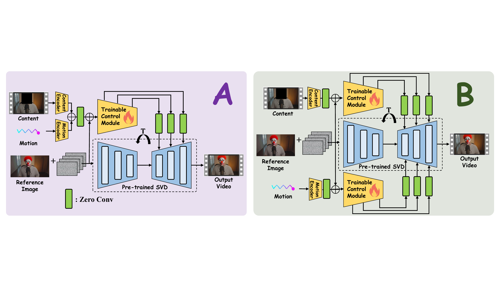
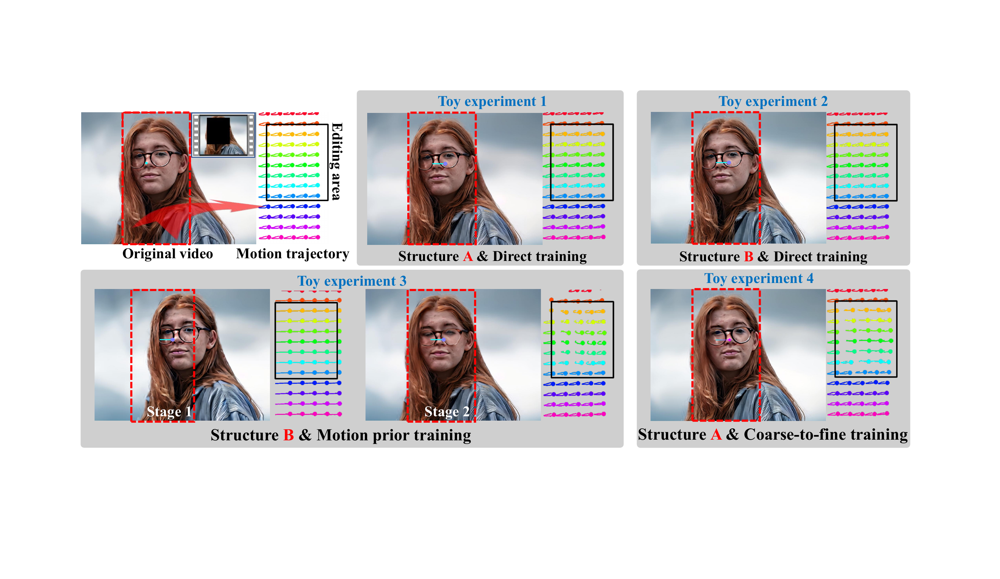
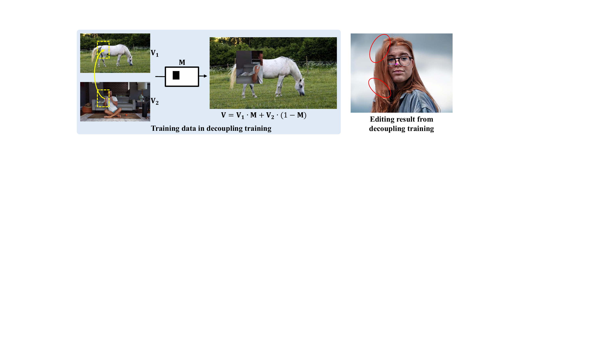
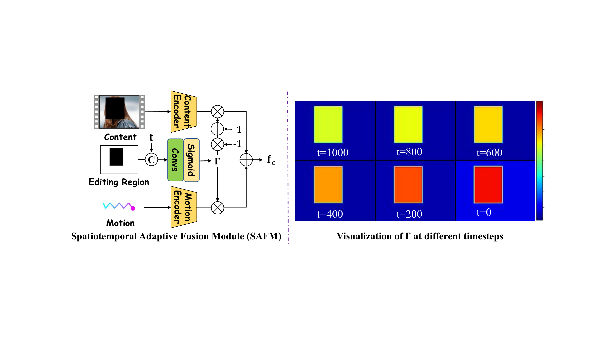
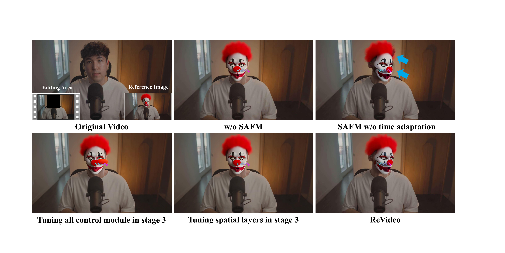
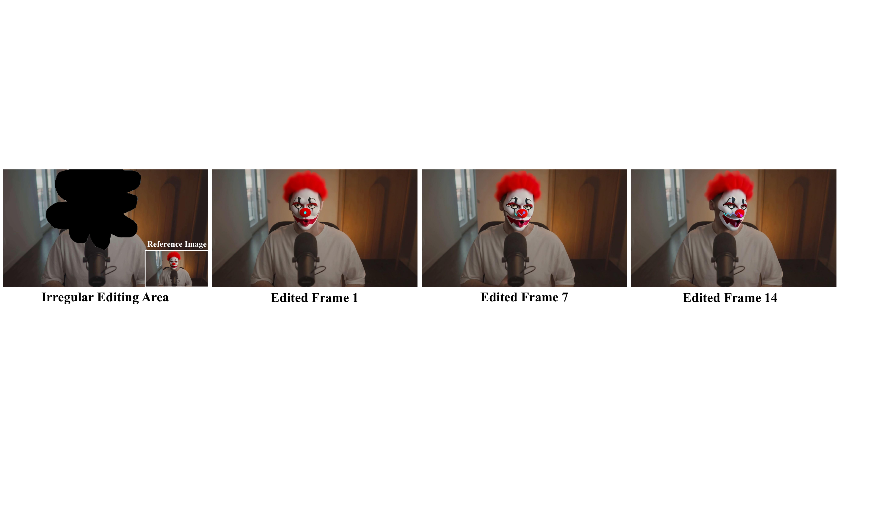
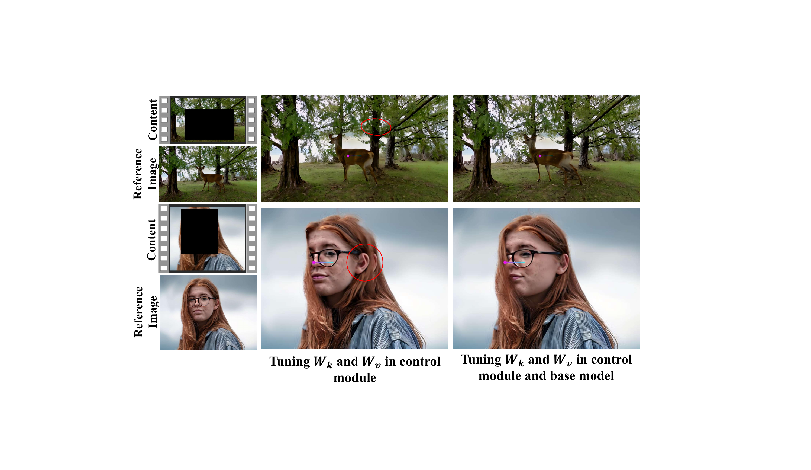
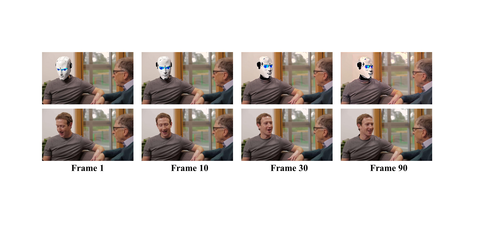

# ReVideo: <u>Re</u>make a <u>Video</u> with Motion and Content Control

## Abstract

Despite significant advancements in video generation and editing using diffusion models, achieving accurate and localized video editing remains a substantial challenge. Additionally, most existing video editing methods primarily focus on altering visual content, with limited research dedicated to motion editing. In this paper, we present a novel attempt to **Re**make a **Video** (**ReVideo**) which stands out from existing methods by allowing precise video editing in specific areas through the specification of both content and motion. Content editing is facilitated by modifying the first frame, while the trajectory-based motion control offers an intuitive user interaction experience. ReVideo addresses a new task involving the coupling and training imbalance between content and motion control. To tackle this, we develop a three-stage training strategy that progressively decouples these two aspects from coarse to fine. Furthermore, we propose a spatiotemporal adaptive fusion module to integrate content and motion control across various sampling steps and spatial locations. Extensive experiments demonstrate that our ReVideo has promising performance on several accurate video editing applications, *i.e.*, (1) locally changing video content while keeping the motion constant, (2) keeping content unchanged and customizing new motion trajectories, (3) modifying both content and motion trajectories. Our method can also seamlessly extend these applications to multi-area editing without specific training, demonstrating its flexibility and robustness.

# Introduction

Thanks to the large-scale training data and huge computing power, there have been significant advancements in diffusion-based `\cite{diff}`{=latex} image and video generation. For personalization purposes, many works add control signals to the generation process, such as text-guided image `\cite{ldm,imagen,dall-e2}`{=latex} and video `\cite{imagenv,animatediff,gen2}`{=latex} generation, as well as image-guided video generation `\cite{svd,dynamicrafter}`{=latex}. Based on these base models, extensive works explore how to transfer their generation capabilities to video editing. Early works based on text-to-image diffusion models implement video editing through zero-shot strategies (*e.g.*, Fate-Zero  `\cite{fatezero}`{=latex}, Flatten  `\cite{flatten}`{=latex}) or one-shot tuning (*e.g.*, Tune-A-Video  `\cite{tunevid}`{=latex}). However, these methods are limited by excessive manual design and a lack of video generation priors. Moreover, text prompt only provide coarse condition, limiting the editing accuracy. Compared to text, more recent methods adopt image conditions which can provide more accurate editing guidance. For instance, VideoComposer `\cite{videocomposer}`{=latex} generates style-transformed videos by providing spatial attributes (*e.g.*, edge, depth) of the target video and a style reference. DreamVideo `\cite{dreamvideo}`{=latex} and Make-a-protagonist `\cite{makeap}`{=latex} can modify a specific object in the video by providing a reference object. However, these methods still struggle with local editing and introducing new elements, such as adding new objects to a video. Recent work EVE `\cite{eve}`{=latex} proposes a diffusion distillation strategy to achieve video editing while keeping unedited content unchanged. Nevertheless, the editing region and target are controlled by text, which is challenging in complex scenarios. AnyV2V `\cite{anyv2v}`{=latex} edit a video by modifying the first frame, enabling accurate customization of local content. Pika `\cite{pika}`{=latex} can regenerate a specific area in the video by selecting an editing region. Although these methods improve the performance of local video editing, they only focus on visual content editing and cannot customize the motion of new content.

Motion is another crucial aspect of video, yet research on video motion editing remains limited. While some methods explore motion-guided video generation using trajectory-based motion guidance (*e.g.*, DragNUWA  `\cite{dragnuwa}`{=latex}, DragAnything  `\cite{draganything}`{=latex}, MotionCtrl  `\cite{motionctrl}`{=latex}) and box-based motion guidance (*e.g.*, Boximator  `\cite{boximator}`{=latex}, Peekaboo  `\cite{peekaboo}`{=latex}), they do not support motion editing. Additionally, other works  `\cite{motiontransfer, customizingmotion, motiondirector}`{=latex} can transfer motion from one video to another but cannot modify it as well.

In this paper, our goal is to accurately edit content and motion in specific areas of a video. We create an easy-to-interact pipeline by setting the content editing as modifying the first frame, with trajectory lines `\cite{dragnuwa}`{=latex} as the motion control signal. Other unedited content in all frames should be maintained in editing results and merged with the editing effect. However, we find that fusing unedited content with motion-customized new content is challenging, mainly for two reasons: **(1)** Training imbalance: Unedited content is dense and easier to learn, while motion trajectories are sparse and abstract, making them harder to learn. **(2)** Condition coupling: Unedited content provides both visual and inter-frame motion information, leading the model to rely on it for motion estimation, thereby ignoring the hard-to-learn trajectory lines.

To address these challenges, we design a three-stage training strategy to harmonize unedited content and motion-customized new content, enabling harmonious control of different conditions. Besides, we design a spatiotemporal adaptive fusion module to fuse these two conditions at different diffusion sampling steps and spatial locations. Furthermore, our method can compactly inject motion and content conditions into the diffusion video generation through a single control module. With these techniques, users can conveniently edit specific regions in the video by modifying the first frame and drawing trajectory lines. Notably, ReVideo is not limited to single-region editing and can customize multiple areas in parallel.

In summary, this work makes the following contributions:

- To the best of our knowledge, this is the first attempt to explore local editing of both content and motion in videos. Our method can also be easily extended to multi-area video editing.

- We propose a three-stage training strategy and a spatiotemporal adaptive fusion module to address the coupling of content and motion control in video editing, enabling compact control through a single module.

- Extensive experiments demonstrate that ReVideo performs well in several precise video editing applications, including changing content in a specific region while keeping motion constant, maintaining content while customizing new motion trajectories, and modifying both content and motion trajectories. Some examples are presented in Fig. <a href="#fig:teaser" data-reference-type="ref" data-reference="fig:teaser">[fig:teaser]</a>.

# Related Works

## Controllable Image and Video Generation

Recent advancements in diffusion models `\cite{diff,diff_beat}`{=latex} drive the rapid development of image and video generation. In the community of image generation, some notable works, such as Stable Diffusion `\cite{ldm}`{=latex}, Imagen `\cite{imagen}`{=latex}, and DALL-E2 `\cite{dall-e2}`{=latex}, utilize text as the generation condition. To achieve accurate generation control, some methods, *e.g.*, ControlNet `\cite{controlnet}`{=latex} and T2I-Adapter `\cite{t2iadapter}`{=latex}, propose adding control modules on pre-trained diffusion models. Similarly, initial efforts in controllable video generation concentrate on the text condition, such as Video LDM `\cite{vldm}`{=latex}, Imagen Video `\cite{imagenv}`{=latex}, VideoCrafter `\cite{videocrafter}`{=latex}, and AnimateDiff `\cite{animatediff}`{=latex}. Recognizing the limitations of text prompts in capturing complex scenarios, some recent works `\cite{svd,dynamicrafter,i2vgen,gen2}`{=latex} leverage image conditions for a more direct approach. External control modules on pre-trained foundation models are also popular in controllable video generation. Such as video ControlNet `\cite{controlavideo,controlvideo}`{=latex} extends the ControlNet `\cite{controlnet}`{=latex} in image generation to video generation conditioned on a sequence of control signals, like edge maps and depth maps. In addition to spatial structure control, precise temporal motion control is also important in controllable video generation. Several recent works study this topic, such as video generation with trajectory-based motion guidance (*e.g.*, DragNUWA `\cite{dragnuwa}`{=latex}, MotionCtrl `\cite{motionctrl}`{=latex}, Motion-I2V `\cite{motioni2v}`{=latex}, DragAnything `\cite{draganything}`{=latex}) and generation with box-based motion guidance (*e.g.*, TrailBlazer `\cite{trailblazer}`{=latex}, Boximator `\cite{boximator}`{=latex}, `\cite{peekaboo}`{=latex}). These methods perform the control by training extra motion controllers on pre-trained video diffusion models.

## Diffusion-based Video Editing

Due to the lack of training data, the common approach in video editing is via training-free strategies `\cite{pix2video,tokenflow,kara2023rave,text2videozero,vidzero,fatezero}`{=latex} or one-shot tuning `\cite{tunevid,text2live,kasten2021layered}`{=latex}. For instance, the prior work Tune-A-Video `\cite{tunevid}`{=latex} overfits some diffusion model parameters to a specific video. Then, it uses the overfitting parameters to produce the editing result conditioned on the target prompt. To enable a cohesive global appearance among edited frames, many methods extend the attention module of Stable Diffusion `\cite{ldm}`{=latex} to encompass multiple frames and conduct cross-frame attention. For instance, Pix2Video `\cite{pix2video}`{=latex} edits the first frame and performs cross-frame attention of each frame on the first frame to preserve appearance consistency. TokenFlow `\cite{tokenflow}`{=latex} and Fairy `\cite{fairy}`{=latex} jointly edit a few key frames at each denoising step and propagate them throughout the video based on the nearest-neighbor field extracted from the original video. Inspired by the initial zero-shot image editing method SDEdit `\cite{sdedit}`{=latex}, the recent video foundation model SORA `\cite{sora}`{=latex} achieves video editing by adding noise to the input video and then denoising it under the target description. Although these methods can preserve the general structure of original videos, the information loss and the lack of consistency constraints on the original video make them unfit for precise video editing but suitable for global editing like style transfer.

Another strategy is to train a control module to guide the generation with some characters that should persist in the editing result, such as depth `\cite{esser2023structure,liang2023flowvid,xing2024make}`{=latex}, sketch `\cite{videocomposer}`{=latex}, and optical flow `\cite{yan2023motion}`{=latex}. However, existing methods primarily focus on preserving spatial structure and are unsuitable for precise video editing. In the community of precise video editing, some works, such as InsV2V `\cite{insv2v}`{=latex} and the recent EVE `\cite{eve}`{=latex}, edit the video by providing editing instructions. However, the text-based editing instruction struggles to locate a target region in some complex scenarios. AnyV2V `\cite{anyv2v}`{=latex} can edit a video by editing the first frame. Pika `\cite{pika}`{=latex} is designed to regenerate a selected area in a video by text guidance. Unlike these works, we aim to achieve accurate customization in local areas of a video. The editing target includes locally modifying content and motion and keeping the unedited content unchanged.

# Method

## Preliminaries

**Stable Video Diffusion** (SVD) `\cite{svd}`{=latex} is a high-quality and commonly used image-to-video generation model. To utilize the priors of high-quality video generation, we employ SVD as the base model and add control modules to achieve our editing target. Given a reference image \\(\mathbf{c}_I\\), SVD will generate a video frame sequence \\(\mathbf{x}=\{\mathbf{x}^0, \mathbf{x}^1,...,\mathbf{x}^{N-1}\}\\) of length \\(N\\), starting with \\(\mathbf{c}_I\\). The sampling of SVD is conducted on a latent denoising diffusion process `\cite{ldm}`{=latex}. At each denoising step, a conditional 3D UNet \\(\Phi_{\theta}\\) is used to iteratively denoise this sequence: \\[\hat{\mathbf{z}}_{0}=\Phi_{\theta}(\mathbf{z}_t, t, \mathbf{c}_I),\\] where \\(\mathbf{z}_t\\) is the latent representation of \\(\mathbf{x}_t\\). \\(\hat{\mathbf{z}}_{0}\\) is the predication of \\(\mathbf{z}_{0}\\). There are two conditional injection paths for the reference image \\(\mathbf{c}_I\\): (1) It is embedded into tokens by the CLIP `\cite{clip}`{=latex} image encoder and injected into the diffusion model through a cross-attention `\cite{ldm}`{=latex} mechanism; (2) It is encoded into a latent representation by the VAE encoder of the latent diffusion model, and concatenated with the latent of each frame in channel dimension. SVD follows the EDM-preconditioning framework `\cite{ema}`{=latex}, which parameterizes the learnable denoiser \\(\Phi_{\theta}\\) as: \\[\Phi_{\theta}(\mathbf{z}_t, t, \mathbf{c}_I; \sigma)=c_{skip}(\sigma)\mathbf{z}_t+c_{out}(\sigma)F_{\theta}(c_{in}(\sigma)\mathbf{z}_t,t,\mathbf{c}_{I};c_{noise}(\sigma)),\\] where \\(\sigma\\) is the noise level, and \\(F_{\theta}\\) is the network to be trained. \\(c_{skip}\\), \\(c_{out}\\), \\(c_{in}\\), and \\(c_{noise}\\) are preconditioning hyper-parameters. \\(\Phi_{\theta}\\) is trained via denoising score matching (DSM): \\[\label{loss}
    \mathbb{E}_{\mathbf{z}_{0},t, \mathbf{n} \sim \mathcal{N}(0,\sigma^2)}\left[ \lambda_{\sigma}||\Phi_{\theta}(\mathbf{z}_0+\mathbf{n}, t, \mathbf{c}_{I})-\mathbf{z}_0||_2^2\right].\\]

<figure id="toy">

<figcaption> Two potential structures to inject motion and content control. </figcaption>
</figure>

## Task Formulation and Some Insights

**Task formulation**. The purpose of this paper is to locally edit a video, including visual information and motion information. In addition, the unedited content in the video should remain unchanged. Therefore, our conditional video generation involves three control signals: (1) the edited content, (2) the content of the unedited area, and (3) the motion condition in the edited area. We implement content editing by modifying the first frame of the video and then broadcasting it to subsequent video frames. Here, we denote the edited first frame as \\(\mathbf{c}_{ref}\in \mathbb{R}^{3\times W\times H}\\). For the motion condition, we use interaction-friendly trajectory lines `\cite{dragnuwa,draganything}`{=latex} as the control signal. Specifically, the motion condition also contains N maps for a N-frame video. Each map consists of 2 channels, indicating the movement of the tracked points in the horizontal and vertical directions relative to the previous frame. The motion condition in this paper is represented as \\(\mathbf{c}_{mot}\in \mathbb{R}^{N\times 2\times W\times H}\\). The unedited content \\(\mathbf{c}_{con}\\) can be conveniently provided by the masked video, *i.e.*, \\(\mathbf{c}_{con}=\mathbf{V}\cdot \mathbf{M}\\), where \\(\mathbf{V}\in \mathbb{R}^{N\times 3\times W\times H}\\) and \\(\mathbf{M}\in \mathbb{R}^{1\times 1\times W\times H}\\) refer to the original video and the editing region mask, respectively.

Since we adopt SVD as the pre-trained base model, its image-to-video capability can naturally serve as the import port for the edited first frame. For unedited content and customized motion trajectories, we train additional control modules to import them into the generation process.

<figure id="cmp_toy">

<figcaption> The motion control capability of two structures in Fig. <a href="#toy" data-reference-type="ref" data-reference="toy">1</a> with different training strategies. We visualize trajectory lines in a specific area (red box) and label the editing area with a black box. Toy experiments present the coupling issue of customized motion and unedited content. </figcaption>
</figure>

**Trajectory sampling**. During training, it is essential to extract trajectories from videos to provide motion condition \\(\mathbf{c}_{mot}\\). At the beginning of trajectory sampling, we use a grid `\cite{dragnuwa}`{=latex} to sparsify dense sampling points, obtaining \\(N_{init}\\) initial points. Among these points, those with larger motions are beneficial to train trajectory control. To filter out these points, we first apply motion tracking on each point to obtain their path lengths, *i.e.*, \\(\{ l_0, l_1, ..., l_{N_{init}-1} \}\\). We use the mean of these lengths as the threshold \\(l_{Th}\\) to extract points whose motion length is greater than \\(l_{Th}\\). Then, we use the normalized lengths of these points as sampling probabilities to sample \\(N\\) points randomly. Because the high sparsity is not conducive for the model to learn from these trajectories, we apply a Gaussian filter `\cite{dragnuwa}`{=latex} to obtain the smooth trajectory map \\(\mathbf{c}_{mot}\\). More details are presented in **Appendix**.

**Insights**. A naive implementation of our editing target is directly training an extra control module, like ControlNet `\cite{controlnet}`{=latex}, to inject motion and content conditions into the diffusion generation process. We present this design in structure **A** of Fig. <a href="#toy" data-reference-type="ref" data-reference="toy">1</a>. Specifically, at the input, a content encoder \\(E_c\\) and a motion encoder \\(E_m\\) embed the content condition \\(\mathbf{c}_{con}\\) of the unedited area and motion condition \\(\mathbf{c}_{mot}\\) of the editing area. These two embeddings are merged by direct summing to obtain the fused condition feature \\(\mathbf{f}_c\\). Then, a copy of the UNet encoder extracts multiscale intermediate features from \\(\mathbf{f}_c\\), which are added to the corresponding layers in the diffusion model. This process is formulated as: \\[\mathbf{y}_c = \mathcal{F}(\mathbf{z}_t,t,\mathbf{c}_{ref};\Theta)+\mathcal{Z}(\mathcal{F}(\mathbf{z}_t+\mathcal{Z}(\mathbf{f}_c),t,\mathbf{c}_{ref};\Theta_c)),\\] where \\(\mathbf{y}_c\\) is the new diffusion features. \\(\mathcal{Z}\\) is the function of zero-conv `\cite{controlnet}`{=latex}. \\(\Theta\\) and \\(\Theta_c\\) are the parameters of the SVD model and extra control module. We conduct several toy experiments based on this idea, as illustrated in Fig.<a href="#cmp_toy" data-reference-type="ref" data-reference="cmp_toy">2</a>. The input video contains a woman initially moving to the left, followed by a shift to the right. The editing target is to alter the facial motion towards the right while keeping the other content unchanged. In the toy experiment 1, we fix SVD and train the control module with Eq. <a href="#loss" data-reference-type="ref" data-reference="loss">[loss]</a>. The result shows that the content condition precisely controls the unedited area of the generated video. But the motion condition has no control effect, and the trajectory lines in the editing area (labeled with a black box) are consistent with the unedited area. A possible reason is that a single control branch has difficulty handling two control conditions simultaneously. To verify this hypothesis, we train structure B in Fig. <a href="#toy" data-reference-type="ref" data-reference="toy">1</a> to handle these two conditions separately. The toy experiment 2 in Fig. <a href="#cmp_toy" data-reference-type="ref" data-reference="cmp_toy">2</a> shows that the motion control is still ineffective, suggesting that the problem is more attributed to the control training rather than the network structure. To enhance the motion control training, we split the training of structure B into two stages. In the first stage, we only train the motion control module to endow it with motion control prior. In the second stage, we train the motion control and content control together. The result in toy experiment 3 shows that although the motion prior training produces good motion control capability, the control accuracy is weakened and affected by the unedited content after introducing the content control. After these toy experiments, we have the following insights:

\\(\diamond\\) The condition of unedited content not only contains visual information but also has rich inter-frame motion information. As a more easily learned condition, the diffusion model tends to predict the motion of the editing area through unedited content, ignoring the sparse motion trajectory control.

\\(\diamond\\) The coupling between motion-customized new content and unedited content is strong, making it difficult to overcome even using the motion prior and separate control branches.

\\(\diamond\\) Motion prior training is helpful in decoupling motion-customized content and unedited content.

## Coarse-to-fine Training Strategy

To rectify the ignoring of the motion control, we design a coarse-to-fine training strategy. In addition, structure B in Fig. <a href="#toy" data-reference-type="ref" data-reference="toy">1</a> has a high computational cost, and we hope to joint control the unedited content and motion-customized new content on the concise structure A.

**Motion prior training**. As discussed above, motion trajectory is a sparse and difficult-to-learn control signal. Toy experiment 3 in Fig. <a href="#cmp_toy" data-reference-type="ref" data-reference="cmp_toy">2</a> shows that the motion prior training can alleviate the coupling between motion-customized content and unedited content. Hence, in the first stage, we only train the motion trajectory control, allowing the control module to have good motion control prior.

**Decoupling training**. Based on the control module from the first stage, the training in the second stage aims to add content control of unedited areas. Toy experiment 3 in Fig. <a href="#cmp_toy" data-reference-type="ref" data-reference="cmp_toy">2</a> shows that even with good motion control priors, the precision of motion control still degrades after introducing unedited content condition. Therefore, we design a training strategy to decouple motion and content control in this stage. Specifically, we set the editing part and the unedited part in a training sample \\(\mathbf{V}\\) to be two different videos, *i.e.*, \\(\mathbf{V}_1\\) and \\(\mathbf{V}_2\\). As shown in Fig. <a href="#decouple" data-reference-type="ref" data-reference="decouple">3</a>, \\(\mathbf{V}_1\\) and \\(\mathbf{V}_2\\) are combined through the editing mask \\(\mathbf{M}\\), *i.e.*, \\(\mathbf{V}=\mathbf{V}_1 \cdot \mathbf{M}+\mathbf{V}_2\cdot (1-\mathbf{M})\\). Since the editing region and the unedited region come from two different videos, the motion information of the editing region cannot be predicted through the unedited content. Therefore, it can decouple content control and motion control during training.

<figure id="decouple">

<figcaption> The data construction strategy for decoupling training and editing results from this stage. </figcaption>
</figure>

**Deblocking training**. As shown in the right part of Fig. <a href="#decouple" data-reference-type="ref" data-reference="decouple">3</a>, although the decoupling training achieves joint control of customized motion and unedited content with high accuracy, it breaks the consistency between the edited and unedited regions, producing block artifacts in the boundary. To rectify this issue, we design the third training stage to remove block artifacts. The training in this stage is initialized with the model from the second stage and trained on normal video data. To preserve the decoupled motion and content control prior from the second stage, we only fine-tune the key embedding \\(\mathbf{W}_k\\) and value embedding \\(\mathbf{W}_v\\) in temporal self-attention layers of the control module and SVD model. The toy experiment 4 in Fig. <a href="#cmp_toy" data-reference-type="ref" data-reference="cmp_toy">2</a> shows that after the training of this stage, the model removes the block artifacts and retains joint control of unedited content and motion customization.

<figure id="safm">

<figcaption> The architecture of our proposed spatiotemporal adaptive fusion module (left), and the visualization of fusion weight <strong>Γ</strong> at different timesteps (right). </figcaption>
</figure>

## Spatiotemporal Adaptive Fusion Module

Although the coarse-to-fine training strategy achieves decoupling of content control and motion control, we observe considerable failure cases in some complex motion trajectories. To further distinguish the control roles of unedited content and motion trajectories in the generation, we design a spatiotemporal adaptive fusion module (SAFM) as shown in Fig. <a href="#safm" data-reference-type="ref" data-reference="safm">4</a>. Specifically, SAFM predict a weight map \\(\mathbf{\Gamma}\\) through the editing mask \\(\mathbf{M}\\) to fuse motion and content control instead of direct summing. Moreover, because diffusion generation is a multi-step iterative process, the fusion of control conditions between time steps should have adaptive adjustment. Therefore, we concatenate timestep \\(t\\) and \\(\mathbf{M}\\) in the channel dimension to form a spatiotemporal condition to guide the \\(\mathbf{\Gamma}\\) prediction. Mathematically, the fusion of motion and content conditions is formulated as follows: \\[\label{fuse}
    \mathbf{f}_c=E_c(\mathbf{c}_{con})\cdot \mathbf{\Gamma}+E_m(\mathbf{c}_{mot})\cdot (1-\mathbf{\Gamma}),\ \mathbf{\Gamma}=\mathcal{H}(\mathbf{M}, t),\\] where \\(\mathcal{H}\\) is the function of spatiotemporal embedding. \\(\mathcal{H}\\) needs to be jointly trained with \\(\mathbf{W}_k\\) and \\(\mathbf{W}_v\\) in the deblocking training stage. We visualize \\(\mathbf{\Gamma}\\) at different time steps in the right part of Fig. <a href="#safm" data-reference-type="ref" data-reference="safm">4</a>. It can be seen that \\(\mathbf{\Gamma}\\) learns the spatial characteristics of the editing area. It assigns a higher weight to the motion condition in the editing area and a higher weight to the content condition in the unedited area. In addition, \\(\mathbf{\Gamma}\\) learns to distinguish different sampling steps \\(t\\) and linearly adjusts with \\(t\\).

# Experiments

## Implementation Details

In this work, we choose Stable Video Diffusion (SVD) as the base model. Our three training stages are completed on the WebVid `\cite{webvid}`{=latex} dataset, which contains 10 million text-video pairs. These three stages are optimized for \\(40K\\), \\(30K\\), and \\(20K\\) iterations, respectively, with Adam `\cite{adam}`{=latex} optimizer on 4 NVIDIA A100 GPUs. The batch size for each GPU is set as 4, with the resolution being \\(512\times 320\\). It takes about 6 days to complete all training stages. During the training process, we use CoTracker `\cite{cotracker}`{=latex} to extract motion trajectories. In the first training stage, trajectory sampling is performed throughout the video. In the second and third training stages, a rectangular editing area is randomly selected in the video with the minimum size being \\(64\times 64\\), and trajectory sampling is performed within it. The number of trajectory lines for each training sample is randomly selected between 1 and 10.

<figure id="cmp_vis">

<figcaption> The visual comparison between InsV2V , AnyV2V , Pika , and our ReVideo. </figcaption>
</figure>

<table>
<caption>Quantitative comparison between our ReVideo and other related works. We employ automatic metrics (<em>i.e.</em>, CLIP  score, PSNR) and human evaluation to evaluate the performance.</caption>
<tbody>
<tr>
<td rowspan="2" style="text-align: center;">Method</td>
<td colspan="3" style="text-align: center;">Automatic Metrics</td>
<td colspan="2" style="text-align: center;">Human Evaluation</td>
</tr>
<tr>
<td style="text-align: center;">PSNR ↑</td>
<td style="text-align: center;">Text Alignment ↑</td>
<td style="text-align: center;">Consistency ↑</td>
<td style="text-align: center;">Overall ↑</td>
<td style="text-align: center;">Editing Target ↑</td>
</tr>
<tr>
<td style="text-align: center;">InsV2V </td>
<td style="text-align: center;">29.77</td>
<td style="text-align: center;">0.2022</td>
<td style="text-align: center;">0.9808</td>
<td style="text-align: center;">10.2%</td>
<td style="text-align: center;">5.1%</td>
</tr>
<tr>
<td style="text-align: center;">AnyV2V </td>
<td style="text-align: center;">29.80</td>
<td style="text-align: center;">0.2143</td>
<td style="text-align: center;">0.9836</td>
<td style="text-align: center;">2.8%</td>
<td style="text-align: center;">4.0%</td>
</tr>
<tr>
<td style="text-align: center;">Pika </td>
<td style="text-align: center;"><strong>33.07</strong></td>
<td style="text-align: center;">0.2184</td>
<td style="text-align: center;"><strong>0.9956</strong></td>
<td style="text-align: center;">27.9%</td>
<td style="text-align: center;">23.9%</td>
</tr>
<tr>
<td style="text-align: center;">ReVideo</td>
<td style="text-align: center;">32.85</td>
<td style="text-align: center;"><strong>0.2304</strong></td>
<td style="text-align: center;">0.9864</td>
<td style="text-align: center;"><strong>59.1</strong><strong>%</strong></td>
<td style="text-align: center;"><strong>67.0</strong><strong>%</strong></td>
</tr>
</tbody>
</table>

## Comparison

Among existing methods, Pika `\cite{pika}`{=latex} is the most similar to ours. Pika can perform local video editing by defining an editing area. The difference is that Pika controls the new content in the editing area by text and has no motion control. In addition, the recent work AnyV2V `\cite{anyv2v}`{=latex} proposes editing the first frame of the video to achieve entire video editing, which has similarities with our ReVideo. InsV2V `\cite{insv2v}`{=latex}, using editing instructions to edit the video, can also maintain unedited content. Therefore, in this paper, we compare our ReVideo with these three methods. The visual comparison in Fig. <a href="#cmp_vis" data-reference-type="ref" data-reference="cmp_vis">5</a> shows that in some fine-grained editing scenarios, such as putting sunglasses on a man, AnyV2V has a loss of edited content. In addition, the unedited area of InsV2V and AnyV2V suffers from content distortion. Although Pika can generate smooth and high-fidelity results, it is difficult to accurately customize new content by text, especially in adding new objects, *e.g.*, adding a dog on the soccer field. Adding new objects to the scene is also challenging for InsV2V. Due to the lack of motion control, AnyV2V and Pika usually produce static motion of the edited content, such as a car driving on the road. In comparison, our ReVideo can effectively broadcast the edited content throughout the entire video while allowing users to customize the motion in editing areas.

In addition to visual comparison, we employ automatic metrics and human evaluation to measure the performance of different methods. For this task, we build a test set containing 16 videos, with the resolution being \\(720\times 1280\\). Following previous works `\cite{pix2video, anyv2v}`{=latex}, automatic metrics employ CLIP score `\cite{clip}`{=latex} to measure text alignment and temporal consistency. The text alignment is obtained by calculating the average CLIP cosine similarity between each frame and editing description. Temporal consistency is computed by average CLIP cosine similarity between every pair of consecutive frames. We employ PSNR `\cite{WS_PSNR_Sun_Lu_Yu_2017}`{=latex} to measure the reconstruction quality of unedited content. The human evaluation considers two aspects, *i.e.*, overall video quality, and whether the editing target is achieved. We allow 20 volunteers to choose the best method for each test sample on each aspect. The results in Tab. <a href="#tb_cp" data-reference-type="ref" data-reference="tb_cp">1</a> show that our ReVideo performs better than InsV2V and AnyV2V in all evaluation terms. Compared with Pika, our performance is slightly lower in the evaluation of temporal consistency and the quality of unedited content. Notably, AnyV2V and Pika usually generate static motion of new content due to the lack of motion control. Static motion tends to score higher in consistency evaluation, measured by CLIP similarity of adjacent video frames. Our method has obvious advantages over Pika in text alignment and human evaluation, reflecting the significant gap between text-guided local editing and user-specified local editing. Our ReVideo can precisely specify the appearance and motion of the editing area, better meeting requirements for accurate customization.

<figure id="abs">

<figcaption> Ablation study of our ReVideo. </figcaption>
</figure>

## Ablation Study

In our ReVideo, we design the spatiotemporal adaptive fusion module (SAFM) to help decouple the control of unedited content and motion customization in diffusion generation. It predicts a fusion weight \\(\mathbf{\Gamma}\\) conditioned on the editing area \\(\mathbf{M}\\) and time step t. Then, the fusion of content and motion control is achieved through Eq. <a href="#fuse" data-reference-type="ref" data-reference="fuse">[fuse]</a>. In this part, we conduct an ablation study on this fusion mechanism. In addition, we only fine-tune the key embedding and value embedding of the temporal self-attention layers in the SVD model and control module in the stage of deblocking training. In the ablation study, we discuss the impact of tuning parameters in deblocking training.

**The effectiveness of SAFM**. To demonstrate the effectiveness of SAFM, we replace SAFM with direct summing of motion and content control. The results in Fig. <a href="#abs" data-reference-type="ref" data-reference="abs">6</a> show that the direct summing fusion cannot accurately control the motion in some complex motion trajectories, *e.g.*, wavy lines. In comparison, using SAFM can help decouple content and motion control in the editing area, achieving more accurate trajectory guidance.

**The effectiveness of time adaptation in SAFM**. We remove the time condition in the SAFM module, *i.e.*, using the same weight map \\(\mathbf{\Gamma}\\) to fuse content and motion control in each diffusion sampling step. The results in Fig. <a href="#abs" data-reference-type="ref" data-reference="abs">6</a> show that not distinguishing \\(\mathbf{\Gamma}\\) in different sampling steps leads to unsatisfactory artifacts at the boundary of the editing area.

**Tuning parameters in deblocking training**. Although the training in stages 1 and 2 enables the control module to have good local motion control capabilities, we find that there is still an ignoring of motion control in the training of stage 3, *i.e.*, deblocking training. As shown in Fig. <a href="#abs" data-reference-type="ref" data-reference="abs">6</a>, the local motion control capability is degraded after we tune the entire control module in stage 3. Therefore, we optimize a part of the parameters to maintain the prior of local motion control. Experiments show that fine-tuning spatial layers still triggers the ignoring of motion control. In comparison, fine-tuning key embedding and value embedding of the temporal layer in the control module and the base model has minimal impact on local motion control capability. The edited and unedited areas are also harmoniously fused. More ablations of tuning parameters are presented in **Appendix**.

# Conclusion

In this paper, we aim to solve the problem of local video editing. The editing target includes visual content and motion trajectory modifications. To the best of our knowledge, this is the first attempt at this task. In this new task, We find a coupling problem between unedited content and motion customization. Directly training these two control conditions on the video generation model will cause the ignoring of motion control. To address this issue, we develop a three-stage training strategy to combine these two conditions coarse to fine. In addition, we design a spatiotemporal adaptive fusion module to further decouple unedited content and motion-customized content in different diffusion sampling steps and spatial locations. Extensive experiments demonstrate that our ReVideo has promising performance on several accurate video editing applications, *i.e.*, (1) locally changing video content while keeping the motion constant, (2) keeping content unchanged and customizing new motion trajectories, (3) modifying both content and motion trajectories. Our method can also easily extend these applications to multi-area editing without specific training.

**Limitations**. Although our method can regenerate local areas of the video, the regeneration quality is limited by the base model. In some scenarios where the generation prior of SVD is not ideal, some unexpected artifacts may occur in the editing results.

# References [references]

https://www.pika.art/ (@pika)

Max Bain, Arsha Nagrani, Gül Varol, and Andrew Zisserman Frozen in time: A joint video and image encoder for end-to-end retrieval In *Proceedings of the IEEE/CVF International Conference on Computer Vision*, pages 1728–1738, 2021. **Abstract:** Our objective in this work is video-text retrieval – in particular a joint embedding that enables efficient text-to-video retrieval. The challenges in this area include the design of the visual architecture and the nature of the training data, in that the available large scale video-text training datasets, such as HowTo100M, are noisy and hence competitive performance is achieved only at scale through large amounts of compute.We address both these challenges in this paper. We propose an end-to-end trainable model that is designed to take advantage of both large-scale image and video captioning datasets. Our model is an adaptation and extension of the recent ViT and Timesformer architectures, and consists of attention in both space and time. The model is flexible and can be trained on both image and video text datasets, either independently or in conjunction. It is trained with a curriculum learning schedule that begins by treating images as ‘frozen’ snapshots of video, and then gradually learns to attend to increasing temporal context when trained on video datasets. We also provide a new video-text pretraining dataset WebVid-2M, comprised of over two million videos with weak captions scraped from the internet. Despite training on datasets that are an order of magnitude smaller, we show that this approach yields state-of-the-art results on standard downstream video-retrieval benchmarks including MSR-VTT, MSVD, DiDeMo and LSMDC. (@webvid)

Omer Bar-Tal, Dolev Ofri-Amar, Rafail Fridman, Yoni Kasten, and Tali Dekel Text2live: Text-driven layered image and video editing In *European conference on computer vision*, pages 707–723. Springer, 2022. **Abstract:** We present a method for zero-shot, text-driven appearance manipulation in natural images and videos. Given an input image or video and a target text prompt, our goal is to edit the appearance of existing objects (e.g., object’s texture) or augment the scene with visual effects (e.g., smoke, fire) in a semantically meaningful manner. We train a generator using an internal dataset of training examples, extracted from a single input (image or video and target text prompt), while leveraging anexternal pre-trained CLIP model to establish our losses. Rather than directly generating the edited output, our key idea is to generate an edit layer (color+opacity) that is composited over the original input. This allows us to constrain the generation process and maintain high fidelity to the original input via novel text-driven losses that are applied directly to the edit layer. Our method neither relies on a pre-trained generator nor requires user-provided edit masks. We demonstrate localized, semantic edits on high-resolution natural images and videos across a variety of objects and scenes. Project page: https://text2live.github.io/ (@text2live)

Andreas Blattmann, Tim Dockhorn, Sumith Kulal, Daniel Mendelevitch, Maciej Kilian, Dominik Lorenz, Yam Levi, Zion English, Vikram Voleti, Adam Letts, et al Stable video diffusion: Scaling latent video diffusion models to large datasets , 2023. **Abstract:** We present Stable Video Diffusion - a latent video diffusion model for high-resolution, state-of-the-art text-to-video and image-to-video generation. Recently, latent diffusion models trained for 2D image synthesis have been turned into generative video models by inserting temporal layers and finetuning them on small, high-quality video datasets. However, training methods in the literature vary widely, and the field has yet to agree on a unified strategy for curating video data. In this paper, we identify and evaluate three different stages for successful training of video LDMs: text-to-image pretraining, video pretraining, and high-quality video finetuning. Furthermore, we demonstrate the necessity of a well-curated pretraining dataset for generating high-quality videos and present a systematic curation process to train a strong base model, including captioning and filtering strategies. We then explore the impact of finetuning our base model on high-quality data and train a text-to-video model that is competitive with closed-source video generation. We also show that our base model provides a powerful motion representation for downstream tasks such as image-to-video generation and adaptability to camera motion-specific LoRA modules. Finally, we demonstrate that our model provides a strong multi-view 3D-prior and can serve as a base to finetune a multi-view diffusion model that jointly generates multiple views of objects in a feedforward fashion, outperforming image-based methods at a fraction of their compute budget. We release code and model weights at https://github.com/Stability-AI/generative-models . (@svd)

Andreas Blattmann, Robin Rombach, Huan Ling, Tim Dockhorn, Seung Wook Kim, Sanja Fidler, and Karsten Kreis Align your latents: High-resolution video synthesis with latent diffusion models In *Proceedings of the IEEE/CVF Conference on Computer Vision and Pattern Recognition*, pages 22563–22575, 2023. **Abstract:** Latent Diffusion Models (LDMs) enable high-quality image synthesis while avoiding excessive compute demands by training a diffusion model in a compressed lower-dimensional latent space. Here, we apply the LDM paradigm to high-resolution video generation, a particularly resource-intensive task. We first pre-train an LDM on images only; then, we turn the image generator into a video generator by introducing a temporal dimension to the latent space diffusion model and finetuning on encoded image sequences, i.e., videos. Similarly, we temporally align diffusion model upsamplers, turning them into temporally consistent video super resolution models. We focus on two relevant real-world applications: Simulation of in-the-wild driving data and creative content creation with text-to-video modeling. In particular, we validate our Video LDM on real driving videos of resolution \<tex xmlns:mml="http://www.w3.org/1998/Math/MathML" xmlns:xlink="http://www.w3.org/1999/xlink"\>$512 \\}times 1024$\</tex\> , achieving state-of-the-art performance. Furthermore, our approach can easily leverage off-the-shelf pretrained image LDMs, as we only need to train a temporal alignment model in that case. Doing so, we turn the publicly available, state-of-the-art text-to-image LDM Stable Diffusion into an efficient and expressive text-to-video model with resolution up to \<tex xmlns:mml="http://www.w3.org/1998/Math/MathML" xmlns:xlink="http://www.w3.org/1999/xlink"\>$1280 \\}times 2048$\</tex\> . We show that the temporal layers trained in this way generalize to different finetuned text-to-image LDMs. Utilizing this property, we show the first results for personalized text-to-video generation, opening exciting directions for future content creation. Project page: https://nv-tlabs.github.io/VideoLDM/ (@vldm)

Tim Brooks, Bill Peebles, Connor Holmes, Will DePue, Yufei Guo, Li Jing, David Schnurr, Joe Taylor, Troy Luhman, Eric Luhman, Clarence Ng, Ricky Wang, and Aditya Ramesh Video generation models as world simulators . **Abstract:** Recent advancements in predictive models have demonstrated exceptional capabilities in predicting the future state of objects and scenes. However, the lack of categorization based on inherent characteristics continues to hinder the progress of predictive model development. Additionally, existing benchmarks are unable to effectively evaluate higher-capability, highly embodied predictive models from an embodied perspective. In this work, we classify the functionalities of predictive models into a hierarchy and take the first step in evaluating World Simulators by proposing a dual evaluation framework called WorldSimBench. WorldSimBench includes Explicit Perceptual Evaluation and Implicit Manipulative Evaluation, encompassing human preference assessments from the visual perspective and action-level evaluations in embodied tasks, covering three representative embodied scenarios: Open-Ended Embodied Environment, Autonomous, Driving, and Robot Manipulation. In the Explicit Perceptual Evaluation, we introduce the HF-Embodied Dataset, a video assessment dataset based on fine-grained human feedback, which we use to train a Human Preference Evaluator that aligns with human perception and explicitly assesses the visual fidelity of World Simulators. In the Implicit Manipulative Evaluation, we assess the video-action consistency of World Simulators by evaluating whether the generated situation-aware video can be accurately translated into the correct control signals in dynamic environments. Our comprehensive evaluation offers key insights that can drive further innovation in video generation models, positioning World Simulators as a pivotal advancement toward embodied artificial intelligence. (@sora)

Duygu Ceylan, Chun-Hao P Huang, and Niloy J Mitra Pix2video: Video editing using image diffusion In *Proceedings of the IEEE/CVF International Conference on Computer Vision*, pages 23206–23217, 2023. **Abstract:** Image diffusion models, trained on massive image collections, have emerged as the most versatile image generator model in terms of quality and diversity. They support inverting real images and conditional (e.g., text) generation, making them attractive for high-quality image editing applications. We investigate how to use such pre-trained image models for text-guided video editing. The critical challenge is to achieve the target edits while still preserving the content of the source video. Our method works in two simple steps: first, we use a pre-trained structure-guided (e.g., depth) image diffusion model to perform text-guided edits on an anchor frame; then, in the key step, we progressively propagate the changes to the future frames via self-attention feature injection to adapt the core denoising step of the diffusion model. We then consolidate the changes by adjusting the latent code for the frame before continuing the process. Our approach is training-free and generalizes to a wide range of edits. We demonstrate the effectiveness of the approach by extensive experimentation and compare it against four different prior and parallel efforts (on ArXiv). We demonstrate that realistic text-guided video edits are possible, without any compute-intensive preprocessing or video-specific finetuning. https://duyguceylan.github.io/pix2video.github.io/. (@pix2video)

Haoxin Chen, Menghan Xia, Yingqing He, Yong Zhang, Xiaodong Cun, Shaoshu Yang, Jinbo Xing, Yaofang Liu, Qifeng Chen, Xintao Wang, et al Videocrafter1: Open diffusion models for high-quality video generation , 2023. **Abstract:** Video generation has increasingly gained interest in both academia and industry. Although commercial tools can generate plausible videos, there is a limited number of open-source models available for researchers and engineers. In this work, we introduce two diffusion models for high-quality video generation, namely text-to-video (T2V) and image-to-video (I2V) models. T2V models synthesize a video based on a given text input, while I2V models incorporate an additional image input. Our proposed T2V model can generate realistic and cinematic-quality videos with a resolution of $1024 \\}times 576$, outperforming other open-source T2V models in terms of quality. The I2V model is designed to produce videos that strictly adhere to the content of the provided reference image, preserving its content, structure, and style. This model is the first open-source I2V foundation model capable of transforming a given image into a video clip while maintaining content preservation constraints. We believe that these open-source video generation models will contribute significantly to the technological advancements within the community. (@videocrafter)

Weifeng Chen, Jie Wu, Pan Xie, Hefeng Wu, Jiashi Li, Xin Xia, Xuefeng Xiao, and Liang Lin Control-a-video: Controllable text-to-video generation with diffusion models , 2023. **Abstract:** Recent advances in text-to-image (T2I) diffusion models have enabled impressive image generation capabilities guided by text prompts. However, extending these techniques to video generation remains challenging, with existing text-to-video (T2V) methods often struggling to produce high-quality and motion-consistent videos. In this work, we introduce Control-A-Video, a controllable T2V diffusion model that can generate videos conditioned on text prompts and reference control maps like edge and depth maps. To tackle video quality and motion consistency issues, we propose novel strategies to incorporate content prior and motion prior into the diffusion-based generation process. Specifically, we employ a first-frame condition scheme to transfer video generation from the image domain. Additionally, we introduce residual-based and optical flow-based noise initialization to infuse motion priors from reference videos, promoting relevance among frame latents for reduced flickering. Furthermore, we present a Spatio-Temporal Reward Feedback Learning (ST-ReFL) algorithm that optimizes the video diffusion model using multiple reward models for video quality and motion consistency, leading to superior outputs. Comprehensive experiments demonstrate that our framework generates higher-quality, more consistent videos compared to existing state-of-the-art methods in controllable text-to-video generation (@controlavideo)

Jiaxin Cheng, Tianjun Xiao, and Tong He Consistent video-to-video transfer using synthetic dataset In *The Twelfth International Conference on Learning Representations*, 2023. **Abstract:** We introduce a novel and efficient approach for text-based video-to-video editing that eliminates the need for resource-intensive per-video-per-model finetuning. At the core of our approach is a synthetic paired video dataset tailored for video-to-video transfer tasks. Inspired by Instruct Pix2Pix’s image transfer via editing instruction, we adapt this paradigm to the video domain. Extending the Prompt-to-Prompt to videos, we efficiently generate paired samples, each with an input video and its edited counterpart. Alongside this, we introduce the Long Video Sampling Correction during sampling, ensuring consistent long videos across batches. Our method surpasses current methods like Tune-A-Video, heralding substantial progress in text-based video-to-video editing and suggesting exciting avenues for further exploration and deployment. (@insv2v)

Yuren Cong, Mengmeng Xu, Christian Simon, Shoufa Chen, Jiawei Ren, Yanping Xie, Juan-Manuel Perez-Rua, Bodo Rosenhahn, Tao Xiang, and Sen He Flatten: optical flow-guided attention for consistent text-to-video editing , 2023. **Abstract:** Text-to-video editing aims to edit the visual appearance of a source video conditional on textual prompts. A major challenge in this task is to ensure that all frames in the edited video are visually consistent. Most recent works apply advanced text-to-image diffusion models to this task by inflating 2D spatial attention in the U-Net into spatio-temporal attention. Although temporal context can be added through spatio-temporal attention, it may introduce some irrelevant information for each patch and therefore cause inconsistency in the edited video. In this paper, for the first time, we introduce optical flow into the attention module in the diffusion model’s U-Net to address the inconsistency issue for text-to-video editing. Our method, FLATTEN, enforces the patches on the same flow path across different frames to attend to each other in the attention module, thus improving the visual consistency in the edited videos. Additionally, our method is training-free and can be seamlessly integrated into any diffusion-based text-to-video editing methods and improve their visual consistency. Experiment results on existing text-to-video editing benchmarks show that our proposed method achieves the new state-of-the-art performance. In particular, our method excels in maintaining the visual consistency in the edited videos. (@flatten)

Prafulla Dhariwal and Alexander Nichol Diffusion models beat gans on image synthesis , 34:8780–8794, 2021. **Abstract:** We show that diffusion models can achieve image sample quality superior to the current state-of-the-art generative models. We achieve this on unconditional image synthesis by finding a better architecture through a series of ablations. For conditional image synthesis, we further improve sample quality with classifier guidance: a simple, compute-efficient method for trading off diversity for fidelity using gradients from a classifier. We achieve an FID of 2.97 on ImageNet 128$\\}times$128, 4.59 on ImageNet 256$\\}times$256, and 7.72 on ImageNet 512$\\}times$512, and we match BigGAN-deep even with as few as 25 forward passes per sample, all while maintaining better coverage of the distribution. Finally, we find that classifier guidance combines well with upsampling diffusion models, further improving FID to 3.94 on ImageNet 256$\\}times$256 and 3.85 on ImageNet 512$\\}times$512. We release our code at https://github.com/openai/guided-diffusion (@diff_beat)

Patrick Esser, Johnathan Chiu, Parmida Atighehchian, Jonathan Granskog, and Anastasis Germanidis Structure and content-guided video synthesis with diffusion models In *Proceedings of the IEEE/CVF International Conference on Computer Vision*, pages 7346–7356, 2023. **Abstract:** Text-guided generative diffusion models unlock powerful image creation and editing tools. Recent approaches that edit the content of footage while retaining structure require expensive re-training for every input or rely on error-prone propagation of image edits across frames.In this work, we present a structure and content-guided video diffusion model that edits videos based on descriptions of the desired output. Conflicts between user-provided content edits and structure representations occur due to insufficient disentanglement between the two aspects. As a solution, we show that training on monocular depth estimates with varying levels of detail provides control over structure and content fidelity. A novel guidance method, enabled by joint video and image training, exposes explicit control over temporal consistency. Our experiments demonstrate a wide variety of successes; fine-grained control over output characteristics, customization based on a few reference images, and a strong user preference towards results by our model. (@gen2)

Patrick Esser, Johnathan Chiu, Parmida Atighehchian, Jonathan Granskog, and Anastasis Germanidis Structure and content-guided video synthesis with diffusion models In *Proceedings of the IEEE/CVF International Conference on Computer Vision*, pages 7346–7356, 2023. **Abstract:** Text-guided generative diffusion models unlock powerful image creation and editing tools. Recent approaches that edit the content of footage while retaining structure require expensive re-training for every input or rely on error-prone propagation of image edits across frames.In this work, we present a structure and content-guided video diffusion model that edits videos based on descriptions of the desired output. Conflicts between user-provided content edits and structure representations occur due to insufficient disentanglement between the two aspects. As a solution, we show that training on monocular depth estimates with varying levels of detail provides control over structure and content fidelity. A novel guidance method, enabled by joint video and image training, exposes explicit control over temporal consistency. Our experiments demonstrate a wide variety of successes; fine-grained control over output characteristics, customization based on a few reference images, and a strong user preference towards results by our model. (@esser2023structure)

Michal Geyer, Omer Bar-Tal, Shai Bagon, and Tali Dekel Tokenflow: Consistent diffusion features for consistent video editing , 2023. **Abstract:** The generative AI revolution has recently expanded to videos. Nevertheless, current state-of-the-art video models are still lagging behind image models in terms of visual quality and user control over the generated content. In this work, we present a framework that harnesses the power of a text-to-image diffusion model for the task of text-driven video editing. Specifically, given a source video and a target text-prompt, our method generates a high-quality video that adheres to the target text, while preserving the spatial layout and motion of the input video. Our method is based on a key observation that consistency in the edited video can be obtained by enforcing consistency in the diffusion feature space. We achieve this by explicitly propagating diffusion features based on inter-frame correspondences, readily available in the model. Thus, our framework does not require any training or fine-tuning, and can work in conjunction with any off-the-shelf text-to-image editing method. We demonstrate state-of-the-art editing results on a variety of real-world videos. Webpage: https://diffusion-tokenflow.github.io/ (@tokenflow)

Yuwei Guo, Ceyuan Yang, Anyi Rao, Yaohui Wang, Yu Qiao, Dahua Lin, and Bo Dai Animatediff: Animate your personalized text-to-image diffusion models without specific tuning , 2023. **Abstract:** With the advance of text-to-image (T2I) diffusion models (e.g., Stable Diffusion) and corresponding personalization techniques such as DreamBooth and LoRA, everyone can manifest their imagination into high-quality images at an affordable cost. However, adding motion dynamics to existing high-quality personalized T2Is and enabling them to generate animations remains an open challenge. In this paper, we present AnimateDiff, a practical framework for animating personalized T2I models without requiring model-specific tuning. At the core of our framework is a plug-and-play motion module that can be trained once and seamlessly integrated into any personalized T2Is originating from the same base T2I. Through our proposed training strategy, the motion module effectively learns transferable motion priors from real-world videos. Once trained, the motion module can be inserted into a personalized T2I model to form a personalized animation generator. We further propose MotionLoRA, a lightweight fine-tuning technique for AnimateDiff that enables a pre-trained motion module to adapt to new motion patterns, such as different shot types, at a low training and data collection cost. We evaluate AnimateDiff and MotionLoRA on several public representative personalized T2I models collected from the community. The results demonstrate that our approaches help these models generate temporally smooth animation clips while preserving the visual quality and motion diversity. Codes and pre-trained weights are available at https://github.com/guoyww/AnimateDiff. (@animatediff)

Jonathan Ho, William Chan, Chitwan Saharia, Jay Whang, Ruiqi Gao, Alexey Gritsenko, Diederik P Kingma, Ben Poole, Mohammad Norouzi, David J Fleet, et al Imagen video: High definition video generation with diffusion models , 2022. **Abstract:** We present Imagen Video, a text-conditional video generation system based on a cascade of video diffusion models. Given a text prompt, Imagen Video generates high definition videos using a base video generation model and a sequence of interleaved spatial and temporal video super-resolution models. We describe how we scale up the system as a high definition text-to-video model including design decisions such as the choice of fully-convolutional temporal and spatial super-resolution models at certain resolutions, and the choice of the v-parameterization of diffusion models. In addition, we confirm and transfer findings from previous work on diffusion-based image generation to the video generation setting. Finally, we apply progressive distillation to our video models with classifier-free guidance for fast, high quality sampling. We find Imagen Video not only capable of generating videos of high fidelity, but also having a high degree of controllability and world knowledge, including the ability to generate diverse videos and text animations in various artistic styles and with 3D object understanding. See https://imagen.research.google/video/ for samples. (@imagenv)

Jonathan Ho, Ajay Jain, and Pieter Abbeel Denoising diffusion probabilistic models , 33:6840–6851, 2020. **Abstract:** We present high quality image synthesis results using diffusion probabilistic models, a class of latent variable models inspired by considerations from nonequilibrium thermodynamics. Our best results are obtained by training on a weighted variational bound designed according to a novel connection between diffusion probabilistic models and denoising score matching with Langevin dynamics, and our models naturally admit a progressive lossy decompression scheme that can be interpreted as a generalization of autoregressive decoding. On the unconditional CIFAR10 dataset, we obtain an Inception score of 9.46 and a state-of-the-art FID score of 3.17. On 256x256 LSUN, we obtain sample quality similar to ProgressiveGAN. Our implementation is available at https://github.com/hojonathanho/diffusion (@diff)

Yash Jain, Anshul Nasery, Vibhav Vineet, and Harkirat Behl Peekaboo: Interactive video generation via masked-diffusion , 2023. **Abstract:** Modern video generation models like Sora have achieved remarkable success in producing high-quality videos. However, a significant limitation is their inability to offer interactive control to users, a feature that promises to open up unprecedented applications and creativity. In this work, we introduce the first solution to equip diffusion-based video generation models with spatio-temporal control. We present Peekaboo, a novel masked attention module, which seamlessly integrates with current video generation models offering control without the need for additional training or inference overhead. To facilitate future research, we also introduce a comprehensive benchmark for interactive video generation. This benchmark offers a standardized framework for the community to assess the efficacy of emerging interactive video generation models. Our extensive qualitative and quantitative assessments reveal that Peekaboo achieves up to a 3.8x improvement in mIoU over baseline models, all while maintaining the same latency. Code and benchmark are available on the webpage. (@peekaboo)

Ozgur Kara, Bariscan Kurtkaya, Hidir Yesiltepe, James M Rehg, and Pinar Yanardag Rave: Randomized noise shuffling for fast and consistent video editing with diffusion models , 2023. **Abstract:** Recent advancements in diffusion-based models have demonstrated significant success in generating images from text. However, video editing models have not yet reached the same level of visual quality and user control. To address this, we introduce RAVE, a zero-shot video editing method that leverages pre-trained text-to-image diffusion models without additional training. RAVE takes an input video and a text prompt to produce high-quality videos while preserving the original motion and semantic structure. It employs a novel noise shuffling strategy, leveraging spatio-temporal interactions between frames, to produce temporally consistent videos faster than existing methods. It is also efficient in terms of memory requirements, allowing it to handle longer videos. RAVE is capable of a wide range of edits, from local attribute modifications to shape transformations. In order to demonstrate the versatility of RAVE, we create a comprehensive video evaluation dataset ranging from object-focused scenes to complex human activities like dancing and typing, and dynamic scenes featuring swimming fish and boats. Our qualitative and quantitative experiments highlight the effectiveness of RAVE in diverse video editing scenarios compared to existing methods. Our code, dataset and videos can be found in https://rave-video.github.io. (@kara2023rave)

Nikita Karaev, Ignacio Rocco, Benjamin Graham, Natalia Neverova, Andrea Vedaldi, and Christian Rupprecht Cotracker: It is better to track together , 2023. **Abstract:** We introduce CoTracker, a transformer-based model that tracks a large number of 2D points in long video sequences. Differently from most existing approaches that track points independently, CoTracker tracks them jointly, accounting for their dependencies. We show that joint tracking significantly improves tracking accuracy and robustness, and allows CoTracker to track occluded points and points outside of the camera view. We also introduce several innovations for this class of trackers, including using token proxies that significantly improve memory efficiency and allow CoTracker to track 70k points jointly and simultaneously at inference on a single GPU. CoTracker is an online algorithm that operates causally on short windows. However, it is trained utilizing unrolled windows as a recurrent network, maintaining tracks for long periods of time even when points are occluded or leave the field of view. Quantitatively, CoTracker substantially outperforms prior trackers on standard point-tracking benchmarks. (@cotracker)

Tero Karras, Miika Aittala, Timo Aila, and Samuli Laine Elucidating the design space of diffusion-based generative models , 35:26565–26577, 2022. **Abstract:** We argue that the theory and practice of diffusion-based generative models are currently unnecessarily convoluted and seek to remedy the situation by presenting a design space that clearly separates the concrete design choices. This lets us identify several changes to both the sampling and training processes, as well as preconditioning of the score networks. Together, our improvements yield new state-of-the-art FID of 1.79 for CIFAR-10 in a class-conditional setting and 1.97 in an unconditional setting, with much faster sampling (35 network evaluations per image) than prior designs. To further demonstrate their modular nature, we show that our design changes dramatically improve both the efficiency and quality obtainable with pre-trained score networks from previous work, including improving the FID of a previously trained ImageNet-64 model from 2.07 to near-SOTA 1.55, and after re-training with our proposed improvements to a new SOTA of 1.36. (@ema)

Yoni Kasten, Dolev Ofri, Oliver Wang, and Tali Dekel Layered neural atlases for consistent video editing , 40(6):1–12, 2021. **Abstract:** We present a method that decomposes, and "unwraps", an input video into a set of layered 2D atlases , each providing a unified representation of the appearance of an object (or background) over the video. For each pixel in the video, our method estimates its corresponding 2D coordinate in each of the atlases, giving us a consistent parameterization of the video, along with an associated alpha (opacity) value. Importantly, we design our atlases to be interpretable and semantic, which facilitates easy and intuitive editing in the atlas domain, with minimal manual work required. Edits applied to a single 2D atlas (or input video frame) are automatically and consistently mapped back to the original video frames, while preserving occlusions, deformation, and other complex scene effects such as shadows and reflections. Our method employs a coordinate-based Multilayer Perceptron (MLP) representation for mappings, atlases, and alphas, which are jointly optimized on a per-video basis, using a combination of video reconstruction and regularization losses. By operating purely in 2D, our method does not require any prior 3D knowledge about scene geometry or camera poses, and can handle complex dynamic real world videos. We demonstrate various video editing applications, including texture mapping, video style transfer, image-to-video texture transfer, and segmentation/labeling propagation, all automatically produced by editing a single 2D atlas image. (@kasten2021layered)

Levon Khachatryan, Andranik Movsisyan, Vahram Tadevosyan, Roberto Henschel, Zhangyang Wang, Shant Navasardyan, and Humphrey Shi Text2video-zero: Text-to-image diffusion models are zero-shot video generators In *Proceedings of the IEEE/CVF International Conference on Computer Vision*, pages 15954–15964, 2023. **Abstract:** Recent text-to-video generation approaches rely on computationally heavy training and require large-scale video datasets. In this paper, we introduce a new task, zero-shot text-to-video generation, and propose a low-cost approach (without any training or optimization) by leveraging the power of existing text-to-image synthesis methods (e.g. Stable Diffusion), making them suitable for the video domain. Our key modifications include (i) enriching the latent codes of the generated frames with motion dynamics to keep the global scene and the background time consistent; and (ii) reprogramming frame-level self-attention using a new cross-frame attention of each frame on the first frame, to preserve the context, appearance, and identity of the foreground object. Experiments show that this leads to low overhead, yet high-quality and remarkably consistent video generation. Moreover, our approach is not limited to text-to-video synthesis but is also applicable to other tasks such as conditional and content-specialized video generation, and Video Instruct-Pix2Pix, i.e., instruction-guided video editing. As experiments show, our method performs comparably or sometimes better than recent approaches, despite not being trained on additional video data. Our code is publicly available at: https://github.com/Picsart-AI-Research/Text2Video-Zero. (@text2videozero)

Max Ku, Cong Wei, Weiming Ren, Huan Yang, and Wenhu Chen Anyv2v: A plug-and-play framework for any video-to-video editing tasks , 2024. **Abstract:** In the dynamic field of digital content creation using generative models, state-of-the-art video editing models still do not offer the level of quality and control that users desire. Previous works on video editing either extended from image-based generative models in a zero-shot manner or necessitated extensive fine-tuning, which can hinder the production of fluid video edits. Furthermore, these methods frequently rely on textual input as the editing guidance, leading to ambiguities and limiting the types of edits they can perform. Recognizing these challenges, we introduce AnyV2V, a novel tuning-free paradigm designed to simplify video editing into two primary steps: (1) employing an off-the-shelf image editing model to modify the first frame, (2) utilizing an existing image-to-video generation model to generate the edited video through temporal feature injection. AnyV2V can leverage any existing image editing tools to support an extensive array of video editing tasks, including prompt-based editing, reference-based style transfer, subject-driven editing, and identity manipulation, which were unattainable by previous methods. AnyV2V can also support any video length. Our evaluation shows that AnyV2V achieved CLIP-scores comparable to other baseline methods. Furthermore, AnyV2V significantly outperformed these baselines in human evaluations, demonstrating notable improvements in visual consistency with the source video while producing high-quality edits across all editing tasks. (@anyv2v)

Feng Liang, Bichen Wu, Jialiang Wang, Licheng Yu, Kunpeng Li, Yinan Zhao, Ishan Misra, Jia-Bin Huang, Peizhao Zhang, Peter Vajda, et al Flowvid: Taming imperfect optical flows for consistent video-to-video synthesis , 2023. **Abstract:** Diffusion models have transformed the image-to-image (I2I) synthesis and are now permeating into videos. However, the advancement of video-to-video (V2V) synthesis has been hampered by the challenge of maintaining temporal consistency across video frames. This paper proposes a consistent V2V synthesis framework by jointly leveraging spatial conditions and temporal optical flow clues within the source video. Contrary to prior methods that strictly adhere to optical flow, our approach harnesses its benefits while handling the imperfection in flow estimation. We encode the optical flow via warping from the first frame and serve it as a supplementary reference in the diffusion model. This enables our model for video synthesis by editing the first frame with any prevalent I2I models and then propagating edits to successive frames. Our V2V model, FlowVid, demonstrates remarkable properties: (1) Flexibility: FlowVid works seamlessly with existing I2I models, facilitating various modifications, including stylization, object swaps, and local edits. (2) Efficiency: Generation of a 4-second video with 30 FPS and 512x512 resolution takes only 1.5 minutes, which is 3.1x, 7.2x, and 10.5x faster than CoDeF, Rerender, and TokenFlow, respectively. (3) High-quality: In user studies, our FlowVid is preferred 45.7% of the time, outperforming CoDeF (3.5%), Rerender (10.2%), and TokenFlow (40.4%). (@liang2023flowvid)

Ilya Loshchilov and Frank Hutter Decoupled weight decay regularization , 2017. **Abstract:** L$\_2$ regularization and weight decay regularization are equivalent for standard stochastic gradient descent (when rescaled by the learning rate), but as we demonstrate this is \\}emph{not} the case for adaptive gradient algorithms, such as Adam. While common implementations of these algorithms employ L$\_2$ regularization (often calling it "weight decay" in what may be misleading due to the inequivalence we expose), we propose a simple modification to recover the original formulation of weight decay regularization by \\}emph{decoupling} the weight decay from the optimization steps taken w.r.t. the loss function. We provide empirical evidence that our proposed modification (i) decouples the optimal choice of weight decay factor from the setting of the learning rate for both standard SGD and Adam and (ii) substantially improves Adam’s generalization performance, allowing it to compete with SGD with momentum on image classification datasets (on which it was previously typically outperformed by the latter). Our proposed decoupled weight decay has already been adopted by many researchers, and the community has implemented it in TensorFlow and PyTorch; the complete source code for our experiments is available at https://github.com/loshchil/AdamW-and-SGDW (@adam)

Wan-Duo Kurt Ma, JP Lewis, and W Bastiaan Kleijn Trailblazer: Trajectory control for diffusion-based video generation , 2023. **Abstract:** Within recent approaches to text-to-video (T2V) generation, achieving controllability in the synthesized video is often a challenge. Typically, this issue is addressed by providing low-level per-frame guidance in the form of edge maps, depth maps, or an existing video to be altered. However, the process of obtaining such guidance can be labor-intensive. This paper focuses on enhancing controllability in video synthesis by employing straightforward bounding boxes to guide the subject in various ways, all without the need for neural network training, finetuning, optimization at inference time, or the use of pre-existing videos. Our algorithm, TrailBlazer, is constructed upon a pre-trained (T2V) model, and easy to implement. The subject is directed by a bounding box through the proposed spatial and temporal attention map editing. Moreover, we introduce the concept of keyframing, allowing the subject trajectory and overall appearance to be guided by both a moving bounding box and corresponding prompts, without the need to provide a detailed mask. The method is efficient, with negligible additional computation relative to the underlying pre-trained model. Despite the simplicity of the bounding box guidance, the resulting motion is surprisingly natural, with emergent effects including perspective and movement toward the virtual camera as the box size increases. (@trailblazer)

Joanna Materzynska, Josef Sivic, Eli Shechtman, Antonio Torralba, Richard Zhang, and Bryan Russell Customizing motion in text-to-video diffusion models , 2023. **Abstract:** We introduce an approach for augmenting text-to-video generation models with customized motions, extending their capabilities beyond the motions depicted in the original training data. By leveraging a few video samples demonstrating specific movements as input, our method learns and generalizes the input motion patterns for diverse, text-specified scenarios. Our contributions are threefold. First, to achieve our results, we finetune an existing text-to-video model to learn a novel mapping between the depicted motion in the input examples to a new unique token. To avoid overfitting to the new custom motion, we introduce an approach for regularization over videos. Second, by leveraging the motion priors in a pretrained model, our method can produce novel videos featuring multiple people doing the custom motion, and can invoke the motion in combination with other motions. Furthermore, our approach extends to the multimodal customization of motion and appearance of individualized subjects, enabling the generation of videos featuring unique characters and distinct motions. Third, to validate our method, we introduce an approach for quantitatively evaluating the learned custom motion and perform a systematic ablation study. We show that our method significantly outperforms prior appearance-based customization approaches when extended to the motion customization task. (@customizingmotion)

Chenlin Meng, Yutong He, Yang Song, Jiaming Song, Jiajun Wu, Jun-Yan Zhu, and Stefano Ermon Sdedit: Guided image synthesis and editing with stochastic differential equations , 2021. **Abstract:** Guided image synthesis enables everyday users to create and edit photo-realistic images with minimum effort. The key challenge is balancing faithfulness to the user input (e.g., hand-drawn colored strokes) and realism of the synthesized image. Existing GAN-based methods attempt to achieve such balance using either conditional GANs or GAN inversions, which are challenging and often require additional training data or loss functions for individual applications. To address these issues, we introduce a new image synthesis and editing method, Stochastic Differential Editing (SDEdit), based on a diffusion model generative prior, which synthesizes realistic images by iteratively denoising through a stochastic differential equation (SDE). Given an input image with user guide of any type, SDEdit first adds noise to the input, then subsequently denoises the resulting image through the SDE prior to increase its realism. SDEdit does not require task-specific training or inversions and can naturally achieve the balance between realism and faithfulness. SDEdit significantly outperforms state-of-the-art GAN-based methods by up to 98.09% on realism and 91.72% on overall satisfaction scores, according to a human perception study, on multiple tasks, including stroke-based image synthesis and editing as well as image compositing. (@sdedit)

Chong Mou, Xintao Wang, Liangbin Xie, Yanze Wu, Jian Zhang, Zhongang Qi, and Ying Shan T2i-adapter: Learning adapters to dig out more controllable ability for text-to-image diffusion models In *Proceedings of the AAAI Conference on Artificial Intelligence*, pages 4296–4304, 2024. **Abstract:** The incredible generative ability of large-scale text-to-image (T2I) models has demonstrated strong power of learning complex structures and meaningful semantics. However, relying solely on text prompts cannot fully take advantage of the knowledge learned by the model, especially when flexible and accurate controlling (e.g., structure and color) is needed. In this paper, we aim to “dig out" the capabilities that T2I models have implicitly learned, and then explicitly use them to control the generation more granularly. Specifically, we propose to learn low-cost T2I-Adapters to align internal knowledge in T2I models with external control signals, while freezing the original large T2I models. In this way, we can train various adapters according to different conditions, achieving rich control and editing effects in the color and structure of the generation results. Further, the proposed T2I-Adapters have attractive properties of practical value, such as composability and generalization ability. Extensive experiments demonstrate that our T2I-Adapter has promising generation quality and a wide range of applications. Our code is available at https://github.com/TencentARC/T2I-Adapter. (@t2iadapter)

Chenyang Qi, Xiaodong Cun, Yong Zhang, Chenyang Lei, Xintao Wang, Ying Shan, and Qifeng Chen Fatezero: Fusing attentions for zero-shot text-based video editing In *Proceedings of the IEEE/CVF International Conference on Computer Vision*, pages 15932–15942, 2023. **Abstract:** The diffusion-based generative models have achieved remarkable success in text-based image generation. However, since it contains enormous randomness in generation progress, it is still challenging to apply such models for real-world visual content editing, especially in videos. In this paper, we propose FateZero, a zero-shot text-based editing method on real-world videos without per-prompt training or use-specific mask. To edit videos consistently, we propose several techniques based on the pre-trained models. Firstly, in contrast to the straightforward DDIM inversion technique, our approach captures intermediate attention maps during inversion, which effectively retain both structural and motion information. These maps are directly fused in the editing process rather than generated during denoising. To further minimize semantic leakage of the source video, we then fuse self-attentions with a blending mask obtained by cross-attention features from the source prompt. Furthermore, we have implemented a reform of the self-attention mechanism in denoising UNet by introducing spatial-temporal attention to ensure frame consistency. Yet succinct, our method is the first one to show the ability of zero-shot text-driven video style and local attribute editing from the trained text-to-image model. We also have a better zero-shot shape-aware editing ability based on the text-to-video model \[52\]. Extensive experiments demonstrate our superior temporal consistency and editing capability than previous works. (@fatezero)

Alec Radford, Jong Wook Kim, Chris Hallacy, Aditya Ramesh, Gabriel Goh, Sandhini Agarwal, Girish Sastry, Amanda Askell, Pamela Mishkin, Jack Clark, et al Learning transferable visual models from natural language supervision In *International conference on machine learning*, pages 8748–8763, 2021. **Abstract:** State-of-the-art computer vision systems are trained to predict a fixed set of predetermined object categories. This restricted form of supervision limits their generality and usability since additional labeled data is needed to specify any other visual concept. Learning directly from raw text about images is a promising alternative which leverages a much broader source of supervision. We demonstrate that the simple pre-training task of predicting which caption goes with which image is an efficient and scalable way to learn SOTA image representations from scratch on a dataset of 400 million (image, text) pairs collected from the internet. After pre-training, natural language is used to reference learned visual concepts (or describe new ones) enabling zero-shot transfer of the model to downstream tasks. We study the performance of this approach by benchmarking on over 30 different existing computer vision datasets, spanning tasks such as OCR, action recognition in videos, geo-localization, and many types of fine-grained object classification. The model transfers non-trivially to most tasks and is often competitive with a fully supervised baseline without the need for any dataset specific training. For instance, we match the accuracy of the original ResNet-50 on ImageNet zero-shot without needing to use any of the 1.28 million training examples it was trained on. We release our code and pre-trained model weights at https://github.com/OpenAI/CLIP. (@clip)

Aditya Ramesh, Prafulla Dhariwal, Alex Nichol, Casey Chu, and Mark Chen Hierarchical text-conditional image generation with clip latents , 2022. **Abstract:** Contrastive models like CLIP have been shown to learn robust representations of images that capture both semantics and style. To leverage these representations for image generation, we propose a two-stage model: a prior that generates a CLIP image embedding given a text caption, and a decoder that generates an image conditioned on the image embedding. We show that explicitly generating image representations improves image diversity with minimal loss in photorealism and caption similarity. Our decoders conditioned on image representations can also produce variations of an image that preserve both its semantics and style, while varying the non-essential details absent from the image representation. Moreover, the joint embedding space of CLIP enables language-guided image manipulations in a zero-shot fashion. We use diffusion models for the decoder and experiment with both autoregressive and diffusion models for the prior, finding that the latter are computationally more efficient and produce higher-quality samples. (@dall-e2)

Robin Rombach, Andreas Blattmann, Dominik Lorenz, Patrick Esser, and Björn Ommer High-resolution image synthesis with latent diffusion models In *Proceedings of the IEEE/CVF Conference on Computer Vision and Pattern Recognition*, pages 10684–10695, 2022. **Abstract:** By decomposing the image formation process into a sequential application of denoising autoencoders, diffusion models (DMs) achieve state-of-the-art synthesis results on image data and beyond. Additionally, their formulation allows for a guiding mechanism to control the image generation process without retraining. However, since these models typically operate directly in pixel space, optimization of powerful DMs often consumes hundreds of GPU days and inference is expensive due to sequential evaluations. To enable DM training on limited computational resources while retaining their quality and flexibility, we apply them in the latent space of powerful pretrained autoencoders. In contrast to previous work, training diffusion models on such a representation allows for the first time to reach a near-optimal point between complexity reduction and detail preservation, greatly boosting visual fidelity. By introducing cross-attention layers into the model architecture, we turn diffusion models into powerful and flexible generators for general conditioning inputs such as text or bounding boxes and high-resolution synthesis becomes possible in a convolutional manner. Our latent diffusion models (LDMs) achieve new state of the art scores for image inpainting and class-conditional image synthesis and highly competitive performance on various tasks, including unconditional image generation, text-to-image synthesis, and super-resolution, while significantly reducing computational requirements compared to pixel-based DMs. (@ldm)

Chitwan Saharia, William Chan, Saurabh Saxena, Lala Li, Jay Whang, Emily L Denton, Kamyar Ghasemipour, Raphael Gontijo Lopes, Burcu Karagol Ayan, Tim Salimans, et al Photorealistic text-to-image diffusion models with deep language understanding , 35:36479–36494, 2022. **Abstract:** We present Imagen, a text-to-image diffusion model with an unprecedented degree of photorealism and a deep level of language understanding. Imagen builds on the power of large transformer language models in understanding text and hinges on the strength of diffusion models in high-fidelity image generation. Our key discovery is that generic large language models (e.g. T5), pretrained on text-only corpora, are surprisingly effective at encoding text for image synthesis: increasing the size of the language model in Imagen boosts both sample fidelity and image-text alignment much more than increasing the size of the image diffusion model. Imagen achieves a new state-of-the-art FID score of 7.27 on the COCO dataset, without ever training on COCO, and human raters find Imagen samples to be on par with the COCO data itself in image-text alignment. To assess text-to-image models in greater depth, we introduce DrawBench, a comprehensive and challenging benchmark for text-to-image models. With DrawBench, we compare Imagen with recent methods including VQ-GAN+CLIP, Latent Diffusion Models, and DALL-E 2, and find that human raters prefer Imagen over other models in side-by-side comparisons, both in terms of sample quality and image-text alignment. See https://imagen.research.google/ for an overview of the results. (@imagen)

Xiaoyu Shi, Zhaoyang Huang, Fu-Yun Wang, Weikang Bian, Dasong Li, Yi Zhang, Manyuan Zhang, Ka Chun Cheung, Simon See, Hongwei Qin, et al Motion-i2v: Consistent and controllable image-to-video generation with explicit motion modeling , 2024. **Abstract:** We introduce Motion-I2V, a novel framework for consistent and controllable image-to-video generation (I2V). In contrast to previous methods that directly learn the complicated image-to-video mapping, Motion-I2V factorizes I2V into two stages with explicit motion modeling. For the first stage, we propose a diffusion-based motion field predictor, which focuses on deducing the trajectories of the reference image’s pixels. For the second stage, we propose motion-augmented temporal attention to enhance the limited 1-D temporal attention in video latent diffusion models. This module can effectively propagate reference image’s feature to synthesized frames with the guidance of predicted trajectories from the first stage. Compared with existing methods, Motion-I2V can generate more consistent videos even at the presence of large motion and viewpoint variation. By training a sparse trajectory ControlNet for the first stage, Motion-I2V can support users to precisely control motion trajectories and motion regions with sparse trajectory and region annotations. This offers more controllability of the I2V process than solely relying on textual instructions. Additionally, Motion-I2V’s second stage naturally supports zero-shot video-to-video translation. Both qualitative and quantitative comparisons demonstrate the advantages of Motion-I2V over prior approaches in consistent and controllable image-to-video generation. Please see our project page at https://xiaoyushi97.github.io/Motion-I2V/. (@motioni2v)

Uriel Singer, Amit Zohar, Yuval Kirstain, Shelly Sheynin, Adam Polyak, Devi Parikh, and Yaniv Taigman Video editing via factorized diffusion distillation , 2024. **Abstract:** We introduce Emu Video Edit (EVE), a model that establishes a new state-of-the art in video editing without relying on any supervised video editing data. To develop EVE we separately train an image editing adapter and a video generation adapter, and attach both to the same text-to-image model. Then, to align the adapters towards video editing we introduce a new unsupervised distillation procedure, Factorized Diffusion Distillation. This procedure distills knowledge from one or more teachers simultaneously, without any supervised data. We utilize this procedure to teach EVE to edit videos by jointly distilling knowledge to (i) precisely edit each individual frame from the image editing adapter, and (ii) ensure temporal consistency among the edited frames using the video generation adapter. Finally, to demonstrate the potential of our approach in unlocking other capabilities, we align additional combinations of adapters (@eve)

Yule Sun, Ang Lu, and Lu Yu Weighted-to-spherically-uniform quality evaluation for omnidirectional video , page 1–1, Jan 2017. **Abstract:** Omnidirectional video records a scene in all directions around one central position. It allows users to select viewing content freely in all directions. Assuming that viewing directions are uniformly distributed, the isotropic observation space can be regarded as a sphere. Omnidirectional video is commonly represented by different projection formats with one or multiple planes. To measure objective quality of omnidirectional video in observation space more accurately, a weighted-to-spherically-uniform quality evaluation method is proposed in this letter. The error of each pixel on projection planes is multiplied by a weight to ensure the equivalent spherical area in observation space, in which pixels with equal mapped spherical area have the same influence on distortion measurement. Our method makes the quality evaluation results more accurate and reliable since it avoids error propagation caused by the conversion from resampling representation space to observation space. As an example of such quality evaluation method, weighted-to-spherically-uniform peak signal-to-noise ratio is described and its performance is experimentally analyzed. (@WS_PSNR_Sun_Lu_Yu_2017)

Jiawei Wang, Yuchen Zhang, Jiaxin Zou, Yan Zeng, Guoqiang Wei, Liping Yuan, and Hang Li Boximator: Generating rich and controllable motions for video synthesis , 2024. **Abstract:** Generating rich and controllable motion is a pivotal challenge in video synthesis. We propose Boximator, a new approach for fine-grained motion control. Boximator introduces two constraint types: hard box and soft box. Users select objects in the conditional frame using hard boxes and then use either type of boxes to roughly or rigorously define the object’s position, shape, or motion path in future frames. Boximator functions as a plug-in for existing video diffusion models. Its training process preserves the base model’s knowledge by freezing the original weights and training only the control module. To address training challenges, we introduce a novel self-tracking technique that greatly simplifies the learning of box-object correlations. Empirically, Boximator achieves state-of-the-art video quality (FVD) scores, improving on two base models, and further enhanced after incorporating box constraints. Its robust motion controllability is validated by drastic increases in the bounding box alignment metric. Human evaluation also shows that users favor Boximator generation results over the base model. (@boximator)

Wen Wang, Yan Jiang, Kangyang Xie, Zide Liu, Hao Chen, Yue Cao, Xinlong Wang, and Chunhua Shen Zero-shot video editing using off-the-shelf image diffusion models , 2023. **Abstract:** Large-scale text-to-image diffusion models achieve unprecedented success in image generation and editing. However, how to extend such success to video editing is unclear. Recent initial attempts at video editing require significant text-to-video data and computation resources for training, which is often not accessible. In this work, we propose vid2vid-zero, a simple yet effective method for zero-shot video editing. Our vid2vid-zero leverages off-the-shelf image diffusion models, and doesn’t require training on any video. At the core of our method is a null-text inversion module for text-to-video alignment, a cross-frame modeling module for temporal consistency, and a spatial regularization module for fidelity to the original video. Without any training, we leverage the dynamic nature of the attention mechanism to enable bi-directional temporal modeling at test time. Experiments and analyses show promising results in editing attributes, subjects, places, etc., in real-world videos. Code is made available at \\}url{https://github.com/baaivision/vid2vid-zero}. (@vidzero)

Xiang Wang, Hangjie Yuan, Shiwei Zhang, Dayou Chen, Jiuniu Wang, Yingya Zhang, Yujun Shen, Deli Zhao, and Jingren Zhou Videocomposer: Compositional video synthesis with motion controllability , 36, 2024. **Abstract:** The pursuit of controllability as a higher standard of visual content creation has yielded remarkable progress in customizable image synthesis. However, achieving controllable video synthesis remains challenging due to the large variation of temporal dynamics and the requirement of cross-frame temporal consistency. Based on the paradigm of compositional generation, this work presents VideoComposer that allows users to flexibly compose a video with textual conditions, spatial conditions, and more importantly temporal conditions. Specifically, considering the characteristic of video data, we introduce the motion vector from compressed videos as an explicit control signal to provide guidance regarding temporal dynamics. In addition, we develop a Spatio-Temporal Condition encoder (STC-encoder) that serves as a unified interface to effectively incorporate the spatial and temporal relations of sequential inputs, with which the model could make better use of temporal conditions and hence achieve higher inter-frame consistency. Extensive experimental results suggest that VideoComposer is able to control the spatial and temporal patterns simultaneously within a synthesized video in various forms, such as text description, sketch sequence, reference video, or even simply hand-crafted motions. The code and models will be publicly available at https://videocomposer.github.io. (@videocomposer)

Zhouxia Wang, Ziyang Yuan, Xintao Wang, Tianshui Chen, Menghan Xia, Ping Luo, and Ying Shan Motionctrl: A unified and flexible motion controller for video generation , 2023. **Abstract:** Motions in a video primarily consist of camera motion, induced by camera movement, and object motion, resulting from object movement. Accurate control of both camera and object motion is essential for video generation. However, existing works either mainly focus on one type of motion or do not clearly distinguish between the two, limiting their control capabilities and diversity. Therefore, this paper presents MotionCtrl, a unified and flexible motion controller for video generation designed to effectively and independently control camera and object motion. The architecture and training strategy of MotionCtrl are carefully devised, taking into account the inherent properties of camera motion, object motion, and imperfect training data. Compared to previous methods, MotionCtrl offers three main advantages: 1) It effectively and independently controls camera motion and object motion, enabling more fine-grained motion control and facilitating flexible and diverse combinations of both types of motion. 2) Its motion conditions are determined by camera poses and trajectories, which are appearance-free and minimally impact the appearance or shape of objects in generated videos. 3) It is a relatively generalizable model that can adapt to a wide array of camera poses and trajectories once trained. Extensive qualitative and quantitative experiments have been conducted to demonstrate the superiority of MotionCtrl over existing methods. Project Page: https://wzhouxiff.github.io/projects/MotionCtrl/ (@motionctrl)

Yujie Wei, Shiwei Zhang, Zhiwu Qing, Hangjie Yuan, Zhiheng Liu, Yu Liu, Yingya Zhang, Jingren Zhou, and Hongming Shan Dreamvideo: Composing your dream videos with customized subject and motion , 2023. **Abstract:** Customized generation using diffusion models has made impressive progress in image generation, but remains unsatisfactory in the challenging video generation task, as it requires the controllability of both subjects and motions. To that end, we present DreamVideo, a novel approach to generating personalized videos from a few static images of the desired subject and a few videos of target motion. DreamVideo decouples this task into two stages, subject learning and motion learning, by leveraging a pre-trained video diffusion model. The subject learning aims to accurately capture the fine appearance of the subject from provided images, which is achieved by combining textual inversion and fine-tuning of our carefully designed identity adapter. In motion learning, we architect a motion adapter and fine-tune it on the given videos to effectively model the target motion pattern. Combining these two lightweight and efficient adapters allows for flexible customization of any subject with any motion. Extensive experimental results demonstrate the superior performance of our DreamVideo over the state-of-the-art methods for customized video generation. Our project page is at https://dreamvideo-t2v.github.io. (@dreamvideo)

Bichen Wu, Ching-Yao Chuang, Xiaoyan Wang, Yichen Jia, Kapil Krishnakumar, Tong Xiao, Feng Liang, Licheng Yu, and Peter Vajda Fairy: Fast parallelized instruction-guided video-to-video synthesis , 2023. **Abstract:** In this paper, we introduce Fairy, a minimalist yet robust adaptation of image-editing diffusion models, enhancing them for video editing applications. Our approach centers on the concept of anchor-based cross-frame attention, a mechanism that implicitly propagates diffusion features across frames, ensuring superior temporal coherence and high-fidelity synthesis. Fairy not only addresses limitations of previous models, including memory and processing speed. It also improves temporal consistency through a unique data augmentation strategy. This strategy renders the model equivariant to affine transformations in both source and target images. Remarkably efficient, Fairy generates 120-frame 512x384 videos (4-second duration at 30 FPS) in just 14 seconds, outpacing prior works by at least 44x. A comprehensive user study, involving 1000 generated samples, confirms that our approach delivers superior quality, decisively outperforming established methods. (@fairy)

Jay Zhangjie Wu, Yixiao Ge, Xintao Wang, Stan Weixian Lei, Yuchao Gu, Yufei Shi, Wynne Hsu, Ying Shan, Xiaohu Qie, and Mike Zheng Shou Tune-a-video: One-shot tuning of image diffusion models for text-to-video generation In *Proceedings of the IEEE/CVF International Conference on Computer Vision*, pages 7623–7633, 2023. **Abstract:** To replicate the success of text-to-image (T2I) generation, recent works employ large-scale video datasets to train a text-to-video (T2V) generator. Despite their promising results, such paradigm is computationally expensive. In this work, we propose a new T2V generation setting—One-Shot Video Tuning, where only one text-video pair is presented. Our model is built on state-of-the-art T2I diffusion models pre-trained on massive image data. We make two key observations: 1) T2I models can generate still images that represent verb terms; 2) extending T2I models to generate multiple images concurrently exhibits surprisingly good content consistency. To further learn continuous motion, we introduce Tune-A-Video, which involves a tailored spatio-temporal attention mechanism and an efficient one-shot tuning strategy. At inference, we employ DDIM inversion to provide structure guidance for sampling. Extensive qualitative and numerical experiments demonstrate the remarkable ability of our method across various applications. (@tunevid)

Wejia Wu, Zhuang Li, Yuchao Gu, Rui Zhao, Yefei He, David Junhao Zhang, Mike Zheng Shou, Yan Li, Tingting Gao, and Di Zhang Draganything: Motion control for anything using entity representation , 2024. **Abstract:** We introduce DragAnything, which utilizes a entity representation to achieve motion control for any object in controllable video generation. Comparison to existing motion control methods, DragAnything offers several advantages. Firstly, trajectory-based is more userfriendly for interaction, when acquiring other guidance signals (e.g., masks, depth maps) is labor-intensive. Users only need to draw a line (trajectory) during interaction. Secondly, our entity representation serves as an open-domain embedding capable of representing any object, enabling the control of motion for diverse entities, including background. Lastly, our entity representation allows simultaneous and distinct motion control for multiple objects. Extensive experiments demonstrate that our DragAnything achieves state-of-the-art performance for FVD, FID, and User Study, particularly in terms of object motion control, where our method surpasses the previous methods (e.g., DragNUWA) by 26% in human voting. (@draganything)

Jinbo Xing, Menghan Xia, Yuxin Liu, Yuechen Zhang, Y He, H Liu, H Chen, X Cun, X Wang, Y Shan, et al Make-your-video: Customized video generation using textual and structural guidance , 2024. **Abstract:** Creating a vivid video from the event or scenario in our imagination is a truly fascinating experience. Recent advancements in text-to-video synthesis have unveiled the potential to achieve this with prompts only. While text is convenient in conveying the overall scene context, it may be insufficient to control precisely. In this paper, we explore customized video generation by utilizing text as context description and motion structure (e.g. frame- wise depth) as concrete guidance. Our method, dubbed Make-Your-Video, involves joint-conditional video generation using a Latent Diffusion Model that is pre-trained for still image synthesis and then promoted for video generation with the introduction of temporal modules. This two-stage learning scheme not only reduces the computing resources required, but also improves the performance by transferring the rich concepts available in image datasets solely into video generation. Moreover, we use a simple yet effective causal attention mask strategy to enable longer video synthesis, which mitigates the potential quality degradation effectively. Experimental results show the superiority of our method over existing baselines, particularly in terms of temporal coherence and fidelity to users’ guidance. In addition, our model enables several intriguing applications that demonstrate potential for practical usage. The code, model weights, and videos are publicly available at our project page: \<uri xmlns:mml="http://www.w3.org/1998/Math/MathML" xmlns:xlink="http://www.w3.org/1999/xlink"\>https://doubiiu.github.io/projects/Make-Your-Video/\</uri\> (@xing2024make)

Jinbo Xing, Menghan Xia, Yong Zhang, Haoxin Chen, Wangbo Yu, Hanyuan Liu, Xintao Wang, Tien-Tsin Wong, and Ying Shan Dynamicrafter: Animating open-domain images with video diffusion priors , 2023. **Abstract:** Animating a still image offers an engaging visual experience. Traditional image animation techniques mainly focus on animating natural scenes with stochastic dynamics (e.g. clouds and fluid) or domain-specific motions (e.g. human hair or body motions), and thus limits their applicability to more general visual content. To overcome this limitation, we explore the synthesis of dynamic content for open-domain images, converting them into animated videos. The key idea is to utilize the motion prior of text-to-video diffusion models by incorporating the image into the generative process as guidance. Given an image, we first project it into a text-aligned rich context representation space using a query transformer, which facilitates the video model to digest the image content in a compatible fashion. However, some visual details still struggle to be preserved in the resultant videos. To supplement with more precise image information, we further feed the full image to the diffusion model by concatenating it with the initial noises. Experimental results show that our proposed method can produce visually convincing and more logical & natural motions, as well as higher conformity to the input image. Comparative evaluation demonstrates the notable superiority of our approach over existing competitors. (@dynamicrafter)

Wilson Yan, Andrew Brown, Pieter Abbeel, Rohit Girdhar, and Samaneh Azadi Motion-conditioned image animation for video editing , 2023. **Abstract:** We introduce MoCA, a Motion-Conditioned Image Animation approach for video editing. It leverages a simple decomposition of the video editing problem into image editing followed by motion-conditioned image animation. Furthermore, given the lack of robust evaluation datasets for video editing, we introduce a new benchmark that measures edit capability across a wide variety of tasks, such as object replacement, background changes, style changes, and motion edits. We present a comprehensive human evaluation of the latest video editing methods along with MoCA, on our proposed benchmark. MoCA establishes a new state-of-the-art, demonstrating greater human preference win-rate, and outperforming notable recent approaches including Dreamix (63%), MasaCtrl (75%), and Tune-A-Video (72%), with especially significant improvements for motion edits. (@yan2023motion)

Danah Yatim, Rafail Fridman, Omer Bar Tal, Yoni Kasten, and Tali Dekel Space-time diffusion features for zero-shot text-driven motion transfer , 2023. **Abstract:** We present a new method for text-driven motion transfer - synthesizing a video that complies with an input text prompt describing the target objects and scene while maintaining an input video’s motion and scene layout. Prior methods are confined to transferring motion across two subjects within the same or closely related object categories and are applicable for limited domains (e.g., humans). In this work, we consider a significantly more challenging setting in which the target and source objects differ drastically in shape and fine-grained motion characteristics (e.g., translating a jumping dog into a dolphin). To this end, we leverage a pre-trained and fixed text-to-video diffusion model, which provides us with generative and motion priors. The pillar of our method is a new space-time feature loss derived directly from the model. This loss guides the generation process to preserve the overall motion of the input video while complying with the target object in terms of shape and fine-grained motion traits. (@motiontransfer)

Shengming Yin, Chenfei Wu, Jian Liang, Jie Shi, Houqiang Li, Gong Ming, and Nan Duan Dragnuwa: Fine-grained control in video generation by integrating text, image, and trajectory , 2023. **Abstract:** Controllable video generation has gained significant attention in recent years. However, two main limitations persist: Firstly, most existing works focus on either text, image, or trajectory-based control, leading to an inability to achieve fine-grained control in videos. Secondly, trajectory control research is still in its early stages, with most experiments being conducted on simple datasets like Human3.6M. This constraint limits the models’ capability to process open-domain images and effectively handle complex curved trajectories. In this paper, we propose DragNUWA, an open-domain diffusion-based video generation model. To tackle the issue of insufficient control granularity in existing works, we simultaneously introduce text, image, and trajectory information to provide fine-grained control over video content from semantic, spatial, and temporal perspectives. To resolve the problem of limited open-domain trajectory control in current research, We propose trajectory modeling with three aspects: a Trajectory Sampler (TS) to enable open-domain control of arbitrary trajectories, a Multiscale Fusion (MF) to control trajectories in different granularities, and an Adaptive Training (AT) strategy to generate consistent videos following trajectories. Our experiments validate the effectiveness of DragNUWA, demonstrating its superior performance in fine-grained control in video generation. The homepage link is \\}url{https://www.microsoft.com/en-us/research/project/dragnuwa/} (@dragnuwa)

Lvmin Zhang, Anyi Rao, and Maneesh Agrawala Adding conditional control to text-to-image diffusion models In *Proceedings of the IEEE/CVF International Conference on Computer Vision*, pages 3836–3847, 2023. **Abstract:** We present ControlNet, a neural network architecture to add spatial conditioning controls to large, pretrained text-to-image diffusion models. ControlNet locks the production-ready large diffusion models, and reuses their deep and robust encoding layers pretrained with billions of images as a strong backbone to learn a diverse set of conditional controls. The neural architecture is connected with "zero convolutions" (zero-initialized convolution layers) that progressively grow the parameters from zero and ensure that no harmful noise could affect the finetuning. We test various conditioning controls, e.g., edges, depth, segmentation, human pose, etc., with Stable Diffusion, using single or multiple conditions, with or without prompts. We show that the training of ControlNets is robust with small (\<50k) and large (\>1m) datasets. Extensive results show that ControlNet may facilitate wider applications to control image diffusion models. (@controlnet)

Shiwei Zhang, Jiayu Wang, Yingya Zhang, Kang Zhao, Hangjie Yuan, Zhiwu Qin, Xiang Wang, Deli Zhao, and Jingren Zhou I2vgen-xl: High-quality image-to-video synthesis via cascaded diffusion models , 2023. **Abstract:** Video synthesis has recently made remarkable strides benefiting from the rapid development of diffusion models. However, it still encounters challenges in terms of semantic accuracy, clarity and spatio-temporal continuity. They primarily arise from the scarcity of well-aligned text-video data and the complex inherent structure of videos, making it difficult for the model to simultaneously ensure semantic and qualitative excellence. In this report, we propose a cascaded I2VGen-XL approach that enhances model performance by decoupling these two factors and ensures the alignment of the input data by utilizing static images as a form of crucial guidance. I2VGen-XL consists of two stages: i) the base stage guarantees coherent semantics and preserves content from input images by using two hierarchical encoders, and ii) the refinement stage enhances the video’s details by incorporating an additional brief text and improves the resolution to 1280$\\}times$720. To improve the diversity, we collect around 35 million single-shot text-video pairs and 6 billion text-image pairs to optimize the model. By this means, I2VGen-XL can simultaneously enhance the semantic accuracy, continuity of details and clarity of generated videos. Through extensive experiments, we have investigated the underlying principles of I2VGen-XL and compared it with current top methods, which can demonstrate its effectiveness on diverse data. The source code and models will be publicly available at \\}url{https://i2vgen-xl.github.io}. (@i2vgen)

Yabo Zhang, Yuxiang Wei, Dongsheng Jiang, Xiaopeng Zhang, Wangmeng Zuo, and Qi Tian Controlvideo: Training-free controllable text-to-video generation , 2023. **Abstract:** Text-driven diffusion models have unlocked unprecedented abilities in image generation, whereas their video counterpart still lags behind due to the excessive training cost of temporal modeling. Besides the training burden, the generated videos also suffer from appearance inconsistency and structural flickers, especially in long video synthesis. To address these challenges, we design a \\}emph{training-free} framework called \\}textbf{ControlVideo} to enable natural and efficient text-to-video generation. ControlVideo, adapted from ControlNet, leverages coarsely structural consistency from input motion sequences, and introduces three modules to improve video generation. Firstly, to ensure appearance coherence between frames, ControlVideo adds fully cross-frame interaction in self-attention modules. Secondly, to mitigate the flicker effect, it introduces an interleaved-frame smoother that employs frame interpolation on alternated frames. Finally, to produce long videos efficiently, it utilizes a hierarchical sampler that separately synthesizes each short clip with holistic coherency. Empowered with these modules, ControlVideo outperforms the state-of-the-arts on extensive motion-prompt pairs quantitatively and qualitatively. Notably, thanks to the efficient designs, it generates both short and long videos within several minutes using one NVIDIA 2080Ti. Code is available at https://github.com/YBYBZhang/ControlVideo. (@controlvideo)

Rui Zhao, Yuchao Gu, Jay Zhangjie Wu, David Junhao Zhang, Jiawei Liu, Weijia Wu, Jussi Keppo, and Mike Zheng Shou Motiondirector: Motion customization of text-to-video diffusion models , 2023. **Abstract:** Large-scale pre-trained diffusion models have exhibited remarkable capabilities in diverse video generations. Given a set of video clips of the same motion concept, the task of Motion Customization is to adapt existing text-to-video diffusion models to generate videos with this motion. For example, generating a video with a car moving in a prescribed manner under specific camera movements to make a movie, or a video illustrating how a bear would lift weights to inspire creators. Adaptation methods have been developed for customizing appearance like subject or style, yet unexplored for motion. It is straightforward to extend mainstream adaption methods for motion customization, including full model tuning, parameter-efficient tuning of additional layers, and Low-Rank Adaptions (LoRAs). However, the motion concept learned by these methods is often coupled with the limited appearances in the training videos, making it difficult to generalize the customized motion to other appearances. To overcome this challenge, we propose MotionDirector, with a dual-path LoRAs architecture to decouple the learning of appearance and motion. Further, we design a novel appearance-debiased temporal loss to mitigate the influence of appearance on the temporal training objective. Experimental results show the proposed method can generate videos of diverse appearances for the customized motions. Our method also supports various downstream applications, such as the mixing of different videos with their appearance and motion respectively, and animating a single image with customized motions. Our code and model weights will be released. (@motiondirector)

Yuyang Zhao, Enze Xie, Lanqing Hong, Zhenguo Li, and Gim Hee Lee Make-a-protagonist: Generic video editing with an ensemble of experts , 2023. **Abstract:** The text-driven image and video diffusion models have achieved unprecedented success in generating realistic and diverse content. Recently, the editing and variation of existing images and videos in diffusion-based generative models have garnered significant attention. However, previous works are limited to editing content with text or providing coarse personalization using a single visual clue, rendering them unsuitable for indescribable content that requires fine-grained and detailed control. In this regard, we propose a generic video editing framework called Make-A-Protagonist, which utilizes textual and visual clues to edit videos with the goal of empowering individuals to become the protagonists. Specifically, we leverage multiple experts to parse source video, target visual and textual clues, and propose a visual-textual-based video generation model that employs mask-guided denoising sampling to generate the desired output. Extensive results demonstrate the versatile and remarkable editing capabilities of Make-A-Protagonist. (@makeap)

# Appendix

<figure id="motion_sample">

<figcaption> The trajectory sampling pipeline in ReVideo training. </figcaption>
</figure>

## Details of Trajectory Sampling

As described in our main paper, trajectory sampling in the training process includes three stages, *i.e.*, sparsifying, threshold filtration, and probabilistic sampling. We present the visualization of this pipeline in Fig. <a href="#motion_sample" data-reference-type="ref" data-reference="motion_sample">7</a>. **In sparsifying**, we use a grid `\cite{dragnuwa}`{=latex} to sparsify the dense sampling points, obtaining \\(N_{init}\\) initial points. **In threshold filtration**, we use the mean of the tracking length of these \\(N_{init}\\) points as the threshold \\(l_{Th}\\) to filter out points with large motion. **In probabilistic sampling**, we use the normalized lengths of these sampling points as sampling probabilities to sample \\(N\\) points from them. \\(N\\) is randomly selected from 1 to 10.

<figure id="irr">

<figcaption> The robustness of our ReVideo for irregular editing areas. </figcaption>
</figure>

<figure id="cmp_vis_more">

<figcaption> More editing results of our ReVideo. </figcaption>
</figure>

## Robustness for Irregular Editing Area

In our main paper, we demonstrate the robustness of our method on multi-area editing without specific training. In Fig. <a href="#irr" data-reference-type="ref" data-reference="irr">8</a>, we present another robustness of our method for irregular editing areas. As can be seen, even though our method is trained on rectangular editing areas, it has stable content and motion editing capabilities when facing a hand-drawn irregular editing area.

## Details of Content Encoder and Motion Encoder

At the input of our spatiotemporal adaptive fusion module (SAFM), two encoders, *i.e.*, \\(E_c\\) and \\(E_m\\), separately encode the content and motion conditions. \\(E_c\\) and \\(E_m\\) have the same low-cost structure. This structure contains three sub-blocks, each consisting of a convolution and a downsampling operation, mapping the condition map to the same size as the latent \\(\mathbf{z}_t\\).

## More Editing Results of ReVideo

In Fig. <a href="#cmp_vis_more" data-reference-type="ref" data-reference="cmp_vis_more">9</a>, we present more editing results of our ReVideo, including adding new objects to the video, modifying the motion trajectory of existing content in the video, editing existing content while maintaining the motion trajectory, and multi-region editing. As can be seen, the editing results achieve the editing goals, and motion control and content control coexist harmoniously.

<figure id="more_abd">

<figcaption> The necessity of fine-tuning key embedding and value embedding in the base model, <em>i.e.</em>, SVD. </figcaption>
</figure>

## Necessity of Fine-tuning the Base Model

In the training process of stage 3, we fine-tune the key embedding \\(\mathbf{W}_{k}\\) and value embedding \\(\mathbf{W}_v\\) of the temporal self-attention layer in the control module and base model. In Fig. <a href="#more_abd" data-reference-type="ref" data-reference="more_abd">10</a>, we demonstrate the necessity of fine-tuning the base model in two scenarios. Specifically, in some complex scenarios, such as the forest shown in the first row, not fine-tuning the base model would result in content disjunction, *e.g.*, the misaligned tree trunk. The second row shows the case where there is a high coupling between the unedited content and editing content, such as retaining the motion of hair and only editing the facial movement. Fine-tuning the base model can alleviate artifacts brought by the motion conflict between the highly coupled edited and unedited areas. Therefore, jointly fine-tuning the base model helps to produce more harmonious editing results.

## More Frame Editing

In addition to editing a fixed number of frames based on the base model SVD, our ReVideo can process more frames. In implementation, we use the sliding window strategy, where the last frame of the editing result in the previous window is used as the reference image for the current window. Fig. <a href="#long" data-reference-type="ref" data-reference="long">11</a> shows the editing results of our method on a 9-second video containing 90 frames. One can see that our ReVideo broadcasts the editing of the first frame into the 90-frame video while controlling the motion of the new content to be consistent with the original video. At the same time, we also observe that the error accumulation affects the editing quality. This is an inherent issue in long video editing, and a more powerful base model can alleviate this issue.

<figure id="long">

<figcaption> The ability of our ReVideo to extend the number of editing frames. The results demonstrate the performance of our ReVideo in processing a 9-second video containing 90 frames. </figcaption>
</figure>

<figure id="more_pika">

<figcaption> More failure cases of Pika in adding new objects to a video. We set the text consistency control parameter to the highest level during testing. The editing target is to add a plane in the sky. </figcaption>
</figure>

## More Discussion of Pika in Adding New Object

In the comparison section of the main paper, we find that Pika `\cite{pika}`{=latex} has weak editing capabilities in adding new objects. To eliminate the influence of randomness, we generate 5 times with random seeds in the case of adding new objects in Fig. <a href="#more_pika" data-reference-type="ref" data-reference="more_pika">12</a>, *i.e.*, adding a plane in the sky. We set the strength of text consistency to the highest level, but all 5 editing results failed. This indicates the inaccuracy of text as the control signal of local redrawing. In comparison, editing the first frame and then broadcasting it to the entire video can accurately specify the content of the editing area.

[^1]: Corresponding author
