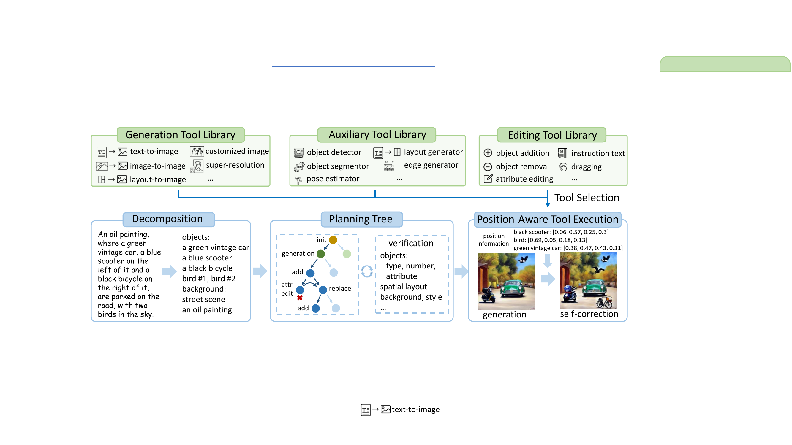
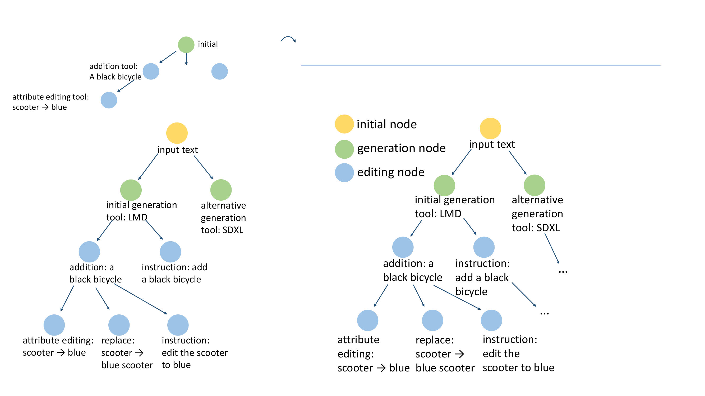
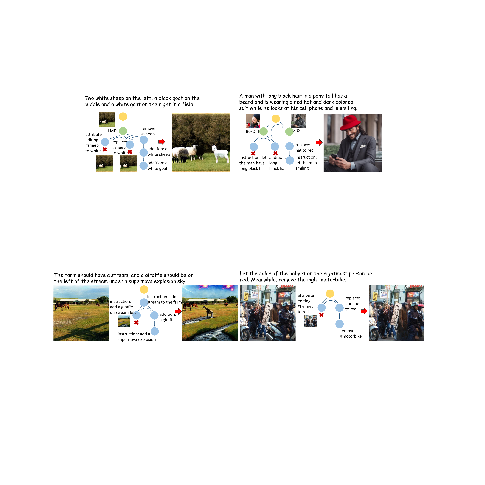
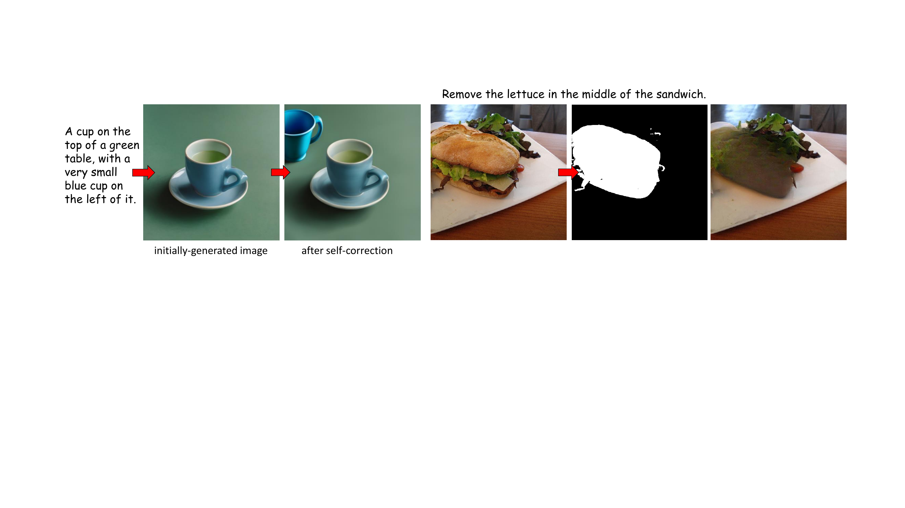
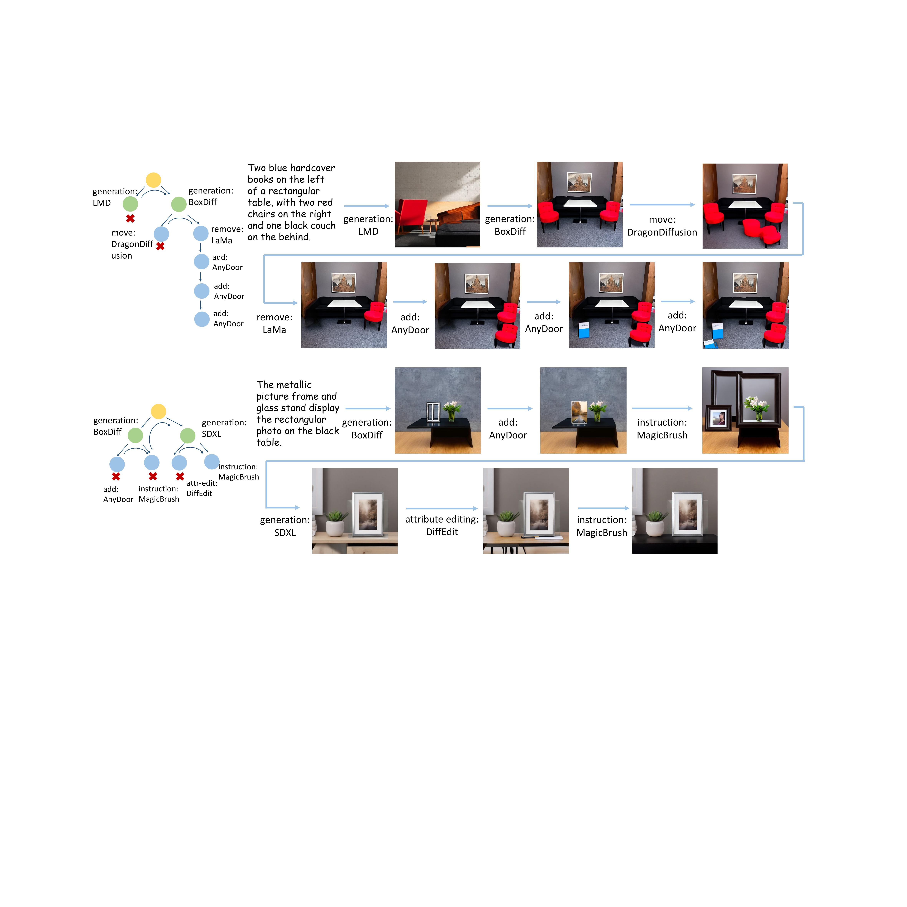
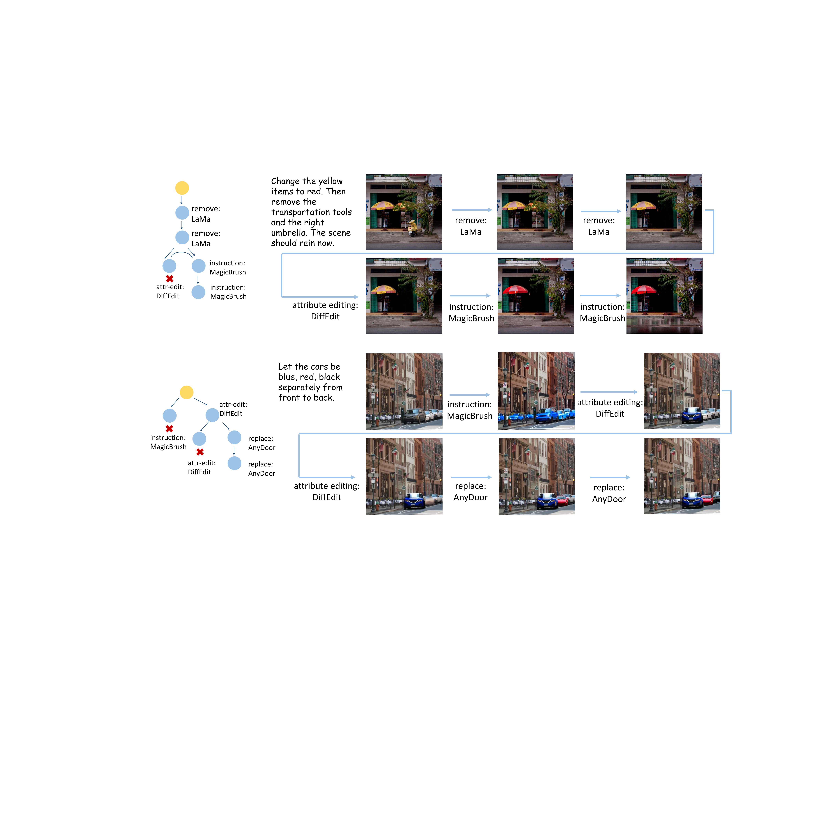

# GenArtist: Multimodal LLM as an Agent for Unified Image Generation and Editing

## Abstract

Despite the success achieved by existing image generation and editing methods, current models still struggle with complex problems including intricate text prompts, and the absence of verification and self-correction mechanisms makes the generated images unreliable. Meanwhile, a single model tends to specialize in particular tasks and possess the corresponding capabilities, making it inadequate for fulfilling all user requirements. We propose **GenArtist**, a *unified* image generation and editing system, coordinated by a multimodal large language model (MLLM) agent. We integrate a comprehensive range of existing models into the tool library and utilize the agent for tool selection and execution. For a complex problem, the MLLM agent decomposes it into simpler sub-problems and constructs a tree structure to systematically plan the procedure of generation, editing, and self-correction with step-by-step verification. By automatically generating missing position-related inputs and incorporating position information, the appropriate tool can be effectively employed to address each sub-problem. Experiments demonstrate that GenArtist can perform various generation and editing tasks, achieving state-of-the-art performance and surpassing existing models such as SDXL and DALL-E 3, as can be seen in Fig. <a href="#fig:visual1" data-reference-type="ref" data-reference="fig:visual1">[fig:visual1]</a>. Project page is <https://zhenyuw16.github.io/GenArtist_page/>.

# Introduction

<figure id="fig:visual1">

<figcaption><strong>Visualized examples from GenArtist.</strong> It can accomplish various tasks, achieving unified generation and editing. For text-to-image generation, it obtains greater accuracy compared to existing models like SDXL and DALL-E 3. For image editing, it also excels in complex editing tasks. </figcaption>
</figure>

With the recent advancements in diffusion models `\cite{ho2020denoising, dhariwal2021diffusion}`{=latex}, image generation and editing methods have rapidly progressed. Current improvements in image generation and editing can be broadly categorized into two tendencies. The first `\cite{ramesh2022hierarchical, rombach2022high, podell2023sdxl, chen2023pixart, betker2023improving}`{=latex} involves training from scratch using more advanced model architectures `\cite{rombach2022high, peebles2023scalable}`{=latex} and larger-scale datasets, thereby scaling up existing models to achieve a more general generation or editing capability. These methods can usually enhance the overall controllability and quality of image generation. The second is primarily about finetuning or additionally designing pre-trained large-scale image generation models on specific datasets to extend their capability `\cite{ruiz2023dreambooth, li2023blip, chen2023textdiffuser}`{=latex} or enhance their performance on certain tasks `\cite{lian2023llm, huang2023t2i}`{=latex}. These methods are usually task-specific and can demonstrate advantageous results on some particular tasks.

Despite this, current image generation or editing methods are still imperfect and confront some urgent challenges on the way to building a human-desired system: 1) The demand for image generation and editing is highly diverse and variable, like various requirements for objects and backgrounds, numerous demands about various operations in text prompts or instructions. Meanwhile, different models often possess different strengths and focus. General models may be weaker than some finetuned models in certain aspects, but they can exhibit better performance in out-of-distribution data. Therefore, it is nearly impossible for a well-trained model to meet all human requirements, and the use of only a single model is often sub-optimal. 2) Models still struggle with complex problems, such as lengthy and intricate sentences in text-to-image tasks or complicated instructions with multiple steps in editing tasks. Scaling up or finetuning models can alleviate this issue. However, since texts are highly variable, flexible, and can be easy to combine, there are always complex problems that a trained model cannot effectively handle. 3) Although meticulously designed, models still inevitably encounter some failure cases. Generated images sometimes fail to accurately correspond to the content of user prompts. Existing models lack the ability to autonomously assess the correctness of generated images, not to mention self-correcting them, making generated images unreliable. What we truly desire, therefore, should be *a unified image generation and editing system*, which can satisfy nearly all human requirements while producing reliable image results.

In this paper, we propose a unified image generation and editing system called **GenArtist** to address the above challenges. Our fundamental idea is to utilize a multimodal large language model (MLLM) as an AI agent, which acts as an "artist" and "draws" images according to user instructions. Specifically, in response to user instructions, the agent will analyze the user requirements, decompose complex problems, and conduct planning comprehensively to formulate the specific solutions. Then, it executes image generation or editing operations by invoking external tools to meet the user demands. After images are obtained, it finally performs verification and correction on the generated results to further ensure the accuracy of the generated images. The core mechanisms of the agent are:

**Decomposition of intricate text prompts.** The MLLM agent first decomposes the complex problems into several simple sub-problems. For complicated text prompts in generation tasks, it extracts single-object concepts and necessary background elements. For complex instructions in editing tasks, it breaks down intricate operations into several simple single editing actions. The decomposition of complex problems significantly improves the reliability of model execution.

**Planning tree with step-by-step verification.** After decomposition, we construct a tree structure to plan the execution of sub-tasks. Each operation is a node in the tree, with subsequent operations as its child nodes, and different tools for the same action are its sibling nodes. Each node is followed by verification to ensure that its operation can be executed correctly. Then, both generation, editing, and self-correction mechanisms can be incorporated. Through this planning tree, the proceeding of the system can be considered as a traversal process and the whole system can be coordinated.

**Position-aware tool execution.** Most of object-level tools require position-related inputs, like the position of the object to be manipulated. These necessary inputs may not be provided by the user. Existing MLLMs are also position-insensitive, and cannot provide accurate positional guidance. We thus introduce a set of auxiliary tools to automatically complete these position-related inputs, and incorporate position information for the MLLM agent through detection models for tool execution.

Our main contributions can be summarized as follows:

- We propose GenArtist, a unified image generation and editing system. The MLLM agent serves as the "brain" to coordinate and manage the entire process. To the best of our knowledge, this is the first unified system that encompasses the vast majority of existing generation and editing tasks.

- Through viewing the operations as nodes and constructing the planning tree, our MLLM agent can schedule for generation and editing tasks, and automatically verify and self-correct generated images. This significantly enhances the controllability of user instructions over images.

- By incorporating position information into the integrated tool library and employing auxiliary tools for providing missing position-related inputs, the agent performs tool selection and invokes the most suitable tool, providing a unified interface for various tasks in generation and editing.

Extensive experiments demonstrate the effectiveness of our GenArtist. It achieves more than 7% improvement compared to DALL-E 3 `\cite{betker2023improving}`{=latex} on T2I-CompBench `\cite{huang2023t2i}`{=latex}, a comprehensive benchmark for open-world compositional T2I generation, and also obtains the state-of-the-art performance on the image editing benchmark MagicBrush `\cite{zhang2024magicbrush}`{=latex}. As can be seen in the visualized examples in Fig. <a href="#fig:visual1" data-reference-type="ref" data-reference="fig:visual1">1</a>, GenArtist well serves as a unified image generation and editing system.

# Related Work

**Image generation and editing.** With the development of diffusion models `\cite{dhariwal2021diffusion, ho2020denoising}`{=latex}, both image generation and editing have achieved remarkable success. Many general text-to-image generation `\cite{rombach2022high, saharia2022photorealistic, podell2023sdxl, chen2023pixart}`{=latex} and editing methods `\cite{brooks2023instructpix2pix, zhang2024magicbrush, sheynin2023emu, geng2023instructdiffusion}`{=latex} have been proposed and achieved high-quality generated images. Based on these general models, many methods conduct finetuning or design additional modules for some specialized tasks, like customized image generation `\cite{ruiz2023dreambooth, kumari2023multi, li2023blip, liu2023cones}`{=latex}, image generation with text rendering `\cite{chen2024textdiffuser, chen2023textdiffuser}`{=latex}, exemplar-based image editing `\cite{yang2023paint, chen2023anydoor}`{=latex}, image generation that focuses on persons `\cite{xiao2023fastcomposer}`{=latex}. Meanwhile, some methods aim to improve the controllability of texts over images. For example, ControlNet `\cite{zhang2023adding}`{=latex} controls Stable Diffusion with various conditioning inputs like Canny edges,  `\cite{voynov2023sketch}`{=latex} adopts sketch images for conditions, and layout-to-image methods `\cite{li2023gligen, xie2023boxdiff, lian2023llm, chen2024training}`{=latex} synthesize images according to the given bounding boxes of objects. Despite the success, these methods still focus on specific tasks, thus unable to support unified image generation and editing.

**AI agent.** Large language models (LLMs), like ChatGPT, Llama `\cite{touvron2023llama, touvron2023llama2}`{=latex}, have demonstrated impressive capability in natural language processing. The involvement of vision ability for multimodal large language models (MLLMS), like LLaVA `\cite{liu2024visual}`{=latex}, Claude, GPT-4 `\cite{gpt42023}`{=latex}, further enables the models to process visual data. Recently, LLMs begin to be adopted as agents for executing complex tasks. These works `\cite{yang2023auto, shen2023hugginggpt, liu2023internchat}`{=latex} apply LLMs to learn to use tools for tasks like visual interaction, speech processing, compositional visual tasks `\cite{gupta2023visual}`{=latex}, software development `\cite{qian2023communicative}`{=latex}, gaming `\cite{meta2022human}`{=latex}, APP use `\cite{yang2023appagent}`{=latex} or math `\cite{xin2023lego}`{=latex}. Recently, the idea of AI agents has also begun to be applied to image generation related tasks. For example, `\cite{lian2023llm, feng2024layoutgpt}`{=latex} design scene layout with LLMs, `\cite{wu2023self}`{=latex} utilizes LLMs to assist self-correcting, `\cite{wang2024divide, yang2024mastering}`{=latex} target at MLLMs in complex text-to-image generation problems, and `\cite{qin2024diffusiongpt}`{=latex} leverages LLM for model selection in the text-to-image generation task.

<figure id="fig:frame">

<figcaption><strong>The overview of our GenArtist.</strong> The MLLM agent is responsible for decomposing problems and planning using a tree structure, then invoking tools to address the issues. Employing the agent as the "brain" effectively realizes a unified generation and editing system.</figcaption>
</figure>

# Method

The overview of our GenArtist is illustrated in Fig. <a href="#fig:frame" data-reference-type="ref" data-reference="fig:frame">2</a>. The MLLM agent coordinates the whole system. Its primary responsibilities center around decomposing the complicated tasks and constructing the planning tree with step-by-step verification for image generation, editing, and self-correction. It invokes tools from an image generation tool library and an editing tool library to execute the specific operations, and an auxiliary tool library serves to provide missing position-related values.

## Planning Tree with Step-by-Step Verification

**Decomposition.** When it comes to complicated prompt inputs, existing methods usually cannot understand all requirements, which hurts the controllability and reliability of model results. The MLLM agent thus first decomposes the complex problems. For generation tasks, it decomposes both object and background information according to the text prompts. It extracts the discrete objects embedded within the text prompts, along with their associated attributes. For background information, it mainly analyzes the overall scene and image style required by the input texts. For editing tasks, It decomposes complex editing operations into several specific actions, such as `add`, `move`, `remove`, into simple editing instructions. After decomposition, the simpler operations can be relatively easier to address, which thus improves the reliability of model execution.

**Tree construction.** After decomposition, we organize all operations into a structure of tree for planning. Such a tree primarily consists of three types of nodes: initial nodes, generation nodes, and editing nodes. The initial node serves as the root of the tree, marking the beginning of the system. Generation nodes are about image generation using tools from the generation tool library, while editing nodes are about performing a single editing operation using the corresponding tools from the editing tool library. For pure image editing tasks, the generation nodes will be absent.

In practice, as the correctness of generated images cannot be guaranteed, we introduce the self-correction mechanism to assess and rectify the results of generation. Each generation node thus has a sub-tree consisting entirely of editing nodes for self-correction. After the tools in the generation nodes are invoked and verification is conducted, this sub-tree will be adaptively generated by the MLLM agent. Specifically, after verification, we instruct the MLLM agent to devise a series of corresponding editing operations to correct the images. Take the example in Fig. <a href="#fig:frame" data-reference-type="ref" data-reference="fig:frame">2</a> for example, editing actions including `"add a black bicycle"`, `"edit the color of the scooter to blue"`, `"add a bird"` should be conducted. These operations are organized into a tree structure to be the sub-tree of the generation node, allowing for specific planning of self-correction.

<figure id="fig:tree">

<figcaption><strong>Illustration of the tree for planning.</strong> The sub-tree of the "alternative generation tool" node will be adaptively generated after verification, and the sub-tree of the "instruction" node is the same as the left.</figcaption>
</figure>

Each generation or editing action corresponds to a node in the tree, with its subsequent operations as its child nodes. This construction initially forms a "chain", enabling a planning chain. Then, we note that we can usually utilize different tools to address the same problem. For example, for adding an object into the image, we can employ a tool specifically designed for object addition or instruction-based editing models by translating the adding operation into text instructions. Similarly, for attribute editing, we can use attribute editing models or utilize replacement or instruction-based editing models. Moreover, numerous generation tools can achieve text-to-image generation, and varying the random seeds can also produce different outputs. We consider these nodes as siblings, all serving as child nodes of their parent nodes. They also share the same sub-tree, containing subsequent editing operations. The tool selected by the MLLM agent will be placed as the optimal child node and positioned on the far left. In this way, we establish the structure of the tree. An illustration example for the Fig. <a href="#fig:frame" data-reference-type="ref" data-reference="fig:frame">2</a> case is provided in Fig. <a href="#fig:tree" data-reference-type="ref" data-reference="fig:tree">3</a> (we omit some sub-trees with identical structures or adaptively generated after generation nodes, and some nodes about varying random seeds for simplicity).

**Planning.** Once the tree is established, planning for self-correction or the whole system can be viewed as the pre-order traversal of the structure. For a particular node, its corresponding tool is invoked to conduct the operation, followed by verification to determine whether the editing is successful. If successful, the process proceeds to its leftmost child node for subsequent operations, and its sibling nodes are deleted. If unsuccessful, the process backtracks to its sibling nodes, and its sub-tree is removed. This process continues until the generated image is correct, *i.e.*, when a node at the lowest level successfully executes. We can also limit the branching factor or the number of nodes of the tree for early termination, and require the agent to return the most accurate image.

**Verification.** As described above, the verification mechanism plays a crucial role both in tree construction and the execution process. Through the multimodal perception capability of the MLLM, the agent verifies the correctness of the generated images. The main aspect of verification involves the objects contained in the text, together with their own attributes like their color, shape, texture, the positions of the objects, the relationship among these different objects. Besides, the background, scene, overall style and the aesthetic quality of generated images are also considered. Since the perception ability of existing models tends to be superior to the generative ability, employing such verification allows for effectively assessing the correctness of generated images.

It is also worth mentioning that during verification, in addition to the accuracy of the generated images, the agent is also required to assess their aesthetic quality. If the overall quality is poor, the agent will utilize different generation tools or choose different random seeds to regenerate the images, in order to ensure their overall quality. Meanwhile, as an agent-centered system, the framework is also flexible in terms of human-computer interaction. During verification, human feedback can be appropriately integrated. By incorporating human evaluation and feedback on the overall quality of the images, the quality of the generated images can be further improved.

## Tool Library

After constructing the planning tree, the agent proceeds to execute each node by calling external tools, ultimately solving the problem. We first introduce the tools used in GenArtist. The primary tools that the MLLM agent utilizes can be generally divided into the image generation tool library and the editing tool library. The specific tools we utilize currently are listed in Tab. <a href="#tab:tools" data-reference-type="ref" data-reference="tab:tools">1</a>, and some new tools can be seamlessly added, allowing for the expansion of the tool library. To assist the subsequent tool selection, we need to convey information to the MLLM agent about the specific task performed by the tool, its required inputs, and its characteristics and advantages. The prompts for introducing tools consist of the following parts specifically:

- The tool skill and name. It briefly describes the tool-related task and its name, as listed in Tab. <a href="#tab:tools" data-reference-type="ref" data-reference="tab:tools">1</a>, such as `(text-to-image, SDXL)`, `(canny-to-image, ControlNet)`, `(object removal, LaMa)`. It serves as a unique identifier, enabling the agent to differentiate the utilized tools.

- The tool required inputs. It pertains to the specific inputs required for the execution of the tool. For example, text-to-image models require `"text"` as input for generation, customization models also need `"subject images"` for personalized generation. Most of object-level editing tools demand instructions about `"object name"` and `"object position"`.

- The tool characteristic and advantage. It primarily provides a more detailed introduction of the tool, including its specific characteristics, serving as a key reference for the agent during tool selection. For example, SDXL can be a `general text-to-image generation model`, LMD usually controls scene layout strictly and is suitable for `compositional text-to-image generation`, where text prompts usually contain multiple objects, BoxDiff controls scene layout relatively loosely, TextDiffuser is specially designed for `image generation with text rendering.`

<table>
<caption><strong>GenArtist utilized tool library, including the tool names and their skills.</strong> The main tools are from the generation tool library and the editing tool library. The following models represent all the tools used in our current version, while new models can be seamlessly added.</caption>
<tbody>
<tr>
<td style="text-align: center;"></td>
<td colspan="2" style="text-align: center;">Editing Tools</td>
<td style="text-align: center;"></td>
</tr>
<tr>
<td style="text-align: center;">skill</td>
<td style="text-align: center;">tool</td>
<td style="text-align: center;">skill</td>
<td style="text-align: center;">tool</td>
</tr>
<tr>
<td style="text-align: center;">text-to-image</td>
<td style="text-align: center;">SDXL </td>
<td style="text-align: center;"></td>
<td style="text-align: center;"></td>
</tr>
<tr>
<td style="text-align: center;">text-to-image</td>
<td style="text-align: center;">PixArt-<em>α</em> </td>
<td style="text-align: center;">object addition</td>
<td style="text-align: center;">AnyDoor </td>
</tr>
<tr>
<td style="text-align: center;">image-to-image</td>
<td style="text-align: center;">Stable Diffusion v2 </td>
<td style="text-align: center;">object removal</td>
<td style="text-align: center;">LaMa </td>
</tr>
<tr>
<td style="text-align: center;">layout-to-image</td>
<td style="text-align: center;">LMD </td>
<td style="text-align: center;">object replacement</td>
<td style="text-align: center;">AnyDoor </td>
</tr>
<tr>
<td style="text-align: center;">layout-to-image</td>
<td style="text-align: center;">BoxDiff </td>
<td style="text-align: center;">attribute editing</td>
<td style="text-align: center;">DiffEdit </td>
</tr>
<tr>
<td style="text-align: center;">single-object customization</td>
<td style="text-align: center;">BLIP-Diffusion </td>
<td style="text-align: center;">instruction-based</td>
<td style="text-align: center;">MagicBrush </td>
</tr>
<tr>
<td style="text-align: center;">multi-object customization</td>
<td style="text-align: center;"><em>λ</em>-ECLIPSE </td>
<td style="text-align: center;">dragging (detail)</td>
<td style="text-align: center;">DragDiffusion </td>
</tr>
<tr>
<td style="text-align: center;">super-resolution</td>
<td style="text-align: center;">SDXL </td>
<td style="text-align: center;">dragging (object)</td>
<td style="text-align: center;">DragonDiffusion </td>
</tr>
<tr>
<td style="text-align: center;">image with texts</td>
<td style="text-align: center;">TextDiffuser </td>
<td style="text-align: center;">style transfer</td>
<td style="text-align: center;">InST </td>
</tr>
<tr>
<td style="text-align: center;">{canny, depth ...}-to-image</td>
<td style="text-align: center;">ControlNet </td>
<td style="text-align: center;"></td>
<td style="text-align: center;"></td>
</tr>
<tr>
<td style="text-align: center;"></td>
<td style="text-align: center;"></td>
<td style="text-align: center;"></td>
<td style="text-align: center;"></td>
</tr>
</tbody>
</table>

## Position-Aware Tool Execution

With tool libraries, the MLLM agent will further perform tool selection and execution to utilize the suitable tool for fulfilling the image generation or editing task. Before tool execution, we compensate for the deficiency of position information in user inputs and the MLLM agent through two designs:

**Position-related input compensation.** In practice, it is common to encounter scenes where the agent selects a suitable tool but some necessary user inputs are missing. These user inputs are mostly related to positions. For example, for some complex text prompts where multiple objects exist, the layout-to-image tool can be suitable. However, users may not necessarily provide the scene layouts and usually only text prompts are provided. In such cases, due to the absence of some necessary inputs, these suitable tools cannot be directly invoked. We therefore introduce the auxiliary tool library to provide these position-related missing inputs. This auxiliary tool library mainly contains: 1) localization models like object detection `\cite{liu2023grounding}`{=latex} or segmentation `\cite{kirillov2023segment}`{=latex} models, to provide position information of objects for some object-level editing tools; 2) the preprocessors of ControlNet `\cite{zhang2023adding}`{=latex} like the pose estimator, canny edge map extractor, depth map extractor; 3) some LLM-implemented tools, like the scene layout generator `\cite{lian2023llm, feng2024layoutgpt}`{=latex}. The MLLM agent can invoke these auxiliary tools automatically if necessary, to guarantee that the most suitable tool to address the user instruction can be utilized, rather than solely relying on user-provided inputs to select tools.

**Position information introduction.** Existing MLLMs primarily focus on text comprehension and holistic image perception, with relatively limited attention to precise position information within images. MLLMs can easily determine whether objects exist in the image, but sometimes struggle with discerning spatial relationships between objects, such as whether a specific object is to the `left` or `right` of another. It is also more challenging for these MLLMs to provide accurate guidance for tools that require position-related inputs, such as object-level editing tools. To address this, we employ an object detector on the input images, and include the detected objects along with their bounding boxes as part of the prompt, to provide a spatial reference for the MLLM agent. In this way, the agent can effectively determine the positions within the image where certain tools should operate.

The prompts for the agent to conduct tool selection thus mainly consist of the following parts:

- Task instruction. Its main purpose is to clarify the task of the agent, *i.e.*, tool selection within a unified generation and editing system. Simultaneously, it takes user instructions as input and specifies the output format. We request the agent to output in the format of `{"tool_name":tools, "input":inputs}` and annotate missing inputs with the pre-defined specified identifier.

- Tool introductions. We input the description of each tool into the agent in the format as described earlier. The detailed information about the tools will serve as the crucial references for the tool selection process. We also state that the primary criterion for tool selection is the suitability of the tool, rather than the content of given inputs, since missing inputs can be generated automatically.

- Position information. The outputs from the object detector are utilized and provided to the MLLM agent to compensate for the lack of position information.

In summary, the basic steps for tool execution are as follows: First, determine whether the task pertains to image generation or editing. Next, conduct tool selection according to the instructions and the characteristics of the tools, and output in the required format. Finally, for missing inputs which are necessary for the selected tools, utilize auxiliary tools to complete them. Upon completing these steps, the agent will be able to correctly execute the appropriate tools, thereby initially meeting the requirements of users. The integration, selection, and execution of diverse tools significantly facilitate the development of a unified image generation and editing system.

# Experiments

<table>
<caption><strong>Quantitative Comparison on T2I-CompBench with existing text-to-image generation models and compositional methods</strong>. Our method demonstrates superior compositional generation ability in both attribute binding, object relationships, and complex compositions. We use the officially updated code for evaluation, which updates the noun phrase number. Consequently, some metric values for certain methods may be lower than those reported in their original papers.</caption>
<thead>
<tr>
<th style="text-align: left;"></th>
<th colspan="3" style="text-align: center;"><strong>Attribute Binding</strong></th>
<th colspan="2" style="text-align: center;"><strong>Object Relationship</strong></th>
<th style="text-align: center;"><strong>Complex↑</strong></th>
</tr>
</thead>
<tbody>
<tr>
<td style="text-align: left;">2-4</td>
<td style="text-align: center;"><strong>Color ↑</strong> </td>
<td style="text-align: center;"><strong>Shape↑</strong></td>
<td style="text-align: center;"><strong>Texture↑</strong></td>
<td style="text-align: center;"><strong>Spatial↑</strong></td>
<td style="text-align: center;"><strong>Non-Spatial↑</strong></td>
<td style="text-align: center;"></td>
</tr>
<tr>
<td style="text-align: left;">Stable Diffusion v1.4 </td>
<td style="text-align: center;">0.3765</td>
<td style="text-align: center;">0.3576</td>
<td style="text-align: center;">0.4156</td>
<td style="text-align: center;">0.1246</td>
<td style="text-align: center;">0.3079</td>
<td style="text-align: center;">0.3080</td>
</tr>
<tr>
<td style="text-align: left;">Stable Diffusion v2 </td>
<td style="text-align: center;">0.5065</td>
<td style="text-align: center;">0.4221</td>
<td style="text-align: center;">0.4922</td>
<td style="text-align: center;">0.1342</td>
<td style="text-align: center;">0.3096</td>
<td style="text-align: center;">0.3386</td>
</tr>
<tr>
<td style="text-align: left;">DALL-E 2 </td>
<td style="text-align: center;">0.5750</td>
<td style="text-align: center;">0.5464</td>
<td style="text-align: center;">0.6374</td>
<td style="text-align: center;">0.1283</td>
<td style="text-align: center;">0.3043</td>
<td style="text-align: center;">0.3696</td>
</tr>
<tr>
<td style="text-align: left;">Composable Diffusion </td>
<td style="text-align: center;">0.4063</td>
<td style="text-align: center;">0.3299</td>
<td style="text-align: center;">0.3645</td>
<td style="text-align: center;">0.0800</td>
<td style="text-align: center;">0.2980</td>
<td style="text-align: center;">0.2898</td>
</tr>
<tr>
<td style="text-align: left;">StructureDiffusion </td>
<td style="text-align: center;">0.4990</td>
<td style="text-align: center;">0.4218</td>
<td style="text-align: center;">0.4900</td>
<td style="text-align: center;">0.1386</td>
<td style="text-align: center;">0.3111</td>
<td style="text-align: center;">0.3355</td>
</tr>
<tr>
<td style="text-align: left;">Attn-Exct </td>
<td style="text-align: center;">0.6400</td>
<td style="text-align: center;">0.4517</td>
<td style="text-align: center;">0.5963</td>
<td style="text-align: center;">0.1455</td>
<td style="text-align: center;">0.3109</td>
<td style="text-align: center;">0.3401</td>
</tr>
<tr>
<td style="text-align: left;">GORS </td>
<td style="text-align: center;">0.6603</td>
<td style="text-align: center;">0.4785</td>
<td style="text-align: center;">0.6287</td>
<td style="text-align: center;">0.1815</td>
<td style="text-align: center;">0.3193</td>
<td style="text-align: center;">0.3328</td>
</tr>
<tr>
<td style="text-align: left;">SDXL </td>
<td style="text-align: center;">0.5879</td>
<td style="text-align: center;">0.4687</td>
<td style="text-align: center;">0.5299</td>
<td style="text-align: center;">0.2133</td>
<td style="text-align: center;">0.3119</td>
<td style="text-align: center;">0.3237</td>
</tr>
<tr>
<td style="text-align: left;">PixArt-<em>α</em> </td>
<td style="text-align: center;">0.6690</td>
<td style="text-align: center;">0.4927</td>
<td style="text-align: center;">0.6477</td>
<td style="text-align: center;">0.2064</td>
<td style="text-align: center;">0.3197</td>
<td style="text-align: center;">0.3433</td>
</tr>
<tr>
<td style="text-align: left;">CompAgent </td>
<td style="text-align: center;">0.7760</td>
<td style="text-align: center;">0.6105</td>
<td style="text-align: center;">0.7008</td>
<td style="text-align: center;">0.4837</td>
<td style="text-align: center;">0.3212</td>
<td style="text-align: center;">0.3972</td>
</tr>
<tr>
<td style="text-align: left;">DALL-E 3 </td>
<td style="text-align: center;">0.7785</td>
<td style="text-align: center;">0.6205</td>
<td style="text-align: center;">0.7036</td>
<td style="text-align: center;">0.2865</td>
<td style="text-align: center;">0.3003</td>
<td style="text-align: center;">0.3773</td>
</tr>
<tr>
<td style="text-align: left;"><strong>GenArtist (ours)</strong></td>
<td style="text-align: center;"><strong>0.8482</strong></td>
<td style="text-align: center;"><strong>0.6948</strong></td>
<td style="text-align: center;"><strong>0.7709</strong></td>
<td style="text-align: center;"><strong>0.5437</strong></td>
<td style="text-align: center;"><strong>0.3346</strong></td>
<td style="text-align: center;"><strong>0.4499</strong></td>
</tr>
<tr>
<td style="text-align: left;"></td>
<td style="text-align: center;"></td>
<td style="text-align: center;"></td>
<td style="text-align: center;"></td>
<td style="text-align: center;"></td>
<td style="text-align: center;"></td>
<td style="text-align: center;"></td>
</tr>
</tbody>
</table>

In this section, we demonstrate the effectiveness of our GenArtist and its unified ability through extensive experiments in image generation and editing. For image generation, we mainly conduct quantitative comparisons on the recent T2I-CompBench benchmark `\cite{huang2023t2i}`{=latex}. It is mainly about image generation with complex text prompts, involving multiple objects together with their own attributes or relationships. For image editing, we mainly conduct comparisons on the MagicBrush benchmark `\cite{zhang2024magicbrush}`{=latex}, which involves multiple types of text instructions, both single-turn and multi-turn dialogs for image editing. We choose GPT-4V `\cite{gpt42023}`{=latex} as our MLLM agent. In quantitative comparative experiments, we constrain the editing tree to be a binary tree.

## Comparison with Image Generation Methods

We list the quantitative metric results of our GenArtist in Tab. <a href="#tab:t2icompbench" data-reference-type="ref" data-reference="tab:t2icompbench">2</a> and compare with existing state-of-the-art text-to-image synthesis methods. It can be seen that our GenArtist consistently achieves better performance on all sub-categories. This demonstrates that for the text-to-image generation task, our system effectively achieves better control over text-to-image correspondence and higher accuracy in generated images, especially in the case of complicated text prompts. It can be observed that based on Stable Diffusion, both scaling-up models such as SDXL, PixArt-\\(\alpha\\), and those methods specifically designed for this context like Attn-Exct, GORS, can achieve higher accuracy. In contrast, our approach, by integrating various models as tools, effectively harnesses the strengths of these two categories of methods. Additionally, the self-correction mechanism further ensures the accuracy of the generated images. Compared to the current state-of-the-art model DALL-E 3, our method achieves nearly a 7% improvement in attribute binding, and a more than 20% improvement in spatial relationships, partly due to the inclusion of position-sensitive tools and the input of position information during tool selection. Compared to CompAgent, a method that also employs an AI agent for compositional text-to-image generation, GenArtist achieves a 6% improvement on average, partially because our system encompasses a more comprehensive framework for both generation and self-correction. The capability in image generation of our unified system can thus be demonstrated.

## Comparison with Image Editing Methods

| **Settinigs** | **Methods** | **L1\\(\downarrow\\)** | **L2\\(\downarrow\\)** | **CLIP-I\\(\uparrow\\)** | **DINO\\(\uparrow\\)** | **CLIP-T\\(\uparrow\\)** |
|:--:|:---|:--:|:--:|:--:|:--:|:--:|
|  | Null Text Inversion `\cite{mokady2023null}`{=latex} | 0.0749 | 0.0197 | 0.8827 | 0.8206 | 0.2737 |
|  | HIVE `\cite{zhang2023hive}`{=latex} | 0.1092 | 0.0341 | 0.8519 | 0.7500 | 0.2752 |
|  | InstructPix2Pix `\cite{brooks2023instructpix2pix}`{=latex} | 0.1122 | 0.0371 | 0.8524 | 0.7428 | 0.2764 |
|  | MagicBrush `\cite{zhang2024magicbrush}`{=latex} | 0.0625 | 0.0203 | 0.9332 | 0.8987 | 0.2781 |
|  | SmartEdit `\cite{huang2023smartedit}`{=latex} | 0.0810 | \- | 0.9140 | 0.8150 | 0.3050 |
|  | **GenArtist (ours)** | **0.0536** | **0.0147** | **0.9403** | **0.9131** | **0.3129** |
|  | Null Text Inversion `\cite{mokady2023null}`{=latex} | 0.1057 | 0.0335 | 0.8468 | 0.7529 | 0.2710 |
|  | HIVE `\cite{zhang2023hive}`{=latex} | 0.1521 | 0.0557 | 0.8004 | 0.6463 | 0.2673 |
|  | InstructPix2Pix `\cite{brooks2023instructpix2pix}`{=latex} | 0.1584 | 0.0598 | 0.7924 | 0.6177 | 0.2726 |
|  | MagicBrush `\cite{zhang2024magicbrush}`{=latex} | 0.0964 | 0.0353 | 0.8924 | 0.8273 | 0.2754 |
|  | **GenArtist (ours)** | **0.0858** | **0.0298** | **0.9071** | **0.8492** | **0.3067** |
|  |  |  |  |  |  |  |

**Quantitative Comparison on MagicBrush with existing image editing methods**. Multi-turn setting evaluates images that iteratively edited on the previous source images in edit sessions.

We then list the comparative quantitative comparisons on the image editing benchmark MagicBrush in Tab. <a href="#tab:magicbrush" data-reference-type="ref" data-reference="tab:magicbrush">3</a>. Our GenArtist also achieves superior editing results, no matter in the single-turn or multi-turn setting, compared to both previous global description-guided methods like Null Text Inversion and instruction-guided methods like InstrctPix2Pix and MagicBrush. The main reason is that editing operations are highly diverse, and it’s challenging for a single model to achieve excellent performance across all these diverse editing operations. In contrast, our method can leverage the strengths of different models comprehensively. Additionally, the planning tree can effectively consider scenarios where model execution fails, making editing results more reliable and accurate. The capability in image editing of our unified system can thus be demonstrated.

## Ablation Study

<table>
<caption><strong>Ablation Study on T2I-CompBench</strong>. The upper section is about relevant tools from the generation tool library, then we study the tool selection and planning mechanisms respectively.</caption>
<thead>
<tr>
<th style="text-align: left;"></th>
<th colspan="3" style="text-align: center;"><strong>Attribute Binding</strong></th>
<th colspan="2" style="text-align: center;"><strong>Object Relationship</strong></th>
<th style="text-align: center;"><strong>Complex↑</strong></th>
</tr>
</thead>
<tbody>
<tr>
<td style="text-align: left;">2-4</td>
<td style="text-align: center;"><strong>Color ↑</strong> </td>
<td style="text-align: center;"><strong>Shape↑</strong></td>
<td style="text-align: center;"><strong>Texture↑</strong></td>
<td style="text-align: center;"><strong>Spatial↑</strong></td>
<td style="text-align: center;"><strong>Non-Spatial↑</strong></td>
<td style="text-align: center;"></td>
</tr>
<tr>
<td style="text-align: left;">Stable Diffusion v2 </td>
<td style="text-align: center;">0.5065</td>
<td style="text-align: center;">0.4221</td>
<td style="text-align: center;">0.4922</td>
<td style="text-align: center;">0.1342</td>
<td style="text-align: center;">0.3096</td>
<td style="text-align: center;">0.3386</td>
</tr>
<tr>
<td style="text-align: left;">LMD </td>
<td style="text-align: center;">0.5736</td>
<td style="text-align: center;">0.5334</td>
<td style="text-align: center;">0.5227</td>
<td style="text-align: center;">0.2704</td>
<td style="text-align: center;">0.3073</td>
<td style="text-align: center;">0.3083</td>
</tr>
<tr>
<td style="text-align: left;">BoxDiff </td>
<td style="text-align: center;">0.6374</td>
<td style="text-align: center;">0.4869</td>
<td style="text-align: center;">0.6100</td>
<td style="text-align: center;">0.2625</td>
<td style="text-align: center;">0.3158</td>
<td style="text-align: center;">0.3457</td>
</tr>
<tr>
<td style="text-align: left;"><em>λ</em>-ECLIPSE </td>
<td style="text-align: center;">0.4581</td>
<td style="text-align: center;">0.4420</td>
<td style="text-align: center;">0.5084</td>
<td style="text-align: center;">0.1285</td>
<td style="text-align: center;">0.2922</td>
<td style="text-align: center;">0.3131</td>
</tr>
<tr>
<td style="text-align: left;">SDXL </td>
<td style="text-align: center;">0.5879</td>
<td style="text-align: center;">0.4687</td>
<td style="text-align: center;">0.5299</td>
<td style="text-align: center;">0.2133</td>
<td style="text-align: center;">0.3119</td>
<td style="text-align: center;">0.3237</td>
</tr>
<tr>
<td style="text-align: left;">PixArt-<em>α</em> </td>
<td style="text-align: center;">0.6690</td>
<td style="text-align: center;">0.4927</td>
<td style="text-align: center;">0.6477</td>
<td style="text-align: center;">0.2064</td>
<td style="text-align: center;">0.3197</td>
<td style="text-align: center;">0.3433</td>
</tr>
<tr>
<td style="text-align: left;">+ tool selection</td>
<td style="text-align: center;">0.7028</td>
<td style="text-align: center;">0.5764</td>
<td style="text-align: center;">0.6883</td>
<td style="text-align: center;">0.4305</td>
<td style="text-align: center;">0.3187</td>
<td style="text-align: center;">0.3739</td>
</tr>
<tr>
<td style="text-align: left;">+ planning chain</td>
<td style="text-align: center;">0.7509</td>
<td style="text-align: center;">0.6045</td>
<td style="text-align: center;">0.7192</td>
<td style="text-align: center;">0.4787</td>
<td style="text-align: center;">0.3216</td>
<td style="text-align: center;">0.4095</td>
</tr>
<tr>
<td style="text-align: left;">+ planning tree</td>
<td style="text-align: center;"><strong>0.8482</strong></td>
<td style="text-align: center;"><strong>0.6948</strong></td>
<td style="text-align: center;"><strong>0.7709</strong></td>
<td style="text-align: center;"><strong>0.5437</strong></td>
<td style="text-align: center;"><strong>0.3346</strong></td>
<td style="text-align: center;"><strong>0.4499</strong></td>
</tr>
<tr>
<td style="text-align: left;"></td>
<td style="text-align: center;"></td>
<td style="text-align: center;"></td>
<td style="text-align: center;"></td>
<td style="text-align: center;"></td>
<td style="text-align: center;"></td>
<td style="text-align: center;"></td>
</tr>
</tbody>
</table>

We finally conduct the ablation study on the T2I-CompBench benchmark and list the results in Tab. <a href="#tab:ablation" data-reference-type="ref" data-reference="tab:ablation">4</a>. We present the results of Stable Diffusion as a reference. The top section includes various tools relevant to the task, including text-to-image, layout-to-image, and customized generation methods. It can be observed that through scaling up or additional design, these tools have generally achieved better results than Stable Diffusion. After tool selection by the MLLM agent, the quantitative metrics outperform all these tools. This demonstrates that the agent can effectively choose appropriate tools based on the content of text prompts, thus achieving superior performance compared to all these tools. If we use a chain structure for planning to further correct the images, we achieve an average improvement of 3%, demonstrating the necessity of verification and correction of erroneous results. Furthermore, by utilizing a tree structure, we can further consider and handle cases where the editing tool fails, resulting in even more reliable output results. Such an ablation study illustrates the necessity of integrating multiple models as tools and utilizing tree structure for planning. The reasonableness of our agent-centric system designs can also be demonstrated.

|  | **Spatial\\(\uparrow\\)** | **Complex \\(\uparrow\\)** |
|:--:|:--:|:--:|
| w/o position information | 0.4577 | 0.4083 |
| w/ position information | 0.5437 | 0.4499 |

**Ablation Study on the position-aware tool execution on T2I-CompBench.**

Regarding position-aware tool execution, we list the corresponding ablation study in Tab. <a href="#tab:position" data-reference-type="ref" data-reference="tab:position">5</a>. We evaluate the performance on the spatial and complex aspects of T2I-CompBench, as these two aspects mainly involve position-sensitive text prompts for image generation. As multimodal large models are usually not sensitive to position information, the performance is limited without the inclusion of position information, only a slight improvement over the tool selection results. After introducing position information, which enhances spatial awareness, there is a significant improvement in both the spatial and complex aspects. This validates the reasonability of our design.

<figure id="fig:generationtree">

<figcaption><strong>Visualization of the planning tree for image generation tasks.</strong> </figcaption>
</figure>

<figure id="fig:editingtree">

<figcaption><strong>Visualization of the planning tree for image editing tasks.</strong> </figcaption>
</figure>

We further list some visualized generation examples in Fig. <a href="#fig:generationtree" data-reference-type="ref" data-reference="fig:generationtree">4</a> to illustrate our planning tree and how the system proceeds. In the first example, as the text prompts contain multiple objects, the agent chooses the LMD tool for generation. However, there are still some errors in the image. The agent first attempts to use the attribute editing tool to change the leftmost sheep to white, but it fails. The agent further attempts to modify the color using the replace tool, but after replacement, the size of the sheep becomes too small and not very noticeable. The agent then chooses to remove the black sheep and then adds a white sheep, successfully achieving the same effect as editing color. Finally, the agent uses the object addition tool to add a goat on the right side, ensuring that the image accurately matches the text prompt in the end. In the second example, due to the lack of clarity of the hair in the BoxDiff generated image, the editing tools cannot edit so that the hair correctly matches the description of "long black hair". Therefore, the agent invokes another generation tool to guarantee the final image is correct. Some image editing examples are also provided in Fig. <a href="#fig:editingtree" data-reference-type="ref" data-reference="fig:editingtree">5</a>.

## Error Case Analysis

<figure id="fig:error">

<figcaption><strong>The error cases of GenArtist</strong> caused by the ability of editing tools (the left) or the wrong output of localization tools (the right). </figcaption>
</figure>

We further analyze some error cases from our GenArtist in Fig. <a href="#fig:error" data-reference-type="ref" data-reference="fig:error">6</a>. As can be seen, sometimes, despite the agent correctly planning the specific execution of tools, the limitations of the tools themselves prevent correct execution, leading to incorrect results. For example, in the first case, it is required to add a very small blue cup. However, due to the lack of fine resolution ability in existing editing tools, the generated blue cup’s size is inaccurate. In addition, as shown in the second case, errors in the output of localization tools can also affect the final result. For instance, when asked to remove the lettuce in the middle of a sandwich, the segmentation model fails to accurately identify the part of the object, leading to the erroneous removal operation. Utilizing more powerful tools or incorporating some human feedback during the verification stage can effectively address this issue.

# Conclusion

In this paper, we propose GenArtist, a unified image generation and editing system coordinated by a MLLM agent. By decomposing input problems, employing the tree structure for planning and invoking external tools for execution, the MLLM agent acts as the "brain" to generate high-fidelity and accurate images for various tasks. Extensive experiments demonstrate that GenArtist well addresses complex problems in image generation and editing, and achieves state-of-the-art performance compared to existing methods. Its ability in a wide range of generation tasks also validates its unified capacity. We believe our approach of leveraging the agent to achieve a unified image generation and editing system with enhanced controllability can provide valuable insights for future research, and we consider it an important step toward the future of autonomous agents.

# Acknowledgement [acknowledgement]

We gratefully acknowledge the support of Mindspore, CANN(Compute Architecture for Neural Networks) and Ascend AI Processor used for this research.

**Limitation and Potential Negative Social Impacts.** Our method employs an MLLM agent as the core for the entire system operations. Therefore, the method effectiveness depends on the performance of the MLLM used. Current MLLMs, such as GPT-4, are capable of meeting most basic requirements. For tasks that exceed the capability of GPT-4, our method may fail. Additionally, the misuse of image generation or editing could potentially lead to negative social impacts.

# Appendix [appendix]

In the appendix, we primarily include more quantitative comparisons, along with additional visual results, to more comprehensively compare with existing state-of-the-art methods.

# More Quantitative Experiments

<table>
<caption><strong>Quantitative Comparison on T2I-CompBench with existing text-to-image generation models and compositional methods</strong>. The metric here is from the officially old-version code.</caption>
<thead>
<tr>
<th style="text-align: left;"></th>
<th colspan="3" style="text-align: center;"><strong>Attribute Binding</strong></th>
<th colspan="2" style="text-align: center;"><strong>Object Relationship</strong></th>
<th style="text-align: center;"><strong>Complex↑</strong></th>
</tr>
</thead>
<tbody>
<tr>
<td style="text-align: left;">2-4</td>
<td style="text-align: center;"><strong>Color ↑</strong> </td>
<td style="text-align: center;"><strong>Shape↑</strong></td>
<td style="text-align: center;"><strong>Texture↑</strong></td>
<td style="text-align: center;"><strong>Spatial↑</strong></td>
<td style="text-align: center;"><strong>Non-Spatial↑</strong></td>
<td style="text-align: center;"></td>
</tr>
<tr>
<td style="text-align: left;">SDXL </td>
<td style="text-align: center;">0.6369</td>
<td style="text-align: center;">0.5408</td>
<td style="text-align: center;">0.5637</td>
<td style="text-align: center;">0.2032</td>
<td style="text-align: center;">0.3110</td>
<td style="text-align: center;">0.4091</td>
</tr>
<tr>
<td style="text-align: left;">PixArt-<em>α</em> </td>
<td style="text-align: center;">0.6886</td>
<td style="text-align: center;">0.5582</td>
<td style="text-align: center;">0.7044</td>
<td style="text-align: center;">0.2082</td>
<td style="text-align: center;">0.3179</td>
<td style="text-align: center;">0.4117</td>
</tr>
<tr>
<td style="text-align: left;">ConPreDiff </td>
<td style="text-align: center;">0.7019</td>
<td style="text-align: center;">0.5637</td>
<td style="text-align: center;">0.7021</td>
<td style="text-align: center;">0.2362</td>
<td style="text-align: center;">0.3195</td>
<td style="text-align: center;">0.4184</td>
</tr>
<tr>
<td style="text-align: left;">DALL-E 3 </td>
<td style="text-align: center;">0.8110</td>
<td style="text-align: center;">0.6750</td>
<td style="text-align: center;">0.8070</td>
<td style="text-align: center;">-</td>
<td style="text-align: center;">-</td>
<td style="text-align: center;">-</td>
</tr>
<tr>
<td style="text-align: left;">CompAgent </td>
<td style="text-align: center;">0.8488</td>
<td style="text-align: center;">0.7233</td>
<td style="text-align: center;">0.7916</td>
<td style="text-align: center;">0.4837</td>
<td style="text-align: center;">0.3212</td>
<td style="text-align: center;">0.4863</td>
</tr>
<tr>
<td style="text-align: left;">RPG </td>
<td style="text-align: center;">0.8335</td>
<td style="text-align: center;">0.6801</td>
<td style="text-align: center;">0.8129</td>
<td style="text-align: center;">0.4547</td>
<td style="text-align: center;">0.3462</td>
<td style="text-align: center;">0.5408</td>
</tr>
<tr>
<td style="text-align: left;"><strong>GenArtist (ours)</strong></td>
<td style="text-align: center;"><strong>0.8837</strong></td>
<td style="text-align: center;"><strong>0.8014</strong></td>
<td style="text-align: center;"><strong>0.8771</strong></td>
<td style="text-align: center;"><strong>0.5437</strong></td>
<td style="text-align: center;"><u>0.3346</u></td>
<td style="text-align: center;"><strong>0.5514</strong></td>
</tr>
<tr>
<td style="text-align: left;"></td>
<td style="text-align: center;"></td>
<td style="text-align: center;"></td>
<td style="text-align: center;"></td>
<td style="text-align: center;"></td>
<td style="text-align: center;"></td>
<td style="text-align: center;"></td>
</tr>
</tbody>
</table>

Considering that many existing methods on T2I-CompBench report results based on the official old version evaluation code, here we utilize the same old version evaluation method and list the results in Tab. <a href="#tab:t2icompbenchold" data-reference-type="ref" data-reference="tab:t2icompbenchold">6</a>. It can be observed that the performance improvement keeps consistently under this metric. Compared to the current state-of-the-art text-to-image method, DALL-E 3, our approach achieves over a 7% improvement in attribute binding. For shape-related attributes, the improvement is even up to 12.64%. Additionally, compared to RPG, which also utilizes MLLM to assist image generation, our method demonstrates an over 5% enhancement. This is because our GenArtist incorporates MLLM for step-by-step verification and the corresponding planning, thereby better ensuring the correctness of the images. This quantitative comparison more comprehensively demonstrates the effectiveness of our method.

# More Qualitative Experiments

In this section, we provide more visual analyses to further illustrate our GenArtist and to compare it more thoroughly with existing methods.

<figure id="fig:genex">

<figcaption><strong>Qualitative comparison with existing state-of-the-art methods for image generation tasks.</strong> We compare our GenArtist with SOTA text-to-image models including SDXL , LMD+ , RPG , PixArt-<em>α</em> , Playground , Midjourney , DALL-E 3 . </figcaption>
</figure>

<figure id="fig:editex">

<figcaption><strong>Qualitative comparison with existing state-of-the-art methods for image editing tasks.</strong> We compare our GenArtist with SOTA image editing models including InstructPix2Pix , MagicBrush , MGIE , InstructDiffusion </figcaption>
</figure>

<figure id="fig:gen2">

<figcaption><strong>Visualized results of GenArtist about various tasks and user instructions.</strong> </figcaption>
</figure>

<figure id="fig:generationstep">

<figcaption><strong>Visualization of the step-by-step process for image generation tasks.</strong> </figcaption>
</figure>

<figure id="fig:editstep">

<figcaption><strong>Visualization of the step-by-step process for image editing tasks.</strong> </figcaption>
</figure>

**Comparative visualized results on image generation.** We first present visual comparisons with existing methods in Fig. <a href="#fig:genex" data-reference-type="ref" data-reference="fig:genex">7</a>. It can be observed that our GenArtist achieves superior results in multiple aspects: 1) *Attribute Binding*. For example, in the fourth example, there are strict requirements for the clothes and pants each person is wearing. Such numerous requirements are challenging for existing methods to meet. In this case, GenArtist can continuously verify and edit to ensure all these requirements are correctly satisfied. 2) *Numeric Accuracy*. In the second example, detailed quantity requirements are given for various objects. Our method can gradually achieve the correct quantities through addition and removal operations. In contrast, even though methods like LMD+ can meet numeric accuracy, they struggle to maintain the accuracy of other aspects, such as the atmosphere of the image. 3) *Position Accuracy*. By position-aware tool execution, better position-related accuracy can be guaranteed. In the first example, although DALL-E 3 can correctly predict many other aspects, it fails to accurately place the book on the left floor, which our method can achieve. 4) *Complex Relationships*, like the complex requirements for the relationship between the panda and bamboo in the fifth example. 5) *Other Diverse Requirements*. By integrating various tools, GenArtist effectively leverages the strengths of different tools to meet diverse requirements, the ability that a single model lacks. For instance, the text requirements in the third example are better handled by our method. Such visualized results strongly demonstrate the effectiveness of our method in image generation.

**Comparative visualized results on image editing.** We further present comparisons with existing image editing methods in Fig. <a href="#fig:editex" data-reference-type="ref" data-reference="fig:editex">8</a>. GenArtist shows superior performance in several aspects: 1) *Highly Specific Editing Instructions*. For instance, in the first example, only a particular pizza needs to be modified, while the second example requires changes to the color and placement of a vase. Existing methods often struggle to satisfy such specific requirements. 2) *Reasoning-based Instructions*. The third example requires the model to autonomously determine which person needs to be removed. Because of the reasoning capability of the MLLM agent, our method can accurately make this determination. In contrast, even MGIE, which also uses MLLM assistance, fails to make the correct modification. 3) *Instructions with Excessive Requirements*. The fourth example requires different modifications to both birds, which existing methods struggle to achieve. 4) *Multi-step Instructions.* The fifth example involves complex instructions including multiple operations. The MLLM agent can decompose the problem into multiple single-step operations, simplifying complex tasks. 5) *Diverse Operations*. It can be seen that our method excels in various editing operations, such as addition, removal, and attribute editing, due to the integration of different tools. These comparisons strongly demonstrate the effectiveness of our method in image editing.

**Visualized results about various tasks and user instructions.** To demonstrate that our GenArtist can meet a wide range of user requirements, we provide visual examples in Fig. <a href="#fig:gen2" data-reference-type="ref" data-reference="fig:gen2">9</a>. As can be seen, because of the integration of various tools, our framework can efficiently address these diverse requirements. For instance, it can generate images with a layout or pose similar to a given image, as well as customization-related generation. Through the use of multiple generation and editing tools, our method also achieves greater control, such as representing more objects and more complex relationships between objects in customization generation. These visualization examples strongly illustrate the necessity of employing an agent for image generation and demonstrate that our approach effectively accomplishes the goal of unified image generation and editing.

**Visualization for the step-by-step process.** Finally, we present our step-by-step visualized results in Fig. <a href="#fig:generationstep" data-reference-type="ref" data-reference="fig:generationstep">10</a> and Fig. <a href="#fig:editstep" data-reference-type="ref" data-reference="fig:editstep">11</a>. For image generation, our method initially utilizes the most suitable tool to generate the initial image. If the image quality is too low or cannot be corrected after some modification operations, additional tools are invoked to continue generation. Further, for parts of the image that do not meet the text requirements, editing tools are continuously called to make modifications until the image correctly matches the text. For image editing, our method effectively decomposes the input problem and iteratively utilizes different tools to make step-by-step modifications until the image is correctly edited. This visualization clearly demonstrates the process, from decomposition and planning tree with step-by-step verification, to the final tool execution.

# References [references]

James Betker, Gabriel Goh, Li Jing, Tim Brooks, Jianfeng Wang, Linjie Li, Long Ouyang, Juntang Zhuang, Joyce Lee, Yufei Guo, et al Improving image generation with better captions , 2023. **Abstract:** Image captioning is a multimodal problem that has drawn extensive attention in both the natural language processing and computer vision community. In this paper, we present a novel image captioning architecture to better explore semantics available in captions and leverage that to enhance both image representation and caption generation. Our models first construct caption-guided visual relationship graphs that introduce beneficial inductive bias using weakly supervised multi-instance learning. The representation is then enhanced with neighbouring and contextual nodes with their textual and visual features. During generation, the model further incorporates visual relationships using multi-task learning for jointly predicting word and object/predicate tag sequences. We perform extensive experiments on the MSCOCO dataset, showing that the proposed framework significantly outperforms the baselines, resulting in the state-of-the-art performance under a wide range of evaluation metrics. The code of our paper has been made publicly available. (@betker2023improving)

Tim Brooks, Aleksander Holynski, and Alexei A Efros Instructpix2pix: Learning to follow image editing instructions In *CVPR*, 2023. **Abstract:** We propose a method for editing images from human instructions: given an input image and a written instruction that tells the model what to do, our model follows these instructions to edit the image. To obtain training data for this problem, we combine the knowledge of two large pretrained models—a language model (GPT-3) and a text-to-image model (Stable Diffusion)—to generate a large dataset of image editing examples. Our conditional diffusion model, InstructPix2Pix, is trained on our generated data, and generalizes to real images and user-written instructions at inference time. Since it performs edits in the forward pass and does not require per-example fine-tuning or inversion, our model edits images quickly, in a matter of seconds. We show compelling editing results for a diverse collection of input images and written instructions. (@brooks2023instructpix2pix)

Hila Chefer, Yuval Alaluf, Yael Vinker, Lior Wolf, and Daniel Cohen-Or Attend-and-excite: Attention-based semantic guidance for text-to-image diffusion models , 2023. **Abstract:** Recent text-to-image generative models have demonstrated an unparalleled ability to generate diverse and creative imagery guided by a target text prompt. While revolutionary, current state-of-the-art diffusion models may still fail in generating images that fully convey the semantics in the given text prompt. We analyze the publicly available Stable Diffusion model and assess the existence of catastrophic neglect , where the model fails to generate one or more of the subjects from the input prompt. Moreover, we find that in some cases the model also fails to correctly bind attributes ( e.g. , colors) to their corresponding subjects. To help mitigate these failure cases, we introduce the concept of Generative Semantic Nursing (GSN) , where we seek to intervene in the generative process on the fly during inference time to improve the faithfulness of the generated images. Using an attention-based formulation of GSN, dubbed Attend-and-Excite , we guide the model to refine the cross-attention units to attend to all subject tokens in the text prompt and strengthen — or excite — their activations, encouraging the model to generate all subjects described in the text prompt. We compare our approach to alternative approaches and demonstrate that it conveys the desired concepts more faithfully across a range of text prompts. Code is available at our project page: https://attendandexcite.github.io/Attend-and-Excite/. (@chefer2023attend)

Jingye Chen, Yupan Huang, Tengchao Lv, Lei Cui, Qifeng Chen, and Furu Wei Textdiffuser-2: Unleashing the power of language models for text rendering , 2023. **Abstract:** The diffusion model has been proven a powerful generative model in recent years, yet remains a challenge in generating visual text. Several methods alleviated this issue by incorporating explicit text position and content as guidance on where and what text to render. However, these methods still suffer from several drawbacks, such as limited flexibility and automation, constrained capability of layout prediction, and restricted style diversity. In this paper, we present TextDiffuser-2, aiming to unleash the power of language models for text rendering. Firstly, we fine-tune a large language model for layout planning. The large language model is capable of automatically generating keywords for text rendering and also supports layout modification through chatting. Secondly, we utilize the language model within the diffusion model to encode the position and texts at the line level. Unlike previous methods that employed tight character-level guidance, this approach generates more diverse text images. We conduct extensive experiments and incorporate user studies involving human participants as well as GPT-4V, validating TextDiffuser-2’s capacity to achieve a more rational text layout and generation with enhanced diversity. The code and model will be available at \\}url{https://aka.ms/textdiffuser-2}. (@chen2023textdiffuser)

Jingye Chen, Yupan Huang, Tengchao Lv, Lei Cui, Qifeng Chen, and Furu Wei Textdiffuser: Diffusion models as text painters In *NeurIPS*, 2023. **Abstract:** Diffusion models have gained increasing attention for their impressive generation abilities but currently struggle with rendering accurate and coherent text. To address this issue, we introduce TextDiffuser, focusing on generating images with visually appealing text that is coherent with backgrounds. TextDiffuser consists of two stages: first, a Transformer model generates the layout of keywords extracted from text prompts, and then diffusion models generate images conditioned on the text prompt and the generated layout. Additionally, we contribute the first large-scale text images dataset with OCR annotations, MARIO-10M, containing 10 million image-text pairs with text recognition, detection, and character-level segmentation annotations. We further collect the MARIO-Eval benchmark to serve as a comprehensive tool for evaluating text rendering quality. Through experiments and user studies, we show that TextDiffuser is flexible and controllable to create high-quality text images using text prompts alone or together with text template images, and conduct text inpainting to reconstruct incomplete images with text. The code, model, and dataset will be available at \\}url{https://aka.ms/textdiffuser}. (@chen2024textdiffuser)

Junsong Chen, Jincheng Yu, Chongjian Ge, Lewei Yao, Enze Xie, Yue Wu, Zhongdao Wang, James Kwok, Ping Luo, Huchuan Lu, et al Pixart-\\(\alpha\\): Fast training of diffusion transformer for photorealistic text-to-image synthesis In *ICLR*, 2024. **Abstract:** The most advanced text-to-image (T2I) models require significant training costs (e.g., millions of GPU hours), seriously hindering the fundamental innovation for the AIGC community while increasing CO2 emissions. This paper introduces PIXART-$\\}alpha$, a Transformer-based T2I diffusion model whose image generation quality is competitive with state-of-the-art image generators (e.g., Imagen, SDXL, and even Midjourney), reaching near-commercial application standards. Additionally, it supports high-resolution image synthesis up to 1024px resolution with low training cost, as shown in Figure 1 and 2. To achieve this goal, three core designs are proposed: (1) Training strategy decomposition: We devise three distinct training steps that separately optimize pixel dependency, text-image alignment, and image aesthetic quality; (2) Efficient T2I Transformer: We incorporate cross-attention modules into Diffusion Transformer (DiT) to inject text conditions and streamline the computation-intensive class-condition branch; (3) High-informative data: We emphasize the significance of concept density in text-image pairs and leverage a large Vision-Language model to auto-label dense pseudo-captions to assist text-image alignment learning. As a result, PIXART-$\\}alpha$’s training speed markedly surpasses existing large-scale T2I models, e.g., PIXART-$\\}alpha$ only takes 10.8% of Stable Diffusion v1.5’s training time (675 vs. 6,250 A100 GPU days), saving nearly \\}$300,000 (\\}$26,000 vs. \\}$320,000) and reducing 90% CO2 emissions. Moreover, compared with a larger SOTA model, RAPHAEL, our training cost is merely 1%. Extensive experiments demonstrate that PIXART-$\\}alpha$ excels in image quality, artistry, and semantic control. We hope PIXART-$\\}alpha$ will provide new insights to the AIGC community and startups to accelerate building their own high-quality yet low-cost generative models from scratch. (@chen2023pixart)

Minghao Chen, Iro Laina, and Andrea Vedaldi Training-free layout control with cross-attention guidance In *WACV*, 2024. **Abstract:** Recent diffusion-based generators can produce high-quality images from textual prompts. However, they often disregard textual instructions that specify the spatial layout of the composition. We propose a simple approach that achieves robust layout control without the need for training or fine-tuning of the image generator. Our technique manipulates the cross-attention layers that the model uses to interface textual and visual information and steers the generation in the desired direction given, e.g., a user-specified layout. To determine how to best guide attention, we study the role of attention maps and explore two alternative strategies, forward and backward guidance. We thoroughly evaluate our approach on three benchmarks and provide several qualitative examples and a comparative analysis of the two strategies that demonstrate the superiority of backward guidance compared to forward guidance, as well as prior work. We further demonstrate the versatility of layout guidance by extending it to applications such as editing the layout and context of real images. (@chen2024training)

Xi Chen, Lianghua Huang, Yu Liu, Yujun Shen, Deli Zhao, and Hengshuang Zhao Anydoor: Zero-shot object-level image customization In *CVPR*, 2024. **Abstract:** This work presents AnyDoor, a diffusion-based image generator with the power to teleport target objects to new scenes at user-specified locations in a harmonious way. Instead of tuning parameters for each object, our model is trained only once and effortlessly generalizes to diverse object-scene combinations at the inference stage. Such a challenging zero-shot setting requires an adequate characterization of a certain object. To this end, we complement the commonly used identity feature with detail features, which are carefully designed to maintain texture details yet allow versatile local variations (e.g., lighting, orientation, posture, etc.), supporting the object in favorably blending with different surroundings. We further propose to borrow knowledge from video datasets, where we can observe various forms (i.e., along the time axis) of a single object, leading to stronger model generalizability and robustness. Extensive experiments demonstrate the superiority of our approach over existing alternatives as well as its great potential in real-world applications, such as virtual try-on and object moving. Project page is https://damo-vilab.github.io/AnyDoor-Page/. (@chen2023anydoor)

Guillaume Couairon, Jakob Verbeek, Holger Schwenk, and Matthieu Cord Diffedit: Diffusion-based semantic image editing with mask guidance , 2022. **Abstract:** Image generation has recently seen tremendous advances, with diffusion models allowing to synthesize convincing images for a large variety of text prompts. In this article, we propose DiffEdit, a method to take advantage of text-conditioned diffusion models for the task of semantic image editing, where the goal is to edit an image based on a text query. Semantic image editing is an extension of image generation, with the additional constraint that the generated image should be as similar as possible to a given input image. Current editing methods based on diffusion models usually require to provide a mask, making the task much easier by treating it as a conditional inpainting task. In contrast, our main contribution is able to automatically generate a mask highlighting regions of the input image that need to be edited, by contrasting predictions of a diffusion model conditioned on different text prompts. Moreover, we rely on latent inference to preserve content in those regions of interest and show excellent synergies with mask-based diffusion. DiffEdit achieves state-of-the-art editing performance on ImageNet. In addition, we evaluate semantic image editing in more challenging settings, using images from the COCO dataset as well as text-based generated images. (@couairon2022diffedit)

Prafulla Dhariwal and Alexander Nichol Diffusion models beat gans on image synthesis In *NeurIPS*, 2021. **Abstract:** We show that diffusion models can achieve image sample quality superior to the current state-of-the-art generative models. We achieve this on unconditional image synthesis by finding a better architecture through a series of ablations. For conditional image synthesis, we further improve sample quality with classifier guidance: a simple, compute-efficient method for trading off diversity for fidelity using gradients from a classifier. We achieve an FID of 2.97 on ImageNet 128$\\}times$128, 4.59 on ImageNet 256$\\}times$256, and 7.72 on ImageNet 512$\\}times$512, and we match BigGAN-deep even with as few as 25 forward passes per sample, all while maintaining better coverage of the distribution. Finally, we find that classifier guidance combines well with upsampling diffusion models, further improving FID to 3.94 on ImageNet 256$\\}times$256 and 3.85 on ImageNet 512$\\}times$512. We release our code at https://github.com/openai/guided-diffusion (@dhariwal2021diffusion)

Meta Fundamental AI Research Diplomacy Team (FAIR)†, Anton Bakhtin, Noam Brown, Emily Dinan, Gabriele Farina, Colin Flaherty, Daniel Fried, Andrew Goff, Jonathan Gray, Hengyuan Hu, et al Human-level play in the game of diplomacy by combining language models with strategic reasoning , 2022. **Abstract:** Despite much progress in training artificial intelligence (AI) systems to imitate human language, building agents that use language to communicate intentionally with humans in interactive environments remains a major challenge. We introduce Cicero, the first AI agent to achieve human-level performance in Diplomacy, a strategy game involving both cooperation and competition that emphasizes natural language negotiation and tactical coordination between seven players. Cicero integrates a language model with planning and reinforcement learning algorithms by inferring players’ beliefs and intentions from its conversations and generating dialogue in pursuit of its plans. Across 40 games of an anonymous online Diplomacy league, Cicero achieved more than double the average score of the human players and ranked in the top 10% of participants who played more than one game. (@meta2022human)

Weixi Feng, Xuehai He, Tsu-Jui Fu, Varun Jampani, Arjun Reddy Akula, Pradyumna Narayana, Sugato Basu, Xin Eric Wang, and William Yang Wang Training-free structured diffusion guidance for compositional text-to-image synthesis In *ICLR*, 2023. **Abstract:** Large-scale diffusion models have achieved state-of-the-art results on text-to-image synthesis (T2I) tasks. Despite their ability to generate high-quality yet creative images, we observe that attribution-binding and compositional capabilities are still considered major challenging issues, especially when involving multiple objects. In this work, we improve the compositional skills of T2I models, specifically more accurate attribute binding and better image compositions. To do this, we incorporate linguistic structures with the diffusion guidance process based on the controllable properties of manipulating cross-attention layers in diffusion-based T2I models. We observe that keys and values in cross-attention layers have strong semantic meanings associated with object layouts and content. Therefore, we can better preserve the compositional semantics in the generated image by manipulating the cross-attention representations based on linguistic insights. Built upon Stable Diffusion, a SOTA T2I model, our structured cross-attention design is efficient that requires no additional training samples. We achieve better compositional skills in qualitative and quantitative results, leading to a 5-8% advantage in head-to-head user comparison studies. Lastly, we conduct an in-depth analysis to reveal potential causes of incorrect image compositions and justify the properties of cross-attention layers in the generation process. (@feng2023trainingfree)

Weixi Feng, Wanrong Zhu, Tsu-jui Fu, Varun Jampani, Arjun Akula, Xuehai He, Sugato Basu, Xin Eric Wang, and William Yang Wang Layoutgpt: Compositional visual planning and generation with large language models In *NeurIPS*, 2023. **Abstract:** Attaining a high degree of user controllability in visual generation often requires intricate, fine-grained inputs like layouts. However, such inputs impose a substantial burden on users when compared to simple text inputs. To address the issue, we study how Large Language Models (LLMs) can serve as visual planners by generating layouts from text conditions, and thus collaborate with visual generative models. We propose LayoutGPT, a method to compose in-context visual demonstrations in style sheet language to enhance the visual planning skills of LLMs. LayoutGPT can generate plausible layouts in multiple domains, ranging from 2D images to 3D indoor scenes. LayoutGPT also shows superior performance in converting challenging language concepts like numerical and spatial relations to layout arrangements for faithful text-to-image generation. When combined with a downstream image generation model, LayoutGPT outperforms text-to-image models/systems by 20-40% and achieves comparable performance as human users in designing visual layouts for numerical and spatial correctness. Lastly, LayoutGPT achieves comparable performance to supervised methods in 3D indoor scene synthesis, demonstrating its effectiveness and potential in multiple visual domains. (@feng2024layoutgpt)

Tsu-Jui Fu, Wenze Hu, Xianzhi Du, William Yang Wang, Yinfei Yang, and Zhe Gan Guiding instruction-based image editing via multimodal large language models In *ICLR*, 2024. **Abstract:** Instruction-based image editing improves the controllability and flexibility of image manipulation via natural commands without elaborate descriptions or regional masks. However, human instructions are sometimes too brief for current methods to capture and follow. Multimodal large language models (MLLMs) show promising capabilities in cross-modal understanding and visual-aware response generation via LMs. We investigate how MLLMs facilitate edit instructions and present MLLM-Guided Image Editing (MGIE). MGIE learns to derive expressive instructions and provides explicit guidance. The editing model jointly captures this visual imagination and performs manipulation through end-to-end training. We evaluate various aspects of Photoshop-style modification, global photo optimization, and local editing. Extensive experimental results demonstrate that expressive instructions are crucial to instruction-based image editing, and our MGIE can lead to a notable improvement in automatic metrics and human evaluation while maintaining competitive inference efficiency. (@fu2023guiding)

Zigang Geng, Binxin Yang, Tiankai Hang, Chen Li, Shuyang Gu, Ting Zhang, Jianmin Bao, Zheng Zhang, Han Hu, Dong Chen, et al Instructdiffusion: A generalist modeling interface for vision tasks In *CVPR*, 2024. **Abstract:** We present InstructDiffusion, a unifying and generic framework for aligning computer vision tasks with human instructions. Unlike existing approaches that integrate prior knowledge and pre-define the output space (e.g., categories and coordinates) for each vision task, we cast diverse vision tasks into a human-intuitive image-manipulating process whose output space is a flexible and interactive pixel space. Concretely, the model is built upon the diffusion process and is trained to predict pixels according to user instructions, such as encircling the man’s left shoulder in red or applying a blue mask to the left car. InstructDiffusion could handle a variety of vision tasks, including understanding tasks (such as segmentation and keypoint detection) and generative tasks (such as editing and enhancement). It even exhibits the ability to handle unseen tasks and outperforms prior methods on novel datasets. This represents a significant step towards a generalist modeling interface for vision tasks, advancing artificial general intelligence in the field of computer vision. (@geng2023instructdiffusion)

Tanmay Gupta and Aniruddha Kembhavi Visual programming: Compositional visual reasoning without training In *CVPR*, 2023. **Abstract:** We present Visprog, a neuro-symbolic approach to solving complex and compositional visual tasks given natural language instructions. Visprog avoids the need for any task-specific training. Instead, it uses the incontext learning ability of large language models to generate python-like modular programs, which are then executed to get both the solution and a comprehensive and interpretable rationale. Each line of the generated program may invoke one of several off-the-shelf computer vision models, image processing subroutines, or python functions to produce intermediate outputs that may be consumed by subsequent parts of the program. We demonstrate the flexibility of VIsPROG on 4 diverse tasks - compositional visual question answering, zero-shot reasoning on image pairs, factual knowledge object tagging, and language-guided image editing. We believe neuro-symbolic approaches like Visprog are an exciting avenue to easily and effectively expand the scope of AI systems to serve the long tail of complex tasks that people may wish to perform. (@gupta2023visual)

Jonathan Ho, Ajay Jain, and Pieter Abbeel Denoising diffusion probabilistic models In *NeurIPS*, 2020. **Abstract:** We present high quality image synthesis results using diffusion probabilistic models, a class of latent variable models inspired by considerations from nonequilibrium thermodynamics. Our best results are obtained by training on a weighted variational bound designed according to a novel connection between diffusion probabilistic models and denoising score matching with Langevin dynamics, and our models naturally admit a progressive lossy decompression scheme that can be interpreted as a generalization of autoregressive decoding. On the unconditional CIFAR10 dataset, we obtain an Inception score of 9.46 and a state-of-the-art FID score of 3.17. On 256x256 LSUN, we obtain sample quality similar to ProgressiveGAN. Our implementation is available at https://github.com/hojonathanho/diffusion (@ho2020denoising)

Kaiyi Huang, Kaiyue Sun, Enze Xie, Zhenguo Li, and Xihui Liu T2i-compbench: A comprehensive benchmark for open-world compositional text-to-image generation In *NeurIPS*, 2023. **Abstract:** Despite the stunning ability to generate high-quality images by recent text-to-image models, current approaches often struggle to effectively compose objects with different attributes and relationships into a complex and coherent scene. We propose T2I-CompBench, a comprehensive benchmark for open-world compositional text-to-image generation, consisting of 6,000 compositional text prompts from 3 categories (attribute binding, object relationships, and complex compositions) and 6 sub-categories (color binding, shape binding, texture binding, spatial relationships, non-spatial relationships, and complex compositions). We further propose several evaluation metrics specifically designed to evaluate compositional text-to-image generation and explore the potential and limitations of multimodal LLMs for evaluation. We introduce a new approach, Generative mOdel fine-tuning with Reward-driven Sample selection (GORS), to boost the compositional text-to-image generation abilities of pretrained text-to-image models. Extensive experiments and evaluations are conducted to benchmark previous methods on T2I-CompBench, and to validate the effectiveness of our proposed evaluation metrics and GORS approach. Project page is available at https://karine-h.github.io/T2I-CompBench/. (@huang2023t2i)

Yuzhou Huang, Liangbin Xie, Xintao Wang, Ziyang Yuan, Xiaodong Cun, Yixiao Ge, Jiantao Zhou, Chao Dong, Rui Huang, Ruimao Zhang, et al Smartedit: Exploring complex instruction-based image editing with multimodal large language models In *CVPR*, 2024. **Abstract:** Current instruction-based editing methods, such as InstructPix2Pix, often fail to produce satisfactory results in complex scenarios due to their dependence on the simple CLIP text encoder in diffusion models. To rectify this, this paper introduces SmartEdit, a novel approach to instruction-based image editing that leverages Multimodal Large Language Models (MLLMs) to enhance their understanding and reasoning capabilities. However, direct integration of these elements still faces challenges in situations requiring complex reasoning. To mitigate this, we propose a Bidirectional Interaction Module that enables comprehensive bidirectional information interactions between the input image and the MLLM output. During training, we initially incorporate perception data to boost the perception and understanding capabilities of diffusion models. Subsequently, we demonstrate that a small amount of complex instruction editing data can effectively stimulate SmartEdit’s editing capabilities for more complex instructions. We further construct a new evaluation dataset, Reason-Edit, specifically tailored for complex instruction-based image editing. Both quantitative and qualitative results on this evaluation dataset indicate that our SmartEdit surpasses previous methods, paving the way for the practical application of complex instruction-based image editing. (@huang2023smartedit)

Alexander Kirillov, Eric Mintun, Nikhila Ravi, Hanzi Mao, Chloe Rolland, Laura Gustafson, Tete Xiao, Spencer Whitehead, Alexander C Berg, Wan-Yen Lo, et al Segment anything In *ICCV*, 2023. **Abstract:** We introduce the Segment Anything (SA) project: a new task, model, and dataset for image segmentation. Using our efficient model in a data collection loop, we built the largest segmentation dataset to date (by far), with over 1 billion masks on 11M licensed and privacy respecting images. The model is designed and trained to be promptable, so it can transfer zero-shot to new image distributions and tasks. We evaluate its capabilities on numerous tasks and find that its zero-shot performance is impressive – often competitive with or even superior to prior fully supervised results. We are releasing the Segment Anything Model (SAM) and corresponding dataset (SA-1B) of 1B masks and 11M images at segment-anything.com to foster research into foundation models for computer vision. We recommend reading the full paper at: arxiv.org/abs/2304.02643. (@kirillov2023segment)

Nupur Kumari, Bingliang Zhang, Richard Zhang, Eli Shechtman, and Jun-Yan Zhu Multi-concept customization of text-to-image diffusion In *CVPR*, 2023. **Abstract:** While generative models produce high-quality images of concepts learned from a large-scale database, a user often wishes to synthesize instantiations of their own concepts (for example, their family, pets, or items). Can we teach a model to quickly acquire a new concept, given a few examples? Furthermore, can we compose multiple new concepts together? We propose Custom Diffusion, an efficient method for augmenting existing text-to-image models. We find that only optimizing a few parameters in the text-to-image conditioning mechanism is sufficiently powerful to represent new concepts while enabling fast tuning (\~ 6 minutes). Additionally, we can jointly train for multiple concepts or combine multiple fine-tuned models into one via closed-form constrained optimization. Our fine-tuned model generates variations of multiple new concepts and seamlessly composes them with existing concepts in novel settings. Our method outperforms or performs on par with several baselines and concurrent works in both qualitative and quantitative evaluations, while being memory and computationally efficient. (@kumari2023multi)

Daiqing Li, Aleks Kamko, Ali Sabet, Ehsan Akhgari, Linmiao Xu, and Suhail Doshi Playground v2 **Abstract:** In this work, we share three insights for achieving state-of-the-art aesthetic quality in text-to-image generative models. We focus on three critical aspects for model improvement: enhancing color and contrast, improving generation across multiple aspect ratios, and improving human-centric fine details. First, we delve into the significance of the noise schedule in training a diffusion model, demonstrating its profound impact on realism and visual fidelity. Second, we address the challenge of accommodating various aspect ratios in image generation, emphasizing the importance of preparing a balanced bucketed dataset. Lastly, we investigate the crucial role of aligning model outputs with human preferences, ensuring that generated images resonate with human perceptual expectations. Through extensive analysis and experiments, Playground v2.5 demonstrates state-of-the-art performance in terms of aesthetic quality under various conditions and aspect ratios, outperforming both widely-used open-source models like SDXL and Playground v2, and closed-source commercial systems such as DALLE 3 and Midjourney v5.2. Our model is open-source, and we hope the development of Playground v2.5 provides valuable guidelines for researchers aiming to elevate the aesthetic quality of diffusion-based image generation models. (@playground)

Dongxu Li, Junnan Li, and Steven CH Hoi Blip-diffusion: Pre-trained subject representation for controllable text-to-image generation and editing In *NeurIPS*, 2023. **Abstract:** Subject-driven text-to-image generation models create novel renditions of an input subject based on text prompts. Existing models suffer from lengthy fine-tuning and difficulties preserving the subject fidelity. To overcome these limitations, we introduce BLIP-Diffusion, a new subject-driven image generation model that supports multimodal control which consumes inputs of subject images and text prompts. Unlike other subject-driven generation models, BLIP-Diffusion introduces a new multimodal encoder which is pre-trained to provide subject representation. We first pre-train the multimodal encoder following BLIP-2 to produce visual representation aligned with the text. Then we design a subject representation learning task which enables a diffusion model to leverage such visual representation and generates new subject renditions. Compared with previous methods such as DreamBooth, our model enables zero-shot subject-driven generation, and efficient fine-tuning for customized subject with up to 20x speedup. We also demonstrate that BLIP-Diffusion can be flexibly combined with existing techniques such as ControlNet and prompt-to-prompt to enable novel subject-driven generation and editing applications. Code and models will be released at https://github.com/salesforce/LAVIS/tree/main/projects/blip-diffusion. Project page at https://dxli94.github.io/BLIP-Diffusion-website/. (@li2023blip)

Yuheng Li, Haotian Liu, Qingyang Wu, Fangzhou Mu, Jianwei Yang, Jianfeng Gao, Chunyuan Li, and Yong Jae Lee Gligen: Open-set grounded text-to-image generation In *CVPR*, 2023. **Abstract:** Large-scale text-to-image diffusion models have made amazing advances. However, the status quo is to use text input alone, which can impede controllability. In this work, we propose GLIGEN, Grounded-Language-to-Image Generation, a novel approach that builds upon and extends the functionality of existing pre-trained text-to-image diffusion models by enabling them to also be conditioned on grounding inputs. To preserve the vast concept knowledge of the pre-trained model, we freeze all of its weights and inject the grounding information into new trainable layers via a gated mechanism. Our model achieves open-world grounded text2img generation with caption and bounding box condition inputs, and the grounding ability generalizes well to novel spatial configurations and concepts. GLIGEN’s zero-shot performance on COCO and LVIS outperforms existing supervised layout-to-image baselines by a large margin. (@li2023gligen)

Long Lian, Boyi Li, Adam Yala, and Trevor Darrell Llm-grounded diffusion: Enhancing prompt understanding of text-to-image diffusion models with large language models , 2023. **Abstract:** Recent advancements in text-to-image diffusion models have yielded impressive results in generating realistic and diverse images. However, these models still struggle with complex prompts, such as those that involve numeracy and spatial reasoning. This work proposes to enhance prompt understanding capabilities in diffusion models. Our method leverages a pretrained large language model (LLM) for grounded generation in a novel two-stage process. In the first stage, the LLM generates a scene layout that comprises captioned bounding boxes from a given prompt describing the desired image. In the second stage, a novel controller guides an off-the-shelf diffusion model for layout-grounded image generation. Both stages utilize existing pretrained models without additional model parameter optimization. Our method significantly outperforms the base diffusion model and several strong baselines in accurately generating images according to prompts that require various capabilities, doubling the generation accuracy across four tasks on average. Furthermore, our method enables instruction-based multi-round scene specification and can handle prompts in languages not supported by the underlying diffusion model. We anticipate that our method will unleash users’ creativity by accurately following more complex prompts. Our code, demo, and benchmark are available at: https://llm-grounded-diffusion.github.io (@lian2023llm)

Haotian Liu, Chunyuan Li, Qingyang Wu, and Yong Jae Lee Visual instruction tuning In *NeurIPS*, 2023. **Abstract:** Instruction tuning large language models (LLMs) using machine-generated instruction-following data has improved zero-shot capabilities on new tasks, but the idea is less explored in the multimodal field. In this paper, we present the first attempt to use language-only GPT-4 to generate multimodal language-image instruction-following data. By instruction tuning on such generated data, we introduce LLaVA: Large Language and Vision Assistant, an end-to-end trained large multimodal model that connects a vision encoder and LLM for general-purpose visual and language understanding.Our early experiments show that LLaVA demonstrates impressive multimodel chat abilities, sometimes exhibiting the behaviors of multimodal GPT-4 on unseen images/instructions, and yields a 85.1% relative score compared with GPT-4 on a synthetic multimodal instruction-following dataset. When fine-tuned on Science QA, the synergy of LLaVA and GPT-4 achieves a new state-of-the-art accuracy of 92.53%. We make GPT-4 generated visual instruction tuning data, our model and code base publicly available. (@liu2024visual)

Nan Liu, Shuang Li, Yilun Du, Antonio Torralba, and Joshua B Tenenbaum Compositional visual generation with composable diffusion models In *ECCV*, 2022. **Abstract:** Large text-guided diffusion models, such as DALL-E 2, are able to generate stunning photorealistic images given natural language descriptions. While such models are highly flexible, they struggle to un- derstand the composition of certain concepts, such as confusing the at- tributes of different objects or relations between objects. In this paper, we propose an alternative structured approach for compositional gener- ation using diffusion models. An image is generated by composing a set of diffusion models, with each of them modeling a certain component of the image. To do this, we interpret diffusion models as energy-based models in which the data distributions defined by the energy functions may be explicitly combined. The proposed method can generate scenes at test time that are substantially more complex than those seen in training, composing sentence descriptions, object relations, human facial attributes, and even generalizing to new combinations that are rarely seen in the real world. We further illustrate how our approach may be used to compose pre-trained text-guided diffusion models and generate photorealistic images containing all the details described in the input descriptions, including the binding of certain object attributes that have been shown difficult for DALL-E 2. These results point to the effective- ness of the proposed method in promoting structured generalization for visual generation. (@liu2022compositional)

Shilong Liu, Zhaoyang Zeng, Tianhe Ren, Feng Li, Hao Zhang, Jie Yang, Chunyuan Li, Jianwei Yang, Hang Su, Jun Zhu, et al Grounding dino: Marrying dino with grounded pre-training for open-set object detection , 2023. **Abstract:** In this paper, we present an open-set object detector, called Grounding DINO, by marrying Transformer-based detector DINO with grounded pre-training, which can detect arbitrary objects with human inputs such as category names or referring expressions. The key solution of open-set object detection is introducing language to a closed-set detector for open-set concept generalization. To effectively fuse language and vision modalities, we conceptually divide a closed-set detector into three phases and propose a tight fusion solution, which includes a feature enhancer, a language-guided query selection, and a cross-modality decoder for cross-modality fusion. While previous works mainly evaluate open-set object detection on novel categories, we propose to also perform evaluations on referring expression comprehension for objects specified with attributes. Grounding DINO performs remarkably well on all three settings, including benchmarks on COCO, LVIS, ODinW, and RefCOCO/+/g. Grounding DINO achieves a $52.5$ AP on the COCO detection zero-shot transfer benchmark, i.e., without any training data from COCO. It sets a new record on the ODinW zero-shot benchmark with a mean $26.1$ AP. Code will be available at \\}url{https://github.com/IDEA-Research/GroundingDINO}. (@liu2023grounding)

Zhaoyang Liu, Yinan He, Wenhai Wang, Weiyun Wang, Yi Wang, Shoufa Chen, Qinglong Zhang, Yang Yang, Qingyun Li, Jiashuo Yu, et al Internchat: Solving vision-centric tasks by interacting with chatbots beyond language , 2023. **Abstract:** We present an interactive visual framework named InternGPT, or iGPT for short. The framework integrates chatbots that have planning and reasoning capabilities, such as ChatGPT, with non-verbal instructions like pointing movements that enable users to directly manipulate images or videos on the screen. Pointing (including gestures, cursors, etc.) movements can provide more flexibility and precision in performing vision-centric tasks that require fine-grained control, editing, and generation of visual content. The name InternGPT stands for \\}textbf{inter}action, \\}textbf{n}onverbal, and \\}textbf{chat}bots. Different from existing interactive systems that rely on pure language, by incorporating pointing instructions, the proposed iGPT significantly improves the efficiency of communication between users and chatbots, as well as the accuracy of chatbots in vision-centric tasks, especially in complicated visual scenarios where the number of objects is greater than 2. Additionally, in iGPT, an auxiliary control mechanism is used to improve the control capability of LLM, and a large vision-language model termed Husky is fine-tuned for high-quality multi-modal dialogue (impressing ChatGPT-3.5-turbo with 93.89\\}% GPT-4 Quality). We hope this work can spark new ideas and directions for future interactive visual systems. Welcome to watch the code at https://github.com/OpenGVLab/InternGPT. (@liu2023internchat)

Zhiheng Liu, Yifei Zhang, Yujun Shen, Kecheng Zheng, Kai Zhu, Ruili Feng, Yu Liu, Deli Zhao, Jingren Zhou, and Yang Cao Cones 2: Customizable image synthesis with multiple subjects , 2023. **Abstract:** Synthesizing images with user-specified subjects has received growing attention due to its practical applications. Despite the recent success in single subject customization, existing algorithms suffer from high training cost and low success rate along with increased number of subjects. Towards controllable image synthesis with multiple subjects as the constraints, this work studies how to efficiently represent a particular subject as well as how to appropriately compose different subjects. We find that the text embedding regarding the subject token already serves as a simple yet effective representation that supports arbitrary combinations without any model tuning. Through learning a residual on top of the base embedding, we manage to robustly shift the raw subject to the customized subject given various text conditions. We then propose to employ layout, a very abstract and easy-to-obtain prior, as the spatial guidance for subject arrangement. By rectifying the activations in the cross-attention map, the layout appoints and separates the location of different subjects in the image, significantly alleviating the interference across them. Both qualitative and quantitative experimental results demonstrate our superiority over state-of-the-art alternatives under a variety of settings for multi-subject customization. (@liu2023cones)

Midjourney Midjourney 2023. **Abstract:** Generative artificial intelligence (GenAI) tools have become increasingly accessible and have impacted school education in numerous ways. However, most of the discussions occur in higher education. In schools, teachers’ perspectives are crucial for making sense of innovative technologies. Accordingly, this qualitative study aims to investigate how GenAI changes our school education from the perspectives of teachers and leaders. It used four domains – learning, teaching, assessment, and administration – as the initial framework suggested in a systematic literature review study on AI in education. The participants were 88 school teachers and leaders of different backgrounds. They completed a survey and joined a focus group to share how ChatGPT and Midjounery had a GenAI effect on school education. Thematic analysis identified four main themes and 12 subthemes. The findings provide three suggestions for practices: know-it-all attitude, new prerequisite knowledge, interdisciplinary teaching, and three implications for policy: new assessment, AI education, and professional standards. They also further suggest six future research directions for GenAI in education. (@Midjourney)

Ron Mokady, Amir Hertz, Kfir Aberman, Yael Pritch, and Daniel Cohen-Or Null-text inversion for editing real images using guided diffusion models In *CVPR*, 2023. **Abstract:** Recent large-scale text-guided diffusion models provide powerful image generation capabilities. Currently, a massive effort is given to enable the modification of these images using text only as means to offer intuitive and versatile editing tools. To edit a real image using these state-of-the-art tools, one must first invert the image with a meaningful text prompt into the pretrained model’s domain. In this paper, we introduce an accurate inversion technique and thus facilitate an intuitive text-based modification of the image. Our proposed inversion consists of two key novel components: (i) Pivotal inversion for diffusion models. While current methods aim at mapping random noise samples to a single input image, we use a single pivotal noise vector for each timestamp and optimize around it. We demonstrate that a direct DDIM inversion is inadequate on its own, but does provide a rather good anchor for our optimization. (ii) Null-text optimization, where we only modify the unconditional textual embedding that is used for classifier-free guidance, rather than the input text embedding. This allows for keeping both the model weights and the conditional embedding intact and hence enables applying prompt-based editing while avoiding the cumbersome tuning of the model’s weights. Our null-text inversion, based on the publicly available Stable Diffusion model, is extensively evaluated on a variety of images and various prompt editing, showing high-fidelity editing of real images. (@mokady2023null)

Chong Mou, Xintao Wang, Jiechong Song, Ying Shan, and Jian Zhang Dragondiffusion: Enabling drag-style manipulation on diffusion models In *ICLR*, 2024. **Abstract:** Despite the ability of existing large-scale text-to-image (T2I) models to generate high-quality images from detailed textual descriptions, they often lack the ability to precisely edit the generated or real images. In this paper, we propose a novel image editing method, DragonDiffusion, enabling Drag-style manipulation on Diffusion models. Specifically, we construct classifier guidance based on the strong correspondence of intermediate features in the diffusion model. It can transform the editing signals into gradients via feature correspondence loss to modify the intermediate representation of the diffusion model. Based on this guidance strategy, we also build a multi-scale guidance to consider both semantic and geometric alignment. Moreover, a cross-branch self-attention is added to maintain the consistency between the original image and the editing result. Our method, through an efficient design, achieves various editing modes for the generated or real images, such as object moving, object resizing, object appearance replacement, and content dragging. It is worth noting that all editing and content preservation signals come from the image itself, and the model does not require fine-tuning or additional modules. Our source code will be available at https://github.com/MC-E/DragonDiffusion. (@mou2023dragondiffusion)

OpenAI Gpt-4 technical report , 2023. **Abstract:** We report the development of GPT-4, a large-scale, multimodal model which can accept image and text inputs and produce text outputs. While less capable than humans in many real-world scenarios, GPT-4 exhibits human-level performance on various professional and academic benchmarks, including passing a simulated bar exam with a score around the top 10% of test takers. GPT-4 is a Transformer-based model pre-trained to predict the next token in a document. The post-training alignment process results in improved performance on measures of factuality and adherence to desired behavior. A core component of this project was developing infrastructure and optimization methods that behave predictably across a wide range of scales. This allowed us to accurately predict some aspects of GPT-4’s performance based on models trained with no more than 1/1,000th the compute of GPT-4. (@gpt42023)

Maitreya Patel, Sangmin Jung, Chitta Baral, and Yezhou Yang \\(\lambda\\)-eclipse: Multi-concept personalized text-to-image diffusion models by leveraging clip latent space , 2024. **Abstract:** Despite the recent advances in personalized text-to-image (P-T2I) generative models, it remains challenging to perform finetuning-free multi-subject-driven T2I in a resource-efficient manner. Predominantly, contemporary approaches, involving the training of Hypernetworks and Multimodal Large Language Models (MLLMs), require heavy computing resources that range from 600 to 12300 GPU hours of training. These subject-driven T2I methods hinge on Latent Diffusion Models (LDMs), which facilitate T2I mapping through cross-attention layers. While LDMs offer distinct advantages, P-T2I methods’ reliance on the latent space of these diffusion models significantly escalates resource demands, leading to inconsistent results and necessitating numerous iterations for a single desired image. In this paper, we present $\\}lambda$-ECLIPSE, an alternative prior-training strategy that works in the latent space of a pre-trained CLIP model without relying on the diffusion UNet models. $\\}lambda$-ECLIPSE leverages the image-text interleaved pre-training for fast and effective multi-subject-driven P-T2I. Through extensive experiments, we establish that $\\}lambda$-ECLIPSE surpasses existing baselines in composition alignment while preserving concept alignment performance, even with significantly lower resource utilization. $\\}lambda$-ECLIPSE performs multi-subject driven P-T2I with just 34M parameters and is trained on a mere 74 GPU hours. Additionally, $\\}lambda$-ECLIPSE demonstrates the unique ability to perform multi-concept interpolations. (@patel2024lambda)

William Peebles and Saining Xie Scalable diffusion models with transformers In *ICCV*, 2023. **Abstract:** We explore a new class of diffusion models based on the transformer architecture. We train latent diffusion models of images, replacing the commonly-used U-Net backbone with a transformer that operates on latent patches. We analyze the scalability of our Diffusion Transformers (DiTs) through the lens of forward pass complexity as measured by Gflops. We find that DiTs with higher Gflops—through increased transformer depth/width or increased number of input tokens—consistently have lower FID. In addition to possessing good scalability properties, our largest DiT-XL/2 models outperform all prior diffusion models on the class-conditional ImageNet 512×512 and 256×256 benchmarks, achieving a state-of-the-art FID of 2.27 on the latter. (@peebles2023scalable)

Dustin Podell, Zion English, Kyle Lacey, Andreas Blattmann, Tim Dockhorn, Jonas Müller, Joe Penna, and Robin Rombach Sdxl: Improving latent diffusion models for high-resolution image synthesis , 2023. **Abstract:** We present SDXL, a latent diffusion model for text-to-image synthesis. Compared to previous versions of Stable Diffusion, SDXL leverages a three times larger UNet backbone: The increase of model parameters is mainly due to more attention blocks and a larger cross-attention context as SDXL uses a second text encoder. We design multiple novel conditioning schemes and train SDXL on multiple aspect ratios. We also introduce a refinement model which is used to improve the visual fidelity of samples generated by SDXL using a post-hoc image-to-image technique. We demonstrate that SDXL shows drastically improved performance compared the previous versions of Stable Diffusion and achieves results competitive with those of black-box state-of-the-art image generators. In the spirit of promoting open research and fostering transparency in large model training and evaluation, we provide access to code and model weights at https://github.com/Stability-AI/generative-models (@podell2023sdxl)

Chen Qian, Xin Cong, Cheng Yang, Weize Chen, Yusheng Su, Juyuan Xu, Zhiyuan Liu, and Maosong Sun Communicative agents for software development , 2023. **Abstract:** Software development is a complex task that necessitates cooperation among multiple members with diverse skills. Numerous studies used deep learning to improve specific phases in a waterfall model, such as design, coding, and testing. However, the deep learning model in each phase requires unique designs, leading to technical inconsistencies across various phases, which results in a fragmented and ineffective development process. In this paper, we introduce ChatDev, a chat-powered software development framework in which specialized agents driven by large language models (LLMs) are guided in what to communicate (via chat chain) and how to communicate (via communicative dehallucination). These agents actively contribute to the design, coding, and testing phases through unified language-based communication, with solutions derived from their multi-turn dialogues. We found their utilization of natural language is advantageous for system design, and communicating in programming language proves helpful in debugging. This paradigm demonstrates how linguistic communication facilitates multi-agent collaboration, establishing language as a unifying bridge for autonomous task-solving among LLM agents. The code and data are available at https://github.com/OpenBMB/ChatDev. (@qian2023communicative)

Jie Qin, Jie Wu, Weifeng Chen, Yuxi Ren, Huixia Li, Hefeng Wu, Xuefeng Xiao, Rui Wang, and Shilei Wen Diffusiongpt: Llm-driven text-to-image generation system , 2024. **Abstract:** Diffusion models have opened up new avenues for the field of image generation, resulting in the proliferation of high-quality models shared on open-source platforms. However, a major challenge persists in current text-to-image systems are often unable to handle diverse inputs, or are limited to single model results. Current unified attempts often fall into two orthogonal aspects: i) parse Diverse Prompts in input stage; ii) activate expert model to output. To combine the best of both worlds, we propose DiffusionGPT, which leverages Large Language Models (LLM) to offer a unified generation system capable of seamlessly accommodating various types of prompts and integrating domain-expert models. DiffusionGPT constructs domain-specific Trees for various generative models based on prior knowledge. When provided with an input, the LLM parses the prompt and employs the Trees-of-Thought to guide the selection of an appropriate model, thereby relaxing input constraints and ensuring exceptional performance across diverse domains. Moreover, we introduce Advantage Databases, where the Tree-of-Thought is enriched with human feedback, aligning the model selection process with human preferences. Through extensive experiments and comparisons, we demonstrate the effectiveness of DiffusionGPT, showcasing its potential for pushing the boundaries of image synthesis in diverse domains. (@qin2024diffusiongpt)

Aditya Ramesh, Prafulla Dhariwal, Alex Nichol, Casey Chu, and Mark Chen Hierarchical text-conditional image generation with clip latents , 2022. **Abstract:** Contrastive models like CLIP have been shown to learn robust representations of images that capture both semantics and style. To leverage these representations for image generation, we propose a two-stage model: a prior that generates a CLIP image embedding given a text caption, and a decoder that generates an image conditioned on the image embedding. We show that explicitly generating image representations improves image diversity with minimal loss in photorealism and caption similarity. Our decoders conditioned on image representations can also produce variations of an image that preserve both its semantics and style, while varying the non-essential details absent from the image representation. Moreover, the joint embedding space of CLIP enables language-guided image manipulations in a zero-shot fashion. We use diffusion models for the decoder and experiment with both autoregressive and diffusion models for the prior, finding that the latter are computationally more efficient and produce higher-quality samples. (@ramesh2022hierarchical)

Robin Rombach, Andreas Blattmann, Dominik Lorenz, Patrick Esser, and Björn Ommer High-resolution image synthesis with latent diffusion models In *CVPR*, 2022. **Abstract:** By decomposing the image formation process into a sequential application of denoising autoencoders, diffusion models (DMs) achieve state-of-the-art synthesis results on image data and beyond. Additionally, their formulation allows for a guiding mechanism to control the image generation process without retraining. However, since these models typically operate directly in pixel space, optimization of powerful DMs often consumes hundreds of GPU days and inference is expensive due to sequential evaluations. To enable DM training on limited computational resources while retaining their quality and flexibility, we apply them in the latent space of powerful pretrained autoencoders. In contrast to previous work, training diffusion models on such a representation allows for the first time to reach a near-optimal point between complexity reduction and detail preservation, greatly boosting visual fidelity. By introducing cross-attention layers into the model architecture, we turn diffusion models into powerful and flexible generators for general conditioning inputs such as text or bounding boxes and high-resolution synthesis becomes possible in a convolutional manner. Our latent diffusion models (LDMs) achieve new state of the art scores for image inpainting and class-conditional image synthesis and highly competitive performance on various tasks, including unconditional image generation, text-to-image synthesis, and super-resolution, while significantly reducing computational requirements compared to pixel-based DMs. (@rombach2022high)

Nataniel Ruiz, Yuanzhen Li, Varun Jampani, Yael Pritch, Michael Rubinstein, and Kfir Aberman Dreambooth: Fine tuning text-to-image diffusion models for subject-driven generation In *CVPR*, 2023. **Abstract:** Large text-to-image models achieved a remarkable leap in the evolution of AI, enabling high-quality and diverse synthesis of images from a given text prompt. However, these models lack the ability to mimic the appearance of subjects in a given reference set and synthesize novel renditions of them in different contexts. In this work, we present a new approach for "personalization" of text-to-image diffusion models. Given as input just a few images of a subject, we fine-tune a pretrained text-to-image model such that it learns to bind a unique identifier with that specific subject. Once the subject is embedded in the output domain of the model, the unique identifier can be used to synthesize novel photorealistic images of the subject contextualized in different scenes. By leveraging the semantic prior embedded in the model with a new autogenous class-specific prior preservation loss, our technique enables synthesizing the subject in diverse scenes, poses, views and lighting conditions that do not appear in the reference images. We apply our technique to several previously-unassailable tasks, including subject recontextualization, text-guided view synthesis, and artistic rendering, all while preserving the subject’s key features. We also provide a new dataset and evaluation protocol for this new task of subject-driven generation. Project page: https://dreambooth.github.io/ (@ruiz2023dreambooth)

Chitwan Saharia, William Chan, Saurabh Saxena, Lala Li, Jay Whang, Emily L Denton, Kamyar Ghasemipour, Raphael Gontijo Lopes, Burcu Karagol Ayan, Tim Salimans, et al Photorealistic text-to-image diffusion models with deep language understanding In *NeurIPS*, 2022. **Abstract:** We present Imagen, a text-to-image diffusion model with an unprecedented degree of photorealism and a deep level of language understanding. Imagen builds on the power of large transformer language models in understanding text and hinges on the strength of diffusion models in high-fidelity image generation. Our key discovery is that generic large language models (e.g. T5), pretrained on text-only corpora, are surprisingly effective at encoding text for image synthesis: increasing the size of the language model in Imagen boosts both sample fidelity and image-text alignment much more than increasing the size of the image diffusion model. Imagen achieves a new state-of-the-art FID score of 7.27 on the COCO dataset, without ever training on COCO, and human raters find Imagen samples to be on par with the COCO data itself in image-text alignment. To assess text-to-image models in greater depth, we introduce DrawBench, a comprehensive and challenging benchmark for text-to-image models. With DrawBench, we compare Imagen with recent methods including VQ-GAN+CLIP, Latent Diffusion Models, and DALL-E 2, and find that human raters prefer Imagen over other models in side-by-side comparisons, both in terms of sample quality and image-text alignment. See https://imagen.research.google/ for an overview of the results. (@saharia2022photorealistic)

Yongliang Shen, Kaitao Song, Xu Tan, Dongsheng Li, Weiming Lu, and Yueting Zhuang Hugginggpt: Solving ai tasks with chatgpt and its friends in huggingface In *NeurIPS*, 2023. **Abstract:** Solving complicated AI tasks with different domains and modalities is a key step toward artificial general intelligence. While there are numerous AI models available for various domains and modalities, they cannot handle complicated AI tasks autonomously. Considering large language models (LLMs) have exhibited exceptional abilities in language understanding, generation, interaction, and reasoning, we advocate that LLMs could act as a controller to manage existing AI models to solve complicated AI tasks, with language serving as a generic interface to empower this. Based on this philosophy, we present HuggingGPT, an LLM-powered agent that leverages LLMs (e.g., ChatGPT) to connect various AI models in machine learning communities (e.g., Hugging Face) to solve AI tasks. Specifically, we use ChatGPT to conduct task planning when receiving a user request, select models according to their function descriptions available in Hugging Face, execute each subtask with the selected AI model, and summarize the response according to the execution results. By leveraging the strong language capability of ChatGPT and abundant AI models in Hugging Face, HuggingGPT can tackle a wide range of sophisticated AI tasks spanning different modalities and domains and achieve impressive results in language, vision, speech, and other challenging tasks, which paves a new way towards the realization of artificial general intelligence. (@shen2023hugginggpt)

Shelly Sheynin, Adam Polyak, Uriel Singer, Yuval Kirstain, Amit Zohar, Oron Ashual, Devi Parikh, and Yaniv Taigman Emu edit: Precise image editing via recognition and generation tasks , 2023. **Abstract:** Instruction-based image editing holds immense potential for a variety of applications, as it enables users to perform any editing operation using a natural language instruction. However, current models in this domain often struggle with accurately executing user instructions. We present Emu Edit, a multi-task image editing model which sets state-of-the-art results in instruction-based image editing. To develop Emu Edit we train it to multi-task across an unprecedented range of tasks, such as region-based editing, free-form editing, and Computer Vision tasks, all of which are formulated as generative tasks. Additionally, to enhance Emu Edit’s multi-task learning abilities, we provide it with learned task embeddings which guide the generation process towards the correct edit type. Both these elements are essential for Emu Edit’s outstanding performance. Furthermore, we show that Emu Edit can generalize to new tasks, such as image inpainting, super-resolution, and compositions of editing tasks, with just a few labeled examples. This capability offers a significant advantage in scenarios where high-quality samples are scarce. Lastly, to facilitate a more rigorous and informed assessment of instructable image editing models, we release a new challenging and versatile benchmark that includes seven different image editing tasks. (@sheynin2023emu)

Yujun Shi, Chuhui Xue, Jiachun Pan, Wenqing Zhang, Vincent YF Tan, and Song Bai Dragdiffusion: Harnessing diffusion models for interactive point-based image editing In *CVPR*, 2024. **Abstract:** Accurate and controllable image editing is a challenging task that has attracted significant attention recently. Notably, DragGAN is an interactive point-based image editing framework that achieves impressive editing results with pixel-level precision. However, due to its reliance on generative adversarial networks (GANs), its generality is limited by the capacity of pretrained GAN models. In this work, we extend this editing framework to diffusion models and propose a novel approach DragDiffusion. By harnessing large-scale pretrained diffusion models, we greatly enhance the applicability of interactive point-based editing on both real and diffusion-generated images. Our approach involves optimizing the diffusion latents to achieve precise spatial control. The supervision signal of this optimization process is from the diffusion model’s UNet features, which are known to contain rich semantic and geometric information. Moreover, we introduce two additional techniques, namely LoRA fine-tuning and latent-MasaCtrl, to further preserve the identity of the original image. Lastly, we present a challenging benchmark dataset called DragBench – the first benchmark to evaluate the performance of interactive point-based image editing methods. Experiments across a wide range of challenging cases (e.g., images with multiple objects, diverse object categories, various styles, etc.) demonstrate the versatility and generality of DragDiffusion. Code: https://github.com/Yujun-Shi/DragDiffusion. (@shi2023dragdiffusion)

Roman Suvorov, Elizaveta Logacheva, Anton Mashikhin, Anastasia Remizova, Arsenii Ashukha, Aleksei Silvestrov, Naejin Kong, Harshith Goka, Kiwoong Park, and Victor Lempitsky Resolution-robust large mask inpainting with fourier convolutions In *WACV*, 2022. **Abstract:** Modern image inpainting systems, despite the significant progress, often struggle with large missing areas, complex geometric structures, and high-resolution images. We find that one of the main reasons for that is the lack of an effective receptive field in both the inpainting network and the loss function. To alleviate this issue, we propose a new method called large mask inpainting (LaMa). LaMa is based on i) a new inpainting network architecture that uses fast Fourier convolutions (FFCs), which have the image-wide receptive field; ii) a high receptive field perceptual loss; iii) large training masks, which unlocks the potential of the first two components. Our inpainting network improves the state-of-the-art across a range of datasets and achieves excellent performance even in challenging scenarios, e.g. completion of periodic structures. Our model generalizes surprisingly well to resolutions that are higher than those seen at train time, and achieves this at lower parameter&time costs than the competitive baselines. The code is available at https://github.com/saic-mdal/lama. (@suvorov2022resolution)

Hugo Touvron, Thibaut Lavril, Gautier Izacard, Xavier Martinet, Marie-Anne Lachaux, Timothée Lacroix, Baptiste Rozière, Naman Goyal, Eric Hambro, Faisal Azhar, et al Llama: Open and efficient foundation language models , 2023. **Abstract:** We introduce LLaMA, a collection of foundation language models ranging from 7B to 65B parameters. We train our models on trillions of tokens, and show that it is possible to train state-of-the-art models using publicly available datasets exclusively, without resorting to proprietary and inaccessible datasets. In particular, LLaMA-13B outperforms GPT-3 (175B) on most benchmarks, and LLaMA-65B is competitive with the best models, Chinchilla-70B and PaLM-540B. We release all our models to the research community. (@touvron2023llama)

Hugo Touvron, Louis Martin, Kevin Stone, Peter Albert, Amjad Almahairi, Yasmine Babaei, Nikolay Bashlykov, Soumya Batra, Prajjwal Bhargava, Shruti Bhosale, et al Llama 2: Open foundation and fine-tuned chat models , 2023. **Abstract:** In this work, we develop and release Llama 2, a collection of pretrained and fine-tuned large language models (LLMs) ranging in scale from 7 billion to 70 billion parameters. Our fine-tuned LLMs, called Llama 2-Chat, are optimized for dialogue use cases. Our models outperform open-source chat models on most benchmarks we tested, and based on our human evaluations for helpfulness and safety, may be a suitable substitute for closed-source models. We provide a detailed description of our approach to fine-tuning and safety improvements of Llama 2-Chat in order to enable the community to build on our work and contribute to the responsible development of LLMs. (@touvron2023llama2)

Andrey Voynov, Kfir Aberman, and Daniel Cohen-Or Sketch-guided text-to-image diffusion models In *SIGGRAPH*, 2023. **Abstract:** Text-to-Image models have introduced a remarkable leap in the evolution of machine learning, demonstrating high-quality synthesis of images from a given text-prompt. However, these powerful pretrained models still lack control handles that can guide spatial properties of the synthesized images. In this work, we introduce a universal approach to guide a pretrained text-to-image diffusion model, with a spatial map from another domain (e.g., sketch) during inference time. Unlike previous works, our method does not require to train a dedicated model or a specialized encoder for the task. Our key idea is to train a Latent Guidance Predictor (LGP) - a small, per-pixel, Multi-Layer Perceptron (MLP) that maps latent features of noisy images to spatial maps, where the deep features are extracted from the core Denoising Diffusion Probabilistic Model (DDPM) network. The LGP is trained only on a few thousand images and constitutes a differential guiding map predictor, over which the loss is computed and propagated back to push the intermediate images to agree with the spatial map. The per-pixel training offers flexibility and locality which allows the technique to perform well on out-of-domain sketches, including free-hand style drawings. We take a particular focus on the sketch-to-image translation task, revealing a robust and expressive way to generate images that follow the guidance of a sketch of arbitrary style or domain. (@voynov2023sketch)

Zhenyu Wang, Enze Xie, Aoxue Li, Zhongdao Wang, Xihui Liu, and Zhenguo Li Divide and conquer: Language models can plan and self-correct for compositional text-to-image generation , 2024. **Abstract:** Despite significant advancements in text-to-image models for generating high-quality images, these methods still struggle to ensure the controllability of text prompts over images in the context of complex text prompts, especially when it comes to retaining object attributes and relationships. In this paper, we propose CompAgent, a training-free approach for compositional text-to-image generation, with a large language model (LLM) agent as its core. The fundamental idea underlying CompAgent is premised on a divide-and-conquer methodology. Given a complex text prompt containing multiple concepts including objects, attributes, and relationships, the LLM agent initially decomposes it, which entails the extraction of individual objects, their associated attributes, and the prediction of a coherent scene layout. These individual objects can then be independently conquered. Subsequently, the agent performs reasoning by analyzing the text, plans and employs the tools to compose these isolated objects. The verification and human feedback mechanism is finally incorporated into our agent to further correct the potential attribute errors and refine the generated images. Guided by the LLM agent, we propose a tuning-free multi-concept customization model and a layout-to-image generation model as the tools for concept composition, and a local image editing method as the tool to interact with the agent for verification. The scene layout controls the image generation process among these tools to prevent confusion among multiple objects. Extensive experiments demonstrate the superiority of our approach for compositional text-to-image generation: CompAgent achieves more than 10\\}% improvement on T2I-CompBench, a comprehensive benchmark for open-world compositional T2I generation. The extension to various related tasks also illustrates the flexibility of our CompAgent for potential applications. (@wang2024divide)

Tsung-Han Wu, Long Lian, Joseph E Gonzalez, Boyi Li, and Trevor Darrell Self-correcting llm-controlled diffusion models In *CVPR*, 2024. **Abstract:** Text-to-image generation has witnessed significant progress with the advent of diffusion models. Despite the ability to generate photorealistic images, current text-to-image diffusion models still often struggle to accurately interpret and follow complex input text prompts. In contrast to existing models that aim to generate images only with their best effort, we introduce Self-correcting LLM-controlled Diffusion (SLD). SLD is a framework that generates an image from the input prompt, assesses its alignment with the prompt, and performs self-corrections on the inaccuracies in the generated image. Steered by an LLM controller, SLD turns text-to-image generation into an iterative closed-loop process, ensuring correctness in the resulting image. SLD is not only training-free but can also be seamlessly integrated with diffusion models behind API access, such as DALL-E 3, to further boost the performance of state-of-the-art diffusion models. Experimental results show that our approach can rectify a majority of incorrect generations, particularly in generative numeracy, attribute binding, and spatial relationships. Furthermore, by simply adjusting the instructions to the LLM, SLD can perform image editing tasks, bridging the gap between text-to-image generation and image editing pipelines. We will make our code available for future research and applications. (@wu2023self)

Guangxuan Xiao, Tianwei Yin, William T Freeman, Frédo Durand, and Song Han Fastcomposer: Tuning-free multi-subject image generation with localized attention , 2023. **Abstract:** Diffusion models excel at text-to-image generation, especially in subject-driven generation for personalized images. However, existing methods are inefficient due to the subject-specific fine-tuning, which is computationally intensive and hampers efficient deployment. Moreover, existing methods struggle with multi-subject generation as they often blend features among subjects. We present FastComposer which enables efficient, personalized, multi-subject text-to-image generation without fine-tuning. FastComposer uses subject embeddings extracted by an image encoder to augment the generic text conditioning in diffusion models, enabling personalized image generation based on subject images and textual instructions with only forward passes. To address the identity blending problem in the multi-subject generation, FastComposer proposes cross-attention localization supervision during training, enforcing the attention of reference subjects localized to the correct regions in the target images. Naively conditioning on subject embeddings results in subject overfitting. FastComposer proposes delayed subject conditioning in the denoising step to maintain both identity and editability in subject-driven image generation. FastComposer generates images of multiple unseen individuals with different styles, actions, and contexts. It achieves 300$\\}times$-2500$\\}times$ speedup compared to fine-tuning-based methods and requires zero extra storage for new subjects. FastComposer paves the way for efficient, personalized, and high-quality multi-subject image creation. Code, model, and dataset are available at https://github.com/mit-han-lab/fastcomposer. (@xiao2023fastcomposer)

Jinheng Xie, Yuexiang Li, Yawen Huang, Haozhe Liu, Wentian Zhang, Yefeng Zheng, and Mike Zheng Shou Boxdiff: Text-to-image synthesis with training-free box-constrained diffusion In *ICCV*, 2023. **Abstract:** Recent text-to-image diffusion models have demonstrated an astonishing capacity to generate high-quality images. However, researchers mainly studied the way of synthesizing images with only text prompts. While some works have explored using other modalities as conditions, considerable paired data, e.g., box/mask-image pairs, and fine-tuning time are required for nurturing models. As such paired data is time-consuming and labor-intensive to acquire and restricted to a closed set, this potentially becomes the bottleneck for applications in an open world. This paper focuses on the simplest form of user-provided conditions, e.g., box or scribble. To mitigate the aforementioned problem, we propose a training-free method to control objects and contexts in the synthesized images adhering to the given spatial conditions. Specifically, three spatial constraints, i.e., Inner-Box, Outer-Box, and Corner Constraints, are designed and seamlessly integrated into the denoising step of diffusion models, requiring no additional training and massive annotated layout data. Extensive experimental results demonstrate that the proposed constraints can control what and where to present in the images while retaining the ability of Diffusion models to synthesize with high fidelity and diverse concept coverage. (@xie2023boxdiff)

Huajian Xin, Haiming Wang, Chuanyang Zheng, Lin Li, Zhengying Liu, Qingxing Cao, Yinya Huang, Jing Xiong, Han Shi, Enze Xie, et al Lego-prover: Neural theorem proving with growing libraries In *ICLR*, 2023. **Abstract:** Despite the success of large language models (LLMs), the task of theorem proving still remains one of the hardest reasoning tasks that is far from being fully solved. Prior methods using language models have demonstrated promising results, but they still struggle to prove even middle school level theorems. One common limitation of these methods is that they assume a fixed theorem library during the whole theorem proving process. However, as we all know, creating new useful theorems or even new theories is not only helpful but crucial and necessary for advancing mathematics and proving harder and deeper results. In this work, we present LEGO-Prover, which employs a growing skill library containing verified lemmas as skills to augment the capability of LLMs used in theorem proving. By constructing the proof modularly, LEGO-Prover enables LLMs to utilize existing skills retrieved from the library and to create new skills during the proving process. These skills are further evolved (by prompting an LLM) to enrich the library on another scale. Modular and reusable skills are constantly added to the library to enable tackling increasingly intricate mathematical problems. Moreover, the learned library further bridges the gap between human proofs and formal proofs by making it easier to impute missing steps. LEGO-Prover advances the state-of-the-art pass rate on miniF2F-valid (48.0% to 57.0%) and miniF2F-test (45.5% to 47.1%). During the proving process, LEGO-Prover also manages to generate over 20,000 skills (theorems/lemmas) and adds them to the growing library. Our ablation study indicates that these newly added skills are indeed helpful for proving theorems, resulting in an improvement from a success rate of 47.1% to 50.4%. We also release our code and all the generated skills. (@xin2023lego)

Binxin Yang, Shuyang Gu, Bo Zhang, Ting Zhang, Xuejin Chen, Xiaoyan Sun, Dong Chen, and Fang Wen Paint by example: Exemplar-based image editing with diffusion models In *CVPR*, 2023. **Abstract:** Language-guided image editing has achieved great success recently. In this paper, we investigate exemplar-guided image editing for more precise control. We achieve this goal by leveraging self-supervised training to disentangle and re-organize the source image and the exemplar. However, the naive approach will cause obvious fusing artifacts. We carefully analyze it and propose a content bottleneck and strong augmentations to avoid the trivial solution of directly copying and pasting the exemplar image. Meanwhile, to ensure the controllability of the editing process, we design an arbitrary shape mask for the exemplar image and leverage the classifier-free guidance to increase the similarity to the exemplar image. The whole framework involves a single forward of the diffusion model without any iterative optimization. We demonstrate that our method achieves an impressive performance and enables controllable editing on in-the-wild images with high fidelity. The code and pretrained models are available at https://github.com/Fantasy-Studio/Paint-by-Example. (@yang2023paint)

Hui Yang, Sifu Yue, and Yunzhong He Auto-gpt for online decision making: Benchmarks and additional opinions , 2023. **Abstract:** Auto-GPT is an autonomous agent that leverages recent advancements in adapting Large Language Models (LLMs) for decision-making tasks. While there has been a growing interest in Auto-GPT stypled agents, questions remain regarding the effectiveness and flexibility of Auto-GPT in solving real-world decision-making tasks. Its limited capability for real-world engagement and the absence of benchmarks contribute to these uncertainties. In this paper, we present a comprehensive benchmark study of Auto-GPT styled agents in decision-making tasks that simulate real-world scenarios. Our aim is to gain deeper insights into this problem and understand the adaptability of GPT-based agents. We compare the performance of popular LLMs such as GPT-4, GPT-3.5, Claude, and Vicuna in Auto-GPT styled decision-making tasks. Furthermore, we introduce the Additional Opinions algorithm, an easy and effective method that incorporates supervised/imitation-based learners into the Auto-GPT scheme. This approach enables lightweight supervised learning without requiring fine-tuning of the foundational LLMs. We demonstrate through careful baseline comparisons and ablation studies that the Additional Opinions algorithm significantly enhances performance in online decision-making benchmarks, including WebShop and ALFWorld. (@yang2023auto)

Ling Yang, Jingwei Liu, Shenda Hong, Zhilong Zhang, Zhilin Huang, Zheming Cai, Wentao Zhang, and Bin Cui Improving diffusion-based image synthesis with context prediction In *NeurIPS*, 2023. **Abstract:** Diffusion models are a new class of generative models, and have dramatically promoted image generation with unprecedented quality and diversity. Existing diffusion models mainly try to reconstruct input image from a corrupted one with a pixel-wise or feature-wise constraint along spatial axes. However, such point-based reconstruction may fail to make each predicted pixel/feature fully preserve its neighborhood context, impairing diffusion-based image synthesis. As a powerful source of automatic supervisory signal, context has been well studied for learning representations. Inspired by this, we for the first time propose ConPreDiff to improve diffusion-based image synthesis with context prediction. We explicitly reinforce each point to predict its neighborhood context (i.e., multi-stride features/tokens/pixels) with a context decoder at the end of diffusion denoising blocks in training stage, and remove the decoder for inference. In this way, each point can better reconstruct itself by preserving its semantic connections with neighborhood context. This new paradigm of ConPreDiff can generalize to arbitrary discrete and continuous diffusion backbones without introducing extra parameters in sampling procedure. Extensive experiments are conducted on unconditional image generation, text-to-image generation and image inpainting tasks. Our ConPreDiff consistently outperforms previous methods and achieves a new SOTA text-to-image generation results on MS-COCO, with a zero-shot FID score of 6.21. (@yang2024improving)

Ling Yang, Zhaochen Yu, Chenlin Meng, Minkai Xu, Stefano Ermon, and Bin Cui Mastering text-to-image diffusion: Recaptioning, planning, and generating with multimodal llms In *ICML*, 2024. **Abstract:** Diffusion models have exhibit exceptional performance in text-to-image generation and editing. However, existing methods often face challenges when handling complex text prompts that involve multiple objects with multiple attributes and relationships. In this paper, we propose a brand new training-free text-to-image generation/editing framework, namely Recaption, Plan and Generate (RPG), harnessing the powerful chain-of-thought reasoning ability of multimodal LLMs to enhance the compositionality of text-to-image diffusion models. Our approach employs the MLLM as a global planner to decompose the process of generating complex images into multiple simpler generation tasks within subregions. We propose complementary regional diffusion to enable region-wise compositional generation. Furthermore, we integrate text-guided image generation and editing within the proposed RPG in a closed-loop fashion, thereby enhancing generalization ability. Extensive experiments demonstrate our RPG outperforms state-of-the-art text-to-image diffusion models, including DALL-E 3 and SDXL, particularly in multi-category object composition and text-image semantic alignment. Notably, our RPG framework exhibits wide compatibility with various MLLM architectures (e.g., MiniGPT-4) and diffusion backbones (e.g., ControlNet). Our code is available at: https://github.com/YangLing0818/RPG-DiffusionMaster (@yang2024mastering)

Zhao Yang, Jiaxuan Liu, Yucheng Han, Xin Chen, Zebiao Huang, Bin Fu, and Gang Yu Appagent: Multimodal agents as smartphone users , 2023. **Abstract:** Recent advancements in large language models (LLMs) have led to the creation of intelligent agents capable of performing complex tasks. This paper introduces a novel LLM-based multimodal agent framework designed to operate smartphone applications. Our framework enables the agent to operate smartphone applications through a simplified action space, mimicking human-like interactions such as tapping and swiping. This novel approach bypasses the need for system back-end access, thereby broadening its applicability across diverse apps. Central to our agent’s functionality is its innovative learning method. The agent learns to navigate and use new apps either through autonomous exploration or by observing human demonstrations. This process generates a knowledge base that the agent refers to for executing complex tasks across different applications. To demonstrate the practicality of our agent, we conducted extensive testing over 50 tasks in 10 different applications, including social media, email, maps, shopping, and sophisticated image editing tools. The results affirm our agent’s proficiency in handling a diverse array of high-level tasks. (@yang2023appagent)

Kai Zhang, Lingbo Mo, Wenhu Chen, Huan Sun, and Yu Su Magicbrush: A manually annotated dataset for instruction-guided image editing In *NeurIPS*, 2023. **Abstract:** Text-guided image editing is widely needed in daily life, ranging from personal use to professional applications such as Photoshop. However, existing methods are either zero-shot or trained on an automatically synthesized dataset, which contains a high volume of noise. Thus, they still require lots of manual tuning to produce desirable outcomes in practice. To address this issue, we introduce MagicBrush (https://osu-nlp-group.github.io/MagicBrush/), the first large-scale, manually annotated dataset for instruction-guided real image editing that covers diverse scenarios: single-turn, multi-turn, mask-provided, and mask-free editing. MagicBrush comprises over 10K manually annotated triplets (source image, instruction, target image), which supports trainining large-scale text-guided image editing models. We fine-tune InstructPix2Pix on MagicBrush and show that the new model can produce much better images according to human evaluation. We further conduct extensive experiments to evaluate current image editing baselines from multiple dimensions including quantitative, qualitative, and human evaluations. The results reveal the challenging nature of our dataset and the gap between current baselines and real-world editing needs. (@zhang2024magicbrush)

Lvmin Zhang, Anyi Rao, and Maneesh Agrawala Adding conditional control to text-to-image diffusion models In *ICCV*, 2023. **Abstract:** We present ControlNet, a neural network architecture to add spatial conditioning controls to large, pretrained text-to-image diffusion models. ControlNet locks the production-ready large diffusion models, and reuses their deep and robust encoding layers pretrained with billions of images as a strong backbone to learn a diverse set of conditional controls. The neural architecture is connected with "zero convolutions" (zero-initialized convolution layers) that progressively grow the parameters from zero and ensure that no harmful noise could affect the finetuning. We test various conditioning controls, e.g., edges, depth, segmentation, human pose, etc., with Stable Diffusion, using single or multiple conditions, with or without prompts. We show that the training of ControlNets is robust with small (\<50k) and large (\>1m) datasets. Extensive results show that ControlNet may facilitate wider applications to control image diffusion models. (@zhang2023adding)

Shu Zhang, Xinyi Yang, Yihao Feng, Can Qin, Chia-Chih Chen, Ning Yu, Zeyuan Chen, Huan Wang, Silvio Savarese, Stefano Ermon, et al Hive: Harnessing human feedback for instructional visual editing In *CVPR*, 2024. **Abstract:** Incorporating human feedback has been shown to be crucial to align text generated by large language models to human preferences. We hypothesize that state-of-the-art instructional image editing models, where outputs are generated based on an input image and an editing instruction, could similarly benefit from human feedback, as their outputs may not adhere to the correct instructions and preferences of users. In this paper, we present a novel framework to harness human feedback for instructional visual editing (HIVE). Specifically, we collect human feedback on the edited images and learn a reward function to capture the underlying user preferences. We then introduce scalable diffusion model fine-tuning methods that can incorporate human preferences based on the estimated reward. Besides, to mitigate the bias brought by the limitation of data, we contribute a new 1M training dataset, a 3.6K reward dataset for rewards learning, and a 1K evaluation dataset to boost the performance of instructional image editing. We conduct extensive empirical experiments quantitatively and qualitatively, showing that HIVE is favored over previous state-of-the-art instructional image editing approaches by a large margin. (@zhang2023hive)

Yuxin Zhang, Nisha Huang, Fan Tang, Haibin Huang, Chongyang Ma, Weiming Dong, and Changsheng Xu Inversion-based style transfer with diffusion models In *CVPR*, 2023. **Abstract:** The artistic style within a painting is the means of expression, which includes not only the painting material, colors, and brushstrokes, but also the high-level attributes, including semantic elements and object shapes. Previous arbitrary example-guided artistic image generation methods often fail to control shape changes or convey elements. Pre-trained text-to-image synthesis diffusion probabilistic models have achieved remarkable quality but often require extensive textual descriptions to accurately portray the attributes of a particular painting. The uniqueness of an artwork lies in the fact that it cannot be adequately explained with normal language. Our key idea is to learn the artistic style directly from a single painting and then guide the synthesis without providing complex textual descriptions. Specifically, we perceive style as a learnable textual description of a painting. We propose an inversion-based style transfer method (InST), which can efficiently and accurately learn the key information of an image, thus capturing and transferring the artistic style of a painting. We demonstrate the quality and efficiency of our method on numerous paintings of various artists and styles. Codes are available at https://github.com/zyxElsa/InST. (@zhang2023inversion)

[^1]: This work is done when Zhenyu Wang was intern in Huawei

[^2]: Corresponding author
